# 2021年RHCE／RHCA／RHCSA／红帽最新教程 - P1：环境配置-sshd服务介绍 - 学神科技 - BV1Wi4y1K7g1

hello啊，然后今天的话呢就正式开始咱们第二阶段的内容了，是不是？嗯，第二阶段的话呢，咱们主要讲的就是服务。好吧，各种服务啊，像SSD是吧？什么远程同步的FTP文件共享的是吧？啊，靠本文制安装的啊。

阿帕奇等等的一些吧数据库是吧？😊，都是第二段会讲到的啊。然后咱们第二阶段开始呢，用的是七的环境。行吧，就是七的了啊。因为之前咱们第一段讲的是八的对吧？然后讲八的时候呢，其实也讲了一些七和八的一些区别。

对不对？然后第二段的话呢，咱们就是用的七的啊，包括34也都是一样。后边的课程的话就都都用到这个七的了。呃，八的话呢，因为它的一些。呃，怎么说呢？一些版本吧是吧，还有一些配置啥的和和其的一呃服务什么的。

配置是差别比较大的。好吧，所以说咱们后边这个服务什么的啊，包括后期的什么集群啊啊什么存储啥的是吧？咱们还是用7的系统。😊，嗯，当然你们装的话呢，后期可以装两个，米八还可以正常用的啊，是吧？

然后咱们做实验的话呢，就可以直接用用7的。好吧，当然有兴趣你可以跑一跑，你看七的服务能不能在八上面跑起来呀，是吧？也可以去试一试。😊，好吧，但是咱们建议现在用的就是还是七的啊，后边用的还是7的。呃。

七的装系统咱们就不用过多去说了是吧？但是我会简单的给大家提一下啊。😊，装系统啥的，咱我们不用多说啊，因为装系统的话呢，七和八的区别不大是吧？然后装好之后呢，咱们要做做一些事情啊，包括关闭防火墙是吧？

因为目前咱们还没有涉及到防火墙啊，所以说先给它关掉。对吧关掉防火墙，然后SElinux给它关掉，对不对？呃，这个咱们之前应该讲过吧，对不是？然后你去stop。😊，stop掉防火枪。

然后disable开机不启动是吧？然后呢，SElink呢你给它diable掉。呃，当然这个呢需要改配置文件是吧？彻底关掉需要改配置文件啊，然后重启生效的。是不是？但是我这没有写重启啊。

这个你们你们需要知道一下。好吧，你们需要知道一下啊。嗯，然后如果说你想临时关闭，那就是set in force。对不对？这个命令还记得吧。临时啊set0是吧，也是可以的啊。

但是咱们最好是给它dicable掉。呃，配置文件的话。还记得吗？配置文件有两个。是不是两个。一个是EDCSElinkfi是吧？

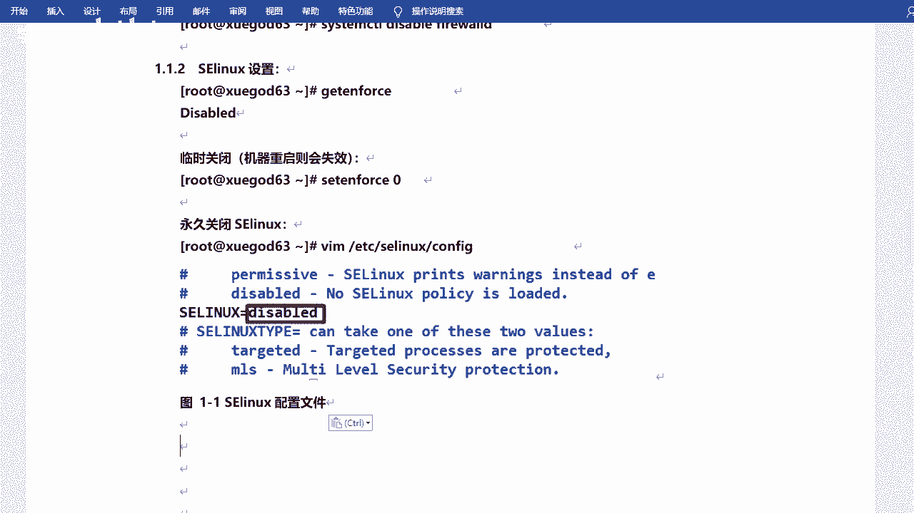

简单看一眼吧。EDC。啊，C呃，不是那个SElinux是吧，给这个，还有一个是谁，还是哪？听了吗？PDC。搞网了是吧。谁是给被告？还是10该。是不是这俩是一样的啊，给这俩哪个都可以啊，好吧。😊，呃。

然后当然你改完之后需要重启的是吧，需要reboot的啊。

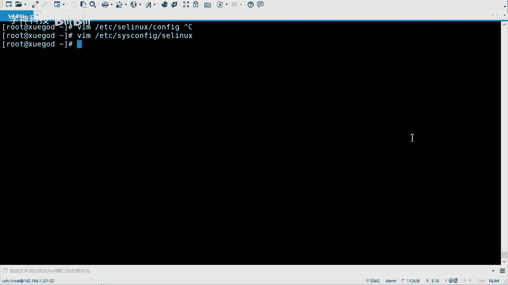

呃，然后就是配置IP对吧？配置IP啊呃，配置IP的话呢和8呢其实八也可以改配置文件，但是八的话咱们需要重启网卡的，是不是？然后七的话呢，咱们也呃咱们也是需要去改配置文件，改配置文件的话呢。

然后呢去重启这个服务。😊，好吧，重启服务啊，就是那个network。好吧，这里边咱们有network一个服务啊。😊。

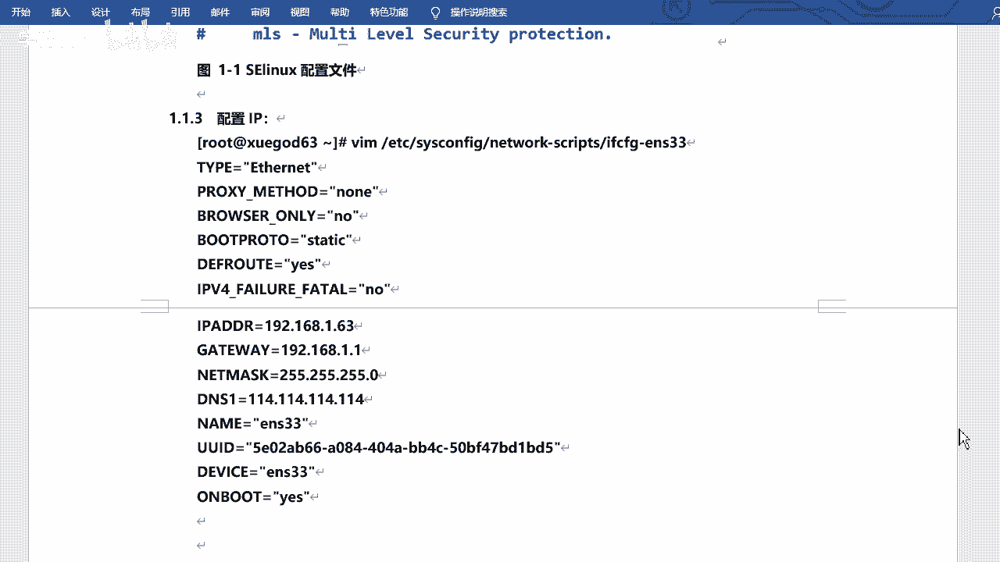

To network。是吧这个你给它重启，然后你的配置生效了，把里边咱们是一副down是吧，一副up这样子的，是不是心里边然话，咱们就用服务去去去重启就可以了啊。

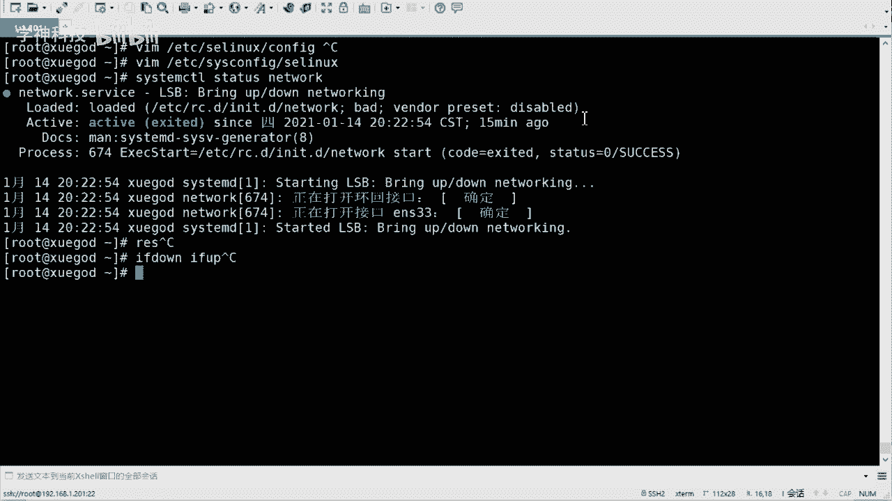

然后改的方式呢，其实呃主要就是嗯我简单标一下吧，是吧？主要就是这儿。bo for two啊获取IP的方式。C个就是静态的是吧？B的CB就是动态的啊。😊，然后如果今天的话呢，你要写上你IP地址。

网关掩码DNS对吧？这个需要写声啊，但是all boat一定要是yes的是吧？就是开机启用你的网卡啊。然后如果是DJCP的话，其实也行啊，DJCP也可以就是自动获取的。😊，是吧。

自动获取的啊这个但是这个呢它可能会变IP是吧？后期你去远程连接呀是吧？然后你还得老得老得去改那个啥是吧？老得去改那个那个。😊，呃，地址是吧？所以说咱们一般就是设成静态的就可以，好吧，静态的就可以啊。呃。

当然这个地址的话呢，根据你的A根据你的网段的情况是吧？有的可能是一网段的。啊，1。0网段，有的可能是0。0网段的是吧？啊，有的可能还是什么十啥的是吧？反正你是什么，就是你自己的也可以。好吧，你别说哦。

老师我和你的IP要设置一样，怎么你可以我不可以呀，对吧？因为我的网络和你的不一样是吧？所以说要要要注意一下啊。😊，对不对？这个之前。呃。第一段肯定也讲过吧，是吧？😊，不一样的地方就是去设置这个。

配置完配置完件之后是吧，然后重启服务啊，重启network这个服务。呃，当然它也支持NMCR的方式也可以啊。这个也给改是吧？当然这个改完之后呢，也是需要去重启network这个服务的。好吧嗯。Mmhm。

😊，这是网络部分啊网络部分啊。嗯，然后可以设置一个主机映射是吧？主机映射啊。呃，主建设这个呢需要修改叫housese文件是吧？house文件呢不单单是咱们linkux系统有的windows也有。

是吧我不知道你们有没有注意过啊，windows也是有的。这个呢主要就是1个IP和主机名对应关系。😊，运转关系啊，后期你去什么pin啊，或者你去用这个主机名啊，对吧？它都可以通的。啊，都是可以通的啊。嗯。

这里边咱们取的是写的是两个啊IP和主机名的一个关系是吧？呃，当然呃，目前啊咱们用的是一台机器，一台这个虚拟就可以了，是不是呃呃然后下次课的话，咱们就会用到两台。😊，好吧，然后嗯第二件的话。

咱们会用到有一台的时候，有两台的时候，也也有三台的时候是吧？到时候需要几台的话，我会提前跟大家去说的，好吧。😊，反正目前的话，最少你需要先装两台啊。嗯，这个。最好可以做一下是吧？如果你不想做。

这个也可以不去做啊嗯。然后就是改主机名是吧，主机名。😊，这个最好都有的啊主机名。因为主机名的话，你可以通过主机名判断你的这个这个这个主机是吧，你就不用看IP地址了，因为它都是loc host的。

你也不好分。如果说你有多台机器都叫loc host是吧，到时候你也分不出来。是吧嗯。😊。

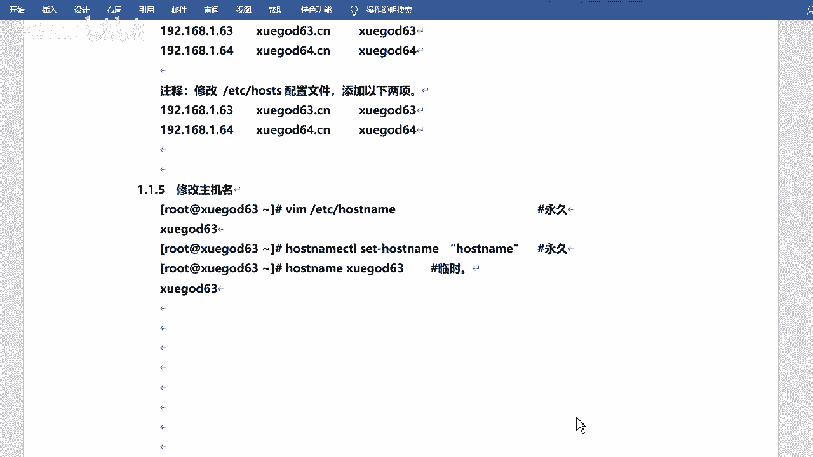

改主机名呢是通过ETChouse啊，这个文件可以改的。EDC house呃， house name吧 name啊。是吧这是主机名啊，然后命令的话就是hose name。CTL是吧？我这个讲的比较快啊。

因为咱们之前说过这个东西是吧？啊，set house name啊，叉叉叉是吧？然后也可以啊，也可以啊，这是永久改的，临时改的话，可以直接ho name，然后加上你的主机名，这样也可以，这是临时改的。😊。

是吧嗯。😊。

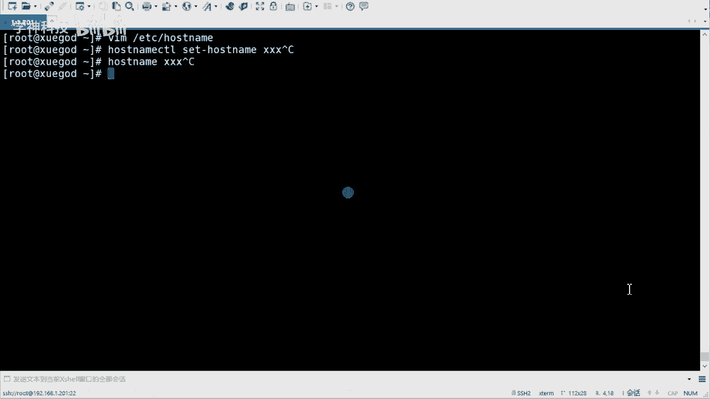

OK啊，然后这是主机名啊，然后是亚敏源。嗯。亚么园的话，目前啊咱们用的。一般通过本地的样本院就可以了。本地的啊就是光盘镜像的样本源就OK就可以。呃，但是呢呃后期会用到网络源，包括一普元是吧？

就是他们的包会多嘛，对吧？而且且版本比较新，嗯，所以说要要配置一个啊，要配置一个。嗯，其实怎么说呢？其实在咱们的系统，因为现在咱们用的s通S是吧？现在是stoS7啊。

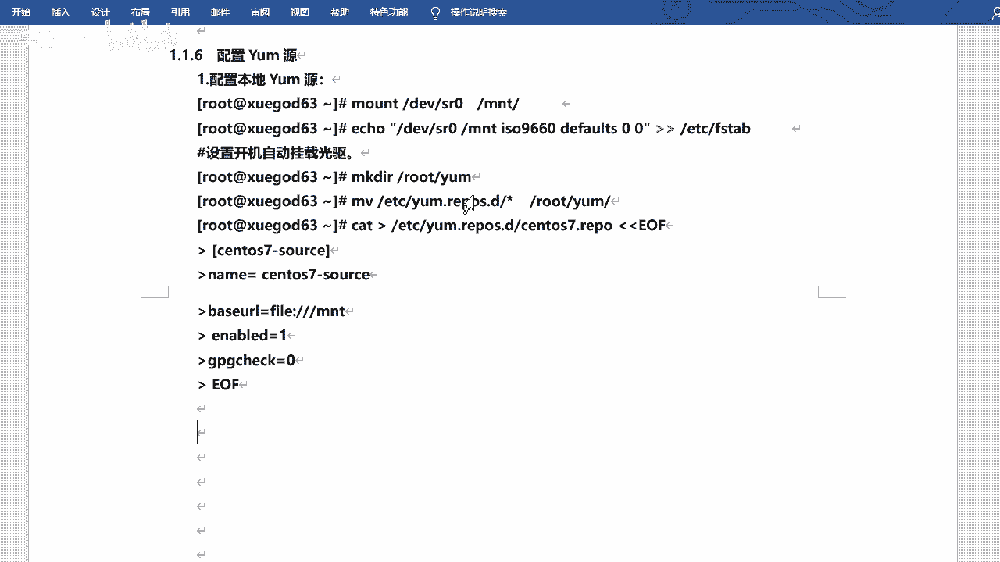

Right hand release。我是7。4啊是吧？你们可以装7。6的，7。8的都行啊。呃，它都给咱们配置好了，其实啊。对不对？这里边嗯它都是有的，自动S都是有的啊。

然后默认的话呢呃是可以直接用这个网络源的，但是我一般的话，你看我这种是吧，我就是给它呃改了一个扩展名，我就是给它相当于禁用掉了。因为我一般也不用这个网络的啊，我用本地的就可以啊。但是呢现在呃要配置的话。

你可以去配置一个。😊，好吧啊，不是配置啊，sorry，就是你直接用就可以啊，直接用就可以啊。然后伊普源的话呢，你把它放开。😊，把这个放开，就是保护缀明。我这个啊后缀明呃，就是还是得repo。

然后直接压inst。啊，然后e普就可以了。ele releasease啊。是吧就可以了啊，今天应该会用到吧，我看啊那我直接改吧。😊，我直接改一下啊。我把我这个恢恢复那个啊，sorry，我切过去。

我把它恢复成正常的啊。是吧然后ym rap list可以看一下。呃，网络源的话应该是有1万。一万几啊。17000还是17000啊，1500个包是吧？15000多个包啊，当然这个包含了我的本地的园。

是吧这是我本地有啊3800多个包。呃，然后有了之后你可以直接这。港位insstore。Epo EPL releasease。是吧直接装这个伊普源扩展员就可以了。是吧呃，扩展的话就更多了啊，扩展的话。

会会有29000还是多少个包来着？看一下啊。嗯。它会去同步这个缓存信息啊。

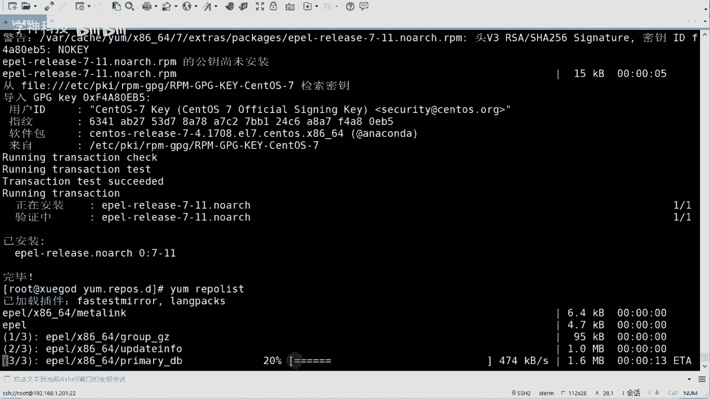

呃，当然咱笔记里边的话呢是用的另外的一个啊，笔记里边呃，这是本地源是吧？咱们应该都会啊。然后呃网络源的话，他用的是哎，这是还是本地的是吧？😊，网络的呢？啊，网络源的话用的是这个阿里的啊阿里的。对。

然后这这是国内的吧，是吧，会比较快一些啊，会比较快一些。啊，你看是吧，它是阿里的啊。对，然后。项目员。啊，然后装好之后的话呢，也是去直接装ele release。

是吧直接样么ins到一 release就可以了。嗯，对吧你看这个名字，阿里云点com。对吧咱们呃笔记里边是用的是阿里云啊，我这个我现在操作的话呢用的是。这个这个它自带的就是四S官网的源啊嗯。

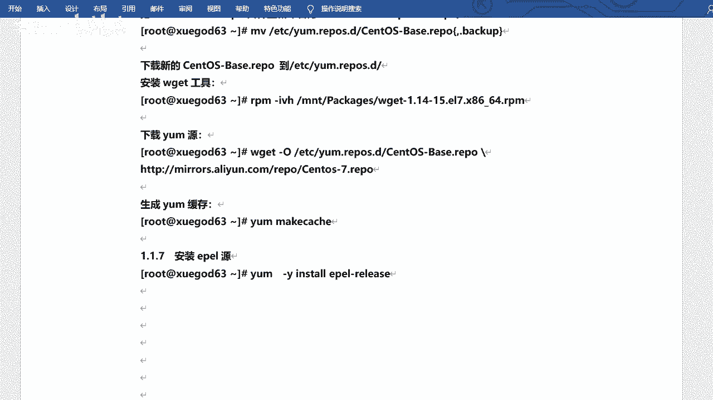

好啊，这边然后也出来了啊，然后包的话一共是有29000多个包。是吧你看看这个很多包证明就就已经成功了。

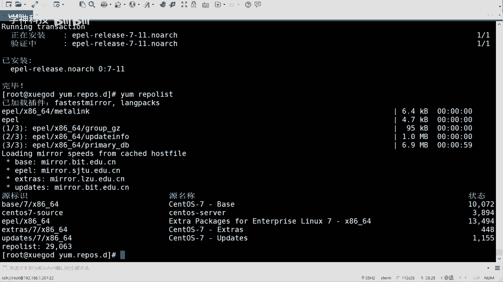

是吧证明就成功了啊。好吧，然后做完这一系列操作之后啊，那你可以做快照。😊，是吧可以做快照啊，后期呃，如果说去那个。做这个实验的话是吧，你可以快速恢复到这个当前这个快道啊，然后再去什么安装呀，配置啊。

是吧？然后再去呃坐箱的设置就可以了，好吧嗯。😊，快照之前咱们应该做快照啊，在第一进能的时候。😊，是吧第一段的时候当时也是说做好一个本地的样品园，对吧？然后什么防火墙嗯SE也是关掉对吧？关掉之后哎。

也是做了一个块照是吧？这个也可以做一个啊。😊，嗯。😊，如果说你不想做也可以啊，因为这个和咱们第一段不一样的地方，就是说它配置了网络源和一普源是吧？到时候你再单独配也行啊，也也挺快的。其实。嗯。

最好还是错一个吧，是吧？快照啊。呃，做快照的时候呢，可以关机做快照。是吧关座啊，因为关机的话，它占的空间还小一些。是吧开机会占的占的这个这个这个空间会比较大啊嗯。然后前面的工作做完之后。

咱们就开始这个服务了，好吧。啊，第一个服务咱们讲的是SSHD是吧？叫做远程服务啊，远程服务。其实这个服务啊是吧？这个第二个咱们讲的都是服务是吧？你像外b服务啊，像这个这个什么FTB的文件服务是吧？

什么数据库服务，这都叫服务。😊，对不对？都叫服务啊。呃，因为咱们学的是linkux系统是吧？linkux系统啊，它就是这个服务器系统是吧？为什么叫服务器呢？其实它里边跑的就是服务。😊。

对吧给用户去提供这个服务的，对不对？比如说咱们的外b服务啊，外b服务的话就是说别人可以访问你的网页。是吧啊可以去去点击啊，会可以去干嘛的，对不对？数据库服务可以去连接啊，可以存存储你的数据是吧？

那么SSHD服务的话呢，它就是用来远程控制的。好吧，远程控制的啊SSH服务啊，它使用的是SSH协议啊，可以用来进行远程控制，或在计算机之间传送文件。是吧呃相比较之前用tnet方式来传输文件，要安全很多。

因为tnet是明文传输SSH是3密传输是吧？这也又讲到了tnettnet的话其实也是一个一个一个服务，可以这样说啊，然后有些如果做过网络的话，应该知道啊，网络的话像一些交换机啊，路由器啊，是吧？

之前用的都是tnet啊，像我之前干的时候，那几年都是用的这个后来网络的网络的这个这个设备是吧？它也换到了SSH。😊，是吧这样去连接的，因为它是SS制的话是更安全的是吧？啊。

因为tnet它是明文传输SSH是加密的。对不对？当然这个是SSH呢，它是一个协议。啊，它是个协议啊，就是什么安全。啊，外壳什么的是吧？然后哎这样的一个协议SID的话，它是一个服务加了D之后。

它代表的是demon啊，dmon就是后台是吧？后台去运行的一个一个服务啊，是吧？它不单单是可以进行远程控制，远程登录对吧？然后它只是叫传输文件啊，传输文件的话，你像那个SAPP。😊，是吧这个命令用过吗？

SCP啊这个命令对不对？它就是用的是SSH这个这个这个服务啊，然后还有那个什么。😊，嗯，SFTB是吧。还有那个那个RSNC是吧，咱们下次可要讲的啊，这个他走的都是SS这协议。嗯。

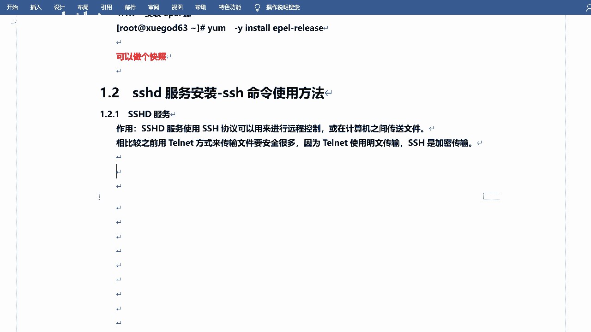

是吧包括咱们用的这个远程的什么呢？远程的这个工具。是吧远程一个工具啊，我用的是叉。😊，对不对？我不知道你们用的是啥啊，是吧？像这种工具，它也是呃支持SS协议的。😊，对吧啊。

你不管是什么叉 shellll啊，CRT什么final shell啊，还有什么atm之类的，是吧？它都是支持的啊，你们可以看一下。😊，这里连接的时候，它是不是让你当然咱们没有选啊。

默认它它用的就是SSH协议，看到没有？默认就是他是吧，输入你的呃IP地址啊，端个号，然后用户没密码，哎，我就可以连上了。😊，对不对？我就可以连上啊，是因为什么？就是因为它支持SS这协议啊。

当然这是客户端啊，这叫客户端C端，这叫是吧？cle端啊。😊。

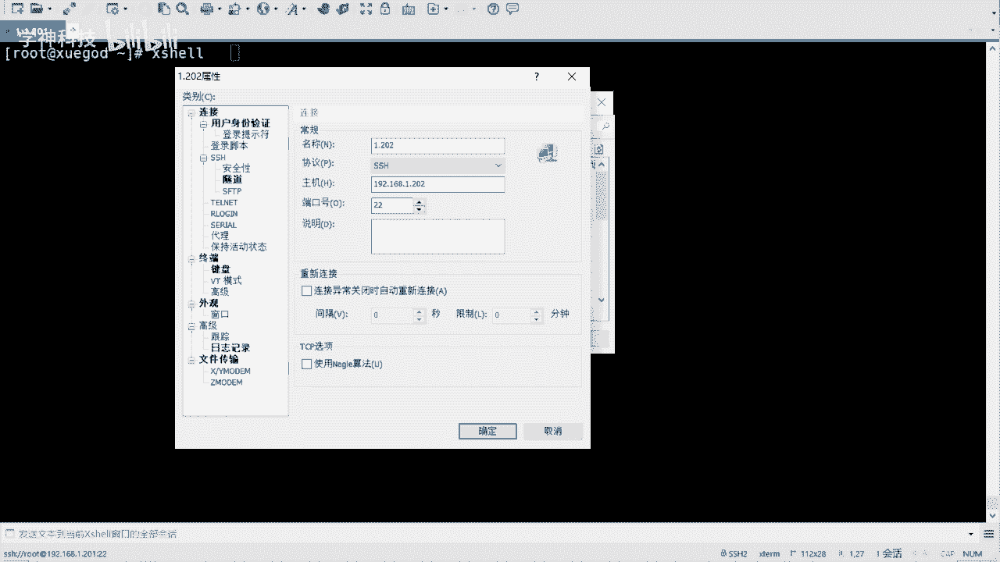

咱们是so服务的。对它支持SS这协议。啊，然后咱们这边呢是跑的是SSHD的服务，对不对？哎，那就可以连上来。是吧那你可以连上来啊。😊，对吧现在你们应该也就是用的这种工具去。远程连接过来的吧，是吧。

然后去那个操作的对吧？然后操作的啊，当然这个SSC这服务的话，一般情况下都是装好的。啊，一般的话它默认就是支持的啊，其实不管哪怕你是最好安装的啊，可能你有300多个包，是不是你的系统啊。

然后它也是支持的啊，你是这个带带图形画的，带桌面的对吧？它也是有的。好吧，当然你可以先看一看啊，咱们可以通过这个方式。😊，此实怎么推调？对吧控制咱们的这个服务啊，sters。看一下SSHD。

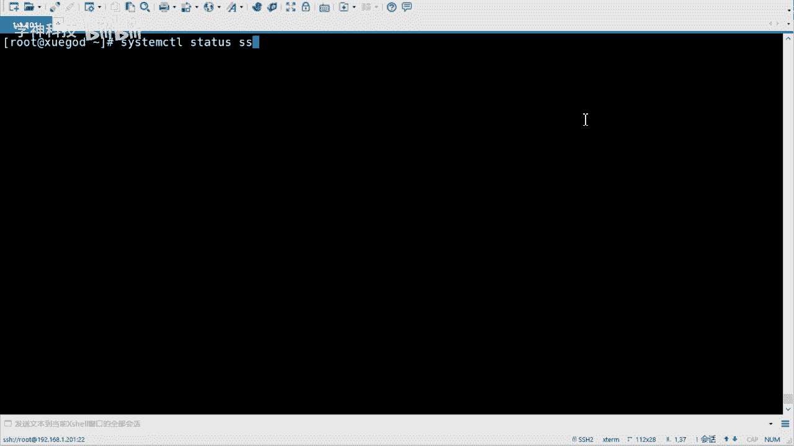

是吧它是不是运行的？对不对？那是不是运行了啊。如果没有装啊，咱们可以装一下啊，可以装一下。可以装这么几个包。行吧可以让么instopen SSH。啊。

open SI是cl和open SCC是serv这么几个包。是吧直接装就可以啊，或者说RPM的方式去装。对吧oppo SS是开头的包。呃，阿片N包你都可以装上。2是8你都可以撞上啊。

他的包的名字叫这个啊。

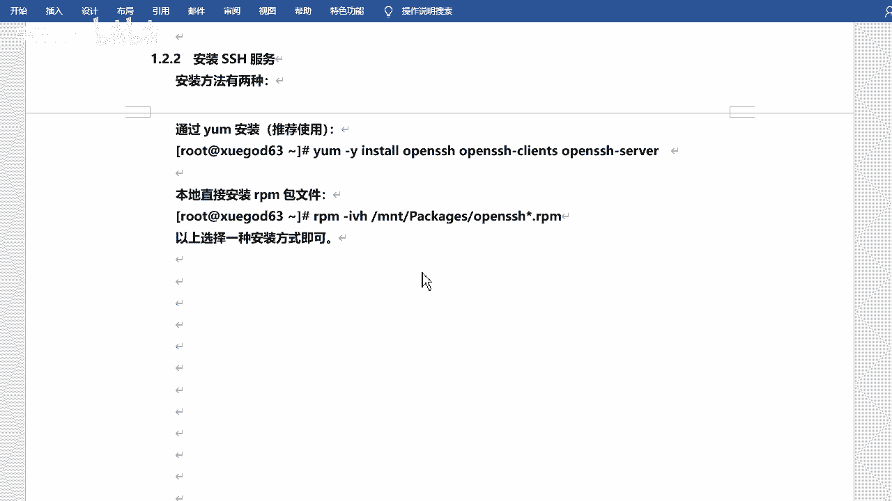

呃，然后。啊，这还写了一个说如果如何去确认是吧？嗯，RPM杠QA。这回忆一下啊，杠QA。是啥意思？是吧就是是不是你。你这个这个装供的包是吧，然后你可以检索。open S这个关键字对吧？它会显示出来。

对不对？当然你通过这个服务去看，它是running的，已经已经运行了是吧？那咱边已经装好了，好吧。

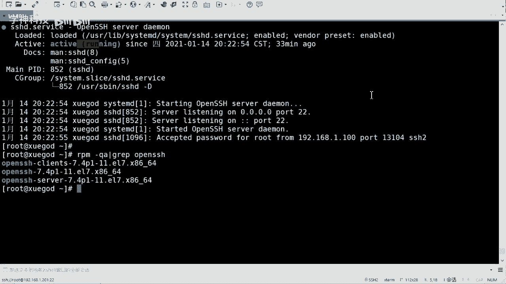

看3H啊，然后它会有一些配置文件。咱们去学服务的话啊，学服务呃会改很多的配置文件。好吧，会有很多配置文件啊，基本上你像一个服务是吧？它会对应一个配置文件啊，但是有的服务的话。

它可能会对应多个配置文件行吧？那咱们在第二阶段的话呢，就会。😊，看到看看到好多的服务是吧？然后就会改很多的配置文件。😊，是吧当然这个配置文件的话呢，你可以不用记。😊，啊，你可以不用记啊，什么意思呢？

就是因为咱们第一段去学的一些命令啊是吧？然后呃什么参数什么的啊，有同学可能会记。😊，是吧哎，我可以记住我这个参数是干什么的，对不对？然后后期用的话直接用就可以了啊，把它记在脑子里边是吧？😊。

第二就呢这些配置文件啊都都不用记。啊，你都别记因为太多啊太多啊，有的时候可能少吧，是吧，有几个参数改改什么数字啥的，是不是就可以就可以了。有的改的时候可能会写非常多的配置啊，这些你都不用记啊，好吧。

然后呢，你知道它在哪儿是吧，咱们在哪讲啊这个服务是吧？到时候你能找到它就可以。😊，啊，因为寄的话也寄不过来，确实也寄不过来，好吧，而且不同的这个服务是吧？他们之间的配置有的时候不太一样啊，没什么通用性。

😊，是吧而且有的时候比如说我去设置一个服务，咱们可能讲过对吧？咱们讲过，但是呢你回去工作中可能会用到另外的一个模块啊，另外的一个方式啊啊，这个配置和咱们讲过的又不一样是吧？嗯所以说你更不用记是吧？

到时候去会去查呀，是吧？会去搜啊，对不对？就可以了，好吧，就可以了啊。😊，对吧然后这有这有一些配置文件，可以简单看一看啊。😊，呃，SS是相关的是吧？这个这个也不用记啊，简单看一下就可以。😊，好吧。

进来看一下就可以啊，关键呢是有两个好吧，关键是有两个啊。😊，呃呃。这俩是一个吧，ETCSAC是。config啊，还有两个啊，一个是EDCSSH目录下的SHHconfig。

一个是EDCSS下的SSHDconfig是吧？这两个看上去是一样的对它有一个不一样的地方就在这儿。有一个有D。是吧有一个没有地。对不对？就差这一个字母啊，那们可以看一下啊。

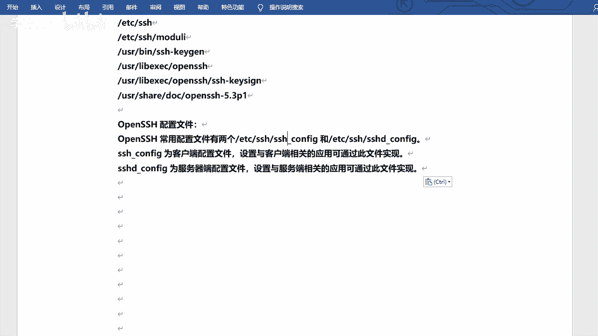

BT SSH SSH。很这个是吧？啊，然后还有一个是EDCSSHSSHD看这个啊这两个这两个的话呢，一个是客户端，这个是客户端的配置。这个是服务端的配置啊，当然咱们现在用它呢就的就是用的就是服务端是吧？

用的就是服务端啊，所以说咱们改的就是这个配置文件，好吧，这个你可以不用动。

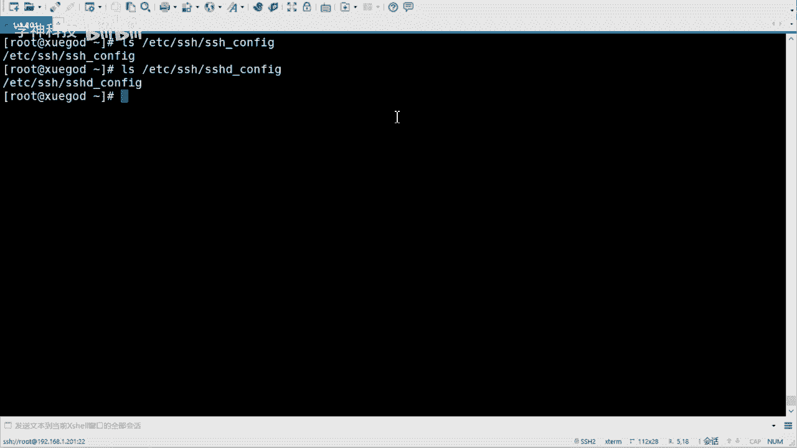

好吧，这个就不用多啊。就是加D的，好吧，就是加D的啊，SSHD跟fi个这个配置文件。行吧，然后呃服务的启动关闭是吧？这个其实咱们都操作过好多次了啊。就是什么重启restar啊，stop呃。

停止star启动啊，sters是状态是吧？敞开状态啊，然后设置开启动的话呢，可以用stem ctL enable是吧？这是咱们7啊，包括8一样是吧？咱们那个。怎么说呢？

咱们这个这个这个推荐去用的方式是吧？但是如果说你用之前的方式也可以啊，有些学可能用的6比较多是吧？甚至5啊更更更老一些的啊，那种的话会用到这个什么checkfi这样的命令，它也支持啊。

就是它是兼容之前的命令的啊。

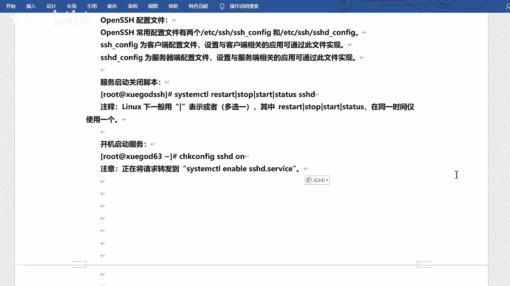

你比如说check那个是吧？SSHD啊，这个方式还是支持的。但是他会告诉你正在将请求请求转发到seastem enable啊，这个这个这个命令过来是吧？就是你执行这个命令，但是它会其实执行的还是它啊。

就这个意思。好吧，这个意思啊，包括service它也支持service。😊，service命令是吧，service。SSHD是吧，start。对不对，你看他也支持的。啊。

他同样会提示你说redirecting to啊 being system detailstar SSHD。是吧同样的它也是用的是s推加的方式是吧，去执行的。好吧嗯。对。

这个当然当然这是如果说哎老师我不懂这是啥是吧？这是7之前6啊5啊是吧，用的方式。如果说你不懂，哎，那你就记。

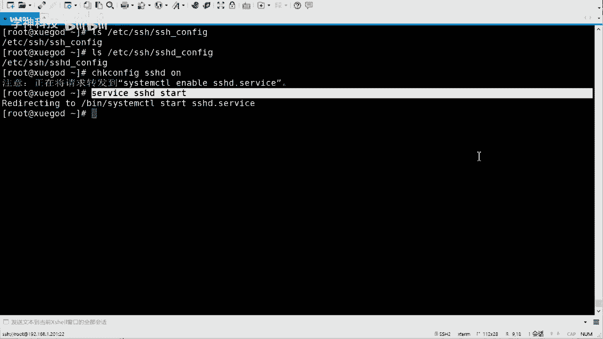

semCTL的方式就可以，好吧，就可以了啊。😊。

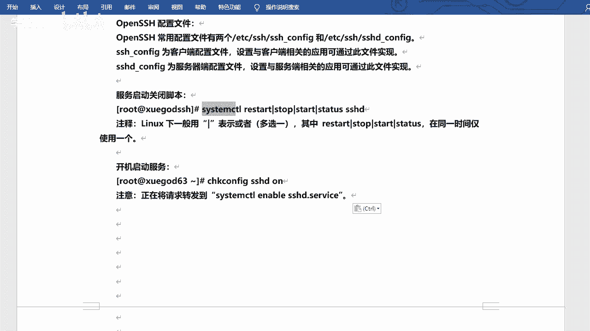