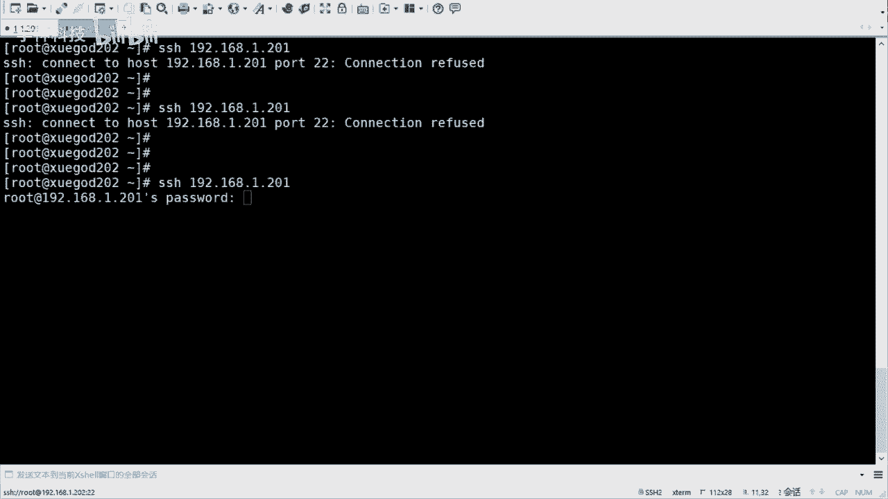

# 2021年RHCE／RHCA／RHCSA／红帽最新教程 - P3：使用fail2ban防止暴力破解 - 学神科技 - BV1Wi4y1K7g1

行啊，下面的话咱们来看一下防止暴裂破解啊。😊，什么叫暴力破解是吧？暴力破解的话呢，就是你比如说有有一个黑客是吧，想要去攻入你的系统，对不对？他会去。😊，找呀是吧他会去匹配呀，对不对？

比如说默认它用的是root，然后去去登录，对吧？然后他会去呃破解密码。😊，是吧密码的话当然可以很复杂啊，是吧？然后他会去一个一个试，对吧？这个过程中的话就做就叫做破裂破解。😊，好吧，就要暴力破解啊。

那么嗯SI这的话呢，咱们可以设置它呢防止暴力破解。😊，是吧防止暴力破解啊，或者说最起码你破解我的时候不可能说那么简单就成功了，是不是我们来看一下啊。😊，因为SSHD这个服务很重要，对吧？

因为它是远程连接的嘛，是不是？因为只有你的。怎么说呢？只有你的管理员是吧？有权限去去登录的是吧？那如果说有外人登录进来之后，他可能会用你的服务器干起其他的事儿是吧？有的会什么挖矿呀。

有的可能被当成肉鸡呀，对吧？但是这个是不是咱们要禁止这个这个这个东西的对吧？你们可以看一下啊，如果说你要防止暴璃破解啊，咱们有几个方法啊？嗯，第一个密码的话要设设置的足够复杂一些啊，就怎么叫复杂呢？

密码的长度要大于8位。😊，啊，小于20位是吧？因为这个方便去记忆啊，呃，长度是一方面，还有就是复杂度，复杂度的话要经常有数字大写字母和特殊符号啊，混合组成。这个的话其实是四种符号。啊，四种符号啊。

然后这四种符号呢，如果说你包含了三种的话，那证明你就是一个比较强的密码了。啊，比如说有的密码，有的同学可能喜欢把密码叫这个啊。password了是吧？是吧有这么用过的吗？这是他密码。对不对？

这个其实就挺强的啊，大写有了特殊字符有了小写有了数字有了，对不对？哎，这就是一个密码。😊，是不是这就是个密码，对吧？当然也可以用别的是吧？也可以用别的啊，对不对？这都行啊都行，但是尽量要要复杂。

就是尽可能多的去包含不一样的这个字符啊。但是字符要分范围，就是数字。😊，大家写字母和特殊符号。啊，到这不说啊，当然你可以设置很长是吧？你可以设置很长啊。如果说嗯当然太长也不好，因为太长的话。

比方说你可能会接到一个文件里边是吧？接到文件里边的话呢，你的文件可能被别人。😊，哎。窃取到是吧，然后又又又又暴露了，对不对？还有就是什么呢？还有就是你的密码呀是吧？

当然有有的比如说有很多机器密码的可以改是吧，可以时不时改，比如每隔一个月呀改S密码呀是吧？这个也可以的。😊，好吧，这也可以的啊嗯。😊，嗯，然后就是改端号，端口号的这个咱们刚才改过了是吧，改成其他的啊。

改成其他的啊。对，其实。😊，怎么说呢？通过密码也可以看出来啊，其实。😊，最不安全的是谁呢？是操作系统吗？是我的服务器吗？其实是人。对不对啊？人其实才是一个最不安全的一个东西啊。

有些可能如果看过一些什么电影，那个叫。😊，嗯，那个叫什么？哎呀，名字忘了啊，就是一个黑客啊，然后什么黑进的一个什么特别厉害的组织是吧？比如说五角大楼啊什么的啊，然后又出来了那个那个黑客。😊。

不是很容易帝国啊，就。😊，没有没有绝对安全的系统。对对对，那个啊。玩社会工程学玩特别溜心理学是吧？这个人才是最不安全的一个一个部分的。呃，账户号咱们改过了啊，然后还有就是禁止入户用户登录啊。

入册用户不允许远程登录。好吧，然后可以添加普通账号，然后去登录收益root权限，对吧？然后呢，就是不允许密码登录啊，这个也可以设置不允许密码登录的话呢，后期要设置密啊妙对是吧？来去来去登录，好吧。

来去登录啊嗯。😊，嗯hu。然后咱们来做做这个实验是吧，做做实验啊。😊，嗯，哎呀哇塞，今天还真得用到两台机器，那我再开一台啊。😊，因为咱们要去测试一下啊测试一下啊。我这边呢去开一再开一台啊。

人是最不安全的。嗯，然后我简单说一说吧，嗯看两台机的一台是服务端，一台客户端是吧？客户端就是去去去连接的啊，然后咱们要生成一个叫妙盾的东西。好吧。妙对东西啊，这个是什么呢？这个是一对公司要。好吧。

是一对公私钥啊，呃，公钥的话呢，其实他们都叫什么密钥啊，公钥私钥。其实你把它想象成就是一个钥匙和一把锁两个东西。公钥的话相当于是锁啊，然后一会儿咱们可以把锁传给你想去远程登录的机器传回去之后是吧？

然后呢你现在手里边握着钥匙啊，然后你就可以开两把锁了啊，然后你就不用密码了就这个意思啊吧，它会生成一个这样的一个一个对儿啊，密钥对。😊，嗯，然后。呃，行，然后6364这个是啊。

然后我给他开的是我的是202啊。

我有个机器是。学杠的一个是学杠的202，好吧。嗯，然后我在哪儿生成庙队啊，我看啊。嗯，他写的64，我就在202生成吧。怎么生成呢？SSH杠Kgan啊，这个是生成喵墩啊，生成喵墩啊，直接回车就行啊。

啊哦已存在是吧，那我删了吧。嗯。然后。啊，然后再生成一下啊，嗯当然这个你们不用做啊，你就直接SSH杠K根就可以了。我在这边生成了就不在这边生成。我这边可以吗？啊，那个可以嗯。行吧，直接回车就行啊。

当然他会说可以选择什么加密的方式是吧？一般的话默认加密就可以啊。呃，直接回车，直接回车之后呢，它会生成一个这个东西。😊，对吧这个叫什么print finger啊，关键指纹呃，其实它会生成两个文件啊。

就是在你的呃加目录下点SAC是开头的文件。是吧会有IDRC和IDIRC的pop这两个文件，这个就是公钥。好吧，列是公钥啊，然后我把这个公钥呢传过去。好吧，传过去传过去之后呢，我就可以去无无密码的登录了。

好吧嗯。

哎，这是过程啊。当然过程的话，我会有一些注释啊，你可以看一看。行吧这个其实直接回车就可以啊。哎，然后你可以看到这个喵墩。是吧然后传输怎么传输呢？传输的话呢，你可以用SCP传SCP传。

就是呃指定你的文件传过去。其实它会有这个什么呢？它会有这个特定的命令去传输的啊，叫SSH杠copy IDD啊，通过这个东西去传。

好吧，通过这个组形计算啊，然后可以加个参数叫高I是吧？呃，也不用加，其实也行啊，不用加，其实也行啊。😊，然后。传给咱们的是192。168。点1。202是吧，转过去啊。yes123456。好吧。

这样的话呢我就把这个公钥传过来。公钥传过来之后，你在这边可以看见啊。也是点SSH下边啊，可以看到会有个叫什么authize case，这个是叫做已认证的K是吧？你看传过来之后，它的名字变了。啊。

名字变了啊，然后我就可以直接去。这个这个这个这个传了啊啊，不是传了，直接登录了啊。叫SSH，然后是一件1吧。大一点。202是吧。你看。直接就连上了。对不对？就不用输密码了。是吧这叫这叫一个妙遁的登录啊。

对吧然后退出过来。是吧我从学盖的远程到了学盖的202，然后又退出。

嗯，这个直接登就行啊。嗯，咱们笔记的话可能写的比较复杂，因为它加了一个参数是吧？😊，加了一个刚艾的参数啊。这个其实可以不用加是吧？可以不用加啊。然后是什么呢？然后是这个呃第一次啊。

如果说你第一次去传输的时候，我这有提示吗？我看啊。

啊，也有提示还是这个啊，就是说你要你要去连接吗？yes就可以yes完了之后呢，它会让你输密码，对吧？你肯定得知道它的原理密码，然后才能去登的，是吧，才能去传的啊。😊，只要传过去之后。

那么你再去远程登录是吧？那就不用密码密码了。好吧，就不用密码了，这就是密码墩了。

对吧比叫喵墩啊，然后需要注意的是，如果说你的端口不是22的话。对吧那你怎么传呢？啊，你要加一个杠P这个断号传过去就可以了。行吧，这个也是叫刚T的啊嗯。Okay。好吧，这个就是咱们的一个什么呢？

一个一个呃。防止玻璃汇的方式啊，就是密码足够复杂，对吧？然后等括号修改。不允许入它选程登录啊，然后不让密码登录。当然其实还有其他的。是吧也可以用黑白名单。黑白名单。对吧刚才有同学提了一下啊。

什么house deny house low。文件是吧嗯嗯。啊，这个当然也可以，对不对？呃，还有像堡垒机是吧，跳板机啊，这个也可以。😊，是不是啊基本上反正其实方法挺多的啊，有的可能还会上一些。😊，嗯。

那个那个汇变那个叫啥来着？网银那个东西叫啥叫啥来着嗯？会变验证码那个。我这个声音想不起来了啊。啊，这叫叫叫什么来着？反正就是那个和银行那个很像那个啊，咱每隔几秒换一个码，每隔几秒换个码。对。

那个其实也有那样的啊，但是那个那个一般是需要花钱的啊。😊，嗯，对呃其实很多的，但是咱们这个基本上能用的这个就okK。就可以好吧就可以啊。是吧如果说你想再去。那啥一点的是吧，再去严格一点。

那就会有更多的方法。还有就是可以花钱嘛，是吧？花钱可以解决大部分的问题。😊，对不对啊啊，但是咱们尽量是吧？用的话还是用这种开源的，用的是自己的东西啊。😊，好啊，包括咱们讲的服务是吧。

其实也都是开源的服务。😊，对不对？行，这是用SSHD服务本身是吧，去做的这个防止暴裂破溅啊。嗯，然后呢可以使用工具啊，还可以使用工具，好吧，叫做feel to bed。这个东西啊这个也挺好用的。

是吧叫做feel to啊，然后来进行防护啊防护啊优点是使用简单灵活，功能强大，对吧？为什么要用它呢？是这样的啊，因为。呃，比方说我的服务器在被别人破裂破解，虽然团没有成功，但是呢。

但是呢会导致系统负载很高。为什么会这样呢？因为你像咱他呃咱们去登录或者暴力破解的时候啊，好吧，然后呢它会有一个认证的过程。😊，对不对？你的用户维密码是不是匹配的呀，对不对？服务会呃系统啊会去这个啥的啊。

系统会去这个检检测的是吧？那么检测的话呢，这个是需要资源资源的啊，包括你的CPU啊还是内存，是不是它会去检查，对吧？那一个两个无所谓，是吧？如果有多个的话，或者持久的话，那它会消耗你的系统资源。😊。

增加额外的开销是吧？导致你的公司的网站就访问。不唱。对吧因为你的系统都跑不起来了是吧，是吧？然后你的网站它可能也运行不起来嘛，对不对？所以说这时候呢可以使用fe图 by。fe图办呢可以监视你的系统日志。

然后呢匹配制错误信息执行相应的屏蔽动作啊，然后他会去设置策略。比如说我允许你来连接我，或者允许你错误的连接，就是密码不对啊。几次之后，如果说还不对，那我就会阻止你。😊，让你停一停是吧，停停啊。

歇一歇是吧？然后如果是外人嗯，如果是坏人的话，那你就停停一会儿，停了一会儿再不对，那你再停一会儿是吧？这个时间可以设置的啊，好吧，哎，加到防火墙，让他然后让他去干嘛呢？然后让他去那个那个暂停访问。😊。

好，暂您访问啊。😊，是吧。就是fe图盘啊，其实有一个和它很像的叫。😊，也有一个和他很像的啊，叫那个。嗯，host啥来着？也是个工具啊，其实和它很像。但是feel图的话其实它更强大。因为fe图的话。

它不单单是可以保护咱们的SSHD的啊，还可以保护一些其他的一些服务都可以。😊，是吧都可以啊。😊，嗯，然后的话咱们就可以装一下啊，装一下这个feud。嗯。他这个的话要求Ppython版本要大于2。4啊。

这个一般的话都是大于的啊。

Pthon啊嗯pathon。光打VE是吧，看一下啊，这是2。7的，没问题啊，然后呢就可以直接去亚门安装了。好吧，因为咱们配了什么网络源，e普源都配好了。那么配fe man的话，就在这个epo源里边啊。

直接装就可以。😊，你看是吧也没几个包啊，这是三个4个是吧，四个包哎就装好了。

好吧，直接装就O啊。优会员咱们刚才一开始就配好了是吧？如果说你没配好的话，你在这儿也要去配一下。😊，好吧，给它配一下啊。嗯，它有几个几个文件是吧，几个文件啊，主要的话就是这个叫ji点com，主要就是它。

只有点c复啊，这个是什么呢？这个是呃是咱们策略的。好吧，这个是咱们策略的啊，就是可以去啊阻止啊是吧，阻止多长时间呀是吧？错多少次啊，哎，在这可以去设置，好吧，在这可以设置啊。😊，呃，这些。这些可以快。

好那一个就行啊。这个是最主要的。好吧，他会在ATTCEC下边会去。

产生这些文件啊嗯。嗯。ETC下的叫fe to bed。在这儿呢嗯好吧，在这儿呢啊。😊，在这儿是吧，主要就是它。

好吧，这就是他啊。O然后咱们设这个什么策略呢？嗯，咱们可以先想好啊先想好啊，比如说我让他怎样呢？我让他在三5分钟吧。😊，是吧5分钟之内，如果说三次密码验证失败，那么我就禁止这个用户IP访问1小时。

就是1小时之内，你是不能连我的。好吧，1小时之之后然后去自动解除啊，然后用户的话可以重新登录。如果你再错的话，那你就再等一小时。好吧，再等一小时啊，好吧。😊，呃，然后这个动作文件和日志匹配文件啊。

这个不用做任何修改。看到没有？不用做修整和修改，所以说你不用动它。啊，所主要做的话就是这个ja co。主要就是它啊，然后启动SSCD服务的日志分析指定动作阈值就可以啊，你给它设置一个值。

设置一个范范围是吧？哎，如果它超过了，那就禁止它。好吧，就进止上啊就可以了，好吧就可以了啊。😊。

嗯，那咱们来看一下啊。😊，设置一下啊。ETC。field半下的叫做GO点com。呃，这个的话咱们找一下啊，找一下SSHD。嗯。我看他在哪啊。pro的啊，在这儿就是这个。就是这个啊。在这里边去设置好吧。

在里边去设置啊，然后还有别的地方吗？啊，就这个。然后咱们可以简单看一看，它还有其他的一些服务，它支持其他服务的。嗯，你看HTTP的服务是吧，它也可以保护啊。当然目前咱们不会涉及到啊。嗯，阿发奇的是吧。

这都是阿87的。呃，NG是吧，它也可以保护啊，但是咱们现在就是是它SSH的一个保护。行吧，就可以了啊，就可以了啊。然后下面咱们去添加一些配置啊，这个配置的话需要咱们去添加的啊，那需要咱们去干什么呢？

需要咱们去写一下啊，加一些配置，然后加的比较多是吧？然后我就直接给它复制过来了啊。😊，从这个SSHD是吧，这个模块啊，下面的backend后边去加enable true啊，就是鼠标要启用。

后边会有这个这个提示的啊，就是那个注释的啊。filter啊什么策略SSHD的策略action啊，动作加入到防火墙。对吧这个方向它用的是IPTbo啊，然后sin没有啊，要不要发送邮件是吧？这个其实。😊。

对吧这个其实也可以不用发，也可以发，你可以发给你能收到的邮箱也行啊。😊，然后log pass log pass呢是它的日志文件，好吧，日志文件日志文件呢这个是咱们哇下log一的sq啊。

这个是咱们SSHD服务的日志文件啊，我们可以看一下吧，看这个吧。😊，log下载啊，然后sec好吧，log的话就是存放咱们日志的一半，对不对？然后seccurre的话呢是针对SSHD服务的啊。

它不叫SSHD点log啊，这个需要注意一下是吧？因为有的同学可能认为认为一般就是点log呗，是吧？但是其实不是的啊。😊，啊，然后它叫sure。嗯，可以可以简单看一下吧，比如te吧。嗯，他有那个那个那个。

N210。他会记录下来，就是你你SSH的一些。操作啊，不管成功还是失败是吧，它会记录的啊。嗯嗯，你看。received什么dis就是取消链接啊，这是取消链接的。

登录的话是accept acceptedp key。from rootot from1。201，然后端口，然后SSH过来的，就是他接收了一个公公钥是吧？然后去去登录过来啊，登录过来啊。嗯，等等的吧。

这个地方是accepted password啊，接受了一个密码，然后登录过来的是吧？当然是成功的啊，如果不成功的话，它会提示什么arrow啊啊或者field呀相关的关键字。😊，好吧，相关的关键字啊。😊。

呃，其实这个feud呢，它也是监听的这个日志。

是吧你再就是他看看有没有那个那个报错是吧，有没有错误啊。我把这个写一下吧。嗯。呃，然后配置啊。

是吧lo个pas啊，然后下边的话是比较主要的啊，下边。这个怎么给我注释掉了呀？我把它放开啊。哎。行。这个叫ban time是吧？ban time ban time的话代表是禁止时间。

如果说它没有成功是吧？没有登录成功，那就禁止。3600的话代表是秒啊3600秒啊，就是这个这个一小时是吧？一小时啊。然后新版本的话应该支持那种小时的方式，就是EH，然后都是M分钟，它都支持啊。

你可以试一下啊。然后fan time呢300，这个是秒，这个是5分钟是吧？就是在5分钟之内它会让你最多尝试mtract，最多尝试这是3次是吧？三次密码失败之后，那就那就会禁止一小时。😊，好吧。

就这个意思啊这个意思啊。😊，行，那咱们下来之后呢。呃，启动一下，它让它生效是吧？启动一下这个服务啊。😊，start一下feel back。😔，对吧然后C蹭退掉。你内ble一下啊，对有。😔。

Field bit。😔，OK然后咱们。来试一试好吧，来试一试啊。比如这边的话呢，我去登录一下啊。嗯，SSH。A1下2。18。添1。201。是吧然后我输错就故意的啊。嗯，三次了，对不对？然后我去连接。啊。

我写的是三次吗？还是5次？再试一下啊。嗯，等会啊。刚才是因为什么呢？刚才是因为配置文件里边是吧，有注释啊，然后我给它删掉了。EBC呃。飞如图案。只有。对吧刚才是因为后边有好多这个注释的啊。

删掉它就可以了啊。行吧，然后呃你的配置文件里边的话会去。如果说呃错的多的话是吧？就是5分钟错三次啊，它会有一些fe这样的关键字。对吧fe有的这样关键字的话呢，它会去检索。想想到，如果到达一定次数。

比如说就是三次或者更多是吧？那他就不能连接，不能连接的话，最后最后的结果就是说他会直接拒绝你，他不会再给你输密码的机会了。😊，对吧总你你看这就直接。Refused。对不对？直接resive啊。

这个你只能等着了，好吧，等一小时再再再再去那啥啊，再去尝试。呃，当然咱们可以通过beds去看啊，防火墙去看。呃。是吧会有一个叫F to BSSH这样的一个。呃，这样一个策略是吧，在这儿啊就不就不行了。

行吧，就不行了啊。😊。

嗯。这个这个这个是注释啊，这个需要注意后期你们做的时候是吧？然后不要加这个东西啊。是吧不要这个啊。然后下面是咱们的规则。ok啊。规则，然后去连接的话，故意输错是吧？三次以后啊。直接就refuse好吧。

直接就拒绝你。嗯嗯。然后通开PTbo你也可以看见是吧，你也可以看见啊。

好，然后还可以怎样看呢？还可以通过feel图去看。😊，F to办。fe to bad啊。这个这个叫clet啊sters。状态啊它会提示说呃只有啊就是你的这个拒绝里边有有几个啊，然后具体去看的话呢。

就可以加。呃，tters然后我SSHD。去看好吧，然后他会。说总共feilled了多少次啊，总共feilled的话呢是15次。对吧十0遍15次啊。

然后当前禁用的是一个currentlybanded的是一个。total班地的总共禁止的是一个，然后IP地址是他。对不对？当然如果有多的话，它会有多个IP地址给你显示出来的啊，给你列出来。😊。

好吧，嗯就是feel图去看啊。就是你能看到是谁在。是吧是谁在暴力破近？对不对？玻璃赔给你啊。好，可以通过这个命令去看的啊。嗯，然后。在这儿在。在这儿再看一下啊。在这再看一下啊，需要注意的两点啊。

我直接把它拿过来吧。需要注意一点点啊。然后如果说后期需要把IP table的星空或重启的话啊，然后也需要把fe图范重启一下啊。如果修改这个SSH端口的话，是吧？fe图范来监控SSH需要修改配置文件。

是吧需要改配置文件啊，就是这个gell点c，它也有port。啊，action那个地方action那个地方啊port。就是之前是什么port等SSH是吧？你把它改成你改后的端口号就可以了，对吧？然后重启。

😊。

是吧，然后重新就可以了啊，然后还可以从黑名单中去移除IP啊，所以 clients SSHD安banIP安banI是吧，就是把谁移除掉是吧？咱们可以试一试啊，这可以试一试啊。移图我是1。20。

提要。202对不对？1。202啊。1。202。然后呢，我再去连接。你看又可以了。对吧就可以了啊嗯。好吧，这就是feelto，防止爆裂破解啊。

