# 2021年RHCE／RHCA／RHCSA／红帽最新教程 - P5：rsync介绍-同步单个目录 - 学神科技 - BV1Wi4y1K7g1

来啊，今天是咱们的第二章是吧，第二段第二章啊，呃23C加sthink实现数据的实时同步好吧，嗯，也叫的备份是吧？同步也是备份啊。呃，首先咱们认识一下什么是23NC是吧？然后如何去安装啊。

包括2NC加sthink实现实时同步是吧？啊，包括咱们后边的实战啊，呃，通过S呃使用SIC纸进行23C的数据备份啊，使用23NC服务进行数据备份呃，然后实时同步是吧？这个是今天的内容好吧。

还是还是挺多的是吧？还是挺多的啊，呃，咱们先认识一下23C好吧，看一下它啊，它呢就是做这个什么呢？做这个同步的，好吧，同步的啊，然后它可以是当成命令去使用啊，然后也可以是当成服务去使用。行吧。

咱们今天这两种方式都会去讲的啊。😊，嗯O。🤧好。看一下啊，嗯，RRCC的话呢是linux系统下的数据镜像备份工具啊，使用快速增量备份工具。remote SNC可以远程同步啊。呃。

remote SNC就是RSSNC。好吧，相当于一个缩小啊，remote就是远程的意思是吧？😊，远程同步啊，可以在不同主机之间进行同步，可以实现全量备份和增量备份啊，就是完全备份和增量备份啊。

不可以保持链接和权限啊，就是你的文件的啊传入前来进行压缩啊，因此非常适合用于呃加购其式备份或异D备份等应用啊，这个它是可以的，好吧，它是可以的啊，这个是SNC是吧？其实呃还有一个单独命令叫SNC啊。

不知道你们有没有敲过啊。

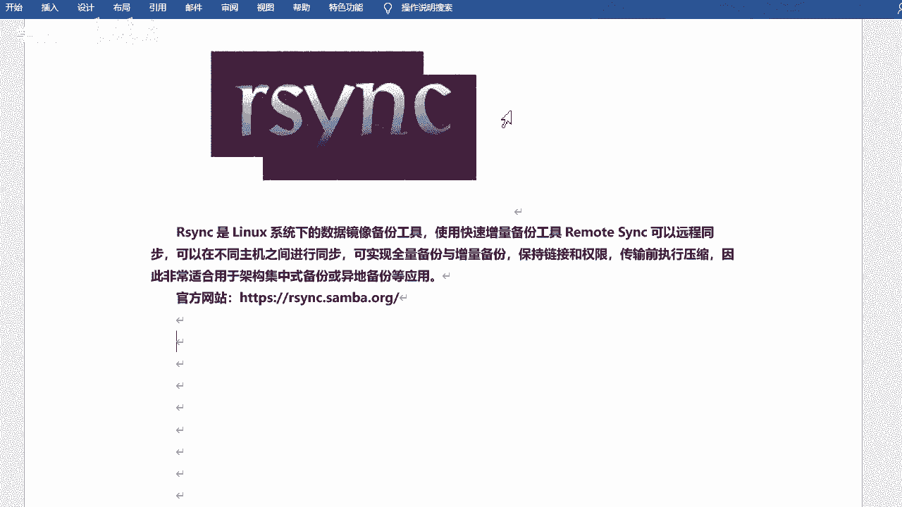

角SNC是吧？这也是个命令，对不对？这也是个命令啊，这个呢是把你内存中的数据同步到硬盘的。是吧比如说你内存里边的信息啊，数据还没写到硬盘的话啊，你可以手动去同步啊，同手动去写入啊。

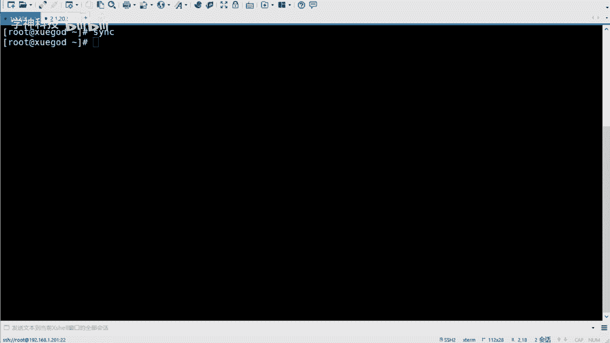

嗯，23C的话呢，它就是去做这个备份和同步的。好吧，然后呃当然了，其实嗯除了23C是吧？咱们上节课啊也提了个命令就是SSCP还记得吧？对吧SCP啊呃SCP的话呢，它也是可以去备份的。

是不是也是可以去传输的啊，对不对？啊，但是呢呃肯定23C会比SCP要好很多啊。首先SCP的话无法去备份大量的数据啊，类似于windows的复制啊，它就是一个拷贝的功能，对不对？当然呢它也可以去拷贝呃。

到远程主机是吧？这个它是可以的啊。😊，是吧而RC的话呢可以边复制边统计边比较。是不是它是一个专业的啊，就是专门去做这个同步的，好吧，专门去做同步的啊。这是简单的一个比较啊，然后更多的话就是这个啊RNC。

😊，在这儿啊。哎呀，这个格式有点不一样啊。行，这样。因为这个格式咱们还是统一比较好看一些是吧？这样啊。呃，它有什么特点呢？它可以去镜像保存整个目录数和文件系统。对吧就是它可以去同步整个目录啊。

然后可以很容易的做到保持原来文件的属性、权限、时间、文件链接等等啊，这个它可以去帮你去保持呃，无需特殊权限即可安装啊，就直接装就可以啊，快速第一次同步的时候，RSNC复制全部内容。

但在下一次只传输修改过的文件是吧？也叫做那个增长备份是吧？要这个啊。呃，压缩传输SNC在传输数据的过程中，可以实时实行压缩及压缩操作，因此可以使用更少的这个带宽是吧？这个其实是它在传输前去做的。

而不是说一边传输一边去压缩的啊。然后按键镜啊可以使用呃SCPSS等方式传输文件啊，其实它走的这个协议是吧，其实还是SS是协议的啊。当然也可以通过直接scon的连接啊，选择性的保持for链接一行链接啊。

和这个就一样了。好吧，和这个就一样了啊。是吧这是23C的特点，对不对？它的作用就是去做这个备份的。好吧，可以去备份咱们的这个数据，是不是包括你的文件呀，对吧？你的目录呀啊，你目录下边的所有的数据啊。

是吧，它都可以去同步的。好吧，那23C的话呢，它支持两种备份的方式啊，叫做。文具备份和差异备份是吧。啊，不是啊，增养备份啊，咱们可以来看一看啊。在这儿。呃，在这咱们有写是吧，它支持这种方式的啊，呃。

简单来看一看是吧，简单来看一看啊。😊，嗯。完具备份这个比较好理解，就是玩机备份的话，它会去备份所有的数据。好吧，它会备份所有的数据啊，那差异备份的话呢。

每一次备份和第一次完全备份相比较的差异的这个数据啊，这叫差异差异备份。对吧就是他每一次的备份，他会和第一次去做这个对比。你看这个。看那个图啊，这是原始数据，然后去备份。对吧然后原始数据第二天新增的啊。

这是第一次拆异备份，对吧？然后原始数据第二天和第三天新增的，他又去备份了一下，相当于第一天备份呢，他又备份了一次。是吧然后哎这样去累加的好吧，这叫差异备份啊。然后增量备份的话呢，是这个除第一次备份以外。

每次都指备份增长的数据。啊，原始数据备份是吧？呃，第二天新增的呢，它只会去同步第二天新增的是吧？第三天新增的呢，它只会去同步第三天新增的。好吧，这是这是几个备份方式啊。

什么完全备份差异备份和增量备份对吧？R3C的话呢，这支持这种啊叫增量备份。对吧就这种。增量备份好吧，就是你有不同的话是吧，他会去给你去同步啊，他会给你同步。它对比的话是你上一次的一个一个备份的过程。

好吧。好吧，呃，这个知道就可以啊，是吧，这是几个呃备份的方式的一个一个一个对比吧，是吧，一个对比啊。😊，Okay。然后咱们来使用它一下是吧，使用它一下啊。呃，今天的课程咱们会用到两台机器啊。

一台是备份端啊，一台是这个呃源端是吧？就是你要把你的数据备分到哪儿去，好吧，这是两台机器啊。😊，来，咱们来看一下啊。2儿3C。嗯，呃，它的运行模式和端口是吧？呃，它使用的是CS模式。

客户端服务器的模式啊，实际上是一个点到点的传输，直接使用SNC命令也可以完成。就是你不一定非得去跑这个服务。你可以把这个呃SNC当成一个工具去用一个命令去用，也可以，也没问题。对吧呃。

如果说当成服务区用的话，它会接定端口啊，端口的话是873。813单口啊。是吧然后呃有几个名词是吧，咱们会用到两台机器嘛，是吧？两台机器啊，那么你得把这台机器分开。😊，是不是哪一台是数据源端啊。

哪一台是我要备份的是吧？呃，当然这个这个怎么说呢？呃，他的这个叫法可能不一样啊，但是你要分清楚就可以了。有的是什么叫发起端备份端啊，有的叫服务端和客户端。好吧。

这个其实反而啊用客户端和服务端这种方式去解释的话，呃，反而不太好理解啊，你就以数据为这个参照物是吧？你的数据在哪儿，然后通步到哪去。哎，这两个你分分开就可以了。😊，好吧，这两个你分开就可以了。

因为有同学每当学到这儿的话是吧，可能会搞混，对吧？这就是因这因为咱们这是第二阶段第一次用到两台机器嘛，是吧？啊，上一次用的话，是因为简单咱们那个什么攻击了一下是吧？简单测试了一下啊。

今天是真正的用到两台机器。😊，行吧呃，我来说一说啊，发起端是吧？发起端的话呢负责发起R3C。同步操作的客户机叫做发起端通知服务器，我要备份你的数据啊，备份源啊。

负责响应来自客户机23C同步操作的服务器叫做备份源是吧？需要备份的服务器。对吧这是什么发起端和备份源端啊，然后呢，还有就是服务端和客户端。服务端的话呢，运行23CD这个服务啊。

当然这个是肯定肯定运行的啊，一般来说啊是需要备份的服务器。好吧，然后客户端的话呢是存放备份数据啊，就是相当于这个是源端啊，这个是发起端。是吧你看是不是先讲到这儿的话，有点有点有点懵啊，感觉。对不对？

所以说他这个呃虽然说这是一个怎么说呢？比较官方的是吧，比较正式的一个解释啊。但是呃如果说你分不清是吧，你就以数据作为参照物，还是再说一遍啊。是吧你的数据在哪儿，要同步到哪去就完了。好吧。

你不用管它的服务是吧，在哪起着啊。😊，好吧，因为这个这个服务其实比较比较特殊的啊，这个23NC嗯。嗯。对吧呃，那为什么说它会有发起端备份端啊，什么输什么这个这个啊服务端客户端呢，是吧？

而且有的时候可能会搞混呢，因为你的这个数据同步的方式啊，它是分这个叫推和拉的方式。😊，是吧就是你可以把数据这个推过去，你也可以把数据拉过来。这样的话呢相当于是一个双向的过程。😊，是吧双向的过程啊。

就是我既可以去这个这个呃同步是吧？我也可以接收啊，是这个意思。😊，好吧，这个就看它的一个方式了。当然咱们大部分情况下，一般都是这种拉的方式啊。好吧，它支是两种啊p推克拉是吧？

push和p推的话就是一台主机负责把数据传到其他主机啊，然后服务器呃服务器开销比较大，比较适合后端服务器少的情况。呃，拉就是所有主机定时去找一台主机去拉取数据啊，可能会导致数据这个缓慢是吧？

这个看情况啊。好吧，看情况啊，其实一般的话是这个呃就是我去同步啊，然后我去把我的数据是吧，然后发给我的备份端啊，这这者是一个比较常用的啊。对吧你看推的话是呃目标主机啊，配置为R3C的服务器是吧？

原主机周期性的使用R3C命令，把要同步的目录推过去。啊，需要备份的机器是客户端啊，存储备份的机器是服务端。对吧你看是不是现在有点更懵了感觉。对吧啊拉的话呢是原主机为这个23C服务器啊。

目标主机周心呢是用23C命令，把数据把要同步的目录拉过来啊，需要备份的机器是服务端啊，存储备份的机器是客户端。你看就是他们俩颠倒了。是吧就他们俩颠倒了啊，这有个图简单看一下吧。这个图。啊，p和push。

是吧嗯，这个是什么呢？这个就是拉。啊，我从我从这个服务端拉取数据。啊，然后这个就是推啊，我给。啊，这个下面下边是推啊，上面是拉是吧？X从123拉数据，Z从ABC拉数据啊。

推的话是YY把数据推给XY这样的当然这个可能没有没有箭头是吧？就这样啊。

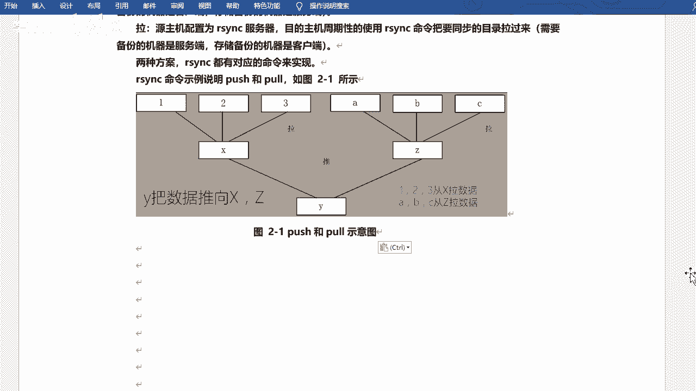

拉的话就是这样呗。就是。这样。是吧。推的话就是这样。对吧这个这个这个应该你能看懂了吧？这个可能画的不太好啊嗯。好吧，就这样子啊。

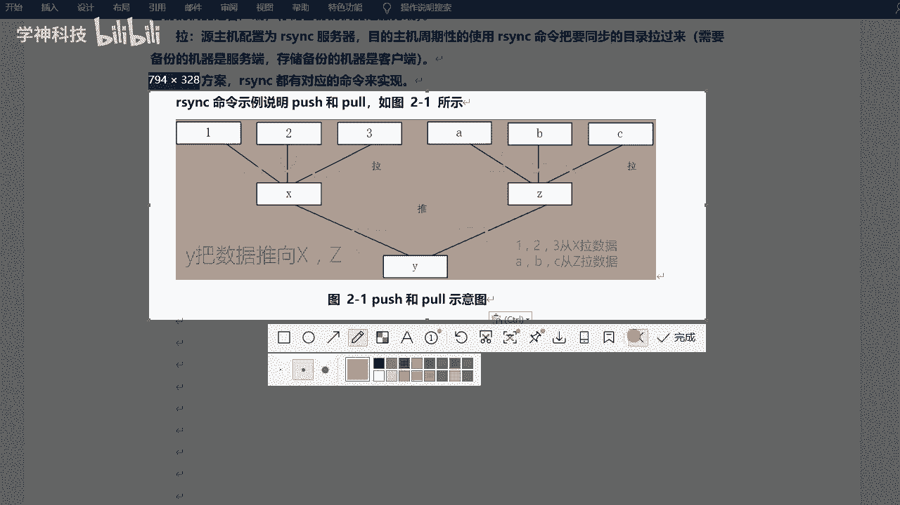

就是方向问题嘛是吧，方向问题啊。😊，OK啊，然后嗯但是如果说按老你老师你讲的确实有点是吧？确实有点混淆啊，或者有点懵，对吧？别着急，一会儿咱们做起来，其实你也能明白，好吧。目前看的话，只是纯理论。

纯讲的话，可能你你搞不清楚是吧？一会儿就明白了啊。😊，嗯，然后这是23C啊，然后23C的话呢，在区系统之前，它是受管于新奈地这个服务的啊，就是一个守护进程是吧？受管于这个啊，但是现在的话就不就不用了。

它可以单独去去去执行的啊，单独去运行的。好吧，就是如果说你用6的系统的话是吧，那么你要多装一个服务叫做新代地啊，上节课咱们其实讲用那个tnet的时候也简单说了一下，对吧？那其以后的话就不用了啊，是吧？

它是单独运行的新态地的话，它就是一个呃怎么说是个管理阶成啊，它可以去管理一些呃比较简单的服务啊，像什么TFDP是吧？R3Ctnet对不对？后来的话就就单独出来了啊，不用它去管理了。行吧。

所以说咱们就直接去装RSNC就可以了。好吧，直接去装就可以了，你就不用装它了。行吧，不用抓它了啊。

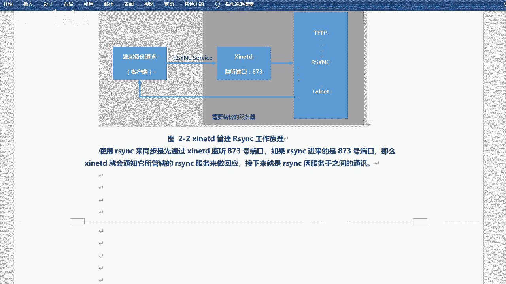

OK然后咱们可以看看有没有装啊，其实默认的话一般都是装好的，好吧。😊，呃，要意思吧。2S问Z是吧。你看已经装了啊，这边我也看一下啊。我用了两台机器嘛，是吧，这边也装好了，好吧，呃。

当然如果说你现在用的是网络源的话，对不对？呃，呃，然后你之前装的是用那个系统镜像去装的啊，它可能会升级是吧？那个只的是升级啊，不是说装。😊。

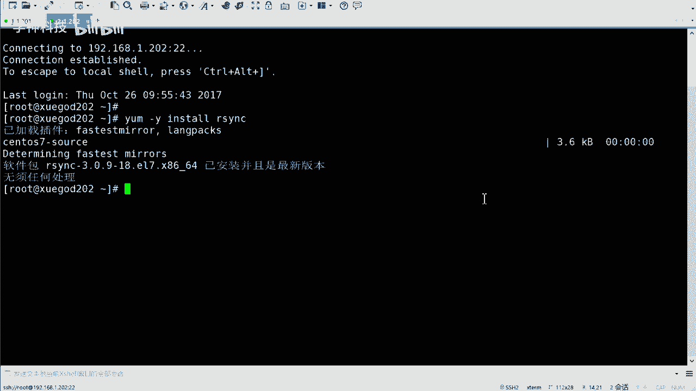

对吧然后呃一般都装好的啊，呃最小化的话，眼该也装好了是吧？到时候你可以去。😊，看一看是吧，可能没有装啊，到时到时候你可以去试一试。

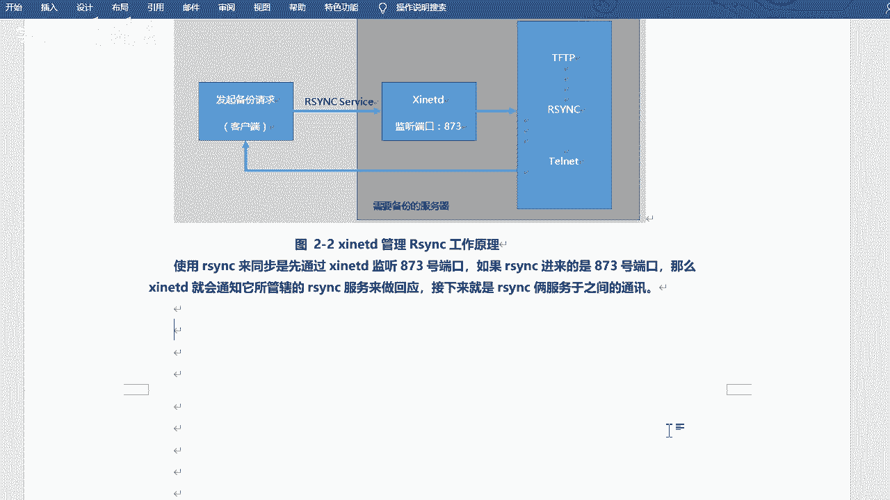

一般正常的话都装好了是吧，但是咱们先不用让它去服务运行啥的啊，咱们先看它一个单独的使用怎么去用。好吧，单独的去使用啊，就是R3C啊，像平常的命令一样去用啊，就像比如说RS是吧，像A啊什么root路啊。

对吧？像这样去用，好吧。

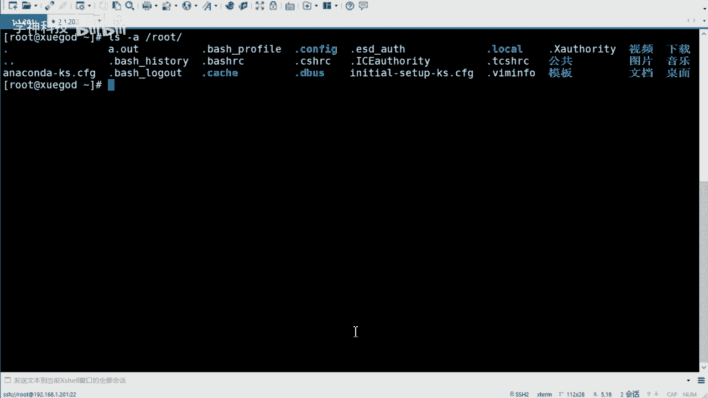

R分C啊。它有一些参数，咱们可以来看一下啊。OK23C。是吧呃它的基本用法呢和命令一样和命令一样啊，就是23C加上你的选项参数。然后呢呃当然后边会有两个那个那个对象啊，就是你要把谁同步到哪去。

是不是啊就这个意思。对吧就是原和目标对吧？元和目标啊哎。对吧就这个过程，那么它常见的选项可能会比较多一些啊，比较多一些什么AVRLP巴拉巴拉这么多啊，ZPlate这些是吧？

然后你会发现呢我会用不同颜色呢把这些呃这个这个选项是吧，给它标出来了。什么意思呢？就是你如果说你要记的话，就记这些呃加颜色的就可以。😊，好吧，这些的话你可以不用记。😊，啊，瞬间这个记忆压力就减小了是吧？

是这样的啊，就是呃这些选项其实这个杠A它是叫归档啊，追归档模式它会包含了这些参数，它就都包含了啊，它包含的就是有比如说递归的模式处理啊，是吧？然后这个连接文件是吧？保持原有权限时间数组输组啊。

一些信息是吧？它会帮你去保持的好吧，那会帮你去保持的啊，然后呃V的话是显示一个呃这个这个同步过程中的一个详细信息是吧？有详细信息啊，这个其实你不想显示，你可以不用加显示啊，这个也无所谓，好吧。

然后Z的话呢表示压缩是吧？传输权件压缩啊，这个一般是需要加的对吧？然后P的话是显示传输进度啊，一个是信息，一个是传输进度对吧？这个如果说你不想显示，也也也可以不显示，对不对？还有一个刚刚delete啊。

刚刚delete这个可能不太不太容易去理解啊，它代表是删除那些目标位置有，而原始位置没有的文件。😊，对吧这个是什么意思？大家大家可以。这个过一下啊，想一想是啥意思。对不对？因为这个可能说起来比较绕啊。

删除那些目标位置有而原始位置没有的文件。对吧这个。看上去挺高级的是吧？挺高级的啊。呃，OK那我说一说好吧，那我说一说啊，这个呢是为了保持你的数据端啊，就是你的备份端和备份源端是吧？是完全一致的。😊，啊。

比方说我要同步一个目录是吧？比方说我要同步一个这个这个网站的目录是吧？哎，那我的这个目录就比如说这边吧，我这边。

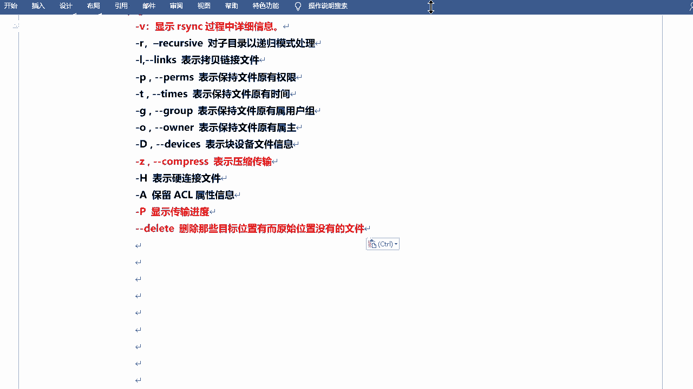

简单表示一下啊，表示这边是我的A目录。是吧。这边呢是我的B目录。对不对？啊，那我如果说加上刚刚delete的话是吧？那我去同步这个数据，比如说把A的文件。传到B这边来。对不对？

那你这两个目录里边的数据和文件是完全一样的。啊，比如说我这边有123，这边可能也是123啊，这边不能是12311234啊，或者这边是什么1234是吧，就是完全一样啊，刚 delete对吧？

但然如果说哎我不想这样，对不对？我就想让他们这个这个不太一样的。😊。

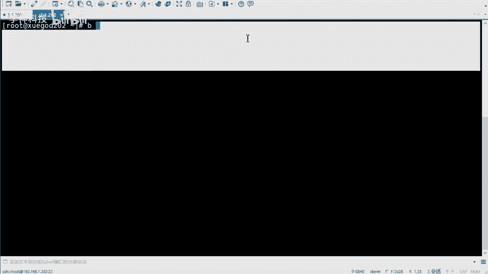

是不是那你也可以不用去加这个是吧？到时候看情况好吧，看情况啊，因为可能你的另外一个目录可能还有需要做其他操作呢，是吧？我还可以放其他的这个这个文件呢，是吧？也不一定啊也不一定啊。看情况啊。呃。

用起来就是这样啊，用起来就是直接。这样用就可以了。23C啊，但是我这只是用了一个刚刚d的一个参数啊。原始的位置，然后同步到哪去啊，IP地址冒号加上你的目录。啊，就是加上你这台服务器的一个目录啊。😊，行。

当然你咱们还可以加什么AVZ大T是吧，这些都可以加啊，都可以加的啊。😊，那咱们来测试一下好不好？测试一下啊，比如说我去创建一个目录是吧？然后呢呃同步一下这个目录，好吧。

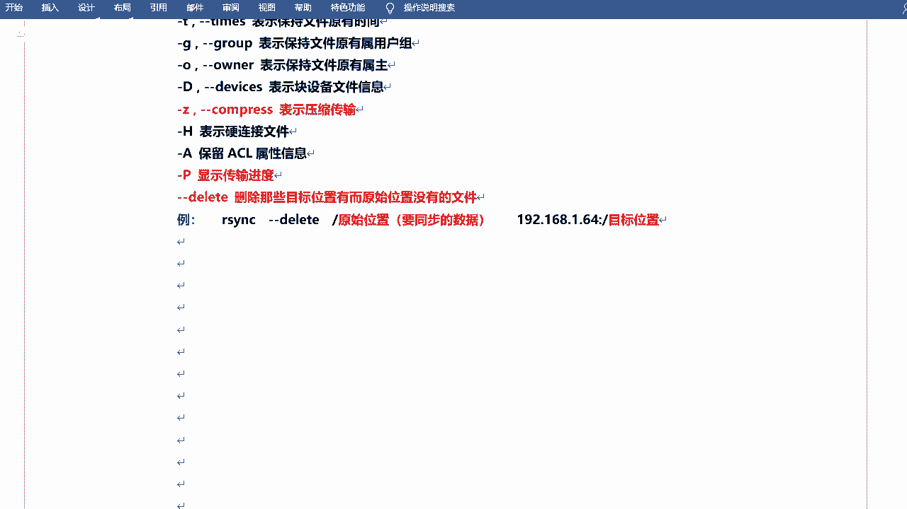

嗯。这边啊两台机器是吧？呃，一台呢是学ga的好吧，这台是学ga的202。刚才啊都是咱们七的版本啊，七版本的啊。然后我创建一个目录吧，好吧好，比如说创建一个叫做。呃，Y下的3WHT标。

是吧有同学可能见过这个啊加1杠P。对吧这个是什么呢？这个是咱们还没学啊，是阿帕奇的一个叫做网站根目录。对吧呃，当然你也可以把它当成一个普通目录是吧？当然你也可以创建一个简单的。

比如跟下面创一个test的目录呀是吧，这种也可以啊，也可以的。😊，哎，然后一会儿我我往里边去放东西是吧？然后我CT一下吧，比如说我把咱们boot下的是吧，web two这个目录。

拷贝到哇下3W见没有拷贝过来啊，那现在它里边的话呢就会有wordb two里边的文件是吧？也是就是有有子目录，有子文件的。对不对？那下面我来去同步一下怎么同步呢？2NC。对吧加上咱们刚才讲的参数啊AA。

呃，这个这个Z呃V是吧，然后大P啊，这几个可以写一块儿。好吧，这个可以写一块啊，相当于咱们之前讲的什么t。😊，啊，还QF这样的啊，这是一个可以当成一个组合啊，然后加上刚刚delete。是吧哎。

然后我同步无我下载。3WATM。嗯，从哪儿去呢？嗯，咱们是192。168。点1。202，这是我的啊。呃，比如说跟新下的well back这个目录。好吧，正常的话呢，这儿需要家居户名的啊。

以谁的身份去同步。对吧，但是如果你不加的话，它会是以当前用户的身份去同步的啊。对，然后过来同步到跟下weback这个目录。但是目前的话啊，我的202没有这个目录。你看啊嗯。这个肯定是没有的，好吧。

肯定是没有的啊，这个可能一行就显示出来了。we back。跟一下的we back啊。是吧我没有写错啊，没有这个目录，对不对？大家可以想想，我如果直接回车，它能不能同步过去。别回车啊。走你啊。

他哎他让我输yes了是吧，让我输入个yes啊。😊，然后然后上网输密码了，对吧？然后因为它也是SSH这个这个协议的啊，所以说看上去和远程登录的这个这个提示是一样的，是吧？密码是123456。哦过去了。

对不对？过去了啊。在这儿是吧，然后咱们来看一下啊。😊，哎，是不是有了，对吧？grab two。😊。

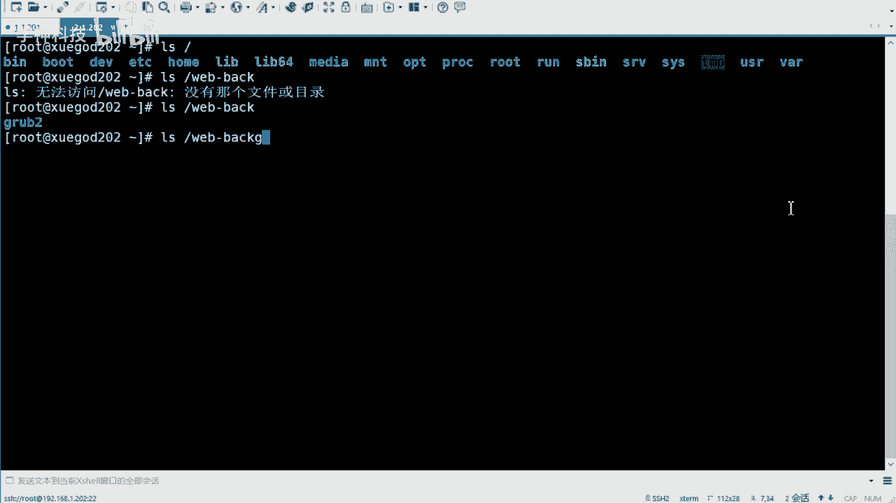

没有了。对不对？有团可能认为不行啊，是这样的啊，呃，其实是可以的，确实是可以的啊。然后它在同步的时候呢，它会帮你去创建这个目录。好，当然咱们笔记里边是写的先创建啊，当然其实你不创建也可以，但是创建的话。

它只会帮你创建这一级目录。😊。

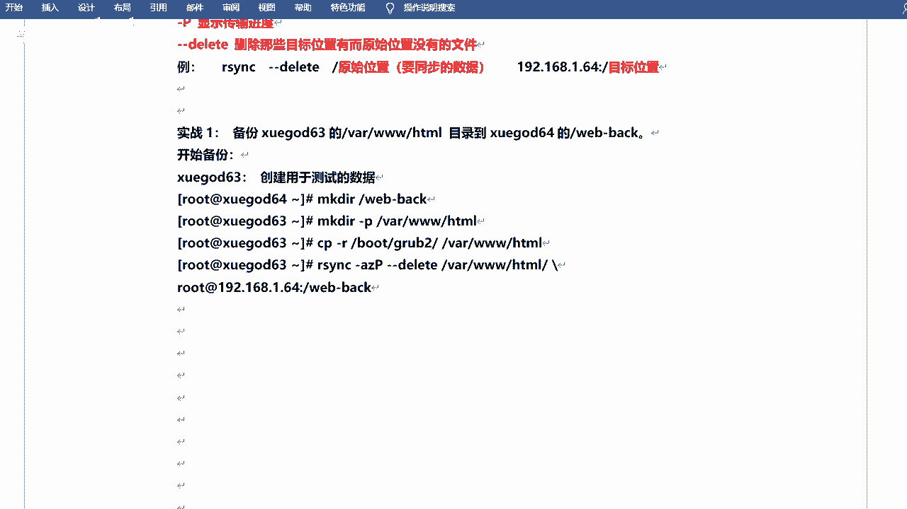

什么叫一级目录呢？比如说我的we back不存在是吧？那他会帮你创建。那如果说你要同步到web back下的是吧，什么ABC啊test这样的，这个是不行的，就是它不存在，它也不存在，那肯定是不行的啊。

一个不存在还可以。是吧。好吧，当然这个嗯这个其实你到时候敲，你也能看出来是吧？当然你可以去记一下啊，然后它会显示咱们的传输过程。😊，对吧你看。对不对？什么百分百啊什么的文件啥的呀会显示啊。

就是因为咱咱们加了这个什么大P呀V啊这样的东西啊吧，如果说你不想显示，你这两个其实可以不用加的啊。

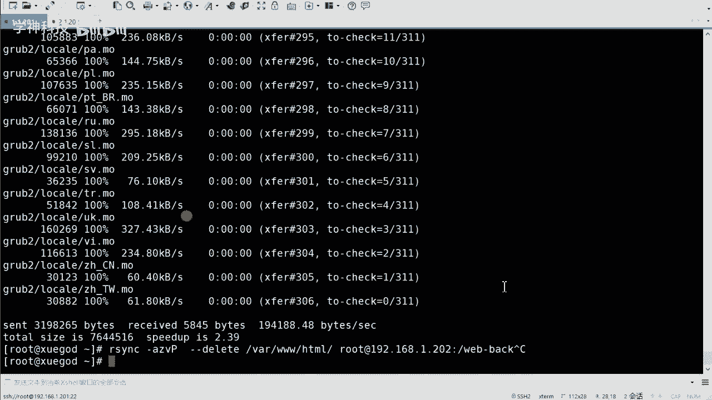

当然你也可以当成一个什么呢？当成一个这个呃就是组合是吧？去记啊，当成一个组合去记也也挺好的是吧？也挺好的啊。行，这个是咱们手动的哎去用RNC去执行，去同步了，对不对？那么问题来了是吧？问题来了啊。

什么问题呢？如果说让你去同步一些文件的话，是不是你会去什么时候去同步呢？😊，让于同步你们公司的数据。

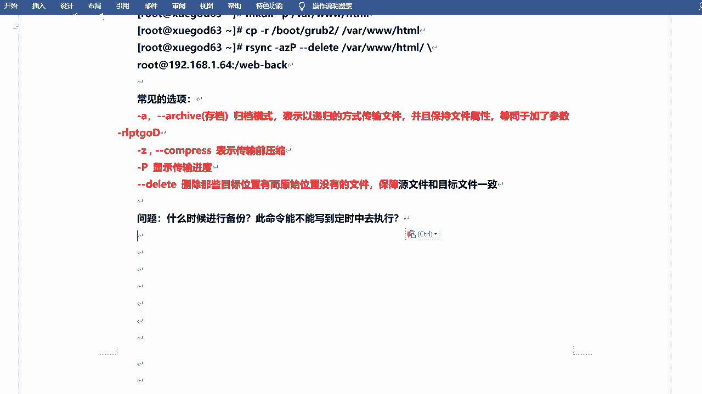

你会什么时候去同步？