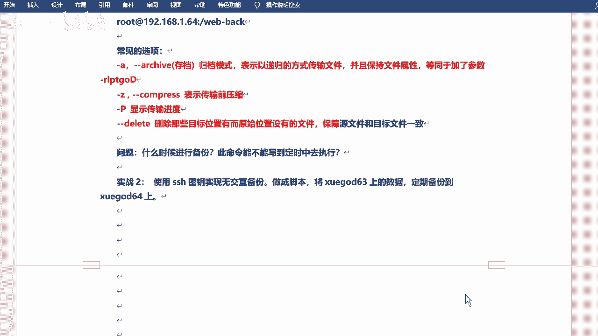

# 2021年RHCE／RHCA／RHCSA／红帽最新教程 - P6：无密码同步-保持文件权限 - 学神科技 - BV1Wi4y1K7g1

呃，凌晨是吧，或者后半夜。对吧月黑风高啊。对。这个确实是可以的是吧？然后大家也都知道，哎，有这个意识说呃咱们同步的时候呢，要在业务闲的时候，对吧？因为同步的话，如果说你的数据多，它肯定会占用你的带宽呀。

是吧？占用你的系统资源呀，对不对？那我不容易影响我正常的业务，对不对？后半夜是完全没问题的啊。😊，对不对？那问题就来了。是吧。问题又来了，什么问题呢？刚才我同步的时候大家也看见了啊。

就在这个地方同步的时候。😊。

对不对？他让我输密码了。

我是不是得敲密码，123456，然后怕过去。是不是那如果说是后半夜的话，两点吧，就比如说。对吧如果说你们公司要求你每天的两点都得去同步是吧？那你每天两点的话都还得起床，然后去输密码吗？😊。

是不是这个是不是不现实啊？对吧做运维的话，做运维就应该24小时待机待待命吗？是不是？那他不可能的是吧？不可能的啊，所以说咱们可以去后半夜去同步，是不是？然后哎咱们得想一个办法。

是不是我可以让它自动去完成。对吧不能说全手动啊，这个可能是不行的，对不对？然后啊呃好，有同学说啊，可以做SSH免密是吧？挺好的啊，咱们上节课好像说了那个妙对了那个是吧？对，还有的话，当然你可以写脚本。

😊，脚本是不是也可以是？啊，有的还加变量之类的是吧？OK啊。😊，对，这个这个都可以啊，写筛小脚本的话，写expect也可以。其实啊啊，但是咱们有更简单的对吧？用这个妙对就可以实现了。

因为咱们要看到这个本质，什么本质呢？因为R3C它走的是SS协议是吧？SH协议的话，首先用户名密码是吧？这是一个过程，还有一个就是妙盾。😊，对不对？我有了密钥度之后，我就可以无密无密码的登录了。是不是哎。

那我是不是就可以无密码的去传输了呀？是吧这样显示这样这样想是没问题的啊，对吧？这样想是没问题的啊。上节课咱们其实已经验证了是吧？那咱们今天再来做一下。😊，好吧，现天再来做一下啊。😊，哎，我可以怎样呢？

我可以。呃，无交互的备份。是吧然后去这个定期备份。是吧定期离分啊嗯。首先是生成妙对啊，这个和上次是一样的啊。生成一下喵字。

嗯。直接生成吧。SSH杠K跟是吧？这个命令啊，这个就直接回车就行啊，它会默认去生成一个在当前的SSH目录下。对吧它有两个文件啊，一个是ID点SA是吧？一个是点ub啊，点ub的话就是公钥公司要嘛是吧？

公司要嘛，那么呢咱们需要把公钥传给你想去无密钥，无密码登录的那个主机是吧？直接传过去就可以把它传过去。😊。

好吧好，再传过去啊，当然SCP可以传啊，然后它会有专门的命令去传，对吧？就是这个SSH杠copyID是吧？传。

啊，传给咱们root at。嗯，192。168点1。202是吧，传过去啊。你看他还让你输密码，对吧？当然这个肯定是需要输密码的啊。😊，123456。哎，传过去了对不对？传过去之后呢。

咱们直接远程登录一下啊。呃，一减等于了吧。8啊。回何拔呢。1。202对吧？对不对？这个可以远程过来啊，从学挂的到学霸的202，对吧？那我的23C是不是也可以呢？这个命定是不是也可以呢？是吧？

咱们试一下啊，咱们试一下啊。😊，嗯。我先把这边的那个啥删了啊。我往往往移走吧。比如说我把不是t web back。Gb是吧？移到temp摸录下吧，好吧。是吧能不删除，尽量就不删除啊，先移周再说。

然后我去同步好吧，然我去同步啊。

传输直接传就可以啊。当然SP也行，我这把两种方法都写了，好吧，都写了，看你用哪种。😊，然后测试一下是吧，测试一下啊，然后咱们先测试远程登录。对吧，然后再测试去同步，看可不可以啊。

嗯，23C对不对？23C啊，嗯在这儿的话给大家说一个小技巧吧。😊，没小技巧呢？刚才R34这个命令其实很长的是吧？什么杠A那个VZP啥的是吧？还有后边好多的这个目录，对不对？咱们可以用一个什么呢？

叫cttrol加R的一个快捷键。😊，好吧，ctrorl加R啊，快捷键。这个有用过的吗？中下R啊，它可以去检索啊，它会去搜索是吧？呃你的呃关键字就是你之前执行过什么命令啊，比如说RSS对吧？

你看我直接输入两个字符，RSS它就会把我之前执行过的命令给我调出来了。😊，他就他就找到了。对不对？那就找到了啊。😊，Mmhmm。ああ。Okay。然后方向你的左右键啊，然后就可以调到前台了。

然后就可以执行了，对吧？你看和前面是不是执行的那个那个过程是一样的。对吧一样的啊，哎然后走你。对不对？是不是没有要密码，对吧？然后这边再来看一眼啊。又回来了是吧？又回来了啊。

是不是这就是一个武妙的一个同步。好吧，武妙的一个同步啊。

嗯，我这简单写一下吧，是吧，整tro加R啊嗯。😊，嗯，可以。怎么说？可以。😔，历史命令是吧，搜索历史命令啊。快速调到前台是吧？执行。Okay。是个小技巧嘛是吧？这个小技巧啊。😊，行。呃，那么这样的话呢。

是咱们用RSNC的方式是吧，去去同步的，对不对？不管你要不要密码啊，咱们是直接同步的。那么这个是push的方式，就推的方式是吧？哎，我把数据推给我的这个这个备份端。是吧这个比分的啊。

那么下面的话咱们就用。服务的方式好吧，用服务的方式啊，然后去干嘛呢？去这个操作一下，好吧，去操作一下啊。服务的方式啊。就是会用到咱们的信那个那个服务了啊，就不单单是这个命令了。Okay。服是吧？

然后现在的话是两台。😊，两台机器两台机器啊，也你看我这没有写什么服务端还是什么客户端之类的啊，我写的是原主机和目标主机。原主机呢就是你的数据在哪？目标主机呢，就是你要把数据这个这个放呃备分到哪去是吧？

备分到哪儿去啊。😊，当然咱们笔记里边都是6364这样啊，然后我的用的话都是什么1。201。202啊，然后你们用的话呢，就是和你们的主机是对应的。是吧和你们的IP地址是对应的啊。😊，呃，然后咱们做的话呢。

需要关闭Slink是吧？然后关闭这个防火墙啊，因为目前没讲防火墙啊，后边会讲的。是吧然后否则创建文件之后去启图服务也不会生效啊，这个一般其实咱们都会去默认，都给它关了是吧？但是还是可以验证一下啊。

看看有没有。

关是吧。呃，两边都得关啊。get enforce force吧。是不是？两边的一管。都是diableable是吧？好，那去装包是吧？装包啊，装包的话，其实刚才咱们也看到了，已经装过了。R。

 Lindsay。对吧直接用就可以好吧，直接用就可以啊。那我这个是什么呢？我这个是。😊，呃，相对于我这个就是服务端啊，同同样我的数据也在这儿啊，我会去把我这边的目录同步到这边去啊，他俩是在一块儿的啊。

行，然后我启动一下这个服务啊，sstem to tell start。2VZ啊，这个直接table就能出来是吧？这个t就能出来啊。23CD是吧？从呃出来之后呢，咱们可以nstate去看一下。

端口有没有在监听873。是不是已经在监听了啊。行吧这个这个这个就可以了啊这个就可以了啊。😊。

然后。A，安装，然后查看。嗯。😊，看看就可以了啊。呃呃，我再说一下那个啥吧。再说一下那个那个那个那个六和8的吧是吧，6和8的话呢，它需要啊6的主要是啊是吧？它需要去装那个新练的D啊。

这个这个需要受影响啊。中系列的力啊。对吧然后呃再去创建一个就是什么RRCD点com这个配置文件啊，默认的话它都没有这个配置文件。是吧，然后RRC杠第门执行完之后再去启动新天地啊，然后有新天地的话呢。

你只需要洗启新天地就可以了，不需要启RSNC了。行吧，当然这个是6和8的啊是吧？然后所以说你是7的话，你就不用做这个操作了。好吧，7的话你就不用做这个操作了，这是一个一个提醒吧，好吧。

因为确实不太一样啊嗯。好的啊，这个我就放这吧，行吧，到时候你们注意一下啊。Okay。行，然后的话咱们来看看这个怎么用啊。呃，用法的话呢其实还是命令的方式去用。但是呢它可以加一些。加一些比较复杂的参数啊。

什么AZ加T啊啥的，咱们都都看到了是吧？咱们都用过了啊，然后可以加这种。😊，像这种杠杠啊杠杠这种。呃，当然port也可以改变port啊，然后嗯。这个我把这个给我红吧。pasword的 view啊。

这个文件。是吧这个文件啊，你可以去呃指定密呃密码文件中获取密密码。呃，这个怎么说？哎，有同学说哎老师刚才你不是把那个啥把那个是吧，咱们的密钥都做好了吗？是不是完了之后我也可以无无密码的去传输了，是吧？

怎么还得用一个密码文件呢，对吧？是这样的啊，就是咱们做的话是是root用户，比如说是吧？或者说是一些系统用户，对不对？但是咱们同步的时候呢，你可以不用这些用户，我不用root用户是吧？我不用系统用户。

我不用什么CD啊什么这样的用户，对不对？我可以单独去这个。😊，赋予一个用户是吧？然后让他以他的身份去同步啊，这个也是可以的。好吧，就是你不一定非得用那个系统用户的啊。

普通用户也呃不是普通用户是就是这个单独用户也可以啊，单独用户也可以是吧？那单独用户呃单独用户的话，就是可能是你临时想起来的一个用户，或者你自己配置的用户是吧？那我不能说我再去做一个妙对吧。

或者说是这个用户根本在系统里面就不存在是吧？那你也做不了。😊，对吧所以说咱们还是用的一个pasel文件啊，咱们可以去写上这个什么用户名啊密码的呀，对吧？这样一个关系啊，然后呢哎也可以实现一个无。

密钥的是吧，无密码的一个传输。好吧，这个意思啊这个意思啊，其他的一些如果你想加的话，到时候也可以加啊，关键就是它主要就是它。对吧然后常用的就是AVZ。是吧啊后当然大P也可以加的啊。😊，嗯。行。

然后咱们来。做一下是吧？来备分一下啊。啊，s think一会儿还会讲的啊，别着急。这个啊嗯。使用23C啊去备份数据是吧？备份数据啊，当然这个哎不是刚才做过吗？是吧？这次咱们做的是一个。呃，不一样的好吧。

做一个是做的是一个不一样的啊。嗯，然后的话。然后的话咱们来做一下啊。呃，哦，笔记里本写的是创建测试用户是吧？这个用户。创建就创建吧，创建就是专门去用来同步的，好吧，专门去用来同步的用户啊。

就是什么REG哎RGETE是吧？这个用户啊然后呢两台主机都需要操作是吧？两边都都做一下啊。这个我就直接回车了吧。

直接复制了吧。就是创建跟用户专门去做这个同步的啊。叫RGET。这边也是啊密码我都写的比较简单是吧？都是123456。好吧，都是12346啊。然后呢，这边我同步的还是谁呢？还是这个哇夏3W奇妙。

还是他好吧，然后我给他去改一个这个什么呢？改一个这个这个这个权限啊。杠L啊杠LD看一下吧。啊，包括刚二位看一下是吧，它这个都是root嘛，因为我是用root身份去拷贝的，对不对？那我去给它改一下啊。呃。

叫做set FVL。这个明年还记得吗？是不是这个是单独去去改权限的啊。嗯，杠啊杠R加上杠R。就是DV去改啊，杠M。user好吧，user呃改成RGDT。一啊，然后呢它的权限是2WX啊，哇下的3W6。

改一下是吧，然后。呃，还可以改一个。Sight free。搞2。杠M叫default默认的啊。default啊2GETE。然后呢，也是2WX。也是Y下的3WHM是吧？这个目录啊，就是我把它的权限改一下。

改完之后呢，咱们去看啊，getECL。😊，嗯，往夏3W27秒啊。那目前他的。这个这个用户啊在这儿啊。是吧就加了1个RG。ETERWX啊，当然它你去看的话，它还是root啊。是吧还rootro啊。

但是咱们加了一个啥啊，加了一个呃这个这个这个这个用户是吧？就是他这个用户，然后你也有RWX权限。😊，好吧，然后default是吧，default。用户啊，然后也是RWX啊，然后也是给的是RGET1是吧？

也就是2GRGET1对这个目录啊，包括它其实它下边的什么子目录啥的。嗯，我看还有还有什么文件啊。嗯。Dy map是吧。Oh， grab2。图也能看啊嗯。啊啊，不对不对。Get FEC1。

 group 2。主你看对不对？它就都是2GET了。好吧，就都是他了。行吧，都是他了啊。就是他对这个目录是吧，是有读写读写可执行权限的，是吧？你能看到它就行啊，这两个。是吧这是一样的啊一样的。

嗯，然后ok。这是负的权限啊。Okay。然后比如说我再去干嘛呢？我再去。呃，测试一些数据啊，比如说我再去。

嗯，复制一些数据吧。我把。bo下的所有文件啊，同步到wa下3W27秒。哦，这是我之前的是吧？那那。嗯。那我先把它删了吗？那我先给他。开始MV吧。删了吧，没用了啊呃，我哇下3W怎么样。Goump to。

然后我再拷虑一下。这个是啥，怎么还有这个啊？Configure。哎，我之前有东西吗？里边。嗯。嘚的的，我直接删那个啊。好，把我把HL也删了。嗯，再重新一下吧。是吧，然后我拷贝一下啊CP。拷贝过来。

这个是新的新的一些那个啥啊，新的一些文件是吧？拷贝过来了啊。😊，嗯，然后我给他。OK然后给他干嘛呢？嗯。修改一下权限啊。这边。Ch祝文。RGET。RGETE。然后是杠R还是啊，然后where back。

是吧他以前是root的，是不是？现在变成2GET1了啊。这个其实就为为了保持。这个其实就是为了保持权限的一致性，好吧，权限的一致性啊，没有别的。是吧因为因为咱们同步的时候，不是可以去什么保持什么属性啊。

是吧，保持什么输入输入呀，对不对？这个就是为了做这个啊。😊，好吧，他就是可以去保持这个东西啊。保持权限是吧？然后我去。呃，同步一下是吧，然后2NC啊。杠AVZ。然后往下3W。哦。用RGET这个用户是吧。

去同步啊，艾等于8。点1。202的。We back A We back。这个目录。好吧，我给它同步过去啊给它同步过去啊。呃，当然这个是需要密码的。是吧这个需要密码的，就是就是什么呢？

就是这个这个这个因为你不是root嘛，是吧？因为咱们root之前是做了妙对的，但是这个没有做，所以说还是需要密码的啊。😊，嗯。123456。是吧然后去同步啊，但那个过程你是可以看见的。哎。过来是吧。

过来之后再去看啊嗯。这里边。是吧然后他会给你同步过来，好吧？同步过来。同过来之后呢，它的输数组你看是什么？都是REGTE。对吧能看到吧？我看里边EFI这种的啊。里边的。对吧都是。看到吧？多是啊。

这个就是为了保持什么呢？为了保持这个这个权限的。

好吧，为了保持权限的啊。