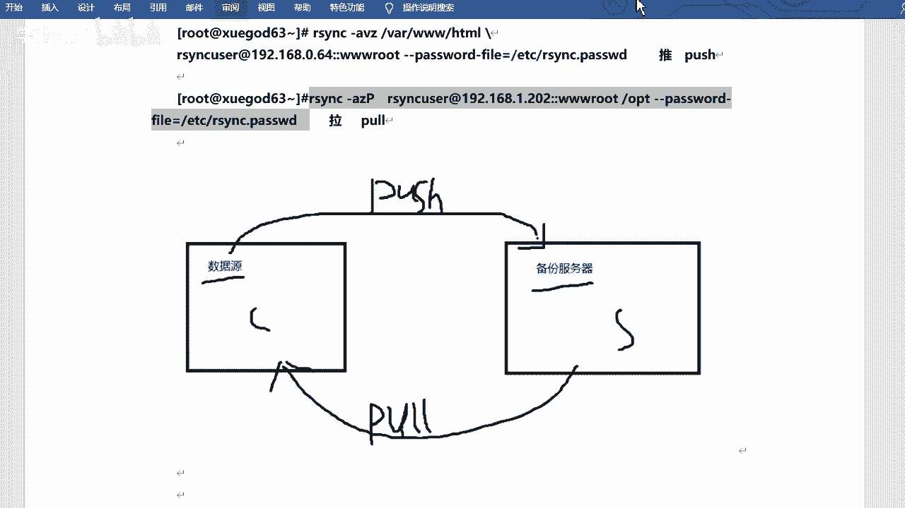

# 2021年RHCE／RHCA／RHCSA／红帽最新教程 - P7：rsync服务形式运行-推拉模式 - 学神科技 - BV1Wi4y1K7g1

好啊，然后咱们来看一下。服务啊如何用服务的形式去应用是吧？然后呃怎么去试它的配置文件，好吧。Okay。而且你看它可以使用非系统用户去备份这个数据是吧？备份数据啊，嗯，还是关闭防火墙啊。

关闭SElinux对吧？先给它关掉啊。呃，使用飞新的用户呢进入备份的数据是吧？呃，进入数据备份啊，然后依靠系统的23NC配置文件啊，EGC23CD点com进行备份的备份数据，并创建备份账号。

最终把23NC以demon的方式运行。啊，就是服务嘛是吧，第一位就是服务的意思啊。那这个配置文件呢呃，咱们一边打开一边看吧。😊。

ECC24文C。D点com啊，就这个它默认里边其实没多少东西啊，然后呢整体上分成两个部分。好吧，两个部分啊，一个叫做全局配置啊，就是这一个部分。一个叫做那个模块参数啊，这个部分。

是吧关关键不一样的地方就是这个东西啊，它有一个中块过起来的一个模块的名字。

是吧这是全局部分啊。然后默认端口号是8G3是吧，这个就不用多说了啊。OK那么它能配置的参数呢，其实其实挺多的啊，当然这里边呢也会有一些默认的。

啊，什么UID啊啥的是吧？但是它是注释起来的啊，注释起来的没有没有没有应用的，对不对？然后嗯我在这儿去。😊。

说几个吧，对吧。

说几个port，这个也是默认的参数啊。我看这有port吗？

没写是吧，没写也是873啊。😊，然后的话就是这些一起来看一看啊。这些啊当然你不用记是吧，你不用记啊，因为因为挺多的，好吧，因为挺多的啊，到时候你能拿过来参考就可以啊。😊。

首先是UIDUID的话就是你的用户ID。😊，是吧用户ID啊，该形象指令当前呃当该模块传输的时候，守护进程应该具具有的这个UID啊，现在就是以谁的身份是吧，谁的身份去运行的啊。嗯，然后呢GID就是组ID。

是吧用户ID和主ID啊。然后是max connections啊，最大并发连接数以保护这个服务器啊，超过限制的连接连接请求将会被告知，随后再试啊，默认值是0啊，也就是没有限制是吧？当然你也可以限制它啊。

也可以的啊，log fill锁是吧，锁文件啊。呃，指定支持max action参数的锁文件啊，默认值是这个这个地方。嗯，然后m feel啊m feel的话是一个消息文件，就是一个提示。嗯。

咱们上次讲了一个什么ETC写的mot那个还家记得吧？就是什么欢迎光临啊那个东西是吧？呃，这个2CCC的话，它也有这个文件。😊，是吧也就是一个提示啊，但是这个这个不重要是吧？不提示也可以的。

log feel是日志文件啊，呃是指定R3C的日志文件，而不是将日志发送给Cslog。这个其实很重要的。因为后期如果说你配置是吧？然后那个那个比方说我重启用服务没问题，但是呢我同步的时候，它不成功是吧？

然后它会有一些这个这个提示嘛，是吧？有些日志啊，然后他会告诉你什么问题之类的是吧？咱们可以通过日志文件呢去去定位是吧？去检查啊，和哪哪写的不对呀，是吧？或者哪有问题啊。😊，呃。

PIDF是它运行的PID的文件啊，这个这个一般呃对可以指定，谁也可以不指定啊。然后ho low这个是单个IP或IP地址，这个是指定是允许访问的客户机地址，就是允许谁访问。允许谁来同步或者这个意思啊。

好se漏。呃，okK这是全局的配置啊，然后呢有一些模块的配置和它可以是重复的。而是有一些呢是是不重复的，是吧？咱们也可以简单看一看啊。😊，嗯，重复的话以谁为主呢？重复的话。

如果说你的模块参数里边的这个这个配置是吧，和全局里边的配置冲突了，表示相同的配置，但是值不一样是吧？那以谁为准呢？以咱们的模块参数为准。好吧，我看这有写吗？啊，有写的啊，在这如果模块参数和权益参数冲突。

那么冲突的地方模块参数最终生效啊，也就是说它的模块参数是吧，它的这个权限更高是吧？更高的啊。然后模块参数呢必须是以中块括起来的共享模块名来去这个写啊，格式是这样的啊。

然后comment描述pass就是同步到哪儿去啊。这个是一个目录必须要指定的readode是否以只读模式啊，然后处的话无法上传写入，就是能不能去去呃，是是只读还是可以写的，是吧？

一般的话都是都是读写的啊啊，什么执行啊，这个也不用这个不用记，这个不用记。啊，这也不用记。然后下面这些需要需要注意一下啊。下面那些。😔，那挺多的是吧？所以说你你不用都都记啊。

像这个al user这个非常重要。all user的话就是认证用户。😊，是吧所谓这正用户呢就是允许谁呃，不是允许啊，是以谁的身份去传输是吧？去执行2323NC啊。哦有的。

对吧这里的用户和新的用户没有任何关系，就是你可以随便写。好吧，就是可以不用是系统用户的啊。😊，然后呃s field密码文件啊，该文件的权限一定要是660660，只有就是说只有那个root是吧？

因为咱们现在是用root身份去操作的嘛，是吧？只有root有对这个文件，有写业权限，其他人都没有权限，因为咱们这里边写的话，会以明文的形式去写你密码是不安全的，对不对？但是呢哎我给他写的600是吧？

其他人是没有读的权限，呃，没有写权限的，当然也没有读权限是吧？只有root用户有有读页权限啊，😊，嗯，和扫lo上面一样啊，允许谁是吧？可以单个地址啊，可以是网段啊。😊，都行啊，行也可以的。

然后还有底奈就是不允许谁。😊，是吧不允许啊，然后当然你你你不去写默认，就是都允许啊，或者说只允许那个alload。呃，list的话呢是。呃，当客户请求可以使用的模块列表时候，该模块是否应该被列出。

就是列出你的这个这个模块，好吧，默认只是处的啊。呃，还有teammo的超时是吧？teammo的超时啊就是。该选项啊可以确保23AC服务不会永远等待一个崩溃的客户端是吧？如果说它比如说它连不上呢。

是不是或者它不同步呢，对不对？或者说有问题呢，它它这个这个链接是吧？它它如果说一直是连接的话是不行的，它会有超时时间。啊，零的话是没有的啊，是吧？当然你可以去设置。好吧，你可以设置啊，这是几个。呃。

参数是吧？当然很多是吧，这不下10个吧。对不对？怎么着就二三十个这样的啊，是不是？呃，所以说呃你先去理解。好吧，就理解啊，然后这个标红的话要去看一下，要去看一下啊。

然后其他的一些你你都可以目前啊可以先忽略掉。是吧先忽略掉啊，然后看的话呢，还有就是要看咱们的配置文件是吧，看我是怎么写的。好吧，看我是怎么写的啊。😊，这个配置啊。当然这个配置也会比较长。是吧。

然后我在后边的话又单独去呃注释一下是吧，这个是干什么的，这是干什么的？这是干什么的，好吧？是吧呃，然后呢呃你去写这个配置文的时候，千万注意啊。呃，第一是手动创建啊啊然后还有就是说你不能直接去复制。啊。

跟上次咱们讲那个fe time一样是吧？你你复制完之后呢，它后边跟上那个注释啥的，它不生效啊，它也不会报错。如果你重启啊或者起伏啊，它也不会报错，但是它就不生效。😊，好吧，所以说这个咱们需要手打。😊。

行吧，这个需要手打的啊，也锻炼一下是吧？当然在手打过程中，你很可能会写错，哎，正好咱们也可以排个错是吧？也可以排个错啊。😊，行吧，然后我去执行一下啊。呃，这里边它写的是664是吧。

它是以64为服务端的啊，那么咱们在6四上面去。呃，去去去改这个配置文件，好吧。64上面是吧，你看它是有写的，然后这个地方主机名也有写。

是吧。我以6四为准吧，还是啊。相当于是我的这台机器是吧？然后我写一下啊。😔，嗯，EDC下的R4NCD点COM。呃，这些都可以不用啊，咱们直接自己写。好吧，嗯，UID是吧？嗯，root啊。然后。哦。

他这里写空格吗？其实写不可空格都行啊，等号两边啊嗯。嗯，金D。然后是dress。呃，address的话呢是你的当前主机的IP好吧，当前主机IP啊，这个其实不限也可以。嗯，我写一下吧，1加2。168。

点1点儿。202是吧，然后port逗号。873。嗯，当是这是默认的是吧？然后ho hell。允许的呢允许是嗯192。1。8。点1。2啊，不是1。0网段啊，然后。24。对吧允许这个网段的。

这个这个这个机器来同步我，或者我同步给别人是吧，都行的啊。嗯，然后是叫U称root。yes啊，这个是是是否无惧到什么锁啊。是吧就是是是否锁定加目录啊，意思就是比如说你的23C被。😊，如果说被黑了是吧？

如果说通过它进入到你的系统的话是吧？那黑客是不能。就是不能去在你的这个运行的加盟录之外去创建文件啊，就是保保证你的安全性相当于。好吧，保装就性啊嗯。嗯，然后是max connection。肯定个审字啊。

这里边写的是个5好吗？你写100其实也可以啊，大家可以同时比如同时创输100个文件。行吧快写个1吧。呃，然后是PAID啊。偏D feel。指定一个吧是吧，哇下对。run一下2NC。低点偏低啊。

然后lock feel。嗯，哇下软下。😔，角24NC lock。还有log，还有一个是log file，日志文件啊，这个是主要的啊log file。

那log field是Y下log下的RSNCD点log。呃，motor是吧，这个这个这个也可以写，可不写啊，就是就是那个那个欢迎文件或提示提示文件。😊，啊，比如ATTC下载叫24本CD点mo。呃。

这个是一个全局配置，好吧，全局配置啊，然后下边就是去写这个模块参数啊，模块参数啊。比如我的模块呢叫3W啊，3Wroot。呃，passpass是比较写的pass这块就是你要去同步到哪去。是吧通哪去啊。

就是你用我这个服务，用我这个模块的话，对不对？然后你要把文件备分到哪儿去，相当于啊。比如说还是we back吧。嗯，有个comment， commentment呢是一个描述啊，比如说这是一个。U的。😔。

Fll back。root啊描述啊。然后read only。我是不是知毒的false。😔，呃，还有啥list。list是不是要列出模块是吧？呃，no也可以啊，yes也可以。然后最主要的就是oss。

All users。用谁的身份？是吧去同步啊RS。所于C表示user吧。然后呢，secret view。secret view啊。嗯，就是密码文件啊。ETC下的2NC于点pa。

行吧，写的反正挺长的啊，这是这是多少好呀，这是。😊。

20多行嘛是吧？写完之后呢，保存退出。

好吧，这样的话就就当于相当于对咱们的这个服务是吧，进行配置了。好吧，进行配置了啊。ok那咱们来创建箱的目录和文件啊，开始去做。

😀嗯嗯。呃，我写一个。欢迎欢迎文文健啊，'re welcome。To back。4。把它。重定向到ETC下的SYCD点MOTD是吧？这是指定一个欢迎文件啊。然后password的EDC。2孙。

C点怕错了。这是密码文件啊，密码文件我的用户名的话呢是RSVC user。这个需要注意的话，就是和你的配置文件里边一定要保持一致的，是吧？然后密码的话，比如说叫做pas word。123好吧。😊。

这个里边的话，咱们需要把用户名和密码都都写进去。啊，多远序啊，然后改改权限。😊，6ba。啊，然后是ETC下的2班C。第二 passwords。是吧。我配置不一样呀，我看看啊，是不是哪辑错了。😊，错的话。

咱们就改啊。嗯，是这个吗？不一样吗？这个不一样吗？看一眼啊。RSVNC user是吧，然后。嗯，ETCR4文C点pa。lock不一样啊。这个吗？Look feel。这个我还没写没写呢是吧？

这个这个也不用写啊嗯。😊，嗯，这是密码。600我改了吧是吧，600一定要改啊，这个这个需要注意，这是强制的，好吧。

强制的啊。好，然后咱们重启下服务。

是吧那服务起回来肯定不对啊，服务起回来，我再去看看配置文件吧。😊，System to restart。呃，2NCD。是吧看上去是没错的啊，然后nstate。嗯，gra一下873。是不是运行的，对不对？

呃，当然他会去默认去读取啊，默认去读取这个配置文件，你也可以单独去指定啊，单独去指定。然后呢用这个配置文件呢去启动我的服务。😊，也可以是2分C。呃，刚刚demon。啊。

杠杠confi指定confi文件啊，是ATC下的2NCD点com是吧？这样也可以啊，但是他说说什么呢？他说PID已存在，说明你的服务已经起来了是吧？如果说你没起的话，你可以去这样去起的啊。啊。

这样的话说明它已经起过了。P的文件赢了啊，PD文件就是你的进程所对应的那个那个文件是吧？进程号主要是啊。

嗯，OK那么完了之后，咱们来测试一下，好吧。😊，复围起来了，对不对？然后咱们看看能不能同步过来。好吧，这一步也非常关键啊。😊，非常关键啊，和咱们后边的那个实时同步啊，它是相关联的。

行吧，怎么同步呢？我我在这边啊。😊，在这边去同步。好吧，这边去同步啊，然后呢呃还是用23C的命令去同步。S分Z。什么AVZ是吧，用啊还是同步画下3WHL。然后呢，用RS1Cus这个用户是吧。

去同步啊艾特地址是192。168。点呃1。2。2是吧，同在这边来啊。然后呢，如果说你要同步到什么we back是吧，和之前是写一样啊，但是咱们用的是那个配置文件嘛，是吧，用的是服务啊，那我就可以这样写。

两个冒号加上3Wroot。是吧3W入册呢它指定的是这个模块参数，对吧？那么模块参数呢，它里边有一个pass是吧？指定的这个目录对不对？所以说它就会自动去放在那个目录下。好吧，放在那个幕箱啊，然后。😊。

风妮。是吧你看它会有提示说welcome to backup up server对吧？密码的话是什么？密码的话是你的。RNuser所以就的密码啊叫做PAAS4W2D啊，123。啊，是我的密码不对吗？

密码可能比较长啊，PASSWO2。You。没有，是不是写错了呀？ECC啊2SNC。电儿插座的啊。这个我看我能复制过来吗？复制一下啊。嗯，关键就是用户密和密码是吧？有的时候这个怎么说呢？

他写错肯定是同步不了的啊。哎，我去我敲两次居然都敲错了啊，这个是我把那个密码直接复制过来的啊，就是就是这样是吧，这样复制的，我这手不行了呀，PASSWYD。上岁数了不好使了，这时候。这家伙。行吧，呃。

这这是没问题的，因为我是直接复制过来的是吧，直接复制过来的啊。😊。

我敲错了好吧，呃，当然你们测试的时候，你们可以先弄一个简单的密码是吧？先弄个简单密码啊。😊，测试。是不是这样是可以的啊，这样是可以的啊。呃，然后呃当然这个的话呢，它也是一个。

呃，什么呢？它也是一个这个这个手手写的方式是吧？那我想要去自动去同步呢，是吧？我不用敲密码，对不对？那咱们在这个地方啊，这个地方相对客户端嘛，是吧？我也可以去写个密码文件，然后呢。

它可以去直接去调用这个密码文件。好吧，我写一个啊。啊，EC。2跟C点他错了。好吧，这个里边呢就单独去写哎会。单独去写密码就可以了。好吧，PAAS4WRD是吧，123。没写错吧，试一试啊。这个执行密码啊。

这个不用写用户名，然后也是加1个600。嗯。ETCSVC点发座啊，然后咱们再去同步一下啊。在这儿同步是不是啊？然后我可以加上刚刚pasor的。呃，fe。是吧等于什么呢？

等于咱们ETC下的RSSNC就是你刚才创建那个密码文件啊，PASWD。对吧，然后去同步。好吧，就可以了啊就可以了。你看。😊，那是吧每一次你琢磨的时候呢，你都可以这样去都可以这样去用啊。

手动是吧。O。嗯这样的话呢就把你的数据这个这个同步过去了是吧？同步过去了啊，这个叫。push啊推的方式是吧，把你的这个数据推到你的服务端是吧？推到你的服务端啊。然后其实还有的话是可以去呃拉的啊。

拉的话就是把服务端的数据拉到本地啊，拉到本地啊，这个其实它是双向的。好吧，双向的啊怎么写呢？写的话，把这个地址。呃，颠脑过来就可以。行吧就是你比如说我要把服务端的数据同步到我当前目录的OPT这儿是吧？

这个这个也可以。好吧。配合了都行的，其实啊。

就看你想怎么去。是吧怎么去用了啊。这就是拉，看到没有？这就是浪。

所以说他他他们两个这个角色是可以互换的是吧？可以互换的啊，关键是你要找到数据在哪儿是吧？你到底是要推呀还是要拉呀，是吧？就看你的情况了。

OOPT是吧。哎，对不对？这个文件是不是又把它拉下来了？

是不是？あ。OK啊。这是咱们的。呃，同步是吧，使用服务的形式去同步。好吧，服务式去同步啊。那这样的话呢，我就可以通过脚本去实现了。😊，是吧脚本学习实现啊，然后定时定点的对吧？实现啊。

然后也可以不用入册用户是吧？你就用用用它给你的用户。当然这个是咱们自己设设定的是吧，你想用啥就可用啥。对不对？然后可以通过这个写脚本的方式继续同步。是吧同步啊这个同步当然你可以是什么推呀，也可以是拉呀。

对吧？这个当然也是可以的啊啊，然后去执行啊，完了之后呢，要有一个可以写一个计划任务嘛，是吧？计划任务嘛啊，然后咱们可以凌晨的每天的是吧？😊，每天的凌晨的3点01分，是不是哎我去执行这个脚本。

对吧精日脚本啊。就这个意思。

是不是这样就可以了。