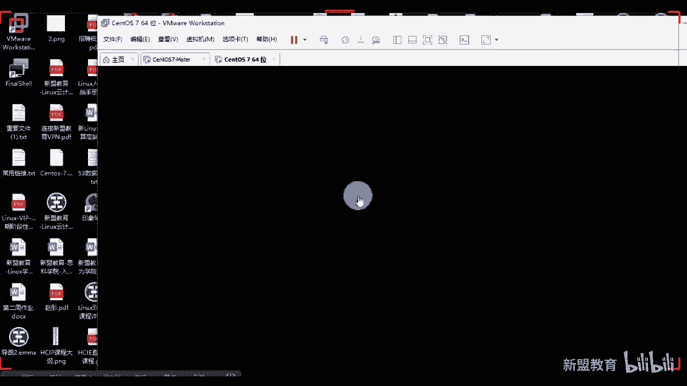

# 2021最新Linux-RHCE运维实战课程 - P10：RHCE-第10课-企业实战：PXE+无人值守系统 - 新盟教育 - BV17K4y1t7XR

Yeah。

还不。嗯，准备开始上课啊。今天的话第二堂课讲的是关于我们整个的啊不是防火墙啊，是我们的P叉E对吧？呃，P叉E的话，其实我在公开课里跟大家讲过一些，但是和我们系统班讲的东西是有区别的啊。呃公开课的东西呢。

我们可能会在系用班里面偶尔会带一些东西啊。但重点呢请各位往这边看啊，那么我们说。然，在哪啊？对吧？往上看呃，为什么我们要用P叉EP叉E的整个过程啊，本堂课的一个内容好不好？本堂课一的内容啊，例来说。

首先明白我们1个P叉E的概念啊，以及它为什么要去使用。第二个来说的话，我们去进行部署和它的一些相关配置啊。OK呃，先说一个问题啊，就是自动化体系里边的话，P叉E应该说是最最简单的了。

因为它其实就是结合上了我们的啊那么P叉E其实就是。我们一个文件对吧？那么结合上DHCP我们前面学过的，结合上TFTP我们学过的，结合上我们kstar一会儿我们会用到的以及FTP或者HTP或者FS。

也就是说我们其实现在学到的东西已经足够我们去进行一个P叉E的演习了，明白吧？啊，就是你的公司老师，我采购过来了100台服务器，那我怎么办呢？我不可能一台台装啊。😊，对不对？那么我们就得听从指挥啊。

用我们的P叉E去装批量安装。你要说老师我拿我拿这个这个光盘啊，我拿这个硬盘啊，对吧？呃，光盘或U盘去安装的话也不是不行，少量的话可以，对吧？找账可粒啊，但是大型企业里面的话，我们都是用P叉E。

那么简单了一下，老师，我P叉一和运行的原理，那运行原理。那么。只来说，客户端就是没有任何系统的啊没有系统的。当然很多的公司我们在买来服务器之后，呃，有的是装好了系统再上架，有的是上了架之后再装系统啊。

这个都无可厚非。那么如果说老师我上架之后装系统，我也想批量去装，用到P加E第一步来说第一步来说，一定要像你们在同一个网段阶段啊，同一个局域网内的哪里啊？哎我们的哎这个东西跑好了。啊。

是不是一定要像我们同一个网段内的哪里啊？啊，看到一定要向我们同一个网段内的DHCP进行请求IP对不对？大家记住，请求IP的同时，除了我自己会获取到一部分，我应有应得的，比方说IP地址子网源吧。

网关DNS对吧？等等等等，我还应该获取到一些个我们文件的存储的地方，也就是我的TFTP的服务器啊，那么第二步，我们DHCP也会给我发送一个这个这个这个提供一些信息。问大家个问题啊。

我们在请求的过程还记得吗？请求的过程还记得吗？唉，一共分为四步，对不对？啊，一共分为四步啊。第一步来说是由我的客户端发送discover。第二步来说，DHCP server发送我们的respon，对吧？

respon。第三步，发送我们的request请求。最后一步ACK确认请求。对吧啊，那么第三步的话，我去请求我们要下载的一些文件。你比方说像一些内核啦，像一些初始化啦，对吧？bsest初始化啊。

还有一些个像我们的一些个一些个菜单选择选项的，对不对？我们会把它响应发送回来啊。那么最后一步的话，你会去访问一些个比方说那老说我在安装系统的时候，我可能需要一些人为干预的参数。

那这些东西我们被记录在了kickstar这个文件里边，我们要去读取cast的文件。同时我们要去传输我的镜像安装啊，最后一步安装系统啊，简单六步来说一下啊，简单六步来说一下。好。

那么拿文字性质的话来叙述一遍往这看往这看。那么第一个来说什么是P叉E对吧？那么严格来说，大家注意P叉E不是一种安装方式，而是一种引导的方式。那么全称叫做预启动执行环境，对不对？这个环境的话。

我们是由各种各样的服务去组成的。那么重点。😊，看好了啊，你是需要一个网卡，这个网卡必须是有P叉E芯片的啊，当然现在来说，基本上所有的网卡都具备P叉E啊，老早期的话有这些像些黑网吧是吧。

很少有网卡是具备的啊，那么看一下啊，所以网卡当中必须有我们的clant p叉E的clt有这个芯片啊，然后才能通过我们的P叉E去进行通讯启动那么一般来说P叉E会分了两个，一个是我们的clt。

一个是我的server端P叉E clientt是在我的网卡的room当中啊，网卡当中，当我们的计算机引导的时候，好的好了，我们的bels会把我的P叉E调入到内存当中去执行。啊，调当中去执行。

然后我的ant将我们放置在远端的文件，通过网络下载过来，对不对？我说过了啊，但凡是下载文件传输一定是基于服务的，对不对？TFTP然后我的P叉E协议需要设置DHCP和TMTP打。

这是最基本的两个服务协议啊，然后服务器DCP来为我们的cl提供一个IP地址对吧？IP地址。第二步来说的话，我们的TFTP哎是给我们去发送一些个文件文件。那注意啊，P叉E在我们的存储这个这个内存当中。

看好了，其实是已经存在了我们的TLTP的所以注意此时此时我们DHCP其实是要给你发送1个TTP的记住啊，这一步的意思是DHCP下发的。这是这么下发的。

我们最终是通过TFTP的协议到达我们的TFTP上去下载文件的。这。啊，直播来好了，第NCP里面我们就叫做next AEXT杠serv，是不是用来去指定我们的TMTP。但实际上来说。

next server这表示吓一跳。如果大家学过网络的话，其实对于下一跳是非常了解的，对不对？也就是说老师我的数据或者我的请求下一步去哪？你告诉我登录获取IP之后，我是不是要去请求我们的TMTP啊。

对不对？是不是要请求TMTP啊，所以记说啊这里边的nex server一定是指的TFTP来。啊，进来。那么第二步来说老师P叉E有了那K42是啥呢？啊，这P叉E大家都明白啊，K2是什么西装啊。

K2是一种无人值守的安装方式，它才算是一种安装方式。而KR的工作的原理是通过记录典型的安装过程当中所需要，而且是必须人为干预的各种的参数。例如哪些啊？例如哪些同志们，我的root密码的设置。

我的分区是吧？我的时区的选择还有什么，还有这个比方说像我们的呃我们的我们的。键盘是吧，语言等等等等。啊，语言等等等等。这些个我们都是可以去进行选择规划的。然后生成一个哎我们的什么KS文件啊。

这个文件的名字你可以改这个文件的名字你可以改。但我们默认都叫KS点CFG好不好？那么在后面的安装当中，当然好了，不局限于生成keystar安装文件的机器啊。哎当我们出现要求填写参数的时候啊。

那么安装程序会首先的去读取我们kickstar生成的文件。啊，找到合适的参数，然后继续安装，不需要了啊。如果除非你没有它会卡在那个位置，需要你自己去人工干预，它不会停啊，他不会说整个报错，停止安装。

他只是告诉你需要干嘛，需要手动执行啊，大家来。所以呃K4ar这个如果这个文件我们涵盖了安装过程中所有需要填写的参数，那自然而然呢就会形成全自动化。只要你的客户端开机。

我就会从获取IP到下载文件到安装镜像到服务重启。明白了吧。啊，那么正常大家明白来，问大家一个问题，我们之前讲过的系统启动的顺序还记得吧，还记得吗？来记得刷一，不记得刷2。😡，还记得吗？哎。

我们要去读取什么啊？第一步开机自检对吧？bis，然后读取我们init啊，解了啊。那么我们注意了，在整个的呃呃我们公司里面，包括大家现在在的企业里面都是硬盘启动啊，都是硬盘启动。网络启动啊。

这个是网吧常用啊吧，网吧常用。啊，这我就不多说了啊。哎，你们公司包括很多网吧里面会有一些叫做还原精灵，一键还原。好然。哎，叫做还原精灵，一项还原吗？你只要重启就被还原了，对吧？啊，没有硬盘嘛。

它本身本地啊所以才会用到网卡安装和启动。那么本身的话CS模式不用我说了啊，实间的这个地方也给大家列举出来了啊呃网卡的话，你需要自己额外去装一个，这个是尽可能的是避免。尽可能的啊。

sorry尽可能的去避免使用我们的桥接。因为大家明白了，桥接的话，我们本地的会和我们本地的路由器会冲突，明白吧？啊，这个会冲突，跌着CP会冲突啊。啊，有了花迎精灵是吧？是不是这样子啊。

那P叉EK那你这个人还挺坏的啊，生心啊是是故意的吧，那P叉EK3大记下来哈，安装我们的过程里面的话，几个顺序。呃，如果网吧电脑是网络中序为啥有些网吧里面，有些到木马的呃很正常。它的安全级别很差。😊。

知道吧？它的安全级别很差，网吧里边它没有什么策略的，明白了吧？啊，它只要保证的是什么？保证的是我们自己的这个这个这个这个这个服务这个这个呃他只要有游戏什么就可以了。你会去网吧进行什么文件的下载。

或者说是整个办公吗？不会的，它其实没有多少的这个这个什么的。😊，安全性的保障的就是你那个语系统。没错，就是那个网管的机器被黑了。明了吧？啊，很正常。你有的我跟你说有的你有我不知道你们有没有去过黑网吧。

有的黑网吧20台机器知道吗？每台机器上还有一些个片呢，知道了吧？那些拼都是在都是带木马病毒的，是吧？所以大好了，整个需要安装的过程啊，需要准备的内容。第一个来说的话，第二CP啊。

服务器给大家去分配我们的客户端IP这不用说了啊，KMTP用来传输我们P叉E必要的文件，比如说引导文件叫做P叉Elinux dot0这个文件希望大家记起来啊，很重要的一个文件啊，很重要的一个文件。😊，啊。

很重要一个文件，这个文件是需要我们去安装。是吧我们的sthlinux来提供的这个东西我说过了，你把它可以看作一个小文件哈，小系统是吧？小linux系统好，未来未来未来又懂了，是不是啊？

看成一个小linux系统，哎，用于我们linux的便捷安装。😊，啊，变简呢。啊。好，接着说来来了啊。第三步FTP这一步的话，注意了HTTP或者说我们的NFS啊，你都是可以的好吧，都是可以的。

我们今天用的是FTP对吧？公开课讲过的是HTP给大家的作业是了解NFS啊，这是你们的作业啊，FS那么最后可下生成啊，配置文件引导这个应答文件P叉E启动。😊，好吧，来看基本的配置啊。第一步来说。

如果你配置了样么源，这个你就可以忽略了啊。样板源这一步忽略好吧，同学们啊忽略好了啊。好，第二步来说，我们跟着做啊，第二步来说，我们去安装整个的FTP。😊。

啊，第二步来说安装PP我这边啊我没有重置啊，我没有重置啊，就直接装了啊，要么insstore。小文件我是可以这么装的，大文件我就得。😡，对，提现中了。你号没错FTV。记住我们就是FTPD啊。

大家注意你这个过程当中其实也是可以加密传输的，但是我们不用那么复杂啊。来看同学们第一步启动就好了。start VFVSFTPD。好，然后开机自己这个其实你要养成习惯的啊，你要养成习惯的啊。第三步看好了。

这个结束了，现在看了吧？LDP结束了，现在没有什么东西啊，来问大家个问题，默认的我们的存放的共享路径是哪里？😊，默认的共享路径。啊，对，换这个了。来默认的共效录径，我叉手叉手到期了啊，懒得重装了来。😊。

哪里啊Y下FTP下pub，对吧？你也得把Pub加上啊。😡，那就是说。接着说啊，那么呃这一步结束，第二步安装我们的TFTP到了TFTP的话，如果是在6系统里面的话，你们需要把这个装上。对吧。

你们需要把这个装上。😡，然后同时TFTB杠serv。啊，TFTB杠servTFTV这是客户端。啊客户端。这个需要简单说一下啊，这个属于一个我们的集成管理服务，它去管理的是我们下游很多的小服务。

你比方说TMTP算一个，我们上次还说过一个叫做re，对吧？同志们还记得吗？re啊都是归他启动的那问他一个问题，TFDB基于那个综合是多少？😡，啊，前两句了，动号是多少？TPU逗号号是多少？

多号69对不对？69啊，好了好了，那么我们只需要一个东西，到了ETC下S啊，在这里面的看到没有？D里面有1个TLTP看到没有？有这么一个文件吧，来进来改两个位置啊，第一个来说Dable啊，默认是记用。

那现在把它开起来。第二个来说好了，同学们画下，这是你的共享目录，对不对？TFTP默认的，我们简单做一点，把它变成TFTP好吧？把它简单做一点变成TFTP同时简单给大家介绍这个参数啊。

简单跟大家介绍一个参数，请大家往这边看啊，这个给你们准备好了往这看。😊。

啊，两个参数啊，第一个改成动。第二个是杠S啊，表示默认的共享目录。那么其中请大家注意了，杠S是TFT的杠S表示我们服务器默认的共享目录是它当你们执行put是上传get是下载啊。

put上传get下载文件会被放到我们这个下面去，听白吗？哎，省去了，你去敲put a然后路径的麻烦。同学们杠S就是你少了路径了啊，少路径了啊，你也可以加其他参数。比方说重点呢是一个杠C啊，是上传的时。

服务器没有自动创建。😊，啊，上传是没有自动创建。默认的话，TFTP客户端只能上传TFTP已有的文件。啊，已有的文件也就是只能传上去并覆盖原文件。大家看这个就很很麻烦了，是不是能理解吗？这就很麻烦。

对方有你看出来没有就不能传来是吧？如果说我想上传一些新的文件，那么此时就要修改我们的文件，加上杠C明了吧？加上杠C啊，所以我们为了防止一些其他的不必要的麻烦，我们在这一步给它加上杠C好吧。

保存退出看又学到了吧，这个公开课真的没讲过啊。好，然后正常的去启动它就好了啊，默认是UDP大家它默认是UDP。😊。

啊，默认水率P啊，所以老师我去启动，但是此时大家注意了，我启动的方式sal citystar TFDPD没有问题。看同学们这个我启动nice state杠LAU69有吧。69吧。好，老师。

此时我把它停掉。😡，好，把它停掉看同学们哎，咱稍等啊， warningningtop so啊，but it's still exc by是吧？还是有的啊呃，PS杠EF我们g一下TFTP。😊。

走哎停掉了是吧？TFTP走来停掉了啊。好，当了，为什么看吧，为什么啊？如果说老师sst CTLtop啊STIETD。😊，好底下。大看再来停掉它，我试一下能不能停掉它啊，再来试试停教它啊TMCB高好。

ful是吧？not allowed走。还是有的是吧？呃，我们来看一下它的一个进程吧啊，看一下它的进程。哎，问题是他没有进程号啊，是吧？😊，啊，没有听头号啊。这也没有对吧？TFTP。调低域也没有？但。

居然没有是吧？没有也没关系，大家可以尝试一下。老师我们这样子sysmal CTL restart啊，restar SNEETD这么去构。啊，你们可以自己尝试一下这样的方式啊。

老说我不启动TFTP这是7里边可以直接启动啊。6里边的话你是要启动它，当然，这是六里边的启动方式。😡。

啊，6版本的系种。好吧，加样进来，你们其实也是可以直接将TFTP启动起来的，你看到吧啊，也是可以启动起来的啊，这我就说一遍，好吧，这我就说一遍啊。😊，好，第二步就是我刚刚说的。😡。

关于TFTP本身是属于UDP大家来。啊，本身是属于UDP。那么它是用于我们小文件的传输是吧？只要我们怎么样局域网连接。啊，而且呢你们在共享目录上有这个文件。好，那么大家就可以进行传输。

很安全吧很安全吧啊。那么MDPHDP这东西用于传输大文件啊，目的是防止缺机少两啊，跟下片一样99%了，好不容易终于准备成好纸了是吧？结果出现问题了啊，这就不是你想要的。好，下一个来说。

要么一做杠YDHCPD到吧？第二CP。😊。

DCP在安装的时候没有这个低啊没有这个低啊，不像阿帕奇是吧？😡。

啊，不加话题啊，你又懂了是吧？好，往上看。😊，哎呀这个忘了下忘了提前装了，这个忘了提前装了，sorry啊。也好尴尬呀，这个还好吧，这个这个不大是吧，一共就两张啊，一共就两张。所还下的还是比较快一点的啊。

稍等一下。稍等一下。那么在这个里边。那么在这个里边啊在这里边呃。😊，几个重要的参数应该不用我再给大家去叙述了吧，还用吗？啊，你只要记住，你们两个人是在同一个网段就好了。你1点1点10。

那你就下刷传的是1。0网段，对吧？这里边看了，像这个参数是可以不用的。像这个参数是可以不用的，甚至你这个参数都可以先不要，明白了，同志们，甚至你这个参数都可以先不要，你后期再配嘛，对不对？啊。

这个参数更不用说了，更不用说了，这里边看这一个我下发的范围。第二个默认租约最大租约。第三个next server啊，这是你的吓一跳。哦，其实就是我的TFTP server。这个sable有啥区别吗？

这和sable有什么关系吗嗯。啊，unc是什么？unc是你要通过SSA是批量控制下游的设备，我可以下下传给你，批量下下发，批量的运行，批量的修改以及批量的启动，跟它没有关系啊。P叉E是安装系统。

安系是安装服务，明白了吧？没有了吧。真的。啊，这两个问题啊，这个是我们的引导文件啊，这是我们的引导文件是吧？哎，我是网卡启动啊，PRE启动。啊，完善硬盘系统。对吧。哎，反正你得选一个吧。

来看一下好了没有啊。好了，第儿是不好了，wevoDDC到了里面叠着CPD着CPD。😊。

第二个CPD点com啊，这边我就不去copy那个那个那个模板了啊，我们直接自己做好吧。那么第一步怎么做，第一步怎么做，大家告诉我sublet直接写就好了，明白了吧？都了改好了，你也可以把我们一些个参数。

比方说dese好了，同学们d不能放外边，但是你可以把option roots放在外边，啥意思啊？我告诉你，全局都是用我这个网关能理解吗？😡，啊，你把它放在外边啊，但此时我们不用下发，直接192。168。

1。0n mask。25。25。25。0对吧？大括号好，问答一个问题啊，好了。如果当我的文件过长的时候，注意啊，当我的文件过长的时候，你很有可能找不着老师我这个大括号对应哪个大括号啊，你找不到。

对不对啊，老师这波名这不有高亮吗？如果分屏了呢？😊，如果分屏了呢，哎没错啊，用百分号看见没？百分号是可以实现两个括号之间跳转的，帮助你去定位成对的分界符。到进来。然后老师bri接来啊RNGE。😊，好。

192。168。1。110啊，不能给110，给个150吧。好吧，到192。168。1。200，注意分号结束啊，注意分号结束。啊，睿置前面没有option，除了它以外，老师option。😡，啊，pro。

王关对吧？王关要有分号结束option。好，大家叫做subnet杠mask。注意啊，你这个位置可以25。25。25。252。😊，同学们，我可以把你再缩小个范围。

但是这个一拜是网工网络工程师先给你做好了网络划分，给你个表，你再去做，你不需要自己划分，明白了吧？啊，你不需要自己划分。最后下面offtion，我们自己去写个当面。😡，杠内蒙是吧。

doomain杠内蒙这个是指的我们的域是不是？think about点儿com。好，域名option刀面name。service这是你的14。14。14。14对吧？哎，DS服7啊DS服7。

最后defaDEAULT杠LEA。Ctime默认问一个问题，单位是什么？单位是啥呀？😡，单位是什么？😡，那为是啊。秒啊大概10秒啊。max。😊，杠LEASE杠time好，7200。好吧，呃。

next杠s。

我们来吓一跳，192。168点。大家记住啊，我们在做的时候是要将上面的这个服务怎么样，三位一体，对吧？比二CPTFTPNFS或FTP三位一体啊，起来。所以我们这个地方指向的都是自己啊，指向的都是自己。

好，回来再看1点100好，最后fi name注意啊，fill name后面的话带好了，这个位置上一定一定是我们的双引号。记住，必须双引号，你不双引号绝对报错，知道吧？啊，你不双引号绝对报错。

我们不倒数时间啊，我给你演说了啊。好，保存退出。好，s注意啊，此时先不启动第二CP好吧，我们先不启动第CP一会儿整个一块儿来做来一会整个一块来做。😊。

你看啊，这是我们准备工作都可以了吗？同志们P叉E环境准确来说啊，是P叉E环境O。是不是？进来那后面呢看吧是我们P常E其他的一些个东西了。文件是什么的啊？记住了。

你要么意说ssal confi keystar，这个是来提供呃kistar应答文件的。这中啊，大家记住，这个是来提供我们的图形keystar。😡，啊，图形的明白了吧？😡。

图形的不是命令的命令的。我给大家讲过了，在你本地上就有，对不对？😡。

在你本质上在哪，这个就是对不对？同志们。😡，对不对？我把它复制过就行了，待会此时我们要装啊，我已经装过了啊，我已经装过了，给你看一下啊，sstem杠config杠KI。😊，CK尔塔这个比较长啊。

C406总密装啊，看我这个装够了吧。😡，抓过了板看到没有？快吧，很快吧，看同志们，我已经装过了啊我已经装过了啊。😊，啊，这有200多个包，你们自己慢慢装啊，来看装完之后记住，只有它装了。

你们才会能找到我们的这个文件啊。当然这个文件我告诉大家在哪里，在CP杠A一到杠A复制啊，在user share下，知道吗？share下有一个我们的sslinux里边会有一个P叉Elinux dot0。

😡，行了吧？会这么一个文件，把它放到TFTPbo下。看好了，此时我有这个目录吧，有吗？😡，没有这个目录啊，你现在可没有这个目录啊，所以MKDA2TMTP不。😡，对不对？

因为默认的是word下lo站TFTP啊，你把它改了，别忘了啊。好，CB杠A user share我们的P叉啊linuxlinuxP叉Elinux。0复制到TFTP下去走。😊，这第一步。第二步好了是们啊。

同样的你要在你们的TMTB下去做一个新的目录，叫CMG一会儿用于去存储我们选择文件的啊。来看第二个复制的。😊，在哪里呢？你的镜像你挂在哪来找你里面去啊？镜像里面有个MG大到了。😡。

MG里边的话有一个叫做P叉E步，看到没有？P叉E启动里边的话三个文件啊，这个文件一看大家这个文件什么个表是吧？没有什么用啊，这没什么用。重点的是这两个一个是我的初始化，一个是我的内核，对吧？同志们啊。

把这两个复制过来。😡，啊，把两个复制过来。好。付过来。没有完，然后到了再去复制一个阿曼尼架在我们的。ISO对吧？ISO。叫ISOP加E。Confi个。知道这个是什么文件吧？大家记了，问一问题。

在你们选第一次安装镜像的时候，是不是有个菜单啊？这个菜单上一共有三个选项。我们在第一节课的时候，在预科的时候就讲了哪三个选项告诉我哪三个选项？第一个是什么？😊，第一个是什么？第一个是什么？是直接。😡。

安装对吧？对不？同志们？😡，来，第一个是直接安装。第二个呢。😡，第二个呢。检测安装对不对？检测媒介并安装啊。

第三个呢才是大家所说的叫做TR troubleublehooting是不是TR第三个是troublehooting啊，进来又忘了。啊，安装地方，这个就是用来去提供我的选项的，明白了？

同学们啊啊这个是用来提供我的选项的啊，我把它复制过来在哪里啊？复制到TLGP下P叉E里面的CMG里面改名叫defat。啊， Governor default。好，但是我既要选我就得等待，是同志们？

那我不想等待，我想直接呢，那么怎么办去修改一下这个文件。😡，好，去修改这个文件。到了修改哪里，把第一行改成我们的linux。老师，你怎么知道是linux啊啊，经验吧，好吧，往这看。

只有第二只有一个地方有linux。😡，前面叫lebel标签，当你选择linux的时候，我会自动跳转到这个位置上来，能理解吗？同学们，我会自动跳转到这个位置上来。😡，啊，然后往这看啊，我调整过来之后呢。

哎我告诉你们，我的manu本身是安装哈。同志们看别什啊check，你也可以调整到这个部分来啊，都可以看我们是安装，这个是test。😡，安卓对不对？还有一个troub shootinging，对吧？

还有个traub shootinging。看到没有？还要全部数理，是不是这三个？好了，然后内核文件有了初始化文件有了，再往下面倒了，这个位置不是我要的，对不对？这个乍一看就明白了，这啥呀？

这是我们的硬盘安装啊，对，省去手动选择啊。老师硬盘安装不可以啊，我们要的是。😡，要的是什么？往外装对不对啊，网络安装来看，所以这几个目录先把它复制过来，我都讲过了啊，讲过了啊。好，来看这个644也好。

还是你给75也好。其实我们正常来说给644是最好的，你不动它也无所谓，就是说你不动它也无所谓，好吧哎。😊。

那么来看这地方改成linux，看到同学们改成lininux里边要加的参数啊，你可以按我这个加，你也可以直接去写，对吧？你可以直接去写，按它那个后缀去写。这个只是自己用到一个你熟悉的话，就是这么写啊。

叫做INST点REPO。😊。

等于FTP对吧？192。168。1点，你用的是谁啊？用的是我自己100。对，同志们记下了啊。第二来说，我的KS文件写了KS文件，记住，我们会把它放到pop下去。😊，放到pop下去啊，好不好？

第二来说KS文件哎也可以摁IIT点KS好，等于FTP冒号杠杠19。1168。1。100，对吧？KS点CFD太好了，文件一定要详细的指出来啊，一定要详细指出来，这个是一个路径，对吧？这个太好了，记住啊。

此时FTB是默认word下的FTB。

没明吧？所以这个是one下FDPP，这个就是one下FTPcase。😡，路径注意啊，一定要注意路径啊，一定要注意你们的路径。好，然后然后到了往这边看啊，我我我想细给大家讲一下这个里面的参数啊。

先给大家讲一遍参数啊。然哈。😊，呃，放到最上面来放到最上面来。啊，到最上面来。isorry。哎，它最上面啊，第一个来说带号了，叫做deult。😊，linux或 for什么？这是做跳转的，对不对？

OK表示秩序跳转到我们一些个端口入口名称上去，对吧？入口名称上去。第二行第二行呃哎第二行这个promo我找一下啊。找一下promo在哪里啊，不是在第二行，在在在在在在在在哪里。PROMBD。

哎 sorryorry。在这啊在这呢。看一下，同志们come on pro pro啊呃哎这个好像还不是还不是这个文件，好像。😊，啊，还不是这文件是吧？呃，如果你们能够看到，如果你们那个里面有的话。

你们可以看一下啊，你方我这里边好像是啊default嘛，对吧？啊，配置我们开S筹啊，可以看一下啊，呃，这个表示是否等待用户选择，一是表示用户控制啊，等待用户控制好吧，零呢就是不等待理解了吗？同学们啊。

零就是不等待进来。😊，啊，然后说字label改好了，引导的入口是吧，这是引导的入口啊，不同方式对吧？第18行定义的是图形页面的。我们看一下十八行什么样子啊，看一下十八行什么样子啊。走，看一下。嗯。

18号是8号。是吧。哎，这个是是吧，好吗？啊，这地方哎，不是他。我找一下有没有突新应变的啊。呃，这里面好像没有写图形渐变的，是不是？啊，基吧没有图形里面的几个参数可能有些个区别，跟六里面的好吧。

跟六里面有些区别。大家可以自己看一下吧，这个你应该是明白了，对不对？一些个配色而已，这些只是啊manual的配色对吧？重点呢还是在底下这个地方嘛，对吧？我们自己的一个调转安装底下到底还有没有啊。

底下有没有啊，听见没有vissa是吧？啊，manu5is错 in basic啊，这呢这呢这这个是图形安装，是不是同志们能看到吗？来看到啥意。😊，来，看到啥一啊，有点区别啊有点区别啊有点区别啊。😊。

🤧有点区别啊。6和7的区别啊，这六和7的区别啊，但是不大啊差别不大是吧？所有东西基本都有啊，所有东西基本都有。好，然后接着看。然后这个完事之后，我们有很多种去访问keystar的。

其中最好用的地方式是通过我们的网络服务器了。那么请注意一个问题啊，那么如例说FTP服务器或web或者FS这种方法都是非常易于部署的，并且也使得管理非常的简单。

你呢可以通过USB磁盘也可以通过我们的光盘或者本地的硬盘，对吧？同志们来去访问啊去做，我实际上不需要复制，大家明白了，我其实不需要复制，我需要干嘛了，我只需要这个地方保存对出啊。

我只需要用把我们之前挂载的位置卸载下来，我们重新把你挂载下，行不行？同志们行吗？是不是可以了？我们把它挂载到下。😊，FTP下怕不下，这不就可以了吗？😡，看到没有？这不就可以了，我不需要复制啊，好吧？

只是我这么一改的话，我的亚么就没法用了，对不对？所以你要去改个亚么EDC亚么点REPO等等等再去改，这个我就不多说了啊。😡，可看，那么往这走往这走。😊，这里边一些个重点的格式了KS前面可以什么都不跟啊。

不用写INST点R直接写LTP的格式，记住servver也是你的这个这个这个这个呃TP你的IP地址啊，DR你可以这么写看到没有？服务器IP然后KS啊同样的啊，自己写来同样的啊呃。

再往下面的话是HTP对吧？好了讲过了啊，这个就不是用杠杠了，而是用冒号去做间隔，还记得吧？还记得吗？同志们啊P服务器的IP冒号这个里面哪个地方。😊，啊，这里边就可以指全绝对路径啊，要指绝对路径，好吧。

这是硬盘的，这是光盘的，不多说了啊，这两个不多说啊。好，那么接下来是我们的keystar无人值守啊，接下来是keystar无人值守。那么呃大家可以先梳整一下，好吧，先休息10分钟啊，先休息10分钟。

然后我这边也上个厕所啊，然后我们回来接着说。

好，我们就着说啊能听到吗？能听到上一啊。😊，听到吧？哎啊，那么我们前面说的是一个keystar，关于它的一个非常简单的这个这个我们说算是算是一个呃。原理对吧？原理原则。

然后后面的话我们要开始做我们的一个无人值守的安装了啊，对无人值守的安装了。那么往这边看啊往这边看，那么呃我们说。在创建整个配置文件之前啊，我们需要修改一下我们的样本源，就是可否则的话，这边我已经装好了。

如果大家没装好的话，我建议大家把这个样本源做个备份，然后重新挂在FTB下面去，明白了吗？因为有可能会被禁止去使用啊，可能会被禁止去使用。那么安装好源之后做的很简单的一件事情，我已经说过了。

大家可以干嘛进行y么insstore杠Y啊，那个安装我们的ssfistar老师安装之后，我们的命令启动sys杠 confi杠star看到没有？

了记上对点啊，注意回车，但是此时会报一个问题，报什么问题啊，报什么问题啊，告诉你了，你此时的话无法进行。😡，运行是因为我们这个叉win叉 server没有启动。😡，对吧同学们叉el是什么？

就是我们的图形页面，对不对？就是我们的图形页面，对吗？同志们。😡，啊，这种同一面啊，那你知道说我装同页面啊，那我装啊，装吧？记住了不用装知道吧？太大了啊，怎么办？要么一缩杠歪。😡。

是不吧电子更位我刚刚已经做完了，更V做什么？叫装GDM对吧？装GDM。😡，看了，这个我已经装过了啊，我已经装过了，大家自己去说。装完之后，那么配合上我刚刚说的叫做cha manager。啊。

joose找到我们的charstar，看到没有？找到我们叉star好，在这边。😊，IProot密码一定要设对啊，这都对啊，命令在这儿做知道吧？好了，s。😡。

杠confi杠KICKLRTLRT命令没有问题，同志们看了啊，这是命令，对不对？好，点击预行，点击预行来看来看效果啊，来看效果来看效果好。啊，点确定就好了。好，来看。其他同志吧。知道看到了吗？

来看到人刷作一上来，看到了吗？就是那么的尿性，是不是很好用吧，很好用吧，不需要你装什么图形页面啊。啊，我们在生产环节上，如果你必须有的一些个组件老师必须用这个这个这个生这个图形页面。

那你就用这个方式略了吧。其实我还是那句话。如果你玩的转这个文件的话，你只要把这个文件复制过去就好了。只不过它不能改root密码，对不对？root密码的话都是什么是一个是是是加密的啊。

所以在我们这个位置你要做的事情很简单。第一个来说老师我去选择我的语言，对不对？这个语言你可以自己去选择。比方说老师我选择我们的中文是吧？在中文在最下边的应该啊比较比较长，我就不选了啊，我就不选了啊。啊。

哎看英文好，这个这个。呃呃，键盘也是英文的对吧？时区时区的话，我还是建议你们把它改成我们的这个这个亚洲的啊，还是改成亚洲的。啊，只不过这个得倒了，这就慢一点了，这就慢一点了是吧？这就慢一点了。好。

找到Aa上海知道A萨上海。中国的啊啊中国的啊。走，知道。点开它上海对不对？当了这个位置你愿意使用UTC就使用UTC不使用无所谓啊。那么往这边看命令看root密码，我是不是可以自己去创建啊？听见了吗？

root密码我是不是可以自己去创建啊，好，我们选择123456好，重复123456加密看到没有？让你加密啊，并且请大家注意了，我下边要选择安装后重启，是不是？我们是每次都是安装后重启啊。

每个每个每个系统装完之后重启下来吧，对不对？下一个安装方式好，那了，安装方式还用说吗？哎，执行新的安装肯定不是更新啊，不是更新是执行安装，那么新安装里面NFS光盘不用说了，硬盘是吧？U盘也行啊。

然后HKTPNFS和我们的FTP那FTP的话，我们说了啊，看同学们FDP这边我们使用的是serv。😊，1轴20。1680。1。100。对不是吧。我们的目录不用多说，怕吧。没毛病吧，同志们。明白明白啊。

注意了，你底下如果说老师我说指定了某一个特殊的FDP，这就是你们做的本地的啊，或者说的虚拟用户，那么就要用到这个东西了啊，就要用到这个东西了，看见到？可空间操控性很很大吧，对不对？再往下面的话。

引导启动啊，注意了，选择第一个选择安装新的引导启动。安装新的引导系统。好，密码给吗？当然了，这个地方就不给了啊，不给密码了，好吧，这个地方不给密码了啊，然后安装我们的MBR。😡，对不对？再按标安装啊。

好，然后往下走。走，然后这边看了，我们要去清空我们的主引导记录。这样清空组寻草记录。然后删除所有的分区以存在分区。最后初始化分区倒好了，我们可以选择自定义。啊，这里边提到一点，就是我们的分区起来。😡。

啊，设置分区大小到了。那么分区大小一般来说。😡，一般来说，我们会分三个区，哪三个区？第一个根区。是不是第一个是根，第二个的话是我们的杠foot。引导分区。第三个是。我们的。是起了啊。交换分区。好。

这三个还有区还记得吧？啊，根本化我们一般给个20G是吧，或者10G就好了。也就说2048兆当了，它是默认以单位以兆为单位的，bo分区，一般给个300兆就可以了啊。swap分区看好了。

s分区我们一般给的是2048，或者说是402048或者4096都可以，都是兆啊，单位都是兆好吧，那你知老师还有一些是特殊的分区。啊，sor。特殊分据。注啊，这三个分区是必备的啊必备的好不好？

特殊分区的话，有的地方比方说像ETC都让你自己去建一个或者像va是吧？或像user或者像TMP那什么他会要求你自动的给他们去分配一些个分区，但我们没有必要，对吧？我们没有必要啊啊。

会给你一些个要求告诉你分享多少兆啊，你再去做我们在这边的话，作一个地方，老师第一个我们的bo分区是吧？呃，一般来说我们还是选择ETC。😊，啊，EESE4啊，6里面呢，当是说你7的话选择叉在里没关系啊。

好，然后大小我们的是300兆就足够了啊，默认单位都照开了没有啊，选择确定。再来添加。哎，老师，我要填什么根分区，根分区的话，同样的EDC4好，添加大小20480。对吧20之计吧，倒最后一个swa不用选。

在这选，知道吧？它是一个类型啊类型啊，在这边我们给的是4096，看到没有？确定大看到这个位置完成了吧。😊，可以了吧？完成了啊，对了。😊，啊，当然了，其实正常来说到了，你们公司拿到了服器之后。

第一步装系统上架。第二步干嘛启动，启动的时候，第二步是要做readd的，记住啊。IDC里边的都是做red的啊，第二步，再往下面网卡配置添加新的网卡，这个名称你随便给ETH0要不同学们啊。

我们给它ETH0。😊，好，D2CP就行了啊，不用写s这个就写D2CP确定。😊，好，有了吧？再往下面认证啊，认证这个位置你愿意用就用不愿意用就不用，明白了吗？同志们啊，愿意就用不愿意用就不用。

我反正我们没用过啊。好吧，再往下面fawork设置一般直接改成diable，不用它就好了啊，不用它就好了。好吧，diable防火墙，或老师我启用防火墙去信任哪些奉行谁是谁，对吧？

然后比方说我放心这几个人可以吧，放这几个，当然我们一般来说就直接取消掉啊，好，然后display configuration看了同学们这个位置上是安装图形页面吗？😊，大得装吗？😡，安装吗？

安装是不是我们把它取消掉，不安装明白吧？不安装啊。在首次启动的时候，我们s up agent是。拒绝了啊，不需要安装的啊不需要安装的。这下package选择啊，当这个位置啊，如果你选择okK的话。

它会有一个些个选择。往这看。😊，好ら。安装面即续用是吧？这里边会有这个选择，我这边没有是吧？没有没关系啊，没有关系，因为我挂载的路径是错的啊，我挂载的路径是错的，对不对啊，再往下面看自定义包。

里面有些选择就跟我们正常安装的时候是一样的啊。再往下来好了，是我安装前要写哪些脚本。😊，安装前要预写哪些脚本？这个位置是我安装后要写哪些脚本。能理解吗？一个是安装前，一个是安装后。一个是安装前。

一个是安装后。老师，如果我想安装后续执行，比方说我想安装某些服务来看同学们啊，比方说我要使用小本是吧？用什么解释器啊，用的是Bbu。😡，那并棒式好，我要写什么？第一来说你肯定要写什同志白告诉我。

你是不是要去写我们的一个一个一个一个我们的这个这个这个这个这个这个。要么圆啊对吧？所以第一步删除所有的要么圆ATTC下，要么点REPOREPOS点D把里面所有东西删掉。

然后好同学们我们去写ecle注意啊，ele的话用引号引起来啊，用引号引起来好base。回过号好，name等于告诉你了啊，test对吧？base URLRL等于我们还给它fill冒号杠杠杠MNT好吧。

这样下面的话，当然你也可以给其他的啊，比方说老师我用的是FTP。是不是MTP谁谁谁都行啊，我们这边就不用了啊，我们还有是MNT。啊，不要不行，记住啊，同志们这块的能用fi吗？😡，不行啊，因为你没有光盘。

对吧？你没有本地镜像啊，里们只能是FDP冒号杠杠，对不对？192。168。1。100找谁啊，找我们的pub。对不对？去我的p下嘛。😡，能理解吗？没有啥意。啊，遇到了p吧啊。好，再往下面的话，GPG。

Check卡。啊，等于0是吧？ENABLED等于1允许啊呃你愿意写一个呃词就写一个词，不愿意写就不写，这没关系啊，把这些东西重定向EDC对吧？要么点RAPOS点D里边的话算手test点RAPO。可以吧。

看老师们，然后我们把然后我们就需要mount吧，这波不需要mount了啊啊，非本定不需要mount，对吧？你就可以执行亚马instore高YLRTBD。😊，明白吧？比方说TFPP杠serv啊。

比方说DHCP这些都可以去装小服啊，这是后边的当你这个东西写完之后的好了，左上角有个file在这呢C5看到没有？保存到哪里啊？你随便保存啊，你随便保存，但正常来说的话，我们会保存到哪里啊？保存到我们的。

😊，玩一下。LPB下。对吧保存到这边不用进里面啊，因为我们给的路径就在这边，对不对？保存就好了，关掉它就结束了。哈，简单吧，你没有启动通行界面吗？不卡吧，对不对？不卡吧，能解吧。

然后我们打开回来看一下是不是真的收成了呢？是不是真的收成呢？入一下MTP下。😊。

走显示一下有了吧，同志们CTVM一下 kiss一下，看一下里边看是不是安装是不是安装啊，看看同们用户密码word对吧？语言认证graph对吧？因为我们勾了这个地实正来说这地方应该是禁用的对不？禁用的啊。

把它禁用上即用上好再往下关是不是able了啊，这好用的多啊work disable了网卡看名称同CP名称一贴是要重启对吧？看时区没毛病吧，区没毛病吧。

再看FP我们通过这种方式安装看没有BR引导下重置所有的系统看分区有了吧？分区有了吧？我分区怎么写，告诉你分区这么写啊，你自己写的话很麻烦的你比方说看看这个文件来对吧。😊。

VMAN看它这里面大多数都是类似的，他们，同学们只不过顺序变了而已，对吧？但是它这里面有分区吧，没分区啊，这里没分区，好，自动分区的，对不对？😡，ok吧，然后来启录一下salCTLstar。😊。

re start吧。啊，第2CPD是吧TFDB。然后我们的。VSFPPT。好，没有报错啊，一定关掉你的防火墙。apptable写清空好吧，最后s关掉啊，最后s关掉来注意了，此时看到了吧？

把它换到我们的IPV4上去，好吧，换换一个卡，换个卡啊。呃，我一的话在这儿。

走。走，说这。不是。是啥啊。对了，我改了啊我改了啊。

嗯。啊，不要了就不要了啊，我们把这都移掉了啊，把这都移掉了啊，把这都移掉了啊，一瞅好吧，这个地方当好了，自定义网络4。啊，最近网络四啊，你为什么选择四呢？很简单往这看，如果说我没有这个四怎么办？

编辑网络适配器啊，在网络适配器里面的话，我们要打开更改其配置。

更改设置啊更改设置，然后往这边看啊往这边看，我们可以选择添加网络。看到没有？同志们添加之后请你注意一个问题啊，如果要用四对吧？进主机往这看，一定要把这个位置取消掉，看到没有？否则它和你本地是冲突的。

冲突就不要了，是不是啊，然后我们再来关掉它啊，没有用这个东西啊，客户端也关掉它啊，客户端也关掉它来看同学们别着急啊，然后我们要干嘛？这不都完事了吧，干嘛了，新建了吧，对不对？是不是新建了？😊。

是不是要新建了？注意啊，你这个文件一定要是可读录可读的，因为一般都是可读的啊。好，看一下，没有其他问题了。好，我们来启动一下啊，来看老师，我们来做一个。😊。

客户端。走新建。

听不见。下一步。走，下一步。七本问题啊。啊路径啊路径的话，一般虚拟机放在了SSD上，没有SSD呢，你就放在。记性盘上啊。创建一个，比方说test。是吧test。走保存确定下一步到了这地方给它大点啊。

给大点。我之前好像有一次情况没有办法装床，是为空间太小了，先给82G啊单个文件就好了啊，下一步。下一步啊注意看了硬件这个位置啊，注意看硬件啊。

干嘛啊？英杰生啊，第一步来说，把你的网卡改成。自定义4明白了吧？第二步啊，这些东西不用都删啊，USB了，声卡啦，打印机了是吧，都不用删掉。第二步来说我看这个位置正常情况下我们会选择镜像，对吧？

但现在我们改成就是自动去检测啊，呃，内存能给它大一点关闭完成啊，对，2G啊。好，然后选择开启。

好，然后选择开启，我们稍等一下啊，这个不用管它，这个是我们自己机器的问题啊。😊。

啊。来看看同学们。

我们现在要获取IP地址了，看到没有？是不是我分配的150这地方，看到没有？😡，看到没有？那我获取要5明吧，并且我们P加E获取到了吧。default看到没有？文件看这两个正在加载是吧？正在加载这两个文件。

好，稍等稍等，我们看结果啊。😡。

看结果啊。走ready看见没有？OK往下走往下走检测，往下走往下走检测。这个后面安装的时间就跟着你的电脑的有关系了，我们等会儿它好不好啊？因为说实话，我这也得等一段时间，得等个5分钟左右啊，大家等会儿。

好吧，等一下啊。😊，其实也很快的，说什么其实也很快的。啊，这还挺快的啊，已经很快的了啊，比我上一次弄的很快了啊，稍等稍等。😊。

稍等稍等稍等。好。那这又步到哪儿了？不这了啊不这了。啊，这一步是在是在干嘛进行检测，对吧？朋友啊。😡，一存在走着。看。还没有SD硬盘对吧？正在创建嘛，存储嘛，那稍等啊，这个地方还得接着走，还要接着走。

还没完事呢。它现在正在往里面去做初始化的MBR。啊，这些东西。这点有点慢啊，出这块的还好。啊，也跟你的服务器的性能有关系。你要是内存贼大啊，CPU贼快，安装的速度也会快很多。稍等。收到啊。🤧咳。

咱们同时呢我们讲其他的一个东西，好吧啊，这个东西就不用说了，这肯定就安装完成了，知道吗？同志们，这肯定就安装完成了哈，已经写助完成了吧，初始化了吧，看到没有？已经初始化了啊。

然后我简单补充一点其他东西啊，往这看。😊。

看一下他我看一下他我看一下他。好，看可以了可以了可以可以了可以了，还是很快的。今天啊，今天还是很快的哈，看到没有？都ok吧，正常运行吧，同志们看到没有？走了吧，安装了吧。😊。

收到啊。这很快了啊，这就很快了。🤧嗯。走走走走走啊，看见没有？一些检测时间。走着。看到什么？正在启动，这就是启动开始了。看到没有？staring in solar。这就正常的情况了啊，显示了。😡，走。

看会出会报错了，不会报错吧啊，应该不会报错。看同学们，我是不是装了，开始可以看到吧。来可以看到刷一。看到没有？我是不开始安装了？啊，我不需要管它了啊我不需要管它了，好吧，这个东西我先缩小啊，先缩小它啊。

先缩小它。😊。

呃，我先缩小它，然后我们开一个另外的一个机器看开始了吧，我要缩小它啊，然后我们开另外一个机器啊，开另外一个机器。😊，呃，我把这个机器还原一下啊。把这继续活跃一下。

啊，8点机开微下。让它先运行着啊让它先运行着啊，然后我们来看这边。😊。

好，我说过了，大家好了。第二种的话是科普。😡，科最大的特点是比P叉RE要简单。在逻辑上很简单。往这看啊往这看，就是它其实是降低了整个的技术门槛的。还有同学们啊，大来看。忘络安装啊等等等等。

这个东西呢我们今天先不多说啊，我先给大家自己先留我给大家找了两个我们的文件啊，两个文档这两个文档呢你可以先阅读一下，好吧，你可以先阅读一下啊，我们到了后边会做一个扩展。啊，你就记住一个问题。

其实coberer除了我们说去做系统以外，我们还能够去建立亚麻仓库啊。我们前面跟大家说了，老师我如果去建立这个这个report，这个通过我们的reportcate去创建，对吧？

还能通过我们的coberer去将某个软件加入到进去。啊，后面后面会讲到啊，最后一个呢是讲的是一个补充吧，补充一点啊，是我们的凹出 FS叫做自动挂载服务啊，叫自动挂载服务。这个很简单。

大家都知道了说我如果说像硬盘，像光盘，我挂载之后之后，但凡是重启了，我都需要重新去挂载，对不对？除非老师我写在了ETC下FS里面，明白问题吧？同学们，我说要写在这里面。

但是但是如果说说我挂载的过多，但是我这里面有的盘偶尔才会用，其实也会消耗我们的资源，这点能理解吗？来理解刷一啊，这点能理解话刷一。好，所以挂载不挂载，那我们当然是希望跟我们的rece是一样的对吧？

你更新不更新同步与不同步，我当然希望是触发式的了。也就是说当老师你用这个目录的时候，我会自动帮你去挂载某个硬件，你不用的时候，一段时间我会自动断开，那么这个就叫做凹出FS键来。😡，啊。

这个offo bias很简单很简单啊，哪里简单跟我们的这一样啊，我们来添加一个我们的。😊，这个这个这个这个这个这什么啊，来添加一个。链接啊呃叫个slow。Go home。192。168。1。220。

很好，没问题，密码。走连上。早连上。好，保存。连接成功来啦，同志们，hosse name改个名字啊，改成我们的还。😊，走很简单啊，第波DV杠CD wrong这个我好像没挂载吧，这挂载过了吧，啊挂载了。

好，要么一说杠Y看才说此时你看很麻烦吧，每次都挂载，只要出就要挂载，好， to这个软件就叫这个名字对？这个软件就叫这个名字。啊，刚才我试了啊呃，不上直播的话，安装还是很快的，知道吧？

所以这个锅你们背一背啊。好意思啊。😊，稍等一下啊，这个还是这个这个包小，所以安装的还是挺快的。啊，稍等对吧？装上是吧？5兆多嘛，才5兆多嘛。哎，O是不是强？来看，把它装上。把它装上啊。😊，啊，做好了。

很快吧很快吧。然后我们来看啊，来看这里边两个事项啊，第一个。😊。

生产环境里面带好了，一般会同时管理很多的设备的挂载操作，对吧？O这个时候我们需要把这些挂载的信息写到auto fS里面去。也就是说你把信息不再是写到ETC下的FS tab里面了。

而是写到了我们的au里面去明白那么但是你写到这里边都写的话都写在主配置文件。大家知道一个文件越大，我在读取的时候越长，那我消耗的资源也就越多，对不对？所以此时我们需要在子配置文件当中按照挂载目录。

子配置文件的格式，那么在子配置文件当中，我们再去配置详细的内容，做一个调用更快一些更快一些。怎么做很简单好了，你比方说老师我现在想将光盘挂载到我们的media下，或者你随便挂载一个地都可以啊。

挂在media下。对应的配置文件好了，同学们对这个挂载目录进一步说明子配置文件需要用户。😊，定义你就要自己去写啊，没有严格要求，但后缀要以它结束。啊，后缀建议他结束。来看具体的配置方式。当了。

我们来写默认的我们的主配置面叫au看到没有？在了？可以看了吗？这个看到没有？同学们au to F S点config看到没有？master好吧？因为我是主，对不对？我是主，所以我给的是master记住。

这个有点区别啊，这有点区别，我们就是master啊。😊。

Your master， sorry。啊，要么一做杠YVM么装上VM快啊。

锉刀。等一下啊，VM还是很快的啊，对吧？这个包的话常见应该。哎，还是那么慢吧。他怎么办？那我就用VI吧。好了，不装VM了啊，连卖，我就不装它了。好，呃，我们就这些VIETC下我们的凹凸点master。

好吧，好是 masterster来，同学们在这里边啊几个参数啊，往这看给你列举出来了啊。第一个来说是我们的这地方many看同学们，这是我要教哪里挂的过去。😊，挂在目录对吧？我挂在哪里啊，挂到没下去对吧？

然后呢，我们的子配置文件名字在这儿呢。😡，看到没有子配置文件的名称啊，IOISO这明显的是光盘镜像，对不对啊？你可以这个前面任一取啊名字啊，后缀这样就可以了，好吧，后缀这样就可以了。

所以我这边写的话很简单，把这个地方改一下就好了啊吧，改样就好了。我们这。😊，MEDA看有多少个写多少个，你就好了，好不好啊，有多少写多少个ISO我们就拿它啊来做MISC好，保存退出改好了。

这一步就这样子看有多余段没有。😊，没有多余操作啊没有多余操作。子配置文件当中详细去写挂载目录挂载的文件类型和权限以及设备的名称。看到没有？一共是三个块啊，一共三个块儿。所以我这边需要自己去创建这个文件。

肯定是没有的啊，肯定是没有的。你看有吗？有吗？同志们没有吧。😡。

大家搜。MIC。啊，点MIC里边要写的东西很简单。第一步啊，我们挂的的类型是什么？是镜像，对吗？同学们啊是镜像杠FSTYPtype类型等于的是ISO9660啊，这个是镜像。再来，这是镜像好，权限呢。😊。

只读啊，然后n SID这个地方你写de也没事儿，明白吗？同学们，你写de也没事儿，我就给大家单纯的列举出来几个可以吧？我给大家单独列举出来几个n DV。😡，啊，那底以为你们自己写的fo就行啊。好。

挂到哪里啊，挂到把谁挂在啊，DV的C中。对吧同志们看把这个光盘以这种权限挂载过去。能理解吗？来临说一。来来来来，6双一啊。好，保存退出。这样保存对收就好了啊，不成了。然后sysable记住了。

它是一个服务，所以你要启动起来。啊，LTARTO toFS。看吗？out F啊eable同样的啊，既然是能启动的话，叫要eable。开机自己嘛，你开机不自己，你白写那么多，对不对啊？你开机不自己。

你白写那么多，那何必呢啊，那么此时来看啊，同学们接下来要做的事情很简单啊，就是我们呢先查看当前光盘的挂载情况，确认光盘没有被挂载上。😊。

啊，并且告诉也就是说麦上没有子目落，看到？没有子目落，来看一下是不是啊DNF我们U。😡，you want我们把这个MNT卸载掉。好吧，同志们DF4杠H看一下有吗？有挂载信息吗？是不是没有是没有好。

同时看一下MEDA。看好了，里边有东西吧？没有看到没有？

看到没有吧？同学们。看没有吗？那么现在我们用一条命令，老说我进入到MEDIA里面去。

好了。CD他 EDA。大看还是啥都没有，但是CDLO大看我居然进来了。

看到了吗？我居然进来了。可以看到吗？是不是镜像啊？😡，是不是镜像啊，可以看到吗？看到吗？同志们。看到了吗？是不是自动过载了，看前面有吗？前面是没有的。😡，有吗？😡，没有吧。哎这了，能看到吗？现象吗？

来看看差一。31对吧？这就是现象。这就是现象，简单吧，不难啊，这东西啊。哎，这东西并不难啊，这个东西并不难。好，反过头来看一下我们这边的情况啊，反过来看一下我们这边的情况。master看了啊，4。

5这边453767看同志们这地方的话。😊，哎，卡了是吧？好，so啊，这个地方忘了选了，是不是？哎呀，这个好像是刚刚我们在那个那个那个那个那个我们的配置文件上好像没有选择，是不是啊，没有选择啊，呃。

应该选择它后面的话其实就自动了啊。刚刚有一个地方KS文件没有生成，大家记得吗？在这儿呢。😊，好家人间有个没有收藏啊，这个是一个bug啊，这是个bug啊。因为我的镜像挂的挂的位置不对啊。好。

大家可以看一下，你既然挂在位置对了，你就能看得到。啊，行，说那么多啊说那么多，然后后边它就可以自动去。去挂载吧，自动去安装了，我这边就不多说了，可以吧？同志们来有什么问题没有？明白没题没有没白有的话。

剩余的时间做个答疑啊，做答疑。它能检测到软件调用路径吗？然后它自动挂载。点检测到软件调用挂载路径吗？什么意思啊？我没懂。它能检测到软件调用。挂载路径吧，然后它自动挂载。软件调用路径。例如呢。例如呢是谁。

比如呢。那是权限那是权限。权限的话，我前面讲过了啊，在挂载的时候讲过了啊。大家可以自己回去翻一下。还见到们？我们之前讲过了。P叉EK42有书吗？为什么这个要要书干啥呀？😡，PRE不难啊。

就这一点东西是吧？公司里面也用这些东西，你买书没有什么意义啊，对不对？拿书没有什么意义啊。呃，权限在这儿呢，给你们找一下啊，前面的权限在哪里，对吧？前面的权限。我在哪节课讲的mountt来着。

是在设备上讲的。是吧。不是在肯定不是在这边讲的，是在这个地方初级课里面就讲完了啊。我们在讲挂载的时候是吧？资盘管理的时候。他是哪个 la着 right啊。呃，忘记了啊忘记了啊，看看厨房管理吧。

我还有厨房管理。做作笔记吧。啊，奥是ip嘛，对吧？EDC。应该是在这边。啊，中吗中吗看到没有中吗？观点选项看到没有？😊，快吧，在这呢啊在这儿拿啊。可以看到吧，自己可以看一下，看到没有？😊，看到没有啊。

在这呢这里用default就行了解吧？你用default就行啊，你用default就行，你不用用其他的列了吧啊，用default就行好不好？当然有了我常用的一些参数给你们列解就出来了啊。

sma advice的话，smer我没有讲，好吧呃，不挂在会怎么样？就是不挂在你有的东西用不了啊。😡，对吧不挂载的话，你有的东西不就用不了吗？我们说了吧，你所有东西如果你想安装，你为什么能安装。

为什么你能用本地源啊，是你能读取得到，对不对？挂载的目的是什么？是让你的硬件和你的文件产生联系啊。对不对？你没有挂载过，是因为你又是网络人。😡，呃，比如HB的日志放到这个自动路径下，ok，不会呀会呀。

会啊，因为你在一直用它嘛，对不对？😡，你再一直用它吧。这肯定会的呀。只要是你用不急，不是说老师我进去就好了，我只要用它就会用，就会自动挂载，理解了吧？啊，不用它就不挂载了。😡，没有了啊。好不好？OK啊。

说很么多，然后给大家截个录，我把大家的这个这个这个这个这个这个这个这个个我我在截图啊，别动啊，我要开始截图了。是吧。2-1。哦。22。我看了一下，其实你们里面没有人收到我的私信啊。

因为有人有经收到我的私信了啊，我就在警告他这个这个这个出勤率的问题了，知道吧？🤧嗯。出勤率的话无法保障的话，那大家就。白套钱了。好。科普勒是下去科科ber勒不是啊科ber尔是下去。

科普勒是在自动化那边了，好吧？相宇啊，科普勒自动化P叉E因为很简单，PRE不在自动化体系里面，其实正常来说，它在基础服务里面好不好？8。8。8。8点晚上在8点啊，晚上8点。😊，啊。

晚上8点讲appittables epiittables啊，appit话讲两节课。appittables加上faair word一共是两节课啊。呃，这节课的话重点的还是理论为主，看到没有？

还是理论为主啊，这节课下节课的话看到没有，看到了？好了。好下节课的话我们是以。是以是以是以什么？扎克是以实战啊。不你得真明白了，你才能做实战，你不明白的话，实在没法做，知道吧？我没不我们做实战的话。

就是前面这一块的话，就很简单。老师用一条命令一个参数就结束了，对吧？你结合实战的话，是要结合上整个的整个的比方说防护 web老是SAP要限制某IP流量DAP做映射啊，你去结合一些个更多的东西了啊，好吧。

这个的话，我们留到下节课包括和IP和fa word做对比的时候去说啊呃光是一些个基本的参数，其实就给你们很难去记忆了啊。你比方说像一些个状态的东西，就是那些状态的东西。啊，这是状态东西对吧？

就这样的东学前两个月的课程跟大家算一下啊，这前两个月的课程一直到mys circlel之前都是不难的东西，靠记忆，你们基本上都能理解啊，就像这个位置看。能像这个位置。稍等啊。知道这卡了。啊。

我最近这个这个最近这个大纲总总是出现这样的问题。好。看到啊，你看看一下啊，就是哎。😊，尴尬了。

啊在这儿呃在这儿。啊，重点的是四剑课是吧？重点的是四剑课，重点的是脚本应用原字符，理解了吧？像这个东西里面还有一个谁啊？比较重点的，我觉得是re然rese是常用的。然后还有什么。

其他的其他的都是HTP这一块不是难的难的在这儿呢，当大家学到了所谓的工作原理，perform的东西，以及LAMP结合readice去做缓存的时候。对吧和一个基本的LMP的调优，这是难的啊，这是哪地方啊。

前面这些东西都是都是流水账，我说句实在话，明白？就是流水账，你有文档按着敲就好了。ip tables和fa world fair world是次讲的，主讲的还是 tables。

我们生产 tables而 tables后期大家记住一个问题，不是它并不是像你想象那么牛逼，明白了吧？啊，我们应该上到1714号上到这个月上到上到这个11号吧，应该是上到11号对吧？上到1号或者18号。

因为我不知道18号，我们放假不放假，好吧，应该11号或者18号啊，11号或者18号。😊，啊，就是I table很简单单啊，它不是想象那么的牛逼的。我们在生产环境里面的话。

ip table基本上防护不了太多东西。😊，他只能做一些内网的东西。防护转发明白了吗？真正的做安全带还是要有硬方的。明白吧？硬件防火强大，或者说一些其他东西，好吧？啊，多久放假不就你定了就行了吧。

我还没定呢啊，我们还没定呢啊，具体的时间我们还没定呢啊，不过应该是在18号或19号。好吧，行，说那么多啊，我们现在这一堂课先上到这边给大家把录屏停掉了啊，保存一下。😊。

