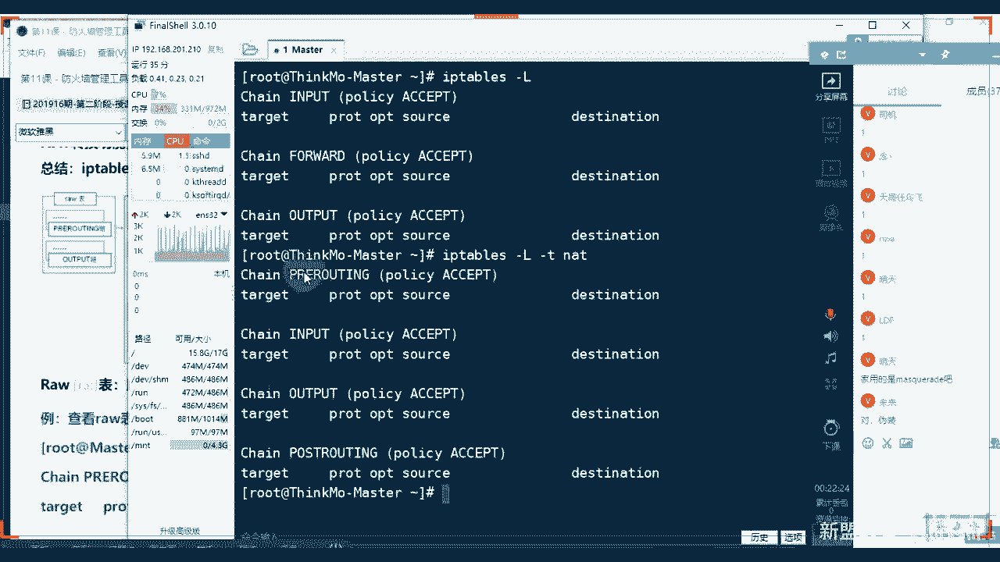
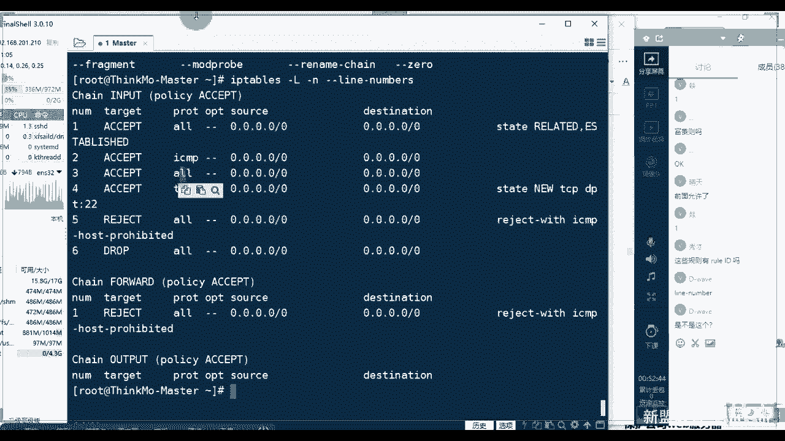
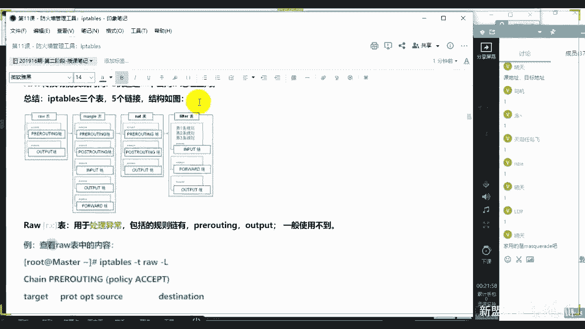
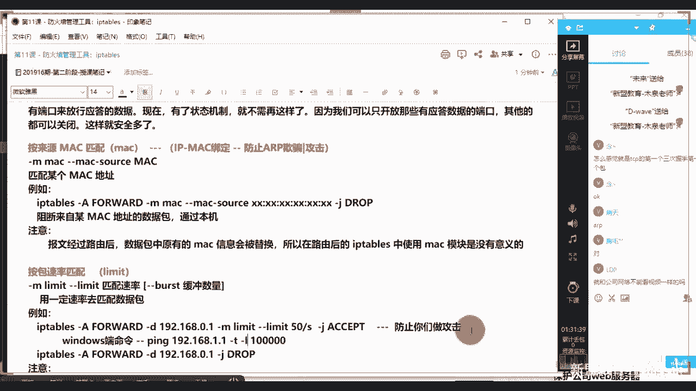
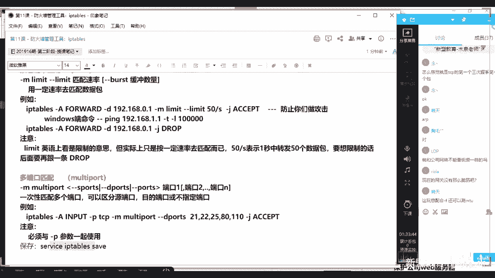
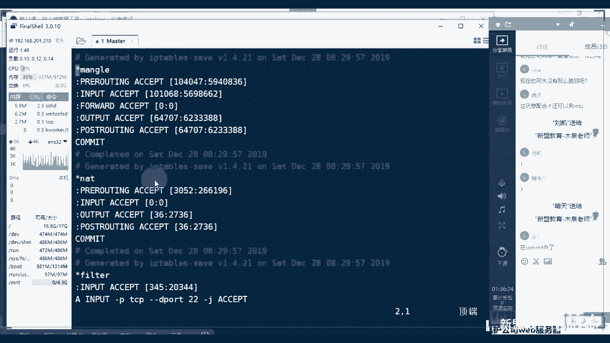

# 2021最新Linux-RHCE运维实战课程 - P11：RHCE-第11课-防火墙管理工具：iptables - 新盟教育 - BV17K4y1t7XR

Yeah。

啊，还好不是在开始么啊，我们说呃从ss期货从红帽七系统开始，我们整个的呃防火墙的管理工具叫做什么叫做fa word记了啊，叫做fa word记住这个只是管理工具。什么叫做管理工具，就跟软件一样，明白吗？

这个程序一样啊，但是我们同样也是支持IP tables的。那么七系统和6系统，我们其实现在都是IP tables那不是这前的管家都用是IP tables。所以这堂课我们照样是以IP tables为主。

而后边给大家讲解一些个关于fa word的一个介绍，好吧啊，还是以 table为主啊。那么内容的话给大家列举出来了iptables常用的概念，什么三表五练是吧？链之间的过程以及过滤的形式，了。

以及后边的实战啊，这个实战是很重要的。你把这几个实项搞清楚了。基本上你未来在做的时候，你就搞得非常能清楚，理解同学们，那你把这些搞清楚了，那你后边再遇到一些个什么流量的过滤转发你就不会懵逼了啊。

参数很多，虽然说ip table的参数很多很多啊。呃，你不需要记有的东西，你只会查你就会用明白了吧？另来说我们。😊，两个设备啊还是客户端和我们的服务端，好吧，一个是一点啊，这个是我们在公司啊。

所以是201点的啊啊呃来看啊，那么简单说个概述，我要说了，它只是一个管理工具，好师什么叫做管理工具往这看啊往这看，那么实际上有两部分组成。第一部分叫做nett filter。

第二部分叫做app tables，而nett filter，记住它是作为内核的空间的功能进来放起来这个是内核空间，它是内核的一部分，看了？由一些信息包过滤表组成。😊，好了啊。

那么实际上我们很多的数据大家明白，老师，如果我们想让整个的数据经过我的服务器啊，也就说把服务器作为一个中转站的话，我必须要开启IP forward拉进来啊。FRLARD forward。

甚至啊甚至来sorry。for WARD forward甚至有的时候我们要关闭什么一些个ICMP的重定向是吧？上次有人问我问题是不是怎么解决？要关闭SMP的重定向。

那这些其实很多都是要经过我们内核的参数去管理的谁管理net管理，听同学们？但是你能够直接去管理内核吗？有了功能是通过参数吗？不是知道吧？那怎么办？要通过一个用户层面的工具。

那这个工具叫做IP table，所以你们实际上玩的东西，不是什么？啊，大家，你们实际玩的东西就是软件明白了吧？啊，也称为用户空间，对吧？它是插入修改和除具实据表当中的内容。

我们也叫做规则啊这个上面写的东西叫做规则。啊，两个部分啊，那么net filter和I和IP tables后期简称为IP tables啊，你们应用的层次，那么是基于内核的防火墙功能强大。

这个都是不多说了啊。内置了filture进来nnet和mango3张表啊，三张表，但是实际上大家明白，老师，如果我现在随便问一下IP tables。

好着看，我们找一下table，找table走找下table啊，不找table找杠T啊，找杠T再看一下杠T的话指定的是一个table表格啊，找的是个表看看我们除了filter A和mango以外，还有吗？

😊，还有吗？还有个肉表，是不是还有吗？还有吗？还有个scurry，看到没有？😡，secur只是目前来说，securure压根不用。啊，压根不用肉也极少极少使用啊，肉也极少极少食用。

重点呢还是前三个过滤表NAT转换表以及mango过滤表。啊，来看这一边看好了。那这三个表的话，记住啊，所有的配置这是特别重要的一点。配置后，只要你回车立即生效。立即生效。所以当好了。

现在你们用的是虚拟机，你无需注意。为什么？哎，比方说老师我就是把所有的请求拒绝了啊，这个地方包括了SSH导致我们的远程连接出现故障，对吧？远程连接断开，但是我本地有我们的这个对不？同学们？我是不控制它。

我不再把它清空了就好了嘛？但是如果说哈，如果说真实的我们在IDC的服务器啊，尤其传统服务器，你是必须注意的，为啥？老师我拒绝了好，恭喜你你怎么办？怎么办？你只能给IDC打电话。

明白吗？你只能给IDC打电话啊，而且如果过于频繁的话，告诉大家，经常呢你会打不通哦。我告说如果你过于频繁的话，老师今验多了，明天又忘了两次了啊，第三次我估你第三就打不通了，明白了吗？哈理解了吧？哎。

你得给他们打电话，他们要帮你去重启或帮你去清清查的啊，理解了吧？哎，所以这个的话就是你的问题了啊，这是你的问题了。好，我们就说。😊，对吧你把所有都拒绝了。哎，所以这三张表大家请注意啊。

这三张表你们可以看啊，对，给钱就行啊。往这看，于老师我得知道对吧？三表五练，我们张经说叫做三表五练，对不对啊，老师之间有个关系嘛？来看图。😊。

啊，来上图来上图。啥意思啊？如果说I tables是一个工具。啊，MP table的工具啊，你们可以把它看做什么呢？看做这个这个这个呃我们说选美大赛啊，选美大赛可以的啊。那么在这里面一个。两个。

三个对吧？123啊，我们简单说啊，分别是我们的filture，分别是我们的AT对吧？分别是我们的mango。你看mango，那么请大家注一个问题啊，mango啊是A还是O来着，我忘记了是A还是OA对吧？

啊，mango表，那么在它里面的话，我们还会有链，对吧？有li啊，你比方说filter表里边的链，我们分别有三个哪三个叫做input啊，for word。啊，以及out。请大家注意一个问题啊。

所有的例儿记住aby table严格的控制大小写。好，写在这边。哦，是AB啊，三标5这。那么every table，我们严格控制大小姐。啥意思？到了，所有的表我们都是小写。啊，都是小写。

而我们所有的链儿。都是大戏。必须大写，理解了吗？请大家把这句话记起来。😡，啊，介绍起了。那么表里边的话，按照它去做，而列儿里边记住啊，每个列儿里边我们写的东西叫做规则，也就是具体要执行的内容能理解了吗？

同志们，这叫做规则啊，往往的可有规定。哎，取到了提到具体的我去过滤数据，还是转发，还是怎么样怎么样的一个规矩啊，来看这边啊，那么三张表fecher负责过滤数据的，这个大家都是很清楚的，对不对？哎。

记住啊，现在刚刚有人刚刚我忘说了啊。所有的防火墙，也就说这一代的防火墙。😡，知道了都是基于什么理念，都是基于ACL的对吧？😡，都是基于ACLACL叫什么？叫做访问控制列表，这个知道吧？访问控制列表。

那么访问控制列表里面，大家记住几个注意点。第二次一好，第一点是什么？第点是什么？好了，我们对数据只有什么过滤或者说允许，或者说是转发等动作，哎，必须对数据有动作。第二点最重也是最重要一点。任何记住啊。

任何我们的一个控制的流程或过滤的流程都是自顶向下依次匹配。对吧依次匹配。所以问大家一个问题，我们越严格的条件好，我应该是放在上面还是下边？越为严格的条件应该放在上面还是下边？18点钟。

上面还下面哎越条件应该越靠前啊，越靠前，对吧？越靠前越在上啊，越在上啊，越在上，明学们？一定是越靠前啊。啊，我说了它是什么跟ACL一样。大家如果说网络应该是明白的，依次匹配对不对？什么？依次匹配。

一旦我们匹配成功。😡，一旦匹配成功，则不继续匹配，把这条进来，你匹配成功了，我就不继续匹配你了。如果比方说老师还看好了，同志们，我们现在告诉了，第一条啊，拒绝我们的10。1。1。1好。

然后呢允许所有通过。😡，hello师们允许所有通过，此时记住了，你的10。1。1一定是被拒绝的，只有我匹配不到，那么其他的才会被通过。理解了吧？啊，这是ACL的东西啊。所一代所有朋火墙都是1exL的啊。

下一代朋火墙还在有新的概念不再说。😡，别着急啊，防火墙默认一会儿跟大家说，哎，它也会有默认，只不过不是在最后写啊。然后了，这是我们的filelter过滤表啊。

里边的li inputput output forward，这具体是什么？一会儿说。😡，AD设计的是网络地址转换。这个大家能明白的啊，是转换什么？是我的私网和我的公网之间做转换的，对吧？转换的。

所以记住了，这个东西是在于路由层次。路由层次，所以答好了，我的例儿叫做pre roing。哎，准备路由post rooting发出路由out的输出。可加啊，最后是mango表。哎，对。

最后是mango表，主要应用在修改数据包内容上啊。例如用来做流量整形的，比方说给我们数据包打个标识是吧？默认的是5个链都有啊，默认5个链都有大家。好吧。还看看那这几个链老师我怎么组合是吧？

当我的数据流经我的服务器，甭管是进入我们服务器内部，还是说通过服务器做转发，那我到底是怎样一个顺序，是不是这样一个顺序，再来看这边啊。那么首先先明白这5个链的具体含义。

第一个input匹配目的ID是本机的数据包，知了，是我的入口IP。啊，入口流量。入口流量进到数据本本地的。第二个出口数据包一般不在此列上做配置，别着急，forward匹配流经本地的数据包。

proly用来修改目的地址，做DNAT咋啦？这个起来一个是DNAT，一个叫SAT。好，DNAT叫什么？叫做目的NAT。😡，好，所以我们修改的是什么？修改的是destination嘛，需的是目的ID到了。

此时啊是你要转发。比方说我说我是10的，我要转发转发给谁给100哎，我把10转换成100，理解了吧？而SNAT叫做原NAT到了。那么我们修改的是原IP好的好了，像我们现在家用的路由上网。😡。

家用共共享上网。好的这来就是使用的SNE这样是不是我是把原地址转了呀，对不对？同志们，我是不是把原地址转了呀？能理解吗？列上一啊。私网转工网了，对不对？目的这个地方一般来说都是对于我的服务器接收数据。

对不对？服务器接收，然后我们做内部的集群分发处理。啊，前端有个人接到了给后边谁呀，这我得转换个地址发过去。这个到了后边我们学到了这个这个这个呃LVS的时候，有一个专门的就是它啊专门的就是它别着急。

一会会细说啊，里面会有一些个状态好，内网通过路由器A上就是我们的一个SAT啊，那么记住三表5列具体的结构给大家列举出来了，可以看一下啊，看到没有？肉表啊，肉表我没说啊。

留两个列一个是ing一个是out改好了，这几个列匹配的顺序，这几个表匹配的顺序，先匹配肉表再匹配mango表再匹配A再匹配ter看到没有啊。

氛围越来越精确会越来越精确mengo比方说一些个特殊标识A是否是转发。如果是记入我在匹配具体记录的数据看到没有？那么一个过程啊，那么一个过程啊，然后再往下。😊，看好了，漏表的话，我就给大家列举一下。

但不怎么用啊，用于处理异常，用于处理异常。那么此时它是包括的料有两个，一个proing一个是out of的，一般用不到。好吧，最后那个security连提都不提了啊，然后这边看。但是老师我怎么记啊。

是吧？这几个我要记混了，是不是很丢人啊，不丢人啊，我也不记这东西，知道吧？兄弟们怎么办？很简单，来看appytables好，命令啊，这是appy tables。😡。

怎么办？直接使用杠大L调起来，表示显示当前IP tables设置的规则。那默认情况我们显示的都是filter表。记住啊，默认显示filter表。所以它一回收。

你看一下是不是imput forward和outputchannel是表示的是li的意思。

啊，亲爱的表示是利儿的意思。信是不是？好，那老师，我想看别的呢，先看别的呢？杠T用杠T去指定我们的表格啊，表儿，那记住用小写看一下是不是prerouting inputput output。

还有prerooting，看到没有？看到没有啊，这里面多了一个是吧？这里面多了一个啊，现在记忆里面多了一个多一个谁呀？多一个是input是吧？多了个input。😡。

啊，4个啊。来记出来吧，更改一下这个一共有4个表。in不。对啦。再往下，你知要说看mango标怎么看哎，渗渗透6秒有渗到6秒有。😡，C里面这是新加上来的对吧？系都是新加上来的。6的话，你可以看一下。

没有input的啊。再看老师看mongo表杠TMNGLE。😊，啊，MNGE看同志们是不是12345都有了，按照顺序看看是不是先找到路由，我才能进到本机，或者是我转发出本机出路由，看顺序都是挺好的吧。

来能看懂刷一。这说。能看懂吗？好啊，进来。😊。

好，那么往下面走的好了，那老师具体的我怎么做，怎么转换呢？是不是我具得怎么转换呢？往这儿看啊，记住了，所有的都是表链规则。这里边看到我们都是清空的。

我每次都会做一个杠AB table杠大F表示清空所有的配置。😡。

啊，所以大家可以看到，我们现在如果使用杠L的话，里边是没有任何的规则的，没有任何规则啊。tt目的是吧？啊或我的目标是拒绝还是允许，是不是来自哪里的啊，原是哪里，然后destination是什么，对不对？

pros是什么，协议是什么？那都没有啊。那么具体来看一下我IPtables整个过滤包怎么做呢？看了，当我的数据流经我的服务器，我第一步要干嘛？😡。

对白吧？我要去匹配路由，对不对？谁有匹配路由的？prunuting，大家知啊prunuting准备路由寻找路由，谁有啊，谁有啊，mengo和NAT有是不是？😡，是不芒果和AAT有啊。😡，然后呢。

同学们然后有了它之后，我们找到它进到下一步了，先进mango表过滤，再进AT表过滤。理解了吧？谁优先谁优先men狗优先，谁具体AT具体。😡，你啊。啊，但是是不是答家一个问题。

如果此时两个表上都有请问好了？如果mongo是过滤，NAT是允许是被过滤了还是允许了？是被过滤了还是允水？😡，mongo允呃mongo过滤A允许。mongo过滤AT允许。背什么呀？背过滤啊。

跟你的规则是一样的，一定是表带前，那者先金表的，好不好？哎，proing好，大好了往下走，找到了路由，找到路由两种情况，一种呢是把你当做中转站，我不经我不经过你的服务进行处理，我不用经过你。

你只要把我转发出去好了，把你当做路由器。😊，对吧。我的意思是说，举个概念连吧，兄弟，举个概念啊，不是他俩有过滤啊，好？😡，不是大家有过滤的概念啊，我只举个例子啊，好不好？哎，做匹配嘛，做匹配嘛。

先听谁的，如果它俩冲突的话怎么办啊？来看，那么我这边的话进来了，第一种情况，我只是把你当做路由器，做转发，只有转发for，一个是filter，一个是mango，对不对？也是先进mango。

再进filter。😊，到了，这个事儿直接流过你，不进入你的任何服务里面。最后preruuting出去，先经过run go再经过NAT看到没有？先经过再经过它。然后回来，如果老师我想经过你呢。

那么我会input进来。到了在这个位置，我是不是应该再加上一个mango AAT filter了，对吧？如果是7里边的话，还有1个AAT。😡，搭的AD好，经过本地数据处理啊，数据处理之后。

我来告诉你往哪里走，是不是？尤其是在我们一个设备多个网卡的情况下。这个点两个路径啊尤为重要啊，最后呢都是经过AT和mango进行出去啊，出路由进来这个表记来啊啊这个表记来，所以大家看这是我们自己画的啊。

这是我自己画的。然后呢，我把这个地方再加一下。啊，再加一下。好吧，合议厅。走啊，再加一下。有啊。好。好了。😊，加一下啊，那么这个表我希望你们自己能够去画一下，好不好啊？这个表自己去画一下。

怎个了解一下这么一个流经的过程啊，流经的一个过程。好，然后我们这种。啊，这个表能有OK吗？同志们ok刷个一上来。😡，发一。好啦， ok k 。😊，O。😊，大家看，所以整体上大家是这道啊。

但是我们其实在整个流过的时候分为两种了啊，已经分了啊，两条路径吧。第一种发给防火墙本身的数据包。第二种经过一种是经过一种是发给。啊，最大的区别啊。哎，一个是被filelter过滤的是。

一个是不需要filelter过滤的是吧？直接出去了吧啊，有有一个mongo啊哎，sorry。这个画的一个地方啊，到时候看，那么当一个数据包说一个流程啊，当M tables与f word的区别呃。

哪个有什么多？哪个有的多呢？呃，有啥区别？记住啊，他们两个人在。我说了叫做net filter，大家觉得吧？net filter加上ipy tables，这是它的内核控制。

fiair word没有内核控制啊，内核控制不是net filter。哎，这个我不一开始说了吗，是吧？我说了ipy tables用的多呀，这不一开始就说了吗？咋又问了呢？是没有听，是不是刚来了？啊。

一定是 table啊，区别的话，后面会讲别着急啊，那么大举一个问题啊，当一个数据包我们进入到网卡的时候，首先进入的是prouting链，对吧？那么内核会根据数据包目的IP去判断我们是否转发还是进入。

7里别是啊7里别是，但是用的并不多啊，我们这不是说了吗？是不是这不说了吗？7也是支持FEbos的。😡，他不是不支持。他只多出来一个f word。😡，我们还是老规矩还是老规矩是吧？还是老规矩。

用最新的还是用最稳定的。😡，最稳定的。啊，他用最稳定的稳定嘛，对不对？稳定的啊，用稳定的。所以一个概念就是同学们，为什么你要用为什么你要用为什么你要用everyable，其实也不是基于稳定的问题。

就是用它更方便。😡，faair word听住了，faair world最大的难处是在于它的命令复杂。啊，你说老师我有GUI呀，有GUI控制方便，对吧？但是它会更简单一点，这这东好不好？啊就说啊。哎。

不着急。哎，接着说啊，那么此时注意这个位置啊，是这个位置啊，所以我说转化数据。第二个来说，如果数据包是进入我本机，注意了，这个是记入本机了，所以要有input，对不对？那么它要沿着图向下走。

经过我们的input链。最后看了数据包到了input链之后，任何进程都会收到它，这个是最重要的。看有，这个是最主要的呀。经过数据处理，本地上运行的程序可以发送数据包。

这些数据包会经过output的发送给我们的postal routing输出。啊，或者经过数据处理进行返回。如果数据包哎，对，别着急别着急。如果数据包都是转发出去，显内核允许。记住啊，内核允许啥意思？

啥意思啊？这个就是我刚刚说的I tables for word这个必须大了，for word量。好，必须搭配。师傅，要不然你没法转，知道吧？要不然你没法转。😡，啊，要不然你没法转。

那么数据包就会沿右边去走，对了啊，这包就沿径去走。经过forword链到达posts routine，好不好？这是两个过程啊。那么表链的优先级在这儿呢，第一个来说ro表最优先，然后我们的mango。

然后是AD，这就是filter，看到没有？那么链之间的匹配顺序，先经过入站记住入站进入本地一定是路由之后进行input。出站先出去再post ro。在找路游，对不对？我只有出了我本地，你才能去寻址吧。

😡，上去停止啊。OKO别着急别着急，一会儿说啊。再往下面转发知了，转发的话，你们告诉我还有数据处理的过程吗？没有了，对不对？就是路由的问题，所以是pre opposed post以及for做好吧。

别站起了，匹配顺序自顶向下，按照顺序依次进行啊，依次进行找到匹配的规则及停制。😊，看到没有？找到匹配的顺序及停整，这个就是我们最常见的ACL的匹配原则啊，那么注意了。如果说老师此时我列儿上都没有啊。

哦感心了是吧？老师此时列儿上都没有任何匹配的规则，我们就按照该列的默认策略到了。那么默认策略在哪呢？

啊有人眼睛可以看到吗？来，有人知道默认策略在哪吗？我现在都是空是吧？我现在都是空，我也没写默认的呀，在哪里啊？😡，在哪里啊？来看啊，看到没有？在每个列后边，在每个列儿后边是不是有括号啊？

看到了吗？来，同志们看到二刷一。😊。

合同啥意？在每个列后边这个位置就是我的默认策略进来。

啊，这就是我的默认策略。好，这是默认策略啊，画红的圈起来的是我们的默认策略。当你什么都不做，默认情况下，其为允许accept注意了啊，注意了。那么我们说这个策略最终执行的叫做动作。叫做动作。

动作有多个啊，最最起码要有4个，一个是ACCEBD知道了？动作也是必须大写。啊，动作必须大写。对。啊，所以到这一边给他做个总结啊，两种数据包，一种经过一种发送，对不对？匹配顺序非常重要，谁规则越严格。

谁就应该越放在前面。检查规则的时候是从上往下啊，这个是1个PS注意一下就了。啊，如果你们学过网络ACL的话，就明白这个东西了，对吧？啊，很简单，所有的防火墙记住所有的防火墙都是一个概念。

都是基于ACL进行包过滤。那些同学们都是一群包裹主，甭管是飞塔的，甭管是贴绒性的还是黑锈服的，好不好？所以这边简单补充几个啊，安全的防火墙的厂商。那么大家知道的，国际有名的飞塔，是不是再往下呢。

国内有名的是身锈服啊，贴绒器。还有吗还有吗？绿网科技、山石网科，还有吗？同学们。知道吧？是不是啊，住里边。9一份。对吧juniper。I want do。啊，juniper啊，国际的国际的看到没有？啊。

还有叫个启明星辰是吧？这个是启明星辰也不错的啊啊，这两个是国际的，这几个是国内的，大家你们公司有吗？有吗？有人用都用吗？当然这些个一般都是硬方。啊，硬件防火墙好不好？硬件防火墙最后的话其实不需要命令啊。

不需要命令，都基本上都是。基本都是什么基本都是外表配置是吧？你只要点进来，老师，我添上去点几个书籍个IP地址就可以了。图形化完全图形化啊，你就认请不认证，那可以的对吧？啊，你有绅士符的绅士服。

其实绅士服和天柔信的话，一般来说这两个是呃央采的这道题啊，华三华为华三华为他来是主要做路邮销换的啊。跟网国国内的话，你现在25是吧？这两个有的是25嘛，山是网科和这个是吧？安全厂上啊，别了。😊，拿起来。

呃，然后就是说。Yeah。着急，华为就是我就说华为属于二道贩子，知道吧？华为属于二道贩子。啊，先不用考虑你的公司有这些东西，你再去做，知道吧？没有的话，其实不需要的。

因为IP tables跟说一个实战的话，就是防火墙，你会概念，你就会操作这些设备，明了吧？啊，除非有一些个那天谁问我的，说一个东西啊，华三。啊，华山里边的话有一个防火墙，防火墙的话，它是支持一些个。

比方说像DNS的脑裂，知道吧？可能会有脑裂的情况啊，会出现这种东西。还有一个是DNS的mapDS mapap啊，华山的这个设备里面啊，对DS一些个做一些个东西啊，这个如果你们有遇到的话，再去说好吧。

再去说。啊，然后就是说说一下IPtable部署啊，IPtable部署啊，呃，这个我们一个一个实验啊，后面啊I部署应该不用我多说了吧，同学们怎么办？默认肯定是安装好的了啊。

你也可以样么一做杠YIP table，你可看一下是不是用装。😊。

是看到没说看到没有？张同任，你发现老师我又装了一遍，是不是又装了一个啊，来好了。哎，其实这个是一个真正的服务。😡，呃，防火墙不是没有技术排量啊，大家徐了，所有的操作都是没有技术排量的，难的是什么？

防火墙本身没价值，有价值的是你的安全意识，对的，你的安全意识，你的安全逻辑等等等等，明白了吗？原理还是一般，就是重点的是你是不是老师我公司到底要禁止什么？我公司允许什么？这几个禁止和几个转发。

这它的一个逻辑问题啊，限制逻辑是最主要的啊好，把apptable装好了，知道了，ssal cTL对是工具stop fair word啊，请你把fa word已经关掉，否则这两个可能会冲突，明白了吧？啊。

你像我们在生产环境的时候都是删掉都是关掉fa word用apptable。😡。

哎，对，好对了啊，那么这里边关掉了啊，然后你可以dcable禁用掉它啊，一般公司里面也会进用掉它。😊。

好第C宝第二次ABLE。

啊，Dcable关掉它。好，然向走到了，安装好了吧，安装好了吧啊，安装好之后，第一个来说配置文件在这呢啊，配置文件在这儿呢，可以看到吗？哪里啊？在我们的ETC下。😊。

叫做sister configIP tables听到了吗？同学们杠confi啊，杠confiIP6，这是IPV6的防火墙啊，IP6的防火墙，这个我们不用啊，这个我不用好吧，来看一下里面的东西啊，VM。

😊，不要么大哈。可以看一下里边有很多的我们的模块，看到没有？里边有很多的模块，啥模块啊？李老说abable的模块有应用吗？没有应用，看到没有？保存到了保存在它停止上，就说保存吗？保存上一次的情况吗？

不保存看到没有？我不保存，这是默认情况看这后下面ab save on我们在重启的时候，你的规则是否保存保存吗？不保存，就是说到了，除了我们默认的策略默认系统自己生成的以外，但凡是我们修改之后好。

老师我呢关闭防火墙，或者老师我重启防火墙好，它都会恢复成默认。😡，对了吧，操作会恢复成功，那会怎么办？你要做保存，或者你要yes，改y也行啊。但我们一般都是直接做个保存，好吧，对了。😡，打了。拉到。

来到这边来到这边保存在哪儿保存哪，看好了，用一条命令你就知道了啊，用一条命令怎么做了？叫做IB tables好了，叫做s啊？哎，不对，不是s，叫做IB tables。😡。

宝贝EDC。IITI table一般都是这么做的啊。😊，啊，因为这么多，但这里面没有是吧，sysal cTL这么多条了，sve table看一下，哎，没有sve是吧？M那条命令么时来个？

servur是吧？serv看最底下了，最底下我这呢serv service。😊。

あ、そぞ。serviceM tables它有的支持有的不支持啊，C5大看看一下啊，在这个地方的话，告诉你有一个默认的地方，是不是？哎，告诉你有的是支持，有的是不支持是吧？有的支持有的是不支持，啊有啊。

有支持有的不支持啊，没关系没关系，这个没关系呃，这是七里面六里边的话是可以用这个的啊，六里边是可以用这个的。其实。😊，我这里边做一个呃实验的话，正常来说是不用装它的啊。

因为这是六里面你可以装7里面不用装，它是自带的。大家看一下everytable我们来看一下啊，everytable。啊，这是我的网段啊，来看呃，我们这么走吧，还是看这个笔记吧，跟着我笔记走吧。

happy table save可以吗？这里面iappy tablesC5。😊，确定还可以是吧？可以啊，呃，看一下看一下这个文件，我记得是在哪里来着？我就实想找这个文件的，给你们写的出来，应该是在。

C列。KDEDCs confi对吧？里边的话应该有个IP tables。的confi文件里边会单纯不是这个文件，不是这个文件。呃，一会儿我想起来再说吧，一会儿想起来再说吧，先按这地方说吧。😊。

啊，站在这个地方走。那么我们安装到这是一个配置文件啊，按照这个配置文件。那么我们启动它和这个这个这个开机字体是吧？啊，拿起来好，来坐。

呃，启动systemCTLstarIables。😊，好，然后fo true是吧，应该是restart哎，也没有是吧，那就是service。哎，艾table保。s啥。这是VICE。呃，没有这个命令是吧？

啊，我们这样子啊呃要么instore杠Yfsh杠。杠COM。COMPLETLNcomp啊。我们装一下它装一下它啊，SU。重新登录一下对吧？重登录一下，然后system cTL呃star。那了？哎。

sorry。哎，戴二上。对吧我们的IPC哎，没有这个吗？sry啊，IPC哎卡了。卡了。😊，啊，有了吧。哎，这么卡吗？稍等啊。IP电。呃，没有这个没有这个没有这个，那他他是没有装上是吧？哇，这么卡。

等一下啊有点卡有点卡，CPU满了是吧？CPU满了。😊，这不用完了，收到。呃，CPU下去了啊，那就是没有IP table这个命令啊。那这个大家看了，这里面就是这应该这应该是吧这个应该是7里面的呀。

应该是七里面。我再看一下啊，稍等啊，我们要么杠杠list我们的IP tables好吧，我们抓取一下它。

啊，DM律。没有。走，稍等啊，我我抓取一下单啊，看一下。😊，啊，这是我们亚么园里面有的对吧？然后我们看一下我们现在装的RPM杠QA graphI tables。我是装错了。啊，装的是这个是吧？

同志们装的是这个啊，装是这个看上面很多你没装吧，是不是正常来说你应该装这个的啊，正常来说应该装这个啊，装这个啊。呃，什吧，我们把它删掉吧啊，亚某呃如易木。杠Y啊不不下了，就这样开始吧。

我们再装一个亚门因素杠YIP table星啊，有个星都装上来，把它都装上。也不大对吧？都装上就好了啊，symal CTL呃start。IP tables。看到吗？这就有了吧，同志们这就有了吧，听见了吗？

啊，刚才装的包少了，少装了个包好不好？把这几个把这个包，或者你把这个包装上，一定是叉轴4的，能理解吗？来了一刷一。😡，来的时候一一定是叉轴是4的啊啊，然后我们才可以开始enable是吧？

Eab变E开机字己啊，开机自己好，然后我们再看一下EDC下，我们看一下这里面有没有了，没有一会儿再说啊。😊，好，appytable这就有了。大哥。😊，看同学们appy boss有了吧，有这个新的了吧。

刚刚我们看的这个刚com好，看一下同学们看这里面的东西，看这里面的东西看一下。😊，看一下是什么？这是你默认的一些个。规则看有吗默认那些规则啊。那你比方说到了，happy table box。

我现在是已经被清空了啊，我重启之后看到没有？安装重启之后，我是不是那些个新的呀？看到没有？那些新规则都有了吧，都有了吧。老师我现在清空一下好了，M跟F清空再来显示没了吧。😊，没了吧，好。

restar一下。re start一下Ivy tables大家看一下。大家是不是又都出现了？这就是我刚刚说的，你那个配置文件你没有保存，理解了吧？😡，啊，除非大佬ary tables。

我们做完修改之后啊，杠C清杠F星空，我们做Ay tables。四五好啦，四五。啊，这的C5对不对？就有了啊，保持下呃，我们看一下呃，是是是是应该用这个方式啊，用system。start s还有同学们。

这里边有sve吗？啊，这里面还是没有sve是吧？行，那一会再说，保存问题啊。我们先清楚了，如果说你后期玩的转。老师，我后期玩的贼溜是吧？防火墙你记住，你是不需要写命令的，你直接就来我们这个里边进行。

配置啊，其实这就是一条条的命令，明白了吗？我只是需要在前面加个Iy tables，这就是具体的参数了。一会我会记体说啊，一会具体说，那么格式的话。

先了解一下iy tables的命令加上可了画中括号的啊不是负规则啊，副规则只存在于f word里边Iy tables可没有不规则啊，好了，画中括号的表示我可以省略的这个地方啊。

更T表明我是不是可以省略啊。推手略吧。啊案，被省略呀，管理项那些个参数一般都是大写的列名大写的匹配的条件，老师匹配原目的是吧？原IP目的IP原麦ike目的ac还是我们的某个协议的某个端口。

最后杠G表示我对这个匹配的流量进行允许，还是拒绝。就在这儿啊，那么此时不指定表明表示fter，我说过了啊，不指定列名表示该表内所有的列，明白了？同志们除非设置列为缺省的策略，否则需要指定匹配条件。啦。

否则需要只备配条件。对。啊，重点啊，那么语法结构啊，知道这个语法什么意思吗？你把这个东西保存好了，你就是跟他去做搭配。老师抽出来杠T选择是吧A filter还是说是mangoDB啊，干什么呢？

选择一个命令参数，杠A表示添加插入追加啊，一般都是在最尾巴上追加杠D删除杠A是插入，你可以指定行数插入好，这哪个表对哪个列对吧？into的列里边具体的，你比方说我们找一个P啊，基于TCP的干嘛呢？

我们把它accept允许。理解了吧啊，这么一个规则啊，这个表其实你们在百度上也能找得到，对吧？这个表你们在百度上找得到啊。😊，好，举个例子啊举个例子，在这边来看。😊。

第一个来说是appittables命令使用好吧。啊，杠第这个不用说了啊，里边的话操作命点这几个细讲这5个啊，细讲这5个啊，来看杠A加上列二名叫做H append append，啥意思啊？啥意思啊？

append要是追加一条，一般来说都是放在最后，追加是不是放在最后的，对？好起来啊，他没有办法指定老师，我一定要添加在第五行，他没有办法，它只能在最后啊。那么此时好了，杠T这个是可以省略的啊。

这是可以省略的对吧？干嘛呢？杠A指令老师，我要在input里面增加增加什么呀？增加一个杠G删除做扔掉扔掉啊，扔掉啊。当拒绝所有人访问自信。

没。来看，如果此时啊当了，如果此时好了，我们看一下阿倍 table杠L。😊，啊，我们冲启一下啊。注意下啊。同下好，阿。-2。好，我问大家一个问题啊，此时我写了IP tables啊。

我们省略这个杠T了啊杠Aim数量杠GDROP。啊，d啊，删除到了，比说比如说我不是拒绝了所有吗？为什么我还能连接啊？SIH是所有的，我为什么还能连接啊？😡，为啥为啥？带上了。

我是不是在前面有一个看是我允水了吧，在这呢看到没有？在哪来看一下，在我们的input链，看一下啊anythinganything是不是这亮看到没有，兄不是看到没有？😊，看到这儿了吧？看到吧？

是不是TCPdiportS是22中考。😡，看到没有啊，你说我说我看不到是SIA转，那你看个N这看看N。😡，小恩。看22端口吧，DPD表示destistination port目的端口，22端口。😡。

别的同学们啊，不是艾VR0。0。0吗？这不是你写的吗？d所有的从哪来的，去哪儿的都被ro掉。😡。

没有了吧。啊，就这一条。好，非小词啊，在最后添加insert记住insert表示的是插入一条规则。你说的师我具体在哪一条插入呢？我就要这一条插入。哎，老师我得知道吧，123456好，我得挨个数。

别着急，哎，对老师有入ID吗？有入ID吗？我前面能不能序列号啊，肯定是得有的，怎么做？好了，appy tables杠L杠N好了，杠杠number知好了，杠杠numb里面的话，我记得是如果没有错啊。

看有没有猜出来的。😡，呃，杠杠number啊啊，找一下是哪个啊，这的啊不是number one，是这个看一下啊。我俩是哪个啊？嗯，还是杠吗？AUM这个哎，不是。找一下啊，我找一下啊呃杠。呃。

我找一下我找一下是哪个显示专门的链来烂是吗？哦，对，L numbers啊，看错了，知了有line numbers是吧？😊，听看到吗？123456。啊，对。

是这个是这个是这个这个那么123456给你列举出来了吧。你比方说老师，我现在想用I在第五行插入，记住啊，第五行就是说我会取代它把它往后移，理解吗？同志们把它往后移abeable，你比方说杠I叉5。

还有同志们reject啊，看reject到哪去吧？我们干嘛呢？我们按照插上面给答啊。你比方说老师杠I drop所有。😡。

大重不重要？好，杠G。DLPSR啊DLP空格啊，空格哦，no channelnel啊，我给channel啊呃呃呃 inputput啊 inputput啊，在这有input啊。质量。input都大写啊。

都大汉套了happy tables干呀。

听到了吗？听到了吗？同学们杠嗯杠杠line number。😊，你看是不是我第五个取代他了，往下移了一个，来看到刷音。😡，问题了。这个。O。😊，一定是往下啊，顶替了啊。😊，大家好呃。😊，我走啊。😊，哎。

所以记得啊第一条或者第几条都可以做啊。如果你啥都不加，你不加数字表示第一。你不加数字表示我在开头插入啊。😡，好，往下走往下走往下走往下走。呃，杠R这个我们就不用说了，杠R是代替是吧，怎么办？替代啊。

也就说不是顶替你了，往下移一位，而是你这条就被我覆盖了啊覆盖了。😊。

杠D是删除杠D是指定删除某一行，看到没有？同志们指定删除某一个。如果说我真的不记得了是吧，他是哪一个了，我也可以按照具体的命令，我怕删错，那么我就把这个杠A。😡，啊，我主要把这个杠A改成杠D。简单吧。

同志们。😡，哎呀，啊或你就跟杠离input的链，你不需要根据体内容了。

啊，第我就不解是吧，要演示一遍吧。好了，Iable当了，我们按照一开始的杠A是吧，input好杠G是吧？DROP。😊，好好了，我把杠低看是不是改了，是不是改了啊。😊，看看兄弟们没了吧没了吧。😊。

这条是没了，最底下那个是没了。😡，对吧这就是没了吧，两个吧，没了一个吧。好，同样的老师刚哎。😊，看拉杠来印度的卡拉，我们杠D看同志们啊，杠1做法啊，这个就把删掉这个看也删掉了吧。

给下掉了吧，哎，就是把上面的改掉一下就可以了。好记啊这个啊。😊，杠P注意了，杠P这个是设置默认规则，大家记住。更题是唯一一个在我们部署策略。冇啦。唯一一个在我们部署策略时。不需要什么我们杠G参数动作的。

它不需要啊它不需要，你像这样这个删除不是部署，是删除，对吧？杠A杠I是不是都得需要杠G呀，对不对？但是P不需要，我只需要指定一个列儿就可以了。但要指定一个列。

到了此时如果I tables啊杠P指定input drop。😡。

指定义的shop好IP tables杠L。来看这个地方默认都说吧。😡，先匹配依次匹配，如果都匹配没有了，我就会匹配d。😡。

理解了吗？理解了吗？那么请注意请注意啊。那么在这种情况下，我们生产环境。些太阳应该吧。啊，一般都是啊一般都是默认拒绝，然后开放某些策略。好吧，默认拒绝开放模式策略，跟跟跟思科是一个逻辑。啊。

跟思科是一个逻辑。这样的。都往要走。M清空，这也不用我说了，这个也是临时清空，好吧？同志们，你要是想具体的清空对吧？我说我想具体的去清空某个表，然后就下面跟上某个表。😡，他没有办法清面，他得清表的。

对同们啊，粒儿的话得指出来不指的话，它是不轻的。😡。

下一克。😊，老师，我现在想提供这个for word可以吧？abeable杠F。好，同学们，我们指的是for word。😡，看every看是不是只辛苦了富的？😊，看到没有？

但如果说老是我IB这斯刚F已经全没了，我就会断网了。为什么断？我已经不允许TCP了HDDSSH了，对不对？啊，所以我不做这个整个清了啊，对。😡。

对了啊。好。ああ。不影响啊，大家记说啊杠F不影响杠P记住啊这块起来杠F不影响杠P。😡，啊，需要手动感。嗯，走下好，让快走下走下走下走下走走走走crol type啊，这个自己看一眼就明白了啊。

如果不写列二名，默认清空所有，对吧？😊，啊，杠Z啊是计数器清零啊，当D是计数器清零，这个不咋用啊，这个不咋用。好吧，你可以看一下哪里有变化，好吧？同学们来看一下，大家看一下，来看一下这个地方有变化。

现在没有变化吧，现在没有变化吧，老师杠Z。😊。

好，avaable的。大。有什么区别吗？啊，没有什么区别，是不是在此时看看到了吗？在此时看其实没有什么区别啊，到后边的时候，我们如果遇到我再跟大家细说杠Z好吧啊，这个这么说得嗯，麻烦了就就麻烦了啊。

杠Llist，我们一直在用的啊，杠小V杠小V显示详细信息，包括每周上面的匹配的字节数数量啊，来看一下。😊。

啊，这个在这会用的啊，看到了没啊？这个地方看到没有？这为什么是零了，知道吗？为什么是零了？告诉我为什么是零了，是因为我刚刚用了杠C，是不是？😡，别了吗？杠低清的是他们啊，杠才清的是他们啊。啊。

这个数字没有多少，现在我是没有，因为我没有数据交互。

没有数据交互啊，杠X再它上禁止自动计算单位啊，禁止单位换算啊，这个就没什么，这个你自己记巧了啊，杠V的话可能会用不到。对吧好，高N的话进来。刚的话，显示IP地址合同尾号。啊，不显示域名和辅名称。

这个我刚刚做过了吧。lum number显示规则号ID号。对吧好，这是常用的啊，再往下面呃，这自己看一眼吧，好吧，这个大家可以自己看一眼吧。😊，这可以吗？啊，行啊看一眼吧，我带大家看一眼吧。

看一眼来看同志们第一步来说ab杠L，对吧？这是我们现在看的是自己的啊，自己的粗略的列出了filter所有的匹配的规则量规则，是不是好， table杠TAT当好了，此时公察个AT的话，看有东西嘛？

有东西吧？也是啥啥啥都没有了，是不是啥啥都没有的？那如果是LNV找一下。😊，啊。呃，VNL这必须这么搞嘛啊，还不能还能返啊，还不能返，还不看会多出来一些啊字节数数据包数是吧，数据包数字节数对不对？

会出来一些东西啊，多出来一些东西packages那我还是看这个这个这个dter吧。😊，啊，sorry。走大 filterter里面戴好了，可以看到吧？😊，哎，这个就有了吧，允许所有大就有就有数据了吧。

看到没有？就有数据了吧。啊，对。这是具体就查看某个面的，这就不多说了啊。😡，呃，okK当了，这两个是不可以成功的啊，这样是不可以成功的。请加进来啊，这个是可以成功的，但是它是不行的，理解了吗？

除非你把它倒过来啊，除非你把它倒过来能理解吗？来列串一。啊，除非你把它倒过来。こと。好。就是说啊嗯然后。这是我们的基本的粒上的东西，大家明白了。好吧，基本这样明白了。然后我们先休息一会儿好不好啊。

休息5分钟啊，休息5分钟啊，包宝同志们啊到我们的这个这个一会回来啊。喝口水去行吧，我也喝口水去了，主要是晚上这段时间我在公司里边知道吧？公司的话，你们懂的外边一堆讲公开课的，我也要声嘶力竭，是吧？

所以嗓子有点受不住，不如在家在家的话，我不需要这么大的声音啊，先暂停一下啊，醒醒盹了吗？醒盹了吗？啊，我醒了啊，来这着说啊啊，再到现午瞬间啊，连炫太了就容易炸。好吧。😊，然后接着说啊这怎么说啊。

就是然后是匹配的条件啊，匹配的条件呢就是更深一层了。就是我们这几带好了。前面讲的是关于链的问题，对吧？就是ok老师我对哪个链添加这种链的操作很笼统去说，那后边老师我要对具体的流量进行匹配，对不对？

那匹配的话，老师我怎么匹配啊，它么匹配啊，我得根据流量的来源或根据流量的属性特征来，对不对？那么我们一般会按照四类去分D类来我考了，是我流入和流出的接口啊，流入或流出的接口啊没有声音呢？有吧。😊，有吧。

来能听到的话说一啊，有有okOK啊啊，没有的话，重新刷新一下啊，没有重新进。啊，当好了，那我流入流出的接口就不用我说了，in表示么in度的欧表示out的，对不对？那怎么用啊？很简单。

老师杠I是不是指你的网卡ENS32跟OENS34啥意思？从我32流进来的流量，我们都要从34流出去，理了吗？啊，从32流经从34流出的流量，我们进行过滤。啊，杠S和杠D，这个不用我说了。

这个跟的都是杠SID或者说是IP段能理解吧？啊，或者说是IP段更低也是一样，跟具体的ID或者具体的IP对对吧啊。对啦。😊，哎，原地址和呃目的地址好吧。

s destination更P协议 protocolto对吧？TCP还是UDP。啊，TCP还是有理P。当然这里面可能还有更细的。比方老师，我杠P里边的话有东西叫做杠PICMP对不对？

那底下还会有杠杠ICMP杠TYD你是P是吧？是ele还是说还是说什么我们的tt对吧？得会有一个具体的啊，一会再去看。😊，更低来源和目的端口号大记了，这个必须联合。杠P使用。啊，必须联合杠P使用。

因为什么所有的服务都是基于协议来的，所有协议都是属于某一个的，对不对？那你必须要指定啊这句机来。啊，必须要联合我们的杠P使用。那么按照网卡接口的一个案例啊，在边看这个地方的话。

主要应用于记住这个参数主要用于AD大家明白了？AD转换表吗，对不对？我一个负责接收接收进行处理之后，从另一个卡出去，太正常不过了，对吧？那么此时做我们的目标地址转换，也就是其典型的DAD。啊，这一题。

那么例如老师，我从以太访卡零进入来的好，匹配我们是否从这个地方进来，或者是否匹配我们从000进来PPP进来，这个什么？VPN对不对？VP啊PPTP啊。😊，VDP啊VP啊好，杠O去匹配我们的流量出口。

OK从零出去，从O出去。啊，各S匹配我们的来源段少，记住同学们怎么去表示地址段少两种方式啊，看了怎么表示。😡，地址段用杠多少多少啊，更多少多少多少可以是24，可以是20，也可以是30，明白了吗？

我30都可以啊。如果你是具体的IP就不跟了，具体IP就不跟杠了，看到没？啊，比面来自谁谁的数据包，来自是哪个段的数据包，看到没有？杠低的话一样啊，好了域名你也可以直接用，看到没？域名也可以直接用。

你老师我什么都不加，记住啊，这个位置不是说我说我不加它是你两个都不加，连S都不加，那么此时表示是any任意，明白吧？就是像我们前面什么都没有加。😊，啊，0。0。0。0-0。啊，域名对吧？确保哪个域名啊。

去保这个地方的域名。😊，啊，按协议TCPUDPSMP也可以为空，这不多说了啊，看有没类型吗？它怎什看类型type8啊是pin碰是0啊，碰是0这个啊你们愿意了解就了解吧。这个我不讲了啊，这个我不讲。

这个不常用。好，把它关掉吧，关掉吧，用一个type8是比较常用的啊。😊，在80场这我不常见的。哎，这个的目的是干嘛？我们去禁止拼。来，大家告诉禁止拼的最根本的目的是什么？最开始。

政止聘用是为了防止什么攻击啊？怕什么Ddos对不对啊，防止Ddos啊。😊，早期的Ddos都是用pin的对吧？死亡之拼嘛啊，都是TCP，但是对你本机消耗也大。

所以我们现在所有的Ddos都是UDP攻击发出去，我不管你收着没收着，反正我发了，对吧？啊，反正我我反正我得恶心你一下，是不是？好，那么按照来源的端口啊，看了杠杠注意啊，这个地方是两个杠啊，不是一个杠了。

s dis对，sport对吧？匹配原端口可以是个别的，也可以是范围，范围怎么用？注意了，这个位置的范围不是横杠连接，是用冒号连接。大家理下啊，是用冒号连接表示1000到3000的数据包端口啊，进来。😊。

拉起来好，那好了，这个是3000以下，就是1000以上对？3000下1000以上对来啊。好，再往下面走的话，目的的话一样的，找过来啊，目的话是一样的。但是此时这两个必须去匹配我的杠P参数。对。😊，啊。

必须去匹配杠P参数。啊对比我的照题参数啊，接着往下我们看啊，那么后面的话是匹配我们一个应用的案例啊，这个典型的啊杠PUDP杠杠这头来告诉同学们，这个是拒绝什么服务，拒绝什么服务。😊，学什么服务？

DS对吧？啊，拒绝我们的DS啊起。那我跟前说过了，DS的话，除了UDP以外，还有什么还有TCP对不对？啊，还有TCP啊，所以两个一定都给他做上啊，两个都做上好不好？呃，其他的一些个端口号，你们都熟悉。

我就不说了啊，地址的匹配点出来了，从哪来去到哪了，对吧？啊，不然去到哪了？联合上端口。好同志们从哪来去哪个域名，并且访问的是80端口，对吧？域名般都是80吗？是域名不都是80吗？好，就不多说了。

来看这边。😊，看这边啊，那么这个是我的一个。过程数据包当然了，TCP的一个协议数据包，看到没有？原目的看目的80目的IP对吧？里面一些其他的数据规格，原端口目的端口。对得吧？约多好，目的都好啊。

VIP目的目的目的IPR对。啊，所以这是几个注意的地方，大家了，必须指明协议类型。啊，必须有这么类。而看条件写的越多，匹配越细致，匹配范围则越小越精确啊，这边我都说了吧。

然后第三个啊这怎么写的4第三个啊对吧？叫啊，对，第四，这是第四大小是吧？啊，第四大小。😊，叫做动作啊，也就是我们的处理方式。对啊，也就是我们的处理方式。好，写什么？接来同们accept表示允许。

这个大家都明白，放行是吧，放行啊。放行SATD这是我们的共享上网。😊，啊，供效王这个你就可以把它理解成反向带。这是同学们可以把它理解成反向代理吧。反向带里我们后面会说啊，这是一个服务器都要负责接收的啊。

这个是其他的状态，一会儿我会细说。而到了drop还有一个东西叫做reject。😊，还有叫做log。好，做法和reject这两个都表示拒绝啊，只不过做法是拒绝了，不告诉你。啊，不告诉你。

而reject呢贼讨厌是吧？他拒绝了，还要告诉你。啊，我要告诉你。对吧。对吧啊，正么要告诉你就跟你跟个姑娘表白是吧？啊，这个这个姑娘呢还给你点还给你点念想，所以呢怎么样所以呢怎么样？

同志们啊就就就啊告啊就就就不告诉你了是吧？默认的就当拒绝你了，或接受你啊，有的姑娘呢都特别决绝是吧？不行，我不要你啊，告诉你了，明白了吧？哎，log记住啊，这是一个记录啊。

就是用来去记录我们日志的动作的，对了吧？哎，写日志的啊，这个又来说啊，这一会再说，这个不在这个范围，这不在这个范围内。😊，好，杠G允许不多说了，杠G丢弃啊丢弃杠S转换杠S的转换啊。

那么一般圆的话我说过了，作为我们共享上网的一个东西啊啊，懂知道吧？可以可以停啊不要停啊，可以可以好，那么这个地方啊。😊，呃。呃，原理转换啊，那么支持转换为单IP带起来。也支持转化为我们的地址池。

看这个是不是一个上网啊。你们上网后大家明白，上网拨号上网，你们其实获得都是地址值。😡，对吧没有说我说我是单独获1个IP地址吧，除非你是在园区或你的公司，对不对啊？一般现在都是地址税啊。

IP table杠一这么说啊，puding啊，同学们该将它转换成我们的1。1。1。1。听见了吗？将它转换为1。1。1。1啊，这样一会儿我们会做其他的总共的实验啊。后面啊好。

这转换成我们的NAT那么好同学们这两个其实是一样的，只不过上边的是做了一个地址，单一地址，我底下做的是一个地址池，地址池用的是杠连接，而且这具体的IP不是一-10。啊，注意细节点好吧，注意细节点啊。

我们表达的方式有很多，尤其IV这种别老师，我端口的话是用冒号，对不对？但我IP的话是用杠啊。同上啊呃GDADA这个也是一样的，也是大家记住，但凡是A的转换都是单I或者地址值，我都可以啊。

这时都可以啊呃表达方式比方说从ATT至零进来的，要访问TCT80，对吧？把数据目的改为它当然此时按照顺序写跟A tablesN一定是AT表不用多想，所以杠TAT杠A记术同志们从哪进来的，那么肯定是。

对吧proing并且指向我的imput，我的网卡一贴指灵。好，TCP80杠PTCPD杠杠目的要访问的么？deport我们的80杠G动作，对不对？同学们动作是啥转换吧，地址嘛，杠D嘛，DAT嘛to谁图塔。

😡，理解了吗？拉力转。😡，被啥意。好，这。当然了，你也可以在后边再跟上老师转换为你地址的是吧，某某端口。啊，某某端口其实IP table比fa word的命令简单很多，也好理解。你们等过来学的。

我回来咱们下节课讲到了faair word的时候，你们就终于明白老师IP table真好，知道吧？别看这么长，知道吧？啊，看冒号8一，我转换了，其实这个类似做了一个映射吧，同志们是不是做映射了。😊，啊。

这个做映射了啊。啊。呃，这个也不用多说了啊，做了一个地址室，对吧？做个地址室啊。接下来meal sir直接来同么？这个是伪装啊，这个是伪装。这个很重要啊这个很重要啊。呃，啥意思？

就是我动态原地址的一个转换。例如来说往这看。是吧。呃，我们将原地址调交这个了8。0。0-24的哎，数据包进行地址伪装，地址伪装不用多说了，不是它嘛？杠G告诉同学们，这个没意思了。好，转换成ETH零上。

那么这是出口，对不对？所以是杠O，对们？是不是杠O，对吧？那既然是杠O的话，你们告诉我是不是应该是杠Apo rootot。😡，能理解了啊能理解了啊，说成他的地址。😡，能理白吗明白，转化成他什么地点。

至于你是谁是谁，那就看ETH0他自己的地址吧。啊，站起来啊，这个是做一个。伪装啊这个伪装。啊你也可以附加很多的模块。例如来说看好了，状态我希望你们必须要会啊，为什么？有利的一个个场给个场景，好吧。

一个场景啊。好，同志们。就是你呢新接手了一个新接手了一个公司的服务器。好了什么做运维。但是此时呢上一个运维啊做的不规范，好同做的不规范。那么你呢nt data看了一下啊，看到了没？next data。

你可以查看到很多端口。好，大家问一个问题啊，很多的端口是不是有知名的，也有不知名的。同学们，知名和不知名的都有吧。😡，知命的你好判断的老师，这个东西我肯定是不能够轻易的停止或冲启的。😡，对不对？

或者停止的，但是不知名的你怎么办？😡，啊，但是不知名了怎么办？😡，有辙吧，就说，不知名的就得靠我们的状态去进行匹配了。理解吗？同志们啊，根据状态里面的东西啊根据状态里的东西，你们可以往这儿看。

往这看往这看看到这儿了吗？同志们看这儿了吗？😡，看这条了吗？我们是不是有个state new啊，22中考看这个吗？state。😡，这就是通过状态去做的，看状态看到没有？来看我耍花。😡，啊，不说话。

具体来说啊别来说这个状态的话啥意思？里面会有4种new relatedestablish is invalid。😡，好，又表示有别于TCP的一个链接。什么意思？如果我们发送一个流的数据，初一个初始化包。

一个数出化包，那么状态就会在我们这里面发送成new。国弈在发送吧。那当我们受到回应的时候，状态就会在proucecing里面被置为establish。好啦？如果第一个包不是本地产生的。

那么就会变成new。😡，啊，就变成6，因为这个包不是我产生的，知看想？这个包不是我产生的，是别人连接我，是不是别人连接我SSH可以当做一个被动或主动连接的啊，对吧？连状态已经连接成功了啊，连接成功了。

对吧？related衍生衍生态啊，衍生态un外的不能被识别的属于哪个链接的，或者没有任何状态，来吧？同志们，我可以通过它。😡，怎么感觉DCP握手呢？呃呃。这个只能抓包，这个只能抓包，明白了吧？

你说这个地方，对吧？同志们，就是这个包地方啊，这个只能通过抓包去看，明白了吧？啊，然后你再反过来推导它是这个状态。因为它里边大家就重一个问题啊。

就是Itables本身我说过是基于accelaccel去抓包，分析你的数据包，然后进行定位的。明白了吧？石超。😡，啊，是这个意思的啊。所以这个东西只能通过专门，明白了。啊，别背了好，我有老同学们看好了。

里面句的状态我都给你们列举出来了，我都给你们列举出来了，可以看到吧？😊，啊，那么状态怎么用？杠M那么去用就好了啊看嘛这么去用就好了啊。人给它列出来状态之后，它就不会被过滤了啊，或者你就不会被轻易停止了。

明白了吧？你可以通过这种方式去做啊，沈老师，我不知道谁是谁，结果呢我一给它重启，或者说我一给它过滤，结果把我们这些个不知名的全被过滤掉了，是不是啊，全被过滤掉了。那你们就找倒霉了，对不对？啊，家看啊啊。

new哎，说明这个包是我们第一个看到第个包啊，来，这个自己可以看一下，同学们好不好？😊，来看一下啊，establish这两个这几个好，我们多说了啊，这些状呢是可以一起使用的，以便来匹配这些数据包啊。

再来。那么我们以前打开A1024以上的所有的端口放心的数据，现在有了状态机制，你就不需要挨个去计时啥啥啥了，好吧啊，还一个第二个老师匹配m克地址。麦ike的话这就相当于什么了，大家告诉我m克的话。

这相当于什么了，相当什么了？这个是不是相当于绑定了？😡，对不对？相当于绑定来告诉我麦克和IP肯定是有个绑定来问大家一个问题啊啊呃，问一个问题啊，如果麦克和IP的绑定，我们是为了防止什么的？

来IP和m克是为了防止什么呀？防止什么防止ARP的欺骗或者ARP的攻击，对不对？还记得吧？这个前面我讲过吧啊这我讲过ARP的攻击或欺骗啊。就是后面回头再说啊哦，咱们没有做是网络课程里面的啊。

一般来说这个不归你做啊，一般说这个不归你，还是网络工程师做，不归你做啊。没事好，咱家看你看你要硬想做的话，告诉大家怎么做啊。你在windows里面举例的啊，windows里面举例的啊ARP啊。

记住了一般来说公都是客户端，像你们下游的，比方说你们公司老师我的局域网，有一个人是网管网管机器，防止你们下游有人上淘宝的，怎么办？我把你欺骗告诉你，我是你的网关，你原先是一点1的网关，我是一点10。

我告诉你，我是一点1，你的麦ac被修改了，于是你的数据都发给我了，明白了吧？你但凡是发给了我你的数据允许不允许出去，我说了翻明白了吧？所以ARP杠A显示看到没有？

这个ARP杠A就是我们现在已经经过我本地的所有的ID和m克的对应的关系。静态的这都是中国绑定的动态的这都是可能被欺骗的。😊。

明白吗？绑定之后就变成了动态了，静态了啊，完事就变成静态了啊，进来吧。

好。啊，这个不用说啊啊，对你们公司不能看视频是一样的，就是没有放知道吧？啊，但他未必是用的是管理啊，他有的可能就是直接比方说我把这个这个视频流量封了，或者说我把这个这个这个爱奇艺的地址都封了，明白了吧？

啊，有很多方式，所以m地址也可以，对吧？吧麦地址也可以啊，下一种按包的速率对了啊，按包速率。😊，一般打好了，一般都是限制你本地的速率的啊，好吧？哎，发送防止干嘛？记住大家好了，老师为什么要限制我本地？

很简单啊，是防止你们做攻击。你不仅仅是要防外部攻击你，你要防内部攻击别人或攻击我们自己。听同学们，所以这一步是防止老师啊老师我拼是吧？192。168。1。100或1。1网关杠T杠L给个10万。我靠。

这一拼起来，整个公司却下线了，能理解了吗？明白同学们啊，这条命令是在windows端用的啊。这条命令是windows端的。好吧，这个是windows端命个。啊，好。

杠T表示一直平杠L表示指定数据班大小能理解，同志们，你们看到的在哪里？在这。

掉3W点儿百度点comM。走，快始看。自己就是用杠L控制的，明白吗？朋友们好了，我们是不是默认情况下拼几次，拼4次吧。你要杠T呢，就是一直拼。😡，啊，杠T就是一纸票，看四次没停5次了，看到没有啊，然后。

啊，没那么脆弱，但是尽可能都要这么做啊，因为你们都是共享上网，知道吧？然后钟老师，我给个呃，你直接是32，对吧？我给1个50。看出了吗？是五十字节了，听看到吧？啊，是五十字节了啊。😊，好了。😊，呃。

你要看什么样的网关，知道吧？你像一般中小型的广网关其实很脆弱的啊，其实中小型网关还是比较脆弱的啊，除非你们花个几十万买个防火墙去当网管，好吧，来看limit50看S看一下控制速率的啊，控速率的啊，啊。

看是那个地方。

哎，反正有很多的玩法，别着急，咱们先讲讲理论，对吧？后面下一节课我们待会彻底做实战了就好回去一定复习好了，这个东西你不复习好了，我下一节课你就懵了，知道吧？啊，那看啊那位的限制，这不用我说了。

按照一定的速率大家看到了？是50秒啊，表示什么？50每秒表示一秒钟转发50个数据包。😊，听懂了？这个不是限制大小的啊，这个是限什么限制你个数的。听什们限你个数的啊。多端口匹配啊多端口匹配。

这个就不用我多说了，懂不是？呃，为什么这么说？大家明白了说如果我想匹配一串的话，老师220到11，我用冒号就行了。那如果想挑着做呢。光挑着做了。

就说啊必须跟上mtiport啊后必须mtiport才能挑着端口做这啊。8。大家走啊，最终好吧s一下啊的s一下好不好？啊，sve一下啊，我看我这个地方能不能做了啊，能不能s了。😊。

Every table。好吧，杠P我们改一下，改回来，我要我怕我怕那什么了，我把一清了全全全完了是吧？啊，app tables杠F星空啊，sst cTL啊，不能 service是吧？I tables好。

有吗？保存了吧？同志们看此时你已保存出现什么问题了，告诉你告诉你你的已经保存好了，好在这个地方了，对不对？来看看这个地方还有没有我们之前的配置。😊，还有没有配置啊，IP tables。

看到了是不是清空了，是不是清空了，告诉我是不是清空了，告诉我。😊，是不是清功了？看默认都是允许吧，不能允许吧。啊，所以此时的好了，当你们再去重启IP tables的时候，它就不会受什么牵连了。看到没有？

看这就是被清空了。也就是说我的防火墙，但凡是重启之后，我们读取的一定是ETC下ss confi A tables的这条命令。这个文件里面的对吧？同学们，老师，我想自己写没关系，那我们自己写一下。

我不再这么写，我可以来这边写。对不对？同志们，我是不是可以来这边写啊？😡，对不对啊？iy table记住了，你不需要说老师我是要固定在哪块，不需要，对吧？同们不需要很简单，继续往底写就好了。Ainbo。

😡，是不是杠A。E的。啊，怎么样？同志们，我们选择杠TTCP杠杠deport22杠GACCCEP好，保存退出注意了，ssonal CTTL restart a table。走。哎，出问题了出问题了。

看一下哪里有问题，好像没有那个冒号吧，是不是不应该加那冒号啊？对吧不要加点冒号啊。不用加杠是吧，不用加杠。好，往铁说。好，哎 have。哪里有问题看一下啊。我在康的外了是吗？😡，里面啊。

在里面在里面啊保存出来啊保存出来呃，放在filelter表里面啊，放在filelter表里面，其实你应该再准确点，放在衣服的链里面是吧？啊，放这儿。😊，啊，放这对吧，放这儿。啊。

come on里他com里面啊，大哈对应的表对不对？A表fa表对吧？上面还mango表，对不对？有提交啊好。😊。

好，哎。杠A是吧，还是杠A上。好，对比一下啊e对吧？进行允许，这个应该没有问题吧。同志们来回去翻译啊，这个没问题。我说试试啊，可以了吧，可以了吧，来找一下everymost杠L显示下重启错后。

看一下同学们是不是有了是不是有了。😊，是不是有了？好吧，走了吧。😊，好。啊，啪啪啪啊啪啪啪好了，这是我们两种控制的方案啊，当然你知道下节课讲东西会更更细致一些啊，下一节课讲的会更细致一些啊。

这个我估计大家你们得自己消化了一遍，先不多说。😊，我们是不是面对课去，我们是面对面讲课啊，啥意思？我过分了啊，我们可能是躺着讲的课啊，大家注意了，今天的作业啊，作业的话，第一个我直接把作业留在上面了。

第一个作业。😊，啊，所以。啊，有线上啊，着题啊，最一好吧，哎，自己去实现，我们要去实现。😊，啊，记住第一个web服务器。😊，webHTTP服务器好，第一个要求。好啦，实现我们的。

我把这作业一会复制过去啊，一会复制过去。😊，啊，实现我们的基于基于我们域名的虚拟主机。啊，虚拟主题好，分别是3W分别是BBS啊，分别是我们的blog啊，给以大家了前缀啊，这是前缀啊，这是前缀啊啊实现它。

同时我们要拒绝目录列表的显示。啊，显示。拒绝目录列表的显示看好了，同时看好了，哎，让我们的3W。3W点think点啊，你的这个这个这么写吧。杜起啊。这前缀吧，前缀好吧，第二来说第二来说呃。

是你们的加目录跟目录啊document。root啊加目录我们分别是在这底下才好了啊，就在home下好吧，home下啊分别去创建3W逗号BBS逗号blog好了，同学们记来啊，第三个第三个。进来哎。

禁止显示我们的目录列表。最后一个第4个啊，让我们的。道了，让我们的这个这个这个3W点啊，这个这个吧。让home3W啊做别称。啊。Sorry。别冲在拉链，在3W下。啊，别冲在3W下好不好啊，别冲在3W下。

这个我上课讲过了啊。第二个来说的话，作业2。我们想说PRE是吧啊，实现好吧？呃，跟关于我们的。😊，凭啥意不人不守。啊，就一个要求好吧，同志们实现DHCP加上TFTV加上NFS啊。

加上我们的KSDKKstar我们的无人手。啊，安装我们的sles7啊，sles67吧，安装sle7吧，六和7还有点区别啊，安装sle7吧。说谢3今天的Itable。😊，啊apptable很简单啊。

把我们上面的所有的练习。所有的命令指令。啊，所有指标熟悉效实现。啊，这实现来算是当做我们的下节课的预习。因为下节课我不会给你们挨个去解释这些链儿是什么了。下节课我不会解释这些链是什么啊。

我会上课做提问啊，同学们上课我会做提问啊。如果你说我说我我忘了算吧，那就罚写100遍给我啊，我不是没罚过人的啊，大家知道的啊，好吧。行，说这么多哈说这么多，这是我们今天的作业。好，同志们进来啊。😊。

我不是被反给过人的啊。啊。🤧嗯。好了，说不多啊说不多，这是今天的作业啊。好，20191228啊哇，同学们，我们还有我们还有3天的话，我们就明年见了啊，我们还有三天就明年见了啊。

我把这个我把这个笔记给你发过去啊。对吧我们还有3天的话，我就明天交了啊。啊，是吧今年的话这个这个今年的话大家要聊的好意象啊，明天见哦好啊，行，我们明天见啊，明天见。😊，好了啊。

链接明吧我把录屏听掉了啊啊，还好不是在开始播。我们说呃从sles期货从红帽七系统开始，我们整个的呃防火墙的管理工具叫做什么叫做fa world记了啊，叫做fa word记住这个只是管理工具。

什么叫做管理工具就跟软件一样，明白吗？这个程序一样啊，但是我们同样也是支持IP tables的。那么七系统和6系统，我们其实现在都是IP tables那不是这典的管家都用是IP tables。

所以这堂课我们照样是以IP tables为主。😊，而后边回大家讲解一些个关于fa word的一个介绍，好吧啊，还是以 table为主啊。那么内容的话给大家列举出来了tables常用的概念。

什么三表五练是吧？链之间的过程，以及过滤的形式了，以及后边的实战啊，这个实战是很重要的。你把这几个实战搞清楚了，基本上你未来在做的时候，你就搞得非常能清楚，理解同学们，那你把这个搞清楚了。

那你后边再遇到一些个什么流量的过滤转发，你就不会懵逼了啊，参数很多。虽然说ip table的参数很多很多啊呃，你不需要记有的东西，你只会查，你就会用明白了吧？另来说我们。😊。

两个设备啊还是客户端和我们的服务端，好吧，一个是一点啊，这个是我们在公司了，所以是201点的啊啊呃来看啊，那么简单说个概述，我要说了，它只是一个管理工具。老师什么叫做管理工具往这看啊往这看。

那么实际上有两部分组成，第一部分叫做nett filter，第二部分叫做app tables，而nett filter记住它是作为内核的空间的功能。进来放起来，这个是内核空间，它是内核的一部分看了？

由一些信息包过滤表组成。😊，好了啊，那么实际上我们很多的数据大家明白，老师，如果我们想让整个的数据经过我的服务器啊，也就把服务器作为一个中转站的话，我必须要开启IP forward拉进来啊。

FORLARD forward。甚至啊甚至来sorry。for WARD forward甚至有的时候我们要关闭什么一些个ICMP的重定向，是吧？上次有人问我问题是不是怎么解决？要关闭IMP的重定向。

那这些其实很多都是要经过我们内核的参数去管理的，谁管理let管理同学们？但是你能够直接去管理内核吗？有了功能是通过参数吗？不是知道吧？那怎么办？要通过一个用户层面的工具，那这个工具叫做IP table。

所以你们实际上玩的东西不是什么啊，大家你们直接玩的东西就是软件，明白了吧？啊，也称为用户空间，对吧？它是插入修改和除具信息表当中的内容我们也叫做规则啊这个上面写的东西叫做规则。啊，两个部分啊。

那么net filter和I和Itables后期简称为IP tables啊，你们应用的层次，那么是基于内核的防火墙功能强大，这个都是不多说了啊，内置了filture进来耐net和mango3张表啊。

三张表。但是实际上大家明白，老师，如果我现在随便问一下IP tables。😊。

往这看，我们找一下table，找下table走找下table啊，不找table找杠T啊，找杠T再看一下杠T的话指定的是一个table表格啊，找的是个表，看看我们除了filter AD和mango以外。

还有吗？😊，看有吗？还有个肉表，是不是还有吗？还有吗？还有个scurry，看到没有？😊，它secur只是目前来说，securure压根儿不用。啊，压根不用肉也极少极少使用啊，肉也极少极少使用。

重点呢还是前三个过滤表NAT转换表以及mango过滤表。啊，来看这一边看好了。那这三个表的话，记住啊，所有的配置，这是特别重要的一点。配置后，只要你回车立即生效，立即生效，所以当好了。

现在你们用的是虚拟机，你无需注意，为什么？哎，比方说老师我就是把所有的请求拒绝了啊，这个地方包括了SSH导致我们的远程连接出现故障，对吧？远程连接断开，但是我本地有我们的这个对不？同学们我是不控制它。

我们再把它清空了就好了嘛？但是如果说哈如果说真实的我们在IDC的服务器啊，尤其传统服务器，你是必须注意的，为啥？老师，我拒绝了？好，恭喜你你怎么办？怎么办？你只能给IDC打电话。😊，明白吗？

你只能给IDC打电话啊，而且如果过于频繁的话，告诉大家，经常呢你会打不通哦。我果说如果你过于频繁的话，老师经验断了，明天又忘了两次了啊。第三次我估计你第三就打不通了。明白了吗？哈理解了吧？哎。

你得给他们打电话，他们要帮你去重启或帮你去清清查的啊，理白了吧？哎，所以这个的话就是你的问题了啊，这是你的问题了。好，我们就说。😊，对吧你把所有都拒绝啊。哎，所以这三张表大家请注意啊。

这三张表你们可以看啊，对，给钱就行啊。往这看，于老师，我得知道对吧？三表五练，我们张经说叫做三表五练，对不对啊，老师之间有什个么关系嘛？来看图。😊，啊，来上图来看图，啥意思？啊。

如果说IP tables是一个工具。啊，M table的工具好，你们可以把它看做什么呢？看做这个这个这个呃我们说选美大赛啊，选美大赛可以的啊。那么在这里面一个。两个。三个对吧？123啊，我们简单说啊。

分别是我们的filture，分别是我们的AAT对吧？分别是我们的mango。你看mango，那么请大家注一个问题啊，mango啊是A还是O来着，我忘记了是A还是OA对吧？啊，mango表。

那么在它里面的话，我们还会有li，对吧？有li啊，你比方说filter表里边的链，我们分别有三个，哪三个叫做input啊，for word。啊，以及out。请大家注意一个问题啊。

所有的例记住everytables严格的控制大小写。好，写在这边。O，现A这边啊，三标五这。那么every table，我们严格控制大小姐。啥意思？到了所有的表我们都是小写。啊，都是小写。

而我们所有的链儿。都是大戏。必须大写，理解了吗？请大家把这句话记起来。😡，啊，这样解了。那么表里边的话，按照它去做，而列里边记住啊，每个列里边我们写的东西叫做规则，也就是具体要执行的内容能理解了吗？

同之们，这叫做规则啊，往往的屁有规定。哎，取到了提到具体的我去过滤数据，还是转发，还是怎么样怎么样的一个规矩啊，来看这边啊，那么三张表fecher负责过滤数据的，这个大家都是很清楚的，对不对？哎。

记住啊，现在刚刚有人刚刚我忘说了啊。所有的防火墙，也就说这一代的防火墙。😡，知了都是基于什么理念，都是基于ACL的对吧？😡，都是基于ACLACL叫什么？叫做访问控制列表，这个知道吧？访问控制列表。

那么访问控制列表里面，大家记住几个注意点。第二次一好，第一点是什么？第点是什么？好了，我们对数据只有什么过滤或者说允许，或者说是转发等动作，哎，必须对数据有动作。第二点最重也是最重要一点。任何记住啊。

任何我们的一个控制的流程或过滤的流程都是自顶向下依次匹配。对吧依次匹配。所以问大家一个问题，我们越严格的条件。好，我应该是放在上边还是下边？越严格的条件应该放在上面还是下面？8点钟。

上面还下面哎越条件应该越靠前啊，越靠前，对吧？越靠前越在上啊，越在上啊，越在上，明到吗？一定是越靠前啊。啊，我说了它是什么跟ACL一样。大家如果说网络应该是明白的，依次匹配对不对？什么？依次匹配。

一旦我们匹配成功。😡，一旦匹配成功，则不继续匹配，把这条进来，你匹配成功了，我就不继续匹配你了。如果比方说老师还好了，同志们，我们现在告诉了，第一条啊，拒绝我们的10。1。1。1好，然后呢允许所有通过。

😡，hello师们允许所有通过。此时记住了，你的10。1。1一定是被拒绝的，只有我匹配不到，那么其他的才会被通过。理解了吧啊，这是ACL的东西啊，对。😊，这一代所有朋火墙都是一月下L的啊。

下一代喷火墙还在有新的概念，不再说。😡，别着急啊，防火墙默认一会儿跟大家说，哎，它也会有默认，只不过不是在最后写啊。然后了，这是我们的filelter过滤表啊。

里边的li inputput output forward，这具体是什么？一会儿说。😡，AD设计的是网络地址转换。这个大家应该明白的啊，是转换什么？是我的私网和我的公网之间做转换的，对吧？转换的。

所以记住了，这个东西是在于路由层次。路由层次，所以打好了，我的例叫做pre routing。😡，哎，准备路由post rooting发出路由out的输出。A加了，最后是mango表。哎，对。

最后是mango表，主要应用在修改数据包内容上啊。例如用来做流量整形的，比方说给我们数据包打个标识是吧？默认的是5个链都有啊，默认5个链都有，大家。好吧。还看看那这几个链老师我怎么组合是吧？

当我的数据流经我的服务器，甭管是进入我们服务器内部，还是说通过服务器做转发，那我到底是怎样一个顺序，是不是这样一个顺序，再来看这边啊。那么首先先明白这5个链的具体含义。

第一个input匹配目的ID是本机的数据包，到了，是我的入口IP。啊，入口流量。入口流量进到数据本本地的。第二个出口数据包一般不在此列上做配置，别着急，forward匹配流经本地的数据包。

pro用来修改目的地址，做DNAT咋啦？这个起来一个是DNAT，一个叫SAT。好，DAT叫什么？叫做目的NAT。😡，好，所以我们修改的是什么？修改的是destination嘛，选的是目的ID到好了。

此时啊是你要转发，比方说我说我是10的，我要转发转发给谁给100，哎，我把10转换成100。😡，理解了吧？而SN叫做原NAT到了。那么我们修改的是原IP好的好了，像我们现在家用的路由上网。

家用物共享上网。好的这来就是使用的SNAE这样是不是我是把原地址转了呀，对不对？同志们，我是不是把原地址转了呀？能理解吗？列上一啊。私网转工网了，对不对？目的这个地方一般来说都是对于我的服务器接收数据。

对不对？服务器接收，然后我们做内部的集群分发处理。啊，前端有个人接到了给后边谁呀，这我得转换个地址发过去。这个到了后边我们学到了这个这个这个呃LVS的时候，有一个专门的就是它啊专门的就是它别着急。

一会会细说啊，里边会有一些个状态啊，内网通过路由器AD上就是我们的一个SAT啊，那么记住三表5列具体的结构给大家列举出来了，可以看一下啊，看到没有？肉表啊，肉表我没说啊。

留两个列一个是ing一个是改好了，这几个列匹配的顺序，这几个表匹配的顺序，先匹配肉表再匹配mango表再匹配A再匹配fter看到没有啊，氛围越来越精确。

范越来越精确mengo比方说一些个特殊标识AD是否是转发。如果是记入我在匹配具体记录的数据看到没有？那么一个过程啊，那么一个过程啊然后再往下。😊，看好了，漏表的话，我给大家列举一下，但不怎么用啊。

用于处理异常，用于处理异常。那么此时它是包括的li有两个，一个proing一个是out of的，一般用不到。好吧，最后那个security连提都不提了啊，然后这边看。但是老师我怎么记啊，是吧？

这几个我要记混了，是不是很丢人啊，不丢人啊，我也不记这东西，知道吧？朋学们怎么办？很简单，来看appy tables好，命令啊，这是Iytables。😡。

怎么办？直接使用杠大L调起来，表示显示当前IP tables设置的规则。那默认情况我们显示的是filter表。记住默认显示filter表。所以它一回收。

你看一下是不是imput forward和outputchannel是表示的是li的意思。

啊，亲爱的表示是利儿的意思。是不是？好，那老师，我想看别的呢？先看别的呢？杠T用杠T去指定我们的表格啊，表儿，那记住用小写看一下是不是prerouting inputput output。

还有prerooting，看到没有？看到没有啊，这里面多了一个是吧？这里面多了一个啊，现在记忆里面多了一个多一个谁呀？多一个是input是吧？多 inputput？😡。

啊，4个啊。

把记出来吧，更改一下这个一共有4个表。😊，并不的。对啦。再往下，你说要说看mango标怎么看哎，渗渗到6秒有渗到6秒有。😡，C里面这是新加上来的对吧？7这是新加上来的6的话，你可以看一下。

没有input的啊。再看老师看mongo表杠TMNGLE。😊，啊，MNGE看同志们是不是12345都有了，按照顺序看看是不是先找到路由，我才能进到本机，或者是我转发出本机出路由，看顺序都是挺好的吧。

来能看懂刷一。能看懂啊。好啊，进了。😊，好，那么往下面走的好了，那老师具体的我怎么做，怎么转换呢？是不是我具怎么转换呢？往这儿看啊，记住了，所有的都是表链规则。这里边看到我们都是清空的。

我每次都会做一个杠AB table杠大F表示清空所有的配置。啊，所以大家可以看到，我们现在如果使用杠L的话，里边是没有任何的规则的，没有任何规则啊。tt目的是吧？啊或我的目标是拒绝还是允许。

是不是来自哪里的啊，原是哪里，然后destination是什么，对不对？protoco是什么，协议是什么？那都没有啊。那么具体来看一下我IPtables整个过滤包怎么做的？看了。

当我的数据流经我的服务器，我第一步要干嘛。😡。

对道吧？我要去匹配路由，对不对？谁有匹配路由的pruuting，大家知啊puting准备路由寻找路由，谁有啊，谁有啊，mengo和NAT有是不是？😡，是芒果和AAT有啊。😡，然后呢。

同学们然后有了它之后，我们找到它进到下一步来，先进mango表过滤，再进AT表过滤。理解了吗？谁优先谁优先mengo优先，谁具体AT具体。😡，你啊。啊，但是是否答家一个问题。

如果此时两个表上都有请问好了。如果mongo是过滤，NAT是允许，是被过滤了还是允许了？是被过滤了还是预水？😡，mongo允mongo过滤AT允许。过mongo过滤AT允许。背什么呀？背过滤啊。

跟你的规则是一样的，一定是表带前，那就先定表了，好不好？哎，f好，大好了往下走，找到了路由，找到路由两种情况，一种呢是把你当做中转站，我不经我不经过你的服务进行处理，我不用经过你。

你只要把我转发出去就好了，把你当做路由器。😊，对吧。我的意思是说举个概念这吧，兄弟，举个概念啊，不是他俩有过滤啊啊。😡，不是大家有国滤的概念啊，我只举个例子啊，好不好？哎，做匹配嘛，做匹配嘛，先听谁的。

如果它俩冲突的话怎么办啊，来看那么我这边的话进来了，第一种情况，我只是把你当做路由器做转发，谁有转发for的？一个是filter，一个是mango，对不对？也是先进mango再进filter。😡。

到了这个事儿直接流过你，不进入你的任何服务里面。最后preruuting出去，先经过run go再经过NAT看到没有？先经过再经过它。然后回来如果老师我想经过你呢，那么我会input进来。

到了在这个位置，我是不是应该再加上一个mango AAT filter了，对吧？如果是7里边的话，还有1个NAT。😡，搭个AD好，经过本地数据处理啊，数据处理之后，我来告诉你往哪里走，是不是？

尤其是在我们一个设备，多个网卡的情况下。这个点两个路径啊尤为重要啊，最后呢都是经过AT和mango进行出去啊，出路由进来这个表记来啊啊这个记来，所以大家看这是我们自己画的，这是我自己画的。然后呢。

我把这个地方再加一下。啊，再加一下。好吧，可听。然啊，再加一下。有啊。哦。好了。😊，讲一下啊，那么这个表我希望你们自己能够去画一下，好不好啊？这个表自己去画一下，整个了解一下这么一个鎏经的过程啊。

鎏经的一个过程。好，让我们就说。啊，这个表能有OK吗？同志们ok刷个一上来。😡，还。好啦， ok k 。😊，好。😊，大家看，所以整体上大家是这样啊，但是我们其实在整个流过的时候分为两种了啊。

已经分了啊两条路径吧。第一种发给防火墙本身的数据包。第二种经过一种是经过一种是发给。啊，最大的区别啊。哎，一个是被filelter过滤的是，一个是不需要filelter过滤的是吧？直接出去了吧啊。

有有一个mongo啊哎，sorry。这个画了有个地方啊，到时候看，那么当一个数据包说一个流程啊，当apptable与f word的区别呃，哪个有什么多？哪个有的多呢？呃，有啥区别？记住啊，他们两个人在。

我说了叫做net filter，大家记得吧？net filter加上ip tables，这是它的内核控制。fair word没有内核控制啊，内核控制不是net filter。哎，这个我不一开始说了吗。

是吧？我说了ip tables用的多呀，这不一开始就说了吗？咋又问老呢。是没有听，是不是刚来了？啊，一定是 table啊，区别的话，后面会讲别着急啊，那么大举一个问题啊。

当一个数据包我们进入到网卡的时候，首先进入的是proing链，对吧？那么内核会根据数据包目的IP去判断我们是否转发还是进入。7里别是啊7里别是，但是用的并不多啊，我们这不说了吗？是不是这不说了吗？

7也是支持FEbos的。😡，他不是不支持。他只是多出来一个f word。😡，我们还是老规矩还是老规矩是吧？还是老规矩，用最新的还是用最稳定的。😡，最稳定的。啊，他有最稳定的稳定嘛，对不对？稳定的啊。

用稳定的。所以一个概念就是杨同学们为什么你要用为什么你要用为什么你要用every table，其实也不是基于稳定的问题，就是用它更方便。😡，feair word记住了。

faair world最大的难处是在于它的命令复杂。啊，你说老师我有GUI呀，有GUI控制方便，对吧？但是它会更简单一点，这这东好不好？啊就说啊。哎，不着地。哎，接着说啊，那么此时注意这个位置啊。

是这个位置啊，所以我收转化数据。第二个来说，如果数据包是记入我本机，注意了，这个是记入本机了，所以要有input，对不对？那么它要沿展图向下走，经过我们的input链。

最后到了数据包到了input链之后，任何进程都会收到它，这个是最重要的。看到没有？这个是最主要的，经过数据处理，本地上运行的程序可以发送数据包。

这些数据包会经过output的发送给我们的postal routing输出。啊，或者经过数据处理进行返回。如果数据包哎，对，别着急别着急。如果数据包都是转发出去，显内核允许。记住啊，内核允许啥意思？

啥意思啊？这个就是我刚刚说的Iy tables for word这个必须看了？for world量。好，必须搭配。师傅，要不然你没法转，知道吧？要不然你没法转。😡，啊，要不然你没法转。

那么数据包就会沿右边去走。对了啊，直包就沿右边去走。经过forword链到达postsal routine。好不好？这是两个过程啊。那么表链的优先级。在这儿呢第一个来说肉表是优先，然后我们的mango。

然后是AD，这就是filter，看到没有？那么链之间的匹配顺序，先经过入站记住入站进入本地，一定是路由之后进行input。出站先出去再post ro。在找路游，对不对？我只有出了我本地，你才能去寻址吧。

😡，相去停止啊。OKO别着急别着急，一会儿说啊。再往下面转发知了，转发的话，你们告诉我还有数据处理的过程吗？没有了，对不对？就是路由的问题，所以是pre opposed post以及for就好吧。

别站起了，匹配顺序自顶向下，按照顺序依次进行啊，依次进行找到匹配的规则及停止。😊，看到没有？找到匹配的顺序机停止，这个就是我们最常见的ACL的匹配原则啊，那么注意了。

如果说老师此时我列儿上都没有啊，我感心了是吧？老师此时列儿上都没有任何匹配的规则，我们就按照该列的默认策略到了。那么默认策略在哪儿呢？

啊，有人眼睛可以看到吗？来，有人知道默认策略在哪吗？我现在都是空是吧？我现在都是空，我也没写默认的呀，在哪里啊？😡，在哪里啊？来看啊，看到没有？在每个列儿后边，在每个列后边是不是有括号啊？

看到了吗？来，同志们看到二刷一。😊。

合同啥意。在每个列儿后边这个位置就是我的默认策略进来。

啊，这就是我的默认策略。好，这是默认策略啊，画红的圈起来的是我们的默认策略。当你什么都不做，默认情况下，其为允许accept注意了啊，注意了。那么我们说这个策略最终执行的叫做动作。叫做动作。

动作有多个啊，最最起码要有4个，一个是ACCEBD知道了？动作也是必须大写。啊，动作必须大写。Yeah。啊，所以到这一边给来做个总结啊，两种数据包，一种经过一种发送，对不对？匹配顺序非常重要。

谁规则越严格，谁就应该越放在前面。检查规则的时候是从上往下啊，这个是1个PS注意一下就好了。啊，如果你们学过网络ACL的话，就明白这个东西了，对吧？啊，很简单，所有的防火墙记住所有的防火墙都是一个概念。

都是基于ACL进行包过滤。那些同学们都是一群包裹主，甭管是飞塔的，甭管是贴绒性的还是黑锈服的，好不好？所以这边简单补充几个啊，安全的防火墙的厂商。那么大家知道的国际有名的飞塔，是不是再往下呢。

国内有名的是身锈服啊，贴绒器。😊，还有吗还有吗？绿蒙科技、山石网科，还有吗？同学们。知道吧？是不是啊，住这边。9一份。对吧juniper。I want do。啊，juniper啊，国际的国际的看到没有？

啊，还有叫做启明星辰是吧？这是启明星辰也不错的啊啊，这两个是国际的，这几个是国内的，大家你们公司有吗？有吗？有人用都用吗？当然这些个一般都是硬方。啊，硬件防火墙好不好？

硬件防火墙最后的话其实不需要命令啊不需要命令，都基本上都是。基本都是什么基本都是外表配置是吧？你只要点进来，老师，我添上去点几个输籍个IP地址就可以了。图形化完全图形化啊，你就申请不认证，那可以的对吧？

啊，你有绅士服的绅士服。其实绅士服和贴柔性的话，一般来说这两个是呃央采的这导题啊，华三、华为华三华为它来是主要做路邮销换的啊，跟网国国内的话，你现般25是吧？这两个女的是25嘛，绅是网格和这个是吧？

安全厂商啊，给了。😊，拿下来。呃，然后就是说。Yeah。着急，华为就是我就说华为属于二道贩子，知道吧？华为属于二道贩子。啊，先不用考你的公司有这些东西，你再去做，知道吧？没有的话，其是不需要的。

因为IP tables跟说一个时寸的话，就是防火墙，你会概念，你就会操作这些设备，见了吧？啊，除非有一些个那天谁问我的，说一个东西啊，华三。啊，华山里边的话有一个防火墙，防火墙的话，它是支持1一00个。

比方说像DNS的脑裂，知道吧？可能会有脑裂的情况啊，会出现这种东西。还有一个是DNS的mapDS mapap啊，华山的这个设备里边。啊，对DSE这个做一些个东西啊，这个如果你们有遇到的话，再去说好吧。

再去说。啊，然后再说说一下IPtable部署啊，IPtable部署啊呃，这个我们一个一个实验啊，后面啊I部署应该不用我多说了吧，同学们怎么办？默认肯定是安装好的了啊。

你也可以样么一做杠YIP table，你可看一下是不是装。😊。

是看到们说看到没有？看到同是，你发现老师，我又装了一遍，是不是又装了一个啊，然好了。哎，其实这个是一个真正的服务。😊。

呃，防火商不是没有技术排量啊，大家记了，所有的操作都是没有技术排量的，难的是什么？防火墙本身没价值，有价值的是你的安全意识，对的，你的安全意识，你的安全逻辑等等等等，明白了吧？原理还是一般。

就是重点的是你是不是老师我公司到底要禁止什么？我公司允许什么？这几个禁止和几个转发，这它的一个逻辑问题啊，限制逻辑是最重要的啊好，把app table装好了。

知道了ss cTL对此工具stop fair word啊，请你把fa word一关掉，否则这两个可能会冲突，明白了吧？啊，你像我们在生产环境的时候都是删掉都是关掉fare word用app table。

😡。

哎，对，好，对了啊，那么这里边关掉了啊，然后你可以dcable禁用掉它啊，一般公司里面也会进行调它。😊。

然后第C第二次ABLE。

啊，dcable关掉它好，然后下走到好了，安装好了吧，安装好了吧啊，安装好之后，第一个来说配置文件在这儿呢啊，配置文件在这儿呢，可以看到吗？哪里啊？在我们的ETC下。😊。

叫做s confiI table听到了吗？同学们杠confi啊，杠confiIB6，这是IPV6的防火墙啊，IP6的防火墙，这个我们不用啊，这个我不用好吧，来看一下里面的东西啊，VM。😊。

不要么的哈。可以看一下里边有很多的我们的模块，看到没有？里边有很多的模块，啥模块啊？李老师说abable的模块有应用吗？没有应用，看到没有？abable保存到了保存在它停止上，就是说保存吗？

保存上一次的情况吗？不保存，看到没有？我不保存，这是默认情况看再后下面abitable c嗯，我们在重启的时候，你的规则是否保存保存吗？不保存，就是说到了除了我们默认的策略默认系统自己生成的以外。

但凡是我们修改之后，好，老师我呢关闭防火墙，或者老师我重启防火墙好，它都会恢复成默认。😡，对了吧，操作会恢复成功，那会怎么办？你要做保存，或者你要yes，你按y也行啊。但我们一般都是直接做个保存，好吧。

对了。😡，拉倒拉倒。来到这边来到这边保存在哪儿保存哪看好了，用一条命令你就知道了啊，用一条命令怎么做了？叫做I tables到了叫做s啊？哎，不对，不是s，叫做Iy tables。😡。

宝贝，EDC。IIDI table一般都是这么做的啊。😊，啊，因为这么多，但这里面没有是吧，sysem cTL这么多条了，sve看一下，哎，没有 saveve是吧，那们那条命令怎么来个servur是吧？

serv看最底下了，最底下我这呢serv service。😊，あ，そぞ。servorM tables它有的支持有的不支持啊，C5大看看一下，在这个地方的话，告诉你有一个默认的地方，是不是哎。

告诉你有的是支持，有的是不支持是吧？有的支持有的是不支持，啊有啊，有支持有的不支持啊，没关系没关系，这个没关系呃，这是七里面六里边的话是可以用这个的啊，六里边是可以用这个的。其实。😊。

我这里边做一个。

呃，实验的话正常来说是不用装它的啊，因为这是六里面你可以装七里面不用装，它是自带的。大家看一下everytables我们来看一下啊，everytable。啊，这是我的网络啊，来看呃，我们这么走吧。

还是看这个笔记吧，跟着我笔记走吧，appy table C可以吗？这里面iy tablesC5。😊，确定还可以是吧？可以啊，呃，看一下看一下这个文件，我记得是在哪里来着？

我就是想找这个文件的给你们显的出来，应该是在。C列。

CDEDCs confi对吧？里边的话应该有个IP tables。的confi文件里面会单纯，不是这个文件，不是这个文件。呃，一会儿我想起来再说吧，一会儿想起来再说吧，先按这地方说吧。😊，啊。

站在这个地方走。那么我们安装到这是一个配置文件啊，按这个配置文件。那么我们启动它和这个这个这个开机字体是吧？啊，拉起来好，来坐。

呃，启动systemCTLstariables好，然后fo true是吧，应该是restart哎，也没有是吧？那就是service。哎，艾table是。sry啥。4VICE。啊，没有这个命令是吧？啊。

我们这样子啊呃要么instore杠Yfsh杠。杠谢我M。COMPLETLNcomp啊。我们装一下它装一下它啊，SU。重新登录一下对吧？重登录一下，然后system cTL呃star。在了？哎。

sorry。哎，戴尔上。对吧我们的IPC哎，没有这个吗？sorry啊，IP是吧哎卡了。卡了。😊，啊，有了吧。哎，这么卡吗？小到。IP。呃，没有这个没有这个没有这个，那他他是没有装上是吧？哇，这么卡。

等一下啊，有点卡有点卡啊，CPU满了是吧？CPU满了。😊，这不用完了，稍到。

，CPU下去了啊，那就是没有IP table这个命令啊。那这个大家看了，这个里面就是这应该这应该是啊这个应该是7里面的呀，应该是七里面的。我再看一下啊，稍等啊。

我们要么杠杠list我们的IP tables好吧，我们抓取一下它。

啊，DMlist。没有。走，稍等啊，我我抓取一下单啊，看一下。😊，啊，这是我们亚么园里面有的对吧？然后我们看一下我们现在装的RRPM杠QA graph everyday tables。我是装错了。啊。

装的是这个是吧？同志们装的是这个啊装是这个哈上面很多也没装吧，是不是正常来说你应该装这个的啊，正常来说应该装这个啊装这个啊。呃，行吧，我们把它删掉吧啊，亚某呃如易木。杠Y啊不不上了，就这样开始吧。

我们再装一个亚门因素杠YIP table的星啊，有个星都装上来把它都装上。也不大对吧？都装上就好了啊。symal CTL呃start。IP tables。看到吗？这就有了吧，同志们这就有了吧，听见了吗？

啊，刚才装的包少了，少装了个包好不好？把这几个把这个包或者你把这个包装上，一定是叉64的，能理解吗？来了一刷一。😡，来的时候一一定是叉轴是4的啊啊，然后我们才可以开始enable是吧？

Eab变E开机字己啊，开机自己好，然后我们再看一下EDC下，我们看一下这里面有没有了，没有一会儿再说啊。😊，好，iyable这就有了。大哥。😊，看同学们艾这bo有了吧，有这个新的了吧。

刚刚我们看的这个啊刚com好，看一下同学们看这里面的东西，看这里面的东西看一下。😊，看一下是什么？这是你默认的一些个。规则看有没默认那些规则啊。那你比方说到了，appytable box。

我现在是已经被清空了啊，我重启之后看到没有？安装重启之后，我是不是那些个新的呀？看到没有？那些新规则都有了吧，都有了吧。老师，我现在清空一下，看好了，MW跟F清空再来显示没了吧。😊，没了吧，好。

restar一下。re startt一下IV tables大家看一下。大家是不是又都出现了，这就是我刚刚说的，你那个配置文件，你没有保存，理解了吧？😡，啊，除非大佬ary tables。

我们做完修改之后啊，杠C星杠F星空，我们做Ay tables。C好了，C哎，这的C对不对？就有了啊，保存下呃，我们看一下呃，是是是是应该用这个方式啊，用system start s。

还有同志们这里边有C吗？哎，这里面还是没有C是吧？行，那一会儿再说，保存问题啊。我们先清楚了，如果说你后期玩的转。老师，我后期玩的贼溜是吧？防火墙你记住你是不需要写命的，你直接就来我们这个里边进行。

配置看，其实这就是一条条的命令，明白了吗？我只是需要在前面加个IP tables，这就是具体的参数了。一会我会记你说啊，一会具体说。那么格式的话先了解一下。abittable的命令加上可了画中括号的啊。

不是复规则啊，副规则只存在于fair word里边appy tables可没有负规则啊，好了画中括号的表示我可以省略的这个地方啊，更t表明我是不是可以省略啊。推手略吧。啊，被省略。

管理项那些个参数一般都是大写的列名大写的匹配的条件，老师匹配原目的是吧？原IP目的IP原m克目的ac还是我们的某个协议的某个端口，最后杠G表示我对这个匹配的流量进行允许还是拒绝。就在这儿啊。

那么此时不指定表明表示felter，我说过了啊，不指定列名，表示该表内所有的列，明白了？同学们除非设置列为缺省的策略，否则需要指定匹配条件。啦，否则需要只备配条件对。啊，重点啊，那么语法结构啊。

知道这个语法什么意思吗？你把这个东西保存好了，你就是跟他去做搭配。老师哎be抽出来杠T选择是吧A filter还是说是mangoDB啊，干什么呢？选择一个命令参数，杠A表示添加插入追加啊。

一般都是在最尾巴上追加杠D删除杠A是插入，你可以指定行数插入好，这哪个表对哪个列对吧？in谱的列里边具体的，你比方说我们找一个P啊，基于TCP的干嘛呢？我们把它accept允许。理解了吧啊。

这么一个规则啊，这个表其实你们在百度上也能找得到对吧？这个表你们在百度上找得到啊。😊，好，举个例子啊举个例子，在这边来看。😊，第一来说是abit命令使用方法。啊，杠低这个不用说了啊。

里边的话操作命点这几个细讲这5个啊，细讲这5个啊，来看杠A加上列二名叫做H append append，啥意思啊？啥意思啊？append要是追加一条，一般来说都是放在最后，追加是不是放在最后嘛，对不？

同学们？好起来啊，他没有办法指令老师，我一定要添加在第五行，他没有办法，他只能在最后啊。那么此时好了，杠T这个是可以省略的啊，这是可以省略的是吧？干嘛呢？杠A指定老师，我在input里面增加增加什么呀？

增加一个杠G删除做扔掉扔掉啊，扔掉啊。啊，拒绝所有人访问私信。来看，如果此时啊当了，如果此时看好了，我们看一下I倍table4杠L。😊。

啊，我们冲启一下啊。注意下啊。同下好，阿公。-2。好，问大家一个问题啊，此时我写了IP tables啊，我们省略这个杠T了啊杠Aim数量杠GDROP。啊，d啊删除到了。别说别如说我不是拒绝了所有吗？

为什么我还能连接啊？IIH是所有的，我为什么还能连接啊？😡，为啥为啥？戴上了，我是不是在前面有一个看是因我允许了吧，在这儿呢看到没有？在哪来看一下，在我们的input链。

看一下啊anythinganything是不是这亮看到有，兄不是看到没有？😊，看到这儿了吧？看到吧？是不是TCPdiportS是22中考。😡，看到没有啊，你说老师我看不到是SI转让你看个N这看看N。😊。

小恩。

看22端口吧，DPD表示distination port目的端口22端口。😡，别的同学们啊，不是艾VR0。0。0嘛，这不是你写的吗？d所有的从哪来的，去哪儿的都被ro掉。😡，没有了吧。啊，这这一条。好。

这小词啊，在最后添加insert记住insert表示的是插入一条规则。你说的说我具体在哪一条插入呢？我就要在一条插入。哎，老师我得知道吧，123456好，我得挨个数。

别着急，哎，对老师有入ID吗？有入ID吗？我前面能不能序列号啊，肯定是得有的，怎么做？好了appy tables杠L杠N好了，杠杠number知了，杠杠number里面的话，我记得是如果没有错啊。

看有没么猜出来的。😡，呃，杠杠number啊啊，找一下是哪个啊，这的啊不是number one，是这个看一下啊。我俩是哪个啊？嗯，还是杠吗？AUM这个哎不是。找一下啊我找一下啊。呃，告。呃。

我找一下我找一下是哪个显示专门的链来烂是吗？哦，对，le numbers啊，看错了啊，知了有L numbers是吧？😊，可以看到吗？123456。啊，对。

是这个是这个是这个这个那照123456给你列举出来了吧。例比如说老师，我现在想用I在第五行插入，记住啊，第五行就是说我会取代它把它往后移，理白吗？同志们把它往后移abable，例比方说杠I叉5。

还有同志们reject啊，看reject到哪去了，我们干嘛呢？我们按照插上面给答啊，例比如说老师杠I drop所有。😡。

大家做不重要？好，杠G。DLPR啊DLP空格啊空格哦，no channel啊，我给channel啊呃呃呃 inputput啊 inputput啊，在这有input啊。质量。input都大写啊。

都大汉看了happy tables干呀。😊，听见了吗？听到了吗？同志们杠嗯杠杠line number。😊，你看是不是我第五个取代他了，往下移了一个来看到刷音。😡，问一啊。这没。O。😊。

一定是往下啊顶替了啊。😊。

大家好呃。😊，我走啊。😊，哎，所以记着啊第一条或者第几条都可以做啊。如果你啥都不加，你不加数字表示第一。你不加数字表示我在开头插入啊。😡，好，往下走往下走往下走往下走。呃，杠R这个我们就不用说了。

杠R是代替是吧，怎么办替代啊，也就是说不是顶替你了，往下移意位，而是你这条就被我覆盖了啊覆盖了。😊。

杠D是删除，杠D是指定删除某一行，看到没有？同志们指定删除某一个。如果说我真的不记得了是吧，他是哪一个了，我也可以按照具体的命令，我怕删错，那么我就把这个杠A。啊，我主要把这个杠A改成杠D。简单吧。

同志们。😡，哎呀，啊或你跟杠一input的链，你不需要跟具体内容了。啊，D我就不讲是吧，要演示遍码。好了，aable当然，我们按照一开始杠A是吧，input好杠G是吧？DROP。😊。

好好了，我把杠低看是不是改了，是不是改了啊。😊，看看兄们没了吧没了吧。😊，这条是不没了，最底下那个是不没了。😡，对吧这就是没了吧，两个吧，没了一个吧。好，同样的老师刚才。😊，看拉杠来印度的看拉。

我们杠D看同志们啊，杠1做法啊，这个就把删掉这个看也删掉了吧。

给删掉了吧，哎，就是把上面的改掉一下就可以了。好记啊这个啊。😊，杠P注意了，杠P这个是设置默认规则，大家记住。更题是唯一一个在我们部署策略。冇啦。唯一一个在我们部署策略时。不需要什么我们杠G参数动作的。

😡，它不需要啊它不需要，你像这样这个删除不是部署，是删除，对吧？杠A杠I是不是都得需要杠G呀，对不对？但是P不需要，我只需要指定一个列儿就可以了。但要指定一个列。到了此时如果I tables啊。

杠P指定input drop。😡。

指定住的d好IP tables杠L。来看这个地方默认都是说腐吧。😡，先匹配依次匹配，如果都匹配没有了，我就会匹配d。😡。

理解了吗？理解了吗？那么请注意请注意啊。那么在这种情况下，我们生产环境。现太阳应该。啊，一般都是啊一般都是默认拒绝，然后开放某些策略。好吧，默认拒绝开放某式策略，跟跟跟思科是一个逻辑。啊。

跟思科是一个关系。这样的。都往要走。F清空，这也不用我说了，这个也是临时清空，好吧？同志们，你要是想具体的清空知吧？老说我想具体的去清空某个表，然后就下面跟上某个表。😡，他没有办法清练，他得清表的。

对不对啊，粒儿的话你得指出来。😡，不止的话，他是不轻的。

下克。😊，老师，我现在想提供这个for word可以吧？abeable杠F好，同学们，我们指的是for word。😡，看Iytable看是不是只辛苦了富妇的？😊，看到没有？

但是如果说是我IP这斯刚F已经全没了，我就会断网了。为什么断？我已经不允许TCP了HDDSSH了，对不对？好，所以我不做这个整个清了啊。😡，对了啊。

好。ああ。不影响啊，大家记住啊杠F不影响杠P记住啊，这句起来杠F不影响杠P。😡，啊，需要手动感。嗯，走下好，走下走下走下走下走走走走上走crol type啊，这个自己看一眼就明白了啊。如果不写列二名。

默认清空所有，对吧？😊，啊，杠Z啊是计数器清零啊，杠Z是计数器清零，这个不咋用啊，这个不咋用。好吧，你可以看一下哪里有变化，好吧？同学们来看一下，大家看一下，来看一下这个地方有变化，现在没有变化吧。

现在没有变化吧，老师杠Z。

好，avaable。大是。有什么区别吗？啊，没有什么区别，是不是在此时看听到了吗？在此时看其实没有什么区别啊，到后边的时候，我们如果遇到我再跟大家细说杠Z好吧啊，这个这么说得呃麻烦了就就麻烦了啊。

杠Llist，我们一直在用的啊，杠小V杠小V显示详细信息，包括每周上面的匹配的字节数数量啊，来看一下。😊。

啊，这个在这会用的啊，看到了么啊？这个地方看到没有？这为什么是零了，知道吗？为什么是零了？告诉我为什么是零了，是因为我刚刚用了杠C，是不是？😡，别了吗？杠低轻的是他们啊，杠3清的是他们啊。啊。

这个数字没有多少，现在我是没有，因为我没有数据交互。没有数据交互啊，杠X在它上静止自动计算单位啊，禁止单位换算啊，这个就没什么，这个你自己记巧了啊，杠V的话可能会用不到。对吧好，高N的话进来。

刚的话显示IP地址合同口号。啊，不显示域名和辅名称，这个我刚刚做过了吧。lum number显示规则号ID号。对吧好，这是常用的啊，再往下面呃，这自己看一眼吧，好吧，这个大家可以自己看一眼吧。😊。

这可以吗？啊，行啊，看一眼吧，我大家看一眼吧看一眼来看啊同志们第一步来说ab box杠L对吧？这是我们现在看的是自己的啊，自己的粗略的列出了filter所有的匹配的规则量规则，是不是？好。

 box杠TAT当好了？此时公察个AT的话，看看有东西吗？😊，有东西吧，也是啥啥啥都没有了，是不是啥啥都没有呢？那如果是LNV走一下。😡，啊。呃，VNL这必须这么搞嘛啊，还不能还不能返啊，还不能返。

还不再看会多出来一些啊，字节数数据包数是吧，数据包数字节数对不对？会出来一些东西啊，不出来东西packages，但我还是看这个这个这个filelter吧。😊，啊， sorryorry。

走大 filter腿里面戴好了，可以看到吧？😊，哎，这个就有了吧，允许所有的就有就有数据了吧，看到没有？就有数据了吧。啊。这个具体是查看某个链的，这就不多说了啊。😡，呃，okK当了。

这两个是不可以成功的啊，这样是不可以成功的。请加进来啊，这个是可以成功的，但是它是不行的，理解了吗？除非你把它倒过来啊，除非你把它倒过来能理解吗？来列串一。啊，除非你把它倒过来。こと。好。

就是说啊嗯然后。这是我们的基本的粒上的东西，大家明白了。好吧，基本这样明白了。然后我们先休息一会儿好不好啊，休息5分钟啊，休息5分钟啊。好好，同志们啊，到我们的这个这个一会回来啊。喝口水去行吧。

我也喝口水去了，主要是晚上这段时间我在公司里边知吧？公司的话，你们懂的外边一堆讲公开课的，我也要声嘶力竭，是吧？我的嗓子有点受不住，不如在家在家的话，我不需要这么大的声音啊，先暂停一下啊，醒醒盹了吗？

醒盹了吗？啊，我醒了啊，来这着说啊啊，再到现午睡间，连炫太了就容易炸。好吧。然后接着说啊，这我么说啊，就是然后是匹配的条件啊，匹配的条件呢就是更深一层了。就是我们这几带好了。前面讲的是关于链的问题。

对吧？就是ok老师我对哪个链添加这种链的操作很笼统去说，那后边老师我要对具体的流量进行匹配，对不对？那匹配的话，老师我怎么匹配啊，它怎匹配啊，我得根据流量的来源或根据流量的属性特征来，对不对？

那么我们一般会按照四类去分。D类来我好了，是我流入和流出的接口啊，流入或流出的接口啊没有声音呢？有吧。😊，有吧。来能听到的话，说一啊有有okO啊啊，没有的话，重新刷新一下啊，没有重新进。啊，当好了。

那我流入流出的接口就不用我说了，in表示么in度的欧表示out的，对不对？那怎么用啊？很简单，老师杠I是不是指你的网卡ENS32跟OENS34啥意思？从我32流进来的流量，我们都要从34流出去。

明理了吗？啊，从32流经从34流出的流量，我们进行过滤。啊，杠S和杠D，这个不用我说了，这个跟的都是杠SID或者说是IP对，能理解吧？啊，或者说是IP段更低也是一样，跟具体的ID或者具体的IP对对吧啊。

对啦。😊，哎，原地址和啊目的地址好吧，s destination更P协议pro对吧？TCP还是UDP。啊，TCP还是有理P。当然这里面可能还有更细的。不方老师我杠P里边的话有东西叫做杠PICMP对不对？

那底下还会有杠杠ICMP杠TYP你是P是吧？是ele，还是说还是说什么我们的tt，对吧？得会有一个具体的啊，一会再去看。😡，更低来源和目的端口号，大家记了，这个必须联合。杠P使0用。啊。

必须联合杠P使用。因为什么所有的服务都是基于协议来的，所有协议都是属于某一个的，对不对？那以你必须要指定啊这句机来。啊，必须要联合我们的杠P使用。那么按照网卡接口的一个案例啊，在这看这个地方的话。

主要应用于记住这个才是主要用于AD大家明白了？AD转换表吗，对不对？我一个负责接收接收进行处理之后，从另个卡出去，太正常不过了，对吧？那么此时做我们的目标地址转换，也就是其典型的DAD。答这个题。

那么例如老师，我从以太访卡零进入来的好，匹配我们是否从这个地方进来，或者是否匹配我们从000进来PPP进来，这个什么？VPN对不对？VP啊PPTP啊。😊，VDP啊VP啊好，跟O去匹配我们的流量出口。

OK从零出去，从O出去。啊，个S匹配我们的来源段，记住同志们怎么去表示地址段两种方式啊，看了怎么表示。😡，地址段用杠多少多少啊，更多少多少多少可以是24，可以是20，也可以是30，明白了吗？

我3都可以啊。如果你是具体的IP就不跟了，具体IP就不跟杠了，看到没？啊，比面来自谁谁的数据包来谁是哪个段的数据包，看到没有？杠低的话一样啊，好了，域名你也可以直接用，看到没？域名也可以直接用。

你老师我什么都不加，记住啊，这个位置不是说老说我不加它是你两个都不加，连S都不加，那么此时表示是any任意明白吧？就是像我们前面什么都没有加，😡，啊，0。0。0。0-0。啊，域名对吧？确保哪个域名啊。

确保这个地方的域名。😊，啊，按协议TCPUDPSMP也可以为空，这不多说了啊，还有个类型吗？它怎什办看类型type8啊是pin碰是0啊，碰是0。这个啊你们愿意了解就了解吧。这个我不讲了啊，这个我不讲。

这个不常用。好吧，把它关掉吧，关掉吧，用一个type8是比较常用的啊。😊，在80场这我不常见的。哎，这个的目的是干嘛？我们去禁止拼。来，大家告说，禁止拼的最根本的目的是什么？最开始。

政止聘用是为了防止什么攻击啊？怕什么Ddos对不对啊，防止Ddos啊。😊，早期的Dlo都是用pin的对吧？死亡之拼嘛啊，都是TCP，但是对你本机消耗也大。所以我们现在所有的Dlo都是UDP攻击发出去。

我不管你收着没收着，反正我发了，对吧？啊，反正我我反正我得恶心你一下，是不是？好，那么按照来源的端口啊，看了杠杠注意啊，这个地方是两个杠啊，不是一个杠了，s dis对s对吧？匹配原端口可以是个别的。

也可以是范围。范围怎么用？注意了，这个位置的范围不是横杠连接是用冒号连接，大家理下啊，是用冒号连接，表示1000到3000的数据包端口啊，起来。😊，扎起来好，那好了，这个是3000以下。

就是000以上对，300以下100以上对吧啊。😊，好，再往下面走的话，目的的话一样的，找过来啊，目的话是一样的。但是此时这两个必须去匹配我的杠P参数。对。啊，必须去匹配我们杠P参数。那必比我照去参说啊。

接着往下们看啊，那么后面的话是匹配我们一个应用的案例啊，这个典型的啊杠PUDP杠杠这托来告诉同学们，这个是拒绝什么服务。😊，拒绝什么服务？学什么服？服DS对吧？啊。

拒绝我们的DS啊进那我跟前说过了DS的话，除了UDP以外，还有什么还有TCP对不对？啊，还有TCP啊，所以两个一定都给他做上啊，两个都做上好不好？呃，其他的一些个端口号你们都熟悉，我就不说了啊。

地址的匹配列出来了，从哪来去到哪儿了，对吧？啊，不然去到哪了？联合上端口。好同志们从哪来去哪个域名，并且访问的是80端口，对吧？域名般都是80吗？对域名不都是80吗？好，就不多说了，来看这边。😊。

看这边啊，那么这个是我的一个。过程数据包当了，TCP的一个协议数据包看到没有？原目的看啊目的80目的IP对吧？里面一些其他的数据规格，原端口目的端口。对了吧？约多好，目的都好啊。

VIP目的目理目的IPR对。好，所以这是几个注意的地方，大家了，必须指明协议类型。啊，必须有这么类型。而看条件写的越多，匹配越细致，匹配范围则越小，越精确啊，这边我都说了吧。然后第三个啊这我么写个4。

第三个啊对吧？叫啊，对，第四，这是第四大小是吧？啊，第四大小。😊，叫做动作啊，也就是我们的处理方式。对啊，也就是我们的处理方式。好，写什么？接来同们accept表示允许。这个大家都明白，放行是吧。

放行啊。放行SAT这是我们的共享上网。啊，送效王，这个你就可以把它理一解成反向带，这是同学们可以把它理解反向代理吧。反向带里。我们后面会说啊，这是一个服务器端要负责接收的啊，这个是其他的状态。

一会儿我会细说。而到了drop还有一个东西叫做reject。😊，还有叫做log。啊，做法和reject这两个都表示拒绝啊，只不过做法是拒绝了，不告诉你。啊，不告诉你，而reject呢贼讨厌是吧？

他拒绝了，还要告诉你。啊，我要告诉你。对吧。对吧啊，正么要告诉你就跟你跟个姑娘表白是吧？啊，这个这个姑娘呢还给你点还给你点念想，所以呢怎么样所以呢怎么样？同志们啊就就就啊告啊就就就不告诉你了是吧？

默认的就当拒绝你了，或接受你啊，有的姑娘呢都特别决绝是吧？不行，我不要你啊，告诉你了，明白了吧？哎，log记住啊，这是一个记录啊，就是用来去记录我们日志的动作的，对了吧？哎，写日志的啊，这个又来说啊。

这一会儿来说，这个不在这个范围，这不在这个范围该。😊，好，杠G允许不多说了，杠G丢弃啊丢弃杠S转换杠S的转换啊。那么一般圆的话我说过了，作为我们共享上网的一个东西啊啊，懂知好吧？可以可以停啊不要停啊。

可以可以好，那么这个地方啊。😊，呃。呃，原理转换啊，那么支持转换为单IP带家来。也支持转化为我们的地址池，看这个是不是一个上网啊。你们上网看大家明白，上网拨号上网，你们其实获的都是地址值。😡。

对吧没有说我说我是单独获1个IP地址吧，除非你是在园区或你的公司，对不对啊？一般现在都是地值税啊，IP table杠一这么说啊，puding啊，同学们该将它转换成我们的1。1。1。1。😊，听见了吗？

将它转换为1。1。1。1啊，这样一会儿我们会做其他的总共的实验啊。后面啊好，这是转换成我们的NAT那么好同学们这两个其实是一样的，只不过上边的是做了一个地址，单一地址，我底下做的是一个地址池。

地址池用的是杠连接，而且这具体的IP不是一-10。啊，注意细节点好吧，注意细节点啊，我们表达的方式有很多，尤其IV这种别老师，我端口的话是用冒号，对不对？但我IP的话是用杠啊。

同上啊呃GDADN这个也是一样的，也是大家记住，但凡是A的转换都是单I或者地址值，我都可以啊。地址都可以啊呃，表达方式比方说从一天至零进来的，要访问TCP80，对吧？

把数据目的改为它当然此时按照顺据写杠A tablesN一定是AT表不用多想，所以杠TAT杠A记住同志们从哪进来的，那么肯定是pro入径。对吧proing并且指向我的imput，我的网卡一天之灵。好。

TCP80杠PTCPD杠杠目的要访问什么？deport我们的80杠G动作，对个？同学们动作是啥转换吧，地址嘛，杠D嘛，DAT嘛to谁图塔。😡，理解了吗？那你说。这可い。好，被证。当然了。

你也可以在后边再跟上老师转换为你地址的是吧，某某端口。啊，某某端口其实IP table比fa word的命令简单很多，也好理解。你们等过来学的，我回来咱们下节课讲到了faair word的时候。

你们就终于明白了，说IP table真好，知道吧？别看这么长，知道吧？啊，看冒号8一，我转换了，其实这个类似做了一个映射吧，同志们是不是做映射了。😊，啊，这个做映射了啊。啊。呃，这个也不用多说了啊。

做了一个地址室，对吧？做地址石啊。接下来meal sir直接来同知，这个是伪装啊，这个是伪装。这个很重要啊这个很重要啊。呃，啥意思？就是说我动态原地址的一个转换。例如来说往这看。是吧。呃。

我们将原地址调加到1了8。0。0-24的哎，数据包进行地址伪装，地址伪装不用多说了，不是它嘛？杠G告诉同学们，这个没意思了。好，转换成ETH零上，那么这是出口，对不对？所以是杠O，们？是不是杠O，对吧？

那既然是杠O的话，你们告诉我是不是应该是杠Apo rootot。😡，能理解了啊能理了啊，说成他的地址。😡，能理了吗同学们，转化成他什么地段。至于你是谁是谁，那就看ETH0他自己的地址吧。啊，站起来啊。

这个是做一个。伪装啊这个伪装。啊你也可以附加很多的模块。例如来说看好了，状态我希望你们必须要会啊，为什么？有理的一个个场给个场景，好吧，一个场景啊。好同志们。

就是你呢新接手了一个新接手了一个公司的服务器。好什么做运维。但是此时呢上一个运维啊做的不规范，好同做的不规范。那么你呢nt data看了一下啊，看到了没？nt data，你可以查看到很多端口。好。

大家问一个问题啊，很多的端口是不是有知名的，也有不知名的。同学们，知名和不知名的都有吧。😡，知命的你好判断的老师这个东西我肯定是不能够轻易的停止或冲启的。😡，对不对？或者停止的，但是不知名的你怎么办？

😡，啊，但是不知名了怎么办？😡，有辙吧，就这，不知名的就得靠我们的状态去进行匹配了。理解吗？同志们啊，根据状态里面的东西啊根状态里的东西，你们可以往这儿看，往这看往这看看到这儿了吗？同志们看这儿了吗？

😡，看这条了吗？我们是不是有个state new啊，22中考看这个吗？state。😡，这就是通过状态去做的，看状态看到没有？来看看耍画。😡，啊，别说话，具体来说啊别来说这个状态的话，啥意思？

里面会有4种new relatedestablish is invalid。😡，好，又表示有别于TCP的一个链接。什么意思？如果我们发送一个流的数据，初一个初始化包。因说出话不。

那么状态就会在我们这里面发送成new。我一在发送吧。那当我们受到回应的时候，状态就会在proution里面被置为establish。好啦？如果第一个包不是本地产生的，那么就会变成new。😡，啊。

就会变成6，因为这个包不是我产生的，知想？这个包不是我产生的，是别人连接我，是不是别人连接我SSH可以当做一个被动或主动连接的啊，对吧？连状态已经连接成功了啊，连接成功了，对吧？

related衍生衍生态啊，衍生态in不能被识别的属于哪个链接的，或者没有任何状态，对吧？同志们，我可以通过它。😡，怎么感觉DECCP握手呢？呃呃。这个只能抓包，这个只能抓包，明白了吧？你说这个地方。

对吧？同志们？就是这个包地方啊，这个只能通过抓包去看，明白了吧？啊，然后你们再反过来推导它是这个状态。因为它里面大家就重一个问题啊，就是Itable本身我说过是基于accelaccel去抓包。

分析你们数据包，然后进行定位的。明解了吧？石超。😡，啊，是这个意思的啊。所以这个东西只能通过账方，明白了。啊，没背了。好，我有的同学们看好了，里面具体状态我都给你们列举出来了，我都给你们列举出来了。

可以看到吧？😊，啊，那么状态怎么用？杠M后么去用就好了啊看们这么去用就好了啊。你给他列出来状态之后，它就不会被过滤了啊，或者你就不会被轻易停止了。明白了吧？你可以通过这种方式去做啊，沈老师。

我不知道谁是谁，结果呢我一经给它重启，或者说我一给它过滤，结果把我们这些个不知名的全被过滤掉了，是不是啊全被过滤掉了。那你们就找倒霉了，对不对？啊家看啊啊，new哎，说明这个包是我们第一个看到第个包啊。

来，这个自己可以看一下，同学们好不好？😊，来看一下啊，establish这两个这几个好，我们多说了啊，这些状态是可以一起使用的，以便来匹配这些数据包啊，再来。

那么我们以前打开1624以上的所有的端口放心的数据，现在有了状态机制，你就不需要挨个去计时啥啥啥了，好吧啊，还一个第二个老师匹配mac地址。mike的话，这就相当于什么了，大家告诉我m克的话。

这相当于什么了，相当什么了？这个是不是相当于绑定了？😡，对不对？相当于绑定来告诉我麦克和IP肯定是有个绑定来问大家一个问题啊啊呃，问一个问题啊，如果麦克和IP的绑定，我们是为了防止什么的？

来IP和m克是为了防止什么呀？防什么防止ARP的欺骗或者ARP的攻击，对不对？还记得吧？这个前面我讲过吧啊这我讲过ARP的攻击或欺骗啊。就是后面回头再说啊哦，咱们没有说是网络课程里面的啊。

一般来说这个不归你做啊，一般说这个不归你做，还是网络工程师做，不归你做啊。没事好，咱看你看你要硬想做的话，告诉大家怎么做啊，你在windows里面举例的啊，windows里面举例的啊。AB啊。

记住了一般来说公都是客户端，向你们下游的，比方说你们公司老师我的局域网，有一个人是网管网管机器，防止你们下游有人上淘宝的，怎么办，我把你欺骗告诉你，我是你的网关，你原先是一点1的网关，我是一点10。

我告诉你我是一点1，你的mac被修改了，于是你的数据都发给我了，明白了吧？你但凡是发给了我，你的数据允许不允许出去，我说了翻明白了吧？所以ARB杠A显示看到没有？

这个ARP杠A就是我们现在已经经过我本地的所有的ID和m克的对应的关系。静态的这都是中国绑定的动态的这都是可能被欺骗的。😊。

明白吗？绑定之后就变成了动态了，静态了啊，完事就变成静态了啊。

给来吧。好。啊，这个不用说啊啊，对你们公司不能看视频是一样的，就是没有放，知道吧？啊，但他未必是用的是管理啊，他有的可能就是直接比方说我把这个这个视频流量封了，或者说我把这个这个这个I奇艺的地址都封了。

明白了吧？啊，有很多方式，所以map地址也可以，对吧？吧麦地址也可以啊，下一种按包的速率对了啊，按包速率。😊，一般打好了，一般都是限制你本地的速率的啊，好吧？哎，发送防止干嘛？记住大好了。

老师为什么要限制我本地？很简单啊，是防止你们做攻击。你不仅仅是要防外部攻击你，你要防内部攻击别人或攻击我们自己。听同学们，所以这一步是防止老师啊老师我拼是吧，192。168。1。100或1。

1网关杠T杠L给个10万。我靠，这一拼起来，整个公司却下线了，能理解了吗？明白同学们啊，这条命令是在windows端用的啊。这条命令是windows端的。好吧，这个是windows端命令。啊，好。

杠T表示一直并杠L表示指定数据包大小能理解，同志们，你们看到的在哪里？在这。

票3W点儿百度点comM。好，快始看。自己就是用杠L控制的，明白吗？同志们好了，我们是不是默认情况下拼几次，拼4次吧。你要杠T呢，就是一直拼。😡，啊，杠提就是一纸票，看四次没停5次了，看到没有啊，然后。

啊，没那么脆弱，但是尽可能都要这么做啊，因为你们都是共享上网，知道吧？然后说老师我给个呃，你直接是32，对吧？我给个50。看出了吗？是五十字节了，听看了吗？啊，是五十字节了啊。😊，好了。😊，呃。

你要看什么样的网关，你知道吧？你像一般中小型的广网关其实很脆弱的啊，其实中小型网关还是比较脆弱的啊，除非你们花个几十万买个防火墙去当网关，好吧，来看limit。

50杠S看一下啊，控制速率的啊，控速率的啊啊，看下那个地方。哎，反正有很多的玩法，别着急，咱们先讲讲理论，对吧？后面下一节课我们待点彻底做实战了就好回去一定复习好了，这个东西你不复习好了。

我下一节课你就懵了，知道吧？啊，那看啊那位的限制，这不用我说了，按照一定的速率大家看到？是50秒啊，表示什么50每秒表示一秒钟转发50个数据包。😊，听懂吧？这个不是限制大小的啊。

这个是限什么限制你个数的。听志们？限你个数的啊。多端口匹配啊多端口匹配，这个就不用我多说了，知不是吧？呃，为什么这么说？大家明白了说如果我想匹配一串的话，老师220到11，我用冒号就行了。

那如果我想挑着做呢。光挑着做呢，就说啊必须跟上mtiport，然后必须mtiport才能挑着端考做这啊。来。大家走啊，最终好吧s一下啊大s一下好不好啊，s一下啊，我看我这个地方能不能做了啊，能不能s了。

😊。

Everytable。好吧，杠P我们改一下，改回来，我要我怕我怕那什么了，我把一清了全全全完了是吧？啊，app tables杠F星空啊syst cTL啊，不能serv是吧？app tables好有吗？

保存了吧？同志们看此时你已保存出现什么问题了，告诉你告诉你你的已经保存好了，哦在这个地方了，对不对？来看看这个地方还有没有我们之前的配置。😊，还有没有配置啊？IP tables。看到了，是不是清空了。

是不是清空了，告诉我是不是清空了，告诉我。😊，是不是清功了？看默认都是允许吧，不能允许吧。啊，所以此时的好了，当你们再去重启IP tables的时候，它就不会受什么牵连了。看到没有？看这就是被清空了。

也就是说我的防火墙，但凡是重启之后，我们读取的一定是ETC下ss confi A tables的这条命令。这个文件里面的对吧？同学们，老师，我想自己写没关系，那我们自己写一下，我不再这么写。

我可以来这边写。对不对？同志们，我是不是可以来这边写啊？😡，对不对啊，Iytable记住了，你不需要说老师我是要固定在哪块，不需要，对吧？同们？不需要很简单，继续往底下写就好了。Ainbo。😡。

是不是杠A。Emo的。啊，怎么样？同志们，我们选择杠TTCP杠杠deport22杠GACCCEPP好，保存退出。注意了，ssonal CTL restart a table。走。哎，出问题了出问题了。

看一下哪有问题，好像没有那个冒号吧，是不是不应该加那冒号啊？对吧哥要加点冒号啊。不用加杠是吧，不用加杠。好，王铁说。好，哎还有题。哪里有问题，看一下啊。我在康的外了是吗？😡，啊。

在里面在里面啊保存出来啊保存出来呃，放在filelter表里面啊，放在filelter表里面，其实你应该再准确点，放在衣服的链里面是吧？啊，放这儿。😊，啊，放这对吧？放这儿。😊，啊。

come on里上com里面啊的哈对应的表对不对？A表fa表对吧？上面还mango表，对不对？有提交啊好。😊。

好，哎。杠A是吧，还是杠A上。好，对比一下啊e对吧？进行允许，这个应该没有问题吧。同志们来回始翻译啊，这个没有问题啊，我就试试啊，可以了吧，可了吧，来找一下everyymost杠L显示一下重启错。

看一下同志们是不是有了是不是有了。😊，是不是有了？好吧，走了吧。😊，你你都。好。啊，啪啪啪啊啪啪啪好了，这是我们两种控制的方案啊，当然你知道下节课讲东西会更更细致一些啊，下一节课讲东西会更细致一些啊。

这个我估计大家你们得自己消化一遍，先不多说。😊，我们是不是面对课去，我们是不是面对面讲课啊，啥意思？啊过分了啊，我们可能是躺着讲的课啊，大家注意了，今天的作业啊，作业的话，第一个我直接把作业留在上面了。

第一个作业。😊，啊，所以。啊，有线上啊，不急啊，最一好吧，哎自己去实现，我们要去实现。😊，啊，记住第一个web服务器。😊，webHTTP服务器好，第一个要求。好啦，实现我们的，我把这作业一会复制过去啊。

一会复制过去。😊，啊，实现我们的基于基于我们域名的虚拟主机。啊，虚拟主题好，分别是3W分别是BBS啊，分别是我们的blog啊，给以大家知了前缀啊，这是前缀啊，这是前缀啊啊实现它。

同时我们要拒绝目录列表的显示。啊，显示。拒绝目录列表的显示看好了，同时看好了，哎，让我们的3W。3W点金科梦点啊，你的这个这个这么写吧这么写。不起啊。这是前缀吧前缀好吧，第二来说第二来说呃。

是你们的加目录根目录啊document。root啊加目录我们分别是在这底下就好了啊，就在home下好吧，home下啊，分别去创建3W逗号BBS逗号blog好了好，同学们记来啊，第三个第三个。进来哎。

禁止显示我们的目录列表。最后一个第4个啊，让我们的。道了，让我们的这个这个这个3W点啊，这个这个吧。让home3W啊做别称。啊。Sorry。别冲在打脸，在3W下。啊，别冲在3W下好不好啊，别冲在3W下。

这个我上课讲过了啊。第二个来说的话，作业2。我们想说PRE是吧啊，实现好吧？呃，跟关于我们的。😊，P差意不人之手。啊，就一个要求好吧，同志们实现D2CP加上TFTB加上NFS啊。

加上我们的KSDKKstar我们的论手。啊，安装我们的sles的7啊，sles的67吧，安装sto7吧，六和7还有点区别啊，安装sle7吧。所以他今天的IVtable。😊，啊table很简单啊。

把我们上面的所有的练习。所有的命令指令。啊，所有质量熟悉效实现。啊，这实现来算是当做我们的下节课的预习。因为下节课我不会给你们挨个去解释这些链儿是什么了啊。下节课我不会解释这些链是什么啊。

我会上课做提问啊，同？上课我会做提问啊。如果你说我说我我忘了算吧，那就罚写100遍给我啊，我不是没罚过人的啊，大家知道的啊，好吧。行，说这么多哈说么多，这是我们今天的作业。好，同志们进来啊。😊。

我不是被反给过人的啊。啊。🤧嗯。好了，说不错啊说多，这是今天的作业啊。好，20191228啊哇，同学们，我们还有我们还有3天的话，我们就明年见了啊，我们还有三天就明年见了啊。

我把这个我把这个笔记给你发过去啊。对吧我们还有三天的话，我就明天交了啊。啊是吧今年的话这个这个今年的话大家要聊个好意象啊，明天见好好啊，行，我们明天见啊，明天见。😊，好了啊，链接行吧，我把录屏停掉了啊。

😊。

