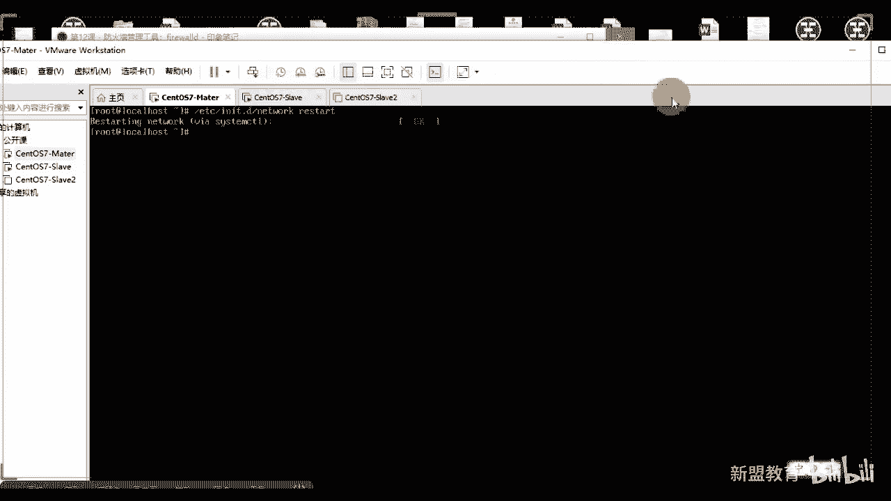

# 2021最新Linux-RHCE运维实战课程 - P12：RHCE-第12课-防火墙管理工具：firewalld - 新盟教育 - BV17K4y1t7XR

。

上吧多上啊，我们在做P加一的时候，自动安装，有一步卡在了如何安装。也就是说最小化和图形化。这一步第一个原因是因为当好了，我提前做了挂载，把什么呢？把MNT下载换到了FTP下去。

但这一步应该是在我们最后去做的，知道吧？最后去做的啊，或者呢老师，我要将什么？我要将我们的这个这个点REPO哎，我们的这个挂载的内容进行修改。啊，把里边的这个这个fill冒号，刚刚我们把它改成FTB。

就可以了，这是一种。第二个啊第二大家会发现一个问题，就是来看啊，还有什么问题呢？我现在给大家连上一台设备，好吧，我给大家连上一台设备。

注意啊，哎，我们上节课用的是图形画讲的。我今天再补充一点，你们使用的是文字文件去用啊。来看找到我们的一个服务器就可以，随便找一台就可以啊，随便找一台就可以。😊。

啊，连上。好。大家看好了，在这一个目录下，在我的根目下是不是有1个AN开头的杠KS点CF看到没有？名字很像吧，名字很像吧。😡，注意了啊，在这一点上，我们正常状下是可以把它进行1个CP的。OK那好了。

CP好干什么呢？把它拷贝到，要不然拷贝到你的腕下3W下ATM这是做到哪里啊，是做到了你的这个这个阿巴旗下，或者你把它放到我的腕下个FTP下。没关系，改个名字叫做CFD。😡，还有一是糊涂爱好了。

这就变成了什么你的pstar应答文件了，对不对？这变成了。那么我们再去对它进行修改，那你就要注意了。第一步来说好，我肯定不是用Crome的，对不对？同学们我把它改成什么？此时URL很重要。

杠杠URL后边HDB冒号杠杠IP地址或者FDB。对吧，FTP或者NFS。啊，或是FS总是杠杠于L前面看了，用它去做。第二步，我把这个graphffy注释掉，那么它就表示最小化安装能理解吗？

最小化安装改两个地方，第三个位置要改哪里啊？哎，改你们的时区知道了？改市区，我可能会把它改成Aa杠上海啊，Aa杠上海。我们在这一步是没有办法对你的root密码进行转换的。因为它是加密的，看到了吗？😡。

咋啦？最后一步是把这个n改成了o，我要对所有的硬盘进行清理。啊，重重置啊，而最主要大家会发现我们在这个里边会有这几个，看到没有？同志们会有这几个我们的标志。

而在我们用keystar文件生成的时候是没有的，是没有的。而在这里面看到没有？有个叫做minal，看到没？同学们叫minimal。我们告诉你以最小化的形式进行启动，能理解了吗？同志们进行安装啊。

你可以把这几行翻过去，把这行放过去。这是第二种解决方式啊，明了吧。2。🤢，把它搞定了啊，所以回去再尝试一下，你们可以尝试使用这个文件去做，比那个要快，其实你也不需要装什么chuckstar了，对不对啊？

那么同样的有一个问题是知道吗？呃，刚有同学们说老师我n space那个我不用多说了吧。如果出现的是n space left。LEFT给代好了，这个什么意思啊？空间不足啊，空间不足。

那么就把你的硬盘默认20G变成40G，40G不够，60G有有了吧？这是硬盘不足的锅啊，硬盘不足的锅跟别的没有关系。😡。

好，这么多，好吧，同学们。第二个，通过文件进行KS点CFG的。配的。好，第3个。哎，告诉你no space。left对吧？啊，就是空间不足啊，那就放大你的。啊，放大一盘。好了，同学们说那么多啊。

那么接下来。😊，我们接着说我们上节课没完的事情啊，上节课讲的是IP table，对吧？啊，那么IP table的话呢，我们接着说啊讲一部分实战，还有一部分的讲的它的是f沃。那么我们下午的课程呢啊。

上午真的跟大家。抱歉医生啊啊，这个至于什么事呢？我就不提了啊，比较糟心好吧啊，所于什么我就不提了，比较糟心。然后啊跟大家说声抱歉啊，然后呢，我们下午的课程。😊，1点到1点到2点多啊，两点半左右，然后呢。

3点到4点半左右，然后5点到6点半左右可以吧？同学们啊，我们补回来。啊，因为第二节课其实很短的。第二节课，因为第二节课我估摸着也讲到一个半小时吧，差不多啊。那么我们接着做实战的东西啊，就做实战的东西。

然后实战讲什么？讲的是我们的IP tables注意了哦，那么此时我们上节课讲过了Iy tables，大家告诉我我们有几表几列啊。常用的是极标几量。常用几表几列，三表五粒，对吧？同学们啊，三表五列。

但实际上的话是多少？实际上是多少？实际是少？哎，实际上是无聊五年，对不对？啊，五表五练啊，进来这个东西其实你在面试的时候的话，如果问到你们最要师记得的对不对？那五个表分别是我们常用的啊。

常用的分别是我们的filelture啊，NEmango。啊，row是吧，第四个是row，最后一个是secury。啊，seeccurity5个秒，5个6呢5个6呢，大家告我诉，是这5个链。里边分别是哎p。

roouting。起来啊，哎来了啊，free proteining ROUTNG不卡吧。我贝这边显示就包啊，proudinginbo。😡，啊都是大写的。在这一步imput for。FORWARD。哦。

卡吗？卡吗？同学们卡不卡刷一啊，不卡刷2不卡2，好out和我们的post ro。好。把这几个记下来啊，记住了，表示小写列儿是大写。在列儿里边的话，我们会具备具体的规则，而规则才是我们的重点，对吧？

同志们。那么常用的参数来说。常用的参数啊，我再说一遍啊，更大A表示的是我们在末尾插入。或叫表示追加对吧？同友们肯定是末尾啊，肯定是末尾。😡，好，第二个来说的话是我们的杠大I，对吧？同学们大I后边的话。

我们可以跟个小number干嘛嘞？唉，我们表示在第几行进行插入，杠低，后边也会跟上number，表示老师我们要删除第几行，没问题吧。啊，然后跟F表示说我们清空。我们的IPtables。好。

再一个杠G表示么？杠机表什么？同能告诉我杠机表什么啊，就是这一个可以的可以的，就这几个就够用了啊，这几个就够用了。记住杠基表示清零，对不对？我们说过了，老师如果我想要看的更仔细一等些的话，哎，清零啊。

这俩师清零对不对？哎，清零啊是把我们的数据包的传输的数据清零。😊，好，高小恩呢哎接着说啊高小恩呢？😊，多少安呢？😊，什么意思啊？哎，这个是用我们的数字来表示我们的端口，对吧？SSH别22。啊。

杠杠line杠 number。怎么样？😡，显示我们的。哎，去用来去显示我的规则的ID。来方便你删吧。啊，来先帮米删吧？对好，没问题啊。好，把这几个记住就可以了。好不好？同志们啊，当然还有一些其他的。

你比方说什么杠小I是吧？杠小 inputput output从哪来到哪去，杠S杠D是吧？原地址目的地址。😊，这是比较重要的啊这比较重要的啊。呃，然后我们就是说。主要我们就是说。

那我们就说那么我们来看一下，我们做个小实战啊，做个小实战。那么家好了，在做实战之前，你一定要做什么呢啊，防火墙是很重要的。我们说过，虽然说软房并不能够像硬房一样牛逼。

那不知道为什么用不了刚刚linenumber不可能啊。啊，你看看我的我你看我们的看一下啊。😊。

是不是呃Itables杠杠line。

你看一下杠H是吧，你看有没有它杠杠Y找一找。找一找是吧，找一找。L开头的。哎，我这没列出来啊，这么那 numbersS啊，有个S啊，有个S啊。那出一个我说过了，防火墙起作用的来告诉我起作用的是什么？😡。

起作用的是它的内核没问题吧。啊老是方火下app tablesapp tables它只是一个什么？同志们。😡，哎，它只是一个我们的工具而已，真正起作用的是它的内核内核叫什么？告诉我。那个叫什么啊。

M numbersS啊。😡，内核叫什么？内核叫做nural filter，一定把这个记住了啊。😡，啊，一个把这记住了。正因为如此，大家记住了，我的app tables但凡是回车则是立即生效。有了吧。

正因为如此，我们老说我一一回车就生效了。所以我们在我们的敲写前或在我们的防火墙的策略之前，你们一定要经过深思熟虑啊，一定要思考思考，再思考。再是。好，那么举个例子，老师此时我们学了一个web阿帕奇了。

对吧？那么我们又学了ip box了，我们呢要通过软房来进行保护我的web服务器。当了，我要保护我的 web服务器。那么此时来一个问题，web服务器，我就要保护它，我肯定要放行一个端口。

那么常见的端口第一个是80问题吧。好，还有吗？443看同学们，一个给大家列啊，这个是HTB，这个是HTTBS好，8080是什么？告诉我。😊，能猜到8080吗？😡，能看到8080吗？哎，是我们抛不开的啊。

😊，好，他们看了啊，啊，你知道843吗？哎你知843吗。😊，留到这个吗？记住啊哎对记住啊，843也是tca的，只不过是加上了HTTP加上了LSL加密形式的啊加密形式的啊。啊。

3306才是你们说的mysl。啊，3306才是mys数据库啊，对。😊，okK吗？同志们来，我给你们说一啊。好，来来来来。😊，🤧然后我们接着说啊，然后我们就是说。O啊。

等于到老师我这几个50都不是都要放行了，对不？同学们？如果说老师我的公司的话啊，我的公司还作为了DS，我还有DS，那我们还要放行啊DS的53。当然我们先不用放行在这里边啊。这些个是你比较常见的。

当然到后期的话，老师我说N考拉同学们啊，我说过了外表有两种架构，一种叫做LAMP对位同学们阿巴提80加上数据库3306，这个足够了。但是如果老师我们后边学到叫做LNMP啊，80加上3306还没有完。

还要再加上1个9000。😊，来了，他要加上1个9000，知道9000是什么吗？猜猜九千是谁了？酒千是谁了？😡，酒姐是谁的？酒接是PP的。😡，杠FPM的。可以了。啊，是PHP的FPM的。😡，啊。

为什么那么说的好了？哎，我们实际上来说啊，我现在做些个剧透，好吧哎。😡，阿帕奇。啊，和我们的这个PSP之间啊，那好了，它是以模块的形式存在的。啥意思啊？PHP是我阿帕奇这个功能模块，我是不是只要开启你。

我开启我自己你就能使用了。😡，能领是吧，是这么意思啊。😡，但如果说老师我是PHP的话，我是啊我是NJ的话，Nja和我们的PHP之间知了？是以程序的关系。开意啥。

我们把数据给了NN还要再找到我们PHP的程序，而这个PHP程序叫做PHP杠FPM它的端口是默认9000的。理解了吗？啊，谁来。嗯。很多说老师，我为什么我用LNMP，我放心这几个不管用啊。

是因为你没放心9000。😡，啊，所以这是个重点啊，不要把它记录下来。😊，好，那么然后来看然后来看啊，这是我一定要放的。第二个来说，哎，这个是允许单夫妻的防护，我们就不说了啊。大家明白？

第二个弄清我们对外服务的对象，也就是说我到底要暴露谁，我允许谁，我允许这个端口是呗，是目的地址，对吧？这几个是目的地址。好，书写规则规则的话，大家要注意一个问题，你要顺写什么规则，注意顺序啊，注意顺序。

😡，这个是一定要考虑到吧，为什么？大家明白，我们最终的目的是要让我的默认拒绝，没毛病吧。同志们，但是默认拒绝之前，一定之前一定要把什么22方形。😡，这几个你可以忘几放没关系，但是22是一定要放行的。

这是给你自己留后路，明了吗？啊，别说22，主要说一定要是SSH来你赶这个口了。😡，能听出来，一定要放心他。啊，任何一个服务器，但凡你接手你的老板说你给我改给我改一下防火墙。😡，哎，对，那就遵新房了啊。

你要给改下方火墙。那么第一步我先看一下22等号必须搞知道吧？必须开。😊，啊，然后网络接口LO的处理大家好了，LO的话一般的话我们都是方行的啊，本地嘛做测试嘛，对吧？做测试嘛啊，老师我在做的时候。

协议加上端口，这也不用说了，这些个一般都是TCP的那个同学们一般都是TCP的，不用多说啊。好。哎，到了状态，这个我也指过，大家还记得吧？杠杠state state。里边的话会有几个状态，对吧？叫做猫妈。

creed啊 require我们的Eablish这些东西，对不对？啊，什么情况用状态啊？😡，什么情况用状态？还记得吗？我说过了啊，就是当你接手新的机器。😡，啊，那么有很多未知的端口。哎。

老师我不知道这个端口干啥地，是不是？但是你不用说老师我全都把你关掉。所以此时我们要使用所谓的state。也就是说，此时老师我们所有建立了TCP和与TCP建立相关产生的新的链接。我们。都把它放行。

理解了吧？哎，这个是需要用CCCP啊，比方说老师我就忘了9000了，是不是？我就忘了这个哎这样重启是不是就废了呃，不废呀。😡，为什么冲启就废了？我们不说了嘛？

如果你想让你的这个这个艾 tables最终的话永久永久有效的话，你可以保存嘛app table成s对吧？对不对？保存就可以了。保存老师我再重启I tables的话，它也是按照读取你的默认文件。

那个配置文件哪里在ETC下this confi下艾 tables。对吧是这个吧，能记得就啥一。😡，啊，保存啊保存在这里，这是我的默认的配置。啊，默认方向就那个，但凡你们冲击者都在这儿啊。

不用想都在这儿好吧啊，那么然后来看一下，这个是我给大家选单画一个突破，我是抽象态啊啊。状态连接啊，不允许new的话，允许要求，当然要允许啦。当然你当然要允许new了。你当然要允许妞了。

我只是忘了提到妞了啊，对吧？啊，一会会告诉啊，哪些都。这个应该你能看到很很能看出来吧。同学们啊，这是一个客户端是吧？这是一个客户端啊，或者说这个是服务器，右边是服务器啊，这是互联网，这个呢防火墙是吧。

方便墙啊，就是路由器交换机底下的终端或服务器，对不对？😊，啊，那么有硬房啊，老铁学，你的公司里边一定是要有硬房的。甚至的好了，我补充点新的东西可以吧？啊。这个正常来说不应该不在我们的教学体系之内啊。

这个呢算是网络安全的。好了，安全的啊，当好了，在硬房的这个地方和路由器这个地方好了，我如果在这个地方，我还能接上一个设备，记住了这个设备一般叫什么叫什么叫IPS。叫什么呢？叫IPS啊这IPS叫做入侵。

😡，检测系统。啊若侵保护系统。明白吧？叫入侵保护系统。而入侵保护系统的话，我们有两种接入方式，这是一种叫做串接。啊，串行。串性接口啊，串性接入。第二种的话，那就俩叫做行接。啊，串接或者旁跌。好。

串接不用我说了，这就跟什么同学们哎，直连对吧？串接的话就是加在这哈。如果是并行的呢，并行的话那好了，师这个路我跟他在一起，这叫旁接，理解了吗？😡，能理懂同学们啊，就跟你们那个电路似的。

串联还是直点还是并联一样的啊，那么还有一个东西好了，还有一个东西呢也是硬核子，叫做IDS。叫做入侵检测系统。对啊，叫入侵检测系统。好，那好了这个一般情况的话，我们是放在哪里啊？

放在数据库或者放在我们重点的服务器前。啊，重点的夫务期节做什么？做异常流量检测的。什么叫异常流量？比方老师，我天天的访问百度是吧？结果今天呢我访问了3W啊，老老老牌的sex点com知了？

此时这个东西对我们来说就是异常理解了吗？啊，超出我们常规的动作之外的，我们就把这做异常流量。哎，他们都会帮助你去过滤，他们不会过滤啊，他们只是做报告做记录啊，生成日志对吧？那记了啊，当然了。

很多公司的话，他同志们很多公司在我们防火墙的里边的话，还会再加上一个东西叫什么？叫做跳板机啊，或者在这个地方就叫跳板机压的好了，在这个位置跳板机。😊，啊。回来说。就把这一点补充一下啊，那往这看老师。

我们两台设备啊，两台设备啊，一台是master，一台是我们的slowve，好吧，master是我的web服务器，这边slowve是客户端。😊，啊，3是口段，那么往这边看。啊。

配置web服务器master的防火墙。那好了，你要考虑到几个问题。第一步第一步啊，我要将我的环回放行。活跃动形态好了。首先的话我要杠T，如果我不指定杠T的话，他告诉我什么意思啊？不止这钢题的话。

默认就是filter表，对吧？啊，库表记住安排库表啊是表链表链规则，所以后边我要指能列杠A好，input那好了，input啊。

那么我们的数据一定是经过preroing inputput forward output和post roing这5个顺序的，一定是要按照这个顺序去走，可能有的没有，但是只要有的，是按照这个顺序。啊。

所以是进入金子华老师考了杠I杠I算里来啊，算起来，从我们的LO来的流不量，我们都把它放心，看到没有啊，都把它放行。😊，啊，不当。当了他家告诉我，你这个地方还可以写什么，我是不是可以还写成我们的杠S啊。

同学们127。0。0。0-2-16啊，我杠24啊。😡，可以吧。啊，两种秒双时都可以啊。🤧啊，然后我们要放行的是其他等口。当了，这个地方如果多放行的话，我们可以使用把它用杠M叫做mtiport。

叫做多端口。但问题，如果我不加它，我这个地方如果想要22到80，告诉我用什么符号。用什么符号？😡，6少符号。徐肉脯运告啊对。哎，可以用告了啊，哪些地方用冒号啊？😊，啊，哪地方用抱号到用告还拥抱号。

再用杠是个冒号，忘了回去翻笔记下吧啊，你们这个这个又开始又开始忘了是吧？来看一看，当是杠还是冒号，哪里有冒号。😊，哪里有到对吧？找一找找一找找一找找一找。欧老师，我现在想把它做一个多端口，是不是来看啊。

找到它在哪里。😡，嗯，知了对吧？坐长兄弟们是不是冒号啊？😊，是吗哈啊，谁说的杠杠，谁开刀说的杠，谁开刀说的杠。😊，谁开刀说的哥？😡，嗯，只有一个人答对了是吧？就是宋老师说的说对了啊，阿达阿达。

你这个带带淘汰的啊是吧？用冒号啊，同志们哎呀。一定不能错啊一定不能错啊。😡，好吧，一定不能错这个位置。啊，你们用杠可以试试雪能对吗？对吧你要对的话，我就不说了啊，你就冒号嘛啊。好。

那我用 multipo是可以跳着走，对吧？老师我可以选择开放哪些，不开放哪些好，我选择2280，对不对？当然你可以加上老是43对吧？然后8443。😡，啊，然后8080这些都是你要用的啊，都能通掉。嗯。

🤢，然要和它激活了啊啊，然后当然你可以把它分开去做，到时分开的话会很麻烦，对吧？但是别要一个问题，大家我说过了，如果有端口必须有什么？😡，如果有端口，必须有什么？😡，如果有端口，必须有协议，对吧？

杠P嘛，TCB会有DP啊这。有端口必有协议啊。好，往下走。那么最后一个别忘了，我说过了，你知道的已知端口知名端口不说什么了啊，非知名的是怎么办？那么就道这地方对吧？允许我们已经建立TCB链接的包。

以及该链接的相关包通过啊，同志们看到没有？当然最好的方式没错，就要在这个位置加上一个new是吧？啊，加上一个new，防止说老师我们系统真的嗝屁了，重启了是不是？啊，对。😡，好。

这走啊这种那么every tables当然但是的哈，如果你的机器很稳定的话，我为什么不加new啊？我为什么不加new？其实如果我加成new的话，是不是所有的TCP我都会放行？😊，明白了吧？

就以在这个位置，我们还是最好不要加深。😡，啊，那友们看最后一步，再把我们的默认改成了做这个地方只有默认是唯一。不用杠小G参数的。啊，对，就是状态啊，杠小G记住啊，是唯一一个地方不用杠小G的大哥。

默认的啊，所以太好了，此时的话我们要在防火墙上去做一遍，可以吧？我们需要做一遍啊。来，同志们。😊，先讲个名字是吧，hostthink杠master。啊，改个名字来看好了，我们第一步要做防火墙的什么呀杠。

😊，P啊，我们选择杠A。是吧inbo。当了杠A input。好，我们现在现在的啊杠1当然了，我都给清空了，所以说我都给清空了。清空之后你一定要注意一个问题啊，在你清空前，你要先看一下你的默认是不是。😡。

这个地方看到吗？是不是ac，如果不是先把它改了，知道吗？同学们先把它改了啊。好，那么我们最好的方式就是老师IP tables。😡，啊，杠Pinput把它改成ACCEPT先把它变成接受。

然后里边老示我们再去一个清空。进攻之后我不再去添加。好，老师，我允许的或者说，允许通过的量，哪些是我允许通过的量。这个老师杠A input好，插入超过哪些？我首先要通过我的LO对吧？同学们。

我首先要通过的LO。所以来自于我们LO的所有，我们都是用杠G表示ACCEPT。😡，啊，接受他。第二步，accept好了，杠A input，我们允许所有的来自于杠PTCP的。对吧TCP的好。

后边的话一般杠杠deport。😡，啊，我们用个杠小M叫做motiport啊，转起来叫做mtiport。MULILTIPORT。啊，moipport杠杠DportURT啊，deport。啊port打好了。

注意啊，如果用的是motiport套拉，然后后边的话我给的是22，一定要方向22啊，别忘了22好吧，80443哦，80808443啊，把这几个方向。当然你说老师给个。3306。好吧。

这306再给到9000都随便。好吧，杠GACCCEPT动作一定要大写。啊，动作一定要大写。啊，注意啊，如果你使用的是multtiport的好了，这地方有个S。如果要说我直接用，那就用一个port。

没有S没了吧？啊，最后一步IB tables杠A input用什么呢？用的是我们的状态，对吧？杠M state杠杠state。知了，里面说的是re对吧？related。呃，RELA。

体力alestablish established的。好，倒起来杠G我们的ACCEPT。到。看到了吗？来，我们写下啊，各位有。😊，大家可以看到这边吗？我是不是这几个都是允许的了，对不对？看啊，注意啊。

这个位置看好了，一定是咱们能看到吧？同学们看到没有？外不可以拆到没有？😡，啊，还没有还到没有到没有？😊，🤧嗯。好，最后一步IP tables改成我们的input，改成我们的DROP状。大啊，我没有断啊。

如果你没有放行这个的话，你未放行这个的话，那对不起，你随便断对吧？你没放行，那你立可就断。给自己留后路啊，好吧，给自己一定留后路啊。好，开起来。那么大家注意了啊，一般情况下一般情况下，我们的。

G一定是有规矩的。我们的出啊我们所谓的出啊，这个output无所谓啊，当然一般来说都是放行，不做任何的限制。明白明白？是允许我的服务器主动去访问外网的所有数据。是这意思好不好？然后那好了。

主上我们都给它启动了。同时的话老师我们要要么一做杠YA阿尔法奇哎呀忘了给它装了啊，不好意思啊啊，这个还是比较快的啊，虽然是家里的网吧。梗噶。就往前装了，好么把它装上这的H进BD对吧？同学们把它装上。走。

啊，这个下载还是比较快的啊。阿帕西要是再慢的话，真的是不火了。知到啊啊EK警告是吧啊？不不不不不不不不不一K警告了啊，不警告，这个还是蛮蛮快的啊，这还是蛮快的啊，阿帕奇嘛对吧？😊，啊，好。

安装好了好了啊，注意了，我们说一个啊，不忘了。第一步同志们先把它的某一个配置，他猜我要改哪个，你要把servver name给它改了，知道吧？你不改servver name的话，你每次重学要等半天。😊。

啊，你每次是不是要等半天，所以把这个位置改成多少127。0。0。1，对吧？好，保存退出走。啊，C的宝CTL。😊，但是呢2金B走停B。启动好了，同志们启动好了啊，当然了，你也可以玩些个种花的是吧？

老师我把。😡，FDP啊，我也装上去可以吧？啊，你装FDP也OK了啊，不说了啊。好的好了，此时看一下我们其他的设备能否访问到。首先我们先拿自己来说，可以吧？😊。

啊，现在自己来说。你看这来，朱老师，我访问一下192。168。我们的1。100找个大看我是不是能够访问到啊，这是它的测试页，对不对？

看到了吧？说这间啊，这叫答一个轴什么呢？告同志们，如果此时我们要想拿linux去访问。哦说linux你没装图形页面，你怎么访问啊？😡，是不是你没装图页没有你做房啊。😡，再来一张啊。到了哎。

你们有的是叫图形页面，对吧？我告诉你们，通过文字版的图形页面哦，老师CUL没问题，这是一招。啊，1。100，但是呢你只能看到这个样子，对不对？或老师，我加个大I啊，告诉你返回结果啊。

目前来说是forb的，先别着急啊不着急。但是但是我想看的是类似于它的内容，比方说他好了啊，算了，我把它翻过来。好吧，呃，apple。😊，不要看不。啊。

没有com解个去word下3WATL index点ATML。好吧，冲启一下restar。啊哈，剩下好吧，这种情况下，你再来访问它就不是。😊，那什么了？因为我们到了，哎。

第二种方式用什么用ellink对吧？要么一缩杠弯，用ellink拉起来。装上来啊，看一下它的效果是什么啊，这个效果呢就是你们的类似就是一个字符型的浏览器。把它成这个东西啊。好了，稍等啊，老师上去。😊。

是吧装上啊，这可有点慢了，是吧？🤧嗯。等等啊，哎呦这个这个的好慢啊，这个是吧？这个好慢啊，那大家自己去玩吧，好吧，这个我就不装了啊，这个我就不装了，可以吧？😊，哎，还还好还好还好还好还好。

这个还是蛮快的啊，这个还是蛮快的啊。😊，啊，家里的网啊一半了，还太不容易了哈啊，可以上网冲浪的浏览器。可以可以，有多少同学用过Elink是吧，有吗？有用过吗？😊，啊，ininux是这样子的。

就是我们在生产环境里面呃也是比较常用的啊。🤧好吧，因为就是你设彩环境里面不用嘛，你又不装浏览，你又不装这个这个这个浏览器，对吧？啊要说我装fa word，然后我用这start也行，那样太麻烦了。啊。

就大一会儿给大家看效果吧，好吧，们马溜的下的差不多了啊，知的。😊，就为他做个m子 case是吧？要不然每一步都会卡。😊，啊，他讲过是吧？行，OK。😊，啊。收到哎，O这个装着可比较快了啊。😊。

这个的依赖的话不多了依赖的并不多啊，一两个到1234就4个小包，对吧？四个小包。行，我们先让它装着吧，好不好？友们啊先让它装着E一会来来看，哎，一会来看。那么这个目前来说我可以访得到。

也就是说ok老师我是配置成功的了，对不对？但是此时的话老师如果我想要通过别的方式，比方说呃我通过我去访问你的FDB你们觉得访问得到吗？觉得访问到吗？访问不到了，对不对？就访问不到了啊，访问不到了啊。😊。

不忘了看一下对吧？abittable杠L杠小写的N2杠小写的等80。

对吧把0有了。好，然后我们接着去说啊然后我们接着去说呃，input这是我们input layer啊，这是第一步最简单的。第二步，大家看往这个图上看啊，往这个图上看。我们做一个什么呢？😡，啊，对了啊呃。

学过我们。路由交换的同学都明白是吧？唉，那我们使用艾昧路去搭建一个路由器，做我们的SN我说过了SNAT的功能就是类似你的家用的路由器去做共享上网。😡，啊去做共享上网。好。

那么我们使用内网的PC就可以上网，那么是要通过A的转换当好了，那么IP的命名小技巧。这个其实不用跟我说啊，方法仪两个设备之间。像邻的多面面什么意思？当了，如果我是PC1PC2，那我两个网轴之间就是1。

12。😡，对吧就是12这样个23，那就网络叫是23。😡，理解了吧。啊，是那么个意思，用于做多段实验。啊，那么第二来说。第二个来说啊，老师我从左到右依次命名啊，就是1。0、2。0、3。0、4。0。

这样去做了，不多说了啊，2。1、2。22。42。4。啊，当然这里边地址一准确来说，或者254是要留给核心设备的这两个一般来说常被用作我的网关，明白没白，同志们。啊，当然网关你可以任任意定义啊。

但这两个一般是我们留出来的。呃，很多很多的设备都会取这两个，那都会取这两个。来看而这此时呢我有两个端，一个是我们的master端，一个5端啊，这是master一个端。我这边看。

这个是master端作为你的路由器。带好了，作为你的路由器。那么此时这是你的内，这是你本身的网络，我没怎么办？本身的网络啊，1。0网段，我们把它看作外网，可以吧？OK我现在的话去拼一个192。168。

1。1的好了，这个是我自己家里的网关。😊，拼得通好，那现在干嘛呢？我给他添加一个网卡，变成2。0啊2。0。同时我们的slove上也有1个2。0。😡，啊，也有1个2。0，我们要不要去连接，能理解了？

同学们啊，最终将我的master作为一个跳板或作为一个路由器进行转换啊，进行转换拿起来。那么但凡是涉及到我们的，甭管是SATD还是DATD，我们一定要用的是NAT表。可以吧。

需求s up通过我们的master进行上网。

看到没有啊，那么配置上ma我们首先来说的说，我需要有两个网卡好，太好了，我们把它添加上来。右键设置啊右键设置。这样天在不会多网啊不会多网啊。

哎呀。可能有生之年碰不上他了啊，没事，不管他了不管他了，来添加黄卡。😊，适配器完成那好了，这个里边的适配器啊，到好了，不要让他瞧接了不要让他瞧接了。好吧，你就把它自定义自定义，我们找1个AT8。当然了。

此时你告诉我我能够选择金主机吗？😡，我能选择金主机吗？😡，能吗？😡，不能啊，一定是NATT的啊，好不好？金主机的没得玩了。😡，啊，没得玩了啊，选择A或者选用信网卡了没有关系。但是大家注意一个问题。

要在你的这个位置上编辑虚拟机网络适配器，明白吧？😡。

觉呢选择更改配置。啊，大设置找到你那个NAT的对吧？8到了，看了，将这个位置取消掉，将这个位置取消掉啊。看到没有？本地使用DDHCB那会和它冲突的，知道吧？我们要自己去定义它的IP地址好不好啊。

自己定义IP地址啊，好，给你确定。😊。

一定要把它勾取掉啊，取掉。好，那我们来看一下吧同学们，此时的话，我这个上面的话有两个设备了吧，对吧？if con看看是不是两个网卡啊，1232123334，对不对？对不对？同学们啊。

我现在ES32是对外的。😊。

对外的公网ES34作为我自己的私望地址。那好了。此时呢我让他临时生效叫个ENS34。😡，啊，U92。168。2。1-24分apple带好了，这个是临时生效。看到没有？😡，临时配置IP地址重启失效。

利用是吧？重启失效啊IG来。好啦，捞起来，而且我们快速去启动网卡，可以用if down到了if doneES34，看到没有啊，ESif downE224。😊，BO if down设备能就是ESS4啊。

站起来啊，再有呢ENIif up这样同学们。啊，是324吧。对3啊，看到没同学们是不是抽启没了，同志们看到吧？是不是没了。😡，对不对？刚然考好了，为什么这个地方会报错大太太，为什么会报错？为什么会报错？

😡，为什么会告错？很简单啊，记住了。😊，哎，你没有文件，没错啊，反应很快啊，是吧？你在这个地方有吗？你没有了，没有同学们？所以你如果为了说我保证我的这个东西好这个这个完整性，那当然是要做一个。😡。

配置了对吧？咱就说一要跟个刚A参数啊，属性都要都要是一样的啊。VIifFCFGES34好了，把什么删掉，把UUID删掉，对吧？把内幕改掉，把内部改掉，把内幕改掉，把IP地址改成2。1，让它作为内部网关。

对？同志们什么2。1啊，我自己就是我自己好吧，我自己。😊，走，老退说好了，此时我们再来if的。DNS。34。走的哈看到没有？还报错了吗？是不是不报错了，看到没有？告诉你成功动态了吧啊。

if up E34。😡，看同学们激活了吧，再来看看是不是我们具备了IP地。😡。

理解了吧？很快吧啊比你那个快多了啊，这是快速重启网哈对。😡，啊，第二步老师slo上啊，sve上你可以把它直接改，看了吗？可以把它直接改，理解了吧？你可以把它直接改。😡，啊，那右键选择设置。稍等啊。

等着打开，哎，设置打开还没打开了啊。😊。

啊，选择添加。选择添加在这个地方，老师网络适配器下一步完成，对吧？啊，我先不断开了，我们这个地方也选择VMnet8啊，这两个是在一个网段的，好不好？同学们。

好，到了，同学们，老规矩啊老规矩啊，你们一定要把它都做过去，好吧啊，这个快结束了，我算了，我把我把它断掉了，我不用这个了啊不用这个了啊啊。😊，this convicnworkscript。

走CB杠AifFG一定复制啊一定复制啊，大多数中啊ES都是1S3435，明白吧？没有33，很少有33啊，一般复制过来。喂ifCFGES34，记住，第一步删降UUID啊啊。😊，34。3算到了。

在这个地方我们给的是2。2可以吧？2。2网关是2。1保存退出。if大于S得于4，ifF得于4。到了听见了吧，来看到声音。😊，好，这都熄活了吧，IP激活了吧，IP激活了。那么现在注意了，if的我干嘛？

我要把我们的ES32扔掉。😊。

防子说老师，我我我有错误，对不对？我这个上面就留这一个，对吧？现在来看，我们再来slove上if康看一下，32是没有的，只34有对不对？我现在去拼192。168。2。1听懂通吗？听懂过吗？😡，听得通？

同学们拼不通明白吧？😡，拼头为什么不通为什么不通？为什么不通？我master上IB tables杠L杠L，等下。😡。

等下我master上appbby tables肝要。😡，飘亮，大他我有允许来自我们的这个ES的吗？没有吧。😡，是不是都被拒绝了？默然没匹配到都被拒绝了吧。😡，理解了吗？来你可以。来你刷一。好，对吧。

然后好，同学们，然后你要做事情很简单啊很简单。呃，我们呢先不做任何的，我不我不加我不加什么什么什么，我不把改了啊，我去加到了我去加。😊，加什么I table好了，杠TN是不杠TNAT啊，对不对？

杠到了在哪个链厂下告诉我。😡，在哪个链手家？在哪个店手家？😡，在哪个量上加大形象？😡，在哪个零手家。介绍人家，是不是我菜？😡，inbo先加上一个。对吧input啊不对，那好了，我正常来说的话。

应该是在input上就可以了。😡，啊，正方线在阴部的来自哪里的？来自ENS34，没学们杠7ACCEPT。OK了吧，同志们，此时你试试老师，我再去拼能拼通吧？大家想想能拼通吗？😡。

hello吧，能看到了吧？来看到声音。😡，啊，O但是老师，我想去聘用192。168。1。1，我能听懂吗？😡，拼不通拼不通为什么拼通为什么拼不通？同志们，我此时没有做NAT转换的对吧？张同学们，老师。

我玩的花的是吧？老师IP tables杠A，我们选择for word是不是也行啊？😡。

啊，做forword的也行，那我们不做forword了啊。看了，做杠TNAT杠A大家要诉我A要在哪个链里面走。A要在哪个料里面走，想想在哪个料里面。😡，在哪个料里面想想。😡，这个是路由层面的东西了啊。

😡，这是路由特别的东西了，告诉我在哪个面怎么作。再来一个英部还印部的啊，还p free吗？我这不是要出去了吗？同志们，我要转换，我已经接收到你了要转换吗？我不是poster吗？😡。

对吧我说post rooting啊，路由层面了啊。啊，给了你们这么多机会都没有猜对，一共4个猜了3个是吧？一共4个猜对看看input pre roout的都出来了，唯独没有postruping。

你们过分了啊。😡，好吧，嗯，杠S可以这么写，对吧？同学们啊可以这么写啊，你也可以写杠I是吧？啊，可以写杠I192。168。2。0-24。😊，从这来啊，哎杠G靠了杠G后边跟的叫做SNATnAT对吧？

two通下利192。168。1。达多少1。100。😊，能理解吗？是不是从我这来的，我都把它发到1。100上去啊。😡，能领了呗。好，问大家问题，你们觉得现在我能够平衡吗？现在能够平同的少刷。

觉老说我能平投的刷一平投是2，能平通吗？😡。

那么。😡，快出来。😊，是吧那么。真的真的不冷啊。😡，他说为什么不能为什么不能？记住啊，同志们进来啊，有个小坑没跟你们讲啊，在这呢往这看。😊。

在这大哥在这儿呢。😊，在这了啊，我们要去启动内核的路由转发的功能。😡，啊，这个里面加了哈，没有加是不管用的啊，好不好？没有加是不管用的啊。那么加完之有两种方式。

第一个来说的时我直接把它变成一写到这里面去，这是临时生效。永久生效的话，要写到这个文件里面去，明白吧？我们到呢永久生效了啊，来看同学们在哪里去写啊，在我们的master上去写啊，谁做路由器谁准了，对吧？

VIEDC下ss confi CTTL大拉点com文件。😊。

里面是空的啊里面是空的，自己加吧，所有内核的转达都在它里面加let点IPV4点IP杠forward。😊，等于e到了到速退出这个位置两边都有空格的，你不加也没事，你不加空格也没事，它会自动帮你实现。啊。

CTL杠P读取它生效连不同是，让它生效啊，然后再看来认为拼得通的刷一听不通刷2，听得通了吗？😡。

听到错了吗？想好再回答。😡，想老再回答。😡，呃是大多数情况下没有空格啊，如果你做变量的话，一定是没有空格的。啊，参数久了，哎，看到没？现在拼通了吧，看到没有？是拼多了。然后老师因为你是我的网关。

所以我现在拼百度通吗？😡，帅同同们也通了，看到没有？看到没有？同志们是不是把它作为了我们的。😡，路由器使用了。优秀好吧，优秀啊，来你来。这天不用多说了，然后我们就说啊我们就说。😊，这是第一步啊。

单纯的参数嗯一般都会加一般都会加。啊，内核参数上应们能加分管啊。

看分文件吧，这个文件是要加的啊。😊，啊，然后我们再来看第二个课程。第二个小时战的话是我要把它作为我们的大拉DNATDAT大家记住了，它叫什么呢？上面我说的SAT要共享上网，你们都明白，对不对？

DNAT叫做叫做叫做端口跟你说。好，都用上用我题吗？同学们。都菜我脱不脱来看这个。😡，能看懂吗？还是说我还是这样抠普图啊，直不过拉好了，此时我又想干嘛呢？我又想访问你的1。100。

就相当于访问到你的什么2。2上去。😡，对了吧，能理解吗？同学们，这个意思。😡，复制啊复制。MP配安全。来啥意思？啊，什么叫做什么叫做什么叫做这这个这个综合形测吧，对吧？好了，我们访问他的这个80端口。

😡，当然一般你们是被是禁的80啊，或其他门口，就相当于访问了他的80门口。啥意思啊？我得把这个80门口是不是也映射到我们外边去了？😡，这叫硬射这叫硬射，知道吧？啊，敦口一说啊，发对来。啊，怎么做啊？

正常情况下的了，这几个都不变啊，这个都不变。那我现在要在我的slove上进行一个配置。😡。

好吧，在我slo上，在我slo上方装了，刚刚是吧？啊，现在也能装是吧？因为我是没断网，要么HBD。啊，LBD看很快吧很快了啊。😊，啊，截很快了啊。好，安装完成最后什么来？安装完成里面写上ecle。

到了U轴点168。2。2，我把它写进去。😊，走。好了，把它改一下啊，别忘了改一个这个这个这个这个这个配置文件，你不改的话，很卡了啊。😊，啊，找到我们搜er内网。走。在哪里在哪在哪找不着了啊，我找一下啊。

稍等啊。哎，等一下啊。出来了是吧。走，重进看啊，重进来找一下s。没有真的。啊，不来了。改到127。127。0。0。1。好，保存退出啊，跟你们说，这点是最烦人的，看不到底下是吧？看到底下好，保存退完了。

启动它stemCTLda尔ta。HGB知道吧？

看一下此时知道吧？如果我在master上去，我要去访问它，我能访问到吗？这样我在master上我能访问到吗？😡，C啊。19。168。2。2，来看我是不能跑得到能跑得到吧。弄好了吧？但是他好了。

如果本地的全网的。😡，啊，如果本地去访问呢。😡，我本地肯定是1。0网多的被通的，访问不到它，但是我还想去防问你的1。11。100到了。现在啊现在啊我将我本地的1。100停叫stop。😡，造法2BD。

好吧，兄们top不掉看我不还能跑完了吗？是不是也没了，是不是也没了，能看到吗？同学们。😡，看到吧？都没有？老板，我要做映射，老师做什么映射，把里面的映射出来啊，把里面的映射出来，那好吧，怎么做好了啊。

😡。

可了用一个就行了，用这个用这个啊知道了ADpreuting是不是进路由啊，你访问我是不是进路由啊，告诉我对不对？如果是从我们的ES32来的，我们就把你的如果并且你是访问的是我的8。1。

那么我们把它做成DAE映射到里面去。😡，看到了吗？来啊，试一下试一下。😡。

老师阿保师。😡，啊，杠AP。不定。好，那么告I只要是来自ES32的。好，我们都把你干嘛，并且是我们的TCP的，并且是找到我们的P。DPORT啊80的。好，我们把它做1个DAD。到哪里啊？数19。168。

2。2。哎，他ry啊。😊，2。皮。PRE。告诉我们，Ive no channel turn好，忘写了杠T了，杠TAD啊啊，忘写这个了忘写这个了，不好意思。好，来看。😊，可以了吧可以了吧。

不要重启啊不用重启啊。当然最好的方式是干嘛？老师，我不仅不重启你，我还要干嘛？我要 everytable是刚 save你是吧？是不是我刚 save你一下啊，我刚 save你下好吧，哎，service。

😡，I不table子。Sa。这怎了？我要 save你啊，对吧？啊，那往这边看。收等啊，宋大家。好，往者看啊，我此时大家告诉我，如果我现在刷新的话，能防得到吗？哎，能防到刷一防得到吗？😡。

弄完了吗？能吗？同志香香。好了，我们刷线了啊。😊，不行，看到了吧看到了不？😊，看到了不是反过来了，我反回10明0吧，是不是硬收过去了，是不是？哎，接来啊。好，这个就是我们最主要的一个。😊。

好。SAT啊和DNAT两个都做好了吧。

啊，当然说道如果我想更了解他们两个详情那这个给大家一个网址啊，大家可以自己去看看好不好啊？这个网址大家可以看看，很详细的，我给大家可以打开打开看一看啊，我们有时候多去借助别人的东西，知道吗？

同学们有的东西呢不需要你去自己总结啊，这个帖子已经很足确了，看到没有？写的太足了吧。😊，硬射是为了安安全吗？是啊是啊，你们到了后面的话可多有跳板机的。都有跳板机的。对吧映射肯定是不安全的啊。好。

然后我们接着说啊，这个是ap啊ap third word呀，没什么可多说的，简单跟大家说一说好不好啊，跟大家说一说，因为我们现在用的它并不多，但是记住了，同学们，我们叫做动态防火墙。😊，在动态往下。

你要了解这几个点很简单，知了？我们刚刚说过了，everytables，我们一旦回车则立刻生效，明白明吗？😡，啊，这是对核它最大的。而fa world啊的什们回车是不会立刻升灯的。啊，不会这个成张。

必须通过杠杠reload来处置。来重置。而同时大家记住了M tables但凡是但凡是我们进行所谓的生效是所有生效这个。这生效。而reload fair word是我们可以选择某个一条规则立刻生效。

是吧其实他的控制上还是比较灵活的，是吧？灵活了啊。来。😊，那我还们看啊。啊，往说看那么。😊。

动态帮我想给大家解出来了啊，老师看啊，但是大家注意了，其实fa沃是有两个部分组成的一部分叫做。一部分叫做service，一部分叫做demo。看到没有？一个叫做service一个叫做demo。

但是它本身有两个，一个叫做client，一个叫做GUI图形文化或命令行都是可以去配置的，都是可以配置的啊。那么它仅仅是代替了我们service的部分。大家注意了，代替net service不算。

而我们最核心的，还是叫做nett filter。在内核上。能理解吗？同志们。哪里刷啊。哎，就是说它也是一个软件，它也是一个软件。而归根到底的核心还是我们的filter过滤，只是他俩的表现形式不一样。

谁更灵活了而已，这样对吧？那么在这个里面有个东西叫做作叫做区域，知吧？区域的概念很简单，哎，是便于干嘛的，就是便于我们干嘛哎，做做什么做切换的。啊，如果大家说我说我用Itables啊。

大家都知道我上网的话会有专用网，对吧？会用公用网，还有什么，还有公司网，是不是是不是啊，还有家用网。😡，加我。啊，我们是不是IBtables，每次我都要清空重写，清空重写清空重写啊。

而我们的I而我们的faair word记住了，faair word是通过我们作文的切换，我就可以达到效果。啊，做了切换过最大的效果。能力点啊。把这人接来。行了我回一下我回一下一个人的信儿啊。

好不好意思啊？OK你再说那么作文里边的话有几个是默认的，已经存在了。我们这看啊，那么一个作文就是一个我们一套过滤规则，看到没有？是不是一个作就是一套嘛啊，省得你自己去去那什么了啊。

那么常见的作用有9个啊，就只来说是默认的有9个，分别是我们的blockDMZ大好了DMZ熟悉吗？😊，DM这熟悉吗？😡，休息吧，同学们。叫做什么？一般来说，你们在印房上是应有的啊，印房。必要。叫什么嘞？

叫做非军事化管理区域，对不对？什么叫非军事化管理区域。你没记着？这个地方一般来说它是专用于我们做什么的？做映射的端口映射的啊，一对一的映射的一对一啊一对一的。啊。然后下面的juinin不用说了。

exter这是连外网的对吧？哎，对，不用说的external做外网的home家用的internal内网的public公网的trust可信的worker工作的。看基本上你看到他的名字。

你就明白老师这个东西是干啥的。😊，没有朋友们。😡，呆拉基本上就能明白他是干啥的。😊，啊，那么我们来看在七当中，六里边是没有fare word啊，六里面是没有fare word啊。七里面的话。

我们默认的区域是被设置为public。那，就是说老师我们现在这个网络看到了吗？这个么？这条德尔塔。😡，f word把它修起来。好了，呃，那好了，叫做faair world杠CMV，这是它的基本命令。

好吧，杠杠ge。😊，是吧。啊，get dream看到？arrow是吧？get dream没错啊。没问题，对吧？同弟们，get住。可能话间做 off off off。哦，该做S是吗？哦，S是吧？啊。

打K见了吧？所有的S啊看到没有？😊，看到没有？看没有啊，这个是你们的啊，看到没有？说个123456789狗哥，是不是9个都是这样啊事的，对吧？好，让我们接着看啊让我们接着看。😊。

那我们就看。那么这9个作我们来看一下啊，它默认的是public，一会来看的默认怎么看啊。那么第一个来说叫做丢ty做法，这也不用说了，大家了这些个区域之间的区别。只是在于说我们区别在于我们放行的。

放行的我们的端口或者说数据包不同而已啊不同而已。但是除了这internet哈，internet有个内网是吧？这个内网啊。内部的啊哎接来那往这看啊，ja法是任何接收的数据包都被丢弃，没有任何回复。

仅能有发出去的网络连接。这个哈什么还不类似于我们的这个这个这个这个这个所谓的。呃，安全模式啊，第二个block限制，任何接收的网络都会被IPV4的这个地方和IPV6的它所拒接啊，这个我们其实很少用啊。

这很少用Wlic也公用在公共区域内使用啊，不能相信网络上的其他计算机不会对你只接收选经过选取的一般SS都通过了啊。inter外部的。啊，对，军事化管理看到没有？

worker工作区home知了家庭网络对吧？就是这个trust可接受网络ok吧？啊，那不然了，我们指定7个其中一个为默认是可行的啊，随便指定一个都可以啊，好吧，当接口我们加入连接接口。

加入了这个net manager，这是我们六里面用于去管理网络连接的一个程序啊，那么它就会分配为我们默认区域安装的时候知道了，默认区域为public公共区域啊。

简单说就是我的用户预先准备了几套我们的规则集合不同场景下就用。😊。

切换码对吧？哎，第二个重要是什么是服务啊啊，faair word嘛，对吧？faair word算是一个服务软件的工具吧。😊，啊，那么当好了，在user lab下。

我们有个fa word service工作当中，其实保存了一套我们配置文件啊，每个文件对应一项我们具体的网络服务。比方说SSH我们来看一下啊，来看一下。好，CDuser lab。1而沃。

找的哈里面的话找到我们的service来，那好了，写一下。看到没有看到没有？知道了？能啊能啊都是等的啊。大家记住了faair word是一定要比app tables高级的，明白了吧？

所以app tables基本上能做东西，他都能做app table做不了，那他也能做好不好啊？呃，I tables最大的一个特点，大家记住了就是它因为是纯命令行，但是呢它在书写上会更加简单一些。

不管是命令还是参数上都是有有规矩去寻找的。而faair world呢因为有图形化支持，所以它在用命令配置的时候，真的是很麻烦很麻烦很麻烦。明白了吧，真的是很麻烦啊。甚至有的时候说我写一个负规则。

我的天哪，你要写吧，是吧？你要写不出来，你要是拿命令行去写不规则，或者用命令行去做一些个映射的东西。老师甚至做网卡的绑定，叫端口的绑定。好，我告诉你们。你就写写吧，对吧？我们在考试题里面。

大家知道RRTC的考试题里面就有一道题是写fare word的IPV4IPV6的，知道吧？你要记IPV怎么模式？哇，那要写起来的话，真的真的，你别说背吧，好吧，背的话还好吧，但是容易出错。

所以一般考试的时候都会提供图形一遍啊，一般考试的时候都会提供图形一面。一大数没一大数没。来，我们接着说啊来，我们接着说呃，这些大家可以看到他们所有的模板看到没有？都是以什么结尾的，以叉mail对不对？

😊，知了吗？这个点叉L的，请大家记住啊，这是一种我们的格式。

知道。你们未来的话会见到很多的格式。常见的点叉ML。啊，还有什么就是jason，大然jason吗？jason哥说吧？啊，jason模式好吧，叉mail格式Jason模式对吧？这两个是非常常见的啊。

而其他好了，jason的相对来说还好看一点啊。比方说一些日志的话，知道吧？哎，而叉mail是非常严格的还有什么ymail。记了啊后边说的I的时候。要的见没有？啊。这里边都是严格的这种这种语法啊，好了。

比方说老师多一个空格，对不起，你这个东西就错的。对了吧？对付这要错误，在标签化的语言非常非常严格，知道吧？像这个。啊，大家看这里边找随便找随便找随便找，我们随便看一个啊，Jkins后期的对吧？

后期就Jkinsready is，看到没有？很多吧啊很多吧，桑吧对吧？然后然后嗯还有什么来着？dockerDS。😊。

DSdocker看到没有？老板，我们找到SSH啊。😊，呃，s agent server。SSA我们随便找一个啊，随不便找一个啊。SSH对吧？好，到了CDSSH点恰秒看到没有？

标记化语言前面必须要有的你的叉的版本1。0对吧？你的coding，你的默认的字符几UTF杠8看到没有？service看什没有就得有结束，看到没有？有就得有结束，这个是一个说明，对吧？

里边的话这是一个你具体的看啊，这是你具体放行的什么东西，端口写的是名称，然后里下面是一个描述，对吧？这个描述啊，这个随便改这个是随便改的啊，然后port里面TCD端口2记住这两个位置必须要对应上，好吧。

这样名要要对应上啊，对。😡。

哦。那么往上面看啊往上看。那么我们说呃与之相对应的配置文件当中记录了我们各项服务的TCP或者UDP的端口。大家可以看到每个东西是GUDE还是TCP的对吧？啊，那么在最新版本的fa word当中。

默认定义了70多种的服务，我们为数多少种啊，不管它了啊，那么。😊，当默认提供的服务不够用，或者说说我们需要自定义某项的时候，我们需要将service配置文件放在这个当中。那老师我咋写呢？

那我咋写呢？我咋写啊，你并用不知道对吧？啊，没关系，有会人说啊，来看这边，那么我们存放修改过的配置，一般来说在ETC下，对不？同学们看一下ETC下有没有ETC world，有吧？

但是这里面看到同学们也会有一些东西，对不对？这是我的默认配置文件啊，CDserv走，来开了，显示显示里面里面是空，看到没有？里面是空啊，里面是空，所以我们才会来这个地方去找。😊，啊，来到这个地方去找。

理解了同学们。但是啊我们为了统一性，为了统一性，我当然是要将所有东西放在这个地方了，明白了吧。那，咱们到这边找默认吧。啊，那你为了统一吧。啊，来看。😊，那么比如说我们22中口的好了，22默认端口。

如果你的SS是默允允许啊运行在220上，不是默认的好了，220上，此时要放下220，明白吧？那么你需要把这里边的东西文件拷贝到这个下面去修改为220。当然你可以把它自己改成220。可以吧？可以吧？

同志们。啊。然啊那么service配置好的好处的话是显而易见的。第一个来说的话，我们可以通过服务名称来管理规则。啊，通过服务名称。呃，因为很多学老师我真的不知道这个端口是多少，对吧？比方说一些场景里。

比方说POPSMTP你们真的记得住吗？啊，通过服务来组织我们端口分组的模式更加高效。如果一个服务使用若干个网卡端口、网络端口，则服务的配置文件就相当于提供了这些端口的规则管理的批量的操作配捷方式。啊。

来对来。啊。啥意思啥意思？😡，啥意思啊？就是如果你使用了多个端口，我是不是在这个地方的话，我只要去做。然后再看看我在fair word里面，我一放行你，它会自动把这些端口全部放行啊。能明了吧？

你在文件里面麻烦你在写命令的时候就简单，就这意思啊。😡，啊，累加载一下我们的service配置，就意味着开放了对应的跟口服务，这个没毛病吧。啊。

使用下面的命令分别列出所制持的service和查看当前注文加载的各种的server。来看大老同学们，如果如果如果老师我真的记不住命令怎么办？别忘了装一个东西叫做要么is杠Y8杠compillation。

还记得吗？看见了吗？标MPL。Compulation。一定要装啊这个定要装啊。好吧，嗯，s word杠CMB看到了没？杠杠看到吗？他给你列出来，比方说老师我get啊，没我没重登录啊，不好意思啊。

重登录一下s word杠CMB杠杠get大哈。😊，看到没有，盖了看到没有？这就出来了吧，里面有很多的东西吧，可以看到吗？老师忘了查看本地的default，看到没有？你只要回收就好了啊，defat。😡。

对看到没有？同学们出来了吧，出来了吧，topub。😡，啊，对。

那么我们来查一下它现在所支持的默认的service啊，forword杠CMB杠杠get杠service知道了。走。看一下看一下哎很多吧，同志们很多吧很多吧。😊，那对了。啊。

这个你们到后期一定要学的叫做is叫做什么e search啊，我们ELK的东西，这ELK东西docker是吧？注册基因，然后这些东西都是默认支持的，大家可以看到上益。来放个手艺。啊。

list service当前的加载的各种啊，这个当好了，这个是我支持你，但我未必加在你要注意啊，支持和加载是两码事啊。所以我想问问我现在到底加载了哪些。

应该用的是for word杠CMD杠杠list杠serv。😡，对吧。哎，现在我就是这俩，看到？所以你的SS你肯定是能够连接到的啊，SS是肯定连接到的啊。😊。

好，来看那老师我安装启动状态禁用以及停止，这都没错了吧。啊，说。这是第一个。这什。好，接来啊，你也可以这么查啊，stateate这个知弟们，我们就拿这个查吧，好吧，f word。😊，那CMB。这ta。

啊，杠杠出来的是吧。我说实话，我对我对fa world并不熟啊。😡。

啊，那running能看同学们？running啊，我被fa过的所果并不愁啊。只是要说写写一些不规则，不规则是有时候我也要查查语法。你看上网版本不用说了，帮助对吧？状态区域现在默认区域了激活状态。

然后默认的我们区域的这个这个这个呃端口。知了，这个什么意思？😡，划定我们的端口属于哪个区？到市小区起了。然后呃拒绝所有的包。拒绝所有包就好了啊啊，这个是拒绝所有包Pick啊，当然你可以关闭，取消拒绝。

对吧？cp。查看是不是拒绝了。啊后这两个还是比较常功的啊。对吧2。然后还看看啊，更新帮我想象到了reload注意了啊，reload是。😊，立刻生效。啊，是立刻让你生效。啊，应该是某一句，也可以是所有的。

好不好？啊，可以是某一一般来说是你上一句上一句啊。comp会落得啦。两种区别。一个第一个是无需断开连接，也是说你的frework是一直是使用的啊。第二来说是需要断态连接，类似于重启，好吧啊。

这类似于重启。那家看get作，我们现在有的地作这已经看过了啊，设置默认的接口。啊，默认接口到了，我忘了set默认的区域，就是配置的时候我把它更改。我想把它改个worker，我们把它改成DMZ。

你可以用这种方式叫做settDF。defoult出来。啊。立即生效，无需重启待机区域是无需重启的啊，区域是无重启的。哦，好了，但是在好了带好了。呃，很多种情况下，你的配置都是临时有效啊。

记住了fair world happys都是一样的，你只是临时有效。老师，我怎么让它永久生效好，同学们永久生效，需要加上杠杠pre matters。prevent看到没有？prement。啊。

而prevent大家记住了，必须必须。😡，我们啊reload。否则你得下一次重启之后感觉掉。没白了同学们，这个是可以把你保存到配置文件里面去了，但是你得重启机器，但你就用reload的立刻生效。😡，啊。

打开端口到了端头怎么打开，杠个A的 port看看麻烦吗？告诉我麻烦吗？是不是不如我们的IP tables简洁I tables其实就是跟s的类似。我只需要知道参数，然后呢一个一个去加就可以了。

但是你看fa word来好了，很多的参数你都记得住吗？😡，啊，I label最大的优点是在于它的参数都可能是短格式的，而fair word的参数都是长格式。不好记的啊这个是不好记的啊。好，往下看。

到时候我打开一个端口，就类似于将我的端口可视化。哎，那么服务需要在我们的配置文件当中去进行一个添加，对吧？那就要在我的刚刚说到的那个service目录下啊，甭管是默认的还是说是我们P添加的。好。

那么那同学们两种方式，第一种老师我直接加的是port，但是加port，你就告诉他是TCPSUDP的。第二种方式的话，我直接加的是服务的名称，两种方案，你用一种就可以了。有A就要有移除remo理解了吗？

啊，ad要移除。啊，输出区域对吧？同志们全部的特性你自己看吧啊，f握这个地方对吧？刚刚list似哦所有大家看看这个地方啊是要看的啊，默认的。

for word杠CMB杠杠list杠O。sorry。行。来看啊默认的情况下，我们是public pub的话，按 far world手段啊，可以吧？public activity active激活的啊。

默认的对吧？我默认的哈，同学们SMP的。😊，是允许的开启来啊，interface我们的端口呃半点啊半点再讲，马上快就实快讲完了啊。那同说哎SSH。😊。

对吧哎我们允许的服务端口没列举出来的还啊端给没举出来的啊，有服务是端口就可以省略了啊。😊，大家可以看一下hello。😊，是吧。啊，状态看到了这个状态，那状态已经是漏掉了对吧？啊，漏掉了。

那不？当然你可以让它呃做等于worker啊，这个我先不改了啊，我怕它做啊，没做做不了啊，那么list可以看一下啊。😊，呃，获取活动的区域就是你现在的区域啊，已经激活的区域。在这呢根据接口获取区域，等是？

我看看我这个接口属于哪个区域的，是不是我这个接口属于哪个区域的？底下的东西的话，其实以下的话区域和我们这种操作不利解9了，大家可以根据自己的情况去做。好吧。

将我们的接口添加到区域里面去A的interface选择interface对吧？做是那个作。选择到是吧？如果说我的接口不属于区域，江口街被将把它怎么样，接口江被增加到我们的区域。啊，如果区域都被省略了。

那么将默认是默认。啊，是默认大家。啊，更改怎么修改啊，用change吧。看到同志们，其实它的参数的话，虽然是长格式，但是都是整个的单词，是不是啊，都是整个的单词啊。进来吧。好，往下走。

等呃Pick啊断网和联网，当然了，这两个就是断网和联网，这个类似于什么呀？是不是类似于你们的单机模式了，就是不是？对不对？是不是类似于单机模式了？😡，类似windows的单机。那你是不都等等你。啊。

应急模式吧。啊，内置的一些常见的防伪都放在这里面了。当然了，你看了你这个地方是报编辑的啊，这个地方是不不报编辑啊，好吧，你想编辑到去把它拿出来放到这里面去。😡，啊，是把它放到这里面去啊。

这些东西你可以自己去添加啊，你就自己添加，我这边就不带大家去做了，可以吧？同学们fair word基本上很少用负规则的话我们不讲了，负规则不规则其实来说，现在用的并不多啊哦。

你要知道说我一定要用fa word，我建议大家用什么用什么用什么。😊，有什么同志们？啊，一定要用你们的图形画啊，老师，我怎么调用图形画呢？

好ら。看到没有？有一个哎对GI cease confi吧，我觉得是对吧？忘了忘了faar word图像怎么启动来。啊，f过存句化怎么启动，f入过config对吧？我就是f过 confi，但没有是吧？

这里面啊没装那就是啊没装。

啊，没装啊，张紧把它先装上啊，我这边就不装了，要不卡了又。😊，好吧，大家可以看一下啊，如果老师我现在想要放开80去提供外网的HGP例子如下啊，第一步我来说我们要将它复制到这个位置上来，对不对？是不是？

是不是将我们的va下l下fa word下的我们service下的HGB点查了有没有复制到ETC的fa word下去。😡，呃，觉得如果只单纯的禁止端口的话，这两个都不用有硬伤的。没错，我说了好了。

我说一个问再说一遍啊，就是。硬房是必须的对吧？对吧软房的作用啊？软房的作用什么？一般来说是防内部的。啊，不是防外部的，知道吧？啊，防内部的。卵糖是放内部的，都放外部的。防太脆弱了啊太脆弱了啊。

一旦被攻克了，你整个系完蛋了，对吧？哎，把它复制过来，大家知得此时啊此时啊一定要用杠A的参数，就知？CB一定要用杠A，对啊，一定要用杠A啊，好不好？这地方我们加P算杠A吧，哎，否则他可能有一个权限不同。

你为后边老师没读取到，为什么呀？他要查半天，其实是权限的问题啊。😊，好吧，好了，把它拿回来之后，在这个里边进行修改就好了。当然你可以做个备份啊，做个备份修改什么呢？啊，同学们。

我把这个地方这些东西都不变，这个地方public告诉你我在哪个区域。😊，啊。呃，说实话就是运营商什么都是硬文，都是硬件。你们IDC里面也都是硬件啊啊吧，然后太好了，描述不多说了，看到没？

service注意了，如果有多个service怎么写，当了，有多少字怎么写，分开写，看到吗？能看到2213221，但此时其实你是省略了，好吧？如果写的是service，我们可以省略什么？😊。

我是不是省略了我们的？😡，我是不是省略了我们的TCPUDP啊？能理解吗？看一下啊。

CD。来，我是不是省略了这个pros啊，那么？你如果前面是port，那就写pros port。如果说是是service，就直接写name。😡，没老吧。啊，反乡我结束了。很快吧。

最师加载重置reload就可以了，好不好？嗯，我们看一下试一试好吗？那么？我试一试，因为现在的话我直接就什么，我直接就把它加进去好了，对不对？好吧，我们看一下现在现情况啊。😡。

看一下啊呃我们来list一下，现在让他list一下啊。😊，好吧，让我们历起啊，t word杠CME杠杠list杠O。对吧？同志们让看这是我现在的对不对？我现在的啊啊，那是干嘛呢？CP杠A啊。

把我们的HDB点下没有？😊，复知到我们的ATTCfa worldserv里面去，对吧？我们再进来ETC fair world service里面去CP我们的HTP。把它做个备份啊，呃。

这个是养成习惯的啊，好吧，LB大家进来好了，这个地方我们做什么，我们把它改掉，好吧，我们我们用我们的笔记上的方式啊，好记，对吧？😊，Servicice。name等于好了HB。啊。大家可看到吧？看到吧？

啊，我们再多加几个。😊，啊，不置好了。不早了。坐着啊，把它改了。😊，改成什么？这个改成我们的SSH。这个同志们改成我们的DHCPV6杠CIENT走保同学说。好了，同学们sha word见证期的时刻来了。

杠杠被漏的啊，它不会断啊，它不会断啊。😊，好，同学fa word杠CMB杠杠list杠O。来看同学们哎，这地方没写示出来是吧？啊，这地方没写出来啊。😊，呃，我们但是我们放行80了吧。

应该是我们应该放行80了吧，我们我们做一下试试啊，做一下看看啊还没没放行出来吗？我把这个地方再改一下，同志们。😊，那是CHB。不显示是吧？D是不啥？啊，我想上是想上是D啊。组织。好，再看一下啊。

哎，也不对是吧？也不对，我看一下啊，在家充置的方将并不中断丢失连接，对吧？复制到这里面来。呃，说到这里面了，没有问题啊，我看到没有问题啊。嗯，没有显示出来，对吧？我想想我想想我想想啊。

应该改的是住是拿了。目录下的public啥意思啊？

应该改的是处拿了。目录下的他ublic什么意思么没明白？现在看还能跟上不？没事没事没事，扎过了结束了，后面你就可以跟得上了啊。😊，终西了啊，没事没事没事，下的呃，我现在在的在的没有问题吧。

我现在在的PWD对吧？呃，service里面的话就了一个嘛CTHP对吧？😊，RMVIHP。这样子看一下啊，我把它改下来，还改成port吧，好不好？😊，啊。2。2。QRTport对吧？

然后我们的PROTOCOL protocol等于。TCP我把这个改一下试试啊，应该是APP对吧？呃，我们改改一下吧，PORTport等于。80可以吧？我这么写可以吧，朋友们。😊，啊。

我看一下保存CAT看一下啊，HTP叉秒点BAK。对吧没写错吧啊没写错啊没写错啊。好，我们再概是fa word杠CMD杠杠它说可能这是不显示吧，有可能是不显示，对吧？有可能是不显示。啊，或者用我查一查吧。

因为确实实实我没有。怎么研究过f物的？呃，这是service启动的对吧？端口号，看看允许的端口号呃，list我们看看它的port好不好？比的port啊。serverice。

之前用的是HP，但不行是吧？啊，呃，这个地方应该我没有记得，就是servurice，就是就是HTP就是HP啊servP。嗯。🤢，这样时候加的啊，要匹配我要匹配它的文件夹下的文件名，对吧？

呃，你说的是要把端口加上去吗？你说是要把端位加上去吧啊，PR到了，这个是把它变成永久性的啊，杠刚A是吧？Aserv啊？对AP加上它。

没问题啊，是HBP啊是HP我看加个低的行吗？😊，D不对了，对吧？这也是GP啊，这也是GP啊。好，来，我们再重置一下。倒数据下来。

这样就有了是吧啊，这样就有了，看到没有？这样就有了啊，这样就有了呃，这个我一会儿再研究一下吧，好吧，这会再研究一下吧。啊，这个就是不熟悉这个啊，临时给大家加了一点。好，来看一下啊，呃，重启之后不多说了。

第二种方法是改你的端口号，到了，你改你的端口号，请注意啊，两个位置啊，第一个位置的话是你自己本身的对不对？老师，这个地方是你的防火墙的端口好了，在这个位上改掉它。老师除非你用的service。

你要用service的话，你这个地方不用改，对吧？第二个点的话，在哪里要充刺它。😡，对吧？同长不用了SSH的修改是在你的配置文件里面修改啊，好不好？同志们啊，然后第三个指定我们的IP去访问。

这个应该不用我说了吧啊，这都是拿文件去做的啊，这个都是拿文件去做的。😡，都拿文件去做的，你可以看一下，大同学们这个加到一起。😡，知道这是什么吗？😡，这个就是你们的接了啊，这就是你们的不规则。啊，副规则。

啊，不规则知道吧？只不过我是在文件里面写的，它不一样啊。如果说我要是真的想要自己写不规则，搞了，最起码for word。😡。

furward杠CMD杠杠到了瑞士。O卡了。啊，刚刚A的。Allright，瑞士。入看到没有？里边的话你就写去吧，可就是写吧，family知道吧？family然后什么IPV4，然后sSOSE是吧？

然后dt stationation然后to port等等等等等啊，就搞清楚了fair word就找清了就可以了啊。fair word只做一个补充，好吧，弟们只做一个补充，这个添加80看一下，在哪添加了。

在这里添加了看到没有？😊。

看到没有啊，文字说明端口号看到没有？呃，最后是加入这是我们的。public对吧？这public就是我的这个这个这个这个这个这个这个所谓的我们的呃区域public区域。

最后一步都到重新载入的啊到重新再入的啊原AD和DATT用这两个方式。能明白同学们？但是不答家问题我还说一句话，就是原A地和DA地方里面是无法实现的对吧？这个地方的话，你的公网是浮动的啊，是浮动的。

所以没有办法做啊，没有办法做映射啊啊，最后的话是这个地方给大家做了一个的其他详解的一个一个一个链接吧。标点符看到没有？啊，你们可以看一下这个可以吧？同志们shawordtable的一个作用。可以吧。😊。

可以，同志们啊，这个可以自己可以看一看啊，里面的话更会会写得一些详细的啊。啊，用一组就可以了。你把fair word搞熟了就贼牛逼了，知道吗？同学们？下这几个你就随便了，随意了，知道吧？这里面就随意了。

啊。破背啊，我再说一遍啊，再说一遍啊。😡，很多老师我是不是得背下来？😡，我再说一遍啊，同学们f word。😡，来总结一下啊。总杰。总结第一个记住了haytables。和我们的fa word。

合边我的会一个。啊，会一个就好。就可以，而且推荐记住了。IP table对8，这个是目前我们生产环境在用的。啊，第二个来说，faair word。啊，不要背好吧，千万不要背。啊，你一背的话。

你完那绝对绝对也不会知道吧？一定要干嘛？明白吧？多查多用就好了。好吧，多查就好，能查到就好，能理解同志们多查就好啊，除非你是老师为了考试去做榜定，下说真的不用。啊，不要背，多查就好，我也不记。

你发现了吗？我也不记得有东西。是吧你只要明白一个东西，老师这个东西参数我知道有这个功能。啊，哎，我只要有这个功能，我会查，这是最重要的。大家同志们很多情况下是老师我压根不知道有这个功能。

我不知道怎么去查，我来告诉大家，A了吗？明明白？像我们用apptables常做的一定是包过滤啊，那fare word能实现吗？能实现。就可以了。对不同学们b率的话。

无外乎在fa world里面是通过区域通过Aserv啊，第二个来说什么？😡，叫什么做NAT嘛，对不对？A又分为了SAT共享上网。😡，啊，和DNAT我们的什么呀端口营售。

这两个能不能用fa word去做能啊。😡，当然冷了，对不对？第3个还有什么同志们看下第三个走了默认策略。是默认拖列。同学们啊这个的默认策略是什么？就是你的区域嘛，在fevebru world里边，对不？

😡，这的区域不就默认策略吗？好，就这些东西，你们告诉我还有其他没了吧。😡，对不对？但是记住了啊，最大的区区别在于的是IP tables回车生效。这点特别注意啊，一定要先。

放行我们的accessation。再默认拒绝。啊，要不然连自己后路都没有。好吧，再们决。fair word无所谓啊，fair word是一到这样子的对吧？😡，for word各嘛？同志们。

我们要经过什吧？第个杠杠p。permanent对吧？in herepermanent。起来啊，这个是要做的啊，然后呢你还要再经过杠杠reload，哎，一定要经过reload，好吧，这个是永久生效，对吧？

同志们，但是它的话永久生效了嘛？永久生效要保存配置。明白了吧啊，就这些点没别的了吧，好不好？然后这个笔记套话，我今天晚上会给大家发过去啊，到目前为止好，同学们，我们的第二阶段算结束了。😊，啊。

这一个保存一个提交。没错啊，到第二阶段到这节课为止，我们第二阶段结束了。

好吧，那么后边的话我们要进入到的第三阶段啊。第三阶段的话，第一节课我们一会儿一会儿正式正式上了啊。第三阶段的话前两节课把fe把我们的H阿帕奇先解掉，阿帕奇并不多东西，好吧啊。

第一个来说是我们的HDP协议，这个东西这节课不多，这节课不多，这阶段纯理论性的东西。😊。

到纯理论性同学，我可能要给大家补充一点其他的网络性的东西，好不好？这样来说的话，阿法系的一些个外部实战，这个是加CA认证的。这个是加CA认证的补充一点啊，这两个东西阿发这个区区别，这是面试常面的。

常问的啊，知道吧？好吧，然后CA的认证，这是这这个是实战课，没没别的说了，好吧好？啊，这是这样话。行，我把录屏先掉。

