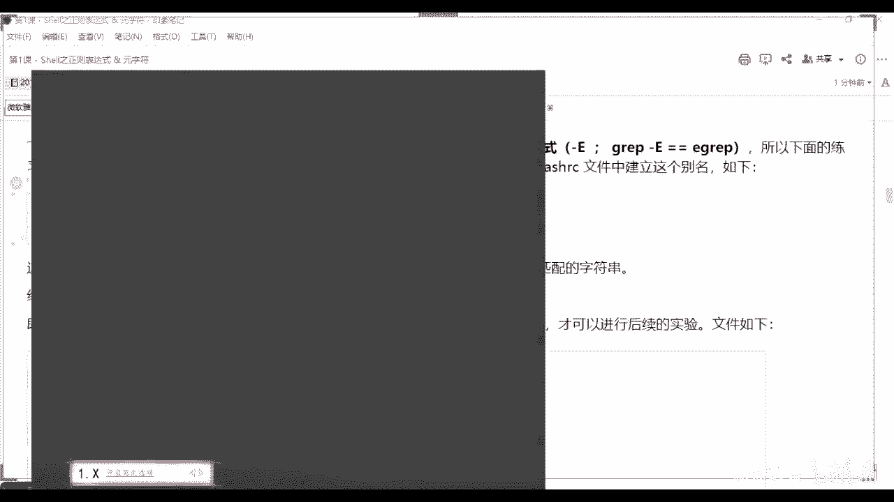
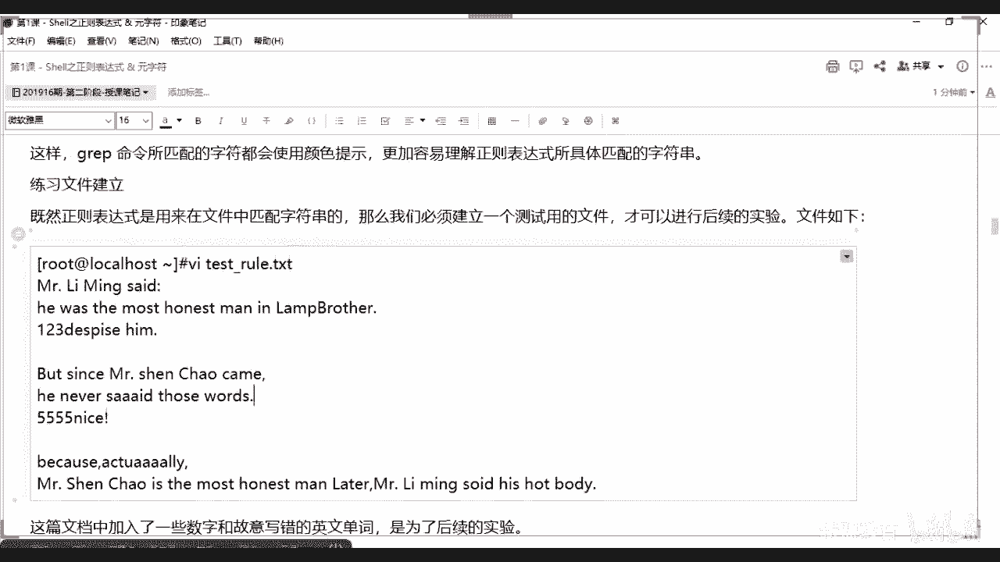

# 2021最新Linux-RHCE运维实战课程 - P1：RHCE-第1课-Shell之正则表达式 & 元字符 - 新盟教育 - BV17K4y1t7XR

。

这样的话我们如果今天有时间的话，我们就讲把今天作业讲了。如果没有时间的话呢，我先把它发到群里面把，作业答案可以吧？啊，作业答案都在我手里面呢，一会儿回来给你再说。啊。

🤧except呃X有没有讲这个没有讲。あて。呃，不不一定说什什么东西都会讲得到啊。但是的话呃但是工作里面常用的我很定会讲到，对吧？呃，加下他自5的脚本吧。行，一会儿下课好吧。

一会儿下课我们还是以正课为主啊，还是以正课为主，好不好？那个录屏我已经开起来了啊，我们准备上课了啊，25号同学31多个35号还差1多个人啊，是吧？啊，课程里面的话，怎么得有一个我记得怎么得有。

怎么带带带带带。这怎么得40多号50号人呢。准备上课了啊，我们就不等了啊，我们就不等了。啊，怎么得5超人呢？对吧，4多号人啊。行，我们准备上课了啊。呃，简单说一下。

回顾一下上节课我们讲的东西是讲到了sll，对不对？那么shall的话呢，我们说了，老师在sell里面我们常用的东西。放大点字啊，字放大点啊，少脚本OK那么少脚本从我们最基本的学的东西叫做变量。

大家记得吧？啊，那变量的话目的是为了方便我们去控制这个脚本里面一些个量的变化啊，我只需要通过改变一个命啊，只需要改变一个值，这个这个量的值。那我可以把整个脚本里面的这些值统一变改变，对不对？哎。

第二个来说呢是函数啊，第二来说是函数，函数的目的是什么？还记得吧？啊，函数函数的目的是让我们的脚本模块化啊，脚本模块化的目的是什么？是便于我们去控制和管理我们的脚本啊。

你比方说有的地方老师我这个这个这个模块这个功能我不想用了啊。如果我们说把它写错了也好，还是把它删除也好，那可能会对我整个脚本造成很大的损害，甚至你没有办法运行，是不是？那让它模块化的话。

也就是说我无调用的时候，那么你对我本身的脚本是没有大的影响的，能理解啊，那么除此之外，还有一些个我们这最基本的我们的流程控制语句啊，我们叫做流控语句，对吧？流空语句。那么流空语句最简单的。

我们其实分成了两种。第一种是判断对吧？判断的话大家注意了，用的是if语句啊，而if语句里边我们又会分为单分支啊，双分支和我们的多分支啊，通过我们的if啊el if以及我们的else三个关键词啊。

三关键词。第二个叫做循环语句。啊，接下来，第二个叫做循环语句。那么循环语句的话，我们有两个对吧？一个是for，一个是while的好了啊，一个是for，一个是well。而for的话呢，我们是要区间的。哎。

我只需要让你那个列表有个数有限级，那么我们就可以跳出循环，而well是根据什么，是根据你的表达式的真假。好，问大家一个问题，如果此时我的表达式是真ok我们是继续运行还是停止运行啊，告诉我。来告诉我哈。

可以的。😊，哎，告诉我表达是真是继续运行还是停止运行啊？来，告诉我继续还是停滞啊？啊，记住啊是继续对吧？是继续啊。所以如果我们给他一个，哎，所以大家记住啊，will的话是不停的旋转啊。

一般来说默认情况下，只要你满足就不停的旋转。好，最后一个接来，最后一个是我们的选择。啊，选择我们说了两个，对吧？还记得吗？我们说了两个啊，选择。哪两个一个是我们的case是吧？

同学们case的话大多数情况下是用于我们的脚本的最下端啊，不能说最下端用于脚本的叫做主函数，看起来。啊，主函数啊，很多说主函数什么概念？接来同志们，我们最终记住，我们最终在运行脚本的时候。

其实是只运行我的主函数。啊，而主函数会去调用我们的其他函数功能啊，会去调用我们其他的，明白了吗？哎，所以case常用。第二个是select selectlect呢只是作为一个补充啊，只是作为一个补充。

它的结构是类似我的case的对吧？同学们啊，是类似于case的。好，那么除了他以外，我还要再跟大家去介绍两个新的哪两个呢？第一个来说叫做continue。好说啊，叫做continue。Continue。

啊，第二个来说呢叫做break。对吧。这两个商机可没有说是吧啊，这两个商都没有说。啊，什么意思？那好了，那么continue比方说它一般是在它没有单独去使用的，一般都是在我们哪里啊，在我们的循环里使用。

好，老是在循环里边使用，我怎么用？这两个的区别是什么？好了，哎，和C是很像的啊，它其实类似，知道吧？语法都是一样的。没错，OK那么康定就是当我们不满足的时候，好了，同学们，当我们不满足的时候。

我们不跳出整个循环。😊，啊，不跳出整个循环，只是跳过当前一次啊，只是跳出当前一次。而break呢是我们直接跳出所有的循环，直接的去结束我们的循环。啊，把这种记下来啊把这种记下来。来，然后我们接着说啊。

所以这两个题你们把它记下来签啊。哎，一个是呃这个是跳过当前循环，一个是跳出整个的循环，明白了吧？啊，这个从哪个地方可以看到。你比方说同志们啊，我们负，你比方说我说我们负。😡，负的话我们用这种格式去写。

好吧，用这种格式去写啊，老师负I等于1而，逗号I小于等于10好吧？最后的话呢我们用I加加。啊，如果此时老师当我的I等于5的时候，我还在循环里，对吧？此时呢我不满足情况了啊。

不满足我的这个这个这个这个这个条件啊，不满足条件了。啊，如果我们用continue干嘛？答家是明白的，我直接可以进入到下一个循环，也就是说I等于6。而如果说老师我用breakrick。怎么样？

我们就没有后面了，明白了吧？我就直接跳出整个的I等于10了啊，直接跳出来了，对吧？啊，简单说一下这两个忘了说了啊，忘了说了，好吧。啊，然后我们接着说底线了啊，所以这两个大家记起来。

这些都是我们是最最基本的一个脚本的使用。但是我也说了一个东西啊，还有一个东西叫什么呢？叫做通配符，还听得吗？啊，叫做通配服。啊，但记住一个问题啊，就是通配符本身除了我们的se脚本以外。

我们在很多的se命令。也就是说整个list子命令下也是支持的。啊，不是所有都支持，但一部分是支持的对吧？啊，但一部分支持的。好，而我们还有一个东西叫什么来？叫做原字符啊，我上次也说过了。

而支持原字符的只有我们叫做正则表达式啊就来。叫正则表达式。好，于是乎我们正则表达式的概念上节课没有说啊，大家进来正则表达式用一句话表示，就是用于描述字符的字符。啥叫用于描述字符的字符啊？好了。

比方说啊你说哎木雀老师木雀老真帅。啊，木小师真帅，是吧同学们，这个呢是是是你们自己的啊给我的一个评价是吧？这是评价，这是字符本身啊，字符本身。好，然后呢，同学们说啊，同学们说哎，穆小儿说的对呀，是吧？

穆小儿说的对。😊，好，太好了。那么此时如果我想要去匹配说的对这些个词，那我就会匹配这句话能理解了吗？因为这句话是对我前面这句话的描述。理解了吗理解了吗？哎。

所以正则表达式是通过我们各种字符的搭配去匹配出来我们在内容当中的一些东西。讲啊。啊，所以大家往这看啊，所以大家往这儿看，那么在正则表达式当中，okK我们是用于去匹配特殊字符的符号叫做原字符啊。

受当中的话你要注意了，原字符其实分成两种，第一种叫做基本，第二种叫做扩展啊，基本和扩展。啊，而基本呢还记得我上节跟大家说一个特别特别重要的一个就是星吗？还记得吗？同志们还这个星吗？😡，啊。

这个星最主要的是来告诉我同学们，在通配符当中，我们这个星，比方说是ABC啊，这个这样子我是不是表示的是去匹配我们的任意的长度以及任意的字符串啊。O吗？同志们来O刷一啊，对任意长度的字符串，对不对？😊。

对吧，这点你要明白啊，但是注意往下看了，原字符原字符和这个通背符最大的区别在于我这个星表示我们去匹配前边的什么前边这个字符的0次或多次。也就是说在原字符当中，如果此时老师我用的是ABC星的话。

那我要匹配的内容最终是AB啊AB0次ABCABCC是ABCCCC。能理解了吗？啊，所以这是通位符和原字符的区别，好不好？朋们，而那你说老师我怎么区别你是普通字符还是原字符呢？是不是啊，那么记几个啊。

那么目前来说，我们常见的去支持我们通正则的。😡，啊，命令有哪些啊？这个我们后边要讲到的叫做sell四剑客，分别是ff一般不没有啊，f的没有分别是啊我们的啊简姐来f啊graph啊，sad和AWK带好了。

在四剑客当中，哎，你好鱼刚在四剑客当中，我们的后边这三个人是支持我的啊正则的，明白了吗？是支持正则的，它也支持通配，它也支持通配啊，而这里边有很多个符号。你比方说尤其是在sd和AWK里边，大家注意了啊。

我们一般用正则是需要两个杠杠开头的，再来是用杠杠来表示正则的使用。啊，你就找到两个杠杠在杠杠之间去写，白了吧？在杠杠之间去写。😡，好，来下走啊。呃，所以第一个来说这是零个或多个啊，而当好了。

小点儿呢小点呢这个小点儿好像没有什么区别是吧？哎，表示我们匹配除了混行符外的任意一个字符。好，混行符是什么？告诉我。来，同学们换行幅是什么呀？😡，来告诉我快等一下换行数是什么呀？这这个这个字有点小啊。

我把它放大点啊。😊，好吧，换富是什么？啊，等换大梁，哎，换行服是我们的杠N，对吧？😊，来看反斜杠杠N对吧？那么空格呢。😊，空格是刚T，对吧？啊，这两个一定记起来啊，这两个是常用的啊，一个杠N，一个杠T。

啊，除了杠A以外，我的任意一个字符记住啊，它只是表示任意一个啊任意一个。啊，再往下这个就是比较常用的了啊，一个是上经括号，这上经括号就在6上边啊，那个小六表示以什么什么为开头，大家注意了啊。

其实这个解释是错误的。这个解释是错误的，其实这个东西只会以它前面只是其其实只会匹配一个字符，只不过我们后面跟着了。所以我们说ok老师，你是以hello为开头，但实际上这句话的意思是以H为开头。

且跟着ELLO的。啊，起来。而dollar就是以什么什么为结尾，对吧？啊，以O为结尾的了解了啊，以O为结尾的。好，那么于是乎乎答好了，你这两个我们衍生出来一个问题，老师我们如何去匹配我们的空行啊？

如何去匹配我们的空行啊，想想。咱必牌啊。能明白啊？哎说了啊，间货号dollar dollar监货号doll。是吧哎，我以什么开头，以什么结尾，但我中间是被。😡，我中间是怎么样的？作业下面都没有。

要不就是匹配通嘛。😡，能理解了吧。啊，所以匹配空调是用上千管我家的dollar啊，这个是我们非常常用的一关啊，对了。非常非常常用的，这个也是非常常用的啊。我画错都是非常常用的。

如果真的以开头为开头的行呢呃没有，这就是它只能匹配这个意思，明白吧？它只匹配以H。那你后面跟什么，它就以什么为开头。你这么解释不算错，但严格意义上来说，其实我们就是匹配以H开头，后面跟着ELO的。

明白吧？啊，子平啊子正啊，然后接着看啊，下边一个叫做中括号啊，中括号的话太好了，上节课我们也讲过了，对吧？啊，也讲过了，那么在原字符里面，其实和同北符是一样的啊。

匹配当啦是匹配中括号中指定的任意一个字符，记住我们只匹配一个字符。😊，明白吧？而且只匹配啊是？那么例如来说我们AOEIEU是吧，匹配任意一个元音字符啊。也可以匹配上，这样也可以匹配上，明白了吧？啊。

只要以这个H开头，后面跟着就是一hello吧，你就这么记吧啊，hello，所以我后面匹配的是hello1234，hello234都可以。啊。哎，只要你中间没有改是吧？老师如果我中间改了A。

那他就匹配不上了啊，对。😡，那么包括这几个啊啊，同学们以A到D少写的啊，问他家一个问题，如果我这么写呢，如果我那么写是什么意思啊？😡，那我那么写什么意思啊？😡，那后落写什么意的？来来我坐。

这是什么意思啊？😡，哎，表示我们大小写是吧，全部啊全部字符啊，全部字符没错，哎，不分太小写了啊，从小A到大Z全部可以匹配。合进来，那么呃这两个是不用我说了，去匹配我们有小写字母和一个。

和一个什么和一个我们的数字构成的啊，两位字符记住啊，匹配一个有一个都是一个啊都是一个。啊，有声音的啊刷新一下。😊，哎，冲击一下。对。好，那么往下看，有了他在理解底下就好简单了。我上面有个金括号。

老师那里面这表什么呀？记住了，我既然有匹配，我觉得有排除，对吧？😡，所以往这看啊，上经货号表示的是排除啊，上经货表示排除。往上看。除去我们中括号当中任意以外呢，那么我们说答好了。

这样子就表示我排除任意一位小写字母，明白吧？排除任意一位小写字母。啊，排除一位数字只排除一位啊，转移时候就不用我说了吧，同志们啊，往这看往这看。😡，再往下走，杠杠看对没？杠杠看到没有？

是不是很典型的我刚刚说的正则表达式的使用方式啊？😡，啊，我说什么意思啊？好了，那么他表示将我前边一个字符，记住啊，只是前面的一个字符。进行N次匹配。明白吧？进行N次匹配。那么你比方说老师这个地方啊。

我实际上只匹配了一次1到9吧，对不同们？带好了，如果如果好了，如果我这个地方是相同的4位数，明白吗？匹配之后能看出来吗？这个的结果是匹配相同的4位数。😡，啊，哎，简来不对。

不能说是相同4位数是匹配相同的。我们这个0到9总来说啊是相同的0到9。啊。相同的。0到9。不通说相同四位数啊。加进来。所以当你们去匹配这个这个这个电话号码的时候，我们就会经常用到我们的正则来看啊。

大看好了，1是吧，138和15几的啊，带好了后边这是一位两位两位加上9位，看看是不是变成了11位啊，匹配电话号码吧。好，来，同学们看好了。

那么来告诉我匹配我们的这个这个这个这个这个这个匹配我们的呃呃IT地址吧。😊，来，大家自己写一下。😊，啊，匹配IP地址我怎么去匹配？快点。PPIP地址大家自己写一下啊，大家自己写一下。

那么现想一个问题好吧，这讲一个问题，老师，我的IP的范围。😊，行了，我的IP的范围啊，大家数老师0。0。0。到25。25。25。255，对吗？同学们对不对？没问题吧。

但是问题在于说我们是不是要排除一些呀，例如来说，0。0。0。0和我们的25。25。25。25，这几个其实我都不用管。对不对？是不是我都不用啊？😡，对吧？同志们所以哎所以记住了我要怎么做。😊，哎呀。

有人直接写出来了，对吧？啊，就是这啊啊你们0到9谁写的0到9，你们是有999吗？999999吗？😡，是吧是吧所以没那么简单啊，写个IP地指的正策表达式没那么简单的，明白了吧？😊，行行行行行行行行。

想想啊，正个数字这个匹配，我们这个怎么写二进制是吧？你写二进制吧？啊，不用写二进制啊，写的是写的是就十进制的。啊，谁就十进制的。啊，其实就十进制的对吧？1-24252525不能这么写啊。

那你怎么能那么写呢？1到254啊。1到254其实也可以啊，1到254。啊，但你的小点就没了呀，你那小点儿就没了，对不对？😡，那底儿不就没了吗？啊，所以这个东西的话，给大家一个小先先自己先去写，好吧。

自己先去写。我们最后再给大家说答案啊，最后再给大家说答案。😊，哎。别着急别着急别着急啊别着急，往下走往下走。哎，那么杠N啊，你们找着了啊，往下走。那么我们这个位置注意了，到我这位置，那老师我是匹配N次。

对吧？我是匹配N次。那我有没有下限呢，有没有上限呢？大家看那么如果我后面只个了一个逗号，好，表示我的下限是N次。😊，啊，我的下线选择。而逗号后边跟上一个是一个区间，理解了吧？是一个区间好。

那于是乎大就会出现一个问题，那老师我有没有这种方式呢？来看同学们。😡，这样子可以吗？同学们，我们至多。😡，出现。M。可以吗？来可以刷一，不可以刷2，可以吗？😡，可以吗？可以吗？大家记住啊大家记住啊。

记住在正则表达式里面是不允许这么去写的。😡，啊，是不允许这么去写的。😡，好吧。哎，所以你们谁谁谁说的有啊，谁说的有。😊，啊，是不允许那么写的啊，所以只有这种情况，好不好啊，只有这种情况写了。

你可以写零是吧？你可以写零，但是你必须写。啊，那你必须写啊。所以呢后边来看一下啊，那么举例说明一下这些原字符的作用啊，我们来看一下，我们可以使用一个graph命令。

这grarauff命令一会儿我们还会详细去讲啊，还会详细讲。那么还记得我之前跟大家说过吗？就是gra本身是不支持正则的，它必须需要一个东西，知道还记得是哪个参数吗？😊，还就是哪个参数吗？

需要通过我们一个大写的杠一啊，大写的啊杠1啊哎，杠一大写的。啊，那么我们说gra杠大一其实完全的等价于Egra这个命令。啊，大写的杠一完全的等价于e graph这个命令升级了。啊，所以我们先来看一下啊。

我们都需要利用这个gra命令来做演示啊。那么目前来说，我们这个文本大家知道是干什么的了吧？啊，看着吧。哎，这个版本是做我们这个别名，或者说做一些我们环境变量的，还记得吧？啊啊。

所以此时呢我们在这里面先做一个gral这个目的大家可以看一下啊，其实呃你打开任意一个机器，它目前七版本里面基本上gra都是给了你杠杠color的，表示什么呀？

表示我们自动让他。ALAII对吧？表示我们自动的让它进行重点的高量啊，就是你匹配啥，比方说老是prop rootot对吧？呃，从EDC password里面走看root是要标红的啊，root是要标红的。

好。所以我们找一个文件啊找一个文件，这个文件我希望大家自己去写出来啊，把这个文件给你们拿出来了，我就直接复制了啊，我就直接复制了Vt点 rule点TC。😊。

啊，杠铁杠住。啊，告过。找到啊，告住我PSC。里边去写啊，这不是脚本，就是一个普通的文本，明了吧？啊，所以我找了两个人的名字，往上写上去。😊，走，保存退出啊，CT看一下。看一下啊，那好了。

此时在这个里面注意了啊，有空行，看到没有？有连续的字符，有连续的数字。没有O病吧。😡，啊，把这两个记下来写啊。当然了，我的目的肯定是要把上面的东西都用到，对吧？啊，上面都用到。

所以带家先去把整个的东西先实战用一下啊。后边的话你们自己要去敲啊，先跟着我转脑袋好吧，先着我转脑袋。

好，第一步来说，我们先去使用这个星，你可以看一看，同志们，如果此时我们不用大E的话，或我们不用egraph啊，我不用E graph。好，老师，我匹配A星在我们的test rule下可以吗？同志们。

你看一下它会匹配什么。😡，它匹配什么啊，是这个吗？CT看一下r test啊，gra呃，这样写吧。看下同学们，它匹配什么了吗？啊，这个地方你要记出来用引号啊，用引号啊。

嗯好啊。不要啊用引号啊，呃在这个Qword里面一定要用引号，好吧，一定要用引号，要不然这个通配符是不显示作用的。好的好了，如果我A星的话，这个地方是这个星是表示没有任何意义的，明白了吗？

我就是去匹配A星。看这就两种方案了啊，这就两种方案了。😡，啊，寂寞可以的啊。好，所以先记下来，我们还记得之前说的这个这个这个双引号，单引号和反引号吗？还有同学们，如果你不加的情况下。

你们告诉我默认是什么引号啊。😡，你什么都不加，默认什么引号。😡，是单引号对吧？哎，是单引号啊，让它完全变成字符了。😡，双引号的话是让它有特殊意义啊，对吧？像那种特殊意义啊。哎，起来。哎，当好了。

那老师我加上双引号，也就是他现在告诉我是原字符还是通背符？😡，这原字款通背服。😡，是原字版的烘白风。卷是不脱围脖。😡，是通配服的的会员。啊，这个地方是通配符啊，是通配符。

为什么你看一下我里面不仅你这个A倍匹配出来了，我连空行都匹配出来了。大家想一个问题，大家想一个问题，我现在去匹配的时候是匹配任意长度的，看到没有？任意字符吧。😡，对不对？而如果你看好了。

如果老师我此时用的是egra。这个位置上是我们的原字符。但是。😡，大家发现一个问题，老师效果是一样的是吧？看到没有？但是你会发现效果是一样的。在这种情况下啊在这个情况下看一下。

可以看到吗？哎，可以看到。哎，往这看啊，看好了，这地方，如果A型并不是表示A后面认看了，并不是匹配A后面的任意字符，而是匹配A，我们所有内容包括空行知了。那么心中的空配符不同啊，看好了，往上看。😡。

可以看到吧？等一下啊。灵活多色。啊，这是为什么？别着急，哎，E挂没错，这是像E挂。老师，你说这线上很奇怪呀，是吧？我怎么区分啊，这个其实就不太好区分了啊，你只能那么去理解它，同学们为什么呢？因为很简单。

A星表示正常来说它是匹配零个或无数个A，对吧？但如果我匹配了零个，也就是说老师我每个字符都会匹配，所以会匹配所有的内容，包括空号。😡，明白了吗？所以此时A星如果作为正则表达式，其实是没有任何的意义的。

你记了啊，是没有任何的意义的，能明白了吗？来明白双一。好吧，没有啥意见？啊，第二个来说，如果说说我这样写AA，那我后边这样如果我想我真的想匹配正则，我建议大家再跟一个A，明白了没有？两个，那么此时。

好了，如果老师我写个AA。那我们就跟上这个E了啊，egra看一下，我是不是只有两个都会被匹配出来，看到没有？看到没有？AAAA。😡，那个AAAA啊，此时你再跟上一个石英，你们看一下结果就不一样了吧。

然后什们是不是我只匹配了一个或者多个吧。😡，啊，没有零个的说完啊没有零个的说完。好。好，可以吧，同学们啊，大家稍等一下，我这个接个小电话，我先暂停一下。所以大家可以看到一个问题啊，可以了啊。

来看一下啊O好，所以大家可以看到一个问题，就是当我在使用A在就是graph时候，其实通配符和原字符和通配符的时候啊呃如果我们不是有一个怎么说呢？如果你前面不再加一个A的话，其实看的不是太标准是吧啊。

其实你是看不出来什么的啊，其实你看不出来怎么的啊，那要是我把这个E去掉看同学们，我把这个E去掉了。😊，好，那好了，此时的话你会发现一个问题，你会发现一个问题怎么样？我这个地方匹配的什么，还是这个。

但只不过此时我不需要。什么我不需要去呃，我不需要什么空好了吧。😡，啊，那么由此可见，一个问题到了，此时我graph在这个位置使用的只有原字符，没有通配符，明白吧？大家能理解吗？我这个地方使用的是原字符。

可没有通配符啊。到没有？😡，还到没有？好，但问题是，那你加一与不加一的区别在哪啊？😡，对吧你加E和不加E的区别在哪啊？😡，然案好来说哎，我把这个地方给大家做个总结啊，做总结。那么此时请大家注意了。

gra不着急别着急，看现象就能看出来，通通明不啊。g我们支持的是原字符。而不是。通佩服。啊，那问题在于说老师，那我为什么为什么ok老师，我gra和egraph现象相同。那老师我为什么要要用这个E呢？😡。

好，当然啊，为什么记住了。是我刚刚说了，我的原字符，大告诉我，我分分类吗？有几类啊，告诉我。😡，我是不是有普通的。😡，和。😊，扩展的。能理解吗？不能扩展的。所以请你注意一个问题，请注意一个问题啊。😡。

我们gra好，老师，我的gra本身是支持我们的普通原字符。而我们如果说是我想使用我们的扩展的话，我们是需要。杠一的。理解了吗？这点能懂了吗？啊，睡过头了啊，可以的可以的啊，能理解同学们。哎。

所以这一块有个小坑啊，是不是有个小坑是bb支持原字符，但是它不支持所有的，而默认的情况下，这是为什么要用E，对吧？所以E的本身叫做external。😊，对吧external。刚才谁写的？

啊进来H turn了额外的。好，能理解创意啊，额外的有哪些最后再看啊，额外的有哪些最后一再看我现在上面给你们这些个都是普通的啊，都是普通的。哎，那那可以都加一就算了。没错，那你可以都加一就可以了。

明白了吧？啊，哎所以我们在使用过程当中的话，一定是哎到上面啊，在哪在哪了？我的总结在哪里？😊，嗯，在这啊，所以在工作里面的时候，我们直接就使用Egra就可以了。但是但是大家请注意了啊，哎。

其实我们graup家族呢有3个。这会还会说啊，grab加族加上杠一好，我是变成Egra，我也可以是加上杠F变成Fgra。但是同志们这个压根儿就没用过啊，我就说一下，压根我也没用过，好吧，压根就不用。啊。

但算让他有吧啊算让他有吧。啊。往这着看啊接着看，所以这是新的原字符。第二个是点的原字符，点的原字符应该不用我多说了吧。我师举个例子，很简单，如果此时S点点，那么也就是说我S和D之间一定只有两个字符。

老师g啊sSD点点啊，我们去抓test杠入。😊。

哎，sorry啊，test告入。哎TSD。啊，看一下我是不是只能匹配出来的是我们这两个呀，不要了g啊，魏老师为什么我显示行啊，是因为graub是以行为单位去匹配显示的。好。

那么你也可以只看自己的用作小O就可以了啊，用个小O就可以了。老太好了，我匹配两个。那么后边老师同学们，如果此时老师我给了一个星啊，我给了一个星啊，那么这个星这么写，对吗？大家告诉我，我这么写对吗？

这么写对吧？😡，还记得如果我那么写和刚才我写的所谓的老师A星好像没有什么太大区别吧。😡，是没有任何含义的啊，是没有含义的，不是说不对，是没有含义的。所以你那么写本身就是错。如果我想要去匹配你。

那你只能跟个小点儿，大家来跟个小点儿。😡，啊，也就是说我此时要去匹配什么？同志们一个点两0个点，一个点、两个点、3个点、4个点、5个点、6个点、7个点，明白了吗？点儿的话可以是不同的啊，来看。

好。看到没有？看到没有？哎，我把它去掉，看到没明们？这些个是不是我都能匹配到了？😡，看尤其是最底下这个更好玩的好了，看到没有？我匹了那么多吧，看到没有？看到没有？我匹配了那么多吧。😡，能看到吗？

而且请你注意啊，同志们发现没有？这个位置。😡，这个位置老师我都有地了，但是我不停，但是我没有停。😡，所以答好了，如果以此去做匹配的话，我们确实是以我们的记住啊，是以我们的第一个S开头。

并且以我们最后匹配的D结尾。能懂了吗？啊，你如要说我中间有多个S，我中间有个多个D，这个都不归我去想，看到没？只有S看到没有？😡，哎，一定是第一个和最后一个。好，接来。啊，所以你们匹配的是这个东西啊。

大家来啊啊哈。😊，所以接着走啊呃原字符用于修饰前面原子出现的个数点作为特殊的原子，可以匹配混行以外的任意字符。没错啊，一行中最后一个第一会停止。没错。没错啊，一行当中最后一个定会停止。

这不就最后一个地吗，对吧？能聊啊。好，所以这个地方老师或者你说老师我gra一个点儿是吧？你们觉得这样子可以匹配什么？大家想想这样匹配什么？😡，教育有什么？

来想想这个你想用你是不是感觉和上边的好像意义都不太都都挺差不多的吧，啊，意都差不多，只不过大家注意了，只不过好了，区别。好。走。啊，这里边最大的区啊，不对，把这个D也去掉啊，把D也去掉。😡，好。

到了看见没有？其实这个地方也就是告诉你零个点，零个点是不是也是工行了，是不是都有了，这就没有意义了啊。记住啊，前面必须有一个实际的字符存在才可以。😡，好，往下看，所以这个是点儿和星的区别。

其实最主要的还是这个星的理解吧啊还是对于这个星的理解，好吧，同主人。啊。那问大一个问题，如果如果如果说答好了，如果我这块儿只有一个星的话，你如果一个点儿的话，你们会说匹配什么呀？

会匹配吗？会匹配吗？会疲惫吗？各位学学们来看是不是也是任意啊。😡，这一单个字符吧。😡，这一单个字符，所以匹配的是所有明白了吧？啊，刚才谁说一个所有啊啊，还是跟的挺快的啊，可以的。😊。

好，那么我们接着看啊那我们接着看。哎，往下走，我们以什么什么开头，以什么什么结尾啊，所以这个大家回去一定要再看一遍是吧？我就说为什么让你们上午去预习一下啊，那么上间括号下dollar一个表示开头。

一个表示结尾，这个没什么多说了啊，这里边只是遵循一个问题，是严格的去遵守。😊，大小姐。啊，严格做大要写，以M开头当了，你只会匹配以M的啊，记住了，这个是M开头啊啊，必须是本行就会以M。

啊。哎，orry。走有两个吧，看到没有？😡，怎么看哪些是原子符，这些都是原子符。啊，rap里边都是原字符。记住了吧？gra里面都是原字符，没有通配符。我这么说能理解了吧？😡，啊。

命令的其他的命令可能是用的是通背符。啊，哎啊那么在这个地方你要注意问题，你要注意问题，到了？我们以什么什么开头只去匹配第一个，后面我不管它好，但是如果说那好了，我把这个文件改一下。好，看了好了。

我在它前面的话加上一些空行空格来，大家告诉我我还能匹配吗？能吗？😡，能匹配吗？😡，能吗？😡，想想啊想想啊。😊，等一下啊。😊，不能了啊，记住啊不能了啊，空格也算是字符了，空格也算是字符了，明白了吧？哎。

就不能了啊就不能了。所以第二个问题是严格遵守大写，并且注意空格也算。😡。

啊，空格也算。哎。有客户来了，可以的。第二来说，以什么什么为结尾，以N小N结尾，对吧？来看一下老师以我们的小N哎，所以do在后边啊，do在后边，哎，这里面没有小N是吧？这里面没有小N啊。

那我们再找一个呃哎这里面有没有小N结尾的行，没有小N结尾的行是吧？那就没有就没有吧。好吧，没有就没有看一下啊VM test rule。😊。

CT是吧，test rule有吗？好像都没有是吧，同学们都没有啊，那就没有没有了。

所以再往下面走啊，你们要注意一个问题啊，大家好如果你是在windows里面写入的，window是在windows里面写入的。而你们老师我们是哎这个这个windows里面混行是这个样子，你匹配过来。啊。

所以说你不能够做复制粘贴，对吧？windows下的文本。是不能够直接复制粘贴到我们的name下。它会出现最后换行符的一个问题。你斌为什么答好了？因为你本身你的换行符默认情况下是杠N，对吧？是隐藏的啊。

是隐藏的。

当好了，是隐藏的。所以此时如果你们想要去匹配它的话。啊，你们如果是windows过来的，它会多出来一个间括号和M。这个其实我上节课说过的，明白吧？所以你要匹配它，而是你要匹配它对了。

怎么解决怎么解决跟大家说了啊，很简单，那么你们只需要执行我们的命令，叫做doose tolinux。好，doose什么？告诉我，dos是不是linwindows下经常建的一个系统啊。😡，对同学们？

倒是windows系统啊，哎呦，累死了。😡，是另种系统，对吧？哎，所以当好了，是doose to unix转换了，明白了吗？转换了啊就可以了。😊。

啊，这个命令。谁装的装什么要吗？😡，insstore啊，要pro我们看一下啊PROVIDESpro杠到 tounix。对吧just units看看啊哦，没挂载是吧？没有是吧，同不是？啊，这个我拼一下。

痛不了是吧？好，那么这里面好像是暂时不能用是吧？我这个圆看一下啊。PROVIDS到 trueO现在好了，应该可以了啊。好，看一下刚才好像网友的问题啊。😊，来看谁支持啊，是他支持对吧？

那你装上它就可以了啊，装上它就可以了。😡。

第二码一做高弯。这个是一些个小的细节点，你们自己记下来就好了。doose true啊，你只需要跟上它的文件名称就可以了。还有同学啊只要跟上文件名称就可以了。啊，最后空行啊这空行我们一般怎么用？大家住了。

请你们把这个列为一个重点吧啊这个是我们经常用的，而且呢一般会联合我们的gra啊，去做我们配置文件的筛选。

什么意思啊？好了，导师要么est store杠YHPD这是我们后面可能会装的阿帕奇。好来看。那么阿帕奇的配置文件在这儿呢？等海一下，我会错了啊，我用less吧。😊。

走。看一下同学们，在这里边我说过了，井号为开头是注释行，对吧？好，注意了，这个空行也不用我说了吧。看懂同志看到没有？很多都是无用的吧，那怎么办？记住了，我们对于一个文件或它的筛选要经过以下两个。

最少是两个步骤。第一步是备份。啊，第二步是筛选。备份怎么备份？很简单啊，同学们，我只需要把这个文件做一个复制，对吧？我只需要做一个复制。

啊，sorry啊。啊，CBETCHBDcom复杠HGBD好，把它呢复制到原目录下就可以了。com复点。后面这个点儿BAK。有备份文件了，那么后边就是g改好了啊，g我们的ETCHTPDcom文件。

好HTP点com，我们用去把它的这个去抓取一下，抓取什么呢？啊，同学们用一个小V用一个小V小V表示反选啊反选。反选什么？老师反选我们的空行，然后我要将你重新定向到覆盖掉我们的。原本的路制下。来家看一下。

你们再来查看这条命令的时候就变成了。是吧拿出来啊出来再来查看这个的时候，看一下还有空行吗？告诉我还有空行吗？同志们还有空行吗？😡，是不是就没有了？😡，来看看啥音是没有铺好了？哎，我或这好说我去匹配到了？

此时我把它监过号。点得紧。啊，变成景啊变成井，啥意思啊？😊，啊，我是取消我们以井开头的，看到同志们看到没有？井开头都没了吧，哎，注释都没了。没错，那老师如果此时好了。

此时我想让你们把我的这个和我的这个这个这个这个这个这个这个呃。空行都去掉。那很多老师，那我就这样子嘛，对吧？我再来反选一下杠V是吧？空行。😡，啊，翻省一下空行。好了，这样子做可以吧，这样子做可以吧？

来看同学们是不是库房无坑，注释都没了。😡，看到没有？是不是空行和注释都没了呀？😡，注意这个是什么这是什么？这不用我说了吧，这个是空格开头啊。😡，好，但问你是大好了。再问题是你不觉得这个写的太麻烦了吗？

好吧好，这太麻烦了吧。😊，那怎办？哎，那怎么办？对么们能行啊？哎，老师我用内管道服是不是好，有人说老师内管道服一下啊，老师以什么呢？以井号为开头，并且我们的dollar啊，或霍老师我们把井号就去掉。

就有有井号的都都去掉。😡，你会发现一个问题啊CTETCHTPcom复。HTP。好啊，看一下。😊，看一下同志们，你发一个问题，老师好像好像怎么样。都没删除吧。发现了吗？😡，发家了吗？😡，拍下了吗？啊。

所以你告诉我说内管道不能用吗？告诉我内管道不能用吗？😡，能吗？记住啊，内管道符绝对能用，但只不过当了。此时在这个位置，我们不能管它叫做管道符，你要把它变成所谓的叫做逻辑运算。😡。

好，再来。😊，对啊，这个位置的管道符叫做逻辑预算。好，大家问一个问题，什么是逻辑预算啊？😡，这个我说过了，逻辑预算。好。与获飞对吧？于或飞。这道逻辑预算，所以告诉我不来家告诉我这个小竖线表示什么呀？😡。

标什么呀？😡，表示祸对吧？啊表示货啊，那么此时如果他是作为货来代表的话，那么它叫做或展。扩展表达式，扩展原字符。好，所以大家就明白老师，那我怎么样才能让它实现啊，怎么样能实现啊，我要跟个一。

是不是大写的一啊，你要想跟杠你就大写的，要不是在前面这俩明白了吧？看一下再来看。😊。

是不是都被过滤了？😡，看到了吗？啊，只要是有注释的，只要是有空行的，全过了，白不？

把这段记下来啊，所以前面一定要跟个一。好吧，是筛选我们所有的空行和驻场。啊，这个小小这题就不说了啊，这下题就不说了。😊，好啊，那么往下走往下走，下面的话，这个小中括号还用我多说吗啊中括还用我多说吗？

说我只匹配一个是吧？所以告诉我这个的结果是什么？是SAIO或SOIO。OID啊SAID或SOID。不会有什么SAOID不可能啊不可能。不方同志们只匹配一个啊，只匹配一个对。啊。数字的话呢也是只匹配一个。

对吧？兄弟们。啊，我们也是只匹配一个。好不，你说我时为什么我这边有那么多是吧？为什么有那么多，你看一下他最后匹配的数字就好了嘛，对吧？然后师g走中括号啊，中国号0到9对吧？你看它高量显示哪里。😡。

啊高人手在里。在哪里？它虽然是连着显示的，但是你要这么，但是它是一个一个去匹配的对吧？它是不是一个一个匹配的？😡，一个一个。一个。😊，什么。啊，是吧。接了啊。😊。

所以这个是列出我们所有数字的好，这个不说了，这个是大写字母，任意匹配大写字母是吧？你得有这个啊这个这个都是来看一下大写的。

走。A杠C。看到没有？同学们都是大写都被匹配出来了。那么老师我我想看看A到小C，看到没有？是所有的字母都被匹配了，看到没有？那么再加上看到了，如果老师此时我给个间括号。

除了我们的字母以外的是不是都匹配了，看到没有？来看到传音。😊，看吧，除了字母以外都被匹配了。😡，好，所以老师我要跟着数字呢，那么就除了数字以外的所有。

好玩吧啊好玩啊，好玩会自己多多写一遍啊。😊，好了，那么你要注意的是，你这个间括号的位置插对了，型号位置特别重要啊，这个表示除去这些如果你把它放到了外面。

这是表示以什么开头，知道了吧？啊，这个是不是就匹配一位了，看到没有？只匹配一位了吧，同志们。😡，看到没有啊，是不匹配一位了，老师以A到C是吧？开导弹看是不是只匹配一位了？😊，啊。

里面外面的区别啊一定要注意啊。

好，除去好吧，同志们好，那么这个地方又加上一个是吧，有个小例子。哎，如果我两个都加上是除去这些个行没问题吧，同志们除去与A到小A到大Z的所有的开头的行，看一下是不是只有空行和一开头和空行开头的。

对了啊对了，好不好？😊，哎，那如果打好了，问一个问题问一个问题。来来来来来来，如果我这个样子。什么意思？这是什么意思啊？😡，把中文写出来，这是什么意思啊？😡，什么意思？哎，表示我们非字母结尾对吧？

一定是非字母结尾啊，不过这些都是非字母结尾是吧？因为我后面有空格嘛，有有有有标点符号嘛，对吧？😡，所以它匹配的都是标点符号，明白吗？都是标点符号，对。

那这个我就不多说了啊呃，这么写也行，当了这么写也行啊，这么写也行啊，他的就看了，这么写一下啊，是。A到GA到C好，就完全等待于A到Z。好啦哎。😊，再位下们转一服，这个我就不说了，可以吗？

这个我就不说了啊，那好了，这我就不说了，它匹配什么，匹配一点儿结束的，对不对？😡。

啊，PK一点结束的。那老师如果我指个一个点儿呢。😡，我只有一个点了。看我匹配以任意东西为结尾，看到没有？以任意东西为结尾，冒号、逗号点叹号都有。😡，对吧那我要是跟上他。看到我只匹配的是小点儿是吧。

句号结位。

啊，这个好了这个来看一下啊，我们重复3次A。😊。

啊，重复三次Ag。好，同师们，双引号更大括号大括号对吧？里面的话跟着是数字，比方说老师我跟个三，前面是A好，test rule。等一下，我匹配了3个A大，看到没有，为什么匹配3个A，那第四个没有匹配啊。

😡，对不对？第四个没有匹配啊，如果跟个二呢。😡，看同了们，是不是我只显示两个啊？😡，好，老师问一个问题，那这个为什么四个都亮了？😡，为什么这四个都亮了，告诉我。😡，为什么为什么？😡，是不是嘿嘿哎呀。

哎两个啊两个2个okK。😊，好，能理解了啊，两个一组没错。啊，所以这是一个，那老师逗号2到3。😡，2到3好，同学们。2到3。好，那么此时大家请你注意一个问题啊，请注意一个问题。

那为什么老师我这个位置不能两两一组啊？😡，为什么不能两两一走了？😡，为什么？😡，为什么？为什么？😡，那后为什么？😡，两个上队，我为什么不能两两一组了？😡，看好了，原因很简单。

因为你这里边前面只有一个限制是一个A，对吗？😡，是不是一个A呀？😡，所以你怎么就两两一足，你是以我一个A为代表性。但如果说的好了，此时我是两个A。😡，那就不一要了。明白了吗？哎有老吧，大姐来。😊。

不要了吧啊，行了。啊，不明白，你是以A为单位，你是以一个A为单位啊。😡，对啊，你是一个A，那好了，你是一个A。啊，就是我是匹配你前面这哥们儿。😡，明白了吗？我是匹配你前面的哥们儿。😡，啊。

那么此时如果是我是一个A1个A的2到3次。A是单数啊，当然了，不是你是前面这哥们，明白了吧？😡，你是前面的哥们啊，那么为什么你看啊看了，我们就拿一个A来说看学友们？一个A好，一次结束，两次结束。

三次结束没问题吧。同志们啊，匹配了一次两次，有第三次这么有我得先把它执行完整之后，我才能再去执行。第二次。😡。

明白了吗？清风，你得把这个区间执行完，你才能执行第二次。😡，当然就完了，当然不算啊，对先匹配出来它最大的这区间。啊，在以这一点上希望大家注意啊。好，然后接着说。哎啊，所以这个不用说了啊，那么来看吧。

同学们看这个地方，这是表示SA3个啊，S3个A或U3个A加上I或者加上L，是不是啊？😊，再来。😊，干能。S3个A加上一个I，没问题吧。啊，这个是匹配4个A就不说了啊，给4个A。好。呃，下走往下走啊。

为什么这这个就没有了？因为这里没有4个A，对吧？这地方后门跟A。这个就不用说了，正的表达式匹配连续的三个字符，三个数字，对吧？如果有8个A，那就是3加3加2两对。

来看。😊，试一下你就知道了。啊，为什么这个地方为什么没执行出来？因为它只有一个了，对吧？它不满足，明白了吧？啊，如果是3加那个如果是8个那个3加3加2，没问题，就都匹配出来了，明白了吧？😡。

啊。呃，五的话这个数字的话我就不多说了，可以吧？同志们，这数字我就不多说了，后面再跟个字母就可以了啊，然后。😊，最少的次数对吧？是N个最大的次数啊都有了。可以吧。啊，行，大这个地方可以了吧，啊。

这基本的表达式啊，然后扩展的表达符号我也给大家列举出来了4个，一个是加号，一个是问号啊，加号和星号是对应起来的，星号表示的是零个到多个加号表示的是至少一次。对吧至少一次。能理解吗？来一刷一至少一次。

所以你可以看到加上1个GO是吧，那至少有个GO后我们GOOgoogle啊，干嘛哎，是有零个或多个啊，一个多个。都问号了。😡，是0次或一次，知道吧？这里面的问号表示0次或一次啊，0次或一次。再往下面。

这个就刚才可以看到的货是吧？或匹配两个或多个分支，看到没有啊，wor或者his。啊，货的意思吧啊就是你把它看作逻辑货。啊，这么理解就好了。其实正常来说，逻辑话应该是杠杠是吧？那这里面是一个杠就可以了。

😊，括号啊这括号忘了说了啊，大家了，括号属于的是我们的啊啊啊啊扩展原字符啊，是什么？是我们去匹配它的一个整体。整体作为一个语原字符好，如果是dog加，那就算好了，是一个dog，两个dog，三个dog。

我把前面看作一个整体了，明白了吧？啊，我把前面看做一个整体了，就是单元模式。下。好不好？那么这里面啊是hello world或者是hello earth。加啊。好，这里没有什么小练习了。

所以这是一个最最基本的。我们说原字符和正则表达式，这些东西并不多啊，我希望大家回去挨个敲一遍，好吧啊，原字符真的是要靠你记忆了啊，这只能靠你记忆了啊。好，所以这是我们第一节课的小录屏。啊。

我把录屏先停一下，然后我们。

