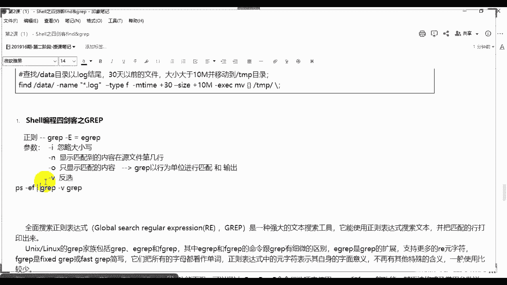
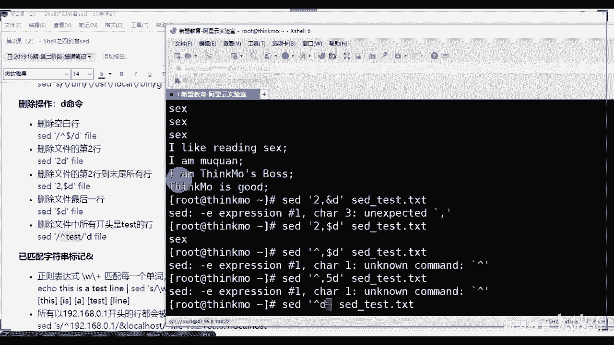
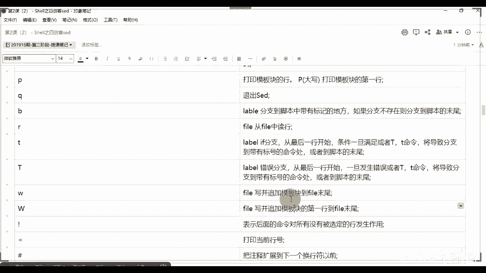
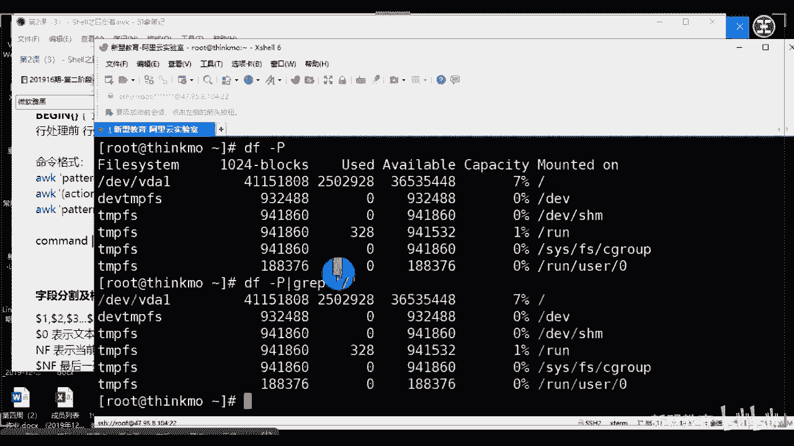
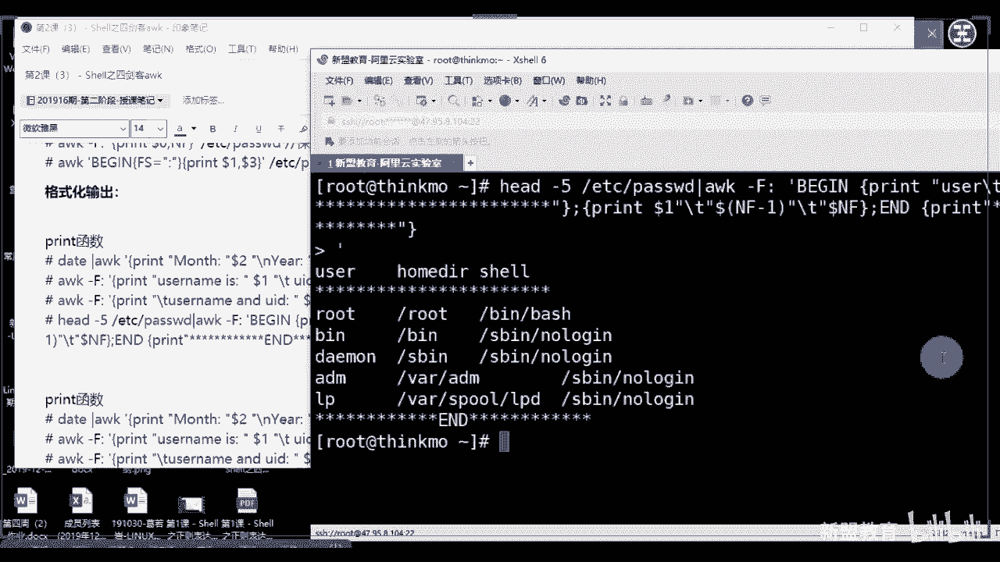

# 2021最新Linux-RHCE运维实战课程 - P2：RHCE-第2课-Shell之四剑客 - 新盟教育 - BV17K4y1t7XR

。

我们的四剑课啊四剑课的东西特别的多，所以我把它分成了三个文本。第一个文本是fd和啊，写错了啊，是fend和gra，不是f和s，f。好好了，为什么这两个一块写啊，这两个东西比较少啊，这两个东西比较少。

那么4000克先来说好吧，先来说4000克。啊，刚说了fg。😡，哎，sorry啊，把这个东西取消掉。🤧嗯。走标掉。啊，第二个来说是graphuff，对吗？同学们。😡。

第三个是sad和AWK这个前面说过了，分成两组，前两个后两个。前两个呢大多数用于我们的命令，你就是直接执行。后两个大多数用于脚本。啊，我们要去写脚本的，对吧？啊，那么一个一个去介绍啊一个一个去介绍。

先说我们的泛子泛子的话，你把它叫什么来？叫做大海捞针。大海就是你整个linux系统，这儿的话就是你那个绣花的啊，呸，就是你要找这个文件，明白了吗？啊，查找的东西。那么此时记下其语法结构就可以了啊。

是什么呢？语法结构命令加上pass，你可以指定出来我在哪个目录下去查。如果查整个的lindux，那就是跟目录开始。😡，啊啊别着急啊别着急啊，口误好吧啊，后边跟的重点是这个option。

到了重点是option。option后边加上你的动作啊，加上你的动作，先不要记那么复杂啊，先不要记那么复杂，后面写。😡，啊，那么f是可以连续啊，是大家好了，f是最最最最没有逻辑可言的。

你只需要去按照啊要求去选择我们相对应的参数就可以。所以这里边你重点要记的是其参数的概念。啊，是拆除概念，明有了吗？啊解了啊，那么哪些参数没有任何逻辑啊。第一个来说大家想一个问题啊。

我说了fin找你的那个呸 fund是找那个文件或者找那个目录，对吧？啊，老师告诉我我们会通过什么属性去找啊。😡，会通过什么属性去找啊？😡，你们可能说第一个来说什么，第一个来说肯定是名字，对不？怎白？😡。

对不对？第一可能是名字。😡，没毛病啊，第二个肯定是名字。啊，那么所以通过名字我们衍生出来第一个参数。叫干 name你都不知道？啊，但是但是别着急，后缀有什么呢？别着急，名字后缀称都是一样的，明白了吗？

名字后缀都是一样的，但是名字里面就会有一个bug。达到以后你也看好了另种是。和lininux。好，木拳和木拳。告诉我一样吗？你要吗？😡，一要吗？不一样，对吧？哎，所以注意啊，你用命你用名字去筛选的时候。

特别重要的是大小写的问题。所以靠同学们，第一个这个name是区分大小写的。啊，区分的。大小写的。啊，为什么是提取字母Y的呀？啊为什么提取字母外呀？😊，里面嘛经过后在里面的话，原字符忘了。

一会儿来说原字符你忘了。哎呀，这个这个孩子怎么又忘了。来看再说一下啊，再说一下，刚才有什么忘了啊，看这儿原字符里面的话基本原字符看到了吗？知道吧？除去什么什么以外，看到没有？除去什么以外。

你在它前面开头，那不就是除去以字母开头的了吗？😡，能理解了吗？就在这最基本的了啊。😊，好，后来就说哎，那怎么办？记住了，记住了，还大家还记得我哎加个I，没错，这I name。😊，啊，这个I不用了。

叫做一个no。😊，叫忽略是吧？所以这个是忽略大小险。行吧，所以我们。一般来说用它比较多。啊，120米差角度。好，这是通过名字，对吧？第二个，刚才我说老师通过它的大小是吧？😡，啊，通过它的类型。

通过他的时间我都写出来啊。😡，啊，时间还好吗？还好吗？😊，好吗？差不了呗。刚还有人试错了吗？通过文件内容可以吗？里面的东西不行，他是通过他是找文件名称啊，找不着里面的东西啊，属性对吧？属性什么？

比方说我们的。😡，属组属组这叫属性，对吧？属主属主OK好，别着急啊，都差不太多了啊，读写然后一般很少就读写了，这5个基本都能筛出来啊，这5就能筛出来。那么一个一个看，重点是一个一个看。好，第一个大小啊。

那么谈到大小的话，大家告诉我你能够知道确切的大小吗？能吗？😡，你能知道老师，我知道他1。156是吧？3。354是不是383十四得然不能，对不对？所以你只能给一个什么哎，不能。

所以你只能给的是区间这不同的，那区间就会有大于。😡，好，等于啊大于等于对吧？小于这三个。啊，小于这三个对吧？哎，或者大于等于小于等于我们都不跟了啊。好，那么然后这是数字上，那你还得有单位吧。对不对？

大小要加上单位吧，你是正，你是K，你还是M啊，你是M，你是K还是G还是T，对不对？😡，所以大家看好了，在这个里面。好，那你说老师如果我们现在给一个要求说了啊，我的文件。大于6。兆小于10兆。怎么表示？

😡，来老师好了，同学们，网络表示大于几啊，大于6。好，小于10。都是照啊，这样行吗？这样可以吗？同学们可以表到上一。😡，可以吧？😊，可以吧？可以吧？😊，想想想想想想想想为啥可以为啥不可以啊。

为什么不可以啊，告诉我为什么不可以啊。😡，啊，and end是吧，老是under end。是吧。是吧。😊，可以吧？😡，先不管它暗不暗的啊，记住啊大小的话用这个参数叫做杠 size。啊，所以我们要用的话。

是要连用两个，你不能用and end知道吧？要用连用两个杠 sizeize杠 sizeize。啊，不支持LTGT明白了吧？啊，不支持什么？刚才那些东西啊，记住了两个size啊，两个size好。

但是记住这么表示不可以，为什么大家别忘了告诉我啊，来看好同学们这个这个表示什么呀？在我们另下，还记得我们在去上节课里面还讲过一个东西叫做重定项吗？😊，还记得吗？还记得吗？哎，所以大家注意一个问题啊。

你知道这是大鱼小于，但对于我们来说，我认为你是把内容输出到这个文件下去了。😡，明白了吧？所以这就不可以啊这就不可以。所以看了，同学们，此时大于用加号，小于用减号。能理解了吗？大于用加号小用减号。

老师什么都不跟呢。😡，如果什么都不跟，就是等于号，明白了吧？啊，不用等于号，什么都不跟，就是等于啊，来看一下就知道了啊，来看一下就知道慢一下ban的命令，找到我们的杠 sizeize。😡。

啊，找他杠 size子。刚能说。N是你的具体数字啊，后边单位啊，你们自己匹配吧。当然我们用的比较多的，后边那三个啊，没有T啊没有T啊，但是转这看往这看。😡，啊。可以吧。

大家把这个前面他没有写这个加号减减号的注释是吧？大家先记下来吧啊，你们呃看好了，这上面没有写是加号减号啊，但我告诉你们啊，用加号减号表示我们的大于和小于。

理解了吧啊，单位你自己去看。😊，好，第二个类型，那么就是type。这个没得说了吧，对吧？同弟们普通文件。Apple。啊，目录哎，对对啊，目录是D。啊，目录是第一，这是我们常用的啊，这是我们常用的。好吧。

其他的东西就没有了。然后什么其他的就没有了，其实也有什么L啊、B啊，但是其他的我们就很少再用了。这两个是我们常用的啊，因为你找也不过是找目录或者是找文件，对吧？同志们。对吧重点呢是这个时间。啊。

重点的是个时间。而时间有什么类型有什么区别？好了啊，那么时间的话，我们会把它分类成两种啊，两两组。好，这两组是根据我的时间单位。第一组。😡，写了啊，第一组默认我们的时间单位。是以天为单位的对吧？第二组。

是默认我们的。一分钟。啊，第二种是一分钟。哎，别着急，所以时间的还没说完呢，没说完呢，我说两组啊。😡，这里边a time。😡，阿time。和C time。底下的啊t就是天啊，叠着A，看没了。阿妈们。

C阿没。对来。😊，起了啊。😊，哎，不着急啊不着急啊，所以这要说了嘛，对吧？这就要说了啊，其实你创建的时间就是修改的时间。😡，对吧你错着生就虚改了事业。不着急啊不着急。漏出这两个有什么区别是吧？

那区别就在于AMC上了，对不对？AMC了啊，看好了，同学们A表示的是在这儿了，往上看交大一个命令叫做states命令。😡，啊，用于去查看我们文件的基本属性。

来看啊，就相当于你右键属性一样。啊T题。好，test rule。来吧，老师看。啊，我来看。😊，不着急不着急不着急，这是查看，这不是访问啊。啊，这是查看啊，不访问啊。来看当了。那么此时此时访问时间。

这不是访问啊，这是查看，知道吧？属性又性没看到看哪么东西的。好了，文件名称文件大小啊，block是吧？I括，然后这是普通文件regular是吧？普通常规好，deices啊，这个不说了。

inodeode你可以看到inode有几个硬链接啊，就他们一个是吧，就它自己一个好，你的权限。😊，0644是0644这个对应过来。水线啊，普通文件在这儿呢啊，普通文件在这呢，对吧？

UID主ID可以看到吗？😊，哎，s啊，那么此时此时那好了，在这个位置上在这个位置上看到吗？AMC看到AMC了吗？

快AM了吗？好，这备好了。A time表示的是excise。

好，这个是记录我们最后一次的访问时间，也就是其浏览时间。后面的话M。叫做modify。对吧最后一个C表示change。啊，目的代表什么能？叫做记录我们最后一次内容上的修改时间。啊。

内容啊、数据啊甚至表示记录我们最后一次属性上修改时间。当然这里面也包括内容。啊，你要是把内容改了，其实它属性也变了，对吧？它大小不就变了吗？那也是它的属性啊，对了。😡，对吧这个时间上会分为这两组。

同样的记住了啊，老师大于10天怎么表示啊杠M time啊，当然我们应该说的是修改时间啊，M time加1明白了吧？加1。啊，加1小于10好不好啊，来家。属性呢。😡，啊，属主。杠user啊。

就是杠user啊，这有没有数组，我们还还至少用啊，我看我找找有没有啊group。😊，有吗？有啊有对。数左。干够跑。打开了吧。所以看了，此时看同学们，因为我的f是支持通配符啊。

我 find的是支持通配符啊。对啊？所以当好了，这个心表示的是什么？是任意。长度啊，任意字符。所以目前来说要求案例啊，那干嘛呢？在我们整个的leex下。啊，我们找寻啊，当了，以我们A开头。

以我们的点log结尾。啊，注意啊，此时我们不支持正则啊，所以到了什么这个啊你比如说不支持嘛，你看一下能不能用吧，是吧？你可以尝试一下自己啊，以二个结尾啊呃呃呃呃在我们。啊。10天前。修改的。啊。

大于5兆。啊，小于20兆的。普通文件。啊，乘以二道的呃呃呃用户为root的普通文件。看同志们，你告诉我你告诉我他有什么逻辑吗？😡，你告诉我你们在写饭的时候有什么逻辑吧？没什么逻辑吧，一步一步来嘛。😡。

能理解了吗？没有吧，一步一步来而已，是不是你看吧，同志们来跟着我写一下fin的。😡，Lux下写路径了，对吧？pa什嘛第二步liux下怎么显示啊，根嘛，听同学们啊，以A开头也以这个结尾，并且排除。😡，啊。

这里面要排除啊，排除access点log。好吧，party accessible log好，有说老师啊，看先说名字，先说名字，g name。😊，好，A星点log，这个该不我说了。

同学们星表示任意长度任意字符，所以以A开头以log结尾中间能理解吗？来临取双移，这点能理解吗？这点能理解吧？啊，当然你也能那么写看吧，当然这样子其实是等价于这个样子的。😡，告。内幕A星。杠内星点log。

这是连起来用等于它一个，明白了吧啊，连起来等于它一个。所以第二个来说，这是排除怎么做怎么做。😡，怎么做？还说是不是祸飞与或飞飞的关系啊。到了非用叹号表示。啊。

注意一定有空格干 nameaccess delog。啊，这个是排除。然这是排除。啊，我把这几个嗯我把这几个给他。缩小一下啊，属悉。好。😊，往慢看啊，这往上看排除之后时间上是吧，在10天前杠M time。

😊，加上10天。啊，修改了size。😊，5兆大于杠s。20兆。go user route。这文件杠type F。你看一下同学们没什么逻辑吧，对吧？没什么逻辑吧，来复制过来，看他能不能执行。哎呀。

sorry。😊，啊，看他能不能执行啊。😊，唠唠就行啊。啊能执行吗？是不是能执行啊，只不过没有而已是吧？但我已经掌握了，还是很快的啊还是很快的。😡，好，所以的话这是一步啊这是一步。那么当然了。

如果此时我们再加上一个要求什么呢？好了，要求各位。哎，懂了吧？啊，要求记住啊，我们将我们匹配到的同时。将我们匹配到的内容。哦，我都复制到我们的。OP底下。怎么做？啊，我这一定要画到重点。

这个希望你们能记下来啊，这也是很重要的一点啊。第一种方法到了。😡，肺医。哎呀，最近在看一个最近在看一个电视剧，你知道吧？啊，偶尔的晚上刷两集啊，叫什么嘞？啊，再来。😊，有什么啊，法医在上面的。😡。

还到没有？在这呢。啊，跟上我们第二个参数叫做杠ESEC这不需要中括号啊不需要中括号啊。啊，那中午好。来。😊，来。往这看啊啊，不是清明年是吧，我看我看的叫叫叫叫心灵法医啊，不着急，别着急啊。

回来给你们推荐啊。杠EXECEXEC表示什么叫做执行，对吗？同志们啊，表执行后边的话直接跟你的命令啊，ESEC里面当了，跟你的命令，比方说CB复制吧。好，杠A完全复制。😊，若是完全复制的话，意味简单。

你不可能一个一个复制是吧？老师好，用大括号表示，大括号表示我们什么。😡，表示我们匹配到的所有的内容。😡，能理解同志们。😡，最后以反斜杠分号结尾。啊，最后以它结尾在这儿。接来这是啊方法一。啊。分法2好。

同志们用什么用到我们分管符和一个新的命令。😡，叫做XARGS这个好像在上一个里面有的哈啊这个上面里面有的哈。来。😊，那么XERG这个问题看同学们，我们用个杠I确认也是CP也是大括号，也是到OPD下啊。

忘了这个给了，杠OPD下。好，但是他不需要结尾符号，明白吗？它不需要结尾符号。理解了吧？啊，不需要结尾符号。好，所以问题是咋了？问题。😡，猜一下啊。啊，两个的区别。哎，两个区别是什么？😡，这才是重点啊。

对吧？你这这会用不算什么区别啊，不算什么好处。记住啊呃，感觉SCR这会方便一点啊。当好了，恰恰相反，记住了，我们在生产环境里面用插度生产环境里面用插度知道吧？

用EXEC为什么很简单听到它俩的区别你就明白了。😊，好。哪里什么意思？呢好了，因为你是分管服利的，同学们别忘了啊，杠EXEC是我们范的自带的。😡，哎，所以衍生出来一个问题是什么是什么？是我们匹配一次。

执行一次。赢了吗？而不忘了，你是分管符XARGS不常同学们分管服什么？是把前面的当做结果条件作为后面的啊，那么所以它是匹配了所有之后，而是匹配你所有之后我们完整执行。学以这完整执行啊，那么带好了。

如果你的文件小，如果你的文件现在是一个T，你会告诉我这样子合适吗？啊，能理解了吗？这个更加的稳定一点。😡，更稳定。哎，对吧这个是稳定的啊，对吧？你当然有印象了，公开课有事说过啊。好吧。😊。

所以这个是fin的，我们经常会用到的东西，可以吧？同学们啊，所以呃这是fin的里边的东西其实都不用我说了吧，看一下看一下，我都说了啊，这里边重点的就记我给你们这些参数，可以吧？同是吧。

底下这些东西都是文件都是我给你们整理出来的。😊，OKO底下这些东西我给你们整理出来了，其实你不用太去都记忆，好吧。可以可以啊，看到没有啊，路径你自己去匹配吧。当了，这个是匹配吧。

这也是通配服里面有这个的啊，通配服里面有这个了啊，好吧，飞对吧？看一下看一下是不是都有了，是不是都有了，看到没有？😊，执行对吧？执行。对对。😊，啊，这是我们的f的命令啊，这是我们的f的命令啊。好。

接着说。啊，g gr命令。其实也没什么可啰嗦的。跟大家说g也没什么法，grab正则你们会了，对吧？同学们加个正则对吧？就是grab杠1等于。😡，一个这个都会了，那无外忽视它其他的这个小参数。重点记几个。

😡，第一个。杠癌表什么呀？😡，刚一表什么呀？😡，要什么样？叫什么忽略对吧？啊，所有的基本上所有的刚才都是这意思啊，进来吧，看到没有？忽略。😊，第二个。😡，啊，忽略大小写。第二个感恩。好，干嘛我们去显示。

是吧显示我们匹配到的内容在其原文件。第几行。啊，这气好。啊，不是显示你匹配行，是匹配你在原文件里面是你行。😡，再往下边杠O啊杠O啊，不是零啊，是只显示。只显示我们匹配的内容。再往下杠V。啊，杠1。干嘛？

同学们V反选看觉了吧？啊，反选进来。为什么用这个东西杠O啊？很简单，就说一个问题啊，我们gra是以行为单位。😡，啊，gb是以行为单位去进行匹配。好，何叔叔。只要你这行保有我匹配的东西，我就给你说出来。

大家刚可以看到效果，对吧？所以这几个是我们常用的，好吧啊，N输出行号，对吧？然后然后然后V筛选。啊，一扩展。啊，O呢这里面没列出来啊。大家这个这个还用再做一遍吗？谈们啊啊杠V graph这有啥用途？

很简单，这一般在哪用？我告诉你啊，老说g杠V graph这个一般跟什么用啊，跟这个用叫PS。😊，片子是干嘛？还记得吗？杠EF还记得这条命令吗？😡，还进吗？同志们。

好了，PS杠EF老师graphHPD。进程对吧？同志们好，此时我启动进程了吧。😡，我启动镜头了吧。我启动了吗？😡，我启动了吗？我没有对吧？我没有启动啊，但是为什么我还会有一个呀？😡，还有一个啊。

因为你是因为这是一条记录，这是一条记录。所以我们会在这个后边g杠V graph干嘛？我是要把这一行记录取消掉。明白了吧？😡，听了吧？啊，s CTLstar HCBD。

看一下这样再走，看到没有？能理解了吧，这下。😡，啊，这个目的是取消PS这个记录。OK了啊。好哎所以。😊，不什么可多说的了是吧？这也没什么可多说的了啊，M crop简能做介绍啊，这儿呢。😊。

那么把所有的字符看作单词。啊，把所有字母看成单词。好了吧，这没多说了啊，这不用说了。嗯，还有吗？😊，看好吗？啊，命令就是语法知道吧？语法的话呢，你有两种是吧？第一种的话呢，就是你直接用graph是吧？

roroot啊，找到ETC下pasword，你直接跟文件是吧？第二种呢老师CATETC passwordword把结果再去抓寻是吧？那结果再抓取也行，两种方式，两种方法，好吧，所以这个是我们要去做的。

当然它里面的像通配符，这是DI就是吧？正则看看是不是跟我们前面教差不太多啊，看到没有？看到没有？看到没有？只不过只不过你们可能要多记得，这几个是最常用的。😡，就这几个是最常用的。

这就是最常用的底下这这个这几个常用。😡，啊。这几个真的不常用，是吧？这几个真的不常用，不过你可以记一记，好吧，你可以自己记一记。😡，好呃，大家可以看底下等你们列出来了，可以自己玩一玩，好吧。

可以自己玩一玩看IBV4的地址，看到没有？IV4地址。😊，能看了吧？🤧嗯。想要注意个问题啊，其实他这个地址当然了，他这个地址显示的还是有问题的对吧？不能是0到9，对不对啊，不能是0到9。

正常来说不能这么虚写。啊，这量说不能那么去写。😡，好吧，所以说不能那么。好，大家有什么问题吗？还来看你们情况啊。😊，没是质来说不那么细写，但是你现在把它看作是正确也没事儿啊，这来说应该更严格一点，对吧？

第一位的话肯定是0到肯定什么是0到2啊，0到2后边的话应该是0到5没问题吧，啊，后面是0到5两位。行，说那么多说那么多啊，因为他这里面的话肯定超不过这个数，这没问题的啊。然后说那么多。

然后呃大家后边的话，我把这个小录径先放下来，晚上干嘛？晚上晚上晚上晚上备课呗，晚上备课学习嘛，谈其他的事情就是我们上班的时间可能跟你们还这不太一样，我们正常班是下午一点半啊，然后呢。

晚上晚上晚上不知道几点下班了啊，基本我们正常的时候是晚上11点就下班了，晚上11点下班之后呢，你再加上公司的其他一些安排，就再加上培训。😊，再加上其他一些东西，那就整一整，就那么一两点来钟才下班。

下班之后的话。再回家是吧？回家还要遛遛狗，遛遛狗之后呢，你要饿了，你还得吃点啊，然后就就就就差不多3点钟睡觉啊，差不多啊，不是不是不是我我但是我跟你们不太一样啊，跟你们不太一样哎。😊，啊。

这样的时间刚刚好啊，约会可以可以可以可以啊，行啊，没有，其实怎么说呢？就是我其实哥是这样子的。呃，很多情况下大家可能是太爱惜自己了，我觉得是也不能说太爱惜自己吧，但你也不能糟蹋自己的身体，对吧啊。😊。

吃的方面呢好一点啊，精力方面的话，调整好，规划好自己的时间。你们很多情况下是这样子的。老师，我晚睡，我为啥晚睡呢？玩东西是吧？白天玩游戏，晚上呢不睡觉啊，反正你们的时间利用率很低，是这样子的啊。

你像我们这样子，我跟你说我们像一天的话，从早到晚上至少得做十件事儿，这是件有效果的事情啊。很多的。啊，行准备开始上课了啊。那我们前面讲了一个中午休息嘛，我我中午基本上还行吧，中午可能会睡半个小时啊。

中午可能睡半个小时。啊，然后下午可能休息一个小时。行然后我们说啊那个linux的话，我们说了shall里面有4个剑客，对吧？都是我们的工具。那么前面讲的是grap和f的两个命令。这两个命令。

一般单独用就可以了啊，一般单独用就可以了。目的就是干嘛啊，就是我们去通过ok第一个f，我去在文整个系统当中去找我的文件或目录。哎，它的路径。第二个来说的话呢。

就是我要去通过guff去筛选我们文件当中的内容，记住啊，一个是找文件，一个是找文件里面的内容。好，那问题在于说这两个其实对我的文件的内容是没有办法进行改变的对吧？同志们啊是没有办法进行改变的。

那么如果我想要去改变这些文件，我只能通过其VI或者VIM这种编辑器。当然还有其他的啊。好，那么现在呢通过一个命令叫什么嘞？叫做sad命令，记住sad叫做流编辑啊，叫做流编辑器是吧？哎，先不管它什么叫流。

但总之大家明白一个问题，它是编辑器。也就是说我可以用它去对我的文本进行基本的操作。那基本的操作无外乎就是增删改查，对吗？同学们啊，无外乎是增删改查。😊，好，当然了。

你们可能说老说我用side其实就一个事情干嘛做替换，对吧？啊，我们其实在整个的脚本当中也是替换为主啊，其他的因为它的编辑，它的增加它的删除啊，用的命令子命令太多了，所以我们就直接拿VI去做更方便一点啊。

拿VI去做更方便一点。那么除此之外啊，除此之外，大家记起来。sad和我们的VI的最大的一个区别在于说我的set是具备一个叫做啊具备缓冲区。好，缓冲区不用我说了。对吧同志们，也就是说我从原啊到我的缓冲。

再到我的目的，再到我的目的。那么一般情况下，一般情况下，我们打印出来在显示器上显示的都是缓冲区的内容，只有我们通过某个参数进行提交提交之后我们才能把原真正改改变掉啊，真正的改变掉，看起来。

那么我们先来看一下是吧，整个set的基本的语法情况啊，往上看同学们，那么从我们的命令，也就是说我单独在整个的sell里面去使用它啊，通过我们的s。看个选项好，选项后边行同学们。这个引号里边会有命令。

它和其他的这种命令参数是不太一样的。大家知道sd的命令。好，它是通过一种怎么样？通过一种格式的方式表示。啊，通过格式的方式进行表示啥意思？那好了。哎，我们前面跟大家讲过，如果我想替换的话好了，s好了。

如果举个例子啊，s杠I引号引起来杠杠杠啊S表示从我的光标开始好，如果我后面跟的是D好，同学们，这个就表示删除。😊，而且表删除，后边跟我的fill name。

所以我的啊我的这个这个命令是以这种的形式进行的对啊，是以这种形式是的，也说这些管它叫做子命令。啊，子命领起来。啊，那么而且大家记住了，我的set是可以对于多个文件进行的。

比如老师fell name fi name一，fell name2，fell name3是吧？一直到我们的fill name N。啊，一直到我们教里门，它可以对多个文件进行。

其实你VI的话也能同时操作多个对吧？啊，你VI也能啊来看一下同志们，你比方说啊刚刚我们家没电了啊，又买了电又买了电啊，外么。

讲了fell name one  fell nameq，我其实都是能的，看到没有？他会告诉你，你现在正在编辑的是fell name one。😡，啊，还比方说I am一条。是吧他不全保存退出。😡。

走到了看到这个位置上保存退出。走看他会告诉你两个文件都被改了。但是请你注意个问题，老师CT啊，我们fill name one。😡，好了，有吧，你有f name true吗？会告诉你没有，对吧？

因为我强制退出了一个。😡，我强制推出了一个啊，看到没有？如果老师我老师我第二个也想编辑内容，必须有内容才能保存。比方说进来。😡，好。保存再看三已经有了吧，退出三好，此时。

看同学们，此时你们只会有三，看到没有？如果我们强对只会有一和3，对吧？也就是说你两个同时编辑，但是你只能编辑前一个，对吧？你没有办法做切换，明白了吗？😡，啊，都用VI，但是用set的话是可以能够切换。

并且两个都去做的。把这个记下来。啊，而在脚本里面格式我们要用的是多出一个杠F scripts带好了，杠FF表的是一个参数啊，一会儿后边我们会看到这两个具体的区别和方式。好，记几个重点参数。

第一个第一个啊，直接在命令行模式下进行编辑。也就是说老师s好，这个这个东西默认的啊，sad杠1，这个不写就有，这是默认的。

进来不用写。第二个来说。😡，是不是这样来说知道吧？唉，是我们的F对吧？F的话是将我们的set的动作写在一个文件内。好，用杠Ffill name去执行我们fell name下的动作。😊，啊。

去执行他的动作OK吧，就是这就是叫了用什么意思啊？就是比方说sd是杠F加上你的文件file好，这个就等价于bu0，加上脚本。看到没有？这等于80加上脚本，对吧？你不需要里面去做注释了，我直接调用8。

啊类似这种情况啊。杠I是直接修改文件内容，也就是跳过我的缓出。啊，所以杠A这是我们非常重要的一个参数啊。刚刚这也是。啊，杠N只打印匹配的行，这个一会我会看到啊，再底下这几个其实就没有什么了啊。

没有什么了。跟R的话支持扩展表达式对不对？这要记下来。好，现在12344个啊，四个上低住的。那么来看一下，这个是我们选项，的参数里边也就是我的文件是吧？你具体要做的文件列表。啊，注意了。

那么请你们注意这几个哈，这是我的常用的命令。这个命令是我的子命令你来说。啊，是指那个。也就是它在后边会用的，就是我的格式后边会用的好吧，或在前面这儿也能再用啊，在这也能再用，那怎么用夸同志。

第一个A先记啊，把这三数先先记一下，大概的啊先记一下，先过一遍A在当前行下面，A在上面知吗？这两个我希望你们也记下来，为什么？啊，这两个呃，你们到了后边学到了IP table。啊。

appy table符手我们必用啊，这两个也是一概。也是一个概念。A的话是在当前行下I的话是在当前行上Itable这样的杠C的话把选定的行改为新的文本杠D删除小低删除，对吧？

大D删除我们模块的D行啊S替换对吧？S替换这家知道了吧？啊，刚刚开头那个地方啊啊，这个和我们在sell里边直接做替换的命令是一样的啊，做命令一样的S缓冲区，这其实我们不怎么用啊。G啊。

可以看一下全文是吧？啊，这个这个这不是全文啊，获得内容的缓冲区的内容并替换文本当中的容。啊，往下看很多啊，可能你要注意的可能还要底下一些WW然后我们用到的时候再去看它的效果。好吧，用到时候再去看。

包括底这些东西。G全文P打印是的W写入等等等等啊，我们先把它记下来，好吧，再记来看重点的东西啊，看重点东，这个这也不用我说，这也不用我说。来看实例啊，通过实例去理解啊，通过实例去理解。那么现在看同学们。

我们先去创建一个一个文本。

好吧，apple呃别apple了，写一个。没不。呃，test。把贝排除了这个sad。叫。跳是的跳去。好，里面我写几个啊，比方说啊I like I like milk是吧？ウ利ブ。啊啊，IM同学。好。

然后IM。啊，I'm6。啊，那那还有什么来着啊，think是吧？每次都给我们公司打来广告啊，it's good啊。好，我们写那么四行带好了，写那么四行，看一下啊，都是保存好的啊。😊，可以看到吧。啊。

现在呢我通过替换注意了替换用的是SS在哪里？在开头对们？在这儿呢。😡。

那么这是替换的什命令。😡。

好，怎么做默认是有意的对吗？同志们默认是有意义的，所以我不加我直接引号好S后边文本我要替换你，对吧？那么替换当中看了，我用杠杠杠可以，我用冒号冒号可以，我用井井井可以我用at at at也可以。

我们管这些东西叫做间隔符啊，叫做间隔符，常用的就是杠杠。比方说老师，我想把books换成换成什么，换成sex啊啊。来看来看，那么此时再看一下，看一下，看看我是不是把前面的被替换到后面了，来看到刷意。

能上啥一。看到了吗？但问题在于来，同志们，老师，我们看一下啊，看一下这个原文本，你发现原文本和它有什么区别吗？还吧？那么也就意味着一件事情，此时我给你打印的是你的缓冲区，明白了吗？我打印的是缓冲区。

并不是真正的目的文件。你原文件没有改。能理不明白，你原文件没有改。啊，原件没有改。好，所以我们用杠N和P命令在一起的时候，我是只表示打印那些发生替换的行来试一下啊。S杠N好了，注意啊，它有的命令是在前。

有的命令是在后，明白了吧？啊。好同学们，我现在既然要替换你好P。对吧杠N选项杠N我们刚刚说过了，非达理在这儿选项啊，记住选项在这儿。啊，高才选项到这了。

啊，那么我们读取下一个输入行，用下一个命令处理新的啊，那该不是它，对吧？应该不是它啊，不是这个总的来说是我们替换标记或我们原则符哎都不在这儿。啊在这呢啊，当然只打印我们模式匹配的好。对吧生匹配哎。

我们模式是P，对吧？真真的。命令P啊先实话打印我们第一行对吧？模块比配第一行。

来看好。看懂了吗？我是不是只打印了我要去改的那一行啊？那么但是此时再来看一下我的原文件，好像还是没变。看不是同学们啊，进来进来，但是我还是没有变。

但是别着急啊，我做的事我肯定是希望你变啊，对吧？同学们，我是希望你变的。那么此时我跟上一个杠I，记做杠I表示确认还记得吗？我说过了，是确认提交修改。😡。

而G表示的是全文替换。能解吧？标志是全文替换。好。但是此时他不会给你做什么，不会做显示啊，不会做显示。但是你看原文件。😡。

变了吗？告诉我变了吗？来变成说一变了吗？😡，掉了吧。好，注意啊。参数没起来，这是替换的啊，这是替换的。

对吧全面提货为G啊全面提货为G。那如果说我不跟着它了，不跟基了不跟基了。😡，S表替换。

替换命令啊这么办。懂吧？替换命令嘛，对吧？替换啊G如果不跟G的话，就是第一行第一个。😡。

好，缓存下你思画好图。

啊，类似room知道吧？类似类似类似缓存。啊，类似好做好了，这个是你的文件源。啊，对，只替换第一行的第一个啊，这是目的。缓冲区在这儿呢，好去那么画，拿虚线化，这个区是单独变出来的啊，缓冲。好。

那么此外好了，你如果说是我直接下的啊，我没有杠A，就是不具备杠I的。😡，杠A啊，没有杠A啊，那么此时啊我打一个缓冲，我去CAT的话，我是把它的内容输据出来printnt。啊，问题。更I的目的是什么？

跟爱的目的是在这儿。😡，是我直接确认杠A。把你提交。最终我才能打印的是他明白了吗？明白了吧？司机。

哎进来哎，如果不跟机的话，就是第一行的第一个对吧？啊？就是第一行第一个跟机的话就是全文啊，这个和我在sell里面的话还是有区别的啊，还是有区别的。所以到了，此时如果我想做的哎，当好了好。

使用之后我们会替换我们每一行中的所有的匹配，这不是就全文嘛，对吧这一思就全文吗。

好，那么当我需要从第N行开始的时候，请你注意啦啊，从第N行开始的时候，注意啊，你们不会在前面老师第4是吧，一逗少4可以吗？我们尝试一下可以吧。

来看看你们觉得行不行啊？哈，同们，我们先来替换一下。😊，好，我们现在要把我们的这个这个我这样写吧啊啊。呃，我想想啊，想想想想把我们的ele。啊，这是从第几个开始啊，对吧？然后老师，我想从第几行。

我再把这个文件改一下。好吧，啊，给给给给一下啊给一下啊。再次。是吧sex啊sex是吧，提点敏感词，你们也也也行怼，不着急啊，别着急哎，别先了。好，那么我这看同志们，如果老师我想s的以后引起来好了。

杠I吧，好不好？我看我能不能这么先不杠I好吧，就正常来去显示S杠杠杠啊老师我想把sex替换成C。😊，这样可以吧，G啊，我要不跟G的话，老师我前面跟什不喜看了一逗号2。啊，头然，每个文件是吧。

每个文件sad来看能吗？能吗？那么。是不是也能啊？我可以通过前面的控制你地长1到21到4。大哥但此时要注意它也是什么？也是输出的是你的缓冲区。啊，但是这个时哈这个是说的是一行所有的对吧？

所有的那是如果我想控制行里面的话啊，我想控制行里边，比方说。好，再改他。啊，对外么？我们拿这个说吧，就拿他给的例子，好吧，SKSKSKSKSKSKSK。😊，SKSK好了好了，此时的话。

一组、两组、三组、四组、五组、6组、7组，对吧？好，我现在呢只想替换前面的两组。张同任，我现在只想替换。哎，比方说老师，我从第几处开始，我从第二处开始替换原文。可以吗？好啦，我怎么提换啊。😊，好。

我们这样写啊，s给他啊给他下好，以后引起来怎么做S不变啊，S变把我们的小SK替换成大SK好，老同学们如果老师我想替换的是从二到G，是从什么，告诉你了，看一下啊，看一下，回说试一下啊，看一下。

是从第二个到结束，看到没有。😊，看到了吗？同志们是从第二个到结束。

来了4从第四个道结束。

理解了吗？O吗？😊，啊，那大家看如果如果这样写。如果这样写吧。大家记住啊，这样是不行的，明白了吧？这样是不行的啊，这样是不行的啊。但是你可以单独指出来你要替换哪一个。比方说4。对吧？我要替换第4个。

把要替换彼次的，看到没有？兄弟们。

啊，对了1-4是不是也不行吧啊对。哎，你可以这么去做啊，可以这么去去试啊，尝试啊，所有东西其实都是试出来的，知道吧？啊，所以有东西我也你像留编级的话。

这个地方格式我也不记得我也不记得是用E-4还是用本4，但它不能用，能理解了吧啊，但它不能用。😡，好，那问题是对吧？问题是哎老师有大括号是不是行不行？X是啥大括号一逗号4可以吗？也是不行，明白了吧？啊。

那么但是呢好了，别着急别着急，还会有一个问题。😊，如果此时好老师杠杠杠杠杠杠。啊，我也要用sag去替换S杠杠杠大了，我想替换所有的SK变成我们的啊，把我们的小杠替换成我们的空格。啊。

听我什么空格问个问题啊，我这么写行吗？我这么写行吗？老师，你把杠换成这里边的空格，行吗？😡，行不告诉我行都刷一不行2。😡，行吧。行吧。不行啊，为什么他会告诉你啊，一个问题啊，你知道这是间隔服。

但他不知道为答。哎，所以解决方法有两个。第一个来说。😡，转意。没了吧，转移没了吧。第二个方式。😡，换什么换的间歌服嘛。把那接构符换了，可以吧？能理解了吗？啊，第一种情况是转移。第二种情况是间隔服。啊。

这个符。所以这个符常用的我们也叫做定界符啊，或叫定界符都可以这两个称啊，看一下。你可以用冒号，你可以用竖线，你也可以用杠，你也可以用井号。总之一切比较特殊的符号都可以。老师我用问号行不行？你可以试一下。

反正我有的不是啊，我们常用的这个这个还有井号，明白了吧？而且同志们啊，所以那定裂幅出现在内部时，我们需要进行转移。拉经转业来看。来看看到没？这个句话什么意思啊？来看，我们先找谁被没被转移，这个没被转移。

对吧？再找这是转移了的，这个呢没被转移吧。同志们这个没被转移吧，走转移了的，转移了的转移了的没被转移啊，啥意思啊？😊，我们现在是想将你的病。变成什么？把你的病变成我们的。You sir。local对。

没毛病吧。能看到不能看不到刷一上来。😡，谁先走吧？OK啊，行，我们再说。啊，所以这个是一个这是一个间隔符或叫定界符的一个问题啊。大家记得，千万不要不要不要用四个连着的啊，要不要转移，好吧。

再往下面是一个删除，删除我说过了，在哪里在结尾看到没有？在结尾啊？删除第二行用2D直接跟就可以了啊，直接跟好，到了删除空行空格，看到没有？这个是正则啊，这是正则，再往下面，老师删除从第二行到末尾行。

看到这是删除末尾一行，这个是删除以test开头的行。

好像很清晰哈，这东西是吧？我们做一下就知道了啊，做一下就知道了，怎么做。注意啊，怎么做？我们还是同样的在着啊，走，当好了，我说了，如果你们想使用这个这个。正则的话啊，一定要用杠杠啊，一要杠杠。

当然一会儿你会看到反着杠的杠啊在AWK里面好吧，那么此时这个表示空行，对吧？啊，只要看一下我是不是真的能够执行就可以。可以吧。😊，能吗能吗？同志们是不能执行？对吧没有坐少车，我想上出第二行走2D。

看第二个没了吧，第二个没了吧啊，但是如果说老师我想筛分1到4行。哎，我往下说一道4行其实跟它是类似的这不吧，那就是一逗号4嘛。对吧哎，一逗号词啊，别绕别绕别绕别绕。如果师我想删除的是开头从开头是吧？

叫开头知道吧？开头到结尾，大家告诉我，你们认为我这么写可以吗？可以吗？开头到结尾可以吗？可以吧？想想可以吧？啊不可以啊，这啊不可以啊，明白了吧？不可以啊。好，3434。那如果说老师我给个杠杠。杠不行吗？

哎呀，这样写啊，这样写呢，这样写行吗？这样写行吗？你们觉得。😊，这样写呢。小姐呢。不着急不着急不着急行吗？想想想想想想想想想想行吧，没有用是吧，没有用是吧？来好好来啊，没有用啊，对吧。😊，为什么？

没匹配出来是吧？哎，不行啊，接来好吧，所以如果你可以这样做，记住了，你必须得跟上一个数字，明白吗？比方说老师，我想删除第二行到最后一行没问题啊，你想删除老师第二行到最后一行。进来引号逗号看看。

2dollar啊写错了，dollar是吧，dollar啊， dollarllar啊， dollarllar啊，写错了是吧？你错了啊。好，我把它换回去。不行的这是不行的，回复一下啊。

所以你必须有一个什么郭老师我开头，如果我写成五呢。😡，这样你们觉得行吗？想想这样子行吧，想想。叫什么？这样行吗？也不行啊，好吧，所以如果这样写呢。😡，这写呢。这样解呢。开头行是吧，这是开头行吗？😡。

行吧？看到了没也不行明白了吧？好，所以在这里面有个特殊的问题在于在于什么？在于你的上金括号此时代好了，它不能代表首行，首行一定是以一开头的，明白了吗？啊，首行一定是以一开头大家来。啊。

首行一定是一一开头。但是你结尾还可以用它。😡，啊，但你结脸上可以吧。好，今下不是说了，这个是正策的答式是吧？这正多。啊，一直没有看到。好，重点在这儿了啊，知道吧？重点这呢，正则表达式。😡，哎。

第一个这表示什么？第二个这个表示什么？😡，看到同们？来看加后你们明白吧，对吧？加后你们明白吧？好了，同学们，此时ecle这是我出现的东西了吧？我把它们进行替换替换什么？注意了。

正则表达是W往上看往上看啊，这个地方表示什么？往上看。😊，W在哪啊？第一个来说，这儿的W。表示把行写入一个文件。好大告诉我，你们认为是这个吗？😡，对微是这个吗？是这个吗？是这个吗？是这个吗？

是吗佳佳佳佳是吗？标记一般在哪儿啊？标记一般是在末尾，对吗？😡，标记一般是在末尾对吧？这个位置明显的no不是它。😡，啊，明显的不是打。好，再往下老师还有W吗？😡，拍W吗？在这呢。还没有？不有哎对。

就这一个了啊就这一个了啊，没有其他W了。所以啊什么意思？小WWW这边写的是小W对吧？😊，啊，不是的移2别着急，表示我们fill写追并追加模块到我的fill末尾。哦，别着急，其实这是啥意思啊？就啥意思啊？

这就是一个追加，知道吧？就是把我这个文件追加过去。😡。

追加到末尾嘛，这样，那么此时这个文件前头有东西吗？同志们，我就直接拿的是这个语句，对不对？直接拿这语句，那它就是我这个文件末尾吧，没问题吧。哎，类似重令项类似重令项。

能理解了吧。老师。所以这个东西还是你们要要理解一下的啊，替换里面了。好，那么从那项加号每一个对吗？同学对啊，what对这里面的重复性感可能会忽有多个啊。N代表什么？记住了。😡，摁的往这走在这儿呢。

在知了。对吧这是字符集啊，这是字符几开始呢嗯，聪白是保存搜索字符。前面我说的是love，这个就是logve。😡，我前面搜的是其他，下边就是其他，你前面搜什么，它代表什么？明白吗？同学们？哎。

所以在这个里边我把它替换成了它，看看是不是把这些东西加起来，每一个里边看看同学们这样子一个方式，来看一下全文替换。好。看一下。看一下。走。😊，来看看是不是这个结果来看到上一啊。😊，来看我说一。🤧嗯。

你先当匹配啥，我就给你做什么，对吧？啊，对吧O。😊，OK好，所以当了，以我们这个开头的IP，如果我想加上local，你就可以用这种方式。老师以它开头嘛，兼过号加上IP地址，把它替换成它加上local。

那就是用它and表示它，对吧？最终我们把它输出的是这样子。😊，啊，最终数字是这个样子。好，这是答案啊，这是答案。好，然后接着说按这说还有一个是杠1卡拉杠一表什么往这了。在这呢。啊。

表什么表示子串匹配的标记啊，什么意思啊？很多作况友跟你们说啊，是看答案翻推出来它什么意思？这种都很官方，你知道吧？你要让我愣看这东西，我也不明白，明同学们，我也不明白。所以记住了。

当你看不懂一个东西的解释的时候干嘛，看不懂解释的最。看不懂。解释就是啊用一下。测试一下。再反过来看看什么意思啊，往师看。老师看老师我杠一对不对？表示子串匹配标记啥意思啊？没错啊，这个是我输出的结果。

我把它放到这里面来了，对吧？同学们好，把我们的Dgate好，干嘛呢？0到90到9正则，对不对？0到9好，干嘛呢？我们去匹配一下。😡，啊，把它替换成这个杠1，最后执行的结果是这个样子，看同志们？

其实这个样子，啥意思啊？啥意思啊？PV标记嘛，对吧？啊，你们没发现老师我此时是不是缺少了这个位置啊？😡，是不是是不这个位置？是这个是吧。and和dollar0应该。是一个结果啊，dollar0的话。

我们表示脚本的脚本的脚本的这个这个这个名称啊，脚本名称dollar0好吧，后边的话AWK里面也会有dollar0，但这里面但是没有dollar0，好吧，sad里面没有dollar0啊啊，然后杠0对吧？

杠0是可以对杠0。啊，那么此时请你注意命令当中Pget期代好了，我们被替换成了7，没问题吧，看看？是不是Pge加了一个东西，是不是匹配的是他们？告诉我是不是这有个空格啊，这有空格。😡，是不是匹配到他了？

😡，一步一步走啊，那么匹配的子串是什么呀？匹配式的子串是7。😡，那子串时期用这个东西，这个就是子串。理解了吧？用于匹配块。看大图呗。所以最终我的杠一做子串的标记，对吧？那是谁呀？子串不是他嘛？

那于是就留个7。😡，理解了吗？啊，这是他的第一个子串来例9上一。来啊。啊，如果你想看第二个子串呢，就是杠2，第三个磁串是杠3，第四个子块杠5是吧？啊，第五个子串杠5啊，拿起来哎，开头不算啊。

算的是后面那东西，明白吧？啊，算到后面那东西。啊，然后我们就说完了你帮助这个情况下呢，好吗？再来看啊ABBB对吧？3S我们替换先看最后哦老师这个是替换的标志啊，这个是替换的标志。😊，啊。

最后这个是替换的标志，对吧？好了，那么此时我让你先输出把它替换成子块二和子串一，对不对？再来看啊，我A到CA到Z。加号啊，A到D加号啊，这个是不是一个子框啊？是不是一个子串啊，同志们告诉我是吧。

是不是这个是不是子串一呀？😡，这个是不是紫川一？这是子戳一吧啊，这个呢是不是子戳2？😡，是不是子串，但是我现在匹配了S串一和子串都匹配出来了。那于是我子串二在前。

我输出的是子串2BBB子串一在后输出子串一AA。能懂了吧？大家能能刷一啊。哎，对了，这就这不是替换了啊，这就不是替换了啊。😡，啊，这不提话了。接着说啊接着说，然后2号那么low被标记为了一此时啊。

那么所有的lowev都会被我们替换成我们的这个这个lowers啊并打印出来。这个是啊这个前面我没写啊看啊，好了，啥意思？SN。对了SN带的N。这个N其实不写也没关系啊，打印出来的吧。

他们打印出来的就得用P了啊用P了。啊，而P和N是要连用的啊。那么子时老师这个是定界符，这个是定界符，这个是定界符，先把定界符找出来。所以看懂没？这是子符吧，括号。扩展X这块。

对吧子串子串里面谁是lower，是lowve，对不对啊？那么所以这个杠一是什么？你告诉我杠一是什么？是。😡，lower这么说办。是不是是不low，是不是low我还有OE是不是low。😡，哎。

是到我了是了。😊，啊，所以此时我们会将整个的lowable变成lower。理解了吧。啊，大家来。好，对吧？当然你也可以这样去做，看么多个表达式，再给多个表达式等价于这种方式，两个分号啊。

但是这个我们基本上不怎么做啊，这个不怎么用啊啊，用的是上面这个就行了，用上面这个。啊，就上面这个。啊，一个一用着好了。好，所以大家可以看一下啊，那关于我们set表达式的话，其实可以单页号来引用。😊。

全带有号啊，但是如果表达式内部包含我们变量字符串。啊，那么此时使用双引号。变量嘛变量名嘛，对吧？比方说老师啊，老师们此时这个位置上有变量，看到没有？😡，是不是有变量了？老两变量具备它特殊的含义啊。

所以此时要用双引号，对吧啊？所以dollar是hello，把hello变成大的hello。能理解我吗？啊，我们先来试一下。本就有100多。来了。走，看看是不是可以看到吗？啊，太shelo过来了吧。😊。

过来了吧。进了啊。😊，好，这就不多说了啊这就不多说了。好。呃，还有什么呀？你先讲啊还有什么？这个是这个是标，这个是提替换或者说提替换吧，这整个都是替换是吧？替换的地方还是希望大家能够记下来的啊，好吧。

当是希望大家记来的。至于其增加其写入这些东西的话，我觉得就是可以呃额外的去记，你不用把它当做重点啊，你就要把它当成重点。那题比方说老师我选定行符的范围。选定行的范围对吧？用逗号啊，用逗号。

这个前面我说了啊，这个前面我说过了吧，同学们然后老师从第五行开始，五逗号是吧啊，五逗号从第行开始包含我们第一个好，以t为开头的。😊，所有行，那后面不写了看到没有啊，后面不写了。

那么对于模板test和wes之间的行举了啊，test和ve之间的行，我们做也是用这个去做来好了。对不。😊，你的定位行是可以这么去做的。啊，那么地子座位是test和res之间。大家能看到吗？来看到声音。

啊，直接的好，我们每行的末尾用字符串，末尾到了用A和B取离换。看到到有？啊，所以s的替换其实是要更加的怎么样更灵活的，看到没有？更灵活的，谁到谁用数字用这个都可以去表示。啊，其他都会表示。O。😊。

可以用一个变量喜欢开头，你指出来谁是开你开头啊。然那只算谁是开头啊？上间括号一定是要指出来以谁开头啊，好吧，以谁开头当然是能替换的了。啊。来，接着说啊多点编辑啥意思？

来看同志们E选项允许我们在同一行里执行多条命令。啥意思啊？好了，同学们，杠1什么意思啊？老师，我现在执行了删除1到5行，再杠一干嘛执行替换，把test变成check。看到没有？

也就是说我对这个文件进行了两次操作，这两次操作分别用杠一做了提示。啊，用杠一做了提示。啊，那么上面这表达式第4条并令是删除1到5行，第二条是把它替换。执行顺序的好了，一定是按照你的要求去执行。

因为很简单，老师我前面都删了，你怎么替换的对吧？啊对了。知啦。所以一定是前面会影响后面的执行结果。啊，前面会影响。那么杠一的等价命的叫做exper，知吧？那么这个就是长短格式，这个就是长格式。好吧。

当然我们习惯是用这个了啊我们习惯是用这个了，O吗？感家啊。😊，啊，这样说。结后。从文件读入R命令啊，想起了，那么fill里面就是从某个文件的内容被读取进来之后，显示在于我们test的匹配的行后边。啊。

如果多行匹配the file的内容将显示在所有行业下面。什么意思啊？来来看。啊，来看那么此时此时此时。fill里边的内容被读进来了，知好了？是不是我把这个里面的内容，把这个里面这是file小file啊。

我把它读起就来了，放到了R这个地方，看到没？同志们。😡，显示在与test匹配的行后面，我匹配到t了。好，放我到它的行后边，把它的内容放到这里面去，然后把整个输出到这里面去。能理解吗？

能理解吗？看一下啊。等一下。好，比方说老师VI我们就按他写啊fill。😊，好吧，这样我们给test。一一。test2test早保持退收。对了对了对了。到了此时此时此时好。

我们要介绍一个fill name。啊，VM非常 name我们这么写，我不写，我不单独取名字了啊。不 name我们这里面也写test3。pa4。他走了。走，做一下sad以后引起来匹配test啊sorry。

P别 test are file。Well。对吗？看下同志们。看了吧，这里边是这里边什么是12对吧？每个都有buttest，对不对？同学们是不是是不是看看看一下我这里面写什么，这里面写的是345，对吧？

😡，我们是不是匹配到了这里面的三啊啊，这里面的test3看到？是不是有test啊，对不对？😡，对不对？同学们匹配了吧啊，把这里边的东西插入到它后面一二代4。😡，第二个学到了你的test。

第二个再把你这些东西插入到你这里面的后面去。看到没有？第三个开始了我再把它翘到后面去。😡，看到了吗？看了吗？啊，fill name在前，然后把fill的插入进去。哦，对了，O上一。能看懂吗？能看懂啊。

换一个啊，这样吧。呃，fill name里面正常来说得得有，别照这样子的吧？好，我把fill改一下，好吧，我把fill改一下。把fill改一下你就看懂了。对吧123。不。这样子能理解了吧？

因为我匹配出来test了在它里面，然后把这里的东西插入到这一行下面去。那么每匹配一次插入一次，每匹配一次插入一次，每匹配一次插入一次。明白吧？每匹配一次插入一次，就是你想就是这个东西呃，具体情况吧。

具体况你还真的不能不能说，我还真的。呃，具体情况没有什么具体情况对吧？没有什么具体情况，说实话。好吧，没有什么具体况这些东西啊。就是你们在文本里边享受想要在所有的里面去test的时候啊，过滤了啊。

只是你把这里面过滤了，是吧？啊，没有关系啊，123123嘛。好，对了。啊，明白吗？就是我想要老师我想在我所有的scom mode底下加1个123，我想在我所有的fill里面加1个123，可以吧？

就用它去做。好。太345是怎么来的？这里边的。这里面。啊，这里边的看这析问题答好了，我赛了匹配，我匹配赛的，匹配谁的？不是匹配他的，是匹配他的，明白了吗？😊，是不是他的明白了吧？啊，我每次匹配。

你看第一个是不是有s是不是有fiylet啊，匹配到吗？第一行有了吧？啊，于是第一行来了。😡，我告诉你，我把你这个地方插入进来，插入什么干嘛？插入什么，插入的是你这个fell里面的内容。

你在ll里面是不是123，看到没有？这是第一步。第二步，我接着匹配，你又匹配出来t4，接着再插入一遍。😡，回来了吧。看了吧。对，就相当于现用现查一个。不是这些东西不是这东西，你们呃用的时候。

其实用多了就会了。好吧，我说了s主要记的是替换命列。

啊，就说明这些东西的话。啊，这些东西真的不是很重要。我说实话，增山改查对于sad来说不是很重要的。增商改查，你用什么VIM就行，对吧？对吧？那么写入命令。这就不用我说了吧。😡，啊。对吧啊。

所以一个单口当中所有含有test行都被写入到这个里面去了，就倒过来做了啊，这个是插入进来，这里面就是倒过来写入它里面了啊，这说追加到了A杠是吧。

在这写啊老师如果在什么以它的test开头的后边去追加上那么一行。😊，内容。让I在它前面去追加一行。就插入明白吧？对，这些东西都是在我们的这个这个这个这个脚本里面会用的啊。啊，后边的话你们写多了就会了。

对，前头就记一个替换，后边写脚本的时候，你用多了就回了，好不好啊，下的是很灵活的一个东西。好吧，所以底下这个位我还用挨给你们讲吗？还是大家到后面自己去看一看。😊，好了，我们大家看一看。

甚至为大家做一个综合练习啊，对吧？综合练习里面每个都用了。😡，看到没有？每个都用了。啊，当然这玩意儿肯定是乱的啊，好吧，自己敲一遍吧。好，老同们自己敲一遍吧。啊，往这看啊，说一个最后一个。

我说一下最后一个就是自己使用s去截取IP地址。😊，啊。这个其实真的挺好玩的，你要自己觉得你要把这几个记住了，玩的溜了。其实你的正则表达式，我觉得你也基本是okK了。啊，这东西一个是记忆力。

一个是使用承诺。啊，对你得多消几遍，对吧？而if con写出来我的地址，对吧？然后老师把地址里面干嘛呢？好，好了，什么井号点星看到没有？这几个是什么意思呢？😡，导时我又懵了是吧啊，这不光你们的。

我有时候我都得去找他，我的我有都得去找他，对吧哎。😡，井号开头的明白吧？啊，井号井号井号这个一看是间隔符，这是间隔符，不用说了啊，这个点呢老师得有任何一位开头的，其实这是空格，点net匹配出来这一行。

对吧？匹配出来这一行对。啊，然后呢还有比如这个小点儿对吧，有mask有nett mask这些东西替换成你前面这些东西，调成这个里边东西。很麻烦吧啊，你们自己可以回去操作一下啊，回去操作一下啊啊。

这地方赛的我们讲到这边啊， set的讲到这边，那那是当然了，是吧？这次作业能能简单吗？啊，第二个。😊。

It advocate。AWK的话，我为什么要要要可以的可以的啊，已经预料到了是吧？当然AWK的话是重中之重啊这个。😊，这个希望你们能够把它玩溜了。因为很简单。啊。其实。我把我把我把AWK的话呢。

其实它算是一种编程语言。啊，那大家明白了，师编译成语言的话，那它支持什么呀？变成原支持什么呀？告诉我支持我们有变量好吧？当了AWK世界里面最最牛逼的四大四节课的老大支持变量，支持函数，支持流空语句。

知道了吗？啊，函数里边有我们自定义的，也有其环境的。啊，明白吧？啊，要有其环境的啊，流空语句你就明白了，有什么有什么有if有 while有 for有case啊，没有case有for啊。😊，哎。

包括数据类型对吧？int附件也型啊等等等。所以AWK大家请注意了，AWK是我们在所有的编程里边，或所有的这个这个这个这个这个脚本里边最难的也是最好用的。啊，那么目前来说，其实大家使用的是这个版本。

叫做G达AWK啊，这个是你们使用的啊。

这个是我们默认使用的，可以看一下在哪呢？在这儿呢。那AWK看到没有？我们其实使用的AWK，它就是GAWK。啊，GAWK。啊，那么它的作用大家记住了，很简单，AWK的作用什么？😊。

啊，用于的去匹配我们的关键内容，去匹配内容。那么和我们的grab的区别。和相同处。简单说一下啊，对个来说相同，这说相同啊。知道他们都是。相同数式都是以行作为我们单位。都是以行作为单位。啊，啊，对。

看需求啊。第二个不同。不同是我们的AWK是要比gra更精准。啊，更精准，我们可以将我们的行。好，把它分成段。进行我们的精确匹配。写了啊，这个是可以自定义的。啊，是可以自己定义的。

也就说我不一定是需要关键词，知道吗？同学们，你grab是需要关键词的，而我AW未必需要关键词。啊，什么意思？往下看。啊，第一种命令模式是吧，这个脚本模式啊大家可以看一下啊，其实都是一样的啊。

就是讲这脚本模式就是你把它当做脚本区域行啊，当做脚本区域行。😊，那么先看其命令模式啊，这是我们常用的啊。那么这里边第一个杠F表示定义我的分割符号。好，什么意思？来好了，拿一个文件，这个文件是最好的是吧？

这个文件是最好的。下这了啊，哎不着急。😊，注意啊，那么此时好了，我们一般默认情况下。啊，默认情况我们的分行是多少？默认情况，我的分割符号是。是啊空格。啊，默认情况下是空格啊默认情况下是空格，明白了？

啊这默认不行。而在这个里面，我们就需要用我们的。apple去指定指定什么老师，我指定用冒号可以吧？朋学们？同学们好了，我把这记起来。😡，是吧好，啥意思？没意思啊？老师，我杠F记住引号冒号。

这两个之间可以没有空格，可以没有空格啊。那么此时注意大家告诉我，你看一下吧，这个被我们分成了几段啊，这是一段。这是两段。这是三段。这是四段。这是5端。好，这是六段。大看最后呢这是七段吧。

是不是我们一共分成了7段啊，告诉我。😡，这一有七多啊？OK好，那拉住了每一段。😊，我们可以用dollar。N表示来or啊，用dollarN表示。所以呢。大家明白了，我们的这个这个这个表示啊。

所以大家明白了，这个是doer一。这个是do2。一直到我们的导尔7。能理解吗？一直我们倒数doer7没错啊，但是问题在于说太好了啊，那doller0呢？这是什么意思啊？要什么呀？道流表什么？😡。

表示哎没错啊，表示整段啊。表示整行对表示整行。啊，整行对来，整行就来数好吧啊，那我们这里面不能说是行，为什么大家记了？因为还有一个东西啊，还有东西一会儿再说啊，好了。呃，杠V去定义我们的变量并赋值啊。

所以你要用到这个自定义的时候，要用到杠V。哎，别着急。对，没错，看好了，看好了，为什么我说你别说整行很简单啊，很简单，我们这边有很多的概念。比我跟大家说什么叫记录数，什么叫做字段数，好吧。

来看那么com孟的也就是命令。那么我们的氛围说明或者政策表达式，这个一会儿我们再说啊，这一会再说。哎，sorry。啊，这一会儿来说，这里面记两个，一个是begin，一个是end。啊。

这两个是我们已有的函数。已有的函数大家来BG。And。而位置大家就明白了，我的BK一定是要在这里面发生案。这里边是我们正式的什么正子啊，或者说什么基本的处理的方案。😡，对吧？记住吃吧，你表诉小说。

我要做衣服。😡，等等等等。啊，到没到。啊，而begin是一定要在处理之前去做的，这里面一般都是定义变量and一定是要在处理之后，一般也是定义变量或print打印某些个字符，明了吧？一前一后位置不能变。

啊，为什不变？行处理前行处理行处理后那么？啊，然后就是说格式当好了，格式啊这个格式化最简单的一个格式。老师AWK加上printer，加上你的fell name，对吧？好，什么意思？

AWK老师我去匹配入场。😊，pa索了。什么效果来看。😡。

啊，来看。来啥啊。😊，走看一下身效果来好了。😊，我们是不是匹配的是有root的，大家哥？我们是不是匹配的有root。大家看啊这个不是说这个杠，而是表示我们一个匹配，对吧？这是一对儿啊。

这一对儿是成对出现的。😡，对吧。啊，一定是我匹配到了root以root写示出来这一行，但是没有高量。

第二个action改动作了啊，怎么做？当然，此时老师AWK我是以冒后做间客符print dollar一对它来吧，同学们告诉我，我输出的是什么呀？来告诉我，我输出是什么呀？😡。

我输出什么呀？我输入什么呀？这个root搞完啊，记住了，这是输出委错哎，输出我们的第一列。你的用户名吧第一列看到看冒号间隔，老师冒号间隔，这是doer一doer一，这是所有的高括批配出来。

也是一行一行的去选一行一行去。😡，看到没有？所有的啊一行一行去绝。😡，所以这是第一列明白了吗？同学们。啊，这是第一列。

等下啊等下，还有呢不着急，看了。此时老师，我们搜的是root搜索你的导er仪啊。啊，不是书吧好吧，幕后争夺好，具备root的。行里边输出dollar一和doar3。那么中间逗号看到没有？do号一逗号3。

你也可以用空格啊，你就以用空格好，此时看好吧，也就是说我会输出的应该是啊分析一下这个对吧？逗号一root逗号3这里。

0对吗？同志们想想是不是是不是？😡，是不是？这有root还有root吗？还有root吗？应该还有个root吧，没了吧。😡，报了啊。匹配一下就知道了，是吧？匹配一下就知道了。来看。来看。😊。

把这个入子对吧？所以operator11。

哦不11。

走。走看到没有？跟我说的一样吗？同志们是不是跟我说的一样啊？😡，哎，不是啊，就是第一列第三页就是第一列第三列，只不过只不过我前面有限制。

是你具备root的这个行的第一列第三列第一列第三列就是第一列第三列啊。

啊，当然你可以用这个啊，知道了？VG里面用FS的好了，好了。😊，更F等于FS明白了吧？这就是长格式和短格式的区别线，我不多说了啊，这两个效果是一样的啊。😡，然后com on这个是你的显示对吧？啊。

挂载的情况，把他们挂载情况里面抓抓出来，刮抓出来什么，抓点小杠杠是吧？怎么办？小杠杠啊，小杠杠里边的话好了，哎，把这个一行的内容AWK显示直接doer4。是当我的第四列大于等于25000的时候。

我们会输出出来道尔斯。

再看一行一行做啊，如果你看不懂，教大家一个招，这东西真的没什么难度，就是就是就是你挨个敲老师先看DF杠P是吧？啥意思？往下看是这样子吧，没问题吧，同志们没问题吧。那么此时考了，我把题结果抓取Gup杠。

😡。

好，只要有杠的哪是带杠看这个带杠这个带杠，也就是说我过滤了第一行，对吗？😊，我是不是过滤了第一行啊？😡，是不是过率低好了。

快吧。😊，啊，把它的结果看到同志们再来AWKdoller4，我说了，没有指定间割符，默认是以空行，现太好了，这是doller一，这是doller2，doer3doer4看到吗？😡。

看到没有？啊，所以do尔斯指的是这一列。😡，指的是这一列。

啊，那么此时这一列如果大于2万呃25万。个十百下大于2500啊，sorry啊，大于25000。当然，谁大于25000，那么我们就会输出其dollar4，明见了吗？那如果说我是toer三道数那一行。

是不是输是这一行啊，是不是这一列啊啊，不是这样好，是这一列，对吧？

哎，后边的dollar你就随便去写嘛，比较也可以，对吧？来看看是是不是同学们。如果我输出do4，看看是不是我们最终把它都出来了。多个空格和一个效果是一样的啊。😡，开吧啊，呸，没复出过来了。

来。啊，肯定别道题，肯定会用到，知道吧？大同志是不是输出过来了，看到没有？看到没有？正老师我想输出刀数6啊，刀6。😊，最后设备看到没有？到5。看到没有？看见了吗？

啊，明白吗？哎，所以不会了，就一个一个试自己去分析一下。😊，啊，一个一个是一个一个去分析一下，嗯，完了必须专业对吧？好，对来，这一大汉往这看重点来了，重点来了啊。😊，倒数123456，你们都明白了吧？

啊，那么这样不同的字段，知道这个地方叫做字段，行把这两个字。😡。

啊，我们中间不叫列叫字段，为什么？很简单知了？零表示文本本身就这一行文本啊，叫文本。好INF表示记于路数。

记录的字段数就是列数。看么大F表示列数。啊，do F最后一行到l F倒数第二行啊，不是这我不多说了啊，NR表示行号。好板是行号好吧，同志们，那么默认情况下混行。或的行号表示是用的是感N。

隐藏起来的只是啊哎，就是表格课文明白同学们啊，如果大家看好了，看诉同学们，如果此时。

此时你要是把你们的混行变成冒号是吧？冒号大家注明白，老师，这是一行、两行、三行、四行、五行、六行。这是7号。😡，能明白吧？这是第七行。😡，啊。大都有吧。知道了。行啊一行、两行、三行、四行、五行、六行。

这是第行。因为我如果说把冒号作为了混行符。

换方肤也是能指定的啊，换肤也是能指定的啊。😡，对吧，混符RS啊RS对来。😊，啊，这是行号不错了，这是黄号行号啊，这个货行符应该放这儿。对吧，默认是告诉他。所以这是定义间隔符。好，同学们记得匹配不匹配。

这几个都是我们常见的了啊，这我就不多说了，可以吧？😊，啊，这个先不多说了，这是定义了三个间隔符，就是我可以用冒号或者用井号或者用杠都可以作为我的间隔符。明白吗？只要碰到他就算一算一段。

只要碰到他就算一段。啊，来看效果来看效果啊，所有的我都给你们列举过啊，不用担心，你放心啊，回去多敲多练，一定会怕的是你们今天早上听了听了25%，回去全都忘了是吧，老师等这堂课白上啊。😊。

难的这AWK和赛的，我到目前来说，我真的没有见到呃，特别那什么的，好吧。空格不默认吗？空格是默认啊。😡，啊，不是这个地方默认。间隔。是空格对吧？你像上次的话。

那个那个那个那个那个那个那个那个那个这想问的这个问题在我们群里面，对吧？我说了当然这个问题什么意思啊？好吧，你要注意啊，这有空格的，知道吧？这有空格的。周孔了，啥意思啊，啥意思啊？忘了好，以我们。

以我们冒号到了到了，如果请你注意啊，请注意啊，好，就是在这找一个找一个啊在这。在这儿。了，如果我两个冒号中间没有东西，请注意，这也算一个段。这也算一列明白吗？这也算一列啊，所以当好了当好了。

此时是一多个。冒号至少一个。啊，应该说至少一个。接来冒号或者至少一个空格。作为我们的什么，作为我们的这个部。明白了吗？大家能力有刷音。啊，至少一个冒号或一个阶头的不足为的。建筑服。啊。注意啊。

这个冒号是很重要的啊，空格是很重要的，别别别别了忽略这个空格，好吧。别忽了这歌。稍等啊，搞两下OK。啊，同学们看啊，我们每个一每个做啊，那目前来说是我们这到0输出是每一行，它就是打一所有内容，对吧？

每一行嘛，到0好，NR那好了，此时这个目的看一下啊看一下两个文件对吧？可以同时对多个文件，多个猫号分工图不一啊不一样。如果你不这么指定的话，你不那么指定的话，大家看了这个算这个如果你那么指定那么指定。

😊。

这个和这个是一个意思，如果你不指定你指定了一个猫盒了，对不起，这个是两个意思和它。明白了吧？学赵。啊。对吧。啊，哎啊。看这个新的这一句话，哎，sorry sorry sorry sorry。啊。

sorry sorry，给上锁了，不小心把我电脑上锁了，按错了。好来看。你啊，我看什么意思，知道吧？呃R表什么告诉我。😡，大家找什么？😡，哪表什么往这看表示什么表什么表示行号还记得吗？😡。

行号啊行号N2好，老师打印行号，逗号整行对吧？就住啊，打印逗号整行，看到没有？

啊，大家注意了，此时的话，这个逗号是不会显示的。是不会显示的明白吗？空格会显示一下。那是我想要逗号，或者我想中间给他加一个冒号怎么办？😡，怎么办？好了，同是们这样子做。冒号空号。一定啊要用双引哈。好。

看到了吧？A带双引号。啊，这个是多个啊双引号。啊，老师，我用代一号行不行？哎，你看看代一号行不行。😊，走行吧行吧，不行，为什么？这有代写号，你是执行吗？直行吗？代写号我们说过了啊，一定要用双引号在里面。

知道吧？在里面的东西一定要用双引号啊，你是不是都不加，就没有库啊。😊。

哎啊，然后接着说第二个老师FNR表什么？😊，SR表什么？在这儿往这看往这看。😡，第下。😊，也是行号对吗？是吧这两个都是一样的啊，这样都是一样的啊。第二个do了N杠NF什么意思？同学们。😡，什么意思啊？

再表示的是你这一行有多少个字段？我们来看一下我这一行有多少个字段。有多少次的？同学们有多少个，因为你用的是冒号做间隔，对吗？在不懂同志们。大家好了，如果老师我给的是两个冒号啊，冒号加。到了看吧？

冒加是不是这个就变成了变成么，变成一个意思了吧，变成6个了吧，看到没有？看到区别了吗？有加号和没加号的区别，看到没有？😡，🤧来看到刷个一啊。🤧咳。🤧所以注意一下action正则原字符哈这些东西。

为什么我要单独拿出来一天给你们讲啊，就这个意思吧？哎，这个就不用说了，这个也是定义，只不是用的不同的方式去定义，好吧，用的不同的方式定义，这我就不说了啊。然后呢哎默认是空了啊。好。

再回看print输出或者输出。这个就是一个函数嘛打印嘛，然后大家可以看才可以看到printnt是说说什么啊，momore号到2AW里面到2是谁啊？对谁呢？老师看啊，同学们看一下，先看data。😊。

贝塔好，这样子对吧？同学们逗了2啥这地方吧。默认空格嘛？好，dember月份，所以老师我说出冒号月份doar2没问题吧，杠N混行y是多少？告告诉我years是多少，year多少？123456对吧？

123456，你可以在这个位置上写上dollar N，你也可向dollar NF最后。对吗？这边来看一下啊，看一下结果。😊，下结果。好。走，看啊同学们是不是第三本螺文本对吧？你也得把这个地方改成6。啊。

一样的结果。啊，一样结果。再往下边。🤧F朋呀，我是提前还好准备好这个文档啊，要不然话我今天咱不知道你讲到什么时候去了。AWK杠F print大了，user name大了，注意啊。

你里面所有的这种这种标识或者说这种显示的东西都要用双引号引起来。引起来之后，doer一啊刀耳一。做什么用的？😡，到底是谁啊？啊，我不知道看这儿。😡，用户名对吧？用用户名好，杠T空格，这什么空格啊？好。

user IDD倒号3，这个应该不用我再试了吧，这样一看就能看不出来啊。好，往上看。😊，Per。好大了，杠T空格usname andUID到123看到没有？到er23。好，问大家一个问题啊。

大家一个问题啊。好，去吧去吧，问家一个问题，这个地方什么呀？这地方是什么呀？这地方啥意思啊？叹号是吧？老说叹号什么意思？他有什么意思？上来就飞是吧，一上来就飞是吗？来看一下看一下，你别你看它的位置。

它是在双引号里面的，看到没有？它是在双引号里面的啊，老师飞是吧？复制一下。看看看看看看看看啊，我就怕你们这个地方啊。有问题是吧，粘贴一下来咨询一下。对不是？对不起啊，同志们，它就是一个叹号是吧？

它就是一个叹号啊，没有什么区反，好不好？啊，千万不要设坑，你们就跳好吧，一定要认真，好不好？一定要仔细一点啊，别别设坑就跳啊。啊，这坑你们跳的还是还是毫不犹豫老受就祸是吧？飞。😡，吃饭。😊，啊。

有的反反应快慢，比方刘凯，比方说比方说熊毛是吧？诱惑太多了啊，所以大家注意这个问题就是一个叹号啊，双以号越答。重点呢是看这个H5headd5这部分呢，看我们前五行，前五行里面呢好吧，这个地方引号啊。

你也可以用大括号把它括起来，单独去做，对吧？引号里面begin输出老师用户对吧？输出什么呢？用户这地方DR对吧？这些地方空格hoDRhoD空格hell，对吧？然后进来这是里面输出的这是里面输出的。啊。

RS。RS表什么告诉我什么？😡，S什么同志们往上看往上看换行幅对吗。黄幅用什么用什么用这个用了一堆星，知道吧？😡，表示用了一堆星表示。啊，然后输出刀尔一。告诉我有刀少一吗？看一下先看结果。

先看结果我们一个一个做啊一个做。来看下结果。

🤧复这粘贴。不是不是BG和and可以单独用一个。可以单独用一个啊可以单独用一个。看到说？此时此时啊，sorry啊，好像少打一个引号吧，看一下是不是少打一个引号啊。

这个引号啊，少打个引号。走。好。printnt什么ISRS的话那好了，我给你们一个东西是吧？空空空空空空看到没有？看到没有？

大家大家。呃，袁浩给你引引上来，忘给了啊。走。我给个空格，好吧，分开一点，你们看的比较清晰一点啊，翻一点给它清一点。对吧引号里边看了，由于我RSS大号我有写等于吗？有吗？😡，有吗？有吗？我说没写等于啊。

😡，啊，没有等于话，默认是什么？告诉我这客服。😡，默认签割出什么？😡，空格明白了吗？没有写，他就默认的，他故意。😡，明白吧？啊，告诉你们这个方式，我不写，其实可以直接写出来的啊。好了。

最后显示我们的N减一行对吧？啊，末尾的第二倒数第二行和倒数最后一行对吧？所到倒数一是不是来，最后and再输出一遍。哎，这个这个这个还是挺细致的一个啊，好不好？大是挺细致的，值得分析的一个教程。小的啊。

我们的脚本里面经常那么用的，同学们在脚本里面那么经常那么用的，知道吧？啊，3个AMK连用啊，先把它熟悉了好吧，这也常用啊，你比方说往这看。啊，这个我估计今天讲不到啊，待会我先给你们先看一看，就预热一下。

知道吗？这给你们发过去，你我们下周再讲的时候，你们一定要。我就顺着讲了，知道吧？看到没有？同弟们往上看啊，这是判断if看到没有？呃，CD里面放有没有AWK，这面好像没有用到AWK呢还。😊，啊。

这是很正常的。老师我用一个变量加这个东西。啊，知了黑了不K的，老师看了啊。😊，啊，看一下看到吧？同志们。高吧。哎，我我觉得你们要是真能把这个脚本玩溜了，别说老师我会照着敲，我会写。罗卡数据的脚本是吧。

这也常用，别别着急，都会有的都会有的啊，是吧？我们不能一事都分析太多，好吧，需要了AWK，你会去可以分析这些脚本什么意思了。😊，好，同志们，这个脚本我们下节课再讲啊，下课再讲了，好吧，着急往下看。😊。

啊，先把AW讲完好吧，先把AW讲。😊，这都是常用的，我给你列出来的啊。😡。

呃，还有我跟你说还有。十0多个20个脚本的，十多号脚本呢，还没到你呢。啊，来看啊，这样说这是。😊。

还是print的函数还print函数大了。那么在这里边我们可用什么来？可用参数百分号S表示字符类型，百分号第一表示数值类型占数字符。啊，这个东西其实我个人觉得理解不理解的都可以啊，理解不合理都可以。

字符类型、数字类型。好，再往下啊，我们的左对齐右对齐。好吧，print app到这print app默认不会在行为。自动很好，必须加杠N，知了吧？这是put F函数，这是put函数。啊，这不能说。

这个其实跟C语言里面是一样的。啊，这些是一样的，好吧。啊，请各位回去一定敲一遍，好吧，一定自己理解一遍啊，别别听一节课结束了啊啊，模式和动作。往这看吧，不说上面的啊，看到没有？模式可以是正格。

这呢就在这儿呢加N。其实现在默认的时候，你把它记下来就可以了。print和print app就加这个地方。啊，cpri就可以了。这个先不理解它这个先不理它，这个是我写多的啊，这是我写多的。这我写多的啊。

这是我写多的。先不看他先不看他，好吧，先不看它。😊，好。好。因为后边的时候遇到了，我们会讲到，你得看具体案例，这个这个说真的挺麻烦的，所以我就没编他啊，我就没编写。往上看模式的话，这几个。啊。

大家一看老师什么东西啊，什么概念是吧？正则你是知道的，对不对？正则的话要用杠杠，看到没有？要用杠杠。我一开始说的反斜杠谁错过了啊，杠杠。比较大小，条件if对吧？条件表达式算数等于大于小于逻辑与或非复合。

把这么杂糅杂糅到一起了，知了吧？好来看。朋友呢，记录记录是整行。字段是列啊，匹配我们的整行知了？匹配以我们阿里C为开头的。匹配我们除了root以外的。😡，能约吗？啊，除了入子以外。

看看是不是老师又骗我吧。看一下啊，是不是。走来头来啊。ADC啊写错了，文件错了啊。好。走那你们还有root吗？还有root吗？是不没root了，零没了吧。😡，白来了吧。wifi1刷一。啊，还有反义？好。

第二个这为字段。😊，啊，这字操作符它拉匹配操作符，请你们记出来这个啊，你们记来这个。好，这个就说到前面那个波浪线是什么意思？同学学们往上看我这上面有写波浪线嘛？啊，这上没给波浪线是吧？啊，看结果吧啊。

在这呢这呢匹配在个匹配啊，与等等等，相比不是精确比较。啊，等等是完全精确比较啊，必须完全相等，明白吧？好。这个匹配来试一下就知道了。反正doer一是什么？是我的用户，对吧？

让他去和我们的呃的命开头的去匹配。啊，只要我们的老师，我的我的用户名匹配到了他，或老说我把我的UID匹配到了他，我把我的加目录匹配到了他都可以。对不对？只要匹配出来就可以。啊，精确匹配是什么？😡，来吧？

如果此时我这个dollar一是这个样子。是ad的 me。123大告诉我这个可以匹配吗？可以匹配吗？可以刷也不可以刷。可以吗？可以吗？可以啊，这叫粗略品牌对吧？但如果说到了，我是这样子的，可以吗？

这样可以匹配吗？这样可以吧？这样子也是可以的。这样也是可以的啊也是可以的。为什么是引测开头？但如果说太好了，这地方我就告诉你谁A答配NB。😡，就是or的命。这样是不可以的，对为它俩不完全相同。

这样是不完全相对的。明白吧？哎，只要你在后面的有123，你在后面有123啊，6123。啥意思啊？你后边得有123，但是还不能有456。😡，ABC够不够用，就是你前边是啥，后边是啥才能匹配出来。

长度都是一样的。啊，这是不匹配啊，这不匹配。😊，别着急，正则表示基本都相同，知道吧？正则表示式基本都相同。开啊，讲到N这个时候，你们也会用到正则，对吧？那location就正则啊。

接来就是说表达式这是比较大于小于对吧？同学们大于小于等于。啊，预算字符。好吧，小于号小于X小于Y啊，小于等于看到没有？这个地方请注意了，是能够用我们真正的数学的，这里面没有除理项了啊，因为它是在里面。

对不对？它是在我们的里面，它没有除理项的意思了啊，所以往这看，这是完全匹配。啊，小于完全匹配等于就是等于嘛，是吧？等于就是匹配一下就可以了啊。好，这个也说过了，大于。对吧条件if服。看到没有？

条件if否了else也有吧啊，就是不匹配是吧？操式不匹配算术加点乘除。啊，算以说就是加减存除，明白了吧？来看。😡，把它密把它指数密。大知道这幂什么意思吧？二的3次方等于几啊？等于80方吗？啊。

取模或者取都是一样的啊，2比呃3除以23对2取等于1好，可在模里面去使用，看到没有？可在这里面去使用，看到没有？乘以它大于500。能连吗？来给你刷一。我都被你们敲了，这东西好理解就不敲了啊。嗯。

罗辑弥说佛。余或非是吧？这个或一定是两个竖线啊一定是两个竖线。非特号看到没有？非特号啊，AWKAWK。知了。啊，这个我不错了，鱼或飞，所答好了，调节判断if对吧？好了，同学们，此时我要干什么。

不着急啊好了。😊，哎，要求很简单。还在这写吧。还是在这写啊还这写。走。又做什么呢？😡，哎，有衣服啊有衣服啊有衣服啊，要求老师，我们现在输出。好，用AWK啊输出我们第十行。到20行之间的。啊。

用户名username。好，那然A的O对吧？来问答家一个问题。😊，第十行行用什么表示告诉我行用什么表示。他么记录这行啊NR对吧？还有NROK。😊，啊。老师AR是吧，大于了。大重它吧，对吧？大于等于。

十0行andNR小于等于20号。理解了吗？如线来看一下啊，大家怎么做。😊。

AWK。杠2。冒号。对吧，加也号。困产啊，if否。括号。歌尔。大于等于10and哈NR小于等于120。为什么我每次都想笑啊？因为每次打每次打AWK时候，我怎么觉得答家可能老是不行是吧？等等我啊。

等会一答好了，是不是我只输出的这个地方啊。好啦，对谁？EDCpa没有没没事没事没事，因为我也想到了我最开始学这个东西的时候，真的我也想到我最爱学这个东西的时候，贼懵逼啊贼懵逼来看。😊，发到没有？啊。

这不就是C元吗？就是你可以把它理解成C语言，但是格式不太一样啊。因为有很多东西，像比方说像这些东西都是内置的变量，对吧？这是变量看到？是不是判断你得会吧，对吧？格式其是难记的是格式，对吧？

难记是格式和算法，那所以判断语句大家可以看到if里面要有括号表达式，然后后边输出什么东西，对吧？哈if老师do3，如果它等于零的话，我们就输出do一是一个aldo事，对吧？好看如果说老师do三大于。

并且它小于1000的时候，我们统计一下好了，这是个统计的变量。😊。

是吧这这一表变量，你说任何的变程语言其实都是一样的基除语法。抓出一个问题啊，我跟你们说啊。😡，这个问题啊，不用跟大家说一个问题，你们真的觉得就是就是编程开发难吗？为说编程开发难的不是难的，不是架构。啊。

难道不是那个框架。为什么框架都是人写的？啊。都是赵文化。男的啥，男的是说吧。算法，所以任何的编程任何的小开发都是算法。对，难的是数学逻辑，知道吧？算法是最难的啊，为什么我不做程序员？我说句实在话。

我数学太不好了，我数学真不好。大家知道我物理高考的时候考多少吗？哦，天物理物理高考120是吧？满分，我当时的时候啊。然后物理考了72分。啊，及格知道吧？准确来说的话，考了71。5，然后提了个调调了分啊。

没有点5，变成了72。这是我高考的时候啊啊现在学还来得及吗？来得及啊，这不很很简单嘛啊。再帮姐下好，拿这个说一下啊，再帮这个大家说一下啊，再帮这大家说说一下。哎。

我其实我其实我特别喜欢你们把这个东西拿出来，我们一块说来看啊。😊，来跟大家一块儿分享。多是分析。谁来说啊谁来说啊谁来说谁来说往这看。这个身份是第一个加加sum好的好了。

首先来说sum是一个什么s什么什么就是变量，对吧？变量名对不对？同学们。😡，这道门对不对？同志们。对不对？对不对？好，那么所以你之前得有个sub的定义，你们之前肯定有个定义。😡，好吧，应该没有我定义。

应该是在BK里面的，我定义吧，对吧？你们老是BK。😡，你该在这儿呢，大姆。突然s等于0。干了这0，然后再做它。那么并论名加加s我和大家我之前上节课是不是讲过了，在sell里面。

加加I和I加加区别什么意思啊？这个是先加再运行，这个是先运行再加，对不对？所以加刚此时到这个位置时候，大家看到这个地方就变成一了，能懂了吧？这地方就变成一了。理解了吧。哎，对了。啊。

都会NF来告诉NF表什么呀？😡，单位表什么呀？😡，好嘞，阿姨去吧，他还不聊什么呀？😊，不会了，就往上倒知道吗？啊，如果你们不还始分告诉我，还记得吗？什么最后一个字对，对不对？😡。

就是你最后一列最后一列NR表示行数啊，NR表示函数。所以NFNR看好了，最后一列对吧？同学们。对不对？😊，好，end结束是吧，for循环I让你这个I在这个s里面去循环。对不对？这么学，然后输出s。

1234567890对了吧？1-10。1，然后这是空格啊，这是空格，然后输出Y。对吧。啊，这意思了啊。好不好？啊啊，说那么多啊这么多，这里边不需要用dollar知道了？

这里边不需要用dollar去引用你的这个这个这个变量啊，不要用你的dollar引用变量。好，对吧？所以这是个判断的我就不跟大家多说了，可以吧？循环呢我就不说了。

循环的看一下啊well well啊begin。那么里面I等于一，看到没有？一定要做定义啊，分号预行well当well小于当I小于等于10的时候，我们输出I和I加价。看到很简单吗？同学很简单吗？

或者你就结合上文件的话，有dollar，对不对？有到文件嘛。😊，啊，对吧。啊，那么此时像这种情为，大家告诉我，像这种情况样，我就不需要有文件了吧，我好像直接就能执行，对不对？我是不是直接就能执行了。

告诉我。😡，是不是？是不是？

我是不是直接就能执行啊？看到？😊，直接就执行了啊。O。😊，然后就是说往底下的话就是复学复学也是这样的，这是C元的风格啊，这个我说过了啊，C元风格好不好啊，你们就记这一种风格就行了数组。😊。

数组忘了说了，上次啊上次忘了说数组了啊。好吧，上到我说速度了。什么是数组呢？大数都是啥呀？是不是对吧？er。这是角标这是角标啊，这是角标。一般C语言的角标都是从零开始的啊都是从零开始的。那么此时考了。

我现在用的是user name，呆呆，这就算一个数组，user name一usernameusname3，对吧？等于到一。对不对？and print user你。可以吧？数字倒数一。啊。

每次都加每次增加，每次增加对吧？哎，就输root嘛，B往下走，每次执行对吧？每次执行。再看下。😊，🤧等一下啊。好。说那么多啊。呃，你们可以自己回去再试一下啊，这个地方只是简单给大家做一个做一个句报。

然后变例注意了，这是单纯输了一个数组，一个数组值出来。如果想让整个数组变例的时候说让它1234567890数组最起码是什么？大家看了是一个二维的表。对吧。数组最起码是二维的。啊，最起码是有两个格。

两个值。啊，稍微等会。也有三维的哈又有三维的是吧？三维的来到了，二维的就在后面加上两加上这这是二维的，这是三维的。😊，啊好，来看啊宾例啊。😊，真的不想做这个哈，看一下啊，以冒后结尾，以冒后做间客符好。

打好了user叉加加好，首先起步是0，对吧？差是0啊，好，老师等于do一赋值给你了，这是赋值啊给你了啊，do一给你把每个do都给你啊，然后告诉你了，老师，我的I是在这个地方，I要小于等于叉，对吧？好。

I加加每次最终我要输出的是我每次的I和你每一次的dollar的这个每次user。😊，来看结果。

看看结果看头转，看一下我最终是不是输出他向中转。哎，我是从零开始的。所以看到们，每次运行它之间我都是0。但如果说我是爱大家。当了，如果是佳佳就倒过来了，是一开头了。看吧啊，如果是倒过来的话，那了。

是我这个地方怎么样？我再执行的时候。😡，其实这地方加加和I加是一样的，对吧？因为它是执行完了，它执行完了。如果你把它放前面就不行了啊，这个地方加加和I加加是一样的。好吧，大家是一样的。哎。

那么看早同志们，这是我的。I输出0对吧？I输出0啊，然后我们去输出这个地方useruser啊，username dollar对吧？doller这地方I的位置在这。

看下开下。啊。然后再往下边的话，就是这两个地方不太一样了，是吧？大家看一下匹配一下。目的就是让他们两个人去协调啊，让这两个人去协调。啊那这俩去。那这两个出写的。啊。

或者说我让呢在这个整个的user里面去做运转可以吧啊，运转就可以吧。好了，同志们啊。差有几个，就是因为它因为der一的话到er一是有一大堆的。所以user的话，user name是不是一个数组。

你告诉我是不是一个数组，告诉我同弟们。是不是？😡，想想user name，这是不是一个数组，因为我有一堆嘛，数值我不是一个数值啊，我就相当一个列表一样。😡，明白了吗？啊，所以后边给大家很多我们的练习啊。

很多我们的练习，大家可以自己去测试一下，好吧，试一下。所以我们今天的第一个作业是什么？对一。是我们的练习啊，所有自己敲啊自己挑啊，把结果截图。把接过去。好吧。不需要。

差不需要。默认都是从零，这都是从零啊，默认都是从零走来啊啊，默认这整体就是零开始。改啥最基本的还是晋升到了写下小老板，这些都是最基本的。

这些都是最基本的语法结构语法结构，你玩熟了，你才能去写脚本的。同学们，要不然我下节课我给你们讲，老师讲讲脚本是吧？讲脚本你会问老师，你又回去翻去了。我靠，老师这个地方AWK啥意思啊，是吧？

你有翻AWK啥意思啊？😡，咋了？干化是。对吧。😊，对来了，没了。啊，就说AW啥S思这是什么意思啊？这又什么意思是吧？这又是什么意思？😡，那先把它明白了，知道吧？敲会也是可以了。我说句实在话。

真的也不你们知道吧？所重点的是啥呀？重点的是你把基本语法回来，其实后面就是罗列排列组合，明白了吗？啊，排列组合而已。哎，你不能每一次的话我说，我都是现查现少，对吧？但像这几个东西都是你要会的啊。

啊，我就把录音停一下。