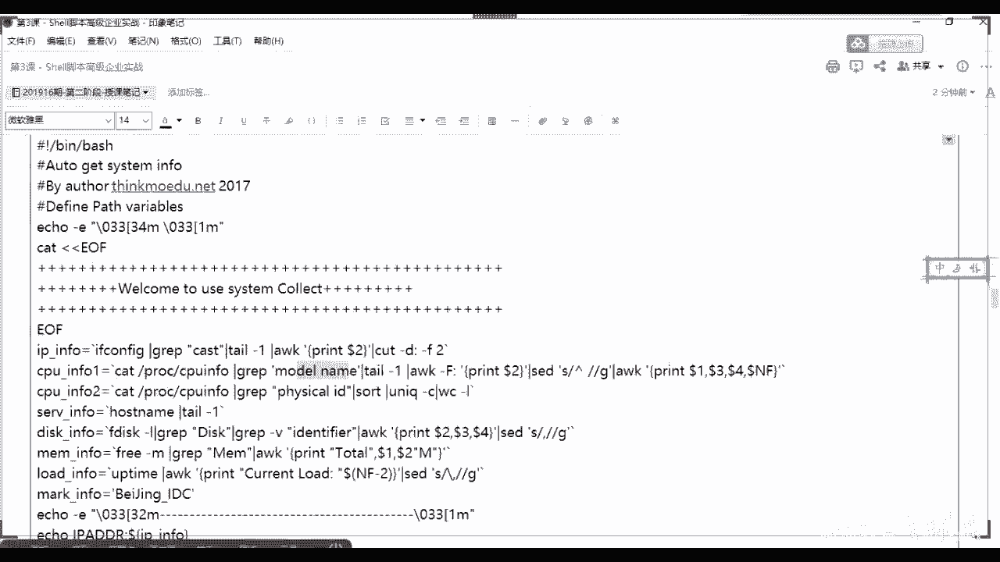
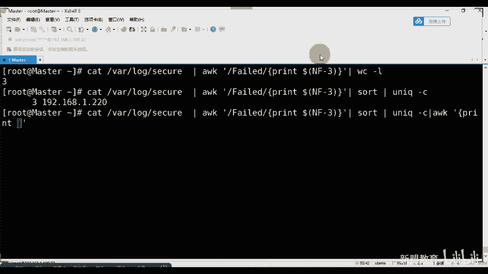

# 2021最新Linux-RHCE运维实战课程 - P3：RHCE-第3课-Shell脚本高级企业实战 - 新盟教育 - BV17K4y1t7XR

Yeah。

那我们接着来说啊呃我们刚刚的话学习了1个SSH以及我们的一个。什么呀？还有一个我们的rese对吧？二yC啊，加上我们SE2C。两个基础部。那么说完这两个之后。啊，其实我们在这两个之间的话。

接触到了两个脚本。但这两个脚本其实并不难写两年代以下啊并不难写。我只是将一些个运行的逻辑组织到一起，在结合上了一个基本的判断，对不对？O这些基本的判断是基于我们linux已有的我叫已有的技术逻辑去做的。

你比方说老师我要去做一个启动脚本，那我在启动之前，我最起码要明白一个问题哈，我的启动项在哪里，对不对？那我有启动掉要停止有重启好，有重启的话，有停止的话，有启动的话，那我就要考虑一下。

我这个服务是否在运行当中。运行的话，ok我要输出一个命令，告诉你在运行。如果没有运行的话，我才能继续去进行我的启动，对不对啊，所以是一个很基本的很基本的逻辑啊。

那么我们说今天这堂课讲的是se编程的高级企业，是这呃，其实我每次讲这个的时候，其实头很痛，你知道吗？啊，为什么呢？是因为是因为大家说实话，就是这些东西呢，我能顺着给你们写出来啊。但你要说给你们讲了。

我要是从头开始讲，其实那个要讲很多的服务。呜。我那么说吧，我就顺着讲吧，好吧好啊，希望你们回去做能够自己去做注释，自己去理清里面的逻辑啊。那么我们下面来一个问题，做脚本的目的也就是自动化的第一步。

对吧自动化其实大家在接触脚本的时候就已经接触到了。只不过在近年来所谓的自动化运维LK越来越盛行，以及自动化的呃体系越来越纯熟啊，啊，目的其实很简单，就是去提升我们整个运维环境的工作效率执行效率。

以及我们整个的容错率啊，毕竟人的话汽车20小时可定是归类的。但是机器部分，对吧？那么通过脚本脚本也算是一种外挂，它是基于你已有的程序在正常运作的基础之上进行新功能或者功能的优化。啊，并不能优化。

所以校脚本其实是将一些个繁琐的，或者说是重复性的工作，我们写到文档当中，然后让它自定义的去执行。没有了，让他自定的去。啊啊，那么此时我们要出意一个问题啊，那么我们这边准备了一共是4个脚本。

第一个来说老师是要编成备份系统标本系统备份的对吧？这是常用的系统备份啊，第二个来说叫什么？第二来说是我们收集我们服务器信息。第三个来说，我们用的是拒绝恶意IP。对吧，以及第四个来说。

我们去修改我们的IP或者我们的主机名啊，那么这里面其实没有所谓的难于简单。当然了，你说老师我写的比你简单，我也能实现都okK了啊，都okK了啊，条条大陆空模嘛，大家记住意问题啊，脚本的话。

不同人写的可能就是不一样。但效果相同就可以了啊。那么请你注意这个问题，那么在书写我们脚本的规范的时候，哎，我们叫做标准化。啊有不标准化。那么几个原则。第一个来说。

啊说我的命名规则上要以我的什么要以我的功能为命名啊，为名称，就是让别人一眼能够看出来你是做什么用的，并且以我们的点SH为结尾，这个我就不说了。好吧啊，ED2RC是为积累好，第二个来说命名啊，第二个来说。

第二个是我们的内容的标准化。内容里边的话跟大家说过了第一行啊第一行哎，对，第一行的话啊注意了啊，我道干嘛？第一行啊要注释啊，不是要注释，或者说是要选择我们的解释器啊，解释你是使用fashion好。

老师还使用SH对吧？还是使用其他的啊等等的。总之啊是python啊，还是说是其他的等等，一定要记损。第二行的话大家应该知道的啊，第二行干嘛？我们要写的是时间对吧？2到4行我们一块写了。

时间管理员的邮箱看好吗？以及我们最后的用途，对吧？以及他的用途。那么大家要明白一个题啊，就是我们在定义的时候，第三个啊第三个其实也是内容吧啊也是内容的。第一项、第二项、第三项啊，第一项。第二项啊，以及。

第三项。啊，盈利在降。呃，第三项的话，我们指的是变量。啊，大家问一个问题，变量大都前面我们讲过了啊，那么默认在我们的脚本当中的话，变量都是我们大写的。好吧，说大就用啊，第二来说还有函数，对吧？

函数的话呢，我们啊这个可是可以小写的这没有关系啊。函数大部分情况下我们用的是function。啊，以及函数名。对吧小括号，然后大括号开始，当然说老师我前面不加方和形的你行，也可以啊。

直接用函数描括号就可了。啊，第三项你家注意一下啊。那么来看一下，那么在我们的生产环节里面，备份是必备的，只不过我们可能会分得更细致一点。你比方说老师有专门的数据库备份啊，有专门的存储的备份。

可有专门的web的备份，对吧？但是整个系统啊可能还要有日志的备份啊，但不管怎么样，老师，我既然选择备份，那么我就要有一个哎时间或者有一个规格，所以比方说我们长去备份的时间，当好了，没有说凌晨备份的。

大部分都是凌晨3点啊到我们的5点。好吧，大家大家都是大家睡都很熟的时候，访问热量最少的时候。那么在日常的我们的企业运维当中，需要linux备份的人就有很多。比方说ETC啊，其实ETC还好吧。

boot也还好吧，对吧？boot分据是我们一开始就做好的了。好，重点呢是我们的重要的网站数据。好，甚至包括我们的数据库对吧？哎等等等等，包括的日志啊不？啊，日志等。那么在备份的时候。

由于我的数量会非常大，所以我们需要指定高效率的备份方案。我们现在这个脚本指的非常简单啊，其实是个很简单的。到了我们课程的后期的时候，大家明白，我们还要学习到一些个专门的备份的内容啊，还有专门的备份内容。

好，大家往上看啊，那么一般来说一般来说我们有周倍，有月呗，也有日倍啊，一天一倍，还如说是一周一倍，还是月一倍，对吧？那么大分情况下的话，如果是周倍的话，好了啊，一般来说像我们就会选择周倍啊。

周倍的话太好了啊，不是说老师我就到最后一天我才备份一次。最后一天是要进行完整的备。是最后一定是要进行完整维分，而之后而其他的时间是要进行增量维。能理解吗？能理解上一啊。当来来来。啊，我们有每周日的。

也有每周六的，你反正反正指一下吧，对吧？有的公司996，那你们就不太适合每周六去备份啊啊，你们就适合每周日去备份。啊，反正这两个你自己可以看一下，其他时间的话都使用是增量美粉。啊，那备份的工具有很多啊。

刚刚讲了一个是reek大了restrict远程的，也能本地做啊SCP啊，本地远程也能做CP就是本地的TL的话打包，对吧？那当然了，我们说既然你的当量大啊量大，那我肯定要记的是本地与我们的异地的同时备份。

能理解吗？同学们啊，本地和异地同学出。所以而且在传输的时候，尤其是异义的时候，我明白我要进行网络的传输，而网络传输其实受限于我的带宽的。啊，受限于我的。那么带宽如果被占用的话，很有可能导致我降低对吧？

所以此时我们就要用到压缩嘛。对啊，所以这是一个关系啊，要明白啊，两有关系啊，地利的话啊，这个其实比较少用的，但是我也列举出好吧，我也列。那么往下面看啊，那么备份的。命令呃压缩的命令其实我不用说了。

我跟你白TR还记得吧？C和V呃，C和X应该是分开的。C是创建X是解压啊，对吧？对吧，那么用杠G记住我们在备份的时候又多出来一个小的参数，叫做杠G的参数来指定我们新的快照文件。啊，来照快照文件来。

是不是叫快照文件，告诉我什不是叫快照文件。😡，啊，这个快照文件就跟你的什吧，跟你的在在在你所谓的。说什么来着？叫做叫做哎镜像对吧？啊，这个镜像啊，跟你的不是不不是镜像吧，算是你的。

比方说你的虚拟机的拍照。对吧，虚拟机的快照要过来。啊，迅速很找。啊，那么虚拟机的快段的话，大家明白啊，老师说我是啊对，有一个时间的状态，对不对？还不时间的状态啊。我们会。啊，那么我们通过杠G带好了。

杠G前边这个位置是指明着你的你的你的什么。是指明你的这个这个这个这个。名字对吧？啊，指明你快照的名称，我们叫做snapshot，对不对？啊，然后进行我们的一个压缩，压缩什么呢？看好了啊。

哎是压缩的文件名称啊，这是我17年写的了啊，然，把什么写过来，把我们date下的SH下所有的内容压缩到这边去，那么？同时去创建一个快照。啊，同时去创建一个快照。好，这是手动的去备份啊，手动备份。

老是我还要手动，这是全备，对？叫全备。如果有手动增背的话，接来啊增背。看一下啊，我们用什么好了，同学们在这个上边，我们只需要干什么？后续基于上一个增量备份进行快照。能理解吗？

就你看这两条命令虽然只增加了这么一个情况，但是实际上大家明白一个问题啊，看白意思么？其实我跟上面已经有区别，对吧？我是基于快照走的。能理解吧？我是基于快照走的，我的快照有变化就没了，是吧？啊的。啊。

同学们能理解吗？我是基于快照的啊，你看后边的话是不是我快照有变了。是不是相当于快照的地方是增量啊？来告诉我。老板。是不是？啊，对对，没错，有快照就的参照物，对不对？哎。

所以TR工具的全倍和增量的倍份等阵啊，大家可以看一下我们下面写的一个思路啊，我给大家列举出来。啊，第一步的话你要明白一个问题，大家没问题是什吧？是我的我这要备份的话，我肯定要有我们进行啊。

我到底是按照天是按照周还是按照月，对吧？一般来说网站的数据还是比较多的。有这项数据库上的啊，那么一般来说我们都是每天去存放啊，当然了，按照每天存放，至起码你要明白要有一个时间戳，这个地方是有个时间戳啊。

时间戳怎么表示告诉我。时间戳怎么表示？😡，这些数怎么表示？能表示还记得吗？data加上百分号F，这是最最基本的年月日时分秒，对不对？同志们。音月20分秒。大家还有其他的啊还有其他的啊，这个事大家记。

你们会经常看到我们去创建文件的时候，里面加上这个东西吧啊，就告诉你什么时候创建的。😡，第二来说的话，我既要有完整备份，我要有增量倍份。我说过了，如果我们是周倍的话，每周末的时候要进行一次完整。

那其他时候都是要进行分倍，对吧？所以两个函数块。当了，两个函数块便于我们函数或便于我们脚本的拆分啊。第三个当了，根据星期去判断我的是增倍还是完倍。你得判断吧，对不对？我调取哪个块吧，我得调取。好。

所以最后的话是将脚本放入我们的Cd去自动的实现啊，就是每天执行一次，每天执行一次，每天执行一次，对吧？同学们啊，每天执行一份好，所以在这个地方来，这个不用说了，先定一个模块的个同学们完整备份。

比方说个total。好，增倍呢。装备叫什么来着？叫的A的是吧？是A的好，那我们带好了，判断怎么去判断，告诉我。😊，判断怎么去判断？😡，换怎么去判呢。看题白的，是不是你应该得出来。

老师我们有一个为克的变量啊，我是等于星期几啊？对不对？东西几，然后做一个杠一口是吧？杠一口等于7或者是6，没问题吧。啊，如果你收日，那老师我就要等于7。如果此时我等于7了这个变量。

那么我们就要进行调用total。如果非7就是调用ad。能理解吗？啊，没错，能理解吗？兄弟们哎，所以。😊，关键是在于we我们如何调用时间这个戳，这个时间戳怎么用，对吧？来看啊来看。

那么前面几行不用我多说了。想不讲懂我多错，那么先找到你们要调用的地方。

好，我们直接编吧好吧，我们直接编吧啊，们再编写一下啊。我们带大家写一遍。好，为什么要我写一遍？不写，你宁远不会是吧？好了，比方说我要是把我的脚本起个名字，我们就叫做叫做叫做叫做叫做什么。

Yeah others。走啊第一步来说，井号叹号兵b是。好，后边呢时间这我就不多写了啊，时间对吧？order。But。不学。艾特thinkball点C。啊，然后us对吧？us to back啊。

这个不多说了啊。再后面的话，大家稍稍要明白一个问题啊，我们既然说了，你有几个倍量它定义几个变量，明白吗？这个来说老师我想知道今天是周几，对不对？所以week等于。啊，对等于我得知道今天是周几。

那我怎么知道呢？大家明白老师我得用date吧，所以此时我得用一个反引号，对吧？就这里面用反引号，对不对？只不过周几用什么，大家记来用加号1%小U大家记来啊，小U表示我们定义出来你是什么的，对吧？对吧？

定义出来你是周几明白吗？同学们。ラジアさ品。这声音。啊，接了啊，这是百分号左右。第二个来说到了。第二来说，那么我要带他去判断，对不对？好，if。apple是吧，你们报从头到尾的气品。

你想到哪写到哪先跟着我明白吗？同学们好，判断的话，我们用什么用这个判断，对不对？😡，啊，调用我们的we啊，是否等于。当然是否等于的好了。能解吧？哎，是否等于几啊？如果我们定义的话。

老师packck up嗯。😡，sunday是吧，on Sunday。啊，那么指数就要等于几等于7，对吗？对不对对不对？告诉我。😡，我是老钓友，你是不是等于7啊？😡，能力不能呗。啊等于7啊。

那么如果等于7的话，我们此时要进行的是下一步，对不对？要进行全倍啊，要进行全倍啊，如果是全倍的话。看着们？我应该将我之前所有的数据所delet给删掉啊。你能理解吗？是不对？我每周的话。

我得将我之前就得删掉了，或者我我怕我的空间不足。😡，就要删掉我的空间，当你的空间足的话，你就不用删了。没白吗？同志们，所以这句话我们先写上叫做RM跟RF看好了，我要删除的是某个目录下你的。😡。

什么你的上一次备份的内容。那上一次的话，我们就是所谓的snap。啊，叫snap shop我们的快照啊，但问题是这个东西在哪儿呢？在哪呢？在哪好了？

所以此时我的snapshot是不是得有一个我们的目标的目录啊，也就是我们targe。摸不到。抛给他。第二对吧？我们target我们的目录，那这个目录在哪，你得列举吧吧？全部在那你可以自己去选吧。哎。

李保老师，我想让他，我这自己定义的hel了ge up。还有同志们看见来啊，一定要杠啊，这前面我只需要去进行调用我的dollar turn feet杠点。好吧，删除它，当然这条命令就看你的空间足与不足啊。

看你空间足与不足。当然我们一般都会删调啊，我也跟大家说，我们一般都可以。😡，快出来。如果此时我们等于了啊，好，同学们此时等于了，那么此时我们要给他全倍了全倍的命令，怎么做怎么做哎。到了你删除掉它之后。

你要在哪里面进行我们的备份啊？那在哪里进行备份？😡，所以我是不是还得有一个目录，我得进去啊？😡，能理解吗？😡，我是不是进去啊？😡，啊，那我说我就要在这个t比的下。😡，啊，这是你snap的储到的位置啊。

这是上一次地方的那的快掉。所以此时到了turkey这指的是快照的目录，但是我们真正要备份的在哪里备份好，我要再去顶决吧。只不过这个目录我们可以在它的下边接着去做。哎，我可以根据我的年月日去进行调配。

能理解吗？同学们对了，tge。走。好，再来下面，除了除了我们四大北外，我们还要根据我的年月日对吧？年Y yearR。啊，月。MONTH。知，正常来说的话，你每一个你备份的目录下都要走自己的心的吧。

Da塔DY。对。啊，这个我说要进入到这个目录下呀。能意了吗？所以此时我的年月日怎么办？我说的定义出来啊。对不？同学们都是这定义出来了，我的time。啊，第一来说myEL第二来说MONTH。

第三来说DAY。啊。ear等于什么？😡，怎么做告诉我叶儿怎么做。😡，第二怎么说？第儿怎么做？对了么多。用百字号data百字号Y对吧？啊，加上啊。加上啊加上啊，所以执行就可以了啊。

所以这就是看你命令个熟不熟了嘛，对不对？再来对吧？data加上百字号多少？对吧小M大M想好了，小M大M麦子小M大M。😊，记住啊，慢是小M大M表示么表示分钟知道吧？啊，大M表示分钟啊，对的话。😡。

DADE加上百分号，我们的小D还们。此时好了，此时时间有了吧，年月日有了吧。好，根据年月日创建的目录有了。好，我们进来进来之后，一定要用and end那好了。但凡是脚本里面有记入某个目录。

千万不要用分号，要用and end，你得确保你真的进去了。有了吗？确保你真的进去了。好，然后我们才能在这个位置上待好了，进行我们刚刚所说的第一步，你要进行快照的创建，没问题吧。没问题吧，同学们对吧？

快照的窗垫刚才跟大家说了，创在哪里放在这。😡，O吧？这步起来啊这步起来。😊，啊，我有精神啊，我要创建的名称对吧？我要创建什么名称好，杠CCVL。😡，好，创建的名称这告做这个名称的话，我能随便的变吗？啊。

我说我还得每次都得敲，能一样美在不能一样吧。所以当然了，我这个地方是不是得有一个我们的。目的的文件啊压缩的文件，甚至我还得有个原文件，对不对？好，所以大家明白了，老师我上边还得定义我们的。

叫做sourceSOUE。IOURCE source file。欧们的destination file。没问题吧，同志们。😡，是不是我记得有。😡，正常的file我还有带destination file。

能吗？啊，所以我的名称的话，我也其实我可以直接把它名字改过来，对吧？只不过我们的呃目的文件就是我们的destinationfi，我们就直接叫file了啊，啊，等于啊或者叫fis是吧？压缩之后嘛。

我们就等于什么，对吧？s。再这啊。system啊或者g back up。当然了，最好在这个位置上，我们要加上所谓的时间戳，明白了吗？但此时我就不加了啊，加上TR点DD。能利用什么？

所以我这个地方是不是就有了我的名称了，叫做files了。😡，放到们。好，但问题在于说。来，问题大家再说，你每次备份的都一定是那几个目录吗？或者说我今天想要多去备份几个目录，行不行？告诉我。听不讲。

当然正常来说啊，你这边老师，我直接定你什么ETC。😡，对吧foot好，货代去定义一个one可以吧？这都没有问题，这都没有问题。但问题在于，如果我这个脚本想要可控性更高一点，我这边就要有一个什么。

这有一个什么？我是不是叫有一个sa？😡，第二啊同要s file。😡，都可以啊，当时都行。对不对？哎，profile，那么关一问题，那我这个东西我从哪里来啊？😡，我是哪里来？好了。

我是不是就要定义我们这个地方啊叫它s style。对吧。啊，s等于什么？告诉我。😡，等于什么？说什么？等于什么？同志们，我说的瑞的。😊，不对read的。对不对？read，但是大家明白，要是read的话。

我得写出来一个东西ABC我请问下同志们，我只有ABC只有3个吗？我要是多了行不行？😡，如果多了，行不行？告诉我。😡，行不行？对不行？可以吧，到一到2到23，你月定义多少个 dollar啊？对不是？哎。

如果多个怎么办？大家记得我们有一个叫做dollar星，还子dollar星表什么吗？还记得到点新表现吗？朋友们。还有人记得吗？啊，格式你可以不这么写啊，你可以把它单独写写在一块。还是道了性是什么？

道了性是不是表示我们所述的每一个具体的参数啊。哎，你所说的每个具体的财数。明白了吗？哎，所以此时我们才能把它备份过。啊，把它背诵过来。能列出么吗？到这一步，我们才算是把这个写好啊，才算是把这个写好。啊。

在这种。这个算是我们把后边的这个东西，对吧？看好了，注意了，此时这个地方的话，其实相当于一个我们的叫什么，叫做我们的数组吧，是不是类似于数组啊？对吧那数组的话标了，你不能这样写，这样写的话就完蛋了。

这是一个参数，明白了吧？这是一个参数。😡，啊，这是一个参数，所以我后面得用个中括号里。而中号里面这个app特，这就是你们看到这个参参数面，这什么意思？告诉我，有人翻译出来了吗？😡，不说翻译出来了吗？

然后过不来。有人把这个翻译过来，知道这个ad什么意思了吗？😡，知道这按是什么意思了吗？😡，什么意思啊？驻组里面什么意思啊？什么意思啊？哎，取数组的所有元素，对吧？等一楼是吧。啊。

对吧所有的个数哎对应上这个do耳星。😡，因为你不是一个人啊，你不是一个人在战斗。😡，理解啦啊，你根日就唔错咁样呢。OK好，别说了吧。啊，这一步结束了，但是是到了，这一步我真的执行了吗？

我是不是得判断你的执行成果啊？😡，是不是是不得判断你的执行成果啊？所以到了下边的话，我得判断你上边的结果，那上边的结果我要用什么去做？😡，有什么许做？用我们的。Dollar。问号。他再哪它搞了文号。

等于如果等于零的话。啊，如果我们的dollar问号等于0上一次的结果，我们就可以直接的去使用了。给了。啊，这些事行了啊，哎，所以到这一步结束，大家请注意了啊，到这一步结束，我们表什么？好，那同友们。

我此时要做的事情是在于我这个位置上把它变成for，或叫做哎抽抽来看。看一下是不是这个函数就有了，告诉同学们，我们在脚本里面啊，帮帮写个fe啊，结束啊一定要结束啊。哎。顶多了我在做一个些个小装饰。

什么ele啊这些东西，对不对？选择性的东西来做出来。可以了吗？同志们，所以看写个脚本的目的，其实就是你随着写，你真的知道过程，对吧？你看能写出来，你要不知道怎么办，完蛋了，是不是？

所以就是有了全背就会有成增背，对吧？增背的话，我们接下来就是A的。😡，好，带好。括号谁来说这个过程理解啊。这过程就理解啊。好，那既然的话明白老师这地方的话。怎么样？这个是等于呢这个是。不等。对不对？

这就不等于嘛，有等于就不等于嘛啊，对吧啊，会议结束。😡，好，那如果不等于的情况下，我要执行对不同事们？那此时告诉我，我还用删这个吗？还用删上一次镜像吗？还用吗？😡，还有吗？不能删了啊，这就不用删了啊。

对吧？啊，这就不用了啊，因为你是上一这个经销是对于上一次全倍的，对不对啊，上一次全倍的啊啊。那么所以此时我们增倍的话，我只要干嘛？同学们。我是不要直接的进入到你们的备份里面来做，对不对？

然后进行我们的脚本的正常的一个这一步就好了。大家是不是一样的，告诉我是不是一样的。是不一样的大我说。是不是一样的老婆。来是不要了？来来来，同友们，这不要了。OK吧，哎，不一样啊，哪里不一样哪里不一样。

正常来说的话，为什么有的地方大家会加到脚本上？因为很简单，哎，你这个增量对不对？增量的话，你能告诉我你能是最终的名词，能是一样的吗？😡，啊，最终你的名字能是一样的吗？😡，你是个增量备份，对不吧？同志们。

你不是落地啊，你不是落地啊。😡，所以你这个名字得有区别，对不对？它是一个过程。所以过程的话，你要把新的名字前面改一下啊，前面改一下以什么时间为名，你要调用你的dollar啊。

朋友们正常来说你要调用你的年和月对不对啊，调用的年和月或者调用时间都可以啊，调用时间都可以好不好？那我们这边的话调用了，我就直接调用可以吧啊，我就直接调用了呃，调用我们的。呃呃，第二。卡不用调鱼了。

调用D好吧，我们用日期了啊，我们用日期了啊。可以吧？同志们来先刷一，我就用的日期啊。好的期。啊，当然你可能更详细一点，对吧？完说我用分钟用时用分用这个小时按我们脚本上写的对吧？那我这边就用对了。好。

这就可以了吧。所以最后的时候也是判断你是不是执行成功，执行成功了，我们才OK了，对不对？啊，这是后太OK了啊。好，所以这个就是我们的地方啊，大对。啊，这就可以了，看到没有？所以两个函数难不难。

两个函数不难吗？同志们对吧？你就按照顺着去写嘛。最后的错误我们要干嘛？记住啊，每一次执行完的话，我们最好是让它停止啊停止一下，5秒钟啊或者3秒钟都可以啊，3秒钟都可以。那我调用呢。反看回来啊。

那我如果调用它怎么用，就在底下直接去调用就好了。看了没？在底下直接去调用上。当然我们有时候用慢慢喊数。慢还是我们会做。啊，跌往慢的话就比较写得慢。MN这么去调用就可以了啊，这么调用就可以了，好不好？

那漫函数里面有时候你要去选择，对吧？啊，你比方说老师我用这个打出来打印出来，当然我这边写的比较简陋了啊，我们就直接的去调用我们的两个参数。😊，对吧那这两个参数分别去要于我们的for。back up好。

和我们的A的杠back up。啊。那么这两个参数都调用了然后了，还有什么区别吗？🤧还有吗？还有什么漏洞吗？想想还有什么漏洞吗？还有什么漏洞吗？那是lo多吧。我是不得保证我真的有文件续备的？对不对？

第一个漏洞就我是不是得保证我文件区别的？所以我只需要去看一看我这个东西是不是零，对不？同学们是不是为空啊。对吧在我们预生这两天间，我是得判断你是不是真的输入了值我去备份，我去压缩，没有的话，白压缩。

对不对？所句了。第一步来说，我们需要判断一下if。if判断一下算什么？如果为空的话，用杠G杠G表示是否为0dollar新。好，如果它到了，此时我们为0，那么此时我们用一个东西干嘛？哎，告诉你是吧？

进去输入ele找到办，please。清楚下。Some么第 or八。是不是，是不呗，是不是？然后然后直接你break这块不要用break，用case啊都用。用分号也可以用号。好，如果老师我现在判断。

不是对吧？我如果说哎我发现我已经有的话，那我进去。那就跳出来，听下一步。所以说呢我就不判断它了啊。好，至于下一步的话，我们要判断什么？来碰了什么告诉我。😡，看了么？然这里边还会有什么bug？😡。

是不是我这个路径啊，一开始我就。不存在啊。路径对不对啊，但凡路径都要考虑啊，脚本里面一个是路径，一个是你的参数，是不是有传进来都是你要考虑的。没有同学们。啊，这两都是你要考虑的。

所以我在判断的时候还是以判断。好，更低我们去判断什么判断它。对吧同呢看到这个路径吧？到题啊，如果他存在，我们就执行，对不对？那没什么可行了，我判断是它不存在对吧？所以它不存在用这种方式。如果不存在。

我们怎么创建就好了嘛。啊，记住啊，这都是我们最基本的。我并不有写太复杂的思路啊哦，同志们啊创不出来。然后就结束。可以吧？看一下还难吗？你不觉得这个我是不是带着写一个就好多了，补充起来看到没有？

这个脚本不是特别难吧。O吧，同志们来开始串一啊。😊，来了。但是你还能更优化它，你还更优化它对吧？在man里面用case啊，慢里面用case，就是我最后这个地方我不这么写，我慢慢的话，对吧？case一下。

告诉你怎么用，对吧？我会告诉你脚本怎么用。😡，阿里巴来好吗。所以退出之后啊，当然说我这个里面的，咱们在笔记里面的交本写来会更全面一点，对吧？而且会更全面一点，会告诉你这个脚本怎么用，对吧？

我这边这先不写了啊。

好吧，啊，你看这地方的话，他就告诉你怎么用了。

看到没有到到没有？告诉你echo告诉你怎么用怎么用怎么用。好，请你输入120文件的脚本是吧？啊，正来说是告诉你怎么样，是让你这个bu适一下脚本加上你的。这个这个后边的这几个圆和目的。是不是联合目的嘛。

对吧？啊。

哎，所以此时的大家发现老师我在bu这个back up的时候，我要跟对吧？跟我不为想么把谁进去啊，老说老师不用把波不能波太大了啊，OBD对吧？不用把TMT啊吧，就是是吧？啊，此时有个问题，对吧？

OBDfin啊。这样子。offer啊好。哎。21行是吧，看一下21行哪里问题。走。叫啥？if。判断你是不是没空apple对吧？看一下哪有问题啊。对。🤢，对。listase files对吧？

我们判断了它并不是空的啊。哦。等于还是问题是吧？呃，back up line to generateop。这个问题对吧？看一下啊。21个表不是他们21号。这是21行if be insist判断你为空。

对吧？没问题吧。

大家判断你没空啊啊，带号了，这个地方要有引号是吧？啊，我们买加引号啊，呃，这个地方记一下吧，这个地方记一下吧，是吧？双引号表示吧，我们说了啊，要不然它单引号默。

要说干也好，那就没有。那这就可以了，这个同学们啊，这个可以了。啊啊，这就可以了，看看可以执行，对不对啊，可以执行啊，只不过后面的话我后面还可能又加其他东西啊，没啥东西啊。

然后我们把我们这个脚本的话复制过来，大家可以再看一下，对吧？再看一下back up。😊，去点他。哦。我把它复制过来，你们运行过了吗？这个脚本问一下这个脚本你们运行过了吗？运行过了吗？😡。

运期过滤刷，一没有运期过刷2。有遇见过吗？有预见过吗？你没有预见过这个条单。😡，好吧。

报白。来啊，复制过来啊，所以了你复制完成之后的话，你要注意一个问题啊，就是你的脚本的完整性啊，以及你看啊，这里面的分号都是这样子，开对啊，都这样子。所以你要进行一个替换。

这个地方。进行个句划。好了吧，这就都提完了吧。😊，好，最好了，然后该改的地方，这个这个地方我就没给大家列啊，这个地方直接给use就可以了。use看到没？use方式对吧？然后我们把一些的该改的地方改一下。

比方说像我们CDN end对吧？啊，这个是and end啊，如果你们没有写and end的话，把它改掉，好吧，这是原脚本，我们把它改。😊，啊，再等一下。呃，还有完没了。okK再来好了，运行一下。

那他会告诉你怎么去运行，对吧？bu我们的back。对吧会告诉你是吧，告诉你预算什么方向什么。还有啊老师OBD。我们的PMB。还有同学们此时他才会去运行啊，这个过程当中先不用动弹，看没？他会自己去运行。

看没有？告诉你成功运行了，对不对？啊，看看我们是不是有一个新的目录，对吧？是是会有个新目录吗？

嗯。对吧。等下我们找找一下我们的新的目录在哪里啊呃。在这儿拍到没有，ge back up拍到没有？hel同学们是不是在这儿呢？看看年月日都有了吧，都有了吧。呃，并且今天不是周日嘛，啊今天不是周日。

所以它会运行的是增量的这份。那么所以前面有个东西嘛，增量没准。

来，OK创意。啊，不绍一。好。OK呃，大家稍等一下啊，我好像家里有人来敲门，稍等一下啊，稍等一下，稍等我一分钟啊，稍等我一分钟。啊，那我们。谁啊？😊，对啊。🤧咳。可以啊。😊。

O我们就说啊那个那个哎呀那是谁过来的胡帮老师过来。行，我们说一下啊，就说啊哎这是我们的第一个脚本，对吧？同学们啊，所以呃脚本的东西不是太难啊，重点我想讲第二个好吧，分讲第二个，为什么讲第二个？

所以大家明白，第二个的话用到了我们sll的4剑课，对吧？我们之前讲过了sell4剑课里面谁最复杂AWK，对不对？啊，但是好了，这里边我所定义的内容，请你注意啊。好，听好了，这个是数据库的命ing。

我还没有讲啊，还没有讲，但是简单跟大家说一下啊，表什么哎？老师，我表示创建一个表格表格的名称叫做edit system。

所以啊名称里面的话ID好，这是这都是名称啊，这都是属性名称对吧？属性名称，然后它的类型什么字符型了，什么整形了，对吧？notote four是不允许为空好，自动增加哎，就是我的ID不能重复嘛？

12345678910啊，note现在都是不能为空的啊，pri he主键是吧？啊，叫这个唯一键这个我们到了讲数据库再详细点啊，大先讲。啊，我们做什么呢？就是在生产环境里的话。

我们经常对服务器进行统计的存档啊，单台服务器我们可以手动的去统计服务器的CPU型号内存大小、容量、网卡流量，如果服务的话超过百台千台的话，手动记非常麻烦，对吧？大家都明白啊，累似你的基本是不是啊。

那么我们所以说要用我们的脚本去进行采集这些东西，哎，别着急啊，进行采集啊。那么采集这些东西其实也很简单啊，你要注意一个问题啊，其实它只是把数据把这些东西插入到数据库里面去了，对不对？

但是跟你之前自己去找这些东西没有什么区别啊，没有什么区别。所以创建数据库啊，表的存储信息给大家列出来了。第二个，基于上次验课获取难的是这一步的好，难的是这一步。你怎么获取信息？对不对？哎，好。

到了为什么这么说啊？是记住为什么要这么说，是预备你要获取什么。厂描获取。我才能决定我创建什么样的表格。😡，没问题吧，同志们没有说我说我创建表格，你按照我的填半，不是这么做的。

其实正常思路的话应该是反过来。😡，能理解吗？来一双一。啊，就是我表格里面存的些信息是根据你要采集它的。对不对啊，然后这些东西才会通过我们的circle语句去定时，然后再通过circle去定时备份。

对不对？所以重点的还是一个。这个还可以有。那么我们来看啊，我们直接看这个脚本，好吧，我就不拿那容去说了啊。到。这个不用我说吧，写个欢英用语是吧？欢迎你使用我们的这个收集系统啊，那么收系统里面的话。

IPCPU看到没有？同学们啊，我们存储第四个memory负载这些东西都有了吧。看到没有？看到没有啊，别着急要不着急，那么IP的话，大家都明白，我要找什么看啊。第一个来说，老师。

我很明白我的IP地址我写if confi。

没毛病吧，同学们好，那么我想获取的肯定是我的IP地址，没毛病吧。对不对白？没有题吧？所以此时如果我想要我的IP地址的话，我必须要找到的是一些个特殊的东西。啊，特殊东西。

那么你看啊我现在如果我执行这一半了，我把大家给它复制过来。啊，复制过来走，大家没有，这是一个基于老板的去做的啊，我基于老板做的。那么如果基于我这一行的话，我应该找什么告诉我，应该找什么。

应该找什么找IA行吗？告诉我同学们找IAE行吗？😡，行吧。什么告诉我。行吧行吧，这还有呢这还有呢，你直接找来三行，是不是三行再去找太麻烦了，对不对？所以找一个比较比较有特殊含义啊，你比方说。😡。

你就找nett mask，你就找broadcast，我都可以，是不是？对不对？哎，对吧，所以这个地方我们稍微改一下，我要找的是。😊，不卡。啊，DROCF。啊，多卡啊。

好怎么推吧BRO就这么写就完了，broad啊，知吧？BRO就可以了，看家一下，我是不是能找到BRO。😊，或CSD也行是吧，你找CSD也行啊，我们把这个B删掉啊，把它B删掉。

好，那么老师找到之后的话，他只给个提示再给一个chell是吧？杠一大家明白这什么意思啊？其实就是其实都是一样的，对不对啊，都是一样的啊，对吧？这个你不加也可以啊啊，只标2P也可以，这看你的情况对吧？

就实这个地方的话，我给你省略掉这个位置，可省略这个。

然后再后面大对了，然后边对吧？我们要用的是print AWK了，对不对？因为到这一步大家都明白，老师我可以截取，通过空格去截取，没问题吧。😡，问题吧，同志们。😡，拉个啥意啊，我这个通过空门去就行。

对不对？啊来好啊，我把它直接复制过来啊，我不用我不用那个我不用这个t了啊，我就把它。再看看你发现结果是什么区别啊。

好不好？那你觉得各有什么区别啊？好。啊吧，其实没有什么区别吧。啊，你可以干嘛来的好了，我就直接这样子啊，再简单一点AWK杠呃多少来这件事看看啊，这应该是好了，这是。

啊，如果是默认是空格的话。多尔3。啊，刀二3是ms对吧？123那就倒二去。啊，这是一个客点是吧？可以省下来啊，可以省下来啊，或者不多，对吧？啊，一个对吧，到了一到了2啊，听白了吧？对吧。呃。

其实这个东西可以缩写，对吧？好，当然你看我为什么写的这么复杂，这早期的时候来啊，早期的时候，17年的时候，我们用那个机器是6点。

啊，6。0版了6。0比7。0版来复杂一些这个地方显的东西都不太一样，明白了吗？非常的显得那样，所以没用复杂了一点，就没那么，看到没有？实际上第一句话已经有了吧，对不对？我是不是获取到了IP地址了。

告诉我IP地址有了吧。好，第二句话会有CPU好，所以获取CPU的话，大家明白一个问题CPU的文件在哪里。😊，这边文子在哪里啊？😡，D方这个没有当然，最小化的话，你要装这个文件啊，杠Y net。

装这个啊才会有了啊。UMB也可以啊，我说条条大陆通我码IPADDR，那吧，同学们IPDD行不行？可以啊，哎妈。😡，是吧找一找啊IBDD直播这个更麻烦了，是不是？这更麻烦能明白吧？这更麻烦，你得找什么。

你你还得把这个筛下去，对吧？还得把高二4筛下去，麻烦吧？是不是啊，但这个你就可以用cutt了，你可以用cut了啊，好吧好？这个我就不多说了啊，这就不多说了啊啊，所以老师我再用CPU啊。

CPU的话我们要有的是型号，我们要有的是它的一个合数，对吧？然我的啊，再来看我用了两个变量，一个是CPU一 for一个CPU一分Q啊，首先明白一个问题了。

老师我要再知道process里面有一个CPUfer。😊。

对吧，你能够找到吧？同学们你能找到吧。啊，那么最起码我要知道它啊，我CPU的话给了两个，一个是我的都是哇，知道们？都是叉，那好吧，都是叉差的我明白，我要是字符写，对不对？啊。

那么你们先来看一下grab model什么意思啊？model name指的是我CPU的型号。问题们同学们mod name型号，你是库尔的还是之强的。😡。

对不对？再有第二个抓的是graphit IDD。啊，faceicalID啊，这里方就打这了。

对吧。😊，啊，所以这两个大家都明白，老师我想抓的是后边的这个东西，对不对？和这个数字啊，抓这个很简单，老师，我只要把你筛选出来，然后看一下proAWKdoer1dollar2do3do4明白明吗？

同志们。😡，看位吗？来老后刷一啊。

是不是到24啊。对吧啊，你都不用他这个筛选，都不用他筛选，对不对？都不能选。😡。

啊，当然他也可以是吧？有几个嘛，我们有几个嘛，对不对？也可以？比方说老师我们看他这个方式啊，好，保这。😊。

那我早去的，我说让我早去的脚本我真的都不怎。17年的你看看17年写的。

对吧。能给你们再推理一遍啊，因为6和7的话版本还不太一样。6和7的啊过滤到这个位置了，然后我们再来再来进行一个呃，因为我们是它有多个我们还有多个，有多个的话，那就好玩了，是吧？st进行排序。

啊，进行排序，然后s之后呢，再进行unicun进行切割的啊啊，进行切割。啊，怎么样？我们再加上杠C，对吧？嗯好问大家一问题，这个参数什么意思？这参是什么意思啊？操作。被操准知道吧？什么意思啊？

这操数什么意思啊？啊，记住啊记住啊哎。呃，这个命令的作用是用于检查或者删除我们文本当中重复出现的行或者列。啊，一般来说，这两个命令都是连续去用的，好不好？连续用的啊。那么此时老师我出现的列只有一个。

看到没有？就这么一个，对不对？而st的这个命令的目的是进行我们的排序。啊，进行排序，而杠C这个小参数表示的是统计出现的列的次数，我只有出现一个，对吧？

这怎呢啊，这你看啊。好，那么此时我们统计我有多少个，对不对啊，统计出来了啊，那么此时WC杠L它就统计的个数嘛，对不对？

重得看这个啊model来看。

modelド nameム。啊，我一个复制过来啊。好，把它复出来。哎呀，我这个这个小面里还挺长的。哎，sorry。来啊。来。好，我把这你发到发到群里面，大家我们来一块分析一下啊。来分享啊。好，虽然说老师。

我先来抓取这个信息里面没问题吧。好，我会显示的是那么一行啊我显示那么一行。

对不对？来看啊还会选那么。😊，走先山。然后按下内。走那都出来了吧。哎，出来了。然后后面的话t one其实这条命的目的就是去掉这个标记什么的啊，这标记什么？就是如果老师我们有一个其他的。

我会让它显示最后一行。如果多的话，我显示最后一行啊，多选。

然后我们通过冒号做间隔print的do2，大家明白了，老师，我就把后边输出呗，这不就do了2吗？😡，对不对？大想AWK。

啊，指定一下我们的杠F。叫冒号啊，引号引号引出来呃，引号大括号，然后print。到了。让到后边写出来，看到没有？这个同学们啊了啊，然后后边的话我们来干嘛进行sad啊，当好了，这个命令很很很好玩啊。

这是细节的问题啊，是我要把以空格开头，看到没有？看没到空格吗？把这个我的目的是去掉空格，能理解吗？来家理解刷一，这个命令是去掉空格。😊。

还是去掉看好了，看看结果啊。好了，这个结果和这个结果的区别。看啦是不是空格没了。不空告拜了。啊，空格没了之后，我才能够再去把你们通过空格看doller123456，听明吧？我找的是134。

一是什么类型是吧？型号是多少啊，你是个CPU它是GPU是吧？然后还有个是GPU了啊啊，所以到了把它过来。最后问大家个问题，NF是什么意思啊？告诉我NF是什么意思啊？😡。

4F什么意思？😡，F什么意思啊？那什么意思？最后一个页对吧？哎，我的频率对不对？看同学们这样子把一些个不要的东西给它删掉了，对不对？啊？其实没删多少，一个艾上一个空，对吧？好。

于是我出来大多数的CPU都这样子的，所以你都可以弄出来，包括之前的也是能拆出来的。😡，对吧好，这两个信息有了吧？同学们啊，现在一个信息，三个信息都有了吧。😊。

对吧好，再往下老师，我要找的是后 name后 name我就不多说了啊，后 name就不说了啊。好，dis informationFdi杠L打品白的。

就显示我的apple disk。干嘛还有找我的啊，就你 store找我的这个FDca号是显示我所有的硬盘的情况，对不对？我当然要找的是你的啊。

哪里啊？分具几报子。好，没看。找到diskdi哪里啊，到了找吧，这儿呢对不对？一个找吧啊，杠21个一列，我们找一下g一下。😊。

走挂一下。对。第四个大小写一定要注意啊，注意一定要大小写啊，同学们好不好？注意到大小写啊。😡，然后到了，我们要反选掉了是一个这个对吧？这个还用我说吗？这个是我们的一开始的逻辑地址，还记得吗？

还知道我说我逻辑是干嘛的吗？😡，MBR还行得吗？引导分区MBR。是不是这是个没无药无效的无效的呃东西，所以把它过滤掉。啊，我要握只要有效，对不对？哎，所以gup。杠B我们还要反选掉它。

然后这个是比较特殊的啊。

好，好了，现在1234能看了吧？同学们1234。😊，啊，现在有1234号啊，再往下边的话，我们要找的是AWK看看我现在要输出的是谁呀？告诉我。我234对吧？要做234谁分别是我的这个位置这个位置。😡。

啊这个位置这个位置这个位置这个位置三呢大小大小四呢，这个位置自己看吧？所以看好了，此时来说告诉这个有用吗？这个有用吗？这个有用吗？有用吗？人呢没用，对吧？所以呢所以呢。😡，所以呢。所以呢再过滤一下。

知道吧？到一。走。代不？再来你再用AWK我们去进行所谓的输出，对吧？以后。于浩啊雨浩。啊，print啊，dollar2啊。doar3和doar4。对吧看到了？是不是？啊，是不是9有了？啊。

待会等化一下12。这个是。23。对吧。234啊说错了，朋友们40GB对吧？我们单位嘛啊单位就可以了。

好，但是啊但是啊等一个问题啊等个问题啊，你觉得这个冒号还要吗？这个分号这个逗号还要吗？告诉我逗还要吗？同学们告诉我。😡，多少要子？多少还有吧。这要吧。不能要对吧？哎，所以我们最后还要用个s把它给它去掉。

对吧？当然你不用s也行，要的不用s用什么？

不再有什么，你用挂是不是也行啊？😡，是不是老师反选一下，不用反选，对吧？他不用gra用g的话怎么办？完了是吧，完蛋了啊，gump的话整个把它过滤，把整个行去过滤掉了。对啊，gump是以行为过滤单位的。

不你要这样把它guff过滤的话，那个就好玩了吧？老师，我用个逗号是吧？啊，对，用个逗号。看全没了，对不对？这是反义，这是残选是固一行的啊，在以这个位置的话，我们可以用sad，对吧？当然你说还能用什么吗。

是不是也能用够用其他的呀啊，还能用什么？自己可以想一想啊啊SG。听起来。起吧走走走逗号对吧？全部把它替换掉，明以了吧？这就是结果啊，这个看了啊。好，这就是结果啊，同学们都连起来了。

我们整个的设备以及它的现在的大小。

啊，很简单了，就是其是你一步一步做就能分析出来它的目的，对不对？然后话同学你这步我就分不分析了啊，这是memory。然后我把所有获销的信息好同学们好了，说一个地方啊，叫做什么来？叫做叫做。😊。

呃呃呃呃就是IP冒号er，我们引用它对吧？啊，输出他们所有的信息输出之后，我怎么向我的这个这个这个数据库里面去插入，明白啊？第一步来说当了，我my circle的命令是可以在我的这个命令行执行的？

比如什么呢？用my circler杠一对吧？myl杠一放了同学们，我们现在装一下啊，这个先对预知好吧，预知一下我们的服。

好啊sorry麦over马RADB还有装什么marRADB高serv啊，两个宝宝。对吧，这是客户端对吧？没有服务器，没有服务端，没法没法连。啊，没有夫妻没法脸s。好。对啦，此时。属定啊，那好了。

我不可能记住了，你脚本是无法进入my circlercle去执行的，明白吗？能明白明白白，你是无法进入my circlercle里面去执行的。所以你只能在myrcle外边去执行。

通过my circleical system cTL先把它启动起来。所以正常来说，你的脚本应该有一步是判断你的数据库是否启动3306。啊，好，我这交到你明写。通过my circlel它好了，此时的话。

我进入到mys circlel里边来，我们有技行调优啊。好受一下dabbas。3号结束，一定要算好结束，只有4个库对吗？同学们好了，现在my circle杠1。啊，杠一一以后引起来create。

就是my circle里的部分大小写啊，dabbase。听楚。多好。到了现在我们。在说看到了吗？通过一个杠E里边再用引号引起来来一人创意。来有啥意。啊。😮，然后我们大家就明白了。

说我后边这个脚本里面怎么写了，对不对啊，这脚本你怎么写了？那么在这一步的话，你当然是要判断你的脚本或判断你的数据库是否存在，对不对？

啊，当然了，是吧你要判断你的数据库是否存在啊，如果数据库不存在，你一定要进行创建，对吧？啊要进行创建。所以大家好了，此时我们杠一要用的是mecle杠U进行我们的登录，能明了吗？啊，进行登录。拉起来好。

再之后我们才能够再通过这个用户进行它的其他的输入。比方说杠一再引号引起来的好了，这引号引起来输入insert into我们的内容，把这些个value值，这就是正常的my circlecle语法了。

这个我就先不介绍了，好吧，同志们。啊，这是msql的语法了，我就不给说了，好不好？😊，这个是isert因数，写入写入表格，哪个表格au auditit system表格值呢？好。

value值到了这些值必须跟你的表格的形态对应上。你表说怎么写的？outit system等一下out system怎么写的？这写对吧？这些个值123456788个都是飞空，所以到了，这里边必须对应上。

你是空就写空ID就让它自己去写。好，后边12345678齐了吧？能懂了吗？你又不能空啊。😡，啊，有不。my circlercle呢我们到后面会给大家去讲的啊，中着底对吧？因为这个库是你必须得提前创好的。

好吧，你得提前创好了。如果我不写的再复杂一点的话，是吧？所以我要判断你是不是你是不是创建了库，没创了户，我要给你再创建个库。

能理了吗？来等你刷一样。来。你判断库怎判断。

它不它不是三引号，它不是三引号啊，它只是对应成看来？这是一对白吧？啊，这是一对。白没有？同学们啊，后边的话，这会是一对儿，白白没有？这会又是一对，它只是引号太多了哈，它只是引号太多了啊。

啊，这样回个拜。好，接来老师我怎么判断我数据库真的是否存在好？同学们啊用my circlel。😡，好，杠一以后bu好切换一下老师，别着急别着急啊，切换一下什么啊啊，比方说我说我切换一下我的lin。啊。

看到吗？所以你这个告诉我是不是错误的？😡，看到了吧？use表示切换啊是我要切换s库的，看一下啊。正常吧。能理解了吗？😡，那就说一。那你就可以啊。啊，所以这是对于你们怎么去辨识你的库的这个这个这个。呃。

这个这个这个所谓的我们的方式方法好吧啊，方式方法啊，高好师付老师my circle杠低参数是什么意思？来杠一什么参数什么意思啊？大家知道吗？啊知道就把拿出来，不道数二，你们知道吗？能知道吗？啊。

你们都没查吗？哎，我我上节课留的作业，让你们大家去预习一下，你们没有查是吧？😡，你们过分了。啊，上节给我留的作椅都都没有去查是吧？啊，真的一个人没有，我都么想看看啊。

我那天其实我其实他想我想夸一下晴天的知？今天那天给我呃发了一下他的他的作业，又给大家看一下吧。因为在说这个当逼啊，好不好？哎，哇，我怎么说呢？其实我真的希望大家自己能够我说的我给你们留的作业。

真的不是说我给你们。那啥了，明白了吧？这怎么样，你大家可以自己，其实也不一定要去查。其实可以分析一下什么意思。

什么意思啊？等下？老师，我现在要登录，对吧？这是不登录了，就登录了。😊，是吧降低。ある。你自想想对吧？再不激业了，现在的话最简单一个方式怎么办？

慢慢。所学慢把调整降低。啥意思啊？带的位置。哎可以吧？嗯，用了一个用户，用了一个database，对不对啊，又出来了。所以讲对这个是my circlecle的这个脚本，好不好？

那miccle脚本那还有什么来的情况刚才有就说到了一个问题啊，就是啊我给大家看一下今天的今天的。今天的。作业吧，好吧。来看一下今天作业啊。找一下。就是虽然虽然虽然只说了一部分是吧？是哪句话？

但我觉得是很用心的啊。啊，而正我觉得我已经很久我已经很久没这么干了啊，不知道你们还能不行不能行。

反正就是呃积累吧，这东西只能说是积累。好。当呀，这是自己写的对吧？并且有跳转嘛，这个我觉得你们大家可以自己用用啊，这家自己自以用用，我也点个赞啊，大家可以自己用用。我会拿这个这个这个脚本来写大家起带。

我把这个发到咱们的。这个这个这个那个。群里面啊发到群里面啊，好吧？啊，所以这一块还是很很好的，我觉得你们自己可以去选择啊，我个人都是存在本地了，好吧。

好。看一下啊，然后我们接着说啊，然后我们接着说第三个脚本，就是大家慢慢分析分析脚本，你慢慢就写的多了。看啊，前提是很难的。你放心，即使我跟你们说了，老师我怎么就想不出来呢？你放心一开始我也想不出来。

啊，他就我一开始我也想不啊，就是要自己慢慢的去琢磨，对吧？然后去琢磨写多了你就会了，写多了，而且这个一定要熟悉整个的系统，熟悉整个服务环境，对吧？同志们，但这个太好了，拒绝鳄鱼IP其实现在你能写了。

我们已经讲过了我们的。什么讲我们SSH了吧。对位同志们是不是想过SSA是了？啊，我们把这两个脚本拿出来一块看一看啊。😊，大来看一看。好，现在我们这个SSH里面交段，我给大家写的啊。😊，这个简单的啊。

不是两个脚本啊，这是我们。在哪了？哎，进来了。不来了在这了啊。😊，加这个标本好吧，来来好了。此时我们知道了正常登录的信息在哪里啊，是不是在我们的va下lockQ下面。😡，有了吧啊。

那么此时我们去进行克拉，大家告诉我这个表什么意思啊？杠杠表什么意思啊？张到表什么意思啊？😡，纲扬什么意思？表示正则表达式，对吗？这个案啊，那么此时请你注意问题，我们既然要是拒绝你，我肯定是找的是错误的。

对不对？找错误的还不简单嘛，对吧？老师，我来看一下这里面哪些是错误的。😡。

答是错误的？错误登录的话，我们一定会有一个file，对不对啊？这里面都是正常登录的啊，这有错了看到没有？我们一定是有file的，甭管是密码写错了还是其他地方写错了。😡，啊。

此时我以fill作为正则去做出来。看好了，NF减3表什么？我没有指定空格啊，所以一个两个还是空格，两个3个对吧？NF减3表什么输出倒数第三个，对不对？同学们一。😡，哎家告诉我倒数第几个道数第个道数第三。

对吗？😡，啊，对了啊。然后我们来看啊然后我们来看输出之后的话到了，输出后大家点开，把它画出来，把它做出来吧啊做出来吧。

来做一遍啊CT老师AWK。好，以号引起来print引起来啊，前面的话杠杠杠FALIED对吧？在这儿呢fall一定跟它对应上，大家写到对应上啊，跟大家对应上啊，到第三倒第三，想想再想想到第三是几啊。

你得看一看就知道，对吧？

对不对upprint。Dollar。不好。4F减3为什么是倒第4？你NF倒数第三位呀，然后啊我就怕你们明那就怕你们说吧，倒数第三个是吧？你NF倒数第一减一到第二，减要倒数第三减三呢，倒数第四嘛，对吧？

你再不记了，老师我自己来看一眼是吧？倒数第223看看倒数第一。😡，到第二倒数第三到是第三，我不能是port吗？我能要这个吗？我有的可能是你这个IP嘛，对不对？同友们，所以我最后输出的是这个IP地址。😡。

看到吗？有三个老板，三个之后告诉我是统计什么，我是不是统计它的个数啊？😡，对不同志们。不同学它的个数啊啊，如果这个个数超过了解，我们进行判断，对不对？对啊，其实这个位置真不用，你就直接的判断就好了。

对们啊，直接判断就好了啊，这个位置上我只是干嘛？同志们，我只是让它为了更具体点，我把它要输出到我们某个ts里面去啊，老师输到你t里。

我了禁止他嘛，对吧？我们做两个，其实正常来说这个脚本还要做两个才两个两个两个变量，一个是我的统计变量，对吧？我得跟他去比较嘛。还有一个呢就是我具体的内容，没问题吗？同志们没问题吧。

s进行我们的print啊等于dollar2等于dollar1，dollar2等于doar一什么意思啊？什么意思啊？所意思我输出的两个结果，对吧？我输入的两个结果啊，都是2和到了1。

我们看一下看一下啊，呃，把这个做完了好了，再来做soft。好，再加上我们的uning。是杠C好，好然，现在有3个没问题吧，有3个啊，那么此时我们再来AWK进行我们的print。啊，所以说我指定了参数嘛。

我好像没指定对吧？啊，还是默认的指定什么啊，如果让我的到了2。😡。

到哪儿。好，等于我的doer还等于do一什么意思？告诉我。然后这什么意思？是么意思？可以的。

那大家想一想。什么意思啊？啊，等句号用引号双引号云才啊，好吧。什么意思？真的。我做一个文本，这个同们？就是告诉你，老师我现在一共有了3次是吧？这个有了3次。能理解吗？哎，统计个数对吧？

所以我说你也可以用我的方式，我直接用WC去取选选出来也可以。但是用WC的话，你是没有办法去记录你的具体的IP地址了，对吧？所以我要用它，然后把它写到我们某个文件里面去。

对吧，同学们在某个文件里面去好此时定义时，我要定义10次啊，E case到了，我去读取它，对不对？读取的是什么？这里面的所有的所有的什么每个IT地址出现的个数啊。好，做循环。

首先说老师我doar I如果是第一个去比较一下，筛选出来，我们以等于号做间隔好，筛选出来do一是我们的IP地址。对不对？这是IB地址。是不是这句话能看懂吗？😡，看能看懂吗？同志们能看到说音。😡，啊。

对不对？我把前面的结果，我把我这个结果写到了文本里面去了，对吧？写到文本里面去了，把这个然后我把它们按照它去间隔到一不就是IP地址嘛，对不对？好，IP地址有了。

然后再去比较number numberumb不就到了2吗？对吧？其实没有这么复杂，你在上面就可以直接定义出来去比较吧，是吧？如果我们number大于了我们定义的，那自然把它写到我们的hos里面去。

当然了，这个是用的我的本地文件。😡。

啊，那如果我要用我们这个地方呢，看看我用这地方的根口号是吧，用什么？明什吧？其实我们用的是。看一下，这也差不多，看到没有？同学们是不是只不过这个地方我用的是E graph杠O去抓取的IP啊啊，好吧？

比那个要麻烦一点，是不是？但是都是一个意思啊，都是要一个意思啊啊好Itable我们要写到IB tables里。能理解吗？我们最终的话是把你写到了我们的IP table。能理解能出来。啊。

这个胶本我哪里看不懂啊，告诉我。😡，这不就其实也是老师我把两个数字拿过来，对吧？然后6次啊6次进行度把apple杠N对吧？转移字符嘛，杠啊sleep每次进行一次啊。

forI在我每一个统计出来的IPD里面去进行寻找，对不对？然后 do一下，每次查看我的IP tableconfi抓出来我这个dollarI能不能抓出来。能不抓出来，算不算了。对不对？杠LO对吧？

杠O看一下啊。啊，呃杠AL。这个不就是我们的一个基本的容么吗？这个什么意思啊？是什么意思啊？🤧啊，对。LO。不打了不。对不吧？🤧嗯。能照这个吗？为啥要在LO的地方？不是3到6个。

amiitable6期都是一样的，明吧？amitable都是一样的。对不对？哎，A你先明白一个问题啊，这个小A可不是字符啊，这个小A什么告诉我这个小A什么是命令对吗？是不是妹妹是不是妹妹？不了。

是吧啊这么点啊，所以我忘了在底下更A的好了，这句话是表示我在最后插入。哎，在最后插入插入什么杠A inputput。啊，并不的。对吧。这是我们插入我们的这是这个IP table的地方啊。

这是防火层一方防我还面讲的。啊，后边这个小态数大家都其实都能够查得到，对吧？这叫I table是吧啊，杠S圆杠M是吧？状态杠SS这现在状态，然后我们的这这个这个这个这个协议，我们的端口。

然后我们的动作等我们的。that circlercle好对对，就是下行的追加速度没问题。可有吧。所以这就不用说了，这是一个正则表达式，这块杠杠的杠杠的，看到杠杠就正则啊，杠杠就正则啊。好吧。

然后里也可以没有什么可判断的对吧，对吧？对大家其实这个东西的话，你就是实现一遍，写一遍啊，实一遍写一遍，这你就真的会了。脚本的话真的我说句实话，脚本的话，我只能跟大家说的是这里边你应该去找哪个文件。

对吧？没错没错。丢弃嘛，撞是丢弃啊，后面会重点的讲M这报表。常用的f的话，主要用点非规不规则啊，最后是修改IPT主机名，这个还用我多说吗？对吧？企业当中的话，我们IP地址的话，对吧？

而附器固定IP摆台的话，你配置是不可能的。所以我们需要用sell去自动修改IP和主。啊，然了，所以这个问题是你要是自动还是。啊，对啊对啊，第一个来说jo最大配概率的话，一个是静态，一个是动态。

这是两个函数了吧，这就是两个函数了吧。对吧？所以根据IP生成主机名被配置。啊，主题名可以改成ID对不对？好，第二次修改预预输解析。好啊。来看啊，里面的代码其实都是一样的对吧？

你的配置文件配置网卡网卡里面的话，就是这是这是主机名配置文文件，对吧？这个地方其实可以不用动这个这个可以。因为这两个是对应上的。然后back up备份叫mask那个mask啊这个渣着什么意思啊？

这来是怎么的？什么一大家告诉我，这个他这个这个函数干嘛的？群里输入1个ID对吧？例如什么什么什么什么什么什么什。😡，哎，做一个验证，对吧？燕州你干嘛呀？😡，验证你是不是合法的。吧老师我说1个11。

你能出来是IP吗？是吧你能算是个IP吗？你不能对吧？所以给你个提示嘛，是不是不是？哎，然后输出你的IPKDRIADR在哪呢？在这。对不对？在这呢。啊，输出你输入的ID，然后进行一个抓取啊。

把你所有的你输入了之后，我还是不放心，我得把你所有的字母去掉，对吧？然后直到我匹配出来你这些个数字看同学们，这是一个我们的。IP指的正确的。啊，当然有的你们可以用其他方式啊看这是抓起来的一点。跟我讲吧。

0到9执行3次点儿这些呢执行三次。对不对啊，这三次。对吧啊，然后0到9，然后1到33。是吧这你00分。好，然后我们就是说啊。😡，判断你之后，我们来统计IP。啊，也可以啊，你就写零和一也可以啊，对吧？

也可以啊。啊，然后第三次啊第三次呃，第二个来说count啊，我们IP来统计一下，老师我们现在输入的它把它print拿过来啊，print到是1234对吧？啊，这就是一点嘛，1234这么一个数字嘛。

是不是什么IP1标count0看到看到没有？做什么来着？就是做比较的，别怕冲突嘛啊吧，你得冲突嘛，别怕冲突嘛。啊，检测一下，对不对？只来说调用我的IP看到没有？又调用过来了。

对吧看看你的是不是你那个IP地址出来了，然后去判断一下你是不是会空。视为0。就不是上一次如果执行成功，那正常你输入没问题啊，或者过滤没问题，对吧？如果匹配不对，那就说明你输入有问题。啊。

然后再去如果它上一次不等于0，你就不停的循环，对不对？不停的循环对不对？如果他等于如果他。满不满足，那我此时就怎么样。跳出来对吧？进行看法进行比较。啊，这个比较还用我说吧，对吧？

每一位去比较它的大极限吧，比较特的极限嘛，然后最大是25。分大于等于2，然后我们再来就行看到？对吧？就是这一步是无数次的循环和比较，无数的循环和比较。这个地方的话，我觉得。我跟你说这是最没有逻辑的逻辑。

还得嵌套加嵌套加嵌套。我跟说我的水平就这样，明白了吧？啊，我编程并不好啊，但我反正我看了谁呢，我看了一下那个那个那个谁那个那个咱们刘凯的，刘凯是刘凯是直接做开发的，他的算法写的好一些。行好了很多。啊。

所以大家可以有石头可以看一下他们的啊，注意大家看一下他们的对吧？在以整个的呃整个的脚本其实里面有很多是冗余的地方，明明不明白？我脚本里面有很多是冗余的。但是我要说是这个地方是比较重要的啊，这地方比重要。

就是我的mon函数里面看的case，我选择修改，选择chege，对吧？选择老师我要选择修改，那我选择这个是改组机名是吧？选择这个这个退出就退出了，看见吗？这个脚本呢我们还是先我们大家先看一眼。

你可以执行一下，我为什么说这个脚本是来看的，先不要写它啊，原告自己去写啊。因为正常来说的话，我们到了后期我们还会遇到真正的这个自动化部署。自动化步骤调段我们会结合其标准化去讲。

标准化我们会拆分成13到15步。啊是5步每一步都是一个函数。现在我给大家讲这些只能说大概的思路和简单抛下里面，你们不会的。这个命令而已，那我没法带你开发一个太长了啊。对。

这个还是我是要真正的带着大家写的。为什么要带着垃写？😡，啊，因为到时候你们去就你面学了很多服务了。知道吧？学了很多的服务，我真的就能融合到一起去了。你比方说老师，你现在连连连连get都没有学啊。

比方说连连连什么什么什么SVN这东西都没有学，我没法给你。是吧啊，所以这个的话IP地址这个你可以不按照我这个去写，好不好，你们也可以自己写成更好的，哦，当然开心了，对吧？哎。

只不过我这个是很老的东西了啊，很老的东西了，当时17年写的。啊这并不好。再到这个地方，其实这么一个脚本。我们就要有一个怎么？呃，可以啊，那只不过这个地方我没有用那个RYC，没有用这个用那什么啊。啊。

用你说用后台是吧？可以后台去执行啊，你就bu适的时候用后台嘛，end一下，对吧？或者说加上我们的crol type对定时去点则都可以。像这个脚本的话，我们一个脚本要写写多少天，我们会计得4个小时。

4个小时的课程啊，好吧。4个小时课的这个脚本直接就是给大家的，大家可以直接去用，你只需要改一些东西。比方说老师IP地址对吧你告诉这个这个脚本你是完全不用改的，知道吗？这个小本是完全不用改的，明白吗？

同学们，你拿去不能用，能力的创一。😡，啊，所以我给你们的交流都是拿去都能用的。顶多我改个ID。么改到变量，所以没这个没什么可多说的了啊，好不好？啊这没什么可多说，这个是我最后给你们拿过来的。

所以这个脚本就实我们要开发的时候，哎，我跟大家说吧，这个脚本我在写的时候，我写了俩小时。啊，真的我这个脚本我都写俩好吃。所以这堂课我其实简单只是说思路，后边的话真的是写这个要才最难。

好吧啊，所我把录屏先简单。