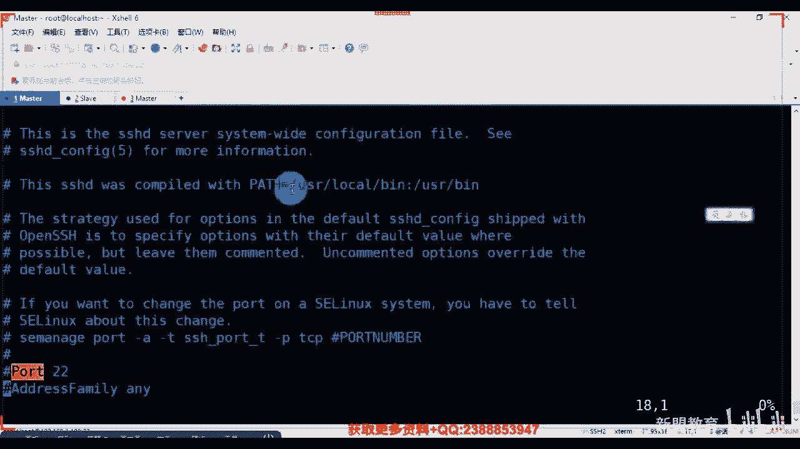
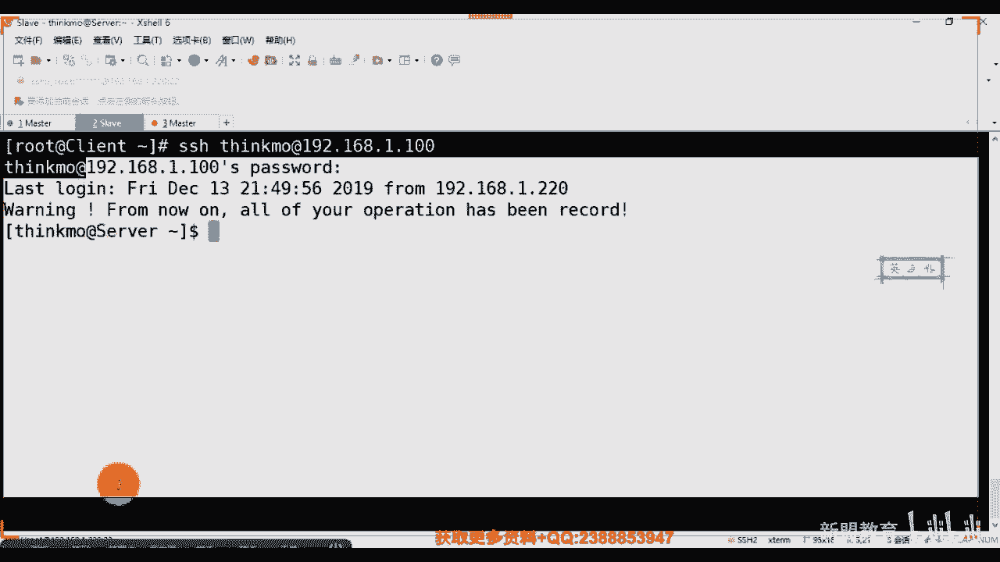

# 2021最新Linux-RHCE运维实战课程 - P4：RHCE-第4课-LINUX服务-SSHD服务 - 新盟教育 - BV17K4y1t7XR

。

啊，录不到了，你们知道谁有谁有录屏吗？给我打一下，我发现我这个录屏有时候会断啊，录屏有时候会断啊。记住这些基础设施服务的话，只是帮助我们去进行linux的一个熟悉，知道吧？啊，为什么大家记住了啊。

我们在架构的时候，在架构的时候，或者说是我们某个工具或者软件在我们lininux下。好，进行落地的时候。啊，在令条节落地时候，我们其实一共只有三步好，哪三步啊？哪三步？第一步来说要记了就是安装啊。

第二步来说叫做调试。第三步来说叫做启动。啊，安装调试启动winow下，所有的方式无外乎经过第三步。而安装里面跟大家讲过了，我们有几种方式。第一种来说是通过我们的亚马，对吧？

第一种是通过亚马或者我们的RPM拿进来。第二种的话，通过什么？😡，第二种通过什么？通过我们的源码对吧？哎，源码包。好。啊，通过我们的源码。那么这里面需要大家这两种都掌握啊，亚么没什么可多说的了啊。

这个这个直接亚门一 store加上名字，对不对啊？源码包的话，我们有三部曲，后边我们之前也讲过了啊，后边遇到了我们在细讲啊，那么它实际上只是一个落地的小方案并不难。所以明白。最后启动的话，大家也明白。

它只是一句命令而已啊，最困难以及最最能够凸显我们所谓的刚Y表示确认啊，能够凸显你你的价值的是其中的调试的部分，对吧？为什么这一步我说过了，改好了，记住一句话，linux下啊，一切接文件啊，一切接文件。

那一切接文件的目的表示的是我所进行的所有所有的配置啊，都是通过我们去修改文件。明白了？都是要通过修改文件。而你修改文件的话，你要掌握的是它我们常用的一些个参数。好，这些参数到底干什么呀，对吧？

就是干什么的啊，以及这些参数，我们在什么情况下去使用，才是最重点的啊进来。好吧？所以记住这三步啊，记住这三步。那么这里边有点需要你们靠详细的是我安装的时候叫做软件包名大家来啊，叫做软件包名。

你比方说你比方说老师，此时我们想要去落地我们最常见的阿帕奇。呃，外b一个软件啊，web服务。那我要安装的软件的名称叫做HTTPD对不对啊，第二个来说啊师我要启动启动的叫做服务名称来。啊，服务啊，对。

叫做HPD服务名称此时也叫做HPPT代好了。这两个是撞到一起，名字相同，有很多的是不一样的，明白了吗？也有很多是不一样的。啊，大家先记起来，一会儿我们看到SSH它就不一样啊。

那么呃学习服务的第一个内容叫做SSHD服务这个东西大家明白吧，对吧？啊，用于我们远程连接的啊，我们现在使用叉 shell也好，使用CT好是使用ty这些东西也好啊，你去连接你的远程的服务器。

我们说你只能把它看作是一个桥梁大机构。SHAD是我们一个桥梁啊，用于远程的桥梁。那么全程的话叫做security shell啊，seeccurure shell安全 shell。😊，连接嘛，对吧？啊。

用于的去建立我们客户端和我们服务器端的一个安全协议层。啊，作用不我都说了，对吧？同志们，只不过记住了啊，它是一种加密的。它是一种加密的，而且我们SSH是可以通过我们的密码或者。

或什么我们的密钥进行登录的密码和密钥的区别。一会会说到密码就是口令，123456。密钥的话相当于钥匙和锁头意思啊，进来。哎，而第二种的话就是大家如果学过网络的，像我们课堂里面，对吧？

有很多同事们是学过网络的啊。哎，对，进来啊学过学过学过网络的那网络里边我们经常用于去登录我们的路由交换的叫做t night对吧？叫t night。那么SSH默认端口是多少？默认端口收到，大家诉。

多少22对吧？好，那tenet大家记住了，是明文传输啊，是明文传输，就是你的密码是展开的，好吧，哎你的码是展开的。好，那我tellnet密默名al口是多少？啊，我们太阳奶粉摸装到手少23啊，这来啊。

这两个是连着的啊。啊啊，那么其他的几个还要我说吗？啊，我们大家记住了，端口啊就是代表一个服务啊，补充一下端口就代表一个。只不过端口的范围，我们是从0到65535记住了。那么0到6535分成两类。

一类叫做知名端口。哎，也就是我们的固定端口。啊，突然固定门口。从我们呢准确来说是从0到1023对了？0到1023。啊，当然0一般不怎么用啊01般不怎么用是0到1023啊。

那么致病端口里面希望大家按照个D的啊，这个很简单啊也很简单。第一个FTP对吗？FTP默认情况下，我们说的是20和21。那么后边讲到FTP我们会告诉大家啊，这个20和21分别干嘛用。😊，好吧，哎。

再往下我们的SSH22对吧？老师tell that我们的23还有吗？同学们常见的啊HGP对不对？对应上我们的801。好，HTPS对应上我们的443啊，接下来第。S对于我们的53。好吧，对我们的53啊。

那么除此之外的话，像我们的ca吧？ca啊算先不说ca啊啊，还有什么啊？你比方说POP当我们现在用的是POP three是吧？同学们叫POP three叫做post of啊，post office啊。

邮箱邮件传输啊，邮局邮局协议啊，一般这个对应的是101对吧？是110啊，说错了110啊，110啊，还有吗？😊，还有吗？啊，这些当然好了，这些个全都是基于TCP的，全都是基于TCP的啊SMTP等等等啊。

直以说这几个啊，先说这几。啊，再下让我们再说，那么这些都叫做固定端口。也就是老说我都知道的，对不对啊，SMTP啊109101啊，那么除了他们以外，还有一些个叫做浮动端口。啊，咱俩叫做浮动端口去了啊。😊。

啊，photo number是干嘛？是我们根据需求可以变化的。啊，可以变化的。那么浮动端口的范围是1024，一直到我们的65535，对吧？同志们？所以像我们常见的其他的，你比方说啊你比方说呃有的啊。哦。

像我们常见的，你比方说像我们的呃数据库my circle来告我做的是多少？数据库收不是。不ら。3306啊，这要记来3306啊，为什么我要说这个老师，哎，我我觉得他也是知名的呀？

那就说3306是my circle的分端口。为什么啊？我们可能在生产环境当中，老师如果我只有一台设备，对了，我只有一台设备。那我可能此时需要干嘛呢？

在一台上面去安装我们这个me circle code的多实力。是叫多实力。好，多实力好了，此时我就要自己去写我的启动脚本，我的配置文件。那么此时我就会占据多个端口啊，自己占多个端口啊。

比方说像我们的windows的。这吧同学们，remote。Dek。来告诉我是手是多少。远程桌面啊远程桌面是我们的3389啊，3389搭家进来啊。好，还有吗？QQQQ的话一般是4000开始啊。

一般是4000开始QQ啊，当是现在可能有变化啊，你像你们公司里面的好了，我如果封端口啊，正常来说你的QQ其实我们要封的话是封的4000。比方说老师到4100对吧？那么此时你需要尝试多少呢？尝试101次。

啊，尝试101次，其实你就能够登录了，明白了吧？啊，他每一次去换一个端口，每次递增换一个端口，每次递增换一个端口啊，直到你把这些都试过去之后，登到了4101啊，于是你登录上去了啊，就叫浮动端口啊。

叫浮动端口啊，那么我们一般情况下到了。比如说HTP80。记住了，在我们的生产环境下。啊，如果我们想要80对外是必须申请的。而此时记住了而此时记住了，我们大多数的80都不被我们的。

其实生产环件是禁止被我们的web监督的。啊，定是的。好吧，一般会被我们的负载呀，或者说是我们的返向代理，或者说我们这个这个这个其他的方式进行监听代替，家听监听代替。而且有的一些敏感的。

我们会进行什么进行我们端口的隐藏。啊，隐藏啊进来怎么样呢？我就把知名那变成浮动的对吧？啊，这里面再说一个叫做comca。啊，他们看到默认8080啊，这就是为什么说有人说老师80啊是吧？呃，不是NAT啊。

不是NAT。😊，对了啊，我们是要进行隐藏的，因为公网的话都是固定的IP没有NAT。好吧，这个端口希望大家记下来啊，这个端口希望大家记来，6会5会间到。😊，啊，那么我们说回过正题来啊，SSH的话。

我们一般需要安装4个软件包啊，对啊，4个软件包这四个我给大家列举出来了，而其中最重要的两个分别是我们的SSHclt和SSHserv。进来2SS的时了。啊呃，上面这两个我就先不说了啊，是干什么的，好吧？

先先卖个关子啊，先卖关子啊，那么这两个是你必须要装的然后上面两个不装没问题。啊，没问题好，那么我们说老师我如何找寻我们已经安装的SSH，对不对？来看啊来看啊啊，我这个的话就拿本地的服务器来给大家去做了。

不拿不拿云服务器了啊。云服务器一搞的话，完档了是吧，连不上去了。

宝贝啊，稍等，我们活原一台设备。哎，如果要了吧。然快到再还原一下然。哎，这说的我开了吗？哦，昨天开的是吧？拨一下啊拨一下。呃，我们用两台吧啊用两台吧。😊，啊，一台主一台呃一台主，一台红是吧。

或者一台server端，一台c端啊，这样子防止我们后边做的时候呢，哎有问题。好。先看这边好吧，先看这边呃，我看一下IP地址啊。😊，他的地址啊。if confi对吧？这个是1。11100。

然后它我本地的啊。

刚还怎你档，1。对吧？1。0吧啊，11。的老了。

啊，链落了。啊，这应该也是这个得也得改一下吧。啊，这个好像忘了拍快照了，当时啊VMEDCCfi啊 naturalturalwork啊呃大家如果有新来的同时们说老师我看不懂，我在做了一步是吧？

我们回去回去看一下，这是改网卡啊，这只是改网卡是吧？我说了所有的东西你都要通过自己去手动的配置啊，要不然呃，linux就就就就就没有意义了，是吧？走啊冲几下。We's start。好。

为什么我的7就不能用inconfi？最小化的话是没有的啊，最小化的话，大家记住是没有inconfig这条命令的。我也说过了，怎么办，装什么，告诉我装什么。

装什么呀？来招什么高总。啊。还记得同学们装哪个叫做nat choice啊，natch杠tro这个。

哦，master有了啊，再连一个。

呃，1。22的。不是。知。好，两端都连好了啊两端都连好了。😊。

啊，改个名字啊改个名字呃，我们以为叫host和master了，叫做host server，叫server，一个一个叫server，一个叫做。是吧一个叫做plant。That'm sorry。好。

那么大家记住默认情况下啊，叫人家ch啊。默认情况下，我们说哎大家记住了，默认情况下，我们SS是必定是安装的对吧？要不然你没有办法连上去的。

所以此时我们需要看一下啊，我们在整个的呃设备里边，我们有哪些个软件包啊，给大家列举了两个方式去查看啊。那么第一种的来说，哎，安装我们就不多说了，安装就不多说了。如果我们去找的话，是通过的我们的。

什么这个要么o，要么list of。啊，挂。哦，叫做SSH所大家看看一下啊，亚马list O。SSH。啊，其实呃我们说服务名称叫做SSHD对吧？服务名称叫做SSHD而我们的软件包名称大家记住了。

叫做open SSSL明白了吧？叫open SS啊，跟open SSSHS呃啊不对，open SSH啊SSL和SSH不一样，明白了吧？啊不一样。啊，大家来。看下啊能看到吗？看到没有？

同学们是不是cl的话有个serv端来看到刷一。😊，看到没有？一个class端，一个server端。看到没有啊，oppo SSL呢是装加密的啊。对吧。哎，一个 client一个server端。

这两个是不一样，来自不同的语文的好吗，后边会列举出来你的语文，看到没有？😊，啊，忽略出来你的源啊啊？啊，这是亚麻源，这个是网络的源，这个是本地的源啊，这是本地源不一样啊不一样。那么我们安装的时候。

大家哈两种方式。第一种我直接亚马 store啊给大列出来了，直接老是亚min store。第二种方式啊，我找到你的镜像里面，因为你挂载过了，对不对？所以我可以在你这面组下RPM啊。

去安装你所有的相对应的包。只不过这种可能需要去解决你的依赖环境依赖关系啊，叫一个一个装一个一个装很麻烦了啊，这就太麻烦了。😊。

啊，所以我们当然是推荐的直接去用亚啊。好不好？咱个复价子了。那么当安装之后啊，大家对了，我此时会生生产出来这么多个我们的文件。而这些文件里边，请你注意啊，这个命令这是条命令文件是吧？这是个脚本啊。

命令 sorry。好，这条命令到后边我们会用到是用于去生成我们的密钥队来啊生成我们的密钥队来进行无密登录。啊，一会儿会看会看到啊，会用到啊。那么此时请你注意啊，我们我们说了，你要去进行文件。

你要进行服务的配置，就进行文件的修改。那我会有两个配置文件对吧？我会有两个配置文件。而此时来好了，带D的和不带D的。代递的是我服务器端的配置文件，而不代递的是客户端的配置文件。好，那问大家一个问题。

正常情况下，你应该在你的服务器上或IDC的服务器上修改代递的还是不带递的，告诉我。带地毯还不带地毯。嗯。😊，盖地方？一定是代理的啊，一定是代理的。你客户端，你在自己的电脑装，对不对啊？你装不装都无所谓。

在服务器上，对吧？你在服务器上装不装都无所谓啊，能理解啊。😡，好，这一定是盖地的拿起来好吧，所以我们想想的也是它啊想想的也是它啊，这个课户端没什么可讲的配置啊。哎，那么我们的启动脚本，大家注意了啊。

这条命令我我之前没有说啊，我们可以在在在这个这个7里边使用stemCPLstarHD对吧？我们也可以使用的是在和6所通用的一条命令。因为大家发现一个问题。

老师ok我们在7里边ETC下IIT里面只有有限的123几个我们的这个这个这个。😊。

这个两条命令对吧？啊，就这两条命令，因为我说过了，7里边默认使用的叫做sstem地这个系统进行管理，对吧？而六里边使用的是init。好，那么既然这两个命令不通用。

所以此时我们还会有另外一个叫做service，那叫service的命令，这个方式是我们两个版本都通用的命。

啊，都统一点，你只需要明白一个问题，就是我SHD知道吧？这是服务名称啊，这是服务名称软件名称叫做open SSH。好不啊，13SS。那么从学服务开始，请大家注意了，你的所有机器啊。

你的所有的机器一定当你安装服务之后要进行叫做开机启动。啊开始当然了，你说老师我服务器需要每天断电吗？不需要。但是前面我们也说过了，有可能你的IDC真的是面临到了老师突然断电了。好，我即使去切换UPS啊。

我也会有一个时间，对不对？所以我们会有一个之前有个小实战，叫做电脑的，叫做我们服务器的开机或通电自启，那服务也是一样的，要开机自启的一个过程，明白了吧？啊，尤其是说老师我后期老师我打算考试的啊。

参加什么RRTCE的认证的，这个是一定要做的，好吧，一定要做的啊，叫做C是KfiSSD啊那好了，这是我们。😊，啊，六和7版本通用的命令。那么如果说我是七版本呢，哎我只用一个呢。

也可以用这条命令叫做systal啊CTL叫它inable。SHD哎，没错啊，叫en那借用呢就diable明白吧？叫dable好，大起来这两条命令应该不用我说了吧，哎，不用我说了啊。😊，哎。

所以6德那老师，我怎么知道哪些个东西是启用的啊，直接用我们CK杠list O就可以了啊，list O就可以了啊。哎，进来，所以这两个文件我们看一下啊，此时你默认安装了。

是不是真的有老师ETC下SSH看到了？同学们SHH啊，记住啊，如果是通过我们亚麻安装。😊。

就住通过我们的样板安装。sorry啊啊，通我们样蛮中。那么此事请大家注意啊，我们会默认在啊，我这说的不是通过我们的二次开发。当然有的公司老说，我经过二次开发和它是有区别的啊啊。

我会默认在我的ETC下会建立一个同名的部落。是吧会建立一个同名的目录，它下边会进行保管我们所有的配置文件。啊，所有的配置问题没有了吧。把拉进来啊，如果我们是通过原版安装。好的好了。

我们的默认的安装目录在哪里？安装目录是可以通过杠杠perfect去进行指定的。啊，我们可以去进行指定的那我所有的文件都在安装目录下，这就是一个可控，一个不可控啊。因为既是配置文件，我要日志文件的对吧？

日志文件在别处啊，好，打起来。

所以我是SSH家看啊有那么多个对吧？这些个现都不用记，重点记的事儿就这一个。😊，啊，就是SSH第点conpy个文件。

23D这个文件啊，那么在这个文件里面，我先把这个笔拿过来啊。好了好了，此时请你注意了啊，如果我们什么都不改，知道了，我什么都不改。哎，那么此时拉好了。如果我想让我的客户端去连接的话，我怎么用？

就是用SSH mini啊，SSH命看了？不带的啊，好空格好，同学们此时我要做的好，用root。😊。

艾啊192。168。201221点是吧，1。100。好，先把格式起来，怎么呢？用户名艾特地址连接。按，IP地址啊，那么那好了，此时你也可以不用加前面这个位置好，默认就只使用root去登录啊。

默认就使用do作的登录。但是你要明白啊，正常情况下我们的。服务器是禁止远程的root登的，尤其是对于大家一些个呃出据域维，或者说底下的员工来说，只有所谓的你的项目组长了，或者说你的项目经理。

或者说你的这个域维组长才能够去接受root啊，那好了，我们现在呢先做一个先做一下啊，我们做一个user。艾是吧，艾了一个MQ木权啊，同志们啊，此时的话给他一个密码，ecle123456，注意了。

123456哦，password杠杠STDIN哦，MQ密码给他了啊，给他个密码SSH通过MQ加好了。😊，好了啊，如果老师我现在用MQ去登录，你告诉我登录上去吧。登录的上去吗？告诉我。😡，来家好。

同学们登录的上去吧。😡，登录的上去吗？😡，登录上去吗？想想啊想想啊，想想想想想想想可以吗？老师，yes。😊，然，possible的输入对方的密码吧，是吧？think走，再看一个问题啊，看问题哦。

是我密码错了吗？😊。

说密码错了吗？改了，你是我密码错了吧？是吧。是吧。是吧不是吧。登录不上去啊，为什么登录不上去，你告诉我。😡，告诉我为什么，你记住了，这个用户的话是我本地的，你要用MQ去登录，能吗？你是得用对方的用户。

😡，能明白吗？同学们。能明白吧？

啊，不是挖出，你们就跳啊，这个这个这个你们也是可以的，是吧？挖出你们就跳是吧？这个是我自己本地的，你要用的是什么？用的是我这个serv上的嘛。😊，是不是挖坑你们就跳啊，这是可以的是吧？

user add记住了啊，think在这里面好不好啊，ele好了啊，eical123456啊，给我们重新做一个password杠杠STDAN是吧？思co啊，我得拿这个去做嘛，对吧？😊，啊，这不就有了吗？

走第二次对吧？密码s啊，sorry，打错了啊。

好吧好。你说吗。看一下啊，对吧这个才是文啊，对吧？啊，我们哪说出来的？😊，啊。啊，同学们看到没有？是不是登录成功了，是不是登录成功了啊，那是自己人嘛啊不是自己人的乐功达斯啊，看见没有啊，落露转了。😊。

哎，所以这个情况下垃圾转我就登录上来了，看到没有？是不是server了，看我的IP地址，对吧？我就能够进行查查了吧。😊，啊，对来。哎，别客别着别着急啊，然后没有完啊，没有玩，记住了啊。

这是我通过登录退出exist就可以了啊，退出exist就可以了啊。那么重点来看这个位置打好了，是我在首次登录的时候啊，首次登录的时候打好了，我不是自己的用户名，而是记录你是从哪里来登录的啊。

那么这个信息哎，是干嘛来？我要询问你第一次登录保存我远程主机的信息那这个信息保存在哪啊家记了这个信息保存哪，保存在这。😊。

啊，写了啊，保存在我们这个位置上，在CT rootot下到了点儿SSH下哎，点SSHH没有吗？说了吗？😊，啊，叫SSH哎上面没有啊，这上没有。啊，CT入场。第二SSH到了这到nose host对了。啊。

可以啊可以啊，对吧，这下边保存了我们登录的信息，单还没有？😊，看到没有？这是我远程，我要登录谁啊？😡，看吧登录到我们1111。1百程序。把这个条把这个起来啊，那么这里边我说的是这个地方，他们的是一点。

看这个点什么意思？告诉我这点什么意思啊？讲什么意思啊？隐藏文件啊隐藏文件。所以记住了，在你们这个呃在你们这个linux下比较重要的文件，我们一般都用表隐藏起来。好吧啊，windows里面也有隐藏文件。

对不对？啊，windows面也有隐藏文件，windows隐藏文件的话，你打开目录啊，同志们好了，你比方说老师，我在我的电脑C盘里面啊，找一下，现在有吗？没有对吧？你得找他的共享来，找你的一个查看啊。

查看里面的我友有这个点开隐藏项目，看到没有？就多出来一个吧啊，他们是以dollar啊，是。😊。

啊，不多说了。哎，那么此然好了，这个地方其实是个加密啊，这个加密我就不说了啊，它用的是RSA的加密啊。RSA的话其实是一个很简单的加密，是一个经过我们数论的，是不是这个意思啊？

就是它实际上就是两个大的数数什么叫数数啊，素数啊，速数啊，哎，进行相乘得到的，但是正向你能得到。你比方说老师我两个数数，两个数数相乘，要一个大的素数是吧？这个素数我肯定没有约啊，约这个这个乘积的啊，对。

对没错，哎，分子难以分解，对吧？分解进来，哎，没错，有明白啊，对这个后我就不说了啊。😊，好，想数数了呸啊，过分了，我想救静啊我想救你。这是一种当啊？这是最简单的方式。第二种的话，什么SS杠L好了。

就杠Ls啊，后边也是跟我们的168。1。1万。你看第二次我才登录时候干嘛？同志们，你就不需要我们的。😡，记忆了吧，第二次登的时候不需要了吧。我没跟密钥的啊，这没有密钥啊，这没有密钥啊，这不是密钥啊。

这个是自动登录的啊，这是自动记录的。刚才不说了吗？对吧？每一次第一次登录时候会自动记录，这不叫密钥啊。😡，好，这是啥？杠L什么意思？同学们告诉我，刚什么意思啊？你段杠L表示looking name。😡。

啊，这个looking name。好吧，这是loing name什么意思啊？登录的用户名，所以你后面要跟的是用户名嘛，对吧？再跟IP嘛看区别在这儿呢，看到没有？😊，啊，区别在这儿呢，这种不常用。啊。

这种方式不常用好吧啊，这种方式不常用啊，来给来啊，那么最主要的来看了，我们要做的是调优。啊，剩下我要做是最主要的啊是我们的生产环境下经常做的几步调优。关于SSH。如果你在你的生产环境下没有做这笔。

我会一要加上，好吧，回须要加上啊。啊，对，是那个windows吧好，VMEDC下好SSHSSDR一定要DRconfig当好了，此时如果你的电脑没有装VM的装上它，好吧，VM很好用啊，VM很好用。

要么错冒一下用冒。😊，DV分重是吧。好，要么insstore杠YVM啊，一定装上啊，不装不好看对吧？不装不好看。嗯了。哎，稍等啊。好。做好了啊。helello。问大家一个问题啊问大一个问题啊。

因为我这里边的话，我的参数过多，但是我还没有办法把你的参数给你们取取消掉啊，我没有办法把你参数学掉，没法过滤。记住啊SHH里边的话不要过滤啊，不要过滤。啊，爆过率为什么报过率怕不同在往上看啊往上看。😊。

蹲意一下啊注意一下。😊，大翻在这儿了吗翻这了吗？看到没有？这两行宽有什么区别了吗？看。😡，这行和这行它有什么区别了吗？有人看到吗？哎，空格看到没有？啊刚有人看到我都画光标了，对吧？什么意思呢？好了啊。

如果井号加空格，那么这一行表示叫做注释行。列了吗？井号加空格表示注射好。而井号直接加参数记住了，这是默认使用的参数。啥意思？到了这一行启动与不启动，我们默认都是监听22端口。列了吧，所以在此文件下。

我们是没有办法过滤我们的井号的。尼过滤全没了是吧，默认选项也没了。😡，理解了吗？朋友们，哎，所以这个地方不是我不启用，只是我默认选用22，我就下面给个警号就可以了啊。那么为了方便看到了，我们有个s。😡。

number还是这什么意思吧？😡，下啊哎，不是啊，这个地方所以一定要纠正一下啊，很多坑我现没有埋啊，现在没有埋啊，没有填好吧，倒进来啊，那么此时啊对，输出显示行号啊，哎，这的话，直接修改默认的。对。

没错啊，看了你要修改的话，是你一定要打开它才能修改的，明白了吗？同学们，你不打开它。老师我就是是吧？我非得我非得我非得啥啊，我就这样改是的同志们老师改成23，记住它默认还是22啊，默认还是22明白了吧？

哎，所以一定要改的话，应该要打开它啊，那么正常情况下记住了，在我们的啊在我们的这个这个呃linux下服务器下port一般都会被修改啊，一般都会被修改比老师变成2R是吧？变成2R啊，问他一个问题。

如果此时老师我希望我的SSAH有多个端口啊，我怎配。😊，啊，别等你们问我，我先问问你们是不是啊，同学们哦多少多好咋办？😡，多等等好怎么样啊，不用普同啊，记住啊，能行不能行，记住啊，要用多行啊。

多少记住55明白了吧？啊，要用多行，有几个写几个有几个写几个，没有同学们啊，那么此时请大家记住了。😊，啊，对，还得这样啊。那么此时请大家记住了，你们保存之后一定要进行所谓的重启啊。

system cTL restart SSHD注意了，此时我这边断了啊啊，发现没有？老师断了吗？为什么没有断啊？来看一下啊，nice state杠LNT。能看到吗？能看到吧？同志们能看到吧？啊。

我默认状况下，我自己不会动开啊，默认状况下我自己不会动开，看到没有？这次SH比较好的一部分啊，像别的一样啊，但是我远程如果想要连接你的话。😡，对，井加参数是默认值，在别的符里面通用的啊通用的。

如果我想连接你老是SSH比方说thinkmore at192。168。1。100好太好了，此时就会连不上了，看到呢？这就连不上了。那如果我想连接呢。我想连接呢。跟个什么参数了呗，跟杠P啊，杠P啊。

给大家杠P看二等连吧，同志们啊，再跟个55啊，都能联络吧。😊，啊，是怎么来的？对来。😊，25都能0啊。好，大家记住这是改端口，一定要改一定要改一定要改啊，一定要改二行不行？行帽行不行？行不行？行。

冒号不行啊，不要用冒号，必须用放屁啊啊。跟参数走啊，好，这着看啊，这是我们的这一行啊，正府这一行好，set number。啊，sorry， that's number。啊，这是第十七行改好了。

再往下看看到多少行了？叫做二0行啊，同学们2号表示么叫la address大家看看明白了，这是我所要监听的IP地址，对吧？啊，那么一般来说那好了，你想用哪个网卡连接，你就去监听哪一个明白了吗？

老师一要说我想要监听都是用孤网的啊，都是用古网的IP地址在服务器上固网的啊，如果我的是20能选20。0。0。0啊，110。0。0。0来具体的IP地址啊，具体IP地址。于老师我的网卡做了绑定。

或者我想要所有的都可以被监听到，那我就写0。0。0叫做默认缺少监听所有上边IPV4，下边IPV6。😊，MV赛P6不用说了吧啊，这个地方默认不改它就可以了，啊不是不改了就可以了，好不好？

底下这几个不用我说了，这是RS啊，这个是RSA的一个加密方式。这个我就不多说了啊，这个我们不改啊，这个我们不改好吧，这个我不改。

啊，往下走往下走，直接找到这儿。来这啊，同志们38号。看到38好了吗？😡，来看到38号刷击啊。对答啊。哎，叫做g time，大好了，叫做g time。啥意思？叫做优雅的启动，优雅的连机。啥意思呢？哎。

那好了，此时注意到没有？当我们选择连接之后，会有一个密码提示登录，那么这一个地方会有个等待时间啊，如果等多长时间呢？一分钟2分钟10秒钟等多长时间，等长时间等2分钟，那么？2minute。啊。

这个位置的等待时间是由我来设置的啊，那么一般情况下两分钟不变。啊，不变，你可以根据实际的情况来修改，那吗同志们。啊，就是你有在多久时间内，你没有登过过产品下线啊，产品关线。啊。

这个往下这个地方叫做permit rootot logging，告诉我允许吗？啊，预设此时是允许的。而在我们的生产环境大去做，一定要把井号去改成no啊，一定去改成no。

真实的生产环境当中是绝对不允许大家使用root去登录的，只有我们的一些个高管是吧？我说服务器的管理员才能去用啊。好不好？别人就不跟我说了，最大的这个这个尝试的次数6次，最大的连接10个啊。啊。

指论速度那个速度有啥关系啊？速度是提全啊度是提全啊，对吧？啊。是吧。哎，其看下授予没授予的啊。好，接着往下看。接着来看在哪呢？在在这地方啊，这个先不说啊，这个是我们认证的文件是吧？密钥认证的文件。😊。

啊，拉上走在这呢，到了叫什么呢？在66行。啊，在66号。🤧嗯。啊，为什么我没有改这个也能root登录，你本身就能root登录啊，对吧？本身不就是什么permit啊，root loading啊。

别着急别着急，不别着急，别着急，是不允许你们去做的啊，是不允许你们去登了啊。后边我会说，后边我会告诉大家的啊我会告诉大家。我会告大家好吧啊，先别着急啊，那个位置让我首辰说一下。

是防止我们所有人使用入器登录，明白吗明们？哎，我是我可以登上去，但是我可以切换的。你可别要玩，我不用root登，我用普通用户登之后，我拿SU去切换行不行？你要做。可以吗？可以了，同志们哎。

有个可以切换的不就可以了。哎，没错啊。😊，啊，你的高管是可以切过去的啊。对，好，那么password套了66行这的password authentic yes，什么意思啊？这一步是用来密码认证的。啊。

这一步是用来密码认证的，知道了？123456口令认证也叫做。但是请注意了，真实环境下，生产环境下，我们是要根据不同的级别，在大家基住是不能够用，有的是不能用我们的密码登录。啊，但是此时这一步你先别改啊。

一定干什么？记住了，是一定要在。😡，好，你们生成了密钥对之后。啊，知道吧？一定要在升上妙顿之后，你们再去改啊，老师我没改没生妙对了，我直接把这个进了，于是你都断了。你再想找可就不好搞了，明白了吗？啊。

你只拿本地去都录了啊，了起来了，所以这一步先不要动它啊，先不要动它，好不好啊，但卓老师我一定要把它我后面弄完了，我把它改成no，对吧？改成no，那么此当了？如果此时我是yes的话，我上面这一个叫什么来。

叫做permit empty possible，就一定没no。😊，知吗？如果有说我下边允许密码登录，我还能是空密码，那你就被暴露了是吧，谁都能连接你了，对不对啊？所以这两个配套好了走啊，好了走。😡，好。

这是这两个。那么再往下走，我们找找找找找找找找在10来行，应该是啊。好，在这了在这了。好来看朋友们。在106行叫到print method。啊，就pre method啊，这个是啥？记住了啊。

这个是大家在登录的时候啊，我们去打印的一串信息。哪串信息呢？往这看。😡，好看。啊啊。好了，老师我去登录。大看看到这个位置了吗？😡，看这个位置了吗？hello同学们。来，看到啥一。啊。那么告诉你是。😡。

last是吧，last啊last。啊，我们登录的是什么时候，看到没有？什么时候登录的啊，当然我的时间的话没有改是吧？我本地没有改data啊啊，从哪里注意是从哪里登录。😊，哎。

创外登录从我们这个位置登录看到下。这个是帮助大家后期排查错误非常关键的一个点。什么意思啊？到了正常情况下，你们应该是来自你们自己的。公网的IP啊一般来是公网的IP。之前的话有一次我是给我们的友商去排谈。

他就说这么夫务气遭受这个这个SSH啊，我就通过这一步知道吧？哎，总是发现自己的CPU啊，什么内存加大，而自己的公司的话，发现内部没有什么东西啊，是不是没有什么东西啊。

最后我发现的时候是我远程登录的时候显示那么一条命令啊，就是我查了他之前的日志了，我长之前日志发现好嘛？这块的什么什么阿拉伯的呀，什么什么中东的呀啊，什么欧美的呀，都是来自外国的，你说他还没有被攻击吗？

如果大家就道这个地方变成了其他你非知名的地点登陆，你的服务器已经被黑了。😡，明见吗？夫妻已经被黑了，不是将被黑，而是已经这个他已经登录过了。理解了吧？啊，所以这一段是能够帮助你去排查的。啊。

是能够帮助你排查的，好不好？安在了啊。哎。有啊，当然有了。当然有了对吧？别着急别着急啊，所以这里边会说两个东西，一个带好了，下住了。第一个第一个哎不在message里面，第一个是我们的日志文件啊。

linux下面SHH正常登录的日志文件叫做word下log下叫做什么叫做securry打起来，叫securry。😊，看到了吗？看到了？同学们啊，the securitycur SSH看到没有？😊。

啊就是cur it。这个表示我们正常登录的。来等正常登录的情况啊，啊正来了看这边说说错了啊，看我们的master啊，不要看s love。来家comster。哎，一点一点没连上去，再来一下啊。

sorry啊，不是1。不是那们22不对了啊，22不对了。所以我这边的话要改回去的好了，要改回去。😊，啊。我这边改回去啊。接着网CTLre start。20呃SSD。好了，这个就可以过来了。好，干啦。

来看。😊，嗯，要输密码。好。哎，5们秒师错了。再想，对不对啊？对，那老师哪个来的？想想。😊，好。哎哎，不是不是不是不是不是不。嗯，我用的是master SSSHroot登录，对吧？root。

我改不改密码了吗？我想想啊。

我这边我这边这边改一下吧，我真的忘了pas rootot了啊。acle好吧，123456。😊，好死我了，这个就简单的了啊，杠杠STDIN。因上。好吧，改一下就好了。😊。

啊，改一下密码就好了。走。好，不的哎，过不去是吧？呃，我看一下我这边是拒绝了吧？😊。

密码登录。

我应该是允许你们俩登录的对吧？

啊，是允许密秒登录的呃。稍等啊稍等啊，呃，我这么直接在这边看吧，直接在这边看吧，刚来选那个什么的啊，word下log下我们的security。😊，哦，我进入了不啊，对对对我进入了root了，对吧？

我进入root了啊，交下来了，对进入了root了啊，往这看往这看往这看，看有当然？是我们在这个地方看到没有？我是不是通过我们的148去登录，看到没有？对不对？这几次都是失败的啊，这几次都是失败的啊。

看到没有？有失败有成功的，看到没有？😊，能理解了吗？啊，有失败有成功的啊，拉解来就可以了。啊。所以在这个地方呢，这是记录我们日志的起来啊。

记录我们日志的叫什么文件word下log security啊secur这是记录SSH的啊。好，然后我们接着来说这里边啊。😡，接来说啊。这个是我们的第多少行来着的？DDDD第105行啊10。好，没有玩。

是吧啊，当然了你也可以说当好了，写一个文件，在哪来在这写ETC驾构的MOTD。😊，好，看好了，我写完这句话之后会有什么现象，可以吧？啊，看好了。😊，好了。啊，re burning警告是吧？从现在开始。

我会记录你所有的操作好，保存退出啊，重启一下我们的systma CKL restart SSSD。走。呀还有还还送Q币呢啊，包过是吧，此时我们再来这边去登录一下的时候。😊，好。

走大看一下看一下出现什么了，告诉我出现什么了，是不是比刚才多了一个提示啊？😡，到了吗？来看二串一。是不多了一个提示啊？啊，记住啊，如果你们去给一些个公司的生产环境制做的话，你会发现一登的时候，我靠。

一大片知道吗？啊，一大片没错，叫做登录公告。哎，这登公告，这一大片告诉你什么啊？比方说你这个私活或者说老是我给我公司做，他会告诉你啊，这里边借待服务器，好，哪些服务是不允许你被重启的。😡。

对，一大堆注意事项不允许重这个重启是吧，不允许登录等等等哪些东西啊，注意事项。😡。

啊，在这个文件下去记录啊，你可以自定义的啊，你可以自定义的好不好？然后我们这来看啊啊，不对，然后我们这来看。😊，走。啊，再往下面的话，还有哪个想想啊。😊，还有哪个还有哪个还有那个呃在这呢叫做usDS。

啊，这样看看115行色的USDNS yes。啊，工作是中文的话，你可以自己写中文的啊。啊，你可以写中文的对吧？有的是汉化版的，可以写。知到了，6DS什么意思？大家会发现有的说老说我SSH连接之后的话。

我输入密秒之后啊，会等待一段时间才能正常连入进去吧。就是输入密码之后连接会很慢，发现没有？😡，看到没有啊，如果一般来说，这个就是为了判断我们客户端我的来源是否正常合法啊。

所以因此我会使用1个DNS去反查我客户端的主机是谁。啊，当然了，如果大家好了，记住了，这个位置如果我们是用内网连接的话，我为了让你更快一点，我就把你改成了no。如果是公网，这个地方是避开的，必须要开的。

理解了吗？😡，拉链上一。6找1。好吧，保持住冲啊保持住住。好，重新启动就都可以了啊，重新启动就都可以了。这几个重点的这个这个这个东西我都给你们记录在我这里面了啊，就大家记录在这里面了，好吧，不用着急。

😊。

啊会着底。那么回过头来接着说啊，那现在老师我还下是给你配好了。那么大家明白，如果对方黑客想要攻击你的。😡，攻击你的服务器，我无外乎是要经过几个，对吧？因为我们是具备公网的IP的。知吧动玩IP的话。

我一定会有端口的暴露，对不对啊？然后呢告诉我我如何去扫描端口啊。哎，我如果去扫描端口啊。如果是扫描多好啊。呃，map对吧？这个到了我们后边会给大家讲到啊啊用N map好不用用太太了，他要挨个试是吧？

老师1到10035挨个试啊，你这个时间很很多呀，是吧小飞啊，只要用用N map啊，用用N mapap好不好？N map去加上某一个端号去进行访描上啊，这个可以装一下，我们到了后期会讲到啊，后面会讲到好。

所以扫描错后进行叫做暴力破解。😊，Nobody不你。啊，这个软件没给大家找到，你可以思小一下，在window下做啊，windows下做就可以了。好吧，这么字典了，老师我去破破解它啊。

扫描之后进行暴力破解，破解之后，我们才能够登录进去，知道吧？M俩字典啊，基本上90%以上的服服服务器攻击都是通过这种方式。😊，那什么呢？都是通过这种方式啊，我们后面后期会给大家演示的啊啊。

那么此时如果我们现在单纯讲义叫做防止他暴力个机，我们有三种方式知道吧？防止你暴力个技。怎么做？第一种好，同志们配置SSD第一个来说，你的密码足够复杂，这个复杂请你注意了，同志们。😡，啊。

大于8位是最基本的。而有的公司像我们之前做要大于20位，知道吧？最好要大于20倍，有的公司大于10位。老师不好记啊，对吧？不好记怎么办？网上有一些个叫做一些个开源的软件是帮助你去记忆密码的，好不好？啊。

当然你的公司是内边有手册，在这个手册一般怎么样，你要常变的，一般来说，这个密码好了，数字大小写和特殊字符组成的，基本上一个月到两个月之间要变换一次。😊，啊，要变换一下。不是固定的，是要变换的。啊。

不知道这辈子这钉钉码就不变了。不是的啊，这以说大知看比如说我举了一个例子，知道这什么意思吗？😡，知道这什么意思吗？啊，知道吗啊知道吗？我是写了8位，啥意思啊啊，你可以自己想一个啊，这是我自己想对吧？

给大家举个例子吧，来一瓶82年的拉菲啊，来一瓶82年拉菲，听白了吧？啊，开个玩笑啊。😊，啊啊，所以你们自己去弄啊，自己去做。🤧哼。20倍，100年也破解不了是吧？啊？还好啊，反正我告诉你的。

我们当时是20倍啊，很重要啊啊，往他们走啊，因为单想到暴力破解，4位好破解还是00倍好破解，20倍好破解，肯定4位好破解。😊，啊。还是说那么呃第二种来说就是修改模尔能口。他不知道的非知名登口。第三个。

不允许root直接登录，授予普通用户啊，这个对然后添加普通用户授予root权限。那么同学们。啊，对了。好，问大家一个问题啊问大家一个问题，我们是否可以禁止入册入户登录？可以吗？可以吗？告诉我可以吗？😊。

可以吗？所以把大家在香港的故意控开了啊。啊，对吧是不行的啊。😊，啊，这个可能我的问题问的错误了，问的问题问题错误了，啥意思？大熊哥。😡，什么意思啊？禁止root身份登录，但是我会以禁止root登录。

啥意思看好了，啥意思。是啊呃当好了，我们看一个用户，你是不是root，就说这个root身份和root用户是两码事儿。是吧。root身份。好，大家说是不等于我们的。是吧是不等于我们的root用户的。

这句话都明白吗？😡，啊，套路文文啊，都是细节啊，root身份是我们一定要让我的UID等于GID等于0，对不对啊，而root用户呢用名只不过linux下默认最高叫做root。对吧默认怎么最高啊。

那你说要说我会不可以做，看好了，朋弟们坐一下啊。😊。

好吧，我怎么做？😡，外b。到了。

这个是啥对吧啊，willmEBCpassword。看同志们，此时我root看到没有？看到没有？我要干什么？把root改成SB knowledge。😡，哎呀，这五颜六色真好看是吧？啊。

改成no log那给系统用户不能登录了，而我会把底下的thinkkbo改好了啊，改成什么。😊，0。你。高速速度。啊，大家自己注意啊，这大算对啊，别着急啊。这个大家就是一般来说服务器的话一定要改啊。

服务器的话一般一定要改不准名字啊。你会发现一个问题，老师此时的话是吧，发现UID一样了，是不是发现了吗？UID是一样的了啊，UID是一样的了。😊，看了同学们，所以说但是好了，你在user add的时候。

老师指定UID是不能够冲突的。但是在改文件的时候是允许一样的。那么此时到了，我去修根登录。还问你，我登录成功了吗？😡，我登录成功了吗？😡，成功了告诉。成功了吧？成了啊看成了啊。等功了。成功了。

这已经loading了啊。可以吧？走了哎，不对不对不对啊，这这个是一方对吧？这是这个地方啊，大家。😊，找到啊不MI。看老同们，我们再重新弄一下exist退出一下，快看是们look就出来了吧，成功了吗？

刚才登录成功了啊，登成功了，这只告诉你上一次登录出出现的失败，对吧？这是上一次的信息，这次是登录成功的吧啊，记住啊，这次是登录成功了，看到没有？登录成功了吗？成功了啊，只不过老师whoMI的时候。

当你查看的时候，你还是录上。😊，看到没有？你还是root。但是我登的是新个梦啊。😡，这就是linux的霸道的之处，就是我不管你是谁，但凡你是变成了我们的超级用户，你就是root，明白了吗？同志们。😡。

明白了吗？啊。来起来，所以我是禁止了root用户登录，但是你不能说禁止我root身份登录，对吧？😡，啊，对了啊，所以这是很重要一点啊。很记得了吧。啊，当时用还是root。对，没错啊，但实际上来说。

你用think mode登录可以了吧，同学们。同人吗？加目录别了呀。加入没有没没有什么变化啊，加目没有什么变化啊，你该有了thinkca梦还是在后这之前你创建的还是有的，知道吧？

只不过此时你thinkca梦被我强制变成了路的映射了，这是。😡，啊，所以就说了对吧？

啊，所以来好了，此时的话你要看的是零啊，看的是0啊，艾例是0啊。啊，休息1分钟啊？休息吧啊，这个可能得讲两得讲两个小时啊。行，那大家先休息10分钟，好吧，休息10分钟，该放水的放水啊。

因为我后面还有很多还有一个暴力破解的。对。也是root全部权全部权限，你就是root用户了，知道吧？啊，我先把它暂停一下啊，先把它暂停一下。😡。

