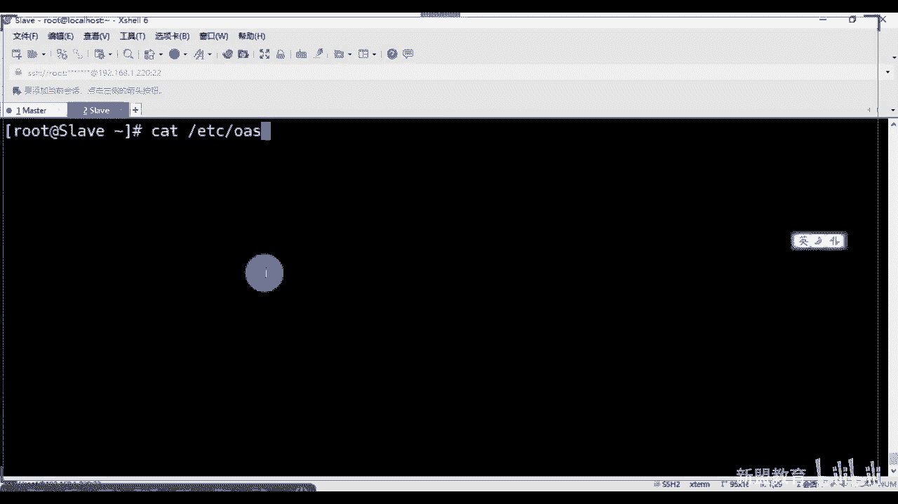
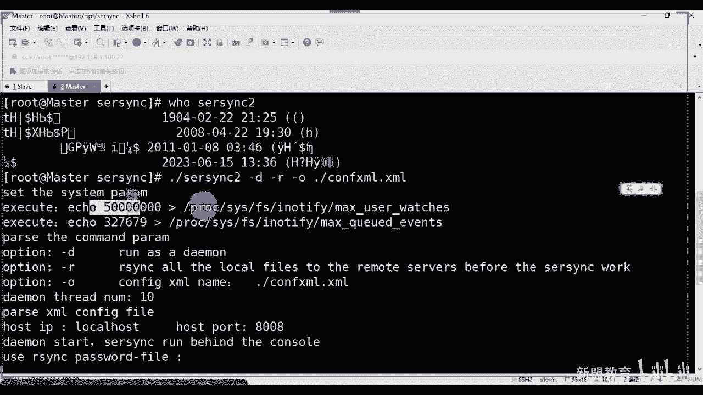
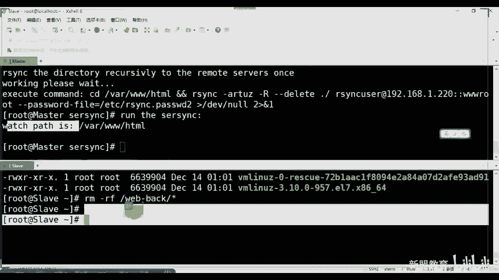

# 2021最新Linux-RHCE运维实战课程 - P5：RHCE-第5课-Linux服务-rsync服务 - 新盟教育 - BV17K4y1t7XR

Yeah。

呃，看一下多少人了现在30多号人是吧？OK啊，不算他们请假，应该还好吧人到的啊。行，准备上课了啊，我们这说我们还是先讲服务。好吧，还是先讲服务啊，服务讲完了之后呢，我们再去讲脚本啊。

这个里边我记得后边还会遇到一个脚本，知道吧？啊，后边还会找个脚本，就是我会逐渐的把我们看到没？还会遇到一个脚本啊，我会逐渐的呢给我们同志们就是把我们常用的脚本放上去。好吧，呃，怎么说呢？

就是linux里边所谓的软件脚本，软件服务和工具其实都是一个意思，明白了没有想啊，都是一个意思。😊，啊，比如说。We seek。呃，我们叫rRC和RC或者叫做re或者叫做RSSYNC啊。呃。

我建议呢大家就别分开读了，我们就直接读re或者说rse都可以啊。那么re的全称叫做remote啊叫做remote seek对吧？叫做远程同步啊，远程同步。

那么它一般来说的话都会结合上我们的这个效去使用啊，也就是说我们如何去实现一个。啊，实现一个这个这个sell的呃结合之后，我们让它能够自动去执行去同步，对吧？啊。

大家记住reic是在我们现在常见的小集群架构当中，甚至大集群里面也会常用的那容，明白了吧？啊，也会常用内容。那么呃我说一下啊，我们在基础服务里面的话会用到几个东西，基础服务。好。

这个来说我们的昨天刚刚讲的SSHD对吧？像我们刚现在这个叫做re啊，像我们的FTP啊，像我们的DHCP像我们的DNS像我们的呃还什么来着？像我们的NGB对吧？NDP好。

这几个老师我们的桑讲不讲啊我们桑被我给划掉了。原因很简单，因为桑不用了，桑不用了你们现在常用的一个共享的服务叫什么呢？哎，记住啊，你们现在常用共享服务其实就是桑档是445端口。

只不过我们大多数情况下用在了我们的共享的打印机啊，这上边呃真正的公司里面所搭的服务器大部分都是FB或者我就直接拿其他的方式对传了啊，桑基本上不用了，桑基本不用了，但大家知道它是一个共享服务就好了。😊。

啊，共享服务啊，像前年的话，2017年我们有一个东西叫 cry永恒自蓝勒索病毒，对吧？攻击的其实就是445这个端口明白了吧？啊，暴露出去的哎呃去年桑ber下的对吧？就基本上桑就不用了，明白了吧？

所以我们就把它去掉了，不要了啊，但是但是没要题啊，就是RSYC这个数据同步本身就是桑ber旗下的，我们说研发他的作者同时也参与我们研发了我们的re和我们linux kernel也是内核的一个开发。

同学们所以也是我们常用的看到它网站了吧，上面桑吧，看没有啊，那么查看版本来说，在我们的最小化安装记吧？在最小化安装的时候是没有我们的RSSYNC的，没有RSYC的啊，我们是需要两端都去安装。啊。

才能够使用的。老师我只装了一端，而另一端没有装的话，大家就得是你没有办法用的啊，是没有办法用的。好吧，那么在我们rethink，大家看老师我公开课好像听你讲过，大家记住了，和公开课讲的不一样啊，为什么？

首先说我们公开课的时候，我讲的是restrict的RSYNC的哎命令的用法。啊那的用法。那么但是请你注意了，在我们系统班里面是讲的我们企业的实战务是用法啊，叫什么？叫做demo。

对了叫做我们的守护进程一化。对了啊，守护进程就是把它当做一个我们后台去运行的服务。那运行的服务就会有我们的默认的端口大起来啊，一会儿老师默认端口是多少好，对吧，是87来大家来啊，是873，看到没有？啊。

是垃圾袋。所以我们在生产环境里面用的都是这种方式。老师我怎么使用这种守护进程的啊，用户买一看啊，用买一看。那么呃版本的话当了有的用的是杠小V也的用是杠大V，有的用是杠杠根据你的情况自己去做啊，自己查啊。

那么和我们SCP去比较一下吧。老师既然你是做这个备份的，对不对？那么我们说当然啊，它的相同点SCP与我们的R啊，它本身的话都能够实现我们本地和异地的传输。啊，本地与异地的传输同步。啊。

只不过请大家注意了，甭管我的SCP是本地还是异地的，我都叫做全量备份或者完全备份，明白了吗？什么意思？好，老师，我现在有10个G，结果呢老师我现在只有一兆修改了是吧？那我下一次在备份的时候。

如果通过SCP我会把10个G都复制过去。哎，对，没错的啊，都复制过去。所以导致的就是我复制大文件的时候，就类似于windows的复制太大太麻烦了，效率太低了。明白了吧。pro的优点就在于它支持增量的。

我只需要干嘛去将我有更改的地方进行同步，能理解吗？同志们来一抓一。啊，这个叫做增量备份。啊，来着它是增量备分。好，当好了。那么我们后面还会了解到，那么先看这地方叫做常见的一些个备份方式，一个叫完整。

一个叫增量，还有一个叫做差异。啊，我在课上在公开课上经常讲的是完整和增量差有和好说，大家注意啊，纠正一下啊。好吧，完整备份不用我多说了，每一次都是将你所有所有所有就多书所有东西进行一次考比复制。

所以你有多大，那OK我就进行多大的复制，所以很消耗时间啊，而差量备份也叫做差异备份。它的作用是带好了，是备份上次完全备份以后，好吧？你要经过一次备份，完全备份。好，我作为一个时间戳。

经过它之后每一次我都会进行一个增量备更改啊，记住了，当好了，是针对的上次两种备份好，接赖。而不是针对上次备份。所以我经过上次备份赵老师，我又多出来10个G啊，这10个G我又没有改更改，我只改了一兆。

那此时10个G还会被完全capy。明白了吧？哎，记住了，而增量备份是针对于上次备份有变化的，能看到这俩区别了吗？一个是以完全备份，一个是以普通备份能理解了吗？来理解上意。啊。没了。哎。

所以我们reic最大的特点记住了，它是支持的我们的增量的备份。对了啊？支持的是增量备份。啊，并且大家记住了，我可以有选择性的去保持我的一些个属性。比方说我的属组主组，我的权限RWX等等等等。

甚至软硬链接都是OK的。哎有，选择保持性可以保持性了啊。那么同时记住了，我是能够将整个的目录完整的传输过去的，不仅仅是文件啊，不仅仅是文件。哎有，一呃快速传输，这就是它的增量啊，这是组的增量。好。

第二个来说压缩传输啊，这是根据它的参数。这个我就不说了啊，实现压缩嘛。其实大家知道我们现在HTTP传输的时候也是压缩传输，对吧？对对啊scket的安全啊。

老然也可以用我们sockcket的方式进行连接啊，这个就会选择我们deelmon了啊，deelmon。啊，所以我们rece一般叫做CS模式啊，CS模式呃，跟SCP很相似啊，谁在前谁就是源，谁在后。

谁就是目的把源放到目的下去。如果使用的是我的demo守护进程的方式进行的话，那么我们就会有一个端口叫做873，对吧？有端口叫873啊呃往下看啊，那这个其实就是一个这个就是一对一对的啊，就是谁是发起端。

谁是备份源是吧？啊，这是服务端，谁是客户端啊，这就没有这个不用我解释吧，大家应该明白了啊啊，就是谁发起了数据传输，谁接收数据传输。啊，那么只不过我们同步方式啊有另外一个名字，一个叫做推啊，bo。

一个叫做拉 home。啊，大家看了push和p在这个地方，你看起来好像没有太大的这个这个含义，对吧？但是记住啊，这两个词一定要记下来，为什么啊？到了后边大家记住了，当我们学习到所谓的自动化的时候。啊。

自动化里面大家知道啊，我们会有到啊自动化和虚拟化。啊，做虚拟化啊，一个是我们的CICD我们的持续集成持续交付和我们的get lab的结合，这get加get lab。还有一个就是我们docker好了。

docker的镜像也是拉啊，docker的镜像我也能上传故事，明白了吧？这个会变成两条命令的后期啊，那么推的话我说过了，以一台为核圆心好，向我下游的服务器进行数据的扩散。拉的话是下游客户端为核心。

向我上游的服务器进行拉取数据下载啊，一个是上传，一个是下载，你看不能 run啊对了。啊，那么基本的结构我也给大家画出来了。如果你的公司里面有了三层或者更多的结构的话，会按照我这个去做什么结构呢？好了。

一个是我的中心或核心的服务器会像我下游的二级的服务器进行推送，因为你的根据节点啊，一般节点不超过不太多的话，比方说10台20台啊，我们有推送还是OK的。但是如果老师我下要基本太多了，上百台。记住了。

如果我们再去进行所谓的推送的话，你就做是一个个，对吧？一个个，那么此时我在推的时候就会过高的延迟。第二括号颜迟。结果我一在推送的时候又有数据更新了，那我又要向第一台发，那我后面的遥遥无期，知道吧？

后面遥遥无期。而拉取的话，我而拉取的话那好啦，我的是发送请求，我可以一条条的去处理啊，下游会延迟过高，但是我本地不会有太大的数据的变化。对了啊对了。哎，所以两端接起来。

那么我如果想要解决你这个问题延迟的问题或消耗的问题，通过什么叫吧BT的种子啊，这个不归我们去做是吧？BT种子谁负责开发对吧？啊，通过开发去做啊，大这哎，种子可以解决这个问题。好。

但是啊要提的一点是大家了啊，豆哥这个。啊先对。叫做acting。哎，老师这个赋有什么好处吗？啊，那么类似我们re。啊，还有什么呢？还有比方说像我们的TFTP啊，这种都属于我们轻量级的小服务，吧？

轻量级的小服务。那么一般情况下，在六版本里面都是通过。啊，都是通过我们的这个SINETDTD。啊，这个服务去进行管理的大家。

所以你会发现我说我在六版本里面安装了TMDP之后，我要去哪里啊？😡，我去哪里啊？我要去的是这里面好了啊，VMDTCSNT带好了，在这里面知道吧？啊。啊，在这里面你做了TMPV和ret啊和re。

啊，所以此时的话当然此时话需要你注意一个问题啊。呃，但是七里面的话啊七里面的话，其实我的reic可以自己管理。啊，可以自己过来，包括我的TFTV。啊，包括TFT都可以自己管理啊，只不过TFTP的话。

我们会哎仍然的选择保存在我们的SINETD的目录下，能理解吗？拉0传一。啊，两个小服，这都是轻量级的小服务。但是六和七有些区别啊，六里边的话，老师我启动它我就能启动PMPP了。但七里边我得分开启动。

业护。啊，那老师TFTP是什么？这个服我们到了后边，当我们讲完了DHCP啊，讲完了简单的FTB是吧？哎，我们会在结合上我们的TFTP去形成所谓的P叉E。啊，无人之手嘛，对吧？啊无之手。好。

那么包括tnet也属于这个里面去负责的啊。那好了，哎，我的re服务其实是请求到我们askhi的873去调用它来进行备份的啊，来进行备份的好不好？啊，可以了啊，这我就不多说了啊。好。

所以这个理论上没什么多讲了，我们直接实操一下，好吧，告大家实操啊，边做边做呃，musster和slove一个是主，一个是从，对吧？我就没写sver和plant了啊，都一样啊，都一样。

那么主机的IP地址啊，我能改一下，这个是100啊吧，这个是12，这个是220。20啊好，这个服务我这边的话给你们按照六里边。因为有的同学说了，说我六里边算啊，我把六里边也兼顾到了啊，不能说咱是按六啊。

那么此时我们要安装搞了，怎么装很简单。

对吧我们说既然有了亚马斯斯store杠YRSSYCXINETD接了这两个你都可以给它装一下啊，虽然这个应该是已经装了的，对吧？装不的，这边也是装上啊，这边也装上。看一下这边好像没有挂在了。好了啊。

冒了一下目瓜在哪。啊，嗯弄是吧，没有它是吧？呃，这个就是我的镜像的问题了。

我今天问去了。等一下啊。

我跟你讲啊。好了。😊，得挂一下。OK啊，也子装上啊，restrict的话，大家记住啊，是在我们本地注像里面都是自带的，现不在啊，你直接给它装就好了啊，就装就好了啊，这两都能装，看到没有？都会装上吧。

对吧啊。好，装完之后的话呢，我们可以看一下啊，通过什么看啊，改成名字hos name，我们叫做slo，就叫sow。啊，这边呢server是吧，改了名段postsna master。

我们可以RPM来这么来杠QL，我们去找一下Vstate。啊，RSSYNC是吧g。走啊杠啊不能杠QA啊QA。哎。RPM吗是是吧？对啊。2片5。那upug的话，没有它是吧，往下这个啊。大家大家哎呦。

这是我们所生存的文件，看到有很多吧啊，这是命令。哎呀，这是我的配置文件，大家可以看到吗？在这儿呢啊在这儿呢啊，re好啊。😊。

那么其实它有他其实现在已经不放在我们X end里面了，看到没有？没有X in的吧。😡。

啊，没有啊。啊，所以此时的话，我们如果想要通过我们的拉取，大家只要记住了一个方向就好了啊。这个命令的使用方式和SCP基本上是完全一样的。我只需要干嘛呢？我只需要用一个冒号做间隔就好了。

啊，那我么来看当我安装完成之后大好了，我如果想要以后台进程的方式去启动，则使用的是叫做demo。看没有要跟我参数叫杠杠delmo啊，用它的目的很简单，是我们后期老师，我想把它当做我的脚本里面去选的时。

调用的时候。啊，来看一下啊，RSSONC杠杠DAEMON哪了，此时回车没有报错，对吧？好，nice state杠LALN。

TU吧，这样看Fphone。nice data co。啊，看一下873是不是有了，监听我们所有字段吧，都有网段了吧。😡，hel到在这儿了啊。😊，好，那么再往下来。

你这个重要的参数啊，这个参数我也没记得太多啊，大家只要记几个最好了，第一个是A对吧？第一个就是A好，A表示什么？A表示所有A表示所有O，对不对啊，那么它相当于底下的这些东西叫做RLPTGOD。哦。

这几个分别代表啥？我给你们列出来了啊，R表示所有的递归是吧？啊，有目录的T表示权限T表示时间G表示组拥有者这些东西可以看到啊，可以看到吗？L链接，对吧？同学们，所以这几个我就直接拿它去代替了。啊。

除非老师我特殊的指令告诉你，我要指同步哪些个数据，那你就单独指出来。所以这些个你要记录下来啊，你不定到背小要记录下来。比较重要的参数，一个是A，一个是Z，大家一个是G，Z是用于我们的压缩纯输。

提高传输速率嘛，对吧？提高传输率。再往下面的话是我们的P啊，是我们的PP的话是显示我们的传输的进度。比方老师一个文件传了多少了，分之百80%，对吧？再往下的话，还有什么来着？

是我们的V啊BV这个也是比较重要的参数，这四个就可以了。啊，比较复杂的传输的过程对吧？比较复杂的好，那么除此之外的话，还有一个叫做delate。😡，啊 how delay啊。好，还有什么呢？

还有像我们的像我们的这个password file啊，pasword file这几个为什么有我们说啊，还有我们的这个这个可能也不用导。😊，好，先说啊，那了么还有一个叫做limited叫做限制带宽。啊。

限制带宽啊，就是老师我想让我的这个rRC不要占用我太多带宽，是不是啊？那我就用它去来去来设置啊。那么你需要注意的是，重点是它重点是这个啊。那么我给大家讲过了啊，这个是用来去删除我们原位置。哦，没有。

而我们目的位置有的。对吧物里面有的。所以举个例子啊举个例子，大家比方说老师我此时原的话具备的是吧？啊，是不是亚马安装re也。需要网络呃，不是你要看你的本地原理面有没有。我还那句话。

大家记住亚么分为本地和网络，还有FP对吧？如果你本先看本地的本地没有，我才会找网络，知道吗？啊，凉啊，那么亚么当圆的话李面毛老师问操老师打算啊。哦哦，我苍老师的啊，有木全老师的啊，然后呢。

这个目的里面呢会有一个一个我们的有我们什么呢？有我们think mode。好，请问大家到了当我使用杠杠dlate啊同步后。啊，同不好，请问一下我的原有什么？原里面有什么？😡，来老婆，原里面有什么？😡。

那里没有什么？啊。有没有什么大想。都没了啊。想想我的原里面有对吧？原里面有而删除我们原位置没有，而目的的是有，对吧？啥意思？知道？原理边的话照样还是有我和苍老师的这。啊，还是有我们两人的啊。

但是我的目的呢告诉我是有什么呢？目的有什么呢？屋里边的。目的里面呢？墓里面呢啊记住了，墓的里面变成了曹老师，木曹老师。那么首先来说，我是不是删除了原文位置，没有我没有think报吧，而我目的位置有。

我把它给删掉，对不对？但是本身别忘了我们是同步的过程啊。😡，是不是是？但是请注意了啊，在我们生产环境里面，这个参数是适用的。好吧，这反正是慎用的，你不能说每一次你都把这些都都删了，每一次都把这些都删了。

对不对？万一真的有人把文件存错位置了呢？啊，所以大家知道啊，这个是要慎用的啊，除非说哎就太好了，除非这台机器明令禁止明确的表明了，就是re同步用的，好不好？不会有人使用，那如果有人使用。

只有可能是黑客入侵，所以此时我们才会加上dage。明白了吧？啊，这个工具是防止说我们的黑客，或者说是我们的其他人这个去写一些个执行力的脚本放进去。出现破坏的问题啊啊，所以把它进来。

所以长的AP指要这个吧，我们用它吧，不不用那个不用一样，用ACP就好了啊，用ACP。好，那目前来说这个是哎对吧？耽误过这个事哈好的啊，那么对我们的呃还是别学这参数了，不是还是这句话慎用啊，不是说慎用。

但是你也要看这个东西是不是专门是用re的啊，还是句话如果你的公司这台专用re的话，就加上明白吧？加上因为怕的是有人会把这个一些个其他的危险的文件放到你的目录下去。那你你不删后边的话。

直接capy来执行完蛋了，全没删了，对吧？啊，了，那么呃对master好了，对我master网站跟目录，对吧？当然了，网站跟目录，现大家透一个底叫做3WA。😊，万3W天吧这个到了后边我们学到了亚麻。好。

安装我们的。HTPD的时候，也就是阿帕奇的手候啊，这个就知道了，明白了吧？啊，阿帕奇的手就。对，要要确定一下，备份到slo back up下去，明白吗？那么所以此时然后了叫一个新的命令啊，叫做CH。

他座了。叫change password。这个大多数情况下是通过我们的标准输入来。标准输入来。批量的修改我们的密码了。啊，通过标志术。批量说是吧。看我这面格式。看到没有？用户名密吧？用户名密码看到没有？

大家。所以此时我要做的事情啊那好吗？而且正常情况下请醒大家注意一个问题啊。啊，or rethink一定要指定用户，不要用root运行。

啊，尽可能不要用root去交。所以我第一步很简单，先要在我的master上去安装，过到之后不安装也可以，我们就直接创建了是吧？R下3W下HTM的啊，基吧要用杠PR。这个下边的话创建MKDAR对吧？

web杠back或back up都可以。

啊，大家都可以。那么那好了，此时请你注意，我哦在我的主上啊，在我的主上和从上都要进行用户的创建啊，防止的什么？朋友们防止说老师我这边其实也不是防止啊，就让这两个能够达到一个统一性，对吧？啊。

达到一个统一性，我不知道这边是用的re，那边换了，所以后边的我完全实现不了，对不对？

啊，对了。所以两边的话同时进行安装，教大家一个调一个方式啊。在这个上面的话，右键选择K啊，右键选择K，将我们的命令接入到所有的绘画，看到没有？在上面，所以此时user add你会发现了啊，user。

US1加。爱了。好，我们用一个R get呃VC get one用户啊，分号带好了，表示我们执行完之后执行后面的当了？执行完之后执行后面我问一个问题，同学们，如果此时我写一个分号，我前面这条命令执行失败。

我执行后面干嘛？我知后面的吗？😡，足球吗？执行吗？执行啊执行啊。但是如果说说我这边改成and end的。😡，执行吗还。对吧哎，所以这个地方要注意一个问题啊，在脚本里面记住在脚本里面。

我们你要在外面你可以这么用。如你要但是在脚本里边的话，要用and and。😡，RLN end所以我们这边用这个先先用这个啊，请不要们的说Ele好给我们的re gett one复值我的密码123456。

啊，chs password了。对吧啊，像你发错的对了啊，这个哈同志是不是我这边也有了，看到没有？看到没有？😊，大，同志们接来啊，这个就是我们的一个用的这个方式，右键K对吧？右键K发送所有的回话。好的。

哎，然后同学们呃最简单的方式呢，你就是为我们的这个用户直接老师CHOWN对吧？are get啊are get one好，冒号are get one好，给他授权是吧？同志们就授权但是但是好了呃。

最好最好是吧？你不要这么做是不是最好最好不要这么做啊，因为这个目录如果有别的问题了，有别的用用处了。所以我们要为目录设置单独的用户权限告诉我，我们要用到什么了。要用到什么来？告诉我同志们。😡。

要用到什么呢？嗯，为文件单独的去设置我们的用户权限，叫什么叫做文件Acel还记得吧？哎，文件Scel啊。😊，行啦，不是你他学干了。叫做sarch F excel。对不对？干嘛。😡，然后杠M啊。

这两个小参数直接来啊。好user。😊，问我是谁呀？啊干什么？😡，嗯，哎，学限是什么RWX啊，我对你可图可行可执行，对吧？对谁呀？对我们的Y3WX。对啊，对它就可以了。对不对？😊，好。

同时啊我们还有一个default用户，到了默认的用户也可以把它写过来啊，这个你愿意打就打，不愿意打无所谓啊，这行愿意打就打，不打无所谓，明白吧？啊，对吧？好，可以看一下get FAC。😊，好吧，看一下。

听到吗？同志。拜吧。啊，在这了。啊，非这。啊，好，此时是有了吧啊，是有了。那么然后我们复制一个东西啊CP杠R吧，我们把bo里面的所有东西啊了，把bo里面所有东西复制到我们的Y下在。啊，注意啊。

一到要跟杠啊，你要不跟杠的话，它就在这个模上啊好。好，slo上也创建了一个文件夹了，对吧？叫做we back啊，we back里面是空的啊。好了，然后这个地方我们授权好了啊。

授权OWRge两边分开用不同的方式啊，大家可以看一下，效果就是一样的。啊，效果是一样的啊，好，brak。areracic为什么我这边可以用这个很简单，这个就是专门做备份的对吧？

这个呢还有可能是我们的这个这个这个这个这个阿帕奇。那阿帕奇的话，你要明白啊，我不可能让carre的用户去执行，对吧？啊，不能让re户去执行我们的阿帕奇。好，杠ACP好吧。

ACP你也可以加上ACV我们看ACV啊，更杠delate啊，我这边用了啊本地对R是递归R递归好吧，R是递归。😊，不所有的R基本上大R和小R都是比位，这也是比位，对吧？😡，哇3WA榜本地来好了，注意啊。

加杠和不加杠是不一样的。老师我不加杠，是连同我这个目录都会被同步过去，加上杠，我只同步。里边的那种。明白了吧？好，are get oneM180168。1。20。冒号Y8com。咋啦，注意啊。

此时这个地方用的是冒号。往回走看没有？第一步照样的是输入你的密码，123456走站。大看啊，这个重在。复制的过程吧，可以看到吗？来看看刷音，大哥大哥。😊，啊，虽然比较慢吧，还是比较快，对吧？看没？

告诉你发送的时间对吧？发送时间好，总功的大小代不？还是比较大的啊，看到吧？100多兆对吧？😊，所以大家看看，现在此时我web下边是不是有了呀？看到了吗？知了吧？啊，不好意思，可以。对吧还比较大的啊。

对吧？没有多少啊，看到。杠H显示单位啊。所以这个是用的我们的。系统用户听懂怎么办啊，这不是这个算是我们的普通用户好起来。打们系。问大家一个问题啊，此时的话，老师我现在resick是已经存在的了，对吧？

我们问大家问一个问题，我怎么结束它呢？哎，我怎么结束他？我怎么结束了？嗯。我怎么接触他？😡，我怎么结束了，告诉我。😡，咱们再咱么结束啊。管服务是吧，怎么管啊？管服务是吧，怎么管，杀死啊，大知吧哎。

直接ki就好了啊，ris是ki的啊，其实我们后面有有会给大哎，对，没错啊，g然后Q掉它就可以了。明了吧？其实你们要知道你们那些个停止交本里边，top都是ki啊都是ki啊，只不过我们说啊都要常用Q啊。

好吧，大接着说。还行明白啊。行呃，那么我们说现在大家是使用我们系统的配置文件啊，默认的配置文件ETC下角re sick点confi。对吧你现在在用的是这个文件嘛，对不对？啊，来金的备份好。

我可以去创建我们的备份的账户。啊啊我们也可以看到，最后用我们的res以demo的方式去运行我们它哎，看同们我们也可以自定义它，我们来自定义它。好吧，因为你现在用的话太好了，是你自己创建的用户没毛病吧。

😡，是你自己创建的用户啊，但现在好了，我一个非系统用户。😡，不是你创建的怎么办？好了，同志们，我们要从这个文件入手配文件。好不好？只不过这个文件我们说和我们刚刚讲的上节课讲的SSH是一样的啊。

我们都会有全局和局部的参数，局部也叫做模块参数啊，当然这里边给了你注释了，看到没有啊，上边这一系列都属于是全局的参数，明白了吧？啊，底下这块的中括号表示局部的。局部的一定要比我们全局的优先。

get到了吗？Imail全局优先啊。然后买它啊。那么呃等一下啊。

里面常见的参数其实太多了，不用我去多说，对吧？给大家列举出来啊，这里面好像列的也不算特别全啊，这里面不算特别全啊。好同们啊。啊，如果你说老师我我我怎么如果你不全的话，怎么告诉你怎么看啊，怎么看啊啊。

你们可以慢一下，知道吧？慢一下我们的。2SOFD。看出来。此时的话呃，这里面会有一个参数嘛，看到没有？对。对有。可看到吗？我们也可以慢这个慢这个地方啊哎。看下啊。好，先出来啊先出来，我们呃想一下想一下。

哎，这个参数的配置我想下。因为这个的蔓叶是在哪里来的？因为这个参数不多，对吧？这个参数不多。呃，我看一下呃。EDC项。NoRSS。这只有一个对吧？就是re log，这个是一个日志的东西。就这一个文件。

对吧？我们看一下RPM再看一下RPM杠Q。是吧RSSYND好，我找一找啊找一找啊。不是道不知道不知道不知道，肯定不是他，对吧？那是什么事。

找找他的一个。说明书吧，好吧，找一个说明书。Theold makewhile。啊，不少。好像没有是吧，同哥。啊，这个这个这个看看他啊，看他是不是。ETC这confi啊RSYC。B是吧？呃，这个也不是。

这也不够。这也不是，对吧我就直接说了吧，好吧，朋友们啊，我就直接给你们说了啊。😡，啊，这个这个参数我序得忘了忘了放哪了啊，来第一个啊进来，这是我写吧。啊，我就在底下写了啊，我在底下写了。😊，知了？

这个叫做for。啊，port要不我用我介绍了啊，QRT好吧，这个port一般来说是指定我们后台使用的端口号，默认是873。明学吧？啊，这个是port，第二个就是它上面写的了，我就把这个写到这吧。

PORD。顶号走等于873。第二个叫做UID这不用我说了。同学们啊，这个是指定的我们当前模块是以哪个用户来支持的那默认通话是nobody包括GID也是一样的啊。

GID再往下面的话叫做maxconction重要的啊，都重要的是指的我们最大的并发数一般都是不变的啊，来保护我的服务器拿起来啊来保护服务器。好，那么记住了，如果我把这地方改成零的话，是什么意思？告诉我。

来lo同朋们，如果是零的话，什么意思啊？哎，如果是零的话什么意思？这0万怎么道？连接不上是吧，就是大部分情况下，零的话是无限制。啊是没有现状。啊，是无限制啊。啊哈可以可以可以。😊，然后再往下面的话。

再给大家讲一个参说啊，你比方说在另外一个加上一个啊引号叫做MOTD。坏好，大告说这个是干嘛的？这是干嘛的？😡，默认是没有的默认是没有的。这个刚刚我是不是在我们的SFA里面说了，是用来写我们的。提示的。

啊，对啦是提示的啊这提示的啊啊，对，就是题了好吧，这我先不加了啊，先不加了PID我们的运行的进程号，对吧？然后还有一些锁文件啊，当然这里面不太全是吧啊，不太全，没关系啊，先记下来我们给大家直接写吧。

写的时候我就直接说了啊，这几个参数。😊，好吧啊，这着写了，那么我们来自己写一个。第一个来说到了第一个来说呃，你愿意写这个port就写port，不愿意写。就不写了873啊，一般873也没有人过错啊。

一般都内部的啊，UID好等于root。Gり。好，等于ro。好，那好了，doADDRESS等于好了，我监听的哪个IP地址，192。168点1点，我自己的话是100。给定时间您自己把啊。

对应上IP跟port873。好吧，同学们啊，这四个能看懂吧？啊，就是postss空格al along的了，posts along什么意思啊？我允许同步的客户端的IP，也可以是网段。当然了。

你也可以用星表示所有啊。此时我只要求的是1。0网段，可以这么表示。明白吧？这个表示或者25。25。25。0也可以。啊，我们就用的是。20。啊，完了，这下一个B是CH rootot等于BSE啊。

啊6CA rootot等于yes，这是什么意思啊？就是是否牢笼啊，是否出劳，什么意思啊？是锁定你的加目录啊，其实它上面有这个参数，没。来了。😊，啊，默认是yes的锁定加目录。就是说那了。

如果我的re被黑之后，我的故我的黑客是没有办法在我们rsRC运行的加目录之外去创建文件的，明白吗？这就叫牢笼机制。来利有声音。啊，我们后面选择DS的时候也会讲到。就是我被黑了。

对吧我的加目是谁是re或者对吧？同学们，你是无法在res之后去创建我之外去创建我的啊任何文件的，防止你有进一步的破坏。啊，行了。好，然后再往下面的话，我们去设置最大连接说maxconnection。啊。

等于多少呢？一般给个四或5吧，给个5吧啊，给个5这边啊，对啊，画的别了啊PID pit file我都是自己写的啦，我不看上面的了啊。好，那好了，比方说老师我们应该放在万下run下啊，这都不变的啊。

那叫RSYCD点PID啊，这个不要变啊，这个其实已经是有的了啊，你就运行过的话啊，look file对look文件是要有的，锁定对吧？要不然的话，你你一运行，别人也能运行对吧？那就尴尬了啊，那就尴尬了。

YC点儿lo。好，再往下边的话再给个什么呢？我们的日志文件，日志文件上面没有吧。知识文件上面也没有啊，log file，再看了，这个里面都有空格，有的是没有空格的，注一啊，一个好吧，括号下啊。

这个就不要放在run下了啊，这就放在log下去了。😊，啊，RSS的YNCD点log。啊，只有这个地方我没有耕地啊，好吧，就这地方耕地不是耕地都可以啊，md there啊，给个提示吧。啊，标题是吧，是吧。

其什么呢？在ETC下吧，好吧，那个RSYNC点。RRC点MD点电。啊，キり按摩Tり。对吧客户端它的机制，好吧，同志们，这些是全局的啊，这是全局的。然后再写一个我们的模块了，就是说这个模块叫啥名字很重要。

我叫三大洲入ot。好了，这个大家知道这是模块的名称，能懂吗？记下来这个地方叫做3Wroot叫做模块名称一会会用到。😡，啊，看好了，模块补充。哦，那我师我到底模块名称是对哪个呢？同步呢？pa。

等于啊web杠。Back。啊 back。好，这是我同步到哪个地方去。路径嘛，对不对？路径嘛啊来就。😡，啊，换了。啊，带起来来这首路径啊。这个名是自定义的，这个名是自定义的，明白了吗？啊。

这你都可以自己去写啊。对吧，坏了，我往往再再写破位置了。这个正常来说的话，你应该写的是自己写在写在客户端上去的啊，这应该是写在客户端上去的啊，对吧？要为你客户端登录嘛，对不对？这不是客户端登录嘛？😊。

啊啊，我先写在这边吧，一会儿再传过去，好吧，一会儿再传过去啊。好，接着写啊，我们的comment。comment提示是吧，us。

比方说four啊 for two beautifulful wipe gun back。root是吧用于我们的web date的一个根是吧？

readread only等于y或者fi呃FALFE什么意思啊？我是读写的形式，不仅仅是直播啊。对吧如果是true，那就只读你写明确，对吧？list。Yes。好， this you，啥意思啊？

对吧这个是否允许我们查看模块的信息啊，查看我们这个模块信息好的。Users。啊，allus啊，简一个叫做呃，我说了，当了，这是通过我们非系统的工，就是不是你自己的用户，你没有创建。

你没有user add啊，所以此时我的用户叫什么？叫什么叫RSYNCU等到了这个名字任意起。备份的用户和系统用户没有关系啊，SECRETS。SECRETSfiO好。密码EDC下。

我们叫做RSSYNC点儿PSSSWRD对了。啊，存放用户的密码，这俩是对应的啊对应的好吧，这是对应的。啊对了，那至于这里面怎么去写，不用创建这个用户不用在系统里面创建。😡，啊，不在系统里。

那么这个文件里边一会儿怎么去写会告诉大家啊好，同学们此时保存退出啊，我把它传过去，好吧，我把它传过去。把把传过去传到我们的。root艾19。168。冒好吧嗯。啊，这个得得都给它覆盖了是吧？好。哎，不对。

就这么着啊。😊，到。好了，过去了啊，看一下，我们看下这边的CDEDCRSYNC。对吧带着哎。下边是有了吧，看到没有？上上上边都注示了啊，别是有了的啊，别是有了的啊。😊。

看一下我此时的话CEDC password有这个密码，有这个用户吗？

有吗？是时告诉我有吗？😡，有吧。

有没有法告诉我。有没有？没有了啊啊把主上的删掉，好吧，把主删掉。非要冲突了，把主拆掉。发给他们。都是在slob上做的啊都是在slob上做的，纠这一下，都是在slove上做的啊。好，那么然后那好了。

apple好，你来没有。😡，看吧，其实你在从上主上做也没事儿啊，你在主上做的话，反过来嘛就是对吧？你看你怎么习惯，而，我是这么习惯的拉血啊，wecome true。😡，去BACKup是吧？

你自己搞清个方向就好啊，搞清方向就好，写过去BDC对吧？我们写个RSSYNCD点MOTD对了，对了RSYNCDOK怎来保这。好，写一下啊，ETC好了，叫做RSYC点儿。password。

密文件怎么写到了啊怎么写这个文件的写法记住了啊，一行就是一个一行就是一个。首先用户名你定义好了，叫做r sick user。还记得吧？刚在配置文件里面是不是这么写的？你知道配置文件里面写的是什么。

用冒号间隔开密码自定义。比方说老师发错了123。听到吗？发个手一得3，那别给那么简单啊，123456啊，好不好啊，这就不简单了啊。😊，等一下CDEDCRSYC。他说。对了这样子啊起来。😊，啊。啊。

时机还是跟我有笑点的啊，可以的啊。然后注意了，看到了，像这种文件记住啊，尤其是在rissk里面。他的权限必须必须是就说是600或者700。理解吗？必须是600或者是700，总之。

不能够在其他的地方有权限。只有我数数可以用。否则的话，你的验证会失败。微信传的时候就会失败啊，别来。😡，好，然后剩下的就是我们老师我要重启了stemalCTL啊CTLstar我们启动一下F。UTB有吗？

UTB好启动它。好，再来启动我们的enable。在看的因个ABLESIE提力高。开心字己了啊。RSS。YNC到了，我为什么在这边做，我那边就不Q了，那边就不Q掉了啊，直接这边dll吗？老师，我怎么。😡。

记住啊，如果太好了，如果你在启动时候不指定confi，那他还不会根据你的配置做，你必须指定，知道吧？一定要指定啊SYCD点com。一定要指掉加在你的配置文件启动。好。

此时nest state杠LNTU看一下。哎，稍等啊，哎，巴西3没出来是吧？😊，对吧把现在。What's that诶？看懂了没？半份看一下啊。这么是这个对吧？走。呃，我再看一下n state杠LNPU。

啊，现在没启动起来是吧？那么EDC2S。YC。第一点，放火。找一下啊。873没错啊。没错吧，等吧，对吧？巴73嘛。portQRTY呃，我把上面这些都删了吗，这些都注册好是没有关系的对吧？

都是有空格和注释的。看一下。哦，不好意思啊，IP地址写错了啊，IP地址写错了啊，这个是多少，这是我自己的对吧？啊，220。😊，好，这个好了写好了。😊，走。再看有了吧。就有了吧对吧？同志们有了吧？😊。

这条命令再怎么注释，哪条命令怎么注释啊？啊，这下面怎么解释？我们说了嘛，以后台的方式运行，对吧？同时去读取你的配置文件的方式运行。啊，接了啊。😊，按照你的配置去调服，他还会按默认的去做啊。

那就那就不是我们的想法对吧。后边的话老师我去同步一下，看好了啊，我去同步一下啊，哎，干嘛呢？在这个master上啊去做RSSYNC注意了，此时杠AVZ哦，还用这个杠杠dlate去用吧de。好。

Y3WA7秒好，把它里面放出了，我如果不加杠而加上根马，还加上根法啊。好，用手呢用RSYNC。user看这个用户，我这个sla上可没有啊。😡。

没有吧。

对不对？但我就要用么啊，12。168。201啊，1。对，1。220好了，1十太号了，我刚你表示是不是杠we杠 back，是不是这样表示的，告诉我是不是这样表示的，是不是？是不是办找个一上来。此时注意了。

我给到他。怎么做？好了，加个冒号。两个冒号后边跟你的模块名称3W。看到没有输入密码吧，此时123456走看看同学们，我要复制过去了。看到了吗？哦，我复制过去了啊。😡，高诉转。是用这种方式。用这种方式。

我现在用的是模块啊，我现在用的是模块，而我的模块指定的是我的这边的web。

没了吧。啊，就这么回事啊。对了，一个是使用的是单冒号加上路径，一个是双冒号加上模块名称。啊。那我们在生产环境当中可能是属于第二种制度了，对吧？属于这种更多啊，但是问题又在于约带好了，我每次都输入密码。

我每次都输入密码，是不是啊，你们告诉我吧，你们告诉我吧呃，你们在自动化的时候，还要每次都输入密码了，半夜盯着，不会吧啊，所以我们怎么做密码的处理。好，我们要怎么处理？好了。

那么提前在我们本地去写好一个就好了啊，你在本地写个RSYNC，我把它换个名字啊，RSYNC点pass错是吧？PASSWD去好吧，那pas去。啊，到了写这个文件啊，在这个文件里面输入123456。

就是你的密码啊，保存好了，记住了这个文件的权限一定也是600，明白吗？同志们。啊，一定也是600或者700，但凡是C，那么你们都同步过去啊，那么此时我在同步的时候。

只要再加上刚刚我给大家介绍的某个参数叫做杠杠什么杠杠我们的password。叫做杠杠password。G file。哎，等于ETC下RSYNC。第二太好。RSYNC点PS对吧？同志们看下来。

此时我不需要了吧，看到没有？所说我不需要了啊。不要数5秒了啊不用数5秒了对吧，则是结合上我们比较好玩的一个东西了吧。能理解吗？同志们。啊，进来。好，来了啊。那么然后我们来实现一下一下啊。

实现一下下s实现一下下我们的一个脚本的自动化。所以这个脚本自动化不难啊，这个脚本不难啊，用什么嘞？好同学们we have how to backup up。点阿。脚本第一行注射不是注射，指定我的。

bo大看现在你们就能明白为什么我这个位置啊。😡，是有用的了吧，默认的了吧，而我们这个位置要写上空格了吧。有了吗？分手了啊，别了。😊，啊，这都是有原因的，use的。是要。呃。

Use to beSO back up对吧？or。PHO order by。啊，这 motive对。好，接了。😊，啊，写什么这里面。这里面其实不难啊，就是把你上面这条命给它复制过来啊。

就是把这条命令给它复制过来。对啦。好，走着好了，保存即退出啊，保存退出，你只要运行一下，fsh一下啊，fush一下，我们看一下它能不能运行啊，大配一下我们的凹数能运行吗？好，然后授权。Aa。然后的好了。

我要做的事情很简单啊，呃删除我们slove下的RM跟RF。对吧外 back up里面的所有东西。上0月说。好，记住了，此时apple。对吧。你用X写答案来告诉我这什么意思？大家好了。😡，这是什么意思啊？

😡，什么意思了哥？这什么意思？是这么意思？这是什么意思啊？你下计划是没错，这几点几时几分几秒啊，时间告诉我解释一下大解释一下。啊，是3点01分是吧？是每天的3。01分。啊，每天的3。01分啊。变大0。

啊，为什么你记这个啊有一惑吧。😊，啊，root下凹出。在。drop back up对吧？要 passageage。好，然后and什么意思啊？这是什么意思啊？什么意思啊？后台运行啊。

大家的and表示后台运行啊，表示后台运行。好，过来追加到R下。我说了啊，定时任务默认的话，在spo下面会有一个默认的chrome，会有一个入程，写到这里边，你自己的啊。啊，就是。好吧，这就定时任务了啊。

这就定时任务了。有同学们。😊，啊，这定所我了，每天的3点01分就这些掉了啊，我就不挂了啊，就这不管了啊，好不好？然后大家可以休息那么10分钟，然后我们回来继续。啊，我把读了啊。好。

我们就说啊就是这个是一个不用我多说了吧。啊，明天3点时你被看到了啊，如果想看的话，明天3点上个闹钟啊，来给你面试一下啊。好，然我们接着说啊。

就是说那么我之前的话给大家讲过一个东西叫什么叫做innotify，还对得吧？😊。

对了啊，我们说了就是就是retic在我们整个的生产里边啊，生产环境。啊，我们是不用这个定时务。对吧为什么啊是么临时不的？呃，其实也不能说是完全不用，只是用一只是偶尔的不用到。为什么？

很简单是在于我们的定时任务上啊，它的一个时间的把控性。对吧真得把。为什么讲英文题学大家好了，时间的话最少是分钟啊最少是分钟，对吧？最长的话呢甚至是月份。1月份啊。明不明？那么分钟的话，如果过于的频繁。

你告诉我会不会在我上一个没有备份完之后，我又要备份。哪个问题啊，如果我这个文件大的比较化，大的话，是不是归皮的啊？啊，文件大啊过于频繁，造成我们的主要算什么阻塞吧，啊算阻塞吧。月份如果长的话。

老师我的时间长啊，我的文件是再大的话，那么它会怎么样它会有数据的丢失。有可能吗？同学们因为跨度长嘛，中间真丢了，你没被在账就没了。啊，所以最好的方式呢，我们是要通过我们的叫做哎触发式更新。

这叫触发式更新。只要有了更新，我再去重步，只要有了更新，我再去。啊，那么此时第一个个in notify。innotify，那么in是我们早期用到的啊，用干嘛呢？哎，是用于去监控我们某个目录的变化。

用于监控目录的变化，但是不能够监控我们文件的具体改了什么。啊，改了什么？啊，他只知道你改了，他不知道你具体改了啥，明白同学们？而我们现在大多数的架构，尤其像金山云，大家应该知道啊，金山独霸是吧？

金山云啊，那么使用的也是rethink，只不过升级叫做RSrethink。这2是一回。啊，而这个SE rethink本身的话，它这是innotify的升级版本，干嘛呢？哎，打好了。

我是能够知道你具体的改变什么。啊，他知道这感。所以更加的对吧？更加的细致的。大家听下。所以我们现在常用的架构是用res加上SEre。进行我们数据的我文件的实施同步。啊。

那么在这里面这个原理我已经说过以后呢，我们会说到啊这两个的不同是吧？最后一个配置啊，最一个配置。那么首先我们还是老规矩啊，作为我们的原数据源或者说原原原机器啊，我的master啊，这是我的master。

好吧。啊，这个作为我的思料。对啊，目理。啊，在原上在musster上要装的是SE在我们目的上就是一个VC的。啊，对。当然了，此知道同志们re是GRSSE risk是基于我们inow代开发的。

我已经说过了啊，类似于它的一个ch工具，一个衍生版本。出版本。啊，呃再往下面看的话呢，就是呃SErethink，我们可以记录它所发生的变化的具体的名字。

然后通过我们的rethink去调用rethink啊，所以这个地方一定要用上命令。啊，一定要用上脚本是吧？一定要用上脚本。所以其区别来说，大家可以第一比较。我刚才我跟你说过了。

因notify只记录我们目录发生了变化啊啊，并没有把具体是哪个文件或者哪个目录发生的变化记录下来。你不知道具体用。而而这个在同步的时候，并不知道我们哪个文件或者目录化内容，每次都是对整个目录进行。

所以这也算是增量里边的完全备份。明白了吧？所以当数据量很大的时候，你对整个目录去同步之后，还是非常去耗费我的资源的。啊，对吧。哎，效率很低啊啊，而SE re的话好了SE是记录我们目录中发生的变化具体的。

听个。好。braic在同步时，我们只去同步有变化了啊，效率会很高吧。这真的是增量里面的增量是吧？战斗机当中的战斗机啊，母机当中的攻击啊，攻击当中的战斗力。啊，过程的话应该不用我多说了啊。

就是reic来负责监控啊，然后调用rsRC命令就再去。啊。好，那么在我们原机器上大家去部署吧，这个注意了。就是还说你们访问不到啊，你们访问不到，知道吧？哎，所以你们干瞪眼只能啊这个网址给你们没关系。

但是没关系啊，我已经给你们下载好了。好吧，我已经你们下载好了。这两个工具呢，我都给你们发到我们的群里面去，好吧？啊，那你可以可以啊。好，f去和我们的SE我都给大家发过来了啊，都大家发过来了。😊。

对吧。😊，大家发过来啊。

啊，就们发到这个群里面了，自己回来自己下载，我会也会传到我平盘里面啊。来跟着我去做啊，他跟着我去做，后面的话是安装的步骤了啊，后面就是安装的步骤了。那安装的步骤第一步来说看好了啊，正常情况下呢。

就了我们所有的软件原喇宝是都应该在这里OPT下对吧？所以我们上传一下老师。😊。

好，S一就会。啊，不大，看到没有？几百K而已啊，只是几百K而已，看到没有？啊，第一步点。注意啊。加之后它叫做什么？看看啊看看啊同学们叫什么。叫做GNUlinux杠叉86。它的名字啊这个名字啊。

所以我们改一下名字好吧啊，改一下名字，把它改成我们叫做SE啊，改下名字啊。😊，这一步应该跟我多说的百分之百。好，下一步好了，我们进到S e里面去，看同们这个其实可以算是。安装即用算是我们的绿色文件。

看到没有？这里边只有两个，一个是启动脚本，一个是。配置文件。能看到上一啊，你好上一。来啊，不要说。好。那么我们的重点第一步，启动之前一定是改配置文件，对吧？哎，所以此沈老师，我们先要做一个备份。

防止你改错了啊，那改不回去。所以呢改个备份。啊，大标好，filmcom big。😊，叉ML到了叉ML，请你们记起来啊，这个是我们早期的时候，基本上所有脚本都叉M。包我大家放到后面。

尤其各位你们学过思科的，大家都知道。明年的话改版加入了hell加入了python，很多你们要学的jason叉的语言风格，不是学语言是学语言风格格式，知道吧？啊，我们学re种大家到后边也会学到。

要是写S的时候，Iable的剧本是要遵循我们的够语言的脚本的够源够浪，就是啊google在推的啊。

你们这容西会很多，知道吧？来看啊，这里边很复杂，看着是不是？但是不用着急，se一下number好啊，下number告诉大家找哪几行啊。第一个来说找到第24行。😊。

看到没有？在这呢，接下来说watch什么意思啊？watch什么意思啊？你要监听我本地的哪个目录，对不对？对不？😡，啊，好，搞的OPD同步是吧，默认的啊，我们要监控的是3WY下。3W下。HTM对吧？

给个杠啊给个杠就好。哎，不给账是也没关系的，不给也没关系的，监控我本地同步货物，同步我本地。啊，远程的IP地址remoteIP嘛，对吧？192。168。1。20，我给谁发通过什么用户啊。

告诉我就说用我们的RSYNCuser。非系统用户。啊，非常轮厚再来啊对。好，但是改好了，这个位置不要写这个啊，很能老师不写这个不是啊。简章告诉你啊，看一看这是什么。哎，稍位。这什么呀？告诉我这是什么呀。

这是什么呀？😡，这什么呀？怎么样的事。哎，这是我刚刚定义的模块名，对吧？啊，别忘了啊，忘了，你们是要是把这块忘了的话，写错了啊，肯定是同步过去的啊。再往下更好找到31行。😊。

来不同们找到31号来一个一个说啊，到一行。呃，这个地方不用改，要改了这个地方。第一个来说star，我们要改成t。你得确定运行吧，对吧？这个users才要写的是叫RSYNC。约er这才是你定义的啊。

非行统模户。对这一块才要写这。password file在哪里啊？我们叫做pass word对吧？同学们to啊，本地的啊当好了，这是本地的一体之下as by Cpas to，对不对？

我定义的pasword to底下端口号，这地方这个不用改它吧？这是user default默认，对吧？这个我们不用改它啊，这不用改了，这是因为我没有启动，所以它只巴西词就只巴西了，不用管它好，同学们啊。

底下这几个都不用管，这两个都不用管。好，保存就。😊。

啊，好保证住。然后我们开启我们的进程，知了？我怎么开启啊？这个对吧这个命令命令是不是啊，你要是不知道这个命令怎么回事，你就慢一下啊，这里没人看吧，是吧？没人看它，那我就CT看一下能办？你们看一下能看吗？

能看吗？

大家这是个二进制的，看到没有？这是二进制脚本啊啊or。好来啊。这个停停停停cl DcD啊。高蕊已经已经已经停不住他了，是吧？啊，因听不住了。哎呀，看rC不好用啊不好用不好用不好用不好用。

这个就会有这种情况。如果你们去查看一个脚本的话，它们会有这种情况啊，所以赶快断掉它好吧，所以赶快断掉它。啊，这两个代理否则CPU极高对吧？否则CPU极高，看到没有？我CPU刚刚提高。看有同志了，看到吗？

啊，是是极高啊，不不，二进制它它那个命令比较长，它的命令是比较长的，知道吧？啊，所以我们现在要重新连一下啊好尴尬呀，就是这个事情啊，也不算尴尬了，给大家用一下。那如果说我要查二进制的命令怎么看？

教你们一招啊。😊。

啊，这么着。啊，用什么来用户？看到没？用户就可以了，但是你看不出来。啊，看到没有CPU提高了吧，看到没有？😊，啊，就这一块啊，刚来我要不断的话，就立马就咱就要断了啊。看到没有？用户能够看。

但是呢看不出来太多，只能看到一个基本的一个时间戳什么的，看到没有？啊，有时坡，那我要运行它就直接运行就好了。点杠我们的SD对吧？好，记住啊杠低后台运行是吧？守护进守护进程杠R和杠O。

把这两个参数记下来吧。好吧，这两个参数我先不解释好了，其实也没事啊，就是杠低表示杠R表什么来？告诉我，你们猜一猜都能明白吧。当扰了吧？叫什么递归是吧？啊，注注意啊，杠欧呢高欧呢杠欧呢杠欧指的是名字。

知道吧？杠欧是要你指定你的配置文件，所以我还要指定我本地的配置文件，明白了吧？啊，高效指定配置文件的走矩型看一下此时干看过程看到有？这三个参数都给你指定出来了。

看到没有啊，杠R的话不算是递归吧，但是也算吧，这也能看不理解成递规是吧？看一下啊，当你运行之后知了好s看到没有？这些参数我们往这边写看没有？往这边写啊，这些参数有吗？

啊，IP本地的啊登口号888008，然后我们的deelmo启动对吧？demo启动而读取的我们的password的文件读是这个位置。

看到没有啊，然后看一下，基本上我们都是运行成功吗comd看看执行的命令啊，老师，我进入了这里面，对吧？并且执行了这个没命令啊，这都是自己执行的吧，我们有管他吧。这不说了。明看到吗？啊。

这是自己生成的命令啊，继成的命令。😡。

看没有watch看吧run看到没有？最后一个东西watch它。对吧？现在已经监听好了啊已经监听好了，到时候我怎么去看呢？对吧？我怎么去看呢？好了，我现在把这两个窗口等一下啊。

这样的失职还不值得失职。封口水屏啊，不对，封口分别啊，不对，你看一下，我忘了这个窗口怎么弄的啊。😊，是吧。窗口是层叠吗？这样子吧。这样子吧，好了，这样子看啊。😊。

好了好了，不在slove上，对吧？我们先去监控它的变化，好了什么啊看看变化啊呃，watchWATC有个命令啊，LS杠L好什么监听一下，监听一下啊呃，监听什么呢？监听我们的我得先进去ADwe。😊。

啊啊，这时候我现在里面有的东西，我先把它清空吧。好吧，我先把它清空啊，RM跟RF本地的所有东西。本这什么都没有啊，WATCH。watch LS好，这是查看你当前目录情况带好了。

现在我要在master上好了，我要进入到CDV3WAP上。起来啊是吧。对啦，好，我要做了啊，啊，同学们我要干什么？哎，你实际上我们当时你也可以把它先加入到开机日器里面，我们不加了啊，加不加了啊。好。

我们现在要用的是里面的be化了。比方说老师touch好吧，坏。😊，好一。啊，看同任我是不是增加了文件了，看到没有？能看到吗？看到了吗？是不是挨个创建了。😡，睡要了吗？同志们。能看到吗看到们能看到声音。

发票。啊，老师RM杠RFY1。看一下一没了，大哥一是5没了，一是5没了。对吧好，apple。5号。都com。好，沟通。好，出现。啊，这这这解释不全啊。准备话吃吧睡觉了吗？😊，对了吗？啊，要就这个效果。

看到没有啊，要就这个效果是不是出发是了，明白了吗？啊，很简单吧。哎，所以我们要是一个小的监控的脚本啊，去监控它自己能够去使用的方式怎么去调用。其实就是我监控了你，并且调用了。啊，更交好。

这边结束之后来看我们再在master上去做啊，master去做。在这边写吧，好吧，mus8号了去做一下试同步，对吧？我们去写1个VM在OPT下，我们去写一个叫做SE呃，我们叫什么来着？

叫做在OPT上写一个名字，叫做HDCKche SE。😊，点SH。对吧？不要这出。好，脚本啊写个脚本井号Bbu0。好，再告诉我，在你同步前间要定义几个变量。定几个杯啊。你就想嘛，对吧？同学们。

我们可以先顺着写，老师，我肯定是要同步你，对不对？那我肯定至要有两个变量，对不对？我先不写那三行了，先不那三行，不过要有两个变量，一个是我的原文件。😡，那就对？一个是我的物理文件。没问题吧。

能理解同学们？好，并且这里面的话我可以为了更简单的SERSSYNC啊，我把它定义好了，聊一下OPT下什么嘞？SERSSYC。好，起来啊，这个是我的启动脚本。对吧轻松脚本再来confit啊。

这块呢我写的都是小小写的了，我给你快点写啊，confit好，等于大家引号引起来，我要写的也是我们OP底下，这是我的配置文件。明白了吧，好。对此。点叉M。好，这两个得有吧。

是不是刚刚你那个在运行的时候得要记录下来了，看看这两个是不是这两个。😡，看下是不是这两个对不对？不得有啊不得有啊。运行之后知了，你此时应该去监控的是吧？

你的rethink的或RS one或SE rethink的状态，你是不是已经启动了？啊，正常状况你想一问题，如果答好了，想用你啊，我们如果这个服务启动了，我肯定会有进程。所以我们要PS去抓取一下我们的。

进巧。能理解吗？同志们。😡，进程的话，RSYSCQ，这就是你的进程。好，我过滤一下。但是呢这句话什么意思？啊，这句话是么意？不然找去方样。来想想。我放哪里啊？来这句话什么意思啊？看一下。😡。

听讲什么意思啊？咱俩。不用g进程，对不对啊，抓取的是我抓取的是他，对不对？但我说过了，我本身抓取会有一个会有一个什么会有一个记录，对不对？我把记录过滤掉，过滤掉之后我去统计，大家告诉我。

如果我此时这个进程没有启动，文I是等于几？😡，不要登记。进程未启动等于几。来。😊，小姐等于0对吗？能零对吗？又过滤了，哎，所以此时再好了，你得把它整体上这个值赋值给我们的一个参数。

我们用个sstate了，等于dollar括号。啊，可以用这种方式啊，doll括号把前后边这个值给它。好，然后一组判断一下。判断什么判断你的dollar six。😡，好，如果我们此时等于0。

大家记住等于零代表什么？代表你没有运行，对吧？没有运行，所以我们此时才能够用我们的dollar。这个。去运行啊杠D对吧？杠R杠O去运行我们的这个文件。啊，R运这文件并将你后台就已经就结束。啊。

去解束好不好？啊，当然了你也可以用al，老师其他的呢1221如果我们运行了呢。那就exist啊。领退出就不能买。啊AC怎能退出啊，T结束能理解这个脚本不应该这个考好理解啊。啊，保持退缩啊。这个脚本还好。

理解吧。😡，对吧。😊，这不就是看你运什么运行嘛？按照这条命令，我请大家把这句话记起来，这个经常在脚本里面使用。😡，通过镜测来筛查你。阿炮进来在哪里？好吧，保存退出。C者MD。加上他。啊。

调样查check。好，加好了添加好了啊，大家就来。😊，那么你在最后把这个脚板添加到我们的定时任务里面去就好了。啊，霍老师，我让他直接后台运行就可以了。啊啊，对P杠 graph这是常用的啊，这是常用的啊。

那问题在哪了？此时我只监控了一个目录，对吗？如果经供两个目录呢？明人照道怎么办吧？当然我只降了一个目录，我见过两个了。😡，关见我两个。这个SE最大的好处是在于你干嘛？老同学们，你别忘了老同们。

如果老师我告诉你，我这个是3W。对吧我知道但他前面加个3W。对不对？不要加了BBS好，那我在这后面加个BBS。😊，知道什么意思吧？😡，知道什么意思吧？同友们。叫什么意思？哎，我可以启动夺个。知道吧？

我可以启动多个，明白吗？同志们。😡，那么我会启动多少。只要你的这个脚本是对应上的。可以吗？同志们啊，不进来试一下啊，大家试一下啊。好了，我们我们复制一下，对吧？CD我们到到off下SEVC里面去，对吧？

然后我们MV我们的count改成了我们的3W杠。😊，好。靠谱然后然后CP3W帮靠谱变成我们的BBF对吧？杠COM。好好，没有。对。走啊，改一下。对不对？好改哪里呀？改24行这块就可以了嘛，对吧？

改的是我们Y下3WAM下面的BBF。对吧，就这样。好，我们也通不过来啊，然后呢把它创立一下MKDIR。对吧杠P。啊。Y3W。运行吧，怎么运行点儿SEV true对吧？杠D杠O杠R对吧？

是你都不用杠R了啊，你都不用杠R了，再做对吧？运行本地的3W，这是一个好吧，运行一个后台运行，对不对？后台你看看到没有看到没有？

对吧然后再加上1个DBS。啊，同志们是不是两个都相过我？能理解了吗？能理有了吗？啊，只要你两个多遍，他都会去监控过去。所以很容易吧。O刘啥一样。好吧，而大家会发现个问题，innotify可以做到吗？

in notify好像做不到多个监控楼板。😡，是不是啊？是不是？啊，所以SE的话是一个升级版本啊，是它一个升级版本。啊，大家把这。啊。对吧。喂。😊，杠D杠O不刚说了吗？杠D的话表示dell嘛？

杠O的话表示指定文件名称吗？配置文件名上吧，这不是写掉了吗？晚上了啊别这了啊。😊，therethink我希望大家能够去自己写一下啊。然后这个脚本的话不要了，一会儿我们下一节课要讲脚本了啊。

下课要讲脚本了，好吧，大家的话。