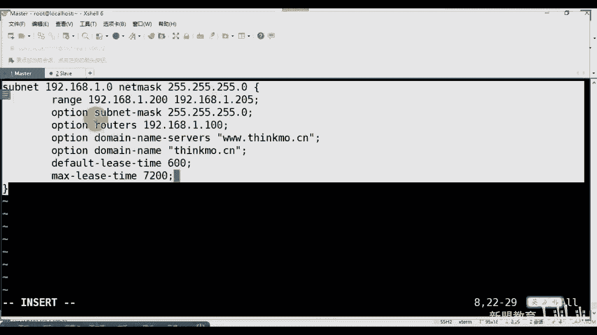
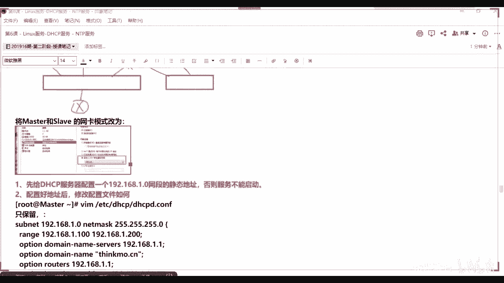
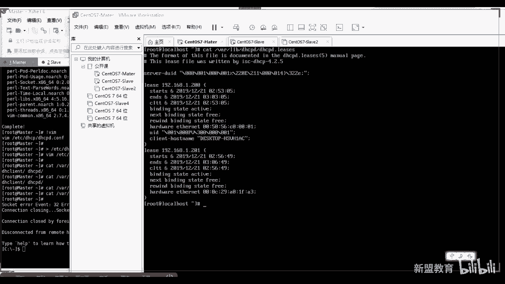
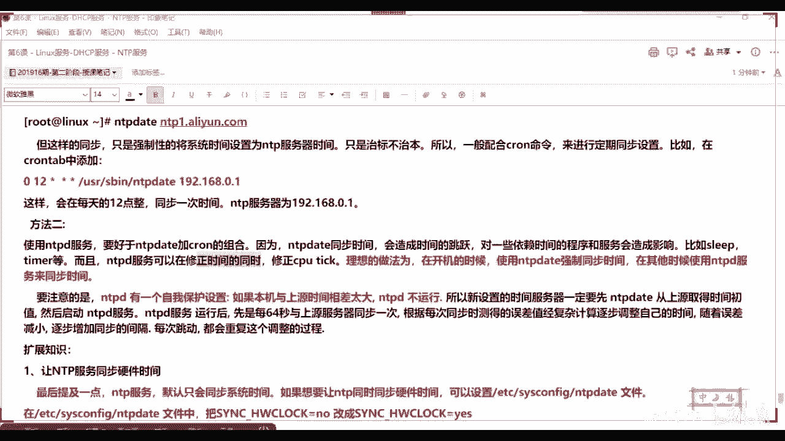
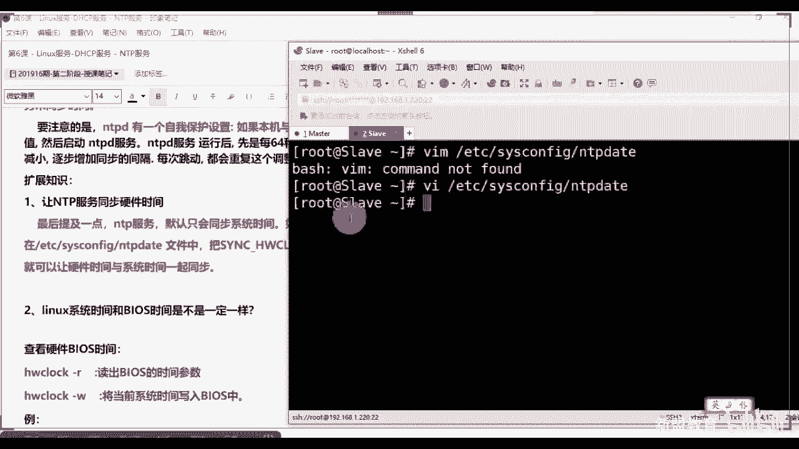
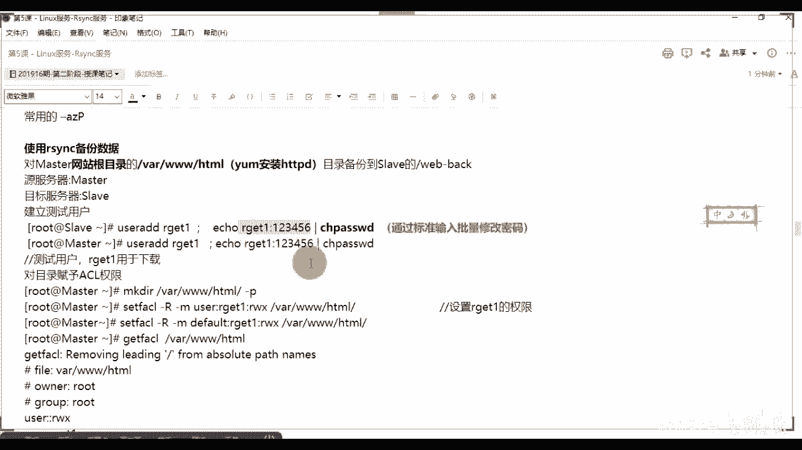
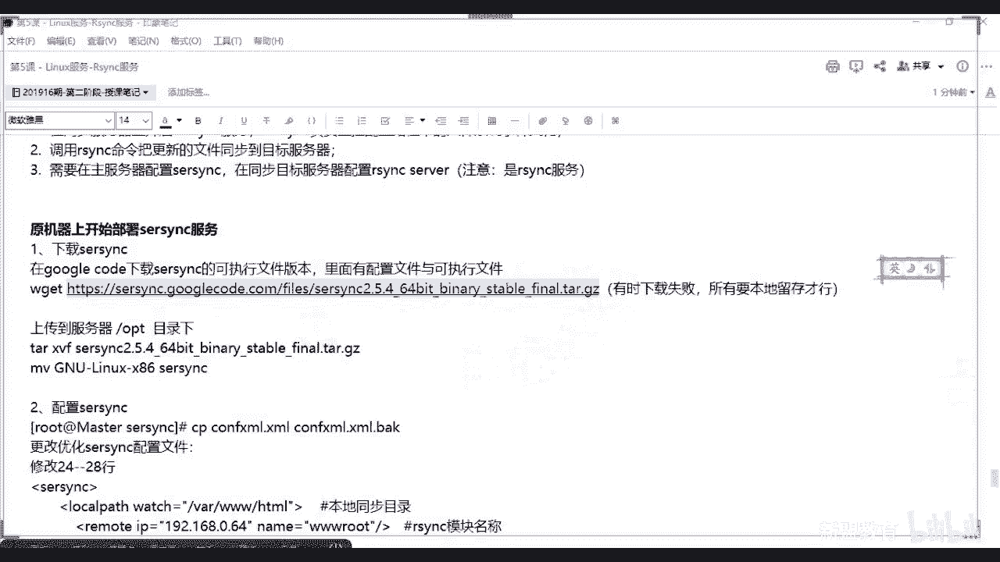
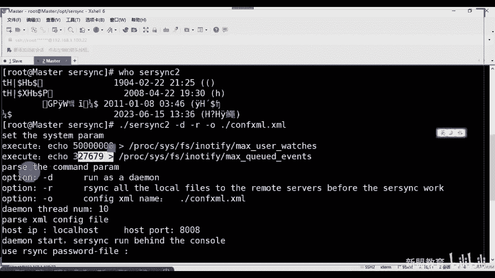

# 2021最新Linux-RHCE运维实战课程 - P6：RHCE-第6课-Linux服务-DHCP服务-NTP服务 - 新盟教育 - BV17K4y1t7XR

。

好吧哦，我们稍微等会儿其他人啊，我把录图新打开好吧，然后呢，我们把这个地方改一下呃，它的网卡地址，maxwarescript XFG杠眼。好。等一下啊，改成我们的一直在加班是吧？okK稍等啊。

我把它改一下1。220改成1。1。好，然后冲启一下网卡。走。好了呃，我把这个也拍一块照啊，这个因为因为之前的时候呢。在公司怪公司的话，我一般就用那个啊，这个在家里呢在家里面你讲的话得也得把地址换一下。

不一样。你也是连着三周了是吧？呃，怎么说呢？就是我能体会到大家的困难，知吧？我也能体会到大家的困难。因为我也是我也是从打工过来的是吧？

但是总的来说呢，你就自己打控时间是吧？或者说呢自己去打控这个这个这个这个。

呃。一个是你自己把控时间，一个是自己把控精历。好吧，那天有同学问我老师，哎呀，为什么为什么那天谁问我啊，我看那来了吗？问题啊，那就草花神在肯定厉害啊。😊，那天有同学问我哎，说我呃我想学。

但是呢我又没时间学，然后我就说那你这个那你每天几点回去了，他说每天回去的时候就不想动了啊，不想看了又那我说你这还是没有决心学好啊，是不是要有决心学好，你要说现在的工作不舒服的话，你肯定难受，你难受的话。

你还不学好，那我觉得你就是不难受，是不是啊？所以这个东西看大家一个情况就是没有说呃什么东西是一帆风顺的，先把心态呢摆正了啊，或者说先把决心下定了。我觉得很多东西。😊。

还记得我在一开始给大家定个公式吧，我说做好一件事情的首要的先决条件或者核心就是你有没有决心。在决心之上的话，才会谈到所谓的努力毅力的问题啊，呃，决心没有决心的话，什么都不谈啊。

来看啊呃上午的课呢一般我都会讲的比较简单一点的东西啊，呃现在是做大数据，现在还在学习这个，因为工作上要用这个时间真的的时，我当然明白啊，我当然明白呃，怎么说呢？就是但是他前期的很多东西都穿插着的。

包括ELK等等的东西，对吧？它都是穿插着的。其实其实运维的话啊，包括云计算也好，大数据也好，还是运维开发也好，这些东西都是相互之间有关联的对吧？有关联的，一通百通嘛，我觉得东西呃。

大家学的是一个运维的逻辑，不是一个死东西啊，那么上午讲的比较简单。所以我们讲的是一个DHCP大家其实应该都用到过这个东西，对吧？那么DHCP当中有一个特别重要的东西叫做。😊，叫做I不啊。

叫做叫做DHCP服务器的工作原理啊，大家把整起来。因为很多的呃公司里边，你在面试的时候，他会问到你DHCP的工作原理啊，那么包括DHCP的话，其实跟大家说一下啊，呃我建议各位的话啊。

其实一般除了你的公司有明确的要求，或者说哎在内网当中要求你去做一个的话，除此之外，陆平啊，除此之外啊，一般都是通过我们的路由交换去做的啊，路由交换去做的，即使说当好了，即使说。😊，你的公司告诉你。

你必须用我们的服务器去做，那我也建议大家用的是windows server，好吧啊，老师，你不是不学windows server吗？为什么？那么像一些个轻量级的服务。

你比方说像我们讲DHCP像我们后面讲的DNS对吧？甚至说我们后面还会讲什么FTP等等啊，好同学们，我一般都是建议大家通过windows去做，为什么你通过点击啊，对，什么邮箱，你通过点击就可以了。

即使出了错排错也是很快的，你不会像是linux里边，我去排错的话，我还通过文件啊等等等等等去看，对不对？但是linux呢你也要会啊，linux你也要会啊，所以。😊，后边我们主要的还是以实战为主啊。

两台设备，一台设备啊，我把我把这个这个IP改一下是吧？1。100和1。200220。对，有些域环境就要跌，没错啊，所以你结合的是这个这个windows server里面叫做AD域去做的对吧？是不对？啊？

因为它其实能够配一个叫做域域名啊，域和域名都这么配啊。那样看呃呃什么是DHCP。😊，四个单词是吧叫做dynamicnamic host configuration protocol叫做动态主机配置协议啊呃呃像私有服务器初始化到业务都是D2CP一开始是的。

到后面都是，但是后面一定要改成那个这个静态的啊啊接下来那么它本身的作用，大家记住了，它本身只是一个局域网的协议。也就是说你要说在公网里面你能用吗？其是不是不能用啊，只是我们更多的情况下用在了局域网当中。

本身的话是基于UDP协议的。对了，本身是基于UDP协议的。哎，中继后面会讲的，那么两个用途。第一个来说给我们内部网络或者说内部的终端什么PC啦，什么主什么什么什么server啦，什么一些个防火墙啦。

什么一些个ID安全设备了。好，我去自动的分配IP地址啊，并且也可以去分配域名分配我们的DNS服务器，分配我们的子网研办等等这些网卡信息啊。第二个来说，我也可以去配合我们其他的服务器。

实现我们集群化的管理。例如我们下后边啊名片子的下下节刺刻啊，讲到叫做无人值守。那么这里边叫做P叉E啊。当然后期的话我们还会学到一个东西叫做co。😊，啊，还出来一个东西等coer，呃，两个都是无人值手。

只不过后者会更困难一点啊，当然也更好用一点，它可以去做windows的啊来看。好，那么包括我还可以结合其他的服务器，你例如来说它好了。像我们呃上面跟大家提到过的一些个呃基础的，你比方说像NTP对吧？

像我们的TFTP还有吗？像我们一些个这个这个这个呃呃呃像我们的P叉E启动，对不对？这三个我都是可以通过我们的DHCP去进行下发他们服务器的IP地址的。😊，啊进来那么其实这些给大家好了，像NDP也好。

像DNS也好，其实你的路由交换也能去做啊，也能去做。那么但是它的特点啊是1个4S的模式，也就是说当好了，我DSCP要求的是我有服务器端，对吧？我的客户端，实际上就是你的网卡。进来，实际上就是你的网卡。

😊，大家知道网卡的话，我获取IP，我们改成了stistic，对不对？那在改static之前，它本身是编制CT的对吧？啊，那么自动分配IP的目的是让你便于管理。大家注意了啊，你举个例子。

你们都去星巴克对吧？或者说都去商场，那么商场里面都会有wifi啊，不可能说老师我进商场之前有个人。😡，或说呢有一个我们的网络管理员。干嘛呢？给你配分分配一个固定IP是吧，把你手机拿过去给你做。

然后你走之后呢，然后你走的前之前还得给你取消掉，是不是这样便于便于管理吧。😊，肯定浪费了时间人力，对不对？所以呢我们通过都是DCP下发，并且注意了，这个DNRCP我是有时间的概念的，什么意思？

就是我发给你这个IP址，你能用多长？这个时间我们叫做租约，大进来。啊，叫做租约。那么租约有两个，一个叫做最大租约，一个叫做默认租约好，默认租约是我发给你这个ID地址你第一次使用的最长时间。比方说老师。

你能使用5分钟。那么5分钟之后好了啊，5分钟之后，我这个东西是会会被回收的，重新下发IP的。那至于是不是你这个老IP啊，还要是要看这这个当前的互联网当中的均网登录情况的。一会儿给大家讲到啊。

我们租约续约的一个过程。好，那么DHCP不会同时租借相同的IP给两台主机。但是带好了，这个只是存在于我的局域网中只有一台我们的DHCP。看到了，如果说我此时局网当中有多台DHCP。

并且这多台DHCP我们下发的是同一个网段。到了此时我们两者之间是没有交互的，导致的就是我可能会下发相同的IP地址，能理解吗？来临传意。啊。哎，所以你要注意啊。

所以呃这就是为什么大家说老师我要是在虚拟机里面滴搭个HCP，我都不在百U不能啊，是因为你本地你自己的那个路由交换是具备的啊啊，那么。😊，呃，你也可以干嘛呢？比方说老师我的公司里面是吧，我们的公司的头啊。

他这个网他的电脑我们一般会特定的规划出来那么IP地址去使用。那么这个就需要我们的哎去绑定。我的麦克和我的IP名。两者是要绑定的啊，对了。嗯。这样看，那么也可以为DS每1个DHCP作用域设置很多的选项啊。

你比方说老师我有的域呢，比方说我配置了网卡网关是吧？哎，网关配置了掩码，我也可以配置DNS等等等等。哎，来了，刚刚等等等等。那么客户机在不同的网间移动，不需要重新配置啊，它都是自动获取的每一次，好吧。

每次都会自动获取。那么缺点就是说过了啊，有多台的时候会冲突。就是啊有多台时候会冲突，他们之间不会跨路由的与客户通信啊，对来。好，端跑这不我说了，大家好了啊，呃，67和68大家来67和68啊。

两个都是基于UDP的，好不好？那我们来看一下啊，这里边会提到一个东西叫做 booty啊，叫做 bootty。😊，啊，这个东西呢你可以把它看作是我们电视CP的一个前身啊，在电视应应用之前。

我们就叫做putoting。好，那么这个记住啊，呃等于说它是D它是DCB是它一个增强版。好吧，我们这个代表的服务端口啊代表服务端口，而不是啊PC代表的是客户端的端口进来。哎，我们说CS模式嘛，对吧？啊。

CS模式，那么其实来是蛮好了。其实来说我们现在最多的哎你是看不到68是吧？只要你开启之后，我应该看到是67就给自己这个端口就行了啊。哎，后边我们讲到的服务那好了，但凡是讲到的服务，我都会告诉大家。

默认的端口，因为这个都是我们在面试的时候，或者说是你的常识性问题啊，你要是不会穿不过去啊。😊，好不好？而bti法协议叫做引导程序协议拿起来啊，这个实际上就是一个。无盘的启动无盘启动之前跟大家讲过吗？😡。

这子，什么叫无盘启动？😡，或者有一个老网卡系统。啊，P叉E对卖？啊，P叉E之间会用不到啊。哎，我实际上是通过什么通过麦克地址找IP是不是啊，通过麦克地址找IP这是因为那好了。

这是因为你们在客户端上本身不具备硬盘，就是网吧里面啊。当然有的公司的话，我们会做还原精灵。😊，啥意思呢？就是我下游的客户端，我是防止你去下载杂七杂八的东西。所以我会在我的客服务端做一个叫做还原精灵啊。

这是我们常的网管工具。然后呢，你下班了重启机器。那你下一次的连接我的时候，你是通过网卡来找我的。那么把你自己下载东西全部清空，理解了？😡，那么但是它会有一个缺点啊，就是你在设定前的话。

需要事先的获取客户端的硬件一地址。我说了是不是通过m克地址啊，对不对？而且好了，mike地址和它必须是相对静态的，也就是说要进行一对一的捆绑，能理解了吗？理史刷意啊。所以说哎。

如果你这台电脑不是在我们登记情况下的，我新拿了一台电脑，我能连接吗？我压根儿连不接不去进去，理解了吧？同志们啊，对了。😡，好，所以我们接着看啊。

所以DHCP是通过一个租约的情况或租约的概念来进行管理我们IP的自动下发和回收的对来。😊，好，所以重点来看这边啊，重点看这边。😊，看什么呢？看我们的一个运作的原理。我说这是最主要的啊。

那么首先的话答好了，哎，发起者是我的客户端，而不是我的服务器进来。发起者是我的客户端，而不是我的服务器。原因很简单，我的客户端当我连接到局网之后，我会广播去发送一个叫做DHCPdicover。啊。

叫discoverdicover应该不用我翻译了吧，叫做发现是吧？哎，我用来去发现我的这个DHCP服务器的那么大一个问题，如果我的局域网中我们有多台DHCPserver好，我请问我们以谁为主？

以谁为主啊？😡，小佳。以身为主。小想，我有多台电视CP对吧？我广播了哎。😡，吃饭。户为主啊，没有湖为主的啊，记住了，还是以我们谁首先回应过，哎，没错第一次响应的第一次响应的谁快，谁就是我的福务气。

明白了吧？谁快，谁就是我的福务气。没错啊，所以呢我们第二个CP当收到了discover之后，我会向我的客户端去回复一个叫做offer啊，应答是吧？offer。😊，好，那么客户端收到offer之后哦。

有原来我的局域网当中有DHCP服务器。好，那我会继续向你去发送一个销的request请求了吧，我是不是也请求了啊。😡，哎，进来。好，那么请求之后呢。就之后呢，我的server要进行一个确认啊。

大家请你们注意，基本上所有的我们的路由协议，网络协议。有没说的啊都会经过request啊，都会经过ACK好了啊，都会经过ACK请求既然有请求，我就有响应确认，明了吧？哎，请求和确认ACK叫做确认包。

接来啊，那么上面这四个过程是第一次连接。那老师当我获取到了IP之后，是不是我一定会面临所谓的租约的问题？也就是我的IP到期。好，那我怎么办呢？我是需要从头再来一遍吗？我是需要从头再来一遍吗？记住啊。

不是了啊，你是要进行没错，叫做续约，就跟你们租房似的，知道吗？租房似的，我不可能老师，我今天租房到期了，然后呢，我重新再找一家，我接着去租，不会吧，而是在租约并，而是在到期之前。😡，好。

我们要向我的服务器进行请求，对吧？对不对啊，想想啊，你不能到期才请求，你肯定是之前，对不？同志们啊，并且此时我会发送三次request，只要在这三次应答之前干嘛呢？比方说你给你的房东打电话。

结果房东今天有事没接到是吧？就打第二次啊，第二次房东又没接，打第三次，第三次还没接，你估计你们家房东失踪了是吧？啊，本身人道主义不能霸占他的房屋，所以你得还给他，理解了同志们要重新discover啊。

但是三次之内房东接了，告诉你接着租吧。好，我们就确认了明白了同志们啊，也有可能哎告诉你，你那个换个换个门牌号，我告诉你，我们家有三栋啊，有三栋房，你换个家住吧啊，明解了吗？😡，进来啊。

那么这里边有两个数值大家进来一个是50%，一个是87。5%起来啊。可可以的，一个叫做50%，一个叫做87。5%。好，一会儿我们会讲到这两个值啊，50%的话，当好了，是当我的IP啊使用了一半的时候就是。

😊，这个租期到一半。我就会去进行请求啊，但是如果请求的时候发现我这个冲突了，那我就会再等待，知道吧？达到87。5%的时候再去请求啊，不着一会儿会再给大家讲一遍这两个数值啊，先把这两个数值记起来。😡，啊。

然后往这看对吧？这个的话我就是通过一个文字的方式给大家去讲解了啊，一个是DCP client发现阶段，我去广播发送我们的什么广播包啊，广播包都可以写吧。😡，我之前给大家讲过啊。

就是我们在呃发送我们的数据报文的时候或发送数据包的时候，我们有三种方式分别是广播是吧？广播就类似于QQ群聊好了，还会有我们的主播或者也叫做多播，我们管它看作讨论组，对吧？咱就Q有讨论组先在没有了是吧？

最后一个叫做单波。好了，这是我们的私聊。😊，sorry啊。饲料。好，那像早期的话啊早期的话，很多的协议都是一开始我要进行广播的，对了啊？我要进广播的。也就是说哎我会发送所有人。

比方说哎谁叫什么什么谁叫张三是吧？张张三听到我之后，知了，我们一般是要单波回复的啊，别张扬是吧？张三小姐，哎，老师说我别被张扬是吧？我是张三啊，找我什么事知了，那么广播地址全网广播。😊，就是25。25。

25。25大起。啊，跳个广播地址最后1个IT地址提来。啊，当然你说我们当然在公司里面更多的接触叫做Vline是吧？叫做虚拟局域网好了？虚拟局域网的作用就是隔离我们的广播域啊，我会将你的IP址做分段。

每一个分段都会有自己的广播域啊，避免了这这个一台被攻击，其他台都被黑掉的情况啊，对了。😊，那来啊，那么当我discover的时候，请你注意了啊，这里面就会有一个问题了。

就是你会发现老师有的时候我的客户端会回随机的获取一个叫做169。254。0。0-16的IP。😊，好啦，那么这个IP是什么？是当你的本地没有DHCP的server进行响应的时候，你会获取到。当然了。

早期这个IP地址，我们只在windows里面去用啊，早期只是在windows里面去用。但是现在我们说windows和lindux已经慢慢做融合了。所以的话所以话现在我们的在linux上也是有的啊。对啊。

不会，我不到过，我们预上城啊，不会的不会的啊，都是内网的，知道吧？整个局网当中的。😡，不会广播到广这个广域网上的啊。我包我与网没有太大关系啊，比如说。😡，好吧，大家进来啊，这个的话。

我们lindux上也会生产出来啊，就是现在的话也会生产出来列边和lindux和windows所兼容。可以看到吧？这个我不知道你们自己有没有发现啊，你们可以自己看一看去。😊，好吧。

然后后面的话也就是我的提供阶段是吧？DSCP的offer啊，告诉你，我能够提供给你IP是不是？然后后面请求，最后的是我们的确认，好吧，来进来。😊，对李太网啊。还拉进来。

所以这个地方的话呃应该不用我多说了吧，可以的话，双要一上来来啊。这个段文字的话，需要大家自己回去再再研再自己仔细的看一遍啊，再自己看一遍啊。第二CP的原理请背下来。😊，啊，第制CP的原理准备一下来。😡。

背下来啊，之前的话有同学们去去面试的时候就被问到了啊，说还好讲了是吧，还好讲了。哎，这是一个过程吧，大家可以自己去看一下啊。😡，啊，自己去看一下。那往这看，我在安装DHCP的时候啊。

我在安装DHCP的时候呃，几个包大家注意了，一个是commo是吧？这个是包含了客户端和服务端供需的一些个文件，你比方说像我们一些点H啦，点C了等等，是不是？第二个来说的话。

叫做DHCP client是不是然好了，哎这个不用不说了，客户端，然后服务端是吧？当然我们现在一般来说不装这个是吧？或者说自动已经默认装了，然已经不装了。😊，啊，安装的软件名称DHCP当好了。

此时这个软件包是没有低的。此时软件包是没有低的啊。啊，来看我们来安装一下，你看看试试啊，在主上装是吧？亚么因斯store杠YDHCP注意了。如果我更个D，它会报错，告诉你没有。

啊，会告诉你没有看一下啊。😡，稍等啊稍等看看他有没有啊，有吗？看一下啊。😊，不能。走走呃，回家走走走。看看同志们。好，看有吗？是没有啊是没有啊啊，没有啊，哎，你也可以RBM，你去抓取一下。

是不是RBM杠RVRRR什么东西啊，QA是吧，去抓取一下我们的啊，所以你要装的是DHCP进来。😊，这就快了吧，Iish是安装啊，看这就有了啊，一有5个包，大往这看，分别是我的DCPcommo所依赖东西。

还有一个叫做libraries，这个是专门给你列举出来一个我们的库是吧？一个库啊。😊，bin的export带好了，bin的是啥呀？😊，病的是啥呀？😡，b的啥呀？哎，b的是我们DS啊DS啊。

所以DN个CP和DS一般都是结合去使用的。尤其在你们那个那个内网的AD域里面，有时候去结合去用的啊呃新版的有5个包是吧？5个包啊，重点的是一个两个3个就可以了。😊。

啊，当我们完成之后，当好了，我说了，所有的服务三步安装调试启动调试是最核心的。其配置文件记住了啊，在我们的哪里呢？在我们的EPC下，要么安装一定会有一个同名的目录，叫做DHCP到好了。

RRPM安装之后怎么查安装到哪个目录下啊，一般RPM安装也和它是一样的，知道吧？也和它是一样的，对了，也是安装在ETC下一般。不行，你就fin一下是吧？一会儿我们讲我们讲放 fund吧比例吧。啊，看了。

那么在第二个CP底下的啊，大家看一下，我会出现那么几个目录和文件。那么大家默着一看就明白，老师，这个是我的主配置文件，对不对？一般以点confi结尾吧。😊，6不用我说了，这是DHCPFV6的。

是不是啊FV6的啊？那么一般客户端不用做啊，不用做啊，脚本什么的也这不用管是吧？那我们来看那老师我们来看一下，看一下我们的DHCPD点confi。😊，好，你来看一下。大家可以看到吗？那么在此时的话啊。

我们一共有5行是吧？这五行还都是注持行啊，他会告诉你的信息，告诉你什么嘞？请你去这个位置啊，这个地方这个文件叫什么？叫做我的模板文件好，你可以把这个地方的文件。

当同志们user下share下doc下会有一个DHCP好，我们会有一个文件啊。😊，去哪儿考过来。对，没错，告诉你去这个位置考过来，知道吧？啊，一般来说是我们4。2。

5里边会具备一个DHCP点儿comfor example文件。我要把你复制到本地啊，复制到本地EDCDHCP好吧，叫它DHCPD点confi。你要覆盖它啊覆盖它。但是大家注意了，此时不要去启动。

你启动肯定失效，对吧？因为这里面的IP地址还什么跟我并不对应啊，跟我并不对应啊，我们只给大家介绍几个重点的参数。

啊，这个参说。走。啊，安装上VM吧，就高亮是吧？

而他。大家呢可以看到，问的问你啊，知道我刚刚用过这张冰队什么意思吗？😡，喂。稍等啊，先把它装完了。啊，这个有的有的文件是需要网上的啊，这层稍等啊稍等啊啊，装上我们再说。😊，嗯。知道好。

这条命令什么意思啊？😡，第二遍的什么意思啊？就掉。葫芦刚铁的CT。什么意思啊？😊，什么意思啊？VM补什么呀？什么呀？这是。啥意思啊？啥意思？记住啊，是调用离你最近的VIM刚三的命令。😡，看到。

幕后VI我的哈，他会写什么？我是执行了这一条，看到没有？😡，看到没有？这条是不是我刚刚在历史当中离我最近的1个BM啊？😡。

哦哎，也是调取离你最近的啊VM这条对点。好，那往里边看这里边啊那好了，那么在这里面的话，我们会分为三个部分啊，哪三个，一个叫做全局配置。😊。

我说看啊一个叫做全局配置，一个叫做我们的哎没跟你列说啊，一个叫做局域配置啊，局部配置全局的话不用我说了吧，就是我们所有的域里面都可以用，对吧？而局部配置只有特定的域里面都用。😡。

啊。好了，现在写的代表着option。😊，domintable知道了？这个就是域，这个是域，记住玉和域名是两码事儿，知道吧？玉和域名是两码事。好。

那么一般这个位置我们一般都是结合这个这个windows的AD域去做的做预控的。啊，到by对不service当好了，这个才是DNSserv。😊，啊，这个才是DS server。哎，指定你们的域名是吧？

接着来说，或者说你的主机名，然后if last time的好了，这是什么你的租约。😡，好了，这叫租约吧。max最大租约就是当我收取返回这个IP的时候，发现这IP冲突或没有用的时候，你就接着你去弄，是吧。

就接着去用。😊，啊，我他。哎，在哪了？这么课。好。他这。哎，跑到底下来啦。😊，好走走好，往这看啊呃保证看啊，这个没有什么东西，可说啊，这是日志的，这是日志的这个这个这个格式或日志的等级啊。

这一般都不做修改啊subnet。😊，呃，闲来可不可以讲讲微软的域也可以。但我其实微软的域我并不熟啊，对吧？因为微软域大家都明白，就是我只要打开一个windows server之后，它其实告诉你。

你比方说我要安装什么东西，你直接下一步下一步，他会给你帮你去安装啊，这并不难好吧，难道是你就是域的话，你就是给它定好了。比方说我有台域上面设置了域名。🤧然后我还得把其他的设置进来是吧？

设置进来之后不好意思啊啊，设置进来之后。😡，啊，对，就是什么为什么怎么使用是吧？一会来说啊一会来说啊，老家看。那么重点呢是在这个叫做sumbernet里面来好了。subummernet是一个模块啊模块。

那么底下这个地方告诉你我分配的网段儿，那网段的话，我拿什么去区分，要拿掩码，对吧？所以后边跟的是掩码，知好了？net mark叫掩码，哎，没错。😊，啊，那么每一个括我们都要用大括号括起来啊。

都要用大括号括起来。并且记住每一个参数的结尾是要用分号结尾的，看到没有？就注意啊，两个点啊。好，那么里面的话，我不可能说把你整个网段做下发，对吧？也可以做什么下发啊，但是你给范围。李比朱老师。

我当前预下只有10个，那么我们就要给个范围啊，从10到20的好了，此时告诉我下发的话，我能够跳着发吗？😡，老师，我发十发十5发17能这么走吗？😡，能吧？不老大不老啊。

这个下发的网状一定是连续的啊一定是连续的对吧。optionrouterors带好了，这个用option表示的是其他的参数，routers表示的是网关啊，网关呃，还有什么嘞？它brocast。

这是我这个做了一个小的哈是是吧？做了一个小的网段，我就指定出来它自己的。😊，广域广播这个广播域啊，广播域好，再往下我们的域名是吧，以及我的域啊，默认的租约和最大的租约可以看到了吗？来看到上音。😊。

嗯。

好，当然还有很多啊，你比方说像hel有同学们fi name是吧？fi name一般来说我们要指定某个文件啊，我们一般来说到了后面讲的P叉E，它要指定我的P叉E引导启动文件。对吧啊，移到系统文件。

包括还有一些其他的，比方说NTP serverNTP server指定我的时间同步服务器，像我的next server指定我的TFTP服务器啊，域名是不是包含主机域名？😊，呃，主机域就是除名字外这一块。

没错。没错啊，就是整个的啊就是整个的。你比如说我的老师域叫什么？域叫做think点com。我的域名呢就叫做3W点think点comBBSthink点com对吧？😡，啊，那么此时呢好了。

我们用这么一个方式把这个文件清空啊，把这个文件清空。😊，第二CPD。这样看过发出了，这种方式是轻态哈就没了，看到没有就没了啊。😡，那么我们要做的很简单，就是自己去配置一个是吧，自己去配置一个好了。😊。

啊，所以我们上来subnet我要下发了1卷点168。1。0是吧？nt mask25。25。25。0。啊，这是一个标准的CV网址。啊，先到到这儿。那么第一个来说，我下发的范围192。168。1。100。

我变个100了，给个200是吧？啊，高多少呢？到我们的192。168。1。205，我给了5个IP啊。好，那么此时好了，你也可以再写个option叫什么嘞？叫做subumnet杠m25点。😊，25。25。

0。可以重新标识，我甚至可以把它变成252。😡，理解了吧？甚至我也可以把它做小范围的好的啊，那么option好了，网国啊rootuter有S当然行啊，roots但这个就会。但是如果你想缩小了。

你要指定broadcast是吧？叫做果国玉。😡，那么这个会涉及到另外一个概念，在我们如果学过网络同学指导是吧？什么概念？什么概念？叫做叫做叫做VLSM叫做可变成子网掩码。

知同志们目的很简单，就是节约ID的啊，把我们大的网段哎，我们均分成啊，把大网段划分成。小宝宝。对吧啊对应的叫做CIDR叫做超网。啊，叫做抄网，这个是做来汇聚的，大家啊。抄网。啊，这个是汇聚的小伙伴。啊。

变大脑段了。啊，记住啊，这两个方向别反了，好吧，一个是划分，一个是。一个是汇总，好不，拉进来。哦。

呃，就是说啊就是说哎，所以到这边我们指定下192。168。1。1是吧？但是我如果作为D视CP，你要指我自己啊，那我是100好了，分号结束啊。啊，别烦了，CADR是做汇总的啊，VRM4M是做划分的啊。好。

这后下到了option。好，我们再给一个叫做do面。😊，那么。ser迟到了，s已经有S啊，两个S啊。好，我的域名3W点think点comm。找CN吧是吧啊，你也可以跟个域是吧？叫做option。😊，啊。

这吧刀呗。name是吧，粤think点CN。啊，过点神大家此时注意一个问题啊，为什么不让你重启？为什么你原很简单啊，明白了啊啊，记住意一个问题啊，为什么我没有让你重启？

是因为如果你的DHCP不具备我的网址的话，是你或没有这个网址的话，你是没有办法启动下发的，所以就是会报错，了吧？就会报错啊啊，那么再往下还有什么来着？

就是我的defast杠last time LEASE time对吧？默认单位是秒，记住默认单位是秒，所以我们一般给它大一点的话，比方说给个600秒啊，600秒是10分钟是吧？哎。

那么max杠LEASE time。😊，啊，给他一个双倍，或者给他大一点啊，7200啊，7200的大家来。都是秒啊都是秒，好不好？那大看其实这到这一步为止，你迭着CP已经配置完成了啊，已经配置完成了啊。

看到没有？

啊，那么在这个里面的话需要注意一个啊，我说过了，一个是定义全局的，我这就不多说了啊，剩下lets time对吧？单位默认为秒，以秒为单位对来。😊，住院。啊，那么50%和87。5%，这两个数值出来了。

看好了。当我的工作站除了在开机的时候，会发送request的请求之外，那我的租约到达一半。啊，这不就50%了嘛，对不对？租约到达一半的时候，我们继续会发送request。如果此时得不到我DCP的响应啊。

得不到确认的话，那么我工作站其实还是可以继续去使用这个IP，对不对？也没到点吧，没到时间的。但是如果我的时间过了87。5%。😡，啊，我干嘛啦？😊，啊，如果客户端仍无法与我D着CP连接上，那对不起。

我只能换租了，理白了么办？哎，我就会与其他的DHCP进行通讯这。😡，哎，去别的地方浪了啊，可以可以可以啊，别来进来。😊，好，了解了啊。那往下面看啊往下面看这个不用多说了啊，我们的最大的租约是吧？啊。

定义客户端最大租约。当客户端超过租约时间，尚未更新IP的时候，我们最长可使用的IP的时间。😊，拉家来。呃，日志类型对吧？然后subnet定义我们的作用域。那么这个地方有个域，不要不忘说了啊，然好了。

那么作用域就是由我的subnet去做的。也就是说我下面下发的地址是吧？有哪些这叫作用域啊，地址我下发的给客户端的这个IP有哪些range负责啊保留地址，这就是我们需要特定的去配置，用host文件啊。

用host去配置啊，租约啊家可以理解了啊。😊，好吧，参数什么就不多说了啊，参数什么就不多说了，给个录例这是个例子啊，这个例子你看到吧？听看到吧？进了啊。😊，对吧。好，接着往看啊必须用我们聊了网络号。

必须与我DCP服务器的网络号相同。这句话其实呃没什么可注意的啊，这话没什么可注意的啊，但是我列举出来了。啊，我跟你说啊，这个指的是你的下发的那内容啊，必须相左啊。啊。

每个含义range的起始叫什么option。这个是遇这个这个第这个网关，对吧？do面域dobin nameserviceDS服务器啊，这DS服务器。

租约当了，租约的话会有一个额外的文件啊，实际上我会有一个额外的文件，叫什么呢？在ra下liber一下，丢着CPD有个DHCPD点leing。😊，啊，lics。那么我们来看一下啊，来看一下。😊，好。

保存退出。CD冒下lob下盯着CP到了CP。D的确看一下第lics看到没有？但是此时你告诉我有东西吧？😡，对，是要在同一老段啊，这叫做有东西吧。😡，有东西吧。没有为什么没有？😡，为什么没有啊？😡。

为什么呀？没启动下游没客户端请求，理解了吧？啊，没启动，下游端没有客户端请求啊，空的知道吧？啊，理这好，所以注意啊，那么我们上班的时候，其实是为了方式演示的时候，其实应该再添加一会网卡啊。

其实应该再添加一会网卡了，明白了吧？呃，只不过我们的为了便于方便，我们不做那么麻烦东西啊。看志们，我们就直接把我的网卡换成D人CP可以吧？😊。

啊，把我宝卡换成换成我们的其他的地方设置一下啊设置一下。好吧，哎，你本地有网卡，你本地也标要了，你们有个家用路由器呢，你不冲突了吧，对吧？啊，可以把YY改一下，我们换一个自定义，好吧，换成呢我们换成。

😊。

金主机模式吧，都是换成金主机模式吧。

啊，这个也换成金主机模式，务必保证两个在同同步呃同等的网络状态下啊。

如果给特定的文栏画多个给多个suburnet知道吧？给多个suburnet。稍等啊，来金主席博士。

蓝序定。两个大别着急。啊，看这个地方啊，比方说我的公司要求，大家可以看一下公司要求对吧？使用客户段为这个地方，剩下的为保留地址。要记啊，桥街也行，桥姐也行啊，但是你和本地会冲突啊。😊。

哦，他说再进来啊。😊，啊，我有一个保留的地址啊，有一个使用的地址，看到没有？看看完了看看呃，此时的话，这个图你们可以自己回再看一下啊，这图画再看一下，这个是我设置了多块网卡的，能理解吗？同学们啊。

这是我设置多块网卡的。我让我的桥接，这是我家里面路由器，我不用这一条，我是使用了这个。😊，服气能理解了吧。对了啊，这是。这个啊，所以本地有两个的时候，我用的不是不同的网卡去连接。啊。

重新画一下我重新画一下啊。好了。好，设呗，这个其实是你的主机，对吧？同友们，这是你的物理机器。物理设备上呢我会划分出来两个我们的讯机VM啊，这么画应该。准确点啊，VV看到了。此时的话。

我因为用的是你的网卡好吧，我用的是你的网卡。😡，啊，不能是网卡啊，我是桥接没问题吧，同志们。😡，我说乔街吧，所以我连上你我连上你，我就相当于把你的网卡看做一个交换机，我们再去连接我们本地的那台路由器。

路由器用圆圈表示啊。注册啊，你比方说甭管是TPlink还是腾达还是华为的，都无所谓。那同说这个里面我是不是要使用电视CP啊，你加入是不是有电视CP？能理解吗？到这儿可以吧？😡，啊，哎。

但是如果说如果说那好了，如果我们又把它上边搭了个DSCP。😡，啊，于是乎我说了这个相当于一个交换机啊，我的物理机器我也连在上边。你告诉我，我们现在两个第NCPU，我是不是冲突啊？😡，是不是冲突，对不对？

那咋办？😡，那咋么办？很简单啊，我们再给他们多一块网卡，这块网卡的话叫做叫什么？在这儿呢，叫做VMV的4。😊，啊，后对面那个一是吧？哎，我让他连到这个网槛上了。😊，啊，然后连刀整这网各位，这个网卡到了。

是跟外边这段是隔离开的。😊，明白吧？是跟外边这段隔离开的，明白了吧？😡，啊，是隔离开的。所以我们这里边接是CP，我就不需要顾及我本地的问题了。能理解了吧？能理解了不？😡，嗯。啊，就了啊啊。

所以是这么一个意思啊。好了。😊，对，Y6一是一个虚拟网卡，没了吧？嗯，进来就可以了啊。😊，看到没有？这地方你可这么改啊，所你们都列举出来了啊。😊，啊，6出来了啊，一个还同志，一个改成了DCPVMn4啊。

进在我们都VMn4啊。😊，额外天天网卡之前前面是不是学了呃，学了？其实啊呃我没有给大家讲天天网卡，为什么？因为你物理计算你不需要做啊，因为你添加网卡之后，我提过一嘴，我说了你要把那个UUID改掉，对吧？

改麦克我说过了，你复制一下就可以啊，来看。😊。

好，我这两边都改过来了两边都改过来了，我们只要启动就可以了，对吧？啊，主机上主上只启动，那同志们叫做system CTTLstar，我们叫做DHCPD啊，DHCPD好，报错了。😊。

报错了啥意思啊？那肯定就是我这边配置的问题了。😡，是吧来找找啊subnet1。0对吧？呃，1。20到我们的205RANGEoptionsubnet杠mask MSK是吧optionLUTESDOMN杠nameservice杠name是吧？

DEFAULT。LEASETME哎，没有问题啊。啊。找找啊。找找问题啊，subnet对吧？看一下啊。😊，看一下roots也没有问题，对吧？doin DOOMAINname有没有问题啊。

dooma nameserv也没有问题，rangedge也没有问题啊，subnet呃nmark啊后点subnet杠mark哎，没有问题啊。是吧。没问题啊。Opttion。OP贴O没问题啊。

对吧otion。rige前面不用哦，range置前面不用啊。😡，呃，op时后面没有S啊。😊，对吧DEFAULT杠LEASEMAX杠LESE唉，这都没有问题啊。是吧。那是啥？再试试啊。神经了吗？哎。

看一下啊，如果报错的话，我们看一下啊，只UR杠杠叉而已。嗯，可下啊。呃，我们看下这个位置吧，叫做首网卡的首选项。啊，这有问题这有问题看到？同志们内部serv的3W这有问题，看到没有？😊。

提示你了啊提示你了啊。😊，就是你啦。看没有？😊，在这呢。😊，赶紧看到拍错的思路了吧。😡，和牌头思路了吗？都会告诉你了啊。😡，行啊，都告诉你了，这个问题上什么简很简单，为啥为啥啊？😊，来Allright。

好，嗯把这改了就可以了。啊，3W点think点service是吧嗯。😊，这样的啊。对，找不到这个服务器是吧？找到这个服务器，这是域名嘛，对吧？这地方的话你要写什么？😡，这个是写的DNS服务器啊。

就DNS服务器，所以你可以改成114。114。114。114，对吧？啊，114按写IP就可以了啊，或者我们改成呃本地的，我自己，那我把我自己改成可以吧？啊，1。100。😊，啊，保存住。好吧。

改成IP就可以了。😊，好，启动。看这就可以了吧，同志们night state啊，或者你搭1个DHCP也可以，对吧？哎，啊，默认的话，动口号看到67了吧？能看到67吗？同志们哎，看到没有？UDP的啊。😊。

ok。😊，啊，O。😊，好，然后我们接着来看啊，那我们接着来看。那么这个是这个是我的服务端啊，服务端。那么从的话也就是我的客户端，到了我要去改我的网卡配置。走8个位置改哪些地方？😡，在哪个地方？呃。

拉松嗨刚才的端口68呢，又忘了客户端是68，明白吗？客户端是68，但我说过了，这里面根本就不用客户端，对吧？啊，这里边根本不用客户端啊。好，把这个tistic改成我的电视CP。😊，对吧改成第2CP啊。

打好了，然后怎么样，我要写我的网关是谁吧？网关的话，我要给上我们的100，然后注意了啊，然后注意了，我们把其他的注释掉啊，要把其他的注释掉，保存退出。

大家请问一个问题啊，请问一个问题。😊，啊，我到底什么是网关？来想想什么是网关。😡，啊，很多人对这有概有概念有有有混淆啊嗯来告诉我是设备吗？是设备吗？吓一跳啊，网关不用注持，网关肯定不用网关不用注释啊啊。

其实网关你注持也没关系，网关也可以注持。😡，啊，网关也可以主持掉。

来照导同学们，网关正常之下你也是要注视的对吧？因为正常的情况下，你的电脑里面不可能有网关是吧？好进来。😡。

走，就是这。走。记住一个问题啊，网关实际上是1个IP地址，对吧？啊，实际上是个IP地址，正确来说是你们终端的吓一跳。😡，啊，终端的吓一跳啥意思？吓一跳你要明白啊，吓一跳是我的数据发送到哪下一站。

对不对啊？而网关实际上是我们路由接口上那个实际的ID地址，大家记住吧？实际的ID地址，而网关是具备路由表的。知好了啊，而不能说网关就备路由表吧。准确来说是网关会给我的客户端下发一个路由表，注意啊。

客户端获取到路由表是网关给你的。那么在linux里面大家都明白，老师我怎么看路由啊，我直接敲root就能看，对不对？对不对？告诉我，我只能敲root就能看啊。

这位同志们路上。这么看啊。好啦，那么在windows里面呢在windows里面呢。

在windows里面呢，比吧来windows里面能看啊叫什么呢？叫做print。😊。

叫rooseprint啊。看到吗？打印路由表打印出来了。😡，啊，上面IBV4路由表底下的话IPV6路由表看到没有？看有。啊，常见吧来哈这条路由常见吧，这条路由常见不常见？😊，看见吗？条见吗？这啥呀？

这叫静态路由，是不是或叫缺省路由啊？你的网关是一定要写那么一条路由出去的，要不然到哪儿都不知道了，是不是？😡，OK啊啊，可以客从端，我们重启网卡。😊。

Network， we start。走。等下。😊，重启成功，ifcom一个看一下我是不是获得了200之间的。😡，默认路由和缺省是一个意思啊，默认就等于缺省，知道吧？😡。

看我是不是获取到了我们之前的210啊，我本身是220的，我现在把它变成D2CP是210了，看掩码，看看同志们都都可以吧，来看到上衣上了。😡。

听样了吧？啊，这个就没什么可多说的了啊，这就没什么可多说了啊好，自动获取了IP啊自动获取IP。😊，来接着说啊接着说。啊，就是说啊那么呃我们说好了，实际上就是我把这个位置改成电视CP模式，对吧？啊。

然后把其他的注释掉了啊，把其它的都注释掉了。那么这个是改成了我们自动获取啊，大家都明白了啊，不多说了啊。好，你也可以查看一下我们的root杠N是不是看看路由啊，这都是其他的边边角角的东西。

大家可以自己看，然后来看。😊。

住上。看什么？看这个文件对吧？CD word下lab下丢着CPD下丢着CPD点li对吧？看同学们我是不是就有了呀？看吧啊the format的格式啊和这个文件这个文件对吧？然后我里面获取的东西啊。

获取的是这个网址网段那么开始什么时候开始结束什么时候结束，来看啊，什么时候结束，是不是十0分钟啊，看看我们设置是不是十0分钟。😊。

对吧是不是10分钟600秒嘛，对吧？里面东西看到没有？都很正常吧，210啊啊看。😊。

可以吧。啊。啊租越的信息都在这里面，然后最细都在这里面。

呃，这也叫做作业的数据库啊，我们就不多说了啊。然后绑定IP到了，绑定IP的话就一个东西或一个小段啊，叫host，加上你的主机名，这个主机名你可以任意定义啊，这个主机名你可以任意定义。😊，好。

那么har world指的你的硬件地址。啊，IP绑定出来IP那好了，此时这个IP我们可以不是range包括的。啊，此时这个IP可以不是睿智包括了进来。可以是其他的啊可以试其他的。

那么直不过需要你注意的是，我此时的时候带好了。哎，如果我们查看本地windows的话。

好了，IB confi杠哦。啊，我用的是。看在这儿在这儿。地址看看啊呃，这儿我们的是杠连接，对吧？我们是杠哎，绑定就在绑定啊，就在这里啊，我们是杠在linux里边的话，你要把这个杠变成冒号。😊，啊。

变成冒号就可以了。好吧好，来看啊，那么我们三个东西我们怎么做到了？我只需要在这个subnet记住，还是在subnet这个大的括框里面，我们去增加一个hos。好master哎，然后最大括号。😊。

啊，这两号要配合snet使用hel rule internetnet当到了，这是固定的关键词，你是以太网，对吧？里的固定IP好，给你分配的fixed固定IP地址。来，我们做一下啊做一下。😊。

哎哈啊，为要不。😊，对吧他好VM走。😊，好了在这里面我们去增加一下。😊，啊，去多加一下。这叫什么呢？叫做host，我问一，我们叫做slove吧。好吧，给slove下分吧。😊，哎，大括号画括号坐起来。走。

走啊，对起点啊对起点。那么s up大好了，我前看了看我的麦克地址，麦克在哪呢？是不是在这儿呢？大家可以看到吗？这位置就m克地址。😊，啊，大小写无所谓啊大小写无所谓，好不好？

例招写的是har world WARDWAREhar world。啊，internet。对了又出来了。00冒号0C。啊，冒号29，冒号我们的A0，冒号EF冒号A3。啊，分号结束。

然后fixt杠address。大注啊，faext autodress给个地址吧，192。168。1点，我们给个230。可以吗？看到出，我是不是不是这个地址之类的，来看到我说一。好吧，OK啊。

然后我们重启一下。啊，那我不冲几下。s了我必须呃不是不是那个可以自定义，对吧？那个可以自定义啊，这个可以自定义，为什么我自定义？原为很简单老说我写多个行不行，可以吗？同志们，我不写多个行不行？

比方说老师我再写一个。😊，是吧再给个master，再个大块，理解了吧？这是个标识而已啊，自由标识而已，对了吧？走啊。哎，稍等啊。嗯。🤢，退出来啊。好，重启一下。重击一下啊。

此时让他我们此时网卡再重启一下。啊，code的方卡数一下来if confi见证期迹的时刻到了，看到没有看到没有？同学们。😊。

能看到吗？我是不是变成了230了？是不是变成230了？啊，再来啊，当然了我说了，DNCP你拿你的windows去做就好了，好不好？你拿你的windows去做就好了。你拿这个DNRC拿linux做。

其实就麻烦了，是吧？舍舍本逐墨了啊。😊，这个是比较简单的啊，客户端里边没什么可配的对吧？客户端里面啊。😊，好。接来啊，那么这个DNRCP其实就讲完了，是吧？同学们其实DRCP到这一步就讲完了。啊。

好点啊。呃，图形界变好好难点是吧？好点啊，你说是好点啊。哎，你就点点点吧，下一步嘛，对吧？你只要填上去啊，老师我填上去我要分配地址。好，我的DS是什么？然后我的网关是谁，对吧？嗯，那个会有下一步的。

我我找一下，好吧，我给大家找一下。😊，回看啊。😊，windows的话我们有给我们有留资料啊，windowsserv到好了配置，我们的定是CP。啊，其实很简单，对，其实很简单啊，那你们列举出来了。

啊2016是吧，2016。看往们看啊同志们啊，此时注意了此时注意了啊，我们在windows里面的话叫做角色和功能。😊，啊，没有说老是叫服务的，知道吧？叫做决策功能啊，添加其他管理的服务器。

看了师弟们在这个位置上，其实就是在设置A地域。

明白吗？在这两步就是其实在设置AD域。我把其他的地址设置到我本地进行管理。那我是不是通过我这台服务器管理很多呀，这叫AD域明白了吗？明白了吗？啊，这叫AD域啊。😡，好，添加点进来点来之后告诉你们。

看同志们开始前就下一步是吧？选择服务器的安装类型，基于角色或者基于功能的安装。下一步，然后选择服务器给谁装，到了给谁装给他装，明白了吗？给他装。😊，啊，再往下好了，选择服务器角色你就找嘛。

从这里面找到定是CP。😡，玉柱相当于玉柱。啊，玉你可以理解成组，没问题。啊，你可以理解成组没问题，知道吧？啊，其实A地域正常来说的话，你的配置起来的话真的不难，明吧？就是把它加入进去。

当然你要配置用户啊，要配置用户知道吧？用户还有用户组它和windows是它和lins概念是一样的啊，点击电CP下一步知道了？然后里边的功能，什么组组件是吧，什么组件，然后直接下一步甚至都不用动啊。

甚都不用动。好，师我直接下一步看直接下一步直接确认安装，看同志们，然后后边就不用管了，安装成功之后关闭之后，大家看往这看配置完成配置，点击进来，然后进行下一步进行授权是吧？域看到没有遇看到没有？

域名对不对啊，提交就可以了提交就可以了，你看还有其他的困难吧，没了吧？同志们发现了吧？😊，看到没有？然后第2CP也一点击双击进来新建作用域看到吧？新建作用域是吧？作用域的名称叫什么？一般都是用英文的。

不要用中文啊，对吧？然后描述一下，看起始位置结束位置看到了没有？下一步，看同志们排除一个位置，你看你需要你需要什么什么参数吗？不需要，全都下一步。😊，能理解了吗？所以简单的服务用他们去做就好了。😡。

OK吧？那租约就有了那么？我在windows上，我们一般你家里面用的都有，你点开你的以太网更改适配器选项。对吧同志们，你找什么呢？找我们的哎找找这个我们现在连接的啊以太网属性啊，以太网属性就找嘛，对吧？

我们的客户端啊，不是这个我们找到MV4，对吧？常用备用的哈，同志们这位子看到没有？😊，看到没有啊，高级里面DS看到没有？这东西。你其实都是能够通过DRRCP获取到的对吧？这不都是DRCP获取到的吗？😡。

能理解了吗？哪有刷衣啊。对。好不好？这没什么难度吧啊，这难度看你就可以获取到这些东西了。😊，啊，这门卡的一些信息对吧？还还有啥还有啥男的，你告诉我还有啥男的，对吧？😊，啊，不过我看了同们。

你在windows下，你可以用一些命密叫做renew是吧？未网卡重新从电视CP获取到新的IP就是重置网卡，这叫重置网卡啊，我不做了啊，我要一重作它断网了。😊，啊，不多说了啊。😊，啊就是贵，没别的。😡。

对吧就是贵。但其实也不稳定，真的。😡，啊，不稳定这个说啊吧，不稳定这个说。可以呀可以啊，没问题啊。😊，没问题啊。没问题啊，我这块没有装是吧？我这儿没有装，其实正常来说话。

应该给你们再装个叉P的再说个叉P明白了吧？装叉P的话，你也可以绑定固定的IP都是一个原理。其道同学们啊。😡。

然后补充一点前面的东西啊，补充一点前面的东西。第一个补充东西叫做NTP。😊，啊，叫NTB。NDP是什么呀？😡，都是四个阶段啊都是四个阶段来NDB叫什么？😊，大家叫做时间同步啊，对来叫做时间同步。啊。

这个很简单，就是说我们在将来的时候是一定要做的啊，时间同步。2。🤢，没错，时间服务器啊，那么请大家注意一个问题，什么问题啊？就是我们到了后期，尤其做到学到了集群的时候啊，甭管是负载，甭管是高可用。

还是说其他的啊，其他的是吧？啊，里们可能还会遇到什么ELK是吧？自动化集群等等到了。请你注意了，如果出现了什么杂七杂八的怪异的现象。或者说我压根就是连接不上去，比方说老师我扎饼子是吧？哎。

我发现我配置都正确呀，是吧？但是怎么就是没有监控呢，没有图像呢，为啥为啥很简单，看一看你的时间。😊，完了吧，你发现老师，我的server时间是吧，19。0000，然后你发现老师我的监控端plant。😊。

是吧发现了7。00啊，你说你先负谁去吧？是吧啊，你说你监督谁去吧？所以记住时间同步很有必要，理解吗？同志们啊，时间同步很有必要。只不过这里面举这两个问题啊，一个叫做系统时间，一个叫做硬件时间。对了。😊。

啊，硬件时间也叫做我们的beos时间。好起来打这两个G来。啊，那么一开始呢记住，可以了可以的。一开始的话好了，我的系统启动的时候啊启动。我们说了，我是要获取我们的硬件时间的HW是吧？Cl哎，然后注意了。

然后我的系统启动后，我们会根据我自己设置的NTP去同步我们的网络时间。😊，能理解了吗？啊，两个过程啊两个过程啊，但正常来说的话，我们最后还要搞一个东西是将我们的系统时间干嘛？哎，给我们的硬急时间。

让他们同步起来。写了吧，行了，那么我们负责NTP实际上就这么一条命令或者一个工具。没错啊，叫做NTPda。啊，大起来这NGBda啊DATTE啊就错了。😊，啊，那么考了我们NTBda的用法，其实很简单。

你后边可以直接跟IP，也可以跟域名，知道吧？同志们？IP的话，我们可以是私网的，也可以是公网的。😊，对吧只要你能够连接到，只要是你能够设置到1个我们的NTP服务器。能看到这点吗？来看到的话上一。😊，嗯。

正常来说，你的服务器但凡上架之后的第一步装文系统就叫做时间同步，就要做时间同步啊。😡，来看那么为了避免我们主机时间长，因为长时间运作，导致时间偏差。到了，如果我的服务器长时间运作。

所以我这里面又出现一个新的问题。我们正常情况下哦通过我的定时任务让它定时去同步一次，不是单纯的老师我开机配置完之后，我就同步一次就好了。我定时去同步，明白了吧？啊，所以进行同步时间是非常重要的。

lindux系统的话，一般情况下使用NTP服务器来同步不同机器的时间啊，一台机器我们可以同时设NTP服务器，也可以是客户端自己同步自己吧啊在网络中推荐大家像使用BS服务器一样分层的啊时间服务来进行。😊。

这是是要分层吧啊，就一级、二级、三级懂吧？哎，使用命令知了？这条命令的话，你要去安装啊，你要去安装。那这边的话，我把它还原回来，可以吧？😊。

回跃回来啊回跃回来。😊，这边把它还原回来。走。好。我看一下，其实默认的话，大家这个设备上都是装好的了啊，默认的话都装好的了。

来看两个都重启完成啊，两道好了。😊。

啊，尽可能我们不在这个里面操作，好吧，尽可能我们不在这个里面操作。

走。好，一个是hos masterster。一个是host。不到。

然后啊musster love。那么在这里边面大家可以看一下，其实已经装过了是吧？嗯，比方说NTPd哈。😊。

嗯，哎NDBda好像这么有张明啊，尴尬了啊，最小化安装是没有的是吧？看一下NDBda有吗？发现没有是不是同志们啊，没有吧啊，这咋办？安装啊，moDV关载一下。😊。

啊，梦他。过来。啊，第二么意思说。搞完NTPd啊，不是NTP data啊，要么in store搞为NTPd走。走啊，把两个秘密都装上，来看一下啊。那么说一个问题啊，说一个问题啊。

就是我教给大家的是这种方式。其实还有一种方式是我个人比较喜欢用的啊。好了呃，这个是跟你的识趣有关系的。好戴，清风去吧？😊。

啊，OK那我们来说啊那我们来说先把它装上先把它装上，稍等一下，有点慢是吧？网络。😊，啊，网络有点慢，因为这里面有一个呃阿里的源是吧？我们试过阿里的源吗？上传过。啊。这谢大家看好了。

我们的话此时本地的源和网络云都有，你要跟我保持一致啊，好吧，跟我保持一致啊。很多学说老师，我为什么装不中这软件，我说语言对不对？啊，你要圆不对的话，我没有办法给你排错的对吧？啊，其实安装的话。

主要看语言有没有是吧？稍等。这安装点慢是吧？网络有点慢，今天。哎，我今天网络这么慢吧？我看一下我这边的话，我连接的是是是是。连接的视这个，我把我把我把无线的网断掉吧，啊，我把无线网断掉。哎呀。

断了断了断了断了断了。看看啊得重新连一下了得。😊，啊，再重叠一下。大家看好一个问题啊，如果你重新连的话，会出现一个消会出现一个问题，就会你发现老师他告诉你正在安装是吧？稍等啊。哎，连上了是吧？

看一下这个啊，看下同志。😊，安装。我把它截束掉，重新安装一下。😡，再看啊，出现重下。😊，有的地方会报错，告诉你，你有一个安装进程了，那就把这个进程删掉RM删掉就可以了啊，这边可以了啊。好。

出来一下就可以了啊。换了一个换了一个我们的镜像啊，换了一个我们的那个网络就好了。收到。好了。安装完成NDP那了，不用启动啊，这个直接用命令就好了啊。行标简单，加上我们的IP地址，对吧？

那么此时看一下同志们啊，看一下。😊。

A啊，sorry好，NTP这比方说看我们现在的时间下去了，你发现现在的时间是不是跟我们岔开了时间了呀？看到没有？我这个明明是美国时间是吧啊，但是我们现在是11点16啊，交大一个方式，第一种的话。

老师我用NTP没问题，我去同步我们本地的。😊，啊，本地的这个如果我同步你网关，是我网关一定开启了NTP明白了吗？啊，但此时来看，但此时来看，告诉你no server看到没有？没有server啥意思啊？

证明我的网关没有做这个NTP明白了吗？没有做啊，没有做，那么第二种NTPda看好了，去找一个网上的。你比方说像我们阿里的哈，这是阿里的看好了，一个啊，那阿里的很好记，就叫做NTP1点阿里点阿里云是吧？

叫阿里云点com。😡，到。啊，这是网络的缘啊网络的。啊，老罗的啊哎。😊，好了，稍等一下，我们P稍等一下，看看能录通不过去啊。

小导，我拼一下他有没有这个网址啊，看看现在还能不能用啊，这早期的时候。来了。Q是吧，NTP1点阿里云点comM。走听得通吧，听得通啊。😡。

哦，写错了吧。阿里云啊阿里云知道了。是来啊。云是吧，走。啊，我说没有我找到吧。好，稍等啊稍等啊。哎，我打错了啊。好，大家看是不是有了告诉你这个网址看，并且会告诉你这个域名它的IP地址是吧？

告诉你已经停估了。好，我们来看一下。😡，看一下啊，这个位置划量好了，你要进行同步之后，其实你要重启一下的啊，这样要稍等一下，重启一下的啊，要重启下的啊啊，但是但是呢大家告诉我，其实我同步了吧。

其实你是同步的，你知道吧？😡，其实是同步的。但老师，我为什么同步还这样子？😡，是因为你的时区设置有问题，明白？同友们。啊。你告诉我时区的话，是不是你本地设置的？😡，对不对？时区是不是本地设置的？😡。

对不对？你同步的话没问题啊，你的时间是同步的，但是你的时区错了。😡，所以怎么办？到道了？调整时区很简单，记住啊，好了，用什么方式用1个CP杠A好，user share下，我们有个z info好了。

有个Aia啊，我我我一般不用那个命令，我告诉你们，很简单，Aa里面有个上海，看到没有？或者你在亚洲里面找任何一个地方都可以明白吧？啊，上海到哪里呢？到ETC下叫做localtime。

复制的覆盖你来看一下。看到没有？啊，没事儿，有其他的命令有其他的命令，但是我不用啊，但是我不用，我用的是这个方式，累了吧？啊，我用这个方式。因为很多人说老师我命令记不住是吧？啊。

什么date时后time是吧？timedCTL对不对？其实当然也能做，但是我一般不用这个，你也可以看到对吧？时区。😊，对吧啊，NDB是否启动了，启动了，看到没有？这启动了吧啊，NDB启动了吧。好然了。

然后这就可以了啊，把时区改过来。😊，啊，把十据改过来啊，都一样。还有句话调条大路通摸嘛，你只要OK就可以是吧？你只要OK就可以。😡，走过来，这也是样的啊。走，这塔。可以了吧，同志们哎，这个可以了。

问露也不太好记哈哈，这个反而自己习惯嘛，就是啊哎往日走开啊，所以这个不是治标不治本嘛。我说了啊，所以你要干嘛呢？你要做一个强制性的同步的我们的一个。😊。

这个这个这个这个这个定时任务啊，所以我们需要找的是which找一下NTP date命令在哪里，在这儿，对不对？所以大家会写吗？怎么写怎么写怎么写Cd type。😊。

CRONTABC type杠1对吧？杠一是显啊，杠L是显示没有。那杠一看到没有？里面的话，老师每天告诉我这什么意思啊？😊，然总这是没什么意思啊？😡，什么意思啊？什么意思啊？每天12点对吧？

其实正常情况下呢，我要给你再多一个套了，每隔6个小时我就要突复一次，可以吧？每6个小时都要同步一次然，用户这个这个SB杠NTPd好，我们给个NTPE点阿里云点com啊，一定给他用的是绝对路径。

保存退出就可以了，对吧？有新的了吧，看到没有？告诉你已经安装了新的定时任务，早就写出来了。

行啦，就出来了，你也可以写本地的没关系，这都无所谓好不好啊，这都无所谓。那么得到了，第二种方法。😡，哎，要好于我们的定时任务。啊。为什么？因为打好了？因为我的NGB date同步的时候。

我会造成时间的跳跃是吧？啊，可以可以没问题可以啊。对于一些依赖时间的程序会造成我服务的。大好了，如果我的服务比方说jain，如果时间跳跃了，我jain可能会丢失数据，对不对？会不会？😊，会不会？哎。

那比我老说我sleep一下啊，或t一下。😡，哎，而且的话大家注意了，像我们NTB服务可以在修正时间的同时，我们去修正CPU的去块。啊，理想的做法是在开机的时候，我们使用NTP强制同步，开机的时候就做啊。

哎，那么其他时候使用NTP服务器来同步啊，所以往这看。哎，注意的是NTP有一个我们自我保护的机制。如果本机上差距太大，那我的NTP是不运行的啊，你差距太大了，我不敢同步你说我怕一同步你挂掉了，大家了啊。

啊，当然你也可以用D2RCB下发。😊，好吧，你也可以用D2CB下8NDP。啊，当然一般来说大家这个东西都是用我们的路由交换去做的。记住啊，一般用路由交换去做啊，最后是用NTP去同步我们的硬件时间。啊。

我这看我说了啊，呃，你默认的文件那好了，配置文件NTP不是没有，是在这儿呢，叫做size confi。😊。

呃，叫NTP到了data看到没有？哎呀， enemy data。里面的话选项看一下里面的选项啊，在这个位置上有底下看到没有？最后一个叫什么叫做同步HW hardwork clock硬件时间。我同复你吗？

我就要把你改成yes。😊，没有了？同志们啊改成S就可以了啊。行了。😊。

哎，让他去同时同步硬件时间。啊，不仅仅是同步我们的系统时间。啊，单纯停等下啊，然后liux系统时间和我们的bis时间是不是一样，你怎么看懂了？HW看bis时间。😡，一般我不刚前都说了吗？一般情况下。

你的启动的时候是同步的是吧硬件，启动之后的话，同步网络明了吧？然后反作用让系统给网给硬件。所以拉好了，现在查看起来你的硬件用的是HW clock。😊。

对吧杠R杠R读出来硬件时间，大家看硬件时间和我现在是一样的吧，是一样的吧，就可以了啊，用W写入我当前的时间。😊，看没就可以了。😊，能理解了吧？

就这两条命料，对，统一失踪即可。可以吧？啊，其他没有其他的了。😊，OK吗？啊，一个半小时跟大家讲这些东西啊，呃，第二CP的话，建议大家做了一个小作业啊。

自己回去下一载一个windows server好不好啊？你们有windows server吗？😊，有吗？对一。啊，下载windows server。2012随随便取啊，2012我们常用的是R2是吧啊。

去部署我们的DNCP。啊，B2RCDP这个D2CP包括我们的是自动分配与固定分配。啊，你们看看贼简单，5分钟搞定两分钟搞定，甚至说是吧？只要你安装的快，两分钟搞定。😊，你们没有你们有回来。

我给你们好吧啊，我发吧，我回来，我下课发你们吧。啊，2019的话，这个太太太太那什么了，太新了啊，我们不用2019是吧，2012现在用的还是比较多的啊。一般2016是吧，I tell you是吧？

我告诉你啊，也可以啊，这个网站啊看一下啊。😊，呃，像有人说就说一下吧，是吧？叫我告诉你。😡，啊，我告诉你。那M0N。😊，啊，MSSD。这个网站啊看到了没？很多操作系统吧，看到没有？

同志们哎很多服务器系统吧，看到吗？😊，嗯，在这找吧，好吧，你们自己找吧。呃，这里面有吗？我还真忘了这里面有没有这个这个这个搜搜这个这个。windows4我还真忘了有没有你们可以自己找找。

还有office的啊，你自己找找一找啊。找一找吧，好吧，visso studio对吧？visvis。呃，这里面就是下载微软的啊，这有202哈，2012R看到没有？2019看到没有？

这I show you。😊，发给你们了啊，发到发到我们的这个这个。过网发到我们的群里面了啊。好不啊，这你们可以自己放个标签放这来，对吧？啊，放这来。😊，好啦，好。😊，呃，没有2020啊2020哪有。

现在是吧？啊也不会那么早出啊。😊，好，说那么多好啊，同志们啊，这是我们今天的课程啊。行，我把这个录屏先提一下。😊。

呃，看一下多少人了这个30多号人是吧？OK啊，不算那么请假，应该还好吧人到的啊。行，准备上课了啊，我们就说我们还是先讲服务。好吧，还是先讲服务啊，服务讲完了之后呢，我们再去讲脚本啊。

这个里边我知得后边还会遇到一个脚本，知道吧？啊，后边还会到个脚本，就是我会逐渐的把我们看到没？还会遇到一个脚本啊，我会逐渐的呢给我们同志们就是把我们常用的脚本放上去。好吧，呃，怎么说呢？

就是linux里边所谓的软件脚本，软件服务和工具其实都是一个意思，明白了没有想啊，都是一个意思。😊，啊，比如说。We seek。呃，我们叫rse和RC或者叫做re或者叫做RSSYNC啊。呃。

我建议呢大家就别分开读了，我们就直接读re或者说rse都可以啊。那么re的全称叫做remote啊叫做remote seek对吧？叫做远程同步啊，远程同步。

那么它一般来说的话都会结合上我们的这个效去使用啊，也就是说我们如何去实现一个。啊，实现一个这个这个sell的呃结合之后，我们让它能够自动去执行去同步，对吧？啊。

大家记住restrict是在我们现在常见的小集群架构当中，甚至大集群里面也会常用的内容，明白了吧？啊，因个常用内容。那么呃我说一下啊，我们在基础服务里面的话，会用到几个东西，基础服务。好。

这个来说我们的昨天刚刚讲的SSHD对吧？像我们刚刚现在这个叫做re啊，像我们的FTP啊，像我们的DHCP像我们的DNS像我们的呃还有什么来着？像我们的NTB对吧？NTP啊。

这几个老师我们的桑讲不讲啊我们桑被我给划掉了。原因很简单，因为桑不用了，知桑不用了，你们现在常用的一个共享的服务叫什么呢？哎，记住啊，你们现在常用共享服务其实就是桑档是445端口。

只不过我们大多数情况下用在了我们的共享的打印机啊，这上边呃真正的公司里面所搭的服务器大部分都是FP或者我就直接拿其他的方式对传了啊，桑档基本上不用了，桑基本不用了，但大家知道它是一个共享服务就好了。😊。

啊，共享服务啊，像前年的话，2017年我们有一个东西叫 cry永恒自勒索病毒，对吧？攻击的其实就是445这个端口明白了吧？啊，暴露出去的哎呃去年桑ber下的对吧？就基本上桑就不用了，明白了吗。

所以我们就把它去掉了不要了啊，但是但是的要底啊，就是RSYC这个数据同步本身就是桑旗下的，我们说研发他的作者同时也参与我们研发了我们的re和我们linux kernel也是内核的一个开发。

同学所以也是我们常用的看到它网站了吧？上面桑吧，看到没有啊，那么查看版本来说，在我们的最小化安装吧？在最小化安装的时候是没有我们的RSSYNC的，没有RSYC的啊，我们是需要两端都去安装。啊。

才能够使用的。如老师我只装了一端，而另一端没有装的话，大家记得是你没有办法用的啊，是没有办法用的。好吧，那么在我们rethink，大家看老师我公开课号听你讲过，大家记住了，和公开课讲的不一样啊，为什么？

首先说我们公开课的时候，我讲的是really thick的RSYNC的哎命令的用法。啊那的用法。那么但是请你注意了，在我们系统版里面是讲的我们企业的实战务是用法啊，叫什么？叫做demo。

对了叫做我们的守护进程化。对了啊，守护进程就是把它当做一个我们后台去运行的服务。那运行的服务就会有我们的默认的端口。大起来啊，一会儿老师默认端口是多少好，对了，是87来，大家来啊，是873，看到没有？

啊，是垃圾袋。所以我们在生产环境里面用的都是这种方式。老师我怎么使用这种守护进程的啊，用户买一看啊，用买看。那么呃版本的话当了，有的用的是杠小V也的用是杠大V，有的用是杠杠根据你的情况自己去做啊。

自己查啊，那么和我们SCP去比较一下吧。老师既然你是做这个备份的，对不对？那么我们说当了啊它的相同点SCP与我们的Rre啊，它本身的话都能够实现我们本地和异地的传输。啊，本地与异地的传输程步。啊。

只不过请大家注意了，甭管我的SCP是本地还是异地的，我都叫做全量备份或者完全备份，明白了吗？什么意思？好，老师，我现在有10个G，结果呢老师我现在只有一兆修改了是吧？那我下一次在备份的时候。

如果通过SCP我会把10个G都复制过去。哎，对，没错的啊，都复制过去。所以导致的就是我复制大文件的时候，就类似于windows的复制太大太麻烦了，效率太低了。明白了吧。pro的优点就在于它支持增量的。

我只需要干嘛去将我有更改的地方进行同步，能理解吗？同志们来一抓一。啊，这个叫做增量备份。啊，来着它是增量备分。好，大好了。那么我们后面还会了解到，那么先看这地方叫做常见的一些个备份方式，一个叫完整。

一个叫增量，还有一个叫做差异。啊，我在课上在公开课上经常讲的是完整和增量差异有好说，大家注意啊，纠正一下啊，好吧，完整备份不用我多说了，每一次都是将你所有所有所有居多书所有东西进行一次考比复制。

所以你有多大，那OK我就进行多大的复制，所以很消耗时间啊，而差量备份也叫做差异备份。它的作用是当好了，是备份。上次完全备份以后，好吧，你要经过一次备份，完全备份。好，我作为一个时间戳。

经过它之后每一次我都会进行一个增量变更改。好，记住了，当然了，是针对的上次完种备份。好，依来。而不是针对上次备份。所以我经过上次备份赵老师，我又多出来10个G啊，这10个G我又没有改更改，我只改了一兆。

那此时10个G还会被完全capy。明白了吧？哎，记住了，而增量备份是针对于上次备份有变化的，能看到这俩区别了吗？一个是以完全备份，一个是以普通备份能理解了吗？来理解翻译。啊。没了。哎。

所以我们reic最大的特点记住了，它是支持的我们的增量的备份，对了？支持的是增量的份。啊，并且大家记住了，我可以有选择性的去保持我的一些个属性。比方说我的属主主组我的权限RWX等等等等。

甚至软硬链接都是OK的。看有，选择保持性可以保持性了啊。那么同时记住了，我是能够将整个的目录完整的传输过去的，不仅仅是文件啊，不仅仅是文件看有一呃快速传输，这就是它的增量啊，这是组的增量。好。

第二个来说压缩传输啊，这是根据它的参数。这个我就是说了啊，实现压缩嘛。其实大家知道我们现在HTTP传输的时候也是压缩传输，对吧？对不对啊？socket的安全啊。

老师也可以用我们sockcket的方式进行连接啊，这个就会选择我们deelmon了啊，demon。啊，所以我们rece一般叫做CS模式啊，CS模式呃，跟SCB很相似啊，谁在前谁就是源，谁在后。

谁就是目的把源放到目的下去。如果使用的是我的demo守护进程的方式进行的话，那么我们就会有一个端口叫做873，对吧？由端口者873啊呃往下看啊，那这个其实就是一个这个就是一对一对的啊，就是谁是发起端。

谁是备对源是吧？啊，这是服务端，谁是客户端啊，这就没有这个不用我解释吧，大家应该明白了啊啊，就是谁发起的数据传输，谁接收数据传输。啊，那么只不过我们同步方式啊有另外一个名字，一个叫做推啊，bo。

一个叫做拉 home。啊，大家看了push和p在这个地方，你看起来好像没有太大的这个这个含义，对吧？但是记住啊这两个词一定要记下来，为什么啊？到了后边大家记住了，当我们学习到所谓的自动化的时候。啊。

自动化里面大家知道啊？我们会有到啊自动化和虚拟化。啊，做虚拟化啊，一个是我们的CICD我们的持续集成持续交付和我们的get lab的结合，这get加get lab。还有一个就是我们docker好了。

docker的镜像也是拉啊，docker的镜像我也能上传故事，明白了吧？这个会变成两条命令的后期啊，那么推的话我说过了，以一台为和圆心啊，向我下游的服务器进行数据的扩散同步。拉的话是下游客户端为核心。

向我上游的服务器进行拉取数据下载啊，一个是上传，一个是下载，你看不能说拉对了。啊，那么基本的结构我也给大家画出来了。如果你的公司里面有了三层或者更多的结构的话，会按照我这个去做什么结构呢？好了。

一个是我的中心或核心的服务器会像我下游的二级的服务器进行推送，因为你的根据节点啊，一般节点不超过不太多的话，比方说10台20台啊，我们有推送还是OK的。但是如果老师我下游基本太多了，上百台。记住了。

如果我们再去进行所谓的推送的话，你记得是一个个，对吧？一个个，那么此时我在推的时候就会过高的延迟。第让过高颜迟。结果我一在推送的时候又有数据更新了，那我又要向第一台发。那我后面的遥遥无期，知道吧？

后面遥遥无期。而拉取的话，我而拉取的话那好啦，我的是发送请求，我可以一条条的去处理啊，下游会延迟过高，但是我本地不会有太大的数据的变化。对啦。哎，所以两端接合起来。

那么我如果想要解决你这个问题延迟的问题或消耗的问题，通过什么那么BT的种子啊，这个不归我们去做是吧？BT种子谁负责开发对吧？啊，供我们开发去做好，大这啊，种子可以解决这个问题。好。

但是啊要提的一点是大就来哥哥这个。啊，这对。叫做asing。哎，老师这个赋有什么好处吗？啊，那么类似我们re。啊，还有什么呢？还有比方说像我们TFTB啊，这种都属于我们轻量级的小服务吧？轻量级的小服务。

那么一般情况下，在六版本里面都是通过。啊，都是通过我们的这个SINETDTD。啊，这个服务去进行管理的大家。所以你会发现我说我在六版本里面安装了TMDP之后，我要去哪里啊？😡。

我去哪里啊？我要去的是这里面好了啊，VMDDCSNT带好了，在这里面知道吧？好。啊，在这里面你做好了TFPB和reci啊和re。啊，所以此时的话当然此时的话需要你注意一个问题啊。呃。

但是七里面的话啊七里面的话，其实我的reic可以自己管理。

啊，可以自己过来，包括我的TFTV。啊，包括TFT都可以自己管理啊，只不过TFTP的话，我们会哎仍然的选择保存在我们的SINETD的目录下，能理解吗？拉0传1。啊，两个小服，这都是轻量级的小服务。

但是六和七有些区别啊，六里边的话，老师我启动它我就能启动PRPP了。但七里边我得分开启动。业务。啊，那老师TFTP是什么？这个服我们到了后边，当我们讲完了DHCP啊，讲完了简单的FTV是吧？哎。

我们会在结合上我们的TFTP去形成所谓的P叉E。啊，无人之手吧，对吧？熬不之手。好，那么包括tnet也属于这个里面去负责的啊。那好了，哎。

我的ra服务其实是请求到我们Xhi的873去调用它来进行备份的啊，来进行备份的好不好啊，可以了啊，这我就不多说了啊。好，所以这个理论上没什么多讲了，我们直接实操一下，好吧，告大家实操啊，边做边做呃。

musster和slove一个是主，一个是从，对吧？我就没写sver和plant了啊，都一样啊，都一样。那么主机的IP地址啊，我只能改一下，这个是100是吧？这个是12，这个是220。20啊好。

这个服务我这边的话给你们按照六里边。因为有的同学说了说我六里边算吧啊，我把六里边也兼顾到了啊，不能说咱是按六啊。那么此时我们要安装好了，怎么装很简单。

对吧我们说既然有了亚马斯斯store杠YRSSYCXINETD记了，这两个你都可以给它装一下啊，虽然这个应该是已装了的，对吧？装不的，这边也是装上啊，这边也装上。看一下这边好像没有挂在了。好了啊。

冒了一下目瓜在哪。啊，嗯no是吧，没有它是吧？呃，这个就是我的镜像的问题了。我今天问去了。等一下啊。

我跟你讲啊。好了。😊，再关一下。OK啊，也子装上啊，restrict的话，大家记住啊，是在我们本地镜像里面都是自带的，现在啊，你直接给它装就好了啊，直装就好了啊，这两都能装，看到没有？

都会装上吧，对吧啊。好，装完之后的话呢，我们可以看一下啊，通过什么看啊，改个名字hos name，我们叫做slo，就叫slo。啊，这边呢server是吧，改个名字hona master。

我们可以RPM来这么来杠QL，我们去找一下Vstate。啊，RSSYNC是吧g。走啊杠啊不者杠QA啊QA。哎。RPM吗他哥？对啊。2骗5。好，那阿Q满足话，没有它是吧，往下这个啊。大家大家加油。

这是我们所生成的文件，看到有很多吧啊，这是命令。哎呦，这是我的配置文件，大家可以看到吗？在这儿呢啊在这儿呢啊，re好啊。😊，那么其实它有他其实现在已经不放在我们X in的里面了，看到没有？

没有X in的吧。啊，没有啊。

啊，所以此时的话，我们如果想要通过我们的拉取，大家只要记住了一个方向就好了啊。这个命令的使用方式和SCP基本上是完全一样的。我只需要干嘛呢？我只需要用一个冒号做间隔就好了。啊。

那我么来看当我安装完成之后大好了，我如果想要以后台进程的方式去启动，则使用的是叫做demo。看没有要跟个参数叫杠杠delmo啊，用它的目的很简单，是我们后期老师，我想把它当做我的脚本里面去学的槽。

调用的槽。

啊，来看一下啊，RSSONC杠杠DAEMON哪了，此时回车没有报错，对吧？好，nice state杠LALN。TU吧，这看F。n data CO。啊，看一下873是不是有了，监听我们所有字段吧。

所有网段了吧。😡，看到在这儿了啊。😊。

好，那么再往下来。你这个重要的参数，这个参数我也没记得太多啊，大家只要记几个就好了。一个是A对吧？第一个就是A好，A表示什么A表示所有啊，A表示所有O，对不对啊。

那么它相当于底下的这些东西叫做RLPTGOD。哦，这几个分别代表啥？我给你们列出来了啊，R表示所有的递归是吧？啊，有目录的T表示权限T表示时间G表示组拥有者这些东西可以看到啊，可以看到吗？L链接对吧？

同学们，所以这几个我就直接拿它去代替了。啊，除非老师我特殊的指令告诉你，我要指同步哪些个数据，那你就单独指出来。所以这些个你要记录下来啊，你不到背想要记录下来。比较重要的参数，一个是A，一个是Z。

大家一个是G，G是用于我们的压缩纯输。提高传输速率嘛，对吧？提高传输率。再往下面的话是我们的P啊，是我们的PP的话是显示我们的传输的进度。不要老师一个文件传了多少了，分之百80%，对吧？再往下的话。

还有什么来？是我们的V啊BV这个也是比较重要的参数，这四个就可以了。啊，比较复杂的传输的过程对吧？比较复杂的啊，那么除此之外的话，还有一个叫做delate。😡，啊 how you啊。好，还有什么呢？

还有像我们的像我们的这个password file啊，pasword file这几个为什么有我们说啊，还有我们的这个这个可能也是用导。😊，好，先说啊，那了么？还有一个叫做limited叫做限制带宽。啊。

限制带宽啊，就是老说我想让我的这个rRC不要占用我太多带宽，是不是啊？那我们就用它去来去来设置啊。那么你需要注意的是，重点是它重点是这个啊。那么我给大家讲过了，这个是用来去删除我们原位置。好，没有。

而我们目的位置有的。对吧物里面久的。所以举个例子啊举个例子，大比方说老师我此时原的话具备的是吧？啊，是不是亚马安装re也。需要网络呃，不是你要看你的本地原理面有没有我还是那句块。

大家记住亚么分为本地和网络，还有FP对吧？如果你本先看本地的本地没有，我才会找网络，这道吗？啊，凉啊，那么要么当然圆的话李面毛老师我，苍老师打算啊， sorry啊。哦哦，我操老师的啊，有木全老师的啊。

然后呢这个目的里面呢会有一个一个我们的有我们什么呢？有我们think mode。好，请问大家，那了，当我使用杠杠d啊同步后。啊，同不后，请问一下我的原有什么？原里面有什么。😡，来，宝宝原里面有什么？😡。

那里没有什么？啊。有有没有什么小想。都没了啊。想想我的原里面有对吧？原里面有而删除我们原位是没有，而目的的是有，对吧？啥意思知道？原理边的话照样还是有我和苍老师的。啊，还是有我们两个人的啊。

但是我的目的呢告诉我是有什么呢？目的有什么呢？屋里边的。目的里面呢？目里面呢啊记住了，目的里别变成了曹老师语木曹老师啊。那么首先来说，我是不是删除了语文位置，没有我没有think about吧。

而我目的位置有，我把它给删掉，对不对？但是本身别忘了我们是同步的过程啊。是不是是吧？但是请注意了啊，在我们生产的环境里面，这个参数是适有的。好吧，正反正是慎用的，你不能说每一次你都把这些那都删了。

每一次都把这些都删了，对不对？万一真的有人把文件存错位置了呢？啊，所以大家就说啊，这个是要慎用的啊，除非说哎就太好了，除非这台机器明令禁止明确的表明了，就是reek同步用的，好不好？不会有人使用。

那如果有人使用只有可能是黑客入侵，所以此时我们才会加上dage。明白了吧？啊，这个工具是防止说我们的黑客，或者说是我们其他人这个去写一些个执行力的脚本放进去。出现破坏的问题啊啊，所以把它进来。

所以长的AP指要这个吧，我们用它吧，不不用那个不用一样，用ACP就好了啊，用ACP。好，那么目前来说这个是哎对吧？耽过这个事哈好的啊，那么对我们的呃还是别学这参数了，不是还是这句话慎用啊，不是说慎用。

但是你也要看这个东西是不是专门是用re的啊，还是句话如果你的公司这台是专用re的话，就加上明白吧？加上因为怕的是有人会把这个一些个其他的危险的文件放到你的目录下去。那你你不删后边的话。

直接ca people来执行，完蛋了，全没删了，对吧？啊，那么呃对master好了，对我master网站跟目录，对吧？当然了，网站跟目录，现大家透一个底叫做word3WAT。😊。

万3白天吧这个到了后边我们学到了亚么好，安装我们的。HTPD的商候也就是阿帕奇的手页啊，这个就知道了，明白了吧？啊，阿帕奇的手。哎。对，要要确定一下啊，备份到slove back up下去，明白吗？

那么所以此时然后了叫一个新的命令啊，叫做CHpasword。叫change password这个大多数情况下是通过我们的标准输入来。标准输入来。批量的修改我们的密码了。啊，通过标志术。批量需是吧。

看我这面格式。看到没有？用户名对吧？用户名密码看到没有？

大家。所以此时我要做的事情啊大好吗？而且正常情况下请醒大家注意一个问题啊。

啊，or rethink一定要指定用户，不要用root微行。啊，尽可能不要用root去交。所以我第一步很简单，先要在我的master上去安装，过到之后不安装也可以，我们就直接创建了是吧？

R下3W下HTN的啊，基吧要用杠PR。

这个下边的话创建MKDAR对吧？web杠 back或back up都可以。啊，大家都可以。那么那好了，此时请你注意，我在我的主上啊，在我的主上和从上都要进行用户的创建啊，防止的什么？

同友们防止的说老师我这边其实也不是防止啊，就让这两个能够达到一个统一性，对吧？啊，达到一个统一性，我不能这边是用的res那边换了，所以后边的我完全实现不了，对不对啊，对。

所以两边的话同时进行安装，教大家一个调一个方式啊。在这个上面的话，右键选择K啊，右键选择K，将我们的命令接入到所有的绘画，看到没有？在上面，所以此时user add你会发现了啊，user。US1加。

带了。好，我们用一个are get呃VC get one用户啊，分号带好了，表示我们执行完之后执行后面的当了？执行完之后执行后面我问一个问题，同学们，如果此时我写一个分号，我前面这条命令执行失败。

我执行后面怎嘛？我知后面的吗？😡，足球吗？执行吗？执行啊执行啊。但是如果说说我这边改成and end的。😡，执行吗还。对吧哎，所以这个地方要注意一个问题啊，在脚本里面记住在脚本里面。

我们你要在外面你可以这么用。如果你要但是在脚本里边的话，要用and end。😡，R and end所以我们这边用这个先先用这个啊，请不要们它说Ele好。

给我们的re gett one复值我的密码123456。啊，chs password。对啊，趁他说的对了啊，这个哈同志是不是我这边也有了，看到没有？看到没有？😡，大，同志们接来啊。

这个就是我们的一个用的这个方式，右键K对吧？右键K发送所有的回话。好的。哎，然后好同学们呃最简单的方式呢，你就是为我们的这个用户直接老师CHOWN对吧？are get啊are get one啊。

冒号are get one好，给他授权是吧，同志们就授权，但是但是好了呃，最好最好是吧？你不要这么做是不是最好最好不要这么做啊，因为这个目录如果有别的问题了，有别的用用处了。

所以我们要为目录设置单独的用户权限，告诉我我们要用到什么了。要用到什么来？告诉我同志们。😡，要用到什么呢？嗯，为文件单独的去设置我们的用户权限，叫什么叫做文件AL，还记得吧？哎，文机Sel啊。😊，行啦。

不是你他就干了。叫做sarch F excel。对不对？更码。😡，然后杠M啊，这两个小参数直接来啊。好，user。😊，你问我是谁呀？Rge what。😡，嗯，哎，学限是什么RWX啊。

我对你可图可行可执行，对吧？对谁呀？对我们的Y3WX。对啊，对它就可以了。对不对啊。好，同时啊我们还有一个default用户，到了默认的用户也可以把它写过来啊，这个你愿意打就打，不愿意打无所谓啊。

这行愿意打就打不打无所谓，明白吧？啊，对吧？好，可以看一下get FACL。😊，好吧，看一下。听到吗？同志。拜了。啊，在这了。啊，非常。啊，好，此时是有了吧啊，是有了。那么然后我们复制一个东西啊。

CP杠R吧，我们把bo里面的所有东西啊了，把bo里面所有东西复制到我们的Y下增大倍。啊，注意啊，一到要跟杠啊，你要不跟杠的话，它就在这个模上啊好。好，slo上也创建了一个文件夹了，对吧？

叫做we back啊，we back里面是空的啊。好了，然后这个地方我们授权好了啊，授权OWRge两边分开用不同的方式啊，大家可以看一下，效果其是一样的。啊，效果是一样的啊，好，bras。

阿racic为什么我这边可以用这个很简单，这个就是专门做备份的对吧？这个呢还有可能是我们的这个这个这个这个这个阿帕奇。那阿帕奇的话，你要明白啊，我不可能让他re的用户去执行，对吧？啊。

不能让rek的户去执行我们的阿帕奇。好，杠ACP好吧，ACP你也可以加上ACV我们看ACV啊，更杠delate啊，我这边用了啊，本地不对R是递归R递归好吧，R递归。😊。

不所有的R基本上大R和小R都是主位，这也是主位，对吧？哇3WA本地来好了，注意啊，加杠和不加杠是不一样的。老师我不加杠，是连同我这个目录都会被同步过去，加上杠，我只同步。里边的那种。明白了吧？好。

are get one F180168。1。20。冒号YYcom。咋了，注意啊，此时这个地方用的是冒号。往回走看没有？第一步照样的是输入你的密码，123456走着。来看啊，这个正在。复制的过程吧。

可以看到吗？来看看刷音看哥看到没。😊，啊，虽然比较慢吧，还是比较快，对吧？看么？告诉你发动的时间对吧？发动时间哦，总功的大小看没？还是比较大的啊，看到达100多兆对吧？

所以大家看看现在此时我外b下边是不是有了呀。😊，看到了吗？看到吗？啊，杠H开以下，对吧？还比较大的啊，对吧？没有多少啊，看到。杠H显示单位啊。所以这个是用的我们的。系统用户听懂怎么办啊。

这不是这个算是我们的普通用户好起来。好那就。问大家一个问题啊，此时的话，老师我现在res是已经存在了，对吧？好，我们问大家问一个问题，我怎么结束它呢？哎，我怎么结束他？我怎么结束呢？嗯。我怎么接触他？

😡，我怎么结束了，告诉。😡，我么这怎么结束啊？管服务是吧，怎么管啊？管服务是吧，怎么管啊，杀死啊，大知吧哎，直接Q就好了啊，re是ki的啊。其实我们后面有有会给大哎，对，没错啊，g来然后Q掉它就可以了。

明了吧？其实你们要知道你们那些个停止脚本里边，top都是kill啊都是ki啊，只不过我们说啊都要常用ki啊，好吧，来这着说。一些回白啊。行呃，那么我们说现在大家是使用我们系统的配置文件啊。

默认的配置文件ETC下载V sick点confi。对吧你现在在用的是这个文件嘛，对不对？啊，来金的备份好，我可以去创建我们的备份的账户。啊啊，我们也可以看到。

最后用我们的res以demo的方式去运行我们它哎，它的同们我们也可以自定义它，我们来自定义它。好吧，贝为你现在用的话太好了，是你自己创建的用户没毛病吧。😡，是你自己创建的用户啊，到现在好了。

我一个非系统用户。😡，不是你创建的，怎么办？好了，同志们，我们要从这个文件入手配文件入手。好不好？只不过这个文件我们说和我们刚刚讲的上节课讲的SSH是一样的啊，我们都会有全局和局部的参数。

局部也叫做模块参数啊，当然这里面给了你注释了，看到没有啊，上边这一系列都属于是全局的参数，明白了吧？

啊，底下这块的中括号表示局部的。

局部的一定要比我们全局的优先。get到了吗？I妙的全局优先啊。然后来看啊。那么呃等一下啊。里面常见的参数其实太多了，不用我去多说，对吧？给大家列举出来啊，这里面好像列的也不算特别全啊。

这里面不算特别全啊。好同任啊。

啊，如果你说老师我我我怎么如果你不全的话，怎么告诉你怎么看啊，怎么看啊啊，你们可以慢一下，知道吧？慢一下我们的。2SY。看出来？此时的话呃，这里面会有一个参数嘛，看到没有？嗯。对有。可看到吗？

我们也是慢这个慢这个地方啊，哎有点卡。看一下啊。好，先出来先出来，我们呃想一下想一下，哎，这个参数的配置我想想啊。因为这个呢蔓页是在哪里来的？真？因为这个参数不多，对吧？这个参数不多呃，我看一下啊呃。

EB生项。NoRS。这只有一个对吧？就是re log，这个是一个日志的东西啊，这个。就这一个文件，对吧？我们看一下RPM再看一下RPM杠Q。是吧RSSYND走，我找一找啊找一找啊。

不是道不知道不知道不知道，肯定不是他，对吧？那是什么事。找找他的一个。说明书吧，好吧，找一个说明书。Theposed makewhile。啊，不想。好像没有是吧，同哥。啊，这个这个这个看看他啊。

看他是不是。ETC这con啊RSYC。B是吧。呃，这个也不是。这个也不是。这也不是，对吧？我就直接说了吧，好吧，朋志们啊，我就直接给你们说了啊。😡，啊，这个这个参数我具得忘了忘了放哪了啊，来第一个啊。

进来，这是我写吧。啊，我就在底下写了啊，我在底下写了。😊，知了，这个叫做for。啊，port要我用我介绍了啊，QRT好吧，这个port一般来说是指定我们后台使用端口号，默认是873。明学吧？啊。

这个是port，第二个就是它上面写的了，我就把这个写在这吧。PORD。顶号走等于873。第二个叫做UID这不用我说了。同学们啊。

这个是指定的我们当前模块是以哪个用户来支持的那默认通话是nobody包括GID也是一样的啊。GID再往下面的话叫做maxconction重要的啊都重要的啊。

是指的我们最大的并发数一般都是不变的啊来保护我的服务器拿起来啊来保护服务器。好，那么记住了，如果我把这地方改成零的话，是什么意思？告诉我。来lo同朋们，如果是零的话，什么意思啊？哎。

若果是零的话什么意思？是0外怎意思？连接不上是吧，就是大部分情况下零的话是无限制。啊是没有现状。啊，是无限制啊。啊哈可以可以可以。😊，然后再往下面的话，再给大家讲个参说啊。

你比方说再另外一个加上一个啊引号叫做MOTB。坏好，不告诉这个是干嘛的？这是干嘛的？😡，默认是没有的默认是没有的。这个刚刚我是不是在我们的SFA里面说了，是用来写我们的。提示的。啊，对啦。

是提示的啊这提示的啊啊，对，就是题了啊吧，这我先不加了啊，先不加了PID我们的运行的进程号，对吧？然后还有一些锁文件啊，当然这里面不太全是吧啊，不太全，没关系啊，先记下来我们给大家直接写吧。

写的时候我就直接说了啊，这几个参数。😊，好吧啊，这写了，那么我们来自己写一个。第一个来说到了第一个来说呃，你愿意写这个port就写port，不愿意写。就不写了873啊，一般873也没有人过错啊。

一般都内部的啊UID好等于root。GID好，等于入。好，那好了，do driveADDRESS等于好了，我监听的哪个IP地址，192。168。1点，我自己的话是100。一定时间您自己的啊。

对应上IP跟port873。好吧，同学们啊，这四个能看懂吧？好，就是postss空格al along的了posts along什么意思啊？我允许同步的客户端的IP，也可以是网段。当然了。

你也可以用星表示所有啊。此时我只要求的是1。0网段，可以这么表示。明白吧？这个表示或者25。25。25。0也可以。啊，我们就用的是。20。啊，完了，再下一个beCH rootot等于BSE啊。

啊6CA rootot等于yes，这是什么意思啊？就住是否牢笼啊，是否出劳，什么意思啊？是锁定你的加目录啊，其实它上面有这个参数，没了。来了。😊，啊，默认是yes的锁定加目录。就是说当了。

如果我的re被黑之后，我的故我的黑客是没有办法在我们rsRC运行的加目录之外去创建的文件的，明白吗？这就叫牢笼机制。来利有声音。啊，我们后面选择DS的时候也会讲到。就是我被黑了。

对吧我的加盟是产是re或者对吧？同学们，你是无法在res之后去创建我之外去创建我的啊任何文件的，防止你有进一步的破坏。啊，对了。好，然后再往下面的话，我们去设置最大连接说maxconnection。啊。

等于多少呢？一般给个四或5吧，给个5吧啊，给个5这些啊。对啊，画里别了啊PPID file我都是自己写的了，我不看上面的了啊。好，那好了，比方说老师我们明该放在万下run下啊，这都不变的啊。

那叫RSYCD点PID啊，这个不要变啊，这个其实已经是有的了啊，你就运行过的话啊，look file对look文件是要有的锁定对吧？要不然的话，你你一运行，别人也能运行是吧？那就尴尬了啊，那就尴尬了。

😊，YC点儿L。啊，再往下边的话再给一个什么呢？我们的日志文件，日志文件上面没有吧。日识文件上面也没有啊log file。再看了，这个里面都有空格啊，有了是没有空格的，注意啊，规格好吧，括号下啊。

这个就不要放在run下了啊，这就放在log下去了。😊，啊，RSS的YNCD点logg。啊，只有这个地方我没有耕地啊，好吧，就这地方耕地不是耕地都可以啊，md there啊，给个提示吧。啊，标题是吧。

是吧，因什么呢？在EDC下吧，好吧，那个RSYNC点。RRC点MD点电。啊，T雳按摩T。对吧客户端参的机制，好吧，同志们，这些是全局的啊，这是全局的。然后再写一个我们的模块了。

比说这个模块叫啥名字很重要，我叫三大柱入。好了，这个大家知道这是模块的名称，能懂吗？😡，记下来这个地方叫做3Wroot，叫做模块名称，一会会复到。😡，啊，看好了模块名称啊。

那老师我到底模块名称是对哪个呢？同步呢？pa。等于啊Y吧杠。Back。啊 back好，这是我同步到哪个地方去。路径嘛，对不对？路径嘛啊来就。😡，啊，换了。啊，带起来啊这首路径啊。这个名是自定义的。

这个名是自定义的，明白了吗？啊，这你都可以自己去写啊。对呀，坏了，我往往再再写破废置了。这个正常来说话，你应该写的是自己写在写在客户端上去的啊，这该是写在客户端上去的啊，对吧？因为你客户端登录嘛。

对不对？这不是客户端登录嘛？😊，啊啊，我先写在这边吧，一会儿再传过去，好吧，一会儿再传过去啊。好，接着写啊，我们的comment。comment提示是吧，us。

比方说four啊 for twobeful wipe gun back。root是吧用于我们的web date的一个根是吧？readread only等于D或者fi呃FKLSE什么意思啊？

我是读写的形式，不仅仅是直播啊。对吧如果是true，那就只读，你写不正确，对吧？list。Yes。啊， this啥意思啊？对吧这个是否允许我们查看模块的信息啊，查看我们这个模块信息all。Users。

啊，allus啊，简个叫做呃，我说了当了，这是通过我们非系统的工，就是不是你自己的用户，你没有创建，你没有user add啊，所以此时我的用户叫什么？叫什么叫RSSYNC你等到了这个名字任意起。

备份的用户和系统用户没有关系啊，SERETS。SECRETSfiO好。密码EDC下，我们叫做RSYNC点儿PSSWRD对了。啊，存放用户的密码，这俩是对应的啊对应的好吧，这是对应的。啊对。

那至于这里面怎么去写，不用创建，这个用户不用在系统里面创建。😡，啊，不在系统里。那么这个文件里面一会儿怎么去写会告诉大家啊，好诉同学们此时保存退出啊，我把它传过去，好吧，我把它传过去。

把把传过去传到我们的。root艾19。168。冒号大嗯。啊，这个得得都给它覆盖了，是吧？好。哎，不对，就这么着啊。😊，到。好了，过去了，看一下，我们看下这边的CDEDCRSYC。对吧看下哎。

下边是有了吧，看到没有？上上上边都注示了啊，别是有了的啊，别是有了的啊。😊，看一下我此时的话CEDC password有这个密码，有这个用户吗？有吗？是时告诉我有吗？😡，有吧。有没有法告诉？有没有？

没有了啊啊把主上的删掉，好吧，把主删掉。非常冲突了，把主开掉。发给他们。都是在slove上做的啊都是在slo上做的，纠正一下，都是在slove上做的啊。好，那么然后那好了，apple好，你来没有。😡。

看吧，其实你在从上主上做也没事儿啊，你在主上做的话，反过来嘛就是对吧？你看你怎么习惯，而，我是这么习惯的拉血啊，welcome true。😡，去BACKup是吧？你自己搞清个方向就好啊，搞这个方向就好。

写过去BDC对吧？我们写个RSSYNCD点MOTD对了啊，对了RSYNCDOK怎来保这。好，写一下啊，ETC好了，叫做RSYC点儿。password。密扰文件怎么写到了啊怎么写这个文件的写法记住了啊。

一行就是一个一行就是一个。首先，用户名你定义好了叫做rt user。还记得吧？刚才配置文件里面是不这么写的？你知道配置文件里面写的是什么，用冒号金隔开密码自定义。比方说老师发s错word的123。

听了吗？发个手一得3，那别给那么简单啊，123456啊，好不好啊，这就不简单了啊。😊，等一下CDEDCRYC。他说。对这样子啊起来。😊，啊。啊，时机还是跟我有笑点的啊，可以的啊。然后注意了，看了。

像这种文件记住啊，尤其在wsk里面。他的权限必须必须是就说是600或者700。理解吗？必须是600或者是700，总之，不能够在其他的地方有权限。只有我数数可以用。否则的话，你的验证会失败。

微信传的上候就会失败啊，进来。😡，好，然后剩下的就是我们老师我要重启了stemalCTL啊CTLstar我们启动一下。UTD有吗？UTB好启动它。好，再来启动我们的Enable。

他的因个ABLESIE提立高。开心字己了啊。RSS。YNC到了，我为什么在这边做，我那边就不Q了，那边就不Q掉了啊，直接这边demo老师，我怎么。😡，记住啊，如果太好了。

如果你在启动时候不指定confi，那他还不会根据你的配置做，你必须指定，知道吧？一定要指定啊SYCD点com。一定要指掉加在你的配置文件启动。好，此时nest state杠LNTU看一下。哎，稍等啊。

哎873没出来是吧？😊，对吧把现在。What's that？在懂同志们。范份看一下啊。这样么是这个对吧？走。呃，我再看一下n state杠LNPU。白现没启动起来是吧？那么EDC2S。YC。第一点。

靠谱。找一下啊。巴西3没错啊。没错吧，对友吧，对吧？巴西丹嘛。portQRT思呃，我把上面这些都删了吗，这些都注册好是没有关系的对吧？都有空格和注释的。看一下。哦，不好意思啊，IP地址写错了啊。

IP地址写错了啊，这个是多少，这是我自己的对吧？啊，220。哦，这个好了写好了。😊，走。再看有了吧。就有了吧，对吧？同志们有了吧？😊，这条命令再怎么注释，哪条命令怎么注释啊？啊，这下面怎么解释？

我们说我嘛以后台的方式运行，对吧？同时去读取你的配置文件的方式运行。啊，进了啊。😊，按照你的配置去调服，他还会按默认的去做啊，那就那就不是我们的想法了，对吧？后边的话老师我去同步一下，看到了啊。

我去同步一下啊，哎，干嘛呢？在这个master上啊去做RSSYNC注意了，此时杠AVZ哦，还用这个杠杠dlate去用吧de。好，Y3WA7秒好，把它里面看出了，我如果不加杠而加上根嘛，还加上根法啊。好。

用手呢用RSYNC。user看这个用户，我这个slab上可没有啊。没有吧。对不对？那我就要用么啊，19。168。201啊，1。对吧，1。220好了，1十太好了，我告诉他表示是不是杠外吧，杠 back呀。

是不是这样表示。是不是要表示的，是不是？😡，是不是把找个一上来。此时注意了。我改到他。怎么做？好了，加个冒号。两个冒号后边跟你的模块名称3W。看到没有？输入密码吧，此时123456走看看同学们。

我要复制过去了。看到了吗？哦，我复制过去了啊。😡，高诉砖。是用这种方式。用这种方式。我现在用的是模块啊我现在用是模块，而我的模块指定的是我的这边的web。没了吧。啊，就这么回事啊对。对了。

一个是使用的是单冒号加上路径，一个是双冒号加上模块名称。啊。那我们在生产环境当中可能是属用第二种制度了，对吧？使用这种更多啊，但是问题一带语约带好了，我每次都输入密码，我每次都输入密码，是不是啊。

你们告诉我吧，你们告诉我吧，呃，你们在自动化的时候，还要每次都输入密码了，半夜盯着。不会吧啊，所以我们怎么做密码的处理？好，我们要怎么处理？好了，那么提前在我们本地去写好一个就好了啊。

你在本地写个RSYNC，我把它换个名字啊，RSYNC点pass错是吧？PASSWB去好吧，那pasword去。啊，到了，写这个文件啊，在这个文件里面输入123456。就是你的密码啊，保存好了。

记住了这个文件的权限一定也是600，明白吗？同志们。啊，一定也是600或者700，但凡是C，那么你们都同步过去啊，那么此时我在同步的时候。

只要再加上刚刚我给大家介绍的某个参数叫做杠杠什么杠杠我们的password。叫做杠杠pasword。G file。哎，等于ETC下RSYNC。第二太 sorry。RSYNC点PS对吧？同志们看下。

此时我不需要了吧，看到没有？他说我不需要了啊。不要输5秒了啊不用数5秒了对吧，则是结合上我们比较好玩的一个东西了吧。能理解吗？同志们。啊，进来。好，行啊。

那么然后我们来实现一下一下啊实现一下下s实现一下下我们的一个脚本的自动化。所这个脚本自动化不难啊，这个脚本不难啊，就什么嘞？好同学们we have how to backup up。点阿上。

脚本第一行注射不是注射，指定我的。bo大看现在你们就能明白为什么我这个位置。😡，是有用的了吧，默认的了吧，而我们这个位置要写上空格了吧。有了吗？分手了啊，别来。😊，啊，这都是有原因的第us的。是要。呃。

Use to beSOK back up对吧？or。THO order by。啊，这是冒点。对。好，接了。😊，啊，写什么这里面。这里面其实不难啊，就是把你上面这条命给它复制过来啊。

就是把这条命令给它复制过来。对啦。好，走着好了，保存即退出啊，保存退出，你只要运行一下，fsh一下啊，fush一下，我们看一下它能不能运行啊，大配一下我们的凹数能运行吗。好，然后授权。Aa。然后的好了。

我要做的事情很简单啊，呃，删除我们slove下的RM和RF。对吧外 back up里面的所有东西。30那时。好，就住此时apple。对了。你用X写答案来告诉我这什么意思？大家好了。😡，这是什么意思啊？

😡，什么意思了不？这什么意思？是这么意思？这是什么意思啊？等下计划是没错，这几点几时几分几秒啊，时间告诉我解释一下再解释一下。啊，是3点01分是吧？是每天的3。01分。啊，每天的3点01分啊。变巴0。

啊，为什么你记这个啊有疑惑吧。😊，啊，root下凹出。Back。drop back up对吧？要 passage。好，然后and什么意思啊？这是什么意思啊？什么意思啊？

后台运行啊大吉来and表示后台运行啊，表示后台运行。好，过来追加到R下。我说了啊，定时任务默认的话在spo下面会有一个默认的Cme会有一个入程，写到这里边，你自己的啊。啊，就是。好吧，这就定时任务了啊。

这就定时任务了。连同学们。啊，这定所我了，每天的3点01分就这些掉了啊，我就不挂了啊，这个不管了啊，好不好？然后大家可以休息那么10分钟，然后我们回来继续。啊，我把录了啊。好。

我们就说啊就是这个是一个不用我多说了吧。啊，明天3点钟你就看到了啊，如果想看的话，明天3点上个闹钟啊，大来就面试一下啊。好，然我们接着说啊，就是说那么我之前的话给大家讲过一个东西叫什么叫做inify。

这得吧？😊。

对了啊，我们说了就是就是ret在我们整个的生产里边啊，生产环境。啊，我们是不用这个定时业务。对吧为什么啊什么题时不的？呃，其实也不能说是完全不用，只是用一只是偶尔的不用到。为什么？

很简单是在于我们的定时任务上啊，它的一个时间的把控性。对吧真的把。为什么讲一问题大家好了，时间的话最少是分钟啊最少是分钟，对吧？最长的话呢甚至是月份。明不明？那么分钟的话，如果过于的频繁。

你告诉我会不会在我上一个没有备份完之后，我又要备份。哪个问题啊，如果我这个文件大的比较化，大的话，是不是灰皮的啊。啊，文件大啊过于频繁，造成我们的主要算什么比色版啊比色版。月份如果长的话。

老师我的时间长啊，我的文件是再大的话，那么它会怎么样它会有数据的丢失。有可能吗？同学们又为跨度长嘛，中间真丢了，你没被对账就没了。啊，所以最好的方式呢，我们是要通过我们的叫做哎触发式更心。

比较出发这更新，只要有了更新，我再去评播。只要有了更新，我再去评步。啊，那么此时第一个个in notify。innotify，那么innotify是我们早期用到的啊，用干嘛呢？哎。

是用于去监控我们某个目录的变化，用于监控目录的变化，但是不能够监控我们文件的具体改了什么。啊，改了什么？啊，他只知道你改了，他不知道你具体改了啥，明白同学们？而我们现在大多数的架构，尤其像金山云。

大家应该知道啊，金山独霸是吧？金山云啊，那么使用的也是rethink，只不过升级叫做RSrethink。That是一回。啊，而这个SE rethink本身的话，它这是innotify的升级版本干嘛呢？

哎，到扰了，我是能够知道你具体的改变什么。啊，他知道自感。所以更加的是吧？更加的细致的。点家听下。所以我们现在常用的架构是用res加上SEre。晋升我们数据的我文件的实施。啊。

那么在这里边这个原理我已经说过以后呢，我们会说到啊这两个的不同是吧？最后一个配置啊，这一个配置。那么首先我们还是老规矩啊，作为我们的源数据源或者说原原原机器啊，我的master啊，这是我的master。

好吧。啊，这个作为我的饲料。对啊，目的好，在圆上在musster上要装的是SE在我们目的上就是一个VC的啊，对。当然了，此知道同学们re是GRSSE risk是基于我们inow代开发的。我已经说过了啊。

类似于它的一个to工具，一个衍生版本啊。啊，呃再往下面看的话呢，就是呃SErethink，我们可以记录它所发生的变化的具体的名字，然后通过我们的rethink去调用rethink啊。

所以这个地方一定要用上命令。啊，一定要用上脚本是吧？一定要用上脚本。所以其区别来说，大家可以自一比较。我刚才跟你说过了，innotify只记录我们目录发生了变化啊啊。

并没有把具体是哪个文件或者哪个目录发生的变化记录下来。你不知道具体有。而而这个在同步的时候，并不知道我们哪个文件或者目录化内容，每次都是对整个目录进行。所以这也算是增量里边的完全。明白了吧？

所以当数据量很大的时候，你对整个目录去同步之后，还是非常去耗费我的资源的。啊，对吧。哎，效率很低嘛啊，而SE re的话好了，SE是记录我们目录中发生的变化具体的。听证。好。ret在同步时。

我们只去同步有变化了啊，效率会很高吧。这真的是增量里面的增量是吧？战斗机当中的战斗机啊，母鸡当中的攻击啊，攻击当中的战斗机。啊，过程的话应该不用我多说了啊，就是reic来负责监控啊。

然后调用rsRC命令就再去。啊。好，那么在我们原机器上大家去部署吧，这个注意了。就是还说你们访问不到啊，你们访问不到，知道吧？哎，所以你们干瞪眼只能啊这个网址给你们没关系，但是没关系啊。

我已经给你们下载好了。好吧，我已经你们下载好了。这两个工具呢，我都给你们发到我们的群里边去，好吧啊，那你可以可以啊。好，f和我们的SE我都给大家发过来了啊，都给大家发过来了。😊。

对吧。大家发过来啊。啊，所学们发到这个群里面了，自己回来自己下载，我会也会传到我平盘里面啊。来跟着我去做啊，他跟着我去做，后面的话是安装的步骤了啊，后面就是安装的步骤了。那安装的步骤第一步来说看好了啊。

正常情况下呢，就了我们所有的软件原码宝其都应该在这里OPD下对吧？所以我们上传一下老师。😊。

好，S一为会。

啊，不大看到没有？几百K而已啊，只是几百K而已，看到没有？啊，第一步讲。注意啊。加之后它叫做什么呢？看看啊看看同学们叫什么。叫么GNUlinux杠叉86。它的名字啊这个名字啊，所以我们改一下名字好吧啊。

改一下名字，把它改成我们叫做SE啊，改下名字啊。😊，这一步应该跟我们多说的吧。好，下一步好了，我们进到S e里面去，看同们这个其实可以算是。安装即用算是我们的绿色文件，看到没有？这里边只有两个。

一个是启动脚本，一个是。配置文件。能看到上一啊，你好上一。来啊，不要说一。好，那么我们的重点第一步，启动之前一定是改配置文件，对吧？哎，这次沈老师我们先要做一个备份，防止你改错了啊，那改不回去。

所以呢改个备份。啊，大标特好，filmcom big。😊，叉ML到了叉ML请你们记起来，这个是我们早期的时候，基本上所有脚本都叉M。包我大家放到后面，尤其各位你们学过思科的，大家都知道。

明年的话改版加入了hell加入了python，很多你们要学的jason叉的语言风格，不是学语言，是学语言风格格式，知道吧？啊，我们学re大家到后边也会学到，要是写S的时候。

Iable的剧本是要遵循我们的够语言的脚本的，够源够浪，就是啊google在推的啊。你们就容西会很多，知道吧？来看啊，这里边很复杂，看着是不是？但是不用着急，se一下number好啊。

下 numberumber告诉大家找哪几行啊。第一个来说，找到第24行。😊。

看到没有？在这呢，接下来说watch什么意思啊？wat什么意思啊？你要监听我本地的哪个目录，对不对？对不？😡，啊，好，导的OPD同步是吧，默认的啊，我们要进入的是3WY下。3W下。HTM有对吧？

给个杠啊，给个杠就好。哎，不给让是也没关系的不给也没关系啊，监控我本地同步货，同步我本地。啊，远程的IP地址remoteIP嘛，对吧？192。168。1。20，我给谁发？通过什么用户啊。

告诉我就说用我们的RSSYSCuser。非系统用户。啊，非常融厚再来啊再。好，但是改好了，这个位置不要写这个啊，很能老师不写这个不是啊。简什告诉你啊，看一看这是什么。哎，稍位。这什么呀？告诉我。

这是什么呀，这什么呀？😡，这什么呀？怎么样这事。哎，这是我刚刚定义的模块名，对吧？啊，别忘了啊，知了，你们是要是把这块忘了的话，写错了啊，肯定是同不过去的啊。再往下的话找到31行。

老哥们找到31行来一个一个说啊，到一行。呃，这个地方不用改，要改了这个地方。第一个来说star，我们要改成t。你得确定运行吧，对吧？这个users还要写的是叫RSYNC。er这才是你定义的啊。

非析统用户。对这块才要写这。password file在哪里啊？我们叫做pass word，对吧？同学们to啊，本地的啊，当这是本地的一体之下as bypas to，对不对？

我定义的pasword to底下端口号，这地方这个不用改它了，这是user default默认，对吧？这个我们不用改它啊，就不用改了，这是因为我没有启动，所以它只把西4就只巴西4了，不用管它好。

同学们啊，底下这几个都不用管，这两个都不用管好，保存退。😊。

啊，好，保证。然后我们开启我们的进程，知了？我怎么开启啊？这个对吧这个命令命令是不对啊，你要是不知道这个命令怎么回事，你就慢一下啊，这里没人看吧是吧？没人看它，那我就CT看一下能办？你们看一下能看吗？

能看吗？

大家这是个二进制的，看到没有？这是二进制脚本啊啊or。好来啊。这个停停停停ctl DclD啊。高蕊啊，已经已经已经停不住它了，是吧？啊，已经听不住了。哎呀看rC不好用啊不好用不管用不好用不好用。

这个就会有这种情况。如果你们去查看一个脚本的话，他们会有这种情况啊，所以赶快断掉它好吧，所以赶快断掉它。啊，这两个带头否则CPU极高对吧？否则CPU极高，看到没有？我CPU刚刚提高。

看到没有同志们看到吗？啊，是不是极高啊，不不，二进制它它那个命令比较长，它的命令是比较长的，知道吧？啊，所以我们现在要重新连一下好好？好尴尬呀，就是这个事情啊，也不能尴尬了，给大家用一下。

那如果说我要查二进制的命令怎么看，教你们一招啊。😊，啊，这么着。啊，用什么来用户？看没？用户就可以了，但是你看不出来。啊，看没有CPU提高了吧，看到没有？😊，啊，就这一块啊，刚来我要不断的话。

就立马就咱就要断了啊。看到没有？用户能够看，但是呢看不出来太多，只能看到一个基本的个时间戳什么的，看到没有？啊，有时坡，那我要运行它就直接运行就好了。点杠我们的SE对吧？好，记住啊杠低后台运行是吧？

守护进守护进程杠R和杠O，把这两个参数记下来吧。好吧，这两个参数我先不解释，看好了，其实也没事啊，就是杠低表示杠R表什么来？告诉我，你们猜一猜都能明白吧。当扰了吗？叫什么递归对吧？啊，注注意啊。

杠欧呢杠欧呢杠欧呢杠欧指的是名字，知道吧？杠欧是要你指定你的配置文件，所以我还要指定我本地的配置文件，明白了吧？啊，高效指定配条件的走矩型看一下此时带看过程，看到下，这三个参数都给你指定出来了。

看到没有啊，杠R的话不算是递归吧，但也算吧，就给人看比例的递归是吧？看一下啊，当你运行之后知了好set看到没有？这些参数我往这边写看有？往这边写啊，这个参数有吗？

啊，IP本地的啊登口号888008，然后我们的deelmo启动对吧？demo启动而读取的我们的password的文件就是这个位置。

看到没有啊，然后看一下，基本上我们都是运行成了吗？comd看看执行的命令啊，老师我进入了这里面，对吧？并且执行了这个标命令啊，这都是自己执行的吧，我没有管他吧。差不多了。

能看到吧？啊，这是自己生成的命令啊，继成的命令。😡，看没有watch对吧runrun看到没有？最后一个东西watch它。行吧？现在已经监听好了啊已经监听好了，到时候我怎么去看呢？对吧？我怎么去看呢？

好了，我现在把这两个窗口等一下啊。

这样的失职还不值得失职。封口水屏啊，不对，封口重叠啊，不对，你看下，我忘这个窗口怎么弄的啊。😊，对吧。窗口是仓洁吗？这样子吧。这样子吧，好了，这样看啊。😊。

好了好了，不过在slove上对吧？我们先去监控它的变化，好了什么啊看看变化啊呃，watchWATC有个命令啊，LS杠L还什么监听一下啊，监听一下啊呃，监听什么呢？监听我们的我得先进去ADwe。😊。

看啊这时候我现在里面有的东西，我先把它清空吧。好吧，我先把它清空啊，RM跟RF本地的所有东西。反什么都没有啊，WATCH。watchLS好，这是查看你当前目录情况带好了。现在我要在master上好了。

我要进入到CDV23WAPM上。起来啊起吧。对了，好，我要做了啊啊，同学们我要干什么？哎，你实际上我们当时你也可以把声加入到开机机器里面，我不加了啊，先啊不加了啊。啊，我们现在要用的是里面的变化了。

比方说老师touch好吧，放。😊，好一。啊，唐同任，我是不是增加了文件了，看到没有？能看到吗？看到了吗？是不是挨个创建了？😡，听来了吗？同志们。能看到吗？看到们能看到声音。发票。啊，老师RM杠RFY1。

看一下一没了，大哥一是没了，一书5没了。对吧好，apple。5号。Qcom。好，苏通。走，出去。啊，这这这解释不全啊。准备饭吃吧睡觉了吗？😊，对了吗？啊，要就这个效果，看到没有啊，要就这个效果。

是不是出发是吧，明白了吗？啊，很简单吧。哎，所以我们要是一个小的监控的脚本啊，去监控它自己能够去使用的方式，怎么去调用。其实就是我监控了你并且调用了你。啊，中交好。

这边结束之后来看我们再在master上去做啊，master去做。在这边写吧，好吧，ma单号了去做一下试同步，对吧？我们去写1个VM在OPD下，我们去写一个叫做SE呃，我们叫什么来着？

叫做在OPD上写一个名字，叫做HDCKche SE。😊，点SH。对吧？不要这种。好，脚本啊写个脚本井号B大0。好，再告诉我，在你同步前间要定义几个变量。定几个杯啊。你就想嘛，对吧？同学们。

我们可以先顺着写，老师，我肯定是要同步你，对不对？那我肯定至要有两个变量，对不对？我先不写那三行了，先不那三行了，不过有两个变量，一个是我的原文件。😡，那就是吧？一个是我的物理文件。没问题吧。

能理解同学们？好，并且这里面的话我可以为了更简单的SERSSYNC啊，我把它定义好了，摇一下OPT下什么嘞？SERSSYNC。好，起来啊，这个是我的启动脚本。对吧轻松脚本再来confit啊。

这块呢我写的都是小小写的了，我给快点写啊，confit好，等于大家引号引起来，我要写的也是我们OP底下，这是我的配置文件。明白了吧，好。对对。点叉M。好，这两个得有吧。

是不是刚刚你那个在运行的时候得要记录下来的，看看这两个是不是这两个。😡，看下是不这两个对不对？不得有啊不得有啊。运行之后当了，你此时应该去监控的是吧？

你的rethink的或RS one或SE rethink的状态，你是不是已经启动了？啊，正常状况你想一问题，如果答好了，想用你啊，我们如果这个服务启动了，我肯定会有进程。所以我们要PS去抓取一下我们的。

进巧。能理解吗？同志们。😡，进程的话，RSYSCQ，这就是你的进程。好，我过滤一下。但是呢这句话什么意思？啊，这句话什么意？不然找不去朋样。来想想。我放哪里啊？来这句话什么意思啊？看一下。😡。

听讲什么意思啊？咱俩。不用g进程，对不对？啊，抓取的是我抓取的是他，对不对？但我说过了，我本身抓取会有一个会有一个什么会有一个记录，对不对？我把记录过滤掉，过滤掉之后我去统计，大告诉我。

如果我此时这个进程没有启动，文R是等于几？😡，不要登记。进程未启动当于几。来。小姐等于0对吗？能零对吗？又过滤了，哎，所以此时好了，你得把它整体上这个值赋值给我们的一个参数。我们用个s了。

等于dollar括号。啊，可以用这种方式啊，doller括号把前后边这个值给它。好，然后一组判断一下。判断什么判断你的dollar states。好，如果我们此时等于0，大家记住等于零代表什么？

代表你没有运行，对吧？没有运行，所以我们此时才能够用我们的dollar。这个。去运行啊杠D对吧？杠R杠O去运行我们的这个文件。啊，R运行文件并且你后台就已经就结束。啊，去解受好不好？啊。

当然了你也可以用else，老师其他的呢122E如果我们运行了呢。那就exist啊。领退出就不能买。RAC只能催说啊，P结束能理解这个脚本不应该这个考好理解啊。啊，保持退缩啊。这个脚本还好，理解吧。😡。

对吧。😊，这不就是看你运什么运行吗？按照这条命令，我请大家把这句话记起来，这个经常在脚本里面使用。😡，通过镜测来筛查你。阿炮进来在哪里？好吧，保存退出。C者MD。加上他。啊，调样查check。好。

加好了，K加好了啊，大家就来。😊，那么你在最后把这个脚板添加到我们的定时任务里面去就好了。啊，霍老师，我让他直接后台运行就可以了。啊啊，对P杠 graph这是常用的啊，这是常用的啊。那问题到哪了？

此时我只监控了一个目录，对吗？如果就供两个目录呢？明道怎么办吧。当然我只降了一个目录，我见过两个了。😡，关见我两个。这个SE最大的好处是在于你干嘛？好同学们，你别忘了老同学们，如果老师我告诉你。

我这个是3W。对吧我知道大他前面像个3W。对不对？不加了BBS好，那我在这后面加个BBS。😊，知道什么意思吧？😡，知道什么意思吧？同友们。叫什么意思？哎，我可以启动夺个。知道吧？我可以启动多个，明白吗？

同志们。😡，那么我会启动多少。只要你的这个脚本是对应上的。可以吗？同志们啊，不进来试一下啊，大家试一下啊。好了，我们我们复制一下，对吧？CD我们到到O地下SEVC里面去，对吧？

然后我们MV我们的康改成了我们的3W杠。😊，好。靠谱，然后然后CP3W帮靠谱变成我们的BBF对吧？杠COM。好好，没有。对。走啊，改一下。对不对？走改哪里呀？改24行这块就可以了嘛，对吧？

改的是我们Y向3WATM下面的BBF。对吧，就这样。好，我们也通不过来啊，然后呢把它创立一下MKDIR。对吧杠P。啊。23W。运行吧，怎么运行点儿SEV true对吧？杠D杠O杠R对吧？

师你都不用杠R了啊，你都不用杠R了，再做对吧？运行本地的3W，这是一个好吧，运行一个后台运行，对不对？后台你看看到没有看到没有？

对吧然后再加上1个DBS。啊，同志们是不是两个都先活我？能理解了吗？能没有了吗？啊，只要你两个多遍，他都会去监控过去。所以很容易吧。O能可以啊。好吧，而大家会发现个问题，innotify可以做到吗？

in notify好像做不到多个监控楼板。😡，是不是啊？是不是？啊，所以SE的话是一个升级版本啊，是它一个升级版本。啊，大家把这。对吧。喂。杠D杠O不刚说了吗？杠D的话表示dell嘛？

杠O的话表示指定文件名称吗？配置文件名上吧，这不写掉了吗？在这了啊在这了啊。😊，the rethink，我希望大家能够去自己写一下啊。然后这个脚本的话不要了，一会儿我们下一节课要讲脚本了啊。

下课要讲脚本了，好吧，大家的话。