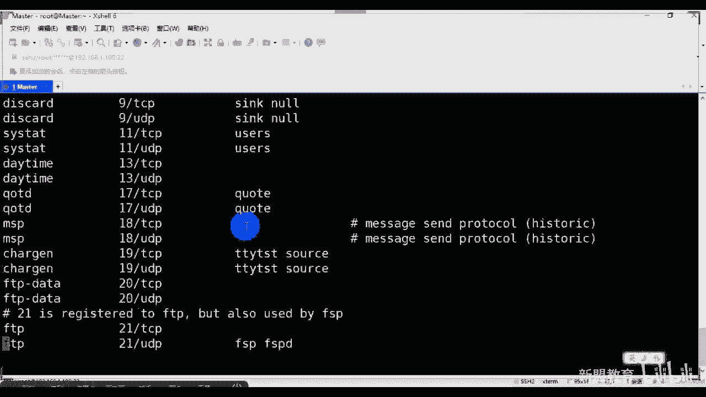

# 2021最新Linux-RHCE运维实战课程 - P7：RHCE-第7课-linux服务-dns服务 - 新盟教育 - BV17K4y1t7XR

。

好吧。啊，我觉得还好吧，是吧？行，不多说了啊，准备上课了啊，我不等了啊，等的话，大家一会儿一会儿一个个来吧，是吧？来啊呃老规矩啊，我们接着讲今天的第二个我们的基础服务啊。

也算是在整个呃基础服务里面比较有难度的叫DNS啊，叫DNS啊呃叫做doin name system叫做域名系统，对吧？啊，也叫做doin name service，也叫做域名解析服务啊。

有做域名解析服务。那么本身的话大家记住啊，域名解析服务。你们告诉我它的端口是多少啊。啊，我们默认端口是。53是吧啊，默认都和53加进来啊，但是它的话和其他的服务有点不太一样。

OK记住我们基于的是UDP和我们的TCP两个都基于进来。啊，两个都基于啊，1个UDP1个TCP两个都有好吧，一会后面我们会看到它的现象啊。那我这边看那么DNS本身的话，我们管它叫做一个分布式数据库系统。

哎，老师这跟数据库有什么关系是吧？这个数据库有什么关系？😊，好，再艾特一下身体啊。😊，人呢？是少。那么命密的形式呢和我们整个lininux的系统一样，它是一种道。撞树的结构。什么事道乱说。

这应该不用我去多说吧啊，从根开始是不是？所以我们是从顶级域名开始，从顶级域名分别到顶一级域、二级域、三级域、四级域啊，那目前来说在我们常呃所知道的大好吧，顶级域名里面或者叫根域啊，最开始根域是吧？

根域是小点表示的，顶级域的话，那我们会分为什么呢？比方说啊，你比方说像我们的这个这个这个呃EDU哎，这是我们什么这是我们的教育类型，对吧？但然教育类型的话，一般来说你没有办法自己去申请啊。

都是说我们的国家啊，你比方说我们的教育部是不是或学校啊，个人是没有办法的。所以通过查看域名的话，有效的去防止钓鱼网站，就是你比方说哎有一个地方啊拿出来这个网站告诉你啊，我们是拿来教育是吧？啊。

当然结果你发现它的它的域名的话，是以这个点com结尾的啊，那只能说是培训机构啊，像我们这种的，是不是？但是。😊，除了培训机构以外，呃，正常来说，我们国家的教育都是EDU结束的啊，记住了。

那么包括像com叫做这是这是商业是吧？然后GOV这是government的政府类的网站，然后呢还有一些个比方说像我们地域性的啊地域性的，像我们的中国是吧？CN啊以CN结束。

那么CN里面我们还可能再跟着一些个E级域啊，比方说EDU那么就是中国的教育类网站能理解吧？啊，那么树中每个绝点最多可存储的是63个字符，也就是说我最长每一个点啊，最长每个域名是吧？哎，最长是63个。

那树的最大深度不超过127层，什么意思？大家记住就是我的域名点点点点点点点127个啊，当然我们现在不用那么多啊，说那么多。那么域和域名你要明白啊，域和命名的关系，是不是域已经跟大家说过了。

你比方说CN域啊，这是我中国下的域，对不对。😊，下的域，而域名呢就是一个整体的啊，比方说3W点百度点com点CN点点com点CN对吧？啊，那么我们管域名通常是由一个完全合格的域名，大家知道叫做FQDN。

我希望大家把这四个字母记下来，为什么啊？哎，是因为我们到了后边，大家学习到了我们的阿帕奇啊，也就是我们的HTTPD的服务的时候啊，我们需要进行一个基本的优化啊。

我们就要调整我们这个这个这个阿帕奇里面呢叫做FQDN的这个参数啊，这个Q的参数来让我的启动更快一些啊，来让我的启动更快一些那么它能准确的表示出哎，可我们相对的DS域啊，域竖这个根的位置。

也就是说你最终是落到了哪里是点CN还是点com还是点EVN啊，EEEE那什么的EDU对吧？大起来啊，那说的谷歌这个是google这是为我们com的子域啊。

com子域表示方法的话是用这种方式而3W是google当中的子域啊，记住我们的域名是倒着往前走的点com是顶级域。gooogle是二级域，3W是三级域，大家来啊，接来。自己看啊好看。

那么从上到下根玉顶级玉二级域子玉啊，那么每一个里边希望大家明白的。这个这个先明白这个根啊，根的话我们要说到的是整个的FQDN是个啥，就是这么个全称。知了吧？这就叫FQDN完整的合格的域名，列了吧？😡。

没有了吗？能理解了吗？五活整个的域名就是一个东西。😡，啊起来啊，整容语名，你比方说这个3W点百度点com，这也叫FQDN。但是百度点儿com这就不叫FQDN。因为你缺少前面了，对吧？哎，3W啊。

你是你还是BBS啊，你还是blog呀，这都是不一样，对吧？啊，反正这都是不一样的啊起来。😊，哎，完整的啊。那么我们说整个DNS的解析的过程，大家记得吗？解析的过程。注意了，解析过程的话。

我们就要说第一步是要找我们本地的。哎，sorry，卡了啊，哎，是要找一下哎。到这啊。在这啊啊，那么我们是要找本地的缓存，这个不用跟我说了，对吧？缓存的话我们不说啊，除了缓存以外。

我应该找的是本地的host文件。对不对？同志们，这个host的文件里边会对应上我IP和我域名的关系。甭管是windows还是linowux下，其实都有这个文件。对吧？这第一步都有这个文件。

windows在哪里啊？在C盘下啊，大家了啊哎在C盘下。在C盘下啊，在我们的windows，在我们的sstem32啊，找到stem32啊，里边的话有个ETC。然后drivers有个ETC啊。

有个hos看到吧？在这呢，大家这是在windows下。啊，如果是linux呢，大家就明白了在ETC下嘛，对吧？啊，linux这个是最简单的ADC对吧。😊，啊，看好了。

windows和lindows还有一个区别在于我们之间的杠是反着来的对吧？windows是这么个杠，linds是这么个杠啊，接下来六和7一样啊一样一样，这两个是一样的啊，都是host的文件啊。

那么我们记住是IP在前域名在后，这是第一步，大家记住啊，这是第一步啊，那第二步呢。😊，老师hosse的文件没有。😡，文件不具备解析。啊，我们要找的是叫做本地DS，也叫做local。第二次serv知了？

它虽然叫本地，但实际上什么是你网卡所指定的。进来。😊，啊，那么打开你的这个这个网络配置中心，啊打开你的网络配置中心。啊，一太网我们更改适配器选项。啊，更杆是备弃选项。

那么右键选择属性属性当中大家可以看到往这边看IPV4，对吧？这个位置我现在是D2CP我也可以手动去指定，对不对？好，那现在的话我干嘛？我只要打开我的CMD看一下啊，找一下CMD。

走杠O找一下哪个是的DS啊，这写着呢，看到没有？同学们，这写着呢啊，这写着找到我们现在的以太网用的啊，这个以太网这的对吧？以太网示器找到DNS了吗？看到没有？能看到吗？同志们1。1对吧？

指的我自己的网关啊，指是我自己网关这是IP6的啊，这是P4的对不对啊，那么记住了啊，找的是指定的。哎，但是一般情况下我们指的是网关没有问题，或者说114。114。114。114啊，或者8。8。8。

8搭起来，这几个都是我们比较常用的，尤其8。8。8是什么？是我们google的全球的DS解析。😊。

啊，解析明白吗？哎，而当我们本地DS不具备的时候。😊，啊，本地的S不具备。当好了，我们才要找的叫做根域啊根服体。是嗯，而跟服器我们说过了，全球一共有13台啊，那么10台在美国是吧？一台在日本啊。

一台在哪里啊？在英国，还有一台在我们的瑞典。好吧，中国是没有的啊，中国是没有的，了解了啊，那么根服务器好了，往这儿看啊，全球一共有13个，明白吗？同学们哎，一共有13个啊。

那么对应上我每个根里面存储的东西一般都是存的是顶级域。😊，定级域啊，什么意思？大好了，我定级域的话也会按照情况区分。第一种来说，按照组织区分啊，不同的组织。第一来说。

商业组织comm教育组织EDU政府组织GOV是吧？军事组织MYL好点net啊，我们的网络机构，比方说像我们的云商对吧？等等等等，大家来啊等等等等。那么地域组织地址啊。

比方说像CN中国KR韩国US美国GA啊GP是吧？是日本，还有什么RU是俄罗斯啊等等等等，反向域这个是做一个反向解析的啊，这是反向解析的。到这了。

正向解析就是指的是什么正向解析指的是我通过域名去找IP正常的访问网络。反向解析的话，我通过IP找到我对应的域名，到这边no刷个一上来。啊，到这边OK的稍可以上来。😊，来啊。哦。那么请大家注意一个问题啊。

请大家注意一个问题啊，就是呃DS本身的话啊DS本身的话，它其实是一个极取极大的哎会消耗我们的是吧？消耗我们的CPU和消耗我的内存的啊。所以一般来说的话，你的公司记住同志们。

公司一般还是用的是我们的路由交换去做DS啊，路由交换去做DS实际上真的很少用这个这个这个这个这个交换啊，不对，不能说了DDS说错了啊啊，呃，路由交换也会做。但一般来说我们都会购买专门的叫做DS服务器。

好吧，或者呢我们就买DS的服务。另比方说到后面会给大家介绍一个叫做DSpo啊，DSpo中国比较比较有名的，像各大公司都会比较推崇使用这家的啊，一会会看一下，那么在整个里面的话，我们会有一个区的概念。

大家记住了会有个区的概念，这叫去作是吧？哎，记住是我们名称空间的一部分，包含了一组存储DS服务器上的资源记录，啥意思呢？就是那了，每个作，你可以记住它就是一个域名啊，每个作就是一个域名。好。

你要解析什么域名啊。啊，你要解什么意思英语们啊？😡，就是解析我们的一个域一个区能理解吗？大觉啊，那么主服务器和辅助服务器简单这是它的一个作用分类啊。主服务器不用说了，就是我这一个区域里边的老大是吧？啊。

辅助的呢糖主啊或居师明白了吧？哎，那么当我们去的这个这个这个辅助服务器启动时候，它应该与该区的主服务器进行一次数据的传输，来确保两个之间的数据相同的啊，但凡是主变了。

我们会进行数据的同步大起来啊数据进行去同步，每个区必须有主，必须有主，你可以没有辅助的啊，可以没有辅助的。明白吗？哎，大家。😊，但是为了容灾吧，我们肯定是要有一台辅助的啊，那么辅助的错作用容错能力。

这我就不说了啊，减少广域的链路通讯量很简单，哎，干嘛？同志们，哎，如果说我们这个地方请求过大的话，我在主服务器上肯定是CPU内存有限，对吧？所以我肯定不能通过一台去做，我要通过多台设备去做，对吧？

去做解析嘛啊，会将我们一些个服务器的链路，或者说路由的链路调整到我这边来定位到我这边来进来。啊，对啊，所以这个是我们整个DS的一个概念，包括它的一个基本的角色。所大家进看啊，大大家进来。啊呃。

往这看往这看啊，查询方式啊了，查询方式。呃，我们在讲这个过程的时候，大家请注意啊，在讲过程的时候啊哎。😊，我们还是画图说吧，画图说。啊，好主说左边的话，我的客户端，右边的话是我的服务器。啊。

3W点sex点com是吧啊，我还用了一个网址啊，左边的话是客户端好，到好了，第一步不用多说，一定是找缓存，一定是找本地对吧？啊，缓存。那么呃缓存的话不用说了啊，断电集没是吧？同志们，第一步缓存。第二步。

host文件。😊，不着急啊，哎，主和辅助之间的关联还是没听懂什么没没听懂吗？主记住啊，一会儿我们会做，其实主辅也叫做主从明白吧？主辅也叫做主从啊，主的话记住老师整个区域的老大啊，也就是说所有的变化。

要听我的怎么解析，要听我的知道吧？这个域名百度点com啊，对应谁，先听我的明白吧？先有主再有从，记住啊，是先有主再有从。对吧啊，消主在有头，而我的从复务器干嘛呢？是作为我的主的一个辅导。什么辅导呢？哎。

记住了，我的数据都是从主上来copy的，来复制的。所以当主有变化的时候，我要及时的copy到我本地进行同步，明白吗？目的是第一步减轻我们主的压力，解析压力。啊，对，第二步来说干嘛做备份。😡，理解了吗？

当主挂了的时候，不至于没有备份。明白吗？能可以的，没有问题。啊，没有问题。好不好？啊，就是说啊。这是第一步。第二步的话，老师我找的是我的本地，对吧？本地的话，我给个单地址啊，比方说114。14。114。

114。😡，啊，叫做本地DS。😡，啊，那么然后老师本地如果没有的话，我们要找谁？😡，这第二步啊这第二步，我们本地没有要找的是根，对吧？对吧是割域。跟。好，改好了。

那么跟服务器上大家帮助我去定位的是点儿com，对吧？好了。那么此时请拿家注意了，我帮你定位出来点com是告诉你啊，点com在114，比方说在100。1。1。1啊，我会把这个信息回复给你同学？

同志们回复给你啊，然后呢，你再去找我们的1这个100。1。1。1。啊，涨到100。1点A100。1。1。1。好，我告诉你啊，点s是在哪里啊？

是在哪里啊？200。1到1。1好，于是乎当好了，你再去到我们再给他返回回来。

啊，再跑回来，然后我们再去到哪里啊，再去到我们的。😡，就来啊再去到，sorry。😊，啊，再去到我们的。200。1。1。对吧我帮你定位3W好，定位出来3W告诉你3W在哪里？在200点1点1点100上。😡。

可以吧啊，在200。1。1点1百上，于是我们才能把你返回回来，最终你们才能访问到我们的这个网址。我是在100。1。1点1上。能明白有这么一个过程吗？来里有啥意啊，同志们啊。

来看在这儿呢啊就是那么一个过程。😡，看没啊，这个图是我网上找的啊，大家可以看一下可以看一下。那么我干嘛呢？现在对了，我的客户端请求第一步请求本地缓存，对吧？这儿呢第一步请求本地缓存啊，请你告诉我。

那本地S说没有，我去找这个，他帮你根域啊，从根域找根域回来是吧？告诉你点com在这呢，点com再回来告诉你163在这呢，回来，最后3W返回来。😊，啊，进来，那么这里边就会牵扯到两种方式，一种叫递归。

一种叫迭代啊，一种叫递归，一种叫迭代。那么请大家注意了，递归是这样子的，往这看。往师看啊，DNS的定规查询的话，是当我们DS下发请求的时候，okK我的客户端，我的服务器接收到请求。

我必须使用一个准确的查询的结果回复他，就是没有，我也要告诉你明白吗？我必须得回复你一个，没有，我也要告诉你啊。如果我DS本地没有这种的话，那么我们会去其他服务去请求。

并将返回的查询结果再提交给我的客户机。也就是说我告诉你是吧？然后呢，你没有你会帮助我去办。能理解吗？同志们。😡，啊，问你呃，你没有，然后呢，你帮我去办啊，热心肠。啊，你帮我去办，而迭代是什么？看好了啊。

问你你没有，然后呢，你让我找别人办。😡，理了吗？不合谱。😡，这个说能理解了吗？😡，哎，就是我看了DS服务器并不直接回复你查询效果，而是告诉你客户机另外一台DNS。😡，然后你再去请求。能理解了吗？

同志们拉里刷牙。来。😊，O啊。所以记住啊，一种是递归，一种是迭代啊，这两个请大家解来，为什么？因为这是我们面试题。啊，经常问BS这个面试题，知道吧？啊，你要是连这两个都不会，咱就不说啥了啊。

咱就不说啥了啊啊，这个过程已经跟大家说过了啊。😊，哎，那么正向反向我也说过了啊啊，对，没错，公价的窗口都是迭单啊。那么呃那么不管别的啊，我们说这个地方啊。😊，呃，正向解析和反向解析应该不说，正向的话。

域名指IP反向的IP找域名，对吧？大家可以看一下啊，如果你想找一下你们公司的，或者说你想找某个网站的对应的IP，我把这个地方给你们发过来。😊，啊，我把这个发过来。好呃，大家可以看一下这个网址啊。

大家可以一下这个网址。来，我给你们找开啊。啊，这王子。发到了群里面了，叫DS。AAA这样看到没有？看一下啊，这个是我的IP就是看到没有，现在是我的IP它没有对应域名解析啊，看到没有啊，这是IP反查。

对吧？你比方说到了，我们现在是准备1个CMB哎sorry有啊，CM。

好，我们拼一下啊拼。😊，3W点儿百度点儿comM。好，别着急，我把这个IP地址右键复制下来啊，右键复制下来。走大脑查询一下。

小姐们哈能看到吗？两个域名看到没有？😊。

能看到两个米名吗？来看二串一。😡。

听到了吧？看到没有？这是两个语名吧，都是归谁啊，归百度吧。看见没有？而就要知道为什么域名不叫做不叫做3W百度点comM，别着急，一会告诉大家，这个叫做别名啊，这个叫做别名，知道吧？

一会会说可以看到这个位置吗？看同志们我拼的是3W，但是他火打回的是3WA点10分点COM，看到没有？😡。

大家，这是做一个伪装啊做一个伪装，防止攻击的啊，那么我们说哎接着说啊，那么我们甭管是哪一个，我们跟大家说过了，如果我要安装之后，我有三个配置文件。

我有三个配置文件啊，第一个叫什么？第一个叫做主配置文件。😡，啊，第二个叫做区域配软件。第三个叫做数据文件。😡，啊，主配置文件去配置文件和数据文件。那么这个不用说了，这个是我的监听的。😡，端口是吧。

我的角色我是不是要启动缓存啊等缓存服务器是吧？哎，等等等等。区域配置文件呢，我们解析什么域什么域名，对吧？数据文件是IP和域名的对应关系。好，带好了，但是数据文件里边会有很多的类型。

我们什么在独拿出来说啊，往上看。那么它里边有很多类型，我们管它叫做记录。啊，叫做记录。对了啊，第一种常见的叫做SOA记录，这个应该大家见着过吧。比如我们做文件的时候可以看到，看到文件的时候啊。啊。

那么SOA我每个区域里面记录每一个域名只有一个有且为一。有且唯一，它是一个起始授权的记录，明白了吗？就告诉你，我要开始解析了啊，定义了全局的参数，进行整个域的管理，一个区文件，有且只有一个。😡，小兰啊。

没有他没有办法解析。😡，第2个NS记录。对不是NS记录的话，我们每1个DS解析的文件里面有且只有有至少有一个至少一个。啊，那么它的作用很简单，就是指明谁是DS服务器，明白吗？指明谁是DS服务器。😡，啊。

进来哎，谁做DS服T？第3个A记录那了，这个就不用我说了，这是将我的域名映射到我某个IT上。啊，将某运用到IP上PTR反过来了，将我的IP映射到某个域名上。记录啊，进来最后一个叫做C name，知道吧？

s name叫做别名。😡，叫做别名，这就是我们刚刚可以看到为什么这个看到没有？同志平百度显示的是他。😡，没有了吧？来这个上1啊0个上1。😡，嗯，这就是我们通过别名做出来的。那叫C类记录，对吧？

这个记录其实很重要啊。😊，啊，很重要啊。来隐藏你的实际的网络，对吧？哎，这个你是因为大家说因为百度是比较知名的啊，百度是比较知名的，所以你们这个这个给个别名，你肯定这个能看出来。但如果说是你的网站的话。

对不对？一开始你就隐藏了呢，对吧？你就告诉我老师，我叫三W c点com，然后其实是解的对吧？😡，MX多加一个啊MX这个是邮箱记录的好了啊，邮箱记录。那么一般来说啊大家好了，这个啊呃邮箱记录的话。

你要写这个是你做自己的。邮件服务对吧？哎，你要配合你的邮件服务器去做啊，当然现在来说，一般的话，大家公司里面都是集成的邮件工具。是吧一般都是集成的邮箱工具吧。

你们直接去买那种这种这种类似于OA系统的东西啊。那么它是要求大家将这个MX记录okK绑定在他们的就是绑定在对方，就是你们那个提供邮箱服务的那家公司的域名下啊，绑定上去就可以了啊，绑定上去就可以了进来。

啊，然后么就是说啊。啊，所以这个是非常简单一个东西啊，这非常简单一个东西啊。那往这看啊，以上的话是我们相关概念就不多说了。模式的话也是CS模式，对吧？同学们有服务器来提供客户端来请求啊，那么注意一下啊。

呃我们实际上在整个的查端口的话，查端口怎么查啊。在我们所有的这个这个这个linux的服务器下有1个ETC下有个service的文件啊，我不知道大家看见没看没没看见过啊，来看一下，是便是拿一个文件啊。

来看。😊。

啊，VEDCserv你看哎，sorry啊，没有BIM啊。

走，大家可以看啊往下走往下倒往下走往下走，看到没有？是不是很多我们常见的看到没有？很多我们常见的啊服务端口都给你们列出来了，看到没有？找到DS53看到没有？是不是TCPUDB都有啊，能看到吗？

来看到刷一。😊。

看到。哎，端口的都是记录端口的PCP和PP都有啊啊，所以这个文件的话，大家记个重点吧。好吧，以后的老师我真的忘了这个端口是什来往这查啊，往这可以查好不好啊？那后面的话我们要进行一个安装了啊。

我们要进行安装了，这样我们大家先休息先休息5分钟啊，先休息5分钟。呃，为什么？😊。

就是说。哦，那么我们来看啊，那么安装B呃安装DS的话，我们的服务叫做BND叫做bd啊，这个叫做bend啊。那么呃一共的话有三个版本分别是489啊，分别是489。

那么我记得在7里面默认使用的是我们的旧版本啊，默认使用的是旧版本，虽然它没写啊啊，那么其实呃大家自己看吧，好吧，这里面这个东西就不多说了啊，版本之间的区别，好吧啊，那么我们安装的时候注意了啊。

安装的时候呃，我一般安装的是这个啊了，但是这个。叫做bind杠s rootot。那这个和我们前的bin有什么区别？大家注意了，s rootot我们管它叫做牢笼机制啊，我们管它叫做牢笼机制，啥意思？啊。

啥意思？我们会虚拟出来，或者说怎么说呢？会呃默认的去创建一个。创建一个目录啊，我们把这个目录当做根目录。啊，当个目录。而当我们的用户或者说当我们的这个服务器被攻克的时候啊，被攻陷了，是吧？

被黑客黑了的时候，我是没有办法出这个跟目录的，理解吗？同学们。来了一个双一啊，它不是真正的根目落啊不是真正的根目落啊。😡，哎，所以导所以就是防止了我们黑客的攻击啊，防止黑客的攻击。那么来看啊。

我们就是一主一从嘛，对吧？而一主一从啊把连上机器。

然后按了一下，哎，sorry，不定错了。嗯，找了一下。

好，连上岸，那么两台机器啊两台机器我们还是老规矩啊，还是老规矩，在我们的主上进行安装啊，在主上进行安装。从的话一会儿再做啊，先做一个机器的啊，主上的话。

走实上样的话，我们的要么instore呃DS大概啥时候结束，差不多得3点半啊，三点半左右吧，三点多吧，好吧，杠Yb的杠C入场，因为里面涉及东西比较多啊，找个I。

走啊，并的啊C单好，s root啊来看这边，那么这个是我们的服务端。当了还有一个呢叫做utils是吧？叫做bind杠util，这个是我们的客户端，它默认安装了我们很多的工具。

比方说用于我们去解锁或者用于我们去做解析的啊一个工具。比方说像我们的NSlookup能理解吧啊，这就是客户端的东西，先把它装上，稍等啊。😊，啊，安装锁可能会卡一阵儿，在这个包上啊。来，稍等。好，稍等啊。

OK啊，然后要么inst，我们把这也装成啊，叫做bind杠uts当了啊，这是你的客户端提供的我们的NS look解析。

啊，那么在这里边注意了啊，我的配置文件在ATC下叫做name低点config文件。大家记住，这是主配置文件。接来啊，也是我们最核心的文件里面包括了我们所有的唉核心的配置内容。啊。

第二嘛第我们还是把VM装上吧。啊 sorry。啊三点说okK好的好的，be。

好，去吧。是回来看录屏啊，一定要复习啊。啊，来看啊。把VM装上啊把VM装上。O。😊，好，稍等啊，我们把它装一下。啊，有点慢啊，这得网是吧？嗯，今天网有点慢，今天的啊。等等啊。我把不用的东西都先关掉。

好吧，不用东西先关掉。嗯，关掉。关掉。好，其他没得关了啊其他的没得关了啊。好，稍等耐心等他一下啊，耐心等待他一下啊。😊，好，安装好了啊。😊，OO好，C name第点啊。

 name那大家可以看一下这里面我们要改的东西啊，记住了啊，没有改的啊呃，第一个来说的话是我们的listen对吧？我的端口告诉我建给谁啊，我不能建定本地的对不对？

所以把它改成any底下的话这个最好你也改成any啊，F比IV6的然后再下边是个是允许谁啊，允许任何的地址来访问我能明白吧？啊，允许任何地址来访问我，当然你说老师我不改啊，你不改就不改。

我们其实也能启动它叫做name低吧叫做name d看是不是正常启动成功了，net杠LNTU看同志们53端口都有吧？53端口都有吧。看到没有？但是你没有办法做解析对外网啊，或者说对局域网明白吧？

哎那么改好了啊，当然了，你说老师我自己怎么去。😊。

指定DS呢好，打好了，我们之前的话是通过网卡，对吧？对不对？ADC加s config好network杠script if cFG里面，我们指定了DS1，当然可以指定DS2。第二来说。

CTETC下resold这个我也讲过了啊。这对它只能对1227没错。😊，啊，还有没？同学们看我现在的话，这个地方name server这个文件里边记录的也是我的DIS。那问题来，同学们。

这两个谁的优先级高啊？😡，这两个车的有线级高啊。😡，确认几高。就这啊网卡优先级高啊，网卡有先级高，听了吧？就这一定是网卡的高，这个的话排在后面。啊，我直接说过这个问题啊，不要懵了，好吧。哎。

就是你往这个里边，老师比方说ele是吧，name server。😡，啊，内部server，你给个8。8。8，当你重启之后的话，一定是变成了1141414，对吧？它其实是网卡的一个映射条件。

一个映射关系啊。那我现在的话把我们的呃服务器要改一下是吧？我们先做一个备份啊，先做一个备份。啊，这做一个备份。好，vem BTC name低点com文件打好了啊，那么在这里面也是分段的啊。哎对。

可以说啊。那么记住了option是我们的全局参数，也就是说这里边配置的对我所有的模块都生效。第二个来说是底下的有个作，看到没有？同志们啊，loging join这都叫做区域模块啊，只对某一个区域有效的。

这是对根是吧？这是对根。当然了，此时有两种方式，我去进行域名的对应关系。第一种看到了，我直接在主配置文件当中进行插入作好，scama点CN in啊，划括号，记住啊，都有分号结尾的。

这是一种方式，我直接在这里面去写TYPE master主不记好fi我们的文件名称叫做thinkball点。经点做。当了，这是一种方案。啊，这一种方案写在一起了。第二种方式看好了。

我可以将这一段写入到我们的nameD点RFC192点作里面去。看到没有？因为我在这个文件里面也用了它能明白了吗？这个就是我的区域配置文件来临句上一。啊，有啥意思。好吧，这块呢我们先把它隐藏起来啊。

先把它注释起来。😊，走啊，先筑起来。那么请你注意了，既然讲到了tablele就跟大家讲了啊，这个位置是指定我的区域的类型，对于区域的管理非常重要。NTP对，127的话，这个127是本地啊。😡。

只于是127这个地址访问，没错啊，只是我只坚定了这个网址的53端口。朋学们？我只坚定了这个网址的53端口是本地网卡的啊，对来。😡，活回了啊活回了。好，那么这个区域有5种类型呢就来第一种类型。

你们可以看到的，叫做master简了啊，master这对主DNS服务器，拥有我们的区域数据文件，并对整个的区域提供整个的数据管理。第二种，老师，我可以把它写成mas，我，我把它这么写吧。啊。

第二种叫做s love。都小写的啊好，这个不用我说的，同学们干嘛呢？哎，辅助DS拥有主DS区域的配置文件的副本啊。哎，然后呢辅助我们DS服务器，从主服务器的同步所有的区域数据。😡。

第三种我是看叫做stop。😡，叫stop啊叫做stop区域啊，这个的话类似于我们的slove啊，类似我们的slove。哎，但是看好了，我们只是复制主的服务器的NS记录好吧？这个是完整的复制。哎。

这是完整是吧？不不不不不是摩捷区域啊，不不要跟网络混了啊。😡，而我是只是复制NS记录。刚刚我们说过的啊，那个NS还记得吗？同志们大是NS啊，这个是所有的。😡，啊，这是所有的。解了不对。

这个是指定你的DNS的服务器啊，谁是DS一会配置你明白了啊。第四个叫做for order拿起来叫forward啊，这个也要写一个作啊。

哎一个forward区域是每个域的一个配置转发的这是个转发的这种功能啊，一个作语句。大好了，一个作语句当中我们的type forward可以包括什么呢？可以包括我们的for word和我们的什么呢？

哎和一个叫做for。😊，orders WORDR对了，for ordersers。那么大家记住了，他其实来说啊，它是呃给我们去给定的，是给我们怎么说呢？就是。呃，你把它看做缓存吧。

你把它看作一个缓存服务器吧，啥意思啊？呃，当好了，这个后边我们白更个IP地址。比方说老师我跟的是8。8点。8点8。8啊，实际上我是向外网或者向其他的DS服务器进行数据的复制。然后当对方进行起诉时候。

我告诉你，你直接向他去请求，明白吧？你直接向他去请求。😡，做了一个向导的作用。😡，啊，做一个向导的作用这。哎，最后一个是谁啊？最后一个就是算上面的叫做hi跟啊叫做跟大家。跟服务器的初始化啊。

组的话给定的是我们整个的printt区。当然这个大家记住了啊，这个一般你不做知道吧？这个一般你不做。啊，它是帮助你找到我们在整个网络当中最近的根域名夫妻列表。对吧你们一般找的话可以找到亚洲的是吧？

但实际上不需要你去配，明白吧？对。这个不需要你去配啊。😡，啊，这不需要你配啊，其实多余的这些东西啊哎这就是为什么说我们个人或者说我们的局网里面很少去通过lininux匹配，都是通过windows合作啊。

也是点点点。😡，解了，12我们乘的这两个这个三个对了吧？啊，主从缓存就可以了啊，主从缓存就可以了对。那就是说啊，那么所以答好了，我在这个位置上只要改两个位改三个位置，一个都是一个是an尼啊。

一个是an尼。😡，啊，第二个的话也是安里。第三个的话，这个地方改成安里。允许任何人请求。咱们国家都叫竞香啊，咱们国家都是竞香，明白了吧？不过IPV6的话呢，我们国家有真正的啊主的根的啊。

当然是MV6还没开始大范的一个去使用啊。往了看同志们，除了这几个多讲几个参数啊，往这看，往这看，看着这个了吧？😊，知道这什么意思吧？😡，你知道这什么意思吗？😡，这啥意思啊？知道吧？想想R想想啊。

我们一个问题啊，你们聚到的参数杠R什么意思？😡，根儿什么意思？😡，杆哎打明白了吗？所以这个位置是递归查询。没有吧？我们是支持递归查询的。😡，明了吗？可以了啊，所以呢再往下边的话。

这两个就是我们的加密形式啊，这两个是我们的加密形式啊，这我就不多说了啊。哎，然后我们再加上一行啊，正常来说加密的话，我们还要引用是吧？我们再加上一行叫做DNSSEC杠啊，我们再加一个叫做look。😊。

aside啊，look aside。哎，叫做out true啊，让它去自动匹配我们的加品形式。啊，自动匹配我们加面形式，这就是我们的加密的文件放在哪里了，对吧？加密文件放在哪里了。

然后再往下面的话就没什么了啊，没什么了。然好了，此时这个文件保存退出啊，很简单吧。第二个配置区域文件EDC下name幕D点RFC。😊，好同志们，在这个位置看是不是我们刚刚那几个很类似吧，看到没有？

看到没有？这个是正向解析，我解析你什么样子啊，底下这是反向解析，看到没有？反向解析的话，要用的是一杠AD点ARP的后缀。😡，反向解析啊，而ID也倒过来些。😊，啊，所以如果我写的话很简单。

我在这个位置上写成钻。😡，好，我复制吧。啊，复知了啊。是要。复制完走，再写一个。好，两个当第一个来说，我们要写的是正向的对吧？正向的话呢，我们就给这个叫做thinkcama点com。啊。

sbody看反向的我写的是多少？哎，1。168。192能理解了吧？倒过来了192。168。1。当了，这是一个网段，我要具体写IP呢，我也可以跟100，能理解吗？我只解析这1个IT的，少写一位。

就是一个网段，然理解串意。😡，来啊，别刷一。好不好？呃，类型master主是吧？当了主的话一。正向和反向都要有啊，为啥要反应来格式就是这样的格式是吧？格式嘛？因为你这是个反向解析嘛，对吧？啊。

完这个master文件名称，我们叫做正向的，一般，我们叫这个名字啊，就是你解析什么，我就跟什么点作文是吧？好，到了这个呢也是我们一般这个位置跟的是192。168。1。ARP。😊，啊。

就是I是master，只有解，什么意思啊？就是这是master，只有反向解，不是啊不是啊，这不正向解反向嘛，看到没有？拜不同志们是这样子的。😡，这个别别混啊别混啊别混啊，说一下啊。

说一下啊，就是就是什么意思啊，正向啊，看了。😊，如果我的服务器到了，我是主服务器，这只是一个角色，对吧？这是你的角色，你充当什么角色？但是我得具备正向和反向解析。这是吧？这是公的，知道吧？

角色和功作并不冲突。😡，OK吧，同招啊，决策工作并不冲突啊。😡，OK那要说的是不是反向解析，只有master只有不是不是从也是一样的，对吧？哎，你要是做重复的话，你是不是我也得解析你我也得反向解析啊。

copy过来啊，明明了吗？啊，进来OK哎都有啊，第三个参数就是hello同志们，第三个参数就是我允许谁同步我的正向，我允许谁同步我的反向。那现在我给的都是态没有人能够同步我好不好啊，没有人能同步我。

我们这边先这么做啊，先做不同步的啊，就咱做一个好，保存退出就可以了。😡。

然后当好了，那问题在于，老师我的sycommo点com点作是吧？和192。168。1。ARP我问一个问题，它出在哪里啊？😡，他住在哪里啊？老师我不知道是吧？来看啊在你们的配置文件下，再家往这边看。

可以看看发现这个位置了吗？😡，发现我们这个位置的找找在哪里啊，我找一下，在在在在在在在在在。哎，看到这个位置了吗？😡，啊，不能这么说啊不能这么说。呃，等等啊。哎，放哪去了？找一下啊，看到这儿看到没有？

看这了吗？叫directctor，可以吗？哎，这个位置告诉你我的文件或我的根目录是哪里啊？是va下的name第一项，理解了吗？同志们。😡，啊，所以我们推出来进到word下name第下。好了，谢谢。

但是你会发现一个问题，老师，这里面啥都没有是吧？没有我要的两个注意啦，没有，但会有模板，这两个是模板，知道了？这两个是模板，并且请你注意一个问题，我这两个文件看到同学们，我的权限是640，对吧？

但是为什么是64好，很简单，因为我是数组是ro，而数组是name低。所以此时当我去复制我的模板的时候，看了，local host作为正向模板，😡，正方的模板，所以叫做thinkyma点儿com点做。

此时必须跟上杠A的参数，否则那好了，你这个位置是两个root，你知道两个root的话，但是我们在进行这个文件启动的时候，默认使用的是name姆的用户能理解吗？同志们。😡。

能理解吗？😡，所以你告诉我，如果两个root，你告诉我，我能读取到你的解析信息吗？能读取到吗？😡，不能对吧？😡，啊，不能啊，所以记住啊一定要杠A，或者跟大家最简单了，就是CHOWN你知道吧？

你就name低冒号name低，你全改了，我都不拦着你，是不是？或者呢CHMOD老师加上R全加上或者呢O加上R。😡，其他人可多两种方式，你随便选，明白了吧啊。😡，好，那么这个是用来做正向的，所以答家好了。

CD杠A叫做name低点lookup，这个是做反向的，能理解了吧？啊，一正一反一正一反啊，那么先来编辑正向的文件，带好了，看看。第一个来说我们的TTL这个用我说吧。

PDL还用我说吗？😡，替代还有怎么说吧？这个是设置我们有效地址解析的默认的缓存时间啊，默认的缓存时间一天替代有效嘛？生命周期啊对不对啊，生命周期啊对吧？一天啊，第二行大家看了没？SOA我说过了。

即使授权记录。每1个DS的解析有且只有一个。而且必须有明白吧？啊，有且最后一个。它后边就要改了，好了，同志们，后边怎么改呢？先别着急，先不改了，那先都删掉啊，先都删掉啊。往下看往下看这几个时间。

我说一下啊啊，先把它回来吧，要说一下这个艾大家注意了，这个艾啊，原来这个艾是表示当前的域。😊，当前的欲其实大好了，我不改也无所谓，它就等于think mode点com。😡。

就是你那个区域配置文件里边的做那个引号里面的。我们只是为了方便大家理解，我们把它改成了com点，能理解了吗？我们只是为了理解便于理解这。噶啦。啊，所啊，那么我们所有的要与点儿结尾，大家知吧要与点儿结尾。

得吧。哎，这个点儿表示的是根，这个点儿表示的是根，大家这住。啊，标示根啊，最后边这个位置给的是油箱。啊，邮箱。注意了，邮箱的话，艾特要用点儿来取代哈，要用点来替代大家。好，这事儿最简单的啊。😊。

那么往下面接着看啊，往下面看呃，还有什么来着？😊，还是买的啊，这个时间是吧，sar带好了，这叫更新序列号。😊，用于表示我们的数据库的变换啊，可以在10以内到了。一般来说，如果我们存在辅助区域。

也就是说辅助DSsb的话啊，我们每次更新数据就会加一，能理解吗？猛次就会加一。也就是说我数越高，我更新的次数也就越多。O吗？来跟刷一啊。😊，好。1期天呢，现天今天今天今天你们很不积极啊，是吧？

我这都赶着冒了，还给你们我这都很积极的啊。😊，OK第二来说的话，refuse然后呢一天是吧，day一天H1小时W week啊，然后这个是H1小时啊，一天什么叫做刷新refuse刷新，对不对啊？

是我们从域名服务器更新这个地址数据库文件间隔的时间，我们每次刷新你段时间，对吧？延迟就叫延迟。😊，啊，延迟时间就是你更新失败，我需要等待多长时间再更新你对么we就是到期这个库这个解析的东西有多久啊。

然后呃三小这个是设置无效解析，就是那好了啊。呃，就是你这个数据库当中不存在，比方说不存在BBSc点comM那么。😊，我们呢就会设成无效记录，这个无效记录我们也会有缓存。因为我要立刻告诉你是无效的。

重新解击卷。所以这个缓存3个小时。对啊对吧，那么这个东西我其实在笔记里面都已经解出来了。大家可以看一下啊，都到这了。😊。

大家会再去体会一下，再去看一遍啊。好吧，包括这个位置上啊，这个图已经截出来了。好，我们就说。😊。

再往下搞了，这个就是我的NS记录了吗？同志们，这就是我的NS记录了吧。😡，啊，设置域名服务器，域名服务器叫名在thinkma点com点。😡，哦叫就叫NS可以吗？同志们，我就叫NS。😡，那既然有域名。

就要有对应关系，就要有IP对吗？同志们。啊，A记录表示的是。正向解析啊，IPV4的这个是表示IPV6的好，所以起码要说NS那好了，你可以直接写A啊，你可以直接写A。但一般来说我会习惯写inA。😡。

转换过来知道吧？192。168。2012呃1。100，谢我自己啊，再走什么哎，我们再给3W到了EA192。168。1。100。此时请注意一个问题啊，同志们。好吧，其中一个问题啊，我不需要干嘛。

我不需要写什么3W点sca点com，我只需要跟一个前面的前缀就好了。😡，明白吧？说以BBS是吧EA。😊，你看DS的这个文件高量是非常有用的。如果你多打了一个，它都会报错，看见没？多打一个他都会报错。

少打一个都会报错，对吧？啊，再一个都会报错。那么这里边我们再设置一个啊，我们再设置一个，你比方说同志们，我们呃我想想设置什么给你们。设置一个我们的C name吧，好吧，设置一个我们C name吧。

好不好？啊，是有个新内。另外所同志啊，在这里面的话，我们跟一个呃3W1。好，C。内蒙。看了吧要求呃，我们给他给什么呢？是3W点think mode点com点。看一下。

我让这个哥们儿直接解析到了我这个地方来，看到没有？看到没有？当然你也可以把前面补全啊，你也可以把前面补全，比方说把它补全了。😡，看到没？啊，我把它补学了，好不好？做一个。😡，别名啊做一个别名。

来看啊来看怎么做啊，来看怎么做保存退出，这就可以了啊，其实这就可以了。好，现在当了我们要重启我们的内name幕地。😊，没有报错就抄。😡，没有报错就正常啊没有报错就正常。厉解了吗？是们？😡，好。

那现在看好了啊，现在看好了，我们只做了正向解析啊，没做反向的啊。反向其实weM192对吧？里边跟它是一样的，前边的好了，前边是一模一样的singple点com点。😊，系个帽点烫点。你下NS。

点think点com点是吧？NS记录到了这个是一定要有的啊，我就给A了啊，19点168。1。100，再往下你就是所谓的PTR了，对不对？是不是？是不是那P量怎么写，你要对应上的是IP前面跟的是IP了。

😡，PTR是吧，WW点think点com点啊，接着做PTRBBS点think about点com点，对吧？大家觉得唯独DS是不区分大小写的唯独DS是不区分大小写的，明白了吧？啊。

你不信你用大写的3W去访问百度也是一样的啊。😡，好吧，PTR站起来，3W1点s点com。对吧。😊，啊，靠脸好，保存退缩。啊，抽启一下。啊，注一下。那么此时注意了啊，我们现在要去写了啊呃我们去把它改一下。

我们不改网卡啊，我只改这个文件了啊，我只改这个文件了，好吧，我改成我自己。😡，赶注我自己啊。😡，不用啊。不用啊不用啊。别名不需要啊，别名什么叫别名啊？别名什么叫别名啊？😡，什叫便利啊？域名才有别名了。

对吧？IP才有别名啊，对吧？你不得通过域名去访问吗？对，正向用道就行啊。😡，啊，好了，我们现在启动好了，同学们啊，我现在把这个解析服务器也改了，对吧？😊，啊，我把解析附器改了啊。

然后重启了域名之后来看啊来看我们要做的事情啊。呃，我们不重启网卡了，不重启网卡了，看一下啊呃ra呃重启一下网卡，看一下拼一下吧，3W点。😊，是吧think点ho我们试试啊，现在可不可以了。

大家可以看到吧？看到没有？听见了没有？是不是从移回来了，看到没有？看到没有？😡，看是不是我解析的是地址，是他看别名成功了吧。😡，抽了吧。成过了吧。啊，这是你知道是吧？你要不知道的，我要告诉你。

这就是我的公网域名，你打死你也猜不到，这是我的域名吧，对不对？😡，啊，所以一般你们对公都是明明啊。😡，啊。张香啊。啊，默认我们是支持递归的，这个我就不多说了啊，但是。😡，这大家注意啊。此时此刻。

我的服务器并不是低柜。啊，并不是这贵，为啥？😡，在这儿呢。了，并不是递归啊，但是我没法看现象啊，没法看现象。我去告诉大家，好师看到了，我默认虽然开启了递归，但是由于我们是进行了加密的，所以你递归不出去。

明白了吗？如果你想递归，很简单把这三个注释掉。😡，什么都不加，能理解吗？同志们，你们再重启，这样子就是低归了。😡，理解了吗？😡，啊，即使你定位开着了，但是他没有没办法生效啊。😡。

必须把这个家具个猪湿了才能递归啊，因为你就想吧递归。老师，我每个请求帮你去请求是吧？我得告诉你，你加密了，我仿问到根上去了，根没有加密啊，是吧？那我咋办？😡，发问回来了吧。啊，进来。啊，说这么多啊，呃。

想想再想想还有什么来着？😊，呃。啊，这么多啊，然后我们再看啊做一个转发嘛，转发好像没有办法给你们做啊，转发。呃，我看想啊。😊，呃，转发没法做，但跟大家说一下，转发怎么做，好吧啊，说一下怎么做啊，看好了。

😡，呃。看下在哪里啊，在这儿。在这啊。怎么做？带好了，转发？我只需要在这个域名的前面看到，在这个地方在这个地方啊，我只要加上就可以了。加什么东西叫做forwards。行了，我只需要在这三行上加上这行。

在这地方叫上for。😡，word了WRD。的切お你。不好意思啊。😊，啊，记住啊，我只是用来做转发的，仅执行转发操作，能明白？同志们。😡，Onlyly精准发。😡，啊，only精准发。

我还可以写什么写forrst。😡，啊，only精准发，我还有一个first。啊，说什么是查找本地，先查本地的作文，再找我们的转发，另外，再转发。😡，啊，所以配套上对应的叫做forour orders。

😡，啊，for word大括号啊，括括号啊，8。8。8。8两个分号结束好吧，这个就是我们的。明白了吗？准发进来。哎，进来啊。😊，我给你刷一啊。转发有啥用，就是不消耗本地资源了。😡，啊。

不消耗我们本地的解析了。资源了A了吗？司机就那么一件事儿，还有别的啊。行，我把这两个关掉了啊，这两个关掉了，防止他那个那个对我们有争。😊，好，往最重。🤧嗯。接着多啊接着多啊。OK吧。接着说啊接着说。

别名为啥能防止攻击IP地址都会指向对都会指向其他的去，理解了吗？啊，就指向现的这块一会儿再说吧。关于外b的，我们后面还会注意很多东西呢啊，外部会有单独科啊，那么后边我们要搭的是主从啊，后面我们搭主从了。

现在主上归意了，主上我们没有毛病吧，同志们。😊，但是你要改一个地方。做主从了啊。😡，一题3内幕低点RFC。😡，好了，在这两个改掉啊，改什么update。😊，对啊。干什么？168。1。2220是吧？哎。

我允许谁来同步我？😡，我允许1。20看到没有？同志们，我允许1。220。啊，我允许你们来讨论我，而且大家注意啊，注意啊，我必须两个都敢都给，否则我只会同步正向，或者只会同步反向，理解了吧？

这就得不偿失了啊，这就得不偿失了啊。😡，哎，这是第一步。好，我在主上做了授权啊，之后必须要重启。啊，必须要重启这个没有reload啊，这个没有reload，大家可以看一下。😡，还有reload的是吧？

那不里有啊，7里面有6里面没有啊，对来reload什么不停止平滑冲击，直接存在你的什么，直接存在你的这个这个这个服务器若这个配置文件啊。😡，第二步重复记账了啊，第二步要再重复记张了，重复记账做什么？

第一步也是安装我们的。😡，name安装我们的bind杠C处的啊，也是安装tory要答案哎呀。也是装什么呢？稍等。啊，这个安装还是挺快的啊。28个包是吧？同志们啊，28个包。看一下里面啊。

看诉里面有pyython嘛？其实你的环境里面本身就有pyython的，知道吧？啊，本身就python的啊，看policy是吧，什么策略啊等等等等。😊，还有什么来着？啊，client对吧？啊commo。

然后我们的。病的看病的久吧，是不病的久，是不是同志们啊病的久啊。好，等一下啊，可以了，看，这个位置主于卡了一下啊，这个位置没有就无所谓了啊。s nice这是3内核防火墙，到后面会讲。😊，啊。

安装完成啊安装完成。那么我需要做的事情很简单的好了，哎，我们也把BM装上啊。😊，你把VM装上。大家可以看一下啊，pre是吧？这个我们经常说的3P语言，3P是哪3P啊？python。😡。

free还有一个了PP知道吧？啊，叫3P语言啊，都是可以写脚本的啊。对吧好，那么从服务器要做的事情很简单。那好了，我们也是注意了，主的话，它吧，大家记住，从服务器不需要配置我的这个主配置文件。

我只需要去我们的区域配置。😊，对吧区配着RFC192点做。啊，在这个位置上请你注意了，同志们我们也是一样的要去做一个解析。

啊，这个位置一定要对应上我们的这个这个这个主库的啊，是点com吧，不就是点com对吧？啊，所以我这边也要对应上我们的反向的解析来进来。

啊，192是吧，1。168点好，这注意我写的东西啊啊，我是从还是主播告诉我类型是主还是从。是不是变成slogve了，对不对？是不是从slove了，听同同学们，这两个都是slove吧。😡，好了。

这是第一步啊。第二步看你不需要文件，你不用自己创建，对不对？因为你是从别处同步过来的，能明白吗？同志们，你是从别处同步过来的啊，从哪同步呢？从哪同步？记住啊，从这儿同步叫做masters大括号，192。

1168。1。100分号号看看同志们我从这会同步过来。😡，对白吧？并且同步之后你才能给你的。😡，文件名称呢，我们把它一般默认存放在slambs下，叫做thinkcamo点儿com点作看透明了吧。

请问大家一个问题，这个slove前面我没有杠，我是从哪起始啊？😡，我说从哪里起始啊？😡，从哪里取耍？可起实。哎，万下那不低啊，大出一个问题啊，你哎对，没错，然后就这不是这个是在从4拉5下啊，万下。

大这一个问题啊，我们到后边经常会遇到。哎，比方说我们要固定一个根目录是吧？根目录的话，我从这地方开始，没有签，没有根怎么办？就是从你们默认的指定的根目录下开始啊，行。😡，啊，所以这个一样的对吧？

同志们啊。😡，2YY复过来。啊，master同志来对吧？这我这个名称改了啊，叫做19的168点。😡，第一点。ARP这。啊，记住啊，这会有两个分号，这有两个分号啊，这会有个分号，千万别丢千万别丢好吧啊。

千万别丢，然后保存退出。子然好了，两边的话，一定要注意一个问题啊，是不是都真的把防火墙清空了。😡，啊，我们现在先清空防火墙，好吧，先清空啊，那天看到同学老师为什么我做的不行是吧？我都是清空了。

后边会讲到再说，好吧，讲到再说先都清空啊，清空之后，从库上systemCTL restart内迪启动下。😡，看吧？松下，然后结束了检测下结果吧，检测下结果吧。CD word下内幕低下，我们找到slo下。

看到没有？写一下，看看是不是过来了。😡，是不是过来了，看同学们，你看一下这里边是不是一样的啊，1求2看啊，这都没法看。同学们，这现在没法法看啊。😡，看到有？听到吗？但是即使没有办法看也没关系哈也没关系。

怎么办？老师，我做一个亚麻in store杠Ybin杠beau of。啊youti我们做一个解析不就知道了嘛，对不对？😡，哦，落解析不就知道了吗啊，看NSlookup做交互式的啊。第一个来说。

3W点thinkcom冒点com。啊，上面也什么没有给看过。大家看看一下，目前来说这个是找到哪里了？这哦这个是我网卡没改啊，注意啊，你本地网卡是要改的啊，然后了啊。啊。等一下，你本地话老是要改的啊。

看一下啊，悼词的话，其实帮你解析到是公网上去，看到没有？是不是公网的，是不公网的，是不是同学们啊，我们看看本地的DS啊，CTETCresol。定的114对吧？我把这两个改掉。Reso。啊，好。

我们给谁啊？IP是200对吧？啊，200220IP是220啊，IP是220。我这给的是220吧。20啊一定是220啊。啊，这是220，明白了，同白？啊，对了。啊，那么呃你要修改你的这个这个网卡的参数啊。

改成你自己知道吧？忘了改你自己了，20看兄志们，我只能说我自己没毛病吧。😡，知道学们？我们再来看再来看。😊，3W点儿thinkco冒点comM。稍等啊。还是com吧，2点C来着啊。

我指我自己啊我指我自己啊。哎，稍等啊，没有解析过来是吧？😊，稍等啊呃没有紧析服务器，我们看一下CT呃，我们我们改一下网卡。sist confi networkwork。scriptcr ifCFA。

走了，我们还是改一下网卡啊，220对吧？到。改一下啊。啊，呃改成我们的192。168。221。1点多少来着？这是20改成我自己啊改成我自己啊。看下电S我自己，然后充值一下网卡。走，我们试一下啊，找NS。

多 up不。我这边是看同志们是不是出来了，是不是出来了，这是通过我们等一下哈等一下啊CTETCresold。啊，220大家可以看到吗？看看是220吧。😊，可以看了吧？哎，但这好像有点问题啊。

我我看一下不太对是吧，为什么找公网去了，不应该找公网啊，不应该找公网啊。不开角红网啊。呃，找的是我220server对吧啊。大道为什么吧大道为什么？😡，大家知道为什么吗？😡，啊。

你知道为什么会出现这种情况吗？😡，为什么不是缓存的问题啊，看了看了。😊，搁这儿。看这儿。看着了吧？能到这吧。我问一个问题啊，你们本地的TPlink具备不具备DS告诉我。😡。

本地DS具备不具备TPlink格。😡，我网关是不是其实就能帮我转发出去啊？😡，对吧。对以吧那你这里面有bug是在于你本地的有个有个TP link啊，是吧？有个TPlink。实际上来说。

你在这一步其实就能过去了，对不对？这样就能过去了。啊，好吧，呃，我这边的话，我我把这个地方改成。啊，我把我们的网卡参数改成我们的自己，不能改成自己啊。是吧改成我们的1。100吧。改成我们1。10吧。

走冲钱。Nlook up哦3W点C点com，我看一下试置能不能反应过来啊。稍等。稍等啊。就是正向和反应该其实都有吧。对吧看这边的话IS look up走3W点think mode点com。走一下。

看我这边能不能齐啊。这边可以过来吧，对吧？呃，再再反一下192。168点。1点100看同学们正向反应都有了吧，这边。啊，这边过不来是吧，过不来是吧，看一下啊，显示一下本地的权限，权限是没有问题的。

权限是没有问题的啊。啊，VM192。啊，这个都是这样子的。呃，就是这样子的是吧？呃，这个过来的话。正常来说是没有问题的呀，难道还让我去指定我们自己吗？稍等一下啊。3W点thinkmo点comM。哦。

真的。我咋写的是1。20的允许吗，是吗？看看。

为么你的三。

nameD点RFC我写的是200吗？220嘛，是不嘛？我写的不是220吗？啊，我没有备份成功的话，这边不可能有这个文件啊。😡，是吧。这边不能有这个文件，谁打的，你咋刷那么多的空白呢哎。嗯，凯哥。🤧嗯。

啊，好吧，这个有的啊这个有的这有的，我想想啊我想想我想想啊啊，第一步的话，我们要在主上进行去同步，对吧？啊，low updates后我们加东西啊，加东西，然后我们重启服务器没问题。然后从库上的话。

我们进行配置。然后fill后面要指定我们的这个东西没有问题啊没有问题啊。没事没事，啊。然后最后检验结果的话是从服务器上，我们重启之后一般会自动同步我们的主动配置数据，并且该上面的话会有啊。

然后配置我们的重复器的网卡参数，把DS写成我自己，这样就可以从我们服务器自身提供的DS。获取了对吧？最后可以使用我们的stop。嗯，但是他突然的还是CTETCressod。啊，玩有问题啊啊。等下啊。

你看我指的是我的ca率是1。1，对吧？嗯。我不给他。我不给盖他呗。啊，未改到位啊。哦，特S look up。好。没有是吧，不能读，是不是同志们不能读啊CHMOD我们试试给个权限啊，给个权限啊。

给个717吧。啊，给个77吧，我们试一下啊呃，等一下等下等一下，我看看这个地方。s内部D没问题啊，内部D没问题啊，对吧？C是MOD我们加上77吧。好吧，我们77问件77试试。杠牌sloves。行。嗯。

好吧，是老师。没问题吧，这样可以吧，systable CTTLstar restart。内部低走试一下S的话我权限应该是没有问题的啊。呃，3WW点s点com。哎，这个可能是缓存吗？应该不是缓存吧。

应该不是缓存吧，这跟缓存没关系啊。DSC重启之后，想想啊。嗯，本地还是解释到我们外网去了，对吧？还是写我到外网去了。啊，然后市场VMEDCname低点com文件，这个文件什么都没有动，对吧？

这文件什么都没有动。啊。递归对吧？有个地归。然后。跟。诶。😊，分想。冲击打卡啊。跟冲启大法没有关系，不用重启不用。嗯，sve上应该是没有问题的啊。sap上应该是没有问题的。

我们试着NXlook up我们的192。168点。还是过不去是吧？是这个文件的问题吧？这个文件同步的问题。这我里现在看不到你们是吧？叫做thinke1点点168。1点think点做。没问题啊。

RM杠2F，我们重新的同步一下，好吧。写重了看一下啊。这都没写东西啊这里没写东西啊。这样吧，我把这个地方删掉。好吧，典姓啊啊，好好啊，这个点别忘了写啊，这点别忘了写啊，对吧？我点某个人了啊。啊好。

空了stma star restart。没力好，同学下。有了吧，通过来了吧通过来了吧。😡，对吧看看大小文件是不是一样的啊，呃呃呃呃呃CD over一下name低一下。啊，看一下大小啊，这个是266对吧？

这个是253，这个的话大了一些应该是加密了。在过程当中，对吧？传输的时候还有一些加密。呃，文件被加密了，应该是没有问题的。啊，我们看下这边CT192。对吧100嘛N路NXPTRBBS对吧？

3W点think点comM吧，不错点com是点com。嗯，NSgo up3WE点星com冒点com。你看没有是吧？嗯嗯。开口。Ne server。1。20。220是吧，1。220接下来。啊。

CATT哎sorry。啊，接下来EDCresold。啊，大家看一下啊再看一下啊。走，我再家分一下。啊，不有没有没有，跟这个没关系。哎，想想啊。😊，我想想啊。左没加密从加密。

我看这边主是我们把加密给停了是吧？看一下。等下。我把这启动起来是吧？是不是我把它启动起来。我拉启动起来。保存sCTRre试试啊。是啊没有对吧？RM杠RF点杠星。

很让心sys CTL restartstarname低。走有了吧。有了吧嗯。有了啊，然后我们再试一下，看下CTEDCresoow。对吧然后NSlook up3W点s点comM哦。走，看一下啊。

他肯定会问我们的。等一下这步正在解析时，看能不能过来啊。看一下啊，还是不行是吧。没有被到达的。啊。啊。知道哪里有问题了？我知道哪有问题了？😡，这儿呢。这个帮帮帮棒改了啊，这个帮改了啊。😊，啊，拿忘改了。

不是不是这这这这这这这这这这这这。😡，这是这。这这这这看到没啊，这这这。😊，我说了。他好说找不到是吧？😡，啊，阿里。是吧啊。这天我瑞 start。😊，走再试试。有了吧。啊，过分了啊，不好意思不好意思啊。

忘记了，爱你啊，对吧？我光坚听那什么了，忘了主改了，从没改好不好？啊，把重改掉就可以了。😊，解决了吧，问你也完美解决了啊。好了。😊，啊，没丢脸啊，没翻车好吧，然后我们接着看啊啊接着看啊。

那么其实这个不算是真正的加密达菲啊。😡，你要注意啊，这个东西不算是真的加密啊。😡，这不算是真的加密明白了吧？啊，他只是错落了位置而已。真正的记住了，我们有一种方式叫做安全的加密传输，是吧？

安全的加密传输。😡，🤧嗯。🤢，啊，叫做安全加密传输。就是我们前面经常跟大家提到了啊，没关系，已经OK了啊，这个问题是吧？一定是写an妮啊，这个忘忘记了啊，从复没做啊，那么我们前面经常大家提到。

就是我域名服务器是互联网非常重要的基础设施，对吧？哎，基本上你们现在上网都得依赖它啊，如果我们服务器发生故障，那么即使说web网站老师或者说是电子邮箱，其实它基本上都没有办法去使用的，对吧？

用户是没有办法用的，其实你的服务正常，对不对？所以互联网当中百分之。😊，95的都是用的bin的s入的没问题，但是其实是要对它进行加密的传输的。大家对啊，加文件加密和加密传输是两码事，明白了吧？😡。

明白了吧？啊，来看老师道我怎么加密传说很简单好了，很简单。😊，第一步啊还是把我们这里边的删掉。没有了吧。第二步回到你的主服务器上来啊，回到你的主服务器上来，在主服务器上做一件事情叫做生。😡。

成立啊用什么呢？用DNSSEC提称，大家看熟悉吗？这个命令杠提衬熟悉吧？我是不是上节课讲SSH的时候也是啊。😡，回以吧IFSH也是吧。😊，啊，所以用它生成啊用它生成记了啊，那么它后面可以跟一些个命令。

看了，比方说参数跟A指定我的加密算法，我用的是IMD5啊MD5的算法。看吗用的是MD5啊。第二个杠BAB啊，用AB啊AB的话指定我的密钥的长度。一般我们指的是128字节。啊，MD5的字节好，更N记住了。

指定你的密钥类型啊，指定密钥类型。此时我用一个叫做host。老师host表示什么？表示和我的主机相关？这个密钥是和主机相关的，明白了吗？😡，看了吧？加密的算法嘛，算法不同是吧？长度是多少，和什么相关。

明了吗？啊，给一个master杠slove，这是名字啊，这是你生成的密钥对的名字，知道吗？这个地方是任意的啊，这地方是任意的我们只要回抽就好了啊，当然啊，HHMMH麦看看？H啊，反了MAC啊。😡。

H麦对吧？进行复制到了，这一步稍等一下啊，有点慢是吧？😊，这步有点慢，陶先人啊。哎，这边就很慢啊，这样吧这样吧，我们别做别做别做128的，给个8行吧啊，给个8可以吧？啊，上一步没有结束，不好说。😡。

都没结束，不好说。啊，sorry，重叠一下啊重叠一下。啊，呃我们给个给个短点的，好吧，同志们，这个过于消耗内存了，我们给个32是吧，稍等啊，稍等让他自己先做一下好吧，让他先自己搜索一下。啊。🤢，哎。

这边生成不慢是吧？很慢啊，我们放这边来试试。😊，他有的时候就是很慢啊他有时候就是很慢。😡，啊，你们说的话可能会快快一些啊，可能会快一些。啊吧。稍等啊，还是不行是吧？杠二这时候是生成两个字体。这还不行吗？

那么。嗯，那么需要我重启一下是吧？需要我重启一下啊，可能真的不行了，再重启一下了啊。这这个这个真的是重启了啊。你放心你在物理服务器上不会啊，你在物理服务器上不会啊啊，这个是从这个这个这个是那什么啊。

什么的问题啊，内存的问题我给的太少了。😊，稍等啊，我让他处理一下。啊，会卡一点啊。哎啊，重启主服器当那呢。这master啊，知道重启当中知道啊。给他短一点，好吧，给他短一点啊。嗯。🤧嗯。好了。

应该重启成功了吧。啊，出去的办吧。好了，数据成功了啊，联系一下。😊，连一下。

走。好吧，呃，这边的话我们还是先把它启动起来，好吧，start name低好啊，star呃啊我看一下时间啊，把时间时间应该是没有问题的是吧？这边的时间应该也是OK的OK好，然后我们试一下啊。

叫做DSSEC杠K啊，杠提，然后杠A我们选择Hm杠MD5。😊，啊，然后我们选择的是杠B啊，杠B的话给个2，好吧，给个短点的，好吧，你们啊，然后呢，杠N跟host有关，叫做master杠slog啊。

这是妙钥名称啊，哎，还不行是吧？

你们那边有人申通吗？😡，你们那边有人生传吗？啊，我拿这个我拿我拿我拿我的网络服务器试试啊。😡。

啊，好那我网络复习啊，来看。😊。

好。啊，拜哈。😊，诶。DSSEC key称这没有证明力是吧？第二嘛意思多你们出来了吧啊，书包出来了啊，看一下同志们这个样子的。

是这个样子。可看了吗？你生活都是这个样子的，看到没有看到没有？😡，啊，第二步，然后干嘛呢？注意了，然后你可以把这条看了啊，同志们，它会在你的当前目录下，你可以显示下，然后干嘛呢？

CD啊CT去查看这个文件啊，去查看这个文件，好吧，当然这个文件会生成一对儿，告诉你们，这个文件会生成一对一组一个一个公钥一个私钥，明白了吧？啊，一公要一个私钥，你没要查的是这个后边的点儿。😡。

Pper啊depri哎，sorry，哎等一事。啊，点PRIVAT再来。唱他。啊，这里边会出现一串字符，大家注意看我这边步骤吧，就给你们写完了啊。😡，知道了吧？关着哈。😊，加密加密出来这么一初二对吧？

出来之后，大号好，你本地会有一个本身的key，一个sell key，看到没有？那么你要看的是这个sell的 key看到没有？CD看一下里边会有那么多的东西，请注意啊，里边会有那么多东西。

请你注意这个位置叫做key看到没有？上面这个key了吗？来看到啥一。😡，啊，把这一串给我记住了。😡，啊，把这一块记住来，然后干什么？这些都是在主服务器里面做啊，好吧，然后主服务器创建密钥文件。😡。

主附剂窗帘面，我们看一下这个长了吧。啊，太不容易了，出现了啊出现了啊。😡，啊，二还是比较快的是吧？好啊，来看那么我们现来看一下啊，同志们看到没有？两个吧，两个吧啊，然后我们来看怎么呢？往这儿看，往这看。

我把这个把这过程给你们答过去。😊。

啊，注意了CDK master里面privit啊，这么一串吧，我这个短啊，我这个呸啊，我这个的话只是指定的数字小是吧？所以呢我这个这个长度不是这么长啊，所以在主服器当中第二步。😡，创建密钥验证文件啊。

那么这个怎么创建那好了，进入到你们的word下name底下，里边会有一个叫做s rootot牢笼机制是吧？牢动机制里面有个ETC配置文件，看到没有？这就是牢笼机制下做的啊。😡，OBI打了叫什么？😡。

叫做transfer点key。啊，传输密钥嘛，传输钥是嘛，对吧？啊，传说钥匙啊，那么在这里边写的东西很简单。第一个来说。😡，key好，以后引起来master杠45，这个位置就是你刚刚创建的名称，明白吗？

同学们。你用哪个K啊？我用的是这个K听了吧？啊，老规矩大括号所有大括号后边一定要有分号，这就是DS的格式啊，里面做的东西带好了，我用什么呢？用的加密的方式，你要给它指出来。😡。

这个叫做加密的方式ALGORITHM啊，用的什么方式？叫做哈叫做Hm杠MD5加密方式。没毛病吧。好，secret。😡，好了，secret你真正的密码是多少是多少？哎，这就我告诉你们。

一定要把这个地方复制下来啊，记住了，引号前后不要有多余的空格，能理解吗？😡，引号前后不要有多余的空格。啊，保证退说啊保证说。好，那么下一步的好了，这个文件看好了，我是什么呀？😡，这能行吗？

告诉我这能行吗？😡，老行吗？😡，不行吧，哎，所以怎么办？C是OW rootot，你可以普遍，但是后边必须变成name低，理解吗？😡，啊，后边必须变成内部地。对吧前面你可以不改，但后面没有改。😡。

但是同样的大家问一个问题啊，我们上节课讲过一个问题，说了，但凡是这种加密文件，我的权限应该是多少？😡，但凡是这种家族的叫我权限是多少？😡，嗯。😊，我的圈是多少？一定是600对吧？600C是MOD当好了。

这个位置给的是640，为什么给成640？为什么要我040看nameD，对吧？你是通过nameD走的啊，知道啊？你是通过nameD啊来组，对不对？啊，所以给的是640啊，进来就是64。😊，2。640。

然后我们把这个文件按好了做一个备份，好吧，做一个备份，我们给它放到这里面去。啊，放到这里面去。呃，trans transfer点K。啊，TRAANSFER。点P啊，做一个备份好了啊。

这做一个备份链接应链接啊。好了，第三步知道了，这是第二步啊，做好了你的密码的验证文件。第三步，开启你变的密钥功能，这个不用我多说了吧。D滴C下那么低。不是那有一点套。我说他在哪里啊？

密钥这步不能必须做哈，伙必须得做，你不做咋办，是不是？😊，啊，好了，在这个位置那吧？不是这三个跟这三个没有关系啊，就跟这三个没有关系啊。好吧，你要在这个地方加上一个东西，叫什么呢？叫做allow。

叫alow是吧？transfer。😊，啊，alow of transfer以后引起来里面的话PP的名称master杠s love。看到了三次出现我的密钥了，看到没有？三次出现我的密钥了啊。

好宝最初最后一步重启。啊，重启就好了。大吗？到此开始，我主服务器上我的密钥加密传输配置完成了。😡，来吧。😊，从不去看一下啊，我们CD word name低 ss里面有东西吗？现在是没有的，看到没有？

是没有的啊，sysmal CTL restart好吧，name低。刀。啊，看了说吧？那个理，但是此时告诉我我有吗？😡，我有吗？没有吗？我重启这，我有吗？告诉我，我同步了吗？😡，正常来说。

我这边是允许同步的吧。啊吧，我这边是不是允许同步的？😡，啊，我这边是不是允许同步的？😡，对不对？对不对？哎，我加密了，我传输加密和我文件加密是两码事儿，我说过了啊，所以你告诉我我对方是加密。

我要找到密钥，对吧？我得找密钥啊，我这边有吗？😡，没有，这怎么办怎么办？我要在从库本地去配置。命钥理解了吗？同样的去哪个位置啊？😡，去哪个位置啊？😡。

word下name低下s roototETC下同样的创建文件transfer。😡，点P看同学没？一模一样，就是连里面的东西都是一样的，明白了吗？啊，我复制一下啊ETC啊，不对。😡，Y下内母低。

C rootot BTC transfer啊，我连里面的东西。都是一样的。理解吗？😡，还有没样都是一样的啊，都一样的。然后我的授权都是一样的。😡，对吧授权都是一样的啊。好root。😡，内幕低开。啊。

最后同样的啊也把它transfer放到我们的transfer里面去。看一模一样的，操作过程大告诉是不是是不是是不是？😡，啊，还差哪一步告诉我。😡，还差一部开启我存库的妙针的功能吧。😡，对不对？看了。

但是从复我怎么开启？😡，从库我怎么开启，请大家注意了，从库的开启可就不一样了。啊，到了哎，公用一个me没错啊，到了这个位置我不能在这儿写，知道吗？我不能在这写这个位置表示我自己支持的传输。

但我不不一定是认证，对吧？因为我是主到从嘛，所以看好了，我需要做的事情很简单，我找到PDPPDF啊，看啊，在这边在这边在这边我想想我下次再来写给你们啊。😡，呃，我现在再拿给你们去写，好吧。啊。

再给你们去写呃，slash我想想啊recurs。session啊啊3乘T，我们在这儿写吧，好吧，你在哪写都行，知道了，在外边反正是在它外面啊。😊，在这写也可以啊，在这写可以。

正常来说你要把这个hit给它删掉。好吧，正常来说的话，请你把这个hiint给它删掉，点关没关系啊，我在这个位置要写的是server，看啊，192。168。2呃，1。100啥意思啊？😊。

我得知道我是从谁那儿来的，对吗？同志们。😡，对不对？😡，对不对？啊，记住啊，分号结束啊，里面才会去写我所谓的key。大家不好。master巴拉斯拉。此时要注意啊，你不需要说里面再写OK了。

这么写就可以了。😡，看到吧啊，我那么写就可以了。啊，那就就可以了。然后我们只需要保全退出。啊，包最冲好，然后注意了，重启一下我们的内部地。没错就行啊啊，报错了是吧，他哪里有问题啊？😡，ser是吧。

看看我们哪里有问题啊，ser100啊，我看一下啊，server。1加点168。1。100是吧？呃，s5 kiss呃，这个位置1234，我把这个4TD，大家老把它放到这个位置来啊，放这位置来啊。

跟位置可能是有关的啊，跟位置是有关系的，前后位置是有关系的啊。呃，K啊小个S。对呀，这有个S啊。😡，啊，这个S啊位置的话也有关系，买它放到前头就可以了。S啊一个S啊。好吧，启动哎，还有问题。没问题。

KEYS里面的话真的是master love。对吧master's love master's love，没问题啊，呃，这个ok。今两个电视没结束了啊。啊，这道题看一下。呃，channel对吧？

这里下都没有变啊，这底下都没有变啊，这里都没有变啊。上边的话。改掉any对吧？改成any了，已经改过了，alo什么都改掉了。然后看一下想想啊。🤧嗯。注释对吧？注是。Transl。Transform。

Se of master and。嗯。稍等啊，我们试一下，大家再冲一下。看一下报突然有问题啊。报上人有题啊。NLP是吧，master和 sound。啊。这个位置我写的有问题是吧？😡，看一下。

这是在重故上，对不对？同志们，从故上我们是不需要生成的啊，从故上我们不需要生成，我只需要去哪里啊？我们再看一下VMETC下transfer。traF12对吧？KY看一下。里面的话。

master杠SLAVElo对吧？这个位置我写的是没有问题的啊，key是吧KEY前面，然后引后冒号括起来，然后ALGORIGORITHMOKHmMD5好，SECRET这个也没有问题啊。

这是从这个地方复制过来，对吧？啊，呃，写写是属性啊，属组属组对吧？属组属组，然后640没有问题，transfer复是过去，然后重复上我们写一下啊。哎，他告诉我的是。他居然告诉我的说的是。

我的name低这个地方的话是一个an loud key是吧？安那的 key。嗯。让我想下啊。VRETCMMD点com。呃，KEYS case。对吧16S啊16S啊。6S。呃，不用百度的。

有这个位置告诉我空格有问题是吧？空格有问题啊。嗯，应该是没有问题吧。这么写。这么写啊那么写是啥？好吧，按照他们的要求，按照他们的格式走。ser1。100对吧？然后呃。T色。Master。告4到我。对吧。

SRAAVE嘛。走。应该可以是吧，P偏色了啊，早冲洗一下。还有问题哈。嗯，还有问题，还是告诉你这个key是哎。想想啊不是用kis吗？还是用key。我们是长。不对吧。对吧嗯，你看。😊。

这个词不允许对不对啊，这词不允许，所以还是key还是ki。😡，啊，har case，然后我们把这块删掉吧，重新再写一下，重写一下啊。OK然后我们说一下啊KEYS对吧？以后大括号括起来master杠。

4到5。分号两个分号对吧？三个分号结束战斗。

找你。哎，还是有是吧？嗯，我们摆开看一下吧，哈哈这个这个位置可能真的忘掉了，看一下啊，下面传说好吧。😊，呃，我们看一下啊，重复加密是吧，第二次加密。第二是安全加密。传输。重复是吧呃。Ts参数。找找啊。

找找啊。

逐机上对吧？大家看看它的过程啊，看上的过程啊，那么过程上的话基本上都是一样的对吧？走生成对吧？同志们生成，然后。看一下我们的这个key，然后我们在这个ETC劳动机制下就把它写进去，对吧？啊。

我这边的key还是吧，没问题吧。ETC下啊看一下啊。CAT一下。K。priviate没问题吧，LG等等。

对吧。啊，MP等等。好，往下走往下走验证功能，这是主的验证，对吧？主库里边的话开启这个位置，对吧？master ss嘛，然后呃master sloav底下什么都没改，对吧？底下什么都没改嘛。

然后从故上创建密钥文件，那么同学们这是复主，这是传输过来了，直接给他啊，这是这个传输过来也没关系，对吧？也可以去做一下，还去做一下，然后编辑一下啊，这个位置上的话。😊，啊啊啊，我好像忘这个位置了，是吧？

这个我没加是吧？同志们。😡，看一下我这好像没有加进来是吧？include。😡，哦，没加这个是吧，找找着了。😊，啊，找到问题了啊，找到这个问题了，这个问题我没有加是吧啊，这个问题我没有加对吧。😊。

但是带好了啊，但是呃如果是我的话，我不会加这个问字，是我要引用它啊，我现在没有这个key，对吧？我得引用这个key。啊，没引用没错啊，我得引用它。那么我要注意问题啊，我可能不会在他这里面加。

我会在外面加。😡，好不啊，好同志们这个问题的话，你可以放到最底下来，看到没有？😡，看到没有？😊，啊，你又放到最底下了。能理解了吧？我是不是这个文件复制到这儿了，就是你在这里面写劳动机制的目录也没事。😡。

明白了吗？这样子就可以了吧。😡，对不对？restar。那力走可以了吧。可以了吧。O吗？同志们啊，既然你要使用密钥，叫要调用密钥是吧？叫叫调用密钥。😡。

好，然后注意了，重启之后来看一下我此时干嘛？此时的话我们来看看啊，进到我们的。4拉5里面去好，来看看一下啊我们system cTL restartname低带好了，此时老师有吗？有吗？好像还是没有是吧？

😡，还始没有啊？呃，妙文件重启bin的，我看从主库上重启一下restar，我靠，这这有点艰难多阻了吧，是吧？啊，c start name低。走fr start内部力。哎，还是没有说要，同志们。啊。

大谁哦，我忘了忘一个问题啊，这边的。这边的防火墙啊，不这边的防火墙美观。啊，这是方我想不明白IV tables。是吧这个美关，再来重启。好，这边程序。稍等啊，这等会儿他啊，等会儿他啊，等会儿他。

不明白网上解决为啥要加密。很简单。我说过了，如果你的传输的文件被暴露了或者被抓取到了传输安全嘛？就跟你的HTTP为什么要变成HTTPSS1样，明白吗？你像我们后面要讲的FTP到了FTP的话。

我也要加上SSL啊，为什么要加安全传输，用的是证书的方式，明白了吧？啊，用的是证书的方式这样进来。😡，呃，海一霞找到密钥文件，对吧？密钥文件过来的话，看一下这里面还没有是吧，这就过分了啊。走。

再关一下办裹箱啊。喂。还是没传输过来，是同志是？走啊，稍等啊。看一下配置文件单啊。那大型翻车是吧？啊，还行吧，尝试。transransfer。第二，找一下，看看MG5MG等等是吧？

MG等等s loveve masterster，这都没有问题啊。VMETC。name低点com文件找一下啊，我把它复制过来了，对吧？好，然后这个问题的话，sra我们找的。I币址没问题啊。

IVD什么问题啊，110啊。1100啊100，然后kiss我们叫这个名字好。

然后。其实应该OK的。

这两个是OK的啊。

啊。呃，我把这个地方停掉一个问题啊。稍等啊。呃，我把这个我把这个参数给它注释掉，好吧。我把这个参数注出掉。走，再启动一下。哎，过不来是吧？嗯，看到你都不困了哈，你直接学个假DS啊？还好吧。

我想想我想想啊，哪里有问题。那一般来说我重复习的区域配置文件，现在两个都其实已经配置妥当了，对吧？而且我也匹配到了相同的master，看一下这边和这边是吧？呃CT。😊，EDC。😊，Transport。

大家。CTPDCtransfer。看这两个是一样的吧，对吧？这两个是一样的啊，我们要已经跑匹配好了，防产我都过了呀，对吧？ssmal CTTL states。😊，对吧跳弱的。啊，这不都关了吗？

带的看到没有看到没有？这边也都光了。对吧。嗯，这边带的嘛，对吧？IB tables杠L全是空的。小时空的。对吧。get enforcing啊，proise对吧？

get enforcing promise看到没有？都关了啊都关了啊。啊，不不不不别着急，先别着急先别着急啊，先别着急，我把这块的做完了，就跟大家下课啊。😊，呃，想想想想想想想想。

就还有一点小东西我会想的啊。He。😊，不着急啊不着急看看啊。slash多少多少多少。啊，跟没关系跟那个没关系，跟那加密没关系跟那个加密没关系。对吧。sves我们把文件给它改回来。

OW rootot冒号name低，对吧？s改回来CHMD啊，这个这个缺陷就正常就好了。哇 name的是老。走。还是没有是吧？我想想啊，哪里有问题啊？说我昨天晚上还敲了一遍的，没问题。

我昨天晚上还敲了一遍的。2。是吧。想想我想想。😊，🤧嗯。密钥的话跟肯定是密钥已经连上了，对吧？密钥已经连上了。如果说这两个是其实不对，这两个如果说有问题的话，一定是我的密钥没连上啊，一定是我的密没连上。

已经关了，已经开启了已经开启了。主装东西传不过来。对主装东西传不过来，对吧？呃，我们看看主库上还缺什么配置啊，看看啊。逐步上第一步来说生成密钥对吧？第一步生成密钥，第二步。

看好了密钥里面东西去进行一个密钥的呃写入啊，写完之后的话，把它复制授权过去。然后第三步话，开启我们的密钥的认证啊。啊啊。你们知道哪里有问题吗？我看你们我看你们有没有想出来。😡，哦。

我突然想到了我突然想到了，不是位置不对。😡，我突然想到了，这在哪里吗？这在哪里吗？😡，在这里啊，不好意思啊，inlude。是吧。啊，你这里面还没有引用的哈哈，只不过他没有报错而已，你知道吧？😊。

PRANSFE点P。好不好啊，主机上也要in库的是吧？哎，主机上也要啊从库上也要应用，对吧？从库上我们做了，但主库上没有做，对不对啊，大家可以告诉我为什么这个位置没有报错吗？😊，赵这位什没什么帮说吗？

😡，你没有看这没有办法看啊。😡，明白？你就没有办法看啊DS的啊，这样重启一下restar。那不低。走看这样可以了吧，走。😊，好了，过来了。😊，是吧两边一定必记得引用啊。😡，其实没什么。

就是一个引用的参数。😡，就是一个include是吧？哎，我得知道我的必要在哪，我才能密钥两人匹配上，我才能传，对不对？😡，啊，就这么一个简单的事情，好不好啊，就这么一个简单的事情啊，然后我们不下课了。

可以吧？我们不下课了啊。😊，好，我们下课了啊。呃我们下课了，说一个东西啊，就是跟大家说一下，就是叫做智能DNS最后一个补充啊，就最后一个补充啊，叫做智能DNS。😊。

啊，这D子是啥？大家注意了啊，而且包括DS负载，告诉你们怎么做负载啊，负载不难，看到没有？看负载难吗？负载不难吧？就是我一个域名后边跟多个IP看到没有啊，这个中间各个数。

这个数表示我在客户都会保留多长时间。😡，看了啊，回保了多长时间快乐啊，这叫负载DS负载不难啊，这也不多说了。第二个来说的话，叫做智能DS。😊，听注意啊，我们现在用的是1个DS叫po。

其实基本上知道这个现在被谁收购了吗？😡，知道现在被谁收购了吗？😡，啊，知道吧？现在是被腾讯，知道吧？

能知道吧？啊，现在这边同讯成功了啊，地址给大家地址给大家，你们可以自己玩一下。😊。

啊，给大家看一下，我们我们公司其实就有啊我们公司其实就有。

等下。😊。

啊，看一下登录控制台是吧？然后这控制台的话你就拿微信扫一扫，谁也别扫我了啊，我扫一下。😊，啊，我扫一下。稍等啊，压坏了。坏了，同志们，不好意思，手机没电了啊，手机没电了。啊，里面登录之后的话。

你会看到一个现象，就是告诉你啊。😊。

呃，印象中卖了2000万，可以可以啊，就是告了，它里边的话，智能的DS什么好处啊？大家来有什么好处？第一个来说，因为不同的ISP啊，你帮我扫没有用啊，那咱拿我的微信啊，防助我的。因为不同的ISP竞竞争。

那想一个问题，如果你是联通的，你访问你当然需要是走联通的网，对不对？😊，对不对？你不能走移动的吧。所以智能PSS是你能够指定我这个这个域名，我解析的路径的哦，我是走联通，我还是走移电信，明白了吧？😡。

看一下啊，那么第二次之所以强大，是因为你既能配置又能配置跌又能配置DSCP看到没有啊，这是一个新的工具啊，这是一个新的工具。好吧，这个工具的话呢，作为我们的作业，大家要去做一遍。啊，我给大家两个文档。

这两个文档都是早有1个17年的。啊，有个19年的你们找的。按照这个去做一遍，好吧，这个工具的话实际上就是DSCP和DS一个融合版。

可以吧？我会上一啊，我把录音听一下。