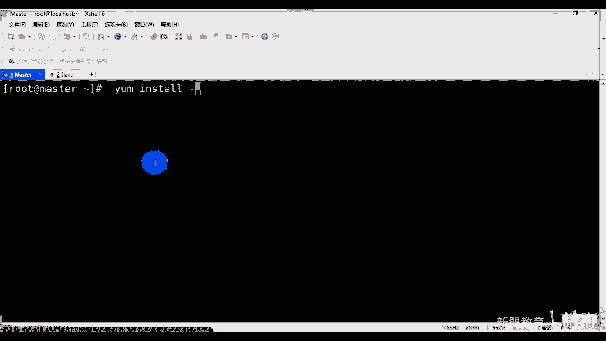
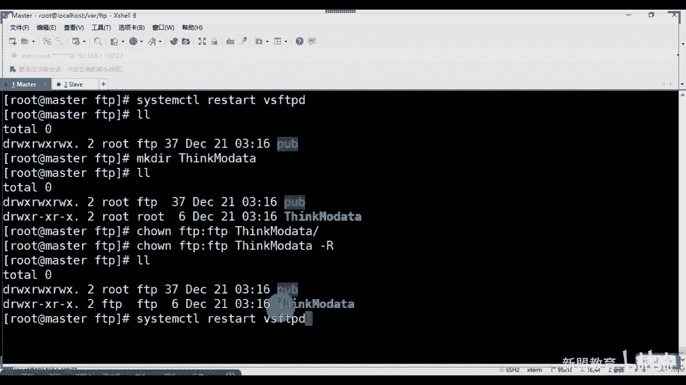
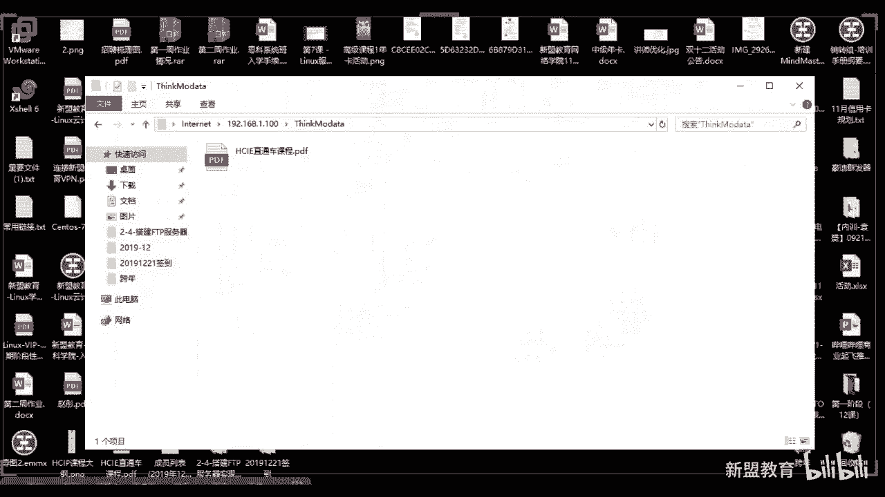
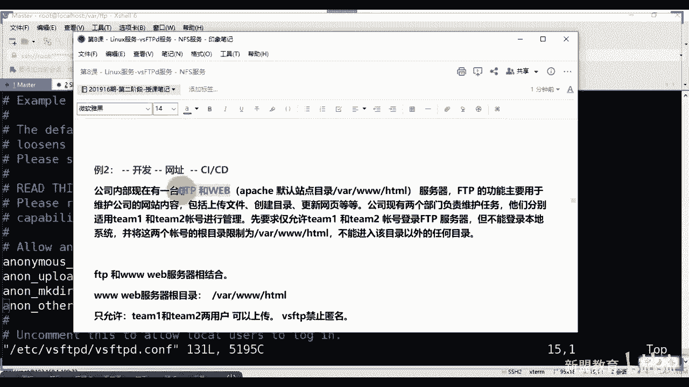
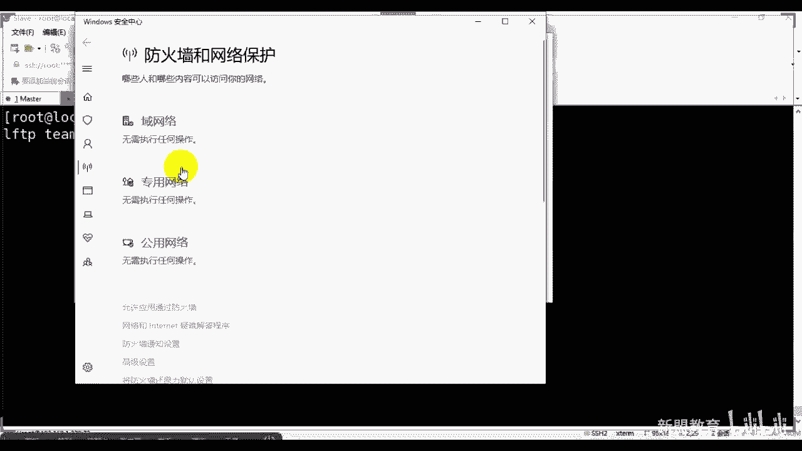
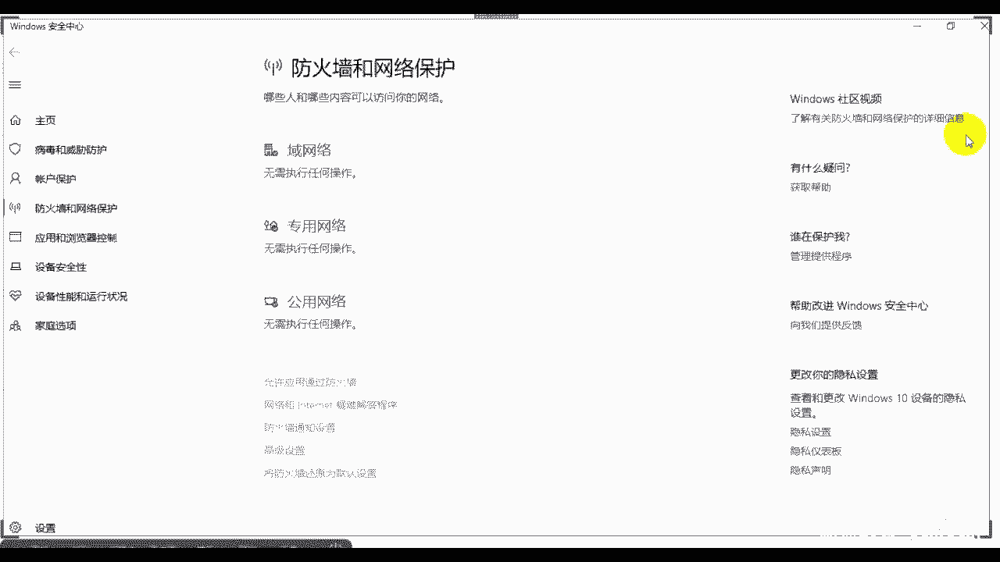
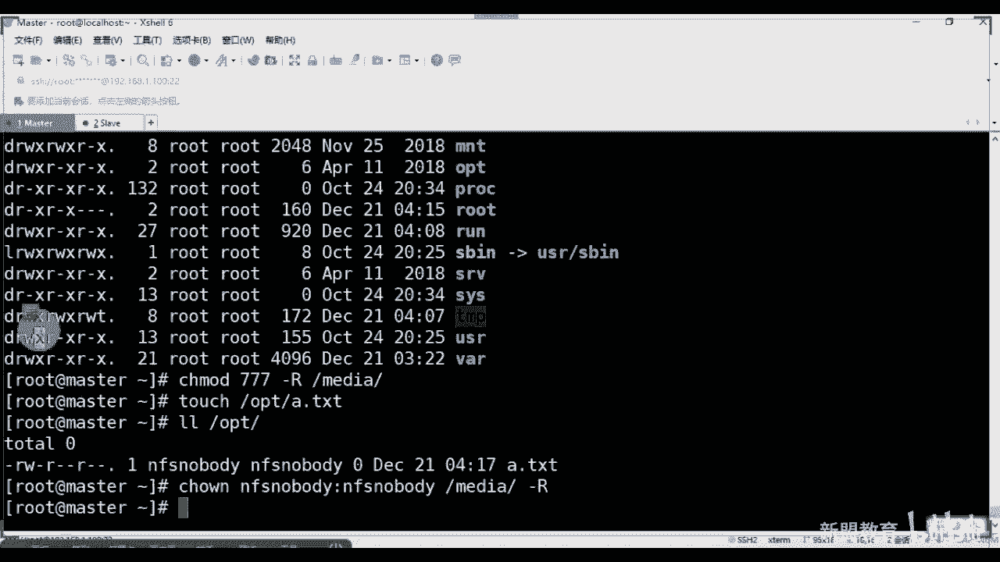

# 2021最新Linux-RHCE运维实战课程 - P8：RHCE-第8课-LINUX服务-NFS服务-2 - 新盟教育 - BV17K4y1t7XR

。

linux可以吧。啊，O了，录屏打开了，我们开呃讲完FTP啊，争取在一个半小时之内啊。然后呢我先给你们一个给你们一个一个一个文件啊，这个文件的话一会儿我们会用到好吧，这个文件我们就会用到。

大家可以在自己的网在咱们的官方哎在咱们的系统班区里面下载啊。啊，这个软件好吧，是一个我们嗯一会儿会用到的啊，一会儿会用到的。

就安装就好了啊，安装就好了。然后呃再补充一点刚刚上节课没讲完的东西啊，就是我们这个位置看好了啊，FD呃这个DNSpo对吧？我们把它登录一下，看一看啊。啊把东下看一看啊。走。啊，两我这边有两个网址。

好像是。

啊，看这个啊，这是我们公司的这个啊，给大家看一下啊，呃着急别着急啊，先到这个管理台啊，管理台。那么在这个位置看了，这是我有两个域名吧，对吧？两个域名吧，那么我们随便点进来一个啊。

比方说我点的think点com可啊，我现在用都是免费版套餐啊，可以看到在这个位置上有个有个路线选择吗？看到没有？这都是默认的啊，这都是默认的默认的如果是他们是电信的就走信联通的就走联通了吧啊，看到没有？

它里面会有一些个这个这个这个这个这个不同的IP址BBCN是吧？3W点CN啊，都是A记录看到没有？那么默认的这都是啊正常来说你可以改看到没有？电信联通交易移动铁东境内境外看到没有你都可以去找看到没有？

只要你是从百度来的，我就定位到这个地址上去明白了吧？啊，这么回事啊，那包括在这个地方看像我们的像自定义线路自定义线路，当然我这边没买套餐啊，我都用默认的像分组吧线路分组你可以看一下它的套餐。😊，啊。

你看一下它的餐，因为我现在是纯免费的对吧？那你看如果说是这这个这个这个付费的啊，可个人的啊，看有同学们我们一个嘛增境内四大智能线路分线，对吧？然后12个DS分布节点，看到没有啊，然后5级的子域名。

一共有5级是吧？点点啊，120秒的TTLG地址看见没有？然后4条U样转发，然后10条负载，看到没有啊，3个G的流量功房等等等，看有这么多啊，这么多一个呢你可以在它上面直接买域名。

一个是你可以把一些个域名导入上来，看到没有？我记得有个域名导入的啊，我忘记在哪里了啊，你可以自己去找找好吧啊，就是这么一个网站啊，其实说了Dpoint像新网和外网其实都是这样子的。早期来说好吧。😊，啊。

刘言无归症状看今天的最后一个题目叫做FTP啊，叫做FTP啊，很长很长很长啊，又是一长一又是一节满满的课是吧？那么FTP的话解述一下叫做叫做fi transfer对吧？叫做我们的文件传输协议，大家注意了。

那我本身是可以基于linux和windows之间跨平台的文件传输啊，跨平台的文件传输而最后的话还会讲到叫做NFS啊，NFS算是存储，但是它其实只能用于linux与lins之间理白吗？

windows是无法检测到NFS啊，拿进来，那么FTP默认情况下是基于我们的TCP协议的，这个没有问题吗？同志们啊，那么也是最基本的CS模式。那么C端的话，一般lins或者又要接束了啊。

或者说是你的这个这个这个啥呀，或者说是。你的这个这个lindux都可以搞。当然了，FTP我其实也建议大家用windows去做，好吧，我建议是用windows去做。你要是lindowux的话呢。

它其实会有一个叫做加密SSL加密。啊，这个还是有点搞头的啊，还是有点搞头的啊。啊，问什么写也可以了吧，我还真没太注意啊，性能我们也在看。那往这看啊。那么客户还好，这是这是服务气。hello真的服气啊。

这个是早期的。如果你们早期谁做过IDC运维的话，可能就用到它啊，用到这个叫做ser啊杠UFTP这个的bug贼多啊，bug贼多。虽然它也是基于FTP的啊ITCP的，但是bug贼多漏洞贼多。

特别容易被攻击啊，我们现在一般的话都用的是这个啊，用的是这个啊，所以这个就是我刚刚给你们的，你们呢也可以打开整个的百度去搜索一下这哥们是吧？😊，看一下啊，这哥们儿在这呢，你就找到他的官网就好了。

找到他的官网是吧？郭老走睡个吧啊，这个开始啊。看一下啊，是这个啊。啊。你们也在用是吧？啊，看到了吧？叫做f机了啊，机了。那么这个地方看怎么说？上面就是客户端的，底下就是服务端的啊。

目前来说这个好像是不支持linux的服务端啊，不支持linux客户端，还不支持linux服务的，我忘记了啊，但是我觉得他做的是挺好的，也希望他将来可以支持吧。好吧啊，也是希望他将来可以支持啊好吧。😊。

嗯。看内嵌了是吧？现在啊可以，然后往来看往来看啊这个刚刚我给你们的网站啊啊，你们公司用的就是serverU杠U是吧？那个其实大还挺多的啊。呃，麦克里基本上是没有的啊好，然后这个的话大家可以先装一下啊。

可以先装一下，反正我电脑上没有装啊，本来我想。

给你们按照我们这个这个这个这个什么去讲的，最基本的讲，那我觉得还是用这个吧。因为这个的话，你一会儿在学这个加密的时候，你可以看到认证的。啊，预行。啊，是成不装了啊，如果下错了，你就没办法了啊。

这那还挺难下的了。Iry是吧？😊，啊，loading data就是only check be，哎，等会儿啊，得等会儿啊，得等会儿O然后anyw who use this user是吧？

only for me啊，可给任何人就可以了啊，所有的都下一步啊，用才20多兆20多，对吧？很简单啊，我们把它放到我们的本地的增家啊，LTP杠cl。啊，你尽可的注意啊，你尽可能在你安装的软件上。

也尽可能的全都用英文，明白了吧？啊，路径也都可能用晕了，不要用什么。呃，奇奇怪怪的中文是不是啊没有，那我觉得那个东西真的就是其实我我很老的时候，像IDC里面就在用它。但是实际上我觉得bug是很多的啊。

不如这个东西来看啊，你看。

啊，稍等一下啊，大家可以看啊，一会儿我们再来看它好吧，一会儿我们再来看它啊，先看什么，我们先来看，接着看我们今天的重点啊，先把它装好了就可以了。那么此时是没有连接服务器的，看到没有？

我此时是没有连接过去服务器的。😊，还有同么砖啊，是没有的啊，那么一会儿呢哎，稍等。我关掉是吧这好像窗口有点小啊，没关系啊，先看啊。那么客户端呃，而我们今天用的啊服务器的东西啊啊，对，那个是不简洁。

但是呃简简单，但是绝对的就是不稳有bug啊。VSFTP这是我们今天主角看名字你就明白了，是吧？Vvery secure啊very secure啊，那么它也是一个开源的。大家起来也是一个开源的啊。呃。

本身的话20和21的端口。不用我说了。来，大家看了，这两个区别啊，记住了，21传指令，这个是用于连接22传数据用于传输。😊，好吧，英语传输。所以当你启动了，注意当你启动了FTP之后，我问大家一个问题。

我是启动哪个端口？😡，啊，当我启动了FDV，我会启动每个账号。😡，啊，行了，那个不着急了，咱就不说那个了啊，好不好？😊，咱就不说那个了啊，重点的往我这看好吧，重点的往我这看。啊，启动哪个端号？

重点呢是我们启动的是21端口啊啊，谁说20端口的是吧？记住啊是21端口明白了吗？啊，你启动服务是要等待连接的，不是等待传输的。啊，一会大家可以看到，一会儿可以看到啊。

那么呃这个我就不说了FSP是吧文件服务协议基于它的啊，那么整个流程看到了，这个我是直接在网上给大家截图了，我就没有太细梳理啊，那么两种模式，一种是主动模式，一种是被动模式。看了，那么主动模式什么？

带好了，主动和被动的对象都是针对于服务器来说的。如果是我的主主动找客户端去连接，那么叫做主动。如果是老师我等待客户端来找我，我就是被动明了吗？那么主动的时候记住两个通道。第一个通道21控制。

第二个20数据啊，主动模式的时候，是我的客户端需要连接到服务器的21端口，大家只得注意了啊，我主动去给你发发送用户名和密码，那么客户端会此时随机的开放一个大于1024的端口。😊，叫做浮动端口。

我之前说过了啊，然后我的数据，我的主客服务端啊是通过20向我的向我的。😡，这个幅读的口去发送出去了，能理解吗？同学们。😡，而被动呢。😡，然后哈自己看一下啊，这是主动的啊，而被动呢哎也叫passive。

也叫passive啊。那么是我的客户端主动的去请求我的FTP的21端口，这点是没问题的。大家能理解吗？啊，也是发送用户名和数据。了啊，但是是我服务端随机的开放了一个大于1024的端口，为你去发送数据。

这个地方就不用20了。所以大家可猜一下啊，我们在生产环境用哪种。😡，生环境有哪种，或者我们在日常工作里面哪种。😡，被动啊一定是被动啊是吧？你你们哪有天天的夫妻往往往外飞嘛，对吧？😡，啊。

一定是被动住是默认的啊，打起来啊。那么呃所以问题啊，就是被动的，这是默认的，它其实目的是要跳过防火墙。对。啊，哎，所以防火墙很难搞啊，哎，所以要跳过防火墙管，它的目的。😊，对吧啊，看起了啊。

所以此时往下做啊，那我们安装软件了，这个没什么理论性可说好，直接开始安装。好吧，同志们，那么主的话，我们安装的名postse name master哎又多了，刚台。😊。

啊，要么insstore杠Y大家请注意了啊，我安装的服务端叫做VSFTP没问题。但是我其实还有一个客户端叫做LFTP对来，这是linux的客户端，叫做LFTP明了吗？哎，VSFTPED。

好，和LFTB。把这两个装上啊，把这两个装上，对吧？所以我slo上只要装一个叫做y么。😡。

一store杠为LFTP就可以了。啊，对。一会儿会用到它，一会儿会用到后面的东西啊。先安装啊先安装。那么安装之后注意了啊，安装之后啊呃当了这个LFTP从6开始的话，大家注意了，从6开始的话，呃。

我们就没有FTP的标准客户端了，取而代之的使用的是LFTP是从六开始用的啊啊啊6之前是没有的啊那么我们就是说啊那么其配置文件，我们重点是看配置文件啊，都是在ETC下角的VSFTPD看到没有？

都在这里面的，啊，在这里面的。那么有4个，大家注意了，这个不用我多说了，这个是个脚本是吧？但这脚本一般不怎么用啊，记住这个脚本当他没不存在，看上面这三个，第一个来说。

这个是我的主配置文件核心配置文件好吧？第二来说，FTPus大家记住，这个是黑名单。😊，对了吧？这个是黑名单。😡，起来啊，那底下这个user好吧？user list记住啊，user list既可以是黑。

也可以是白。关键看这地方啊user list。走了。CDDCVS啊CTV呃user对吧？关键看这个位置。看到吧？如果此时我默认的等于的是no，我等于是no，我们会允许user。😡，白名单。

如果我是yes，就是黑名单。😡，而默认是黑名单，能明白吗？同志们。😡，所以这俩的作用是一样的这俩的作用是一样的。目前来说，默认情况，这俩目前来说一样的啊，进来。😡，然我们就说啊然我们就说。😡，哎。

呃这个脚本的话是我们VSFTP操作的一个变量或者它的一个脚本啊一些变量啊，你比方说还有一个是我们的腕下，还有一个东西啊，在这里叫做腕下FTP知了。里面有个pa爸，这什么？这是我默认的共享目录啊。

默认的共享目录，而，但是是匿名用户。😡，所以在FDP当中有三种登录形式，第一种叫做匿名，第二种叫做本地，第三种叫做系统好吧？同志们最安全的是什么？系统统可了啊。😡。

你没用货。好，本地用户和系统用户好不同志们，我们直接做实验的话，我就带大家做一遍匿名的和本地的。好吧，匿名和本地最大的区别是什么？同志们就是上边这哥们儿。😡，啊，用户名很简单，叫的是匿名，匿名叫什么？

叫做animals。啊，咱们拼来这个单词啊，到这了。😊，啊，这呢看见没有？匿名用户单词这呢，用户名就是他。啊，密码是吧红。对吧密码空，没有密码。啊，然后本地呢。这个是用户名在哪呢？同志们告诉我。

用户名就在你的ETC下。😡，对吧classssword下哎，这个可登录用户。啊，可登录用户啊。哎，sorry。可登录用户啊，密码相同。啊，就是你们的用户密码。第三种呢啊系统用户啊，用户名也在这个上面。

但是是不可登录的，明白了吗？但是不可登录的。进来啊，所以你告诉同学们，他有密码吗？压根儿就没有密码，对吧？啊，我们的老师我怎么登录呢？哎，你说这个了啊，记住啊，我们是要做映射。😡，是要做映射，明白吗？

我其实是把你映射成了我们的新用户了。😡，啊，所以我这边做的这个东西也叫做也叫做虚拟用户。啊，一个的虚拟户。我们这堂课主要用的是这两种方案啊，这种其实不用多说是吧？这种其实不用多说啊。好来看啊，同学们。

那么启动用户对吧？启动。

sableCTLstarB。SFDPD。啊，打错了miss。走，默认端口来看一下吧。😊，是不是只有个21啊，看到了吗？明白了吗？你看看U里边也没20吧。😡，是不是就有1个21。😡，聊好了，同学们啊。

为什么我现在还没有数据传输呢啊，还没有数据传输的啊。😡，啊，对吧。😊，好，那么此时我们来做一个呃小练习啊，比方说说我现在在这边装了FRFTP，对不对？192。168。1。100，看到了没？看到没有？

这你就已经登录上来了吧，看到了吗？看到了吗？get什么什么或者put就是get是获取put呢是上传明白了吧？😊，啊是铺啊，是破还是铺铺的 put的啊铺的，对吧？啊，两个单词就可以了。重点的不是它啊。

这个东西我们不这么用啊，我们不那么用啊，大家来啊。好，我们做什么记住了啊，往这看。如果此时我默认情况下使用的是匿名用户，所以我只需要看好了，在这问题，192。168。1。100用户名。😊。

复制一下啊，这单词老帮拼啊。老忘了拼。来叫做animals是吧？来，密码有吗有吗？告诉我有密码吗？😡，有没有人吗？有没有？没有啊没有啊，此时你只要点击，只要保证你的防火墙是允许的就可以了啊。

快速连接就行了。看到没有同学们啊，确定。啊，注一个问题啊注个问题。😊，你可以往这看啊，往这看，这是我的登录日志，看吧？而登录日志上我会告诉你一个问题，哎，正在监里链接告诉你不安全是吧？

不支持FDP over TS。😡，讲不样？那么已登录看没？登录成功，感觉了此时这是你本地的地方嘛，是不是你本地看到没有？本地的在所在的目录所在的文件好，这个是远程的站点。远程站点告诉你了是paub。

看到没有？😡，是怕爸吧，那p里面有文件吗？没有是红的，理解了吗？😡，啊，是不是怕吧？好，此时注意了，此时注意了，我要往里面放文件了，可以吧？比方说。😡，随找一个啊。呃，找桌面好吧，找桌面。

我们随便放一个算放一个，比方说像我们的。像我们的。大纲是吧，是上我们这个阶段性，我们上传那右键上传看出现问题了，这什么问题告诉我。😡，这啥问题。

看报错也很清晰吧。😡，看同学们想应55050什么告诉你permission deny权限不允许，严重的文件传输错误。😡。

对吧什么权限，你告诉我看一下啊。😡，呃，我们是Y下FTP下，对吧？啊，我现在这么选项，我现在挺多的把大号了，我是不是少一个权项啊？😊，爸。W是不是得有？😡，你要子是不是得有W？😡，没有写吧。对不对？

没有写吧，加上W，把所有都加上AW啊。😡，好，来看有了吧。好，老师，我重启VSFTP。😊。

重启啊，然后我们再来看这地方在链接啊，sorry没没写那什么这个。😊，AOOR。啊，MOU哎，对，怎没来着，又忘了啊，不好意思啊。😊，好。哎啊我。YM1啊连接的哈连接。😊。

放弃之前的啊呃在新标签进入新连击就可以了。大家成功了吧，成功了啊，点击来原程站点进来，然后我们再上传。😊，啊，再上面来。走。走，再看再看此时还是失败，为什么呢？有人能猜到吗？😡。

为什么我还是要我有写的权限啊是吧，我有写的呀。😡。

多写的呀。索除了缺陷以外，要看什么？😡，还看什么？还看什么看啥呀，文件名看这儿啊看这儿啊。😊，你们告诉我你拿入的登录吧啊。😡，是不是看你的目录的属足和属足啊。😡，这两个东西你可别忘了，我都是root。

我是root嘛，FGP用什么用什么登录。😡，用什么登录啊用什么登录告诉我。😡，做什么FTB码。😡，可以看到这个位置吗？大家看到刷一。😡，看了吗？啊，所以你怎么办？😡。

那你怎么办授权吧。能理解了吗？能理解吗？同志们。可能你还不理解吗？啊。😮，可以吧。看这样子就可以了嘛，对吧？然后你们再尝试一下啊，把这个过了，真没有用了。😊，然后有没有在长时间？

啊，重启一下啊重启一下啊。

都充下来连接一下。到。走。链接对吧？进到pop里面去啊，ACL也可以ACel也可以。😊，你用哪个就，我随便传一个啦。😡，哎，大家看还是出问题了，是吧？啊，我把它拖过来试试有用吗？好，注意啊。

这个问题上还是我的权陷错误。大家想想还有什么问题？😡。

注意啊，还是我缺陷错误。选错误卸载了，跟缺载有什么关系啊？注意问题啊注意问题啊，其实你正常情况下的话，应该进行整个FTP的，看到没有？在哪呢FTP看到没有？你忘了，你这个全击组啊，还没做呢stmo。

我把这都关了啊，这些东西都关了啊，对吧防火墙什么都关了啊。😡，注意一个问题啊，是你的属足的氛围。好吧，你们要注意属足的氛围啊，同学们。😡，啊，C是OWN啊，C是OWN我们给他的是什么权。

是给他的FTP对吧？FTP你知道说我怎么知道它是FTP运行的，你可以看一下PS杠EF杠FTP。😡，看同学们，我是不是FTP运行的？😡，看到吧？我是MGB运行的，当然了，也有nobody，也有root。

这三个用户我都能，是不是这三个用户我都能啊进来。😡，好，我们重新授权CHOWN。FTP冒号FTP好，我们给的谁啊，给的是我们FTP。啊就应该干R吧，干R吧，对吧？好看看FTP啊，在这儿。😊，可以了吧。

可以了吧？啊，然后systma CTR restart VSFTPD。走，同学lastice data杠LNG。21启动正常啊启动正常。然后我们再来连接一下这边的话，ANONYMOUS。

对吧。到这。啊，我应该操作就好了。啊，哎无法连接到是吧？哎，啥情况。😊，收到啊。啊，我把它换一下，哎，突然突然尴尬了啊。是我是我名字错了吗？ANONYMOUS。

But reforcing to run with ratable root is such root是吧？啊。password没问题啊，呃，还是给他改回来吧。哎，CWN这还得是root是吧？

FTP。稍等一下啊。不打哥。唉，这跟跟跟客跟跟windows端还不太一样啊，跟windowswindows端的话，你可以这么改啊。😊。

是不是啊？啊，这就可以了是吧啊，这就可以了啊，行吧，那我们还是进到里面来规矩的FTP是吧？然后这里面的话CHOWN我们重新给一下杠RFTP冒号FTP好，pop注意啊，这个不要用杠啊，不要用杠啊。

组合着FTP对吧？用户不换就行了啊。好呃，我们把前面给个root吧，还是。

啊，给个root吧。这样可以吧这样可以吧？啊，那么我们尝试先尝试拿自己本地的去做一下，连接一下啊，看一下啊，本地接怎么用FTP冒号杠杠能理解吗？啊，本地化FT冒号杠192。168。1。呃，是1。

100对吧？1。100好，直接回收。大家看可以看到吗？我是不是登录进来了，能看到吗？是不是空的，现在是不是空的。😊。

啊，那么此时我们上传一个东西。

啊，上一个东西啊，你比方说我把什么上传了吧，不能随便上传啊，不能随别上传啊。是吧呃你比方说把我们的一个文件上传了MVB对吧？啊，将文件复制发生错误是吧？请检查是否权限将文件哎，这个权限又有问题啦。

permission又 deny了是吧啊。😊。

哎呀，这就尴尬了啊，我们看一下缺陷啊，CHOW这里面没有问题啊呃。😊，我想想啊，ACL我看看ACL啊呃ACL。😊，Get。😡，Fexel。怕泡。看看有吗？有问题吗？没问题吧，owner看到没有？

都是可以的，没有excel啊跟exel是没有关系的啊，跟excel没有关系的啊。你想想啊。😊，🤧嗯。我想一下啊，看一下我们的配置文件啊，哦我是没有配置配置文件好，注意了啊哦，忘了配置文件了啊，FPPD。

😊，VSFDVSFD点com对了啊。😊，啊，不要着急不要着急。但是呢我忘了说了我忘了说了，这一同学问题啊在这里。😡。

在这里啊这些问题啊，我忘了忘了配置文件的事了啊啊，我现在是允许匿名没问题吧，我现在是允许匿名吧。但是请大家注意告诉我，我现在有允许匿名上传匿名书写吗？有吗？你找找有没有大家没啊。

这个local是表示本地的reci表示也是本地的。😡，看见没有？local mask也是本地的，没有任何事匿名的。老师我匿名想做怎么办？告诉大家，在这边。

第二天叫做ANON更 uploadload是这个权限啊，我忘了跟这个权限的。好，等于yes啊，因为刚刚不小心那个不小心还原了一下快照啊哦好吧，然后这个是允许我上传ANON杠MKDR。😡，啊，对。

不允许的啊。WRIT。😡，啊，WRIT好，同学们杠ENABLE等于yes好，什么意思啊？允许我的匿名用户进行写入，能明白同学们啊，进写入啊，大家只时注意一个问题啊，只是一个问题啊，我只允许你上传。

允许你写入，看见没有？我允许了你删除吗？允许吧？😡，允许吗？告诉我允许吗？不允许吧。如果我要是允许的话，怎么办？记住了，要再加上一个东西，叫什么呢？叫做other。😡，Goup， rational。

WRIG。杠ENA标1。都是下划线啊，注意啊，这里边的话一个参数大小写啊，注意啊哦，所以把这几个都加上。😡，啊，把这几都加上，然后你再看速就可以了。我忘了，刚刚我以为我那个没出没有重重重新的推镜项呢啊。

看一下，这样子我们再去做AN。

ONYMUS好连接一下coursese连接连接起来进来之后，大家了，我们要上传了啊，见证契迹了啊。哦，是吧？看传输成功了吧？😊，收成功了吧？😡，说中了吧？啊，此时你才要注意的是你的属组的权限了啊。

注意你的属组权限一定是要这个样子啊，一定要这样子啊。并且带好了，其实你要变成755就行是吧？啊，755其实也可以啊啊呃OK往下走啊当然了，请大家注意一个问题啊，请家注意一个问题啊，呃。

这个只是我们默认的，明白吗？默认的，那么如果说老师我现在想要实现让公司里边自定义去创建一个目录。比方说老师我还是在这个下边去创建MKDR。😡。

好，我们创一个，比方说thinkable date。可以吧。😡，注意权限啊。啊，C组OW。FTBFTBthink about这个它啊注意啊，这个地方杠2走。😊，然后带好了啊，上好了，我们来显析一下啊。

这里面啊是不是好了，我们还认它为755，我没有给W我没有给W。我想问大家一个问题，如果此时我重启服务，我们还是用我的ANONYMOUS连接的话，问大家一个问题，你们觉得你们觉得我是否能够上传它。😡。

我是不能么上传的？😡，想想我是否能够上传？等下。讲讲讲讲行行行行。小长。对呀，哎这里面没有显示出来是吧，现在。没显出来啊，W是吧？

🤧LGP啊，这没有改的还啊还没有改呢啊。想想先想一想先想一想。😊，你想一想啊，那么此时首先来一个问题答出意了啊，我们现在是把这个文件拿出来，写不了打传。哎，别着急，别着急先别着急，先别着急啊。

先思考一个问题，我能否去传好吧啊，这个地方我确实连不上来没关系，但是看了，如果我在我的本地上去做做什么啊，THINKMODAT。

对我能进来吗？我能进来吗？😡，我能进来吗？😡，注意啊注意啊，我此时通过这种方式，我只能默认找到的是你在目录下规定的，但是并不能够进行。😡，这地方对白吧？这个是你要手动输入的。😡，练了吗？

这是两个小bug啊，接拉，同志们。😡，拉进来好，那我现在老师我现在是755的权限，我能不能传上去呢？来试一试。😊。

不可下传上去了吧。

穿上去了吗？😡，哎买票我刷上去了吗？哎，老师，我没有权限。😡，是不是我没有选项，为什么我能了？😡，为什么为什么？😡，为什么？为什么？

当了，你别忘了，不是哎，你忘了，你最终要看的是你的配置文件吧，对吧？你最重要看的是你的VSFDB，你是不是给了权限了，给了吗？😡。

可了吗？按，允许的理解了吧，允许上传的。OK吧。😊，啊，这是很重要的一点啊，请大家记下来。

好啊，那么往这边看啊，然后再做一个小例子，再做小例子。那么此时你的公司里边现在有一台FDB和一台we部服务器。来，大家注意了，web服务器我们通常指的是阿帕奇，而阿帕奇默认情况下。

我们的站点的目录是V下3W。😊，啊，H这没有。注意了，FTP主要用于的是我们维护网站的网址的代码的上传，文件创建目录、更新网页等等。对，没错，用的是用户权限啊。那么公司现在两个部门然好了。

负责他们分别适用于TM1和te目2账号进行管理。首先要求仅允许T1和T2账号登录FTP但不能登录本地系统，这就是我们的匿名用户系统啊，主来叫做系统用户，能理解吗？大看香香。我用这两个。

但是这两个不能够登录本地。😡，能解吧？并且我要把你限制在我的这个根目下。😡，好的，这是经常常用的一个方式。为什么你们公司有开发吗？😡，有网址吗？同志们有没有有没有啊，问个问题啊，你的网址更新了。

你的这个开发FTB登上去了，瞎做给你删除了，你找谁去，你背过知道了吗？所以记住了FTB结合站点去做，这个是在生产环境当中经常用到的，请各位注意啊，当然现在有CICD了是吧？我们到后面讲到的自动化。

有CICD了。😡，啊。再说，但是前期的话你们要明白这个问题啊，好吧？那么结合它去做怎么做很简单啊很简单，对吧？那么我们的站点目录，你可以去安装阿法奇。😡。

亚马in斯做杠Y是吧？什么什么HTP它会自动生成，你也可以自己创建。我这边的话就装了啊，我们这边就装了啊。😊，啊，装了啊哎。😊，来稍等。那么简单先分析一下啊。

我现在说老是想将FDP和我的web服务器坐在一起。好，这是我们企业经常用到的方式。没问题，这样是方便实现对我们网站的维护，由开发自己做，但是我也为了增强安全性，防止你对我其他目录误操。

首先我需要使用仅允许本地用户访问，匿禁止匿名用户登录，没毛病吧，规则嘛，对不对？然后我还要使用我们的C rootot命令干嘛？哎，将我的team一和team2进行锁定，也就是牢动机制。😡。

锁定在我V23WAT楼下。😡，当面同志们。小啦。😊，所以我们来看一下怎么做啊，再来看一下怎么做。第一步，老师，我先创建用户A的。还用看到吗？呃，不是teamV和te2，是你是是开发与开发之间做对接的。

好吧，是开发与开发之间做对接的嘛。😡，对吧你们版本控制，那是开发与开发之间的事情啊，哎，我这个什么？这个是开发与运维之间啊，好不好？那这个啊 no logging。起来啊，keep1TAM1好。

再创一个TAM2看到了？这两个是我的系统用户吧。😊，明白明吧？同时知了给他密码啊，123456啊，他也可以有他也可以具备密码啊。杠杠STDN。TEAME。啊，PM2。量可以了吗？为什么不杠R杠R啥呀啊。

不创建加目可以啊啊，我就简单写了，都可以啊，细致一点。好吧。那么然后的好了CP我们把这个这个这个这个VSFDPD。😊，啊，我们做个备份，好吧，刚刚忘我做备份了啊。😊。

官忘了做备份了VSFTPTVSFTPD点comfor做个备份。好，此时看好了啊，准好了。呃，我们要去写一下VMEDC下VSFTDVSFPPD点com。

对了，同学们啊，现在请你将这三行全部注释删掉，明了吗？全部注释啊，不要给它默认啊，注释。如果你不好控制，你就把它删掉啊，接来那往下面走，那往下走。

啊，第一个这是允许本地能理解吗？于是本题我说了，你要禁止匿名，对吧？所以这个位置要写成。No。行了no啊，允许本地local installstorelocal enable允许这啊。

再往下再往下是什么？呃，我们的rightable再找一个啊再找一个啊。😡。

搭好了，在哪一行呢？s number找后找到我们的100呃，找到我们的100行左右吧。100GG。可以看到这儿吗？大家可以看到这儿吧？😡，看到这个位置了吗？😡，看这位知道吧。干嘛呢？告诉干什么的？

这是这是做什么的？😡，是不是我做牢笼的？😡，牢动机智的啊进来。哎，做劳动机制的啊好，所以在这个位置上情况拉好了，我对什么？当然你这块不用改是吧？这是默认的啊。但是我现在要做的是很简单好，改好了。

叫做哎我们要增加几行啊，增加几行，叫做local，让我找找有没有它啊。😡。

没有是吧，没有啊，那我就改吧。😡，改吧啊，在这个位置上加一些叫什么呢？叫做local杠root。😡，本地的。😡，默认的根目录。进来啊，分离一个目录。第二个sarch root list。好。

我们有没有限制啊名单啊，有没有有限制名单吗？同志们。😡，对不对？名单嘛？第二个老师名单在哪里？s rootot list file，我们把它放哪里，放在这里。😡，对吧最后allow这样要写allow啊。

WRITEABLEreible rootot到了在这个牢笼下，我们具备可写的权限。理解了吧？没有吧。劳动机制在哪里啊，允许哪些个用户用户的文件在哪在这里，对吧？并且我们具备可写的权限。来，这个没有的。

啊，好，保退出。啊，反现这些东西我都在笔记里面给你们准备了啊，然后我们去建立刚刚那个文件吧，同志们啊想想哪个文件这个文件。😊。

这个文件对吧？这个文件得有吧，复制下来，不过就复制啊。好，VMEDCVSMP创建它里面是空的，里面是空的。大家请注意啊，那么此时这个东西怎么去写？记住了，一行一个用户。😊，TEAM1TEAM2看到吗？

如果更多了各起一行啊，各起一行拿起来好，保存即退出到此为止，这个文件写好了。明了吗？除此之外，是来本地的啊，那么老师CMOD看好了，我们用一个O。😡，加上W。啊，沃3WAT吧。可以吧。

让别人都能够去读取我没有密码啊没有密码，先不用行密吧啊，不用行码，先别着急啊。😡，没有没法，这地方啊，然后我给个个R吧，跟个R吧，让我们其他人可以进行写入，对吧？😡，好，同学们看一看啊，别下啊哇下3W。

可听没有？要错了，开见没有？凯霞听见了吗？😊，明白了吧？来看到刷页啊，具备了其他人是具备了root去看其他人不是root理域没关系啊，对吧？因为你不知道是谁嘛，你的用户名我没法控制啊，所以我只能是给O。

是不是哎，然后我们只需要重启我们的FPP。😡，VSFBD。啊，All， restart了。走启动成功啊，行动成功。来，同学们，我们来测试一下啊，测试一下TEAM1对吧？密码呢这个位置要密码，理白没？

林峰，这个位置要密码啊，123456。😊。

走。连接一下要保存吗？啊，保存就完了。那我们这边点击保存就好了啊。走。😊，来看是不是连接上来了。😡，可以看到吧？看到吗？啊，又退出了是吧，又退出了，但是告什么是无法连接到服务器是吧，又退出来了啊。

但一开始其实连接了是吧，正在进行连接。好，再连一下。😊，啊，不安全的建立是不是不安全的建立啊，1-6在哪配置，这不吗？😡。

是不是。好着看。😊，走。还有。😊，明白不？能看到不？能看到不？啊，TM1TM21到6啊好。

OK那我们就说啊呃这位置上我看一下，我看一下是是是是哪里有问题啊。好。123456，大家注意，此时这个端口你真的不用写这个端口默认就可以了啊，快速连接。稍等一下，我们让他连一下，连不上去是吧？啊。

loing错误inqui我这边重新再启动一下。

走啊呃stem防火墙再关一下，是防火墙围关吗？是这意思。销落的。Get。beforcing啊，可以的都可以的啊，appytable。再清一下就好了，再清就好了。呃，文件圈跟完全全没关系跟完全没关系。

我们看一下这个地方CTword下log下security，对吧？这个是我的TAM啊，跟team没有关系，对吧？看同志们。😊，看到。在这儿拿。在哪呢？看一下，不是他，对吧？你是肯定登不上来的，看到没有？

😡，这是刚刚变密码的地方，对吧？然后呃注册了我们认证的客户端，通过这种方式啊，通过这种方式。你们看一下，我们通过SU杠STEAM过不去吧，过不去吧啊，这叫系统用户那帮同学们系统用户。

但是我们尝试拿这边试试啊，拿这边试试啊。啊，LFDB是啥呃，192。168点。标68。1。100，然后我们用一个杠U。TEAM1逗号啊，知道了，逗号啊，123456。拿密码看登上来了吧。

就这边登上来了是吧？😡，啊，这边登出来了，看到没有？看到没有啊呃我可能知道是哪里有问题了，看看啊我试试啊。

呃，这可能有点危险啊，这能有点危险。啊，这个有点危险了。啊因为我这边通就没关是吧？😡。

哎呀，关吧，你们说关吧。关吧。关吧关吧，先给你们关了吧。好吧，先你们过了吧。哎坏火龙，这是火龙的啊。🤧咳。先关掉啊先关掉吧。仍然退出对吧？防火墙我试试啊，把防火墙都关掉啊。呃，防火墙设置允许防火墙。

允许应用通过防火墙是吧？重新找一下啊，帮好找。

嗯，windows的防火墙还是有点bug的到时候。啊。关一下啊。拥到防火墙。

咱们的方像是在直播吧。我说句实在话，V1我都不会设置下。🤧上个多冠啊。被连接预没有对吧？所以无序操作一打开，哎，这又打开了吗？软件。🤧嗯。啊，windows def防火枪不可用是吧？啊。

提供的哦用的是火容，所以把火容退了试试啊，把火龙试试退了啊，好连一下。

看这边能不能过去啊？R过不去是吧，1求2这168的TEAM one没问题啊，密码123456，重新看一下啊走。啊，这是应该能过来的啊，对吧？因为你看这边其实已经过来了，对吧？对吧？所以防火墙的话。

这边的话是windows的东西，我们先拿这边看吧。好，我先拿这边看啊，大家可以看一下RSS。😊。

L3大胆再看的com看到没有？lowing下哎出出问题了，是吧？😡，嗯，看一下啊。😊，哎呀，这个防火墙也没有关掉。我看master上啊呃创建的文件目录没有问题。然后创建目录，然后我们给它授权杠R对吧？

然后重启VMETCVSFTPVSFPPD点com。

啊，3到了。Yes。😊，Alo AL。allow WRITEABLED。RITABLEC roototOyYES没问题啊。好，往平说。拍展一下啊。拍查一下。呃，然后VMEDC下。

我们把这个文件得给它写一下ETC下VSF toD然后Croot list。TM1TM2没问题啊。🤧最后一步授权对吧？2。啊list对吧？listRISTlist，然后里边的东西有没有问题。啊。

最后授权CSOWD。吧3W。啊。呃，给他权限的话没有问题啊。加上一个O，加上W对吧O加上W，然后这问题呃我想想哪里有问题啊？回答这个问题啊。重启了对吧？然后我这边应该是能够登录上去的。

因为我现在已经借用了animals了，对吧？本来已经禁用了animals了。呃，我们清除快捷栏吧，清除历史记录一下啊，然后重新连接一下。

哎，无法连接过去。大家稍等一下啊。530无法连接过去。这是啥？呃，530的话无法连接过去。

权限目录吗？我们试一下啊，不是我这边给的是O，看到没有？我这边给的是O，呃，跟你的权限其实没有太大关系。我觉得我们试一下，好吧，root冒号FTB。没，听没有。23W，我们给你们说的东西了。看一下啊。

没问题吧，我改了啊我改了啊，其实跟他没有关系跟他没有关系。😊，呃，地址写的什么？呃，不用写那个NS不用写那个啊，因为这边的话哈它千万不用写，它只是用了一个这个方式。

重启一下试试啊。

🤧嗯。走。等待消息看到没有？21嘛，今天21嘛，对吧？啊，跟着没有关系，跟那权限啊，不是权限的事情啊，不是权限的事情啊。😊，啊，that是不一回事啊，呃，这个不是权限的问题，好吧，这不是权限的问题。

就是网络一个连接的问题。我想想啊，530。🤧嗯。😊，你们是怎么了？把密码改一下了吗？啊，你这灯来了是吧，不支持FTP啊，跟这没关系这个。😊，不是这一步我想说一个问题啊，就是这个是证书，这个是证书。

后边我会做证书，好吧。啊，这我会做整数，你说是站点管理器是吧？啊，我站点呃，你也可以新建站点是吧？你比方说set啊set我们拿这个问题看一下，192。168。21。100端口不用写啊。

这个位置是用证书的，看到没有？一会儿我们会用显示一个证书啊，用这个地方然后登录类型，我们选择是其他其他账户什么东西的，理解吧啊。呃，我们试一下，用TEAM1是吧，123456。对吧。😊，你哪个？啊。

就是正常就是正常。🤧嗯。啊，不这个没关系，这个地方你没关系的。啊，这地方的话，你选择就这个无所谓，它只是显示上不告诉你不行，对吧？你说老师我只要求我只这个只要求这个这个这个使用普通的也没关系啊。

这个东西对吧？不安全，这个也没关系好，连接一下。等一下，这实跟他没关系的啊跟他没关系的。对吧。而连接错误。哎，想想啊我想想啊。😊，🤧嗯。跟那没有关系。啊，对其实我这边昨天的话，我还敲了一遍的。

那要不然我没法给你们截图吧啊，要不我没法给你们截图吧，我换登录名2啊。3456。走。不是你们用户啊，不是你们用户啊，普通用户啊呃我们再试一个啊再试一个啊，我们再创建一个用户，好吧，user add。

啊，我们创建一个目选啊，创一个listthink吧。好吧，然后VMETCVSFTVDCroot。list色啊，再给一个信空。好啦，重启一下。呃，BSB。走password。ecle123456。

走password杠杠ST。点。情况。可以吧啊，等一下。😊，呃，现在是配置文件里现在没有使用啊，ETCVSFDPVSFD这里边我不改了吗，对吧？这里边我不改了吗？往上走。

怎么关掉了啊，这个位置感该关掉了啊。😡，看到没有？😡，不是匿名啊，第二个位置的话，这块是yes，这是不变的啊，这是不变的啊，明了吧？啊，保安退收。好，我们来试一下啊，试试使用我们的这个地方。

还是因为我们密码太简单了。啊，收到。3456走连一下。啊，可以看一下啊，呃，不能他的意思是不能这个地方的话，不能用lowing是吧？啊，这个地方能不能用low loging啊，进来吧。

那这个地方是冲突了那这地方是冲突了啊，我们本来是想通过这种映射的方式啊，我们做映我我不想通过映射的方式啊呃，但是他必须要登录，那就登录吧。好吧，那就登录吧，让看啊，这常登录。

那么此时大家可以看一下我的站点根，看到没有啊，这个站点是根啊，对来啊，那么我们现在可以上传一下文件，好吧，上传一下文件啊，我们随便给一个文件啊，随便给一个文件，我们还给这个值大纲上传一下啊上传成功了。

对不对？我看一下我是不是真的上传到了这个底下来。😊。

你们觉得上传成功了吗？来上传成功刷一，没有成功刷2。😡，可以吗？可以吗？想想。等下，我权限给了吗？😡。

有了吧有了吧啊，那这个位置我改一下吧，好吧，这个位置我给你们改一下吧。哎，当时我记得是改一下啊，我把这个位置啊。😊。

那我就不设置这一个问题了。啊，这样。

哎，所以这个地方的话，我们是完全没有可以登上去了，可以上传的了啊。呃，然后补充的一个点是在于这个位置上，改好了。现在的话如果我们在上传，你是不是可以经常看到不安全的服务器登录啊，可以到这个位置吗？

可以看到吗？啊，那么我们现在干什么进行一个。😡，证书啊进一个证书，就不是。正常情况下，你至少说我在局域网，其实我觉得。😡，不用啊，局网我觉得现在不用。但是如果你们公司的FTP暴露在了公网上。

你比方说大家好了，像我们的亚麻园，亚麻原告诉我是不是我有公网的呀，是不是啊？要不要是不是有？FTP的对吧？那此时的话我就需要用一个证书去做。那怎么做好了啊，还是在master上。

叫open SS用它去做啊。open SLREQ。😡，杠new哈，这些东西再记下来，好吧，先跟着我记509好，杠nice杠。😡，out VSFTP。低点PM。先记下来啊，key out。😡，啊。

VSFTPD点PM。好，杠呃我们写dase。好，下60。来，简单跟大家说一下啊，什么意思，这些个参数这是你都要用的啊，都要用的啊。这是你即使你后边的话啊，33650都1啊。

35603650都可以啊啊啊呃呃，没关系啊，看好了，注意啊。😡，2。🤢，你后边的话我们学到了HTP啊，学到NG老师，我想把它变成HTP纯S传输的话，我也可以自建证书，好吧，那么自建证书open SSL。

命令啊，后边REQ什么意思啊？大家记住是我们啊，对，只是看董事记啊，别着急。REQ指的是我们一个叫做叉X点509这个协议认证的管理命令。叉509看到没有？叉509差点这跟什么跟那个大家如果你学过网的话。

有个叫做dot EQ。😡，知道吧？知有种东西叫做到德EQ吗？或者叫做802点。😡，多少802。1802。2是吧，这些东西。这些只是协议号，明白吧？只是一个协议号，所以它不具备现制义，只是告诉你。

我用这种加密形式。😡，别吧用这种认证形式。😡，证书形式而已啊，这个就是我拿这个认证管这个证书指出来啊，指出来。哎，然后d此表示了什么？是证书的有效日期能用多长时间十年是吧？啊，正常来说是365天啊。

3650。😡，问题啊，然后往下走呃，这两个hel了什么outgo或更个名字，对吧？out表示的是我设置证书的存储文件，就是我证书存装了一个文件，存到这个文件里面来。

第二PEM大家还记得我们上节课讲SSH的时候，有两有多种方式吗？还家记得吗？是不是有一个东西到做PEM啊认证啊，记得吗？😡，来圾这刷音。是不是有个PEM认证re啊，讲re的时候。😡，还有一个吧啊。

如果你没如果谁不记的话，一定是没做对吧？哎，那么这个是一个加品模块，我们一般来说用它的后缀表示我们一些个证书的存储。啊，对吧。啊，那么证书的密钥，其实证书和密钥会保存在一个文件里面啊，好吧。

这个是设置这个这个就说这是证书，这是密钥，这两个是保存在同一个文件下。OK吧啊，是否在同一个文件下啊啊，所以此时老师我把它生成出来看啊，这里边请你注意填了，注意填了。啊。

你是哪个城市哪个哪个哪个国家是吧？看出哪个国家，中国好吧，中国哪个城市啊啊，天津可以吧啊，local天津啊，这随便你自己去写啊，然后呢，我们这块的think公司，think LTD有限公司。😊，好。

然后底下的话组织名称还是think more啊，还是thinky more好，组织名think more点儿com。

啊，信Q点儿comM。

进来最后邮件是吧，我们可以给一个thinkmore艾QQ点com。啊，平点com啊，你们这个字任意是吧，你愿意怎么写都可以啊。如果你打错了，摁什么，按住cl摁删除键啊。😡，接了。

好，回车大看此时我这个证书和我的妙就生成了，明白了吧？啊，然后我们来看啊，我们去创建证书文件的存放的目录在哪里？告诉同学们啊怎么创建MK第2。

K第2，在我们的VSFTBETC下VSFTD啊，我说了，一般像一些个敏感文件，我要把它创建成点开头的隐藏文件，能明白吗？同学们。

SLK。这是隐藏的啊隐藏目录啊。好CB一下，我们把什么呢？把BSFTB这个文件把它放到我们的这里面去。😡。

可以吗？后分钟上一到这一步啊，最后CMD400。啊，400给我们的这个EDCVSFDD点SSH。

给我们的VSB。400啊大家注意啊，此时这种像认证像像密钥文件，像这个这个证书的话，一般都是最小的，连写都不能写啊，不是没有755，也没有655。好吧，就是1个400最小的权限啊，最小权限。

剩下的我就是如何让我的VSFTP去支持我的密钥，没毛病吧。所以我最后一步要去修改我的配置文件。😡。

啊，不然。错了好，修改我的配置文件点com for对吧？大家请你注意了啊，此时此时我要把我刚刚写那些东西先都删掉。好吧，我要把我这些东西先不删吧，这些东西先不删啊，这些东西先不删，怎么办啊？看好了呃。

我们找一行找一行，我最好是把它们放到一块去啊，看一下，我们写在写在lason下边吧，好吧，写laon下边吧。😊。

好啦。做个注事。😡，🤧做主释啊，叫做confire。我们的SSL。啊，里边有写的参数，第一个SSL杠Enableable。

没有D啊，等于ES啊，老师我要启动E，我要启动SSM。啊，往方往上倒一倒往上倒一倒啊。这下好了，叫做allow。😡，好，ANON白了？这个位置是ANON。为什么我要写出来，我指出来匿名用户是否允许。

告诉我是否允许。😡，no能理了吧？我不允许匿名用户通过我的证书。😡，必须写这句话，最后FORRC告诉告诉我这个单词中间这个单词表什么？😡，这单子表什么？😡，聊什么？😡，这个单词表示。人呢都睡着了。啊。

表示强制对吧？啊，false表示强制啊，不是同意啊，false表示强制啊。哎，强制什么？好了，同学们强制local本地的数据，我们要用SSL。看到没有？强制本地的数据用SS，我们还要继续强制强制什么？

强制本地的。😡，登录。😡，通过我的SSL。看同志们啊这些东西的话，你哎坏了，你都得写上。😡，拜了。😊，还有吗？还有很多个啊，我们一个一个写FORCE强制我们的local呃强制我们的ANON好呃。

我们的匿名用户，如果我们要是去登录的话，强登的话来好了啊。如果你登录，如果你登录，那么我们可以。这个是固定的。S吗？Loing local啊。啊，好了，如果老是我真的强制了我开启了的话。

那我就要强制你的匿名用户使用我的证书。也没关系，只要是你用证书也可以。最后FORCE好，强者么呢？我们的匿名的数据啊也是使用SSL的。大家。如果你前面这个开了，那我底下这两个就生效了。没有同志们。😡。

但是以防万一，这事必须写的。😡。

可以吧，然后再写的是SSO杠TLSVone刚猜的这是什么？😡，他这啥呀？猜猜这是什么呀？啊，我觉得你们应该知道吧？我再写一个就知道了。2。😡，再写一个3。哎呀哎版本是吧啊，可以的可以的啊啊。

所以这些东西的话不难啊，是吧？你就按照模板去写啊，按照模板去写。我后边会给大家这个这个这个所有的参数都会给大家。😊，好吧，哦，你要自己敲一遍。😡，你知要说我复粘贴就好了，不要复粘贴抄一遍。

require我记得RQUIRE啊，rereSSL杠use。重复使用允许吗？允许吗？同学们no啊，不允许我的证书重复使用啊。😡，知道吧？这从始就是指的是呃这个在这个一会儿回去跟大家说吧，一会儿再说吧。

这个先把这记下来。啊呃还有几个参数，我就直给你们复制过来吧，好吧啊。😊，呃，这个是指的是不重用我的SS绘画啊，不重用就是你一登录我就要验证一次，你一登录就要验证一次，你要登录我就验证一次，明白了吧？啊。

当然你可以把下面这几个全都开成yS。我全都看成yes，表示我全部支持6位同志们啊，就把它全都看成yes就可以了啊。再往下我们就是说叫做SSL这个地方我就给你们直接复制了啊。To up。啥意思？

允许用于SSL连接的SL算法啊，这是个算法是吧？哎，那么这个的目的是极大的去限制那些的尝试发现，使我们存在缺陷的大家记了任何一个算法都是有缺陷的，每百密一书，知道吧？啊，你总有被攻克的时候。

所以这个是候尽可能的防止。被攻击啊，加密色法SL再加SSL啊，这下是我们两个密钥认证的文件的。粗放的地方。我是不是存放在这里面了，对吧？上面是认证，底下是喵钥，一个证书，一个喵。😡，对吧，一个正式一标。

好，到此为止，保存退出。啊，到此为止，保最初。🤧咳。啊，当然这几项有一个问题啊，就是。

我们大家有同学会习惯性这样子。老师，我把这几项呢习惯性的放到最后。

好了，我把这条希望情放到最后，大家注意了，不能放在最后，明白吗？😊，不允许放在最后，把这句话记下来。😡，好，重启啊，这天啊we start。呃，选择呃我们选择选择选择VSFDPT。哎，说错了。

刚才哪里写错了啊？😊，看哪写错了？呃。SSLT2B2是吧？这地方啊这地方啊那我们这样子吧，那我们只开启一个啊。如果你的版本里边支持的话，我们先开启一个。不支持的话，就看你一个先。把最初。走。

这么CPL restart再试一下。VSFTPD等还有是吧，JOUR杠XE啊，你要打的话就会容易出错啊，你要打的话就会容易出错啊，还是这个位置是吧？同志们啊，是我打错什么了？看一下说打到什么了。

SSLTLSV对吧？TRSVTLSV注意啊，看一下啊，TLSV哦哦，不好意思，是么这个地方的话。🤧嗯。😊，这地方好好了啊，呃跟上面的话不太一样啊，说错了。注意啊同志们，TLV是支持我们的TL。

TLV原文。好，这个就是我们刚刚上节课讲到了DS加密的时候，也是用的这个验验证，对吧？第二个它没有V2版本，它没有V2版本啊。正确来说的话，这是SSLE。啊，SSLV to表什么表示我们的SLVwo。

两种加密形式能理解吗？😡，来里有刷一。啊，SLV3。这个时候你是能够全都开启的啊，这也是SSL的啊，这个是没有2和3的，做错了，这没有2和3啊，刚想起来。😊，啊。进来。呃，wind的IS肯定也是有的啊。

肯定也是有的。😊，对吧还会有问题再来看啊，肯定哪块又敲错了，不的是吧，这个地方给它改了吧，也改成改成一吧。😊，啊，如果这就是不支持是吧，你看一下版本的号情况啊，有的支持有的不支持。啊。

我要拿老版本的六版本里面是支持的，好吧，六版本里面是支持的。啊，看一下SLVSLLVE是吧？啊，这不对啊，看一下啊。那还是TLV是吧？那我们写一个叫做叫做叫做。TLSV。啊，T2V1，然后yes。

然后我们把这个注释去掉啊，有的注释它会把它把它当做默认的。好吧，德默认的啊，我们看一下这个情况啊，SLVSLVSLVT2SVT2SVSSL看一下，排查一下啊。

从头到尾看一下SLE允许S允许我们的啊允许我们的这这个匿名通过SSL码不允许对吧？FORCE强制data啊，强制登录强制强制对吧？然后三个我们的12一共是有1234个强制，一共有三个版本TLS的版本啊。

V1等于yesSSLVwo好，SLV3对。然后requireQRESSLreuse对吧？SSLCIPHE2这两个都是复制过来的，没有问题啊。行，我同续说。啊，把这中大家启动一下，看还有问题的话。

哥再改一下啊。好，GOU2X1。😊，嗯，告诉我们beable value in configure file for是吧？告诉我们值是不对的那就是不支持它呗，是吧把它关掉它。🤧嗯。走啊。嗯。好了。

我把上面看啊，等稍等一下同学，我把上面这几个的话，呃，这几个没有问题，这几个没有问题啊，这几个没有问题啊，你们说等于一吗？我们是不等于一啊。等于一吗？啊，这个地方不用一啊，这个地方不要用一啊。

这里边就是yes or no，对吧？这里边就是Ses or no。😡，啊，true是吧？没有 true啊，这里面就是is for no的问题啊。啊，不过你可以试一下，我们试一下出是吧，听一下TRUE。

肯定不会这这个肯定是不行的，知道吧？这个肯你不行的，肯定会告诉你啊，这个值肯定有问题。对吧看到没有啊，value哎，你转蒙对了是吧？你转蒙对了。好吧，那就摆成 truee吧是吧？那这就是false是吧？

FALSE啊，这就是FALSE可以了可以了。😊，找试川。可以的可以的可以的。😊，可以的可以的可以的啊，呃，直部队啊直部队啊，我把这个笔记上也给你们改一掉。😊，ALLC啊FALLC。哎，好尴尬呀是吧？行。

没关系。但是重点是在这个地方啊，当我们连接的时候站点连接啊，站点连接就好了。在这个位置你要选择了，不是明文了啊，不是明文了，这个位置写什么？显示要求显示的。😊。

一个是显示的啊。好，这个问题上是询问密码接下来啊，我们是要询问密码，好吧，改成thinkable就可以了。好，这几个位置可以了，连接一下。😊，等一下走123456走。等看啊看能看到吗？看到出血认证了吗？

😡，走，看看认证证证书，看看时间啊，往这看往这看这些信息是不是我们刚刚自己输的？😊，可以看了吧？然后的话像我们的密钥这种密钥认证，我就不说了啊，看时间有效性。😡，课时间有效性，看同志们是不是失年。

能看到吗？啊，看到了，然后我们点击确认啊，在以后当中我们尽可能这个地方不挑钩啊，大家知啊这个地方尽可能不挑钩，明白了吗？😡，啊，看到吧，看这位置还报错吗？😡，看到吗？验证证书正常的是TL认证，看到没有？

不报错了老板。😡，报错了吧。啊，内网传输可以不用认证，公网传输必须用认证。OK了啊，公网所说必须用人证搭起来。😡，不多说啊，行，保证说。这也没什么可多说了啊，这就是FTP我把录屏停一下。

家就说我把这个关掉，我怕一会儿就卡了。😡。

好，就是说啊那么。拜不再来看这边。啊，那么我们说当了NFS我说过了，是只是早期的话，当然win10的话还真不知道啊。早期的话我们只是用于linux与linux之间。

它的叫做netturalwork file system，叫做网络文件系统。好，问那一个问题，文件系统还记得吧？文件系统，我们是不是在讲readd和我们的LVM的时候提到了文件系统，对不对？

我们要进行分区，要进行格式化。这个格式化实际上就是创建我的文件系统，对不对？哎，去告诉我们的文件的存储的方式好，命名的方式等等等等。我们的要求。😡，行了，最后我们才能挂在手，对吧？好，但是这些问题哎。

对，有哪些项设就行了，想查东西你可以先知道这个就可以啊。那好了，那么这个问题就在于了，如果老师我本地的硬盘够了是吧？而且我外接呢也够了。😡，也足也多了。好，那怎么办？怎么办怎么办？

那么此时我要扩容就需要什么，需要将我们远程的其他的硬盘啊，我们挂载到本里。没毛病吧。😡，能理解这个意思了吗？这个是NFS本质上的应用点啊，文件系统嘛？网络文件系统对不对？哎。

作用是当了也是我们的这种freeBSD啊开源的啊，不多说了。哎，通过远程去挂载，相当于我们把其他人的硬盘拿到我本地来使用。你一个设备上可以挂多个，可以分布式没问题，这个只是最简单的分布式。

到了后边还会再讲到了NFS相关的，比方说像我们的MFS。😡，像我们的gluster。😡，Gor。A。这些都算明白吧？甚至那好了，你像结合叫做opent去讲opent属于臃肿的啊。

这个我们其实就讲一个部署啊，大部分的网络这个这个大部分东西都有手册啊。那么open stock里面它可能会结合用的叫做sap人有人了解过吗？或者用过吗？问友们，有吗？同志们这两个都是红帽官方的。😡。

对呀这两个都是红帽自己的。😡，好吧，所以红帽的一般东西都用肿，都都大，知道吗？所以它耗资源大啊，所以呃这两个我们一般都是给大家讲讲架构就完了，部署真的一台服务器都全啊。朋友们看啊，一台32G的。

你还OK勉强知道吧？16G的想都不要想。😊，啊，然后接着看啊，所以这个是我们的也是CS模式啊，我们是要将客户端的硬盘挂到我服务器的。😡，文件目录下对吧？端口的话。

大家可以下啊那个这个默认的是NFS的V4的版本啊，所以呢带好了，我们在此时文件系统哎，大家致告诉我场景有哪些。啊，相当于用说啊场景有哪些？一天。SESE。34还有吗？34叉FS啊，对，1234还有吗？

当然NFS也是。NFS对吧？NFS是后面你可以跟个四表示四然本，还有一个叫做CIFS知道这什么？😡，大家没都知道了啊，这几个大家都明白，对吧？那这个知道是什么？😡，你知道这个吗？这个集装啊。

这是300的。啊，这是生巴的。😡，哎，如果somber的挂载，大家知要用的是CIFS的文件系统。😡，老师为啥不讲三把3把不用了啊，给大家这个可以自己去做了解，好不好？来了啊，那我安装的话。

大家请注意了啊，我的NFS一定要经经历我的RPC这个。😡，这个这个服务。所以你每次在重启NFS之前，一定要重启RBC，一定要在它之前启动NS，白了吧？你要之后启动，有可能你FS不成功啊，就这句话。好。

安装。😡，按照。安装啊。安装就没这么说了啊，然后看。啊呃，配置文件叫做export啊，看这个大家注意了，NS是少有的几个，你的配置文件和你的服务名称不同的。看到没有？我叫什么叫做sports。😡。

像这是我们配置文件啊，这样中括号默认的话是2049，大家看啊是TCP的。一般来说，存储传说都是TCP。啊，都是几CB好，我们先来看一下，先来看一下，稍等。😊，稍等啊。说了。啊。

一定要启动RRPC先啊一定要先启动RPC。😊，这边有点慢啊，这个最后一个东西啊是吧，1。0我靠，过分了。😡，这个网这个这个这个速度。这个元素不太好了，最近。我回来换个圆了吧，是吧？😡，看来是要换个圆。

是吧。我在家想的，我我们家的网好像有点问题啊，不行的话不行的话，我就得我得我得上热点。不是不是不是不是我过几天我要找这个这个这个电信的，应该是我电信的电信这个这个这个这个什么的问题。行，稍等。啊。

好了好了，99了99了啊。😊，突破天境了啊，我跟你们说，你们要是要是呃有VP是最好的啊，有VP是最好的。大家说一下啊，你们到了后期的时候，我们会讲到一个东西叫。早点监控知道吧。😡。

诈培箱工作有两种落地方案。啊，两种方案，一种的话是通过官网的亚码啊，你要用这个亚码，这这才是真的突破天际了，这个才是突破天际了，这个是必用VP。明白吗？啊，这个是并用为别，否则你真的很难很难的啊。

第二种的哈，这个我们常用的是源码是吧？原码就好了啊，这个快。😊，真的你原码编译的速度要比这个要比要比要比用它的官网的压面要快的很多。😡。

知道吗？这个更比他快了啊，速度差好，安装完成ststar system cLstar当好了。第一个我说过了，你要启动是RPC明白了吗？必须先启动RPC。😊。

啊，问大一个问题问大一个问题，我们服务启动之后，我一直忘做了一个东西叫什么？😡，知道吧？叫什么？😡，叫做eable。行了，叫做enable大家吧。对，开机启动明了吧？啊。

所以完成之后再来启动它NFS的名称叫做NFS杠server大家。啊，你也可以写NFS也可以好，nice data杠LNT哎，开始自己一定要做啊，LNT就可以了。然后graph我们不graph了。

这样看可以看到吧？2649。😊，我没有抓群啊我没有抓群啊。😡，来看到串一。来啊。😊，好，让大家注意了，现在我要做一个问题了。哎，我们怎么用，我怎么查看你的挂载方式，很简单，好了，showmount。啊。

给大家先看一个梦场命令啊，如果你只是回敲，此时回敲到了往上看往上看往上看。你比方说到了，像这个命令，像这个这些个都是在跟下，对吧？这些都是在跟下，往这看啊，往这看啊。

比方说像这个像这个C group这样说看我没有在跟下创建Cgroup吧。😊，我没有在跟下创的s group盘，你要往底下看也可以。像我们这个地方啊，我也没有在跟下创建这个吧。好，这个就叫做牢笼机制。

理解了吗？我没有直接在根下去创建，而是在其他的目录下创建了一个相同的内容，作为了牢笼。😡，大哥，这种的就是没有牢笼的。😡，这种就是没有牢笼的，看到没有？😡，啊。梦升级的一个命令叫做收梦他。😡。

叫收到了杠一啊，杠E后边是指定你的服务器的ID。啊哎这个是你们可用的。😡，可用的啊可用吧，可用这吧？啊，可用，但是好了，同学们，我后边并没有挂载任何的东西。😡，没有挂载吧。😡，能明有了吗？

但是如果看好了，我想干嘛呢？现在mo一下啊，192。168。1。100冒号跟什么很像，跟我的re传输很像吧。冒号金格老师，我把TMP挂载到OPD下去。😡，可以吗？同志们啊，虽然虽然我这个是被拒绝了。

先甭管它好吧，先甭管它，这个是我一个挂载的方式，听了吗？只不过远端的IP远端的目录挂到本地上来。😡，理解这个命令的意思啊，对吧？好，那么然后看一下啊，如果你想用的话，一定要进行VMETC。

把你的配置文件修改带好了，配置文件修改了，不用多不用多去搞一个东，它里面什么都没有，看到没有，什么都没有，什么都没有。😡，好，做什么啊啊同们。叫美联。这个目录七里面不怎么用。

在六里面是专门用于外接设备的。啊，另外就什么的修括号括起来RW。看好了哈，来先别着急先别着急，先不着急。😊，这个是指什么呢？猜一猜这指什么。😡，是什么？😊，只能是我挂的信息，知道吧？😡。

只能是我挂载信息啊，看好了，是我的挂载信息。😡，啥意思？好了，我们mie以什么形式呢？好，我们以可读写的形式对谁开放，对所有的IP开放。😡，当然你也可以指特定的，你比方说192。168。1。

20可以吧啊，点儿啊不是杠啊点儿。😡，听了吗？对特定用户哎，这个新表示的是用户没问题啊。IP啊主要是啊好，保存最初先把它单靠同志们，我问一个问题啊，你们觉得我能restar吗？我能吗？那就少跟一段。😡。

19。168。1。😡，晓了吧。😡，来告诉我能够我能restar了吗？😡，想想我能rese什么？😡，能吗？不能啊，我是硬盘，我靠，硬盘你随便ra下，我靠。😡，福利了啊好吧啊，好，你看。😊，硬盘的话。

你是不能够restar的，对不对？不能轻易的啊，所以此时大家记住了，用一个命名的export当了，叫exportPORRTFS。😡，杠RV。啊，叫杠RV重新读取配置文件，不中断服务。hello。

不中断服务，大家再看showmount。能看到了吗？有了吗？😡，有了吗？reload没有啊，loreload啊，你可以试一下，有没有reload也可以，就是reload也可以啊。reload其实也可以。

😊，试一下有没有啊，因为有的命令是支持reload，有的命令是不支持reload，明白吧？啊，有的支持有的不支持啊。😡，啊，大家进注意啊，如果你要充的话，一定要先充下RPC啊，RPCB的和我们的NFS。

Gos。可以吧。😊，不行啊朋吧不行啊。啊，sstem看到啊，RRRP。哎，没问题吧，RBC没问题啊。啊，接了啊。啊，我们命令写错了RPCbin的是吧？RPCB的他没错吧，bin的。😊。

看一下看下我挂载的这个情况啊，这这个后边这是权限啊，一会儿说权限，一会儿说啊看有啊，其实RRPC是不能这么干的，是吧？所以你只能这个进行restar。😡，啊，进行restar。可以吧？

一会儿再看一会儿来说RPC的东西啊，一会在碰RPC啊。像在我们看老师如果我想挂远端的东西，我怎么挂？😡，撤掉我怎么挂。到了梦塔。这第一步第二步杠TT什么意思？告诉我猜一猜T是什么，T是什么？😡。

这是什么？😡，那tnet啊，即是 type款类型啊类型啊，我指的是FS。😡，我得指定我是什么方式挂载呀，是吧？192。168。1。100。😡，啊，冒浩老师，我把我本地的TMP挂载到OPD下去。

或者把我啊不对，我授权的是MDDN对吧？啊，得把它挂载上去看同学们这就行了。因为什么？因为我授权了，明白了吗？因为授权了。😡，对了，所以DF杠H的时候，你再看一下，看下看一下能看到吗？😊。

这只是本地挂载了，本地张本地的挂载了，我也可以把远程的挂载过来。😡，只要授权只要授权理解了吗？😡，啊，叫授权OK所以注意了，我只是想让你自动挂载，那就ETCFSTAB里面加上一行哪一行19。168。1。

10，这里边是不变的，冒号M1点得了，同学们就是冒号。😡，OPD。注意这个位置就变了啊，NFS啊，你也可以写NF4，没关系，后边什么都不变。😡，对吧，什么都不变。😡，保存对出看怎么确认mon子岗A。

不报错就是可以的。😡，刘同是啊，不报错就可以了。起来。😊，啊，进来，但是来看啊，我们验证一下写入吧，好不好？验证一下写入啊，老师，我touch一下。😡，跳一下op不丁。A点TC。别看啊，回错了。

出一个问题。😊，什么问题啊，权限不足，对吧？😡，缺陷不足啊，好了，老师什么缺陷不足，看一下。😡，看一下。😊。

看下OVD。要做什么缺陷不做。😡，收钱不多。W还有吗？还有吗？想想还有吗？😡，然后老师我此时C是。啊，其实正常来说的话，你们大家看我，你们告诉我我是往OPD下雪，还是我是往MDNA下雪。😡，想想啊。

我瘦权应该是瘦的OPT还是MEDA想想受谁。😡，收谁。说谁啊？OPD记住啊，授权的是ME知道吗？授权的是ME。😡，因为你最终你是把他刮过来的。😡，你说什么事？你是把他搞过来的，所以是远程。

人家有没有给你权限，不是你本地有没有权限，对不对？你本地的话，你是root登录，没毛病吧。😡。

对不对？好，但是记住了，哎，最终你还是访问的是这个啊，但是大家看一下，我老师我再创建一个可不可以啊？可以了吗？可以了吗？😡，各位同学们可以了吧。可以了吧，而他也会默认告诉你是NFS。😡，用户安排用户。

进来啊。😊，好，说那么多啊，当然最好的方式呢，你还要本地进行授权。当然，如果是远端的话，你要本地进行授权啊。比方说OWNOW什么NFS nobodybody。😡，这个是一定要授权的啊，好吧。

这个是本地上，因为都是root，所以无所谓了啊。但是如果说你是远端的，是一定要给的。😡，好吧，一定要给他。😊，啊，挂得过来，你本地的OPT目容会被覆盖啊。自己回来可以看一下远端的啊。

自己可以看一下远端的。然后最后的话给大家介绍一下我们的一个权限的问题啊。来这看我们来看给了RW表示什么读写吧，我是不是能能创建，能看RO的话是只读不能创建啊，s是写入到硬盘，ac是不能写入到硬盘。

明白了吧？啊，这四个是我们常用的啊，这四个常用的，包括这个也是我们比较常用的啊，包括这个也是比较常用的，自己可以看一下啊，你像我们挂载的目录里面看mont看到了吧？是不是后边都有啊，能看到吗？

来看到串一，就是这些权限啊，就是这些权限。😊。

啊，就这些权限。看呢就是这些。当然还有当然我这里面只列举出来一些啊，还还有一些没列举出来啊。好吧，比如说像这个freeer，然后就被列举出来啊。行，说那么多啊说么多。呃。

这个里边你可以去灌载更多的东西啊，挂载更多权限。大家看一下。对吧远端的就是你在客户端上授权，然后过来了啊啊，如果是网段，你可以这么给。😡，看没有就这么改。😡，啊。

可以这么改加权限就是授授权啊MOT如果我是这端，我就给我自己这段吧，对吧？我就给我自己这段吧。😡，做权CHOCHOWA这个是吗？CH。OW。CHMOD的和CHOWN的到时。啊，告手。

然后剩下的就是呃大家自己注意的吧这个。啊，大家思询啊，客户端挂载参数注意了，客户端挂载参数啊呃注意一个这个问题啊，答好了啊，一些个优化的细节。😊，啊，这我给你们总结下来了，好吧，我给你们总结下来。

我们大家自己看一遍啊。那么在高并发环境下，我们的服务端的重要优化选的是杠mount杠O的参数啊，那么怎么做？第一个来说，异步同步。注意了，很多情况下，我们的同步其实都是异步的，不是实时的。明白吧？啊。

那么此参数是提高我的L性能，大家注意了，会降低数据的安全。但是反正有牺牲才有提高啊，除非对性能要求很高，那么对数据的可靠性不要求的场合一般是用这个。但是我们一般不推荐明白吧？同志？

一般生产环境是不推荐这个参数啊，叫做异步通过。第二个叫做no a timeno time。啊，取消更新文件系统上的in node访问时间，提升I性能，我不去更新你的inode了。

inode大家明白是有单独的一块的对吧？提升IO啊，接来，这个是我们平常使用的啊，然后就是我们的呃我们这个这个loader啊，这个在哪加知道吗？同志们，这个就是在这儿加。

EZ export。啊，逗号是吧不同的学项用逗号间隔能理解了吗？在这加啊。😡，第二下逗号。

可以吗？啊，自己去加啊，可以加啊in theretime自己看啊，这是目录的这是文件的系统的。然后不中断的发载R一对吧？resize读取读写内核的优化啊，注意啊内核的优化啊，这是给你们参数了啊。

不用你们去测试，明白了吗？啊，不用许测事，把这个参数改了。😊，啊，把这个参出来了，好不好？同学们啊，把这个参出来了，还有什么来着？用法看到没有？你也可以这么去用啊。

你可以这么去用mont指定杠O指定权限，看到没有？把权限都指定出来，看到没有？都领出来。😊，大家啊布制出来，然后把远端的挂交到哪里去。😡，或者它挂在目录里面，挂在目录里面要这么写了啊。

就是你摁后面不写default了，而是要把这每一个都写出来，看到吧？把每一个都写出来。😡。

NMS其实不难吧，难吗？告诉我难吗？NMS不难啊，但是但是这只是个入门啊，这只是个入门啊，往这看往这看，我们后期的话还要学什么东西啊？😡。

啊，这个你们只是刚刚学到这地方，早已猜到是吧？原因很简单，拿好了，因为NFS只能你这么挂就一条命令，对不对？就一条命令啊，我们重点的是你到了后期我们去结合上这些高可用是吧？结合上高可用。

结合上真的结合上我们的存储了。😊。

啊，老师我后边日志存储到哪里，对吧？我后边的话数据库的文件存储到哪里，对吧？高可用负载均衡，再加上后后边我盘学到这两个看ICy和MFS。😡。

又是一个升级了，这又是一个升级了。😡，啊，好不好？说那么多，你看我们今天讲的东西其实也不算太多啊。是吧如果今天可能遇到两个坑啊，不好意思啊，来看。😊，对吧一个是这个这个这个这个呃主通搭建过了。

正向反向搭建过了，对吧？然后FTP匿名对吧？同志们，然后还有一个这个FS网络文件系统啊，下节课讲的是阿帕奇好吧？阿帕奇的话不多啊，讲的是一个基本的源码安装，大家伙注意啊，呃这个的话我会提前给你们压缩包。

你们可以自己提前练一练好吧？因为阿帕奇的安装其实并不麻烦，谁麻烦知道吗？谁麻知道吗？找一下啊，哎，我的我的我的我的我的这。😊。

啊，谁麻烦？基于阿帕奇义大告手，我们有一个架构，外部架构是什么？对子？myscle也不难？😡，啊，好啦。😊，第一个是叫做LAMP对吧？叫LAMP啊，或者LNM里面都可以啊，都可以啊。阿帕奇或者NG对吧？

阿帕奇或者NG。linux系统加上。他们对吧？再加上什么，加上我们的mysrcle。😊，啊，最后再加上PSNP。对吧，请大家说一个问题啊，像阿巴奇。😊，和我们的N这相对比的话，肯定阿帕奇。够臃肿。

臃肿话就是说代表太多。啊，代码多，那么你就会在编译的时候就慢，明白了吗？哎，所以它略闷而已。第二来说mysrcle好了？大家说一个问题啊，my circlel的话我们会学到另外一个，它不是编译中啊。

也算是编译，叫做C make编译。😡，对啦这边个原因啊。对，然后题啊叫c makeake为已啊，它只是取代了make编译安装，所以这里面还要再装一个smake。但是但是大家记住了这个极慢。啊，这个极慢。

啊，比正常的。😡，make还慢好吧，所以到时候我会提前把这个东西给大家发过去，请各位自己操作一下，按照我的文档，我给大家发文档啊，按自己操作一下。我们在课上的话，我才这样就是啊，课上我会讲。

但是我会快照，明白了吗？我会快照直接还原O吗？要不然咱们课课就时间真的就浪费掉了啊，第二个是PP。😡，啊，PB大家注意了，PB少说半小时。😡，啊，别说少说了，少说20分钟。你就编去吧编去吧。

所以这个东西我们也是快照就事。😡，但是你自己提前编好吗？自己提前编译。😡，尝试一下啊，先跟大家说一下，可以吧？阿玛奇没事，阿玛奇没事，这两个真的是很很难的啊啊，所以我可能还会使用的是一个叫做元二进制。

😡，包安装。啊，二进制包安装。是搞网页的呀，但是你别忘了一个问题啊，你的你不在网站不是PHP得去进行这个这个这个什么嘛展示嘛，对吧？所以你得有PHP的环境啊，明了吧啊，PH包。

所以这三个东西是比较最重要的是这个啊PHP编译很麻烦啊，给大家提前做啊，提前尝试一下，你们可以看看时间，然后你们再看看对比一下二进制安装，你们就知道哦老师我一定要掌握这种是吧？啊，一定要掌握这种。

而这种是最简单的，非常简单，解压复制就可以了。😊，啊，加分就可以了。行，说那么多好吧，然后再下节课讲的是一个讲什么来着？讲的是PRE是吧？啊，再下课讲PRE的好了，呃，PRE不难。😊，对吧？

同学们P叉E不难啊，但是这块的话，我们可能会通过啊对比一个叫什么叫做coter。啊啊公开课有，但是我公开课可能都跟系统颁讲一样啊，我们会对比copoer，明白吧？我们会对比一下coer。

但是coer我们先不做。😊，啊，会给你们看一个演示节操演示的一个过程，好吧啊，这个可能是个难点，为什么打好了？这个是纯文件配置。啊，纯文件配置知道吧？😡，你这个是三个服务。

这个就是一个这个文件文件的话贼贼贼难贼难做啊，里面各种参数我会提前整理出来给大家啊。然后下节课的话就是我们的Itable。😊，TABIES啊table大家需要注意两个点啊。

第一个来说的话是大家经常说的是三表五粒是吧？啊，三表五料，这个是我们必讲的啊这是必讲的。除此外，自定义料。啊，这边来问大家一个问题，我们上节课遇到了吗？遇到了吗？😡，遇到了吧？嗯。遇到了吗？下午吃饭。

看见了吗？😡，遇到了吧？啊，遇到了啊，好，自营链的作用还有什么来着？还有像我们app tables的啊，其实还有一个点，其实其实实际上大家明白啊，实际上要明白啊，其实app table官方上有5点5点。

😊，啊，是五个表的五个链的直播那两个的话，我们极少用啊那两个的话我们极少用啊，第三个第二然后然后再下节课，因为IP tables和fa world我们分成两节课讲了啊，好吧啊，正常来说的话，很多其实。

其实说句实在的话，就是我之前没有细讲过faair word啊，去吧去吧，我真没有细讲过faair word，原来很简单啊，就是不怎么用，知道吧？但是的话从咱们这个期的话，我细讲一些东西，比方说像不规则。

富贵则。🤧啊，附规则的话，我们整堂课应该算是实操课。啊，是淘课明了吧？就是就是纯命令。啊，纯明率也是纯频率。好吧，因为你说老师我们其实负规则的话，你可以通过GUI去控制。

但是我们还是希望你们自己通过命令的啊，好不好啊，通过命令的O吗？这两个啊，因为我们后面讲的东西，这两个讲完之后，基本上啊我们的前面的第二个月的课程也就结束了，是不是第二个月的课程也就结束了啊。

一共是十二节课，我常之前落一节课，不是对吧？

好，大家可以看一下。😊，啊，再往下的话，我们就要进入到集群讲解了。集群讲解的话，请各位注意了。这个地方的话，我们知要两个小时起步每节课啊，我讲的快的话，可能也得一个小时40分钟。往上看啊。😊。

HTP协议这是堂理论课，这堂理论课啊，先跟大家介绍一下啊。理论课理论课的目的是你要明白整个HTP的传输过程以及抓包好，我们怎么去分析明了吧？分析数据状态啊，再往下阿帕奇的实战。

这个实战的话会结合到我们的不同的调优啊，包括加上oppoSSL认证啊，这不难这不难啊，这不难，然后正儿八经的开始做数据库了。能理同们啊，在你们这里边我可能还会加上一些东西。

比方说加上我们一些的其他的东西啊，数据库的东西啊。啊。呃，我可能会给你们加上一些个，比方说我们通过呃通过通过阿里云知道吧？阿里云和本地的数据库的备份啊，AWS和阿里是一样的东西啊，我用的AW少啊。

然后呃像3M是吧？3M，然后光光是读写分离的话，我希望大家明白，我要会用到两个软件myca和年前的话应该是讲到年前的话应该讲到mysl的主从吧。我估计你年前应该是讲的micel主从。

因为我们预计看同学们下面一周对吧？讲完了这个这个这边再下面一周讲到这个地方，阿帕奇对吧？再下一周讲到这个位置。对吧，讲到这个位置啊，那就讲到这块引擎，可能讲到引擎数据库开始18号我们放假啊。

18号我们好像哎上课吗？我忘了18号上班啊，18号上班。对我忘了从19号开始放啊。那如果是看一下吧，18号如果上班，我们就正常上。如果18号不上班，我们就就就歇，好吧，我会提前告诉大家啊。

最多的话就是讲到这儿读业分离啊，最多就是讲到读业分离。好吧啊，25号肯定放假，大家过年了是吧？过年的时候大家要不要上一节了？是？然后一号我们也是放假啊，应该是歇两周，应该是歇两周。😊，啊，是两张啊。

对不对？😊，啊，O。😊，好，今天讲到这边了啊，我把录音停掉了。😊。