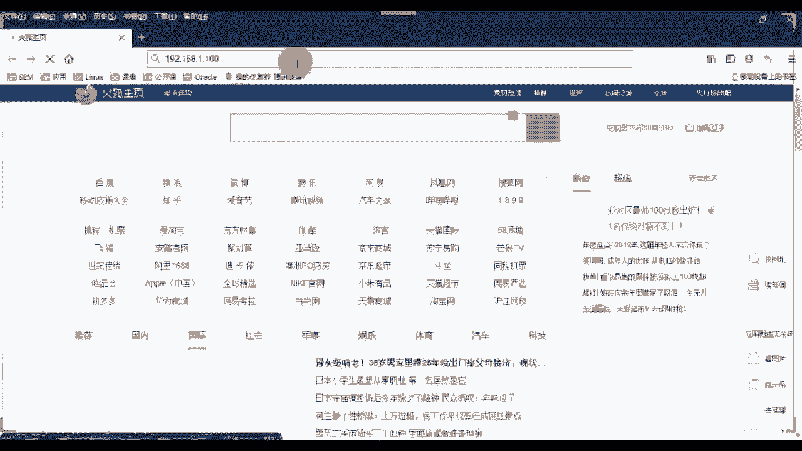
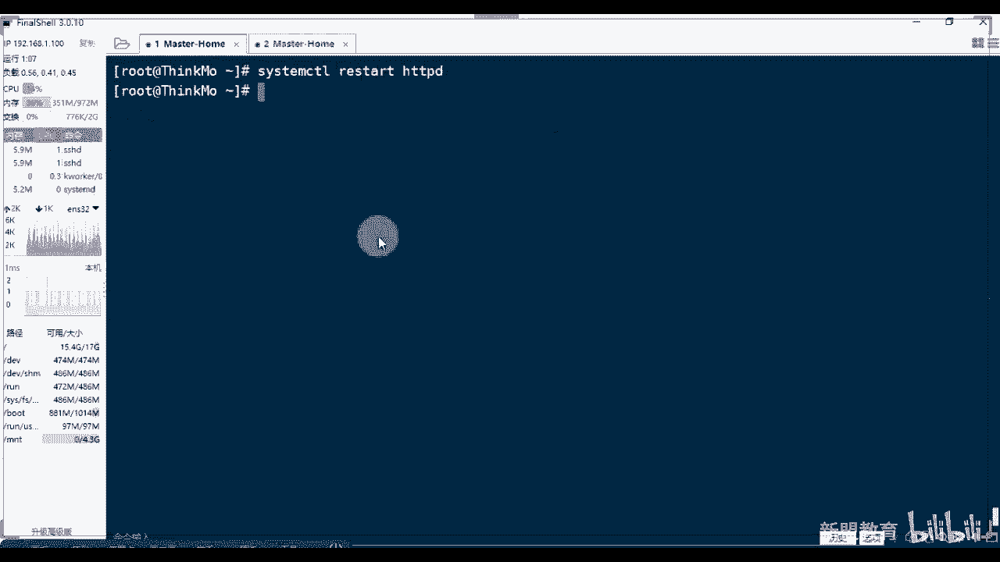
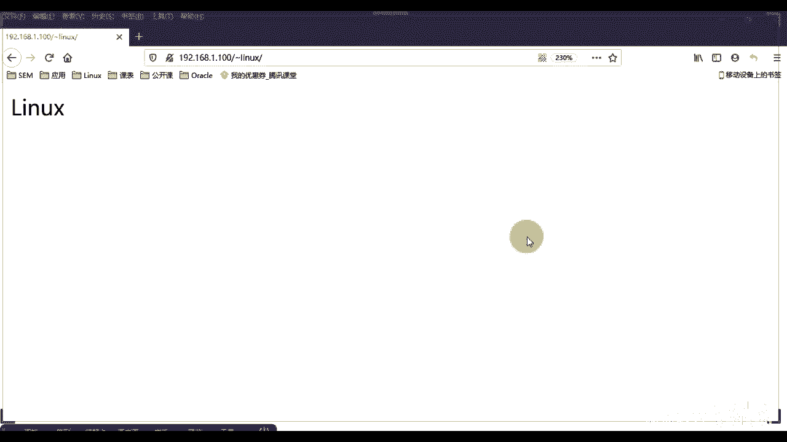
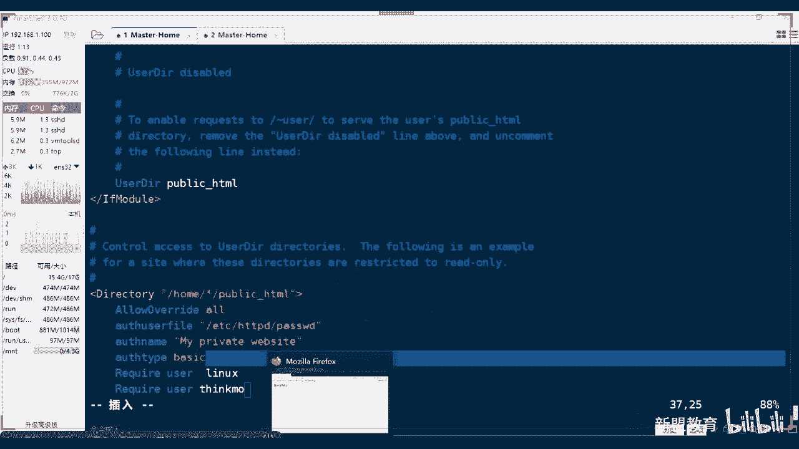

# 2021最新Linux-RHCE运维实战课程 - P9：RHCE-第9课-Linux服务-http服务 - 新盟教育 - BV17K4y1t7XR

Yeah。

好，那个如果大家你们的那个那个叉过期了啊，我告诉你啊，你们可以下下载一个那个好吧 shell啊就是因为因为之前的话我也一直用叉然后 shell的话，偶尔会用到啊不过真的是用到过期了，每次都过期重装。

我觉得太麻烦了。然后我就找一个免费的版这个吧，相对来说的话，我觉得其实是要比叉好看的啊，然后再加上本身它有很多的东西啊，是重装一次就好了，是重装一次就好了但我觉得没有老老重装老重装是吧？

然后我就找了一个彻底彻底免费版的叫做feal shell啊，从模型上来看的话呢，其实是要好看很多的看到吗？从模型上来其实要好好看很多的。而且自动的呢会帮你们做一个做一个什么做一个这个这个中文化听到吗？

它会自动的教你们中文化帮你去翻译啊，我改名字 name。😊。

も。OK好呃，OK，我们马上准备开始上课啊，电脑系统升级尴尴尬了啊，可以用这个啊，可以用这个好吧，可以用这个啊可以用这个。😊，呃，只不过他好像呃这个这个，而且里面的话会监控帮你去监控你的所有的呃。

我知道有中文化，它会自动帮的去做。然后呢，它这边的话还会有一些个负载情况，这些都是你自己那个虚拟机的，不是你本机的啊，是你虚拟机的，知道吧？你看这是虚拟机一的对吧？哎，一 if康fi看一下。啊。

一fi对吧，192。168。1。100啊，用这个那到吧？然后再等一下啊，我们再等他们的一分钟的时间，再等他们一分钟的时间啊，我看看今天的人儿。好看，今天的人儿。🤧啊，啊，今天的人。今天的话三个题目对吧？

第一个题目是我们的ache，第二题目的话是我们的PRE对吧？PRE其实先讲PRE也没事，为什么呃P叉E的话，我们可以用FTB可以用HTTP也可以用NFS对吧？上节课讲完F和F了啊，其实能直接做。

但是我们还是把这三个都讲完了。第三个的话讲的是我们的 tables啊 tablefaair word放到下节课去讲啊，专门讲一些fa word呃，其实fa word不是重点啊，不是重点来呃。

我们再等那么一下啊再等那么一下。😊，哎，大家今天来的好慢啊。诶。😊，年呢是吧，到年到这是到年底了，就就就就这样了啊，怎么？今天。26号人。之前不得怎么少了一半啊。啊。🤧嗯。🤧行啊，我们准备上课了啊。

不等他们了啊，我不等了啊，来吧，开始上课吧。😊，老规矩啊呃先理论再讲我们的能不把中文去了，能啊，你能把中文去了呀，你不就改这个吗？对吧？还记得我们哪个负责吗？LANG嘛？哎呀，这是我们中文字符解。

明白了吧？你把这个改了之后给它重置一下s一下就可以了啊。OK然后我们来看啊呃老规矩还是先讲一些个理论性的东西，然后进行一个实战的演习啊，那么几个主题，第一个来说看好了，在网站上我们会做的啊。

第一个来说OK基本上虚拟主机是必须会的。😊。

啊，必会的那么有三种对吧？我们说哪三种分别是基于我们IP的，基于我们端口的，以及基于我们域名的啊，以及于我们域名的。那么其中注意了。

域名的和IP的请大家请大家怎么样更多啊熟练掌握啊端口的话未必第二个来说第二个来说是我们的一个一个呃一个一个权限的控制啊，权限控制有两个。第一个来说，当我们默认的目录下好，缺少我们的默认主页的时候。

也就是index点ATML这个时候我们可能会直接的去显示它的什么哎显示我的列表啊，也就是说你这个目录列表。那么我们在内网里边做一些个文件录啊做一些个文件传输的时候，你去显示文件列表是挺好的。

但是在公网上是一定要做限制的。大家知得是一定要做限制的。第二个权限的话。指的是我们的个人主页啊，个人主页类似虚拟机啊，类似我们的虚拟主机。类似虚拟主题，只不过它会更加的节省资源而已。没有论转。

这是我们要重点重点去掌握的啊。那么然后来看呃，第三个的话其实叫做HTTB加上我们SSL变成我们的HTPSS这堂课的话，我们拿到后边讲到架构LAMP的时候，我们再去做，好不？这个我们到了后边再去做啊。

那么首先来看一个问题啊，呃我们访问整个的互联网其实获取资源无外部过网站来的，对不对？同学们，那网站也就是外版服务器。好，我们常见的有哪些。你好抄业有哪些啊？第一个肯定是我们今天的主角叫做阿帕奇是吧？

APPAHE啊，对应上我们的服务名称就是HCPD。第二个okK有人说了，老师N还有吗？😡，N这看到没有？哎，第三个大家进来啊，还有一个，比方说像我们LIGHTTETP这个lighted啊ited。

第四个像我们的SAAIS是吧？IS好，以及我们的compt。😊，那么请注意啊，在这个里面的话，在这个里面的话，it is是一个付费的。这回我说了吧，它是属于我们的windows server。啊。

属于我们的windows server。第二个来说的话是我们的tomca道啊？tomca其实严格意义上来说和上面是有区分的，那家就和上面是有区分的，哪里区分那好了，在此上前四个我们都是用于去解析什么？

解析我们的HML啊，我们的PHP等我们的前端语言的，没问题吧。前端语言的，而tom cat是用于干嘛去承载句啊，这个地方可不是解析是用来去承载我们的java看好了，所以它不需要解析，特此来说。

我们的tomca严格上属于我们的叫做中间劲服务器。啊，叫中间件服器。我们到了后边会讲到汤们开的，会详细给大家讲中间件，先把这个大家词记起来，而中间件记住不是作用，而是位置啊，是指位置。什么位置啊？

okK大家好了，我的java写出来的语言，其实我能够直接承载出来。但是我需要一个平台，这个平台只是在这个其中起到一个承接的作用啊，没有什么显性作用啊。前面的话阿帕奇这个不用我说了啊。

是我们现在全球使用最多的啊，全球使用最多的而Ntex呢是国内使用最多的哎，是由俄罗斯发明的那包括web logic啊，包括we logic啊，这个是这是红帽啊，红帽啊。

不是红帽自己的这个web logic也是一个国企常用的啊，也是付费的。啊，N这属于国内使用最多的好，到了。那么目前来说由天猫啊，由淘宝对吧？我们哎由天猫发起的一个二次开发，像淘宝天猫像京东知吧？

还有什么呢？啊啊，sorry啊，像京东，还有我们的这个这个这个唯品会啊，等我们这个电商网站。对吧都是电商网站。我们大多数使用的都是我们的叫什么呢？叫做听震。大家来叫TNGINE叫听振。

这个是基于我们的啊对，PHPGSP和ASP都可以的都可以的啊，是所有都支持吗？不是啊，必须是动态环境。同了们？一会儿我会给大家说啊。哎，这个是基于我们Nd做的二次开发，它也能够去当做负载均衡去用。

这着题啊，这个我们后边会细讲nd。阿爸几各诉同志们啊，lighted这个的话，目前来说基本上销声匿迹了啊，全球使用量只有1%。为啥很简单？这个呃其实算是我们n g的一个呃呃不能说前身吧，它要比N早。

功能要比NG强大，只是在它的推广上傻了那么？推广傻了。然后这些东西就完蛋了啊，用的很少。早期的话，像国内我说过的，像豆瓣是吧？像贴吧我们的底层都是使用它，这是早期啊。

包括豆瓣和贴吧在早期都是通过pas语言开发的啊，大起来。啊，那么阿帕奇和Nex之间我们想多说的啊好了。那么我们说常见的这个叫做web架构到了？叫做web架构啊，是什么？我们常见的LAMP是不是？

还有呢一个叫做LNMP。没问题吧。好的好了，LNMP呢也叫做LEMP。因为NG全称叫做ENNG。X进来，这是NG的全称。啊，N全称，所以你也可以叫做LEMP。那这两个的区别很简单，都是linux的底层。

加上my circle数据库，再加上PHP的一个模块啊，也有工具。然后我们一个是加阿帕奇，这个呢是加的我们的N这能理解吗？能理解吧？啊，那么这两个原本记住了，我们只能对静态网站进行解析，什么是静态网站。

大家现在可以找一下啊，你们现在看到了些个网站的后缀，为HTML或点HTM是吧？这些个都属于静态的。明白吗？ITL最最典型的就是静态的。那么如果我们想要去修改我的网站的内容，我们只能通过。

只能通过我们修改源代码，明白吗？它是和我们的用户没有交互的。啊，没有交互的。第二种的话，哎LAMP或者说LNMP的好了，这种包括和我们的tca啊，包括我们的tca。我们本身是可以对动态进行解析的对吧？

像大家刚刚说的是么AP了啊，像嗯我们的PHP了，像我们的这个这个GSP了哎等等等等对。啊， no no no。哎，它是连接数据库和我们之间有相互交流的，明学吧？这是网站类型啊，web1。0web2。

0对吧？啊，web现在大多数公司网站都是这个大多数公司都是这个。那么只不过大家请注意了，静态网站我们是便于收录的对啊，而动态网站呢不便于收录。好，为什么收录，被搜索引擎，知道吧？

百度google或360，那我搜索的越容易，那我可能权重值越高，我会越排在上边，对不对啊？那么老师我们现在公司都是动态，所以我们都不容易收录吗？记住啊，那么我们会有一个技术叫做哎伪静态，听说过吗？

听说过吗？就是将我们的动态网站伪装成静态啊，把它便于去收录，这个我们到了后边详细的讲的N这的时候，我跟大家去说，不着急啊，哎URL的纯镜像等等等等，好吧，把这先记起来叫做伪静态。网站有三种类型。

A种叫静态A种叫动态，第三种叫伪静态，好吧？啊，那么阿玛企业到了，哎，使用的最多，为什么？其实大多数都是国外在用？它本身的一个特性。听住啊，它本身的一个特性是非常的稳定。为什么稳定？听说啊。

大家知我我我这想告诉你们这么去理解，但是其实不是这么理解啊，只是这么一个顺序啊啊，就是稳定，是因为他重，打家照这个胖子底盘重是吧？所以它就是稳，你推点它不倒。哎，是因为它本身很臃肿。

臃肿证明的是它的代码拿起来。它的代码很臃肿，明白了吧？啊，模块很多，算法很臃肿，很复杂啊，而Nject呢记住了啊，这个我们把它看作重量级的服务器。量多嘛，对吧？头大。第二种的话，nt是我们的轻量比。

那它呢相对不稳定，但是可以处理我们的高并发。啊，负载均衡吧，对不？那么它的代码的话更加的简洁。对吧代码会更加简洁，我们到后面会细讲这个啊，别着急。😊，好，那么然后我们重点呢今天来看的是我的阿帕奇啊。

重点来看我们的阿帕奇。来往这看啊，那么首先从。一个呃我们正常的访问互联网的一个流程来说，大家记住你访问的任何一个东西，任何一个网站也好，还是一个FTP也好，它本身都是有数据传输的。而数据但凡是传输。

它一定是基于某个服务，而服务又是基于某个协议的。倒着推那我们的软件叫做阿帕奇OI保服务器，它本身基于的叫做HTTP超文本传输协议，它做hat transfer pro。啊，加上S叫做安全是吧？

超本传试协议多了1个SSL的认证啊，证书来给大加密啊。那么目前来说常见的这三个给大家列举出来了，is is只能是在我们的windows当中去使用。但是的好了，意思意不单只web，它还包括FTP。

包括NMSNMTP包括SMTP理解了吗？来，把这句话记起来啊，把这句话记起来，它可以通过点钉点啊，它可以通过点钉点。来跟得上人刷了一上来。啊，跟着上人谁算的思了。🤧嗯。当然。其他人。好。

我们接着说啊呃啊那的话。来OK ok ok ok好，让我们接着来看啊，所以这个是很重要的。这个请求的过程和回复的过程，对吧？我们后面还有一节课是专门讲我的请求包是什么样的？我的回复包是什么样子的啊。

注意一个问题啊，就是HTP1。0和1。1还是有区别的啊，这是协意上那阿玛提示我们目前来说是全世界市场占有率很高的服务器之一。没有同学啊，然后因为它本身的话还支持很多我们的额外的模块叫做API叫做接口。

什么叫接口啊？这个跟大家说过了，就是呃为什么这个这个呃。😊，一般来说A12306就是LAMP的两个早期。啊呃呃API是什么接口？比方说大众点评，比方说饿了么我们都可以直接调用支付宝的支付功能。

这个支付功能就是一个接口，明白了吧？啊，那么阿帕7本身的话，除了unix，除了un它也能部署在我们的windows当中，看了啊，虚拟主机不用说了啊，N也支持这个功能，什么意思？我可以拿一个服务器。

多个目录或多个IP或者多个端口当做不同的网站让你来访问。你不需要买10台是吧啊，你只要买一台就够了。两位同学们哎，对来？那么往这走往这走，所以后边的话就是一个正常的我们的一个操作了啊我把这个拿走了啊。

我把这个拿走了，来看着我做好吧，来看着我做，那么安装阿帕奇的话，两种方式。第一种老师亚马in杠YHVD这是我们的源码部署，对吧？哎不对亚马部署好，我这再说一下吧。😊。

好。当了，那目前来说的话，我们有两种部署方式，第一种的话是亚马，第二种的话是我们的源码，对吧？啊，源码呃，今天的话我们呢还是使用的亚马，好吧，还是用亚马源码什么时候用啊源码的时候。

我们跟大家讲到LAMP的时候啊，讲到LAMP的时候好吧，因为呃单纯的中个阿帕奇，我觉得没有必要好吧，我觉得没有必要啊，而当好了，如果说哎LAMP我们可以直接亚马全部安装自动就结合了啊。

对源码安装的LAMP是需要你自己去做一些个文件和数据参数对接的。所以这个有些困难，我们拿源码去调。好吧，一件事情西就不多说了啊，要么安装请注意了啊。阿宝提我们目前常用的版本2。2和我们的2。

4这两个其实在我们授权的时候，记中啊在授权的时候是不同的。啊，绝对的好了。呃，一会儿你们会看到在2。2里面的话啊，我们是用的是2。2里面。对吧我们用的是older。啊，对。哎，allright2。

2说的是older along，我这个应该你们见到过一点吧，或停奈。对吧。😊，见到过吧，2。4的话用的是。requireQUIRAREQUIRAErequire这个啊进来用的这两个不同啊。

授权是不同的啊，知道吧？ALL。啊，这样不同啊，我们的话用的是2。4，默认你在装的时候都是2。4啊，改过来了啊。

看到了，安装阿玛奇两种方式，第一种HPT你这么装可以。第二种到了，安这个包，这个包我想过了，这是什么包？这什么包？这啥包告诉我。😡，这是什么包？这什么包这什么环境是吧？记住啊，更d叫做开发组包。

里边有很多它的依赖库。对开发组包啊，所以当你装它的时候，它会自动把你的底层的HTP装上，明白了吗？同学们它会自动给你装上。所以大家看一下。啊，稍等稍等啊，我是没挂载吗？稍等啊，两点半是吧，哦哎。啊。

可以了啊，收到。😊，看一下。😊，我们是是把它去装上了啊，稍等啊。其实你直接老说我APPD行不行？行，没问题，你就装这一个就可以了，对白吧？啊。

只不过后期的话很有可能呃你在一些个应用的时候会出现一个bug，那那个时候你就得再装一个包，明了吧？我靠，今天的网朋伴们，稍等一下，我看一下啊。😊，我把我把我把唉我把无线网断了呀。啊。

这样吧这样吧这样吧这样吧。😊，小达呃，要么makeake。ア么克。对吧啊，要么make case。做好做啊做好转啊。嗯。在家呢，我在家呢，但我觉得我家里面也不可能这么慢吧吧。是。看一下啊，稍等。稍等啊。

走的是教育网是吧？😡，听见到？有时教育网啊，这就这就有可能慢了啊，教育网有可能是慢的啊啊，这还好点是吧？这样就好了，稍等一下啊，我先把它这个缓存做完了，应该就快多了。然啊跟大家说一个问题。

如果此时注意此时注意在大家下载过程当中会断网的话啊，断网这后老师我会继续对吧？你老师重新连接之后，老师我继续亚么，他此时可能会报错，明白吧？他此时会报错，那么这个报错的解决的方案，那么一种记住啊。

用RM跟RF删除什么记住了，删除在你们R下有个run下面有个亚么点PID啊，把这个删掉之后，你就可以重新亚么了，理解了吧？啊，不知道你们有没有遇到过啊。如果遇到过的人，就把这个记下来，没遇到过人。

下次记到遇到了自己解决啊。

ok我们稍等一下啊，可能最后这个包贝ase的比较大啊，贝比较大。它在传输的时候啊确实很慢啊。对，杀的是进场。没错。😡，啊，Q也行，Q也行，好吧，Q也行。那PID不就PID叫做进程ID嘛，对吧？

你上的就是进程啊，我们把这个这个这个PID删掉了，对吧？啊，解决方案不解决方案都是一样的，归根到底，是不是？就把他的进程杀掉。好，我们来先等一下好吧啊，没想到这么慢。今天晚上啊，今天上午的时候。

我是我昨天晚上用的时候还是OK的，很快。😊，很快这个这个一到了白天的话，这么慢吗？我看一下啊。结束啦。

P。还好吧，对吧？你看。😊，还好吧，对吧？时间的话延迟并不高啊。是吧延迟并不高啊。啊，很稳定啊很稳定啊。아， 그렇。呃，我一会儿我一会儿我一会儿下中午，一会儿休息的时候，我们我排查一下我们家网吧。

啊。然好。🤧嗯。耐心等一下啊耐心等一下啊，我们先往下面说，好吧啊，我们要他自己下载了，我们往下面说啊啊，当好了，当我们部署之后的时候呢，你可以去查看一下，我们还用什么，还记得用什么去查看它的目录吗？

一些个必要的文件查看他们的。😊，来告诉我查看我们HTBD生成的文件。啊，或者说有哪些文件用什么命令？老规矩啊，这个是一定要看的啊啊，RBM杠QA是吧？杠QA是写什么呀？QA这个是显示我们的。

已安装的东西对吧？哎，显示已安装的包啊，不是文件啊。对吧是什么RPM杠QL对不是？这个是用来去显示我们生成的文件啊。好吧，那么这个文件里面大家注注意一个，记住一下，就是哪个是主配置文件是最主要的对吧。

啊，主配置文件。当然在在呃我们其实可以创建多个文件，然后把它囊括到主配置文件里面去啊。

哦，你那个RPM啊，不是M啊。😡，我靠，这个过分了啊。啊，这也过分了，我不想看热点了。稍等一下啊稍等一下啊。🤧咳。哦，我们现在装着是吧？我把这台设备再打开一个，再打开一个。😊，好，再一个看一下啊。

RBM杠QAgra一下我们的HBD其实它现在已经应该装了一部分了是吧？啊，还没有那个没有啊啊，没有完成的啊没有完成的，稍等一下。我做到B了。32找那么慢吗？我也没有外网源啊。QL你用的到少是吧？

QA也可以啊，Q这个是查QA是查看什么，是查看你装了什么包啊，你比方说老师我装了HDBHBD杠dil对吧？HDB这个杠com这些个东西。呃，那先等一下啊耐先等一下。😊。

好，我们说下一个吧，就是说。那么第二步的话就是启动，先不做任何的配置修改。按记住先不做任何配置修改，启动的时候记住啊，顺手加上able叫做开机自启。啊，你不做开字写，下次你的系统断电了，是吧？

老师开机字写，然后的话断了。啊，不法文档。那么这一步一会儿会教大家一个特别好玩的东西啊，这个我不知道啊源码装复杂吗？源码装不复杂，参数贼多啊，你下次装的时候你就知道了啊，到了我问一下同志们。

你们有谁现在是自己装了这个GUI的图形的，有吗？有的上一上来。有吗？有自己装的图行了吧。还真有啊好，问一个问题啊，这个ss7的话，我们装这个这个装图形还个什么吗？用什么用亚麻group is错好吧？

它是一个组包啊，杠Y装了叫什么？叫做server。withGY是这个吧。是这个吧，你们装的。是这个吧。啊，O然后呢我们可以通过start x启动。啊，但是好了，我为什么不让你们装GUI啊？

是因为我们其实是可以通过命令行启动GUI的。明白吗？那么这里边辅助性大家记住安装一个东西叫什么嘞？😡，安装一个东西叫做GDM。了啊，安装GDM，然后配合我们一个叫做。S啊叫做叉star start啊。

这个叉 start。这个是由我们的叉 manager，我不知道你们有没有装这个这个软件啊，大家如果没有装的话，一会儿我客户给你们好吧，这个网络下载都有好吧，叉 manager他来提供的。对吧他来听懂。

它是能够直接在这里面输入命令启动，直接就把它启动调动出来GUI的这就是我为什么不说，你们不要装GUI没有用，知道吧？很大那东西啊。

我靠，突破边界的网速啊。啊，你说你怎么没装图形桌面，你那还不太一样啊，那还不太一样，好吧。你们可能可能和我说的还不太一样。稍等啊。

啊。哦，大家可以看一下，我们直接的话就可以在这上面去访问他的网站啊。网站的话，这个是自己的，这啥都不做，是不是？127。当然你关闭防火墙之后的话，你也可以直接通过我们的本地的，如果是桥接对吧？192。

168。1。100去访问的那往下面走几个重点的参数跟大家说一下啊，就重点参数文件。第一个来说，我的。目录如果是通过亚码安装的，都是在ETC下生成与其同名的目录。这个我们说过了，如果是与如果是源码安装的。

一般情况下，我会把它放在userloc下，还记得吧？啊，那么在它同名的目录下会有几个文件。第一个count复目录，这是最最主要的是主配置文件所在的目录。加上有其他的啊，比方说呃一些病了。

比方说一些ETC了，再往下边的话，word3WAT秒到了，这个是亚马安卓默认的网站跟母。也就是说我的网页放在这里。朗页放在这里，那默认的首页都是indexing。点ATML大家，这是默认主页啊。

任何一个服务都会有其日志，至少记住了，至少要有访问日志，错误日志还真的未必都有，可能是要你自己去做。而访问日志一般我们会在word log下，当好了，word log下有一个特别重要的目录还文件记得吗？

叫到word什么呀？😡，logg。Message。SR messages。这啊对，还有一个是where log security。对了啊，这两个都是我们很重要的。第一个来说。

security是来帮助我们查看正常登录的。第二个来说，s message，这是我们整个系统的日志。对吧系统是这，而在log下生成一个同名的服务的名称的目录，底下会有它的访问与er。大家注意啊。

这个位置是杠啊，这个位置杠，尤其是到了后期我们学到的自动化自动化里面有个日志平台，日志平台。我想要去抓取的时候，你记得是杠抓取啊，可不是点抓取。好吧，再往下面看。😊，啊，主配置文件的话。

我们里边一般会分为3块。第一块叫做注释信息，井号开头的就不说了。第2块叫做全局配置，解来啊，叫做全局配置。第3块叫做局域配置，区域配置。然好了，区域配置只有这个区域，也就是我们一般会定义某个目录的权限。

啊，只有他能够享受，而全局配置是所有人都能享受的，这不用说了吧啊，里边重点的几个参数我都给大家列举出来了哈，这怎能拿出来了。第一个来说serv root我们的服务的目录啊。

我服务目录这个默认就是ETC杠HB。😊，D啊HBD也就是说我们默认服务目录在哪里啊？在这儿，听同学们，这个一般不改啊，不做修改serer me你的用户管或邮或你的管理员的邮箱啊，管理员邮箱。

user和group也就是你们在运行整个服务的时候默认的用户。大家猜一猜阿帕奇默认用户是什么用价吗？猜一猜猜一猜。用样码安装和用原码安装是不一样的，知道吧？啊，就说哎有人说了HBE是吧，就说亚么安装。

😊，压板安装啊。样板做默认是。默认是把他奇。默认是阿帕奇啊默认是阿法奇。进来源码的话是nobody啊，原码的话是nobody，你需要自己重新改啊。来了第三个s name到了是我网站的域名啊。

网站域名这个地方我说过了，知道了，默认给的是3W点EX。AMPRE点comM冒号巴0是吧？我说了，他要去做解析，所以这个位置我们要把它改为什么？啊，我们要把它改为127。0。0。1冒号80。

这样子我们在重新启动的时候就会很快。很多数老师，我我为什么我没改，我没加东西是吧？我只是改了一个参数，我在重启阿法的时候贼慢，为什么贼慢？是为这个地方我默认去做解析了。大家告诉我解析的话。

是不是要耗费时间啊？😡，能解了吗？但是如果我解析它就很快，logo host的，我本定有啊，很快的，对不对？把它改完啊，提升你的启动速度。😡，document rootot进来，这个是我网站的目录。

默认就是R下3W下ATML。默认是这个啊。listen端口大诉诉谁吧，端口是谁？😡，豆时。都是啊。80对吧？啊，但是请你注意一个问题啊，就是很多说老师我想自己在家里面部署一个网站是吧？

然后我映射出去行不行，告诉你们不行啊。第一个来说我说过了，你们家里的网址可能是假的，公过IP即使是真的，大家记住了啊。

运营商也是给我们的个人用户封禁了8080808088443448这些端口的都给你们封掉了，知道吧？啊，封了一些个808080808844443448啊，谢。

最后下directory indexex当好了，这个是默认的索引页面啊，默认的索引页面就是默认索引面默认是index点ATML和index点ATM。它会依次匹配。如果我没有indexAT mail。

我就匹配这个是吧？如果都没有我有失效，没白同志们？啊，而此时请注意啊。而时请注意，如果是是原码装的话，原码装的话呃，如果都没有，它会显示错误404。但是如果是亚么的话，大住了，你没有这个默认页的话。

它是什显示么？没有默认页是显示测试页。啊，显示测试页。那老师我我可以把这个测试页关掉吗？一会儿教你们啊。哎，对，需要审批的啊，来家看错误日志，这不用说了，castsslog啊仿日志。

这两个就是定义名称和格式的啊，定义名称和格式的。第三个tout默认网页超时间300秒，明白了吧？😊，啊，来看一下我们这边OK了吗？啊，还差一点是吧？啊，好难啊，我的心好痛啊。😊。

啊，那就是说啊。所以大家可以看一下这几个东西好不好？我们后边的话会把这个改掉啊，会把这个改掉。老师我改了之后可能会出现很多小bug啊啊呃还会改谁改我们的这个啊，这个再说呗listen，我们可能会改哎。

老师我要做基于端口的，我不知道只有个bodying，我能有8182是吧？等等。

好，差不多呃，我们稍微等待他一下。啊，稍微等待一下，马上很好快了是吧？还差1%啊，还差1%。😊，好，稍等一下啊，就有1%了。我后面的话给你们，我后面还是把我们那个镜像换一个吧啊，我换成我换成那个红帽的。

红帽子里面有自己的本地的镜像呃，是源的问题，是源的问题啊，原的我是用的是阿里的，跟我自己的网速也有关系，好吧啊。园区的，我是我不是用的公司的，因为家里嘛，家里面的话有家里面多少多少兆。

是100兆的还是200兆的，我忘了。其实在公司里面没卖事儿，其实在公司的时候没什么事，就是在在在家里面。没事儿。等会儿就好了。稳定在三兆，谁说的这明明是一兆嘛？共享宽带对家里面的这个。啊。

我是不好那制电信的，知道吧？🤧咳。稍等啊。坏了啊快了，钟，现在网络是手机开热点，连电脑网速一直在这个睡平啊。呃就是就是就是我知道就是他走的是不一样的线路，知道吧？你们看视频大道吧？

你们看视频看的是走的是媒体流，知道吧？媒体流，而且是上传的那块，我现在是。😊，我现在上传，我现在下这是下载的贷款不一样啊，咱们都是两个方向。而且有媒体流量。你像在公司的话，在大点的话。

我们可能自己去编个平台。到那个时候我们要自己去买流媒体，明白了吗？自己买流媒体的话，就是我们自建这种视频，明白了吧？那种更快，那肯是保证速度啊。好，我们做杠YHPD杠devo我们安装这个包好吧。

我装这个包。那这就快了吧，后面就贼快了啊，后面贼快了啊，后面贼快了。来看。啊，其实就前期的话，你用压 makeake case会慢一点，但后面安装就贼快了，看到没有？看到没有啊。

后边不管你装什么包就好了啊，不管装什么包包就好了。教大家这条命令啊，这条命令其实我之前说过。啊。啊，装了。哎，起飞了对不对啊，就前期慢嘛。好，2BM杠QA那好了，我们QA抓的上g HPD看好了。

这是显示你安装的包看到没有？像什么HP toolss，这里面包括什么呀？这里面包括什么呀？对吧？这里面包括1个AB命令，大家知道AB命令吗？😊，这AB命令吧。啊，这个是测压哎压力测试的。

就是说压力测试的。这个到我们讲的NG的时候，会给大家去再细说。好吧，今天先不做啊。第二来说comd看到没有？第3个ATPD啊ATPD。2。4版本默认看没啊，2。4啊，我记得六里面的话是2。2。啊。

6里面是2。2，7里面是2。4。好，安卓完成然后再看RPM杠QL和gup AP走，再看哎然RPM杠未给出查询参数。sorry啊，杠QL。哎。嗯。没问题吧。呃，未给出要查询的参数哦。

说错了25杠QL说错了，直接HTP啊，直接HP说错了说错了。好，大下一下，可以看到吗？这是你们所有生成的目录以及它下面的文件，看到没有？都给你列举出来了吧。

user shell里边有很多都是很多都是你们的这个这个这个模板文件啊，好吧，然后我看一下啊，比方说像这个里面看这是我的命令吧，能看到没有？

我的命令吧啊HTP你可以查看一下杠V这是version版本能看到啊。啊，版本。然后注意了，我们现在要做的正常是啊VM我把VM也装上M么也做杠VVM好。🤧啊，这就很快了啊。😊，诶。😊，好。

装上了装上了装上了。啊，大写的V不是有的是大V，有的是小V，有的是杠杠version知道吧？它的它的这个参数你们可以自己去设。像java的话就是杠杠version啊，看好了，EDCAPD了。

count注意了，这里边有两个文件，一个是count文件一个count第了？这两个看到没有？能看到吗？看到吗？count第是一个额外的配置文件就是被我们的记住啊，我们可能会把一些个配置放到其他文件下去。

那这些文件我们就会放在这个里面。😊，比方说往上看就比下。看到这个参数了吗？同志们看到这个了吗？最底下参数c低但凡是在这个文件下以点c结尾的文件，我们都会去读取它的配置。😡，都会去读取啊，进来。😡。

然后往这边看，重点的几个参数已经说过了啊，root对吧？listen不用说了，这个不用说，这个是一些个模块，不说了啊，用户和组默认阿法奇再往下边走，用户的。这个邮箱这里面我们不说了啊。

serv name一定要打开。我说过了，没有空格是默认的，对不对？中间没有空格是默认的。127。0。0。1。走着往下走带好了，现在我们要做什么啊？正常来说。

老师保存退出我们system cTLstart HP启动，对吧？n state去查看我们的端口号T表示TCPU表示UDP80启动了吧，80启动了，同志们再看啊要么in杠为GDM装这个装这个包。😡。

不急，背包有点大啊。教你的方式啊，来看。来看204兆看到没有啊，204兆，还好我们做了make case，不做make case，咱今天不讲了，知道吧？啊，咱今天可以下课了啊。😊，🤧稍等啊。

这包很快的啊这个很快了。那相对的相对那相对是抗复更优更及构更高啊。对啊。啊，不是不是不是不是不是。😡，是读康复康复里边会包括康复点D里边的某些文件。我必须有抗复，康复第一可以没有？6半明儿。明白吧？😊。

是这意思啊。知到。把这个装了，这个其实正常来说，我是想讲P叉RE的时候去讲的。但是我觉得呃提前说了吧啊，省得下节课再装也会浪费时间。我们把钱给装好了。🤧嗯。哪两个东西装好了之后，我们就开始飞机启动了啊。

很快吧，没case之后。你做了缓存了嘛，对吧？好，稍等安装了啊。做哪家。把这个打开啊把这个打开啊，这个额外的回置，把这个打开好了。如果你装manager之后。

插 managerage会有一个这个文件夹啊，会有文件夹里面有choose，看到没有？有choose，找到tose里面有个叉star it叉star打开它就好了啊，里面主机也是一样的。你要连谁192。

168。1。1Y看到没有？一。100SSH连接用户名root？😡。

对吧密码设置一下，保存一下，我们叫做thinkmo密码，确定你要执行的命令。我要执行的是这个这个浏览器，对吧？你们再要装一个叫做fair folks杂起来。fair force可以作为命令啊。

一会来看看这个哎怎么又又回去了，稍等一下啊。😊，这可能慢一点啊。还要再装一个firef啊，我们在这边装啊，这边还不能用。这还不能装先到这边装。得等他装完了，我们才能装另外一个啊。hel到。哎。

这个又退回去了哈。😊，🤧嗯。嗯，我的上传的速度还是OK的吧。稍等一下啊。没想到直播的时候去用亚么卷，还那么慢。稍等一下吧。后边我就直接的给你都装好了吧，我就不我就不在我就不在课上装东西了。以后啊好吧。

以后我就不在课上装东西了，我就提前装好了。相当于没开百度会员哈，可以的可以的。😊，主要是家里的网确实是不行，家里的网。啊，我一般那个我一般周日的时候，周六日的时候，我就不去公司了。

这个包是用来打开图形界面的对你得装上它知道吧？然后的话同时你得装上这个fair force，然后你就在这边，然后一启动就出来这个图形界面了，明白了吧？啊，你不需要自己装图形界面啊。

这个比那个图形界面的包小多了少很多啊。🤧嗯。呃，那我们不讲这个了，先不讲这个，好吧，先不讲这个了啊，我们直接拿这个去做吧，那直接拿我们本地浏览去访问啊，192。168。1。100。

大家可以看一下这个当你访问是一个测试页，可以看到吗？😊。

测试页啊，你如果说我不想要测试页怎么办？我不想要测试页怎么办？解了啊。😡，啊，在这儿。will在ETC下HBD里面有个com点滴，看到没有？在这儿大家看里面有一个叫做wecom点com，看到没有？

看到没有？找vicom点看，我如果把这个删掉，或者说老师，我把这里边所有的东西都注释掉啊，我们都注释，好吧，我们不删它。😡，我错了，这样子。我把它改个名字。CDEDCHPcom点滴好。

L we welcome， welcome点 backDAK。走，重启一下我们的。

这GB老大汉。刷新。刷细一下啊刷息一下走，还有吗？大家看到是不是没有了？能看到吗？能看到吧？但是请注意，此时此时这个地方就是你已经暴露了你的目录结构了。😡，如果你的网页。

如果你有网你有网站的一些源代码放在里边，其实很多人就会把你爬下来，知道吧？很多做渗透的同事们啊，做老师，我做渗透安全，他们就是这么去爬啊，找到一些个网站这个地方没禁止，然后就把你所有数据都爬下来了。

网站的原代码都下来了啊，这比较可怕的啊。第二个来说的话，我们说到老师，我现在想要做的事情就是想要去修改我们的默认的主页啊对。

啊，来啥啊2DDB。走往这看。我说了，document root默认是va3WAT mail，对不对？我是要改好了，改到哪里去了？改到这儿。😡，好，home下sble下root。主要，这个位题要改两个。

第一个要把字儿改了，第二个要把字儿改了。😡，起来就把字儿改了。home杠3W路ot下来。这是你默认的网站跟目录，这是对网站跟目录进行授权。包宝说老师上面也有，底下也有，对吧？我们一般用底下这一块啊。

上面这一块我们给它个注释，知道吧？还要注射。给完之后大家别着急啊，此时别着急看到了？这个位置option看到没有？index叫做索引，对，上面那个不用，上面那个不用啊，这两个上面是严格，下面是宽松。

一个是严格权限，一个是宽松权限啊，往这看option index，这叫做索引。注意啊，这个位置开启，就是让我们去查询这个目录。

我把什么呢？把这个index删掉，我就可以解决这个问题。我们最后再说啊，先看到了allo over这个不用变，这是允许我们通过链接访问啊，require看这是权限，允许我们所有人访问，能理解吗？

来理解说一，允许所有人访问grant授权。😡，官网授权啊。好，再往下走，看什么看什么看dory index，我默认的网站首页啊默认网站首页。😡，好，往下走往下走往下走往下走呃，ever log对吧？

然后我们的log的日志，看到没有？format日志格式，还有什么来着？😊，呃，还有哪些看看啊，还有哪些个比较重要的啊，一会儿还会讲到一些东西，先不着急。行再说这么多好。

保存退说保存退说sysCTL restart带好了。此时我们HD重启好，哎出问题了是吧？看一下啊，GOUR杠XE哪块写错了啊，在这root is not a directory注意同学啊。

如果我们想让它作为根目录的话，是必须有这个目录的。所以在这边我们要做啥？叫MKDAR杠P对吧？home3Wroot你要创建出来啊，然后我们再重启就好了吧。😊，啊，带出去就好了吧。出白了吧？好。

然后我们就是说。

来，我们来访问一下同学们，刷新一下这个网站，看一下效果。老师为什么还是一个地方好了？还是这个地方，你理解吗？因为我们允许你显示这个地方对不对啊，允许你。那现在我要做的是到了Ecle。😡。

Welcome。走放到home下3Wroot下indy点ATML走再重启。大家注意啊，ATML必须重启阿巴奇代表有一点点改动，包括网页改动不要重启啊。你说说我不想让用户感知，你就用reload平滑重启。

好吧，刷新一下哎，sorry。走，可以看到办公室吗？来看到转移。😊，可看到了吧？啊家可以看到啊，但是但是请注意啊，呃，我这个地方是已经把我们的防火墙关掉了。

同时大家注意你一定要把s next叫做内核防火墙关掉，明白吗？如果你内核防火墙不关，注意你内核防火墙不关，因为看因为你是加目录，是不是同志们，你又没有这个用户，你怎么访问我，是不是？

那么内核防火墙会拒绝你，此时你的网页会显示403forbidden。

啊，不信你就试啊不信，你就可以试一下啊，这块我不多说啊。哎，看一下，这是我们这个操作的过程。看吗？同学们，我们把它改掉了啊，改掉了就可以了。😊，s，我这边简单说一句啊，它是一个我们的内核防火箱，很简单。

记住了啊，管理的是一些更内层的一些个安全。注意了，那么它会有三个我们的模式。第一种叫做enforcing强制启用，拦截不合法的那其实来说有很多的服务，但凡是对我们内个购这个这个有交互。

它都会认为是不合法的。所以我们在生产环境，大家告诉我是seex是一直被关闭的，能明了吗？se量是被关闭的啊，在生产环境上不用啊，第二个perive遇到不拦截。

第三个叫diable这两个你选一个用就好了啊，选一个用就好了。那么此时注意了，我们用的命令叫做set in，对？零之后get enforcing，你会发现你是permiss啊permissive。

允许啊允许你也可以用set一就变成了infor inforcing，但是这些都是临时的重启失效，永久性的需要改的是在size confi下有个SElinux。咋了？有个SElinux。

在这个位置上把它改掉，看到没有？这位置是不是还是unosing呢？😡，看到没有？啊，还是if性的啊，所以打好了，我们把它拿过来保存退出。这就永久生效了。我们生产环境就这么干。

能理解吗？俩一说一。😡，啊，生产就这么干啊，不做任何的。Eforcing都是这个啊，你就做防火源就好了。

好，这个改变之后我们就不管了啊，然后改掉。所以这个是我们最基本的HDP很简单吧，安装上能用就行了。后边讲的东西这个叫做个人主页。老什么叫做个人主页？

就是呃你想在系统当中为我们每一位用户diable也可以啊，diable也可以。😊，你想在整个系统当中为我们每一个用户去创建一个网站。哎。

比方说木雀老师有一个在我们的未来有一个我们的杨超日小飞有一个都可以，只要是你的系统下有这个用户。那么此时我们不会，老师我不想使用这个这个虚拟主机，我不想占用域名，我不想占用IP，我不想占用端口是吧？哎。

我们怎么办？好了，在这个位上。ETCHQE站comfor点D又在它下边到了有一个叫做userDR那用户目录。这个单词应该不用我说了吧，userDR改两个地方。第一个DR他告诉我，这叫diable。

我现在是禁用你，对不对？对不对？我现是不是借用你啊？😡，好，那么有一个问题，同学们老师我既用你，如果我想启用你，我这边写什么呀？😡，老师好像不知道写什么，是不是？😡，我不知道写什么怎么办。

如果你不知道就注释了他，好吧。😡，你要是不知道呢，你就注视掉它注意啊，注释这个位置要有个空格。😡，啊，要有空格。好吧，第二步开启我们下方的userDR默认的工作目录。默认的工作目录。跟同学们啊。

就是你家用户保存哪里，保存这里边。😡，啊，保存在一个门里面。好，我们保存退出。当然这个位置说老师我可不可以改呀？😡，可以改吗？同志们。😊，可改吗？就说你是可以改的，杨同志你是可以改的。啊对。啊。

你是可以改的。啊，然后不着急，然后。然后底下的话不用管啊，底下这些东西都不用管，他到他都给你了啊。如果你这边改了，这个地方就要改，明白吗？这两个位置上对应上来啊，在位置上对应上来啊。

因为你不知道是在哪个加目下，对不对？O保存退出。最后看好了，我们要去修改我们的配置文件啊啊，不用修改配置员user add我们不说老师，我创建个think。😡，啊。

创是个梦再创建一个user add物权，好吧，再创建一个user addlinux。走，我现在切换一下啊，听说。😊，啊，算序成功，请大家注意我在我的家族下是不是home星号啊，MKDRR我去创建什么？

创建我们的默认的目录，叫做public杠ATmail。对吧对吧？好，ele写上确告诉你，我是think。😊，好，放过去再来里下，就在我这个目录下写上public，然后啊，sorry啊。

public index点AT0秒。C阿给个权限啊给个权限啊，杠RF我们给个755，好吧，让别人也是。可读的啊可读的应该是可读的啊。home请课给我自己就行啊，给我自己就行，给我自己行。现在好了，老师。

我再推出来同样的步骤，我可以给我们的linux去做，是不是？啊，好了，大家le。哦来浪。过去。呃，sorry啊，过去啊忘忘创建了啊，MKDRRPUBLIC杠ATML走，然后我们再创建啊ecle走。

创建两个就行啊，不用创建给大家看一个效果就是好吧。indexy点ATM。C是ROD杠RF755啊home。我们本地的home。里面的啊啊linux对吧？home linux好，退出来大看一下。

此时我们这两个下边有两个吧，再看看它两个里面linux啊是不是public。不怕那个，而且我都是用户自己去访问的。对不对？用自己访问啊，然后注意了，我们此时sytibleCTLre start LTP。

同学。

那师我怎么访问对吧，你们访问的方式很简单，在已访问的目录下啊，这个这个链接下go。好，用波浪线。不能去表什么老师表示我去找谁，我去找新东东。😡，看同志是不是新，看到没有看有没有老师，我找谁。

我要找的是063，看是不是063。😡，听见了吧？这是个人加目录。来大家了。啊，个人差不懂。好，但是但是有一个问题，你告诉我，你是不是知道是我系统下有谁，我是不是可以挨个去测试了？😡，我是可以X测试了。

这对我的系统安全吗？😡，安全不告诉我。😡，一点都不安全，对不对？老搬是怎么办？包这怎么办？假密。😡，哎，不安全要加密啊不安全要加密啊。😡。

我懒不了光啊，你肯定得用啊这个光这个这个这个这个服务啊，你不用它这个东西白起了嘛，这个功能对不对？用什么加密看好了，有一个命令叫做HT password。LT表什么？叫做HTTP啊叫做HTTP啊。😡。

好，靠同志们，如果你是第一次。😡，添加的用杠C啊，用杠C杠C表示第一次啊，杠MMD5加密。老师我现在不用杠M看拉EDC加HTP我在这里边去创建一个password啊，对于谁呢？对我们的thinky用户。

😡，可以吧，同志们给密码吧。😡，可吧给密码吧？我给他空了一码啊。第二个老师，如果我们不是知道了？如果你再去写的话，如果我这么去写，你会把整个文件覆盖掉。因为这是首次的时候去做，明白吧？啊，首次去做。

如果要说我不用，那就把它删掉啊，然后我们来看一下EDCLGDP passwordword来看里边是不是有s和linux3。😡，能看到吧？大正好声音。两个吧。两个吧宾码我都给着空了啊，都给他空了啊。好。

然后下一步注意了，修改一下我们的个人目录。啊，修改一下我们个人目录啊，改什么注意这个位置啊，再往下面来，在这儿呢啊在这呢。😡，我们要在这个里面添加很多的东西。第一个来说over road这个不用管了。

同学们over road的不用管了。呃，如果说我看的麻烦是吧，你就写一个东西告诉大家一个方式啊，你就把它改成O。😡，这个参数你不用理解这个参数你不用理解，就是通过链接去访问啊，允许我们通过链接去访问。

明白吧？😡，啊，第二个参数。呃，我想想option要不要不要啊？option把option删掉。好了，把我粉删掉，require那好了，require改一下，改成什么，改成useruser谁呀？

告诉我同志们，我用为谁呀，是不是thinkbo啊。😡，是不是是不是我们的雷d？😡，把这两个给出来啊，把这两个给出来，再往下靠了。😊，你要做的我得引用我的密码文件。所以。Oden user file。

什么意思啊？我的密码验证文件谁呀？ETC下HTPD下password是不是这个文件，对吧？同学们，第二个or好了，我们会给个内幕。啊，all name啥意思啊？这是一个提示。这是一个提示。my。PRI。

VAT website。这是一个提示啊，就是你登录时候，他会给你个提示。😡，有了吧？最后奥den我们的TYPtype，我们用的是最基本的验证，在什么呢？最基本的验证就是口令验证，最基本的验证。好。

保晨退出。这几个操数都给你们准备好了，不用管它。好。重启一下啊，我你们记住大家后面学东西的话，命令我都会给你们在笔记里面，你们会自己看啊。我这边做的事很简单，刷新一下来哈啊sorry。😊。

刷击看一下同志们是不是需要我们登录了用户名，密码是空，走，这才能登录进去。看到没有？老师登录linux呢。😡，singal冒呢走s个冒看同志们？single冒请大发一个问题，老师有用吗？

你想看再答一个问题，不用，看得表。😡。

啊，所以无用怎么办？告诉你们啊，原因在这儿呢。😡，原因在这儿呢。在require的时候，user记住，我们只识别最后一个。所以呢好了，这个位置上我们需要什么？需要写两个。😡，能理解吗？能理解吗？

需要写两个OK吗？来合始串一。啊，我说一，所以这是我们最基本的。哎，用户网站访问0同们啊，用户网站访问啊哎有多少个写多少个好吧，有多少个写多少个啊，当然你不会太多，知道吧？

行，老师退出，当然你也可以用其他的叫做list啊，就list参数的话，具体参数得查一查。好吧，因为我们其实都用虚拟主题的，这个东西用的少啊，这东西用的少。但是一般对于这个小公司来说。

其实你说谁用个人网站，除非你自己玩，是不是你自己玩，老说我自己跟几个哥们儿组一个团啊，做几个网站，做几个论坛，你自己做，其实自己在我们公司里面压根这东西不怎么用，好吧？老是退出知道了。😡，啊，完分图呃。

我们留一个，我们先留一个再留一个。😊，然后我们重点的是在于其虚拟主机上打好了，什么是虚音主机？记住啊，虚拟主机和虚拟机是两码事儿啊，这叫虚拟机软件，知同们？这叫虚拟机软件。

虚拟主机的指的是我通过这么一台设备，多个目录来形成多个网站体系。啊，来形成多个网站体系。那么我们会有三种，一种是基于IP一种是基于。域名，一种是基于端口，没有吗？啊。

那么这里边常用的IP和域名端口不常用啊，端口不常用。那来看，同志们，如果我想要用到了IP的话，第一步干嘛知道吧？第一步要增加网卡。

理解不同说，第一步要增加网卡啊，右键设置哎添加网卡，右键设置走等一下啊。😡，对吧你的附器一般4块网卡嘛？😡。

知道ser网卡啊，添加知道了？网卡也是一定要做。不要做桥接的对吧？不要做桥接啊，第三个再添加一个。我下。然后再调接。好，确定当了，这边一旦确定之后，这边就断了，知道吧？这边就断了，看到没有？哎。

还这边还没断呢啊，等会儿就断了啊。😡。

文卡是不是挂载，网卡不挂载啊，文卡挂载干嘛？😡，哦，系咪。啊，这边还没断是吧？来看一下if康 w咋了，我现在有哪个32、34和35可以看到吗？3234和35都是我本地自己的IP地址，对不对？

这两个是直接获取到了DHCP。😊，但是大会发现问题，ADCs config network。😡，gosscript里面的好了。看一下吧，看老妹们有这俩网址网卡吗？有这两网卡吗，后面会讲不着急啊。

后面会讲啊，网卡绑定。😊，有吗？没有是不是？😡，没有啊，那咋办那咋办？咋办告诉你们CP杠A一定跟杠A啊，CFGENS33。你就看先显示一下，你是多少，一个是34，一个是35，对不对？好。😡，哎。

sorry啊，CBA32。啊，ifCF之ENF34对吧？再1个352个为么啊剩下的你就自己去改嘛。杠A是保证它的所有的属性，知道吧？是保证所有属性一致。所有属性就是杠A啊。馒豆不治麻。好。

willve修改if CFGES34走好了，改几个地方。第一个看，因为你现在写的是static，看到没有？你写的static啊，t，所以你这个地方要改的地方只有一个好了，把UID删掉。😊。

把UUID一定删，知道吧？不然你三个网卡同样的UUID不找打吗？是不是不找冲突嘛？34，这两个必须同时修改。😡，IB例址。改成什么1点，你不能是10，你就改成10，你不能冲突吧，对吧？第S不用管。

其他东西不改，来看就改这两个位置，保税收再改35啊，UID删掉走35。😡，13我改什么呢？1120。😡，好吧，保最书。好，走，同志们重启王卡ntwork restart走。兄弟们好。看okK吧。

同志们一康威哥是不是都改过来了，可以看到吗？😡，可以看到吗？啊，这是你虚拟机上怎么做啊，就是你物理服务器上不用的啊，物理服务器上你买来都时候有的自动就识别过来了，你看了吧？啊，自动识别过来了啊。

然后就简单了，然后就简单了啊，很简单的，老师看好了，我刚刚说过了，同学们，我说了，如果我们想用这个目录下的所有的配置文件。我必须是以一个什么点com结尾了。那此时我们怎么做看好了。😊。

先回到我们的抗复下。我们看一下HV啊往这看啊。找到一个叫VIRTUL叫什么叫做 virtual，看到没有？😡，大家可以看到这为什么叫做vitual host，叫做虚拟主机，对了？你要用那么一个标签去做。

但是你会发现一个李老师，我整个里边好像没有啊，是不是好像没有啊。😡，这个模块是不是同志们？是没有这么块来，告诉我。😡，好，注意了。那么此时看到最下边，我说了，你可以在这个位置做，我看现象。

我们现在这个位置做好吧啊，在这个位置做好，VIRTUL virtual到了 virtualch后边一定要跟东西，你现在是基于IT的，你就写IP具体的IP地址啊，100冒后80这个80跟不跟都行啊。

我们严格上跟一下好吧，然后VIRRTUL。😊，咋啦what to host啊，找个hos。啊，握做后。好，注意一定是一开一闭，看到没有？这个类似于大家，如果你们写过ATML网站的话，有这个东西啊。

那你们告诉同志们，我应该有哪些参数，我是不是得有一个叫的document录上，有没有我知道你访问哪个目录吧。😡，不同的IP应用在不同的目录下。😡，对不对？不同IP我访问的网站对应的根目录是不同的呀。😡。

咋啦，这个位置上我们给上啊给上呃，你愿意跟引号就跟引号，不跟引号也没事。我希望跟引号啊，各位老师，我们都在home下都在3W rootot下啊，我叫3W可以吧？好吧，同学们。

那么我也可以给你一个s name幕，注意，这个是域名自己定义的域名，实际上没有效果，理解吗？同学们实际上没有效果，除非你做了本地hosse的解析。😡，啊，Let后就听。第二个哎。

就是我们的下一步叫DIRECTORYdirectory来好了，我要我说过了哎，是不是相同了也可以呃，不可以啊，相同也可以，但是你就没有意义了嘛，对吧？相同，那不就没意义了嘛？啊，那你做啥做啥虚拟努力呢。

对不对？哎，那同志们我要对谁啊，我要对他进行授权，对不对？要对他进行授权啊。😡，啊啊我习惯性的啊我习惯性的会做这个这个引号啊，你们不用引号也没关系。好吧，同学们，但是记住了。

任何一个监括号都要有一个回括号，好不好？任何一个监括号都有个回括号啊，想成习惯啊，养成习惯。好照一就找授权什么？记住了，你就把上面照抄，一个是 law over。😡。

OVERRIDoral就写个net啊，什么都不用。当好了，默认的这都是默认的。接着来说，这个是主要的，require知道吧？REQUIRE。requireO GRAANTED叫g的授权所有。有有同学们？

授权所有。那么我要做的是123456788个对吧？好，8拜拜。来复制。粘贴。啊，来复制粘贴。啊，我是不是粘贴过来了啊，同志们要改了啊，要改了，这个改什么，改成我们的110。😊。

home改了改了改成我们的BBS啊，昵称改成了BBS。😊，好，这个地方改上B变S。啊，随便改啊，这地方120。我们常见的BBX3W还要blog，对吧？啊，blog。啊，Bg。好保持退出。到了。

此时不要重启啊，肯定出错，为什么还没创建呢，是不是啊杠Phome3W创建3W逗号BBS逗号blog。来看一下ho3W可以看到吧？来看到上意。看到了吧？来看到啥一样，这个能理解吧，目录这不补错吧。

这你们要不懂的话，不芦重道了啊。😡，啊，然后怎么办？ele网页一定要给的啊，3W indexcom对吧？3Wcom这你前面随便写啊，3W好，给谁呢？给我们的home下。

3W下我们的3W下index点AT秒。然后同理对应的ABS。对吧通理中用的BBS。同理对应的是我们的blog。对吧。好，然后到了你们再来重启。啊，再来重新HB。没有报错啊，所以大家说没有报错，对吧？

然后来看好了，我们来讨论。

19。168。1。100看三张就没错吧，同志们没错吧，192。168。1。110BBS没错吧，最后19。168。1。120blog没错吧，来看到说的话。高油听见了吧。😊，这是基于IP的啊。

基于IP的道题啊，所有现象是什么？这不是重点啊。大家好，同学们20，现在我把这些个一共是多少个，看看啊，看看啊，一共是一我们算一下一行两行三行、四行、五行六行七行、八行、九行十行12345678是吧？

12221222324252626行，对吧？好，把26。

这个地方全都复制下来啊全都复制下来。好俩啊。走。26DD。哎呀我把它呃我把它复制到哪呢？先先别着急啊先别着急啊，我把它复制一下啊。😊，2。知道。

把它复制下来。复制是吧，我把放这放放放到放到我们某一个地方吧。啊，不用不用不用不用不用。

放到我们的。我把它放到我们的群里面了啊，放到我们群里面了啊啊，为什么我要给大家看个现象？好，这2块啊，很简单，我把这26个全都删掉。😊，好后把这26神删掉。好，保存退除找了干嘛？记住了。

我们回到coml点D下面去，好吧，创建一个文件叫touch V。HTPD点com文件注不意啊？我设一点com文件为干嘛为什么？😡，为结尾的啊，然后进来VMVHDD进来把这26复制上来，看吗？

把这26复制上来，保存退出。然后退出，你再看st CTL restartstarLTB打好了。没有报错了啊，来看刷新一下，还能防问到吧，算一下还能防问到吧啊，效果是一样的，明白了吧？明白了吧？啊。

也就是说你可以把里边一些个局部的配置拿到这个目录下来，然后干嘛起一个文件名称叫做它为什么我们会被调用，为什么我们会被调用？😡。

我说过了，在最后这个文件下了，对不对？😡，对不对？那最后就才除了。来吧。😊，能理解了吗？同学们来临水。啊，这是基于IP的啊，基于IP的第二种，基于域名的。😊，啊，我们就在这个文件改了啊。

这个文件改开展少点东西，对不对？还好看点啊，willVACP。😊，啊，如果是基于主机域名的那好了。首先来说你要手动的去定义IP和域名之间的关系。这个不用我说吧，对不对？这关系什么定义啊？

肯定是E0C下houses啊。😡，能理解吧？在这里面去定义啊，目前来说就有这么两个。好，怎么做看好了，同志们。😡，做事很简单。1。10。一个。😊，thinking豹点com。BBS。账号吧。Blog。

看一对多能理解吗？这是一对多3WBBSb看这是基于域名的基于主机域名的1个IP我有3个啊，然后保存退出，先保退出。老师我拼一下把3W点think。😊，点com走是我本机的啊，没去外网啊，好不好？

没去外网啊。好，听一下DPSS。😡，也是本地吧，再来blog。😡，没毛病吧，这三个线做保证的访问到啊，访问到之后我们才开始同样的你的目录。😡，你要创建好，好吧，目录创建好，我就不多说了啊。

老规矩最后是修改我们的。这个文件。怎么改？你都是1。100，对不对？同学看你都是1。100，我又改了之后这个位置3W。😡，啊，把这个位置改上。看s name这个时候才会起作用，能理解吗？

同志们来了个说一，这个时候才会起作用。哼保持退出。好，同志们smaCrestarHTB走。啊，C youL。😡，好，我们找按3Wthink点com。再看是不是3W啊，我们就是找BBS。😊。

看是不是找blog。😊，看域名的简单吗？简单吧？老志们。明白吗？啊，剩余的就是如果你想把它暴露在公网上，那就做个备案吧，对不对？那就做个备案，不用做备案，不用做备案。有的都是用二级的，二级。

其实是你自己可以自定义的，能听有同学们？二级的域名是你可以自定义的，不需要备案的啊。好，如果我想要用windows去访问。😡。

好诉同志们，not chat右键管理员身份启动，必须管理员身份启动啊啊，不用8理啊，也可以。好，打开打开谁本地的host文件，还是对吧？我说过了，本地host的文件在哪了？driversEDC。😡。

对吧所有文件在这呢后头。😡，你要在这个位置上加上它192。168。1。100，对应上3Wthink点com。BBS点。sigcama点com和blog点scama点com。啊，保存一下啊。

保存啊你就保存啊。好吧，保存擦掉，然后你再去访问它。对吧3W星点comM。走看到没有？同志们DBS点信货点com走以及。blog点最说你看。激活吧，完美吗？完美吧。开吧，拜80。如果这个时候不用域名。

直接访问IP呢，访问IP的话，你只能访问什么？168。1。100啊。😡，对吧放到1。100啊，这个时候就没有办法跳转了，注意啊。😡，对吧？现在没起做虚拟机的host，不因为不是host是本地有作用啊。

对不对？你虚拟机的，你改这个问题，不是你通过linux去访问吗？你通你改windows不是通过本地windows的客户的访问嘛，对吧？😡。

对不对啊。啊，这个地方没有轮循啊，这个地方不会形成那么轮循啊，你访问它它就是100，明白了吧？就这个地方。😡，对。啊你也可以布署1个DS就可以了啊DS就以。😊，最后一个端口是最不常用的啊。

最后一个端口是最不常用的，好不好？同学们怎么做是也简单啊，怎么做呢？来看这边同样的第1个VM。

好啦这不。呃。还做这个吧，VM我们的reco。对啦。😊，问一个问题啊，如果我对端口和IP差不多，如果我改端口，其实我前面的ID可以不做，对不对？同们可以不做修改吧，也可以，老师不同的可以不可以？😡。

可不可以？哎，老师说，我这个是100的，这个是110的，可以吧？这是110的。你IP和端口可以乱搭，可以混搭啊。啊这个位置改了端口就好了。但是注意了，同学们，你们还要改的是。他改到哪里啊？主配置文件。

主备准证改哪里？😡，在哪里？同学们在哪里告诉我。😡，哎，改la似对吧？改laer啊在这儿呢，那同么说？laser，你还是接你本地的啊，端口port，对不对？好，我们要谁啊listen大写的啊。

listen8080。😡，累死了。8088好保存退出。好不退说最后一步，你把这个地方改了，然后呢重启一下。啊，睡得么就去啊。这是大啥？2DB训主机不难啊训主机不难啊。来看同志们我们要找的是冒号80。

3W吧，看到没有？192。168。1。100，冒号8080。那BBS是吧，最后哪个19。168。1。10，冒号8088不log吧。木难度啊，这东西木难度啊，阿帕奇前期没什么难度啊。我K了吗。啊，OK好。

然后我们继续来说，然后继续来说跟大家说一个东西啊，叫什么来？叫做叫做叫做我们可以去做一些个好了，接下来哎叫做访问控制。

什么叫反护呀？什么叫访问ACL的同学们？叫访问控制列表啊，访问控制时候，我可以基于。原IP。目的I低，甚至当然了，甚至你的访问的客户端啊，防虎是火狐的是吧，还是IE的？O同学们，我都可以去配置啊。

当然这个只是补充点啊，常见值是限制IP啊，常见值是限制IP我们做一个，比方说呃比方说大好了，我们现在去写一个网站的文件是吧？呃，我想想啊，默认情况下，我们还让他在这个底下的话呃，想想想行行行行3W啊。

就拿3W来说吧，好吧，那3W来说吧。呃，ま上今要も伊す。啊，我们看改一下他的配置软件。好，看好。找VM。TV看了你找的谁啊，你不用这东西都不用改，上东西都不用做啊，都不用改。

还是找到你这个地方叫directreory啊，找找这地方directory看到吧？找这一列啊，在这里面做就好了，在这里面做就好了啊，在这里面做就好了。呃，当然你也可以另起一个，这都无所谓的啊。

这都无所谓的。呃，你比方说我说我想改一个，比方说我想改一个加个东西吧，加个东西吧，可以吧？我们再overload好了，再再在在在 of index呃，我们先留着它，然后呢，我们把这个。😊，Over。

 over。no，我马它去掉。啊，把这个呢require O这也去掉一下啊给去掉，做什么好了一件事情，第一个啊，我们去setENV。叫设置环境变量是吧？if啊，如果啊user杠ag这个扩展啊这个扩展啊。

其实我们生产行就不怎么用这个。好，faair folks。好，他不好同意。用户的agent的端，如果是火狐，我们把它定义为这个值，能理解吗？同志们定义为这个值啊，表示确定。好，然后再往底下。啊。

sSET啊。RCT。走。好，第二步owner。order啊 along逗号订单问大家一个问题啊，来一个问题。没有问题好了，如果举个例子，老师呢现在lo。from19。168。1。0-24。好。

然后是订单。啊，from。19。168。1。0-24来，同学们告诉我这两个一样的情况下，我听谁的？这两个要的窗案，我听谁的？😡，听谁的听al law还是迪赖的？😡，听到了还是进来了？想想到谁了？

找谁的好啊，记住啊，这个位置听丁 night的，知道吧？😡，挺地赖的啊听赖的。好，如果这样子呢好了，如果这样子呢。😊，来告说听题的，听allo的。听得挺二了吧。给谁啦？😊，是谁的听谁的？

记住啊记住啊记住啊，在这个位置上我们听丁奈的。😊，啊，还是挺低赖的，为啥？😡，为啥到了，你们俩谁前谁后跟我没关系，看哪看这儿。😡，听同们？看这儿啊，谁在最后谁的优先级高，对吧？owner出去。

谁在最后谁的优先级高，我这么说能懂了吗？😡，啊，我都知道你们可能有跳坑。明了吗？并不冲突啊不冲突，就告诉你的吧。😡，啊，就是如果两个都一样的话。

我听谁的知道我听谁的叫做听oldder的oldder谁在后谁的优先提高。😡，啊，来，我把这块关掉啊，我们选择的是lo。😊，from from什么呢？from ENV等于FF如果你是我们的火狐的话。

我就同意你访问，对吧？ssCTL restart HTV记代好了。啊，重启一下，然后我们去拿我们的浏览器去访问一下啊走。

我们就去访问他啊。走。😊。

呃，我把这个我把这个虚拟主题先把它关掉，好吧，我把虚拟主题先把它关掉嗯。😊，你把迅主就关掉接D。好呃，阿V。啊，这就可以了啊，你把它重启，把它那个那个那个康复去掉就可以了啊，把它康复去掉就可以了。来。

同志们，我们这边再来访问一下。😊。

看到了吧？forbid accesses。这样看那么现在我们访问的是哪个目录告诉我。我们现在话目录是哪目录？😡。

这个部落。吃点不咯。我们是不是访问着这个目啊？啊哦是房是这个目录啊。能明白吗？说完这步吗。OK吗？O吗？同学们O刷一啊ok刷一。😊，啊，看一下啊，我们看一下ENVENVusetENV if对吧？

user agent fire folksokin耐如果是我们允许的话，我看下两个位置有问题啊。嗯，看哪个位置有问题，看哪个位置有问题。嗯哦，对，这个问题我说错了啊啊，不对对不对？啊。

在设置基于IP的时候，看一下设置基于IP访问的时候，服务器是通过检测APP的头是叉来确定，还是还呃确定IP还是通过检测IP数据包的语IP来确定IP，我想一下这个啊呃它是通过。它是通过包啊它是通过包啊。

对吧，通过我们的头信息通过投信息，通过投信息啊，限制的浏览器客户端的标准是根据浏览器的内核来判断的吗？对的啊，浏览器内核来判断的。呃。呃，我想下啊这个位置啊。😊，哦，我忘了写那什么了是吧？哦。

对我把这什么关掉了，我把这关掉了。我们把它写一个主页的时候，看看有没有主页啊，R一下3WATMM哎，不对。😊，home下3W可听到这是有没有主意啊，有的是吧？我们先把这几个关掉，好吧。

我把这几个关掉BBS。啊，逗号BBS逗号3W我把这先删掉啊。走。呃，来访男这岂不是可以抓包伪造了呃，都可以。其实我跟你说大家其实都可以的，知道吧？不光就是不光抓头，可以伪造你。

其实抓了什么也可以伪造你啊，啊吧？所以我们才要用HPS嘛红旗啊。还没做加密的啊还没加密密的啊，大家别着急啊，我们重启一下来看一下这边的话，我们是不是能访问啊，现在。😊。

哎， sorryor。走forbidden对吧？现在forbiden告诉你，我们不能够访问它的根目录，是不是啊，不能访问根目录。😡。

啊，我知道哪里个问题了。好，对不？同志们啊，对不同志们，我忘了说了这个地方的话，你必须是在我们的2。2版本下啊，2。4版本下不能那么写好吧啊，2。4版本下不能那么写。我刚刚说过了吧。对不对？我说2。

4的话不支持这个。他这是g记道吗？😡，他只是grant理解吗？😡，来列出一啊，它不是这个啊，所以这个我们先把它pass掉，好吧，就pass掉。我后边给大家整理一个那个那个2。4的这个方式吧。因为2。

4我还真没找着啊，2。6的可以怎么用。但是如果我想拒绝某1个IP的话，你就只用got就好了啊，你用gout就好了啊。呃，我们做扩展的训练啊，哪个扩展训练接来。我就把它活原一下，好吧，活跃一下。啊。

这地方的话是allow。OVERRID那。啊，还有一个底呢是require是吧，REQYRE然后O from O。呃FR。OM双。啊。

老师说啊呃作业扩展训练做什么叫做使用别名来去引用网站根目录以外的路径。什么意思？知了。

啊，扩展序练衣给你们拿过来吧，等时看。

啊，同学们好了，那么此时的话好了，我们会将user local PhPDATd这个目录名称你可以任意取。这个目录呢通过一个虚拟的假的目录的功能来添加到我网上的目录。啊，什么意思？老师。

我访问我的IP加上1个PHP date的时候，就访问到了他。能理解吗？能理解吗？原先的话我应该什么？这个位置应该代表什么？同志们是不是应该是我们的home下的3W rootot呀？😡，对不对对不对？好。

但是现在我让你直接访问它，其实是访问到了这个位置来。😡，能理解吗？最宝们的you词loc下去了。😡，做了us虎侠，这个叫做阿尔法奇的别名，也叫做虚拟目录。啊，这个很少有人说的啊，在别名啊，怎么做很简单。

语法在这呢，看到没有啊，你们不用看这个语法，告诉你们在看哪啊，看这儿。😊。

配置文件里面有知道吧？配置文件里面有。😡，好了。😊，这个事有什么用？防止攻击啊。😡，所有的这种所有的别名，所有的路径的转换都是为了防止你去攻击我。😡，明白了吧？你直接到我的根录下，我这接一暴露。

完蛋全都看不到了。对同学们啊，MVDAR看来我们创了一个userloc，我们创个data啊了，我创了PMP了啊。好，同理看到同学们，此时我在这个下面是没有date的，对不对？😡，啊。

后补下3W没有da吧。😊，没有啊没有啊。大总。This isalies。是吧贝。alless date我们输出到user下。logo下date下index点，哎看见没有？走啊，收到过来。大家好，同学们。

我们去修改一下VMETC啊，这里面的。😊，配文件。看啊，你就找吧alice。😡，在这儿了，看到没？同帅。😡，在这呢alline看到没有啊，你可以在这个位置上写，你也可以把它拿出来写，行吧？啊。

我把它拿出来写，我在这写了啊。😡，less lies什么呢？老师data。😡，对呀，这个目录有吗？看根目录下的data有吗？没有，大家知道吗？我们设这个目录啊，走，注意，如果这个位置上有杠。

一定要加上杠啊user。😡，Logo。data也要加上杠啊，这两个杠对应上的，应该都要有啊。好吧，那后边呢老规矩，这位同学们要干嘛进行进行哎，我们的权限授权了。可以们，老规矩啊，就是啊好，暂停选中。😊。

过来啊。我把这个东西都给个标签拿过来。好，里面的话不用多说。第一个option。到了option是。In taxi。一 taxi。好，我们选择。follow FOFOLOW呃 s links看了。

这是允许我们通过索引，就是那种这种那那种呃目录列表性质的方式啊，去看我们的整个的结构。一会会看现象啊，allo这个一定要有啊over road啊，n啊，这个给n或者给O知道吧？这个位置上要给O是允许啊。

这个位置上要允许理解吧？所以是给O。啊、给哦。O然后底下的话requireREQUIRErequireOGRNTED大家啊requireO这个地方改错了是吧？刚想起来，张好我给改错了啊。😊。

哒哒哒打这了。啊，有块哦。GRANTD走保持退出。辩后人。好退出重启一下soneCTL restartHTPD打好了，没错。啊，这个我已经做完笔名了吧。😡。

算命名了吧。那么来看同志们，我们再去访问的时候，好吧，我们直接访问data。😊，到啊not about是吧？哦，跟。😊，一定要给根啊一定要给根，同志们这个地方一定要给上啊，这个地方一定要给上啊。好吧。

你给的是带这个的，你要不给的话就不行了呀，同志们啊，是定要给上的啊。😊，看我们是是访问到这个位置来了，能理解了吗？😊，那有说吧。啊。哎，叫别名。第二个情况下靠了，此时如果说。

这B。😊，杠RCPNR是只去复制其什么我们的。😡，目录咋了，复制目录复制到哪里，user local data。小达自过去。好，buer local data。看一下里面是不有很多的目录啊。😡。

明到了吗？同志们所有很多目录啊，我们基本上只是复制目录啊。此时我把什么呢？我把这个文件，我把这个目录删掉，把index删掉。😡，得了把index删掉。好，你还有首页吗？😡，没有首页了，对不对？😡。

没有手艺了啊，看同志们重启一下。

说一下来，我们刷新一下这网站。大家可以看到吗？看到吧？看出来什么情况了吗？看到没有？这样子，你们告诉我危险吗？😡，如果你们所有的目录的这个文件都在这个位置的话。我是不是可以把你们整个网站爬下来了？😡。

对不对？各位爬下来了吧。😡，怎么办怎么办？记住了啊，找到你对应的目录的管理的区域啊，找到你对应管理的区域。

在哪里啊？在这儿。这是你目录管理的区域吧。😡，你自己写的这个地方，对不对？志们？好，把这个位置开了，锁眼把它删掉。😡，啊，往上这保存就说，如果是2。2的话，你在所以前面加个杠减号就行啊。2。

4加减号没有用，大家存启一下。

来再刷新。For逼的。能理解了吧？来临翻译。啊，这是我们阿帕奇最基本的一些个应用啊，这是阿帕奇最基本的一个应用，好吧。来二6差1。好，我把录屏先停一下。😊。

