# 2022 01 最新rhce教学视频 - P10：20211128_03 - 看到喊我去学习 - BV1Na411y7SQ

。O。我们今天开始下午的课程啊呃。同学们都已经准备好了是吧？哎，杜志恒那个虚拟机现在弄好了吗？

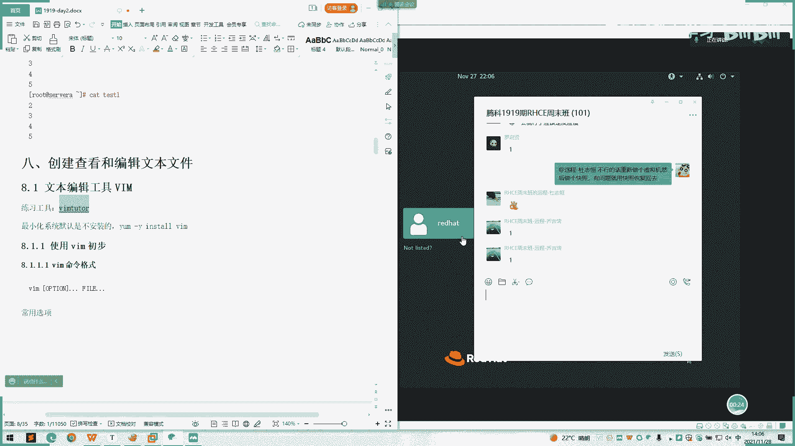

哎，这里先登录一下。Yeah。

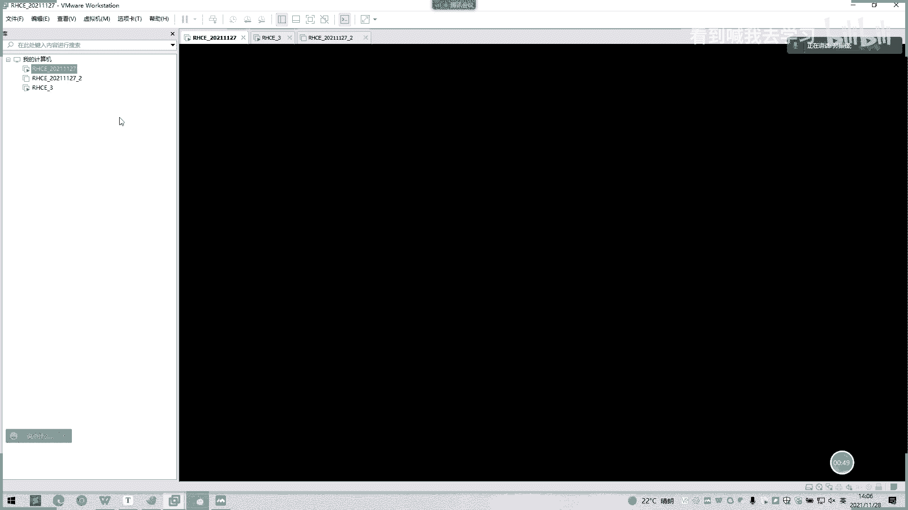

如果有问题啊，像我这样一个做一个快照啊。

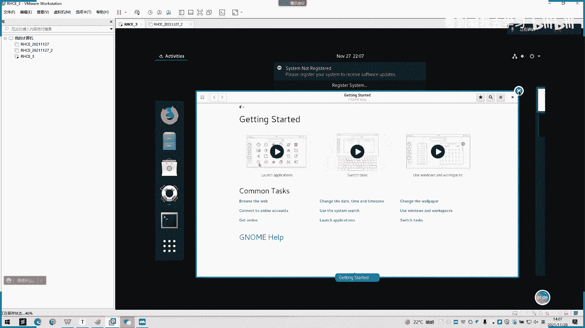

我，想到了。

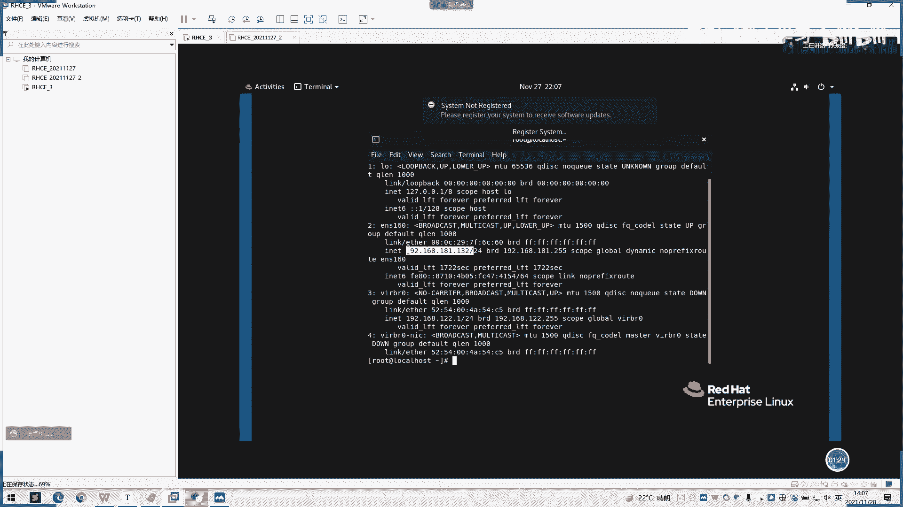

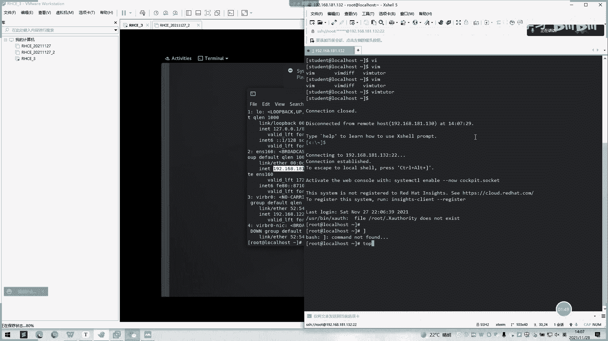

Yeah。

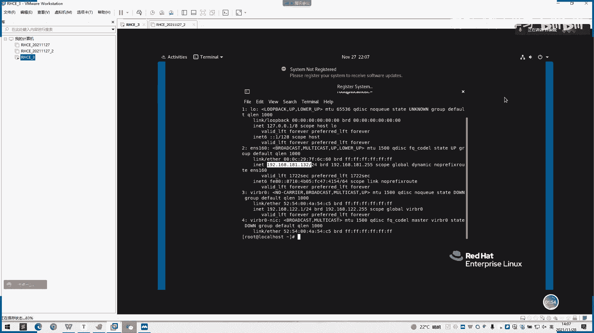

哎行。Yeah。行啊，那我们今天下午就开讲一下呃VI工具啊。呃，像我们已经大概大致的就是说可能介绍一下一些使用情况。那我们现在呃详细的再介绍一下如何去使用这个。DIM工具啊。

首先呢我们可以有一个练习工具，呃，专门练习一个UM的一个工具。这个叫1个VMQQ。这可以打印出来。么回车呃敲出来的话，它会有一个类似于文本的，就是介绍UIM的一个文本。这工具是个VI1个测试啊。

然后我们这里可以看到呃上午讲的这些方向键的运用呃，上下左右或者是。HI呃K的话都是可以放下左右的调啊。所以大家在电脑上面自己打，自己去测置。嗯，这里有个直接退出了一个按钮，强制退出呃，还有两叹号。

然后这里他这里讲的很详细。然后首先说一下，一般如我最小系统默认的最小安装的话是不安装的这个VIM工具的。我们去。我们需要直接要面去安装。但是我这里没有设置云源呢，现在还没有设。

一般要去自己去设完语音之后，就是装这个VIM就行了。如果之前自带的话，就是1个VI。VI也是可以编辑的，但是跟它跟VI5的是有一点区别的。

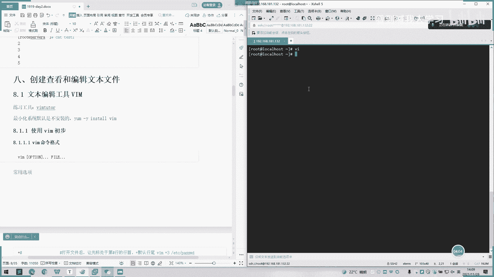

呃，有什么区别呢？我现在开了两个钟口以。都没看见。这样可以很详细看到。呃，比如说我这边我想看一下。1个ETC下面一个他出我。呃，它是一个这样子一个显示啊，那我1个VI跟我1个ED下面它是我。哦，那明白。

他看到没有？这边是一个高亮显示啊，就是说它的颜色呃会有各种颜色去区区分开来。这是他的一个比较直观的一个区别。还有一个是。比如说我在我按。找一个。嗯，上吧，我找个路。是直接就是指向了第一个。呃，陆长。

那我这边再找一个路入德啊。他这里的话会有颜色去区别开来，就是所有的入头会有颜色去单独标记出来给你看，是它呃第二个比较实用一个功能。大家可以在自己的电脑上面敲看一下。像我这样打开两个窗口。

然后去去比去比对就可以了。然后还有。就是他比较。别一个功能，有一个功能就是说唉。都是可以相同点的话，就是都是可以进入到这些的一个命令行模式啊，都有的。都有相同点的话都是有。也是也可是可以音射的。

它也是可以进行一个音色模式。嗯可以进行一个映射模式。都是可以去编辑了，因为它都是一个编辑工具。

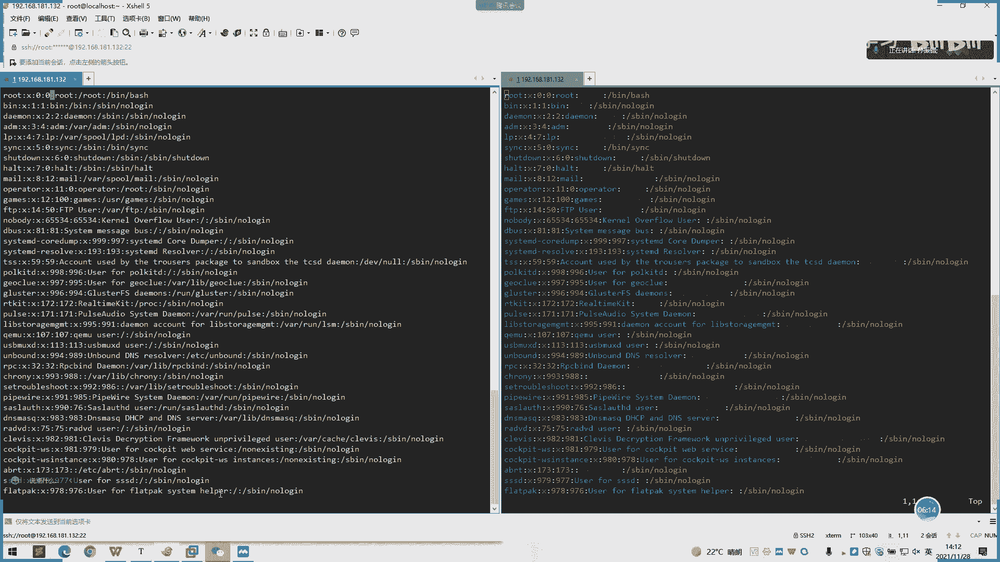

呃，然后之前这上午已经讲了，那我们看了下。

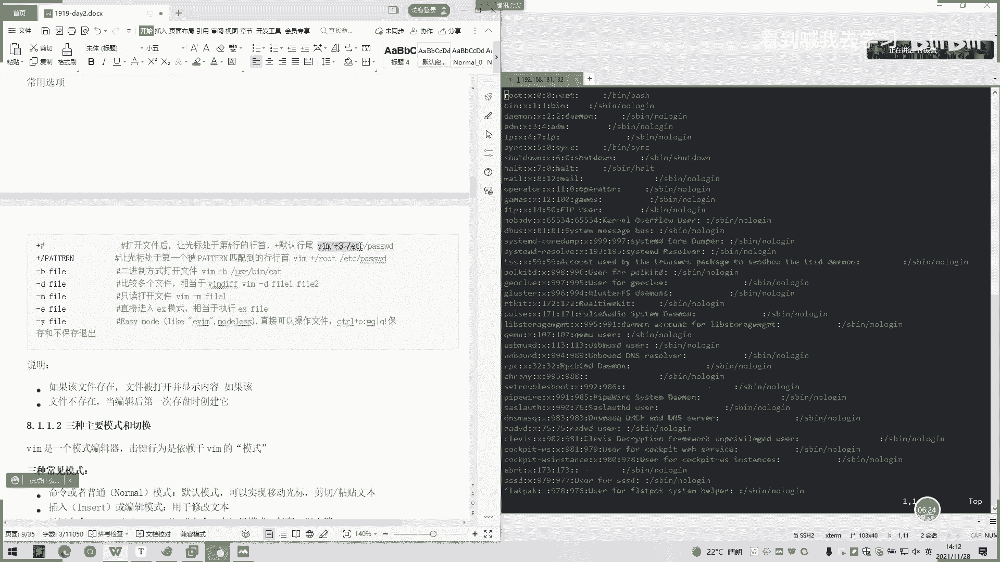

呃，他是不是有有这个东西啊？上午讲的话，我们上午的这些命令是不是也跟这个是。一样，那我先退出来。嗯。第三行是吧，那这边有没有呢？这个VI有没有第三行？这也是有第三行的。

这两个工具都是会有这些参数都是一样的。有一不同的，可能有一些根本的。就是颜色的不一样，还有一些。

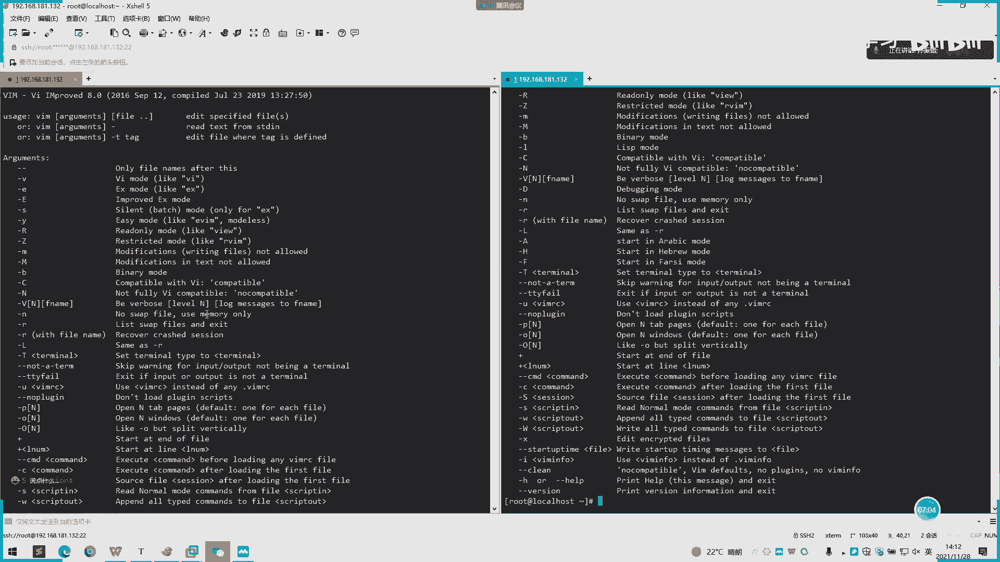

能。编辑不能编辑，有些扩展命令是不能用，然后扩展命令那一块我们稍后会讲到。然后这些VI跟VM都是可以操作的。哦。默认我们。刚刚这。那杠。

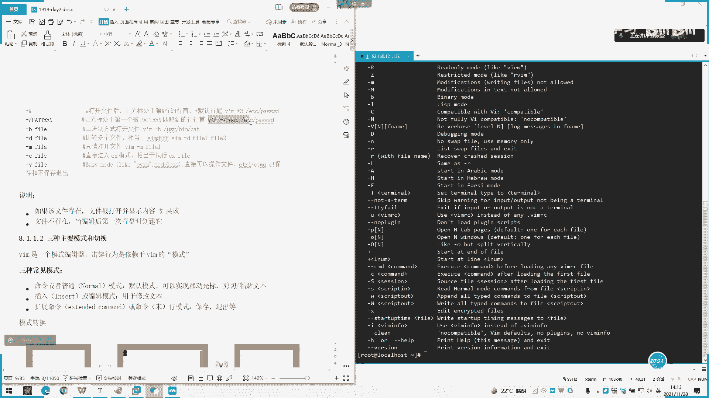

他光标处被一个方子行熟了，那就个匹配。

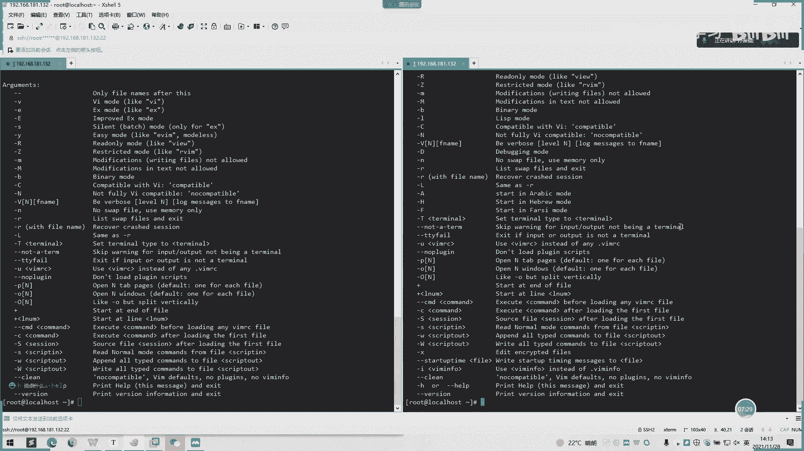

他就可以直接匹配roroot了。这这个就相当于我在这里。

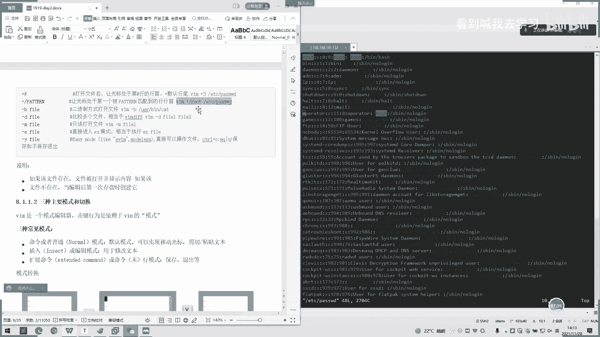

啊这一样，我直接我直接在外面就可以匹配，我直接外面加一个加号，然后加个杠或者就可以匹配。如果是加，比如说加三的话，就是第三行。加三的话他会自营拿到第三行，这个意思。

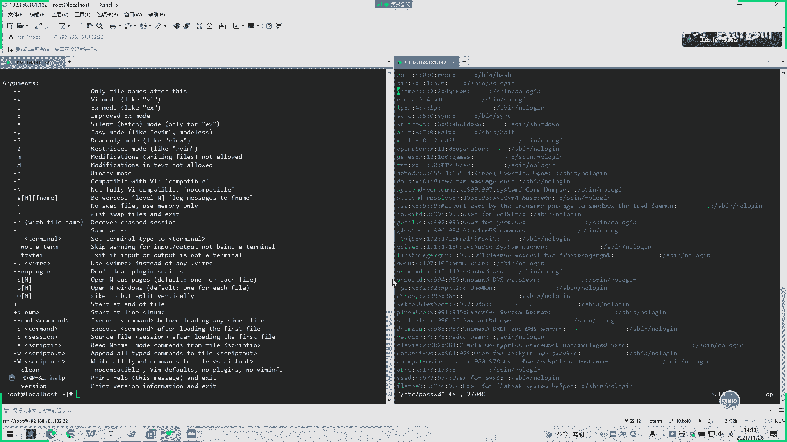

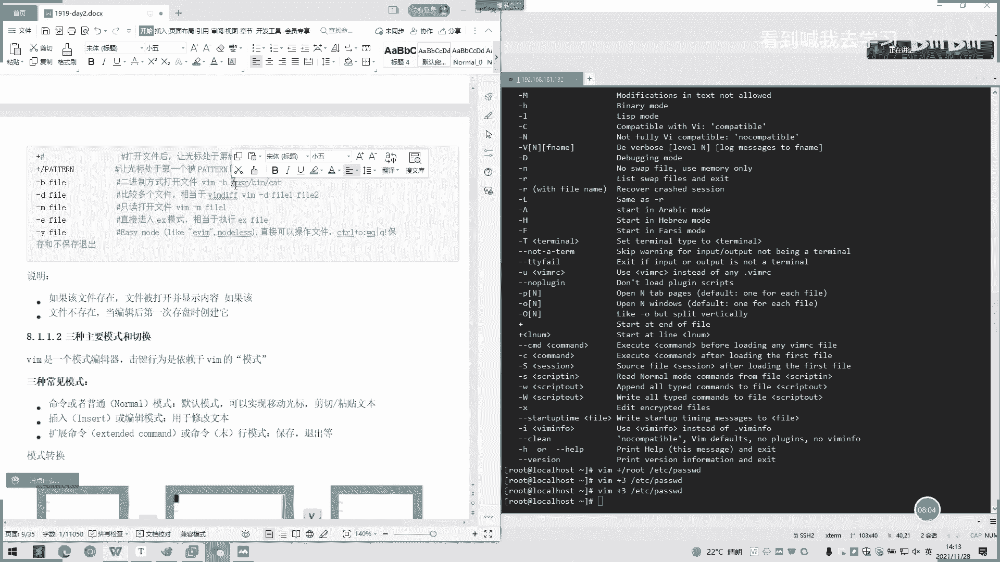

如果说是杠B的话。这是二进制是去打开。又有什么不一样吗？啊，哦如果是。你对比一下。我是正常的，就没没有加杠逼的，就VIM直接打开的话是。这样子。然后这里打开是。有一点不一样啊。

一样的是你看这些有些会解释成一个二进制一个东西，但是他这些有些是解释不了的，这些是可能会用这这个at符。我这个我也不不经常用，就很少去看用这个杠笔去看这个我觉得一般的话我们就会。

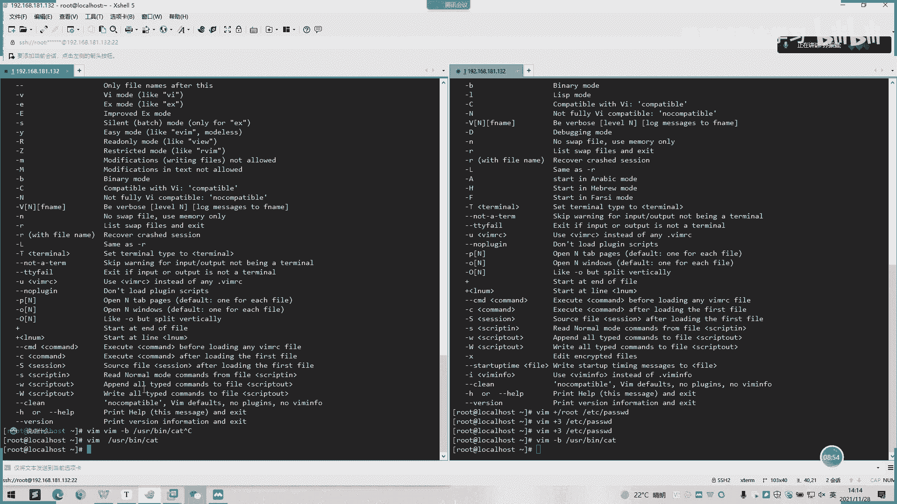

一般的话我们就是可能比较对比比较多，就杠关杠低这样子。

上午也是演示过了呃。就是就是说VI。你先再演示一遍。好，那我在蒙加盟。下面有这一个要再起皮一个过来。我编辑一下这个bg。我听我修改两行。然后我去拿抗迪去做对比。它打印出来就是说高量显示，就是把修A不同。

就是说两个文件不同之处都会高亮显示出来。然后这里的话颜色它颜色会较深一点，它会标较记载。当然它可以匹配多个文件。那如果说系统文件都有呃。统知处呢我看一下。哦，刚刚是123是吧，那我就第四行修改一。

修改一下修改修改下了。嗯。아지。他就会如果就这三这三个。呃，三个文件不同之处都会打印出来，然后都会高量显示。比如说这个跟这个是不一样的，这可能跟前前两个文件是不一样的。

然后这个文件又跟前面这两个文件是不一样的。它都会是最高亮显示出来。最出的时候要按3个Q啊。干麻烦这反正。

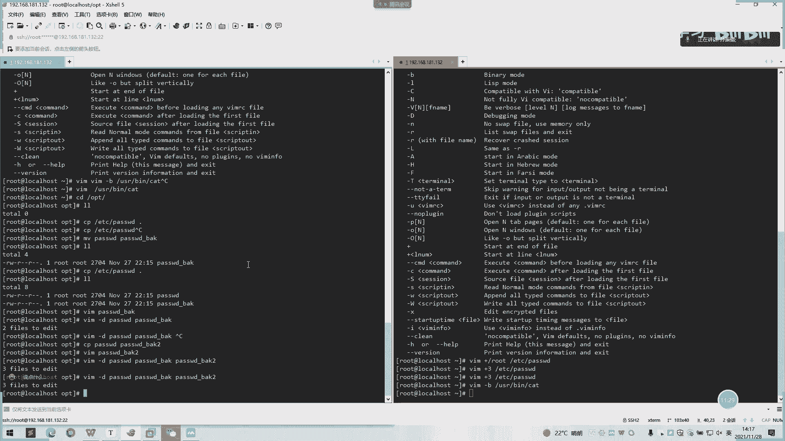

三次冒号评准退出。啊。杠一的话，这里。上午就可能就大概讲完这些吧。然后。还有个说明啊，这如果该文件存在的话，文件被打开并显示内容。如果该文件不存在的话，当编辑第一次后存盘时就是会创建它。

就是我们他自己都会创建一个新的文件。如果不存再进行编辑的话。

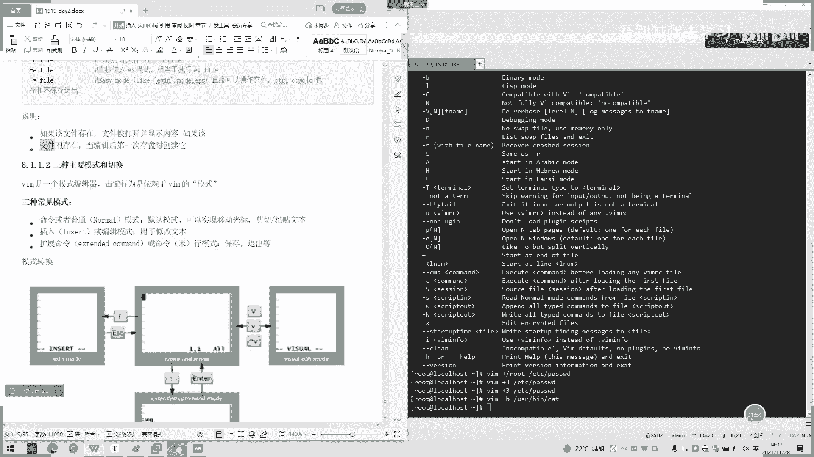

그。嗯，好。好烦咧。然后进行编辑。并且都会保存到这里啊。

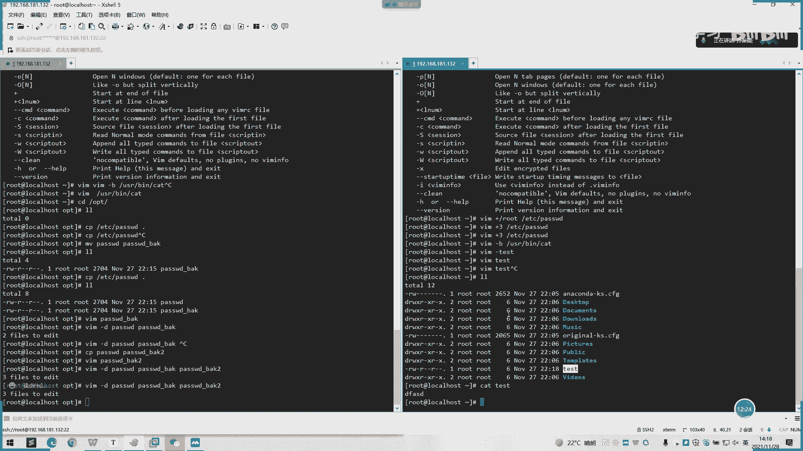

上午也是演示过了。嗯，然后再介绍一下。呃，下午主要三种主要的三种模式啊和切换。我你跟你说一下。然后。他说三种常见模式会有一个命令模式，一个插入模式叫做音色模式或编辑模式。

我们一般都是叫哎编辑模式或者插入模式比较多插入的还有一个扩展命令啊。拓展命令呃，可以等一下再讲。我们先讲一下普通模式的命令。哎哎普通模式下面的。

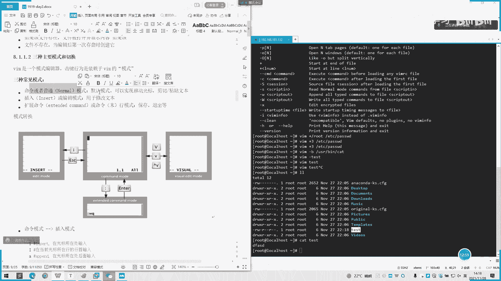

普通模式下面就可以实现一个。封封标的一个操统优统一操作。嗯。我们可以实现一个总光标左右操作。

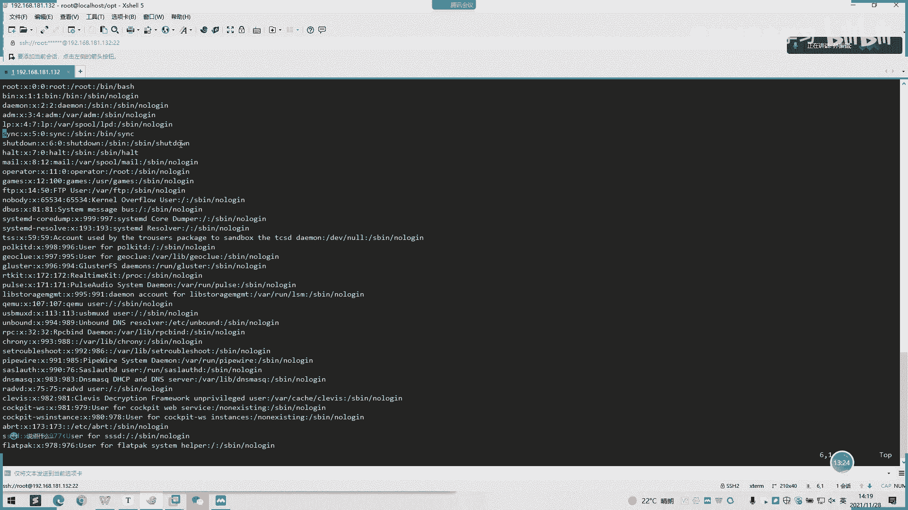

上下左右都可以，或者是按HK。HJK什么东西都可以，就像刚刚那个。同原件一样的。或者是做一个粘贴的文本。如果这边粘贴的话，可能。我先不知道删贴可能是按P按P去粘贴。可以。Yeah。嗯。

这里有我记得这里是有。嗯。命令模式。然后如果保存的话，就两个大街。我接个爆炸。两个大JQ。这个。嗯。还有一个是光标的跳转呃，光标的跳转，就是刚刚我们所说呃，方向键的跳转，从之是方向键。

一般的话HJK这些。拍的话我们呃很少用。如果说你键盘上没有的话，才才用，一般都用方向键比较多一点。然后还有一个单指间的跳转，单指间的跳转。你可以试一下。不了。有按W啊，就一直跳。二单词的手啊。

下就下一个单词的手。如果说按一的话，就是。下一个单词词尾。就是按B的话，就是一个。前一个单子，他就往后了，他就跟W是相反的。W是下一个单子的值守啊，一就是前一个单子的值手。我是当前页的跳转呢。啊。

看一下啊。大曲就是月收嘛。呃，我现在在我这是在底部啊，我要按H。大学。下去。张成燕。如果是液中间的话，是焊天的。呃，怎么算中间呢？看一下行数。成天的开到20了。比是L这是液底。复制复制的话就是YY啊。

YY默认复制的是呃。呃，康前航。如果说你按。你注意看看一下我这这里啊，注意看一下我这一段的。我现在是拜拜。看有什么不同吗？YYY，看到没有？它这里会先出现一个Y。然后第二个Y的时候，它就消失了。

到我按低。按P按没按没按P，然后他就会自己去己复制粘贴到下一行。呃，还有一个YY前面，比如说三3看到没有？它这里会有一个3按。3YY。然后他自己就会变化一个。这里就会有变化，然后我们再按个P。那嗰边。

他就复制三行，是这个意思。啊，这是一个复制啊，还没。我们接下来接一下。呃，先讲一个页面跳转。这其次的话就是。点手啊。截清。没什么问题。中间呢。1。这里的话就是CB。其是跳到这里。

你要这有个行走行尾的跳转。这可以看一下。啊，我们这里是6啊，我们按shift键按按6的话就是一个。跳转。我是按欧。没插入。Yeah。这还有个航天移动。相当于在扩展模式下。这个。我们看一下复展模式的情况。

Yeah。이。嗯。哪个区。别。B居。地主。一级就是跳到冬级了。两个大局就是行伟。一直就是他的。就是。头一个尾啊。都明。两个小区也是。啊我一个大局就到哎定然两个小区就是到最开始的地行。

要是海有个命令模式的翻屏操作。这为53有1。这有点多。CrlF。很跳F。开一直翻译。你说比就是网。往前翻。周要只会放音。很说比如翻半屏啊。按屏。不是3半。这还有个字符有编辑。啊。

我们这有个删除方便有个字符。嗯。要不要给你们先练习一下5分钟。啊，面授同学们在练习吗？有在练习是吧？因为这个。这个好像就是手也看不到，所以只能让你们去练习。你个。BI这里是课件的，但是。但是说呃。

都是快捷键的话，可能就看不到手。可以看你们自己去呃照着这里去练习，然后你看一下哪些是。不能实现的，你告诉我一下。给你们5分钟练习吧。呃，到。呃，35分我们呃我们再重新讲一下下面的这些字符编辑一个功能。

还有个替换命令，删除命令这些的。你们可以先从一个呃命令命令模式，这里退出VI保存啊，不保存这些开始做起。没有钱。Yeah。我不。可以的。写一下。

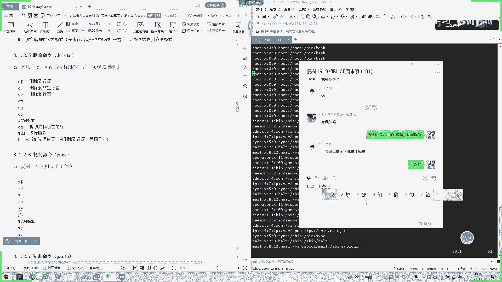

Okay。

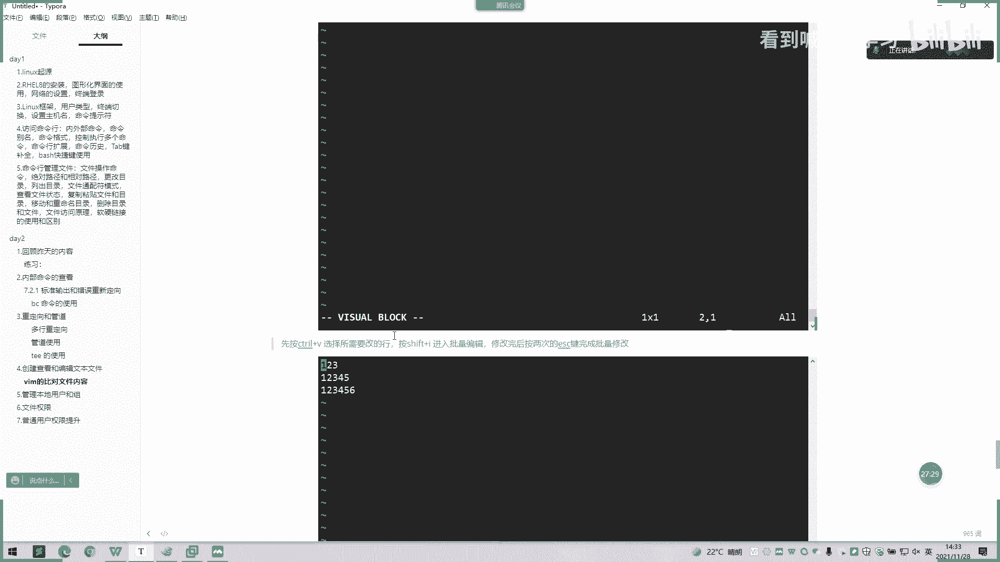

Yeah。啊。根本就。Yeah。Oh。嗯。Yeah。怎么样有没有碰到难点？Yeah。有没有问题啊？嗯。嗯。Yeah。Yeah。嗯。Okay。一。没。Okay。Yeah。Yeah。与明明同方向。

给你返方向。你这是。杠N呢。你这是练到哪里去了？我看一下。Yeah。Yeah。那放一个。

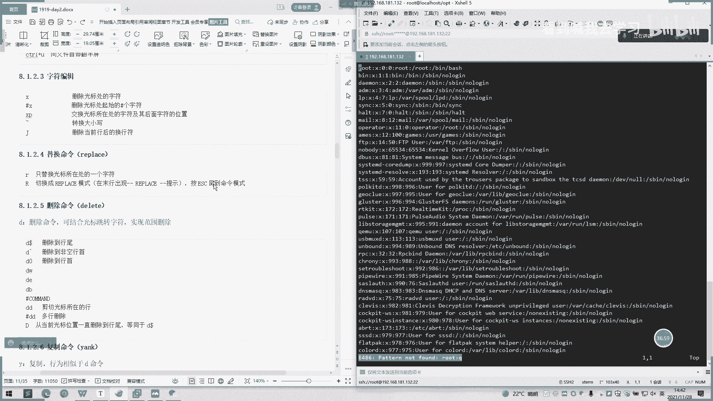

嗯哼。这个同学是粘哪里的？这没找到你要看的东西哦。O。好啊，嗯，我们继续说一下替换命令啊。我们继续说一下替换命令啊。对话明明是这样子。天完命令是这样子用啊。我按R角R的时候啊，我这里是不是有个小R出来？

一切以这里看的为准了，这有个小阿出。那我把它替换成大Q，当前的空标的字符是不是替换成大Q了？好，我带一个按一个小啊，跑的S，再D换一个大Q。是吧。是把这个大小啊。再听了你个大厅。是不是替换掉了？

然后还有第二个是按大R的。他的意思。就是说。按他这个就会有一个。depress一个模式啊。那当。左下角出现这个replay模式的时候，我们当前光标只要就可以随意更改啊。叫说把B改成一。把I改成2。

把N改成3。当前光标所指的内容都可以修改。我可以用房间间去修房间间距址，看一下哪个需要修改。啊。这样子。一个新新增插入啊。也可以插入啊，如果没有修改的话，就可以直接新增。你可以回车啊。他就跟。

编辑模式不同，它会相当于你可以把理解的一个会覆盖会覆盖当简。当前的一个字符的一个状态。这是计划。我们按S1推出来。那还有个删除命令讲一下。删除命令就是可以。有范围的删除，有单个字符去删除，我们还是以。

我们还是得第一行序为准。三大行。上诉到行尾，那我从第二行开始。第一。看到没有？我像右下角这里有问题。都按到了，这就变了。啲。好了。The。嗯听到了。行删除啊。做我这里。这个行多长都可以。然后按第一道了。

嗯。就没了。然后有一个删除到飞空航口的。虚空的话，那我这里。什么时控啊？16。对吧。6。就前面这。空白的是他是不会删的。那再来。还有一个是删除到怎么所了。这行。直接就删除到行说管这个有没有空白。

他都会删呢。1林。还有个DW啊。W意思就是把。也智商单个。我这里补充一下。Yeah。Yeah。二二。第一次向右。删除啊。ち。两个地屏。删除向上银行。Okay。And并。啊。还有个滴滴啊嗯。

滴D就是减贴的意思。滴滴。按皮的话就会把之前粘贴的会粘贴起来。然后如果是挺低的话，就不一样。请滴滴，你后会前面会有一个。考量显示。停接啲。然后一个大D的话，就是从。光标处一直删到行尾。

这这就适用于当前行的内容啊，你不用不用呃，不用让他缩进，那就用大D就可以一直删就可以了。好。我们下面看一下复制命令啊，复制命令的话就相当于呃行为跟D命令差不多呃。没也是这样子啊。是。Y。好。

我已经执行了。顽皮的话，他。他会复制1%全部提。准备往前面进去。是Y0的话。对个。嗯。有个 waiting。有YY也是。嗯。是的，都是有删除过功能的。你可以自己执行一下，看他们之前有什么区别。

DW这也是删除一字符串的。你看。没有。你们后面怎么只用啊？我是YY的话，一般都是复制复制行嘛，EYY。Y吗。要更屏更平。有个大Y。对。大白。快也是复制当前行的。呃，还有个粘贴啊。

它跟小P跟大P是有区别的，粘贴的缓小批的缓存区。所以如果是为整行的话，则粘贴当前光标所在的行下方，否则的话则粘贴当前是光标所在处的后面。有是下面是个。整行的话，那就是上方呃，或者是前面的。

我们可以来试一下，我们做个空格。那我你白吧。我按小P就往下粘，一直往下粘。如个。如果我是按大批。是不是就在前面了？这里。Yeah。嗯。还有个改变命令，改变的命令啊。删除后。C删除后切换成插入模式。暗时。

还没有。按按息。1到了。C到了，就是试试插入了。嗯。常用的是CC吧，常用的话是CC。删除当前好像便直接进进进入一个编辑模式。或者大大师也可以，效果都是一样的。有是1W，就是也是删除一个字符放。CB的话。

是。嗯。7密的话就是删除。上个上一行的呃行委啊。你看我这里。CB。直跳到下一行。然他。前面的。他会删除前面那种。不是是不是韩伟啊，是前面的。所以删出前面的一个字母算。系有个 c 啊。Yeah。Okay。

Yeah。进入。天车有。嗯是。点击。设政。也是一样。这个是空人。一张。Yeah。对个。嗯。嗯。没不见。一是。Okay。嗯。

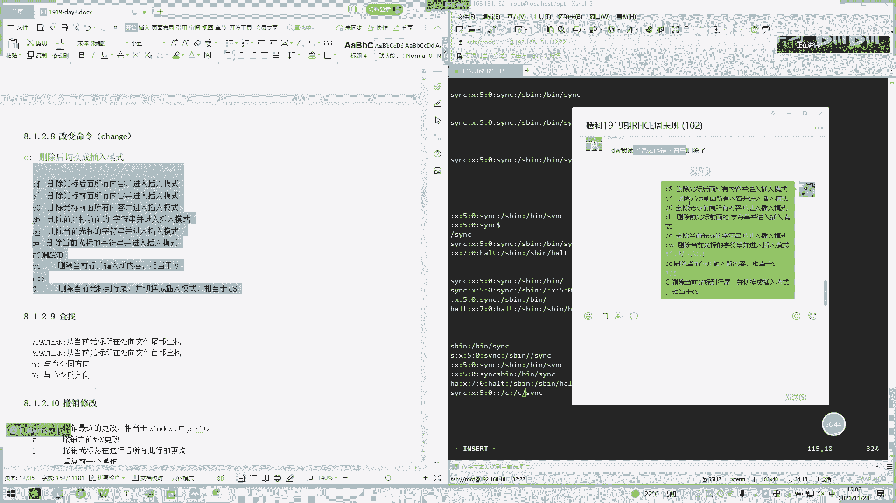

哦，我们先说完查找跟修改。查找的话就是。当前我们退出呃编辑模式就入点普通模式之后，我们按下呃斜杠，就是问号这个。摸到这个键呢，它会进，它会左下角会打印打印出一个斜杠出来。

然后我们是按我们输入我们要想要查的字符，就会高量的显示出来。就当前的字符我们按回车按回车的话就会。默认性。按回之就会直接进入到查找，然后我们按边的话就可以一步一步往下找。一直找到找到底啊。

找到底找不到之后，他会再回到第一个去找。一直这样去。这是向尾部查找，如果是首部查找了，那就是。呃，直接打个问号，就是说shift问号这个键。然后谈一下病。哦，我按天的话就往上走。哦，我要加班了。啊，哦。

刚刚那同学说了，大N跟小N就是这里是吧，与命令反方向。好，这一个向下。刚刚如果说我是问号的话。呃。问号查并的话，我按N是向上的嘛。但是我如果是呃斜杠去查这个并的话，按N是向下的嘛，然后他这一杠。呃。

这大言就是反光向嘛。所以他跟上面跟如果你你执行了这个向尾部查找的话，你按边是同方向的，一直向呃向下去查找吧。这个文件的呃尾部去查找，就一直往下翻。如果是说大N的话就是。你执行第一个向尾部查找。

如果你按大号那就是反方向嘛，它会向。呃，手部去查找，而不像是尾部，然后同理这个也是一样的。说来刚刚同学。有明白吗？然后我们再说一下撤销修改呃，撤销最近的更改。

相当于一个windows的control机啊。然后我们老同前进来。其他合作。比如说我刚。删个一行吧。我按U的话就会回退到呃选一行。他会有有显示的话，就是这里吧。之前最呃这是表示最最近的一个修改。

回回推到最近一个修改。

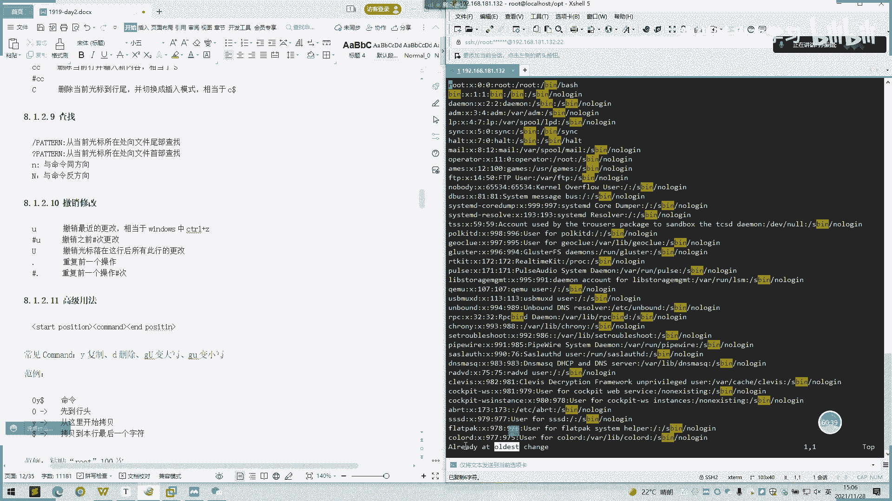

他会自己显示。

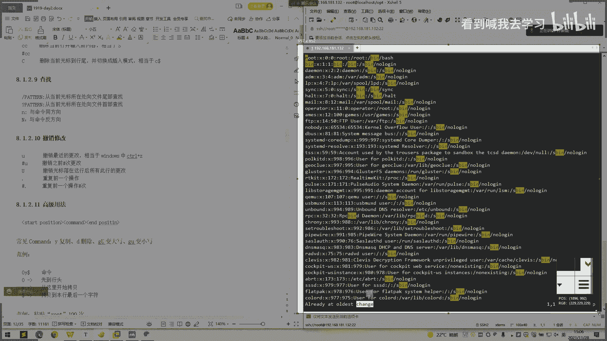

Yeah。如果说是呃景入的话，就是撤销之前呢。前N次修改，那我就删。等一下。Yeah。进2U。就是把原来前两次的修改就会。回知道。二。开始啊。这样写的话可能会更好明白一点。嗯。

撤销光标落在这行后责时行的更改。明白。是里啊，我这里编辑。然我安看 you。他这个修改了。再来一下。嗯。我然扰他。哪有。是不就感。重复前一个操作。从共选一个操作。影影影点。是然一直插t进去啊，有我是。

删的话。3还位是3。这几个粘贴复制粘贴改变跟查找，撤销修改。呃，给你们练习几分钟吧，我们15点20分再来讲下面的内容。我们会想到一个高级的用法。Yeah。B须。哎，新来的同学，你是之前装了吗？

你是远程的还是？哎，哦卡资料这有这有。嗯。呃，我我把东西进，拷问一下，你必须要加标准呃，对对对，最好是按照跟使用环境一样的，稍等一下。

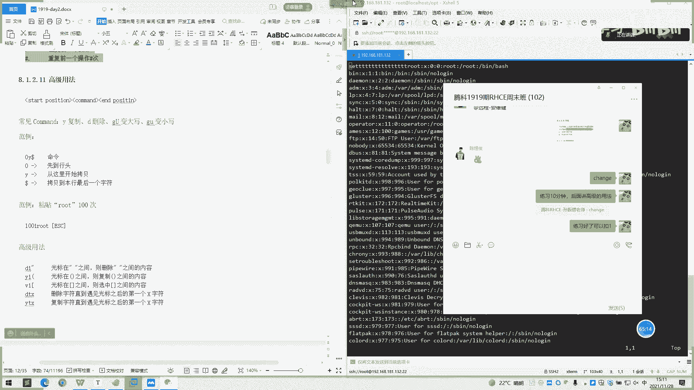

我把资料拷。那平时平时我练习的说7。呃，平时练习的话呃，其实差不多啊，只是我们练习的东西不一样而，可能7点几跟2。0的系统是一样的嘛。但是我们后面考试还是用8。2的这样子。他知的话可能考试。啊。

命令其实没有没呃，其实基本都是一样的。但是的话对。啊如个。呃，7的话可能还有一点不同吧。比如说设置网卡那一块的可能有点不一样，页面也不一样，可以看一下。我。哎，之前你在群里面吗？啊我们这有个。嗯，在群。

在群是吧，微兴趣。但是我觉得。我自己都有。等一下你就把这里这几个都拷过去行。这几个都拷过去就行了。然后这里有个使用环境，我们做后面用的Sible要讲到了，我们现在只是先装了这个镜像而已。对。

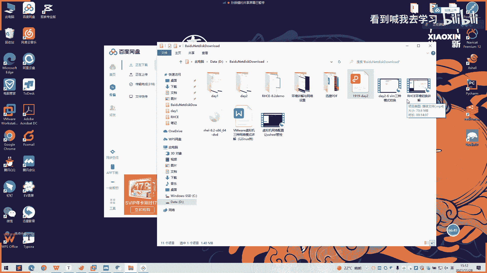

Yeah。