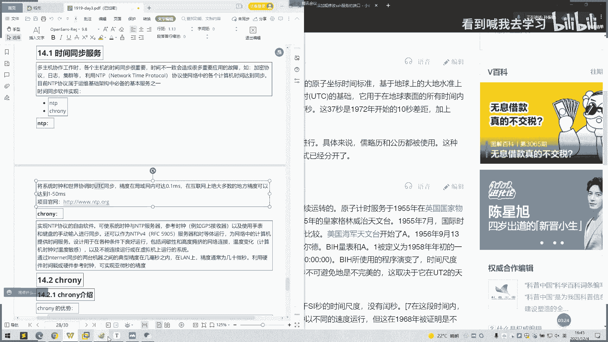
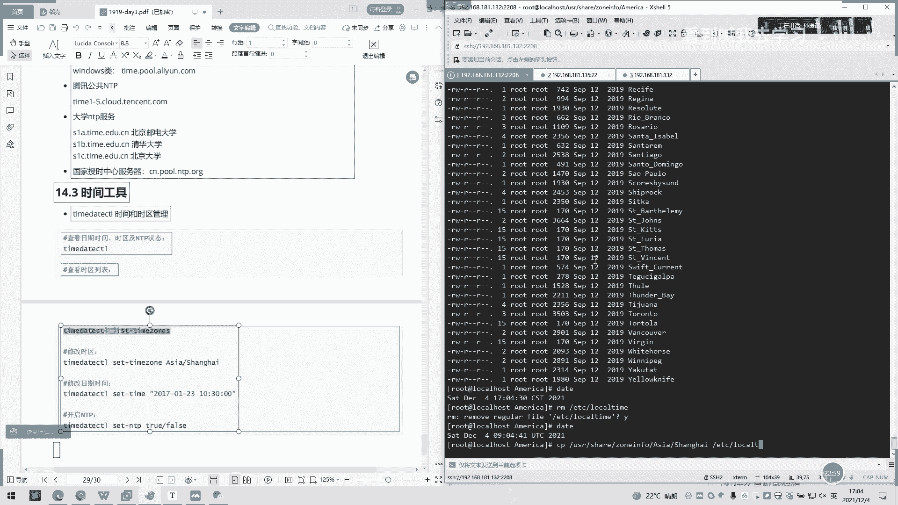
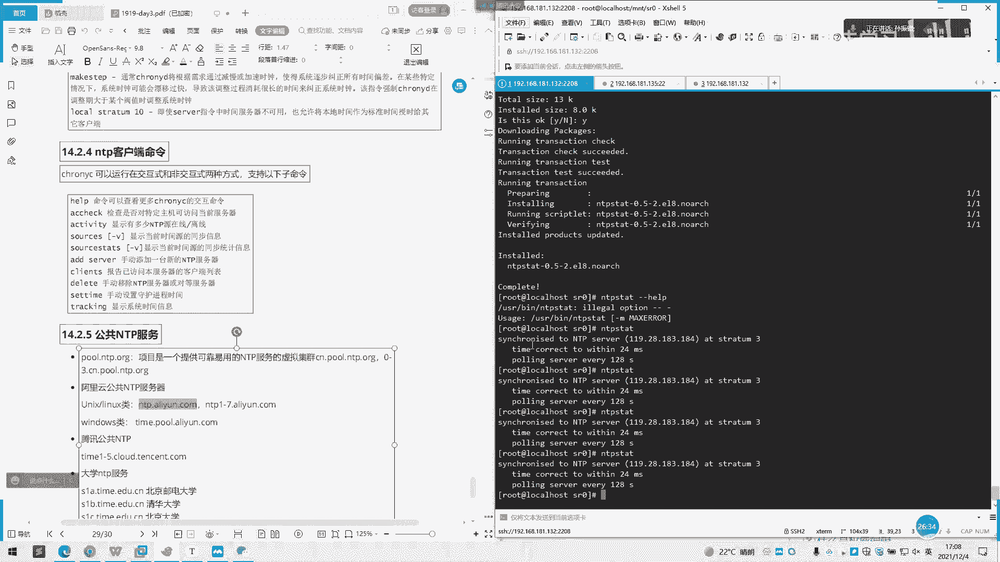

# 2022 01 最新rhce教学视频 - P11：day3-5 - 看到喊我去学习 - BV1Na411y7SQ

协议呢属于运维基础架构中必备的一个基本工具啊。就学运维的同学的话呃，基本操作啊就是设置时间啊，设置时区啊，这些都都是机差啊。然后时间同步软件的话，就会有一个有两个1个NDP1个pro。

NDP先说下NDP啊，NDP就是。原理就是将系统时钟和世界协调时UTC同步这个UTC是什么呢？UTC就是。呃，我们有一个标准时间，就有1个UTC。然后我们通过加减时区的话去设置它的一个呃一个纬度。

根据一个地球一个纬度和精度去设置它啊。然要精度在局域网内可达到啊0。1秒UTC。

啊，UTG软件百度百科可。我没申题。

很简单一点。

协调时间又称为统一时间，世界标准时间。啊，国际协调时间由英文词学和法文什么缩写不同啊。简称U利C，然后协调世世界时是以原子时秒长为基础啊，在时刻上尽量接近于世世界时的一种时间记账系统。中国大陆采用。

采用这ISO什么8601-1988的数表示方法。然后这些可以不用记。这些个这个也可以记一下，这是中国时区的一个东西。然后这有定义啊，国际原子是啊，什么是国际原子是？

就我们可能就是通过一个某元素的原子能呃跳跃，具有极高的稳定性。呃，把这原则我们所有时间都基于那种原子原子时钟经过吧，原子时钟就是最准确的一个呃时间。然后我们都是所有的东西都是根据原子中去调节的。

然后根据全球有60个实验制中，带有240台自由运转的原子中，提供数据进行处理，得出国际时间标准成为国际原子时TAI。这可以到这要一定要了解一下他的背景。TAI的起点是这样子规定了。

取1958年的1月1日的。呃，0时0分0秒，为什么1958年呢？其实我也不太清楚啊，1958年什么时候，可能是好像当时电脑诞生的那一呃，就是始终诞生的时候，就是从那那时候开始算制时间的。以原子持续为准。

然后瞬间作为同年同月的0时0分每秒的TATD之后发现呢在该瞬时原间成为0。0。039秒。那就多少。真的很悲差一个差距，这一差就作为历史要保留下来。

啊，这些都是原原子时，大家回去可以自己百度一下。

然后我们这里讲的是啊如何去设置呃协调时间呢服务器。然后实际NDP协议的自由软件可使系统的时钟与NDP服务器啊手表进行同步。那我们可以跟世界的那种时时钟进行同步。然后我们。这可own有个介绍。

更快的同步只需要数分钟，而非数小时同步，所以最大程度减少时间和频率的误差。这是说它一个好优点了啊。并非全天24小时运行的虚拟机。那也非常有用。这可能你关关关了虚米机或呃一一会几个小时，然后再开。

然后再关。他可能如果你不对校对的话，就可能会有相差几秒钟或十几秒钟这样一个延迟嘛。跟外面正确时间这样子。他的呃它的这个就是它的优势，他可以自己去慢慢去同步校校对。然后在初期同步时，它不会停止时中。

以防止对系统保持单位条件应用造成影响。在应对延迟的时候啊，大规模造成饱和链接饱和时提供了更好的回信，这也不用管它。无需对服务器性人群一即具备间接性网络可以快速同步失踪。这有还一个后台运行。

它它会一直挂于后台，要慢慢去校对。我们启动这个服务的话。就一直是属于让我们的服务器保持在一个呃精确度呃精确度比较精准的一个。十里面。然后同去直接去看吧。这里。他的一个启动服务是在这里。

我们这学校的sson其动服在这里，我们可以用C去看一下他现在一个呃工作状态怎么样的。In mind。哦。上面加个D啊。是不是大现是启动的？active run正在启动。

然后我们要用一个pa可以看到它一个时间。

想看。

对。

呃对他。然后他有个监听端口，监天端口是3231123。我们看一下这个减点担跑。我们用这个NTP要看。嗯。哦，这是没有的。你这个看一下吧。上想。好。没有。看一下配置文件。口可以进入关它。

我们看一下配置文件，这就是一个呃它一个cloown，一个服的一个配置文件。然后它这里有几个应用。啊，所我呢可以用于时终活务潜。serv我嘛可以用于时间服路器。那我们这里其实在我们这可以自己去设一个。

是一个值。你看它里有一个解析op，这里设置一个。呃，已经设计了1个2。2。0的这样1个NDP啊，这是个地址啊。然后我们就。啊，如果说。你们说一下，可以用于设置时间服务器啊。

ibook选择当前服务器可打死，发生个8呃1个8个数据包呃，而不是通常一个数据包包间隔2秒，可加快初始同步，就它间隔每一这隔两秒都会自动去同步一个。呃，同同步一次时间。

这个是那个i push push一个功能。你果后面加busush，如果是加后面说。加是我的不一样。然后这里有个啊DIIFT，这个可以不用记。我们这里也是有的。就这里。

我们对根据时间计算出计算机增减时间的比率，将它进入到一个文件中。我们看一下是不是。好。可从在重启OA系统之间做出补偿。不。那这个就是一个相差值嘛，我们当前可能是。啊。当前你。一个计算哎，-13的一个值。

可能就一秒1毫秒这样子，然后他们相差可能在0。0几秒这样子。这有个呃SYNC的一个启动链头。你看他有没有。哎有系统时间每隔11分钟会拷贝到11时钟啊。这里的话就一直。它是每时1分钟去拷贝。

然后这里al指定一台主机或者子网哦网络允许拒绝访问访问服务器啊，这也是有个白名单的一个功能啊，可以，然后它这有个。指定哪台主机可以通过cloud使用控制命令。

就说别的主机可以通哎访问你的这台主机去校对他那个服务器的时间了。呃，机房的话可能经常会用到，就是说可能有一台服务器，它就专门做一个时间时间服务器。然后你你机房其他的100台服务器都会呃指定这一台。

我在这里设了，我就设置台IP。我这设置的IP是这个，然后我每次那个这个clo服务就往那台哎哎服务器去校对，就那台服务器是多哎，就是多少时间多少，它下面一排的服务器时间就是多少都是一致的。

这样就可以对整个机房的一个。呃，时间一次去会啊，这不会有个别的服务器做的时时间是不同的。只要对可能可能服务在日志上面打印过候你有差异，时间打印就有差异这样子。呃，这里的意思大然是这意思。

然后这里是有白名单跟这些呃指指定的一些东西一个参数。然后这里有个呃byCND的adjust，你要允许监听哪你是看监听哪个接口来自请求的YI执行命令，就设置一个监听接口的。呃，这个应该正常来讲。

不会用到这些东西，这些都是用默认的好。正常来讲，我们只是修改一下这里指定一个服务器的呃是呃指定一个服务器，然后我们再重启一下这个pro服务，基本它会慢慢会往那边去同步。啊这样是什么？

这个NKSTP通常的话，根据需求将通过减慢或加速时钟，使得系统逐步纠正啊所有时间偏差。在某些特定的情况下，系统时钟可能会漂移过快，导致该调整消耗不好很时很长的时间来纠正时钟。

就比如说可能差纠正的要纠正的那台服务器的时间差异比较大，可能差异相差个两三个小时。然后的话你如果还是有问题的话，就是说他一直在调嘛，那调调不了那么快。如果说你自己想加快他进度话，你可以调这个这个参数。

然后他这里。啊，他这里怎么用啊，我看一下。Not。哦，这里一点评。我们先看完这些参数先，然后一个local驾驶servver指令中时现服务器不可用移是本地时间作为标准时间授给其他客户端。嗯。然后下面有。

开始家。一个hel啊，命令可以产生更多一个交互。你要检查是否当前房问而券AC券。然activityivity有个有多少个NTP原在线。你要这里显示当前同步信息。那我们就直接敲吧。嗯。我下我看一下。哦。

他这里这里指定有。嗯。个最话有六大。还是说13我们这有没有？嗯，不能，因为我这没有事。这没有事。我们试一下。点一个。135。然后看一下这台熟写那个。失态的。我们是供一下。听到了。去他那里。Yeah。

Yeah。还没有吗？很清楚。应该是有的。另外。啊fielded。嗯。电。试一下。嗯嗯。No。一六八零一八一点九三。是一样怎样。嗯。下一个？嗯。日志日志看一下日志看一下有没有。

系统日志啊E有lock下面哎没有。Yeah。那我这里改个时间。行。不用担谢情。1区不一样。先等一下，然后看一下能不能自己慢慢纠正。2。然后我们这里有个具来讲一讲，我们后面看一下这个时间。

然后我们这有个公共的NTP服务。啊，他这个意思是说我当前的一个。啊，一个时区啊，他这里就是我们刚刚设置服务器在那里唉换。嗯。历史。我自己设一个。因为这里时序不对。说一下。收态。没有。我看一下这有没有。

转一下。嗯。嗯。是有的是吧？OK。换另外一种方法。有个楼看一下。把那肉口菜提出来。ET机。这里然后。你击毙一下。什么。是。再过一下，没事。REDC域名的loc time。时间是不是变成。嗯。

当前一个时间了。呃，原理是这样子啊，实际这个NT呃服务器的教时原理，它是通过一个。一及下面一个logo time。

各自一下。他是通过一个。

呃，这样一个文件去读他当前的一个时间，一个时续啊。啊，我可以那我把那个。星空。我打清况一下。嗯。直接是变成1个UDC了。是吧。所以说最终。时区的一个走这就个时区啊，最终一个时区的一个。

设置的原理是通过这样1个ED级logo态的。如果说上面这命令或水都没用的话，直接暴力一点，就把这下面这。这下面这里这一段拷过去就行。Thank。嗯，这里没有介绍。然后这里这里的话看一下。

喜方是不是有一些美亚洲、美国。嗯，是吧affrica，非洲吧，美国。啊，我们去个america那里。是各个国家都有各个国家时区都有。

让我百度一下。这个你是进来。是。啊，对，就是一开始设的那里我们图形化界面啊设的那里，它其实际就是通过这个文件。对。

是吧阿根廷这是阿根廷的是吧？啊，这这些这些都是不用看，这这些都是二进制文件。

呃，所以说时区时区设置的实际文件是在这里。

大家记一下。后面说是有些服务器说后面死都受试不了实续的话，那你直接就直接就干掉，然后把这个co比过去就可以了。我，这一说。没有先点吃栗体，反正都不太伤。嗯。可始。伤害一定你手写手写肯定是那写ETC。

Loal啊。

第二个地图。Okay。

没听。这样就。小区。切饭。暴力操作。我一般喜欢这样子弄，这样直接点哦。

然后这是个时区啊，这只是个时区，然后校校对了时区的校对还是要用1个NTP1个服务。修改时期，等于我这里没有话就算了。是啊。No could。是吗？你那打的是没问题的，是吗？这。嗯。嗯。那就不管。

这里可以课后自己去找一下原因，你要告诉我。反正我这里好像敲不出来。我只能家里面在暴力的一些东西。然后这里NTB教室。ATTP教是这样子。这个特件稍有点少。到咪。Is嗯。Yeah。还是因为重启。

所以重不了。那。听一下。嗯。下有个VP的。你可企得。嗯，可以行。啊，个NDP对啊是。

相差一个多秒。

首先需要原装啊。手机需要语说。装这个。比是说。谢是。Yes， miss。嗯。

嗯。嗯。

嗯。可手动添加一个。See and。你们？没听清。嗯。So司。右面看一下。上次。就把。这是这之前校对的。那系统自己叫对。然后我们看一下。So stay。这是时差，这个会列的详细一点。有。嗯。Thank。

下那我把这加一下。不行。これ。他的时啊。O。Thus。好像全不全不上。对。嗯lo没有找到。嗯。嗯。Try。嗯。嗯。走这里这个以后自己去看一下。好的，我们今天课上到这里，我们。呃。

看一下同学还有什么问题吗？远山同学还在吗？还有什么问题，你们看一下。

