# Linux运维基础：P11：时间同步与NTP服务配置 🕐

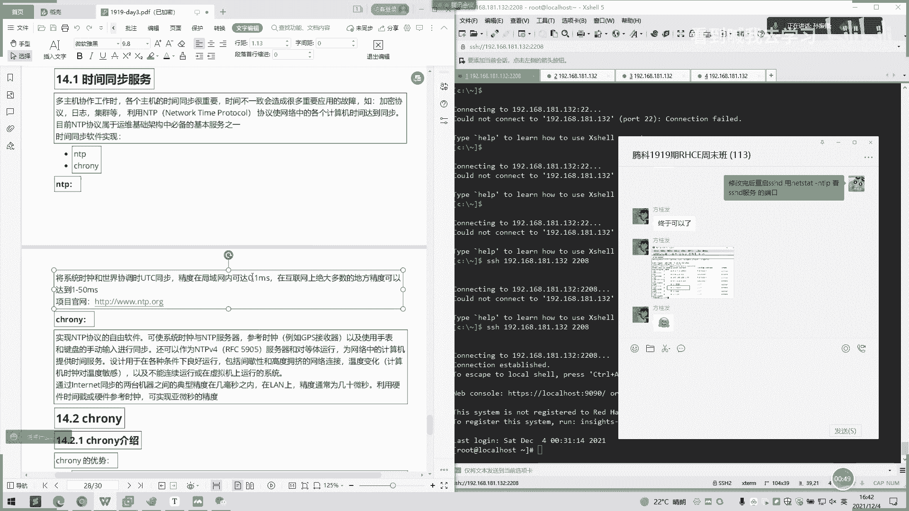

在本节课中，我们将要学习Linux系统中时间同步的基础知识，重点掌握NTP协议的原理、配置方法以及时区设置。这对于确保服务器日志记录准确、应用正常运行至关重要。

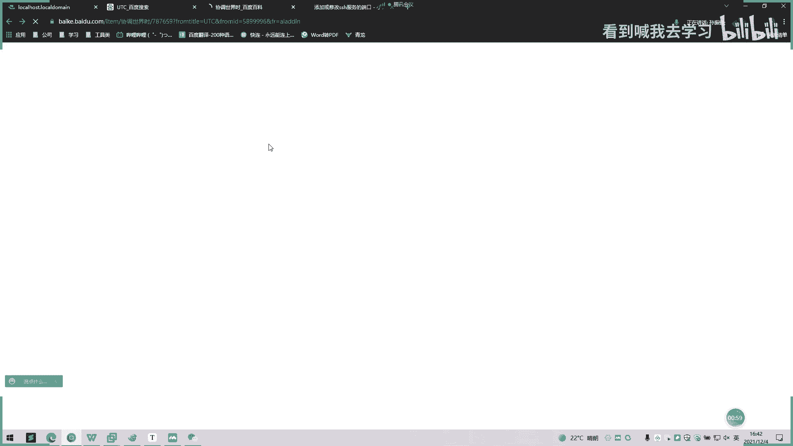

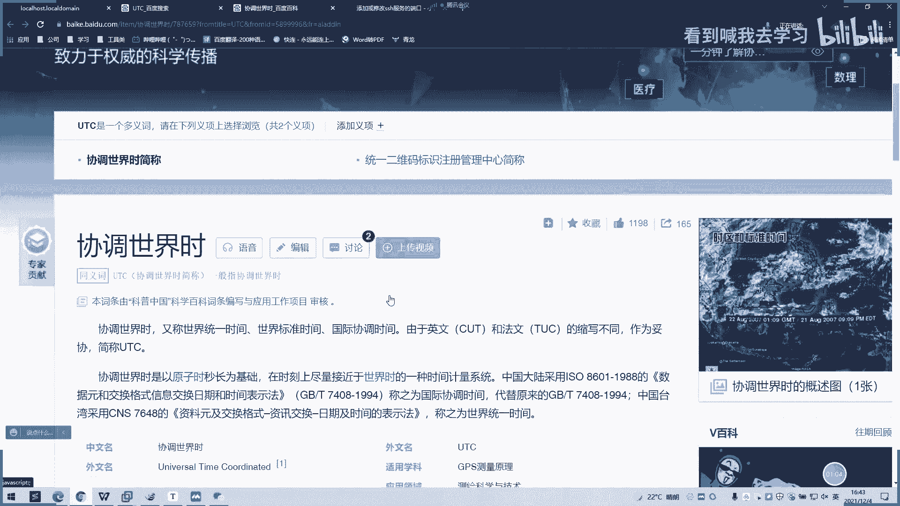

## 概述

协议是运维基础架构中必备的基本工具。学习运维的同学，设置时间、设置时区都是基础操作。时间同步软件主要有两个：NTP和Chrony。

## NTP协议原理

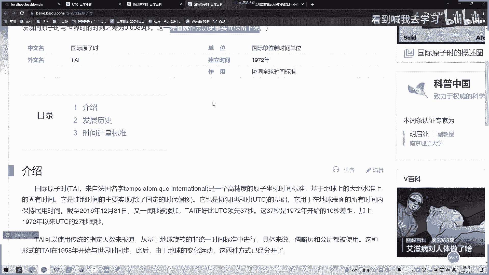

NTP的原理是将系统时钟和世界协调时UTC同步。UTC是一个全球标准时间。我们通过加减时区来设置本地时间，时区根据地球的纬度和经度划分。NTP在局域网内的精度可达到0.1毫秒。

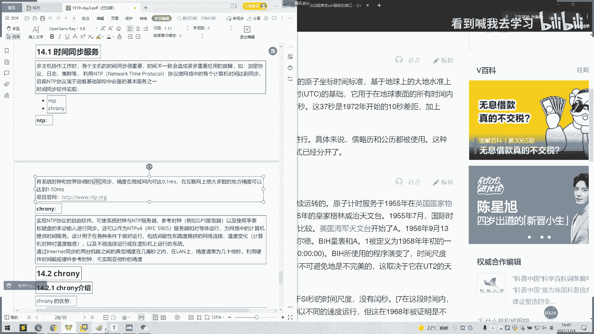

**UTC**：协调世界时，又称为统一时间、世界标准时间、国际协调时间。它是以原子时秒长为基础，在时刻上尽量接近于世界时的一种时间计量系统。中国大陆采用ISO 8601-1988的表示方法。

**国际原子时（TAI）**：通过某种元素的原子能级跃迁来定义时间，具有极高的稳定性。全球有约60个实验室，带有240台自由运转的原子钟提供数据，经处理得出国际原子时。TAI的起点规定为1958年1月1日0时0分0秒。在该瞬时，TAI与天文时相差0.039秒，这个差值作为历史保留下来。

## NTP服务优势与配置

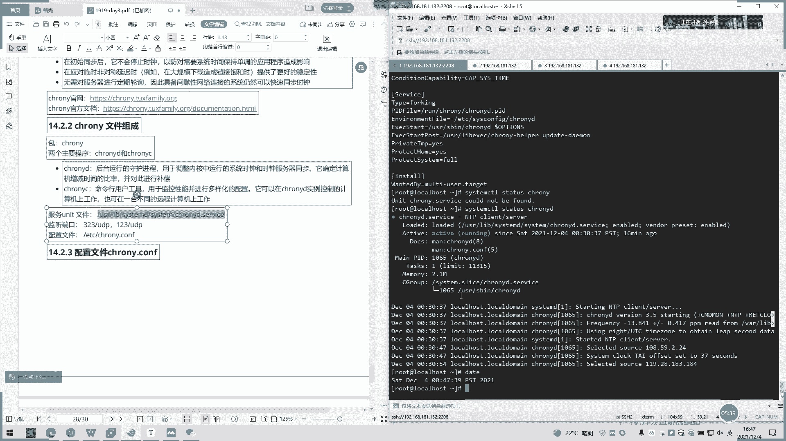

上一节我们介绍了NTP的基本原理，本节中我们来看看NTP服务的具体优势以及如何配置。

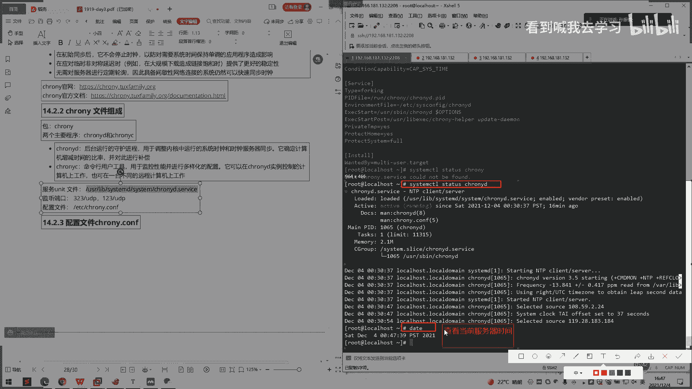

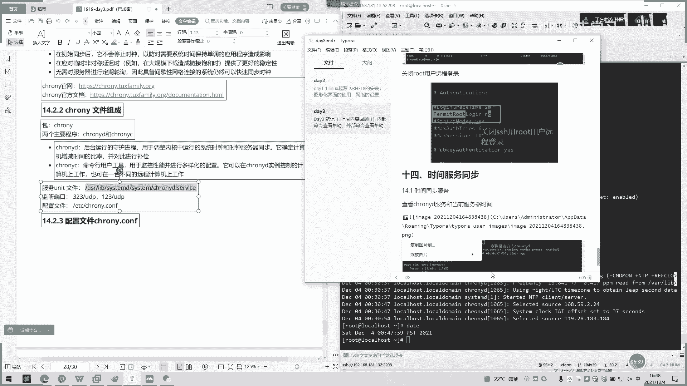

NTP协议的自由软件可使系统时钟与NTP服务器时钟进行同步。其优势包括：
*   同步速度快，仅需数分钟而非数小时，最大程度减少时间和频率误差。
*   对非全天运行的虚拟机非常有用，可自动校对关机期间产生的时间偏差。
*   在初期同步时不会停止时钟，防止对需要保持时间连续性的应用造成影响。
*   具备良好的网络适应性，可在间歇性网络中快速同步。
*   作为后台服务运行，持续保持系统时间的精确度。

### 检查NTP服务状态

首先，我们可以检查系统上NTP或Chrony服务的运行状态。以下是使用`systemctl`命令的示例：
```bash
systemctl status chronyd
```
如果服务是`active (running)`状态，则表示正在运行。

NTP服务监听UDP的123端口。可以使用`ss`或`netstat`命令查看：
```bash
ss -tunlp | grep :123
# 或
netstat -tunlp | grep :123
```

### 配置文件解析

NTP服务的主要配置文件是`/etc/chrony.conf`（对于Chrony）或`/etc/ntp.conf`（对于传统NTPd）。我们以Chrony为例查看其配置：
```bash
cat /etc/chrony.conf
```
配置文件中常见指令包括：
*   `server`：用于指定上游时间服务器。例如：`server 2.rhel.pool.ntp.org iburst`。`iburst`选项可在初始同步时快速发送数据包，加速同步过程。
*   `driftfile`：记录计算出的时钟增减比率，在系统重启间进行补偿。文件路径通常为`/var/lib/chrony/drift`。
*   `rtcsync`：启用此指令，系统时间会每隔11分钟同步到硬件时钟（RTC）。
*   `allow`/`deny`：指定允许或拒绝访问本机NTP服务的网络或主机，用于设置白名单。
*   `cmdallow`：指定允许通过`chronyc`使用控制命令的主机。
*   `bindcmdaddress`：指定监听控制命令的接口。
*   `makestep`：通常用于在时间偏差较大时，通过加快或减慢时钟来逐步纠正。如果时间差过大，纠正过程可能很长，此参数可以调整行为。
*   `local stratum`：当上游服务器不可用时，将本地时间作为标准时间授予其他客户端。

### 使用 chronyc 工具

`chronyc`是Chrony服务的命令行控制工具。以下是常用命令：
*   `chronyc sources -v`：查看所有时间源的状态，显示当前同步信息。
*   `chronyc activity`：检查有多少个NTP源在线。
*   `chronyc tracking`：显示更详细的系统时间同步信息，包括时间差、频率误差等。
*   `chronyc makestep`：手动强制立即步进调整时间（如果配置允许）。

## 时区设置原理与操作

理解了时间同步服务后，我们需要确保系统时区设置正确。时区设置与NTP校时是两个独立但相关的概念。

系统时区的设置原理是通过`/etc/localtime`这个符号链接文件实现的。该文件通常链接到`/usr/share/zoneinfo/`目录下的某个时区文件。

### 查看与修改时区

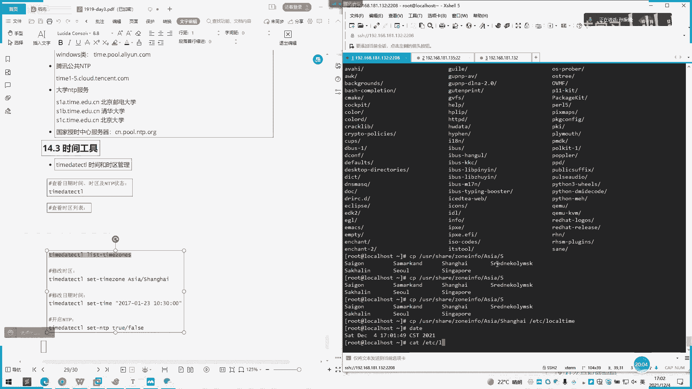

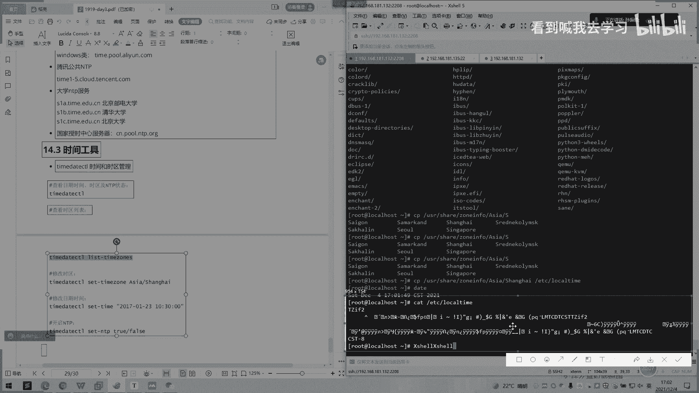

1.  **查看当前时区**：
    ```bash
    timedatectl
    # 或
    ls -l /etc/localtime
    ```

2.  **列出可用时区**：
    ```bash
    timedatectl list-timezones
    # 可以配合grep过滤，例如查找亚洲上海时区
    timedatectl list-timezones | grep Shanghai
    ```

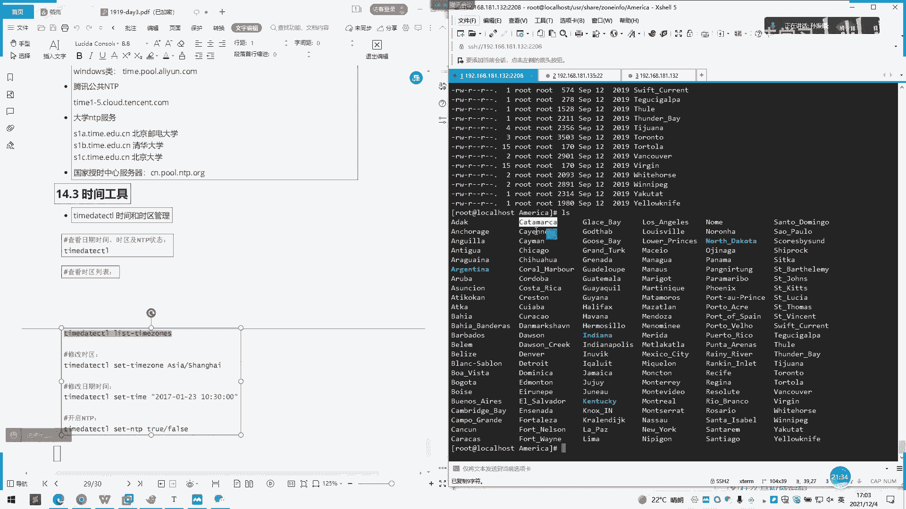

3.  **修改时区（推荐方法）**：
    ```bash
    timedatectl set-timezone Asia/Shanghai
    ```
    此命令会自动处理`/etc/localtime`的链接。

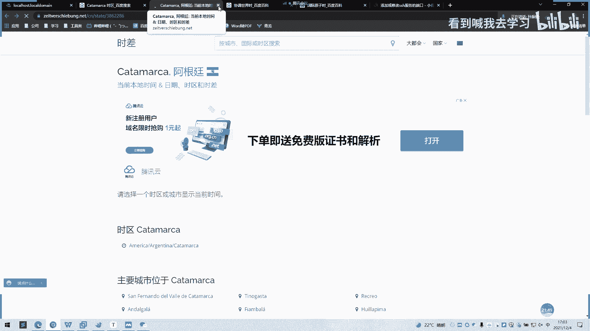

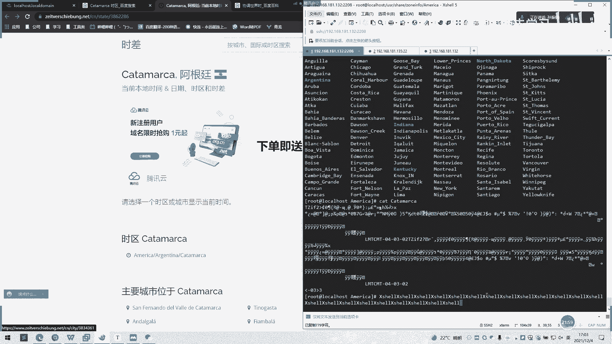

4.  **修改时区（手动方法）**：
    如果`timedatectl`命令无效，可以直接操作符号链接：
    ```bash
    # 备份原文件（可选）
    mv /etc/localtime /etc/localtime.bak
    # 创建新的符号链接，指向目标时区文件
    ln -sf /usr/share/zoneinfo/Asia/Shanghai /etc/localtime
    ```
    图形化界面设置时区，底层也是修改这个链接文件。

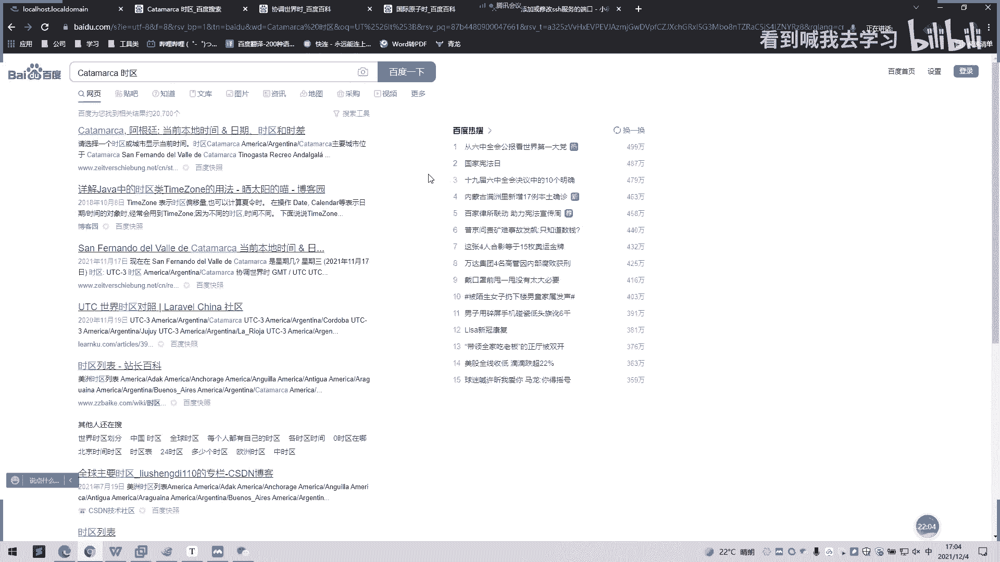

**重要提示**：修改时区只是改变了时间的显示规则（即UTC时间加上多少小时的偏移），系统底层时钟和NTP同步的仍然是UTC时间。时区设置正确后，NTP服务同步的UTC时间才会被正确转换为本地时间显示。

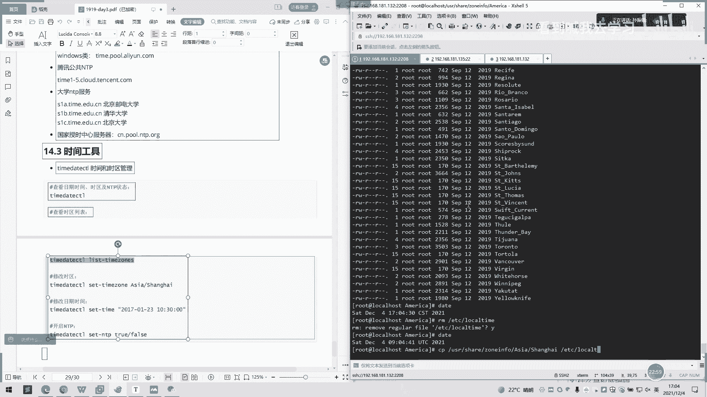

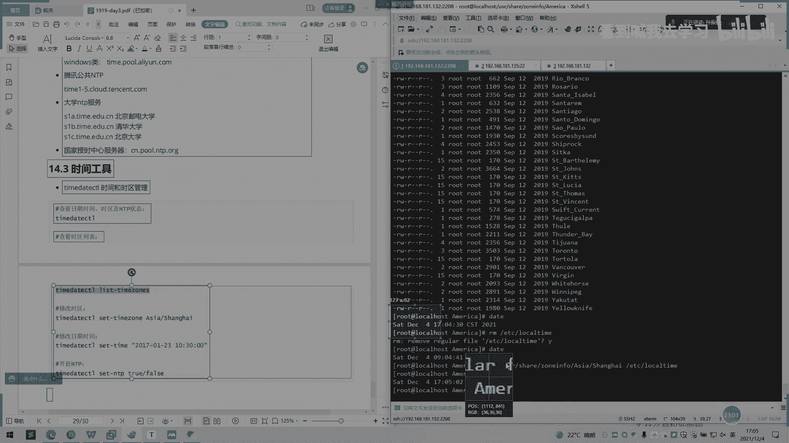

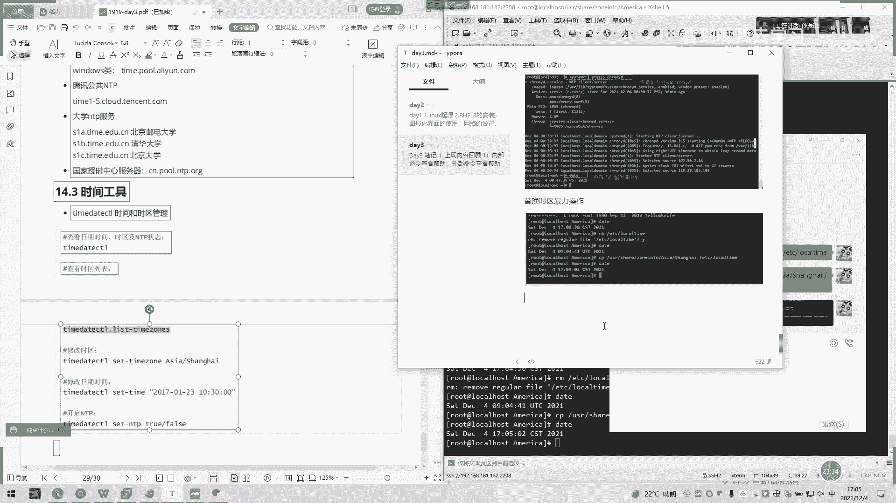

## 公共NTP服务器

在实际配置中，我们可以使用公共的NTP服务器池。例如，RHEL/CentOS系统默认配置的`rhel.pool.ntp.org`就是一个服务器池。你也可以使用中国的公共NTP服务器，如`cn.pool.ntp.org`或`ntp.aliyun.com`。

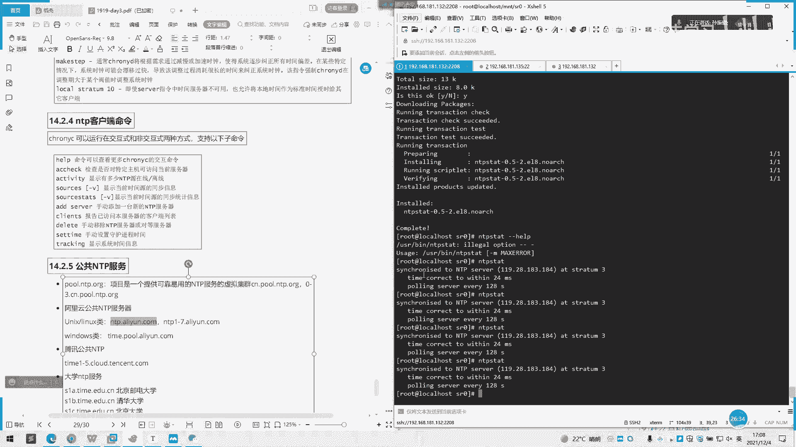

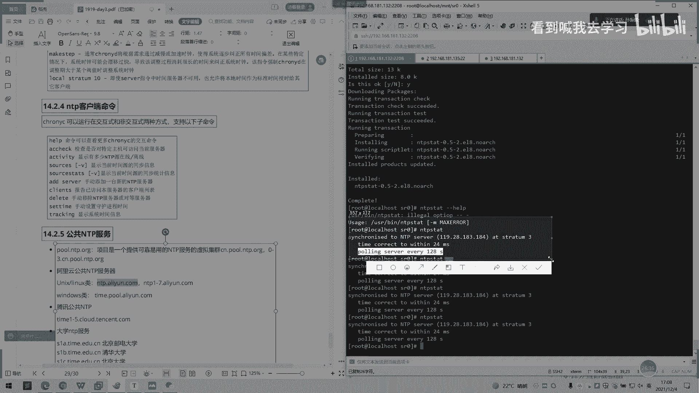

在`/etc/chrony.conf`中修改`server`指令即可指定：
```bash
server ntp.aliyun.com iburst
server cn.pool.ntp.org iburst
```
修改配置后，需要重启服务使配置生效：
```bash
systemctl restart chronyd
```
然后使用`chronyc tracking`或`chronyc sources`查看同步状态。

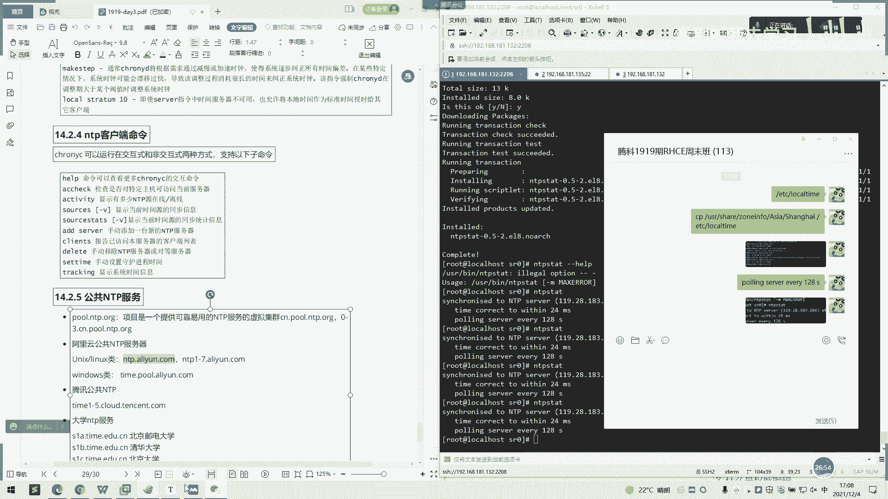

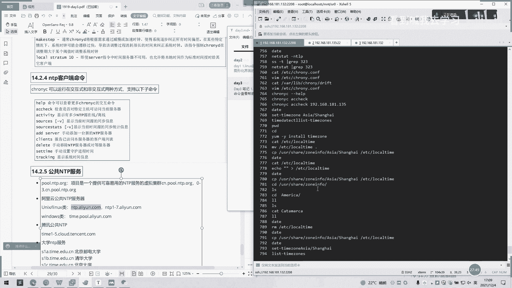

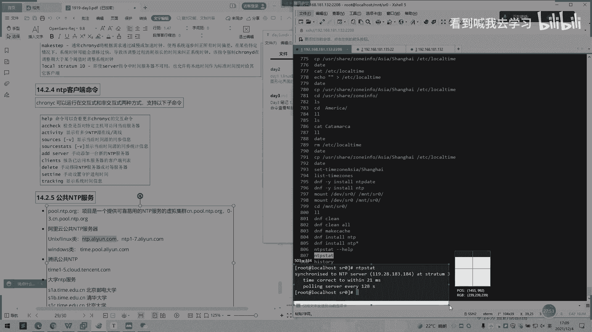

## 总结

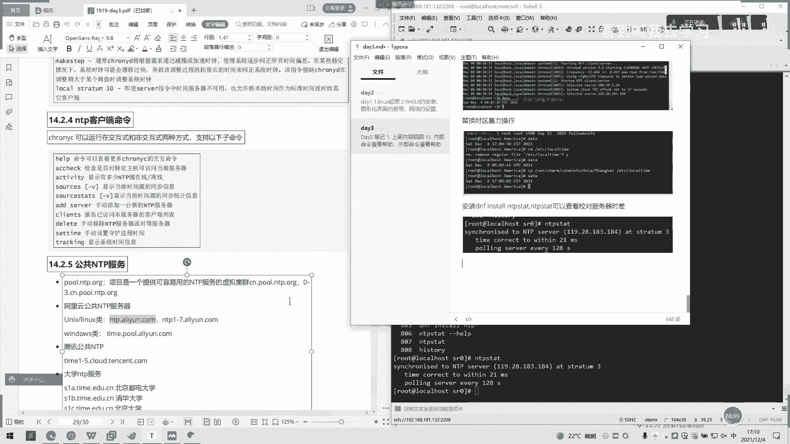

本节课中我们一起学习了Linux系统时间管理的基础知识。
1.  我们了解了**UTC**和**国际原子时（TAI）** 的概念，理解了全球统一时间标准的重要性。
2.  我们深入探讨了**NTP协议**的原理及其服务（如Chrony）在快速、精准同步系统时间方面的优势。
3.  我们学习了如何检查NTP服务状态、解析配置文件（`/etc/chrony.conf`）中的关键指令，以及使用`chronyc`工具进行监控和管理。
4.  我们明确了**时区设置**的原理，知道其通过`/etc/localtime`符号链接实现，并掌握了使用`timedatectl`命令或手动方式修改时区的方法。
5.  最后，我们了解了如何配置系统使用公共NTP服务器池进行时间同步。

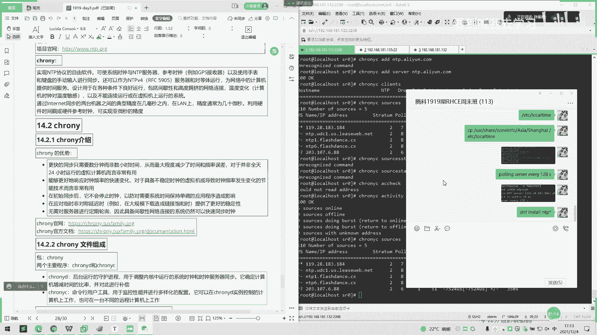

正确配置时间同步和时区，是保障分布式系统日志一致性、证书验证有效性和计划任务准时执行的基础，是每位运维人员必须掌握的技能。