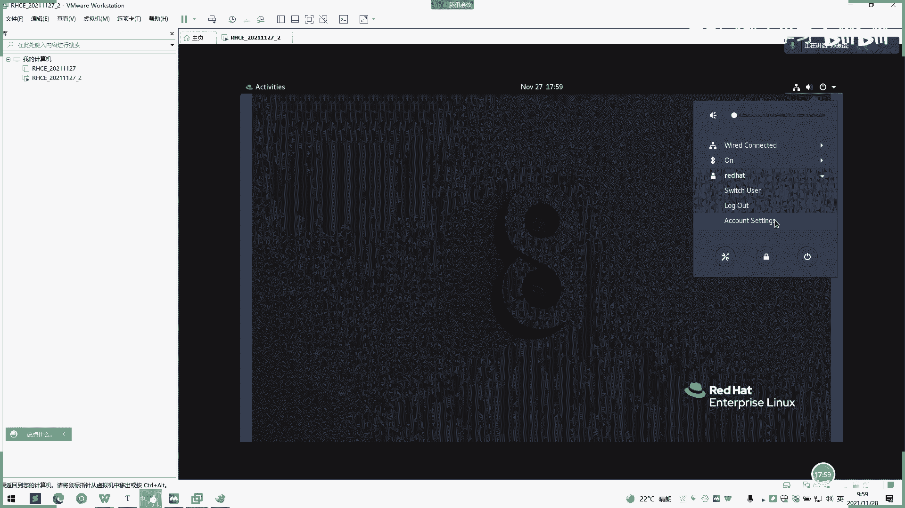
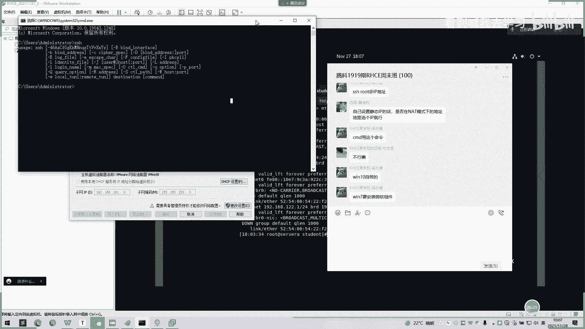

# 2022 01 最新rhce教学视频 - P12：20211128_01 - 看到喊我去学习 - BV1Na411y7SQ

那我们今天正式课程开始了。呃，首先我们来回顾一下昨天的内容啊。我们昨天的话讲了一个linux的一个起源，还有一个re害8的一个安装途径化界面的一个使用。还有一个网络一个设置。

还有我们用插效工具去登录了一个终端一个登录啊。然后在第三讲的话，我们讲了一个用户类型呃，终端的切换，还有一个设计组机名，也是涉及到hose name。呃，命令提示出。然后我先打开我的那个。

I how to wash station。

呃，在访问命令的行里面我们讲了一个内外部命令，还有一个命令别名命令格式，还有一个控制执行多个命令啊，呃，命令行扩展，还有个命令历史，还有一个用table键去补全。我们之前不记得命令。

还有个base快捷键的一个使用啊。呃。命令还有第五点的话，我们就讲了命令行了管理文件，文件，还有文件操作命令。呃，绝对路径跟相对路径一个区别跟比较。还有一个更改的，如何去更改一个目录。

然后去列出当前所在目录。还有我们一个文件的通配服务模式是怎么样的？还有一个查看文件的状态呃，复制粘贴呃，目录和文件，就是CP。用CP命令啊，移动的移动和重命名的话，我们就用MV命令啊，删除目录和文件。

我们用MM命令啊。文件的访问原理也讲了，软硬链接也是。也讲了一下。然后我们回到昨天的文档，可以看一下。这一块是。0害8的一个安装教程使用啊。然后。一直往下然后到我们一个设设置一个从。

设置登录16人一个用户一个登录。然后我们讲了一个先售OS6害8的一个区别。

然后后面是图形化界面的介绍。

中。这里好了。Okay。好，我们先登录这个。

ok 。啊。我们当我们装完主机的之后，我们怎么查看昨天网络配置呢？

还有比较重要一点就是网络配置这一块。昨天就很多人同学翻车。然后今天我们吕顾也重新讲一下网络配置这一块的话，我们一开始在装机的时候呃，是可以进行一个网络配置的。

我们在这里装机的时候，就是说选择完我们一个。待会取一个语言模式之后，我们会切换到一个安装界面的。然后这里。有这里是设置时区的，有三个行列，这一个一个是设置时区，一个是设置原来的一个语言，还有一个键盘的。

然后第二行列的话，我们一个选择自己安装语，安装最小模式啊。或者是带GUI的一个图形界面的一个安装。我们之前现在选的默认是GUI界面的一个安装，然后安装模式这里就有个选了。然后第三行列的话。

就是我们做一个硬盘的一个分区。呃，昨天说了一个硬盘的一个自定义分区和一个自动分区都演示过一遍了。然后的话这一块这就是网络设置啊。在在这里网络是。呃，这里。在磁盘好。

这个往我们继续看设置磁盘空间是在这里设。我们当我们点进这这里磁盘设置时候，我们会跳换一个界面，然后这里出来是自定义一个设置。如果这一块是自动设置。如果小新手或者小白不太懂配置的话，呃。

说后面比较繁琐的话，你可以点一个自动分配分区的话，它会自己进入分配啊。不过下面的操操作就没有了。然后我们呃有是选自定义分区的话，我们可以来到这样一个界面啊，点下一步就可以来到这样一个界面。

那到时候我们点一个加号的时候呢。呃，我们会打开这样的一个提示框，然后让我们去选择一个分区需要多大的一个磁盘空间。然后我们一开始是要选择一个不可分区，然后给他1个1024的MB的一个大小。然后呢。

在我们设置完不妥分区后，我们再设置点击暗号，然后再设置1个1万分区。我们1万分区的呃大小是按照内存，你当前内存的多大的两倍的持续设。我们之前默认的是2G的开机启动。我们所以1万分区我们设置成4G。

然后后面点确定之后，我们自己再加号，然后跟目录留个分区的话是看你自己的磁盘大小。我们这里设置的是50G。因为我之前是给了1个100G的一个分区，但是我先给一半，我先给50G的一个跟目录的一个大小。好。

那我们设置。完之后的话就会有三三列就会显示出来。分别是我们之前设置过的一个跟目录的1个50几个大小，还有一个bot文件的一个大小。然后。右边这一块的话就是我们的一个呃。呃，比如说逻辑卷逻辑卷一个类型啊。

逻辑卷一个它的一个分区的那个格式是什么？有XS或者是说ET。以下题4。然后当我们这里选完之后呢，我们是再点一个左上角一个down一个选项，那我们就可以呃开始。再点一下accept change话。

就我们分区的一个创建就开始了。然后这这一块是网络配置啊，这网网络配置这一块的话，我们是在。我们是在设。右边的这里设置一个网络。点点这里的网络之后，我们就可以跳到。这样的一个界面呢。然后这样一个界面呢。

一开始这里是关掉的，一开始这些关掉，我们可以选呃confi。就是说我们先配置网络后开启啊。这里的话上面截图的话就是选让他DHCP就是说不配置网络，默认是DHCP的模式去开启。

那后面他自己去呃分配呃IP的话。就会自己去分配IP股用我们自己手动去设。那我们昨天说的是我们可以手动去点这里去自己自动呃去设置这个IP。然后这里是时区啊。这一块的截图的持续是在。是在这里设置的时区啊。

我们当点这个设置时序的一个功能之后，我们就可以看。看到这里啊，它会自动跳转到一个呃时区设置。面板就在这里，然后我们这里是选一个国家的一个区，这里就是选一个城市的那我们只也可以去图形化操作。

就点地图上面某一个点，它会看到当前的国家是什么。就是你地图上面当前的国家是什么。那我们之前直接点这个呃，我们中国的版图就是上海这里的话，它这会显示上海。然后这一块就是指定安装包了，就是。哦。

就是安在选择安装模式，这里指定去指定你要安装的一些东西。然后我们这里第一个是我们默认选的带有呃GY图像，一个图形化界面一个操作。后期的话我们可以自己去选择一个最小安装模式，这种没有图形化界面的。

就说只有命令行的一个模式。然后右边的话就是呃选择的话就其他工工具。就说我们可以呃附带增加或自己自定义一些工具是否安装啊，他这里是有选择，比如说做FTP或者说这些妙，就说发邮件的这样一个工具是否要安装。

然后当我们选择完这样一个东西之后，我们就直接。呃，可以安装模式安装了。然后点完这里开始安装之后，我们就可以进入进入到这样一个设置root密码以及创建普通用户的一个权限。

那我们这里呃很多同学可能一开始需要设置root密码，要点下。入手密码，然后设置。呃，密码之后我们可以再创建一个普通用户呃，入口密码我们一开始默认呃，我们一开始可以自己呃根据自己自己平时的话习惯去设置啊。

那我我这边设置是rerehead。这是密码设置为厉害。然后U新创建新的用户啊，我们就创建一个学生用户啊，就student用以student去命名去创建一个学生用户啊。呃，对，这里就是设置进来设置。呃。

这不密码的一个界面呢，设置完之后，我们这里点两次的一个档的话，它就会退退出来。这里。然后到我们可以再去设置一个普通用户的。呃，账号信息就是说你看我们一个user name就是student嘛。

你要pass或。他是否也可以设置成stud很厉害啊。这里上面数量也跟着一起写still可以。好，当我们设置完之后，然后就等待一直安装，等到进度条当变成一个compreee的一个模式，就相当于完成了。

我们直接就可可以重启呃重启虚拟机。然后在重启清名之后，它会提示一个license，就是说同意就说签个需要同一个协议啊，我们这里直接点进来，然后点一个exc下接受的协议。

然后我就可以直接点在点右右下角的这个。继续重启就可以了。然后我们后面就会直接到打一个这样的一个图形化一个界面。

然后在主形化界面这里的话，简单可以再重新介绍一下。平化界面的话，这里有呃。

这个大一点。图形化界面的话，这里就有几个。呃，几个地方啊，这一个是显示时间的，然后右边这一块就显示一些呃收藏栏的。

收藏兰，首先这一个是一个firework，就是我狐一个。

呃，火锅的一个那个浏览器啊，我们可以在这里直接点浏览器，直接就进行网页打开就可以了。

有点慢，然后这一个是fire尔，只是说我们这个。

一个文件夹。如果点进来，我们可以看到一些呃像windows一样的这样文文文件夹的功能啊，就可以去进行一个日常操作。然后这里的话。这里就是一个s的，它是专门管理的。最最主要的是终端这一块啊。

我们可以通过这个去他们那打开终端，然后的话。这里的话终端这里的话，首先第一个会显示你当前的中最中心上上面显示当前的一个登录用户，还有一个登录的一个hose name。

然后我们现在登录是用stud等用户去登录。然后我们的一个ho name是。是是我A呀。有很多同学说在编辑网卡的时候，他首先是我没有权限编辑的话，首先看一下这里这里是不是呃普通用户状态下的编辑啊。

如果没有编辑，就要提前或者是切换到shifter模式啊。速中务的模式。OK然后我们。

然后我们最后一点，这里的话就是打开当前的一个呃所安装的。安装的东工具或者说应用都在这里面可以显示。这是。一个当前所有所有的东西，然后这里还有一个这里有这个有个分组啊。这也是个分组啊。然后右边右上角的话。

我们。怎么。右上角的话我们就有一个呃声音，一个设置。还有我们一个网卡，一个设置是关掉，这里是关掉。啊，或者是concon连接就启动状态。还有一个第二个right set settings。

就是一个网卡的设置。

好，我们来到网卡设置的话，我们可以看到当前一个界面这个网卡设置，我们点。底下这个。然后呢可以看到我们当前的一个速率是多少，然后我们的1个IP是多少呃，这个是IPP就可以不用管它。然后我们这个路由到哪里。

这是网关一个地址，然后DNS是哪里？如果我们想就是说。要重新配置这个地址的话，我们可以在这里点IPV4去配置我们当前一个地址。如果当你比如说重新配置完，你点一个apply的话，它就可以生效了。

然后这两个是默认勾选了，我们就不用管了，这个是。连自动连接，还有一个。上呃是否其他用户也可以使用啊？那我们默认勾选就不用理了。

然后还有。第一个就是用户啊。第三列的话就是一个看一个用户，一个 out一个switch user就好就是退回到锁定界面的。然后我让他进来。还有个灯出的一个插作。

还这样一个用户的一个设置啊。这里的在用户设置的话，可以这里更改一个用户一个信息。呃，或者上传图片。不换头像之类的。这里可以更改密码，这是图形画一个更改密码。

呃，途形化界面的话，简单的就介绍到再重新介绍到这里。

哦。然后我们再看一下网络配置啊。

呃，我们途形话见面完了之后。

我们进行一个网络配置啊。网络配置刚才说可以在界面这里去用呃用界面去更改，也可以说呃也可以说编。

编辑1个ETC下呃，我们的网络文件，也就ETC下面的SSY摇到那个 word spring，然后IF下的一个。冇。你，你干嘛？网网络编辑文件呢。

然后这里我们这直可以直很直观的看到我们当前的1个IP1个状态。然后指网源码还有一个。呃，网关我们昨天就是配了这三个的话。地址之换。呃，就可以了。然后这里的话我们可以设置原来是DHCP的一个模式啊。

我们这里设置一个改为t一个静态模式。比如说静态呃静态静态IP去配置。然后到我们配置完了以后，我们按一下shift冒号，我们就会回到一个命令命令行状态的模式。然后我们保存一下WQ，然后按一下回车。呃。

当然我想我现在。编辑不了，因为我是在stuuddent呃stu用户模式下，就是之前很多同学就会碰到为什么说保存了一个配置文件信息，保存不了一个配置文件信息啊，就是这个原因。

那我们这里可以切换成root状态。我们可以切换这一个root状态。让我们再重新去。编辑一下这个文件。哦。好，就是我们刚进来之后，我们再用shift，然后加一个冒号的一个键。就会退回到一个命令模式。

然后我们按一下WQ。然后就已经保存的成功了。这经是保存成功了，然后我们再用一个。呃，重置网卡的命令就NDMCL然后nection。然后你漏一下。如果不记得命令的同学，可以按table键样去呃。

table果先去让他自己去呃生成了，会会有提示出来的。有完贴补间就会生成这样一个。列表给我去选择，那我在。当我打前面的几个字母，我按一下t键的话，它会自动帮我补全后面的呃这个命令啊。

然后我们再upup一下我们的网卡，网卡如果不知道，可以默认的网卡是。In this。好。那我们来看一下说。我们当前的这个网卡已经配置成功了。当我们就说执行完到这一步的时候，我们就。呃。

再查看一下用IPPIPAADDR可以查看到我们当前网卡。我们看到1个ENS160的话，我们网卡就是被配配成了192168。181。130啊这样1个IP。那到这一步呢，我们一个配置网卡一个功能就结束了。

接下来我们是要验证。验证它是否是通的，然后我们可以。在外部去按B键加啊就可以进到运行模式。然后我们个。打1个CMD。我们听一下。192168点。181。130。

当显示一个来自192168181130的回复的时候，字节32，时间小于ENST2TDR是等于64这样一个刷出来之后是代表是连接成功了。如果我们连接成功的状态下。

可能就是比如说142可能就是不会如果不连接不成功，就是不会跳出来这样的一个信息啊，就直接打印无法访问主机的这样一个情况。这块大家要注意一下。O。增加PCI质量哦。

智联网卡。这一块可以，如果说没有网卡的显示，没有网卡的同学啊，之前在。

昨晚昨天这个文档里面也有补充啊。

昨天这个文档院文有没么补充啊？这个网卡问题的话，如果说你看着是没有网卡的，就是说。我们可以根据呃根据这个I呃根据IP去创建了。那这个IP从哪里去看呢？我们这里。

我们的IP可以从这里去自己去看的。我们在这个编编辑里面点到虚拟网络编辑器。然后他会跳出一个。呃，一个框，然后后面下面会有一些net模式。那我们之前虚米C配的是net模式的一个。

开的是net模式的一个链接啊，我们这里点这虚拟机右键点设置可以看到。

我们在网络适配器这里可以看到一个net模式，用于共享主机IP啊。当我们配了这个模式之后。

就是说我们可以在这里看到我们当前应用模式下面的就是192168181的这个IP啊，这是我本机自己的IP啊。你知道了这IP你才能去配置这个网卡。所以每个每个同学的机子上面的IP是不一样的。你要点一下。

你的看一下你自己IP是多少。呃，可以用插校远程登录啊，也可以用呃CN呃CNDSH也有一个。

么一个们命令啊。有些同学如果没有SH命令的话，可能就是在控制面板那里没有设置。

我们这里可以看一下。如果没。

好，我们再打一开控制面板。

好。我们在程序程序程序这里啊，我们点一下程序这里卸载程序，这里有一个启用或关闭windows功能。然后这里有一些选择，这有添那个用户的，然后。这有条那我们的全部要勾选上。然后我这里已经勾选了。

我点确定后就可以了。

对，历时的话还有一种方式就叫一个抛效。

他校这里有个是I可以可以HH的。

win琪同学确实要安装组件。好，O我们继续讲解。

那网如果没有网卡的话，可以呃设置用这个命令去设置自己的IP啊。这里有个配置IP，然后配置网关和配置DNS都有啊。然后这里的IP就是参照你当前的虚拟网络的IP是多少，你就填进去就可以了。然后这里的话。

这里的话就是1个IP名呃，这个文件名称这里可以不用改，默认就好。大家如果后面。回去练习的话就是改IP就行了，其他可以不用管。Yeah。对，这里的话就是是否连接嘛，你就选择y就好了。是否要连接这台？对。

系。Yeah。嗯，在。装机的这一块，大家看一下还有什么问题吗？没有没问题，我们也继续再来接下来讲回一下，回顾一下。现场同学有什么问题吗？OK那我们继续往下回顾昨天的内容。

然后我们昨天还做了一个讲了一个用户类型啊。我们昨天用户讲了一个普通普通用户跟路头用户啊。录ot用户的话就是一个管理员账号，有一个超级用户，然后几乎可以。几乎可以所有的权限都有啊。如果普通用户的话。

就是权限是有限的，可能就个ETG项目。例子的话就是那个网卡无法编辑啊。就昨天遇到的例子，还有一些很多权限也是没有的，系统权限都基本都是没有的，除非是呃去单独去赋予。还有我们一个终端的一个介绍。呃。

我们当前的终端的一个类型，还有我们。一个。伪终端是怎么去使用啊，怎么去查看我的一个终端一个信息。还有我们终端的一个切换呢。有快捷键的话，就F1是F6啊，图形化界面，一个切换一个终端。

我们就contrlaltF3就可以进呃进去一个命令行模式啊。如果是con说2F2的话，就是退回就会变成一个图形化界面。F2是命呃都是固定的是图形化界面了。

F3至F456789都是一个命令行模式一个界面啊。

然后我们后面还讲了一个交互式的接口。嗯。呃，GUI一个图形化界面，还有一个下程序，也是我们命令行模式啊。然后这里啊。啊，贝思要一个笑的一个简介。哦。呃，后面我们设置了一个主机名。

谁设置了自己一个水机名是什么？还有一个命令提示服，我们查看命令的提示服是如果是井号的话，是root用户一个权限。如果说普通用户的话，可能就。呃，普通用户呢就是一个do了福一个权限的。

这是一个区别一个是管理员或者是用户的一个呃。一个情况。我们还修改了提示提示服的一个范例啊。提示符类型也说明一下。然后这种鞋反斜杠U就是当前用户啊，反斜杠H就是主机名的简称。

如果反斜杠大W就是当前工作目录的机名啊，然后杠T的话就是24小时和12小时不一样。然后我们还讲了一个访问命令行的一个。过程啊，我们访问那一行的话。介绍了一个可执行的两种类。类命令啊，一种是。

gues上下面的一个是一个是外部命令，也就动种户啊，YN的这些都是外部命令。然后我们还讲了一个区别，指定的命命令或外部命令。还有个命令别名啊，命令别名我们可以用at list。at丽斯啊。定义名。

我们可以定义一个命令去复制啊。这个是比如说这里就是可以进行一个。

是啊。比如说我个设置一个atice啊。嗯。很类似。Yeah had。是等你。啊。他呢。想看内存的那我们当我们输入离开的时候，就会打印内存信息出来，就会调用我们个fre杠H的一个命令啊。

这是一个命令自定义啊。当然这只能在你当前的一个终端呃登录的终端，下面可以呃可以临时设置啊，这里是临时设置的方法，就是说你当你失当你关闭这个终端再重新开启之后，这命令是失效。

你打离开命令是看不哎是是没有的。哦，我刚刚已经发了。啊，是不是没有的。

只能在当前的终端去使用。还有一个撤销别名啊。

四小品名我们可以选。哎，还是刚刚那个例子。我们可以选。撤销这个当前的一个。命定别名了这个。这个命令我就不想用到它，那我就按list。我没。用例子一看就行。那旅派的话就这个命令就原名就没有了。

对已支加掉了。那list杠A的话就是取消所有签名啊。然后这里这个原理是这样子的，在命令。呃，在命令中别名啊，只对当前效永有效有效，如果永久有效定立在文件配置。呃，为什么只为什么只能在当前用户啊？

或者所有用户都可以去设置啊。

这里就是环境变量的一个设置，当前用的一个环境变量的一个设置。我是对所有用户的话。我们直接就BI吧。Yeah。哦。对啊，我在这里设置在这个环境变量文件里面设置。这个添加一个这个list free。

那我们把是刘汉，然后改成刘汉。看现他会不会这样。好。啊，ss一下。再离开。那么的话这已经生效了。造纸啊就是让当。然减去成效。这我也是说一下。我方面。Okay。那么我们在。关掉，然后再进行的话就会。

这样我们再重新进入终端，还是会显示这样一个命令。

那么。这下面的1个ETC。

旅游含接变也是一样的，这是对所有用户一样的这个付款是。呃。不管是在哪里的话，也是在后面这里添加。这里话这。直接就list利就可以了。直接在后面这里添加，不要在这个判断前添加，不要在FI添加。

要在最后一行添加。然后这里就没有不太演色。

Okay。哦，后面我们还讲到了一个。啊，命令的格式。然后我们说了一个现在一个短选项，一个长选项呀。呃，还有1个BSD的风格，我们经常用到可能就是短曲战跟长景这。

完选项的意思就是可能1个杠C或者1个杠I杠H就可以了。我们用frreee去。说个例子。我们打这个福利刚刚跳的时候，我们就可以看到一个。呃，一个长选这个短点像一个出来，一个杠B。

就是可能就相当一个两个杠杠bas，然后就可以这意思后面的意思是输出当前的字节。然后这里都有。我们的效果都是一样的。Thank you。反应的效果都是一样的。那下面这些可定。下面这些短解项没有的。

长解项可能就有。这是一个例子啊。

然后我们还讲了一个控制执行多个命令。呃，有几个有三个有三个命令，这一个是一个是分号的一个命。当执行第一条命令完成后啊，不管执行成功，执行第二条命令，也就是两个情况，都是两个情况都是执行成功或者是。

为处处的一个状态。不偶型，你可以理解真是一个呃不偶型是。非真的或是是是真的。然后我是。呃，第二种情况只有当第一条执行命令失败之后，才会执行第二条命令。就是说可能是为前面是forse的话，呃。

才会去执行第二条命令。如果说前面执行成功，但是就是处处的一个情况的话，后面的命令就不会再执行了。然后。这个符号也是一样的，只有当第一条成功时候就是为处的时候才会执行。第二条。如果是forse的话。

后面就不会再执行。这里的例子。这里例子之前也挑过了。然后我们还说了一个命令行的一个扩展。运良一个扩展，一个白引号，一个do了，还一个括号。我们还比较了一个三种三者的一个区别。这里。

哦，我们打出三。那信息出来对比一下。

哦。

，我们当打出这个上面例子后，可以看到。首先第一种呃。冒号一个是的话就会打印出一个一口状态下的，就是把当前的一个一口下面的信息都打印出来。这里的变量是会变的。

就是说把当前变量的所包含变量里面的内容打印出来。然后第二种情况的话就是会纸质打印呃，当前的一个字符上一个信息啊，不会打另变量的包含的内容啊。这种书你里面写了什么，就是什么。

然后第三种情况的话就是打印一个结果。呃，就是说他可能先。先打印一个ho name的一个呃变量的一个信息出来，然后再一口把那个ho的变量信息也打印出来，然后最后再一口就会打印出来。所以这后。

这个一口是不会打印出来的，因为它是已经执行了命令，然后这个反。发银号的话只是执行一个同西。

然后这里也有一个单引号反引反向单引号和双引号的。一个总结，打引号的就六亲不认。变量和命令都不识别都当成普通字符串。然后反向单引号就是变量和命令都识别，并且会将反向单引号的内容变成命令后进行执行啊。

然后双引号就可能就不能识别命令，可以识别变量。然后后面我们还讲了一个table键一个补全，然后。

按铁火键是按铁火键的话是。他命令没出到呃，我记的命令时候，只知道几个字符的时候，就说可以按一个kl键，然后系统会帮你自动补全，然后并且会提示你后面可以输入什么一个函数信息。

然后这里的话也是一样的。

我们可以按两两个推口键的话，它就会把当前能。执行的一个参数信息那个列表方式展现出来。

然后路径补全也是一样的。然后我们讲了一个命令行的一个历史啊。我们用history可以去查看我们当前的一个执行一个命令一个历史状态。是我们执行的什么命令，可以在这个hiistory里面可以看到。

我们执行一个hory回车就可以看到一个当前执行过的一个。历史条件。我们杠C就可以清楚啊。我们杠需要在。历史的话就清除掉原来历史啊，是不会有那个历史运营出来。

然后后面下面也是可以让大家可以去去敲看一下。然后调用命令里，然后base快捷键这里我们也讲了一下这些快捷键可以自己去课后去看，呃，可以自己去手动去操作一下。

然后呃平时平时的话就可以加快我们的一个呃工作一个进程，就可以用快捷键比较方便一点。然后这里的话就插效中的一个启用LT的设置，最多可能有一些。组合快捷键经常和其呃和其他软件冲突的话，我们可以在这里设置。

没。哦，我们后面最后也点还讲了一个命令行管理文件。然后文件系统目录的结构我们也陈述了一遍了。这些。呃。等一下我们就这里有个练习啊，大家可以先做一下，然下我们当场去。当堂去把结果打印出来。

就说总结一下昨天的一个呃反馈信息，看一下你们练习情况是如何的。然后等一下课间休息10分钟，我们呃把这个练习的信息，呃，发到微信上面，谁就说做好的都可以发发到微信上面共享出来。OK我们现在先休息一下吧。

我们休息10分钟，我们到呃。10点37后再进行讲解。Yeah。Yeah。이。对。嗯。I。有我我有。别问。근。你。てしい。然，今天没带，看一下。没带兄弟。我看一下你想找那。哦。对。嗯。

对呀。嗯。好。你好。mm。真个方人啲。不。那你们是。Okay。Yeah。上诉人。Yeah。嗯。

