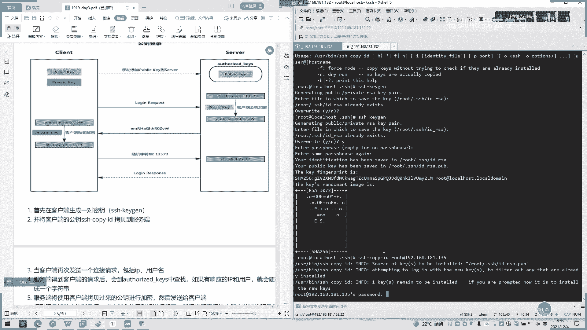

# 2022 01 最新rhce教学视频 - P13：day3-4 - 看到喊我去学习 - BV1Na411y7SQ

Yeah。好的。好，我们现在打开呃一个文件。我们可以看到一个格式说明，首先在有几个部分，然后我们先讲一个uni的部分，uni部分将际上是以井号开头的行，后面的内容会被认为是注释啊。就说这种都是注数啊。

这蓝色的都是注宿。然后我们这有个相关部是ESO处都是开启啊，就说开启服务一般里面要要么是yes。要么就是触网这里。yes or true。有是零或 no or of or false都是关闭。

然后这里有果是foralse oroff的是关闭。So unit。相关的这些概念啊，相关。时间单位的默认是秒，所以要用毫秒分钟等呃呃去显示它。嗯，默认是默认是秒得一秒，你你不用打，后面打个S就可以。

你要如果说你要呃用毫秒的NS要打个S或分钟要，因后面要打，如果不打的话默认4秒。然后我们一个。呃，所有uni fire通时文件呢由三部分组成的一个呃uni定义与uni类型无关的通用选项。

还有用于提供uni的描述信息。还有一个行为及依赖的关系啊。哦，这里的话我们这里。这里它也有一些注释啊，大家可以看。这些绿色设备。然后在什么之前。Nose。嗯，这边他说不要。不要启动这些。然后我们这里。

un你大的一个常用的选项说一下呃，descript这个意思就是描述信息嘛，跟英呃英文名呃意思有点一样的。要after呢就是定义一个启动次序。After so after。

after这是个定义一个启动顺序。比如我们呃有多个其哎服务需要启动需要，然后我们这里就直接就写上去就可以了。比如说我先启动一个user，然后这个什么K，我想启动，后面再跟就行了。要写不下，如果写不下的。

话哎可以第二行写啊，这也可以换哎。按多个写这up和写多个了。啊。然后还有个require，然后依赖到其他uni，然后它是一个强压，被依赖到uni无瓦机活时。当起来有你也无法激活。哦，这个的话就说。

他这如果前面那些不激活话，他这里也是不生不生效的。有。这也是一个。依赖到其他unix弱这是属于弱依赖。有。conforence是定义一个uni时间的冲突关系。然后我们。看见死我。色比较重要一点。

然后type，然后他就定义一个。呃，star及相关的一个功能X啊。E个一 star， E star。有个有几个关键是新火新火看一下。金宝这里没有。经过我搜一下文档了，默认着这个单子确。啊，指令应该启动。

启动后常注于内存中，果是focus。fking由呃star启动的时候程序通过。呃，这个是pen我哎，这个单词也不太会，然后pend我延伸出其他的指巾。其实你作为这个demo。

的主要服务原生的副程序在启动结束后要终止，这也比较啰嗦。啊，这个。欢硕有辛火类似。不过这个程序在工作完之后，B就结束，不会长驻在内存中。啊，就直接看一下。嗯没有。那我们。这边只是关心一个呃。

关心一个其他，我们从哪里去调用一个脚本，然后。Type。type这它是这个ID。I迪奥1。要然后他的这这的意思是必须要执行所有工作的顺序顺利完之后才会执行。这类似于开机到最后才执行的即可服务。

只有其他服务没问题下才会执行。然后这里有个有环境变量配置。那配置这里大大意思就是总是重新还总是重新启动吗？这里写了个OS。然后这里有个呃miss大西。即re star意思。这设置为0。

他这也没有于是大S一期的意思是呃，如果没有错的话就。如果有错的话，就不会重启他。如果比如一的话，就一直重启它。然后他这里还有个。PRE呀。或者是PIEZR证没。GTY谢谢。确实际可以不要了。

都是可以是默认的。我们只是关心就这两这几个就可以。正也勿知道啊。这有个sstore了指明停止了un你要运行的命令或脚本啊，re当设置re一时之。啊，这当是代码服务议外终止后，再次启动服务。

一就是这里always跟一是一样一样的意思。然后这。为TMP啊私有了什么鬼设置为液子石灰生存在呃这项。体验PE是不要下面的目录，最后它会默认生成这样一个目录。会去存放他的一个进程信息这样的。啊。

历史是别人名吗？哦，可以使用。啊，利似。原明的5。就说除了我让HDEP那里的话，我可以还是再用这个S别名再设这个别名。HDEPR，我也可以直接用这个sstem。

CT2去调到H打个starSP号都可以使用。然后比如说我们新建或呃，比如我们修改了这里面的一个呃启动的一个ser之后啊，搜我文件之后，我们要一个。呃，更新就参保里的，你们要更新一下，否则话程序是堵不到。

他得给你修改一个东西的。我们一定要去修改这样一个。修改完之后一定要去执行这个命令，否则你去玩东西执行是不生效。然后再有个sstem管理运行级别的一个。东西只能讲，要top相当于你还这个之前的。你来吧。

这也不用管他。好，自己看一下。调个。这。这都是介绍他一些系统里面的一些东西。也是serv尾系统里面的这些serv尾。诶。windows启动前呢，启动的时候，各种的所有的启动。各种模块启动。

然后这有个依赖，想看依赖。然后这些。模块所包含需要启动这些服务，嗯，需要依赖哪些服务启动全部都在这里。就一个。1个67种就其中上百桶一个收了。然后这有个进用默认的他。Okayさ。你。切换的字符矛盾。

Its mut。这大家了解一下就好。这里。然后我们说一下那个配置和保护SH。啊。Okay。CH的话，我们一般都是通过一个远程安呃，它又叫安全的远程登录，实现加密通讯代替传统的挑量协议。

然后的话就是我们1个SH协议，然后具体的软件。呃，实间就会有open SHSH协议的开源实现。你看先成默认安装呢。然后还有个做另1个HH企业开研项目时间，这个好像已经。一消失。

好像几百年没进人用过的东西。然后他会有个SH协议版本。V一的话是基于呃CRC杠32做的一个mark。不安全。然后他后面在在VR上面又做了一个双方主机协议选择安全的mark。至于DH算法做密钥交换。

基于OSA或DSK之行身份认证。这里的话直接可以看这里是。你这有一个。你有没有。哎，这里不介意。我们先讲下面。啊，公钥交换的原理。高要交换原你首先我们看一下这个图放大一下。

首先他会一个客户端发起发起自己的一个呃请求，然后服务端会返回一个自己的公钥以及一个绘画ID。首先这里要发几个请求，然后他会告知你哎，我返回来一个T跟一个会话D给你，然后。第三个呢，他会生成一个密钥队啊。

就客户端生成一个密钥。对，客户端用自己的公钥或公钥一或会画ID计算出一个什么值，然后他会。在服务端内公钥加密，然后客户端发送加密后的值啊传到服务端。服务端用私钥私密解密。服务端有加有公钥跟私钥。

然后他会用自己的一个私钥去解密，得到一个这样的一个值的一个真实的一个值。然后服务端的。呃，用解密后的这样一个值呃去研究绘画，计算出客户端一个公钥。这一步的服务端得到的是。呃，客户单的公钥。

最终双方会有只有三个密钥，分别是自己的一对公司钥，以及对方一个公公钥之后呢，所有通讯都会被加密。啊，这是一个S于瑜加预先，我每次敲回车，他会发送呃这样的一一些请求过去。然后这有个加密，大家可以看一下。

啊，密文都是通过。呃，加密解密这样的一个传输方方式去呃连接绘画的。嗯。然后这有个open SH服务，open HH服务是SH协议的免费开源实现，一般在各种认识版本默认安装。

我们现在这个也是open HH。然后open相关语件方式这些。然后我们再有个服务器。索且UCSBSH然后一个uni。啊，un文件1个SH server。你好啊，客户呢命令使用是这样子，所以要命令使用。

呃，SH是客户端命令引起实现远程系统经验的加密的安全访问。当用户远程连接SH服务时候，会复制SH服务器的ETCHH这个呃loc点PUB的文件中你就可以看这里。好，这有个号。啊，PUB。

这些这些都是我看一下里面是什么来。哦，我们这是里面这一上加密的东西啊。这是我们的公钥，这是这台集子的公钥。然后他会批。嗯。传到客户机，然后客户机1个SH no。那我们看一下整个。没。请个。要申请承担。

这个东西没有东西连接，所以它是。我在自己没有动没有人去连他，所以说是没有的。那另外一个虚米机器列。

너무 딱开。

我度。这是我另外一个水米机。然后哎SH取一下，到我刚刚那台。Okay。

人进来了。我们看一下这里有没有一个。那没有。

你有冇。是我们刚这里连连过去之后，我们就有一个。192168181。132的这样一个文件。

哦，行。

然后我们连过的一个呃服务器都会在这个no呃下划线一个hose的一个文件中显示出来。他，目录在这当前你当前是什么用户，说当前登录什么用户的话，呃，他就在这里显示出来。

我刚刚用root登录的话，就是root下面。

哦。然后他这己还有个长线的命令，是这些SH一般。如果是你带，如果你是你不带。呃，不带用户的话，直接就输入IP。嗯，看这个是道。

这个是。

135啊，我这是135号，我连来。你连一下他135。是不是首先他要先确认一下。是不是我要连他，我就选输一个yes。然后他有个警告出来。你是否要去呃研发这个，然后这里有个root。

这里的root就是我当前登录的用户啊，我。果有用离看用户去登的话的话，我用离害再去SH，这样的话真的是H啊。那就是136。

那就是一个旅害的一个用户。区别是这样子。

哦，那我再登一下。没有，因为我没有这个用的。然后我这边HH有些。如果是。用腰部啊。其他用户那就是这样子。路呃root加一个艾也在我们后面接一个。IP嗯。或者我们一个。录子。加个端口号。

有这单口号我们有变的话是。口号，因为我们SH蛋糕是默认会会改嘛，在生产会改，怎么会面。呃，我单号你就属于抗P抗P，然后加个单口号就可以。

如果是要呃输入密码的话，我们下。密码就是他。You a horse。放屁，然要自己。也可以加个。嗯。下一个这样子。诶じ不。对，这样子。嗯，我这里啊。首先要切呃切我一个root模式啊。端口号的修改。

你等一下。我们直接用UIM。呃，先先截释到BECSH。我们有个SH是有两个SH还有comp还SH第comp我们先看一下SDcomp是怎么样。哦。它是一个包包含的文件套。那我们再看一下案全实际。

我们坐一下啊啊。是不是这有个窗口。那会我注册掉，商掉delay一下。把这就是改了，我改成208。我们保存一下。然后我们再重启一下这个HHD。Yes。기 예。Exist。大一架。你仔接机啊。等我上。啊。

有发错，我们看一下发错是啥？你个边炮。换连接啊。

那我们。来到这里干吗？没有，我们就改1个SH第一个配置文件就行了。

。嗯。是窗口换一个。换一个，我们再联下一个。你瞓声啦。听十度几我价。为什么他不给我开？哪位同学知道为什么他不给我改？

他说我这里没有权限。外网映射远程的话，是不正在黄网前面是开对方的方可以的吧。啊，是的。如果你外网映射远程的话，你外网对外的那个呃。如果你经过交换机的话，如果那个交换机用其他端口去填呃。

去连到这个2号端口也是可以的。这就坑爹。Yes。ok。

如改不了，我们再下一步跳过吧。等一下们回来再看一下，为什么改不了。然后他这里有个SH有个常见的命令。看P就是破，抗P是指定。你这个用上。放闭指类连接到云IP啊。然后杠V是调试杠C是压缩方式。

什么区别那我们看一下。我我直接听。135。亚周通做的比快一点，赶紧不行。系来。嗯。他对里说。嗯。会按这个。会网络变快一点啊，大概是这个意思。他实际。已经差不多这还为什么支持他11的这些。

啊杠F杠F是指定。嗯。还指定私钥这个实现基于有你你们不是HH不是通过呃pas这个密码去认证的话，是嗯就是生产就基于那个私钥去认证的话，就能把私钥上传上去，然后去指定你的路径，只要路径可可以了。所以。

只要一般就是。吃药没睡吃药的话一般就是。你之些。呃，RSK我看一下。Yeah。吃药的话一般都是上样子一个类型。要很长的一个字符串，也要有个。open SH啊这私有啊。

私钥然后K是公钥公钥的话就是一般以PU点PUB结尾的。这见。对。S1linux的要关了才行。然后我们看一下远程的执行命令啊，远程执行命令。我们不登录进去，我们支是HH通过获取然后直接看看目录。135。

No I。啊，我们看到的这的是135这台服务器上面的这个目录。可以随便看。嗯。这也没有。然后这有个SH登录验证方式，这有个说呃，基于用户的口令的验证。唔其分音。客户端发起SH请求啊。

服务就会把自己的公钥发给用户。用户比说我们刚刚那个no。那下划器后时那里话就会记录一个公钥的一个信息啊，然后服务器把公钥发给用户之后，用户根据自己的服务器来发送公钥对应的密密码进行加密。

加密的信息传入给服务器。服务器用自己的私钥解密。如果密码正确，只有用户登录成功。大概原理是这些。然后这有讲，首先会在客户端生成一对密钥，并。在将客户端的公钥的SH copy拷到卖页。拷贝到啊。

这种就是免密的吧。那这一块密钥登录方式是免密了吗？哦，我们看一下。我们用这个去登长。生成我们的同样跟密钥。不能要我。1省1要7车院。生成密钥封药之后，我们把自己的密钥去传，我们用SH。

topID然后这里可以指定用户啊。时间长也有我们路的要求。192168点181。13。好，大家我输入一个。

都密码 o。

这已经。完成了一个免密操作，也就是我们这这里所说1234567的一个服务。呃一个操作。然后当客户端发送一个链接，包括IP和用户和服务端得到客户端请求后。不在。auto key中查找有响应IP啊。

我们看一下那个15的，看一下。然后我们这里SH19218减181。13。啊，我们现免疫运动就不用密码，我们看一下这里面的。啊，他是不是有一个。这样的au头。B自的一个T的一个值一个文件。

我们看一下这个文件是有没有什么。数是把。我们各132的1个公钥传进来了。嗯，他着理由说。服务端将使用的客户拷贝过来通要进行加密，也要发送给客户端得到的服务。当发来消之后，客户端会使用私钥进行解密。

然后将解密后的字母串发送给服务端。也是我们这个刚的132。服务单1服务端接收到客户单发自动字节字符串后，根据之前字付串进行对比，我一致就允许免密登录。就我这个啊。嗯我这这里的公钥不变了。

就是我132的公号如果是不变的话，他通过132登录我到我1个135的这台来，然后我135去验证他。哎，你给我留个这个。你自己的公钥跟我之前登录呃，登记你的公钥是不是一致的哦，一致的。好。

对比这个文件里面查找一查找是有的OK那我就允许你这个免密登录。这有大概意思这个意思。要实现基于密钥方式的登录。就这里的话他会指定，比如说你的密码呃，加带密码。

然后指定把你的公密钥匙放在哪里的那我刚刚只是。我刚刚直接执行的话嗯。那直接执行这个命令的话，它是默认是在这呃当前目录哎当前用户下面呃点SH，然后会自己生成回车就行了，自直回车按Y。回车。

然后他这也是回车就可以了，这块不用给他，然后他会。出现一个加密。看，然后是从设是要口令是。可听上。好，我有没有新的了。哎，那神奇，那我看一下我还能不能登。所有人到吗？因为我刚才已经重设过我的一个空药了。

我的功钥不再是不再是这上面这个了。我再传那我再传一遍空压过去。哦。啊，已经传了，我们看一下这里。是不是多了多了一行？那我先在看一下能不能能。啊，我们家是可以也可以登进来了，是吧？

那这是一个免密登录的一个操作。然后我们看一下SH服务器的配置了。SH服务器这里的配置在在这里就是说ET下面刚刚就是我们刚刚打开的那个。呃，那个位置单口的那个地方GH，然后HHE。Okay。Okay。哦。

这有更改端口先关掉SElinux。刚刚我应该没有关，所以它就修改失败了。你冇可以。我们可以先在先。改一下。哦。看是不是啊？写一下。40。看一下。直转机。要怎么看到端口呢？SS也可以。没有。啊，没有没有。

啊，我们看到一个用户。你们有个当口有方式去看看。说刚好变了。这是个等口上系命令。我呢。侬南带就咋样难看。我这个也发一你。嗯，我们哦我们继续讲。哦，刚刚变的话，那我看一下我这边。能不能打通过去呢？

SHroot我现在135，然后在168181。132。揿表。借借交你吗。没有。看一下。哦好翔是不是没没关了。嗯。真烦的人不然是没有关，我把房全关一下。ok我已经关了。没他说是没有。哎呀。我啊。没有。哎。

看来我们继续看一下他这怎么弄。你要这里有个listen。You think。这一个listen address。呃，这里4个0的意思就是说全所有人的IP是都可以都可以访问的，就是每个IP都可以访问。

如果说你。指定说单独某个IP或者某个段的话，你自己就是自己需要改。就探独途证。这个181点。135。그。或是。132吧。嗯，你先看一下。嗯好。你要大一下。大小一下。啊七点零点零。

咁知知道。先不能死。

这里的话就变成一个。

自己这边的一个压7。

嗯咁解。嗯然呢。这华只能盆定的量我开。然后这里还有个。嗯。允允不允许root用户直接登录，默认不班独不允许root用户远程SH登录。Yeah。你自己看好不好？帮我们搜一下 hermy。们那里。

198他明字不一下。啊，如果说不允许话们要弄看下。然后我们用。要我去登录一下。啊。SH。没他。你打。是你啊。哦。啊关了。唔妈。真系啦。哦，刚刚做了免密，这个。你静啊。嗯。这有个检查所有者权限了。

我们可以看下。Stre。哦，这里。默认是y啊，这也可以不用玩了。我们还有一个设置一个同连接对换最大数默认是10，然后我们的一个key的呃一个key的验证。一个页验默认也是yS，如果取消的话。

就是不不用不能用去验证，还有个空密码连接。还有个pass这些基于基于用户密码连接。你如自己关掉的话，就是不能用呃用户跟密码连接。2是5品。这里是默认是yes，如果自己是no的话，就是不能。呃。

不能用密码去连接，只能用私钥或者或者呃只能用那密钥去连接了这样子。然后这边有个啊下面的是单位设置一些单位。不谈职己单位。默认是零啊，然后这里可以大。最大的是3秒。还有啊有有有时间。Yes。

提高可以提高速度改为no，应该是DS校链校验的一个信息。然后这里话可以弄我们后面都不用管。但未认证连接最大值是10。以下可以限制可登录用户的办法。那我介绍一下。唔知道。啊，lo。优势。

这指如说我只能限制你。不可用户登录或者是说其他的其他用户登录，然后你其他普通用户是不能登录的。鸭嘴。这里就是屏蔽某些用户不能登录啊这个。And D EMI users。这是。你后面就啊。

用户是不能登录的，你看下这什么你又不能登录了，你要只允许上面这些登录，下面这个下面这些用户是不能登录的。然这还有没有用设置任务组的。哪个用户组的？四六完。翻裂都有些翻例。设置SH风险60秒自动注享。

新开个链接才有效。我等一做咩。你这个60秒。嗯，30秒吧。哦，请他个链接。11点25分。Yeah。嗯。我们看一下过30秒钟有。打开俾助手。一个。Okay。你呀你等一会儿吧。So잖。

然后这里有一个解决SH登录缓慢的问题啊。嗯。测试默认把这个引发了ETCSHHHD这都是些参数的配置。U theDNS。它设置为no，然后约。GSS。设置为呃。熄时乐。我到个山说。Yeah。我呢分。

你感觉变快。都差不多感觉。然后启用户禁用root登录的话，就是比较常用是这个QETCS。就是这个。到。BB加密的开头的。嗯。也只是启用啊。呃，如果是不要不要入头的话，就反正改成no就可以了。

这是nono的话就是关闭。

关闭用户的一个root登录。

你要注要注意的是这一点。嗯。

还有一个呃最佳时间这里。建议使用非默认端口禁止使用如。呃，限制可登录用户人我刚刚上面说了一个alowDDNY它有个设置空闲绘画超时时间。还个利用方火墙设置的SH访问。呃。

颈监厅特定的IP就说那刚刚那个IP也可以设置啊，然要基于口令的认证，使用墙密码策略。啊，预算这里就是。生成那个墙密码。跟我们早上说的那个是一样的。一样的效果。Okay。对。嗯对。ECA到CA到。哦。

A不对不对。你行测试。到屎。跟我们早上生成那个是一样的。好，我们休息一下，我们16点30分开始讲一下时间同步啊。

好，先到这里。