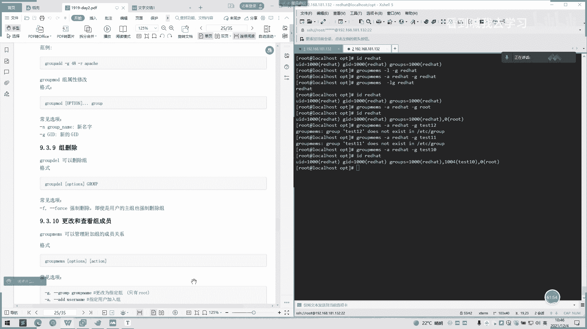

# 2022 01 最新rhce教学视频 - P14：day3-1 - 看到喊我去学习 - BV1Na411y7SQ

那我们按一下大I，我们如果是。好，他已经进入到一个编辑模式，要我们按下井号。我们按两次两边ES7对先退出。还是批量一个注释，批量注是多行的意思。然较比较长或是这一个然后还或或者说增加点什么内容的话。

如果你批量选择。呃，去去汉族。按B就删组嘛，就可以批上去删组。选择你要的某些呃某些字段可以去删除看子。不再进来。如果是。嗯。

主要是这一块。会议进不去，会议进不去的同学呃，是怎么样的呢？你再重新登录一下我。

会议进不去，同学可以重新呃重新重启一下电脑或登录进去，看一下是不是网络问题。

好，我们接着继续讲。然后可视化的话就是相当于可可用于移动结合使用嘛。就是们刚刚所说的一个使用。

然后他可以说去剪头啊，就是说我们刚刚注释啊，或者是突出或者是删除复制变更过滤搜索都可以。啊，如果是。批量替换，比如说我这选择了前面的前面的第第一个，第二个，然后选择。我继续按编辑。没有了。下个月系。

按两边个匙。是批量替换。是吧。如果说我们是过滤或者搜索话还是可以的。都说。电头。

一个大括号。

嗯。这是个大波号，大波是把后面的。

呃，当前当前光标后面的那段全部全选了。

哪个好？平显面是往下的，或者是如果是。

货号呢啊，我们来看一下。

是不好好也是全权往下的。

Yeah。我这个W不了。或者是往前打。我们按一下W它。一直按他这是不是就是一直。直到末尾啊后一直自己跳下去了。这是我们的一个可视化一个使用啊，然后正常呃就是可以多多选择一个多行的一个数据。

或者是一个注释。好，那这下面也说这些。这个批量的一个注释的一个范例。然后买了多文件模式。啊，可做我做我们算多文件模式。比如说关建我们编辑当前一个paW。我们已经写到8字的给我。然后我们按下命令。

命令模式按出一个nice。然后这是显示一个到1个ETC80word下面，那我按再按一个nex。啊，他提示我们这是一个最最后的一个文件。那我们按前一个。所以退回到我们刚刚那个当前的pa错这里。

You是按 last。也是一样的。我这这生产的话很早用到。一般做对比文件的话，不是这样子对比。退出。这这个退出Q2。就所有，如果是三单。呃，安安Q的话。打拿Q的话是可以。

全部退出也是一样的。他这个他说保存说的就是W加一个2，后面都是WQ加2，后面有多个二的意思是执行多个文件这样的。然后有还有一个多窗口模式啊。扩窗口模式我们可以这样子行操作。岳云杠桥。然。

调到ETC的8索。这有个上下呃上下分割。

有是左右的，如果是左右的话，就是大O。左右看的话就到。好。左右看啊，这是那哦。嗯。好。如果说我们啊移动光标就说去编辑呃呃多个文件话我们可以按这ctrl W。就W再按一下方向键左边。

比如我现在是哎目标在右边。然后我按下ctrorlW，然后我按一下。左边往往左的这方向就跳到左边去了，往右就跳到右边去。下面他也有说呃，这里。按WctrlW就是水平分啊。杭卓WS。这多了哎多了一个出来。

就是说当前文件下面又新增了一个窗口这样子。加油按住ctrl语音。它是往左边弹，又是同样一个文件。你说Q。I so you。取消相邻的。有。取消就是取消的意思。如取消所有ctrlW加。

这之前的那个文件打开也是取消。听啊退出来。是一个示块，这是一个演示。这话演是就完成了。然后我们说一下下面文件文本常见处理器。文本常见的处理工具，还有一个文件内容查看命令，文件内容查看命主要有几个。啊。

我们看日据第一个用ca。的话应该大家都知道。他只代啊看用ca。看就是巧看的意思。然后他这里还有一些参数显示行截复制行截数字符串。啊，我给下一件。没。它每行结束的后面都会带一个呃呃美元符号还是多了符号。

像面的意思是说，我们可以查看它是否当前有一个呃。啊，有个空格呃，可以先再举一个例子。嗯。就是说。123，我这有两个空格，然后123我这里没有空格。保存一下。然后再用P命令看一下，加个大一。看家下走啊。

是不是我们可以判断它它是有空格，然后这里是没有空格的。你你这个。呃，没人发号去结尾到了发号去结尾。像他在生产中的话，比如说一个配置文件呃，配置检查配置文件是否前面有空格，或者没有空格的话。

我们使用K杠1。呃，比如或如果配置文件有多个空格，可能会影响那个配置文件的那个参数或者什么之类的呃。嗯。如果有生产站经验相关的同学可以知道这个有点坑啊，就是说你右眼看不到他那个空格是是不是在。

你就可以用K杠一的命令去查看你当前文件而配置文件是否有问题，是不是有多个空格或少个空格这样的一个意思。然后我们还有个显示控制。啊，显示出有方止符话，那没什么用。然后有个写字行号的。

我们也可以多多个多个网家，和按大一这样子写字行号这样子。C空。你讲病后。系再嘅。悲空。哦，这可以给我打印出来。如果说我跳下一段的话，这里的就是有个语言符号。被压缩的一个。压说这个好像。也是连续空行吧。

好像加是连续。Yeah。连续一下。说点解点。句话是这样子。Al nice。Yes。好像在也是。连续。这个压缩还没见到压缩。

可以了吗？现在。远程同学，还有你没进来进不了的吗？嗯。

YeahYeah。好，我们接着讲下一个，讲完ca门。呃，显示行号天要。编套也是跟开始一样的，呃，证命证命令的功能都有些重复了，看自己大家几好。他也是。那就有number，然后这些的。可以试一下。嗯可思。

像他这己不是样子。呃，他是没有，就只有一个要t啊，后面不太参数的。还个套逆向。显示一项的显示文本内容。逆一项显示文本。嗯再一个。123456。我们用开到看 test test3的话。

是正常的123456，然后我们。对对。你想的还怎么样呢？CX。喂，他是哦，他是暗行的，你看一行的话是不行的。那我们P234。可。把3列去立项的。23。

边成654321。

现了1个654321。哪个。REV还有个REV3同一行内容立项。34再来一个。123。ABC。啊要要。是。变成了543212CBA。这是一个。行逆向跟列逆向。

嗯有。还有一个分页查看功能。分页查看。哦。那就看系统日志吧。

哦。哦。有人看的话，我们是一口气打印出来。但是我们后面加个管道，然后加个墨。他就这里就会有显示一个mo。然后我们按按下。按一下一个空格键，它就会一页一页去显示啊。啊，也可以这样子默。直接默文件也可以。

节默文件，然后这里它会默文件的直接默文件，它就显示71%，就打一打开71%啊，后面这。那行，这样子。还个less less也是。

那ice的话我们按也是按空格键，但是的话它打到后面尾的话就不会退出，我们按要按一下Q小Q按一下小Q。按一下小Q。Alless里面我们可以按下哎，比如我们要找我们再按一下斜杠，斜杠它就会提示个斜杠。

比如找到MOV。Okay。没有。RLV这以是匹配大小写的然LV。二三。我们这里也可以按照shift抗拒的话，就是一直可以到结尾这样子。这里也说了一个文本，你要向下搜索。因为我是。我这一个问号。

然后就是向上搜索。然后这有个跳音。一个N个十行。

嗯。多酒。Yeah。

154。没有吧，是不是刚刚有空格或者怎么样的，就导致那个密码复制有有点问题。

好，我们继续来讲呃，显示文本前或后行的内容啊。可用哈去去操作。碳跟炮，然后我们先看一下汗。看是这样子。嗯，看一个。我，默认它是显示前。1234567891011默认显示前十1行。

就是如果单单打hel的ha的话就是。打开一个文件。默认显示前十一行。有可可以加加个。我打票看一下。他子。我在N这一个函数啊，我们这里。那 don嗯。前开头的前一行文件的前第二前两行都打印出来。

两行是不是只显示了前两行。轮还有个抗熙，指定获取一个。啊，前天跟自己套前是。这只是获取前面的这个。这10个字10个字J就杠C。这10个内容空格也会空格也算一个，他也会打打印出来，空格也会打印出来。

还一个呃还有个什么杠直接吃。也是一样的。啊也是。生产来讲的话，就呃一般如果想看前面的话，就直接开个杠加多多少多少行这样子。十行十行或者是导少行，就加烟的话，要加导少行的话。啊，这可能没什么必要。

要看个人喜好，然后一个透透的话用的比较多的话，看日志啊用的比较多。我一般可能呃一般加两个。200F吧，我一般习惯性打这样子。那他就一直显示两排送来。哦或者是一个。嗯。F。

F默认会打前十一行或者十行出来这样子。还有个F跟。F跟大F的区别就可能说大F的话，它是不影响你的日志打印的。如果是小F的话，就是说它可能会影响你的日志打印或者怎么样的。这块可以大家去看上网看一下。

这也有跟踪文件显示的新追加内容，常用日日志监控。还有个大F的话就是跟踪文件名，那文件。呃，删除在新建的时候呃，就可以继续跟踪文件。如果说是小F的话，是删除再新建的话，这无码继续跟踪对。

这个这个剩下还可以演示啊。啊，比如说我现在。我再打个。错。我现在法福看啊，然后我再新建个窗口村。好。他说我。唔安。删了这个盘错。他不是跟踪啊，他现在是跟踪不了。然后我们再。嗯。下小。好说了。

因为有这里没有没有检测，我是。再苦呢。如果是大F。F打印出来。让我们再把那个新pas3。那么再形成的话做。Yeah。系了。是不是？他这己说原后面之前删了，后面把之前的内容跟。还会提示一个。啊。

还s been没有没有找不到这个。而且这里还。后面我新加了嘛，我新写入了，他又有个呃一个foreign new file一个字眼生成。

这是一个。

默认是十行，对你可以自己数一下，反正我看下刚才数的是十一行，我感觉有点奇怪。这是一个F大F跟小F一个区别。呃，比如说这常用于我大F2一般常用于这种日志轮转。比如说呃一个eng1一个日志或者一个系统日志。

它进行一个呃删除。或者说如我是当你的日志被删了之后，就他新建一个当前的一个名跟当前。呃，日志名字一样的，而且问题比下，他继续往系统继续往下面去写这个日志的话，你你用小F是看不到的。

所以你会采去你额脚本里面去采集这个日志的时候，你用小F的话可能就会看不到。所以说呃做个定时话可能看不到。呃，所以说常用大F去做这种采集的话是比较好的。而且它会打印它这个呃当前变化的一个结果。呃。

为什么为什么找不到了，或是新建怎么样的都会打印出来这样子。这是一个大F跟小个区别。重点主要讲这两个。然后这里杠呃这些什么杠C啊，杠N啊这些的。可以。指定或者后面一个字检。那后面后面后就10个季节。嗯。

这些啊。拜拜。就把资量打印出来。他能也是打印当前行数。八点上后。又行唔出打应你行真。有是直接加啊，也只打印也好，这两个效果都是一样啊，加不加杠啊。是意思。效果都是同相同的。呃，这一块这块也比较简单。好。

我们再讲一下呃，下一个下一个节，下一个下一个章节是管理本地用户跟主啊。呃，我们在linux之中就有很多用户，比如广呃就有几种类容。一个管理员，一个普通用户，一个系统用户，一个登录用户。

然后这些是怎么通过看呢？我们通过一个usCID也就这些说的1个UID去判断UID。当前。我们看一下路头ID。诶，没有。你听。我自己看。嗯。每一个root一个用户跟一个呃普通用户一个区别啊。

root用户可能就是都是0。可能都是0呃UID啊GID啊，有一个就是主主的意思，可能是0。然后我们这个是呃普通物的话可能是什么UIDGID就是100100这些这些都是基于一个E下面1个pa呃pa这里看的。

他是不怕说这个。哦，看一下我们找一下，比如刚刚我们的一个。原原理是不是基于这里的，看看100UID这里代表是UID啊。这里是代呃这里是代表1个GID。要组。这是哪个组可以看，然后他这里有说明啊。

他这里说明说用户组可以呃将一个或多个用户加入到用户组，就用户组是通过ID哎有个ID的唯一标识。然管理员用户一般都是0呃，用户组的意思是说，比如我创建呃，我创我创建一个组，我创一个用户组。

然后我把写的权限，某个文件写的权限给到他。然后后面再创建普通用户的时候，我不可我不用单独去给这个用户去呃附权限，我只要把这个用户加到组里面，他就同同享当前组所有的权限，比如写的权限或是读权限这样子。

所以你后面只要按组去管理就可以了。就有用户来，你就把它砸进这个组，用户来就把人加这个组。就不用，这样就方便于管理。这呃这我们这里说一个管理员组一个root也一个普通用户组啊。

这里还有个系统细分下还有个系统组，跟普通用户组，它是0到。呃，要449的话呃，厉害厉害6以前了，这是肯定就是不能用手。那101到呃999之后，就是7以后的守入技能资源的权限分配。首资源。哦。

我们我们看病的话，这是有啊。啊，比如一个ID一个root用户，或是普通用户的运行是可以看到。现在不讲就。嗯。

设计表示管理才能设置。啊，就是这种998，这些997995啊，都是这种啊系统组啊，然后这。股东只是500家，这是1000家以上的。就我们刚刚创建了一个reha在。分建给用户。Yes。

YourID看一下 test。可能就是就到1个101了吧。哎1001我说不错了，1001页。然后我继续创战1个S2洲11002嘛。他都自己去往下去呃。排序就一直往下讲，一直往下累加。

嗯。然后这里还说到一个用户组合组的关系啊，用户组用户的主要组也是用户必须属于一个写由，只有一个组，默认创建用户只会自创建和用户。名同名的主作为呃用户名的主要主会。我看主的话，可以用。test啊。嗰度。

用葫。可以看到。呃，ts啊t2这些用户用户跟用户组的一个关系。然后有个用户的附加组啊，一个用户可以属于多个呃组合啊多个辅助组，比如附属组啊，称之为附属组啊。啊，就可以我们把当呃其他组也加到这个用户的话。

就是说一个用户可以属于多个组。那那么比如说这个用户呃这个组有一个读权限，然后那个用户呃那个组有一个写权限。那我把这两个组加呃这两个组都划到一个ts用户或者一个离开普通用户一个下面的话。

那同时拥有呃一个一个用户有多个辅助组的话，那就可以同时享有他们同等的权权限。是这个意思。然后这里又说一个linux安全上下文一个contest啊，运行中的程序呢啊进程。啊。

以及发起者的身份运行进程所能够访问的资源的权限取决于进程的运行者的身份。然后比如说分配root补通用务的身份运行care啊或这种当的一个命令得到结果是不同的。资源能否被访问是由运行者身份决定。

非程序本身决定的，比如说权限。你只能看到什么他就属于权限管理嘛，就是说你所要主握你当前用户的权限。啊，啊不是你你当前呃这个文件的那个权限。然后这有个范例，你可以看下一个看。哦，他当前是在。同用户上面。

那我就提到一个离害的一个用户。我们开一下一啲视频。是它是提示没有权限啊，因为呃EDC下面都是一个系统目录一个权限，所以他当前是没有权限了。那我们其他数的用户。他这。Yeah。他是完全可以的。

他是没有问题的，都可以看的。就说当前因户我们会提示一个。啊，提示一个权限不足。哪个意思？好，这是我们全限的一些简单的一个呃演示。先到这里，然后我们说一下用户组合配置的文件。呃，配置文呃。

有关用户主要配置文件，我们刚刚也说看了一个password啊，后面啊password。还有个。他说下面呢这里可以有些，就说有些可以用校帮助，有些是不能不能执行校的。就我这。它是不能执行效的。

这有个 longly就不能登录，无法登录。你可以切换呃正无法登录的用户呢，就可以切呃在程序中运行，但是它不能它可以运行程序，那是不能去登录，说做一个效的一个登录，它可以去以这个用户去运行。

这样的话就可以防止那些比如说。你用这种用户去运行的程序，那别人即使拿到了这个用户的话，他也是无法登登进来进行一个命令的一个操作。然后这还有个用户密码。이도 있지 이。嗯。里存的歌。

他档的个文件是存储于用户密码及相关属性的啊。然后1个EDC的路址。嗯。这是存组的。主机密码属性。啊，这是。这些用户文件一个简单的介绍。然后这里下面也有说pa是一个文件格式。

pa是你个文件第开始就是一个呃。一明啊。一开始也是一个登录名，也也是我们一个用户名。第二个是我们的一个密码，它要加密的，都是XX都是加密了。然后这是UID1个1个GID。啊。

还有一个用户名的一个全名或注释。这一个前面或者周式，然后我们后面还有一个主目度。当年什么是什么？我们当前主目录，比如说我创建一个之前创建一个普通用户的t，啊当前子目就在homet二下面的。

一般普通用户的那个主路一般创建完之后，都默认是在home下面，后面会生成一个t文件。

后那边增成一个tt文件，所以我们切回来的话呃，用普通用户切回去的话，一般都是到这里。然后这也说校这里默认Bb，你就说Bb这一日执行可以执行校交管的Bb。

然后这呃这种就是 no longer后面就是不无法登录啊，只能执行程序，但是不能登录执行效。这也还个一个加当一个文件格式。呃，下单里个文件的。他到一个文件格式，一开始也是一个用名，然后。第二个密码。

他还是做过一个加密的，应该是下午。我要是加密。杨幂。密码再过几天可以被变更，再过几天必须变变更。然后这里的话就是看你的变更日期啊，就是说呃你过密码的过期啊这些。啊，都可以去体现出来。比如说这一个是。

零的话就是表示随时变转的一个状态。如果是没不没有的话，就是不会变更这样子。密码过期时间付后边的。这是从191970年1月1日上起，多少天后账号丢失。然后这里有个更改密码，加密一个算法，这个。边仔 so。

Yeah。我没有。Yeah。还好拉好看起来。哦。后边你人多啊。他我他他这里讲的是个pass，然后一分。这一个更改，下面一个算法。I update date。啊，哦。对。哦。那只说都死啊。嗯排错咯。嗯。

Yeah。哦，这经变更了意思。这里是已经变更的意思。生产的话就不要少用这些东西啊，平时研究可以用。然后这一个安全策略。呃，它的主够长使用数字大小写字母，小写字母和特殊字符啊，就是你的密码的复杂度呃。

一个第一个长度，第二个是数字，包含数字或大小写字母或一个特殊符号这样子。然后至少是三种，可以用随机密码，定期更换密码，不要使使用最近络密码。有个密码随机生成的一个命令。这个open XSL，然后run。

有。case有直接就用配置就是自动生成的。他是至于后面9的话，就是看你9位或者10位。嗯。呃，一般是生产的话，是3号位起步吧。生产的话，我默认说的是30号位起步。32位的一个。你还有更长。这样子。

还有个fruuce个文件格式。嗯。来说一个文件格示。群组名啊，第一个服务室下面就一个群组名，第二个就是一个呃加密是。群主名密码这是加密的群主名的密码加密。还有第二第三个是群主名的ID啊。

74或者71这样子。那个什么。那谁你了解一下。上。Yeah。就是这里少了个A。嗯，这也是一个第一个开头一个群储名啊，然后第二个是密码，然后第三个是感叹号，感叹号是他的意思是以当前组为附加组的任务列表。

大我也等屋头讲。这有什么QED的。了解一下。要说一下呃文件操作。把文件插作进。再来说。文件操作比如说发输啊或者是更改。呃，更改他的一个统计列讲，我就可以看到。操作刚刚我们那些主文件名。

主文件的或一些更改信息，用blue啊，你如如果你改或是pa啊这些去更改。打这也说。编辑他不如谁的人。对。我们再看一下下。都好小，要更改这些的。没。

这个也是。

嗯，多一点。呃，一般的话我们用户跟主的管理的话一般是用这些啊，比如说userID。就是adad加个ad，然后是创建用户，然后刚创建用户。你好话。然后还有个U。要修改用一个模找。什么。这有个L或者是锁的。

然后再有个改一下UID的。改一下UID自下改一下UID嘛。哦，我们看一下。该嗯，然后我们改一下U外。Yeah。解。Yes。好。嗯看一下。但是。Yes。他是把那个root也加进一个权限组了。

这里的话就是开始我就有个呃root一个权限。我们说一下探索。嗯。嗯。开调。你等解啊。能不能改哎这这个文件是不能更改。那我先推出来。变化就是一个抗居的话，这是一个一个附加组。如果是。改的话。

如果是小菊的话，就是改一个组啊，那我们改一下组改一个小橘。root前么那loot。你要改了一个。是什么？好，我们看一下UID。好，他是已经。全部变成一个rootroot权限。就相当于一个root一样。

あそ。改一下网卡。冇嘢。Yeah。查加个 ds。你好。这也不给改系统文件还是不给改，但是还是有root权限可以的。我去编辑当前的。你去根据当前。但这也不能编辑。可以看，那是不能编辑，你改成路头啊。啊。

这这个路上。来一个删除用户啊，就是DEL。lay啊，就说捡写了第一样，其实是play填写的意思。刚才就个开始。啊，对呀。也是。那0方的新高不是属于不是属于当前组啊。因为我们刚刚改了一个组。

所我们可以改回来这样子。No。他的体示没有了，没有003，他只是提示里不是属于这个组。我们刚刚。一个。如果删删组的话把然的组也删了。如果第一要，我们下面应个读于第一要是创建。创建。啊对。6有创建组啊。

海个修改组的主性也是一样的。OK这是我们一个组的一个管理。然我们。这下面有说一个用户创建的一个信息，然后这里小U是UID，然后。设置用户什么时候失效杠一啊，配合杠1这些的。大家可以后面去看一下。哦。

这也说一个删除属性啊、修改啊这些。好，新新新选组啊，就刚刚我们选择一个新选组，还有个用删除用户这样子。我们这里查按相关ID，然后这里还要显示一个呃ID出来，直接打印出来，后面这些信息都是一样的。

然后我们切换呃，所要切换切换用户就是是它。呃，切环用日数的，然后如果加个杠1。阿一的话是露铁。咁啊你系。哦，他会打印一个东西，我们是按照一个竖的过去。话是不会打印的，他只是主要加个。

杠2啊是不是杠1-12支付把当前了，希望就是最近登录的一个信息给打印出来。有是抗熙。看下上期吧。嗯，有。嗯。我门。Yeah。这看奇我也不知道是谁。看一下啥意思。哦，刚刚其实是斜换过去并执行命令。

Be so。加个。聊天。Yeah。Yeah。杨美玲。老早吃饭。哦，不在协会，他自己有啊。嗯，suitot比要注意一点是这个切换新用户时候ex to呃退出是旧用户，呃，不要再用shift切换自用旧用户。

否则会生成我多b进程，环境可能会混乱。比如说呃你你切到一个普通用户之后，你你再切其他用户话可能。啊，没有啊。嗯，给一个其他用户就说普通用户代切普通用户。

然后就会在原来那个普通用户上面生成和当呃离开的个用户上面生成很多一个子禁程。呃，一般的话生产的话也不会建议这样子做，一般会来。来回去切这些东西，一般是默认一两个用户去弄为。好。

这些用户设置一个方式啊然后设置一下密码，密码是怎么设置呢？1个pas。SWD然后直接后面跟一个，你要设置一个用户名。嗯。Yeah。我现在是。哦，我现在不是督涛。哦，如果是啊行。如果是普通那也是一样的呃。

直接paWD的话就是。当前用户的呃，如果你后面不跟用户名的话，就是当前用户的一个密码。如果是啊。一个。就说吧先。SwD。你系。我输入同样的密码的话，它会提示我一个跟之前丢的密码是一样的。

如果我输入新的密码的话，比如123123。明白。好。开以出咗。对。Yes。有切回路的密码，那我们就可以去控制一个普通用户啊。啊。有点问。嗯，他会有一些提示，但是。提示我们的一些。竖的太短了。

对太短的意思让我们色长一点。但时候话我们还是会最后一会提示一个upds，下次播就更新成功的意思这一个tokens。更新的意思，这个密码更新成功了。然后这里有后面也有一些锁定啊，锁定用户就是说。啊。

Pas。時抗。没有。Okay。他这个密码锁定了，那我们切到没看到。当时可。锁定指定用解锁。好。不要 test在说女。啊，如果普通用户，他就不给我登了。啊。所为我们刚才已经锁定了，那我们解锁看一下。解锁。

哦。unlock了，这里提示unlock写什么密码。那我们来接到普通用户，然后我们再速的看一下。好，就进来了，刚才是进不来的。这一个解解锁跟锁定啊，然后这还会强制用户下次登录修改密码。哦。Okay。

Okay。对，我是要要骑到我们用户下面。然后我们再切到这开这面。哦，他要提示我一个长制修改密码。如果不修改的话，是就是进不去啊。嗯啊小咗咩码。密码是进不去要，那我们再重新重。哦。

输入同样密码是不一是不行的。那我们再。对。嗯出一个。きます。嗯。Yeah。对。确下。太简单了。老子不要他。这是一个强制修改一个方式。然后这下面的话指定最短使用时间，然会增加使用时间呢。아。

天数啊一般用天数。有个按按天呢。你X呃，他说X后面带一个。先说呃，123123。Yeah。啊。那就是最大时间，就是说。由那个19701月1日开始算起啊，1970年。我是好像不是，从当前时间开始算起。

然后的话过了多少天的话就会失效。这个密码就会失效。呃，最小有个警告。这里是提前多少天开始警告，然后非活动受限。这以这些活动坐下。然后这还有一个什么标准，是说这些可以不用看它。啊，这里都是一样的。哦。

这有个比较长的例子。还有个券子修改，还有个券子，也是修改用户密码一个策略呃，我们直接用像这样一个例子。扇子杠AN杠3。水的话就是一个多少天也是一样的，跟小编的话代表多少天，大N是max。哦。

这跟这有不同的是大应是最最大天数。然后这个W就是警告天大W就警告，因是我们这里呃小W是警告天数，就怕错。然后密码过期方现啊，这些都有都是一样的。Now我 되 change지。嗯杠3。I am。

30天发00。要0。咁查一下。7个。2021年33月的我们10。十二月。收死啦。啊。嗯。我找一个。啊。还有几次成功？让我们看一下是不是。这里就是一直到30天啊，然后这里就是。最小是3000。

然后最大是30天，然后这里有一个。呃，警告14天。报密码警告这样子。然后这有一个下次用户登录需要更改密码，就是我们刚刚怕说是一样的。这块就不演示啊，然后这有个创建组。创建组。服务创建组服加艾。嗯。

就是创建个。2是10。系。啊，没。这里有一个。呃，指明呃1个GID一个号，有一个创建系统，指明GID一个号就是可以有当前。呃，GID1个权限的。这个那个股有多少个权限可以知明？已以已生成用组的权限的话。

10001000是厉害的一个权限。小是你存在。对自定义啊。另1个GID这样子。来个主权限修改。就也是一样。全先一个修改。So。嗯。有你。等下个 test。以前。嗯。你需怎员。还有个主删除。重三叔。

把刚刚主语删除。嗯。XF弹制删组，就是前面加个杠F。制删除。然后这还有没更改和查看组呃组成员，你们可以看一下。不可。我 I。加个抗癌。Yeah。例如。首先是。be害大下ID然后嘛看一下。Yeah。

哪个组。嗯。啊，没有。嗯但气。测试一下先。可开时啊。也不用这一的人。那，我们再看一下嗨。哦，他概说说的命啊。加录灯。把附加附加组也加上是这个意思。然。嗯，你。你点。看一下。这后面就有三个附加组。

是这个意思。好呃，主这块的话基本可以讲到这里。我们先休息一下啊，休息1分钟，我们啊11。5。56开是奖解。

这个后。

。