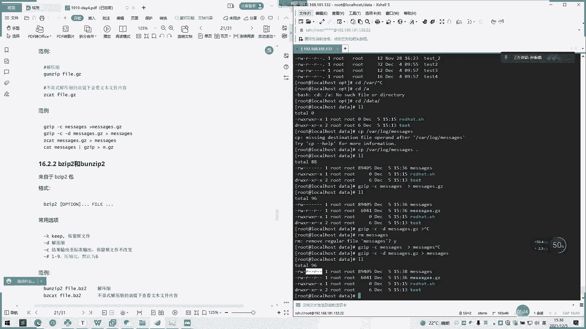
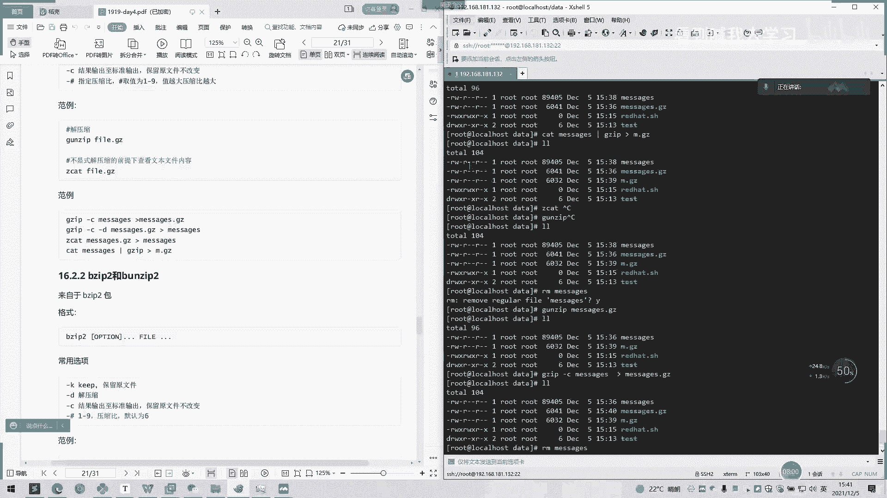
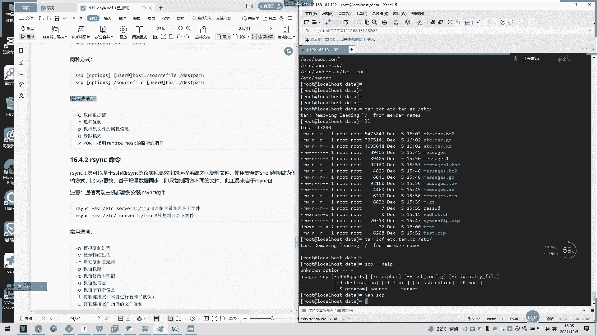
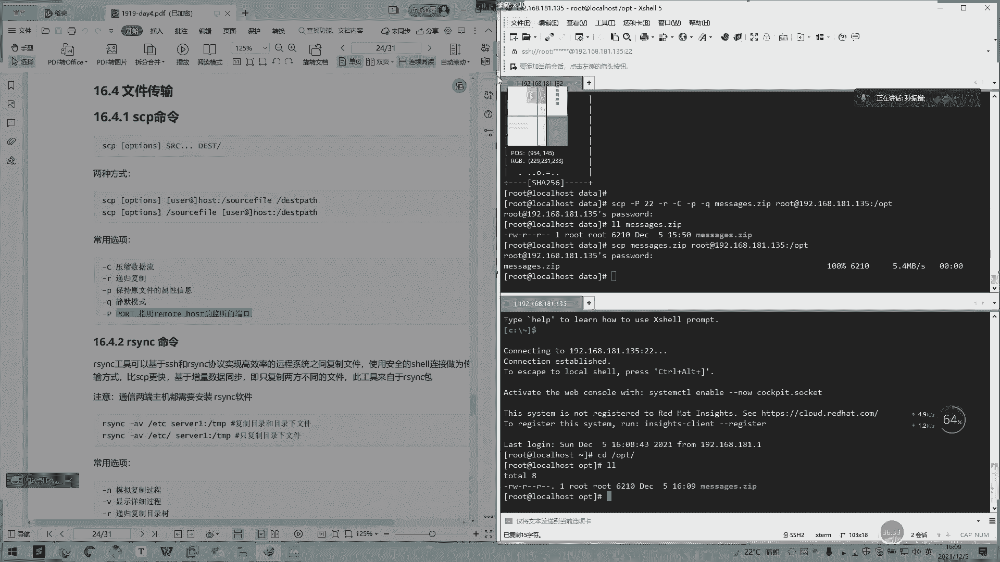
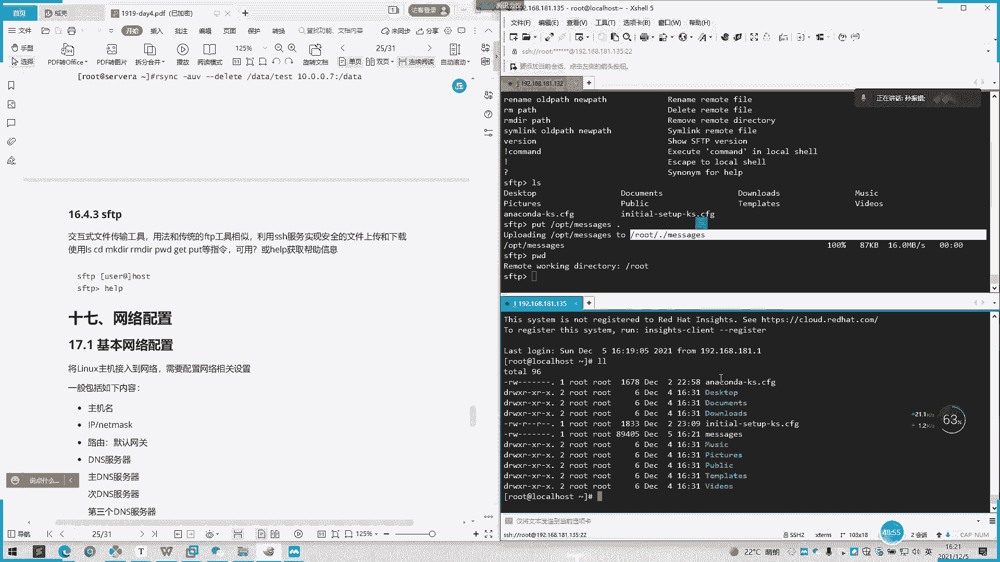

# 2022 01 最新rhce教学视频 - P15：day4-4 - 看到喊我去学习 - BV1Na411y7SQ

然后的话在考试中的话，可能就考的比较简单一点，可能就是呃解压个文件到某一个地方，或者是压缩一个呃目录这样子。这里我们可以啊。录屏开了。我已经下意识开始录屏了哼。O。

然后的话我们看一下呃压缩跟解压缩一个命令啊。呃。压缩的话就有几个就GJ啊BG，然后XS然后jeep啊，常用的话就是jeep嘛，然后解压就是相反方向就相反嘛，加个UN比较好记，加个UN。

一般都会带个游人的游人界UAXEX以Z，然后B。B文件哎，这里的话这个B还在前面，只不是后面。这基本油烟在这后面，然后居热也是这两这两个的。呃，可以这样子去。然后我们先看一下居J啊。然后然后GUN件。

你就这样理解到滚滚接啊，也可以。常用的一个格式啊呃这两个这四个够用了，正常来讲是够用了。啊，我们看一下刚刚跳。啊，只有N个。比Efas版。最好的。啊，最好的就是压压缩效率最高的嘛。

我们在winindows压缩的时候，他会让我们选一个最快的一个压缩呢，还是质量最高一个压缩嘛，这里也是一个道理啊，就是从1到91到9的话就会选择越高呃，越高等级的话的话压缩的质量就越好就越小。

然后这里的话就以这也是一样啊，看可以调快慢这样的。我什么版本，然后大V是版本小。小68是什么？我可以看一下。啊，没有。我帮忙，我们看一下这是什么意思。不同的单词我们就看一下详细模式。那我们加加这个时候。

呃那个东西又会打印出来，如我们不加红。OK我们直接操作吧。呃，这里介绍个杠T保留了原文件。新特性，然后一个杠地解压，相当于是G。那他呃加个D就相当于。最近啊。解压缩，然后再是压缩加D就解压缩。

那我们家试一下加C就输出。是标准输出保留连文件文件不改变。啊。这个信号就是我们刚刚这里啊。1到9。好。血压缩。我们先压缩啊，那在往下面。我们还在data下面操作。我们还在dta下面操作。

我们把呃wordlock的这二个me。去拷贝到过来，拷贝这里OK。主席。放行。哦，他这里加个。加个大鱼号。我们自己还要加个点击器。看一下。是不是？然后这里权限会变，看到没有？细心的同学会注意到。

这里其他人可读，然后这里所属主也可读。

这是一个。

嗯，再来个。G接杠C杠低抗低什么抗低就是血压嘛？就上于变成一个解压，就跟那个滚件一样嘛。O。我们先把这个mesage举删了。好，解压。谢谢。杠C加。降低。那个请您相到这里。好。要变来了。

你看刚刚我们我们复制的时候。权限是有点变化，这里的话会有点变化。

留意下，电话了可能就是权限。

嗯，还有个TCAT。继续把那个 message。GCAT。也是一样的效果。点。哎，不看。嗯，查看内容，然后发个管道，把内容。我放到这里啊。嗯。然后这里变化了是。呃，压缩有点不一样。

你看60496032大小差了一点点，但是还是会有点差异。啊，这是几中一个压缩方法，还有一个解压的方法。对压洲知。解压都不知道。或者是用这个主干还是没有。嗯。大家 message。问子系呀。

看没有我如果这样子的话。是不是我原文件这里没有了，它自动帮我删除了。所以我们刚刚一定要加个杠贴。那我们再压缩一下。嗯，好，我把云ip手机删了。然后没用。你这杠OK啊，那叫我保留下。嗯，是法留了。

是不还在？

这这几个。

你先系转说。好，看一下这个BG啊，然后。还有另外1个BNG啊。也是一样的。哦。你看参数都是一样的，只不过命令不一样，还有打包的后缀不一样。啊，还有。Passen。그。我们要先打包装，我们先打包。变成。

Okay message。然后前面是9点BJ。本来 it is。因。

嗯。

8把元件三。然后。谁啊。You say。Yeah。

嗯，应该要补签了。

还有个说是不显示。哦。你继续找找。不仅是。解压的前提下，查看文文件容，这个卡上打包价的内容。嗯，我咪有。Message。是在这样解释。把文那个文件的内容都打印出来。沉冇啊。嗯。嗯。

还有一个X以线还是N以线。啊，也是一样的。所以说演示一下。嗯，我们开C一个话楼下面的。Ily said。诶。保留一下，我们选择一个message。Okay。哦。有。然后我们再。

也是一样的。

有一个字还有个。比较常说是这样这个先打包目录和多个文件成一个文件并压缩，但可能会丢失文件属性。如使有者和主信息，一般建议使用套和打包来自自件。O。对。这个看看啊。当前目录吧，点当前目录啊。呃。

希我还是同。对。是。它会提示。这些压缩的比呃压缩前压缩后的占比。这率压缩60%。61啊。

你算。不能为这。对对。

然后不同的，他跟别人打包有不同的是他首先是把呃点jeep这个先写了，然后后面再跟我们需要打包东西。然后但是前面。啊，前面那些呢可能就是。先把那个路径先打出来。先把这路呃先把我们个压缩东西弄出来。

然后我们再进行去一个压缩这样子。嗯。这以上面有点不同。对。跟也是一样的。嗯对。也是。直接这样子就可以了。然后他会如果下面有目录话，它提示是否需要覆盖，这个意思。然后这里有一个啊，这里都有。本在杠迪。

嗯据。Messジ。嗯，对。看迪后面贴的就是。啊，解压到哪个路径上面。是不是解压到把卖设机解压到OPD下面了？然后还有一个片。啊，看 message。是。😊，Okay。我这两箱我先把它删了。Okay。

Yeah。嗯，他这默认就生成了一个T啊，就我这也不用。啊，不用那个。我只是看了这个呃，把这个文件名打开这一加文件名输入两个文件名就可以了，不用加个点这个，然后这后面空格加个呃横杠。

然后这个默认就生成一个。啊，这个文件名点击的后后缀的一个字报出来。嗯，解压放批。重定下。那统一吧。嗯。自己啊前后都是一样的。啊都是一样的。然后我们看一下这几种方式解压，哎，这个压缩。

你看呃压缩前后一个大小一个对比，你后BG two的话，解压是44829啊，压缩是4829，有是GG的话也是6041，有是X1件是44660，有是GP的，是6210。那很明显的话，这个这个压缩是啊。

如果在我们没有调的话，这个压压缩比例是最嗯质量压的是最小的一个。然后其示到这。其实到这哎。4829的这个E two，然后再到这个GG。最后找到个Gep。这还有个非交互式的加密和解密就静默。啊，就是静梦。

嗯。嗯，行。Yes。我把S来应该去。那我件的话ts不输入密码，这是输入密码哦，他会要求我输入密码，我玩123456。ok。嗯。嗯。嗯，如果是NG。放题。直接代运码。这客人。嗯，一。哪个。小超级。对。

你行吗。嗯，不行了，算了。我们再接下说一下t。然后打包了解压啊，他了也是。一样啊。他知。看CPVF。呃，还是还是要用 messages。CPV。没有听清。嗯，好。嗯，它会生成一个点的一个文件。对。

但是这个好像是你看点它的压缩是呃质量最差的。你看你看这个压缩跟之前没什么变化。感觉还变大哎，怎么感觉还变大了？嗯，那我们再看一下。对。你看没有？哎，变大了。嗯，你们看。啊，是。一样的。

那是T归。

它的好处什么呢？它这个的话就可能就用t就可以加一些参数就可以。啊，自己去压缩解压，不需要再什么NG啊或NG啊这样子。然后查看归档中的一个。呃，文件就这。杠7。啊，这个不开合费。帮你电话。我家不是没有。

嗯。简单测一下F，那我再。测试一下，你在自己加也不行。所以同学不要搞错了，应该这前面加后面加F。想看。这个是。创建会一他。到诉人有有问题？吃吗。是追加。文档是回档。没吗。嗯。对。4。想开会了。

展开归档他。XF然后。Message。健康。咦。暂是没有，等我加个大西看见。嗯。对，看是前面有。

我调好点。结合。嗯。这里的话说。我是一。这不翻例。你也敲一下。啊。ACVF。ETC插件。第视天。啊，包ETC上面的。要多少个大JCAC约。什么。有点慢，这以压缩这样最好。还有一个。

如果不想要疯狂输出这东西把那个V去掉。我刚刚说那个V就是。呃，反映日这些详细日记啊。哦。行。你呢把兵睡掉。是不是就不会弹印了。这是一个。嗯，这一刚我们打印都在这，压缩完了都在这里。哦。16。4。

SCP我们学学一下文件传输SCP啊。SCP的话，我们这里有两种方式，就是呃服务器与服务器之间的传输啊文件或者目录这些都是从一般都用SCP去啊。然后这有一些常用的选项。就看自己可以自己投票。采用的杠大C。

就是压缩数据流，然后杠R就是递归复制杠P日保留点文件属性。按Q是静默暗拓指明明末house签订刚口。

要我把另外一台机子配。对。

哎容曼，你看下还是CP啊。Yeah。嗯，这上面还有很多。

什么东西。这是才。

话来呢种睇你信啊。

嗯，135。Yeah。O。

这样吧。咩时别哦。嗯。嗯，这里有一个。叮到。一般来说是这样子啊嗯。我这个下面怎么画了？一般我们SCP如果是带端口的话，就加个PP啊。然后目标的目标接的单子之，给他打，然后。是R的话，就是递归复制。

就文件目录也一同复制去。如果不加的话，就是目录是无法复制的，会报错。我咪肥仔啦。公司。当逼可下小兵。啊，看Q也的都可以参询。然后我们把message。点击付传到。才是第三面的，我才是192148。

我前面加个用户。就是这个用户就是你啊传用什么用户登进去，还有你后面文件夹登的什么权限，你个用户能访问后面你所要复制文件夹权限。啊，OPD我到传到OPD上面去。个以做。哦，我这里做了免密，我又删了他。

上面。反正免密密要找你个，等你一下。好。那我敲完之后，他是要我输入一个密码，我这里输入。然后然我们这边看一下。是不是跟这里是一模一样的？是不是跟你的是一模一样，八字不变了。啊，一般的话。你们可以。

如果默认是如果不加皮的话，默认是22，然后我们直接就Mssage点击。如果就传的是文件嘛，所以我就。不讲了解缠这种都可以。哦。现是可以的。

也是一样的。

呃，这边看个人一个那种使用的一个方法。这个就。这一的话就使用比较简单，然后一个是。啊。啊意思Y7元。命令的话，这个的话就是一个同步工具的一个命令。然后它这里的话可能就比SCP比较高级一点。

然后这种可以基于SH和。ICNNC协议啊，实验高速远程信息系统之间的复制，使用安全的效连接作为传输方式比SCP更快，及增量数据的同步。即时复制两方不同的文件，此工具包来看一下我这里有没有。哎啊有。呃。

他可能跟SCP一个区别就是一个增量增量同步啊。比如说嗯你整个日志都不会完全复制过去嘛。当你日呃当你一个文件很大的时候或者是怎么样的时候。啊，里面的数据量很大之后，你不会完全复制过去啊，它会。呃。

去增量的去同步，就把你呃没有的那一部分制同步出去。然后另原来那一部分它是不会动的。然后原理是它会先校验一遍，你一个数据的完整性啊，你一个数据的完整性之后，你后再去。呃，比对你两两个文件之间呃。

是否是呃同一样的呃，数据是否是一致的。如果不一致的话，他会啊它会慢慢把那一回覆盖掉，就传输过去。有时一致他就不管理，一致他就忽略掉这样子。你好，这里有。他注意的一个地方是通信两端的主机都需要装一下。

装都要有这个，否则是不行的。然后我们首先先看一下这个常诺参数啊，然后杠N是模拟复制过程，杠V是显示详细过程。杠R老是递归复制目录数一样的。前面的三个我们SGP1样，杠PS保留权限一样的。

保留修改时间戳啊，然后杠G是保留主信息。干额宝的所候者信息，这些可以呃，一般可加可不加默认这种。如果杠一是，如果接受者文件比罚送者叫行将忽略同步。啊，接收者文件比我接收者比我还新的话。啊。

我原来的文件我就不会同步过去了。接压缩节约网络杠A存档。且不保留原数据删除，目标数据也会自动同步删除。可以啊，那我们试一下。呃Y。AB啊，你们看。A是纯糖。嗯，BD机我们看一下。死我。6192168。

21。135。到。嗯，OBT下面。好，我们输一下密码。嗯，一样的，跟SCP的复制原也是一样。PTC是不是已经传过来了？哦，我再次执行的话呢，是不是？呃，他去比对完了，发现是没有变动的。

他是只是传了一个，第二次传的话，只是传了一个这样的一个东西。他只是提示一下。

嗯。嗯。把我留的修改时间错，让我们试一下。AT。嗯睇下这边。这两个没什么区别。然后最好将。这ep然一个D。行。点咩。从CBDC到B2。还有个重档。这里有一个ISING，然后AEUV类。303月。D滴滴。

Yeah。No。到6192168。1819135。有。Yeah。嗯。开始小在。好为报办。嗯。嗯。把你们内容删。那看EDG下面没有内容了。我们我们继续。传过去。是是。他是提示把这把目标那也删了。

我们看一下是不是。是没有了。好。是SCP那边所不能做，就是删除啊，那这也可以删了。这样的话它可以进行一个同步啊，你这边删增增加或减少，它都可以去同步这样子。好的，我们最后说一下这SSTP啊。

SPSD是交互式的文件传输工具啊，用法传统FDB相似，利用SH服务实现安全的上传和下载。使用CDNK的指令可以用。STP啊。嗯。因我这里的话也是一样的。也是跟那SCP是一样的。嗯，这些都是。

后面他的参数基本都是一样的。那我们这好像。进入流到那个模式。SSTP试下。Yeah。192168181。13。Yeah。他是不是又进来了，然后。我们这里打一家票。可以的话。Yeah。IS看一下。

那我们就进入到了。嗯。Yeah。OBT的应该。好，我们看一下这里。我看家陪单。就在路程开是几段。

这的有空me。

ok可。你人到了没？SSB。先录转。192168。981点。135。看这样的话就是把135的东西拿过来。我们自己创建一个。呃，保持一个 hand。嗯。hello135。从序勋长。现在调逼这里。

好像我是去点接了。OK我看一下那边的OPT。你睇系。点TSC到我的OPT下面。我们看一下。是不是这个这个被派的就到这样。啊，这是一个。帮我等。嗯。行，几个图都没有找到了。看。做几铁去。哦，我一下面。

这里后面的就是。

这个是目标啊。然。这个是我当前的。当前。服务器。然后这个是。这个是目标不是。

嗯。退出。就是破的话，那就是。的话就是上传上传A是吧，那我们就。目标服务器呃。啊底下啊。嗯白别打出。传传到目标服记的OPT下面。

这有区别的是。嗯。当时游戏。我，这个是目标模。

好，主要是上传跟下载，主要是这两个。然后的话我们这个插效工具也是有一个呃SFTB的工具啊，我们这里有个新建传输。

唔点。

对。这个应该大家有用过吧。

这里。嗯，他就把我们的呃一个目录啊这些都会打印出来这里。这两哎两个点就是往上的一页的意思啊，这一个已经到根目录这边了。啊，如果我们双击都到，他会作为下载回来，下载我们这里。

让我们删除这也可以选选择自己的一个文档信息，然后我们拖过去就可以了，我们直接手动拖过去。这种就是比较傻光的，然后这里三组也是可以的。只要你都会登录用户有删除权限，那是没问题的。这里这个拖过来。上面。

我解一下。好的，呃，文件传输这一块我们今天讲到这里了啊，我们先下课休息十分钟。然后我们最后的一点。直间去讲一下网络配置。Okay。我们先下课。

