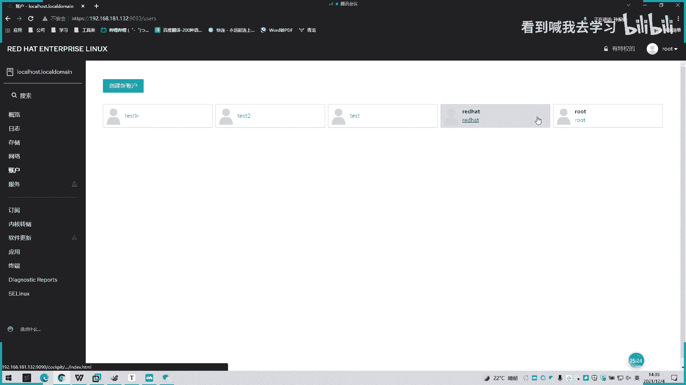
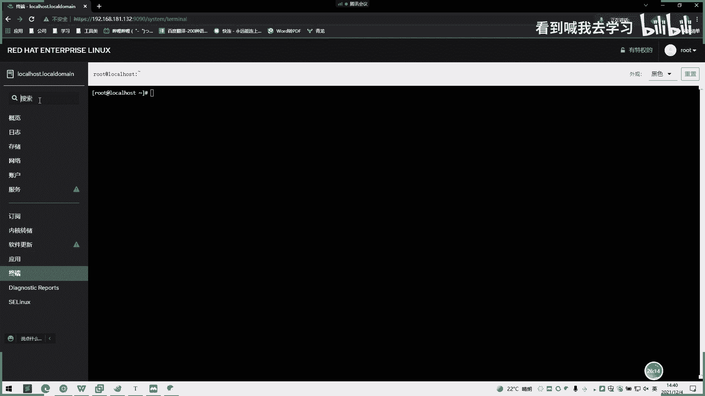
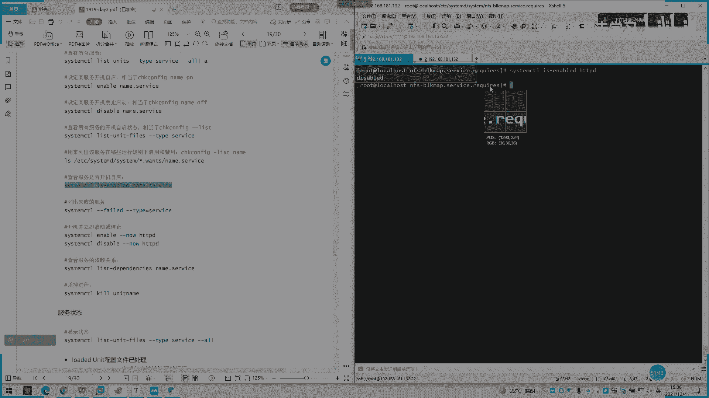
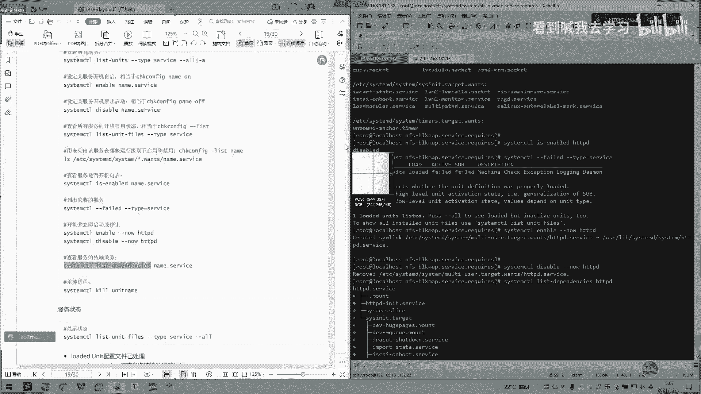
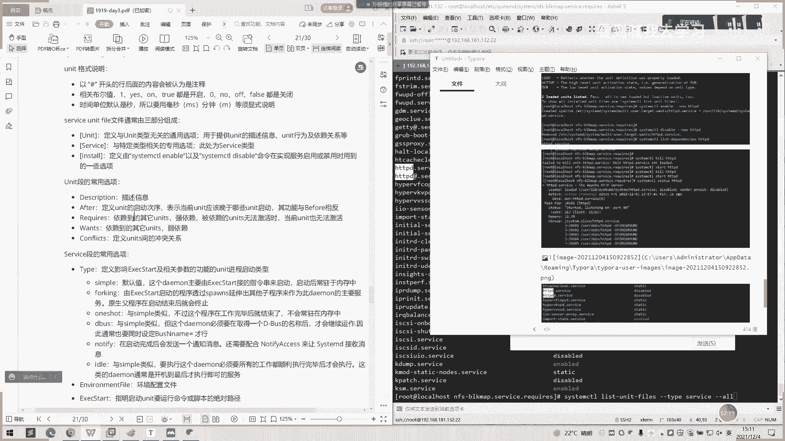

# 2022 01 最新rhce教学视频 - P16：day3-3 - 看到喊我去学习 - BV1Na411y7SQ

好的，我们下午来说一下这个红帽八的一个新特性啊，呃制加一个叫一个COCKPID的一个呃界面。然后它是一个红帽吧取入一个新特性，是一个we应用啊。然后我们这可以看到它可以有几个几大功能。

还有一个监视系统的活动，比如CPU内存磁盘IO和网络流量，还有一个查看系统的日志磁盘呃用户还有一个检测一个系统一个服务状态。啊。我们是通过1个IP呃，通过HGP请求去IP加单口的方式去打开它。呃。

我们现在首先呃要先安装一个呃安装这个应用呢，我们首先要设置我们本地的一个。

啊，时长环境啊呃一个镜像环境。我们点一下这个呃我们当前的虚拟T啊。

我们点击一下右键。啊，我们点一下设置。

哎，好的，他现在已经进来了吗？我们点一下这个CD呃DVD这里。大家大家这里是不是有个设备连接状态跟连接啊？然后这里有个选用使用ISO镜印象文件，这里是不是没有勾选，我们这里点一下勾选，然后我们。

浏览一下，把我们之前的那个镜像文件挂载上去。没有。啊。就我们之前下的镜像文件，就装了这个镜像文件挂载上去，挂载到就是相当于第。化载到DVD就样。然后这里设这里设备。

点连接啊，我这里点一下。嗯。

我。哇的。

O。好，我们这里点确定。

这里呢我们通过1个FDI杠压的一个命令。Show me you。通我嘅 f d i 。那还有没有我看一下。诶。어。Yeah。嗯。好正我这里没有化成功。输那个出来。

啊。

你同新能再看下里没。

这需用。你对。嗯。😊。

你。你么放讲啊。

那再重启一下。

稍等一下啊，重启开。

OK啊我们已经重启了。然后。我们看一下。有没有字。嗯。我们这有个H20，你们换换来看一下有没有。不是在这里上面。好，我们进来来看一下。Yeah。哦。他实际已经这个镜像就已经挂进来了。

我们可以用客语音去报。

首先要先创建它。好。

我们随边个。

嗯。然后第二步呢，我们设个云元，我们进来这个APPC。天年你不。我这里之前有4个我看。Okay。Yeah。把这个删了，然后我们自己创建一个。叫。啊。I只 have啊。呃，loc。Sauce。这啊。

我能要人开。好是吧。这里的话我们。啊。这样子我们一个。呃，一个封货号啊，破解下我们输入刚才那个。那我们这里设一个name。啊。差一个吧。Aace o。那我们复制一下。哇哦，我先敲啊。Yeah。Yes。

Okay。好，第一个。第二，这里是检查是不检查意思，这呃启用。这in的话就启用这个时商，然后我们。再敲一个。APP咨讯。我先敲，然后后面我跟你解释一下什么意思啊。没。我们也设置一个。まね。哎然是这样。

为什么这样呢？我们进来这个ND。Okay。我们主要是链接到这两个呃这两个文件里面来这两个。丫头里面的。啊这样子下面也是一样。好的。保存一下。没。嗯清除一下云的缓存嗯DNS。DNS。他说我这十七有错。

O我重问下。看一下。嗯，你说你么说。点弄。Can you see me to。没有。嗯嗯。不能空合吗？对。嗯。嗯。还是不行。YeahYeah。你看一下。那我们去要那里。不知道。16。16。电把都以取掉。

对。嗯。P O。응。必须是与凤结尾。嗯。Okay。我要听 so靓。行。嗯，还是不行。真的有点奇怪了。名字是没有空格的。啊。

是吗？看这。嗯。那下划线可以吗？可以的。

名字是不能有空格，这一块是不能。然后我们这个是。两件商不名。那这个是软件仓库名啊。Yeah。然后，这是连接地址。

他会连到我们的一个。这两个。两个下面。

持续连接。

It。

嗯。

会实际连接连接到这里啊。然后这里面的话就是。一个part表。也是我们。哦，我们所有这些云安装的一些IMP1个文件。这个也是一样的。现场的同学可以跟着挑一下。Yeah。然后。

完了之后我们就cing on一下，然后再。刷新一下好。

远程的同学设置好这个时长合一。然后我们可以接去下步。就可以去安装这个。你直接DF看看。看完，你等一下。Yeah。哦。他一开始我们是已经装有了，那我们就不管了。好，那我们就执行就行了。

有没有刚有的同学按照我上面这个方式去创建这个时长去装。哦。然后我们这里输入一个。9090啊，也是我们这个当前IP的第几个9090。啊。加个端口。

Okay。哦，大家等一下。

是不是已经进来了？是不是已经进到我们一个流汉？

等一个操作。然后我们。文档那边看一下用户密码是吧？

哎，这然子里面居然没写。嗯。

使用。

你俩服务器密码。

使用root或者是我们之前创建普通户用户是可以进来的。然后他就会看到这样一个页面。然后这里我们可以看这些日志存储跟网络这一块。你看我们有失败，或面有注册的都有显示在这里。

好的，刚刚的那个。这一快要复现。

好，你看这里有几个网哎，有几个选项，账户服务呃，什么订阅啊，软件更新啊这些。然后。嗯，一般来看这边画一个存储一个大小。啊，这驱动器我们当前的一个驱动器的一个存储。然他这里都是实时的。

我们用呃头用户看一下。

有什么不一样啊。

哦，他日志。哦，这存储日志还写了很多。Okay。嗯，这还有新用户，我们这个可以创直接创建新用户啊。

我们可以直接创建。新用户就可以了。啊。或者是删除用户。

这节就删除用就可以。No。强度强制变更或者是设置密码。比如刚刚之前命令上面操作东西在这里界面都可以呃更更方便的简捷去去设置。哦。英文版的这。我这里不知道是怎么自己变成一个中文版。

应该是我这里默认变成一个中文版。嗯，行。

可以，大家可以回去课后研究一下，好吗？可以先先讲到这里。

然后我们讲一下呃。信号发送了个Q，Q跟内部1个0令这样发起。刚刚就说啊。呃，在上午的时候，我就说了一个。Hoop。阳先减锁加Q。Q的话好像之前也有介绍过，就是。有几个零是。呃。

Q杠9啊或直接Q杠9就是直接插死进程嘛，然后Q杠。Q杠10Q杠19啊，就是这。这些的我先弄一下这个。

这有一个Q啊，Q杠好，我们看一下。这里的话就会放要就打印整个的一个。

哦。暗号出来就是说比如Q杠9有什么命就QQ直接杀死嘛。

这些单单号都打一个，大家记不住，可以直接Q杠让我看一下。嗯，123。这里都有50大有60多个呃状态，然后我们一般用Q杠9或直接Q掉就比较方便。然后这里还有一个线。这也是一个Q的命令那容。啊。

功功能原原理都是一样的，只不过命令不一样。啊，这边有一个，一是无需关闭进程，而让其重读配置文件。然后第二个这。Q2呢就是终止正在运行的一个进程，相当于ctrl C。

然后三呢就说三就是相当于conttrol加下号线。加反斜杠线。返前方这是什么意思呢？我看一下。嗯。方式评一下百度。我们看一下。搜一下百度这个。在拼。5Q杠3。看下会有什么效果。嗯，是不是突间会中断一下。

失失去了，然后后面又自己自己重连了。是啊。直接先失去了，然后又自己又睡充练了。然后这种是还有一个是强制杀死啊，有果是6000呢？啊，也就没了，也是己Q了。你继续再评论。我再看一下。我试一下6-1。

756有8。啊，提示的一个方格。连续关闭而进行样机重读配置。但是我这边拼的话，还是直接停掉了。终止正加运行的进程ss。看一下就。给我干了。嗯。你们呢。这时间没了。这两个继续运行流量值当是没。

然后这里有个。嗯，再看一下。39。好。刚刚跳停了一下。没有停，还是继于音。感觉这个没什么用啊。还有个后台休眠的，后台休眠，我看一下。哦，他是在挂挂挂在后台了吗？我看下。本人可。哦，他还在拼。

只过他已经挂在后台了，进城志还在的。

嗯。

是的。Okay。指定信号的方法就是呃带带数字啊，杠加带数字就可以指定了。信号的完整。有整写的话，一般是写后面这个。像进程8上IP。啊，这也是。Q来自PS1。8，可以直接使用进程通知信号。

不需要查阅PID。有哦。Q啊。Q2哦Q10。哇塞。Q屏应该是Q屏。早上。嗯，你们装个。HCB。我装开DP看一下。嗯。看加HD毕竟能参赛O在的。你Q啊。QHAP。嗯，拜拜。Q号H11。

嗯你看一你还在不在在了。

算了。

还有个特殊信号。特殊信号铃利用零信号实行健康检查。我们这样先启动一下。APPD。然后呢Q2。您学习APD然后我们再以看一下视频。还在还在。如果他是在的话，是呃就是没有没有提示出来了，就是显示健康的对吧？

那我们。健康的话，那就迟到一下。估计那那没有吗没有，那我们在Q2杠0。HD一P。他就提示了一个proces，没有当前进程。

然后这是零信号的一个操作。大家可以操作一下，然后我们。到一个作业管理啊。lindows的作业管理呃，它分为一个前台跟后台的作业，可以通过前台作业是可以通过终端启动前启动以后一直占据终端。

如果说后台作业的话，可以通过终端启动，但启动后转入呃后启动后即转入后台运行，释放终端，就是可以不用在我们当前终端运行。哇，这有一个前后台停止的一个东西。让作业运行以后的。最直接是这个人还是拼。手机到。

但是呢。我可以看到进程还是有的。是啊。两个屏我有两个屏一直在后台，我行就这样。喝了很久。Thank。是没有没有病。听下。我们按下ctrl键。然后我们再看一下静台还在吗呃，静台还在还在在后台里面运行了。

啊，如果说一开始就希望呃直接后台运行的话，我们可以前面加个那个号，然后命令中间带个命令。买度。好几分你QQ点com，然后面再加一个do。然后他会先提示一个竞程号才进程号。

这个进程号就是一个呃后台运行的一个竞程号，是你执行的命令。那我们通过进程上可以看到我我们的一个拼的一个进程是在是在后台的，然后在一直在拼制。有的终止的也是Q。作业控制，这有个BG。状门我看一下。

Keep。FG就回来了。又回到当前的这一个。H区啊。嗯。没有了，我刚刚已经退了。终单已经退掉了，就没有了。哦，这是一个B区参加。啊。一必原件。你说C区。回来。去食试。哦，我自己关掉了。我再来。没事。

FQ回来。L机回来之后，我再。Yeah。Yeah。一局也是。也是一样的，唉，但是这个机停不掉了。还没有。听不到，很多时也停不到。你聊天呀。是啊。ここに去日。然后我们。说到了一个服务管理啊。

12的一个服务管理。行。后台运行先介绍到这里，说一下服务环理嗯。然后服务管理呃。reha期的话就是开始就是从sstem。这里开始开开始用这个，然后之前的话是用的Iinin。

IANIT啊进程系统启动的和首务进程进程管理器啊，就像于我们现在这个任务管理器这样子。你要负责在启动系统启动或运行时激活系统资源，如进程的其他进程。然后这有一些新特性，我简单说一下。

然后它是有一个系统引导师实现服务并行的启动，还有一个按需启动手路进程，还有一个自动化的服务依赖关管理。同时采用是杠BS的 bus总线式的激活服务，还有个服务程序分离一个第二个向后兼容这些呃应该一个脚本。

也就是说我们之前7期之前那些开机脚本啊，它是说它都是兼容的。你要使用。是整可CDL命令管理啊。命令固地，无边不可扩展。费有，这个启动话是无法。控制的不是有这个生成启动啊，这这个是不能用的。

然后这有个系统的st，一个核心概念就是用。单位用的表示不同类型的生成对象，通过配置文件进行标识和配置。文件中的主要包含了系统服务呃，监听scking，还有个保存系统快照以及其他的相关信息。

然后我们看一下这个。打个hi，放几个跳。嗯。我有我没有。好他是有几个。啊，如果是之前。六之前呃，7之前按个4我吧。server的话，他现在也依然保留，但我们现在是用这个。

然后这里他也说了一个server，server是后面这个跟这个server是不一样。看有几个类型。一个servver，一个shoping，一个tggerdeor物理设备软件，画载，然后自动挂载s望这些。

后面两个分手，还这里有。文件呃servver unit文件扩展名为servver用于定义服务系统嘛，然后sockcket unit，然后socket定义进程间通信的用sockcket文件。

也可以在系统启动时延迟。呃，启动服务实现按需启动，然后一个tckerun，它的意思文件扩展名为点tg，用于模拟实现运行级别的inter。046。这个后面讲到有个是dorce啊，这是内核识别的设备啊。

然后这个是漫画展。文件系统挂载点，还有一个管理系统拍照，还有一个标识1望设备的，有1望分区嘛。然后我们啊文件系统的自动挂载点。普通话。

然后有还有用一个定义文件系统中一个文件或目录时常使用于文件系统变化时延迟激活服务。啊，是风目录。这些可以不用管它，我们可以看一下这里它是怎么使用的。每一个。啊，服务最主要的一个角本配置，我们看一下。

是不是啊？他这个目录啊。他这个目录，然后。呃，系统脚本配置可能在都在这里面呢，我们随便看一下1个HCEP吧。我刚刚放了1个HAPP。然后刚山。我们。用这个命令，用这命令不大HAPP。

的意思就是他直接调这里面的呃条本去。去师大。你看他直接就调用啊，我们这如果超时的话，他自己直接会启动这里，然后运行这个命令。有是Q的话，你看下面这它这里有Q。然后我们这里。啊，这里还有一个。Yeah。

这个系统执行过程时产生的服务条本比上面目录先行运行，但现在是没有也是系统还是没有。然后这有1个ETC下面的C。啊，这是管理员界面的执行教板，这是我们日常。啊，日常定义。市常自己去弄的话是有的。啊。

你看这里我看一下。他这有个软链接。你。我听一下。这是之前。嗯。也是一样，它主要的配它主要构成就是一个呃。一个un例，然后这也就是一个说明。然后在这里。谁最。这pass这里。

然后主要是调用这主要我们调用是收尾这这个模块。R运star这里就star，就为我们执行那个sstar命例之后，它会调动这里只呃调动这里就执行这下面这个脚本，我们执行这个脚本。然后如是安装的话。

这还安装它还会调用其他命令，就其他的一个是我配置在这里面的话也是一样的道理。这是脚本都是掉都是掉脚本，不过在上面封装一层，我们直接使用话比较方便一点。

然后这管理工具啊。可以看一下。这有个com。这common一般是啊。嗯。好。一般有三种状态，一个。呃，启动服务。一个停止服务。还有一个大重启。还有一个。查看状态是这。嗯。这也有说exstar重启。

然后禁止手动。这有个禁止手动。这个定子手动，我们可以不能手动去操作。我刚刚想关掉m到。看看。禁止自动的时候，哎，那这个也没有用，取消禁止。是好像在其他场景才会实现。嗯ま。你梦。你有咩事做咩。嗯。

还有一个查看某服务当前激活与否的状态。呃，这下面就很少用。How지 않은。嗯。At。就是。一个是否呃活动，如果不活动，我先关掉它。还8什么。哎，这活动。采外查看所有已激活。你可以设试看一下。嗯。

TY is type。你发什么事。哦，这也是厂开已离婚了。那只有个产量所有服务的。啥。嗯，这是才22伏的。嗯。还有一个常用的一个enable跟diable。呃。的意思就是开机自取嘛，就说配置完这里之后。

我接开机一起，它会弹出一个。他一谈这个pre a symbolly这这样一个东西转。

我是diable就是关闭开机自己啊。Disable。你去掉。

最后一个关机I递。

Yeah。然后再有个列出失败的。然后这有个。列出该服务在哪个级别运运行了禁用。没有的。查看是我开机四期。用HGP。s h h d p 听闻。嗯。

这里。

然后自有开机，并立即执行与停止。这个月束失败了，你是知道了吗？哦。系い。嗯。这有个not启动失败。要要要么去确认。月份。开机这个跟那个ADC是一样的。什个依赖。明该。

So。嗯。

Q这里有个Q令直接杀死当前电车。呃。有。哦，没没启动，搞不了，启供一下。哦，算了。启供一下。看一下状态。说一下。再看一下商品。没有了。也太是吧？

嗯。

小声。还有个显示状态。嗯。显示状态。也就跟那个一样sstateate一样的。我这里显示。反是全部的。是嗯目前39个。我们这里就可以看到。嗯，个HGEP。第三个。嗯。O。然后这下面还有个active。啊。

这里有说明呃，而且是。一次或多次执行运行啊啊。完成一次性的配置，然后还有个什么运行中有什么用。in是不运行啊，然后inab是开机启动，然后disable是开机不启动CD是开机不启动。

但可被另一个启动服务激活，这个也这个也很少用。这个从镜向到别处。这里放内些也敲过了，就不敲了。好，我们先休息一下，我们10点哎，3点20继续大家讲讲一下下面的这个文件格式，所有的uni的文件格式。嗯。

W。那。什为呢。嗯，好好，好的好的。不到。嗯。好么这里来。응。嗯。Okay。嗯意。我不意。嗯。

嗯。嗯。OKOK我要记得看录屏。