# 2022 01 最新rhce教学视频 - P18：day3-2 - 看到喊我去学习 - BV1Na411y7SQ

这什在。那，好，我们现在说一下文件的权限管理。然后我们一开始用。两个L或者IS杠L的话，我们可以看到。呃。列出来一个列表式的一个呃文件详细信息都出来。然后我们首先看到这哎第一段呃，第一段的话。

我们前面的第一个横杠就是一个文件名的意思啊，这也没有。系。我们之前不是说过了，然后第一次是代表delector嘛，就是说前面第一个字母，第一是代表directelector，如果是文件的话。

一般都是一个横杠。然后我们后面呃后面第三个字母就是一个读写。个一个后面这是一个权限管理。然后这里说是权项，然后这里有一个链接数。一个链接数，然后这是一个用户组。所属的用户，所有者，我们是称为所有者。

然后下面一个这个是所属组。然后我们打印的是一个这边是这么用这december呃去打印december6月，比是说这是一个日期，我们一个创建一个日期，还有一个创建时间。这这是创建时间，然后啊。

刚刚这个是大小。这是我们当前一个大小。没有59年吗，日期36。对，那我看一下。你好请别听到。是啊。一个三的哦，我刚刚又说错了。对，这是日期，然后这时间是这个。这是修呃创建和修改时间，然后这里是个大小。

大小这吧。哎，我没做错啊，这不是大小吗？看。啊你企。November。27号。这一段是时间啊，然后这个是大小，不要搞错。然后这里也有说。这里。用一个呃他设置文件所有者。一个窗帘命令。现在是路口。

我们现在是录制。呃，一般来说的话，我们。比如说设一个路套。两个路走标。在这个盘子。那我就这个里ha。是跟之前他说的话的用户就会变了。他是。这个rootroot的用户就变成个铝害，然后这几个设置。

如果说是文呃文件夹的话，就是。们长的。嗯，文面讲还是。联系一下。你清。文件夹也是会变成一个厉汉。但是如果说文件夹里面内容是什么？它是root啊，文件夹下面是root，然后把那个文件夹。赶回来路走。啊。

那我们如果说文件夹，我们赋予文件夹一个下一个权限。那么文件夹是变成一个流看，但是。它里面的一个文件还是一个root，呃，文件的权限还是一个root，就是说呃char。如果你不加参数的话。

默认就是把当前的这文件或文件夹变成一个re害的一个用户跟用户组。如果说啊你要加。改个更好啊。那他们里面的话权限也会随着变化，就里面所有的呃文件的那文件的这个用户跟用户组也会随之变化。

加刚才大就是个递回的意思。然后这我们也说一个递规子。然后这里还有个指定呃参考指定的属性来修改。那我们常用的是这个。账考资金资金有这个你有一下。嗯。Yeah。嗯嗯。意家。

for on and glue rather than special， okay。查一下。看一下哪个c变辑下。Yeah。但是么。哎，没错啊。还是。No。要想。Yeah。知吧。那 fire了。

开始就变成了一个。呃，一个厉害的一个。用户。哦，那我再说一下。没有。As test。就把当前一个发有一个用户呃所属原件复复制个pass test。这个意思。然后我们这里啊这里第一个也讲。

刚这也讲这一个例子，然后还有个设置文件属性的一个命令一个。THURP啊。比如说我们现在一个fin呃一个pass test是re看，那我设置一个。VRP。那个路。爱好。啊，没给。啊，这组就变化了。

这说是组的，他一组直就变成一个入口一个组。就单单只是单单设一个组。我们刚刚的话也可以，又 try也可以又去设。比如说我们这。你好厉害。自己可以去测。要算了不。root就是用户。

然后呃behind就是那个组。一般是前面是用户，后面是组啊，这样子用这个也可以去设。就单单这个只是设一个组的一个信息。然后还有个文件权限说明，文件权限呢主要针对呃三类对象进行建议。

第一个是owner拥有者，一个是go一个主体，一个一个out，还有个其他，然后分别代表是一个U区呃O啊。呃，注意啊用户的最终权限。呃，是从左向右进行顺序匹配啊。

这是所有者所属呃所呃所有者呃所属组还有其他人这样子。第一只所有者。从第二个开始时候者是3个，然后手术指也是三个权限。然后这里有说这是哎R是什么？R是。嗯，啊这是。啊，这是乱lineW就是LX就是。你说。

行。这是读嘛reading你看X是执行是否有执行权限。对点就行了。赖你就记得这些执行到他是。呃，看W就是写然后X就是执行。这也有说明，使用查看类工具ca可以获取其内容。如果是W含W前箱就可以修改其内容。

如果X把执行此文件提取内核启动为一个进程和执行运行的此文件。然后还有个目录，对目录的权限就是。呃，R也是一样的，查看，然后他也是创建嘛。诶。增加删除都可以啊，要X可以进入H目录。

还可以使用查看命令中查那呃里面的那些文件啊内容啥的。属于目录的可访问的最小权限呢X。有大X只给目录呃X全部给我执行权限了。不给无执行权限的S文件。这个后面看一下怎么演示。啊，这里有个数学法一个权限。

那除了。嗯。除了用字母代表，也可以用数字代表。有果是读的话，它就四。如果是写的话，就是二。如果执行的话，就是一。读写呃421嘛，读写4读写执行421读写执行421。

这里就是对应这里上面的就是对应这下面的这一这一个。这里还有什么二进制数字，00啊0101就是执行。啊。降值血11117。对，一般的呃最高选生清晰期嘛，三个期是呃读写执行O给这样子。Yeah。

640啊这些这是前面加这个，比如说呃。6的话就是4加2嘛，4加2就等于6嘛。是吧那后面他这个X就没有了。啊，这里可以看。啊，可以创建一个，我把一个pas test改一下吧。

大家看一下现在pas test比如4呃4加2等于6嘛，那我再加一呃。那是不是等于7，那我。我修改文件改先讲一下修改文件权限，就是用了。呃，CHN小大M1OD然后再去修改。然后这里还有个指定。

直接说看下面前U啊GO，然后就。我们所说这边的1个UGO这里的UGO叫拥有者所出，这里这里就代表1个UGO。呃，修改某一个指定用户的类型。啊，这里也有一个示例，就是我们现在。修改一下。AA加X。So。

我。那么这里看看变了一个颜色。就原来的原来这只有一个。啊，读写没有一个执行和权限，他这己所有执行权限都有了，这XX的话就是个执行权限。た。A。是这里啊。我们都是可以演示一下。那我现在如果是。

000呢000给到一个太尼。实际上是没有权限的。没有权限。14这是读是吧，哦400开始一。这里有个啊小孩出来了。然后是。4加24加2读写吗？那就是6600。开始一。RW就出来了吗？

然后再加一个一就是执行权限嘛。就个二那啲尺嘛 c 零零。啊，WS后面的话也是一样的。嗯，740。11。嗯。不知情。我是7770。嗯。我是在加其团的其他其他人都可以。之写都一样，只写资金都有。

这是最高权限，777这是最高权限。一般的话可能是775这样子。去。可点点。咨醒。然后4加1是5吗？所以他就有个X是吧？姚是他也说这有个RW24。有时用字母的话，就是。嗯。我看一下。这5。把都重置一下。

停停停。是。诶。嗯。你行。你有。没有。嗯。那个紫色。A加W了。哦。嗯。或者是一个。啊，这个就比较直观一点。然后这有一个。雪皮嗯好。嗯。哦，先把这个选做变成。听。有。比一大。唔系啦。好知。是没有了。

还是一样，他只给这一个权限，它里面文件夹权限是不给，文件夹里面内容是不给。再来个指定用户啊，我们可以敲一下。Yes。有点这。你这样吧。你想安看一下。是单个的。嗰只猪。两个呃其他的话。好的。

阿德都日 other的青哪意思。只是有独的权限。Yes。嗯。嗯。那我们这里还有一个。新建文件呃，目录的默认权限是什么？嗯，mas可以直挥保留创建哎，保留在创建文件的权限。它这个实现方法是。啊。

666杠文m如果所带结果，我会在执行基数权限，将其权限加以偶数不变。新加目录默认权限是777语文m。可以看一下。这个应该是修改的。Mouse。明明啊。iceice。大概是的比较直吧，U就是2加W。

U就是这些都有啊。这是我们刚刚说了之后。然后如果范例的话，就有了。嗯。帮改一下他WT。At times。这是更改权限的。更改一个我们区的一个权限是独显还执行，这可以自定义。

比果说他这持久保存或者是全局可以自己去设。当这个ass的0233时候创建文件权限是多少，创建目录权限是多少？这里有个示例，我们可以敲一下。什么是4013G啊，那我这里更改了。那只有W。No month。

666。我睡嘅。诶呢 t。哎呀。那我给你看一下。你查都没有。我跟有关系。再来1个666。他们这里是什么权限都没有。然后他说系统linux文件系统上面的特殊权限，之前。哦，这些已经介绍了。

然后还有一个特殊权限制SUVID前提是进程有数组。呃，属组呃，文件有属组和属组的话，任何一个执行文件能不能启动为进程，取决于发起者对程序文件是否拥有执行权限。比时一定要执行现在才能去执行的进程。

否则的话你是没有的。是不能执行的。然后启动。第二个点是启动为进程车骑，进程的属主为发起者，进程的属主为发起者所属主。啊，这是有点要求，就是说嗯。现场里面还是会看到你一个不可用户的呃。他企的user是谁？

然后你看就吗？我看到是这样一个。要进程的发起者同文件的属组则应用文件的属组权限。有进程发展属属主的话，用为文件属主权限。就是如果你的进程发起者来执行这个文件权限的话是。还是你当前组的话。

你是你当前的这个用户的话，他会把这个打印，还是把你的用户打印出来。如果说只是属组的话，就把那个。嗯。组合权限只是打组合权限了。然后我还有一个应用文件的其他权限的话，二进制可能。

这里可以案例是可执行文件上的S与YD1个权限功能。这也是我们刚刚一个示范这叫什么？开始啊。开点点啊。嗯。Often。这个大S呢。这是一个其他文件权限，1个SUID1个权限。这是特殊权限。

赋有一个特殊权限，这个意思。哦，这有个范例，你看一下。Yeah。Yes。Yeah。这是一个他。我们那个pass打第一个命令。这位他可能就是有变化，就是特殊权限就可以修改系统的一个用户啊。

用户密密码这些的。这不要就是会有一个特殊一个权限在这里。然后一个二进制可执行文件上啊这些。启动进神之后呢，组组为任输组啊这些。开始设置的话，默认情况下用户创建文件时，其属主为此用户所属的主组。

一旦某目录被设定了SGID则对此目录有效。且权限的用户在此目录中的创建文件所主属的主为此目录的属组通常创建于一个呃协作目录。啊，嗯行。是。追开加。嗯，好，他这就会变化，然后这里是所属主的这一块是。

这个组的这个权限就发生变化。然如卧是。嗯吧。그。那就单单只是把前面权限全部去掉。也是一个呃。用呃一个复制，一个命令。这个是重复的。然后这里还有个特殊权限。c，然后就有写权线的目录。

通常用户可以删除该目录中的任何文件。无论该文件的权限或者拥有权在目录设置的C只有文件的。所有者或root可以删除文该文件。啊，这里说是说上无异义啊。行我们看一下。我吔屎。왜 응。Okay。哦。

这个大地啊啊。只有文件的时候只后路可以看上害书。就写成线通常可以删，然目。嗯。你到这个 s w g开啦。哦。我吃到女孩子们。看下能不能上。哎错了。嗯他删不了。但是我是啊主权限都有了，这都是属于我的。

但是我就是删不了。所以这也是。这个的话就是一个。后面有个大体的文件是删不了，就是这个特殊权限。常用在说你只能录转用去删。其他有费用。Okay。Yeah。可以啥。那就没了。所以这一块就是。

一个保护相当于一个保护这样子要不如果只能提前到root去删。所以的普通用户状态下是不能删。即实你有这个权限。也不能吃。只有这一是无论该文件的权限。啊，是是有的，全全部都有了，也不能像这样的意思。

这有个数字位。呃，他的GGID是等于6，然后SGID等于2t等于1。就是我刚刚就是用数字数字去呃去改变他那个所组权限组，是这个意思。然后这两个然后抽像说是全权限未映射啊。暂除的执行权限啊。

小S是属主拥有X权限的大S输于没有啊这些。点阿德占据阿德就是其他人的执行权限的限位。然二的小区的话就是。其他用户拥有这个呃。执行权限的。大姐号的是没有的。其他人用户是没有一个执行权限。

然后这里还有个设定文件特殊属性的，设定文件特殊属性可以访问root用户差名。呃，不操作删除或修改文件，不能删除改名或更改。啊，这也是怎么做的？这只能。嗯，相当于一个锁定有哎，锁定当前一个。嗯，在一个能。

你看一下t。今天看看。看是不是有东西了。那我们。唔想系。开始。好，表面看一下没什么变化，表面看一下没什么变化。压一下。啊，提示我好像改不了。搞不了。搞不了。过来。好不亮。我无法改更改个ts。

就说我已经这个是锁定了，这不能删了。能。哦，大家有个追追单的内容改没。系。Yes哦，看是不是可以改了呢？改变内容了呢？香。都明解。H。那我们看一下他的箱子。他怎么去接锁呢？这样子。行吗。

但这个看就是相当于简单一个意思简单。그。啊。哦，这不行的是吧？我们还要减个A。跟你。然后我们再看一下。现在还有吗？好像是没有了。那这样才可以编辑编辑。那我刚刚就给A什录音了，我给A还是能。嗯系。

OK是不是还能能不能编积？也不能面强。他说可以追加，那我就追加一下。这样。那是可以的是吧？那我编辑是不能编辑的是吧？是吧。好。这个命令我第一次见是在挖矿病毒上面见到的。对。

他他会把你当前的一个呃文件去锁定，就是他并当前的一个病毒文件去锁定，你不能删。比后暂时你我也不知道这个它是被锁了，我不知道，我也不会用这个命令，应为没见过这个命令，然后一查才知道那样子。哎。

这个有点恶心啊。Yeah。麻方比的话，经常可以用用这招。你现在是看才呀可能对接那样子。唔得觉啦。啊，减呢。ok。没有了。See。这是个血型特定属性的一个东西。嗯。

这一个呃这后想讲一下这个ACR的个权限功能。啊，访问控制列表访问控制列表这里带有个A72权限。然后他这里有说一个ACL这access control list啊，实现灵活的权限管理。

除了文件的所候者所属组合其他人可以对更多的用户设置权限啊，再一个雷7默认创建是叉FS就是硬盘盒式还有ET。E叉T4啊，文件权限系统就有ACR功能。那其版本之后，默认手动创建的是E叉T4的文件系统，然。

却无1个ACR个功能，需要手动增加。那，这里有一个。他这有一个例子看一下。充了。嗯OBC啊。EVD p。你审。没有找到这个，那我看一下我自己。哦。这个那我现就这个。明白。哦几事啊。Yeah。嗯。

Yeah。唔边。旦。这个什么。哦，好像这里出不了，好像。就这个格式。这好像演示不了，我这个是叉F叉FX格式。哦，大家可以后面下去看。然后我们看一下这个ACL生成的顺序，所有者是的应用。

这里的话有个相关命令下。赛一个H2。刘五。如。嗯。No。然后这里多了一个加号，你再看一下天1一是不是也是一样的。啊，后面躲了个加号。这一车可以设置HR，这是相当于是哎。嗯，那我们强看一下一下。Yes。

Yes。这里有专补充的，我看一下。朋有没有？OK我们这里普通的话。有个。不员家都会有1个RW啊。啊，但是我们普通话是没有的。这是个区别。这里也有一个情序，那我们再。Fire。清楚。

那我们直接再清楚一下这个。AR的一个。Yeah。看一下。はい。他这怎么看了，我看。嗯，想看一下。有。嗯，来个电视吧。嗯，是是。ok。唔家转。那会不会等一下？单号没有。然后没有。

然后这里有说呃下会选项会把原有的SL项中删除，用新的代替。然后需要注意的是一定要包含。UGO的设置不能像杠言一样，只是添加个SL就可以了。这个月比较能文。你你讲到。诶比。实用。嗯。Lcom点com开3。

是不写错了喂。要。RW是 g。我。嗯嗯，写错了。嗯开始三有变化吗？你你个奖。这里电话，这里变了一个。多1个W。对吧。这这东西不使用。不为太长。然后我们看一下mas权限。

mas只影响所有者和or之外的联合组合最大权限啊，需要用户。需要与用户的权限进行逻辑，云营商号才能变成有限的权限。然后用户和货主必设置必须在mas权限设定范围之内才会生效。哦。

这也是一个做一个限制的一个东西。Okay。身边几度远？那边的功能都是显错了。看下。2一吧。嗯。这啊W。等一下。注定啊。系。那啊，那可了就不见了然后。嗯。系。Yeah。mas这以是也是一个。

mas一个权限。这个也用了什么？正能他们用的啥这些东西。稍一下。十一。然后再看一下。这音。哦。又又有个写权限了。然后再。来付个。不语。要。你没事。找一个。嗯。其实同你个要准。多有省都写执行内容。

还有一个。对，这个重货。是。对。嗯。哦 w f e。下。哦。做一个。Thank条。看一下有没有变化。你看下。这这是允许啊允许啊W这允许啊W这样子。那好像执行不行。然后志于还有。呃，这个速团。

所以说普通用户的权限提升。然后我们。这这是一个速度一个啊一个介绍。然后这里的话他也说了一个。哦。superus度就是度，然要允许系统管理员让普通用户执行一些或全部root命的一个工具啊。呃。

铝布啊这些关击这些head等惊响啊，这样不仅减少路ot群众用户登录时间管理时间，同时也提高安全性啊，这是一个提全的一个功能啊。然后一般用户。系统管理方式是用数切换为超级用户。

但使用数的缺点在于必须要首先告知超级用户的密码。速度的话，使用不需要超级用户密码即可获得权限。首先，超级用户将文字可执行的特定命令，按照哪种用户或用户组的身份执行等信息啊，登记在特殊文件中。

也是我们这个。呃，是原I。然后先调吧，这个是输入下面去完成对该用户的授权。在一一般用户取得特殊权限时，其可在命令前加个速度，只是熟度询问用户的自己的密码。然后回答后，这个点环后。

系统即将执行该命令的进程以及超级用户权限运行。最后一段时间内默认为5分钟，可以在那个这个文件里面自定义，速度不用输入密码这样子。然后有几个特性啊，速度能够指授权指定用户在指定主机上运行某些命令。

如果未授权用户尝试使用识度的话，会提示联系管理员，然后速度也要提供了丰富日志。详细的记录每一个用户干什么，他能在日志中传到。中心怎么鬼？然后还有个时间说执行检票系统怎么鬼。用户获得一张股票分成。

这存活时间然后储住文件配置文件是这个呃sts，它允许系统管理员中集中的管理员用户和使用权限和使用属机，它所存放的位置默认在EDC下，权属性是为0440。也是制度。读吧，谢试你。腰包速度配置文件是这样子。

敲起来。啊。自己这个石头配置文件，很多这些初师都是。哦。但是怎么这些插件啊这些。嗯，就这里啊只下一个diableable。授权的话就按授权规则的话，就是配置。嗯廿啦。嗯。这都是出不住啊。

这是他主要的一个。啊，授权。这只有root吗？然后这里的话。我们想要是做这普通用户，我们自里直接加就去。哦，我的意思是所有权限还有。他是赢了啊。那前换时年。这个可以也可以更改了。Yeah。

再创这个pass。现在是不可能做。OK那我们前面加个速度。现在我输入密码。我假又咁呢嘛。点解啊。嗯。我们在这里编辑这数一下。W q。道了。清单。是这。ok。就可以执行了，但我已经提全了。我已经提醒了。

我这有个文档我大家看一下。看下我的一个ros。好像是有这个东西。这里我好像看不出来，这个好像我之前加了一个root，这个是后面自己加了。这是提全全在你看的出吧。O。先看一下这个。呃，一样的，这也是。

这你可以自己自定义。比如说呃。跟刚刚这个文件。刚刚这个文件你把可以把这些文件的一些信息写到刚刚那个文件夹里面去，同等生效的是一样的。那我把这个。行我还是写一下。第瞓张。嗯。这天。嗯。好睇咗。

我给你看看有没有个程序。Yeah。Yeah。开谢嘅。有。没有啊，没填了。哦。Thank you。不什吗？It has not super。能吗？看下。看下语法解释。嗯。授权规则。哦，没有全性。

我开AC是怎么。两个啊。每一个字。啊，40400。一样。看一下。就。可以。哎，不是情线。还不是这样子。好，这个可以先去续研究一下。然后他这里还有一个。啊，这个我们刚才也该上建。案例我们按着敲一下。

有个用户别密码。我们这里还有个用户BM，你等一下示。的创建一个用户别员名。每一个。这里意是啊。Yes。就同于佢 hand。呢个。嗯。2只10。嗯，他说一个。好耐 cat。就刚刚一样。210。起衫。

不懂有不懂，直接复制粘贴。系。哦，好还是哦吧。让他下面有。下面有一个。Yes。这个哦。No怕。你在之家。been。你可以看一下。Spin。听为。no us读是啱啊。就可以执行。屏录下嚟嗯。哦。你啊。嗯。

呃，那我们切到一个哎还有。嗯。你要点吗。唔太啊。其他明看。唔听见。个天条。开始 you。若不是。有支付钱款是执行不了的。嗯。The video。啊。也有区别，他说我不能打开这个权限。但是我刚刚这里。

这里的话是可以执行的。这是个区别。诶嗯。好，我们权限可以讲到这里，我们现在。

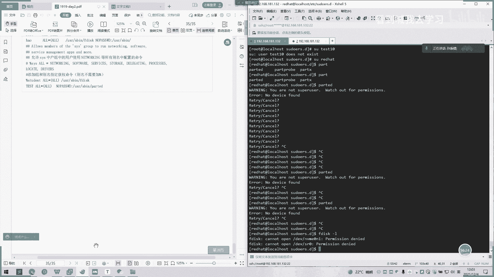

打开一下。呃，I do。三。

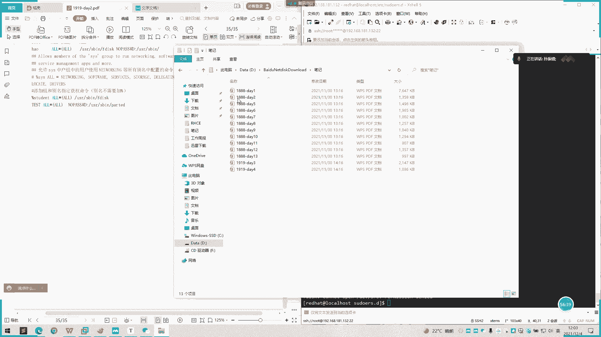

我们打开呃第三点一个内容，我们讲。呃，讲一部分吧，我们一直讲到12点半，讲到一部分，然后我们直接去实饭。这里第三天我们开始讲一下呃监监控和管理落实进程。然后至己。等嗌声。呃，什么是进程呢？呃。

我们这为呃文名叫process，没有运行中的一个程序的副本是被载入内存的一个指定的集合，就是资源分配的单位。就是说呃这个进程就是一切种校校长段去执行，或者说你抓跑的哎自己写的代码跑放放上去跑的这些。呃。

运行啊首要出来东西就是一个进程。然后进程的东西有几个有一个进程ID呃，我们称之为一个process IDD而称置为简写是简称是PID一个他说一个号码，就是说。嗯。号码。有ID员号码？

要U这里还要显示UID跟GID没错，就是我们所说那些啊用户啊，用户所属用户跟所属用户组嘛，然后还有一个电防火墙语境决定对文件性的存储和访问。你。

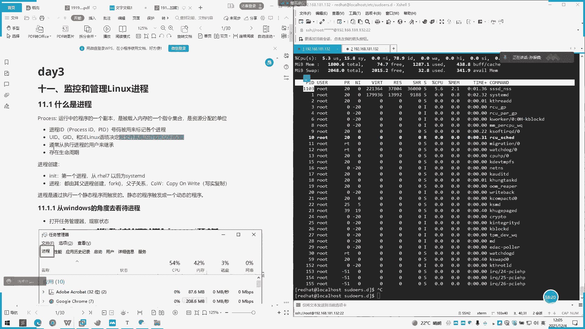

通常从执行的进程中来继承，还有可以存在一个生命周期。生命周期的话，这我们这里用套可以看看到这是这有个执行的时间了，这道执行多久啊，这一回看到。所说他也所说什么就是这个意思。然后还有个进行一个创建嘛。

也要。第一个进程。啊，这个命这个就是一个第一个技能，大还能不能找。这是一个linux启动的时候，一个执行的进额就是这个。好像是没有了。他是一个初始，从下其有什么st。没有的话，好像这个。

然后一开始系统说进来系统执行的话，就开始执行这个就这些什么定时啊，然后这些。啊，警告警告的这些东西，然后lock会打印啊，这些东西都会打印出来。你要从windows的角度去看，就是我们的任务管理器。

我们的一个任务管理器上面也呃跟跟new上面是类似啊。

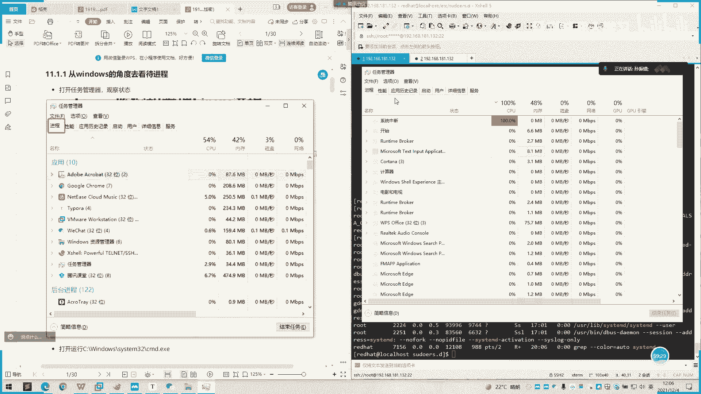

可以看他用户啊什么的。要不要我打开一个。

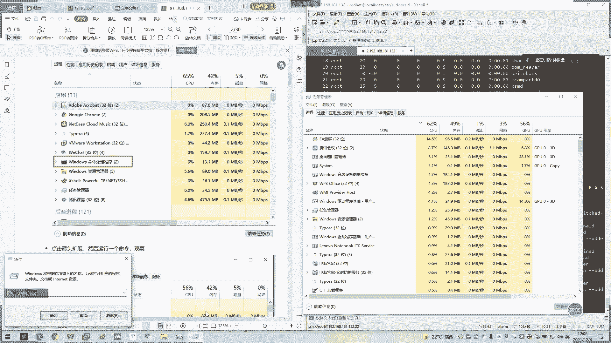

C机。系你个先啲。啊，哎，这又听不见。

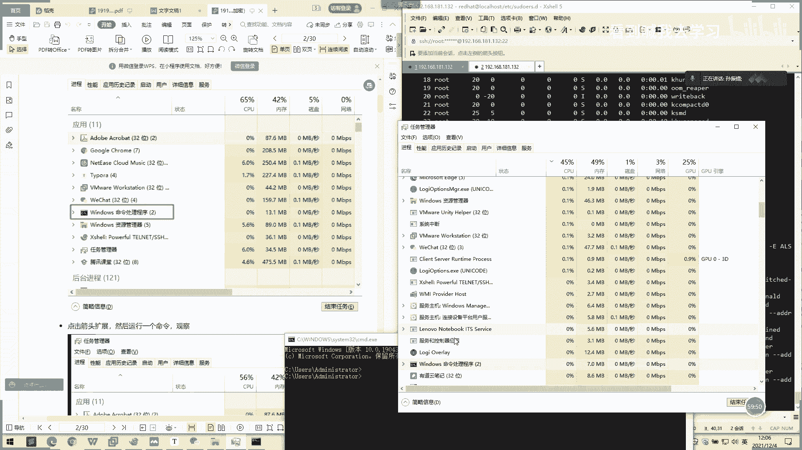

当天自己的话打，他就在。

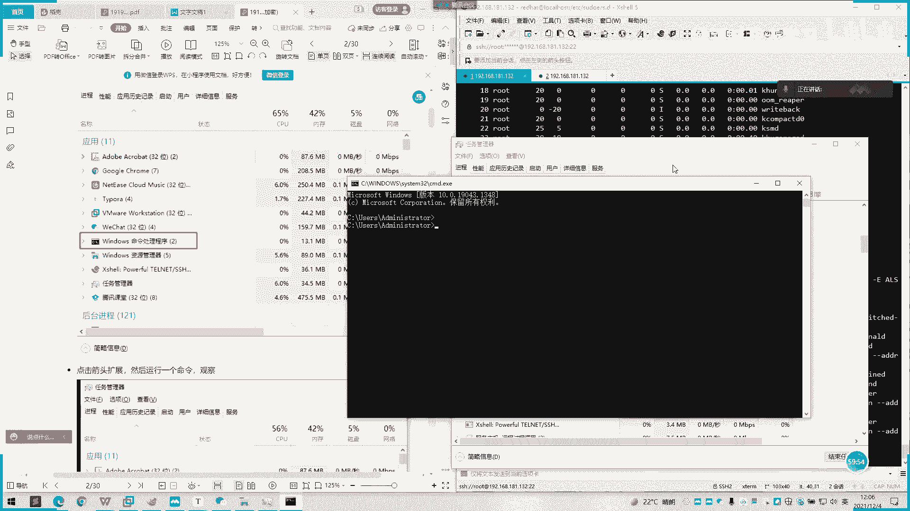

点击运行个命令关察。

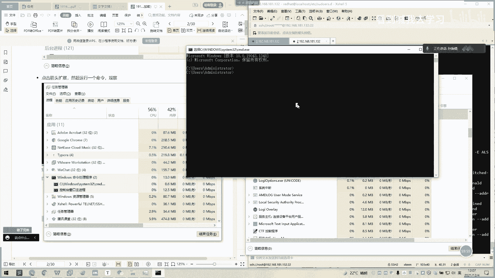

就是这个意思。进程是动态的，因为我们在我们的性能这里可以看到。呃，我们这内存吧，内存内。可以看到我们这些什么各种缓冲池啊。啊好CPU啊，这己进城这里看CPU啊，现程是300多啊这些的。

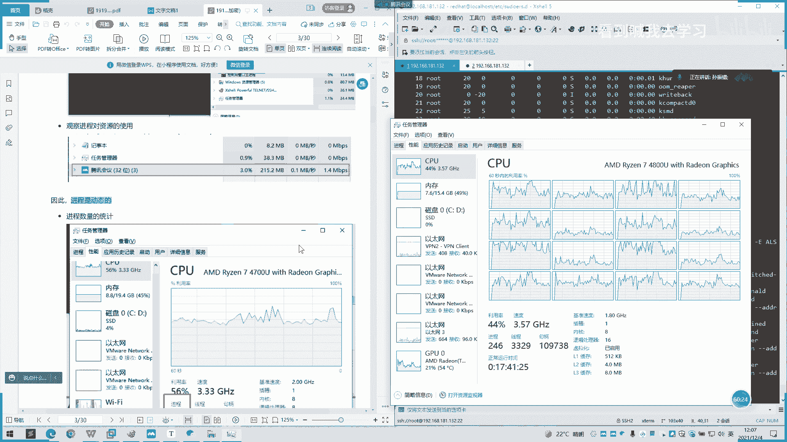

进程输入统计啊，这里然后linux的话，这边可以用套命令去看。QPTP看一下。嗯。他说进程是通过一个运行静态的可执行文件。概念上面说这样子从而生成一个动态的一个进程，这概念是这样子。TOP我们可以看到。

然后如果呃TOP也简单说一吧，TOP的话，如果说我们按数字一会会有一个是吧，1个0。啊，我现在是CB哎，我分的CPU是0个啊，所以说它这己CPU是0啊。如果是啊比如说分两个核或者是32核的话。

这里这个位就显示了两个还是三个核0的话从0个核开始穿起。我想呃有top的话，想看，就是说看当前内存的一个排序，就由由大往下排了时太烟了。I am I am。啊。中门MM编编编编制单门M是双门。No。

啊对。是。For a memorable。哦，那这里。点按几次的话，它会显示一个啊参数，会有一个调出吧。这个内存的这个处理查一出。如果大C大C的话就CPU嘛，大C啊这很傻瓜啊。

这大C啊大C都列列出CPU最高了嘛。大气你可如果是shift福系啊，就变成大溪嘛。你自己去。说一下。主要透面力就是看内存跟1个CPU吧，还有个进程号是吧？你当你反这个比如最大内存啊，去用快捷键去弄出来。

或者是GPU这些的话，你要是看当前1个PID是吧？那我们用个PGG。这是没有。응。然后这com commonmon的话，就是那些执行执行文件嘛，就是执行文件是什么？

证名名名称执行啊执行进程那个名称就在这里。你这个发给我。s沃呃，拿防火墙按例子吧，放一个防火墙。嗯。Statities系。诶啦。这个IT的。好像是开启的。然后他这里有个PID。EID我们也一下喽。

解一下。对。是吧那什么鬼的，这些什么卖神啊。就在这里，这可以P一下。然后这里说一啊第一个终端执行，然后这里有话都不再演示了。刚刚那个用方法夹去演示就可以了。一样的，然后这里有个进程拥泳者。

进意思是进程的在读取或者写入文件时候，是采取这个拥有者的身份去读取呃读取和写入了之后，你这个进程拥有者之些他他就会根据这个身份去读取和写入。通常情况呃，所以针对读取和写入的这个拥有者必须要有权限。

通常情况下进程的拥有者为执行者。就那个X就我们身上的X，比如一些服务啊，通常就尽程又在配置文中指定未该服的系统用户啊。是同用。就这个用户是哪个执行的嘛？就说root用户执行啊。

还是root用户执行啊这些的。

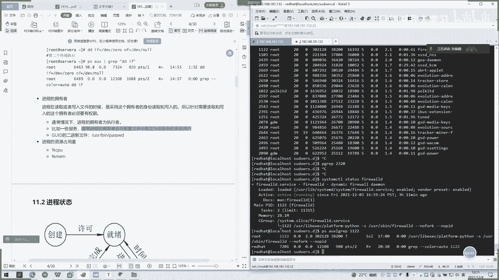

进腾的资源占用啊啊，这刚也讲这个。真是没有哦。Thememorial这意思。

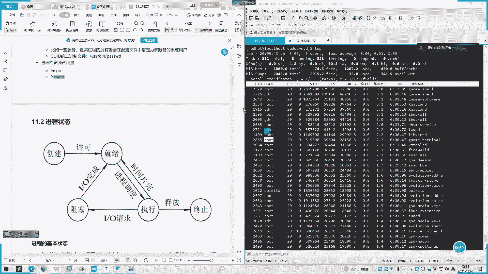

然后这有个状态呃，状态大家可以看一下，一般创建进程也要得到一个linux一个许可，然后它会。啊，只进一个就绪状态。然后就续完之后，他就可以去执行啊，有没什么问题的就可以去执行。执行于我们手动释放的话。

就会进行一个终止。如果说有IO请求啊啊，比如有东西请求下来，我们应该可以一开始先处理去先去处理，所以所就入稍稍稍短的一个组织状态。这种就是感知不到了，几乎无感知了。如果说你的程序没问题，就无感知了。

然后完成又进入到就绪状态。然后一一有东西调度啊，又又进行一个执行状态，就一直这样子这样子循环反复循环这样子。然后这里有一个呃比较一个说概念，创建进程状态，进程在创建需要升请一个空白的PCB。

然后我们称之为进程的控制款，向其中写入控制和管理进程信息完成资源的分配。如果创建工作无法完成的话，比如说资源无法满足啊，就无法被创建调度嘛。嗯。此时进程所到状态为创电状态。那就绪状态呢。

进程已经准备好了，已经分配到需要的资源，只要分配到CPU智能力立刻执行执行状态及进程处于就绪状态被调度后，进程就进入执行状态。阻塞状态正在执行的进程。由于某些IO请求啊或安全失败而暂时无法运行。

进程受到阻塞。在满足条件时就进入就绪状态就等待系统调用了。但实体的话，他会呃呃无感知会进行一些阻合。一开始有请求他会还是会进行一个阻塞。因为它要进行一个在一个CPU调度一个过程中。

它是会有一有一点点阻塞，但是这都是感知不到的。然后这有个终止状态，进程结束时后出现呃错误，报备系统终止，进入这个终止状态，无法被执行。比如说我们呃手动释放或者是终止自动会被释放。

就是说有错误报错会自己释放这样子。然后这海螺进行了更多的一个状态，然后运行状态，一个 learning脸，还后一个睡眠状态呃一个。因为我这边有这默认是SD下划线，我这可以看到吗。这也看不到。对。

所以两种一个。去了吧。上息。嗯，这看不到我们PS下。别手了，看一下这页面。嗯，不可中，但是。这个停止状态是大T stop，然后占停于内存，它不会调度，是非手动启动，僵死自己起僵死状态只是进程。呃。

附进城结束前，指禁城不关闭啊，沙子附近城可以关闭常尸状态的指禁程。然后这里的话有个。啊，这有个例子啊，要base，然后在这里S。开始就是睡眠状态。

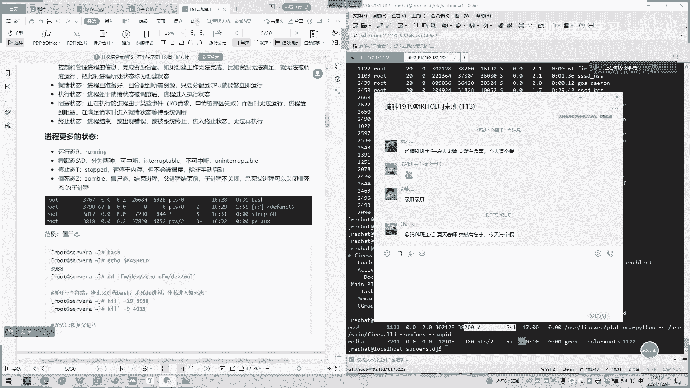

欢迎没有人。哎，这有个内种看一下配置。等一下被换一个。A唔讲 a。P i d。124548，然后我们滴滴。系。嗯于 ev。0度。YF等于DVV呢。调解。啊，再开一个终端。咁即咁开过一个钟。啊，刚刚的是。

78，我们当前那个贝ase下面是728，那我们Q一下，哎，我们先PS1下，PS一下。好是吧。O。哦，这有个被啊，就是你是我们当前开的这终端主是吧，那我们就掉。啊，所以用6个19我们根据他的操作。知到了。

就是被终止了。这以显示到了。查安原来进展在不在？杨现长还在。

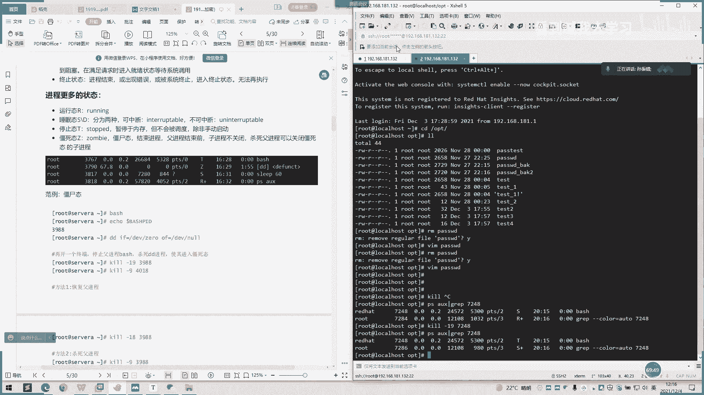

只是停止了我们就说停止了这个命令。

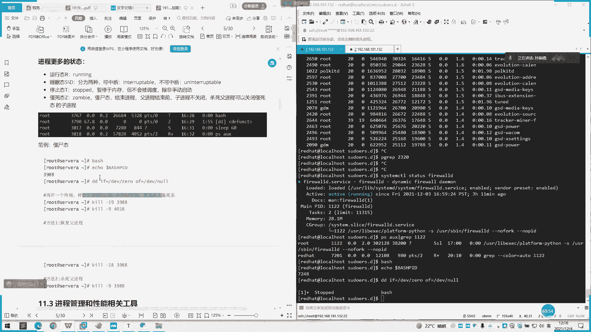

有个恢复呢，恢复就是。没。18。对。

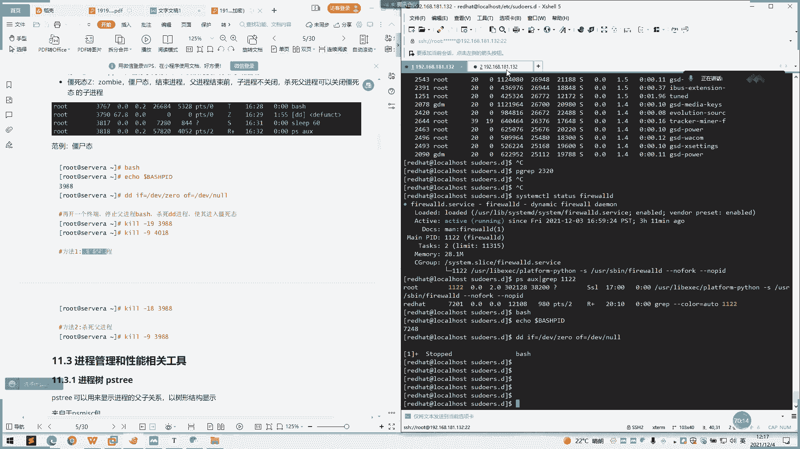

欧班嘅。回复的18那我们看这有没有这个。还在。这他还在，他一直执行下去了，我们刚刚执行那个命令，他还在又回复了。Q杠9是直接干掉了。这是强制杀死。不感觉什。一一个。被直直接被Q了。

跟跟19呃跟我们执前19的时候是不一样的，19是一个只是一个sstore的一个东西。然后呃Q杠9是直接这边直接一个Q就没了。其实一个Q，然后就没了。强制如果是优雅的话，就是直接Q就行，直接Q然后加个。

呃。加个PID就OK了，这个是优雅的可说。杠九是强制退缩，不管你呃东西还在不在跑都Q住啊。然后Q如果不加杠9，就是单单Q的话，就是等你等你进程弄完的东西他才退出这样子。然后有个进程数啊，PS区。

这个比较。电去。对啊，这个就不好了。就把当前的这些进程或者附进程都打印出来。在这事情下面呢有些什么进程在启用啊这些的。显示PID啊，然后嗯看一下。喂。看邀请报钱是多少。帮我想。

然后嘛看一下别去呃1122。啊，想fire。一样的。这里说腰啊这里有1。那我怕打印太多了。

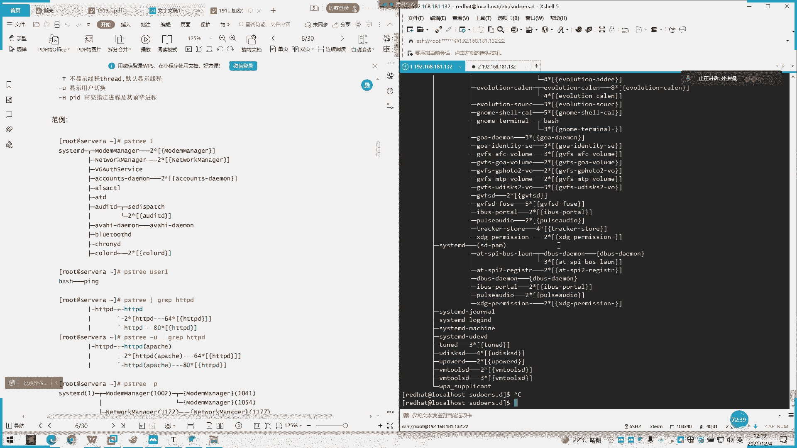

你看房学想请。看你高量显示高量显示。一大需啊。冇。所以有点多啊。我事。

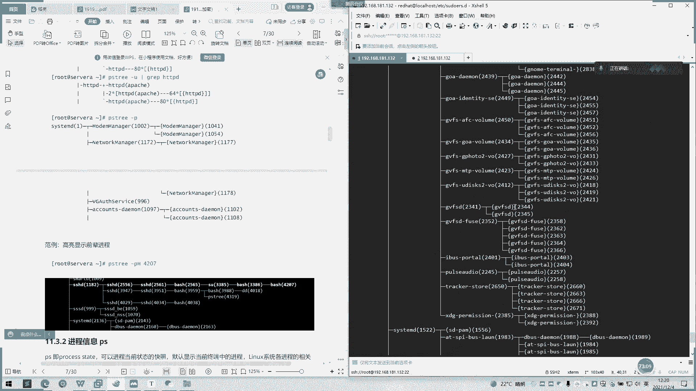

嗯，这你们可以自己看，好像自己看的不太直观。然后进程信息就是PS啊，就是我们刚才说的PS可以当前进程当前的快照默认暂时显示当前终端中的进程windows系统各个进程的相关信息均保存在呃。那就播下面了。

我们可以看一下。哦，所以很多，这这里个文件夹呢，你看这这个就是代表一个进程号嘛，文件它用进程号去创建一个文件夹，进统创建文件夹。然后里面呢呃就是它所运行的一些文件啊。

是因为 news就是一个呃新语言写出来嘛，他可能就把这些这些都是新语言文件。新有件文件编译以后就说运行起来就是这样子。呃，这里比较实用的一点是。我是这个我等一下。s pro啊说。当你知道。

那你在top这里，你知道一个比如说知道一个程序，我不知道他在呃哪个项目目录下面。哦，那我只要知道他的PID我就可以去。呃，去他当前目录下面，然我们。有为EX已这样，是他这里会直接软链接。

会有一个软链接软链接到呃那个目录。哎，就是执行文件那个目录下面的。EX1就跟我们是一样的。呃，我看一下有没有例子啊。system吧，那我们。啲。发咗。有。嗯。哦，是吧。

滴滴我刚我刚才在那个运行了个滴滴命令，他就把那个。命令的路径直接打印出来。然后这也是他一个路径都有。这话就呃相当于来讲就是说不知道进程可以，我怎么去，我不知道进这个执这个脚本在放在哪里的话。

我只知道执行了这个脚本的PIDV通过这个。呃，如嘉面的一个。找到一个进程，然后进程直接点进去，我们可以看到。可以看到他的一个项目文件在哪里的。

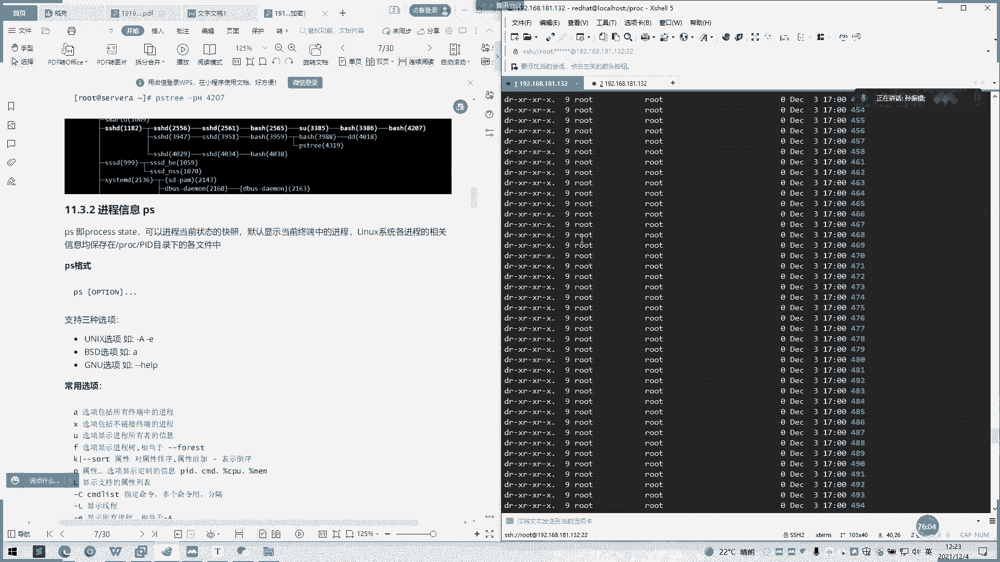

这边也是。哎，比较实用的是这个操作，经常用的就是这个可以可以当前进行拍照，信一版在PIT上面给我们念总。然后这里也有一些选项。嗯。指定命令多命令中分格显示进程。嗯，PS杠2。这些。

放C可以指定一些命令啊，比如说hell啊这些的。发照片。这旅有。然后这显示时候进常相当于。F。诶。用。Pickets。PSS嗯组合来讲，要么就是按EF。那EF要么就AUX前面加com。

前面加com就可以了，都是一样的。一般的话。便一点都不下干了。要有呃AV，那我们就re嘛，他打他已经打印出来，那我们通过过滤管道加个过滤有那些。做1个PI提材还是可以看到这样子。要使用这些。

组啊显示组啊这些。这可以下去自己去敲看一下。啊，这里有个输出。PSSEF显示列息。我识别有。表示是不有应用利用率啊。先末吧。那这里。哦。CPU啊，这个CPU啊。都不过只观了。

然后这是什么star这些进程这些这些状态，这些都是有UID啊，LPID啊PPID啊。常乐组合啊所常用主合就是AX。呃呃，跟E。Yes。因为。啊 e。声音。SH。A o。你啲子。就打只是打印EO的话。

就可能打印PID啊。Face。没有。没。这有一个历子。即系睇人。竞争的特性。然后这里可以根据。这个区需要去排嗯。你同话。哦，这有个排序啊，才讲到1个12。收紧 k。可以结合这些排序。呃，排训明天去排序。

但这就是一个top一个。一个大人就搞定了事情，搞的这么复杂干嘛呢？所以这些大家知道就好了啊。😊，大家知道就好了。我实际操作中的话呃，脚本用的比较多，脚本会用这些可能比较多一点。

但实际话确实用脚本用PS的话比较方便。但直观的话，比如说正常来操作去需自己去看的话，用top然后加个杠这些其实就OK了。然后这里还有个查看进程的信息。这些也是。没关系，这明天也是。调太阳。

我么输1个PID啥的。我睇嗰路。啊，找一个，因为刚刚这个728。争去。不这样。好，那这里会打映一些信出来，比如说我们的进程名叫滴滴，然后CPU目前账位是多少？然后这些什么TDD啊终端是什么鬼啊？

然后那个程ID，然后他的主ID是什么？sction啊ID这些都有。然后下面这一列的是。嗯。四月快还。哦，这是附近城吧，你后是紫金城，紫金城是领的附近城就这些。CPU时间呢这些都有。

这边后面就对应到这里啊。你 guess。嗯，memory是多少？一般。这个比较适用我看java吧。java的话可能会详细呃看java经常详细记载这些什么之类的。啊啊这些的。内存空间大类的。系觉得啊。

这里话就直接竖了，这很好看一点。但是那个显示是一样的。搜索进程呢应该是grarePS加grare。嗯，好嘞。需2啊。知。如果是PG不类的话，那就。只打印个。嗯滴滴。就打印这嗯。好像也不太。SH吧。

看个SH。只打印一个呃机场I这也没有。依据。现在什么时间？没有，暂时不行了。好。找找啊这个东西。他只能打打命令啊，这样子讲，你看。但我不知道我我我不知道。这啥意思哦？你看这二0吗？你看一下。嗯。

啊有DD关键字的都会打印打印出来。当前BDD关键字的当前进程的进程号都会打印出来。所以这个。这知道就好了。啊这也有个什么优势啊，这些的。即有咯哦譬如。晕死了。那我这里是贴了个。系想。没有啊。

等于两个case思看一下。我出去。嗯，赶紧进神。就阿 you。滴啲命令。加个L小L加U。有个AU是吧。第一是打印呃整条命令执行的纸条命令都会打印出来。嗯跟多 p i d系咪其他。没他批就是进城嘛。

你有进去。但是不会太你出。Yeah。没有。嗯。base他把b才能打印这个东西出来。A t是。a p s t。天我没。可拼个百度那。系冇知我大应。3。有奇葩，然后还说了一下是。BDO。按脚本名称去查找。

个 h t t p。嗯能。就3万。啊，正没子病。ok。反因我们各种。就刘害的用户一直在拼啊。嗯。就跟是一样的，我一直在配，他就他就打印出来。然后这还有个负载查询uptime。安前时间。三个预有所在用嘛。

就是统计呃整个系统的一个。使用一个情况，然后这复杂1。41。31。330。19啊这些的。呃，他是说呃系统平均负杂是。155分钟的平均覆来一般不超过一超过50，建议报警。然要系统平均负载。

只在特定时间内运行的平均进程数，通常每个CPU内核的当前网络进程数不大于3，那么系统是良好的。要说你当前有。你电脑有1个CPU就是多少核嘛？呃，一盒CPU那就你这里显示的就说后面这里显示的不能大于上嘛。

一般是一点几或是2呃一点几这样子2的2点几的话可能就有点高了。然后的话。每个性能他这里说。内核的任务数大于5，就超超过超过3。呃，大于的话，那那肯就有问题。啊，top宝类也有用。唔汤我介绍。哦我这里是。

啊，这也就是望这些这些参数可以。啊，一般是一点几这样子，那看 high最高是多少个峰值嘛。嗯，这有说top。介介绍top一个命令啊，提供动态的一个实时进程状态，有许多内置命令。啊，这些我们就不敲啊。

大批啊已占据CPU。内存百分比啊低啊是累计CPU时长啊。啊，算。嗯。按I的话就是当前那个套就有显示是吧，我们刚刚打印的那个。被显示出来。然后他是别较啲嘛。一。有几种变化，一个是那种白条。这样子这样一。

CPU数字分别值一。里面有数字按一啊，按一就是这里。阿一所以这从有保盒你就可以看到出来。啊只有听吗。脚印。小完子只有。比较直观一点，小于这种显示啊这些东西。再按一下，它就会变白。QQ就是退出啊。

退出top一个命令。啊，修改刷新时间就是呃因为这下面一直会刷新嘛，你可以修改呃要刷新一下。那都不会吹了，抓你那么快，就慢慢5秒。看小S，然后这里看到没有？看。看我设置了个5秒弗了蒙，然后再设个10秒。

等一下小孩。是是。那你说。然后信息栏这也可以说一下。嗯。USUS对这里，我们看这里US就是用户空间，然后这个SY呢就是代表一个内核空间。嗯。那个。小NI呢就是调整一个来时间。

就是说调整这整系统自动去呃调整这个负载的一个时间。你要空闲的ID就是空闲。比果说你自里。呃，风学还是有，好像这里比较满。手这也比较灵，位置很大IO。等待是0，有当前没有等待了吗？因为是。硬中断。

嗨C就是软中断。然后我们ST就是虚拟机透得的时间。啊，这一块不用联心。那我们看主要看前面这一个。这几个。然有这几个就行。然后这里还有个指定刷新时间DD啊呃你样。一样按丁。全部定单。分闭都准出啲什么。

然后先刷新多少之后退出。2015至支持了退出。语音。嗯。刷新50字以后就出来。O。这两个是率是吧？好不看低。嗯。看看来我是。那指定三星，三星的时候5次退出。间隔间隔刷间隔5秒嘛，然后刷新5次退出。

OK这是top命令的进程这一块的呃说完了啊，我们下节课呃下午去再讲一下。呃，下一张内容，新特性啊呃新特性这。不可是个命令。先，今天内容先上到这里啊，上午内容先到这里，我们下课。

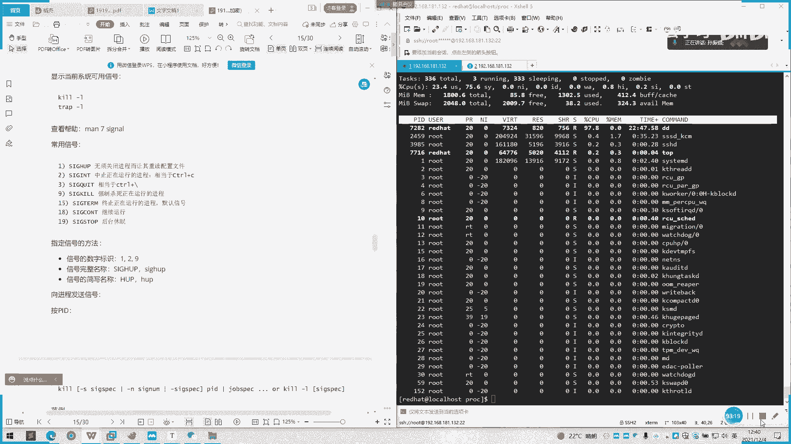