# Linux权限与进程管理：P18：day3-2

在本节课中，我们将要学习Linux系统中的文件权限管理和进程监控的基础知识。我们将从如何查看和修改文件权限开始，然后了解进程的基本概念以及如何查看和管理系统中的进程。

## 文件权限管理

上一节我们介绍了Linux的基本操作，本节中我们来看看如何管理文件的权限。使用 `ls -l` 或 `ll` 命令可以列出文件的详细信息。

```
ls -l
```

输出结果的第一段信息包含了文件的类型和权限。第一个字符代表文件类型：`d` 表示目录，`-` 表示普通文件。随后的九个字符分为三组，分别代表文件所有者（owner）、所属组（group）和其他用户（others）的读（r）、写（w）、执行（x）权限。

### 修改文件所有者与所属组

以下是修改文件所有者和所属组的命令。

*   **`chown`**： 用于修改文件的所有者和所属组。
    *   基本语法：`chown [选项] 用户[:组] 文件...`
    *   示例：`chown lihai passwd` 将 `passwd` 文件的所有者改为 `lihai`。
    *   默认只修改指定文件或目录本身。若要递归修改目录及其内部所有内容，需添加 `-R` 选项：`chown -R lihai /testdir`。
    *   可以使用 `--reference` 参数参考另一个文件的属性来修改：`chown --reference=file1 file2`。
*   **`chgrp`**： 专门用于修改文件的所属组。
    *   基本语法：`chgrp [选项] 组 文件...`
    *   示例：`chgrp root passwd` 将 `passwd` 文件的所属组改为 `root`。

### 文件权限说明

Linux文件权限主要针对三类对象进行设置：所有者（u）、所属组（g）和其他用户（o）。用户的最终权限从左向右顺序匹配。

权限字符含义如下：
*   **r (read)**： 读取权限。对于文件，表示可以查看内容；对于目录，表示可以列出目录内容。
*   **w (write)**： 写入权限。对于文件，表示可以修改内容；对于目录，表示可以在其中创建、删除文件或子目录。
*   **x (execute)**： 执行权限。对于文件，表示可以将其作为程序执行；对于目录，表示可以进入该目录。

### 修改文件权限

除了用字母（rwx）代表权限，也可以用数字（421）代表。读（r）= 4，写（w）= 2，执行（x）= 1。

使用 `chmod` 命令修改文件权限。

```
chmod [选项] 模式 文件...
```

以下是 `chmod` 命令的使用示例。

*   **数字模式**： 直接设置权限值。
    *   `chmod 777 file`： 赋予所有用户读、写、执行权限。
    *   `chmod 755 file`： 所有者拥有全部权限（7），所属组和其他用户拥有读和执行权限（5）。
    *   `chmod 640 file`： 所有者可读写（6），所属组可读（4），其他用户无权限（0）。
*   **符号模式**： 针对特定对象增减权限。
    *   `chmod u+x file`： 给文件所有者增加执行权限。
    *   `chmod g-w file`： 移除文件所属组的写权限。
    *   `chmod o=r file`： 设置其他用户只有读权限。
    *   `chmod a+x file`： 给所有用户（a）增加执行权限。

### 特殊权限

除了基本的rwx权限，Linux还有三种特殊权限位。

*   **SUID (Set User ID)**： 当具有SUID权限的可执行文件被运行时，进程将以文件所有者的身份运行，而不是执行者。设置方法：`chmod u+s file` 或 `chmod 4755 file`。
*   **SGID (Set Group ID)**： 对于目录，在此目录中创建的新文件将继承目录的所属组，而非创建者的主组。设置方法：`chmod g+s dir` 或 `chmod 2770 dir`。
*   **Sticky Bit (粘滞位)**： 通常用于共享目录（如`/tmp`）。设置了粘滞位的目录，用户只能删除自己创建的文件，即使他拥有该目录的写权限。设置方法：`chmod o+t dir` 或 `chmod 1777 dir`。

### 文件特殊属性

`chattr` 命令可以设置文件的特殊属性，使其免受某些操作的影响，即使root用户也不例外。

```
chattr +i file  # 锁定文件，无法删除、修改或重命名
chattr -i file  # 解除锁定
chattr +a file  # 只能追加内容，不能修改已有内容或删除文件
chattr -a file  # 解除只能追加的限制
```

### 访问控制列表 (ACL)

ACL提供了比传统UGO模型更精细的权限控制，允许为更多用户和组设置权限。

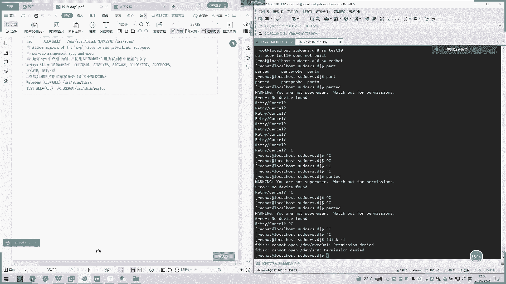

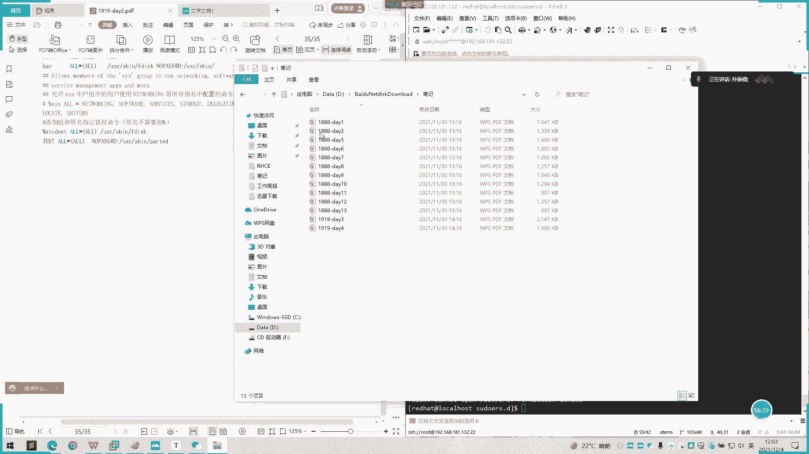

```
setfacl -m u:username:rwx file  # 为用户设置ACL权限
setfacl -m g:groupname:rx file   # 为组设置ACL权限
getfacl file                     # 查看文件的ACL权限
setfacl -x u:username file       # 删除指定用户的ACL条目
setfacl -b file                  # 删除所有ACL条目
```

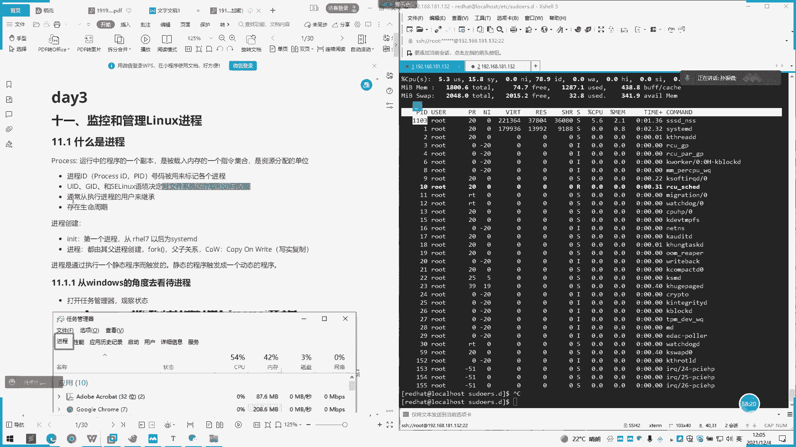

### 权限提升：sudo

`sudo` 命令允许系统管理员授权普通用户执行特定的root命令，无需分享root密码。

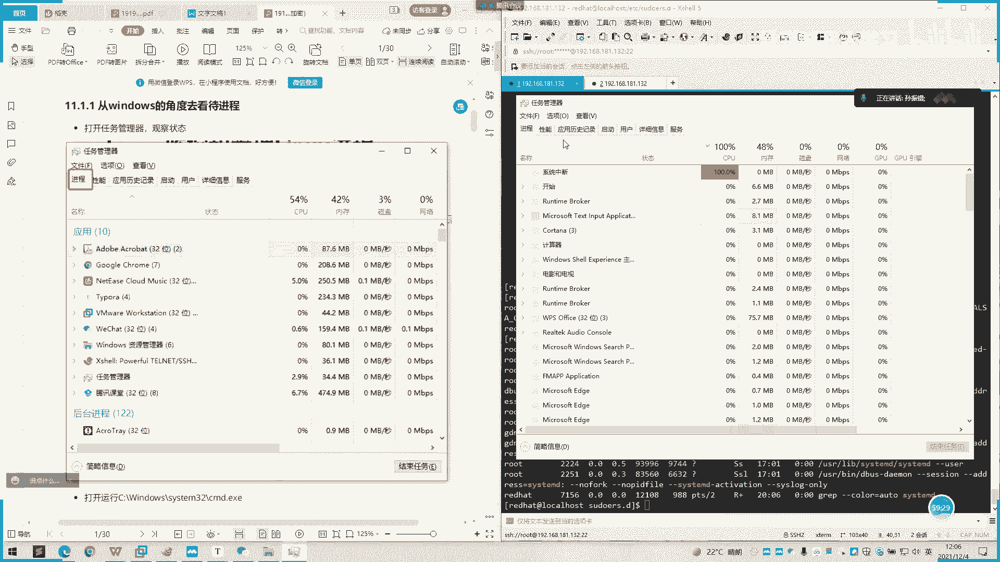

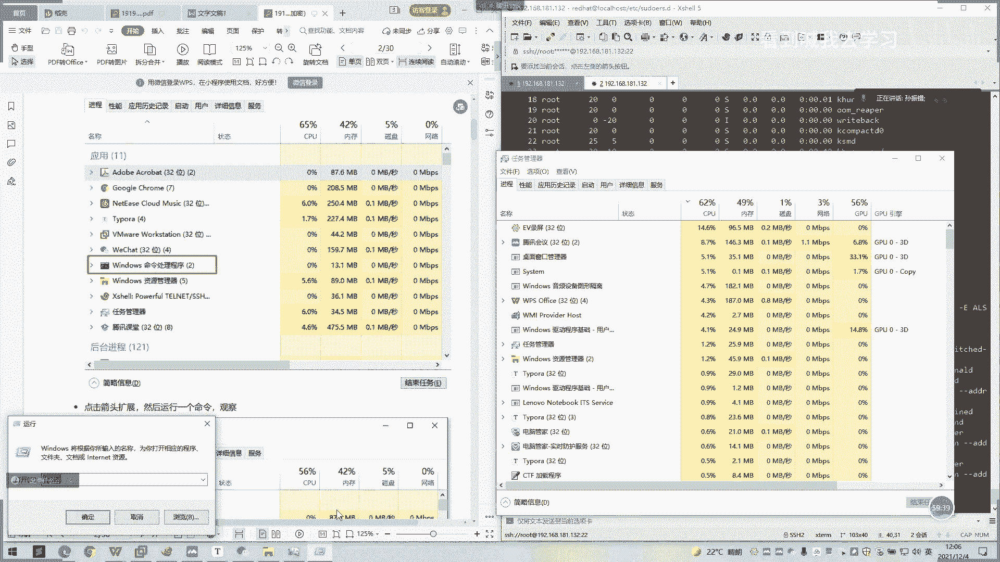

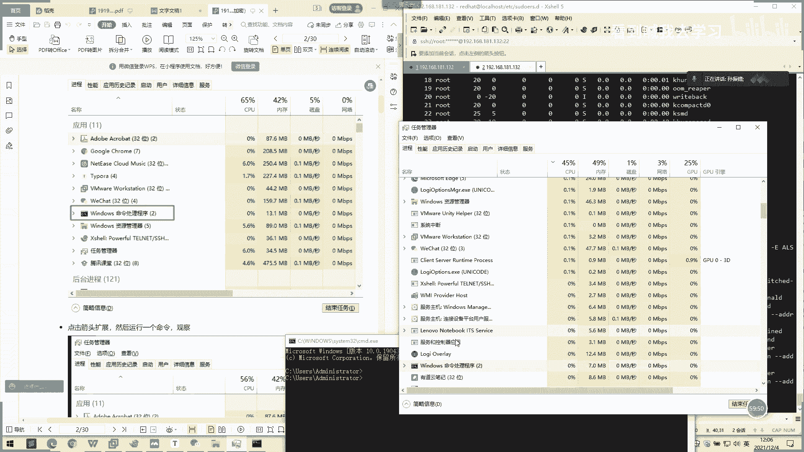

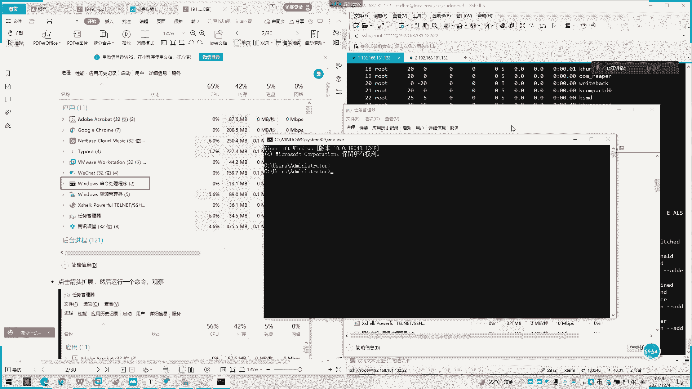

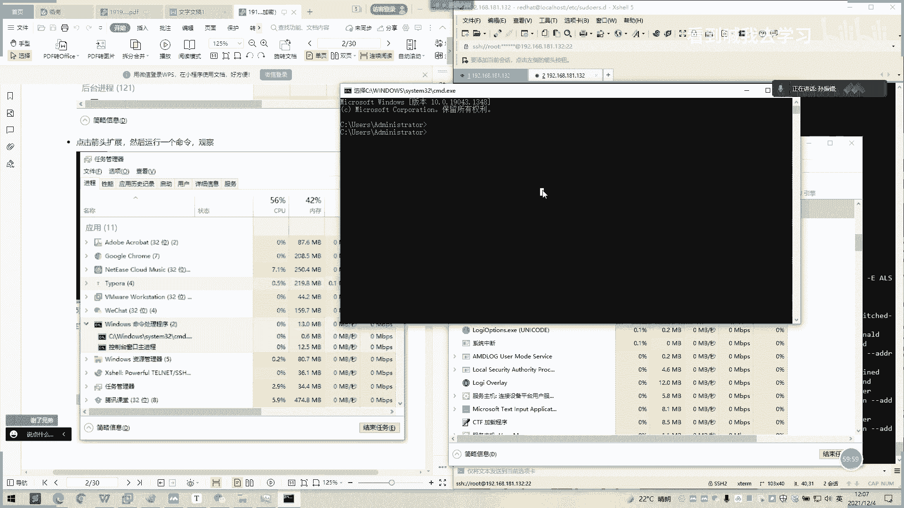

配置文件位于 `/etc/sudoers`。编辑此文件需使用 `visudo` 命令，它能进行语法检查。

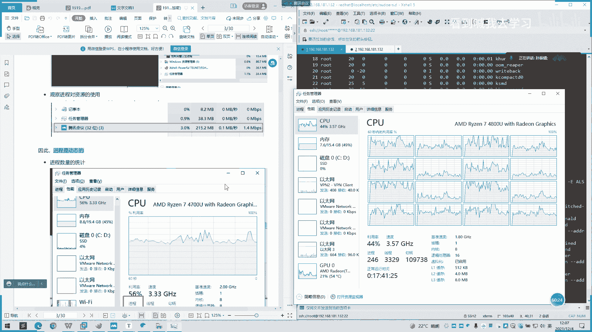

在 `/etc/sudoers` 文件中添加如下行，即可授权用户 `lihai` 执行所有命令：
```
lihai ALL=(ALL) ALL
```

授权后，用户 `lihai` 可以在命令前加 `sudo` 来临时获得root权限执行该命令。

## 进程监控与管理

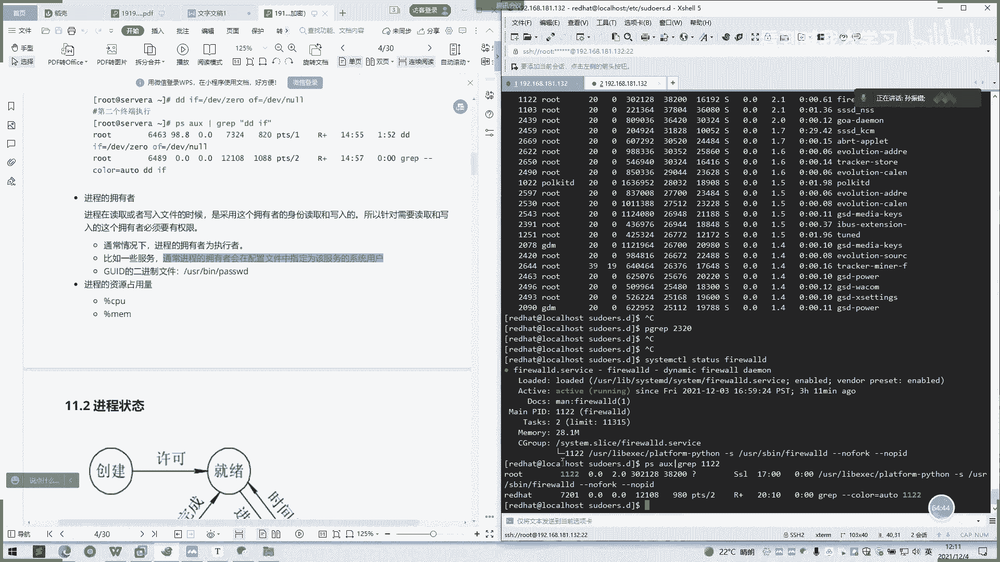

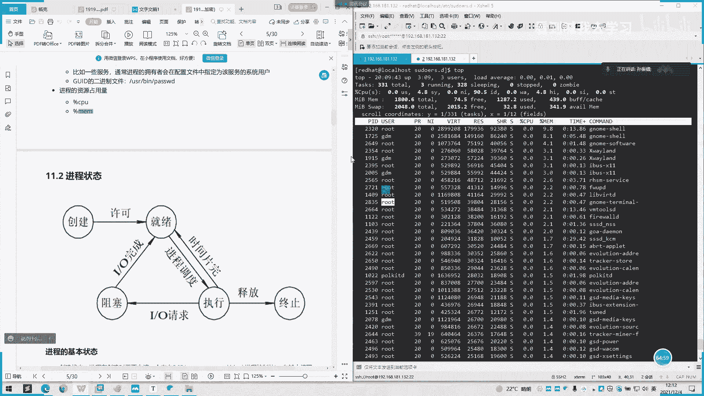

上一节我们详细探讨了文件权限，本节中我们来看看Linux系统中的进程。进程是正在运行的程序的实例，是系统进行资源分配和调度的基本单位。

### 进程基础概念

*   **PID (Process ID)**： 每个进程的唯一标识号。
*   **PPID (Parent PID)**： 父进程的PID。
*   **UID/GID**： 进程所有者的用户ID和组ID，决定了进程对系统资源的访问权限。
*   **进程状态**： 包括运行（R）、睡眠（S）、停止（T）、僵尸（Z）等。

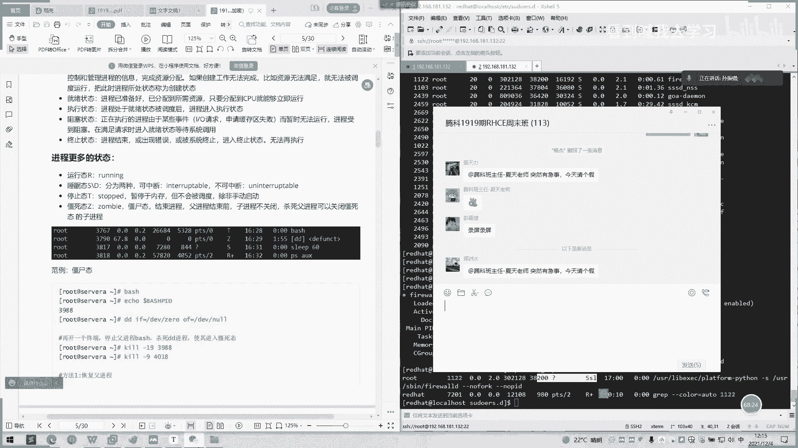

### 查看进程信息

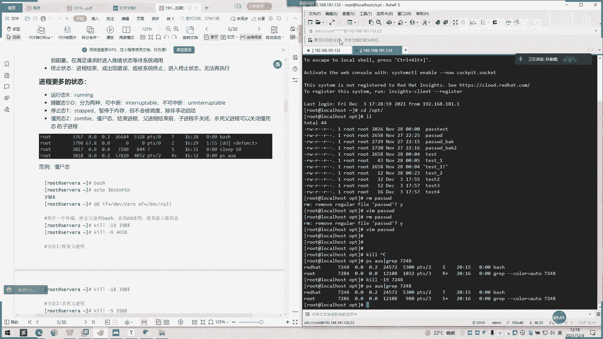

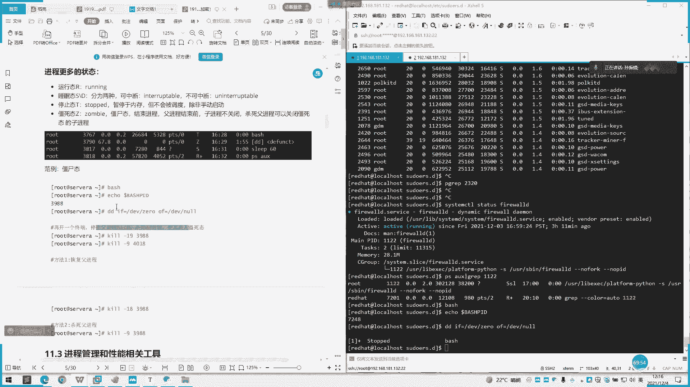

以下是查看进程信息的常用命令。

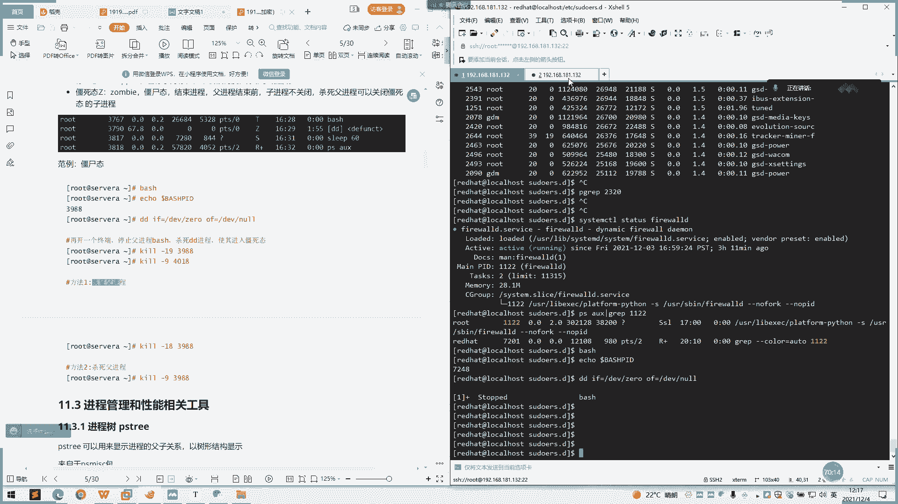

*   **`ps`**： 查看当前进程快照。
    *   `ps aux`： 查看系统所有进程的详细信息。
    *   `ps -ef`： 以完整格式列表显示所有进程。
    *   `ps -eo pid,comm,%cpu,%mem --sort=-%cpu`： 自定义输出列并按CPU使用率降序排序。
*   **`top` / `htop`**： 动态实时显示进程状态和系统资源使用情况。
    *   在 `top` 界面中，按 `P` 按CPU使用率排序，按 `M` 按内存使用率排序，按 `1` 显示所有CPU核心的详情，按 `q` 退出。
*   **`pstree`**： 以树状图显示进程及其子进程的派生关系。
*   **`pgrep` / `pkill`**： 根据进程名查找或发送信号。
    *   `pgrep bash`： 查找名为 `bash` 的进程PID。
    *   `pkill -9 firefox`： 强制结束所有 `firefox` 进程。

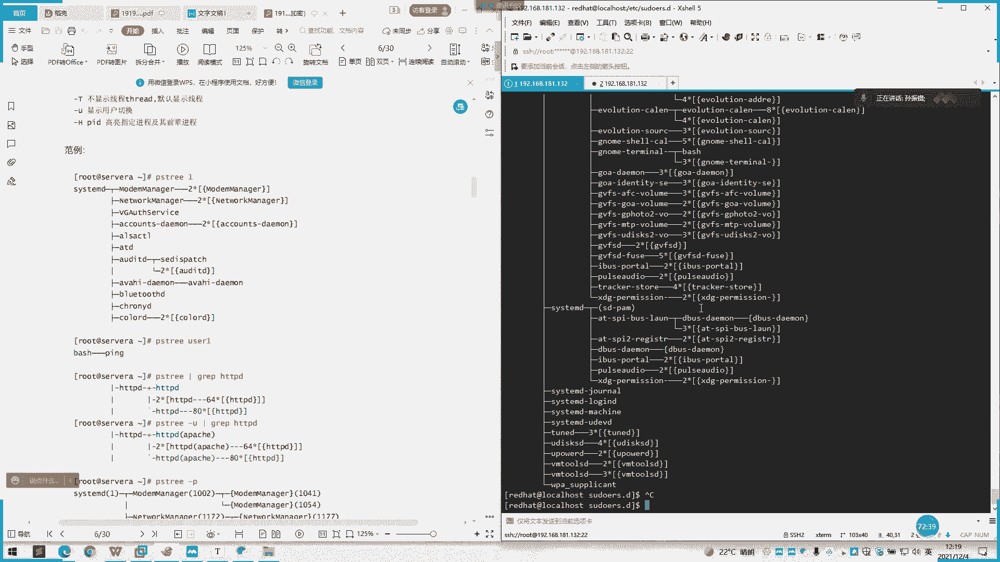

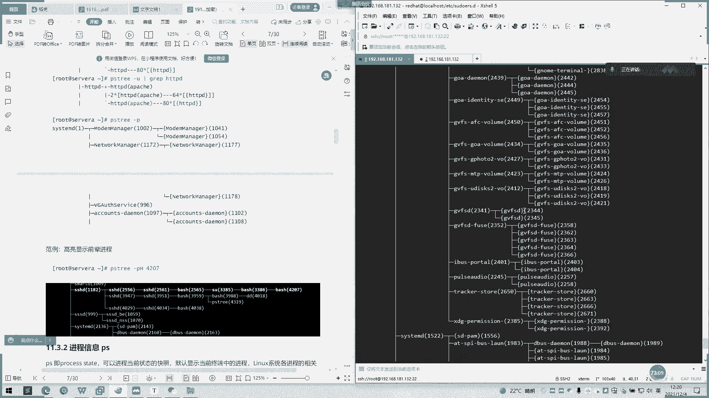

### 进程状态与管理

进程的生命周期包括创建、就绪、运行、阻塞、终止等状态。我们可以向进程发送信号来管理它们。

*   **`kill`**： 向进程发送信号。
    *   `kill PID`： 发送 `TERM` 信号（15），请求进程正常终止。
    *   `kill -9 PID`： 发送 `KILL` 信号（9），强制立即终止进程。
    *   `kill -19 PID`： 发送 `STOP` 信号（19），暂停进程。
    *   `kill -18 PID`： 发送 `CONT` 信号（18），恢复被暂停的进程。
*   **`jobs`， `fg`， `bg`**： 管理后台作业。
    *   在命令后加 `&` 可使其在后台运行。
    *   `jobs` 列出当前会话的后台作业。
    *   `fg %1` 将1号作业调到前台运行。
    *   `bg %1` 让暂停的1号作业在后台继续运行。

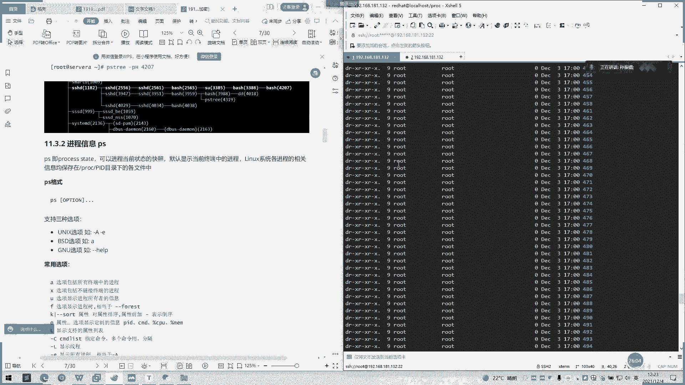

### 系统负载查询

`uptime` 命令可以查看系统运行时间、用户数和平均负载。

```
uptime
```

输出中的“load average”后面的三个数字分别表示系统在过去1分钟、5分钟、15分钟内的平均负载。对于单核CPU，通常认为平均负载持续高于1就需要关注，高于3则系统可能已经过载。多核CPU的负载警戒线相应提高（例如，4核CPU的警戒线约为4）。

## 总结

本节课中我们一起学习了Linux系统管理的两个核心部分：权限与进程。

在权限部分，我们掌握了如何查看和修改文件与目录的所有者、所属组及读写执行权限，理解了特殊权限位（SUID， SGID， Sticky Bit）的作用，并初步了解了ACL和文件特殊属性（`chattr`）提供的更高级控制。

在进程部分，我们理解了进程的基本概念和状态，学会了使用 `ps`， `top`， `pstree` 等工具监控进程，掌握了通过 `kill` 命令发送信号来管理进程（如终止、暂停），并学会了查看系统负载（`uptime`）。

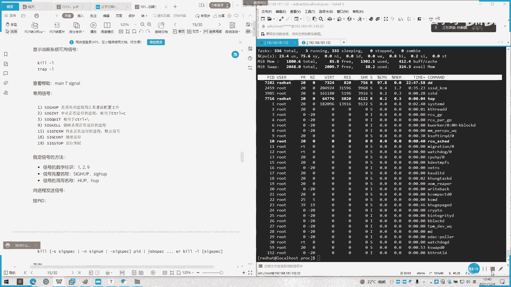

这些知识是进行Linux系统日常维护、故障排查和性能调优的基础。