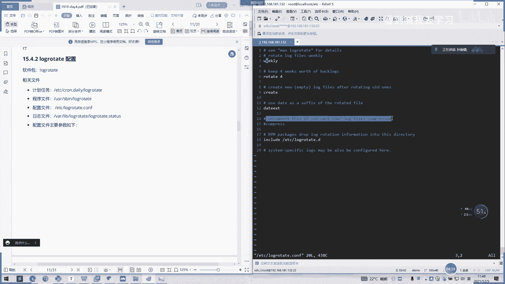

# 2022 01 最新rhce教学视频 - P19：day4-2 - 看到喊我去学习 - BV1Na411y7SQ

日志文件管理工具啊用来把旧的日志文件删除，然后被创建新的日志文件就成为一个日志个日志转存或滚动。我们一般称之为日志轮转，然后可以根据一个日志的文件大小，也可以根据其天数来轮转。

这个过程呢一般通过就定时吧，这个pro一个程序来执行的。它也是通过一个定时，然后每次去调它的一个这样个locgoate一个命令去做一个日志轮转，比如到凌晨啊这个pro你后凌晨执行，然后这个调就调会制它。

然后它就会去去创建新的一个日志文件，把原来日志文件一个压缩保存这样子。哦，这他这里下面有一个几个项一个计划任务。嗯。你看我们这有个EDCC data，它就是按天的嘛。比较好理解，是。就是。

它是不是显示一个点滴，然后点。daily这是天的嘛，点20，这是小时按小时，然后这点mon是按月按 week，然后就是按一个一周嘛。

好，一个是睡了一个。

接上。嗯。好。嗯。然后他有个。呃，计划任务嘛，这里面计划任务我们可以看一下，我们看一下填的。他是不是有两个文呃，两个可执行的一个文件，都是一个可执行的。然后我们看一下。是吧。

还是调一下这个lolog去看清。把这个消息全部打印过去。我们刚刚不是打了一个hello world进进到一个那SHD，然后这里也是一样把那个呃log里面的一个什么。啊，后面这一个参数啊。

他会把这个一个参数传传进去。这同你不管。我们主要看的是。当会儿。这也是一个。都是通过一个定时任务去启动的。然后他有一个程序文件，程序文件就是。Useual as been。哦在下面了。有个配置文件。

我们主要关注的是配置文件。好，我先编辑啊。好，我们进来一个配置文件，我们看到这些嗯我们直接看注释就好了。然后他手机一还要我们首先用man看一下它的一个使用啊，然后这是一个log five v呃。

是按天的嘛，相当于按按天去运转，按按一个周一个周每周都去运转这个日志。保持四周啊，key weeks worth off back，保持4周去备份，然后还有这。

braring new low fire就是创建一个新的文件嘛。啊，去I第一个旧的文件啊。

有不懂的同学可以直接百度就好了。啊，下去。在轮转旧日志文件后，创建新的一个日志文件，新文件日文件是空的。

啊，这什么？You study suffering。

嗯，再看一下。

寻找文件。啊，这有个参数，我们不知道好，我们先不用管它，我们再看一下这个下面是什么un call this if you want to low file compress。

如果要压缩日志，请取消对此的注释。

压缩日志啊，如比如打包成个借包或者一个哎套包的话，就把这个初字去掉。它默认是那就是默认不打包了嘛，默认只是把申成一个新的文件这样子。啊，这来个RBN他age做。哦，我们来看一下什么意思啊。

嗯。RPM包将日志循环信息放入此目录。

啊。是会放入在这个目录，in就包含的意思吧。包含这个目录。然后这里sB1好，我们看一下什么意思啊。

也可以在此处配置特定于系统日志。

我们这里还可以配一个系统日志，就是我们这样一个执行一个轮转的一个过程的一个日志，也会打印到我们自己配置一个系统日志上面来。然后他这里看他我们说日志文件，他就有个默认。有个默认的一个日志文件，我看一下。

几滴啊，有个。好。默认一个日志文件里面，它就这样子打印一个呃文件轮转，它轮转了什么日日志，然后这时间轮转的时间就会打印出来。这样子每一次轮转的时间跟日志都会打印到这里来。好。

我们看一下配置文件的主要参数。哦，我们刚刚说了呃comp compresspress就是通过呃直接压缩与转成后的一个日志去压缩嘛。如果是啊no compress就不压缩。就刚刚我们呃注释掉。

它直接默认是不压缩了嘛。You copy trust cut。用于还打印中的一个日志，把当前的日志被分配截断。然后这里一个no copy，就是备份日志上是不截断，截断是什么意思呢？就是到点了。

他还是一直刷。哎，那我就到点的那个日志，我就从中截断了。然后我再一直往往下这样子。我者说那个日志断断开了，有个信息没有打打打进去。呃，两边信息可能有一半在呃旧了一半在新的这样子。

要再个c honor bro。转存文件指定使用指定的权限时者说出组创建新的文件。那这里就是呃确定一个日志文件的一个权限嘛，是什么用户什么类型的？这读写还是怎么样的，然后这是no play。

这不创建型的日志文件，默认都是创建型的日志文件。嗯。decom compress呃comp compress一起使用。点你。转成了日志，存折到下一次哎转成时才会压缩。你要这个no的话，那就是覆盖嘛。

覆盖这个选项转存时转存，同时压缩，它刚刚是转存后不压缩，到下次转存时候再压缩。然后这个是一般转存就当前转存，它就转存完，就马上压缩了。然后这里叫erjust专。存专存储错误日志发送到指定的秒一秒。

就他会把日志，如果你有日志打印抽日志打印的，发现你的自己的email。这呃发送email的话，在系统里面配一下你的那个email文件，那个发送服务email的发送服务里面配置一下你的email。

然后即使是空文件也会转存。I if emptypathy。No not notice。notify如果是空日空文件的话就不存储啊。妙就把转出日子叫妙。放松。啊，nomail不发送。

要or转存自语话dlettter。detract然后转成后日志放入指定的目录，必须和当前的日志存在同一个系统。有是下面的话就是对反过来就是转成后的日志呃，当前日志文件放在同一个目录下面嗯。

然后这有个两个。bri还要一个endingending screen。啊，再转存时存再转存以前需要执行的命令，这两个关键字必须单独成行。就说你这个这要空一个行比，你输不完这个下面这个，你你要数。

然后这里的话就是转成之后，那就是反过来。需要执行的命令。我哎，不对呀。后s不一样。

一。

好实在怎么样？

好。o旋转。边啦。交叉。呢个边阿。转成指定的周期。

还有一个转成指定的周期为每天呃，比较常用的这些啊，每天啊或者week每周或ma每月，然后有个删哎转指定文件删除之前转成次数，040没有备份。我是保存5个备份，就5个。比如说你一开始是零的嘛。

然后你第一天哎刷了一个备份日志志出来，保存了，然后第二天刷一直到第五天，然后到第六天的时候，它不会再生成第六个备份日志，然后把原来就是最前面的第一天的那个备份日志先干掉，然后大家形成这样子。

然后这里的话还有个tabletable X，然后我们这样加让logo不转成指定扩展名，缺省的扩展名是点的，这是设置一个扩产名。嗯，还个配miss miss ok missing ok如果日志不存在。

不提示抽心协议继续处理下一个。如果就是不存在提示错误信息视为默认。哦，这也是在日志里面打印的嘛，这能能转命令里面去呃呃日志里面打印。如果你不提示，继续处理下一个这个意思。案例对指定的日志手动执行转存。

S一。哦，其他这里有个。那这里怎么看啊？这里就是转成一个日志。比如你当前生成了一个默认，都是生成一个t的一个log。然后一个大括号，然后下面就是我们带上面的这些参数嘛。就很傻瓜哈。

然后按天我们就按天转存，我们备份55次备份5个。然后第六个的话就呃只保留5个备份嘛，其他呃备份都干掉，就其他5超过5次的备份都干掉。就超过5天。原来原来的那些，比如说第六天呢。

他会把最近一天的备份都干掉，把第一天的备份干掉，要compre。很，那就是压缩嘛。压缩嘛，com量是压缩，备份的日志都是压缩的。要低到 complex。嗯，你要com是什么？我看一下。

comp和comple使用转成日志文件到下一次存储时才压缩。但就是说我今天转了一次ok我没有压缩，我明天转的时候，就我再把今昨天的那个转成文件在压缩。那今天生成就不压缩。

是第一个comp的意思要miss missing ok了，那是默认嘛。预知不存在不提示错误，那就不报错，这意思。size比照。就超过一兆，他就。呃，超过一次后，他还是自己转存了。

这设置一个日志一个最大值，注你这个t。一点logg，如果穿过一兆的话，它就马上转存。让老做饭。啊，notaughty我们看一下怎么有是空文件就不转出。我坚直不单纯，要re。好，我们这是设置一个权限了嘛。

创建新的一个转存日志，644个权限给了一个所属者跟所属组分别是root。要poster。执行命令。转成有后需要执行的命令。他执行执行什么命令呢？就是转折后，我们可能会打印一些什么东西。

或者是执行什么操作。那这里的话就要打印一个间啊，打印一个。时间到这个t呃day test一下面就已经完成转存了，它就会打印一个日志出来。呃，生产的话呃这样用了也比较多，就说你每天转出日是成功了。

那你就打印一个成功出来，可以自定义这样子。然后这个。andending就是在转存完之后执行了一一个脚本，执行了一些脚本。直接加喷室去吧。只一个脚本命令是这些或者这里转出后。

你可以自带一个自己写的一个脚本。就我存储完日志之后，我还需要去执行或干什么是吧？比如说呃执行一些操基本操作嘛。这个意思后去你可以如果存储日是，这里可以加的话，一般都是加那种日志分析。

比如说我做一个过滤一个脚本，然后每天就过滤一遍今天的日志，呃，把这个过滤的结果发到呃发到email也好，或者是新呃创建进一个新的一个log。

然后我每每天我就是不是可以通过这个log去看一下我这样一个呃信息是怎么样的。啊，如果配合那个EOK的话，那我把这个过滤的一个日志导到唉每它会同步到1个ELK里面去。那我只在ELK上面看这个呃今天日志。

今天这个服务的日志是怎么样，是是不是成功了，这样就可以了。他是这样去使用的。哦，这里上面也有。啊，其实都是一样的，这些都是一样的。哦，我们这有个测试啊，测试针对一个测试日志手动执行日志传储。好。

我们刚刚创建一个t一，那我先创建一个t一跟t up。C啲。bi i定听止。好，我们存这一个。那g。一啲。哪个他不好。你年。打错了，带里。然后。都。冇天。Comppress。嗯，你。一起敲啊。啊，你。

Yes。missing and住 ok。赛是什么？在N。给我们捞解释。俾天。创建64的权限。都。嗯。哦。Post。然录这样子去啊一个pose，一个后面atepose。依靠打印了吗？韩银浩。

白引号一旁一左边那个白引号加个。MF这有下划线。百分27。瑜家。加进去一直追加，不要复看。啊，有控系大嘅。no ok k。会再打个andy。Sed。

脚板的最后最后执前的脚本会这样子去一个 ending会这样子记。OK我们把证一佳WQ。

创建。

第个。S all。照样打敲一遍。哦，打括好过来回车下。俾你。冇。明天。Pro。miss。单住 ok。哦。大小。我调。嗯。Yeah。哦。对吧不要单词要很好啊，你要写错了，经常这种错误是这样子犯的。

不后为什么报错，不一看写错字母了。嗯，所以学英语还是要学的。他年就没有学好英语，好了现在哎以呀那后se。Because吗打一个打。习惯搞个pos，然后马上写个N。怕遗漏啊。习惯一下。哦，还行啊。

要养成这样一个习惯，一开始养成习惯，后面那个习惯就。为什么要去敲追加？这没有这个的O。你们续调。

。

叫秒，怎们说那个。对。好。嗯，还行。针对一个测试日志。手动执行日志存储。每放建两个日志文件。嗯。因为要有日志文件它才能传出。比如说。hello。hello。系哦。依家多少啊？好，执行这个。你年。

ETG就我们刚刚是。改的那个点击。下职。O就行啦。然后我们看一下。下个同倍数。嗯。有点哪错了，没生效啊。Yeah。哦。这里没影下。几大餐分都要充线。

算。

And正。

嗯。

Yeah。

我们再来执行一下。ETC指定我们安前那个配置文件。Yes。我看一下。对。在吗？it下面只是。我们看一下data。不K。一样。进证明没有执行吗？我在执行下搞错了。你好。E t c 六。S1S2。

如果执行的话，他会走到这一步了。所以这里在这上面创建一个对。再重建，那是没用的，是吧？哎，这是我自定义的嘛。播ow test啊，我看一下什么原因。为什么转转的？好，这下我们看一下日志吧。

我们看一下那个日志啊，这里啊有个日志。我看一下就是。看到色。没有。这里有看到没有。哎，那是不是。够了，我把这个电视仪删了。嗯。I use gone。我们找个你稍的看一下。CP。然后那子一。哦。好，好的。

我们再试一下。师傅我这四试大小不行。看下这一个下面有没有写啊，有了，看到没有？三三一啲就到唔你喇。十一。这样子啊。一直轮转哦。这是空了吗？那我那我们找一个通的日志，他也去轮转，好不？ok。空的日志。

那就是在。指定目录。灰压索系员。对。看没有孔物。如果是空物支部转出吗？好，那我们改一下嘛。好，我们可以改。拜拜。啊。SR也是。是吧。哦。2122，我们直接。看这里有没有？那我把上也改。你看不行。去掉。

啊，十怡。还这么软哦。只用指定的签订使有件。嗯。上一下。啊。好，我们测试一下。还有什没有了。哦。开始啊。确掉啊。喺一边。嗯。他自己转了。是不是关键是在那个size那里。OK我们休息一下。休息10分钟。

然后。对，那我先排一下。啊。た。那我们先下课吧，然后我们这个问题我看一下，中午过去看一下。

ok ok。

我们先看一下，要不先还下怎么知道错过。嗯。不央搜说。

。

哦。

。

