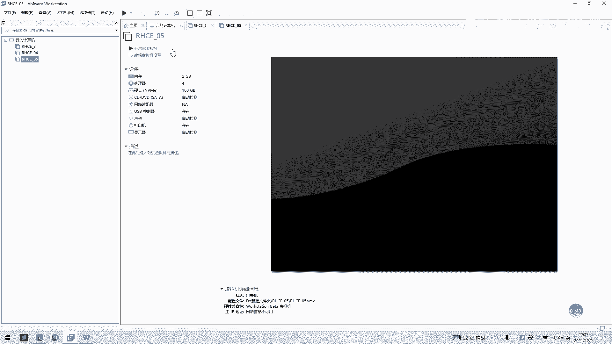
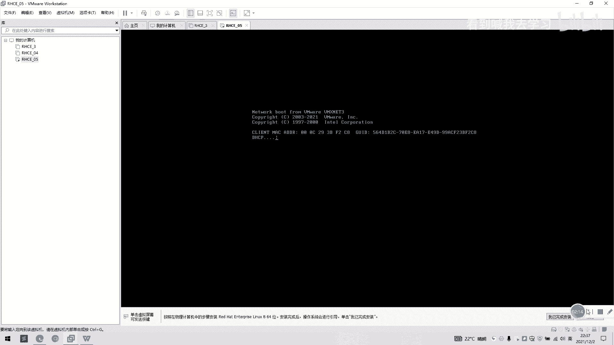

# 2022 01 最新rhce教学视频 - P1：day1-简易安装rhel8 - 看到喊我去学习 - BV1Na411y7SQ

好的，我们接下来演示一下啊自定义安装的一个呃具体操作。我们上次演示用简易安装，我们支持再用一下自定义安装，我们点一下新建性米机。啊，我们选择自定义安装，我们点下一步，我们这里选安装科技。

我们点一下稍后安装操作系统。我们点下一步，看下我这己选操作系统一个类型啊，我们这己选默认是0害8，然后我们点下一步就好了。如果没有默认的话，大家可以来这里去选了，这些是可以自己选择好，我们自己选连害8。

然后他叫我们用个名字，我们这里。HC05。好，位置呢安装位置还是跟。之前这一样，我们等于新建一个。Yeah。I see。你啊。好，我们勾选一下。好的，我们点下一步勾选完成了，我们点下一步这位置跟。

均须拟记名称都选好。好，我们这里还是选一个两盒。嗯。处理器内核总输死啊，我们这里还是选一个2GB的一个虚拟内存。我们这里还是选择一个net模式。我们这里记点一下推荐就好了。啊，这也是选新建去米键盘。

然后我们这里选择还是选择100G啊，然后这里也不要点了，这里一即分配所有磁盘空间也不要点，我们点下一步。系路。好，完成。好，他已经呃看到左边我们框已经有了，我们点开启虚米西就好了。

