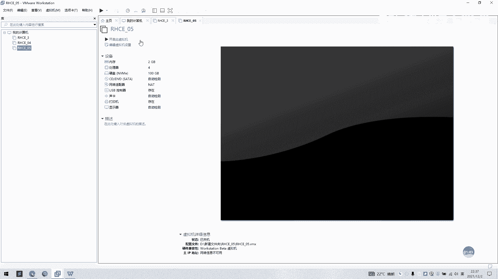
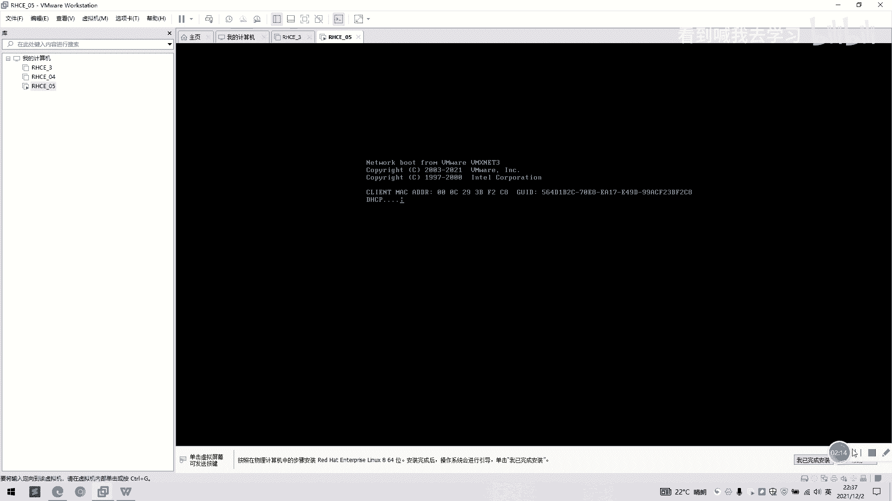

# RHEL 8 安装教程：P1：自定义安装 RHEL 8

在本节课中，我们将要学习如何在虚拟化环境中使用自定义安装方式安装 Red Hat Enterprise Linux 8。与上一节介绍的简易安装不同，自定义安装允许我们更细致地配置虚拟机的各项参数。

上一节我们介绍了简易安装，本节中我们来看看如何通过自定义安装来创建虚拟机。

## 创建新虚拟机

首先，我们需要启动虚拟机管理软件并创建一个新的虚拟机实例。

以下是具体操作步骤：

1.  点击“新建虚拟机”按钮。
2.  在弹出的向导中，选择“自定义（高级）”安装类型，然后点击“下一步”。
3.  在“选择虚拟机硬件兼容性”页面，保持默认选项，点击“下一步”。

## 选择操作系统

接下来，我们需要为虚拟机指定要安装的操作系统类型。

以下是具体操作步骤：

1.  选择“稍后安装操作系统”选项，然后点击“下一步”。
2.  在“选择客户机操作系统”页面，确认类型为“Linux”，版本为“Red Hat Enterprise Linux 8 64位”。如果未默认选中，请手动选择。
3.  点击“下一步”继续。

## 命名与存储

现在，我们需要为虚拟机命名并选择其存储位置。

以下是具体操作步骤：

1.  在“命名虚拟机”页面，输入虚拟机名称，例如 `RHEL8-05`。
2.  选择虚拟机的存储位置，可以保持默认或选择与之前教程一致的其他路径。
3.  点击“下一步”。

## 配置硬件资源

这一步是自定义安装的核心，我们将分配虚拟机的处理器、内存和网络等硬件资源。

以下是具体配置步骤：

1.  **处理器配置**：为虚拟机分配处理器核心数量，例如选择 **2个核心**。
2.  **内存配置**：为虚拟机分配内存大小，例如选择 **2048 MB（2GB）**。
3.  **网络配置**：选择网络连接类型，这里我们使用 **NAT 模式**。
4.  **I/O控制器类型**：保持默认的推荐设置即可。
5.  **虚拟磁盘类型**：选择“创建新虚拟磁盘”，然后点击“下一步”。
6.  **指定磁盘容量**：设置最大磁盘大小，例如 **100 GB**。请注意，**不要勾选“立即分配所有磁盘空间”**。
7.  点击“下一步”完成磁盘配置。

## 完成创建

最后，我们确认所有配置并完成虚拟机的创建。

1.  在“已准备好创建虚拟机”页面，检查所有配置信息。
2.  点击“完成”按钮。

创建完成后，你可以在虚拟机列表中看到新创建的 `RHEL8-05`。只需选中它并点击“开启此虚拟机”，即可启动并开始安装操作系统。

---

本节课中我们一起学习了如何使用自定义方式创建 RHEL 8 虚拟机。我们逐步配置了虚拟机的名称、存储位置、处理器、内存、网络和磁盘等关键参数。掌握自定义安装能让你更灵活地控制虚拟环境，为后续的系统安装和实验做好准备。