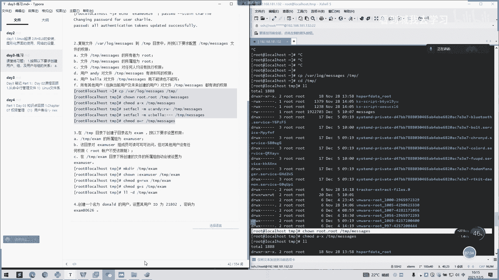

# 2022 01 最新rhce教学视频 - P20：day4-1练习讲解 - 看到喊我去学习 - BV1Na411y7SQ

Okay。练习可以。然后我们第1个A文件TNP message的所有者为root。我们看。啊，所有者作为路口是吧？那如果是啊怎么算呢？如果是不是。他不是路ot之我们怎么做？好。路子。懂。哦TMT开始。

啊，这是A呀。然后B的话说文件TPssage所属主为root。啊，如果他。那我们可以加个A减X。TNP message。然后文件的嗯。TNP message对任何人没有执行权限。

那就是考察一个那个ACL啊，下看一个。没用这个字哎，这个有印象吗？没。哎没有。好，这个是第三题。这个就是一个。没有执行权限。这个就这个。重新跳一遍。那我们第四题啊。

用户andy对文件TNP messages有读和写的权限。啊。那我们继续。用这个。再拜。找个小圆。You。嗯安y。是什么？如何写？没意。啊，没有三个吗。价格很高。也可以都一样的。有家的默认没有吗？

然后还有一个用户标的对文件的message，既不能读，也不能写。还是我们还是用这个命令。有行。三个红杠。嗯这样直观一点。Yeah。呃，F所有用户其他用户。

包括当前或未创建的用户对文件的TNP max就有读的权限。就说其他用户只有读的权限。那是不是我们还是与。用那个。这个。O加喜惯用字母，就可以用那个打言码用数字。这个。只有读。几张点啊。啊。

在TMP目录下创建目录名为Sem的一个文件夹。并按要求设置权限。锁住组，那我们可以先创建。有没有NKT啊建。Yeah。然后我们。啊。所个一下没有。然后我们算了。可以，投是，那我们就设置主就好了。

前面就可以控制。唔吃个嘛有。点平。这样子分人设组。还有什么说那怎么说该目录的。us的组成员可读可写可访问，但对其他用户没有任何权限。其他用户权限那里去掉，然后我们只给这个组里面的成员刻度这些。

哎呀不防范。还是用这个床。可以都可以删除。还有一个C啊在TNPS目录下面创建文件所属。所属组自动会被设置为user。那就是说下面创建都都是啊我们的G加XG减X。你先看一下。是不是这所属主织啊。

然后这里是是不是？其他用质有一个读。那这里都是合多和写的。挺好。这还有。Sy。嗯。这个是没有。

Yeah。那这声音。

嗯，我看了一下这视频。他说创建一个名为doID的一个用户。设置用户的ID是218然，密码是。第3米0626。嗯，可以这样子啊。放进。是不是一个加个U就可以去指定1个ID。然后后面写一个。然后们。所以嘛。

60626。TDIM。对。

是不是练习啊。不懂的，课后自己去敲一遍。看一下那参数如果不熟悉的话。啊，我们今天。啊，回顾一下昨天的内容啊，我们昨天讲了一个权限，一个用户身份的一个验证。然后这里就是一个。权限一个功能。

后面判断这一个其其他其他其他者，然后这里就所出者，然后这个所所有人呢。啊。

我们可以看一下文档。还有昨天的文档。嗯。嗯嗯。文件权限这里。就我们刚刚做练习的话，就是围绕文件权限跟用户权限这一块。然后这里。搜者权限。连接住所出组。如果不懂的话，可以从这里开始看起。

哦。然后第二个权限啊就是可读W就是代表是可选。一呢就是可可实行。或者X。嗯嘴。开始也是肯定性啊，然后对文件夹也是这样子。嗯，这个。我刚刚说的话也是。一样的，是不是是三个。还有我们用数字去复权了。

系统中呃007就是最大权限嘛。然后我们通过1个42。

啊，我们这么个事啊。嗯。这里可以参考，这就是反应码，1个42读写执行，读就是代表四写的是二执行是一。然后我们呃全部都有的按照4加2加1，那就是7。上面就一样，如果是7个齐方，就是可度多先和执行。你。

哦，我们还讲到一个特殊权件呢啊特殊权件就是如果是针对文件呢U加S啊，如果是文件目录要区加S。啊，这个SUIDHG。1401例子。可以看一下。嗯。这里。这里面那个S。如果说还有个隐藏权限，这是锁锁定了。

嗯。知知呀。Okay。嗯，那这里没有。啊，行，不用看。你直接看这个吧。嗯，他可以说。呃，有个完全保护协包跟部分保护的。然后我们可以通过去修改。十八点。

这里是。这还是对应。这边上的内容。有有不同的可以看一下。一个设置文件特殊性。还有一个。呃，返问工制列表的ACR。哦。这里。可以查看设置AC1一个权限。然后我们还说一个进程。进程是怎么来的？

然后执行是什么样命令或通过呃启动一个服务去得到。然后我们讲了进程拥有者是谁？我们进程拥有者的进程的一个执行当前的执行人是谁？他进程拥有者就是谁？我们用什么用户去执行进程的用户只就会产生。你要进城市查看。

就是用PS或PS去或top可以去查看那。

啊。坚持这边。好，好。然后我们后面还讲了一个。呃，照BGSG或呃就是。是。后台输说。后台执行啊，就是我们用哎no how可以去执行一个后台，就让他。嗯，主要今年的这个。那他一直一直是在后台执行。那我们。

话就不用即使删掉这个他效的话，他也是一直会在后台可执听。对，是一个后台执频文件发展在后台样子。也是一样，其他的功能也是一样。然后我们后面讲到了1个Q和1个Q2。我们Q。啊，Q还说了一个Q主要是说了信号。

Yeah。我们可以加一个呃杠9或者是呃抗抗其他的什么信号，他可以参考杠9的强制杀死。那我们就在强制上水。可这个吗？他就不在了。这几个杀进成一个命令。然后我们还讲了一个控制服务和。呃，守护进程。

也就我们一个ssister，我们在。都是用系统系统的一个控制服务，都是用在一个system来下面就去完成的。然后我们是常的提供一个管理模块，就是这个管理。层知道工具命令啊，这里。这有一些参数。

大或者是我们常用的是sistance star。看状态。哎。底动啊。好，我们再看一下重在启动的。我们还top就停止吗？常用的这就是这三个脸，还有一个开机。EnAable设置开机，设置这个服务自己去开机。

一个diable。应该吧刚刚弄到应该有加低了。嗯，开机。你所有条志去。听这。就是不开机啊，让它开机不会运行，一个是N enable就是开机，让它自启。如果是Dsable就。把这个自己又关掉。啊。

我们还讲了一个系统服务类型的一个分类，一种类就是一个单元。然后。呃，某个单元具有都有一个配置文件的，每个呃每个系统启动这个这下面系统其中都有一个配置文件。啊，我们这些。

用这个sstem机CTR这个管理工具的命令都是来自这里下面的一些是。好好俊。或者点搜我的这种这我就去启动了。我们这里啊里面还讲了一个呃使我这种配置文件的一个格式。

OK然后我们还讲了1个SH最后还讲了1个SH远程连接一个方式啊，客户端连接虚拟唉，连接我们服务器的远程方式。我们一般是。前面敲一个SH，然后我们加一个用户名root，然后我们用一个艾特呃去隔开。

把我拿呃远程IP去输入上面去。然后要二个回收，他会让我们输入一个呃。输入一个那个密码。如果说你要进行一个免密登录的话。啊。这也有讲在客户端第一次连接的时候，会把SH的公钥保存在。啊，一个。

nhouse的一个文件下面。比要说之前我们这台机子是呃连到。连到我们这台机子，它会保存下来，连到主机。你要注意啊，如果说SH设我的公钥发生了变化。链接你需要在原账单删除保护对应的，不需删除整个目录。

这一块的话可以不用管它。如果我们没有做一个免密的话，可以不用理他。然后基于SH的无密钥登录，在SH的一个客户端创建一个密钥对啊，我们创建密钥队这样子。啊，我们自己保存录去，我们把这TMP。好。

可以创建你们自己想要的。So， it's。你这个证。这是指定创建些文件。嗯，我们要对是不是在这个t下面，TMBt下面。指定保存入名文件指定保存录屏。啊，如果说我们需要拷贝我们的呃密钥到呃公钥。

传给那个其他服务器的话，我们用来个去拷py。

啊，我们加上我们，比如说当前的用户录ot，让后我们把我们的IP输进去。把英文题开。

比如说。我们可以看着。那一开始如果你不指定的话，它是默认去导这录ot下面哎这上面去生成了一个工业密钥啊。然后如果我们需要指定的话，加个F就可以了。啊，这里说如果不执行F默认路径啊，如果是执行的话。

加个F就可以了。就是我们刚刚指定F。So。我们在前面那家概。Yeah。嗯。打开 ffi。嗯。我们会找找这个t。这。如果说嗯在使用之需要指定I表明私要的话，那可以修改。这是我们现在已经拷过去。

然后还有个禁止root员用户登录。啊，我们进也是我们在1个SH的一个服务下面的文件夹EDC下面1个SHP。嗯。我们发现找一下。后啊，就是这个。Yeah。如果说这里是选择no的话，是禁止用户远呃。

用户不能无法通过这root远程登录，只能通过普通用户去登录，然后再转去root。这知道。这是一个。后们有做了一个如何去修改我们的一个端口。是的。有个炮，我们全局搜有下一个炮。如果不记的话，可以说个话。

一般是一是大写。然后我们这里可以改一下单口之后。我们进行一个服务的一个重启啊。大一下SHG。嗯，那我们可以。看一下。嗯。我们的1个SH第1个服务。是不是就。啊，变成了1个2208了，那直接说啊。

那我们再改回一下。保存。是不是？好，以上呢就是我们昨天讲的内容啊。呃，我们休息一下，看看大家有什么不懂，再问一下，我们休息10分钟，10点42再来讲课。

