# Linux权限管理：P20：Day4-1 练习讲解 📝

在本节课中，我们将通过一系列练习来巩固和运用之前学习的Linux权限管理知识，包括文件权限、ACL访问控制列表、用户与组管理以及特殊权限设置。我们将逐一分析每个练习的要求，并给出相应的命令和解决方案。

---

## 练习一：文件所有者与权限设置

上一节我们介绍了文件的基本权限，本节中我们来看看如何具体设置文件的所有者和权限。

**A. 设置文件 `/tmp/message` 的所有者为 `root`。**

如果文件当前的所有者不是 `root`，我们需要使用 `chown` 命令进行修改。

```bash
chown root /tmp/message
```

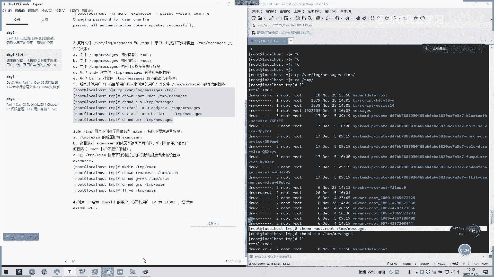

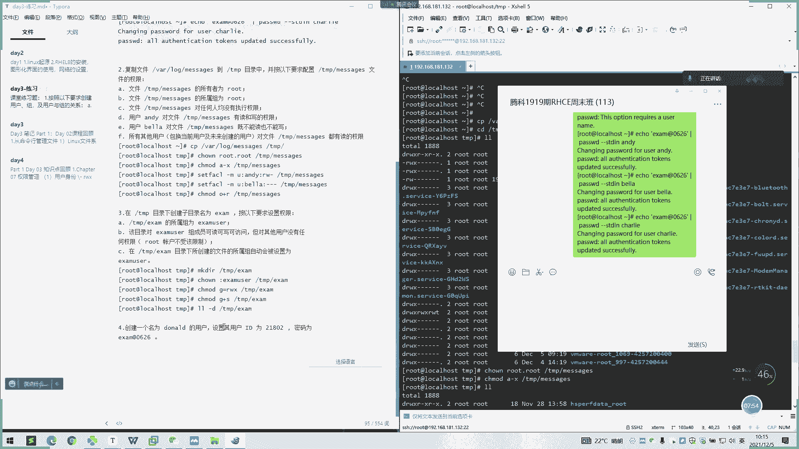

**B. 设置文件 `/tmp/message` 的所属组为 `root`。**

我们可以使用 `chown` 命令的 `:group` 语法来修改文件的所属组。

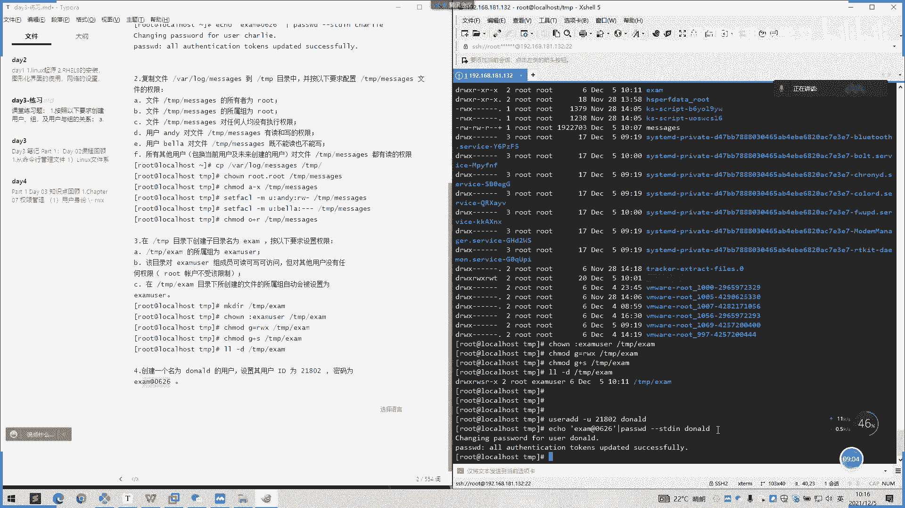

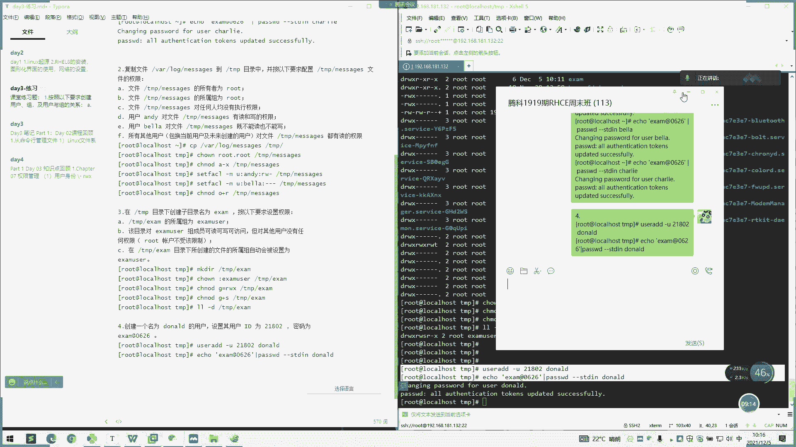

```bash
chown :root /tmp/message
```

**C. 移除文件 `/tmp/message` 对所有用户的执行权限。**

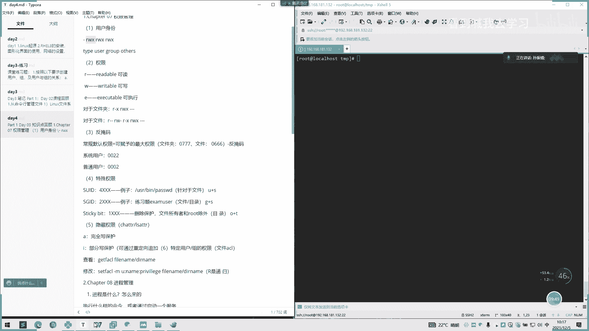

这个练习考察的是使用 `chmod` 命令移除特定权限。

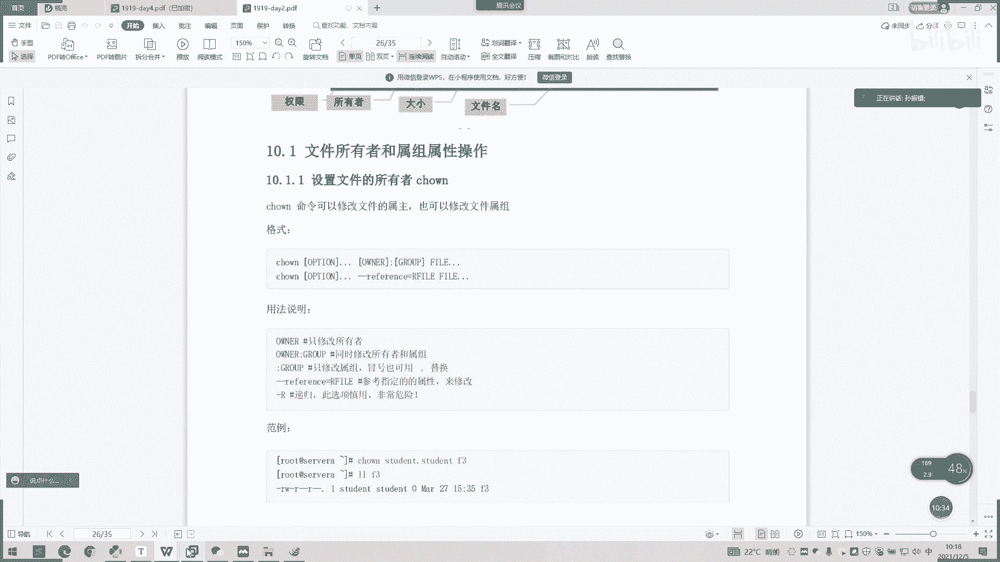

```bash
chmod a-x /tmp/message
```

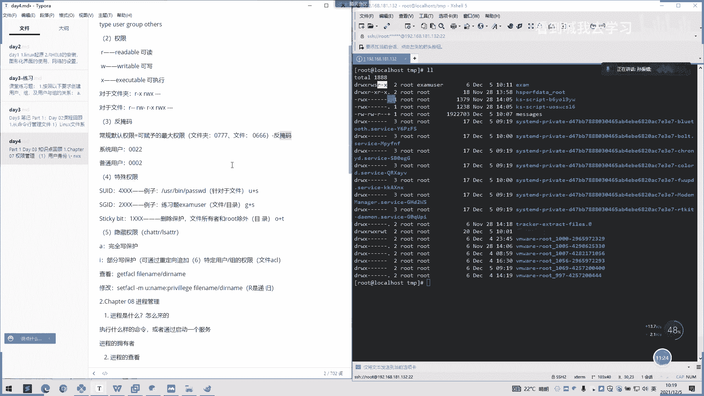

---

## 练习二：使用ACL设置精细权限

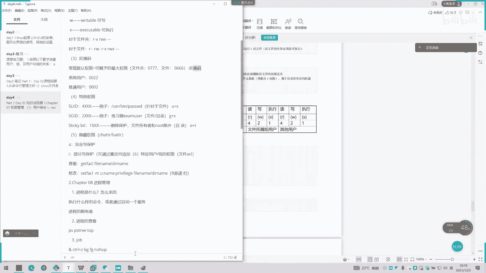

在掌握了基本权限后，我们可以使用ACL（访问控制列表）为用户设置更精细的权限。

以下是使用 `setfacl` 命令设置ACL的步骤：

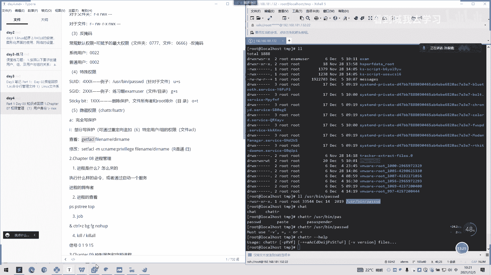

1.  **为用户 `andy` 添加对文件 `/tmp/messages` 的读和写权限。**
    ```bash
    setfacl -m u:andy:rw /tmp/messages
    ```

2.  **为用户 `bob` 设置对文件 `/tmp/messages` 既不能读也不能写的权限。**
    ```bash
    setfacl -m u:bob:--- /tmp/messages
    ```

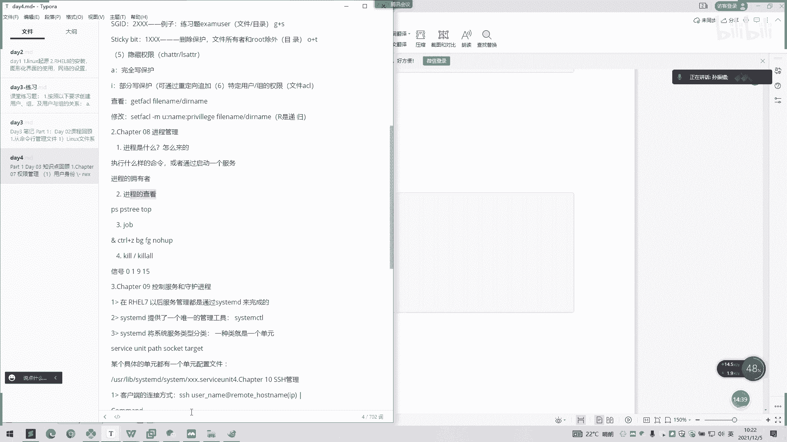

3.  **设置其他用户（others）对文件 `/tmp/messages` 只有读权限。**
    这可以通过基本权限设置，也可以使用ACL。使用数字表示法设置基本权限：
    ```bash
    chmod 644 /tmp/messages
    ```
    这表示所有者有读写（6），所属组有读（4），其他用户有读（4）。

---

## 练习三：目录权限与SGID位设置

现在，我们将学习如何设置目录权限以及SGID特殊权限，这会影响在目录下新建文件的所属组。

**在 `/tmp` 目录下创建名为 `Sem` 的文件夹，并按要求设置权限。**

1.  **创建目录并设置所有者和所属组。**
    ```bash
    mkdir /tmp/Sem
    chown root:users /tmp/Sem
    ```

2.  **设置 `users` 组成员对该目录可读、可写、可访问，但其他用户无任何权限。**
    ```bash
    chmod 770 /tmp/Sem
    ```
    数字 `770` 表示所有者（7=读写执行）、所属组（7=读写执行）、其他用户（0=无权限）。

3.  **设置SGID位，使在 `/tmp/Sem` 目录下创建的文件所属组自动继承为 `users`。**
    ```bash
    chmod g+s /tmp/Sem
    ```
    设置后，目录权限中的组执行位会显示为 `s`。

---

## 练习四：创建指定UID的用户

接下来，我们练习如何创建一个具有特定用户ID（UID）的用户。

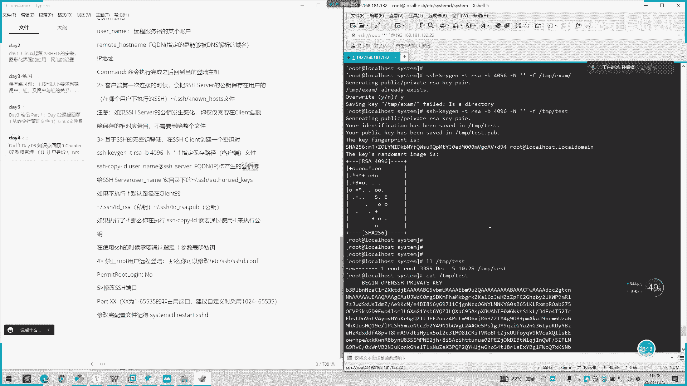

**创建一个名为 `doID` 的用户，设置其UID为 `218`，密码为 `D3mi0626`。**

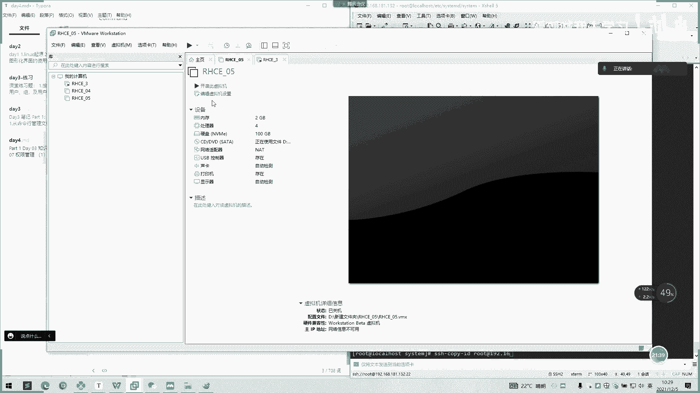

我们可以使用 `useradd` 命令的 `-u` 参数来指定UID。

```bash
useradd -u 218 doID
echo “D3mi0626” | passwd --stdin doID
```

---

## 课程回顾与总结 📚

本节课中我们一起学习了通过实践练习来应用Linux权限管理知识。以下是核心内容的回顾：

*   **文件权限**：使用 `chown` 修改所有者和所属组，使用 `chmod`（字母或数字法）修改读（r/4）、写（w/2）、执行（x/1）权限。
*   **ACL访问控制列表**：使用 `setfacl` 命令为用户或组设置超出基本权限范围的精细权限。
*   **目录与SGID权限**：目录的执行（x）权限代表可进入。设置SGID位（`g+s`）可使目录下新建文件的所属组自动继承目录的所属组。
*   **用户管理**：使用 `useradd` 创建用户，并通过 `-u` 参数指定自定义UID。
*   **进程与信号**：使用 `ps`、`top` 查看进程，使用 `kill` 或 `kill -9` 发送信号终止进程。
*   **系统服务管理**：使用 `systemctl` 命令管理服务（`start`、`stop`、`restart`、`status`、`enable`、`disable`）。
*   **SSH远程连接**：
    *   连接命令：`ssh username@host_ip`
    *   配置免密登录：在客户端使用 `ssh-keygen` 生成密钥对，使用 `ssh-copy-id` 将公钥上传至服务器。
    *   安全配置：编辑 `/etc/ssh/sshd_config` 文件可以修改端口、禁止root直接登录等。

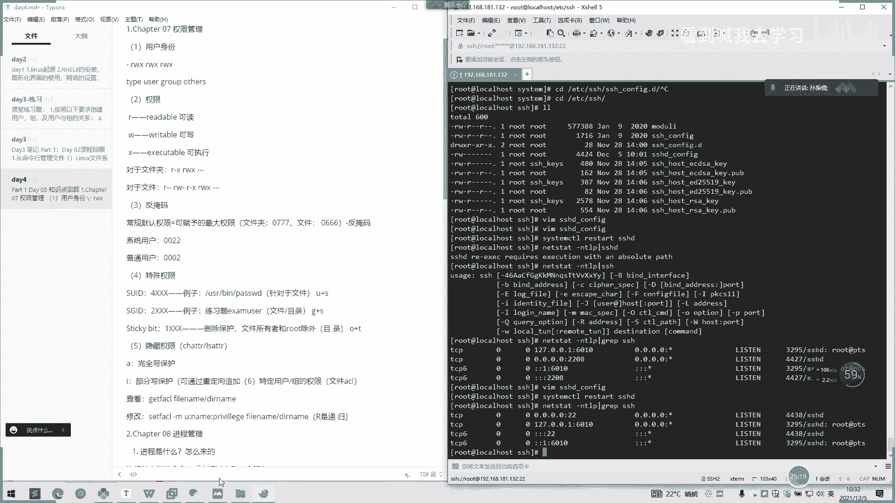

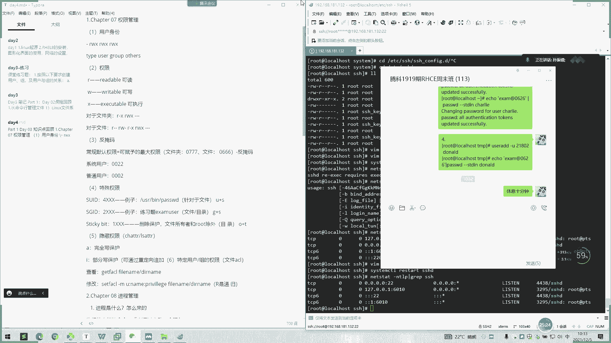

对于不熟悉的命令参数，课后请务必亲自操作练习以加深理解。扎实的权限管理基础是Linux系统安全和管理的重要保障。