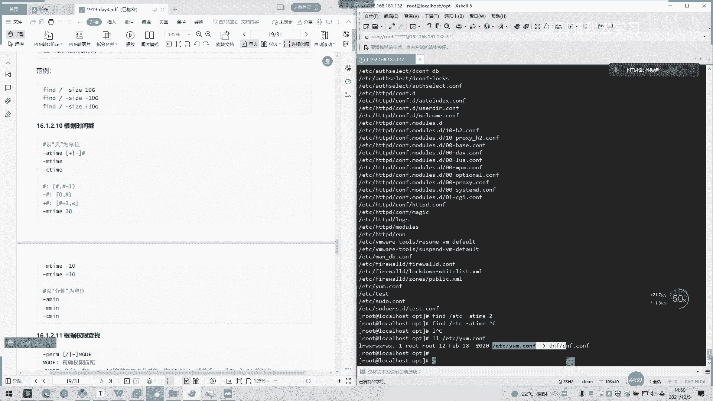
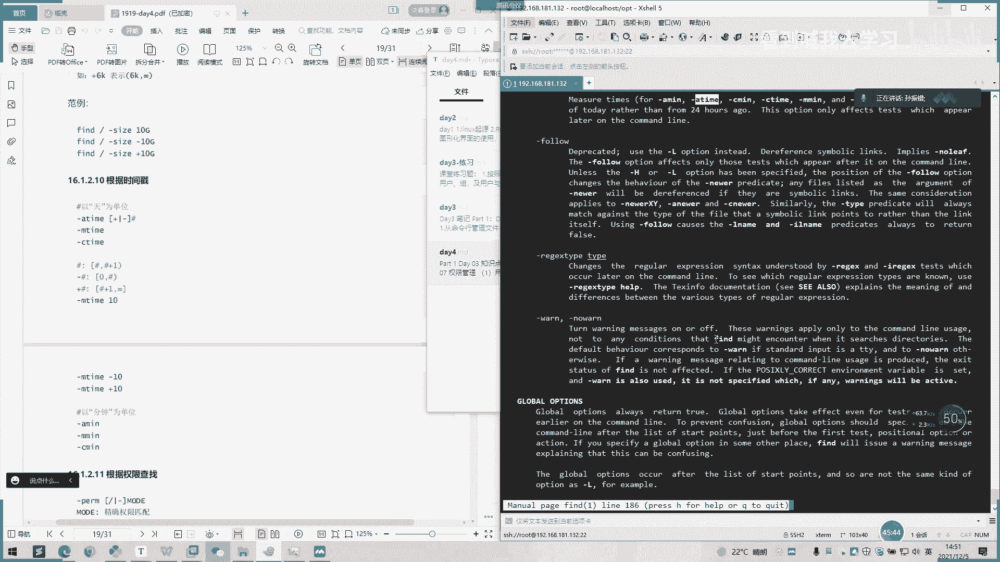
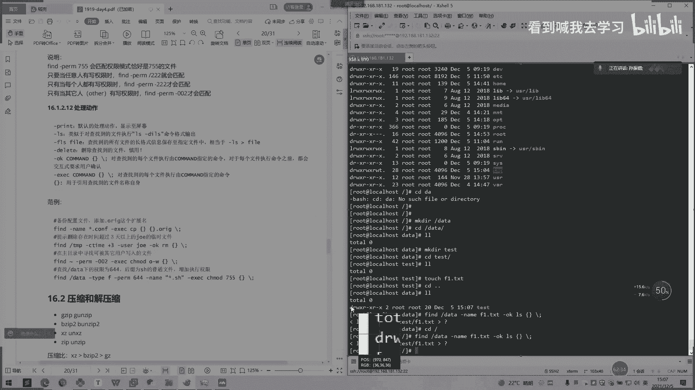

# 2022 01 最新rhce教学视频 - P21：day4-3 - 看到喊我去学习 - BV1Na411y7SQ

基于今天下午的内容啊，下午内容我们学一下文件的查找传输和打包压缩。然后我们首先看一下文件查找。嗯。客子。课课件这里，他说在文件系统上面查找符合相应的文件，文件查找就有有两种方式，一个是。啊，loc啊。

Look at。把这个打开。一个是cat，还有一个fin。以后他会。区别的是非实时查找数据库查找，就就用Oet实时查找就用fin。Yeah。可迟迟早早。这种是。试吃大种。啊。

那我们先看一下这个非实职查找呃，然ad查询系场上面的预览文件的索引数据库呃，在所以数据库下面所引。

就说还要通过这个数据库里面的东西去查找。う。所以呢构建是在呃他这里讲，所以呢构建是在系统上较为空闲时自动进行周期性的任务啊，执行update第。updateDP可以更新数据库啊。

所以构建过程中需要便利整个跟文件系统，很需要资源。就是我们在执行这个查找命列的时候，它会全部会呃从这个系统跟录，一直查，就是你系统上面有多少文件，它都会便利一遍，就找一遍，这样子。

直到找到你相同找到相同的就会找到你相同的那个文件了。所要那个文件，它就会显示出来。然后一直找完这个系统上面所有文件。然后他跟我们讲呃，首先要决定upd。呃，TB。才去才能去用这个命令。

那我们先执行一下分带DP啊。衙门这一家有个工作特点。这个有个什么来自于某开发，这可以看一下，我们看一下工作特点。第一个工是查找是路况，然后模糊查找，非实时查找搜索的文件。的是全是文件的全路径。

不仅仅是文件名，他会把文件名跟路径全部打印出来。然后还有一个可能只会搜索用户具体具备读取和执行权限目录。也就说用户不具备读取或。执行权限的呃，那些文件或者目录他是收不到的。你要这有格式。有说话。

我们直接看这里吧。个刚刚上。格式这里有选了，他这里说本档上面说一个杠I部分区分大小写搜索。然后杠N的话只列举前。N个匹配的项目，干好老师只用基本的政策表达式。OK我们这里打hi的时候就有很多。

那我们先看一下。案例啊啊，我们先让他们先看一下楼。大家 look开看。是把相关行框的这个字符都会打印出来。你系我们要先upd啊数据库，然后再打都可以看。哦，这也要求调准。

嗯。

Yeah。

嗯截不到。可以了。O。好。看。他就是把这些。路径跟这些都西打印出来，就当前目录，要么是让我看一下。没有，这是一个目录啊。反正喊目录跟呃目录上面喊个COENF啊都会打印啊。

我们搜一下那个我刚刚创建那个早开始开一。我打上一个log文件，生成一个log文件的t一，它会生成。还有我们早上配置的那个轮转文件，t一也会也会有存在。然后对还是是个目录。都是在的。是它一个呃一个应用啊。

然后它下面还有一个说打印一个。你要看一下那数据库文件，哎，他上数据库文件在哪里。这是相当一个包。好，这下面有一个。我们可以看一下这个东西是什么。没有，那是。哦，他提示我有点大。哦。打进支宝。二，林制。

那就不用问他。好，我们先来看一下嗯。其他的使用有个我看杠N。3。他就是打印他扫描的填删列出来。

前三面的结果手描讲出。

哦，他这里有个范例，还有一个范例就是使用呃正则表达式去搜索以点com结尾的文件。啊，然要加两个问号。反斜杠对。再加个刀了。啊，所有全部出来，那我们。里面再加一个杠N减示十行就行了，太多了。那请支持哈。

是打伤出来了。嗯。这是一个如果再高级的利用，我们加个管道再bra一下。比如说。呃。电mark。我把我搜一下那个ts一的点lock在哪里？

好，但是已带出来了。

那自己的一个想要的一个结果去筛选了。我这个看一下我这个t一的n是在哪里的，t一。对。点logo。然后这里是正一个正着匹配。O这是我们的一个基本应用。那我们看一下还有什么其他的应用。拿家刚刚跳看一下。

oppo哦。会退出。好，那这也说这里有个更正常。OK那我们再看一下fin。fi是我们不要经常用到一个工具啊，它相对这个看来说就比较方便一点。因为它是实时查找，就实时更新。

它不会首先要upate那个DB一下才能去更新。然后这个fi是经常用的是用这个。然后他是有工作的特点，查找速度虽然慢，精确查找，实时查找查找条件丰富，可能只搜索用户具备读取和执行权限的目录。

选进来目录和文件吧。你要这有些格式啊。快的就比较多一点。按到是这里。查找路径，然后指具体目径目录默认名当前目录查找条件。

指定的查找标准、文件大小、类型、权限等标准进行默认为找出指定路径下的所有文件处理动作，对符合条件的文件做操作啊，默认输出至屏幕。你们发可以发看一下。嗯。嗯，他是首先就把这些点当前的一个目录都会找出来。

我们当前在这个目录下面，让他把当前目录找出来。呃，比较有特点的是，它会前面加个。点呃斜杠，这也是当前目录一个标。呃，当前文件一个标志啊。

便携杠。

好，我们接着往下看。嗯，搜索指定的目录成绩。那这有个最大搜索目录深度，指定目录下的文件为一级，最小目录深度。哦，我找个演示一下。他面那个。They had。然看。你依。零八。对。行行。好吃一点。啊。

去一下。所以现在有这几个目录在这里一直。问打一下太。那现我们看下看家发那个PDC。那克系。两个深最小的深度是。啊，最以大程度一行。给大家成都颜色啊，这一讲成都颜色啊。是吧当前呢他只会打印呃。这下面的呃。

第一第二级第一第二级的一个目录或者一个文件嘛，所只打印到。这里有是3，我看一下。Yeah。是不是就是。就款3个。目录里面再有一个目录。这里有一个事例。啊，就刚刚我那也是一样的。他敲啊。

O the item。嗯太太1。还有什么问题？嗯，P。pas一下批量创建。S， F。哪个哪不号，你刚刚嗯。就放这里。两个文件。再来。Data。是音。啊。F。3分0。4TXT。你说。我们看一下。看的对的。

看其他面的。这面这个t下面有F1F2，还有一个t一文件夹，t一文件夹下面又有一个t2文件夹，然后文件t2文件夹上面有个F3F4。ok。换一下。停。M个。电。哦，有年。是不是找到一个t？啊，看看这里有。

这里不用看了。来看一下。周文就找到一个t跟t一样。然后t2下面他是没有。嗯。最多导到这里，但是他这里没有转，一直往下，然后这里。程度再设大一点。是不是t一S一下面都有了。F3F3没错了。是。

32是不是出完了？1234。是下面的东西都是都会出来。

哦。他这里还给了一个参数说对每个目录先处理目录内的文件再处理目录本身，然后再加个D，然后。啊，像。嗯斜杠给要加个D啊，范例，那里有个范例。就如果不加的话，就是。我不加的话，他就默认把这些全部找出来。嗯。

你加概15度。指定申请。他是相当于有有个排序啊，把先找最里面的。可以事先找最里面的出来。我家看点样一。

晚钱。

他说还可以根据文件名去查找。呃，文件名就是说加个n。我们前面加一个比如data吧，data test。我搜一下路径啊，然后我搜的那名字叫什么名字，F，和建F5。F3吧F3点SD。

他是是把我们F3的贴纸找出来。我们前面那加个I。像I的话，它会匹配呃大小写。那我们先充这一下。报成一个大雪。上。开山电铁。我打印O。不是。是不是大呃大写来不是FT有会导出来。

加个那你前面加个I啊，就是。不区分大小节。这比较好记一点。嗯。然再按N按NODB号去查找。这可以有案例可以看一下。还有一个连接文，连接数为小圆的文件，然后这里有个振轴表达式。哦。Yeah。

As data test。嗯，是这样子吧。但是。O。两哥。i will大帅。诶最奇怪。整个文件路径而非文件名。有没有。嗯。这一块可以看一下。我么看见。能能查下。嗯。就是我们改变了一个。哈哈看啥意思？

正着表达词语法，稍后在命运中发生要查生自己已知表达式类型行使用。代表帮助。哦。我看一下这个。

那这个怎么用呢？没有。嗯。可以点。我们先过一过，下面我重新找一下。这有一个方案。有个例子。A g x。点心。嗯随杠这这。F一。文自蚊加个鸡。就含pa始的都会打印出来。因为我们是。啊几他说得咯。哦，这行。

哦，那你不能搞啊。好，我们看有一个跟注蜀主跟。主组查找。呃，就根据用文件的一个权限去查找。我们指定一下。没有。算一下S一下面。可一吧。嗯。这就会找到就我们。目录的。做久一点。

跟目录打工的话就会说的比较久一点啊。你看会不会找到我们这个程。有点久。嗯。是不是？这个F1ts有打印出吧？然后那些。我看见。这个是不是也是？这实傅也是联向用户的，那这也是联强用户的。

你啥用我手西打印出来。这是一个。嗯。

通过用户查找。

哪个通过用户主序查找也是一样的。It feel fine。这家都不是我。嗯。对来看。不要收紧工作收BT。

做边贴。嗯。

嗰个。哎呀，没有6ID。嗯，有此。我看一下韵啥已经。买提是1000呢。嗯，换一下。嗯，我直接听一。再加个UID。10。然后GID打印出来GID也是1000。

嗯，还有个查找没有赎主的文件嗯。そ嗯。我，看看系统原面有没有？没有了我们在自己创建没录。这没有。两个效果也是跟上面是一样的。好像是没有，一般都是有。然后根据文件类型的查找，还有一个类型。

然后这边有个贷款，就是说放。看UYP1。GYP啊，然后面比如F啊或者什么都可以。么文件啊，我们看一下。前面加个OPD。嗯，什文件。你要看。爱不蹦低。嗯。冇教韵先。还有个符号链接有没有？5号链接在。知道。

这冰下面比较多，一为都是软链接嘛。这边都是软链接，我们可以看一下。是不是？总之是前面有个I的。有个LL的这是一个软链接。然后颜色有变了，然后有个。今大雨号。表指向是哪里？好好，他就。买个套捷器。

化解资这S啊。而且是有NHTP有。这里没有。关键自己也有。Okay。二节字S啊。

嗯。根据文件类型查找。诶哦。嗯。

是否坏设备跟管道是明件。你看看有没有。C哦C这肯定没有。证。行，我们看一下这什么类型。就这里前面有个有C啊，一个字母字系。字符设备管道设备管道设备。你可能有这个必要。

这种系系统一般是系统文件的。我们常用的话就可能是呃普通文件或目录或一个。呃，一个符号链接文件这样子。然后他这里有个范例也需要啊，有个范例我们挑一下他个。来个D。那现在刚才是这是显示的意思啊。

就改变一下显示方法吧。有调呀。Oh。

那是。

空文件有个查找一个空文件或目录啊，我们加个。啊。EMP t。晚。怎么知道？里面加个太。一样的。这头我们看下这头有没有。他会把文件或者目录都打印出来。这是一个。还有个组合条件，与A与或飞。

看来一就默认多个条件是关系。或只是。哎，刚哦所以就是no或肯叹号，我们这有个判例。有长你有此，那不对。看。嗯，小邓嘅要名。我有个t看了一个月。嗯。没有吗？嗯。嗯，数到押先楚说。嗯嗯。

都是红色的嗯的话记住呃几几个简单的就可以了。还有些组合的不会太长了用不到。大我都敲一下，哎，你们也可都可以敲一下。

嗯。实现的结果基本上是一样的。

那些展示的不一样呢。啊，这个毛跟领率啊。对，处所 false飞飞。再见。非A或非B就等于非且B非A且非B就等于非A或B。嗯。然后这个事例是吗？感叹号，一个大A一个小A，然后一个感叹号，一个大B，然后等。

不等于一个。还有和别这是不等于。然后这有个三列，我们可以敲一下。他反斜杠的意思就是呃。那国号就是只是普通一个字符。武创。含义。好。一般是在特殊符号前面加个反斜杠，就是把它当成一个普通的一个呃含义字符啊。

这白话是有有些。有是有功能的这有作用的。只是说在这在这里面，他不停的这沟动，只是做一个单纯化号使用而。大个智。一啲。哦，这找个空格。你们复制一下。你睇你。好。

那这也就相当于这个。没意思。

两个命令都是一样的。1fiphone。嗯么。sorry hand。帮系跟 u i p啲。来老板手噶。下面一个ho还是插着ho下面的。看下有没有区别。是一个好像把全部都搜索出来了。另外一个。不等于这个。

那个哪有把流派全部收走出来。啊，包括你看的会搜索出来，看到没有？其他目录。

意见吗？

排排除目录啊，就是我不想呃不想查哪个目录，就但也不用去查它。啊， e t c。这个判电影要。这个就比较常用一点。呃。🤢，1点D，然后们来的。哪个A在哪个com。q i e然后再系加 o。有咁靓。

先后面接。这点抗的信号。O。很猛。

他就会把。一见呃，把这个目录排除排除掉。5ETC这个线的目录下提交时候点com后缀文件都打印出来。

还有个根据文件大小去查找。嗯。一个赛我们后面只加个赛，然后这里还有个呃加个单位啊，比如说赛后面加个EK啊，一兆啊，EG啊这些的。啊。由6表示5。零六 k。对我刚看到我们看例子就可以了。让我们查找大。

直居。没有。呃。是一套的吧。说好的。100100兆的有没有？没有迟差了好多。算了好。全都是。然后我们。请一下。简直小。加1。你机有没有？没有。哇，这个好看，我看一下这个。啊，128斤假的。

这只是大不是他真实的一个空间。天池。小于时句都会打印出来，是这个意思。你后最好个根据时间戳以天为单位的。我看看今天创建的。Yeah。根据时间嘛，你看这里时间，我们根据这里去查找。小于多少天呢，或者是。

呃，这里是天嘛，然后这日期嘛。北岸天查找。呃。那我可以试一下。哎这是歧示了。找一下me。嗯，就是按。当天的这两他也只当天。我我我打一个昨天的看一下。4号。我似啊。

OKOK我找一下这个啊ETC也有看一下ETC吧。具哋讲多。嗯。对，我看一下先。我们看啊什么时候的。嗯。

bbruary18号2021年。

有外不懂可以看一下。这种单词可以看一下。

哦。烟台。所。嗯。等听。我那看一下。嗯嗯。这里的话，我看一下，我这里没有这个详细吧。帮你找下。

Okay。没有有。有两个，看有没有这个。访问时间是吧，这是访问时间。

具时间。这个。天出感情那。对。

这是创建时间吗？jabe写一下。这不是创建时间啊。嗯。啊，他是。修改。嗯。反问时间。我也忘记了。NN的话都是。修改时间。阿 see。上电时间。

是吧没错吧。

这是我也写一下。还这是pre time。

嗯，电话输有者。把它复制一。Okay。

不然这也是我们的一个修改时间啊。然后我们看一下。我今天修改了一个内容。充电时间。当天创建的都会在。减一天。请低。是啊。A没有很好的例子，我看一下。嗯，看这有没有。🎼嗯。

嗯。

这可以的。啊，这回以自己。下去看一下，这还有个一分钟的。可能比较明写一点。呃，3。跟上啊。4点19看一下。我剪啦。10分钟前了有没有10分钟前没有。

嗯。见。我没有。

有一个修改，看一下。

嗯。还有个根据权限去查找。哦。

这块这块懂了时间那块了。我们可。

百度一下啊，反觉这里。所以讲的不详细。嗯对的。嗯。这里就不要有那个例子，查了最近50天修改的。50天。查找所有被修改过超过50天，及少于100天呢。

过去一小时查找更改的这一小时之内有更改的文件都会查得出来。减吗。我把我把自己截一下。大小所以的话有。

。还有一个根据权限去查找啊，今唉大刚不是跟上面那个重复了吗？哦，刚上面那个是用户组啊，然后这里是权限，任何一类UGO的对象权限中只能匹配到一位即可或干系。将从洪贸期开始淘汰。啊，加末末等他是没有了。

每一类对象必须同时拥有指定权限与关系。我的这一个没有遇欲加傲洲。说明。啊，finPRM755会匹配权限模式下还是75的文件，只要当任意人有游戏。有写钳限实啊，都会匹配到。

只有当每一个人都有写钳字才匹配到。这里的区别就是一个加加一个斜杠，然后这里加了一个横杠，每个人都有写的权限。一语人。啊，任意演就是加个斜杠，你要每个人。要知道当其他人哪的。Yeah。

其他人他也是这样自写啊。022。002。默认的处理动作显示至屏幕，然后后面跟个IS就是看那个。呃，文件嘛文件的一个。文件的一个路径是吧。F fire查找所有文件的长格式进息保存至文件中，相当于。

IS就是重定项嘛，把它保结果保存在一个文件里面。查找到结果，然第12345查找到文件慎用。就找到了就删除。嗯。I date。我把这个删了啊。F1。嗯。老十十快。他把我dta目录也删了。给我们创建一个对。

看没有个 data了。然后我们创始一个。FF1吧。这下面也味不行，然后我们。看一下。打个咩可议。是不是对他不近。是不是没有带打文件了？被卡文件夹都没有了。哎，他说在文件夹里还有哦。

那刚刚为什么把我那个也删？是目录。创建我们再测试一下那个t。啊，HFF1。我们继续放。咩系 f e。打到6删除。嗯，太太哦。行。我们继续再测一下。是我们自己。是不是在后面写跟前面显示不一样的？Okay。

哦。先打先打这个激利啊，然后再加个那。哦，是没有了。是不是没有了？终于找到出来了。Yeah。Yeah。是没有了。

定义。喂迎你到。所以说那 delete例不要不要用，或者是一定要把那个链打到前面，然后后面再加个dele啊，不要 deleteele在前面链在后面，否则的话。所以把整个目录都删了。不止这个文件了。哦。

O。这还有有个下面有个什么OK对查找的每个文件执行home指定权限，对每个目前都会交互要求用户确认。没试一下。说一下。这是一个。要给他们，然后继续来一个。在t基地先建一个。诶。你看一下。哦， ok。啊。

 o k 好啊。来看一下吧。用要要写一下你。加个反学杠。他个。等好。退出。嗯。开始。哦，这以的话会。

是把这个东西打印出来。微信打印出来。然后还有一个。EXEC的对查找每个文件执行有com用查找。我们这里是。看下跟上面有什么不一样。意思。还是用S的。你踩个两个。没错。这个上面有点不一样。这以知道。

是不是就好看一点，他就直接直接打印这录径出来就可以了。那我们要。用一个。Hello。什么都没有。那我在里面。阿女啊。没有之前那个。嗯，是是把hello hello厉看打印出来了。怎么样？其就不配啊。

这个没有。嗯，所以两系嘅方法。呃，考试可能要用到这个，可能批量删除，可能会用到这个。大家几点。会让你找会让你找找某个文件，然后直接就删除这样子解就I燕。我要食人。我们看一下都还在不在，朱不在了。是有的。

嗯这么大。

。嗯。主要是这里。再有一个。案例啊，我们可以也可以顺着敲一下。备份配置文件添加YG做扩展名。哦。提示删除超过3天的，然后还有一个可被写入的。力起。帮我们套实一下。他 had个烫。

我项目录下面有这个我换一下。匹配。应个CCP。没有。那。の。是不是。CP更改啊。只是超过3天以上。那个。hi。嗯时态。加声。有色。一个note。提示。好lo文件上，它这里提示。

因为我这个啊源不能删除那个目录啊，所以它会提示这样子。他只把。把那个文件给删掉，有为是请我这里仅删天就是。包括当天。那这一个一个是一个交互式的一个呃一个这种属于静默的。通条用的是静墨静墨删除的纸比较多。

总之交付室要求用户确认。嗯，我们还有一个fin。PRN5杠002XC。不全。他们。嗯。这个不太明显。唔使个 t i p 。要7五。那我身在没有我们放置一个。Re快 message。唔犀你嘅。

下权是不是机器网。

哦。

是一个复权的。都是调用其他命令去操作的。后面可以。后面可以接任意命令啊。主要是这一块。好，我们先休息一下，我们下节课讲一下解压跟压缩。好，我们休息10分钟，15点25分钟，我们再见。

