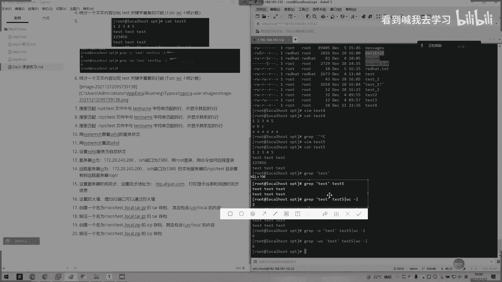
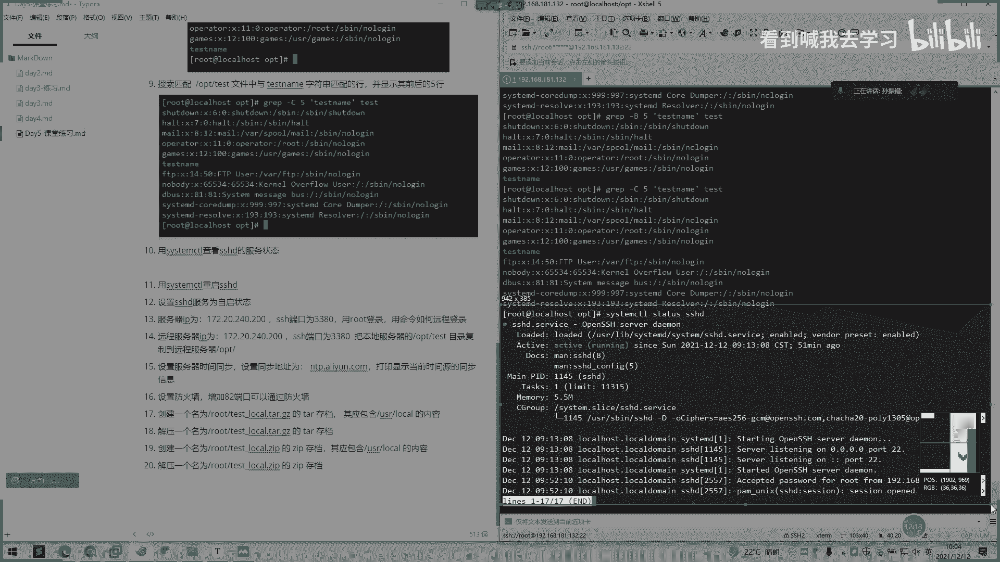
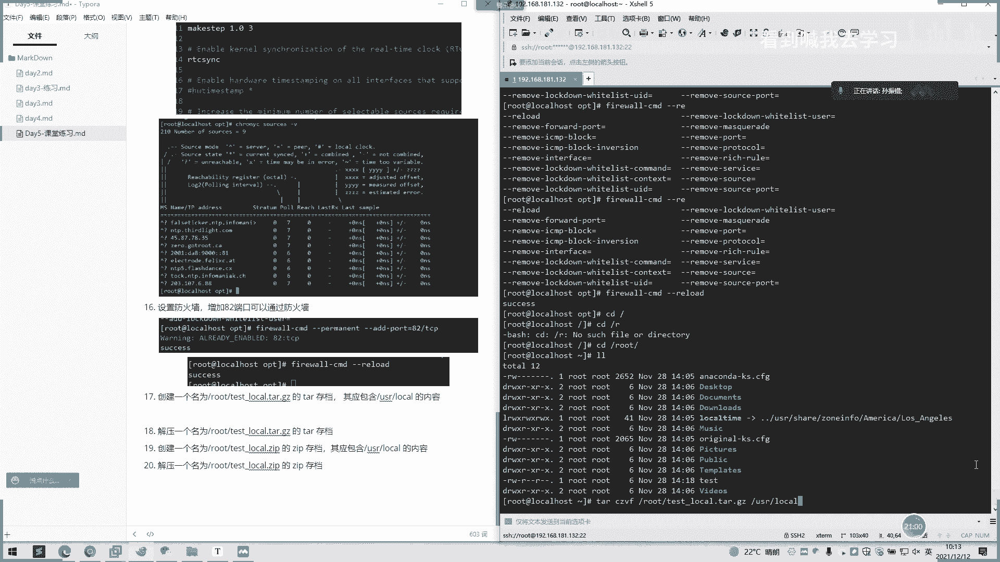
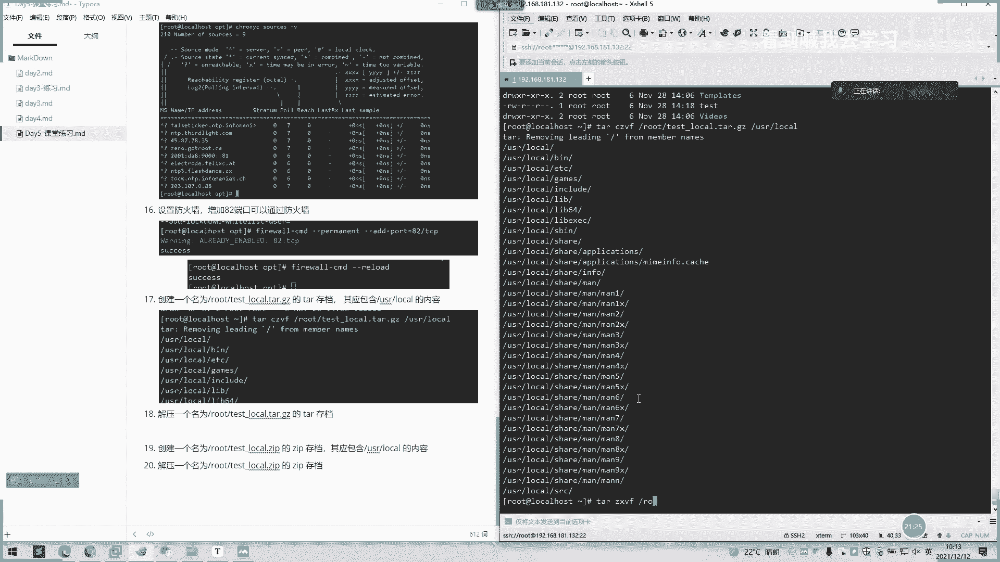
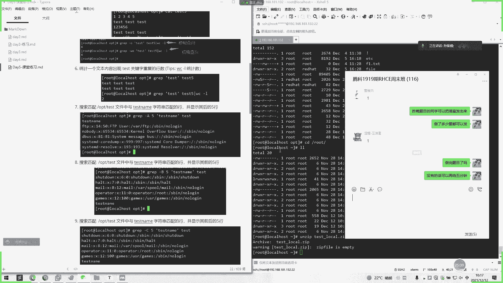

# 2022 01 最新rhce教学视频 - P22：day5-课堂练习 - 看到喊我去学习 - BV1Na411y7SQ

第一题应该大家都会吧。嗯。弟弟应该都会吧，有有几种状态。大大体来讲。是不是有个创创建。创建。然后有个执行陆续吧，前就陆续。执行。还有主色。最后一个中旨。对。然后我们第二题考察的是一个进程数啊。

一个进程数命令的一个。用PS去啊。你开始去后面跟个还是去接。用不啊。

第三个命令查看的话。我这边。嗯郭总，我一般要用PSP啊。可以用PSSEF。

Yeah。三停。用命令打只打出HHD相关呃。的进程啊相关的T区啊。是不是我们上面这些，你看这有PGPG。打印是3个，这里是不是显示3个14114257，这些都有。嗯。Yeah。OK然后。统计一个文本啊。

这里。好的，是一个gr命令。O。统计一个文本出现t的一个关键字。哎，可以打了。举个例子啊。哦因我在试。是个12345，然后ABC面全是A。啊，那个题供吧。So。Yes。Yeah。嗯嗯。Yes。嗯。

234。不是一下。是不是是不是出来了？M们WCR。好亮。嗯。要请。

请到地方去。

や。没。你。

🎼，这里的话。

이 되。

Its name。哦。继续。第六。第六题，统计一个文本内容出呃，第七版搜索匹配呃文件中与test name匹配代行。哦。全都掉。嗯。嗯。啊怎。啊，开始呢。这个睇呢。是吧。然后我们。系。现在。Yes。嗯。

你 great。nice。嗯。嗯，听一下。O。Great hi。嗯下个户。现在。

Yes。

差级的话，那就是比一个钱。

第九题。前后吧，你看这前后那个C。

这也记住啊，你看。AA是后，B是前，C是前后。对，这块连起来记。这个查看状态我们用一个。sister stated三个状态HHD。

同时。啊。🤧自己的话。is able。系应该报一下。

十7分钟于都讲完了。

这个是。

完春。是不是这个GB杠2B。加个单号，他比后面加单号。不的。你的是不是这个？哦，这住。三啰说。下面是复制。复制SCP啊SCP加个大大P啊，可以这样这样子这样子记啊。

SH哦端的话就是用小P表示SCP的端口它就大P表示。然后我们先输root下面。本地的OBD啊。他们是可以前面加个BT。好。这以前是带带目录，然后到。地表目录。15题啊15题就是我们考的1个NTP呃。

一个时间同步的。The crownown。我们现在看一下那看。我们先这个进入这个。嗯。嗯。所以你用一得东先。好，我们现在这个说。编制文件。对，把它复制过去，后面加个后面一样。

这样子。

要查看。我没治完之后，我们进去个重启。好，我们再用这个，然后命令看。是不是？16题我们设置个防火墙设置防火墙，我们用一个。下我。我们可以看下发哦。嗯。嗯，这个。C n机。找到一个ad。Add add。

科你。行。嗯。系lo。我找到一个叫。们的这个一个。不行啊。确定。大家。这个艾。报是什么啊。TCB。然后。给漏刷新一下配置啊。给我见。

然后后面的题型就是考察的的是怕还记得一个。1发的一个情况。好，创建一个名为root下面的。啊。这金也。有咋。O。去C然后user local的内容。

是不是把这个打印出来了？谁呀谁了的吗？

应看是不是这个。

然后下面这个D啊一样的。是。嗯。按记的话就有点不一样，你们要加一个递归，加一个杠行。I子。干啊。

那我借。

嗯销阿说这样子。写啊。因为这样。我这里。我这有那个logo。

The。

你们这一块有哪个有疑问的吗？

嗯。

如果没有的话。

哦。没有的话，我们可以讲一下。新的内容。

啊刚刚刚练习同学们有疑问吗？

对。😀看。😊，好像。😊，怎么样？我那我我我再讲一遍，这进程数这一块应该懂吧，就PP去去看了，基本都是呃死命令这一块啊，可能这呃还有个P。Pig gray这样子。这几个看进程的一个信息啊。

然后主要还是可能统统计统计的话，可能用了是不是有些同学用的不不多这样子。就可能这里统计一个什么呃重复的一个次数啊，还有一个。呃，平行的显示一个行的一个信息。你们可以这样子记嘛。

就说一个bra呃bra的话可能就是同步一个行数。或者是用ca来给我看一下。

这这道题还有一个还有一个方法。我们还可以用看。你看。有开时呢。这样子。可以是加个忽略。このは。开5。是不是看眼ca也可以用啊，然后ca的话，你看再搭个WC杠样。说也是两个一样的。你可用卡。

你们一看到统计统计的一个呃统计文本内容这话。首先第一个要是想让用bra去统计。

还有一个比如匹配呃匹配文件内容呢显示呃多少行多少行的，就是前后多少行的，就是想到用bra杠大ABC这样就记。

熟练后面熟练的话，一般呃看到这种题目好快都能敲出来。

然后下面的话，我们这里我就考察了一个stem的一个命令一个使用手呃服务查看一个状态，然后重启自启啊这些。

然后这低话可能就考一个NSH1个端呃SH1个呃远程连接这样子。然后我这边还加了一个呃端口，是不同端口嘛。因为生产可能就是端口已定不是默认的22的。所以的话所以的话加我们就可以用SH加个小P。

然后同样的同理器，有时候复制的话，复制的SCP我们就用大批去表示这样一个呃端口啊。有是SH是小P，大批是表示端口。呃，SCP大批业表的话SH小P是就是表示端口这样子。这2块连着记。然后同步时间。

这里也是。这道题的话好像呃考试会出这个同步也是这样子是操作的。然后这里有个设置防火墙。这一道题的话也会有也会有个呃防火墙一个题目，也是都是加个什么档口啊这些的。还有这这里的话也是创建压缩文档啊。

创建压缩一个存档。然后大概这些。然后我们休息5分钟，我们10点25来再来讲课啊讲新的内容吧，让消化一下。好，我们今天课堂练习先到这里。

