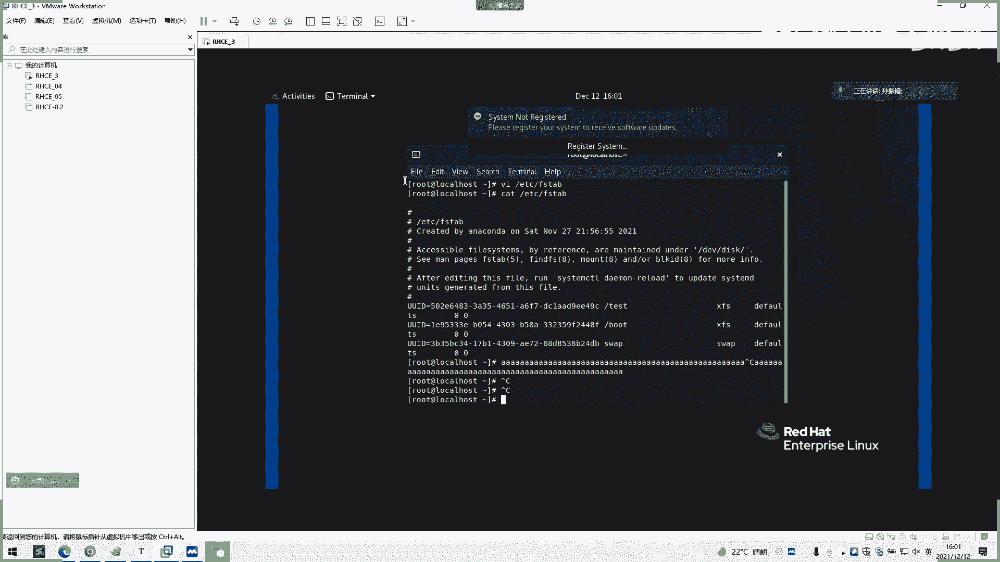
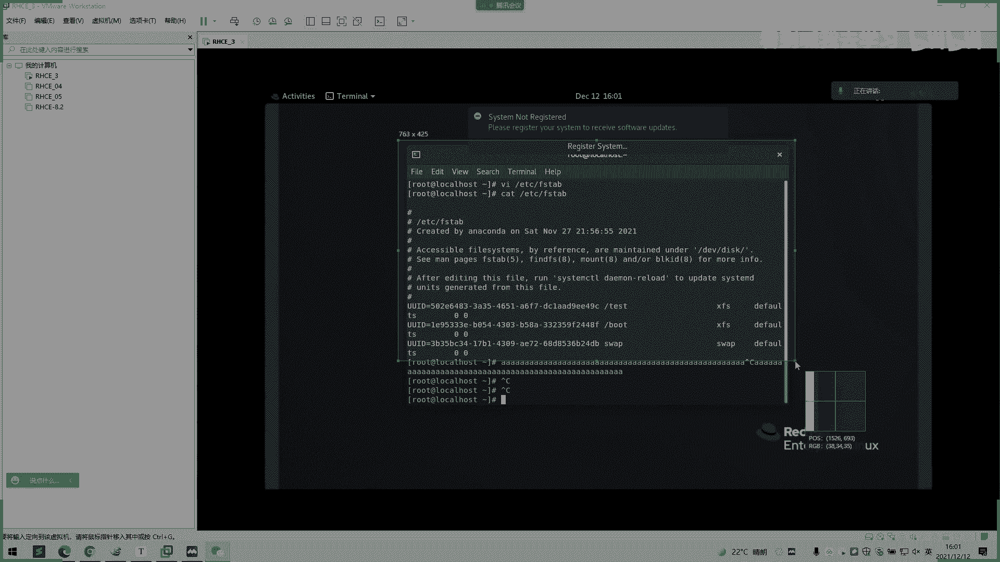
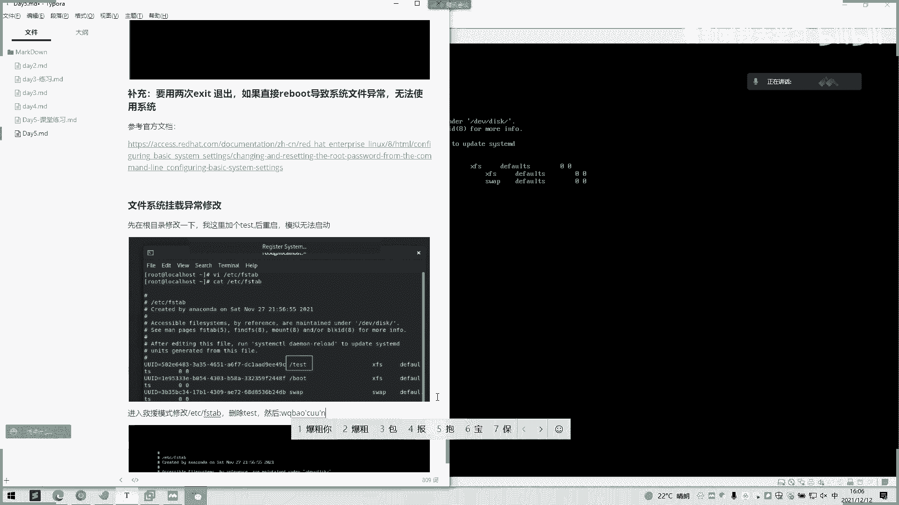
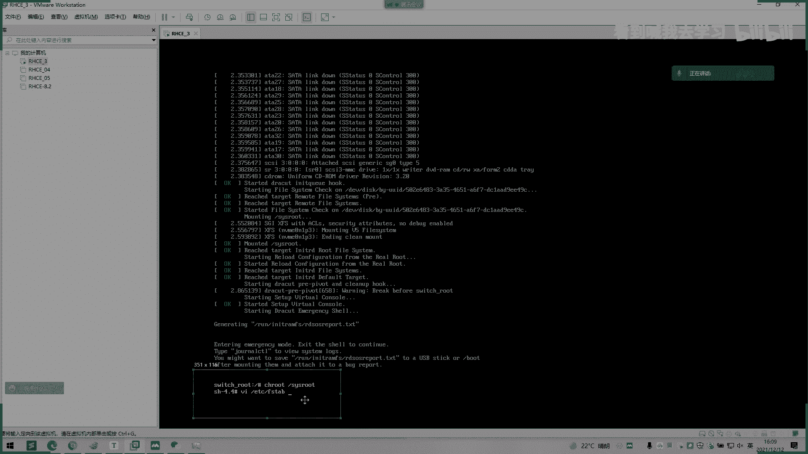

# 2022 01 最新rhce教学视频 - P23：day5-4 - 看到喊我去学习 - BV1Na411y7SQ

OK我录屏你打开。Yeah。

好，看一下。我们看这里啊，我们下面演示一下文件系统一个问题啊，它这下面有说呃EDC这呃FStable这里中错误和损坏文件系统，这就是一个下面挂载的我们的一个文件系统，我们可以看一下。

是不是他现这这些是挂了一个根目录是吧？你要这是UUID他用通过UID去挂。一个个目录牙，这个是叉FS格式啊，后面de00我5们反弹，我们这样子。这里修改一下，改个ts。对。我就是让它崩掉。哎哎哎喂。

这电脑怎么了？不听话。

O。

对。Okay。挂载异常。没。先。跟目录。

嗯，标记一下。

ok。

哦。好，我们吕奔了啊，正常。起不了。起不了是吧，起不了，一直这样子，你们落底也是这样子起不了。好，我们重新启动。好，继续选择。阿姨。继续我们再重复上上课那个步骤。嗯。WRD点bra进入一个就业模式。

crl X。ok。我们进入到一个救援模式。还是哎那样子。不同是什么？这里我们改密码了是吧？我们直接VI，因为这相当于一个笑，这里就是现在一个路呃超级用户的一个录者一个环境。你可以理解。

就是现当于在一个路ot环境下面好，我们直接就改。如果考试啊有挂载的话，怎么样的话，启动不了的话，可能是99%都是挂载问题啊。对你的挂载硬盘有问题，它就启动不了。你就新增一个挂载，我们后面加个挂载。

如果你这里启动不了，你可以把它挂载直接注释掉或干掉，直接注释掉，打打个井号，前面打个井号注释掉。然后我们这样子退出来WQ保存一下。这也是按2个ESC啊。不用tos了，后面就不用tos。嗯，对啊。

考试有考研走快哉。

看是不是回回来了，正常了。所以永久挂载有一个点就是这个点也会导致系统起不来，然后导致你你们就又是零分。有两个零分的地方。是吧。上午考的那个CSA的两个比较两个最重要的坑，就是这两个坑。导致0不能看。O。

我们是已经进来了。好我。

我刚刚操作太快了，等一下。你二。没截图，稍等一下，我截个图。新来重新来一遍。嗯。

Yeah。嗯。没行。嗯。

嗯。

嗯。

听下。嗯。没有。那我这里很快啊是吧，一点都没有，我已经做了好多遍了。😊，我CPU啊就。那哦我先截个图啊，不好意思哦，先截个图。😊，没什么CPU可以给你看啊，没什么CPU啊。

多我分钟啦好吗。

啊，CBU可以做一个参考。CPU来，咱们看一下CPU什么？由璃雨想期。DBU老师DPU这个。可以说。那存。我们还我那速度速度比较快，3000赫兹3200赫兹。

通寓扇级是必先逆集器。

好，第四个。You。我知一解下。

对话来。我边那个原。OK我的截图已经搞完。这个练两遍吧，好不好？

这个同学有两遍。我再把它发出来。

稍等一下。欢0。不。

。Yeah。Yeah。Yeah。听完两遍扣1啊，我靠。夜晚。No here。可以好啊。

改个目录啊这改个目录啊。改这个改第一个。对，个开。손 더 해줘。这里。系。如果考试的话，就是要注释掉。如果你们之前新增创建盘之后，如果不行的话，就直接进入到这个模式，把那也直接注释到或者删掉内行。

好好。

哦纯退。对没进入入总模式吗？嗯。

嗯。어。做一下，做完两边扣个一扣个2。As we possible。这报错了，要你再重启。报错什什么意思？就是你那你改。是啊，然其也是进入刚刚那个救援模式啊。That by me and much。

没有啊，也是那个机房是相当于相当于西米机嘛，也是一样的。就是对他会有他会有这个他会有这个这样子的一个东西，就是说他真机的话可能会有一个模拟环境嘛，就虚拟机里面它会模拟三四台虚拟机。

这样子以后会打印这些启动信息出来嘛，跟它一样的，就跟这个VN是差不多的。只不过它里面的可能操作不一样。哎，到时候。呃，考试综合练习类老师会讲的对，这块不用担心。在这你个。し。对。改不了吗？搞一下。

打进去这个E vI vI对编辑。然后大家就是。老师他那个包括基管系统的话是。不能有那一东题的。对。对对对，你老师这里。或者你发送那个control什么al al，然后conttrol，然后加delay。

它也会自己重启自己控。对，在右键虚拟机那里有一个发送什么ctrl out delay，这里看看。也就是这个购台。不是。销售完那。这咱们提。就在。华为 좋아公。打这个。人家大。그。嗯，那反正。然后呢。对。

找一个随便加5张呗保存到这。你告诉。我然后呢呃。然后进不去，然后肯定进不去啊，然后这也就刘好先看一下情况嘛。啊，他的把手头加在广通在发点成就。这要请加班键重新连句完了。可以看清啊。可能这个。嗯。

对看没有啊，定大他们因为什。就是刚刚你。启这是因因为高是发展了进不了，到时候还始后面去呢对。没了。Okay。What。嗯。

嗯有就。对，执行那个是登录，然后然后再VI把那个东西改回来，然后再两两遍退出嘛就可以了。对FS。啊，是吧有印象就好了，就嗯，那太好了。就把那个错了T应该写写的那先修改，你看。

嗯，对。即整系打得三个都多余嘅东钱啊。对，把那刚才加的删掉。就是刚才家人跟我商掉，嗯，也不用这么回来。对。不要把客。

然后打回来就重启个嗯。知。后。系建样。所个你大嘅其单。Thank。先posVI。没。也不样迫他学生。嗯，这个问就不用加了，是。不用加踏。

不用不用加他们。嗯。嗯。

嗯。这。你真。没有。嗯。还说。那个。Yes。嗯。

嗯明白。