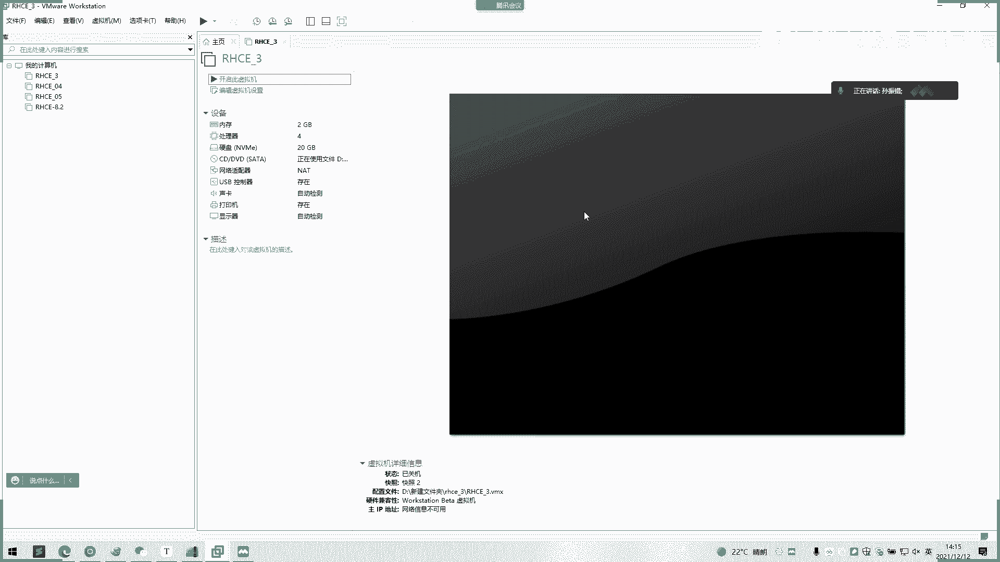
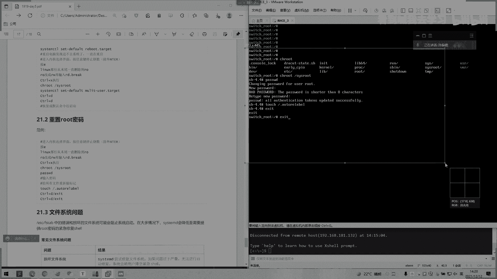

# 2022 01 最新rhce教学视频 - P24：day5-3 - 看到喊我去学习 - BV1Na411y7SQ

Okay。我们上午讲了一下呃，用户计划一些简单的一个实操。然后的话。我们下午来讲一下呃。剩下的一些课程，一个用具，还有一个就援模式。好。我们上午不是配置了一个。嗯。配置一个定时任务是吧？

我们配置一些定时任务，他自己去执行。哦，可以在咨询吗？然后呢，我们看一下这里。呃，20。2。2的用户计划任务。他说这里还可以有一个专门的一个文件，就。这个好像也讲过，所以是。用户一个文件。

就路ot用户下面的。

这是我用一个杠一显示。这用户文件呢就是记载我们的一个定时任务，当前用户root一个定时任务的。

啊，配置。配置信息，然后写一下。嗯。当前。啊，在这个。第三面。bo spoon，你要有个硝烟。然后我们还可以用去命令格式去看它啊，第一个杠I就是。列出所有命令，列出所有的一个。一直进行。这个一样的。

然后杠一就是编辑任务就编辑我们里面这个刚刚那个文件。然后更拉了就移除所有物就。哦。没有了。杠一是移出啊。不要随便用杠一。嗯。他用一个杠L查看任务就没有了。啊，你交务室模式已除用。啊。

我们看一下这个调控式，就是他会确认你要不要移除，这样子它会有个提示。嗯。有啊。啊。那你指定，然后杠。永此。看一下。哎，那这怎么用？抗优势user仅移出仅root都可以用指定用户的管理任务。Yeah。嗯。

那是。是下面两个参数。嗯，后面再讲，我们讲一下控制用户计划。然后这里它有一个限制几。BDC刚到下面。A love。我可以用麦我去看。因为我们刚才是没有做的，没卖，那也没有立。修改默认。这个范例。

我的一个修改默认的一个开R文本文件编辑工具。就是我们打开的那个杠一，回以去把它变成1个呃VIEN1个编辑。我是。嗯，我根队他们操作。嗯。Yeah。是这里。组质不一样了。

可以。应没。这有个翻译一个pass一个变量。嗯。哦，啊，那也一样的。我们这里没有设那个pass变量水真是没有。对。你要第二个，他是在脚本这里。我们设可以说一下。嗯。Yes。O。嗯。嗯。先打五个星号。

送来之前打不行号。他每一分钟。或者是像上面那样，还是5个型号。UCI对就是创建一个用户。我们自己穿这个去看。完。我们等一下看到生效。我们看日志。但这台没有去。没事。零9分。嗯，第10分钟左右我们看。

既然说课户链接，我这里只是输一分钟，当场进演示就可以了。还是09分，等一下。然后下面这里有说注意运行激活标准，之是可以邮件形式通知相关用户。这两个是没空啊，传案中不建议使用的一个。这是命令。

然后后面就是丢功能。把运行结果的话。啊，都都都丢丢弃。然后他有一些运行结口会发给那个相关用户。他从用户中不建议使用一个百分号。对。这个是除号，它有特殊作用，它表示换行了一个特殊意义。

写第一个百分号后面所字个账号被当成命令标准输入。这是。这不要用它。OK你看O。这里执行错了，然后有一个。哦。没权限啊。我们看一下。是没时间，因为我没有看没有没有执行权限。ts这个。看到没有没有执行权限。

117775吧。啊。嗯。有执行权限才能执行啊。那我们继续看这样的。11分我们看12分是怎么样的？好对。然后我们看这里有个范例。他这个有个。百分二注意。啊。你看这己后面日期是吧，我等一下，如果不懂的话。

我给打出来。是不是这里的一个命令就是打印当前日期嘛，但是他会以百。呃，百分号，然后前面有个反斜杠，一个。就转有一个转移嘛，感斜看下转移的意思。你在这里面如果百分号的话。

就是通过返权框去转移才能去使用这个百分号。这个要记得啊，我们看一下。8分。Uside command not放。不是病。嗯。我。你看下这有没有这用户。直接看这就行了。是有个hellohelo。

第一个的话是。第一个就。你看。这个就用不了，然后这个就可以用。就是人。Yeah。这是个区别。没。嗯，然后他自己有个练习答案，每天6点之每个的执行，这个可以自己去看一下。啊，然后定时用务的话。

我们可以先讲到这里，后面我会结合练习的话，再去让你们去更加熟悉这样子。因为这个的话都是比要通过练习去去操作的。你看这个CP这些之类的。然后我们讲一下就援模式，就援模式的话就是我们重置录口运嘛。

然后今天课堂好像就花点时间，让你们在课课上直接就练习啊，一直练会为止了。这一个的话。考试的话，第几第一道题是这个，那没办法。如果如果进不了，改不了录制密码，这个后面的题目就白白费了。前面情况是白讲。

ok我们直接就讲一下路呃救援模式啊。他是说他自己的情况是说选择错误启动目标，导致系统法正常运营。就是说或者是忘记录本密码之后，我们可以去使用这样的一个呃操作去执行啊。啊。

好，这里的话可能看都看不懂，我们直接就。好，大家好。O。我们先搞个坏照啊。那你有什么问题我们也拍照回复啊。我这个咪购呢。

哦，我现在是已经关闭客户端了是吧？我们点一下开启虚拟机。

最一定这里。选一下按一下屏幕之后，它已经进入去了。然后我们按一下上下方向键，它是不是已经就停留在这里了，是吧？然后它下面是不是有个提示啊，us色的上下方向键key to change的。

selelash然后pri按一就按一的话就是编辑是吧？去ad。the select enter或者 C是吧？我们这里按一就可以了。我们选择第一个，我们按一下一。这字母一啊，不是1234的1。

看到看到没有？然后我们的方向键是可以去勾选的。是啊，然后他这里呢。我要给他截个图先。Yeah。是不是有个RO。

救援模式。

这有个就这有一个O，然后我们回看一下这里文档。

把这里删掉。

这样子这样子好看嗯。是不是他叫我们。哎。进入内核选择界面，就是我们刚刚那个界面。另意键按一，然后我们linux耐内行末尾一直删除到哦，就是前面这一段都要删掉。

前面这一段都要删掉。前面这一段。

一直到快这一段都要删掉。对。你。把我删掉。我在按delay啊，上号删了删掉。Yeah。啊怎么样RO改成RW刚是RO的是吧？加去掉哦加W。15。啊，在空格格说阿D。这个按cttrorl加alt。

这样鼠标会出出来。我们鼠标移不出来，我们按ctrl加alt。改成这样。

系。

好。OK我们是不是改改完了？然后你看屏幕提示是不是有个b control，然后杠叉下面这里to star是吧？然后还有个conttrol哎，杠C，就是干嘛按下crl杠叉重新启动。ok 。是不是？

是不是已经进来这里了？看那个switch，然后哎下划线root。然后他在我们自上，首先我们用这个默认CHRO。有个铁铂真就回来了。然后我们加个。斜杠SYS路ot。SYSro进来。啊。啊。

这里我们看只个重置密码在这里看。root，然后现在是已经进入到相当于windows1个PE工具箱，你就可以这样理解。怕师傅，我这里直接。直接回车就输入看到没有？只示一个chanren。

pa输我 loseroot，让我修改一下root密码。那我改成一个loot吧。啊，输两次。抵制成功了是吧？提示成功完，我们根据这文档，大叫我再toss一下。Dian。没有。阿姨呢部。这里话AS。

然后再再退出来的话，就是。

嗯，我截个图去。

小法。

开回说。他就重启了。

喂，我们点一下这里。这里有个no list不存在的用户，那我们自己去定义。Notot。OK这样一个呃修改修改路的密码了而已。一个扫作就完成了。好，你们现在就开始去做练习，第一课马上。啊，三三多也没事。

山东也没事的，一样的。三多你也是重启就好了，一样的。O。远程同学下直练习。练起道会会会的话就可以。我们现天开始。有什么不明白或者可以说或者截图发群里。然后面现场面试的现场面授的同学。

现在马上就可以做练习。有什么不懂，我也当场去跟你们下去讲。

