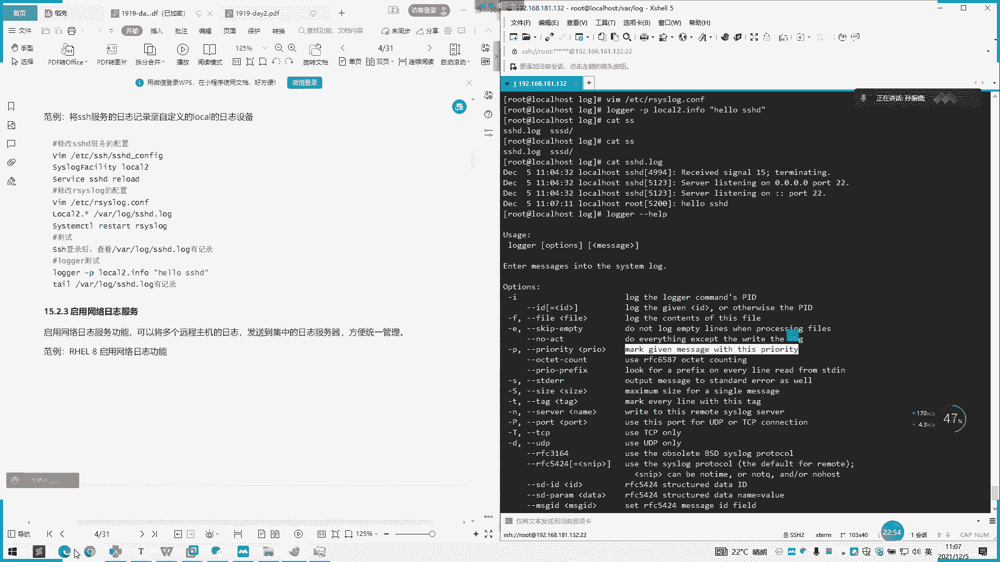
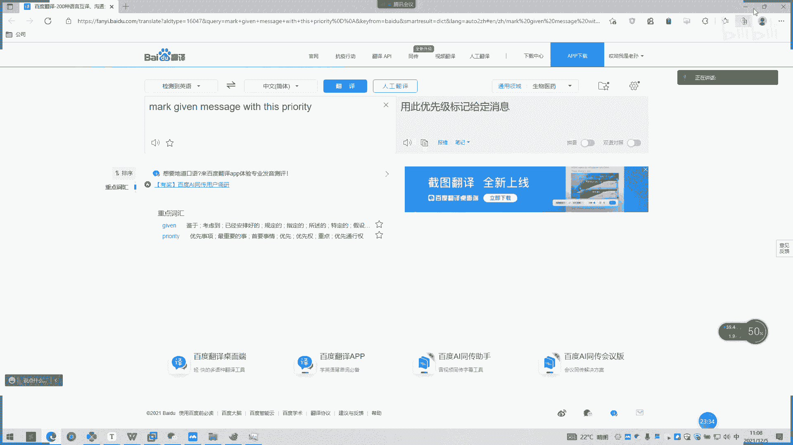
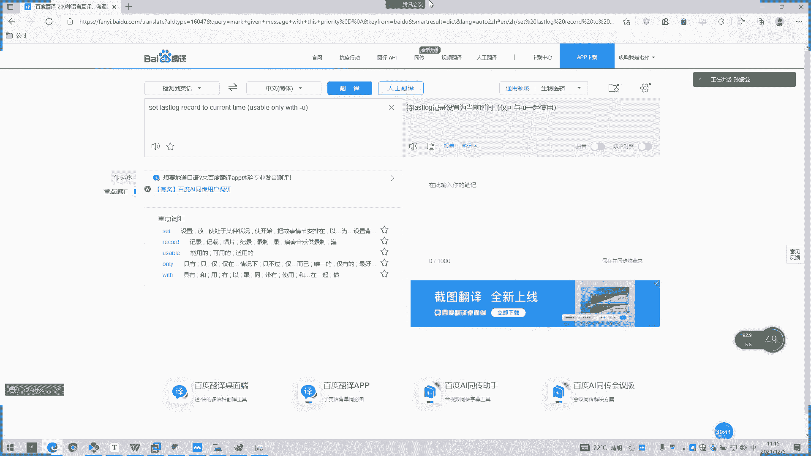

# 2022 01 最新rhce教学视频 - P25：day4-1 - 看到喊我去学习 - BV1Na411y7SQ

我入品反而会忘记。他这样子说，将这种日志的应用呃发生的事件记录到日志中啊，以助于排错和分析使用。呃，日志记录的内容包括一两个东西啊，一个历史事件、时间、地点、人物事件日志级别他会也有。呃，不一样啊。

实点关键性的程度，因有个log level判断，比如说debug啊，或者是infer那种信息啊，或是忘能警告啊，或是er错误的这个信息啊，都会记录在一个日志里面。然后我们系统日志来源呢。

呃在红帽的系统中呢，我们日志通过sstem log协议来进行记录了。其实其中的记录的服务有两个一个就是我们刚才说sstem装serv，这个我们可以看。还有个把服务有关开机引导有关的事件。

以二进制的文字形式保存在内存。如果系统被重启以后就会被清空。那我们这个主要的工作是什么？就把。二进制内容转化成文本，然后它会保存在遇到各个项目文件中，我们看一下。

咁听日有冇落雪雨。有没有？这些都是一个系统日志啊，一个录啊，这些启开机启动啊，然后这个是定时啊，不让定时啊，安全的。然后他他这己下面也有说明啊。啊。呃，messages呃的日志什么？大多数系统呃。

日志消息记录在指数，例如包括一个身份的一个认证。比如我们SH呃进来它的一个登录信息，它也会在这里啊，然个电子邮件的处理调度呃，作业执行相关的信息，纯粹的调试调款信息啊。看一下mes，没我操。Alas。

所以有。是有这些。然后他以后有个日呃一个切割。我们的安全日志是这样。安全认识s。de是没有我服务我的系统。有什么异常？有是空吧，这没什么意思。还有说与邮件服务的相关信息啊。Mlo一样。还有一个调度。

这个应该是多一点。嗯，你这里没有。知道这里没有题。还有个定时啊，不put头我们看一下。大家可以看，可是没有。root的话，我们可以看一下之前的。看有没有。今前的自有啊。刚好，我这里有点奇怪，我这里没有。

啊。显示有，他会把开机的一些启动信息都会打印下来。就是我们服务器开机启动的时要刷刷一一行。一个屏幕东西就是这些东西啊，这些启动的一些。我知道佢只会喺这里。这不他。哎谢。그。这腿这也有。嗯，这可。

他一般是前面都是呃时间日期，然后。啊，登录是谁SH嘛，就SH协议登进来。然后后面做了什么做了什么操作。通过怎么用哎端口去登记来。是吧，这里都是有的。啊，这密码通过了认证或者密码错误的话。

都会有打印在这上面的。然后我刚刚是不是做练习的时候，我们创建那些组啊呃创建一个user啊这些他会把创建的一个信息有的登进去来，然后啊增加了一个用户，他的组是谁谁这些都有。嗯。现在都是会会有打印的。

在一般都在scurre里就涉及这种用户的这种权限的这一块，他会在sre打印。好，我们这下面有有讲到系统日志一个服务。啊，这个可以看一下。哦，我读一下这个。呃。

sstem lock是红贸六以后版本的系统管理，它提供了高性能初色安全和模块化设计。尽管呃Rst lock是最初是常规的这个semlock低，但是发展已成为瑞士军高一个季录啊。

然后他每秒关注的每秒可以将超过100万的消息传到本地啊。其实在远程的目的有更清晰的处理中，性能通常被称为金额。就他他每秒超过百百万都没问题啊，反正官方上面是这么解释。然后这有个官网。

我也点一下看一下。啊，这有个跑马，这是记录他那个。啊，这些日志。是如何去写的，大家可以看一下。他是怎么一个实现原理，他也会在上面讲到。这些都是有，大你去看一下。然后他自己说了一个特性啊。

这个也是个多线程的一个呃一个服务。他也支持1个UTPTCBSLTTLC这种协议。然后这些mycyclcle啊，PG circleicle的话，它也是实现一个日志存储。

也是通过这个的一个呃一个服务去实现一个日志存储。它还有一个强大过滤器功能，可实现过滤器日志中任意部分，还有一个自定义输出格式，就我们可以自定义呃输出我们想要的一些东西。

啊，不仅是日期啊，或者更详细的信息都可以自定义。所以企业集中了中继电。然后常用于收集的一个呃日志的一个市面上一个东西，现在比较可用啊，这是12K嘛，就ellect。

呃，分别有三个组合原来设置啊，log star、可banana，我们统之为E2K嘛，只有前面三个字母。它是一个非关系型的分布式数据，基于阿帕奇软件基金会项目组成。它也是一个开源的分布式搜索一经。

你就像在上面可以直接去搜啊，你想要的日志都是可以的。它提中一个界面化啊。哎，我能不能打开给行？你游戏。哎，网络有点慢呢。呃，大家可以看一下官网。然后他还有一个大规模的日志数据都哎进行一个处理。

脑子上没有。它是一个搜索分布式引擎。相当于这个是纯日志的，然后这个是收集的日志器日志收集器，然后这个是展示的一个呃。展示的一个界面。嗯。他这也说那个star command了。不不。

采集管道Ota灵活的可塑化可办了。

然后他这里也有嗯。啊。

可以看一下文档这里我们点一下文档。

瞓觉吧。嗯，等一下我导我这里他已经更新最新的这几个7。51个版本。嗯，这里文档就很详细啊。一般的话我去装这个ELK的话，我也是参照官网这文档去装。大家可以养成个良好习惯，都是去官网上面去看这种文档。

虽然还是有坑啊。会是后后续是有点坑的。

这些。都是有这是收集器。

嗯，这些他是各做一些参数模块的。有头有个烟飞。嗯。详细的大家可以去看了，我这里先。

说到这里。然后我们说一下这个系统日制一个管理。我们系统日志的话呃，它这也说明从程序功能上对日志进行一个归类啊。也就是说我们。呃，归了一个特种队，比如说邮件啊或者是安全啊，或者是我们一个用户的一个日志啊。

或者一个系统这种运行的服务的一个日志都会都会有。我们现在这些所档次都是都是各种服务的系统日志。然后这里还有个优先级啊，这一是。Poity的一个优先级，这是一个我们日志一个分类嘛。

要debug或infer，然后你要警告一个信息all啊这些的。一般我们看一下al跟in info是一直都会打的。然后艾的话，如果你系统有报错，它就会打出来。debug的话就是会打更详细的一个信息。

就是你艾有报错，这debug的日志会打的更详细。啊，参考帮助可以为魅商。听到了，我们这去挑。是他就这些一些更详细的一些信息都会在上面记的这些方法啊，怎么去调用啊，这些都有。个没了好，就是。

系统一个日志收集嗯。And a message into the system lot。是的。啊，这些都给你看。呃，加D啊，后面加一些参数啊。有些协议什么的。然后这里还也有介绍。

0零级就是代表一个呃延呃，就是说系统的日志一个等级啊，零级的就代表一个系统不可用啊一级呃。一在买01必须采取立即措施。如果说是二呢这是c这临界状况，然就是非严重的错误警告，会证错误情况。

然后四才是警告情况。然后notice就是个正常但重要的一个事件，infer的就是信息日记啊，这我们经常打印种信息日期都会有debug调试级别的一个日志。一般系统话就会用infer跟al打的比较多。

有系统不可以用的话，你他系统坏了，你也看不到那日志打打印了，可能就可能打印打印这一个东西都打印这一条就就死掉了。然后这还有个三呃配置文件，它存介绍一个配置文件啊，配置文件的话有三部分组成。

一个一个module是个相关模块，还有一个gbal。哪个全局配置啊，要ro一个日志相关的规则记录，你直接看。自己看。开进去ETC。到。一开始进来又边给我介绍一个摸标模块是吗？然后我们就录这个模块是吗？

嗯，系个 group。全局模块在这里啊。这个都会有啊。然后一个配置格式，他也就是说。嗯，我们还要录制。嗯。这里的话就是对应一个配置格式啊，这里就是我们对应我们所生成的一个日志的一个路径啊，还有一个文件。

你生成的一个文件可以自定义啊。比secre后面哎制定一个什么secre什么呃hor啊这些都可以自定义。然后这里就是规则嘛，你要打印里面什么东西都可以。

比如说我把呃呃那些L日志打印到其他的不打印到一个secre的一个日志里面，我打印到其他，我以自己设一个L一个格式。然后他这里有说。嗯。Fility格适faity。指定一个范水。

然后他这里要说一个per的格式，你要星号锁有级别不 no就是没有级别的。嗯，要呢没有级别也会打印指定级别以上的。啊，以上所有级别然后一个等于要紧记录指定级别，一个日志信息。这一块我们可以了解一下就行。

摇海说一个t的一个格式啊，日志路径通常在。VRVR yourlog下面是文件路径的前提表示一个异步写入，它这是一个异步写入的一个日。东西啊，然后用户的话他会加日志的。事件通知给指定的用户。

型号就表示登录了所有用户。然后日志服务器啊at house就是本地的一个服务器。他会把日志送往指定的远程UDP日务。行，如果你远程有那个日志访问的话，他就慢慢去送。这样。管道啊这些。啊。

通常日志格式有很多种啊message啊，这些都是基于类似格式，格式如下，我们这里看一下视例。哦，这是会首先是打印个时间嘛，然后我们。呃，打印一个serv哎，不是他这里就是。我这的话就是看。啊。

这些logo好什么打印本机，我是登录本机就是打印本机，我是在本机操作的嘛，然后它这个info。啊，这是个inform的日志嘛，日志类型嘛，然后我们会再打印一个。这个吧。这好像是一个1。16350111。

好像他们系统里面的一个二进去时间吧。我记得没错啊，是一个系统里面要争据时间。然后DHCP4啊这些执行的是一直获取IIP嘛。感兴趣可以回去研究一下，每个日志的打印东西可能不一样。嗯。嗯，大家还有个事例啊。

将SH的日服务日志记入到自定义lo后设备中。那我们可以试一下。还有个O system。W it's。那就。第一个。打 you。他这上面有说明。是inform呢级别日志还是什么日志啊？那我们设置一个。

嗯拜拜。哦，买的注是一下，那看一下。你老。嗯好。我们把程序处理一下。Still。你到了以前大都可以啊，你这大。让我们快改一下这个系统呃。这是一个。对加上。自己家吧。其实。Local。啊，行。

我们这里对应的写上就行了。我再重结一下。这是那我们看一下。Yeah。This is。哦，没去生请。の。嗯。이제。你看见。Yeah。么还没错，这一块是没错了。哦。是的。Yeah。Yeah。先同一一下。

嗯觉得。没有。我可能要打错了。想要承担这里。这要改一下，会变小太。是不是就成常？OK我这己写一下。稍等。诶。Yeah。系。诶。看点这里不是有吗？等下我我改完这些东西。什等。Yeah。

对。

Okay。那，我们日志已经生成了，那我们。用loggo测试一下。都ta啊点 four。老。E。然后我们来看一下。有个 hello的小弟。放批是吧。啊。可以看。给个信息。到个到这里面来，就是输入日志嘛。

你可以理解为把假日志输到这个服务信息里面去。啊。

接。对，相当于一个追加一行。

系。不防疫。大都反应早事啊。所以怎么说，用此优先级标记给定信息啊。No。

不懂，我们可以百度嘛，是吧？看不懂就是百百度就可以了，没事的。然后我们啊这是我们一个自定义一个消息消息啊，我们日刚不是设了一个自定义一个路径是吧？然后我们还。打了一个呃helloSHG进去。

然后他会输出个SHD上。然后振还有说做了一个启用网络日志一个服务，启用网络日志服务。怎么说，可以将多个远程主机日志发送集中到一个日志服务器，方便统一管理。哦，那就相当于收集器嘛。

你可以理解为一个日志服务器，相当于收集它吗。嗯。这边的话，我看一下这视力好像有点。好。哦，他这里。省略了他在model模块下面。去操作的。这一块我们有没有有没有日置服务器？呃，我们可以。

后面我看我看一下想办法给你们演示一下。然后我们先介绍一下下面的一个信息吧，常见一个日志文件。然后一个secre，一个系统安全日志嘛，然个BTNP什么？嗯，当系统上面失败，尝试登录还。E tM p。

是不是这个。我直关了，我们看下之己信息太小了。啊，他打印这些类似一个二呃，后面的话好像就是一个二进制一个东西吧。前面的话它会有1个SH啊，用户是什么？你要的IP是吗？然后个WTNP我们来看一下。

我看一遍。哦，这好像是用那。Yeah。Okay。那个拉死他。他是我之前登录的最早最最最前的上面就用那烛。嗯，如果是当然用pa的话就不一样，就是显示的是二进制。因为我们用蜡烛就显示这样子。Bein。

用户失败，然后下面这个WTNP是用户正常，就记记一个区别，就是B就是B开头是用户失败。W上面是用户正常的一个日志。然后lastsn这里有一个最近一个能。嗯，是用那。单独的命令啊。嗯。我看一下。

不能直接打开吗。调一下。Before how you say。有。Yeah。放 you rootot。嗯。这样我不记得，但是我看一下解释就知道了，他是不是输出每个root一个。之前登录了一个信息。

那我们看一下没看。哦，嗯，说错了。哦，你看是不是要求不一样的。再有个什么？输出啊第二，那我加个题。你讲问题。没有。两天是吗？他们说两天肯定没。B这个怎么用呢？没事，我们再看一下详细的那个命令。嗯。放题。

是啊。是啊。在哪天居啊。这没错。打系。不要这啊。哦。那他这己就不。不加不加用户嘛，是？他就把所有用户都西打印出来嘛。嗯。当时可以啊，这个清楚嘛是吧啊，把之前就是这清楚。

这两个befo before怎么呢我们看一下。放逼。哦。这些。

没有登录过。

没有登录过的。这还像是没有登录过的，都会打眼。那怎么说？

啊，好。详细的看一下，您打因为。好于多少天的一个日志。

对。然后这是什么？加个大是什么意思？你看一下。

Yeah。

要导入的一个目录。跑路了。那这什么这设置了。设置上。

将蜡烛是日志设备当前时间均可以鱼一起使用。

行。有小白花建议从这里看起，从从重打票去看起。OK这里就有介绍呃，bo是系统服务的一个日志，文件文本格式也要 messagesage就是使用大部分的一个日志。然后这个是安装系统，还是安装这，应该。

诶哦安装系统。网卡IFCFG。哦，是不是把把我这些网卡信息打印出来了？

嗯，就。

我修改绑卡了一些信息，他会往这里打印。DDNF。DF不是DF啊。安装安装云的1个D云包，1个DF啊，我们的一个安装包的一个管理。嗯。这些都有啊。The新 look。系统的因为是他这里也有。嗯。

只一般的看message跟安全日志比较多一点。然后这种登录制也可以也可以看，一般是看这几样。然后这有一个系统呃。管理日志有一个工具啊，装点。好，我看一下。这没用的哦，这么多。啊，他这里讲。

我冒期以后的版本，一用系统口音管理所有unitity启动日志。启动日志吧，带来好处就是可以只用一个这样一个minute可以去看啊，内核日录就我们不不用再进来的什么呃这日志路径，然后再去找嘛。

你要他自己按个日志费是格式。看一下。就刚刚我们不用再一个个去翻了，我们直接用看这个命令就可以去找到我们的日志。四点知吧哦。う。嗯，对，注释注释的默认都是开启的。为什么storish啊，这些的。嗯。

他这也有说明啊，显示最新啊。刚刚。刚刚是第几条限制。打印多少条显示所有的日志not top也是用于撤销。然后啊是反转日志输出。星息最申请示星期控制日志哦哦是控制日志输出格式。默认格是数题。我们看一下。

一个个来。Yeah。再来。嗯嗯。Yeah。我。啊，如果是回车的话，还是直接打印这些。这个好像是。系统的日子B。钥匙他也打印出来了。ok。继续。他来着吗？还是来巡部。NF远著。同意。钢茄日板诶。

这些服务的就是就mes打印就好一点。第二。嗯。100条。显示所有日志堂。好像没什么区别。还个控制日志行的一个输出。啊。谢谢了我。简单介绍一下就行了。考试的话好像不会考这个。大家支持。

这里这这好像我记得好像没有。这个东西。这我读一下了，这数题。呃，Vbo以结构化的格式显示每条日志。我 boss。哦。没有啊。嗯看就笑了。嗯。So yes。嗯，UTC。嗯。

UTC它是只写按按UTC的时间去打印出来。唔系人。浦东深圳。不显示热高警和混火模式。这下面很多。像有个。嗯。唔你要家。这有个范例。按照30敲一下。内核是。ok。对。然后启动。查看系统本次启动的日志。

当逼有是。0。谈开创业设试。阿姨。本次是嘉0。就说指定更新时间。Thanks。没到。202零2零21。三月。诶你我。不写说。Okay。那这个显示一个bein。放这里的。呢个情况。上意次。20分钟之前。

Oh。Yesterday也 he through yesterday。嗯，有没有发现都是考英文的？Yes。因为因为因为好一点。完全没问题啊，觉得这个。阿零啊。二。12月05不是05。

是吧这是里优田就加个优田啊。没题。啊零啊二。上一页。你听。对的。嗯，他没有显示打印出。可能我之前设置时间不一样，所以它没有显示。我之前设置时期可能服务器有点不一样。诶。有问题。所以说服务器的那个时区。

大家要首先要设置好，不然像我这样之前装机的话，没有设置好时区，他现在打印他可能就打印不了。哦，看显示最近支好。开就行。最新的一字叫杠F。一般采的是什么，就是个杠N和杠N啊。然后一个。

还有一个可偿按指定服务的。有。你看一下这个这个命令的服务日志，还有个PID。嗯，加D等于一的。这个BID有点不一样，就是要加个下划线了。加个下黄线，记得这也要加个下黄线。看一下HGP系多。哦提一下。

H一批啊。看这样。十点噶。因我用root用户取的，但是他们有些下面是那紫禁城，阿帕奇的直禁程就是HEP下面他用阿占用阿帕奇的用户日取的这个1个HDV服务。但主成主进场附进城就是路而7的这个。我们看一下。

Okay。EID等于。567。电台也没有打印纸，我觉得7掉。哦，有。嗯。他打开了一个钉钉端口80啊。我们这里访问一下办理。我跟时嚟今要求。2。168181。932。啊，这是我为HTDP服务所打开那个。

页面呢，然后我们再看一下他有没有我们一个登录信息。哦，他这没有登录信息，他只是打印了我们一个。我这的时间呢。他就看不到信息。那写机微信展示在。关啦佢多声。G g p。啊，在这里啊。那个指定用户的一个。

电视。我看一下UI。我们看一下。这两个就比较实用一点。PID啊UID这些的UID指定用户嘛。如果是知道的话，就是。2，40。嗯。对。

睇点点啊。Yesterday。Yes到这O昨天的也打印是吧。可做下笔记啊。睇 u y g。PI d。还是两个。还有一个。打印天数了。十点钟。显示接近所以说一下笔记吧。嗯。这几个比较重要一点。

显示系统进行运试。同学们可以不用记太多，看自己要。详细的来。嗯还个十行。嗯。默认分页。这些么追审啊这些。这格式啊，待会你自己去看。嗯。我们休息一下吧，休个10分钟，我们10点40分再来讲解。

