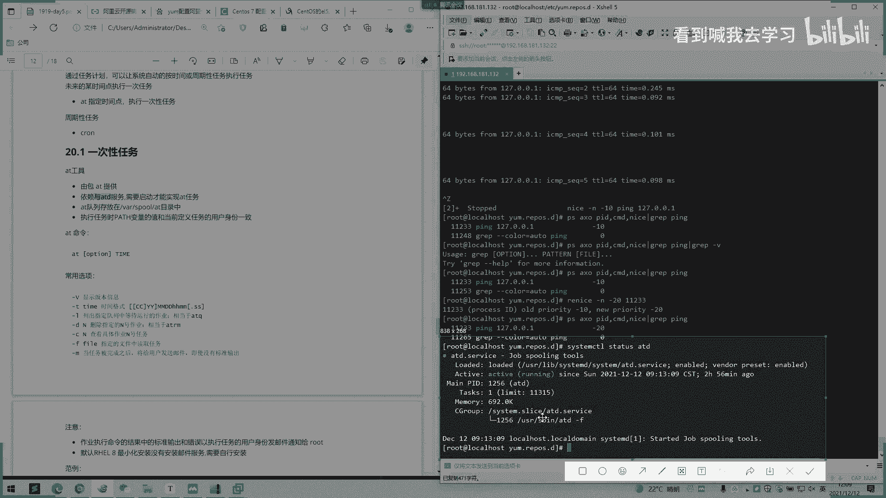

# 2022 01 最新rhce教学视频 - P26：day5-2 - 看到喊我去学习 - BV1Na411y7SQ

哦，我们有个影响进度调调调度啊。呃，一个首先介绍一个进度一优先级，然后他说一个优先级，0到99是一个，还有100到139是一个0到99呢就是一个实时一个进程。这是我们实时存在实时执行一个进程。

然后100至139，这是一个非实时一个进程。他有一个优先级，比要系统优先级。啊。0到99，然后100到139都有。然后这个什么约胎优先级啊，这个我们可以先不管了，99到0，然后一个nice优先级。

然后-20到0，然后约到19。然后套然后PR我们套1个PR。别看票。这有个屁啊是有个屁啊。好一个逼啊，20。还的RTRT0239。啊，0。林总是什么？还有张T。然后我们可以看一下下面。

系统优先级0至139，数字越小，优先级越高，各有140运行队列和过期队列。然后一个实时有一个优先级是99至0值最大优先级最高就越大的话，这数越大，99是最大嘛，优先级会越高。一个nice值。

1个-20到9019对应系统优先级100至呃139。然后1-20就是对应了119，就是对应139这样子。啊，这一块不如果不熟悉，可以，我们往下看就可以。以后设置和调整进程的一个优先级。

进程优先级一个调整。啊，静态优先级级100至139，进程默认的启动时的一个n死之。为0优先级为120，只有跟只有跟目录跟用户才能降低优先级，这只有root用户才能用，才能去操作这个优先级。

一个大小一个竞争一个调整。啊，一个nice命令，你指定的优先级来启动进程。优先级越高，就意思就是我优先比你执行嘛，这同一个同一个进程去启动的话，这是进程级别上的。啊。

再来个IE nice可以调整正在执行中的进程优先级。一个一个启动，已指定了优先级个启动是nice，然后innice就是一个调整，正在执行的，启动完之后正在执行了。有这样子去记。

然后他这也有杠N杠N后面就带呃这些参数嘛，就100，然后呃设置一个刚他们提供一个区间嘛。然后PID就是那个进程进程号呃，PID就是这些所谓的这些进程号。哦，他有个厂用力啊。嗯，我们先拼一个。这是启动啊。

这nice里面加个1是吧？你们用到后con你接要后面执行下我们打个可哦。DI d。GNGND就是那个资金命令啊。翻家片。是不是？这个PID对应的是这里。他经常是这个，然后CND就是他用了什么命令。

那时后面加一。加了一些参数的吗？是这样子。可儿的小知识。系个年呢。Nice。哦，他说2181那11233。搞阵啊。有看到没有？一开始是1的，现在是-20，-20是。是不是哪里是我们看一下。

ff是不是100？对应系统优先级1版。然后我们再看一下是嗯。是不是也就变了f了。

。这是一个。呃，这里的话好像考试好像没有这道题，这里的话计划任务是有。我们说一下计划任务，然后他有个top调整优先级可以进入。因为你看其实不怎么使用嘛，实际生产操作中的话。

可能只在一个进程就是我们一个进程一个主摄或者几个状态下做执行慢理之个我们调整一个优先级，让优让系统分配资源去优先去调呃调度它去使用这样子。实际生产的话也看实际情况去操作。然后我们说一下计划入啊。

就要计划用。哎，后面这两节计划入跟就业模式可能就比较好比较重要一点。我们说押GR5啊。嗯们，是通过任务计划可以让系统自动按照时间或周期性的任务执行嘛。未来的某一个时间点执行。呃。

他有一个参数外的AT指定时间执行是任务周期进入可。我一般常用的是卡拉比。多。啊，还有叫AD工具ADAD。包含AT包依赖ATD启用长时间AT要只要这个服务。我们看下这个服务有没有启动啊。

APP是有启动的是吧。

这有其动。

一次性任务对，就很少用啊。人种计划。3。要冇跳话。一次性用务。对呃执行完一次就自动执行，这意思。查看。嗯。嗯。

对。嗯，他来说队列放在。那么录中，我们今量看一下看一下。清唔明。你个什么。特别有。啥也没有。执行任务时，pas环境变量，pas时有环境变量pass环境变量环境的一址。

变量的值和当前定义任务的用户身份一致。然后这里还有这些参数，这也是个命令AT。啊，我们看一下吧。我说大V是那个。我想听。上料。应该没有啥都没有。删除更低指定读取文件。然后他这里有一个知序。

它有一个作业执行命令结果，标准输出错误和错误的执行用户使用用户身份发邮件给doot默认628就安装，没有安装邮件服务器是按自行安装。那等一下。跟着跟着大乔。我们看一下状态有没有启动。没有启动是吧？好。

Oh。So。都启动了。

这条命令是不仅启动，还做一个开机日期啊。

嗯。

没有。

嗯，好，我们已经装了是吧？啊，我们来装一个云妹。你。嗯。

同嗰你咩。

To see。然他有什么态呢？定于出现什么时候进行？哎，这个项任务的一个时间。格式这样子啊，天天一个两个大H，然后一个猫，一个两个大M。至少于这样子。哎tomorrow，明天。这都是用英文单词啊。嗯。

这个解释在今日的一个。呃，时间十分就是多少分，这个小时吧，小时然后呃多少分钟进行，又该始时刻已经过了，则明天执行此任务。啊，等点2点钟，那你讲两点。如果是如果是这样子的话。

意思就是某年某月某一天特殊面运执行该预下。这里就加一个年日啊这样子。两年月日。前后面是年日，前面是时间啊。都是按照英文统一格日预输出。然后这里有个tomorrow，明天执行，明天5点5点20分之执行。

下午。哦，这里还有其他的。啊，什么mini啊，然后我对 week一周执行啊，某个时间还加几个时间后执行现该任务那加5分钟就5分钟后执行。啊，PN。三天后的一个下午2点。啊，还有1个AT的任务执行方式。

交互式输入重进项是不是跟那个效是一样的一个交互式下的一个输入。啊，输入重进像AAT杠F也要发指定一下文件。还有一个还有他这里还有个白名单。但这是个控制用户是否执行ADL白名单是。拒绝但是拒绝黑名单。

拒绝白名单上浪。但是拒绝拒绝改为内容执行AP命令。如果两个文件都不存在，只有路就可以执行。でも。Yeah。唔计声。乜。职续操作是里样。看到没有？我们这这是直接去命令的执行。下一。Yeah。这。

比如说现在是12点16。No加你。嗯。Yeah。你看一下有没有例职的行况。这有没有例子？系。Thank you。话。可。Yeah。看一下周期性任务计划吧。呃，我等一下去找例子给你看。然后周心用个计划呃。

主要讲的是这个一个什么，他这里有个然顶IE的一个包主程序包table包含现在OS提供的维护任务，还有一个补充程序。然后他是监控的。要pro依赖于pro的服务。看下卡拉里是不是在。嗯。

是一直在一直在执行啊。嗯，系有个系统用户跟用户用户。啊，系系统维护的作业，这是主备置文件，看一下。BT c。啊。它的一个呃周期性任务的配置文件是这样子啊。首先会输一个这样子。这5个星号你们记录啊。

它就是一个5个星号，然后每个星号第一个代表的是一个分钟时间啊，第三个是对日期就是从从从小到大去排列了。啊，为。一个monsmon死是第二，哎，倒数第二个。分钟时间天啊，月，然后一个多少多少个星期这样子。

然后这也有。他的一个整个日志在是在这里下面。我们可以看一下，就是当前的日志会执行。然后他这里在一机下面，他也会分啊。12分一个。没。看到没有有一份一个偏。啊，这是白于黑名单。

然后时间月啊周期呃一个星期执行的任务是什么，一天执行任务是什么？然后这是总的一个配置，然后一个小时执行任务容，看一个接一个看一个小时。这是系统的系统自带的都会默认有。

这是一个小时系统每次都会去执行的一个呃操作。都是一小。然后这有个计划任务时间表表示法啊，特定值给定时间有效值取值范围内有一个值星号。就我们刚刚那里比如说这个星号。嗯。放一。我们一开始我要敲敲5个星号。

弄出来。是吧给我11分钟。呃，一呃0点吧0点。刚刚是。220。他就101。3分钟过后的1个12。2023。12点。对。你是不是代表12点23的？예。后面我们加一个E口就可以了。没有我打印一个t。

到1个OPT。嗯。三明。那。这里是一个系统啊。给定时间有有效值。哦，这些都不用管了，那些不用管了。是不要看。关键字的话好像在按年。这可以说提提前在这里设可以设置按年按月还是按日去指定它。杠一啊。

就是这里可以去。年月日战这几。上去也可以这样去写。我这里后面你要指定一下那些日期什么的。所以我先不先指定。嗯，这还有的范例啊。晚上9点。十分运行依口命令。啊，他首先是用了一个root用户去运行。

我刚刚没有写的话，就是默认我当前设置的用户。当前是root的话，我哎clo一去设置的话，就是root。

杠一。

怎么。Yeah。嗯。设置。这样子。Yeah。你 areP意思。啊，这个P。OBD就是目录啊，后面跟的就是一个目录名嘛，后面有。哦，那你23吗，我看一下你看有没有看到没有？是打个雷害出来。

啊，1秒有1秒23分。是不是23分之径呢？嗯。

对应的是不是？然后。

嗯，盘截的不太全。没有呃，系统的目录都会有的对系录。

对。

Yeah。啊，这是一个基本的一个啊定时就这就是这样子。然后他这里来设置一个天了，他就为了好区分，这不会在一个配置文件里面去写，就说年月日你每每天或每月执行呢，就资他分了很多个目录，一个时间呢。

你每小时执行，你可以在这里面去写，然后每天执行呢可以在这里面写，每月每个星期的或每月都可以在这里写。嗯。是吧。你看这里有。这里的话就是整个的这你可以都给都给一句设置每天每小时每月每个星期。Yeah。

这也是执行脚本，配你要执行什么脚本，在这里面是。配置文件在这里。是吧。

。

Yeah。用户计划。嗯，每3小时。哦，再说一遍每单小时。我。P。刚我们说了一个定时啊，要每每3小时后是每分钟是怎么动的呢？你有，他调个舞。5个星号。五信。아。好，每上小时我们在心后面加个杠就可以了。

每一分钟啊，第一个是大百分钟了，每一分钟执行一次这样一个命令。好。比如说每三小时，你这这呃。可以看开个每三小时就可以了。我们为了容易看点每一分钟执行一个命令，执行这样的一个一口命令。

我这里的话指定我指定一下。Notot note。O。Yeah。我们看一下。这个配置文件是不是他能改变就知道了，可以看这时间现种。现在是28分，我们看一下29分钟它会不会变。摇后他后也有一个密令。

我再讲一下，每个用户都有专用的一个第个任务文件，在一个VR spoon plus下面就是name。然后默认标准，我们看一下。没有。是不是？

默认标准输出和错误输出被发送给邮箱，对应的邮箱user创建用务发送给user呃，创建的邮箱root能够修改其他用户的一个作业。你要root的用户可。用cle中的默认pass。

这个如果使用它其他路径就是在用户上加个pass，就是加增加一个环境变量，指向其他的一个模型。我们看一下。嗯。怎么还没有生效呢？그。嗯行。嗯，我看一下。nock。哦。看到没有？我们日记这里。没有。没有。

去掉吧。呃，好看一点，我这加到03了。嗯，可能会不会执行。OK有了。看到没有？有了。有。

是不是有个03。

OK这是我们的一个呃基本的基本的一个用户计划一个操作。

然后我们下午再讲一下呃具体的一个呃详细信息一个一个原理。OK我们今天课先上到这里，我们今天下课。

我就这个样子。