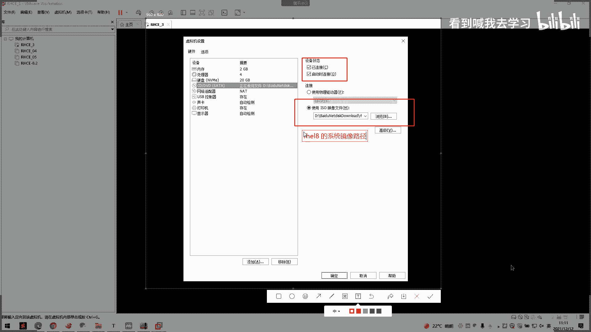
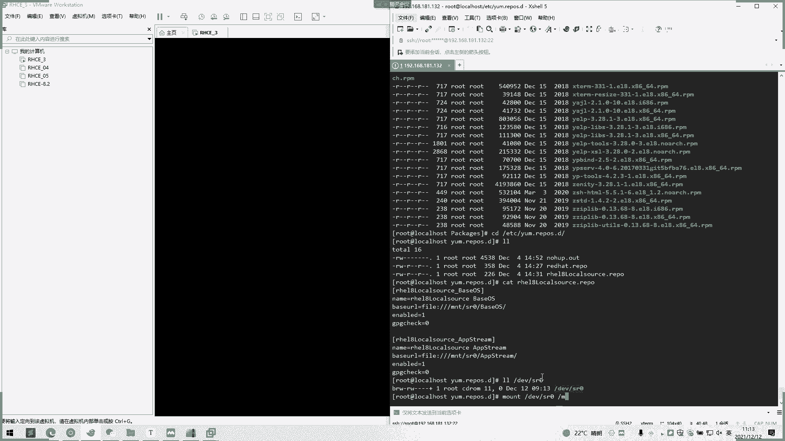
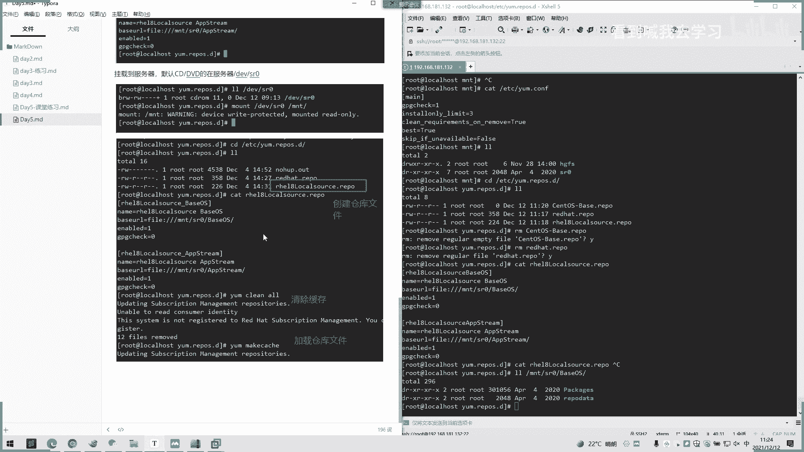
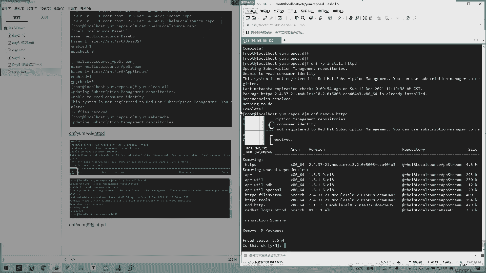
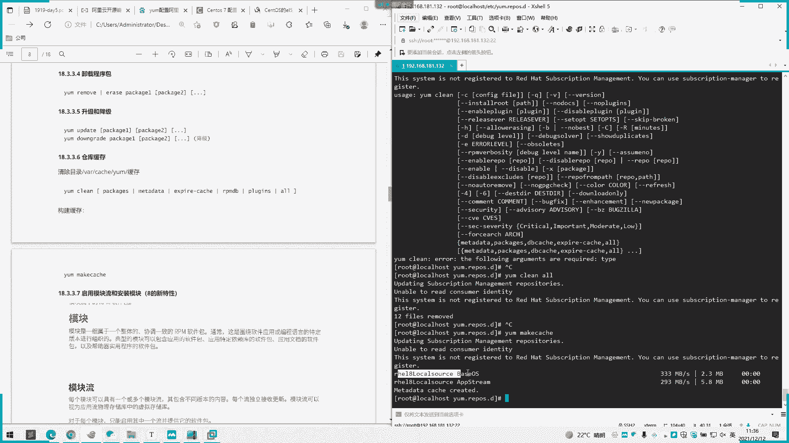

# 2022 01 最新rhce教学视频 - P27：day5-1 - 看到喊我去学习 - BV1Na411y7SQ

啊，远车的同学听到扣个一啊，我们今天讲新的内容开始讲。那今天远程有多少人？看一下。这远程多啊，46个人。네 뭐。买个。要。你对。哦， ok。我们先讲一下呃，我们首先看今天的一个呃内容啊。

我们今天主要讲的一个有几大板块。呃，一个软件包的管理，一个系统调优，一个计划任务，还有一个我们的一个救援模式，也是我们一个重置入场密码。然后救援模式。这里我打算呃花时间少一点，然后我们让让你们实操。

就是说当场去重置入场密码去呃去实操。因为这一这个这道题的话就是第一题，我们考试第一题就会直接重置入场密码。如果说你。无法重置入手密码的话，你后面考试的那些内容都是零分的。对，所以这块可能比较重要。

OK我们现在讲一下嗯。第一第一节课内容，一个软件包的一个管理啊。呃，我们知道这个软件包的话，呃，一开始开源文件只能提供一个t打打包个源码，就是他们写好那种编译源码。这样子我们举个例子。

我们去ge他上面找一下。他这里说是开软件最初只提过呃t点狙击有个打包的源码，用户必须自己去编译每一个想要你子上运行的一个软件。啊。然后他自己用户急需能够提供一种更加便利的方式管理这些软件。

然后他说这样个管理工具一开始是个DBKG，但是呃可以管来DB后缀的一个包啊，这我们了解一下就行了。然后从而注明的package的一个概念地址出现。比后少我们后面的话。

红帽这里也开发这1个RBM包的一个管理。我们PN包你可以就想象成一个windows的一个安装程序。一就是DEX1后缀的那个那这种安装程序，我们点一下，我们双击打开，然后我们点下一步就完成了。

这样子去安装。然后这个也是一个圆脸，你把它想象成一个呃windows的1个EX1个程序。我们这里说了1个RPM包。然后他说。开文件只提供一个狙击一个包。哦，下不了。开吗。

ok。好，我们打开结号。

哦，我们比要说说概句吧。好吧，啊，我们的N距点进来看一下。NG啊它是用C语言去编译的嘛，所以的话你看它会提供一些呃。SRC啊SRC就是一个他们代码嘛，他们目录下面一个代码那。他们是比如SGP模块啊。

它会给你什么一些东西。你看这些都是一些代码文件。然后我们一开始呃装网的话就会提供这些。然后我们再捋履历师这边看一下一个t。是是他自里有这些版本的，就是软件包这种版本，是一个版本，有如是1。1点20。

2的，然后这里就会有一些呃包的一个后缀。比如呃他点狙击的一个或个吉吉ep的一个包，我们点一下这里。等一下加速，因为我这里装了一个酷谷歌一个软件，所以它会有一个加速点套出来。如果没有装的话。

一般都是只有这两个一个G包，一个插连机G包。哦，打开。啊，是不是进来了，这些都是呃我们刚刚那个代码文件，这些都是代码文件。然后我们在这里下载出来的话，就可以看到呃这样的一个信息跟这上面是一样的。

这些所谓的文件都在这里。这是这就是一个呃。我们说的一个开源文件啊，只提供哎这种源码文件一个打包一个出来。然后的话呃。这有一个工具查看文件。这个就是我们把这个开源件导定哎，放进去。

我们也以看一下。看也不。

放个猪吧。

即。啊，直接拖啊直接拖就可以啊。我们这里装个。诶。呃，配置完软件商户，我们可以装一个ininstore那个东西。给你拿出来，然后直接。他这就比较方便嘛，直接就直接拉过去就好了。

就直接11点住一拉就拖过去了。前机是要装这个东西。

这个笔记先稍等一下。新建。嗯。呃，对于。Thank。那0先包的管。删死下。好。八进制安装。巴清岁。O。Yeah。好，你这样子。看着前提是要安装1个IG。我们装我们刚刚已经拖过来是吧。

我们刚刚已经拖过来了，我们看一下。是刚刚这个NG releasease的1。210。2的1个G发在这里。然后他说这里有个呃CPIO的一个工具啊，我们我们数一下，我们看下有没有。啊 p n。

包黄建明马天据。嗯住。CPI操倒德技巧一遍点comITV。他说这里是2边包管理。找下，那我们找下这里没有？我只找到一个channel。我们就用这个去演示吧。哦。GPI哦。什么。杠来。体育。嗯。这个。

我们看一下下面的一个软件包管理器的一个介绍，软件包管理器功能。然后他说可以利用包了可以方便的实现程序的安装，卸载查询升级。常见的是有啊，这代表是一个呃一个类型啊，叉86啊A386S486这些的。

然后下面就是那些AND，就是说可能就是CPU的一个不一样。然后我们。这有个RRPN管理RBN的话很用这个。我们有个阿BN1个命令。比如说。我刚刚先有个装个HTEP啊。然后我们用RRPN杠QA的话。

就可以看到一个已安装的1个HTP的一个功能呃，一个报名。HGDP。这个是木板。还有一个。啊PN。杠一借载。Okay以。比如说我们刚刚已经看到1个HGP，然后我我要卸载它，我把这个卸载一下。

他说呃卸载不了，因为他是。需要这个整个去卸载，把这个卸载。发片。哦，这些都有依赖的。

嗯。Cheers。

我讲这两个。然后的话。还有个什么唉，这个RPN的一个paging managerage啊这些的。这可以沟通完了，然后我们这有个报名的一个匿名方式，RBM包这一个点RBN后缀去。嗯，帮王继续上电脑。

这个RB点的BN后缀的话，就一般都是这种用RBN命令去管理的。然后的话我们去到一个。阿里云的一个。我们搜一下。阿里云那个IP。再家。意址。以三抽OS7为例啊。然后这里我们呃阿里云的一个开源竞像站。

然后他这里的话就可以收到这些呃各种1个PM包，就相当于我们windows的那个ES11个程序一样。你通过这个呃通过这个下载之后，我们拉过去，然后用P。那BN直接安装就可以了。嗯。搜一下。嗯。搜个MG。

啊，如果不懂，我们可以这样子。安装。嗯。是啊。Y。我刚下了一个，OK我拖过去。Yeah。可能会有一些依赖，要装不上。是他会提示我需要装一些依赖，我们装需要装这些依赖。就是你开的。录屏。看一下。

有开在已经开。那我们需要装一些依赖啊，这依赖我们又要又要在这里要找一遍。哦。这是P哦。这P的。是什么？是没有。还要装1个PPPC的依赖这些的。然后这些依赖可能又会有包含一个其他的依赖。

主要这会有个什么情况呢？就是说你可能下了一个比如NG的1个RBN的1个文件夹装它。但是你系统上面啊，如果是最小要安装的话，可能就只是没有其他依赖，可能还要装其他依赖才能去进行一个安装。

所以这是可能BN包一个管理的一个，就是说比较比较难受一点。就是说你不能一键就完成它所一个安装。就是只能单单下下说下一个依赖，又要下一个依赖这样子，这是他一个缺点。这些我要复制一下。然后这里还说了一个呃。

分类和拆包。哦，刚刚这个类型我看一下这个类型我们可以在这里看一下。这方有没有那个什么AND的一个类型？嗯行。这好像不是。看到没有？然后包后面的话一般都是他86，然后还有个下滑线64，就是64位了。

这是这个意思。对应的就是这边，我们看一下这里有没有。呃，AND6。H没有。那我就不管它了，我们看一下分类跟拆包啊。然后他时软件包为了管理使用的方便，会将加一个大的一个软件分类放在不同的一个子包中。

后保名分别是什么？呃，可能一个我损一个大版本，然后一个加个ACH的，我们也看有没LCH。那这以一般有没有前面一般都是加一些大版本。后面这个12117。嗯。嗯，我笋然是个。要CH。医药期是什么？

医药期的话。我们看一下。我也忘记了127。代表什么意思？这样吧后面的1个ERRP就是呃一个版本的一个信息啊，就是说可能是。啊，先说OS7的或者是害7的这样的一个信息。

你耀7。这种版本号US就是，然后后面是一个。

对。然后还有个II686的，看样子没？所以都是I686的。这些我们可以看一下。呃，L18是其他的一些。呃，看我们这这也说了其他的一个类，其他类的一个包。他也有你看开发包，然后其他纸包这里都加加个不同U。

然后我们一般都装的话，就是直接大大一个版本，后面直接带版本。你要加个RALCH的意思这些的话。嗯，这里可以直接下去。然后再还有个啊刚刚我们说了一个包的依赖，软件包之间存存在依赖关系，甚至一个循环依赖。

就是我们刚刚装的这些，可能还我们单单只下了一个呃eng一个包的话，他可能还会装其他的一些依赖。比如说PPRL的一个依赖这样子。啊，你要AA包依赖B包B包依赖C包C包依赖A包这样子一个循环。

安装包时会缺点的话就是因为牵少一个依赖的包导致安装失败。然后我们这里有个解决依赖包一个管理工具，所以我们后面的话。呃，系统这边就用了一个语音，就是我们常常用一个语跟命令，还有个呃DNF就是红猫这边的。

诶啊一个命令女系版带越嚟越远，同我女系版的话，一般应该。它是跟云的命令是一样的，就是后面所带的参数啊，这些呃呃杠Y啊就是。这不用不用那个啥。忽略忽略掉直接装就行了。因为他忽略那种提示，直接装就可以。

有文案直接inst到这样N机上。哎，因为我这里没有设置那个。两间仓库，所以有点报错，那可以等一下，我们看一下怎么设置。下面可以介绍，然后软件保定管理的相关文件。一个包的组成，每个包都有包内行文件。

然后原原数据包的名事版本依赖描述信息，可能会有包安装或卸载实运行的脚本。然后数据库公共是其下一个。好天。给下面的一个。呃，公众是什么？哦，都是压精制一个文件。这些你看这下面都是一些二是是一个文件。

然后还有个是程序抛的一个名称啊版本啊这些的。这是我们刚刚看到的这些，我们了解这一块是怎么构成就可以。然后包的管理器RPN这么刚又按安装卸载升级查询、校验数据库维护啊这些的。哦，刚刚我们就演示了一个呃。

障爱呀这些的。杠来就是安装嘛，我们边N加个杠I。后面派派我们下载1个RBM包。设可以安装。后面带我们下1个OBM包是可以要的。但是的话你看他就会提示可依赖缺失，不可能还要按照其他一些东西。

然后自己还有个生。测试安装弹幕真在安装。好，可以看一下。这个我们比较常用的。嗯，他说是没有。啊，有个忽略依赖关系。啊，这些的话一般忽略话你装也是没有用的，也会报错了。水都可以可以自己后面可以看一下。

我们讲一个升级，一个降级啊。他呃。有旧包的一个呃升级跟呃新包的一个升降级这样子吧，就新的包可能会讲，如果有问题的话，降回原来的版本这样子。嗯，他有这里有一个参数，一个uper gray。

后面我们带一个呃杠大U啊或者一个两个杠up gray这是这样一个升级。做啊。这样子。快索一下，后面加加你想要呃升级1个RRPN包一个包名就可以了。嗯。还有有个有一个注意事项，这里看一下。

我们升级注意事项，第一个就不要对内核做升级，那个只支持多内核版本并存，因此直接安装新版本内核。如果语言程序包的配置文件成安装后成被修改，升级是新版本，提供我要同一个配置文件，不会直接覆盖老版本。

这可能同一个版本都会存在。比如呃最经典的例子是一个pythonpython2跟python3，比说你安装python3的话，python2它也是会同时存在的。所以这位可能你装完两个。

就你一个系统里面有个python号pyon3的话，突然间你执行了一个python脚本命令，就说你没有指定一个python是python号去执行，还是python三去执行。

他那么可能会有些呃依赖或语法问题的话，就是呃导致你那个呃python呃脚本执行不了。所以这这点要注意啊，如果像正常来讲的话。你看这对。程序默认的是呃8，你看我们他直接按拍成3，然后贴火键。

看一下我们程序默认是装一个三的。现在就八后面开始装三的七的话之前呃77好像是67是6，这个呃红帽七是6，然后现在红包八就是三这样子。这是一点。比如说你Pon3呃，但是你Pon3。

你在上面运行一个python2之前直播执呃执行的脚本，这执行没问题。然后你放到这里外会有问题的话，那你检查一下你当前的版本是不是python二还是Pyon三这一块，有没有Pthon2，你要装一下。

然后再去指定一下，一般是排成二这样子。如果是排长2，就是后面加个排程排2。2是2。6啊，这些版本的这些的其这些都是一样的。对嚟。你是是一个退休。很设计很设计。这是一块。好，包一个查询了。

我们刚刚是说用呃RBN正常的QA我们加个管道bra一下，就是说。你想要查询什把基本的话都会出来。如RPN嗯。喂。那QA回车的话，是不是打印就当前系统所有的包都会出来，所以安装装过的包都会显示出来这样子。

我就是过滤过滤掉。你看这有个杠A是所有包杠F查询指定文件由哪个呃安装包生成。杠P的话就是针对尚未安装的程序文件做查询处理。啊，这还有个查日志的配置文件的，啊文档的这些的。嗯。我放一下。

我这里只是讲了一些基本一个查询。然后查询常用查询的用法，1个QA就是我们刚刚用个QA啊，QI啊这些的。然后建议的话一般都是用QA，有实际QA这。就直接查就行了，其他的话你可以就不用管。

如果说你有后面有需要的话，再回去看一下呃，使用一个参数。Q是这样子的。这里的话就不演示，这是比较简单，你要卸载啊。杠一啊这些既然用杠一。当安装包卸载对应的配置文件不会删除，你发那什么显示保留这些。

就用杠一，你就记住用杠一卸载就杠一就行。后面你要卸载啥，你用RPN杠QQ国瑞家驶GEP。上人的吧。旁边抗击机械载弹。冇。我我这里这又有一些什么鬼的，报错了，他不要卸载。在我后面谈家看。啊。

检查包的一个完整性什么的这些。啊，导入公钥啊这些的。嗯。嗯。他这里有一个呃比较校用文件的杠K，然后指定他1个RBN的一个包是多是什么那路径下面。呃，这边然后就主要介绍个DNF啊呃。

红帽8的话就用DNF解决1个BN包一个环点，就是代替云这样子。就是他安装什么是一键去安装不管，他什么利代，他会帮我们列出来，然后去我们自己去安装就可以了。然后这里有个大家也讲了呃，什么云就是一个。

这样的一个搜索呃，youlow到update modify。后BN的钱啊，承担程序和解决软件的一个相关依赖。红帽8就呃DNF代着云，不过保留云和云兼容性配置也是通用的。就你要把它想上这个DNF就可以。

不不知道红红帽酒后面会不会把这个云也去掉。云的回存放PM包和相关软件云数据库。啊，这些实现过程先在云内创进仓库。啊，在抽。所谓创建仓库就是可能。呃。我们在这个。0点0布下面的这些。我之前自己设了一个。

你看。嗯。看什么意思啊？后面讲我么先。我设己设指向，我就把意思就是我把当前一个镜像啊，我们这个呃一个红包8个镜像呃，用用这个文件去指到里面去。有很外也进价才也包含了这些安装到RBN包的一个管理。啊。

这里的话。没，我没事，先讲一下后面的，我们再看。啊，他说当云客户中建安装时。会会自动下载li部d中的原数据查询是否存在一疗关系，自从仓库中找向文包下载。

我这里看一下我有没有画载进来，稍等一下。

系。

嗯。

哦。OK我这己挂载，然后我们连一下。

能看的更清楚。嗯。有异议。嗯。O我刚刚那个操作就是把那个镜像是呃。

刚刚这里的一个。设置里面的东西。我们这里设置那个幻载镜像之后啊，这个DVD这里DVD是2SDVS20嘛，设置固定死的这个S20会把这个镜像打开嘛，打开的话就是成这样一个东西。

就成了一个内容，这这里面镜像的个内容就是自里发的内容。啊，这后面会讲，我我先讲一下下面，我是演示员。你看他说呃自动下载reub date的呃一个原数据啊。因为刚刚我不是指了一个。我看一见。我刚不是呃。

这里有两两行，我们是指了一个。啊，face死的。facease就对应的是这里的base，我说意思就在base下面去找APP俊APP stream。这个NDTS206刚刚化载过来的。然后我们看。S20。

我把这个。打开APP讯。就是他有一个li date对应的是这里下载中原数据。笔录。就是原数据是这样子。查询原数据是否存在相关包及依赖关系。自动从仓库中找到相关包运下载安装。这里呀。

然后这里有个呃package。你哋看下翻。有有点怕。是。他可以是不是都是以这种点RPN这呃一个包去管理的。实质你调用这个呃DNF就是去装这些RPN包。它的底层的意思是让你去装A标，只不过中间省略了。

我们需要装哪些依赖，它都帮我们自动找好了。我们只需要关心我们要装的是什么软件服务这样子，然后其他依赖它这个DF云这个工具都会帮我去解决。然后我们只是指定了一个啊一个这些本地路径啊这些。他说这也本地路径。

我们就刚刚那个配置文件那个法尔类的一个。一入进。是啊。是的。行。你是谁？这美人。

但是我截个图。

确认这两张是已经勾了，然后这里指的是呃。你。当前。嗯，系统。

也是指我们排一个系统进向路径。

怎么画来呢？是不是首先确定我们是不是有这个DVS少0的。啊，你个神神咬我们冒头。我这里是十一啊，我mat到上面去。

CD。b v d。Okay。好。我们共展完之后，一开始我们直接进来这里。嗯，这是一个本地的。市场也要用个。You may cache。这就是。

创建一个商户软件，然后。听清楚我们的一个窗户缓存。

好，插话就是达成了一个。一个一个安装，那我们现在就可以去。当我们设上面设置完之后，我们就可以去装。

这样。这里有发呀。这里我们就是一个fire。这为某三个杠呢，一开始我们写一个杠，然后后面呃第三个杠就是我们一个呃跟目录呃一个绝对路径嘛啊NV杠这样子这样子去区分。所以这这里个杠不要写漏了，这也要三个杠。

然后最好有个HGP的方式，HGP方式是我们直接去呃。嗯，我们直接去这里。可以说我们语配置。那里。阿里应原理。这里。这有个新车期一样的。

你看他在我们去下载一个也是一样的，下载一个云云元。Okay。我装一个。我把这个删。你哦。刑法读曲。Yeah。嗯。이望。然我们。整个。그런 게。唔这里。诶，有人慢？

那行。有点慢。嗯。我爸喺你。哦，这里没有配那个。嗯主机配单。我这给你们上外吧，先等一下。那就先接下来讲，后面我看下自己怎么连不上外网线。啊，这里还有多种形式啊，HTEP啊HTPSFTP啊。

我们刚是用个fire，就是本地路径。呃，推荐我现在只默认是本地路径去用啊。然后注意的话，仓库指向路径必须是reredate目录所在文件仓库一个配置文件。然后这也是为每个仓库提供一个配置文件。

我们刚刚就是用哎第二种方式，我们也可以看一下第一种方式。一种他只是啊是不是系统默认就是呃配个组的一个什么。一个什么限制啊这些之类的。然后我们这里的话才是配一个每个仓库一个配置文件，这是一个空共配置而已。

Yeah。然后这里有个人卖我，这些。版本号啊，1要ARCH啊CPU架构。啊，I586啊这些东西或者默认我们一般都是用1个叉86，然后下滑先杠64。然后具体我要看一个服务器一个配置是什么。

然后一个基础平台啊。baseARCH系统技术平台。B7。我站了这边。被是。啊，还有个表示目录的。看肯定DIDADIR表示目录。这就可以不用管，然后我们主要看一下这个仓库配置文件个指向的定义。

然后这是一个名嘛啊。是这个名字嘛？名字的话就呃。跟们对应上面是一样的就可以了。然后我这里的话。我这里对应是一样的，这杯啊。然后这里的话。UIRbUIR这么当前的一个fire就把我们的一个路径给弄上去。

我当时挂载到个NGPSR0下面的，然后他他他自己自己的路径一定要是可以打开。首先验证里面是如果说你要通时长有问题，验证下自己是不是可以打开的。这里打开就是有一个两个paage个还一个put。

你要 enableelable啊，就是。是否开启，然后这里是不是校验GBGcha，是不是校验是不去校验？那我们就啊不要管它就可以，是否启用。然后主要是配置两个有就4个参数，一个念名字。

也要U2指向的一个东西，然后一个校验。这些是零啊，一个一一个0因为我是1GBG确还是0，你这样子记就可以了。

这我已经有，你就不写。啊，这也有说指向路径，阿里云提供其他的线制OS文件。这是阿里云自己去指向，就是我们刚下载的那个。呃，镜像文件这样子。瑶后台这里有这样华阿里云啊、华为云啊。清华大学院啊。

你前看这里就可以。嗯。嗯。首先如果说你用远程云的话，可能我们首先第一步先备份原来的那个呃。语言文件。我们备份完云文件之后呢，呃就把下载去新的，就是我们所谓阿里云嘛，阿里云的呃呃文件。

因为阿里云是国内的镜像原站，所以新华园。然后这里还是所谓阿里云、华为云清华大学云的这些都是可以自己去呃经阅看你自己个人喜欢的。然后我们这里下载成功之后就呃，他说我们打开这里可以看到这些b也是一样的。

有就就几个模块，一个b然后GB下它有一个密钥，就是对他自己的应用密钥。然后我们这里本地文件是没有密钥，我们只是配了这个呃GB下载这些之类的。它这。

这也就是他们一个语言地址。你要这里对应的是我们的，他所他这里所访问的也是我们这个拍几包哎，跟这个li date这下面的。然后。这些不用管了，然后这些安装W getC22，这些看个人一般是清除云有云员啊。

生成缓存云源这样子。啊，这里还要讲讲了一些。呃，EPEL的一个人员也是一样的，也是一只有一个开子包括一个解包，只要记住什么语源的话，都是只有这两个。其他就不用管。然后这里有个范例，红帽哎。

这系统他们语言，就是我们刚刚认这样一个字。这样一个例子。主要注意的话就是这个fi后面这一定要三呃，一个是三三个斜杠啊，不要不要写漏了。考试中不要写漏，然后一直一直去clean它，一直不行报错的话。

你要检查一下这里是不是有问题的。好，这里你不要这里这里写。这里我一定要写一呀，然后GP下来写零或一都可以，不过默认是0，我们一般写零就可以了。嗯。这然后配单独配了个什么阿里云员啊这些的。用法的话就是跟。

这有个用法，干完自动回复y。就我们去装。呃，我们我跟题目一下。这是我们根去装一个。你看他如的去装或者是卸载的话，它会提示一个。首先会提示一些他要卸载不安装的一个信息嘛。

因我这是写我拿比方卸载会提示页卸载依赖啊，什么会安装依赖这些的，它是否需要去确认就是邮响就很。你要如果我选com歪就表示yes的唉，yes的话就默认是yes，它就不会去再去提示。我们转一我们转一下。没。

是啊。你都会提示。然后。来系了。那我我们先刚刚杠完，然后前面后面都可以加杠弯，是没有规定。你知道。还是默认自己装了。这是一个。嗯。

属7。

也是一样的。

刚已经装了，它就不不提示我不需要再装了这样子。能卸载的话。一是啊，卖的没幕了。一般卸载的话，建议不要加Y，你们看一下是不是。

是不是要删了一些没有用过相关的东西，这样子。

嗯。ok，这第一个。

他这里有个仓库列表呃，库农站。双志姐，我们看一下。E n s。

他会提示一些啊。啊，有没有找到音言的，刚刚还有这些的。当前我的一个一个可能操就是配置进像一个情况，配置时长一个情况他会出来。

嗯。是仓库列表。嗯是这样。然要个显示程序包应SB不一样，上那语音好。是所有程序包都会出来，就说可以装的那个RPM包都会出来在这里。然后还有安安装啊服啊这些的。重新安装是绿音store。

我联系在重新安装吧。This system。嗯no，那我秒装。对，进就是你挂载那个镜像这个系统自带的吗？对，原本这张系统就没有装。因为一开始我们不是呃装装机之前不是选了一个最简安装嘛。

最简安装可能有些这些依赖啊，这些包可能就没有装嘛。是吧你可以自己去选择呃，这些都是在系统里面的镜像是有的嘛。所以说我们后面第二步呢出来，你要想装，你要重新想装那个镜像里面的一些包。

你就把这个镜像呃对挂载，就是相当于那个DVD客户机这样子，你那个就这个光盘镜像就想当那个光盘插进去，是吧？就读到系统呃这个服务器读到那个呃光盘OK那我这个光盘那个呃就把它挂载到用到木头。

就挂载到一个目录上面去。然后然后通过这个仓库配置文件去指照指到那个目录，我就可以获取到你面那个镜像，是吧？是个意思。那。你要重点可以下去重点先练练一下这个。啊，童装这是重装前面前面加个R一啊。

RE是什么意思？重装HAP啊，我刚才装过，还有。

它会提示我可以重动开手机。

打出。重装。是吧这里话我们常用的话就是这些吧，就是说。呃，一个配置呃配置主要这块比较难理解，就可能配置这个。哎，时长啊这仓库文件这些的。然后啊卸载安装重装，这些你们记住就可以了。

卸载这云幕幕云幕阿E幕幕移动前面加个IE就是移动删除的意思。这样子进。啊，install就inst就是装，然后IEininst就是重装。

是啊。卸载。铃木升级了这样子up不对当。down在向下嘛。降级的意思。啊。来个一个仓户缓存framering。Brim。对，这有提示啊，一般一般正常的pre啊。

就是前面加载之后肯定有就是配置完那个仓库文件，然后再开始一下加载缓存。就加载那个我们配的那个文件，把那个配置文件信息全部加载进来，还要把这个。

好，那刚刚也说。

OK我这边演示，这边截图了。还有个8的新特性，启用模块流和安装模块啊，它这有个模块，一个模块流啊，模块是一个组一组属于一个整体协调一致的RRPN软件包。

通常是围绕应软件应用或者编程语言的特定版本进行组织的典型的模块可以包含应用的一个软件包，应用特定一态包软件包，还有个应用文档软件包。啊，如果是流的话，是每个模块可以具有一个多个模块流，包含不同版本。

然后每个流独立更新模模块流给视为应用物理流。对于每个模块钱接其中一个流并提供他一个转件宝。对。啊，这有个模块。等一下。就是这些他列了一些很多这些服务，比如说1个HGPHGP1个服务。哦。这些可以。

看一下就可以了。实际的。呃，实际的话好像。好。啊。嗯，是不是？他会装一个模块流量子。一样的。嗯，我看你截这个图。

区别在这里。

哪个历史啊，查看历史。啊，默认是在这下面看历史，我们用lesss看一下吧。就是我们刚刚之前的装了什么东西，这呃历史会打印出来。还有一个可以用，比较常用的是 historyory。嗯，嗯类似。

是。打嘅。

我们之前用调用的命令的历史命令的一个记录显示是吧？是不是一个杠歪呀或者是铃木啊，这些都会有。

常用这个呃或者是直接看配置文件，直接看这不一般直接直接 list而 list就可以了。就不用搞那么复杂。嗯。这一块。嗯，讲完了，我们呃讲到讲1分钟系有聊用。嗯，系统调优的话。系统调节的话就是有一个。

基于多多个工作用力负载设备，以此优化系统性能，守度进程为反映这定的工作负载，调究配置文件以静态和动态的文字调用。这里的话我们可以用一个吞。这的一个表表示去调有啊，它一个均衡这些。这些概念呢可以不用观察。

我们只要看一下这下面这个命令使用就可以。因为呃有一道题就是考察这个的，但直接这个这里要就比较简单，就有一道题好像就有一道题就是考这个的。然后的话基本的话就是直接敲命令就好了，使劲这个命令就可以。

就呃大概4条命令。你俩安装启用，我们是已安装过了。也是用。静态教友，看一下。进呃turnner守护进程会在服务器启动时选择或新增新的调优配置文件时应用的程序。

静态调优会对配置文件中由turnner在运行时应了预定设置可能可呢就是一个内核，这是内核内核参数进行一个配置，对于静态调约而言呢，内核参数是针对整体性能呃预期的一个设置，不会随着活跃度的变化而进行调整。

有是动态调优的话，对于动态调整而言，turnner的手护进程会监视系统活动，并根据运行时行为变化来调整。从所选调整的配置文件中声明初始的一个开始。动态调优会不断优先进行调优，与适应当前的工作负载。

🎼然后自己话安装并启用一个真的默认情况下，红爆发的最小中都会有一个真的一个返回原装。我们这一个已经装过了，回果桥的话。嗯。他有他有底示。有鸿有先生呢。CD2，我们用用个t就可以也可以看到一个它的一个。

转停。so。有时先按启动。还有个材料材料配置文件。用一个杠A后面加个杠ADN。帮文呢。意思。对以看看到一个企。对以。嗯。active能活动at是活动的意思。啊。

他是说现在一个pfi文件用的这个retract gas个文件去调优。是吧要是有最终配置。嗯。作体制这样子更改配置。更改为是平衡的。这有个屏幕吗？看到没有？你直接复制出白就可以了。这边哪个平衡的了。嗯。

刚刚我们是一个你就是想象它就是一个模式，只是一个beture get一个模式，要变成一个balance balance一个模式，一个平衡模式。

嗯。一般考试也会这样子，他就让你白模式，呃一个这种guet模式，然后平衡模式。所以我们首先看一下呃，用turn的呃杠ADM去看acting去看一下它是下次是不是这个模式模式的话，我们。啊。不是话。

我们直接执行这个。proify balance，然后再看一下这个就变成一个balance一个模式。如果这有个关闭调优活动就off。我看下案是不是没有。你个是oppo吧是对。你通。嗯。Yeah。好了。

换换一个。看一下他这里有个什么，想看一下他这个。有还有没有？以后。没有。行吧，我们呃课先商点，我们下午再来呃上呃进。进程的这这一块的，上到一个计划任务这里的对，我们刚刚没有休息。一直讲很多。好。

我们今天先上到这里啊，上午课程先到到这里。上面。哦，现在是12点半是吧哦，11点半哦，好，我们休息10分钟。

我讲了很长时间。