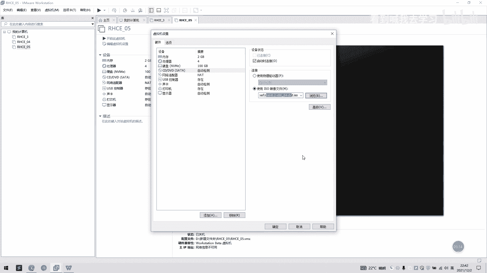
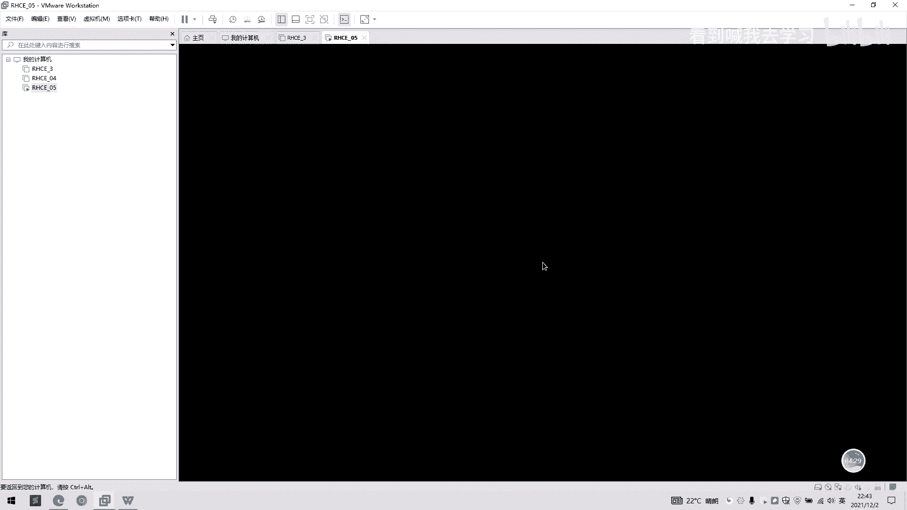
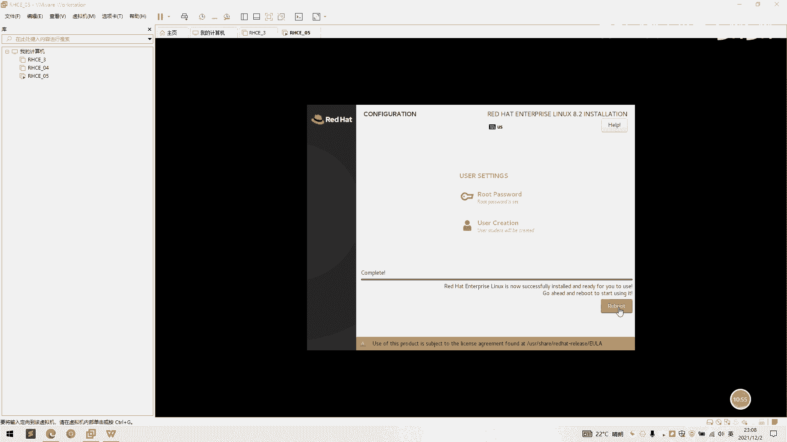
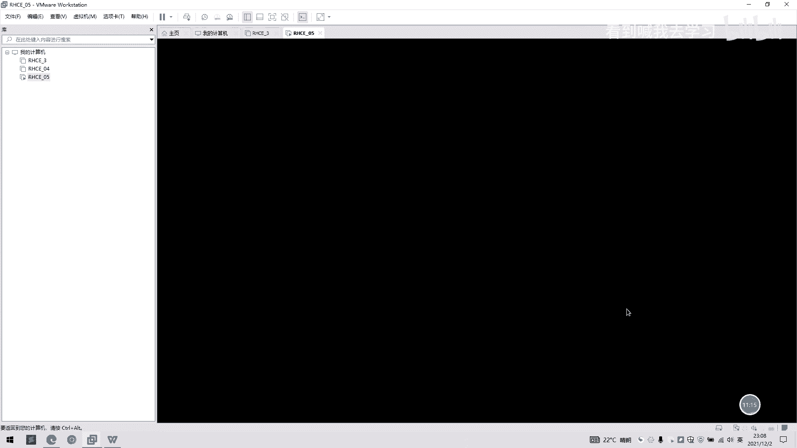
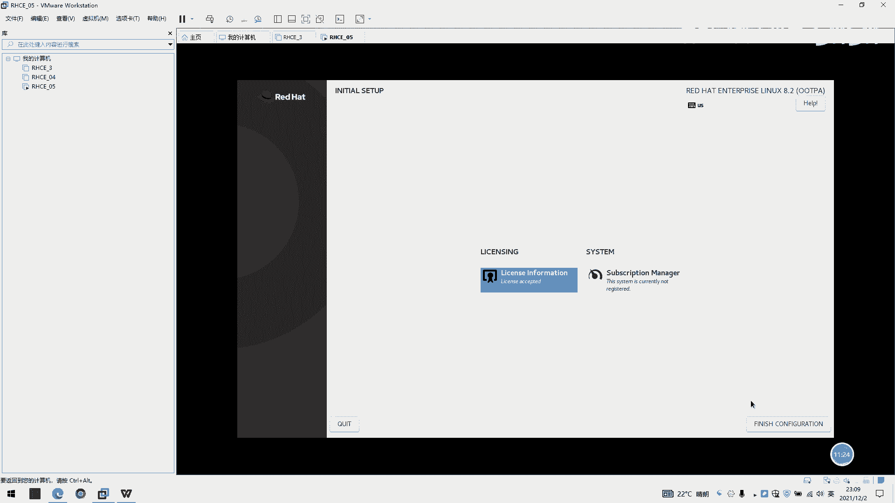

# 2022 01 最新rhce教学视频 - P2：day1-自定义安装rhel8 - 看到喊我去学习 - BV1Na411y7SQ

好的，我们现在来演示一下自定义呃，自定义操哎，安装操作系统是怎么安装的？我们之前上次讲的是一个简易版的一个安装，我们这是讲一下自定义安装，我们点击一下新建虚拟机，我们点一下自定义。我们选择一下。下一步。

我们点这里之前是安装光盘文件镜像，我们勾选的是这个。我们但是我们现在选稍后安装操作系统啊，我们点最后一个，然后我们点下一步，这里选一个版本啊，我们这里可以选自己需要安装的版本。

我们这里选择个re害8的1个lin6ux啊，64位操作系统，我们点下一步就可以了。然后我们这里自定义一个名称。RHC05。流程跟之前的简易是一样的，只不过在安装后面可能有稍微有点不同。RHC。

等 new。好，点确定，我们点下一步，我们这一次选一个两盒。啊，两个撕了。好，我们点下一步，我们点此刻虚内存是2GB默认了。然后我们这里还是选择个net模式。我们还是点一下推荐，下一步推荐。

这也是选下一步，这我们选择1个100G的一个硬盘。我们这分配然空间就也不够选了，我们还是拆成多个文件啊，跟剪辑安装是一样的。我们这里点下一步。好，下一步我们在。准备好创建新米机，这里啊。

我们点一下自定义硬件。好，他会弹是一个阴检出来。哎，但是这里好像比较慢。好，那我们就不选了，我们先点完成。好的，完成之后，左边的这块就有1个RC05，也是我们刚刚创建一个操作系统。

我们点这边的话就会有1个05啊，我们点一下编辑性引机设置啊。这一步的作用是我们选择1个DVD，我们就是把之前的1个IOS下载印象文件给挂载进来哎。好，我们选择一下挂载。喂，我的lo文件在哪？嗯。哦。

是在。好的，我们找到我们一个。嗯，一个文件啊把你啊厉开的一个文件。好，我们点击一下，这里确定是启动连接是勾选的。好，我们点击一下确定。

好，没什么问题，我们点开启时虚拟器。好，这里我们点一下屏幕啊，然后我们可以看见这有几个呃几个选项，两个选项，一个是直接安装一个0害8，然后另外一个是呃先检验一个呃磁盘这个印象文件的一个完整键啊。

然后我们这里。勾选我们往方向键是可以控制啊，上下方向键是可以控制的。我们往上方向键这里。呃，当这些英文变成白色就是勾选了，就是相当于选择的意思哦。我们点你们现在是选择第一个选项，我们点按回车。好的。

他现在正在运行我们的一个。啊，一个安装叫啊安装。那在等待他。好，我们等待一下。好的，我们看见鼠标了，他已经进来了，他已经现在是进到一个安装界面了。然后我们这里看到话是选择一个。

呃，是选择语言呢，他是让我们去选择一个什么样的语言，我们这里默认选择一个音。啊，英语啊。就新手环境建议是呃英语啊，这样后面可能会慢慢去习惯一点。好，我们这里有三个选项，我们也看到有三个三个列，三个。

选项我们这里首先看第一个这边的，我们这里有一个键盘，我们默认的是一个呃英语啊，我们这有个第二个选项是一个呃语言，我们也去选择呀。默认就好了。然后这里有一个时间，我们点进来。好，我们看到一个时间选择区域。

我们这里只点一下我们的中国版图。好，它这里会有一个变化，这里一个。这里就是指定城市啊，一个什么州、亚洲上海好，我们点击一下大。好的，已经勾选完了。然后第一项已经勾选完。我们看一下第二列，第二项。

这里有一个inall。看来是我们安装的一个呃印象文件啊，我们这里可以不用啊。然后我们这里点一下，这里上面有这里是选择一个我们怎样的一个安装模式啊，是一个呃带图形化界面一个安装呢。

还是一个服务器的一个安装，还是一个最小安装啊。这些这里的话我们可以选一个图形化界面的安装。我们这里直接。那就好了。好，我们。第二个选项也可以啊。我们看到第三列的一个选项。

这里有一个呃insstore第三我们点一下。这里选择一个硬盘的。然后我们这里。可以选择。好，我们这里可以选择一个硬盘。好，我们勾选它。当我们之间这里勾的时候，我们直接勾选它。

然后它会我们提示一个自动分配与空间，还是一个自定义分配空间。我们这里。呃，为了大家演示清楚，我们选择一个自定义一个分配啊，我们点几个大。好，他现在已经进来了一个自定义分配一个区域。

有的我们一个格式化磁盘一个风向。然后我们这里可以看到1个100G，然后这里有个100G个分配，我们点击一下加号。我们这里可以分配我们的一个啊磁盘空间的一个。呃，目录啊我们首先去选择分配一个boot。

我们给1个1024，这默认的单位是MB啊，也就属。呃，也就是以照这以照单为单位啊，我们这里选10249是一局吧，我们点一下。好的。我们。在家。然，我们再选择一个1万分区，s万分区。啊，我们勾一个。啊。

4096为什么是40966呢？因为是说我们选择内存是2GB嘛，那1万分区的呃定义就是呃内存的两倍，也是选择1个4096。啊，一个4G的一个模式。然后我们不t分居就是一个开机。开机启动了一个呃一个文件夹。

我们选择1个1024兆就可以了。好了，我们区域的分区的话，我们可以分配一个根目录，这就是根目录。我们选择一个根目录，我们给一个。20G。20句2048。嗯。啊，这里为了饮食方便，我们2048G啊。好。

哦，这已经变成95了。我们那里好，我们这一群拉218，我打了多了一个零了。O。哦，这里是。当是。好，我们是20G，然后我们跟目录是20G，我们不可分区是1024，我们12分区是4G好，我们点击一个档。

好嗯，直接受就好了。好，他已经进来了。然后我们再选择网络。这有个网络选项啊，我们这里点一下网络，然后我们这里。这里开启就可以了。啊，我们现在用的是1个DHCP1个模式啊，我们这里可以给点个confi。

这里的话就可以有1个DHCB模式，还是说自定义一个模式，自己去啊增加1个IP啊。哦，我们先选1个DHCP模式啊，嗯你等一下。好，我们点一下开启之后，我们完成。然后这里有一个安全，这里可以不用管它。

看一下就可以了。好，我们直接inst。好的现在已经开始安装了。然后我们这里的root密码呢，我们我们要试一下啊，我们这里是录完满为厉害。How they hand。好的。

我们当我们来输入两次绿码为绿函的时候，我们两两次点击加大那就可以了。然后我们这里还有一个创建普通用户的，我们这里创建普通用户，我们。这个student。好，唔意埋你系。好的。

这里不要管它密码输我们输完用户直接输密码，然后我们点击两次档。好的，他现在正在安装啊，等我们安装完之后。等待他安装完了。等它进止安装完之后，这里会有一个蓝三按钮。好，我们等待大家安装。好的。

我们现在已经完全安装了，我们这里点一下立。

好的，我们这里看到一个license文件，我们这里点一下接受，我们点一下down，后们点一下fininish。

好，以上的一个自定安装的一个全过程已经完成了。