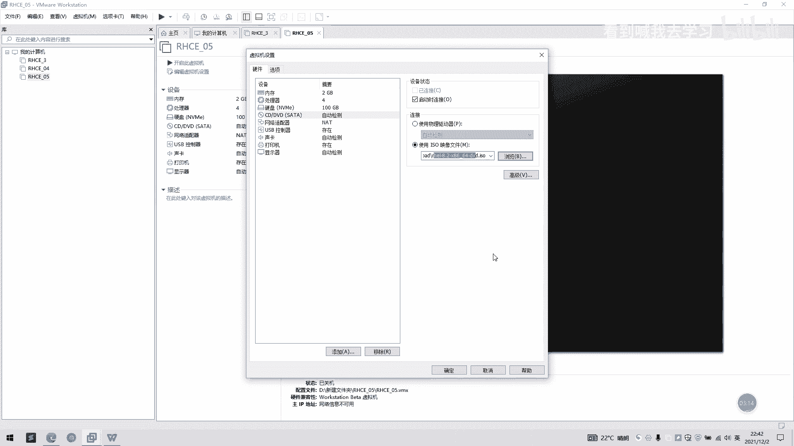
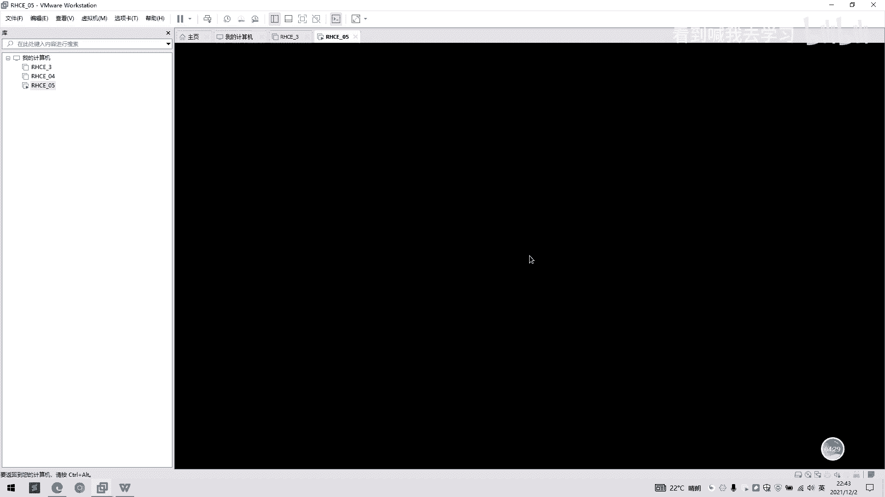
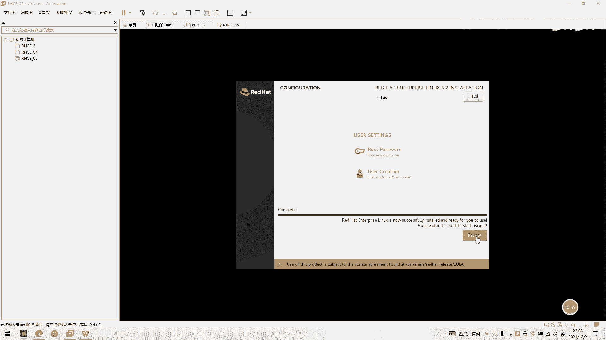
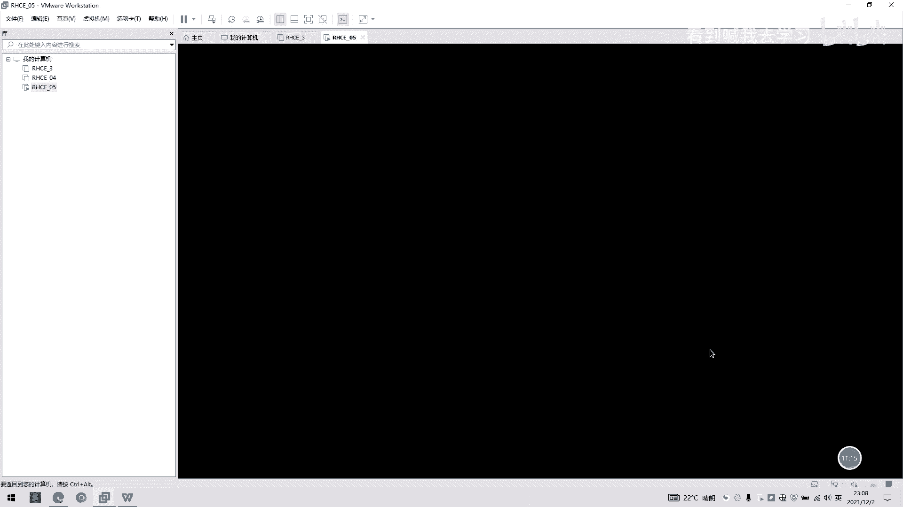
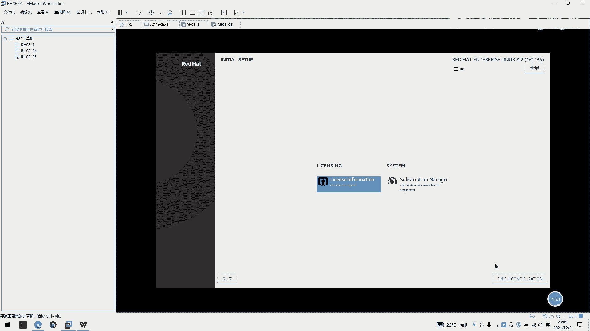

# RHCE教程：P2：自定义安装RHEL 8 🖥️

在本节课中，我们将学习如何在VMware虚拟机环境中，通过自定义配置来安装Red Hat Enterprise Linux 8操作系统。与简易安装相比，自定义安装允许我们更精细地控制虚拟机的硬件配置和系统分区方案。

## 创建自定义虚拟机

上一节我们介绍了简易安装，本节中我们来看看如何创建一台自定义配置的虚拟机。

首先，在VMware中点击“新建虚拟机”，并选择“自定义（高级）”选项。

以下是创建虚拟机的具体步骤：
1.  选择“稍后安装操作系统”。
2.  客户机操作系统选择“Linux”，版本选择“Red Hat Enterprise Linux 8 64位”。
3.  为虚拟机命名，例如 `RHC05`。
4.  处理器配置选择“2”个内核。
5.  内存设置为“2048”MB（2GB）。
6.  网络连接选择“使用网络地址转换（NAT）”。
7.  I/O控制器和磁盘类型保持默认推荐选项。
8.  选择“创建新虚拟磁盘”，容量设置为“100”GB，并选择“将虚拟磁盘拆分成多个文件”。

完成上述配置后，先点击“完成”创建虚拟机。

## 挂载安装镜像

虚拟机创建完成后，我们需要为其挂载RHEL 8的安装镜像文件。

1.  在虚拟机列表中，右键点击新创建的 `RHC05` 虚拟机，选择“设置”。
2.  在硬件选项卡中，选择“CD/DVD (SATA)”设备。
3.  在右侧，选择“使用ISO映像文件”，并点击“浏览”按钮，找到你下载的RHEL 8 ISO文件路径。
4.  确保“启动时连接”选项已被勾选。
5.  点击“确定”保存设置。

## 启动并开始安装

现在，我们可以启动虚拟机并开始安装过程。

1.  点击“开启此虚拟机”。
2.  启动后，会进入安装引导界面。使用键盘上下方向键选择第一项“Install Red Hat Enterprise Linux 8”，然后按回车键。
3.  系统加载后，会进入图形化安装界面。

## 配置安装选项

安装界面主要分为三列选项，我们需要逐一进行配置。

**第一列：本地化设置**
*   **键盘**：默认为英语（美国）布局。
*   **语言支持**：默认为英语。
*   **时间和日期**：点击进入后，在地图上选择亚洲区域，城市选择“Shanghai”，然后点击“完成”。

**第二列：软件选择**
*   **安装源**：已自动检测到挂载的ISO镜像，无需更改。
*   **软件选择**：点击进入后，选择“Server with GUI”（带图形界面的服务器安装），然后点击“完成”。

**第三列：系统设置**
*   **安装目的地**：这是自定义安装的核心部分，用于配置磁盘分区。
    *   点击进入后，在“本地标准磁盘”下，选中你的100GB虚拟磁盘。
    *   在“存储配置”部分，选择“自定义”，然后点击“完成”。

## 自定义磁盘分区

选择自定义分区后，会进入手动分区界面。我们将创建一个常见的分区方案。

以下是创建分区的步骤：
1.  点击“+”号按钮添加新挂载点。
2.  第一个分区为 `/boot` 启动分区。
    *   挂载点：`/boot`
    *   期望容量：`1024` MiB
    *   点击“添加挂载点”
3.  第二个分区为 `swap` 交换分区。其大小通常为物理内存的1到2倍。
    *   挂载点：留空，设备类型选择“swap”
    *   期望容量：`4096` MiB (2GB内存的2倍)
    *   点击“添加挂载点”
4.  第三个分区为根分区 `/`。
    *   挂载点：`/`
    *   期望容量：`20480` MiB (20 GiB)
    *   点击“添加挂载点”
5.  分区完成后，点击“完成”。在摘要页面点击“接受更改”。

## 完成其他设置并开始安装

返回主安装界面，继续配置剩余选项。

1.  **网络和主机名**：点击进入，将右上角的网络开关切换到“打开”状态。系统会自动通过DHCP获取IP地址。点击“完成”。
2.  **安全策略**和**系统目的**可以暂时忽略，保持默认即可。

现在，所有必要配置已完成。点击右下角的“开始安装”按钮。

## 设置root密码与创建用户

安装过程开始后，需要设置root管理员密码并创建一个普通用户。

1.  点击“Root密码”进行设置。
    *   输入密码，例如 `redhat`
    *   再次确认密码
    *   点击两次“完成”
2.  点击“创建用户”以建立一个普通账户。
    *   全名和用户名可以都设置为 `student`
    *   设置密码，例如 `student`
    *   点击两次“完成”

设置完成后，等待安装进度条走完。

## 安装后初始化

安装完成后，系统会提示重启。

1.  点击“重启”按钮。
2.  重启后，首次启动会显示许可证信息。勾选“我同意许可协议”，然后点击“完成配置”。
3.  随后，你可以使用之前创建的 `student` 用户或 `root` 用户登录系统。

---

本节课中我们一起学习了RHEL 8自定义安装的全过程。我们逐步操作了创建自定义虚拟机、挂载镜像、配置语言与分区、设置用户密码等关键步骤，特别是掌握了手动为 `/boot`、`swap` 和 `/` 分区分配空间的方法。通过这次实践，你应该能够独立完成一个基础且结构清晰的Linux系统安装。