# 2022 01 最新rhce教学视频 - P3：day1-图形化介绍和网络配置 - 看到喊我去学习 - BV1Na411y7SQ

好的，我们接下来已完全安装了。然后我们接下来操作是我们先登进去。它现在一个图形化界面呢，我们用student用户登记，我们点一下student用户，然后我们密码输入 head，就是我之前设置密码。

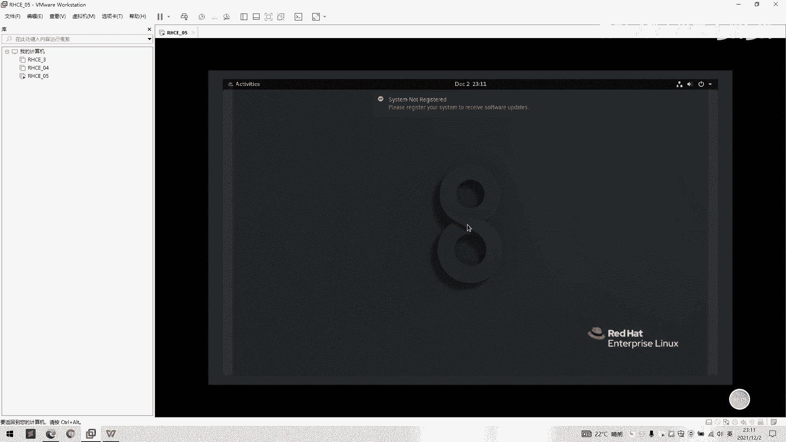

好，我们已经登进一个。呃，一个web界面，然后他要我们选择一个英语，我们选择。我们选择一个。宇航。这些都是可以勾选的。

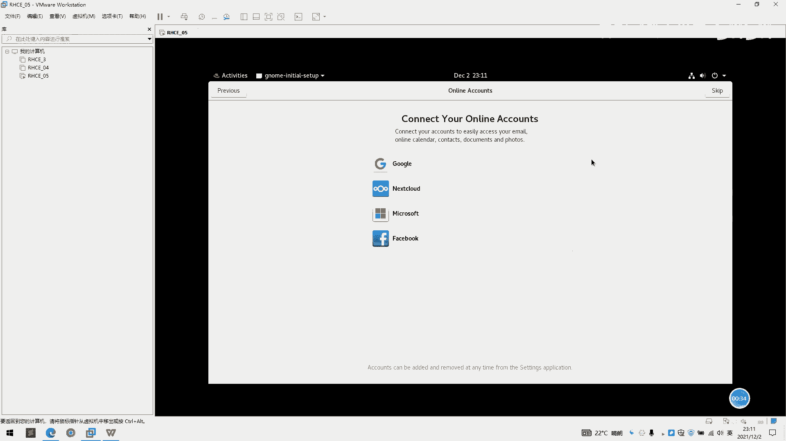

好。关上。我们这里进登记录进来可以看到一个三个东。

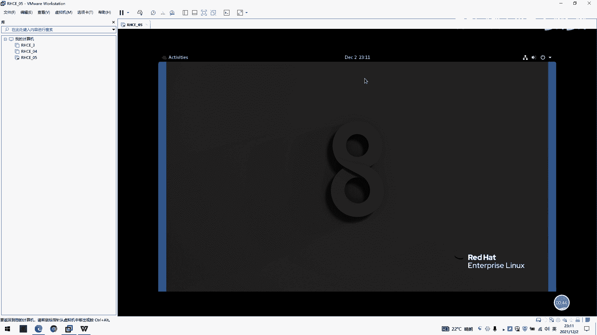

有三个地方啊，首先我们看一下左边左边是一个抽藏夹。然后收藏栏了，然后我们看到这里有一个火狐浏览器，我们有一个呃文件目录啊，就是我们。

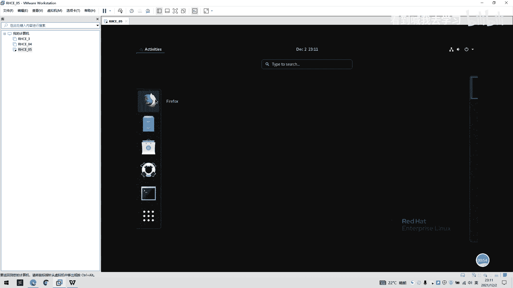

常如说打开我的电脑，就跟windows打开我的电脑一样，我们自己点击一下，打开就会看到一些桌面啊、文档啊这些目录之类的。然后我们点，然后这里。有一个other locations。这里的话。

这是一个呃一个根目录啊，我们自己点一下alder都可以损时就看到一个computer，我们点一下computer，然后这里就是我们整个文件系统的一个根目录啊。你看这些有一个B啊，然后put啊。

然后一个lib依赖啊， home啊这些的。好，我们先关掉。

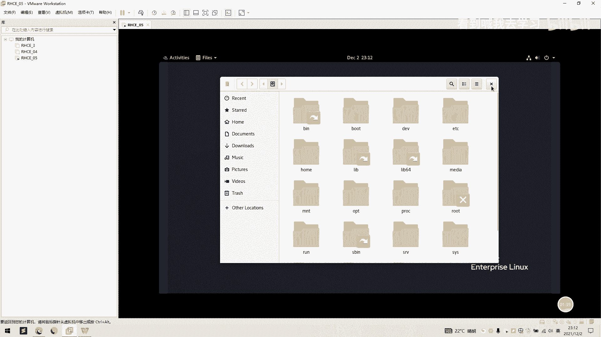

然后第三个。这些都是一个购物啊，这些一个帮助，做一个帮助文档啊。

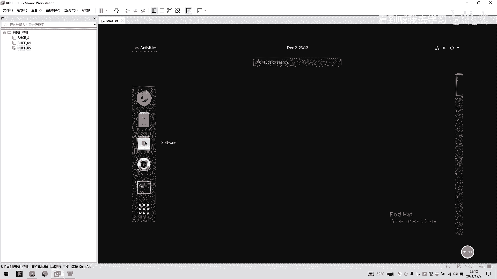

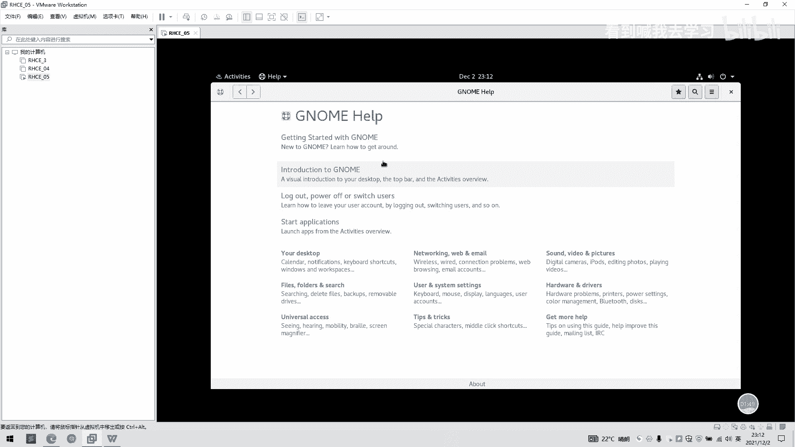

大家如果有什么不懂，可以点进去参考一下。然后我们这里还有个终端。这里我们今天这节课以讲终端为主啊。然后我们打开这个终端看到一个。呃，一个类似命令行那一个。一个框提示出来。

然后我们首先看到一个呃开开始开头这里有一个student，这是我们当前的一个用户名。如果是root的话，这里就是一个root。然后我们后面接的是一个horse name，就是。啊。

当前一个hose呢是locationlocal house。然后。然后的话。还有一个好，我们再继续介绍一个中间的一个是一个时间。你有时间我们可以选择一个。呃，时时间日期是多少？

然后我们右边的话是一个网络。首先我们点进来是一个网络，这有个选择一个音量大小，还有一个网络网络设置是开还是关。

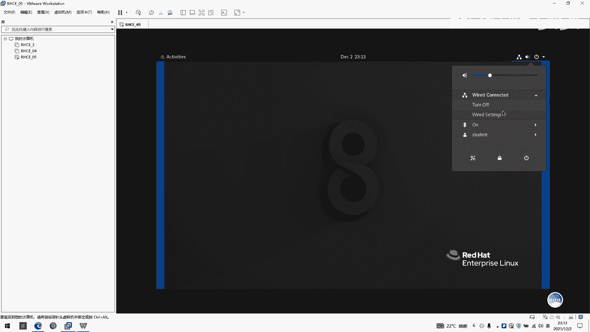

然后我们点击一个。啊，网络这里啊，我们点进来就是。我们可以看到我们这里有一几个选项，几个那个显示，一个是。啊，当前网网速是多少？这里是万兆啊。这是万兆网卡，它这里提示说是可以支持万兆的。

然后我们这一个网络地址是啊192168。181。134。然后这个网络地址是跟哪里有关呢？因为我们是一个net模式嘛，所以我们网络地址呃可以看到在一个。啊，虚拟机里面我们点击这边有个编辑按钮。

我们点击一个虚拟网络编辑器啊。可以看到。可以看到我们虚谋编辑器有两个选项。因为我们刚刚是选一个net模式的一个。呃，一个网络设置，然后我们。那怎么说网络设置可以看到我们有个子。

子网IP从192168181。0啊。然后我们点一下这DHH设置。你好这里可以看到一个网络网卡的一个名字，然后一个子网的IP就是子网源码，1921呃子网IP192168181。0。

然后我们这其实IP设置的是默认设置是192168181。128开始，但结束IP是192168181。254。就是意思是说我们其实IP是从128开始上起，就说赋予给虚拟机啊，DHCP这样一个呃分配。

分配机制的一个呃IP是从128开始啊，所以我们这里会虚拟机里面会分配自动分配到134，给到了这个虚拟机制的IP是1134。所以说每个同学的用户的其实IP是不一样的。

所以我们需要呃点击查看一下我们的一个IP是多少。然后后面我们自己手动去创建一个网卡信息的时候，我们要根一定要根据这个IP端去设置啊。我们IP端是多少，我们就要设置多IP段，还有多什么IP开始啊。好的。

我们虚拟网络编辑器这块先讲到这里。然后我们继续回过来看到我们网络这块啊，我们这里还有个IP6个选项，不过我们现在用不到，可以先暂时不用理它。我们这里有好还有一个mark地址啊，还有一啊还有这个。呃。

网关啊DNS这些的。电子是191818102。我们如果要配上外网的话，D一定要DNS啊。如果没有DNS是不能上外网的嘛，这一点要记住。

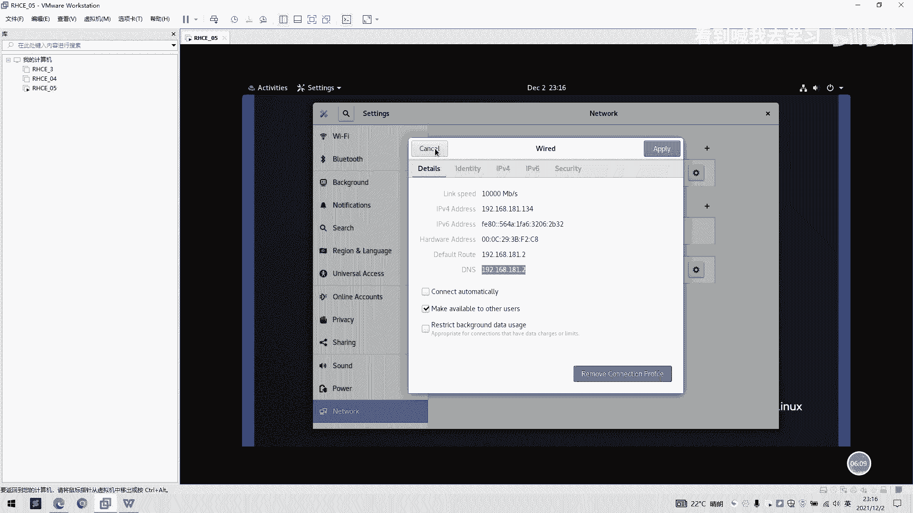

好的。除了以。好，这里还有个忘了，这是蓝牙。你看到一个蓝牙标志，这是哦，然后现在是一个开启一个状态，然后这还有一个登录登出，就是当前用户一个呃登录登出一个状态，还有一个可以设置密码。

这里可以重置自己的密码，这里可以点点密码。这一栏的话可以自己重序设置密码。

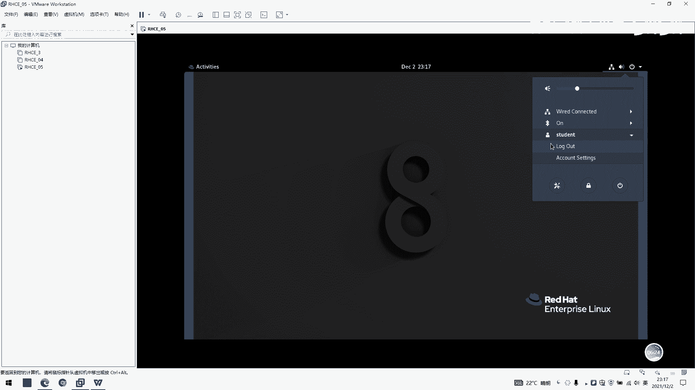

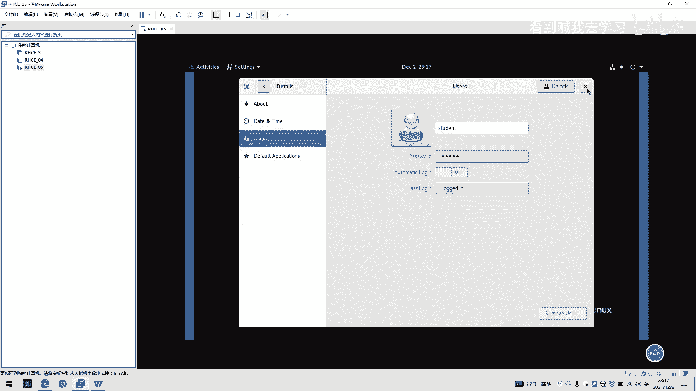

好的，这句话界面先讲到这里啊，我们今天重点讲一下终端，我们继续回到终端。这里。好，我们还是以student用户去看。

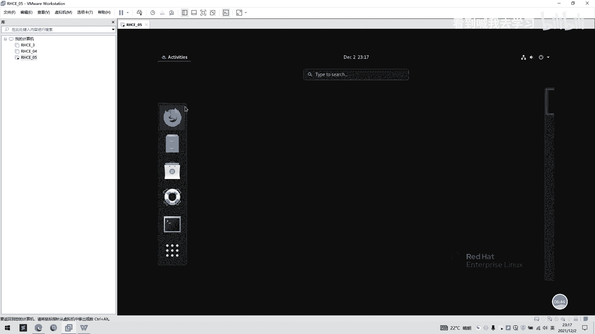

我们看一下当前IP多少，我们可以用IPADDR去看。然后看到我们当前的一个网卡信息是ES160啊，ES16默认是我们当前的一个呃网卡名称。然后我们分配地址是192168181。134。

这里斜杠24位就是呃第指望圆满。如果有关指导源码的一个信息，大家可以去看一下。不我们基本前面关心的是呃前面这一段，后面我们也讲到子网源码。好的。那如果说。我跟这里学习一下如何去呃如何去修改这个网卡。

首先我们要一一定要切在root模式模下或者是提全了。这里的话我是直接切到root模式模下，然后我点打一个输root。好，我能输入了输入我们一个路ot密码，我们录的密码输厉害。好，回车。好。

我们现在是已经进到了一个呃root密码超级管理权限。root用户的一个超距管理权限。那么这里跟之前的有什么区别呢？啊，这区别就是你看我们这一个原来是still的一个用户。

我们变成一个root用户前缀有点不一样。然后我们一个。多了符号变成了一个井号，井号的意思就是呃超级用户一个登录吧。如果是到了发就是个普通用户登录，这从可以区别上区别。然后我们。呃，一个网卡的一个配置。

我们去到一个。VR我们打一个VR运令，然后改个空格，我们斜杠打1个ETC按1个sable。然后在一个sstem con下面。那个table你不能点一下net。然要加一个杠screen。IF。我们在一个。

这就是我们当前网卡的一个配置文件了。我得我们回车，然后我们看到。网卡配置文件一个信息啊，这。这一个是一个网卡的一个类型啊，然后这里是一个。呃，一个复载，我们这里是那我们这里看一下这里。

因我看一下bo到这里，这里就是一个。呃。你你要自律有一个情况，我们选择一个。目前选了1个DHCP，有时候自动分配IP格模式。我们后面要改呃，我们可以手动改成一个state静啊，就是几个静态模式。

我们点击。I我们按一下I，然后我们就一个进入到一个inser的一个模式，就是一个编辑模式。然后我们打一个tatus。ok。好的，我们slate打印完之后，我们按方向键，向下方向键，一直往回按。

然后一直按到on boot这里yes的后面啊，我们点下回车。然后我们打一下大写的IPAATD2，然后一个等于号。然我们打一下192168。181。点13。135吧，因为我们之前分别IP是134。

我们这里为了区区别一下，我们选择135，然后我们再打一个指网源码PRE1。FX等于24。如果有不同同学，后面我们会学到这我们首先。先。呃，先过一遍，我们打一个王冠GATT。EWAT。

然后网关设置一下192168对。181。21我们DS。一等于192168。181。2，这里我用的是DNS1呢，因为我们可以设置2个DNS也就是DNSEDNSR。

但是我们默认可以首先去就先设置1个DNS一也就可以了。好，我们按EXC会退到一个普通模式啊。我们。那一个shift加一个。分号一个键，然后它会进入到一个命令模式。好，我们按一下WQ啊。

小写的WQ啊不要大写，我们按小写的WQ就这是保存的意思，一个保存并且退出一个意思。然后我们一个回撤啊，他已经退出来了。免保存并你退出来，然后我们执行一下网卡的一个呃刷新。我们用一个连年C2C。要也是。

如个。connection个 table啊打一个reload。你出。好，我们天天需要新刷新一下网卡配置，这是。A connection， the update。ES160，我们当前的网卡是16。

们选160。好，对我提示一个conect索就是我成功。的意思啊，我们再看一下APP啊。看这里是不是已经在1个ES160下面，这里是不是已经编成我们之前说这1个IP是135。好的。

我们从里面先去拼我们的一个外面的网络是否通，我们可以直接先拼192网吧168。181。2。我们确定一下网吧是通的。好，我完是通的。好，我们按ctrl C可以退出来。然后我们这里。我们按一个win加键。

外面我们按个win键，windows里，然后我们选择打1个CMB。

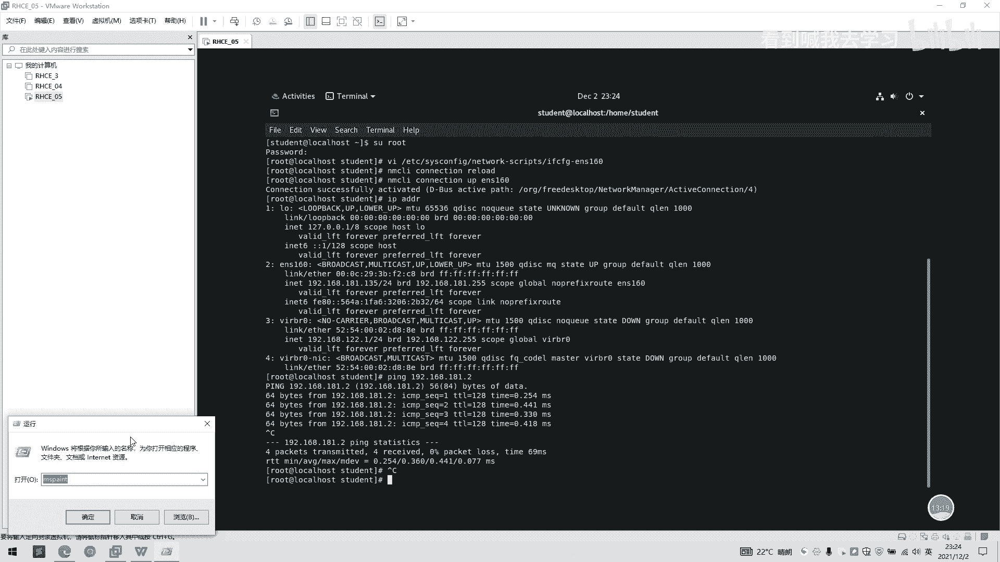

回车。进来一个windows的一个命令模式啊，我们拼一下，上的是PING，然后选择19。啊，168点181。136。这是我们刚刚之前虚米子1个IP啊。

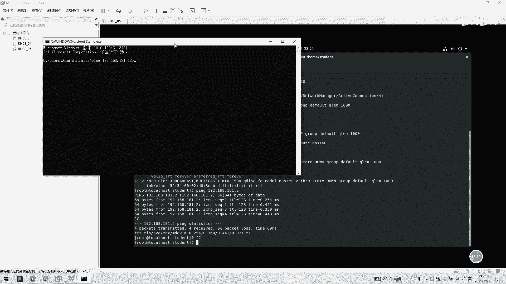

135就是我们1个虚拟级的1个IP。然后们。底下回撤。好的。它是已经通了，就是说我们的windows的啊windows也可以访问这台虚拟机。

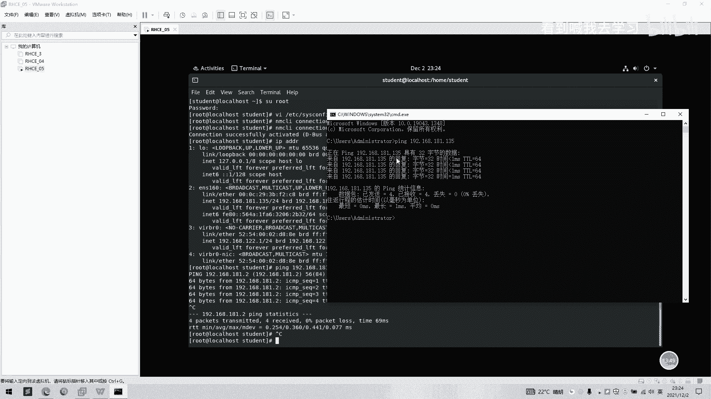

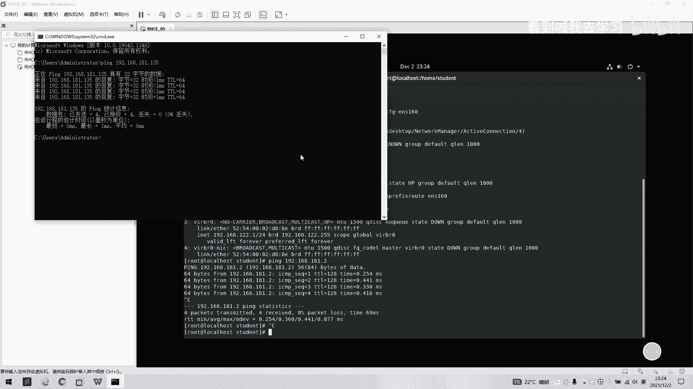

好的，我们相当于说虚拟机跟windows是已经互通了。

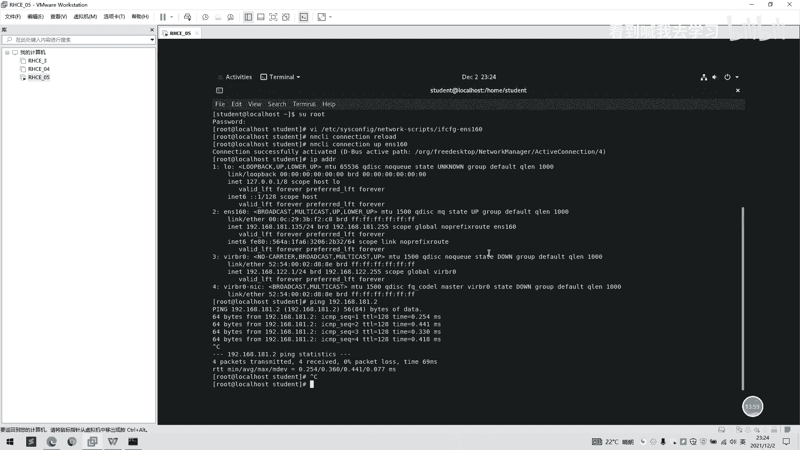

我们打开我们。