# RHCE课程：P3：图形化界面介绍与网络配置 🌐

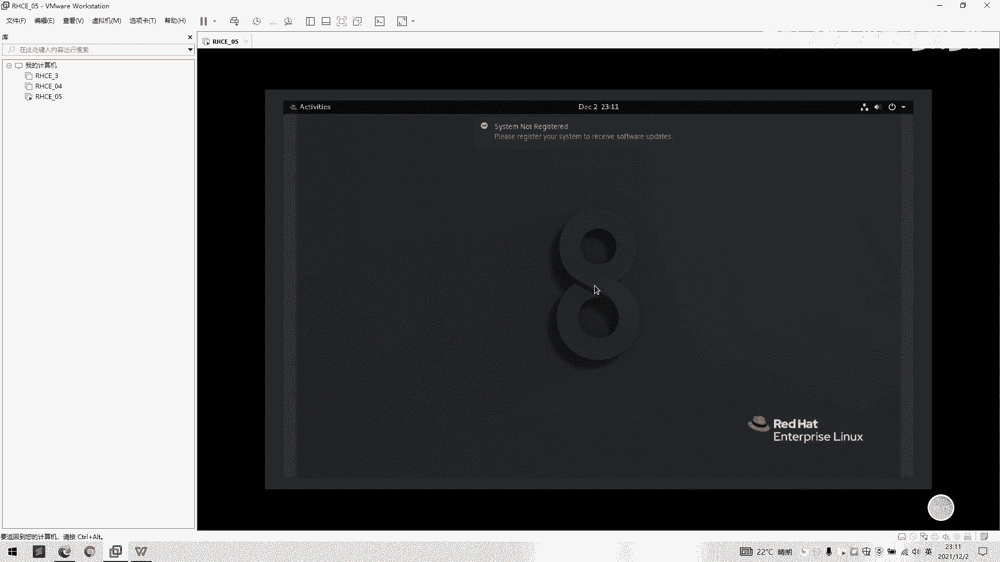

在本节课中，我们将学习Red Hat Enterprise Linux的图形化界面基本操作，并重点掌握如何在终端中查看和配置网络。课程内容从登录系统开始，逐步介绍桌面环境，最后深入讲解使用命令行修改网络配置的完整流程。

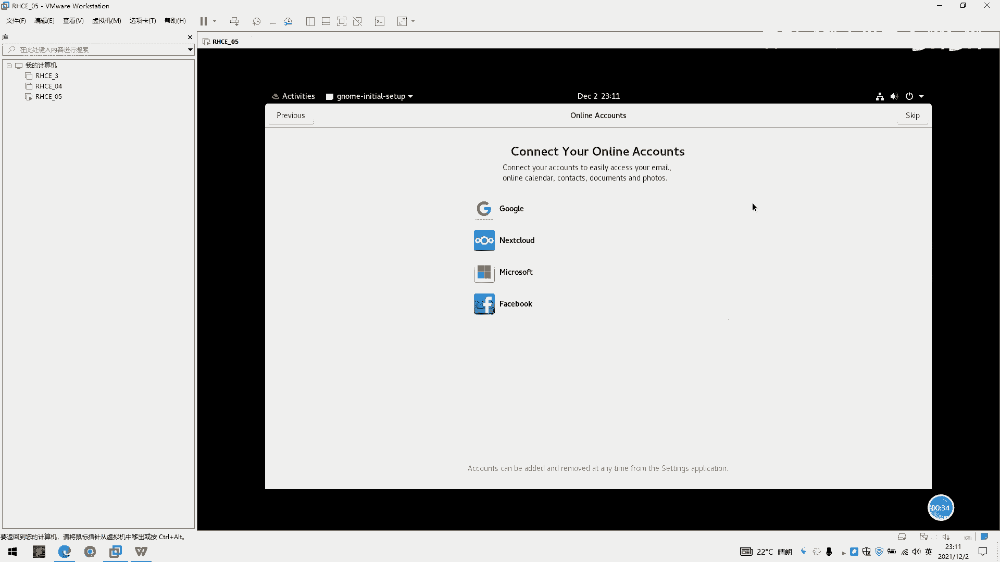

## 图形化界面初览 🖥️

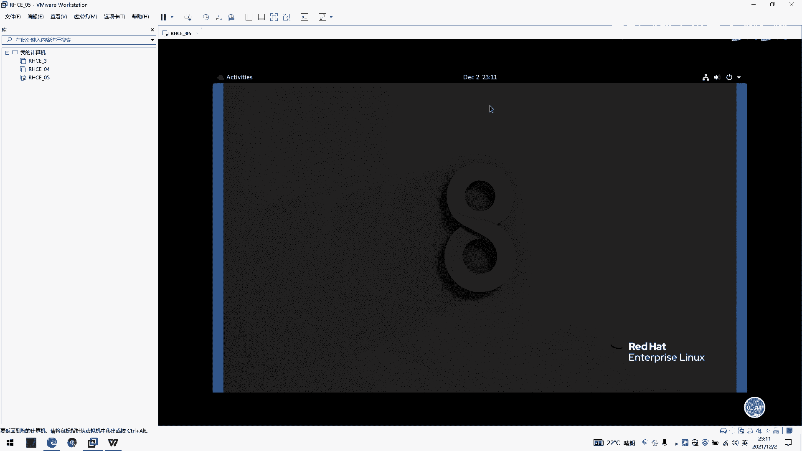

系统安装完成后，我们使用`student`用户登录。密码是之前设置的`head`。

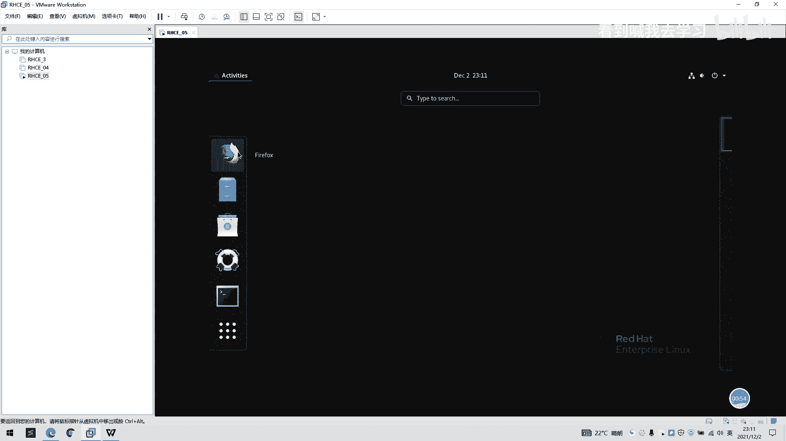

登录后进入图形化桌面环境。首先需要选择语言，这里我们选择英语并完成初始设置。

关闭欢迎界面后，可以看到桌面主要分为三个区域。

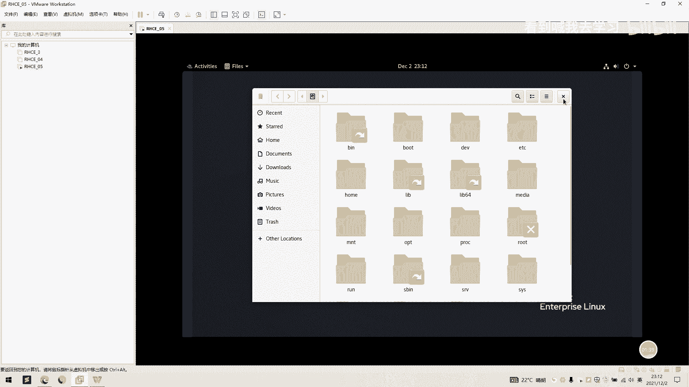

以下是桌面主要区域的介绍：

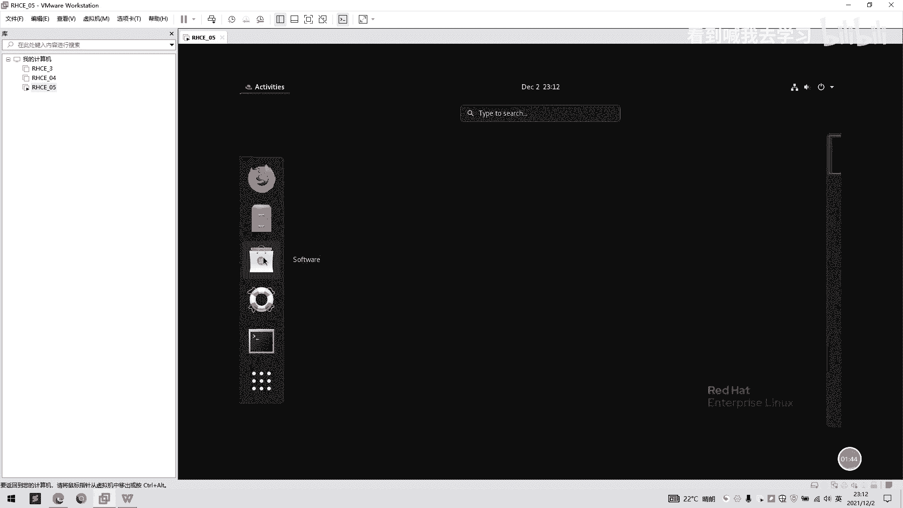

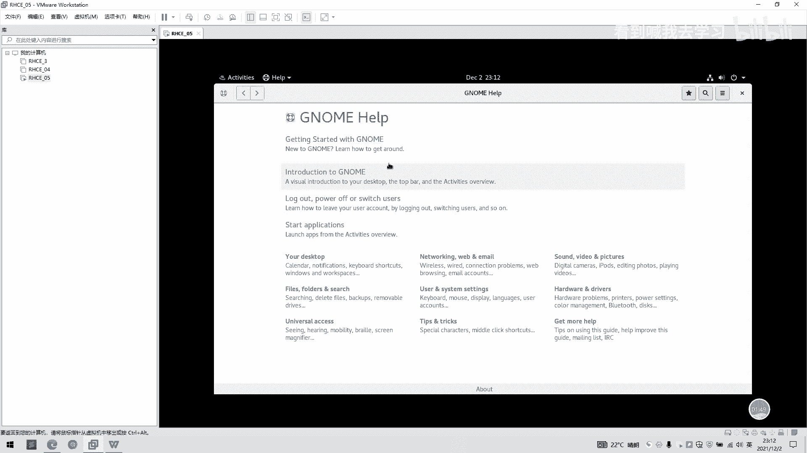

*   **左侧收藏栏**：类似于快捷方式栏，包含常用应用程序的图标。
*   **应用程序菜单**：点击左上角的“Activities”或使用Super键（Windows键）可以查看所有应用程序。这里预装了火狐浏览器、文件管理器等工具。
*   **系统状态栏**：位于屏幕顶部，右侧显示时间、音量控制、网络状态和用户菜单。

现在，我们来熟悉一下文件管理器。点击文件管理器图标，可以浏览`桌面`、`文档`等个人目录。

点击“Other Locations”，再选择“Computer”，即可进入整个Linux文件系统的根目录。这里可以看到`/bin`、`/boot`、`/lib`、`/home`等标准Linux目录结构。

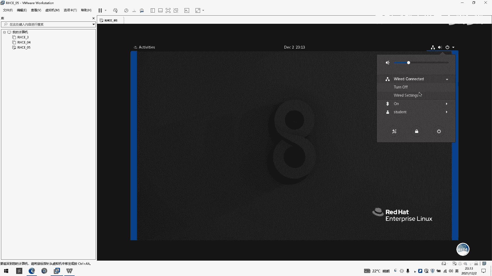

系统还提供了帮助文档，可以通过帮助程序或在线资源获取。

## 终端与网络状态 🔧

本节课的核心是学习使用终端。点击应用程序菜单中的“终端”图标即可打开。

终端窗口的提示符包含了重要信息：
`[用户名@主机名 当前目录]$`
例如，`student@localhost`表示当前用户是`student`，主机名是`localhost`。普通用户的提示符以`$`结尾。

系统状态栏的网络图标可以快速查看连接状态。点击后可以看到当前网络是启用还是禁用，以及连接速度等信息。

点击网络设置，可以进入详细配置界面。这里会显示：
*   **IPv4地址**：例如`192.168.181.134`。
*   **子网掩码**：决定了IP地址的网络部分。
*   **默认网关**：数据包发送到其他网络的出口地址。
*   **DNS服务器**：用于域名解析，必须正确设置才能访问互联网。

这个IP地址是由虚拟机的网络设置决定的。在VMware中，通过“编辑” -> “虚拟网络编辑器”可以查看NAT模式的配置。例如，子网地址为`192.168.181.0`，DHCP分配的IP范围通常从`192.168.181.128`开始。因此，虚拟机获取到的IP（如`.134`）会落在这个范围内。

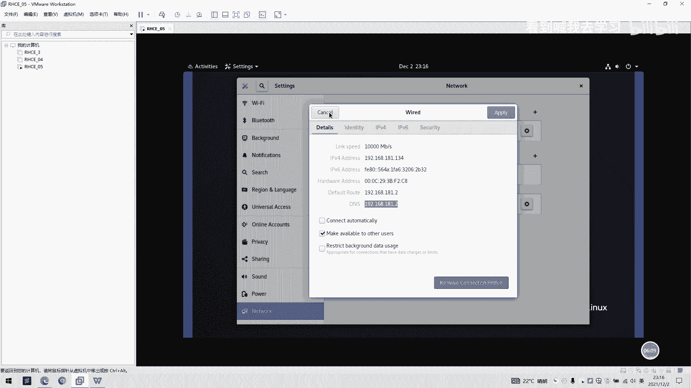

## 在终端中配置网络 🌐

上一节我们通过图形界面查看了网络信息，本节中我们来看看如何使用命令行进行配置。

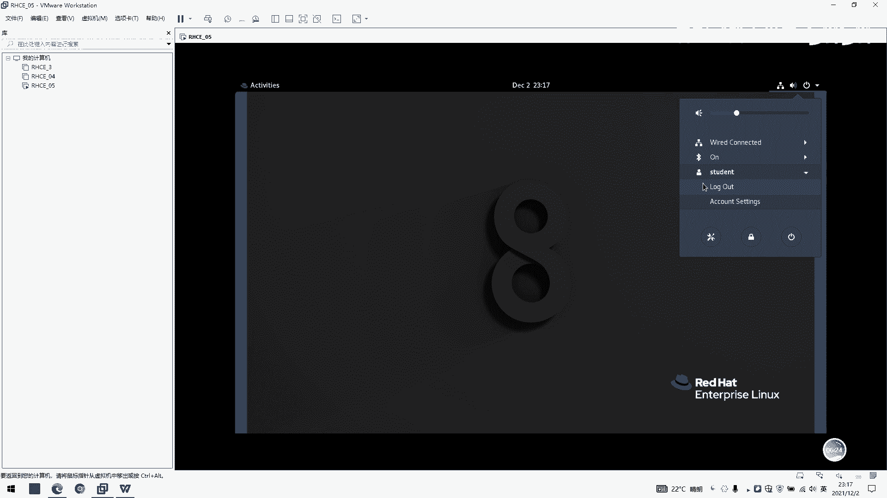

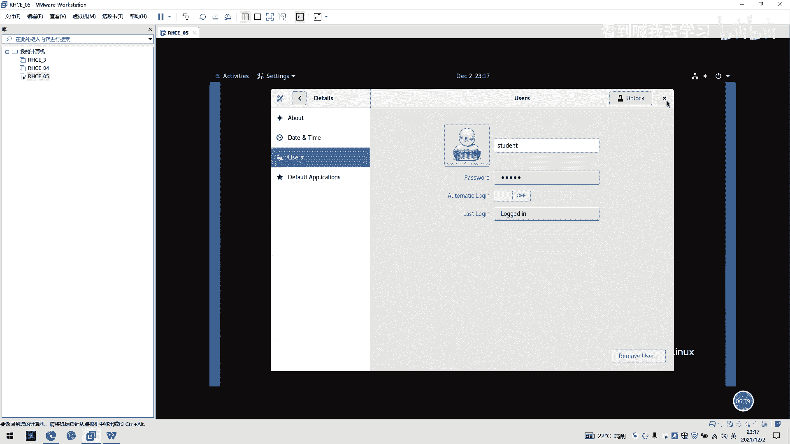

首先，我们需要在终端中查看当前的网络配置。使用`ip addr`命令：

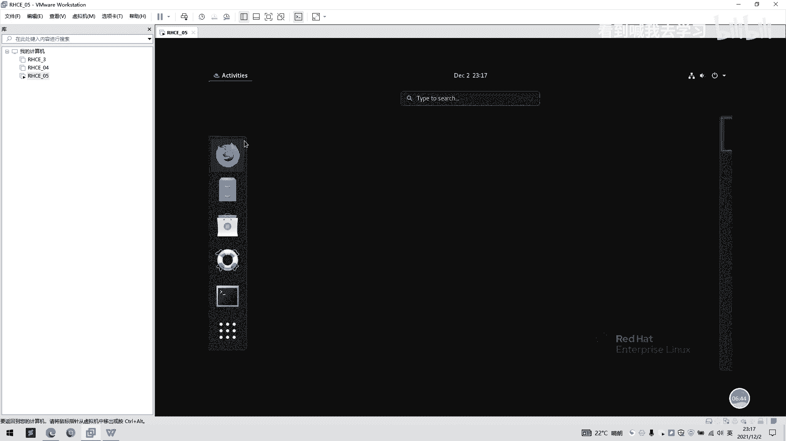

```bash
ip addr
```
输出中，`ens160`（或其他类似名称）通常是主网卡，其`inet`字段显示了IP地址（如`192.168.181.134/24`）。`/24`表示子网掩码为`255.255.255.0`。

要修改网络配置，需要管理员权限。我们从`student`用户切换到`root`用户：

```bash
su - root
```
输入root密码`head`。切换成功后，提示符会从`$`变为`#`。

网络配置文件位于`/etc/sysconfig/network-scripts/`目录下，文件名通常为`ifcfg-ens160`。我们使用`vi`编辑器来修改它：

```bash
vi /etc/sysconfig/network-scripts/ifcfg-ens160
```

文件打开后，可以看到当前的配置。关键参数`BOOTPROTO`决定了获取IP的方式，`dhcp`表示自动获取。

我们需要将其改为静态配置。按 `i` 键进入编辑模式，进行以下修改：

1.  将 `BOOTPROTO=dhcp` 改为 `BOOTPROTO=static`。
2.  在文件末尾添加以下行（请根据你的实际网络环境修改）：
    ```
    IPADDR=192.168.181.135
    PREFIX=24
    GATEWAY=192.168.181.2
    DNS1=192.168.181.2
    ```
    *   `IPADDR`: 你希望设置的静态IP地址。
    *   `PREFIX`: 子网前缀长度，`24`对应`255.255.255.0`。
    *   `GATEWAY`: 默认网关地址。
    *   `DNS1`: 主DNS服务器地址。

编辑完成后，按 `ESC` 键退出编辑模式，然后输入 `:wq` 并按回车，保存文件并退出`vi`编辑器。

新的配置需要重新加载才能生效。依次执行以下命令：

```bash
nmcli connection reload        # 重新加载连接配置
nmcli connection up ens160     # 重新激活ens160连接
```

最后，使用`ip addr`命令再次检查，确认IP地址已成功更改为`192.168.181.135`。

为了测试网络连通性，可以尝试`ping`网关：

```bash
ping 192.168.181.2
```
按 `Ctrl+C` 可以终止`ping`命令。

我们还可以从宿主机的Windows系统测试连通性。打开Windows的命令提示符（CMD），执行：

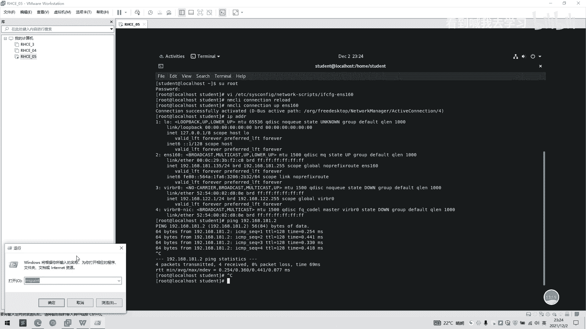

```bash
ping 192.168.181.135
```
如果能收到回复，则证明虚拟机与宿主机之间网络互通成功。

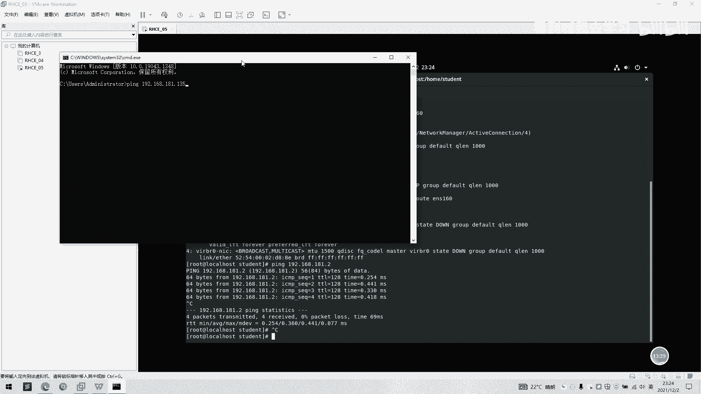

## 总结 📝

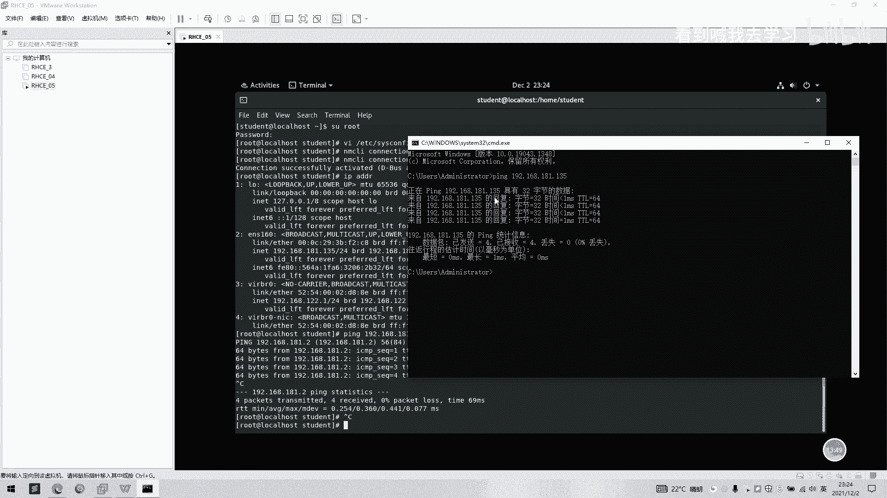

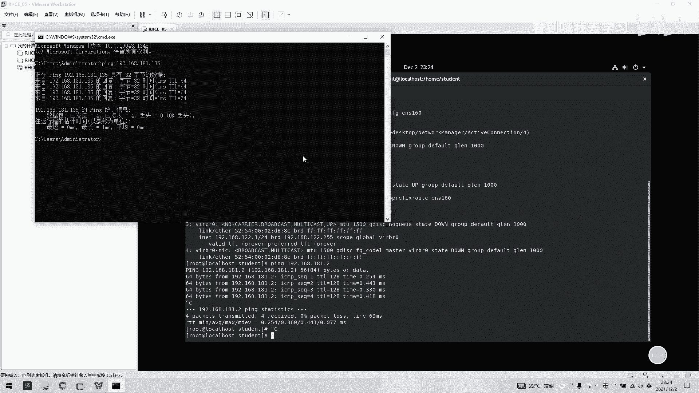

本节课中我们一起学习了RHEL图形化界面的基本布局和功能，并重点掌握了通过命令行配置静态IP地址的完整流程。

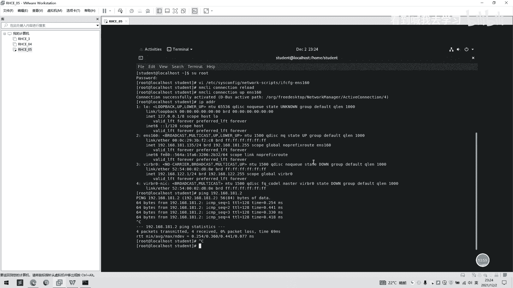

我们首先了解了桌面环境的主要组件，然后使用`ip addr`命令查看网络信息。接着，我们通过`su`命令切换至`root`用户，使用`vi`编辑器修改了网络配置文件（`/etc/sysconfig/network-scripts/ifcfg-ens160`），将`BOOTPROTO`从`dhcp`改为`static`，并手动指定了IP地址、网关和DNS。最后，使用`nmcli`命令重新加载并激活网络连接，并通过`ping`命令验证了配置的正确性以及宿主机与虚拟机的互通性。这些是Linux系统管理和网络配置的基础技能。