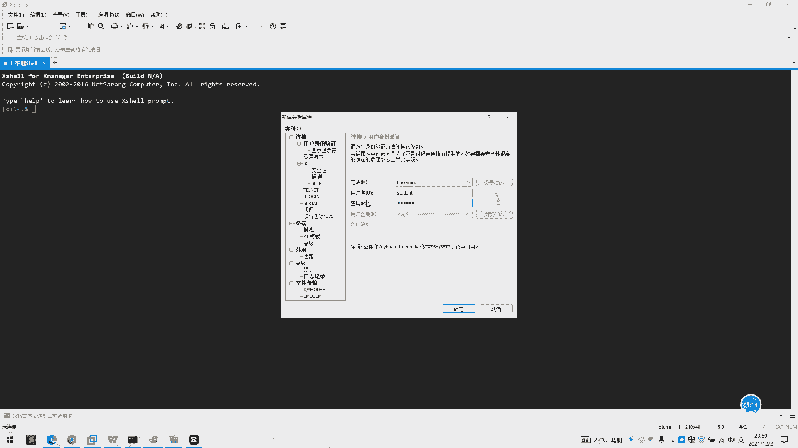
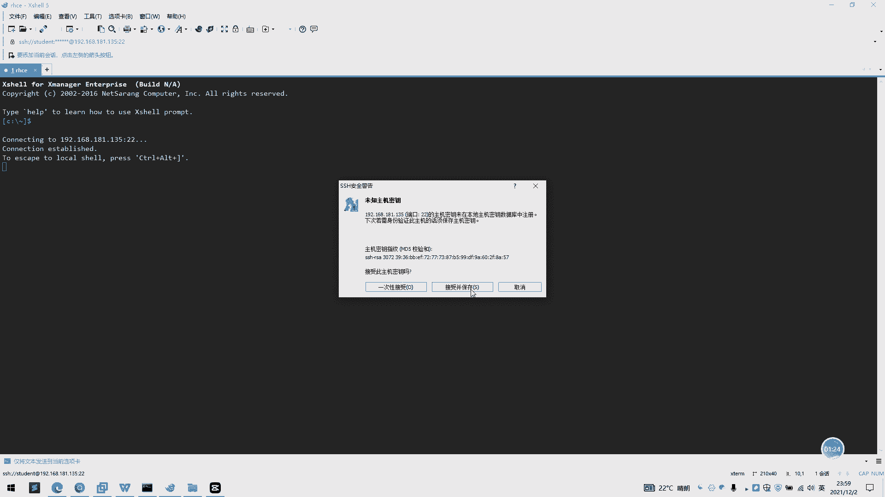

# 2022 01 最新rhce教学视频 - P4：day1-xshell工具的使用 - 看到喊我去学习 - BV1Na411y7SQ

好的，我们现在来讲解一下插槽工具一个使用啊。我们现在打开一个插效，我们进入到一个插校工具一个画面。然后我们点击一个新建，也就第二层，这里点击一个新建，我们这里选这个呃自定义名称啊。

我这里选择这个RHC啊。

我们输入一下IP地址，我是之前的虚拟机IP地址是192168点181点。嗯，135啊。看一下你们自己虚拟机的IP地址是多少，然后这里在主机这里。哎，输入进去，然后我们端口号是默认的啊啊。然后我们在这里。

左边这里选一个用户身份验证。然后我们进来看到一个连接用户身份证验证，然后这里有个方法，pass，我们这里选pass，我们用户名。可以我们填一个root。然后我们密码哦。我们可以开始建这个stu子呢。

密码可以选择。所以我们欲望re害。我们这里就可以完成点击一个新建绘画一个完成。

好，我们双击一下。这里有一个弹克SH安全警告，我们这是点接受并保存了。然后我们已经进入到这样一个插价的一个模式，已经成功的连上去了。

我看下是IP是不是这个好，我们的IP是1921681810135。这一步进来之后，我们已经成功了连到我们一个虚拟机了。好，插下工具大概的连接是这样使用啊。

