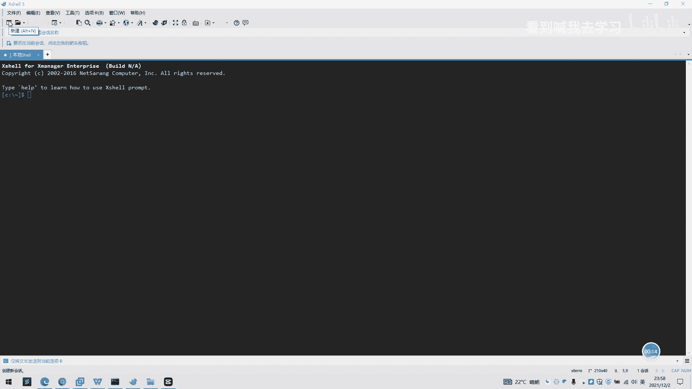
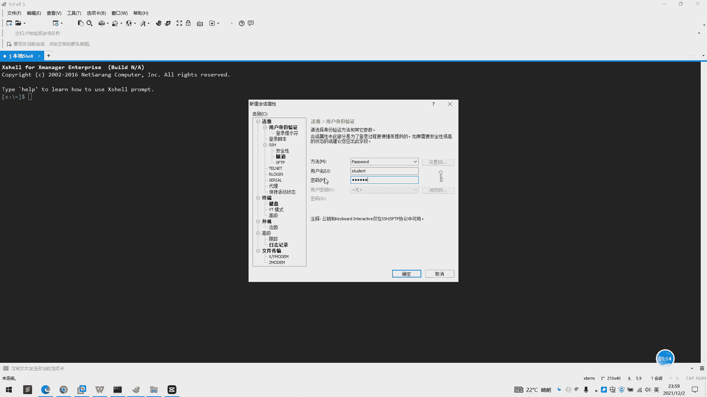
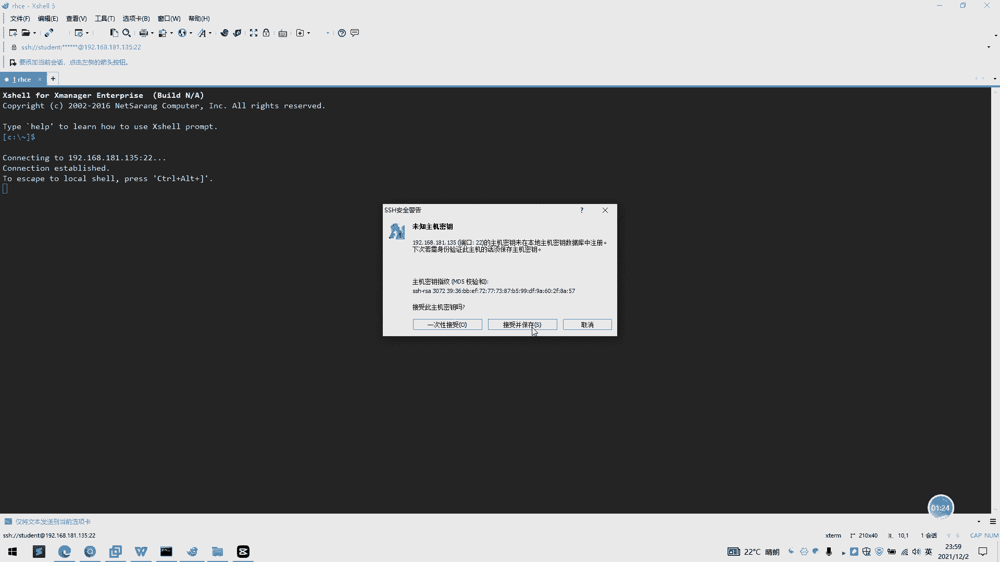
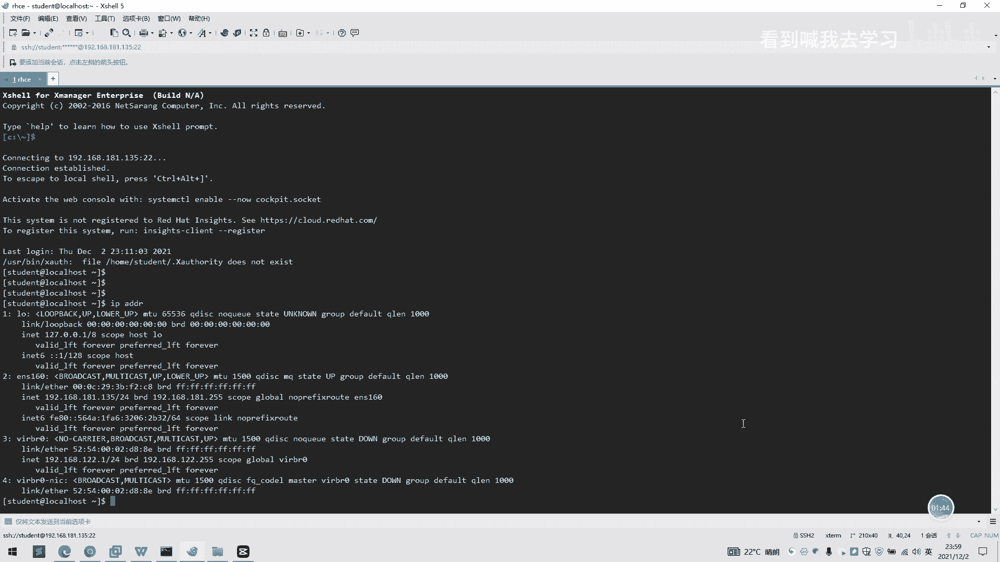

**RHCE课程：P4：Xshell工具连接Linux服务器教程 🔌**

在本节课中，我们将学习如何使用Xshell工具连接并登录到Linux服务器。这是进行后续所有Linux操作和管理的第一步。

上一节我们介绍了课程的整体安排，本节中我们来看看如何具体使用Xshell这个终端工具。

好的，我们现在来讲解一下Xshell工具的使用。我们现在打开一个Xshell，进入Xshell工具的主界面。

以下是新建会话连接的具体步骤：

1.  点击工具栏的“新建”按钮，或通过“文件”->“新建”来创建新会话。
2.  在“连接”设置页中，自定义会话名称，例如输入 **`RHCE`**。
3.  在“主机”栏输入您的Linux服务器的IP地址，例如 **`192.168.181.135`**。端口保持默认的 **`22`**。
4.  在左侧类别中选择“用户身份验证”。
5.  在右侧的“方法”下拉菜单中选择“Password”。
6.  输入用户名，例如 **`root`**。
7.  输入对应用户的密码。
8.  点击“连接”按钮完成设置。

完成上述设置后，双击新建的会话（如“RHCE”）开始连接。

首次连接时，系统会弹出“SSH安全警告”对话框，提示您保存服务器的主机密钥。点击“接受并保存”即可。

连接成功后，Xshell窗口将显示Linux服务器的命令行提示符，例如 **`[root@localhost ~]#`**。这表示您已成功登录到虚拟机。

为了确认连接，您可以输入命令 **`ip addr`** 或 **`hostname -I`** 来查看当前系统的IP地址，验证是否与您设定的地址一致。

本节课中我们一起学习了使用Xshell创建会话、配置连接参数并成功登录Linux服务器的完整流程。掌握这个基础工具的使用是进行后续所有RHCE实验和操作的前提。