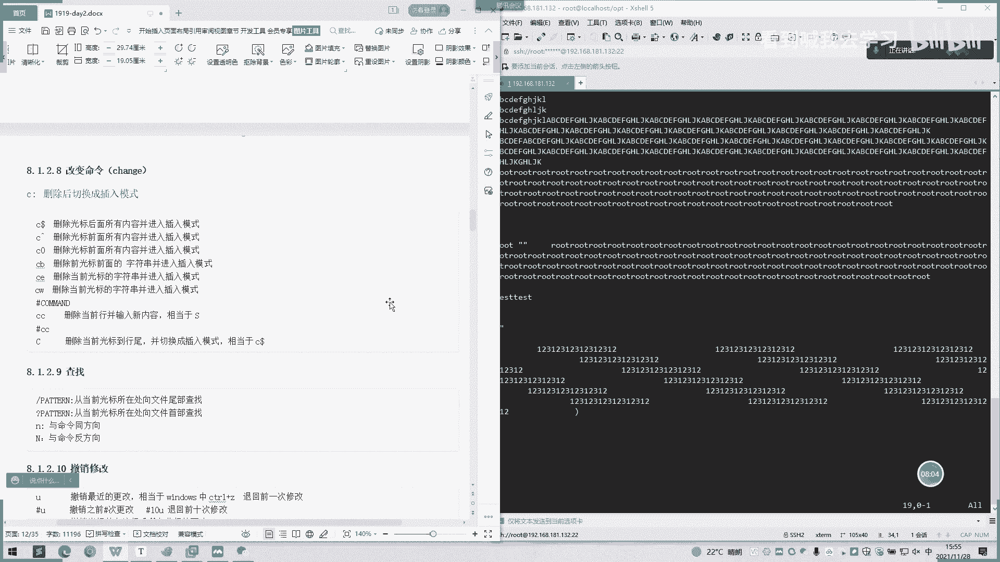
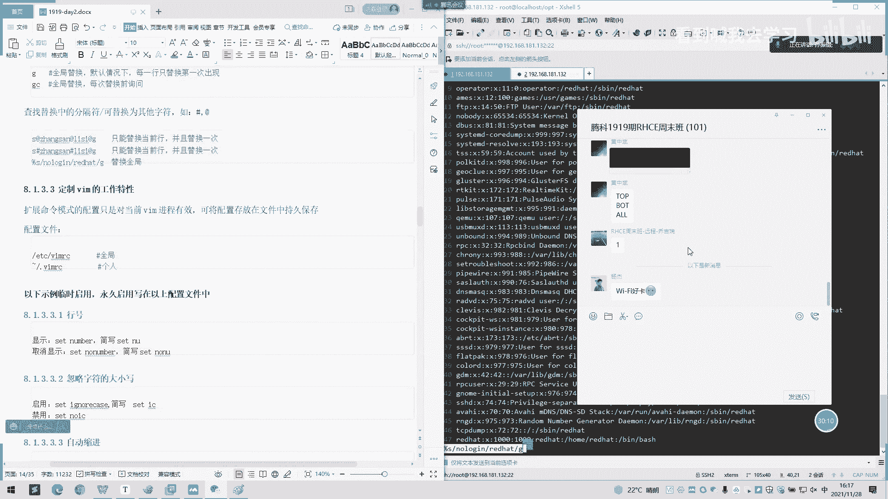

# 2022 01 最新rhce教学视频 - P8：20211128_04 - 看到喊我去学习 - BV1Na411y7SQ

我们继续讲啊。嗯。我们继续讲一下高级用法。呃，常见的。高级用法就会有。比如说Y啊是复制D一般都是删除啊，代表的删除。G小G的话，大U势变大些呃，G小U是变小些。

🎼嗯，直接操作就可以了。时间轻分一个。AB c d f g h i。你好像。下次小啊小写了A。C。第呢个同事。嗯。Okay。OK刚刚。喂喂。之前。当也支过了，第一也是也支过了。一次删除啊。然后。其。

U那些。点样。不是。去他。The。主要。这就变大起，然后。变小小IPU。两个都会变小。然后这下面还有个示例啊，你们可以先。看一下。你说你系。到了。从这里开始找贝啊。你家埋。嗯，这个考杯一次考杯。

要是高了的话。也会试一直拷虑。100路。来个。直接出100，然后自里会显示1个100。然后我出一个I。他就会进一个编辑模式。要么再出一个路子。要按退出。这有个100个路的自动生成。啊。再演示一下。

100。好，你行。这里。明白嗯。除了 IS。ESC退出，那就100个t吧。这就是讲解1100次的用法。然后DI呢就是光标，呃，这里有个空格之间，则删除空格之间的内容。这个怎么理解呢？你可以这样子。

你空格一下。Yeah。边。是啊。这样子。DI。然后加个括号才入删除。我是。括号里面的样文。啊下面变了没有，我这己变。挺好。我已经复制了。完皮。是不就布置出来了。那这是一个。YI的一个。

括号YI然后一个括号总括号，还有1个VI的一个大货号。哎VI大不好意思，就是删除字符，直达遇见光标之后的第叉个字符。这怎么理解呢？这里。比如说按T，我现在已经选到T了，然后TT。Yeah。第七。电知。

看没有有没有变化？1个t都不见了。呃。

再直观一点。很闹漫。

那你也开始去切换了。

你看现在是什么模式啊？哦，这我给画个图。

嗯。有这我是一个普通模式啊。然后。右边它是一个呃，比如说命令行模式啊，命令行模式。这是普通啊。然后这边是一个。呃，编辑模式啊。也是A色。那我们模式间切换呢是首先要。到达普通模式，然后普通模。

或者是普通模式到达呃插入模式就是音色模式。是可以两回自由切换的或是普通模式直接插到命令模式。也就是说我们用那个shift加冒号的话，是可以呃是命令模式啊。然后命令模式按USS7键也可以退出普通模式。

但两个模式之间是。不能来回之间切换，一定要通过一个普通模式，就是说退出一个呃按月时间到回到一个普通模式才能去切换一个命令模式这样子。这这一个插入模式是不能直接跳到一个命令模式的。

哎，比如说我这里我现在是普通模式是吧？我现在按开这是一个编辑模式是吧？那我想要进呃，那我按。这口加冒号，还只是一个冒号而言。它这里是无法直接切换到那个呃命令模式啊，我们只能按ES退出，然后我们按按冒号。

按75号才能进入一个编辑呃命令模式一个状态。

这法明白了吗？画画图有点丑啊。但是。这反正比较直观一点。所以可能新手在小白之后，他可能是理解的可能比较抽象一点，但画的图吧可能会有一些比较明白一点。top。啊，在我后面讲一下，我现在先不讲讲。

我们现在先呃先讲到。还是先讲到普通模式下面的这种各种命令先。然后刚刚我这里也吃了这100次。还有这个也是第三个字我是。外菜也是一样的。IT。I t。予以。这是副总。哦，我现在是产点。

他就把O已经粘着过去了，我刚刚是。选中了这个O，他就会把这O粘贴。就像一个辐射。然后扩展命令这一块呃扩展命令也是进入到一个命令模式啊，这个EX可以理解成就是一个命令模式啊，它会创建一个命令体示服。

比如时我们按shift5加冒号就会有个冒号在底部生成。处于底部的屏幕左侧。然后扩展模式的呃基本命令有哪些呢？呃，第一个就是说WW就是。right的意思。你可以这样记啊。

W是YY的就是WQ就是呃保存退出吗？YC保存的是什么意思啊？X就是。两个的合并啊，填写解去解去并退出啊，写入这一次书。说X。也是可以推出来。所以一般。一般熟一点的话，只能按X就退出了。

不用按就说WQ这样子。再退出。我还有个X加密啊，这个也没。经常用，比如说我们先设个有 high。啊，没有的。对的重复输入一次OK。保存了，那我们在一个小X退出。我们再预约一下。

那当前当前用户是是可以看到啊，但是普通用户话就可能看不到了。呃，这个演色。仲形。没有做错系。嗯谢谢。你点。And大比。Yeah看。直播啊。那Q的话就是退出一个状态。如果是Q感叹号的话，就是不存盘且退出。

即使更改了都会丢失掉。然后我们读文件内容的时候，读文件内容当到当前文件中去，我们给offfi。啊，比如说我们先创建一个。S一。s屎。嗯。太随于。然我问。Yeah。他自己什么都没有。什么都没有。

然后我们该他。可干嘛啊。o b知。嗯意。O。他表示已经可以了，那我们再看一下。哎，没有。就系下。诶。哦。那就把空文把当前文件。把你要读的文件内容复制到这里面来。还如果说是。

当前文件里学入到另外一个新文件呢。就是W啊，今天高反。哦，我们继续。嗯，是没有了。W。OPTS。IB经存在。嗯。嗯。新的文件，如果原来原来的文件是存在的话，它是无法写入的。我可以看一下。除非是加一个。

感叹号。他说感到就强制写入。感叹号的意思执行命令啊，不管有没有成功，就是要执行命令啊。但是我刚刚的话就是没有执行命令成功，他也会退出啊。我是啊感叹号我靠码啊，就是读入读入命令的输入啊。

就像刚刚这样子一样。夏里特。那结果会打印出来。嗯。刚刚说我提示没有权限，他也会把结果我打印出来。还有个。地址定价地址定价是怎么算呢？地址经界的话就是说呃。我可以去，我知道是哪个行第第几行。

然后第几第几行从从左或者从右去算起的话，我们可以说。通过这个我们可以用它数字去表示去粘贴。粘贴到我们。啊，比如说我们按第一行第一个字符，我粘贴到其他文件都可以，或是粘贴到当前文件，或者向下查找。

都是可以的，然后他自己地址定界格式他也给到。具体的第第几行，就说第二表示第二行。哦，这个演示一下。嗯这。嗯嗯嗯。随着调堂去跳转。两行两行的票转。有这三的话。123。3、然后他会跳到一个第四行。

我是这种玩都是这样。想。这有个杭州看一下。第20行。你知道说啊。续航就是续航。如果是我们刚刚。诶。主通模式下面我们按2。的话他会进进行一个第二行的跳转，就会跳到第三行去。对2加1。

我们是在命令模式下面的选择。第二行的话跳到呃文件内容中的第二行去。系。呃，是有区别的，地址还是地址行。嗯，他会开到第三十行那里。然后这里还有一个。所。左侧呃N行表示起航到右侧N行表示结尾行。好。

来试一下。从10到20。他这会跳这个好像看不到什么效果。嗯。啊是。最后还是会跳到呃。最尾的那个行是多少？你要写20大跳到20斤。你要从。这里的话就是。大加比如这有个事例啊。一3。那第三行去。嗯，第三行。

你再来一下。对吧。两横跳到第方。听能明白吗？这块能明白吗？反正这确实有点要自己去敲的就。表示点的话就是当前啊。实际实际生产中用的可能就是呃直接确定行数直接写就行了。就说我要跳到2十行，就二十行。

三十行就三十行这样子。然后自己多了的话，就是最后一个或者是。那实际我们直接用快捷键也可以带来一个最后一行。嗯。一个大局就到最好一。呃，这就是那个在命令模式下面，它这些有去扩展了。

其中快捷键也是可以完成达到效果。然后这里有个当前行，倒数第二行我们也也来操作一下。嗯。安全行倒是这样。一个逗号。用个刀开处对卡。进去是到了3期。Yeah。然要有个全文的话，就相当于。嗯，百分号。嗯。

然后就相当于也是到到达结尾了。所以。这也是有点多于不太实用的。看看个人习惯，然后这里有个。呃，parttter，然后从他的意思是从当前行向下查找，实道匹配。花场的第一行及于镇的橄览室。呃。

正的表达是后面我会讲到，然后这里的话大家先可以先大致大概了解一下这面的情景。他怎么？比较没辩论。这是一个关键字查的啊，之前都说过了。所以我们后面这一前不看的。我们看了一下。地址接后面跟个编辑。

后命那是什么？我唔知。低问你就把单。呃那个。你和模式下面是一样的。马案也不是对象。然后杠Y就是复制。这也是重复的这也是重复要不讲。他聊啊啊。这还有个查找并替换，查找并替换就是。S1查的内容切换为内。

切换为内容，加一个修饰符。说明要查找的内容可以使用基本的正则表达模式，句号内容为不能使用模式，但可以使用反向斜杠一2等向后引用符还可以使用呃。这个井号引用前面的实查找的找到内容。这有个忽略大小写。

来个全局替换，来有个全局替换，每次替换请询问时间。查找切换多的风格，符可替换为其他字符，如井号艾特号。OK我们试一下。你们弄。我们录的换成一个加个艾特号。换成一个。爱特区。帮录。谢啊。

当前行测试当前行的T换的当前行。有是井号的呢，看一下。嗯。清楚来。嗯。它只是替换一次啊，它不会批量替换。而且基晚都是当前啊。不是全局。这选。Okay。嗯，这个还有那个。也是。开始。我是。

S的话那就不一样。呃，上务区。比如说把这个红猫替换一下。开始。就得。安去。是是把全部都替换了，就是SP那边全部替换了，然后这里会打会显示一个替换了多少个？43个。进去。然后这两个定制VIN的工作特性啊。

呃，至于说扩展命令模式的配置只能对当前的UIN进程有用啊。

wifi好卡，连一下网线。然后这里有个配置文件，我们可以看一下设置修改。就改VIN的一个配置了。啊这里都是一个呃脚本类，都是一个脚本，I面也就是个。也是一个脚本的。然后这里有个全局吧，一个个人的是。呃。

你这是当前目录下面的一个。嗯啊。嗯。哪里没有啊。目前是没有客人是没有那我们看一下全局。然后这里这里的话可以。可以设置自己自定义一些东西。比如说一个字符啊，字符及默认的字符及打开什么。

我们看默认是UTF啊。所以他这里的话打开是UTF发的一个制符机。然后这里还设置一个hiory，就是说我们命令啊，我们在上面用的命令模式啊。经常可以看到1个50条，前50条个季度。老师下面给你看一下。

然后这下面有一些应用。以下设立临时使用，永久使用，且在配置中行中。你找一下相面。嗯。今入疫情。你是十一个钟。就说我们自己之间。这个三。好行。是不是每次打开我就有一个呃序列号出来，就是。统一到这里。

是是有点贵，是不是不一样？有这里对我在这里设了。一个send number它就会输出一个。行号出来输出于1个123456这个行号出来。如果我们这里还自己可以再添加，比如说一个。嗯。忽略大消起啊。

你能看一下能开始的就是。哦，这有个大小姐啊，标P啊，大家注意啊。皮质大小姐，那我在VI进去的时候。北他这里没有生产。这是有点神心啊。还是我复制错了。哎，这没错。嗯。你试。嗯。那我找一个。哦。

这个P就会大大写P跟小写P就显示出来。把它去掉。咦。😊，这个大写屏就不会显示出来。什么意思啊？如我那里设置了一个忽虑大小写的话，我这个P收P的话，可能如果小写P的话，大写P跟小写P都会显示出来。

但是我如果不设置的话，那只能显示一个小写P。我想要收大写P的话，我们还还只能敲个大写P，这是一个大小写的一个查找。你讲的是一个大小姐，一个查找。刚刚这里是一开始进入一个number，还有一个自动缩进啊。

自动缩进。你他那一个智能手机。设一个。AI。那我们创下一个。对。嗯。应该是新的。是不是？那我们一开始创建个。他这里这有个number号是不一样的那我们先去掉再看一下。去掉。嗯。那就是这点组是。

还有一个复制保留格式啊。复制保留格是。嗯。保留之前编辑的模式是哎，比如说什么格式，它就可以列成一个什么。这里就比较冷门。知个谢谢。好。然后我们。是。明白。你这个吃的话是说。因为我需要吃其他吗？嗯。可。

行你看。我们往下吧。这个高量的搜索。呃，显示table汉文符的话，这里可以看。Sir。第。然我们加个换行服。嗯。哦，你看他自己就显示出来了。是没有了。没有了，我们这新天的话自己会显示出来。

自己会打印一个换行不出来，只要按回车的话。嗯么。People。如果按铁果键的话，就会。有个这个什么。这东西呢这东西像也是。不怎么使用啊。嗯。这取掉。然高量搜索。高量搜索这里的话就可能就。好一点呃。是。

好像是有的。这里是有一个高量搜索的。对他这里是带一个高量搜索，所以的话我们这里可以不用配。你有说禁禁用的话，就只是把这个前面加个no就可以了。其他的也是如果是禁用的话，就是加个note，所有都是一样的。

如果说启用的话就是。呃，去掉那就是。这passpassnopass这样子。语法高亮的话，这也是自带的。这有个语法高量自带。第 you。这一个判断已经因为语法爆量了。

文件格式啊使用windows格式是小fi do。un是fiunix，因为我们之前可能从windows上面拉文件下来的时候，它的格式可能就是个windows的格式。呃。

如果说你想可能可能有些程序它是不识别的。你要把它变成呃就是说unix格式的话，就是要通过这样子去操做。这是在这里默认的，在你默认。这里默认的启动都是。保存成一个语。是的。So about。

Yeah it。看就行。这样子写这样子就是一个呃这个文件就是一个unix格式，默认的windows下面默认的创建文件都是unix格式的。但是可能有些windows格式的就是说保存下来的话。

可能就是比如用那个。windows的编辑器保存下来的文件可定是到此格式的。所以这个可以上。可以看看也可以引起的话，就是叫FM。哎。我就笑了。FF就是un。用空格代替。默认8个字符。

这也是可以在那个UI里面配置。这样子。嗯，你后我们接过一下。是不是也来。嗯。所以呢。嗯。1234567。啊。啊默认去。8个字符。然后这有个指定空格数数代表。指定几号。嗯。也可以在这些全区这里设。

Avo stop。比如说。是。啊是。好。一。234。那刚刚只是一个。只是一个8个。空格现在就是10个空格，我做的是10个空格，所给他推我是1个空格。对。你默认是tableable是几个空格呢以。那你。

123哎。嗯好。直接跳过来，112直接跳过来这里。我认识4个工作。嗯。我的拔个很多大体。所我是设置光标所在行的标标志线呢。啊，我们可以这一这样子弄。是平是的吧。系。哦。是不是每次输入的时候。

那个行都往下走。是不是？

呃，还有一个是销耗的一个帮助。呃，直接自己。后命令模式，然后我们一个票，然后加个提示。然后他的6看例。那我们这里就有。前的这些命令啊。那我们可以看我们可以找一下之前的，比如说table store。

别给死 stop。这个是吧，这里都有。这次至于多少。嗯。个诉啊这是个诉啊。有不懂啊可用这个 help看一下 help是什么意思。O。我们休息10分钟啊，然后我们十分钟练习一下。

我们下节课去讲一下可视化模式。嗯。先休息10分钟。

啊。怎么样？你们在在设置了吗？难道没人敲键盘呢？😀呵呵。😊，太多了是吗？太多就不想敲了。😊，啊，又是我一个人在敲了嗯。你放点水，你们自己。用那能敲一下测一下这个。VI东西有点多，你要自己手动敲一下。

只要考试不会考那么详细，考试可能就个保存啊呃插入啊，保存一下就退出编辑一下文件而已。但是。哎，但是的话是吧肯定要说不说。有有但是你没有这些，其实生产的话能用到话，可能就是大小写忽略大小写制符啊。

或者是自动缩进这一块的。还有一个行号，一个显示，就说你行号一个显示的话，你可以说我打开一个文件，我才可大概知道它是多行了。一般来说有故障的话，比如报错了故障，它会显示说你。呃，某个行哪行哪行呃。

配置是有问题的，但是你找到那个配置文件，你不知道是哪个行，那你只能用s number去看一下那个行号，行号显示出来，然后我们再去查找嘛，或者直接就呃输入行号可以查找，所以说比较直观一点的话。

可能就是行号这一块吧。然后还有一个呃呃跳跳跳到某个行号，就是输入。命令模式输入多少个行号，跳到多少个行号这样子。所以你要记的话，可能就记这几几个就比较够用了。

高还有一个高量搜索这些的可以看一下这些这些都是学习，后面可以自己学习一下。光标光标这是这这个第10个点的设置光标所在行的标志线呢，这个也是比较实用的。这个东西那个东西太多，你不知道光标在哪。

可以用这个标志线去看一下。嗯。今天确实。嗯。

嗯。

那个就是。

嗯。嗯。没事，签一下签一下就行了。一个三个。可能快下课了。这可视化。可实话可能讲不完。我们下周再讲一下。那简单说一下。嗯。

No。

没。

