# Vim编辑器教程：P8：高级用法与配置

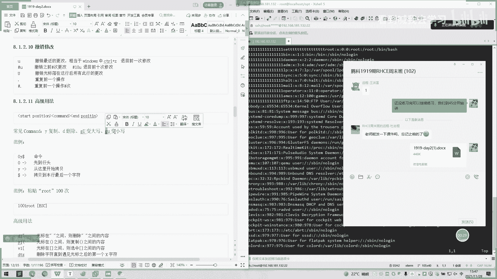

在本节课中，我们将要学习Vim编辑器的高级用法和配置。我们将深入探讨普通模式下的高级命令、扩展命令模式（命令行模式）的常用操作，以及如何通过配置文件定制Vim的行为。掌握这些技巧将极大提升你的文本编辑效率。

## 高级命令操作

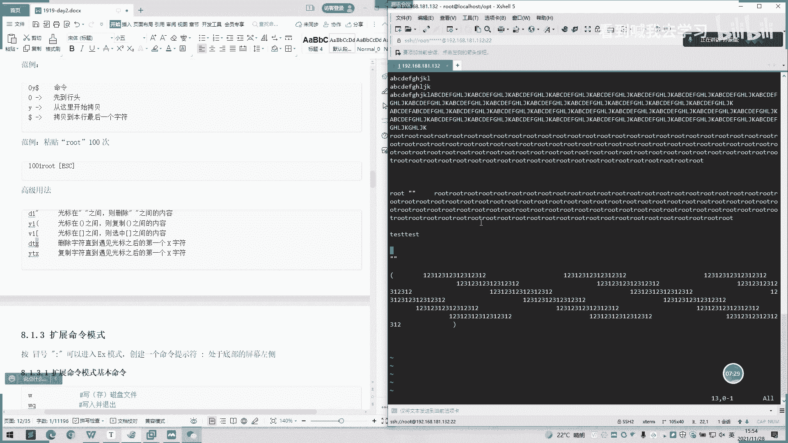

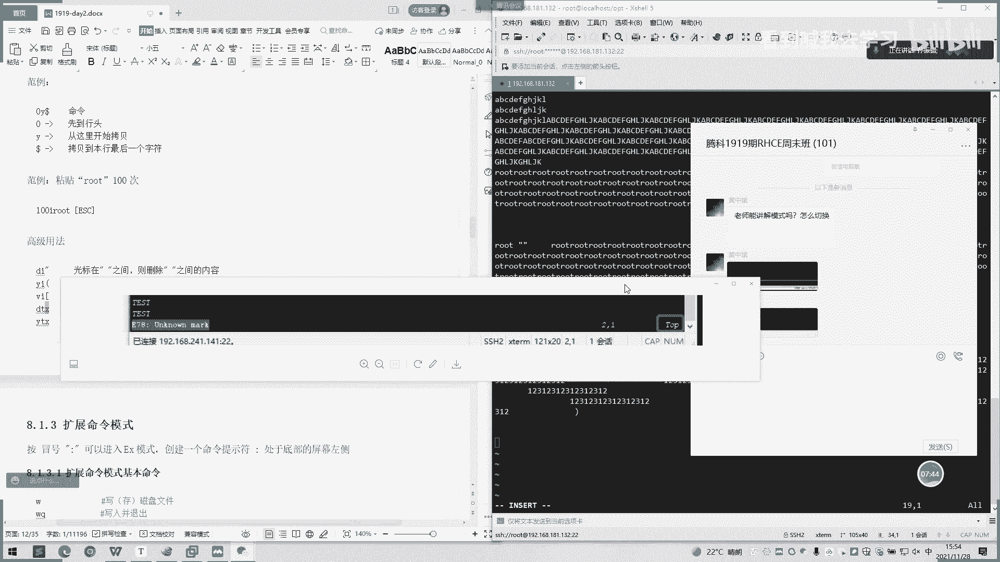

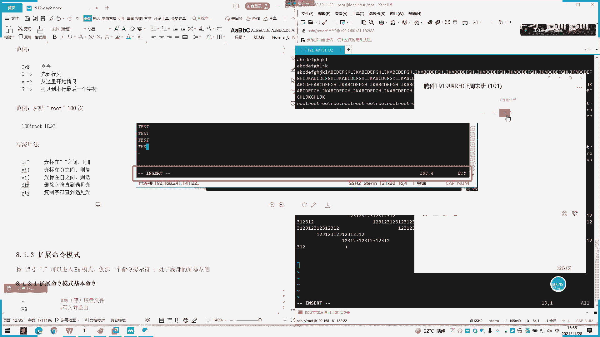

上一节我们介绍了Vim的基本模式切换和编辑命令，本节中我们来看看普通模式下的一些高级命令。

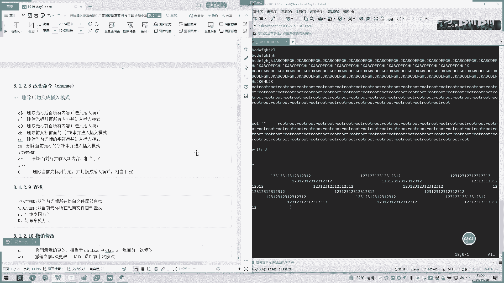

以下是几个核心的高级命令及其功能：
*   **`y`**：复制（yank）文本。
*   **`d`**：删除（delete）文本。
*   **`gU`**：将选中的文本转换为大写。
*   **`gu`**：将选中的文本转换为小写。

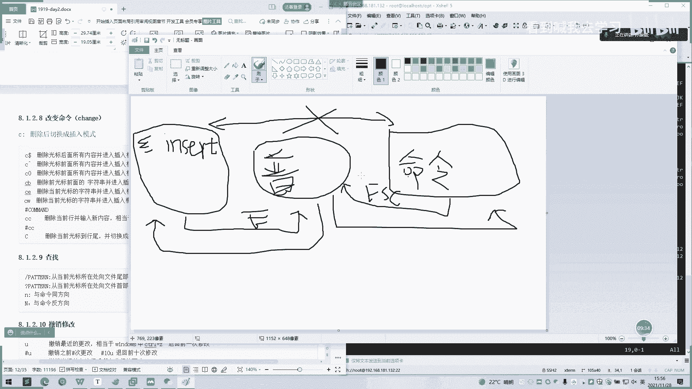

例如，在普通模式下，将光标移动到单词上，输入 `gUw` 可以将当前单词转为大写。

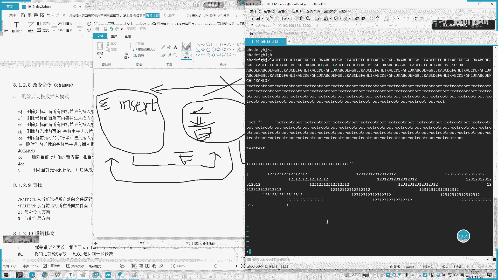

### 重复执行与文本对象操作

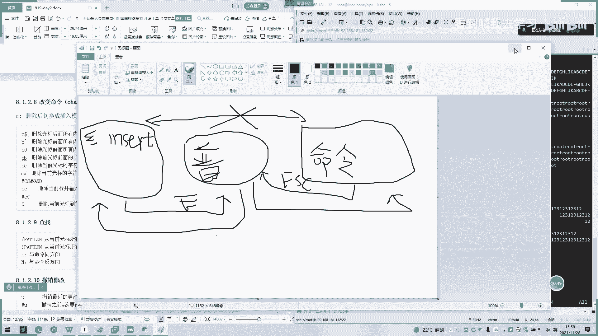

Vim允许在命令前加数字来重复执行。例如，输入 `100i-` 然后按 `ESC` 键，会插入100个连字符“-”。

另一个强大的概念是“文本对象”。以下是操作文本对象的命令：
*   **`di(`**：删除光标所在的一对圆括号 `()` 内的内容。
*   **`yi[`**：复制光标所在的一对中括号 `[]` 内的内容。
*   **`vi{`**：可视模式选中光标所在的一对大括号 `{}` 内的内容。

此外，`dtx` 命令会删除从光标位置开始，直到下一个字符“x”之前的所有内容。

## Vim模式切换详解

理解Vim的模式是流畅使用的关键。Vim主要有三种模式：
1.  **普通模式 (Normal Mode)**：用于导航和操作文本，是命令的起点。
2.  **插入模式 (Insert Mode)**：用于输入和编辑文本内容。
3.  **命令行模式 (Command-line Mode)**：用于执行保存、退出、搜索等扩展命令。

模式间的切换路径是固定的：
*   从**普通模式**按 `i`、`a` 等键可进入**插入模式**。
*   从**普通模式**按 `:` 可进入**命令行模式**。
*   从**插入模式**或**命令行模式**按 `ESC` 键均可返回**普通模式**。
*   **插入模式**和**命令行模式**之间不能直接切换，必须经由**普通模式**中转。

## 扩展命令模式常用操作

上一节我们介绍了模式切换，本节中我们来看看命令行模式下的核心命令。

以下是常用的扩展命令：
*   **`:w`**：保存（write）文件。
*   **`:q`**：退出（quit）Vim。
*   **`:wq`** 或 **`:x`**：保存并退出。`:x` 仅在文件有更改时才写入，更智能。
*   **`:q!`**：强制退出，不保存任何更改。
*   **`:r filename`**：将指定文件 `filename` 的内容读入（read）到当前光标位置。
*   **`:w newfile`**：将当前文件内容写入（write）到一个新文件 `newfile`。
*   **`:!command`**：在Vim中执行外部Shell命令 `command`，例如 `:!ls`。

### 地址定界与行号操作

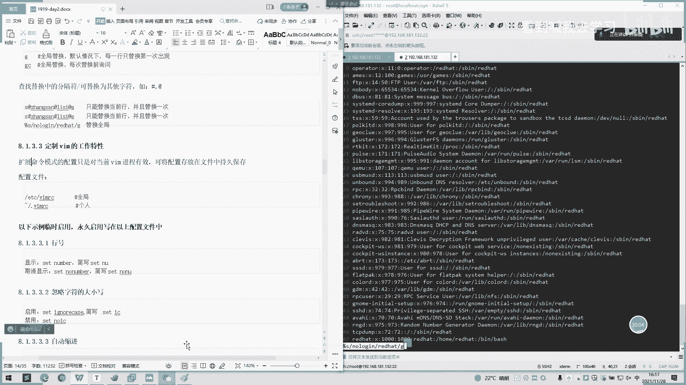

在命令行中，可以使用行号进行精确定位和操作。

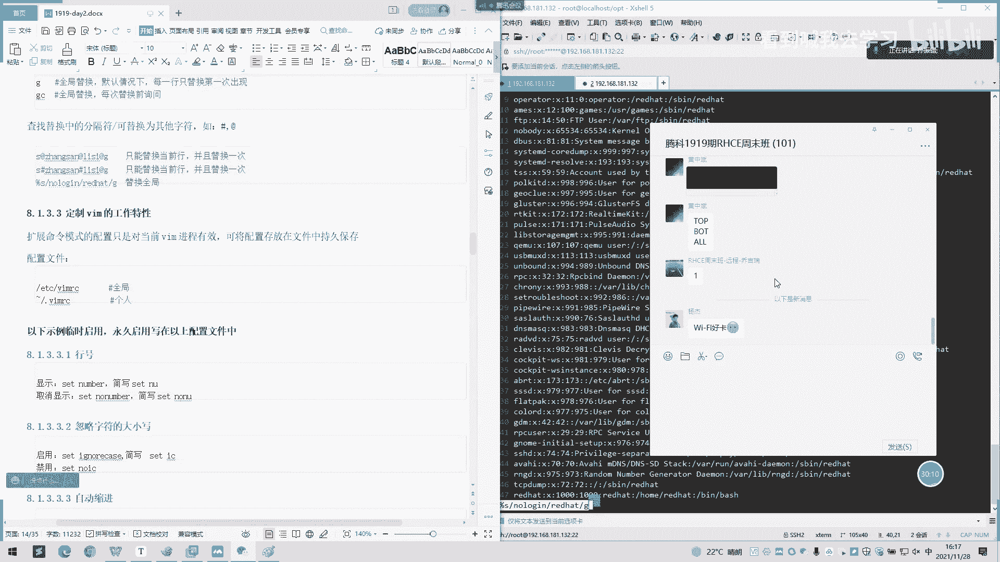

以下是地址定界的几种格式：
*   **`:n`**：跳转到第 `n` 行。例如 `:20` 跳转到第20行。
*   **`:.,$`**：从当前行（`.` 表示）到文件末尾（`$` 表示）。
*   **`:%`**：表示整个文件，等同于 `:1,$`。

地址定界后可以接编辑命令，例如：
*   **`:10,20d`**：删除第10行到第20行。
*   **`:.,+5y`**：复制从当前行开始的5行。

### 查找与替换

查找与替换是文本处理中的高频操作，格式为 `:范围 s/查找模式/替换内容/修饰符`。

以下是替换命令的示例和修饰符：
*   **`:%s/old/new/g`**：将全文（`%`）中的所有（`g`，全局）`old` 替换为 `new`。
*   **`:%s/old/new/gc`**：全局替换，但在每次替换前进行确认（`c`，confirm）。
*   **`:s/old/new/`**：仅替换当前行的第一个匹配项。
*   修饰符 `i` 表示忽略大小写，例如 `:%s/old/new/gi`。

## Vim工作特性与配置

Vim的行为可以通过设置（set）命令进行调整，这些设置可以临时生效，也可以写入配置文件永久生效。

### 临时设置

在命令行模式下输入 `:set 选项` 可临时更改设置，仅对当前Vim会话有效。例如：
*   **`:set number`** 或 **`:set nu`**：显示行号。
*   **`:set ignorecase`** 或 **`:set ic`**：查找时忽略大小写。
*   **`:set autoindent`** 或 **`:set ai`**：开启自动缩进。

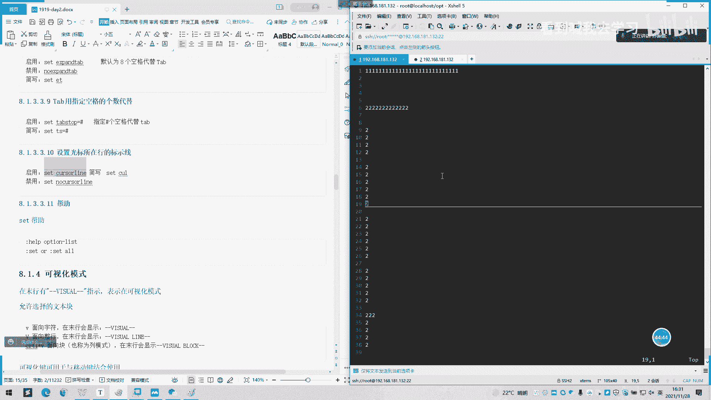

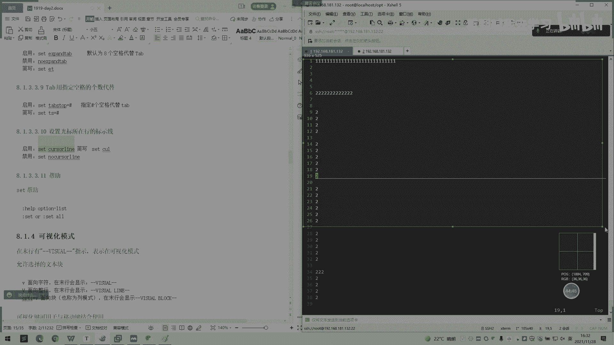

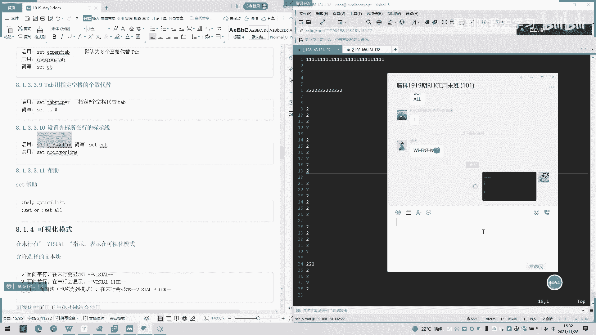

### 永久配置

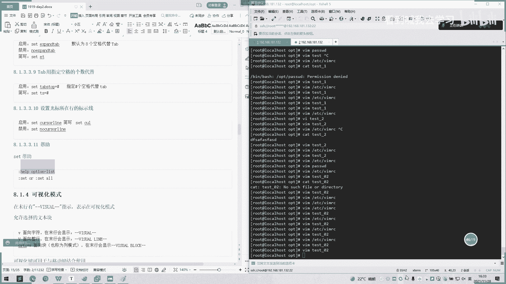

要永久生效，需要将配置写入Vim的配置文件 `~/.vimrc`（用户个人配置）或 `/etc/vimrc`（全局配置）。

以下是一些实用的配置示例：
```vim
" 显示行号
set number
" 查找忽略大小写
set ignorecase
" 高亮显示搜索结果
set hlsearch
" 将Tab键展开为4个空格
set expandtab
set tabstop=4
set shiftwidth=4
" 显示光标所在行的参考线（需要Vim 7.4.2201以上版本支持）
set cursorline
" 设置文件编码为UTF-8
set encoding=utf-8
```

### 获取帮助

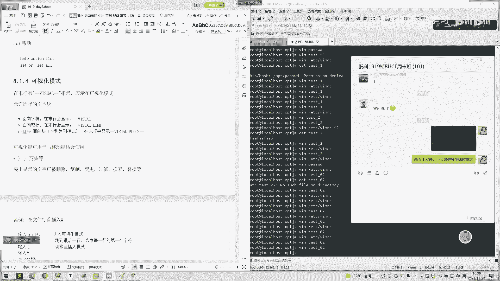

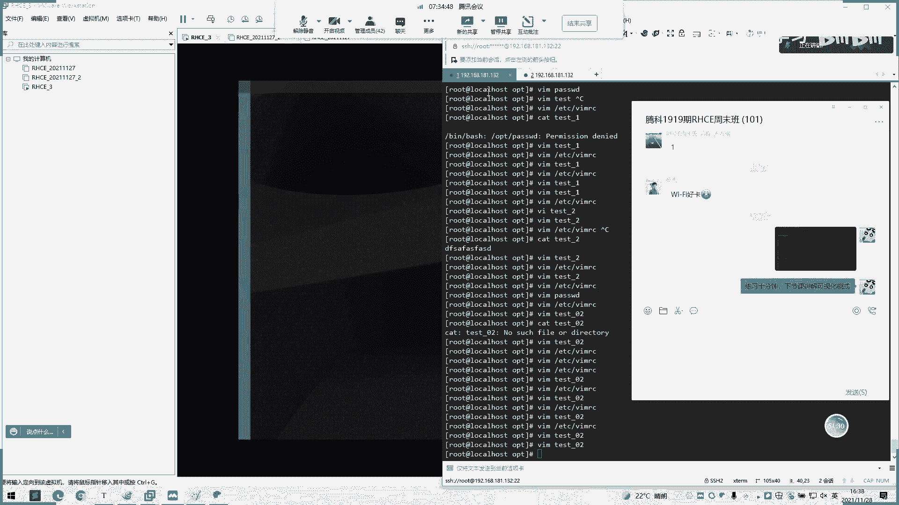

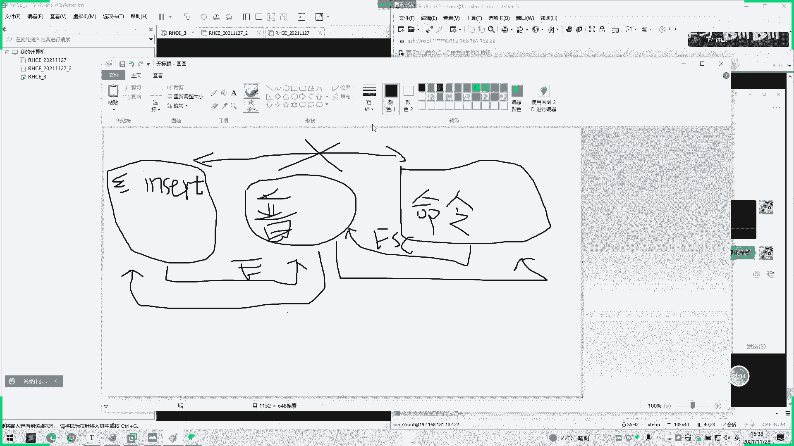

Vim拥有非常完善的内部帮助文档。在命令行模式下输入 `:help topic` 即可查看相关主题的帮助。例如：
*   **`:help set`**：查看所有set选项。
*   **`:help :w`**：查看 `:w` 命令的详细说明。
*   **`:help pattern`**：查看正则表达式用法。

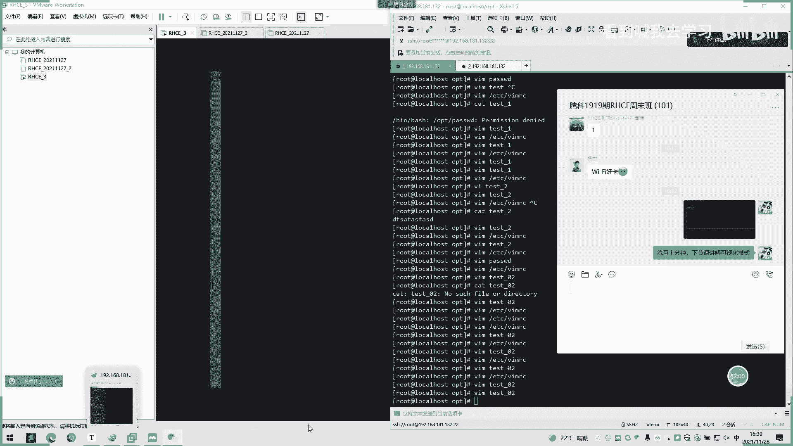

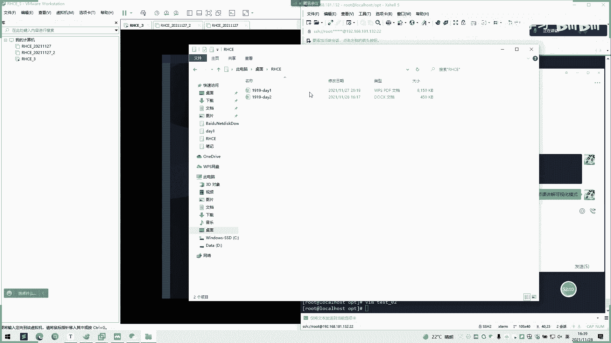

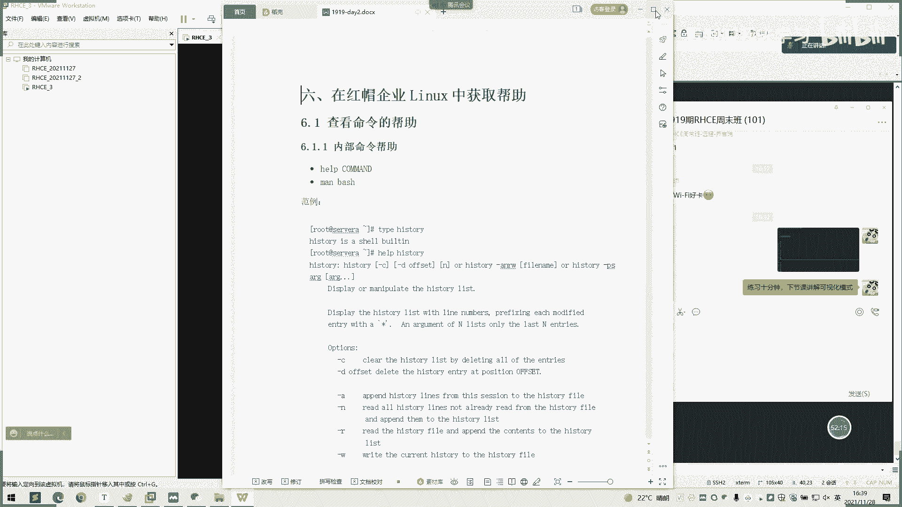

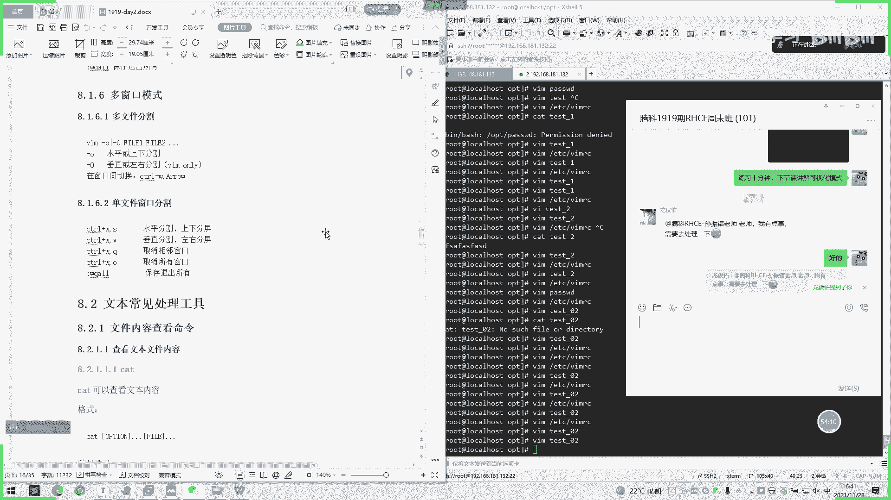

## 总结

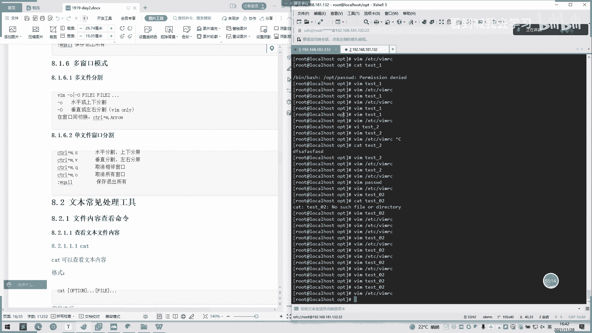

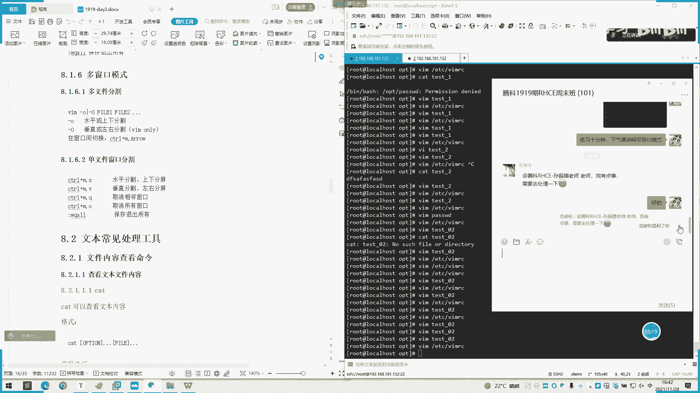

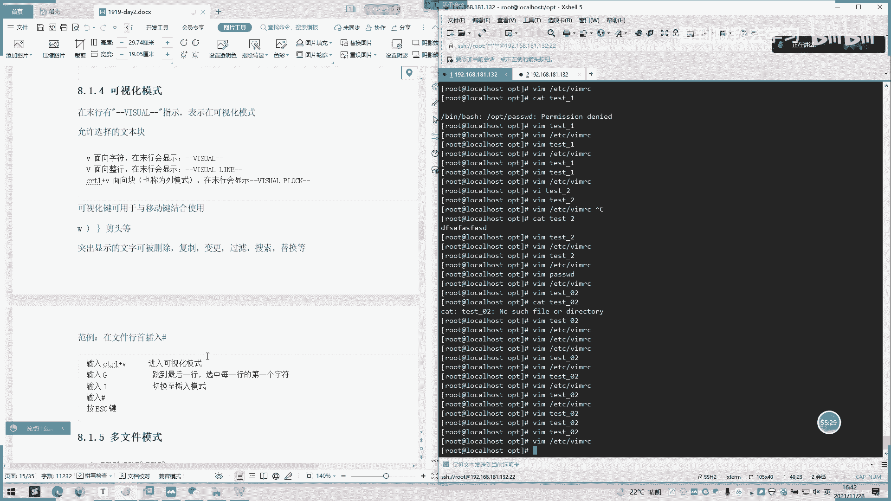

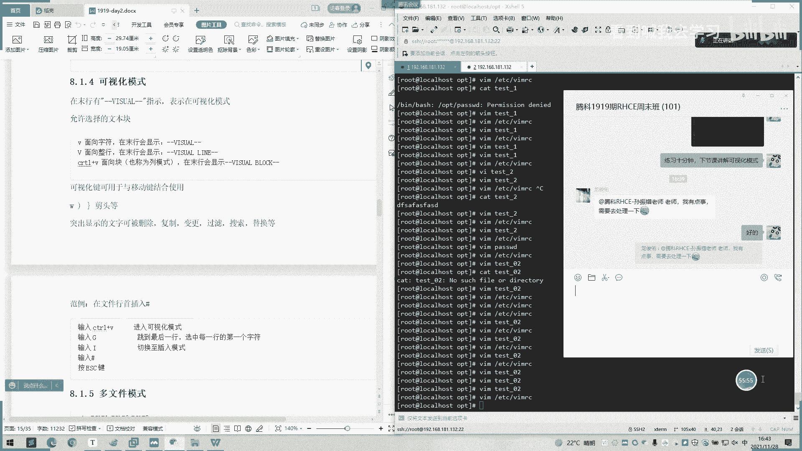

本节课中我们一起学习了Vim编辑器的高级功能。我们从普通模式下的复制、删除、大小写转换和文本对象操作开始，然后详细梳理了Vim三种核心模式（普通、插入、命令行）之间的切换关系。接着，我们深入探讨了命令行模式下的文件操作、地址定界以及强大的查找替换功能。最后，我们学习了如何通过 `:set` 命令临时或通过 `~/.vimrc` 文件永久配置Vim，以适应个人的使用习惯，并介绍了如何使用 `:help` 获取官方文档支持。熟练掌握这些内容，你将能更加高效和自如地使用Vim处理文本。