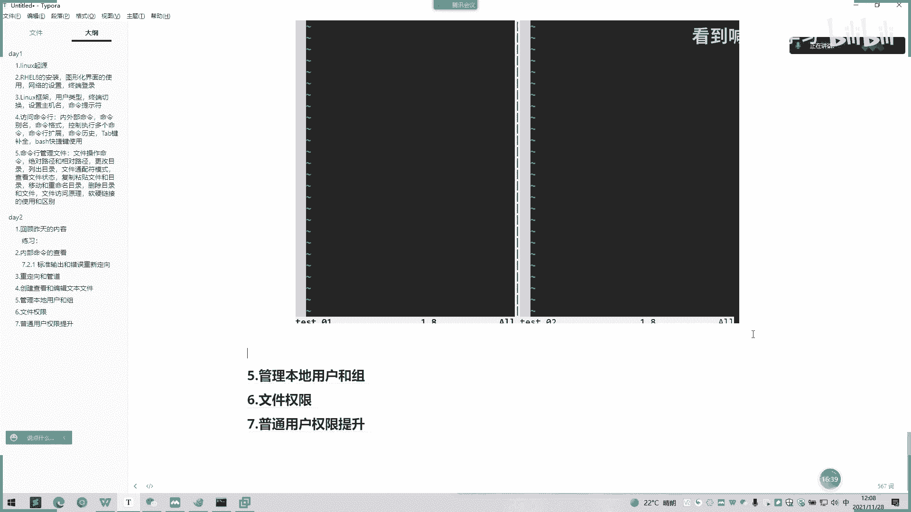
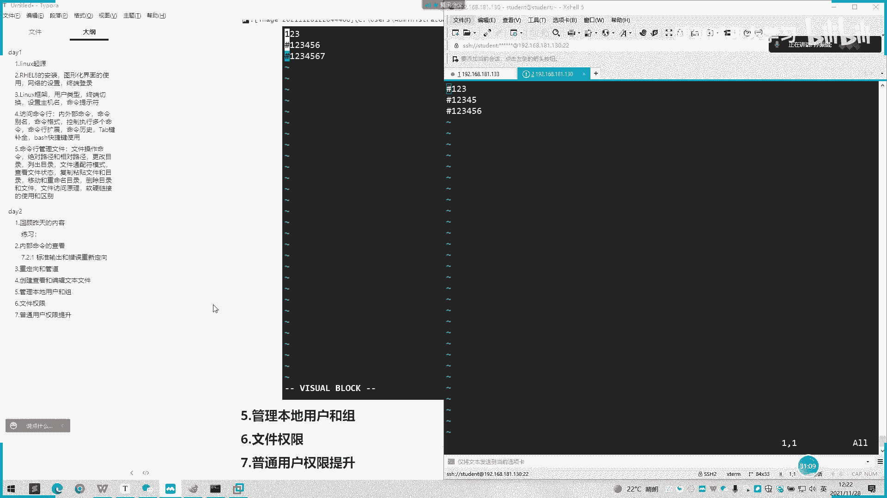

# 2022 01 最新rhce教学视频 - P9：20211128_02 - 看到喊我去学习 - BV1Na411y7SQ

Yeah。不。Yeah。

。그。嗯。Yeah。Yeah。对。好的，我们继续讲下一个小节啊，下一个小节的命令是这个 team啊。我们这里可以看到利用T命令可以进行重定向多个目标，然后经常配合管道服务器使用。

然后么合适就是我们敲个命令一的时候会中间敲个进，然后加个杠A，然后配上我们一个。呃，文件名就我们自定一个文件名，然后在我们敲命令啊，然后命令。命令一呃呃执行的内容结果。

它会保存在一个我们那个自己创建这个文件的里面去啊。近的话就是创这个。总定向多个目标。这时把命令一的结果即会保存在一个文件里面去，然后调用命令二去执行呃，去执行结果。然后这里有一个例子，我们可以看一下。

选项啊财务参数选项A是。抗A是追加追加的一个功能。就是如果说不加抗维的话，那只能保存最后一个输出结果结，这不会原来的前面的原来都会被覆盖掉。它这可以功能的话。

就可以保存不同阶段输出复杂的管道的故障的排查，还有垂时查看记录和输出。我们先看一下例子上面的。哦，这里有有2加3的，然后它会保存在一个。呃，BC的一个。直接装啊。那所保存的个结果。他都会变成我。

这个是之前的，这个是新的，先把它签了。然后这样子。

嗯，多举几个例子吧，比如说我们。呃，想找一个进去。把近视屏部打印出来。我们要是已经。有一个实力进程在在跑。我买个水利技能再跑。那我们。那么我们把呃。PS的结果就要导出来。PS就是说。呃，技能号导出来了。

那一个也是电脑。然后后面我可以去。嗯。所以如我想找一个实力进程是是哪里啊？他会把这个词欲技能力导出来，并。那么他现在存的就是。我之前已经PS命令调用的呃呃结果，这我之行PS命令的结果都会打印出来这里。

然后我用。进去保存这个结果，然后再去bra也是去搬金自去查查了这个结果，他就会打印出来。

第二点呢，他说一个复杂管道的一个故障，他能排除啊。就是说他可以同时把错误日记跟正确日期都输输到呃这样一个log里面。就是说你自定一个log，它会把错误日记都输入到里面去，就是输入正确或错误的。

然后你可以在里面。呃，生产上面可以正常直接看的日志是否正确还是错误，可以筛查故障。所以他这输出都会有。啊，这里还有个例子。这谢是。Okay。嗯。他这里分了两个步骤啊。一个是首先呃从定向到。呃，一个。

Canada。嗯。从定向到一个cat，他会把这个os，比如说我手里面某个结果。完了之后。t一是不是看查看一个t一是不是全部打印出来了。这这一部分是T这里打印出来的，然后这一部分是我要输出的结果。

就分为两。

嗯。嗯。

你不应该做到。嗯，7。没。嗯。那我们给你看一下。确实不会打印，那就是看。对。你 so。他已经重新一下了，那你是。

嗯。然后再看一下。嗯。后面我们学一下VI编辑器啊，我先讲一下下午的内容。呃，先简单讲一下下午内容。VI编辑器我们下午讲到后讲到一个文本编辑器，一个工具。原因嘛，然后。会以先讲到一个三种主要的模式和切换。

还有个三种常见模式和切换，有命令模式呃或普通模式，还有个插入，还有一个扩展模式。然后这里有个命令模式的话，就是。退出啊还有一个框标跟框标有个跳转，还有一个行间移动。还有个字符编辑啊。

还有个替换删除的这些。我们现在先讲解一下。呃，他的一个。呃，他的一个介绍。他说。默认是不安装VIM的，就是说我们常用。哦，我这里是已经装的了。最小安装就是说最想安装是不不安装那VIM。

然后我们现在装的是个UI图形化界面的话，它是会自带1个VIM的一个工具啊。有。接下的一个格式，我们可以看到一个麦，用麦去看它。可以用票。我们常用的选项有呃常用的后面UI加的一个参数，有有这些。

比如说杠V就是。打印一些相关的信息。就会直接进入到这里来。没有。有杠紧，就是打开后面加一个。井号就是打开后面让通标除于第二行。第跟第警行的行手给我加了个默认行位。어。如果说加的话。

让光标处属于第一个行行手的话。杠B的话就以二进制方式打开。试一下。我。我们用打开t看一下。目之前跳只是。很明显啊，就是说账号进制方式打开的话，它这里是没有变的。然后。

然后的话它是跟我们正常打开是没什么区别的。要比较多个文件呢。我们看一下这个t啊。那我们再用。Okay清。我们一个比较的话，我们就会输。障有什么不同啊？这里蓝色的。

配粉色的话就是意思是说这里跟代表是不一样的。然后这里有个蓝色的话就是空空格，它是按行去。嗯。去匹配的是每行的不一每行的不一样的话，那就显示的是不一样。嗯。那你给找个一样的。好，我看一下一样的。你想。

你看你。然后这边也是看。如果是匹配正确的话，它是没有呃，是不会用颜色去。

重新。重新去那个强制让你看到，就说不会让你很。

尝次看。Okay。Yeah。

有杠N呢就是以指读方式打开。嗯。只读方式打开，他就说我要编辑一下。编辑我是编辑，我是编辑完之后保存不了的。我只能强制退出啊。哦。我要保证。保存不了。那我用WQ加感叹号呢，会保存吗也保存不了。

对么。

对，我们只能强撤。表台了。上一啊。你也可以打一下。它首先会提示一个ex more type to go to no more，然后他的。直接直接进入那个EX模式。EX模式我们后面可以再讲到。In这。

没。Yeah。

然后还有个杠Y一个选择。杠歪的声音。都是。可以这样子。O他直接进来的话。直接就是一个编辑模式啊，而不是用我们首先不用I去弄它。好，那我先。修改一下。那粉色哦。W q。如果想要保存的话。

我们首先要按一个control哦，我现在修改一下。要按下ctl哦。他变化的是这个嗯，这就变成一个小写，还有一个框，还有一个小括号。我一开始的话就。一开始的话就是一个呃大写的一个音色。

然后有个ctrl这个小写的音色。这是他们之前一个区别。只只能在一个变成小写一个音色之后，我们才能去进行一个保存。

嗯。

嗯。

哦，很瘦。两。不行。这边。他还有个说明，如果说该文件存在的话，文件被打开并显示内容啊。如果该文件不存在的话，当编辑第之后重盘时创建它。就是说我们VI编辑器可以创建文件，就是说。呃。一个钟。

我们是有一个有提示我们一个new file的时候，就相当于说这个文件是不存在的那我们现在编辑它，并并且创建它这样子。你好。

那我们直接WQ保存就可以了。这是没有了那相当于说这个文件是。以及我们编辑并且是存在的，保存的时候存在的。呃，还有个三种模式的主要模式和切换呢。呃，三种模式而7话我们可以留到下午再讲。

然后我先简单说一下呃，BI的模式有3种，它的一个。呃。win令模式这种默认的。模式可以实现移动的功。呃，光标剪贴和粘贴插入或编辑模式用于修改文本扩展模式命令或命令行模式，就是保存退出。

这是我们刚刚的呃提醒刚刚保存一个退出的一个状态。啊，这也有详细说明。嗯。听清楚。嗯，是用这个。我先创建一下东西。我们可以用方向键去呃移动。哦，我在上面。会上上下左右的房向线距移动盘。这就是普通模式。

现在是个普通模式。普通模式下面的话，这里只会打印一个文件名，呃，还有一个。长度。还有一个它的一个多长，就是说行列有多少列啊，有一列啊两列。然后这有个24的意思就是24。这个字符。嗯。看，这里只有一列。

然后这两点。发现没有？这里就有变化。这有个两行。这一列。然后这里就是有4个，因为这就是字节束的意思，就是一个呃一个一或者2的话，一个一就是占两个字节，然后他就有两个有两个就是占4个字节。

然后当我们按I的时候的话，就是进入到一个隐色一个模式。那那我们按。一个C就就是退出来，就会这样子。就我们按小V的话，就我们按小V的它会进到一个鱼首，没事。

所以先写一下。嗯。我们要退出这个模式的的话，要用按exC啊。如果我们按编辑的话，才会进行到编辑模式啊。

Yeah。

然后再按一个G。嗯。这一个也是按就是按ctrol V啊，crl小写V就会变成一个。呃，选择模式。

这样。

Okay。没是。然后的话这里有什么不一样呢？那怎么。我先在按ctrl一，然后它进入一个呃选选项模式。那我们选择一个向向下方向键去选择一个这东西。然后我们按一个shiftI。然后我们按。刘景浩。按两个E。

那他就会批量的就就把我们之前选的这个会弄出来。就是批量的去添加你之前选的行列，选择一个行那个前面的。修改呀。这在实际的男通的话就比较常用一点。

呃，东西我也提诉了。

这看下。

Yeah。

啊，这也是一个快知识点啊。然后的话。呃。我们继续看一下呃课件里面的内容。他说一个命令行模式转化为插入模式，就是我们刚刚按I的话，进入一个插入模式。光标所选部就当前光标。

你指向哪里就是当前的一个进行一个编辑啊。有是大。比是我放的光标是在末尾的话，我按大I的话，它会自动跳到。啊So。当手去编辑啊，就说我按shift杠小I的话，它要变成大I嘛，它就自己去跳。然后。我是A的。

A的话就是在光标后。出去那个编辑啊。这比较明显。这己。然后我现在有个按A，它是跳到五的后面去编辑了。我现在是在五的目标指到5，然后按A，它是在五的后面去编辑。要走。我是大A的话，就是。好未啊。RH恒伟。

这里大家可以自己操作一下。如果是O的话，就是新的打开啊。哦。ES先退出来，然后。按O的话就是向下一行编辑，就它自动会新增一行，并且编辑。我说是好的话就是向上。就把原来的一个第二行变成第三行。

它就在第二行里面进行编辑。还有一个命令模式啊，命令模式我们之前改完卡的时候也会用到的，就是说序谱加冒号就会呃左下角面会有一个显示一个冒号的一个东西啊。他就是开始进入一个命令模式啊。

那命令模式里面我可以去调用很多多VI自VIN自己编辑的命令啊。比如说我们可以进行一个批量的批量替换的。比如说我们把。23换成dad。呃后面加一个抗击的话，就是默认全部批量替换。那么他就会变了。

你们再来一下。哦，这个也可以用这里的话也可以按方向键上下去选择之前历史的一个呃命令。就是说你已经敲过的命令，可以按方向键去去选择，这也是可以的。这以的话就是显示行嘛，账单本的显示行。

写算。

嗯。这里东西比较多，都用东西打印出来。然后S是P讲的。就是批量的。有 wq 爆上啦。Yeah。对。有个按U吧，还有个按U的话，就是说会回到之前修改的。我之前修改的内容可以回退，但回退回去。呃。

那这些课外可以课后自己去看一下。然后这里还有个扩产命令模式。呃，这是我们刚刚之前的用那个批量的批量去修改的这个命令模式。按两只月匙，他会自己去增疆。然后这里他他也有说明啊。呃。

命令模式啊又称为nomal模式啊，功能强大，只是在模拟输入指令并存到显示屏上，所以需要记大量的快捷键才能更好的使用。所以说VI的呃VI的快捷键。呃，大家要记记多一点，在课文上都有能找到。

就说可以很方便的去使用平常的那些呃保存啊，退出命令呃，回退啊，这种编辑啊，这己可以去去做。等一下下下节课我会详细的把一些。呃，VI编辑的快捷键都讲一遍了。哎。远程的同学还有什么问题吗？

或者面面授的同学这里。这一块。你UI后面想要了解什么，可以在Q微信里面打出来，到时候我可以整合一下，再把其他的发下下午可以跟你们重新讲解一下。就可能我们VI。编辑器这的话。

我会花花多点时间跟你们讲解一下，然后让你的手电呢把那些快捷键使用起来。面试的同学有。有需要知道哪些的吗？嗯，如果没有的话，我们先今天上午的课程先告一段落，我们下午在两点钟之后再呃继续上课。哦。

我们现在先先下课了。先这样吧。

