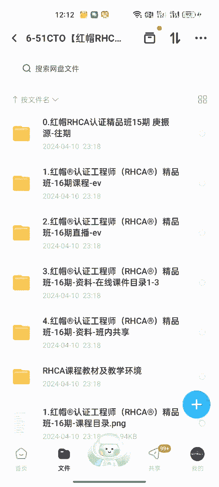
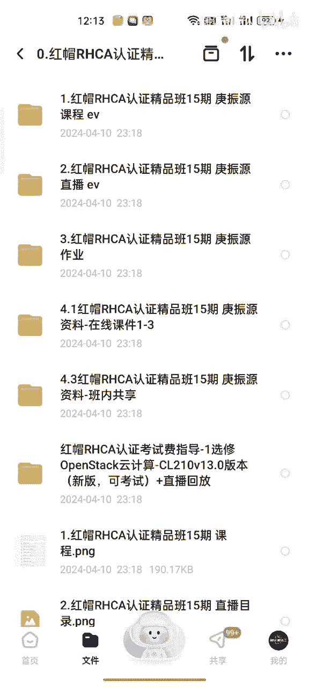
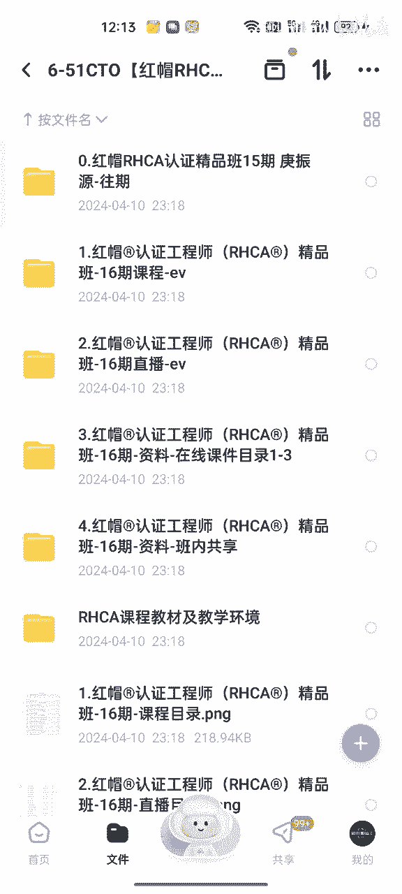
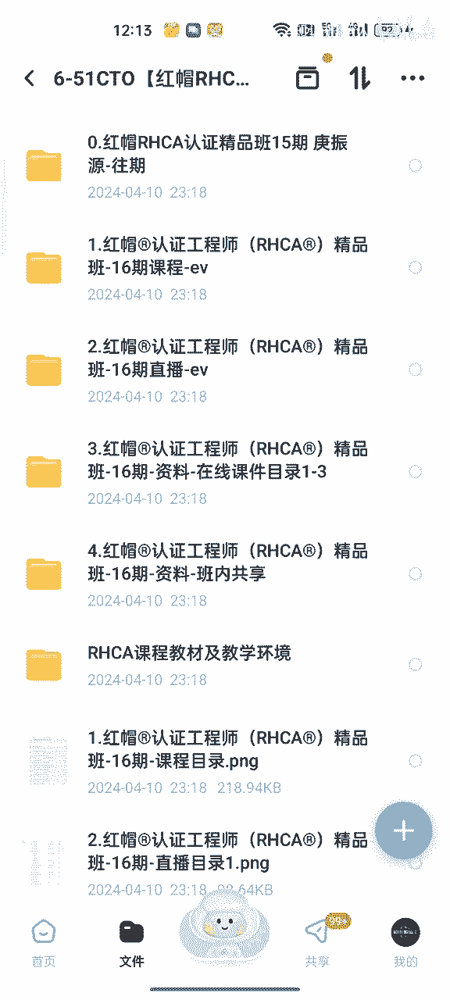
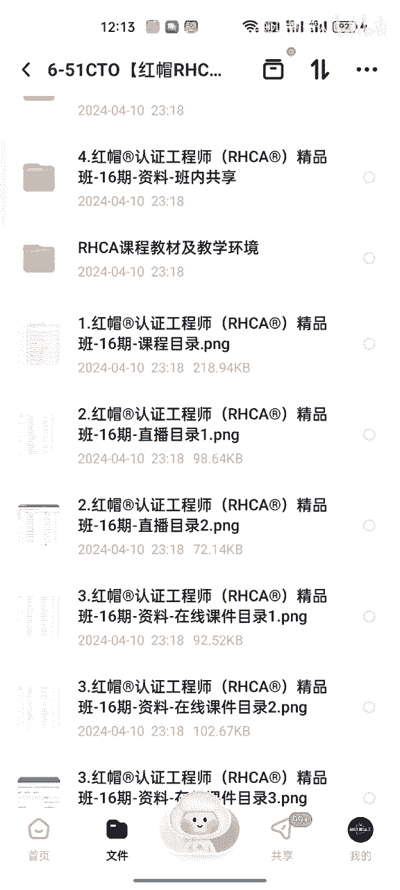
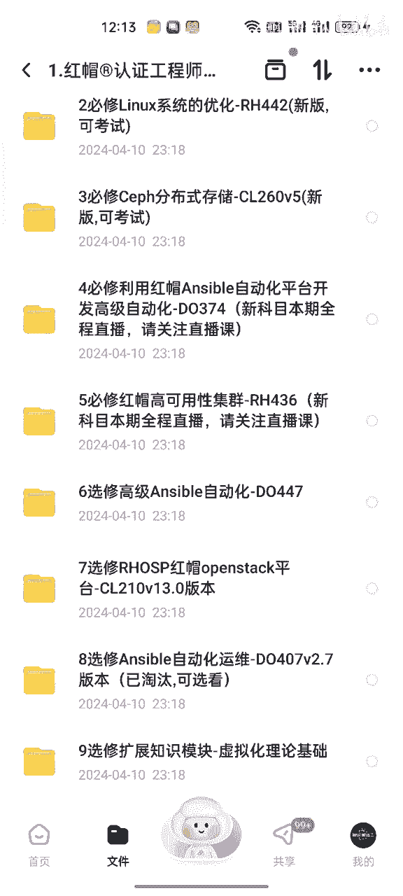

# Linux基础入门：P1：Linux系统安装与初始化配置 🖥️

在本节课中，我们将学习如何安装Linux操作系统并进行基础的初始化配置。这是学习Linux的第一步，我们将从获取安装镜像开始，一步步完成系统的安装与基本设置。

## 概述

本教程将引导你完成Linux系统的安装过程。我们将使用一个通用的安装镜像作为示例，介绍从准备安装介质到完成系统初始化的完整步骤。无论你选择哪个Linux发行版，其核心安装逻辑都是相似的。

## 系统安装步骤

上一节我们介绍了本课程的目标，本节中我们来看看具体的安装流程。以下是安装Linux系统的主要步骤。

1.  **获取安装镜像**：首先，你需要从官方网站下载Linux系统的安装镜像文件，通常是`.iso`格式。
2.  **制作安装介质**：将下载的`.iso`镜像文件刻录到U盘或DVD上，制作成可启动的安装盘。
3.  **启动计算机**：将制作好的安装介质插入电脑，重启并从该介质启动，进入安装程序。
4.  **选择安装语言**：在安装程序启动后，首先选择你希望使用的安装过程语言。
5.  **配置安装目的地**：选择你要安装Linux系统的硬盘，并进行分区设置。
6.  **设置主机名与网络**：为你的计算机设置一个名称，并配置网络连接。
7.  **设置root密码与创建用户**：为系统管理员（root）设置密码，并创建一个日常使用的普通用户。
8.  **开始安装**：确认所有设置无误后，开始安装过程，等待系统文件复制与配置完成。
9.  **重启系统**：安装完成后，重启计算机，从硬盘启动全新的Linux系统。

## 初始化配置详解

系统安装完成后，我们还需要进行一些基础的初始化配置，以确保系统可以正常使用。以下是关键的配置项。

*   **软件包更新**：安装完成后，首先更新系统软件包以获取最新的补丁和安全修复。在终端中，可以使用类似 `sudo yum update` 或 `sudo apt update && sudo apt upgrade` 的命令。
*   **配置SELinux/防火墙**：根据需求，设置系统的安全策略（如SELinux）和防火墙规则。
*   **安装必要工具**：安装一些常用的工具软件，如文本编辑器、网络诊断工具等。
*   **熟悉终端**：打开终端，尝试使用 `pwd`, `ls`, `cd` 等基本命令来浏览文件系统。

## 总结

本节课中我们一起学习了Linux系统的完整安装流程与基础初始化配置。我们从获取安装镜像开始，逐步完成了制作启动盘、分区、设置用户和网络等关键步骤，并在安装后进行了必要的系统更新和基础工具安装。掌握这些步骤是后续深入学习Linux系统管理的基础。下一节，我们将开始探索Linux的文件系统结构。