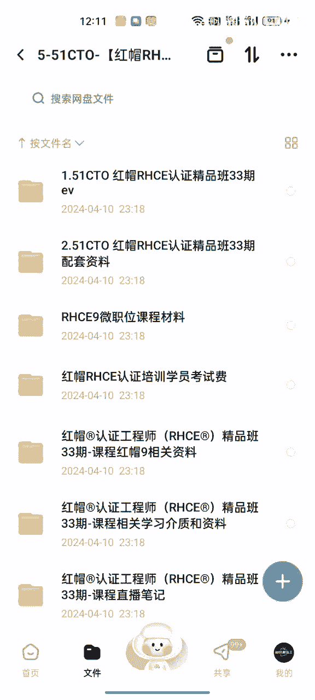
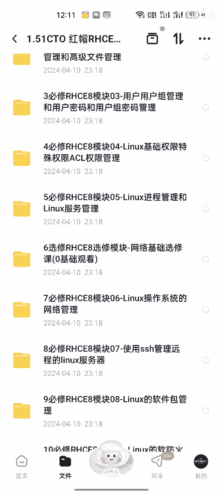
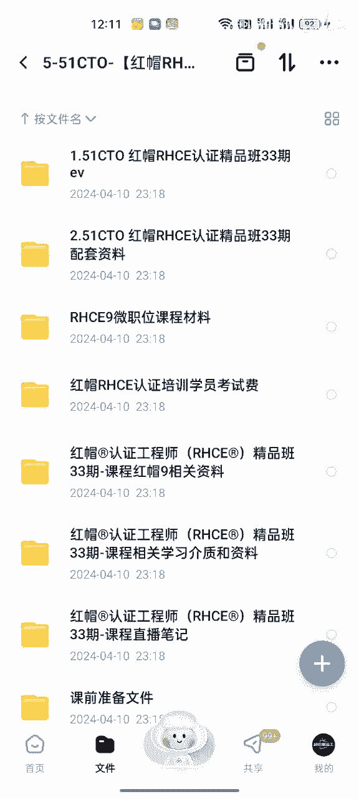
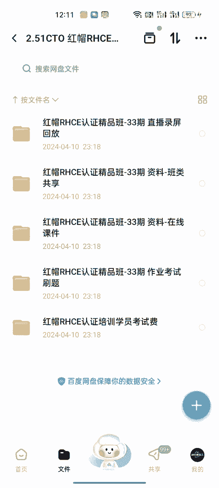
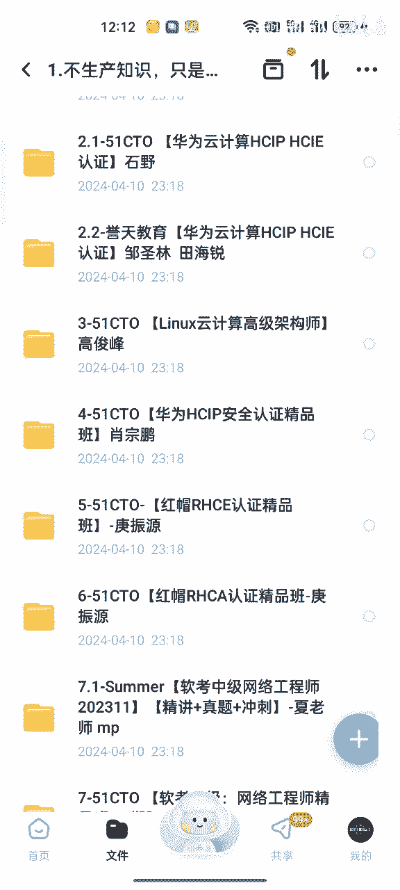
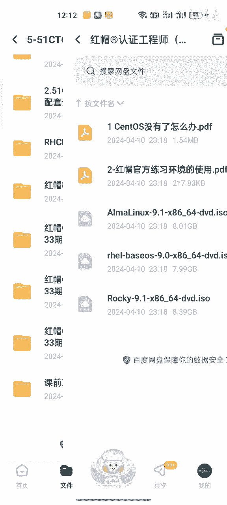
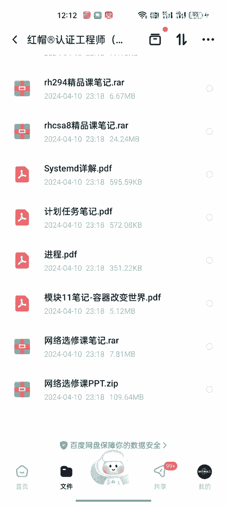
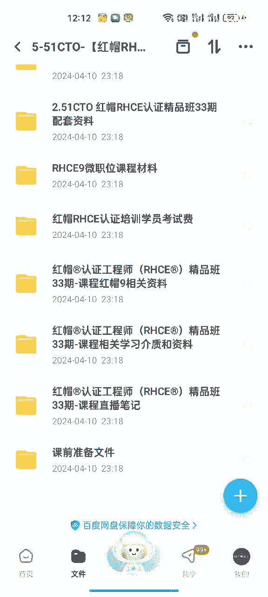

# Linux基础入门：P1：Linux系统安装与初识 🐧

在本节课中，我们将要学习如何安装Linux操作系统，并初步了解其基本概念和界面。这是开启Linux世界大门的第一步。

## 概述



Linux是一种开源、免费的操作系统内核，基于它衍生出了众多发行版，例如Red Hat Enterprise Linux（RHEL）、CentOS、Ubuntu等。学习Linux的第一步通常是安装一个发行版并熟悉其环境。

---



## 安装Linux系统 💻

上一节我们介绍了Linux的基本概念，本节中我们来看看如何安装一个Linux发行版。安装过程通常涉及创建安装介质、启动计算机并进行配置。



以下是安装Linux系统的主要步骤：

1.  **准备安装介质**：下载Linux发行版的ISO镜像文件，并使用工具（如Rufus或`dd`命令）将其写入U盘或光盘，制作成可启动的安装盘。
2.  **启动计算机**：将制作好的安装介质插入计算机，重启并进入BIOS/UEFI设置，将启动顺序调整为优先从该介质启动。
3.  **启动安装程序**：计算机从安装介质启动后，会进入图形化或文本模式的安装向导界面。
4.  **进行安装配置**：按照向导提示，进行语言、时区、键盘布局、磁盘分区、网络、用户账户等设置。
    *   **磁盘分区**是关键步骤，常见的分区方案包括为根目录`/`、`/home`用户目录和交换分区`swap`分配空间。
5.  **开始安装**：确认所有配置无误后，开始安装系统。安装程序会将系统文件复制到硬盘。
6.  **完成安装并重启**：安装完成后，根据提示移除安装介质并重启计算机，即可进入新安装的Linux系统。



---

## 初识Linux界面 🖥️

成功安装系统后，首次启动会看到登录界面。输入安装时设置的用户名和密码即可登录。


Linux系统主要提供两种用户界面：

*   **图形用户界面**：类似于Windows或macOS，提供窗口、图标、菜单等视觉元素，方便用户通过鼠标操作。常见的桌面环境有GNOME、KDE Plasma等。
*   **命令行界面**：也称为终端或Shell，用户通过输入文本命令来与系统交互。这是系统管理和高级操作的核心方式。



对于初学者，可以从图形界面开始熟悉，但逐步学习命令行操作是掌握Linux的必经之路。在终端中，最基本的命令是查看当前目录：
```bash
pwd
```

---



## 核心概念：文件系统与权限 🔐

Linux中一切皆文件，包括硬件设备、目录和普通文件。文件系统采用树形结构，根目录`/`是所有目录的起点。



每个文件和目录都有访问权限，用于控制不同用户能进行的操作。权限分为读、写、执行，并针对文件所有者、所属组和其他用户进行设置。查看文件权限可以使用`ls -l`命令。

权限通常用一串10个字符表示，例如：
```
-rwxr-xr--
```
这表示一个文件，所有者有读、写、执行权限，所属组有读和执行权限，其他用户只有读权限。权限也可以用数字表示，如`755`。



---

## 总结

本节课中我们一起学习了Linux系统的安装流程，初次接触了其图形与命令行界面，并了解了“一切皆文件”和“权限控制”这两个核心概念。安装系统是实践的开始，熟悉界面和基本概念则为后续的命令学习和系统管理打下了基础。接下来，我们将深入探索Linux强大的命令行世界。